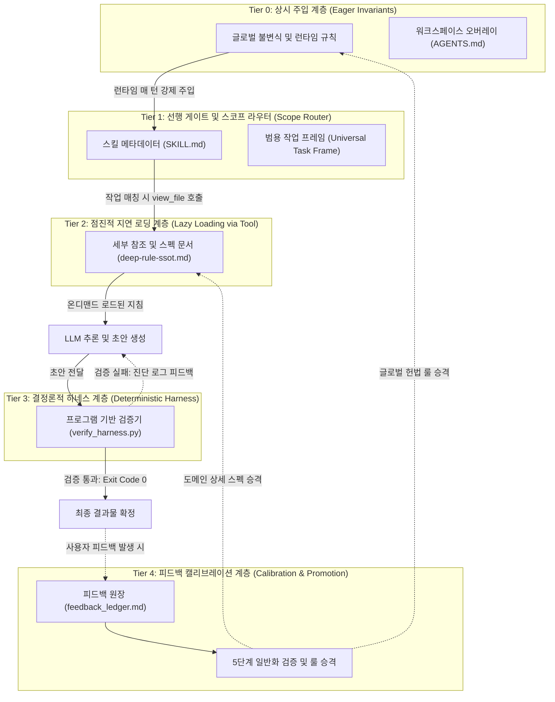
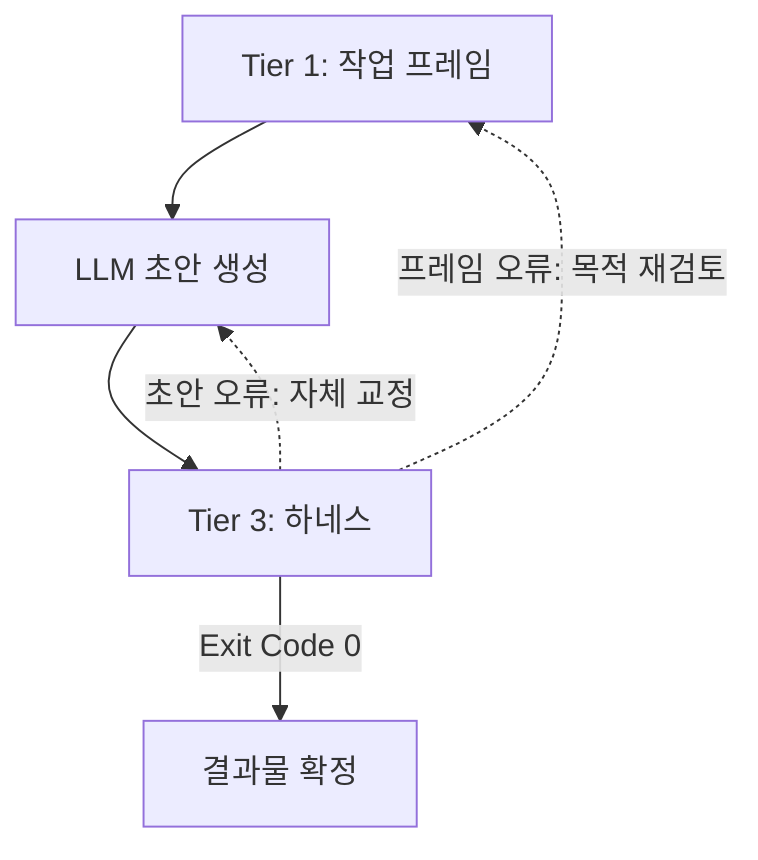

# 범용 에이전트 컨텍스트 & 점진적 로딩(Lazy Loading) 아키텍처

> **문서 목적**: 특정 서비스나 도메인 종속성을 완전히 배제하고, AI 에이전트 환경에서 **프롬프트 비대화(Prompt Bloat)와 비결정적 환각을 방지하며, 컴팩션(Compaction) 시에도 규칙을 100% 보존하는 컨텍스트 관리 및 점진적 로딩 아키텍처의 순수 뼈대**를 정의한다.

---

## 1. 해결하고자 하는 핵심 문제 (Problem Definition)

대규모 룰셋, 도메인 가이드라인, 코딩 지침을 에이전트에게 적용할 때 다음 4가지 실패가 발생한다:

1. **프롬프트 비대화 (Prompt Bloat)**: 수십 개의 룰 파일과 수천 줄의 분류표를 첫 턴부터 시스템 프롬프트에 전부 넣으면 컨텍스트 윈도우 비용과 지연 시간이 급증함.
2. **주의력 분산 (Attention Dilution / Lost in the Middle)**: 프롬프트가 과도하게 길어지면 LLM이 사용자의 현재 지시사항과 핵심 불변식을 망각함.
3. **비결정적 로딩 (Non-deterministic Loading)**: 파일 도구(`view_file`) 호출을 순수 LLM의 자율에만 맡기면, 필요한 규칙을 읽지 않고 기억(추측)에 의존해 환각을 일으킴.
4. **컴팩션 유실 및 망각 (Compaction Loss & Amnesia)**: 대화가 길어져 컨텍스트 요약(Compaction)이 발생할 때 룰과 지침이 함께 요약·삭제되어, 이후 턴에서 과거 지침을 추측으로 실행함.

---

## 2. 5계층 아키텍처 (The 5-Tier Architecture)

이 아키텍처는 **"상시 주입 불변식 -> 스코프 라우터 -> 점진적 로딩 -> 결정론적 하네스 검증 -> 피드백 캘리브레이션"**의 5단계 파이프라인으로 동작한다.



---

## 3. 계층별 상세 명세

### [Tier 0] 상시 주입 계층 (Eager System Invariants)
* **역할**: 대화 컴팩션(요약)과 무관하게 항상 유지되어야 하는 최상위 불변식.
* **주입 방식**: 런타임 전처리기(Runtime Preprocessor)가 시스템 프롬프트 최상단에 강제 주입 (LLM의 호출 여부와 무관하게 100% 결정적 로드).
* **내용**:
  * **사실 우선 원칙 (Fact > Speculation)**: 공식 문서, 코드, 테스트 결과가 추측보다 항상 우선.
  * **가설 검증 및 실패 복구 루프 (Reasoning & Reality Loop)**.
  * **컴팩션 복원력 (Compaction Resilience)**: 긴 대화로 이전 턴의 세부 규칙이 요약·유실되었을 때 추측하지 않고 도구로 재로드하는 프로토콜.
  * **안전성 및 파괴적 작업 차단 경계**.

### [Tier 1] 선행 게이트 & 스코프 라우터 (Scope Routing & Task Framing)
* **역할**: 작업의 유형과 목적을 판정하여 불필요한 규칙이 활성화되는 것을 방지.
* **Universal Task Frame (범용 작업 프레임 5대 요소)**:
  1. `Task Type`: 신규 생성(Create) | 수정/리팩토링(Modify) | 검수/진단(Audit) | 캘리브레이션(Calibrate)
  2. `Target / Consumer`: 결과물을 소비하는 주체 (컴파일러, 런타임, API 클라이언트, 동료 개발자, 채용관 등)
  3. `Contract & Schema`: 준수해야 하는 형식 (JSON Schema, Markdown Spec, API 인터페이스, 문법 규칙)
  4. `Evidence Boundary`: 추측이 금지된 인정된 사실의 범위 (공식 문서, 소스 코드, 로그, 명시적 요구사항)
  5. `Non-goals & Invariants`: 시스템을 망가뜨리거나 범위를 벗어나는 절대 금지 영역
* **스킬 메타데이터**: 2~3줄의 얇은 설명(Name, Description)만 상시 노출하여 프롬프트 토큰 절약.

### [Tier 2] 점진적 공개 계층 (Progressive Disclosure / Lazy Loading)
* **역할**: 대용량 참조 문서, 상세 룰셋, API 명세, 어휘 사전을 **필요한 순간에만** 워킹 메모리에 로드.
* **온디맨드 도구 호출 프로토콜 (On-demand Tool-calling Protocol)**:
  > *"특정 스킬이나 도메인 작업에 착수할 때, 에이전트는 지침에 명시된 참조 파일(`references/deep-rule-ssot.md`)을 `view_file` 도구로 완전히 읽은 후에만 출력을 생성해야 한다."*
* **효과**: 시스템 프롬프트 오염을 막으면서도, 모델이 자의적 기억 대신 최신 파일 스펙을 직접 읽고 정확하게 추론함.

### [Tier 3] 결정론적 하네스 계층 (Deterministic Verification)
* **역할**: LLM의 주관적 완료 선언("완료되었습니다")을 불신하고, **순수 프로그램 코드로 결과물을 검증**.
* **하네스 유형**:
  * **패턴/정적 검증기**: 금지된 추상 표현, 미완성 플레이스홀더(`TODO`, `FIXME`) 정규식 검사
  * **제약/예산 검증기**: 글자 수, 라인 수, 토큰 상하한 엄격 검사
  * **구조/스키마 검증기**: JSON Schema, Markdown 헤더 구조, AST 문법 검증
* **종결 기준 및 피드백**:
  * 스크립트의 리턴 코드가 `Exit Code 0`일 때만 작업을 종료.
  * 실패 시 단순 중단이 아닌 **위반 라인 번호와 수정 가이드(Actionable Diagnostic Logs)**를 표준 에러로 출력하여 LLM의 Self-Correction 유도.

### [Tier 4] 피드백 캘리브레이션 계층 (Calibration & Promotion Loop)
* **역할**: 사용자 피드백이나 하네스 실패가 발생했을 때 단순 1회성 땜질에 머무르지 않고, **판단 의사결정 프로세스(Decision Layer)를 일반화하여 적절한 계층으로 승격(Promote)**.
* **5단계 일반화 검증 프로세스**:
  1. `Representative Case`: 최초에 실패했던 사례가 해결되는가?
  2. `Near Transfer Case`: 같은 도메인의 유사한 작업에서도 동일하게 유효한가?
  3. `Far Transfer Case`: 다른 도메인/장르에 적용해도 부작용이 없는가?
  4. `Clean Control`: 원래 정상이었던 대조군을 훼손하지 않는가?
  5. `Adversarial Control`: 과적합(과도한 억제/검열)이 발생하지 않는가?
* **승격 규칙 (Promotion Policy)**:
  * **Tier 0 승격**: 도메인 무관 전역 헌법 가치 (예: 사실 우선, 추측 금지, 하네스 필수, 컴팩션 복원)
  * **Tier 2 승격**: 특정 도메인/스킬 내의 세부 설계 규칙, 용어집, 스키마 제약
  * **Tier 3 승격**: 스크립트/AST/정규식으로 기계적 검증이 가능한 불변식

---

## 4. 이식 가능한 최소 파일 구조 (Portable Template File Tree)

```text
my-project/
├── .agents/
│   └── AGENTS.md                  <-- [Tier 0] 워크스페이스 핵심 불변식 및 오버레이
├── skills/
│   └── domain-skill/
│       ├── SKILL.md               <-- [Tier 1] 얇은 진입 메타데이터 & 필수 선행 로드 지시
│       └── references/
│           └── deep-rule-ssot.md  <-- [Tier 2] 필요 시에만 view_file로 읽는 세부 참조 문서
├── scripts/
│   └── verify_harness.py          <-- [Tier 3] 규격/제약/불변식 결정론적 검증기 (Stdin/File 지원)
└── calibration/
    └── feedback_ledger.md         <-- [Tier 4] 피드백 분석 및 룰 승격 원장
```

---

## 5. 템플릿 코드 및 명세 (Copy-Paste Blueprints)

### (1) `AGENTS.md` (Tier 0: 핵심 불변식 템플릿)

```markdown
# AGENTS.md — Universal Execution Invariants

## 1. 사실과 현실 우선 (Reality Over Speculation)
- 공식 문서, 소스 코드, 실행 사실, 테스트 결과가 사용자나 AI의 추측보다 항상 우선한다.
- 불확실하면 먼저 조사하고, 사실로 반박하며, 가정이 틀렸을 때는 즉시 방향을 수정한다.

## 2. 점진적 로딩 프로토콜 (Progressive Disclosure Protocol)
- 방대한 세부 참조 문서는 상시 시스템 프롬프트에 올리지 않는다.
- 작업 대상 도메인이나 스킬이 확정되면, 스킬 지침에 명시된 참조 파일을 도구(`view_file`)로 먼저 읽은 후 실행한다.

## 3. 컴팩션 복원력 (Compaction Resilience)
- 긴 대화로 인해 이전 턴에서 로드했던 세부 스펙이나 룰이 요약·유실되었다고 판단되면, 기억에 의존해 추측하지 말고 도구(`view_file`)로 참조 문서를 재로드한다.

## 4. 결정론적 검증 게이트 (Deterministic Verification Gate)
- AI 자신의 주관적 판단만으로 작업을 완료로 선언하지 않는다.
- 지정된 검증 스크립트(`scripts/verify_harness.py`)를 실행하여 성공(Exit Code 0)할 때만 최종 완료한다.
- 실패 시 하네스가 출력한 진단 로그(위반 라인 및 원인)를 바탕으로 즉시 자체 교정(Self-Correction)한다.
```

### (2) `SKILL.md` (Tier 1: 얇은 진입 프로토콜 템플릿)

```markdown
---
name: domain-processor
description: Process domain-specific tasks according to strict quality, architecture, and schema constraints.
---

# Domain Processor Protocol

When this skill is activated:
1. **Mandatory Load**: You MUST read the detailed specification at `skills/domain-skill/references/deep-rule-ssot.md` using `view_file` BEFORE generating any output or draft.
2. **Formulate Task Frame**: Establish the 5-element Universal Task Frame (Task Type, Target/Consumer, Contract/Schema, Evidence Boundary, Non-goals).
3. **Execute & Draft**: Generate the solution strictly bounded by the admitted facts and loaded specification.
4. **Deterministic Gate**: Run `python3 scripts/verify_harness.py <target_file>` (or stream via stdin) and ensure Exit Code 0.
```

### (3) `scripts/verify_harness.py` (Tier 3: 결정론적 검증기 템플릿)

```python
#!/usr/bin/env python3
"""
Universal Deterministic Quality & Constraint Harness
Returns Exit Code 0 on success, 1 on failure with actionable diagnostic logs.
Supports both file path arguments and standard input streaming.
"""
import sys
import re
from pathlib import Path

def verify_content(content: str, source_name: str = "stream") -> bool:
    errors = []
    lines = content.splitlines()

    # 1. 길이 및 분량 제약 검증
    char_count = len(content)
    if char_count < 100:
        errors.append(f"[LENGTH_ERROR] Content too short ({char_count} chars < minimum 100 chars).")

    # 2. 범용 금지 패턴 및 미해결 플레이스홀더 검증
    banned_patterns = [
        (r"TODO:", "Unresolved TODO placeholder detected"),
        (r"FIXME:", "Unresolved FIXME placeholder detected"),
        (r"<INSERT_.*?_HERE>", "Template placeholder was not replaced"),
    ]
    for line_no, line in enumerate(lines, 1):
        for pattern, reason in banned_patterns:
            if re.search(pattern, line, re.IGNORECASE):
                errors.append(f"[PATTERN_VIOLATION] Line {line_no}: {reason} -> '{line.strip()}'")

    # 3. 구조적 무결성 검증 (헤더 등 필수 마크다운/스키마 구조)
    if not any(line.strip().startswith("#") for line in lines):
        errors.append("[STRUCTURE_ERROR] Missing structured Markdown headers (must start with #).")

    # 결과 판정 및 피드백 출력
    if errors:
        print(f"❌ HARNESS VERIFICATION FAILED for '{source_name}':", file=sys.stderr)
        for err in errors:
            print(f"  - {err}", file=sys.stderr)
        print("\nAction Required: Fix the violations above and re-run verification before finalizing.", file=sys.stderr)
        return False

    print(f"✅ HARNESS PASSED: '{source_name}' ({char_count} chars, {len(lines)} lines) satisfies all invariants.")
    return True

def main():
    if len(sys.argv) > 1:
        target_path = Path(sys.argv[1])
        if not target_path.exists():
            print(f"❌ ERROR: Target file '{target_path}' not found.", file=sys.stderr)
            sys.exit(1)
        content = target_path.read_text(encoding="utf-8")
        success = verify_content(content, str(target_path))
    else:
        if sys.stdin.isatty():
            print("Usage: python3 verify_harness.py <file_path> OR cat <file> | python3 verify_harness.py", file=sys.stderr)
            sys.exit(1)
        content = sys.stdin.read()
        success = verify_content(content, "STDIN")

    sys.exit(0 if success else 1)

if __name__ == "__main__":
    main()
```

### (4) `calibration/feedback_ledger.md` (Tier 4: 피드백 원장 및 승격 정책 템플릿)

```markdown
# Feedback Calibration Ledger & Promotion Policy

## 1. Feedback Entry Schema

- **Date**: YYYY-MM-DD
- **Trigger**: [User Correction | Harness Failure | Regression]
- **Episode**:
  - Rejected: `[실패했던 출력/코드/표현]`
  - Corrected: `[사용자가 수정한 올바른 결과]`
- **Root Cause Layer**: [System Boundary | Spec Misunderstanding | Slot Mismatch | False Assumption]
- **General Principle**: 단순 키워드 밴이 아닌, 의사결정 계층에서 도출된 추상화된 판단 규칙
- **Promotion Target**: [Tier 0 (Global AGENTS.md) | Tier 2 (Skill SSOT) | Tier 3 (Harness Code)]

---

## 2. Promotion Policy (규칙 승격 기준)

1. **Tier 0 (AGENTS.md) 승격**:
   - 도메인과 무관하게 모든 에이전트 작업에 공통 적용되는 헌법적 가치 (예: 사실 우선, 추측 금지, 하네스 필수, 컴팩션 복원)
2. **Tier 2 (references/*.md) 승격**:
   - 특정 도메인/스킬 내에서만 유효한 상세 아키텍처 규칙, 용어집, 스키마 제약
3. **Tier 3 (scripts/verify_*.py) 승격**:
   - 정규식, AST 분석, 린터, 단위 테스트 등으로 기계적 검증이 가능한 불변식
```

---

## 6. 멀티 런타임 연결 및 이식 가이드

각 AI 도구 환경에서 Tier 0 최상위 룰을 인식시키는 방법:

| AI 런타임 | 글로벌 SSOT 연결 방식 | 워크스페이스 로컬 오버레이 |
| :--- | :--- | :--- |
| **Codex** | `~/.codex/AGENTS.md` -> 글로벌 `AGENTS.md` 심링크 | 프로젝트 루트의 `AGENTS.md` 자동 로드 |
| **Claude Code** | `~/.claude/CLAUDE.md` 내에 `@/path/to/global/AGENTS.md` 선언 | 프로젝트 루트의 `CLAUDE.md` 자동 로드 |
| **Gemini / Antigravity** | `~/.gemini/GEMINI.md` 내에 `@/path/to/global/AGENTS.md` 선언 | `<RULE[workspace/AGENTS.md]>` 자동 주입 |

---

## 7. 동작 테스트 절차

1. 새 저장소에 위 **최소 파일 구조(5개 파일)**를 생성합니다.
2. 최상위 `AGENTS.md`에 **핵심 불변식**을 배치합니다.
3. 세부 지침 문서를 `references/deep-rule-ssot.md`에 배치하고, `SKILL.md`에 **선행 읽기 강제 조항**을 작성합니다.
4. 에이전트에게 작업을 요청하면:
   - 프롬프트 낭비 없이 스킬 메타데이터만 인식하고 있다가,
   - 작업 시작 시 `view_file`로 세부 문서를 정확히 로드한 뒤,
   - 결과물 작성 후 `verify_harness.py`를 실행하여 통과 여부를 검증하고, 실패 시 진단 로그를 바탕으로 자체 교정하는 완전한 라이프사이클이 작동합니다.

---

## 8. 비판적 검토와 반박 (Adversarial Review)

> **이 절의 역할**: 1절부터 7절까지의 설계를 그대로 두고, 그 설계가 **어떤 조건에서 깨지는지**를 따로 닫는다. 앞 절들이 "무엇을 만들 것인가"라면 이 절은 "그것이 언제 틀리고, 틀렸는지 어떻게 확인하는가"다. 판정 근거는 공개 1차 자료와 각 계층의 내부 정합성으로 한정하며, 사실과 추론과 미확인을 섞지 않는다.

검토 결과를 먼저 적는다. 5계층의 **분리 자체는 타당하다**. 상시 불변식, 스코프 라우팅, 지연 로딩, 결정론적 검증, 승격을 서로 다른 층으로 둔 것은 각 층의 실패 모드가 서로 다르기 때문이고, 이 분리는 유지할 값이 있다. 그러나 아래 셋이 현재 형태로는 성립하지 않는다.

1. 문제 정의 2번이 Tier 1과 Tier 2 전체를 지탱하는데, 그 인과가 공개 실험에서 검출되지 않았다.
2. 문제 정의 3번을 처방이 스스로 어긴다. Tier 0의 컴팩션 복원력과 Tier 2의 선행 로드가 모두 LLM 자율 판단에 의존한다.
3. Tier 0이 현재 런타임에 존재를 확인할 수 없는 주입 방식을 전제한다.

| 문제 정의 | 닫는다고 선언된 층 | 판정 | 상세 |
| :--- | :--- | :--- | :--- |
| 1. 프롬프트 비대화 | Tier 1, Tier 2 | 성립. 단 Tier 4가 되먹임으로 다시 키운다 | 8.5 |
| 2. 주의력 분산 | Tier 1, Tier 2 | **인과 미지지** | 8.1 |
| 3. 비결정적 로딩 | Tier 0 §3, Tier 2 프로토콜 | **처방이 같은 비결정성에 의존** | 8.2 |
| 4. 컴팩션 유실 | Tier 0 | **전제한 주입 방식이 미확인** | 8.3 |

---

### 8.1 전제 반박: 지연 로딩은 비용을 낮추지만 준수는 낮춘다

문제 정의 2번(주의력 분산)은 "프롬프트가 길어지면 지침 준수가 떨어진다"는 인과를 주장하고, 그 인과가 Tier 1의 얇은 메타데이터와 Tier 2의 지연 로딩을 정당화한다. 이 인과가 이 아키텍처의 하중을 가장 많이 지탱하는 문장이다.

**사실.** 코딩 에이전트 설정 파일의 지시 준수를 요인 설계로 측정한 연구가 있다(Damon McMillan, *Instruction Adherence in Coding Agent Configuration Files: A Factorial Study of Four File-Structure Variables*, arXiv:2605.10039). 2개 코드베이스와 3개 프런티어 모델에서 1,650개 세션을 돌려 네 가지 구조 변수(파일 크기, 지시 위치, 파일 구성, 인접 파일의 모순)와 2원 상호작용 셋을 조작했다. 결과는 "다중 검정 보정 후 검출 가능한 대비를 내는 변수가 없다"였다. 같은 연구에서 실제로 검출된 효과는 다른 축이었다. 세션 내 준수 하락이며, **에이전트가 함수를 하나 더 생성할 때마다 준수 확률(odds)이 약 5.6% 낮아진다.**

**해석의 경계.** 이것은 귀무 결과이므로 "파일 구조가 준수에 영향을 주지 않는다"를 증명하지 않는다. 증명한 것은 "그 실험의 검정력으로는 영향을 검출하지 못했다"까지다. 그러나 하중을 지탱하는 주장의 방향이 뒤집히기에는 충분하다. **"파일을 얇게 만들면 준수가 올라간다"를 근거 있는 사실로 쓸 수 없다.**

**그래서 무엇이 달라지는가.** Tier 2의 정당화가 준수에서 **비용 하나로** 좁아진다. 그리고 근거가 비용이면 무엇을 내릴지가 달라진다.

* 비용 근거가 지지하는 것: 자주 참조하지 않는 **자료**를 내린다. 용어집, API 명세, 예문 코퍼스, 분류표처럼 필요할 때 찾아 읽는 참조물이다.
* 비용 근거가 지지하지 않는 것: **판정 규칙**을 내린다. 규칙을 Tier 2로 내리면 그 규칙이 적용될지가 에이전트의 도구 호출 판단에 종속되고, 그 판단의 비결정성은 이 문서가 문제 정의 3번으로 직접 적어 놓은 실패다.

즉 현재 Tier 2의 정의("대용량 참조 문서, **상세 룰셋**, API 명세, 어휘 사전")는 그 선을 넘는다. 룰셋과 참조 자료를 한 층에 묶으면, 비용을 아끼려는 결정이 준수를 확률적으로 만드는 결정과 같은 동작으로 실행된다.

**수정 제안.** Tier 2의 분할 기준을 "크기"에서 **"판정 소유 여부"**로 바꾼다.

* Tier 2에 내려도 되는 것: 그것을 읽지 않았을 때 산출물이 **Tier 3에서 빨강이 되는** 자료. 읽지 않으면 실패하므로 로딩의 확률성이 결과에 흡수된다.
* Tier 0에 남겨야 하는 것: 그것을 읽지 않았을 때 산출물이 **초록으로 통과하는** 규칙. 이런 규칙은 지연 로딩하면 위반이 관측되지 않는다.

**검증 경로.**

* 무엇을 하는가: 같은 룰셋을 (A) Tier 0 상시 주입, (B) Tier 2 지연 로딩 두 형태로 두고, 동일한 작업 집합을 각각 N회 실행해 규칙 위반율을 센다.
* PASS: B의 위반율이 A와 통계적으로 구별되지 않는다. 이때만 그 룰셋은 Tier 2로 내려도 안전하다.
* FAIL: B의 위반율이 유의하게 높다. 이때 그 룰셋은 Tier 0 또는 Tier 3가 소유해야 한다.

---

### 8.2 자기모순: 문제 3번의 처방이 다시 LLM 자율 판단이다

문서는 "파일 도구 호출을 순수 LLM의 자율에만 맡기면, 필요한 규칙을 읽지 않고 기억에 의존해 환각을 일으킨다"를 4대 실패의 하나로 명시한다. 그런데 그 실패를 막는다고 배치된 두 처방이 모두 같은 자율 판단 위에 서 있다.

* Tier 0 §3(컴팩션 복원력): "유실되었다고 **판단되면** 도구로 재로드한다." 유실 판단의 주체가 LLM이다. 무엇이 사라졌는지 모르는 상태에서 사라졌음을 알아내라는 요구이며, 이것은 결정적 절차가 아니다.
* Tier 2 프로토콜과 `SKILL.md`의 "You MUST read ... BEFORE generating any output": 산문 지시이고, 읽었는지 확인하는 장치가 없다.

여기에 Tier 0 §3은 **자기참조**라는 문제가 더 붙는다. 재로드를 명령하는 그 규칙 자체가 요약 대상이 되는 대화 컨텍스트 안에 있다. 규칙이 사라지면 규칙을 다시 불러올 근거도 함께 사라진다.

**일반 원리.** 지시문의 강도를 올리는 것은 확인 장치의 대체재가 아니다. `MUST`, `절대`, 대문자, 굵은 글씨는 준수 확률을 조정할 수는 있어도 준수를 보장하는 기계장치가 아니다. 어떤 관찰로도 위반이 드러나지 않는 규칙은 검사가 없어서 약한 것이 아니라, **위반이 관측 불가능하기 때문에** 약하다.

**고치는 방향은 하나다. 읽었는지를 검사하지 말고 산출물을 검사한다.** 이 방향으로 보면 Tier 2의 `MUST`가 두 경우로 갈리고 둘 다 불필요하거나 무력하다.

1. 그 스펙 위반을 Tier 3가 판정할 수 있는 경우: `MUST`는 중복이다. 읽지 않으면 하네스가 빨강을 낸다.
2. Tier 3가 판정할 수 없는 경우: `MUST`는 무력하다. 읽지 않아도 아무 일이 없다.

**수정 제안.** `SKILL.md`의 1번 항목을 "읽으라는 명령"에서 "읽지 않으면 실패하는 구조"로 바꾼다. 강한 것부터 적는다.

* (강함) 참조 문서에만 존재하는 제약을 Tier 3 하네스가 직접 검사한다. 스펙과 검사기를 같은 변경에서 함께 바꾸어, 스펙을 읽지 않은 산출물이 반드시 빨강이 되게 한다.
* (보조) 산출물 메타에 참조 문서의 버전 또는 내용 해시를 적게 하고, 하네스가 그 값을 실제 파일과 대조한다. 다만 **이것은 완전하지 않다.** 파일을 열어 해시만 계산해 적고 본문을 읽지 않는 우회가 가능하므로, 단독으로 쓰면 통과 전용 절차가 된다.
* (금지) 읽었다는 자기 보고를 근거로 쓰는 것. "참조 문서를 확인했습니다"라는 문장은 검증 가능한 관찰이 아니다.

**Tier 0 §3의 대체 문안.** 유실 판단을 LLM에 맡기지 않으려면, 판단 대신 **무조건 재로드가 발생하는 지점**을 정해야 한다.

```markdown
## 3. 컴팩션 복원력 (Compaction Resilience)
- 컨텍스트 유실 여부를 스스로 판단하지 않는다. 판단이 필요한 시점에는 이미 판단 근거가 사라져 있을 수 있다.
- 대신 정해진 지점에서 무조건 재로드한다: (1) 스킬 진입 시, (2) 하네스가 실패한 직후, (3) 작업 프레임을 개정할 때.
- 기억에 남아 있다고 느껴지는 경우에도 재로드한다. 재로드 비용은 도구 호출 1회이고, 추측 비용은 잘못된 산출물 전체다.
```

**검증 경로.**

* 무엇을 하는가: 참조 문서에만 있는 제약을 하나 심고(예: 특정 필드의 허용값 집합), 그 제약을 어긴 산출물을 하네스에 넣는다.
* PASS: 하네스가 위반 라인을 지목하며 실패한다.
* FAIL: 하네스가 통과시킨다. 이때 그 제약은 Tier 2에 두면 안 되는 규칙이다(8.1의 분할 기준).

---

### 8.3 Tier 0은 존재를 확인할 수 없는 주입 방식을 전제한다

Tier 0의 주입 방식은 "런타임 전처리기가 시스템 프롬프트 최상단에 강제 주입"이고, 2절 다이어그램의 엣지 라벨은 "런타임 **매 턴** 강제 주입"이다.

**사실.** 6절 표가 그 주입의 실체를 밝히는데, 심링크와 `@` 선언이다. 이 둘은 **세션 시작 시점의 컨텍스트 조립** 방식이다. 파일 내용이 세션이 열릴 때 한 번 컨텍스트에 들어간다.

**미확인.** 각 런타임이 컴팩션 이후 설정 파일을 다시 주입하는지는 공개된 계약이 아니다. 그래서 "재주입된다"도 "재주입되지 않는다"도 사실로 적을 수 없다.

**그래서 무엇이 문제인가.** Tier 0의 존재 이유가 컴팩션 복원력인데, 그 복원력이 미확인 동작에 걸려 있다. 재주입이 없으면 Tier 0도 요약 대상이 되고, 그때 남는 유일한 방어가 8.2에서 본 자기참조 조항이다. 즉 **아키텍처의 최상위 층이 자신이 검증하지 않은 런타임 구현 세부에 의존한다.**

**설계 원칙으로서의 처방.** 재주입 여부를 확인할 수 없다면, 아키텍처는 **재주입에 의존하지 않는 형태**로 써야 한다. 이것은 사실 주장이 아니라 불확실성 아래의 설계 선택이다.

* Tier 0의 문구를 정정한다: "매 턴 강제 주입"이 아니라 "세션 시작 시 결정적 로드". 다이어그램 엣지 라벨도 같이 고친다.
* 컴팩션 이후의 복원은 Tier 0이 아니라 **Tier 3 도구 출력**이 소유한다. 도구 출력은 호출마다 새로 생성되므로 요약을 타지 않는다. 이것이 현재 런타임에서 확인 가능한 유일한 매 턴 재제시 경로다.
* 구체적으로: 하네스가 검사 결과만 내지 않고, **출력 마지막에 현재 작업 프레임과 핵심 불변식 요약을 다시 찍는다.** 위치를 마지막으로 두는 이유는 8.4에서 잇는다.

**검증 경로.**

* 무엇을 하는가: Tier 0에 고유 토큰을 하나 심는다(예: `TIER0_CANARY_7F3A`). 세션 초반과 긴 대화 이후 각각 그 토큰을 그대로 복창하게 한다.
* PASS: 두 시점 모두 정확히 복창한다.
* FAIL: 후반에 복창하지 못하거나 다른 값을 만들어 낸다. 이때 그 런타임은 Tier 0을 유지하지 못하며, 불변식을 도구 출력으로 옮겨야 한다.

이 canary는 아키텍처가 실제로 배선됐는지를 재는 최소 장치이기도 하다. 문서가 옳게 쓰였는지와 파일이 실제로 컨텍스트에 붙었는지는 다른 문제이며, 후자는 관찰로만 확인된다.

---

### 8.4 자체 교정 루프에 목적으로 돌아가는 경로가 없다

2절 다이어그램에는 `H -.-> LLM`(검증 실패 시 초안 자체 교정)이 있고, `H -.-> TF`(검증 실패 시 작업 프레임 재검토)는 없다.

**그래서 무엇이 일어나는가.** 하네스 실패는 두 원인에서 나온다. 초안이 틀렸거나, **작업 프레임이 틀렸거나**다. 현재 루프는 전자만 표현한다. 후자의 경우 에이전트는 잘못된 프레임 아래에서 초안만 계속 고치고, 하네스 통과가 목표 함수가 된다. 결과물은 초록이지만 원래 요구를 달성하지 않는다.

이것은 이 문서가 Tier 3를 둔 이유("LLM의 주관적 완료 선언을 불신")를 정확히 뒤집는다. 불신의 대상이 완료 선언에서 하네스 초록으로 옮겨질 뿐이고, 대리 지표를 강하게 최적화하면 실제 목표와 벌어진다.

**인접 근거.** 사용자 의도가 대화 중에 변할 때의 성능 저하를 측정한 연구가 있다(Jihoon Tack, Philippe Laban, Jennifer Neville, *LLMs Get Lost in Evolving User Intent*, arXiv:2607.20734). 정적 단일 턴 과제를 다중 턴으로 역합성하되 원 벤치마크의 채점기를 보존해 만든 실험이며, 의도 전이를 세 종류로 나눈다.

1. `argument reveal`: 조건이 추가로 드러남
2. `argument revision`: 기존 조건이 수정됨
3. `function switch`: 작업 자체가 교체됨

논문은 셋 중 **`function switch`가 가장 급한 성능 하락을 낸다**고 보고한다(Figure 4, 5.2절). 완화책으로 시험한 두 조건은 `prompt recap`(매 턴 앞부분을 다시 확인하라는 지시)과 `oracle recap`(현재 유효한 의도를 시스템이 다시 명시)이며, 둘 다 개선하지만 단일 턴 정확도에는 도달하지 못한다(Figure 6). 논문이 밝힌 한계는 합성 궤적이라는 점, 한 사용자 턴에 전이가 하나라고 가정한 점, 채점기가 최종 턴에서만 정확하다는 점이다.

**이 아키텍처에 대한 함의.** `prompt recap`(지시)보다 `oracle recap`(시스템이 현재 의도를 다시 명시)이 더 효과적이었다는 결과는 8.2의 결론과 같은 방향이다. 그리고 하네스 실패는 종종 프레임 오류의 신호인데, 프레임 오류를 초안 오류로만 해석하는 루프는 `function switch`가 필요한 상황을 인식하지 못한다.

**수정 제안.**

* 다이어그램에 `H -.-> TF` 엣지를 추가한다. 검증 실패가 초안 교정과 프레임 재검토 두 갈래로 갈리게 한다.
* 하네스 출력의 **마지막**에 현재 작업 프레임 5요소와 남은 완료 조건을 다시 찍는다. 위치를 마지막으로 두는 근거는 두 가지다. 하네스의 진단 로그가 길게 흐른 뒤 마지막으로 읽은 것이 다음 행동의 입력이 되고, 실패 목록만 남으면 그 목록을 지우는 것이 목표가 된다.
* 실패 경로에서도 그 블록을 찍는다. 실패했을 때 목적이 보이지 않으면 그때가 정확히 프레임 재검토가 필요한 시점이다.



**검증 경로.**

* 무엇을 하는가: 작업 프레임의 Non-goal을 침범하는 요청을 주고 하네스를 실패시킨다.
* PASS: 에이전트가 프레임의 Non-goal을 근거로 요청 범위를 되묻거나 프레임 개정을 제안한다.
* FAIL: 에이전트가 Non-goal을 그대로 두고 초안만 고쳐 하네스를 통과시킨다.

---

### 8.5 Tier 4는 단조 증가하며 문제 1번을 되먹인다

Tier 4는 승격 규칙을 셋 정의한다(Tier 0, Tier 2, Tier 3). **퇴출 규칙은 없다.**

**그래서 무엇이 일어나는가.** Tier 0은 상시 주입 층이다. 승격만 있고 퇴출이 없으면 Tier 0은 단조 증가하고, 문제 정의 1번(프롬프트 비대화)이 재발한다. **Tier 4가 Tier 1과 Tier 2가 해결하려는 문제를 먹인다.** 루프가 닫혀 있지 않다.

같은 문제가 Tier 3에도 적용된다. 검사가 계속 늘면 오탐도 함께 늘고, 오탐이 쌓인 하네스는 신뢰를 잃어 실행되지 않는다. 실행되지 않는 하네스는 없는 것보다 나쁘다. 있다는 사실이 검증됐다는 착각을 주기 때문이다.

`calibration/feedback_ledger.md`가 단일 append 파일인 것도 같은 방향의 결함이다. 항목은 계속 쌓이는데 그 파일을 다시 읽는 트리거가 정의되어 있지 않다. 기록의 목적이 재발 방지라면, 쓰이는 시점과 **읽히는 시점**이 함께 정의되어야 한다.

**수정 제안.**

* **퇴출 기준을 승격 기준과 대칭으로 둔다.** 진입에 5단계 일반화 시험을 요구했으므로, 퇴출에도 관측 기준을 둔다. 정당 사례를 막았다고 관측된 검사, 발화해도 설계나 범위나 완료 판단을 바꾸지 않았다고 관측된 검사는 강등 또는 삭제 후보로 다룬다. 별도의 계측 원장을 새로 만들지 않고 기존 실행 출력과 기록에 남은 근거로 판정한다.
* **Tier 0에 예산을 둔다.** 줄 수 또는 토큰 상한을 정하고, 예산이 찬 뒤의 승격은 기존 항목의 **교체**로만 가능하게 한다. 예산이 없으면 "이 규칙도 중요하다"는 논거가 항상 이기고 Tier 0은 무한히 자란다.
* **원장을 작업 단위로 분할하고 읽히는 트리거를 정의한다.** 단일 파일 대신 작업별 기록을 두고, 승격 심사와 작업 착수 시점에 그 기록을 읽는 것을 절차에 넣는다.

**8.1과의 정합.** 8.1은 "파일을 줄여도 준수는 오르지 않는다"였고 여기서는 "Tier 0에 예산을 두라"고 한다. 두 문장은 충돌하지 않는다. Tier 0 예산의 근거는 **준수가 아니라 비용과 승격 규율**이다. 예산의 목적은 준수율을 올리는 것이 아니라, 무엇을 뺄지 결정하지 않고 계속 더하는 것을 막는 것이다.

**검증 경로.**

* 무엇을 하는가: 원장에서 임의의 승격 항목 하나를 골라, 그 항목이 지금 발화하는지와 최근 어떤 결정을 바꿨는지 추적한다.
* PASS: 발화 사례와 그것이 바꾼 결정을 댈 수 있다.
* FAIL: 둘 다 댈 수 없다. 이때 그 항목은 퇴출 후보다.

---

### 8.6 예시 하네스가 재현하는 결함 넷

5절 (3)의 `verify_harness.py`는 템플릿이지만, 세 검사가 모두 Tier 3의 목적을 뒤집는 형태다.

**1. 자기 지시 위반: `TODO:` 정규식이 자기 금지 규칙을 설명하는 문서를 실패시킨다.**

`re.search(r"TODO:", line, re.IGNORECASE)`는 파일 전체 줄에 돈다. 따라서 "미해결 `TODO:` 표시를 남기지 말라"는 규칙을 설명하는 문서와 그 검사기의 주석 자체가 이 검사에 걸린다. 일반 원리로 적으면 이렇다. **소스 텍스트 검사는 그 파일이 무엇을 하는지가 아니라 무엇을 말하는지를 본다.** 금지의 이유를 코드나 문서 옆에 적을 수 없게 만드는 검사는 검사가 아니라 함정이며, 실제로 이런 검사는 정당한 변경을 막아 전달을 중단시킨다.

고치는 방향은 판정 대상을 낱말에서 **동작이나 구조**로 좁히는 것이다.

* 코드: 낱말 대신 AST로 판정한다. 본문이 비었거나 `pass`/`NotImplementedError`만 있는 함수, 도달 불가 분기 같은 구조를 본다.
* 문서: 코드 펜스와 인용 블록을 제외한 본문에서만 판정하고, 산문에 자연스럽게 나타나지 않는 형태로 마커를 좁힌다.

**2. 대리 지표의 하드 판정: `char_count < 100`.**

분량은 완성도의 대리 지표다. 정당하게 짧은 산출물(짧은 스키마, 한 줄 설정, 간결한 정답)이 실패하고, 반대로 100자를 채운 빈 문장은 통과한다. 대리 지표를 하드 판정으로 만들면 **그 지표가 새 목표가 된다.** 분량 제약이 진짜 계약인 경우(출력 포맷 상한 등)에만 두고, 그때는 상한과 하한의 근거를 함께 적는다.

**3. 범용성 주장과 구현의 불일치: 마크다운 헤더 필수 검사.**

`not any(line.strip().startswith("#"))`는 JSON, YAML, 소스 코드, 평문 산출물을 즉시 실패시킨다. "Universal"을 자칭하는 하네스가 특정 출력 형식을 전제한다. 형식 검사는 산출물 종류를 먼저 분기한 뒤에 적용해야 한다.

**4. 종합: 셋 다 표면이며 통과 방법이 원래 작업과 무관하다.**

100자를 넘기고 `#` 하나를 넣고 `TODO:`를 지우면 통과한다. 즉 **이 하네스는 파일이 완성돼 보이는지를 검사하고, 요구를 달성했는지는 검사하지 않는다.** Tier 3의 선언된 목적("주관적 완료 선언을 불신하고 프로그램으로 검증")과 구현이 어긋난다.

**검사를 추가하기 전의 판정 질문.** 아래 하나를 통과하지 못하는 검사는 표면 검사다.

> **이 검사를 통과시키는 가장 싼 방법이 원래 하려던 작업인가?**
>
> 가장 싼 방법이 표식 추가, 문구 삽입, 분량 채우기라면 그 검사는 별도의 일을 만들고 그 일이 본 작업 시간을 가져간다.

**실패 메시지에 대한 보강.** 문서가 요구한 `actionable diagnostic logs`는 옳은 방향이지만 한 가지가 빠졌다. 메시지에 규칙 ID와 위반 위치만 담으면, 작업자는 규칙을 이해하지 않고 게이트를 만족시키는 최소 변경을 찾는다. 메시지는 셋을 함께 담는다.

1. 무엇을 어겼는가
2. **왜 그 규칙이 있는가**
3. 무엇을 하면 되는가

작업자가 그 규칙에 대해 읽는 것이 실패 메시지 한 줄뿐인 경우가 많으므로, 그 한 줄이 규칙의 목적을 전달해야 한다.

**검증 경로.**

* 무엇을 하는가: 검사마다 **정당 사례와 위반 사례 회귀를 짝으로** 만든다.
* PASS: 정당 사례가 통과하고 위반 사례가 실패한다.
* FAIL: 한쪽만 있으면 false-green 또는 false-red를 막지 못한다. 특히 "그 검사를 설명하는 문서"를 정당 사례에 반드시 포함한다. 1번 결함이 이 회귀로 잡힌다.

---

### 8.7 `@import` 전파에는 확인해야 할 깊이 상한이 있다

6절 표는 `~/.claude/CLAUDE.md`나 `~/.gemini/GEMINI.md` 안에서 `@` 선언으로 전역 파일을 잇는 방식을 제시한다. 이 방식에는 표에 없는 제약이 있다.

**사실.** `@` 선언으로 다른 파일을 잇는 방식에는 유한한 전파 깊이 상한이 있고, 상한을 넘은 파일은 **경고 없이** 컨텍스트에 붙지 않는다. 파일이 실재하고 선언이 문법적으로 옳아도 조용히 사라진다.

**미확인.** 정확한 상한 값과 런타임별 차이는 버전에 따라 변할 수 있으므로 이 문서에 상수로 박지 않는다.

**그래서 무엇이 문제인가.** 조직이 진입 파일을 여러 겹 감싸면(전사 -> 부문 -> 팀 -> 프로젝트) Tier 0이 상한을 넘어 사라지는데, 그 사실을 알려 주는 신호가 없다. 아키텍처가 설계대로 배선됐다고 믿는 상태에서 최상위 불변식만 빠진 채로 동작한다.

**수정 제안.** 6절 표에 "전파 깊이에 상한이 있고 초과는 무음으로 실패한다"를 명시하고, 배선을 문서가 아니라 관찰로 확인한다. 확인 장치는 8.3의 canary와 같다. 배선 검사를 매 실행에 넣을 수 있으면 현재 도달 깊이와 남은 여유를 함께 출력한다.

---

### 8.8 그대로 채택할 만한 것

반박만 적으면 이 검토가 문서를 기각한 것으로 읽힌다. 반대로 아래 셋은 이 아키텍처가 잘 잡은 부분이며, 다른 설계에 옮겨 쓸 값이 있다.

**1. Tier 4의 5단계 일반화 시험.**

규칙 승격 심사에서 흔히 `Representative Case`만 본다. 그러면 최초 실패 사례에 과적합한 규칙이 승격되고, 그 규칙이 다른 맥락에서 오탐을 낸다. 다섯 중 특히 두 개가 자주 빠진다.

* `Near Transfer` / `Far Transfer`: 같은 도메인의 유사 작업과 다른 도메인에서도 유효한지. 한 환경에서만 검증한 규칙이 다른 환경에서 하드 실패하는 사고가 이 시험 부재에서 나온다.
* `Adversarial Control`: 과적합, 즉 과도한 억제가 생기지 않는지. 승격된 규칙이 정당한 표현까지 막기 시작하는 것을 진입 단계에서 잡는다.

**2. `Universal Task Frame`의 `Evidence Boundary`.**

작업 프레임 5요소 중 넷(Task Type, Target/Consumer, Contract/Schema, Non-goals)은 대부분의 작업 기록 양식이 이미 갖는다. `Evidence Boundary`는 그렇지 않다. 작업을 **시작하는 시점에** 무엇을 인정 근거로 쓰고 무엇을 추측으로 볼지 선언하는 필드다.

사후에 근거를 적는 것과 사전에 근거 범위를 선언하는 것의 차이는 이렇다. 사후 기록은 이미 쓰인 근거를 정리하고, 사전 선언은 **부적격 근거가 들어오는 것을 막는다.** 예를 들어 "측정값은 실측만 인정하고 어림 계산은 근거로 쓰지 않는다"를 시작에 선언하면, 편리한 어림값이 결론의 근거 자리에 들어가는 것을 그 시점에 차단한다. (추론: 이 필드의 효과를 통제된 실험으로 확인한 것은 아니며, 사전 선언이 사후 기록보다 강하다는 판단은 근거 순서에 대한 설계 논거다.)

**3. 진단 로그를 통한 자체 교정 루프.**

하네스가 단순 중단이 아니라 위반 위치와 수정 방향을 표준 에러로 내보내 자체 교정을 유도하는 구조는 옳다. 8.6의 보강(왜 그 규칙이 있는지를 함께 담기)과 8.4의 보강(마지막에 목적을 다시 찍기)을 얹으면 그대로 쓸 수 있다.

---

### 8.9 수정된 계층 계약 요약

| 계층 | 원래 문서 | 이 검토의 수정 |
| :--- | :--- | :--- |
| Tier 0 | 런타임이 매 턴 강제 주입, 컴팩션과 무관하게 유지 | 세션 시작 시 결정적 로드. 컴팩션 이후 복원은 Tier 3 출력이 소유. 배선은 canary로 관찰 확인. 항목 수에 예산 |
| Tier 1 | 프롬프트 토큰 절약을 위해 얇은 메타데이터 | 유지. 단 정당화 근거는 준수가 아니라 비용. `Evidence Boundary`를 프레임 필수 요소로 |
| Tier 2 | 대용량 참조 문서와 상세 룰셋을 지연 로딩 | 분할 기준을 크기에서 판정 소유 여부로. 읽지 않으면 Tier 3가 빨강을 내는 자료만 내린다. 룰셋은 내리지 않는다 |
| Tier 3 | Exit Code 0으로 종결 | 유지. 검사 대상을 낱말이 아니라 동작/구조로. 검사마다 정당/위반 회귀 한 쌍. 출력 마지막에 작업 프레임 재제시. 실패 경로에서도 재제시 |
| Tier 4 | 승격 규칙 셋 | 퇴출 규칙을 대칭으로 추가. 원장을 작업 단위로 분할하고 읽히는 트리거 정의. 5단계 일반화 시험은 그대로 유지 |

**이 검토가 틀릴 수 있는 지점.** 8.1의 근거는 귀무 결과이므로, 더 큰 검정력의 후속 실험이 파일 구조의 효과를 검출하면 Tier 2의 원래 정당화가 되살아난다. 8.3과 8.7의 런타임 동작은 버전에 따라 바뀔 수 있으므로, 상수로 기억하지 말고 canary로 매번 관찰한다. 8.4의 인접 근거는 합성 궤적 기반이고 채점기가 최종 턴에서만 정확하므로, 실제 장기 세션의 저하폭을 그 숫자로 예측하지 않는다.
