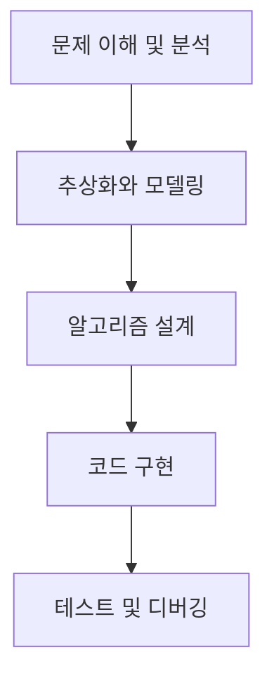
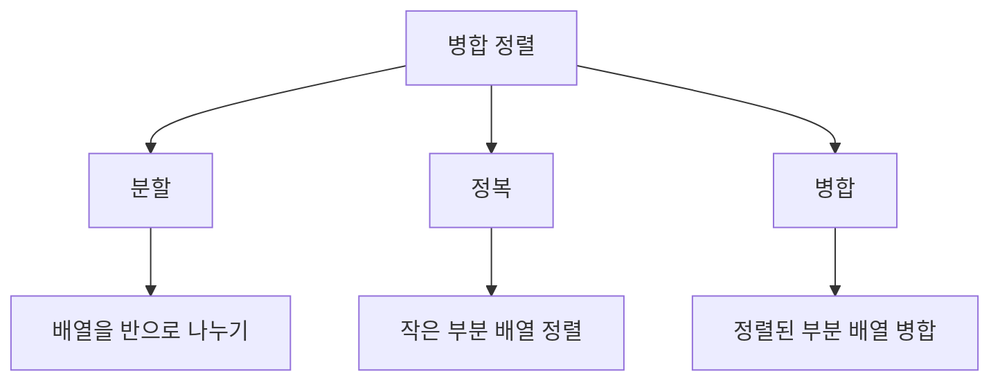
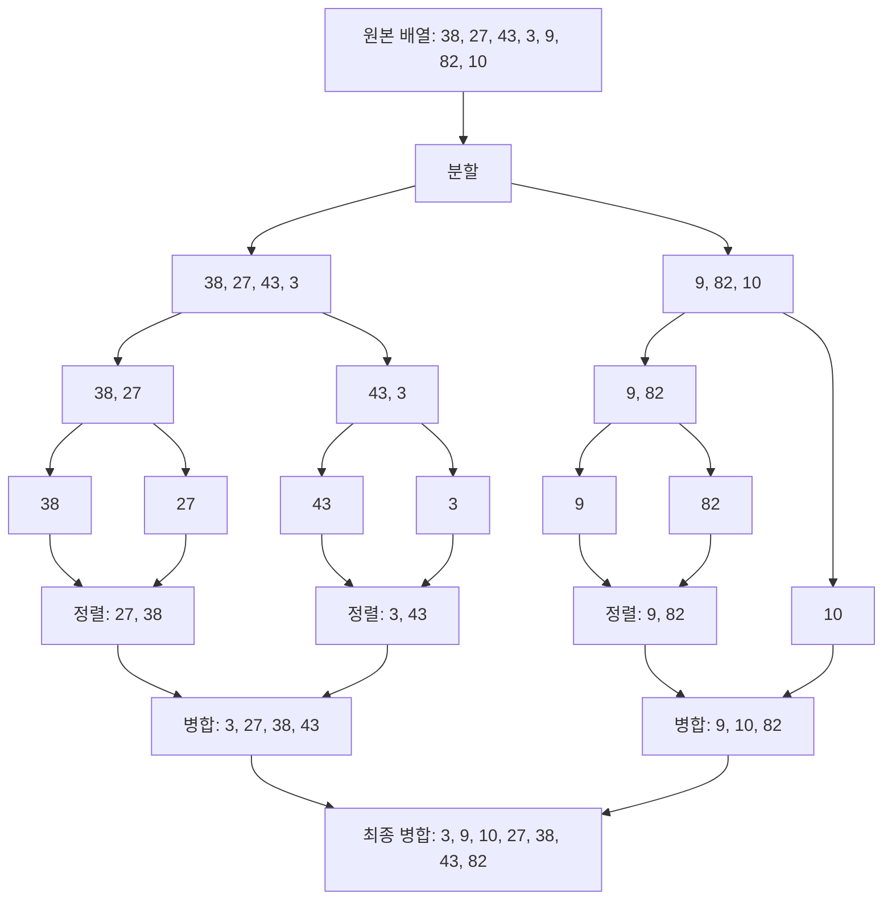

# Algorithms

- [Algorithms](#algorithms)
    - [알고리즘 학습](#알고리즘-학습)
    - [알고리즘적 사고?](#알고리즘적-사고)
    - [문제 해결 접근 방법](#문제-해결-접근-방법)
    - [알고리즘 문제의 패턴과 특징](#알고리즘-문제의-패턴과-특징)
        - [알고리즘 패턴 학습과 많은 문제 풀이의 목적](#알고리즘-패턴-학습과-많은-문제-풀이의-목적)
        - [주요 알고리즘 패턴](#주요-알고리즘-패턴)
            - [분할 정복 (Divide and Conquer)](#분할-정복-divide-and-conquer)
            - [동적 프로그래밍 (Dynamic Programming)](#동적-프로그래밍-dynamic-programming)
            - [그리디 알고리즘 (Greedy Algorithm)](#그리디-알고리즘-greedy-algorithm)
            - [그래프 탐색 (Graph Traversal)](#그래프-탐색-graph-traversal)
            - [이진 탐색 (Binary Search)](#이진-탐색-binary-search)
            - [백트래킹 (Backtracking)](#백트래킹-backtracking)
            - [슬라이딩 윈도우 (Sliding Window)](#슬라이딩-윈도우-sliding-window)
            - [투 포인터 (Two Pointers)](#투-포인터-two-pointers)
        - [패턴 인식을 위한 체계적 접근](#패턴-인식을-위한-체계적-접근)
    - [분석 예시](#분석-예시)
        - [가장 많이 받은 선물](#가장-많이-받은-선물)
        - [병합 정렬](#병합-정렬)
            - [1. 문제 이해 및 분석](#1-문제-이해-및-분석)
            - [2. 추상화와 모델링](#2-추상화와-모델링)
            - [3. 알고리즘 설계](#3-알고리즘-설계)
                - [주 함수(`mergeSort`)](#주-함수mergesort)
                - [병합 함수(`merge`)](#병합-함수merge)
            - [4. 구현](#4-구현)

## 알고리즘 학습

알고리즘 학습을 통해 얻은 *구조화된 사고방식과 패턴 인식 능력*은 실제 문제에 접근하는 출발점이 되지만, 이를 넘어서기 위해서는 지속적인 실전 경험과 다양한 사고 방식의 훈련이 필요합니다.

즉, 알고리즘 문제 풀이는 문제 해결의 기초 체력을 기르는 과정입니다.

알고리즘 학습의 궁극적인 목표는 알고리즘이란 기초 체력을 바탕으로 실제 세계의 복잡하고 모호한 문제들에 유연하게 대처할 수 있는 능력을 개발하는 것입니다.

## 알고리즘적 사고?

알고리즘은 생각보다 우리 생활 가까이에 있습니다.

가령 아침에 일어나서 학교에 가는 과정은 다음과 같습니다:
1. 알람 소리에 일어난다.
2. 침대에서 나온다.
3. 화장실에 간다.
4. 세수를 한다.
5. 옷을 입는다.
6. 아침을 먹는다.
7. 가방을 챙긴다.
8. 집을 나선다.

*정해진 순서대로 작업을 수행하여 목표(학교에 가기)를 달성*할 수 있습니다.

컴퓨터 알고리즘도 이와 유사하지만, 더 정확하고 명확해야 합니다.
컴퓨터는 사람의 언어를 모르고, 지시 받은 대로만 동작하기 때문입니다.

예를 들어, "아침을 먹는다"라는 단계를 컴퓨터에게 설명한다면:

1. 냉장고로 간다.
2. 냉장고를 연다.
3. 계란이 있는 곳을 탐색한다.
4. 계란이 있다면 계란 2개를 꺼낸다.
    - 없다면 return
5. 프라이팬을 꺼낸다.
    - 없다면 return
6. 프라이팬을 가스 레인지 또는 인덕션 위에 올린다.
    - 없다면 return
7. 가스 레인지 또는 인덕션의 불을 킨다.
8. 계란을 프라이팬에 깬다.
9. 3분간 기다린다.
10. 프라이팬에서 계란을 접시로 옮긴다.
11. 가스 레인지 또는 인덕션의 불을 끝다.
12. 접시를 들고 식탁으로 간다.
13. 포크로 계란을 먹는다.

## 문제 해결 접근 방법

문제 해결 과정의 기본적인 구조:



1. 문제 이해 및 분석

    주어진 문제를 분석하여 문제의 목표와 범위를 파악하고 정리합니다.

    - 해결하고자 하는 목표
    - 문제의 범위:
        주어진 다양한 정보들로 문제의 범위를 파악합니다.
        - 입력
        - 유효한 테스트 케이스
        - 예외 상황
        - 엣지 케이스
        - 시/공간 복잡도
        - 암묵적으로 가정된 조건들
        - 출력

    - 가능하다면 주어진 문제가 어떤 유형의 알고리즘 문제인지 (예: 그래프, 동적 프로그래밍, 탐욕법 등) 파악합니다.

2. 추상화와 모델링

    '문제 이해 및 분석'에 기반하여 문제나 알고리즘을 단순화하고 다루기 쉬운 형태로 변환합니다.

    - 불필요한 정보 제거하고 더 작고 관리 가능한 하위 문제로 분해
    - 문제에 주어진 단어나 개념에 종속되지 말고 필요한 개념 재정의하기

        ex: [최소직사각형](./programmers/src/main/java/p86491/PROCESS.md) 문제에서
        width/height 대신 긴 쪽과 짧은 쪽으로 정의하고 접근

    - 적절한 데이터 구조 선택하여 문제의 핵심 요소와 관계를 표현(다이어그램, 수학 공식 등 활용)

        - 그래프 구조 선택 (노드: 친구, 엣지: 선물 교환)
        - 키-값 쌍 구조 (친구 이름과 관련 정보 매핑)

        선택한 데이터 구조가 시간 및 공간 복잡도 요구사항을 충족하는지 확인합니다.

    - 가능하다면 가능하다면 전체적인 해결 방향을 미리 설정해 봅니다.

3. 알고리즘 설계

    '추상화와 모델링'에 기반하여 구체적으로 어떤 절차를 거쳐 문제를 해결할 것인지 계획합니다.

    - 문제 해결을 위한 단계별 접근 방식 개발

        앞서 추상화 단계에서 *분해한 하위 문제들을 해결하기 위한 구체적인 단계를 설계*합니다.
        그리고 각 단계가 논리적으로 연결되어 전체 문제를 해결할 수 있는지 확인합니다.

    - 적절한 데이터 구조 선택

        저수준의 구체적 선택입니다.
        효율적인 구현 방법 결정하기 위해 성능, 메모리 사용, 구현 용이성에 초점을 둡니다.
        - 2D 배열 (인접 행렬) 선택
        - HashMap 사용 결정
        - 배열 vs 연결 리스트 선택

        실제 구현, 시간 및 공간 복잡도 등을 고려합니다.

    - 알고리즘의 정확성 검증

        설계한 알고리즘이 모든 경우(일반 케이스, 엣지 케이스, 예외 상황 등)를 올바르게 처리하는지 검토합니다.

    - 의사코드 또는 흐름도 작성

        알고리즘을 의사코드나 흐름도로 표현하여 구현 단계로 쉽게 전환할 수 있도록 준비합니다.

    - 효율성 및 최적화 고려

        문제의 제약 조건을 및 시간/공간 복잡도를 고려하여 알고리즘을 설계합니다.
        (가능한 경우, 여러 해결 방법을 고안하고 각각의 장단점을 비교합니다)

        설계한 알고리즘의 개선 가능성을 검토하고 더 효율적인 방법이 있는지 고민합니다.

4. 코드 구현
5. 테스트 및 디버깅

코드 작성 단계에서 새로운 변수나 자료 구조가 필요하다고 느끼는 것이 반드시 나쁜 신호는 아니지만,
가능한 한 많은 요소를 사전 설계 단계에서 식별하는 것이 좋습니다.

이는 전체적인 알고리즘의 구조와 효율성을 미리 고려할 수 있게 해주며, 구현 단계에서의 큰 변경을 줄일 수 있습니다.

## 알고리즘 문제의 패턴과 특징

### 알고리즘 패턴 학습과 많은 문제 풀이의 목적

알고리즘 문제 해결시 패턴 인식은 기본적인 문제 해결 전략입니다.

가령 각 패턴의 특징을 미리 알고 접근한다면 입력, 출력, 연산 내용 등이 잘 이해가 안 되더라도,
그 패턴의 해결법을 알기에 역으로 문제를 이해하는 데 도움이 될 수 있습니다.

하지만 현실 세계의 문제는 아주 복잡하거나 오히려 아주 단순해서 패턴을 적용하기가 애매한 경우가 많습니다.
또한 많은 문제를 풀어서 패턴 인식하여 문제를 푼다는 것은, 반대로 패턴을 인식하지 못하면 문제 해결 능력이 떨어진다는 것으로도 이해될 수 있습니다.

하지만 다음과 같은 이유로 알고리즘 패턴을 학습하고 다양한 문제를 풀어봐야 합니다.
1. 사고 구조화 훈련:

    각 알고리즘은 *특정 유형의 문제를 해결하는 '도구'*입니다.
    다양한 문제 경험은 이 도구들의 레퍼토리를 확장하는 것입니다.

    또한 알고리즘 학습은 그 도구를 통해 *논리적 사고를 구조화 하는 과정*입니다.
    *복잡한 문제를 단순화하고 구조화하는 능력*을 개발합니다.

2. 추상화 능력 개발:

    구체적 문제에서 *일반적 원리를 추출하는 능력*이 있어야 합니다.
    다양한 상황에 적용 가능한 추상적 사고 훈련이 필요합니다.

    복잡한 실제 문제를 단순화하고 구조화 함으로써 문제의 기본 구조를 파악하는 데 도움이 됩니다.
    문제를 체계적으로 분해하고 분석하는 능력이 향상되면 실제 복잡한 문제에 대한 구조적 접근이 가능해집니다.

3. 패턴 적용의 유연성:

    유사하지만 다른 문제들을 통해 패턴 적용의 유연성 학습할 수 있습니다.

    즉, 많은 문제를 풀면서 기존 패턴의 변형 및 조합 능력이 향상될 수 있고,
    기존 알고리즘의 변형 또는 조합을 사용하여 새로운 상황에 새로운 해결책을 도출할 수 있습니다.

    그리고 이를 통해 다양한 관점에서 문제를 바라보는 습관이 형성될 수 있습니다.

따라서 많은 문제 풀이와 알고리즘 패턴의 습득은 문제 해결 능력을 기르기 위한 도구입니다.
그리고 이러한 능력은 특정 알고리즘이나 문제 유형에 국한되지 않고, 다양한 상황에서 적용 가능한 일반화된 문제 해결 능력으로 발전합니다.

알고리즘 문제 해결은 이러한 더 큰 문제 해결 능력을 개발하기 위한 하나의 도구로 볼 수 있습니다.
다음과 같은 순환 구조를 형성하는 것이 중요합니다.
- *문제를 풀며 얻은 인사이트를 추상화*
- *다양한 상황에 적용*
- *지속적으로 자신의 사고 과정을 분석하고 개선*

### 주요 알고리즘 패턴

#### 분할 정복 (Divide and Conquer)

- 특징: 문제를 더 작은 부분 문제로 나누어 해결
- 예시: 병합 정렬, 퀵 정렬, 이진 검색
- 핵심 질문: "이 문제를 더 작은 동일한 형태의 부분 문제로 나눌 수 있는가?"

```java
/**
 * @param 배열 정렬할 배열입니다.
 * @return 정렬된 배열을 반환합니다.
 */
function 병합정렬(배열):
    // 기저 조건: 배열의 길이가 1 이하면 이미 정렬된 것으로 간주
    if 배열의 길이 <= 1:
        return 배열

    // 분할 단계: 배열을 두 개의 부분 배열로 나눕니다.
    중간 = 배열의 길이 / 2
    왼쪽 = 병합정렬(배열의 왼쪽 절반)  // 재귀적으로 왼쪽 부분 정렬
    오른쪽 = 병합정렬(배열의 오른쪽 절반)  // 재귀적으로 오른쪽 부분 정렬

    // 병합 단계: 정렬된 두 부분 배열을 병합합니다.
    return 병합(왼쪽, 오른쪽)

/**
 * @param 왼쪽 정렬된 왼쪽 부분 배열입니다.
 * @param 오른쪽 정렬된 오른쪽 부분 배열입니다.
 * @return 두 배열을 병합하여 정렬된 새 배열을 반환합니다.
 */
function 병합(왼쪽, 오른쪽):
    결과 = 빈 배열
    왼쪽_인덱스 = 0
    오른쪽_인덱스 = 0

    // 두 배열의 요소를 비교하며 작은 것부터 결과 배열에 추가
    while 왼쪽_인덱스 < 왼쪽의 길이 and 오른쪽_인덱스 < 오른쪽의 길이:
        if 왼쪽[왼쪽_인덱스] <= 오른쪽[오른쪽_인덱스]:
            결과에 왼쪽[왼쪽_인덱스] 추가
            왼쪽_인덱스 증가
        else:
            결과에 오른쪽[오른쪽_인덱스] 추가
            오른쪽_인덱스 증가

    // 남은 요소들을 결과 배열에 추가
    결과에 왼쪽의 남은 요소들 추가
    결과에 오른쪽의 남은 요소들 추가

    return 결과
```

병합 정렬의 동작 과정 (ASCII 다이어그램):
배열이 재귀적으로 분할되고, 정렬된 하위 배열들이 병합되어 최종적으로 정렬된 배열을 생성합니다.

```plaintext
입력 배열: [38, 27, 43, 3, 9, 82, 10]

분할 과정:
        [38, 27, 43, 3, 9, 82, 10]
                    /        \
        [38, 27, 43, 3]    [9, 82, 10]
           /      \          /     \
      [38, 27]   [43, 3]   [9]   [82, 10]
       /   \      /   \           /    \
    [38] [27]  [43]  [3]        [82]  [10]  // 요소가 1개가 정렬된 상태

병합 과정:
    [38] [27]  [43]  [3]        [82]  [10]
       \  /      \   /            \   /
     [27,38]    [3,43]          [10,82]     // 정렬된 것들을 순서대로 합치기
         \        /                |
       [3,27,38,43]             [9,10,82]
              \                    /
             [3,9,10,27,38,43,82]

최종 정렬된 배열: [3,9,10,27,38,43,82]
```

#### 동적 프로그래밍 (Dynamic Programming)

- 특징: 부분 문제의 해를 저장하여 중복 계산 방지
- 예시: 피보나치 수열, 최장 증가 부분 수열, 배낭 문제
- 핵심 질문: "현재의 해가 이전에 계산된 부분 문제의 해에 의존하는가?"

```java
/**
 * @param n 계산할 피보나치 수의 인덱스입니다.
 * @return n번째 피보나치 수를 반환합니다.
 */
function 피보나치(n):
    // 기저 조건: 0번째와 1번째 피보나치 수는 각각 0과 1
    if n <= 1:
        return n

    // DP 테이블 초기화: n+1 크기의 배열을 0으로 초기화
    dp = 크기가 (n+1)인 정수 배열, 모든 원소를 0으로 초기화

    // 초기값 설정
    dp[0] = 0
    dp[1] = 1

    // 반복적으로 DP 테이블 채우기
    for i = 2 to n:
        dp[i] = dp[i-1] + dp[i-2]  // 현재 값은 이전 두 값의 합

    // n번째 피보나치 수 반환
    return dp[n]
```

피보나치 수열 계산 과정 (ASCII 다이어그램):
동적 프로그래밍 테이블이 어떻게 채워지는지 보여줍니다.
각 셀은 이전 두 셀의 값을 더하여 계산됩니다.

```plaintext
n = 7인 경우의 DP 테이블 채우기 과정:

인덱스:  0   1   2   3   4   5   6   7
      ┌───┬───┬───┬───┬───┬───┬───┬───┐
DP:   │ 0 │ 1 │   │   │   │   │   │   │  초기 상태. 기저 상태 dp[0] = 0, dp[1] = 1
      └───┴───┴───┴───┴───┴───┴───┴───┘

      ┌───┬───┬───┬───┬───┬───┬───┬───┐
      │ 0 │ 1 │ 1 │   │   │   │   │   │  dp[2] = dp[1] + dp[0] = 1 + 0 = 1
      └───┴───┴───┴───┴───┴───┴───┴───┘
        └─┬─┘   │
          └─────┘

      ┌───┬───┬───┬───┬───┬───┬───┬───┐
      │ 0 │ 1 │ 1 │ 2 │   │   │   │   │  dp[3] = dp[2] + dp[1] = 1 + 1 = 2
      └───┴───┴───┴───┴───┴───┴───┴───┘
            └─┬─┘   │
              └─────┘

      ┌───┬───┬───┬───┬───┬───┬───┬───┐
      │ 0 │ 1 │ 1 │ 2 │ 3 │   │   │   │  dp[4] = dp[3] + dp[2] = 2 + 1 = 3
      └───┴───┴───┴───┴───┴───┴───┴───┘
                └─┬─┘   │
                  └─────┘

      ┌───┬───┬───┬───┬───┬───┬───┬───┐
      │ 0 │ 1 │ 1 │ 2 │ 3 │ 5 │   │   │  dp[5] = dp[4] + dp[3] = 3 + 2 = 5
      └───┴───┴───┴───┴───┴───┴───┴───┘
                    └─┬─┘   │
                      └─────┘

      ┌───┬───┬───┬───┬───┬───┬───┬───┐
      │ 0 │ 1 │ 1 │ 2 │ 3 │ 5 │ 8 │   │  dp[6] = dp[5] + dp[4] = 5 + 3 = 8
      └───┴───┴───┴───┴───┴───┴───┴───┘
                        └─┬─┘   │
                          └─────┘

      ┌───┬───┬───┬───┬───┬───┬───┬───┐
      │ 0 │ 1 │ 1 │ 2 │ 3 │ 5 │ 8 │13 │  dp[7] = dp[6] + dp[5] = 8 + 5 = 13
      └───┴───┴───┴───┴───┴───┴───┴───┘
                            └─┬─┘   │
                              └─────┘

최종 결과: 7번째 피보나치 수는 13
```

#### 그리디 알고리즘 (Greedy Algorithm)

- 특징: 각 단계에서 최적의 선택을 하여 전체 최적해를 구함
- 예시: 거스름돈 문제, 활동 선택 문제
- 핵심 질문: "각 단계의 최적 선택이 전체 문제의 최적해를 보장하는가?"

```java
/**
 * @param 금액 거슬러 줄 금액입니다.
 * @param 동전_종류 사용 가능한 동전의 종류 배열입니다.
 * @return 사용된 동전의 개수와 종류를 담은 맵을 반환합니다.
 */
function 거스름돈_맵<동전, 사용된_개수> 거스름돈_계산(금액, 동전_종류):
    // 동전을 큰 단위부터 사용하기 위해 내림차순 정렬
    Collections.sort(동전_종류, Collections.reverseOrder())


    결과 = new 거스름돈_맵<동전, 사용된_개수>()

    for 동전 in 동전_종류:
        // 현재 동전으로 거슬러 줄 수 있는 최대 개수 계산
        사용된_개수 = 금액 / 동전

        if 사용된_개수 > 0:
            결과.add(동전, 사용된_개수);
            금액 = 금액 - (동전 * 사용된_개수)  // 남은 금액 갱신

        // 모든 금액을 거슬러 주었다면 종료
        if 금액 == 0:
            break

    return 결과
```

거스름돈 계산 과정 (ASCII 다이어그램):

```
입력: 금액 = 1260원, 동전_종류 = [500, 100, 50, 10]

단계별 계산 과정:

1260원
  │
  ├─ 500원 동전 2개 사용 (1000원)
  │   남은 금액: 260원
  │
  ├─ 100원 동전 2개 사용 (200원)
  │   남은 금액: 60원
  │
  ├─ 50원 동전 1개 사용 (50원)
  │   남은 금액: 10원
  │
  └─ 10원 동전 1개 사용 (10원)
      남은 금액: 0원

결과:
┌─────┬────────────┐
│ 동전 │ 사용된 개수 │
├─────┼────────────┤
│ 500 │     2     │
│ 100 │     2     │
│  50 │     1     │
│  10 │     1     │
└─────┴────────────┘

총 사용된 동전 개수: 6개
```

이 다이어그램은 그리디 알고리즘이 가능한 가장 큰 단위의 동전부터 사용하여 거스름돈을 계산하는 과정을 보여줍니다.

#### 그래프 탐색 (Graph Traversal)

    - 특징: 그래프 구조를 탐색하며 해를 찾음
    - 예시: 깊이 우선 탐색(DFS), 너비 우선 탐색(BFS)
    - 핵심 질문: "문제가 노드와 간선으로 표현될 수 있는가?"

#### 이진 탐색 (Binary Search)

    - 특징: 정렬된 데이터에서 중간값을 기준으로 탐색 범위를 좁혀감
    - 예시: 정렬된 배열에서의 값 찾기, 제곱근 찾기
    - 핵심 질문: "문제의 탐색 공간을 절반씩 줄일 수 있는가?"

#### 백트래킹 (Backtracking)

    - 특징: 가능한 모든 경우를 탐색하되, 유망하지 않은 경우는 더 진행하지 않음
    - 예시: N-Queens 문제, 스도쿠 풀이
    - 핵심 질문: "현재 선택이 유망하지 않다면 이전 단계로 돌아갈 수 있는가?"

#### 슬라이딩 윈도우 (Sliding Window)

    - 특징: 고정 크기의 윈도우를 이동시키며 부분 배열을 처리
    - 예시: 최대 합 부분 배열 문제, 문자열 패턴 매칭
    - 핵심 질문: "연속된 부분 데이터를 처리하는 문제인가?"

#### 투 포인터 (Two Pointers)

    - 특징: 두 개의 포인터를 사용하여 배열이나 리스트를 순회
    - 예시: 두 수의 합 문제, 팰린드롬 판별
    - 핵심 질문: "배열의 두 지점을 동시에 참조하여 문제를 해결할 수 있는가?"

### 패턴 인식을 위한 체계적 접근

1. 문제 구조 분석
    - 입력 데이터의 특성 (정렬 여부, 데이터 타입 등)
    - 요구되는 출력의 형태
    - 문제의 제약 조건

2. 문제 변환 가능성 고려
    - 주어진 문제를 알려진 패턴의 문제로 변환할 수 있는지 검토
    - 예: 그래프 문제로 변환, 동적 프로그래밍 문제로 재구성

3. 최적화 요구사항 파악
    - 시간 복잡도와 공간 복잡도 요구사항 분석
    - 이를 통해 적용 가능한 알고리즘 패턴 추론

4. 부분 문제 관계 파악
    - 문제가 더 작은 부분 문제로 나눌 수 있는지 확인
    - 부분 문제 간의 관계 (중복성, 의존성 등) 분석

5. 탐색 공간 특성 이해
    - 문제의 해 공간이 어떤 구조를 가지는지 파악
    - 탐색 공간을 효과적으로 줄일 수 있는 방법 고려

## 분석 예시

### [가장 많이 받은 선물](https://school.programmers.co.kr/learn/courses/30/lessons/258712?language=java)

```plaintext
선물을 직접 전하기 힘들 때 카카오톡 선물하기 기능을 이용해 축하 선물을 보낼 수 있습니다. 당신의 친구들이 이번 달까지 선물을 주고받은 기록을 바탕으로 다음 달에 누가 선물을 많이 받을지 예측하려고 합니다.

두 사람이 선물을 주고받은 기록이 있다면, 이번 달까지 두 사람 사이에 더 많은 선물을 준 사람이 다음 달에 선물을 하나 받습니다.
예를 들어 A가 B에게 선물을 5번 줬고, B가 A에게 선물을 3번 줬다면 다음 달엔 A가 B에게 선물을 하나 받습니다.
- 두 사람이 선물을 주고받은 기록이 하나도 없거나 주고받은 수가 같다면, 선물 지수가 더 큰 사람이 선물 지수가 더 작은 사람에게 선물을 하나 받습니다.
선물 지수는 이번 달까지 자신이 친구들에게 준 선물의 수에서 받은 선물의 수를 뺀 값입니다.
- 예를 들어 A가 친구들에게 준 선물이 3개고 받은 선물이 10개라면 A의 선물 지수는 -7입니다. B가 친구들에게 준 선물이 3개고 받은 선물이 2개라면 B의 선물 지수는 1입니다. 만약 A와 B가 선물을 주고받은 적이 없거나 정확히 같은 수로 선물을 주고받았다면, 다음 달엔 B가 A에게 선물을 하나 받습니다.
만약 두 사람의 선물 지수도 같다면 다음 달에 선물을 주고받지 않습니다.
위에서 설명한 규칙대로 다음 달에 선물을 주고받을 때, 당신은 선물을 가장 많이 받을 친구가 받을 선물의 수를 알고 싶습니다.

친구들의 이름을 담은 1차원 문자열 배열 friends 이번 달까지 친구들이 주고받은 선물 기록을 담은 1차원 문자열 배열 gifts가 매개변수로 주어집니다. 이때, 다음달에 가장 많은 선물을 받는 친구가 받을 선물의 수를 return 하도록 solution 함수를 완성해 주세요.

아래는 입출력 예시입니다.

friends: ["muzi", "ryan", "frodo", "neo"]
gifts: ["muzi frodo", "muzi frodo", "ryan muzi", "ryan muzi", "ryan muzi", "frodo muzi", "frodo ryan", "neo muzi"]
result: 2

friends: ["joy", "brad", "alessandro", "conan", "david"]
gifts: ["alessandro brad", "alessandro joy", "alessandro conan", "david alessandro", "alessandro david"]
result: 4

friends: ["a", "b", "c"]
gifts: ["a b", "b a", "c a", "a c", "a c", "c a"]
result: 0
```

1. 문제 이해 및 분석: 문제의 요구사항을 정확히 파악하고 주요 요소를 식별합니다.

    - 입력:
        - friends: 친구들의 이름 배열
        - gifts: 선물 교환 기록 배열 ("주는사람 받는사람" 형식)

    - 출력: 다음 달에 가장 많은 선물을 받을 사람의 선물 개수

    - 핵심 개념 식별: 추상화 단계에서 방향성 있는 그래프로 모델링 됩니다.
        - 친구(노드)
        - 선물 교환 관계(엣지)
        - 선물 지수(노드의 속성)

    - 연산 요구사항 식별:
        - 두 사람 간 선물 교환 비교
        - 선물 지수 계산 및 비교
        - 동점 처리

    - 제약 조건:
        - 친구 수: 2 ≤ friends의 길이 ≤ 50
        - 선물 기록: 0 ≤ gifts의 길이 ≤ 10,000

    - 예외 상황:
        - 선물 기록이 없는 경우
        - 모든 사람의 선물 지수가 동일한 경우

2. 추상화와 모델링: 문제를 추상화하고 적절한 모델을 선택합니다.

    친구들을 노드로, 선물 교환을 방향이 있는 엣지로 표현할 수 있습니다.

    ```sh
    A ---3---> B
    ^    ^     |
    |    |     |
    1    2     1
    |    |     |
    |    |     v
    C <--1---- D
    ```

    - 데이터 구조 선택:
        - 친구 인덱스 매핑: `Map<String, Integer>`
        - 선물 교환 기록: 2D 배열 (인접 행렬)
        - 선물 지수: 1D 배열

    - 필요한 주요 연산 식별:
        - 선물 교환 기록 처리
        - 선물 지수 계산
        - 다음 달 선물 예측

3. 알고리즘 설계

    이 단계에서는 문제 해결을 위한 구체적인 알고리즘을 설계합니다.

    - 데이터 구조 선택:

        추상화 단계에서 선택했던 그래프 모델은 알고리즘 설계 단계에서 인접 행렬(2D 배열)로 구체화됩니다.

    - 연산 최적화:

        선물 교환 기록 처리, 선물 지수 계산, 다음 달 선물 예측 같은 주요 연산들을
        효율적인 순회 및 비교 알고리즘으로 변환합니다.

    - 문제의 단계적 분해:

        추상화 단계에서 문제를 "기록 처리", "지수 계산", "예측" 등의 하위 문제로 분해했습니다.
        이는 알고리즘 설계 단계에서 각각의 단계로 구체화됩니다.

    ```plaintext
    Input: friends (친구 목록), gifts (선물 교환 기록)
    Output: 다음 달에 가장 많은 선물을 받을 사람의 선물 개수

    1. 초기화
        1.1 friendIndices <- 친구 이름을 인덱스에 매핑
        1.2 giftExchanges <- friends.length x friends.length 크기의 2D 배열 생성
        1.3 giftIndices <- friends.length 크기의 1D 배열 생성

    2. 선물 교환 기록 처리

        For each gift in gifts:
            2.1 giver, receiver <- gift 분리
            2.2 giverIndex <- friendIndices[giver]
            2.3 receiverIndex <- friendIndices[receiver]
            2.4 giftExchanges[giverIndex][receiverIndex]++
            2.5 giftIndices[giverIndex]++
            2.6 giftIndices[receiverIndex]--

    3. 다음 달 선물 예측
        3.1 nextMonthGifts <- friends.length 크기의 배열 생성

        For i from 0 to friends.length - 1:
            For j from i + 1 to friends.length - 1:
                3.2 giftsFromIToJ <- giftExchanges[i][j]
                3.3 giftsFromJToI <- giftExchanges[j][i]
                3.4 If giftsFromIToJ > giftsFromJToI:
                        nextMonthGifts[i]++
                    Else if giftsFromIToJ < giftsFromJToI:
                        nextMonthGifts[j]++
                    Else if giftIndices[i] > giftIndices[j]:
                        nextMonthGifts[i]++
                    Else if giftIndices[i] < giftIndices[j]:
                        nextMonthGifts[j]++

    4. 결과 반환
        Return maximum value in nextMonthGifts
    ```

```java
public static int solution(String[] friends, String[] gifts) {
    if (gifts.length == 0)
        return 0;

    Map<String, Integer> friendIndices = createFriendIndices(friends);
    int[][] giftExchanges = new int[friends.length][friends.length];
    int[] giftIndices = new int[friends.length];

    processGifts(gifts, friendIndices, giftExchanges, giftIndices);

    return predictNextMonthGifts(friends, friendIndices, giftExchanges,
            giftIndices);
}

private static Map<String, Integer> createFriendIndices(String[] friends) {
    Map<String, Integer> indices = new HashMap<>();
    for (int i = 0; i < friends.length; i++) {
        indices.put(friends[i], i);
    }
    return indices;
}

private static void processGifts(String[] gifts,
        Map<String, Integer> friendIndices, int[][] giftExchanges,
        int[] giftIndices) {
    for (String gift : gifts) {
        String[] names = gift.split(" ");
        int giverIndex = friendIndices.get(names[0]);
        int receiverIndex = friendIndices.get(names[1]);

        giftExchanges[giverIndex][receiverIndex]++;
        giftIndices[giverIndex]++;
        giftIndices[receiverIndex]--;
    }
}

private static int predictNextMonthGifts(String[] friends,
        Map<String, Integer> friendIndices, int[][] giftExchanges,
        int[] giftIndices) {
    int[] nextMonthGifts = new int[friends.length];

    for (int i = 0; i < friends.length; i++) {
        for (int j = i + 1; j < friends.length; j++) {
            int giftsFromIToJ = giftExchanges[i][j];
            int giftsFromJToI = giftExchanges[j][i];

            if (giftsFromIToJ > giftsFromJToI) {
                nextMonthGifts[i]++;
            } else if (giftsFromIToJ < giftsFromJToI) {
                nextMonthGifts[j]++;
            } else if (giftIndices[i] > giftIndices[j]) {
                nextMonthGifts[i]++;
            } else if (giftIndices[i] < giftIndices[j]) {
                nextMonthGifts[j]++;
            }
        }
    }

    return Arrays.stream(nextMonthGifts).max().orElse(0);
}
```

### 병합 정렬

#### 1. 문제 이해 및 분석

병합 정렬은 다음과 같은 특징을 가진 정렬 알고리즘입니다:
- 분할 정복(Divide and Conquer) 방법을 사용합니다.
- 안정 정렬(Stable Sort)입니다.
- 시간 복잡도는 O(n log n)입니다.
- 추가적인 메모리 공간이 필요합니다.

#### 2. 추상화와 모델링

병합 정렬은 정렬 문제를 다음 세 단계로 추상화합니다:



1. 분할 (Divide):

    입력 배열을 두 개의 부분 배열로 나누어서,
    각 부분 배열이 단일 요소가 될 때까지 분할하는 게 목표입니다.

2. 정복 (Conquer) 및 병합 (Merge):

    병합 정렬의 재귀적 특성은 다음과 같이 트리 구조로 표현할 수 있습니다.

    ```plaintext
    [전체 배열]
        ├─ [왼쪽 절반]
        │   ├─ [왼쪽의 왼쪽 절반]
        │   └─ [왼쪽의 오른쪽 절반]
        └─ [오른쪽 절반]
            ├─ [오른쪽의 왼쪽 절반]
            └─ [오른쪽의 오른쪽 절반]
    ```

    재귀적 분할을 끝까지 수행한 결과인 단일 요소 배열은 그 자체로 '정렬된' 상태로 간주됩니다.

    ```sh
    # 아래 배열 안에서 32와 다른 무엇을 비교할 게 없으므로 정렬된 상태입니다.
    [32]
    # 마찬가지로 아래 배열 안에서 53과 다른 무엇을 비교할 게 없으므로 정렬된 상태입니다.
    [53]
    ```

    두 개의 단일 요소 배열을 비교하여 **항상 '정렬된' 상태의 배열로 병합**(by `merge`)하여 리턴하고,
    리턴된 배열들을 계속해서 비교하고 병합합니다.

    ```sh
    [32, 53]
    ```

3. 병합 과정의 반복:

    이미 정렬된 두 부분 배열을 하나의 정렬된 배열로 병합합니다.
    이는 이전 단계의 병합 작업 결과로 보장됩니다.

#### 3. 알고리즘 설계

- 배열을 분할하고
- 분할된 배열에 대해 재귀적으로 정렬을 수행하고,
- 정렬된 두 배열을 병합합니다.
- 재귀의 기저 사례(base case)를 정의합니다.

##### 주 함수(`mergeSort`)

- 배열의 길이가 1 이하면 이미 정렬된 것으로 간주하고 반환합니다(기저 사례, base case).
- 배열을 두 개의 부분 배열로 분할하고, 각 부분 배열에 대해 재귀적으로 `mergeSort` 호출합니다.
- 정렬된 두 부분 배열을 병합 함수(`merge`)로 병합합니다.

```plaintext
function mergeSort(arr):
    if arr의 길이 <= 1:
        return arr  // 기저 사례

    중간 = arr 길이 / 2
    왼쪽 = mergeSort(arr의 왼쪽 절반)
    오른쪽 = mergeSort(arr의 오른쪽 절반)

    return merge(왼쪽, 오른쪽)
```

##### 병합 함수(`merge`)

병합 함수는 *두 배열이 이미 정렬되어 있다는 점*을 활용합니다.
- 두 배열의 첫 번째 원소부터 시작해서 비교합니다.
- 작은 원소를 새 배열에 넣고, 해당 배열의 다음 원소로 이동(포인터 이동)합니다.
- 이 과정을 반복합니다.



앞서 추상화와 모델링에서 봤듯이 *두 부분 배열이 이미 정렬되어 있다는 점*은,
*단일 요소까지 분할*한 후 정렬된 상태로부터 다시 병합해 나가는 재귀적 과정 때문에 보장됩니다.

```plaintext
function merge(arr, 왼쪽_시작, 중간, 오른쪽_끝):
    // '왼쪽_시작', '중간', '오른쪽_끝'를 사용하여 부분 배열의 범위를 정확히 지정해야 합니다.
    왼쪽_배열 = arr[from '왼쪽_시작' to '중간']
    오른쪽_배열 = arr[from '중간' + 1 to '오른쪽_끝']

    결과_배열 = 빈 배열
    왼쪽_인덱스 = 0
    오른쪽_인덱스 = 0

    // - 두 배열의 첫 번째 원소부터 시작해서 비교합니다.
    // - 작은 원소를 새 배열에 넣고, 해당 배열의 다음 원소로 이동합니다(정렬하기).
    // - 이 과정을 반복합니다(길이가 다르더라도 짧은 배열의 끝에 도달할 때까지만 비교가 이루어집니다).
    while 왼쪽_인덱스 < 왼쪽_배열.길이 AND 오른쪽_인덱스 < 오른쪽_배열.길이:
        if 왼쪽_배열[왼쪽_인덱스] <= 오른쪽_배열[오른쪽_인덱스]:
            결과_배열에 왼쪽_배열[왼쪽_인덱스] 추가
            왼쪽_인덱스 증가
        else:
            결과_배열에 오른쪽_배열[오른쪽_인덱스] 추가
            오른쪽_인덱스 증가

    //
    // 두 배열 중 하나라도 모두 순회했다면, 주 while 루프에서의 비교 과정이 끝납니다.
    //

    // 남은 원소 처리 (추가 비교 없이 순서대로 추가)
    // 왼쪽 배열에 남은 원소가 있다면, 이들은 모두 오른쪽 배열의 모든 원소보다 크므로 그대로 추가합니다.
    while 왼쪽_인덱스 < 왼쪽_배열.길이:
        결과_배열에 왼쪽_배열[왼쪽_인덱스] 추가
        왼쪽_인덱스 증가

    // 오른쪽 배열에 남은 원소가 있다면, 이들은 모두 왼쪽 배열의 모든 원소보다 크므로 그대로 추가합니다.
    while 오른쪽_인덱스 < 오른쪽_배열.길이:
        결과_배열에 오른쪽_배열[오른쪽_인덱스] 추가
        오른쪽_인덱스 증가

    arr의 왼쪽_시작부터 오른쪽_끝까지를 결과_배열로 대체
```

#### 4. 구현

[구현 코드](./examples/src/main/java/merge_sort/Main.java)을 참고합니다.
