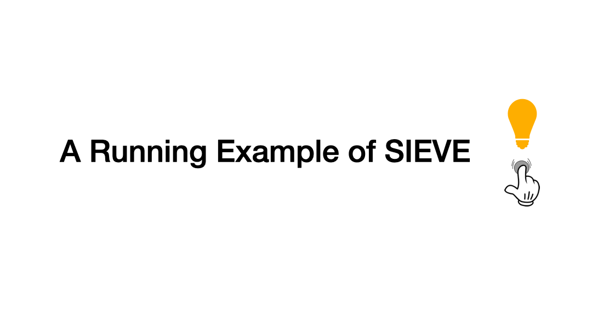

# SIEVE

## [SIEVE](https://cachemon.github.io/SIEVE-website/blog/2023/12/17/sieve-is-simpler-than-lru/)?

> [SIEVE](https://cachemon.github.io/SIEVE-website/): an Efficient Turn-Key Eviction Algorithm for Web Caches

## 작동 방식

A cache hit changes the visited bit of the accessed object to 1. SIEVE does not need to perform any operation for a popular object whose visited bit is already set. During a cache miss, SIEVE examines the object pointed by the hand. If it has been visited, the visited bit is reset, and the hand moves to the next position (the retained object stays in the original position of the queue). It continues this process until it encounters an object with the visited bit being 0 and evicts it. After the eviction, the hand points to the next position (the previous object in the queue). While an evicted object is in the middle of the queue most of the time, a new object is always inserted into the head of the queue.

## references

- [Paper](https://yazhuozhang.com/assets/pdf/nsdi24-sieve.pdf)
