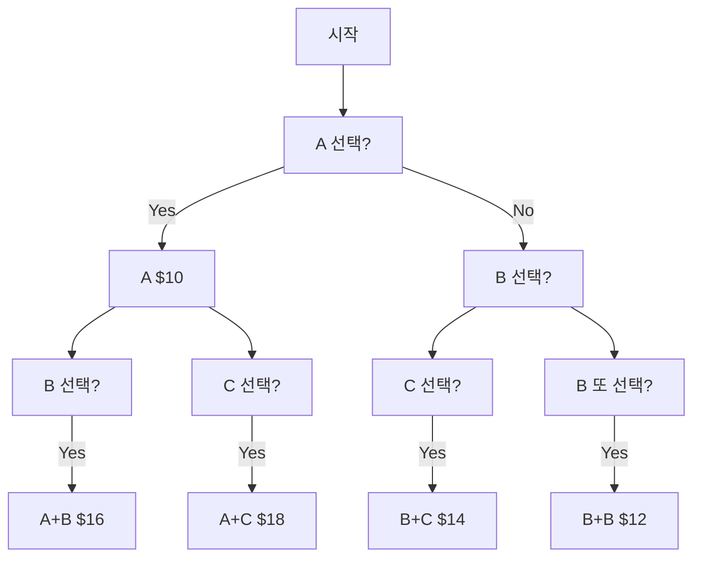
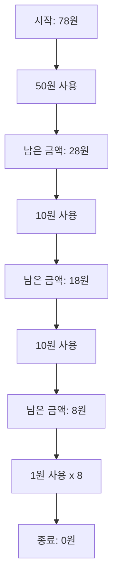
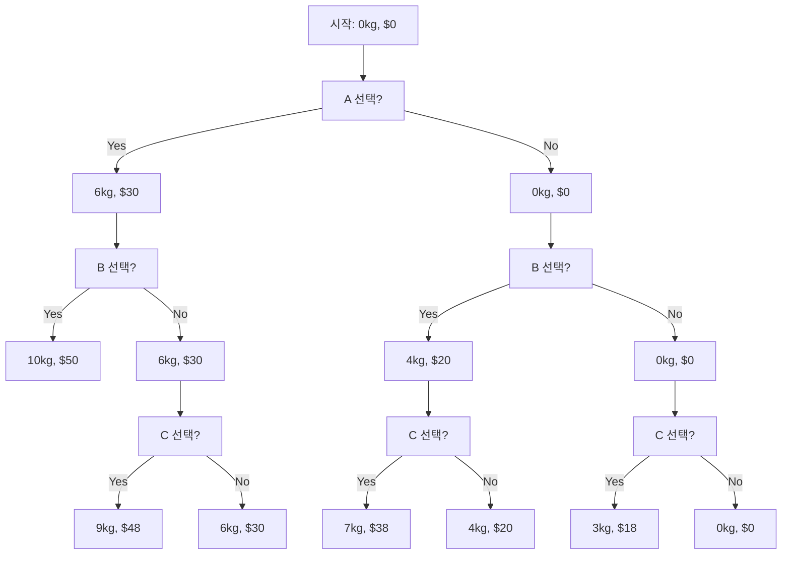

# Optimal Solution

- [Optimal Solution](#optimal-solution)
    - [최적해 탐색 알고리즘](#최적해-탐색-알고리즘)
    - [최적해에 앞서 완전 탐색에 대해 알아두기](#최적해에-앞서-완전-탐색에-대해-알아두기)
        - [간단한 예제: 최대 수익 찾기](#간단한-예제-최대-수익-찾기)
        - [완전 탐색을 통한 해결 과정](#완전-탐색을-통한-해결-과정)
    - [최적해 찾기의 일반적 원리](#최적해-찾기의-일반적-원리)
    - [최적해 알고리즘 예제](#최적해-알고리즘-예제)
        - [동전 거스름돈: 그리디 알고리즘](#동전-거스름돈-그리디-알고리즘)
        - [배낭 문제 (간소화 버전)](#배낭-문제-간소화-버전)
    - [다익스트라 알고리즘과 최적해](#다익스트라-알고리즘과-최적해)
        - [최적해와의 관계](#최적해와의-관계)
    - [그리디 알고리즘과 최적해](#그리디-알고리즘과-최적해)
        - [최적해와의 관계](#최적해와의-관계-1)
    - [최적해 탐색에서의 역할](#최적해-탐색에서의-역할)
    - [동적 프로그래밍과 최적해 알고리즘](#동적-프로그래밍과-최적해-알고리즘)
        - [동적 프로그래밍과 최적해의 관계](#동적-프로그래밍과-최적해의-관계)
        - [동적 프로그래밍의 예: 피보나치 수열](#동적-프로그래밍의-예-피보나치-수열)
        - [최적해 탐색에서의 동적 프로그래밍의 역할](#최적해-탐색에서의-동적-프로그래밍의-역할)
        - [동적 프로그래밍 vs 그리디 알고리즘 vs 다익스트라 알고리즘](#동적-프로그래밍-vs-그리디-알고리즘-vs-다익스트라-알고리즘)

## 최적해 탐색 알고리즘

최적화 문제를 해결하는 알고리즘들로, 주어진 제약 조건 하에서 가장 좋은(최적의) 해결책을 찾는 것이 목표입니다.
간단한 문제에서는 모든 가능성을 직접 비교하여 최적해를 찾을 수 있지만, 복잡한 문제에서는 더 효율적인 방법이 필요합니다.
- 그리디 알고리즘
- 동적 프로그래밍
- 다익스트라 알고리즘
- 분기한정법 등

> - 다익스트라 알고리즘: 그래프에서의 최단 경로라는 특정 형태의 최적해를 항상 찾아냅니다.
> - 그리디 알고리즘: 보다 넓은 범위의 문제에 적용될 수 있지만 항상 최적해를 보장하지는 않습니다.
> - 분기한정법(Branch and Bound): 유망하지 않은 해의 집합을 제거합니다.

'최적'의 의미는 문제에 따라 다르며, 최소 비용, 최대 효율, 최단 경로 등 다양한 형태로 정의될 수 있습니다.

핵심 원리:
- 문제의 구조 분석: 최적해를 찾기 위해 문제의 구조를 분석하고 특성을 파악합니다.
- 단계적 결정: 문제를 작은 부분으로 나누어 각 단계에서 결정을 내립니다.
- 최적 부분 구조: 전체 문제의 최적해가 부분 문제의 최적해로 구성됩니다.

## 최적해에 앞서 완전 탐색에 대해 알아두기

완전 탐색은 최적화 문제를 해결하는 한 방법입니다.
완전 탐색은 가능한 모든 가능한 경우를 체계적으로 조사하여 해를 찾기 때문에, 문제의 규모가 작을 때 유용합니다.
항상 최적해를 보장하지만, 문제의 크기가 커질수록 비효율적일 수 있습니다.

그러나 실제 많은 최적화 문제에서는 완전 탐색이 비실용적이므로, 동적 프로그래밍, 그리디 알고리즘, 휴리스틱 방법 등 더 효율적인 접근 방식이 필요합니다.
이러한 기법들은 완전 탐색의 아이디어를 기반으로 하되, *문제의 특성을 활용하여 탐색 공간을 효과적으로 줄이는 방법*을 사용합니다.

따라서 완전 탐색은 최적화 문제 해결의 출발점이자 다른 알고리즘의 기초가 되는 중요한 개념이라고 할 수 있습니다.

### 간단한 예제: 최대 수익 찾기

문제: 3개의 제품 A, B, C가 있고, 각각의 가격과 재고는 다음과 같습니다.
최대 2개의 제품을 선택하여 얻을 수 있는 최대 수익을 찾으세요.
- 제품 A: 가격 $10, 재고 1개
- 제품 B: 가격 $6, 재고 2개
- 제품 C: 가격 $8, 재고 1개

### 완전 탐색을 통한 해결 과정

1. 가능한 모든 조합 나열:
    - A 선택
    - B 선택
    - C 선택
    - A와 B 선택
    - A와 C 선택
    - B와 C 선택
    - B 2개 선택

2. 각 조합의 수익 계산:
    - A: $10
    - B: $6
    - C: $8
    - A와 B: $16
    - A와 C: $18
    - B와 C: $14
    - B 2개: $12

3. 최대 수익 선택:
    A와 C를 선택했을 때 $18로 최대 수익



완전 탐색과 최적화 문제의 관계는 다음과 같습니다:

1. 보장된 최적해:
   - 완전 탐색은 모든 가능한 해를 검토하므로, 항상 최적해를 찾을 수 있습니다.
   - 이 예제에서는 모든 가능한 제품 조합을 검토하여 최대 수익을 정확히 찾았습니다.

2. 시간 복잡도:
   - 완전 탐색의 시간 복잡도는 일반적으로 O(2^n) 또는 O(n!)과 같이 지수적입니다.
   - 이 예제에서는 제품이 3개뿐이라 빠르게 해결할 수 있었지만, 제품 수가 증가하면 복잡도가 급격히 증가합니다.

3. 적용 가능성:
   - 작은 규모의 문제에서는 완전 탐색이 간단하고 확실한 방법입니다.
   - 큰 규모의 문제에서는 시간과 자원의 제약으로 인해 다른 최적화 기법(예: 동적 프로그래밍, 그리디 알고리즘)이 필요할 수 있습니다.

4. 기준점(Baseline) 설정:
   - 완전 탐색은 다른 최적화 알고리즘의 정확성을 검증하는 기준점으로 사용될 수 있습니다.
   - 더 효율적인 알고리즘을 개발할 때, 완전 탐색 결과와 비교하여 정확성을 확인할 수 있습니다.

5. 문제 이해:
   - 완전 탐색을 통해 문제의 구조와 최적해의 특성을 더 깊이 이해할 수 있습니다.
   - 이는 더 효율적인 알고리즘을 설계하는 데 도움이 될 수 있습니다.

## 최적해 찾기의 일반적 원리

1. 문제 정의:
   - 목표(최대화 또는 최소화할 대상)를 명확히 합니다.
   - 제약 조건을 정확히 파악합니다.

2. 해 공간 탐색:
   - 가능한 모든 해결책을 고려합니다.
   - 문제의 특성에 따라 체계적인 탐색 방법을 선택합니다.

3. 평가 및 비교:
   - 각 해결책의 '좋음'을 측정할 수 있는 객관적인 기준을 설정합니다.
   - 이 기준에 따라 해결책들을 비교합니다.

4. 최선의 해 선택:
   - 평가 기준에 따라 가장 좋은 해결책을 선택합니다.

5. 효율성 고려:
   - 문제의 규모가 커질 때 효율적으로 해를 찾을 수 있는 방법을 고안합니다.

## 최적해 알고리즘 예제

최적해 문제에 접근할 때는 다음과 같이 접근하는 것이 중요합니다:
1. 먼저 문제의 구조를 이해하고
2. 가능한 해결책의 범위를 파악하고
3. 점진적으로 더 효율적인 방법을 고안하기

핵심 원리:
- 문제 정의: 목표와 제약 조건을 명확히 합니다.
- 해 공간 탐색: 가능한 모든 해결책을 고려합니다.
- 평가 기준: 각 해결책의 '좋음'을 측정할 수 있는 기준을 정립합니다.
- 선택: 평가 기준에 따라 최선의 해결책을 선택합니다.

### 동전 거스름돈: 그리디 알고리즘

가장 적은 수의 동전으로 거스름돈을 만드는 문제를 살펴봅시다.

문제: 78원을 거슬러 줘야 하고, 사용 가능한 동전은 50원, 10원, 1원입니다. 가장 적은 수의 동전을 사용하여 거스름돈을 만드는 방법은 무엇인가요?



1. 가장 큰 동전부터 사용합니다 (그리디 접근).
2. 78원에서 50원을 사용하여 28원이 남습니다.
3. 28원에서 10원을 두 번 사용하여 8원이 남습니다.
4. 마지막으로 1원을 8개 사용합니다.

결과: 50원 1개, 10원 2개, 1원 8개, 총 11개의 동전 사용

여기서 최적해를 찾는 원리는 다음과 같습니다:
1. 큰 단위부터 사용: 이 문제에서는 항상 가장 큰 단위의 동전부터 사용하는 것이 최적해를 보장합니다.
2. 탐욕적 선택: 각 단계에서 현재 가능한 최선의 선택을 합니다.
3. 부분 문제의 최적해: 78원의 문제를 해결하기 위해 50원을 사용한 후의 28원도 같은 원리로 해결합니다.

이 예제는 그리디 알고리즘의 간단한 적용을 보여줍니다.
항상 가장 큰 단위의 동전을 선택하는 것이 전체적으로 최적의 해결책을 제공합니다.

### 배낭 문제 (간소화 버전)

배낭 문제는 동적 프로그래밍의 대표적인 예시지만, 여기서는 간소화된 버전으로 설명하겠습니다.

문제: 최대 무게 10kg를 담을 수 있는 배낭이 있습니다. 다음 물건들 중 가치의 합이 최대가 되도록 선택하세요.
- 물건 A: 무게 6kg, 가치 $30
- 물건 B: 무게 4kg, 가치 $20
- 물건 C: 무게 3kg, 가치 $18



1. 모든 가능한 조합을 고려합니다.
2. 각 단계에서 물건을 선택하거나 선택하지 않는 두 가지 옵션이 있습니다.
3. 무게 제한을 초과하지 않는 조합 중 가치가 가장 높은 것을 선택합니다.

결과: 물건 A와 B를 선택 (총 무게 10kg, 총 가치 $50)

여기서 최적해를 찾는 원리는 다음과 같습니다:
1. 모든 가능성 고려: 가능한 모든 조합을 검토합니다.
2. 제약 조건 준수: 무게 제한을 초과하지 않는 조합만 고려합니다.
3. 최대 가치 선택: 가능한 조합 중 가장 높은 가치를 제공하는 조합을 선택합니다.

이 예제는 작은 규모에서는 모든 가능성을 검토하는 방식으로 해결할 수 있지만, 문제의 규모가 커지면 동적 프로그래밍과 같은 더 효율적인 방법이 필요합니다.

## 다익스트라 알고리즘과 최적해

다익스트라 알고리즘은 그래프에서 한 정점으로부터 다른 모든 정점까지의 최단 경로를 찾는 알고리즘입니다.
이는 '단일 출발점 최단 경로 문제'의 최적해를 찾는 알고리즘입니다.

### 최적해와의 관계

1. 최적 부분 구조: 다익스트라 알고리즘은 최적 부분 구조 원리를 따릅니다. 즉, A에서 C로 가는 최단 경로가 B를 거친다면, A에서 B로 가는 부분과 B에서 C로 가는 부분 모두 각각의 최단 경로입니다.

2. 그리디 선택: 각 단계에서 현재 알려진 가장 가까운 정점을 선택합니다. 이 선택이 항상 전체 경로에 대해 최적임이 보장됩니다.

3. 최적해 보장: 음의 가중치가 없는 그래프에서 다익스트라 알고리즘은 항상 최적해(최단 경로)를 찾습니다.

```java
class Dijkstra {
    private static final int INF = Integer.MAX_VALUE;

    public static int[] dijkstra(int[][] graph, int start) {
        int n = graph.length;
        int[] distance = new int[n];
        boolean[] visited = new boolean[n];

        // 초기화
        Arrays.fill(distance, INF);
        distance[start] = 0;

        for (int i = 0; i < n - 1; i++) {
            // 방문하지 않은 정점 중 최소 거리를 가진 정점 선택
            int minVertex = findMinDistance(distance, visited);
            visited[minVertex] = true;

            // 선택된 정점을 거쳐 다른 정점으로 가는 거리 갱신
            for (int j = 0; j < n; j++) {
                if (!visited[j] && graph[minVertex][j] != 0 &&
                    distance[minVertex] != INF &&
                    distance[minVertex] + graph[minVertex][j] < distance[j]) {
                    distance[j] = distance[minVertex] + graph[minVertex][j];
                }
            }
        }

        return distance;
    }

    private static int findMinDistance(int[] distance, boolean[] visited) {
        int minDistance = INF, minVertex = -1;
        for (int i = 0; i < distance.length; i++) {
            if (!visited[i] && distance[i] < minDistance) {
                minDistance = distance[i];
                minVertex = i;
            }
        }
        return minVertex;
    }
}
```

이 구현에서 각 단계마다 최소 거리를 가진 정점을 선택하는 그리디 선택이 이루어집니다. 이 선택이 전체 경로에 대해 최적임이 보장되어, 최종적으로 최단 경로(최적해)를 찾게 됩니다.

## 그리디 알고리즘과 최적해

그리디 알고리즘은 각 단계에서 지역적으로 최적인 선택을 하여 전역적인 최적해를 구하려는 알고리즘입니다.

### 최적해와의 관계

1. 지역적 최적 선택: 각 단계에서 현재 상황에서 가장 좋아 보이는 선택을 합니다.

2. 최적해의 근사: 많은 경우 그리디 알고리즘은 최적해를 보장하지 않지만, 계산 복잡도가 낮아 빠르게 '좋은' 해를 찾을 수 있습니다.

3. 특정 조건에서의 최적해: 특정한 조건(예: 매트로이드 구조)을 만족하는 문제에서는 그리디 알고리즘이 항상 최적해를 찾습니다.

```java
class ActivitySelection {
    public static List<Integer> selectActivities(int[] start, int[] finish) {
        List<Integer> selected = new ArrayList<>();
        int n = start.length;

        // 첫 번째 활동 선택
        selected.add(0);
        int lastFinish = finish[0];

        // 나머지 활동들 검사
        for (int i = 1; i < n; i++) {
            // 현재 활동의 시작 시간이 마지막으로 선택된 활동의 종료 시간 이후라면 선택
            if (start[i] >= lastFinish) {
                selected.add(i);
                lastFinish = finish[i];
            }
        }

        return selected;
    }
}
```

이 활동 선택 문제에서 그리디 알고리즘은 각 단계에서 가장 일찍 끝나는 활동을 선택합니다. 이 지역적 최적 선택이 전체적으로도 최적해(최대 개수의 겹치지 않는 활동)를 보장합니다.

## 최적해 탐색에서의 역할

1. 문제 특성에 따른 선택:
   - 다익스트라: 가중 그래프의 최단 경로 문제에 적합
   - 그리디: 부분적인 선택이 전체 해에 영향을 미치지 않는 문제에 적합

2. 시간 복잡도:
   - 다익스트라: O(V^2) 또는 우선순위 큐 사용 시 O((V+E)logV)
   - 그리디: 대부분의 경우 O(n) 또는 O(nlogn)

3. 최적해 보장:
   - 다익스트라: 음의 가중치가 없는 그래프에서 항상 최적해 보장
   - 그리디: 문제의 특성에 따라 최적해 보장 여부가 달라짐

4. 적용 범위:
   - 다익스트라: 네트워크 라우팅, GPS 내비게이션 등
   - 그리디: 허프만 코딩, 분할 가능한 배낭 문제 등

## 동적 프로그래밍과 최적해 알고리즘

동적 프로그래밍은 복잡한 최적화 문제를 해결하는 강력한 알고리즘 설계 기법입니다.
*부분 문제의 해를 저장하고 재사용*하여 중복 계산을 피함으로써 효율적으로 최적해를 찾습니다.
특히 최적 부분 구조와 중복되는 부분 문제 특성을 가진 최적화 문제에 매우 효과적입니다.

동적 프로그래밍은 *문제를 더 작은 부분 문제로 나누고, 이들의 최적해를 조합하여 전체 문제의 최적해를 구하는 방법*입니다.
각 부분 문제의 해를 메모리에 저장하여 재사용함으로써 계산 효율성을 높입니다.

핵심 원리:
- 최적 부분 구조: 문제의 최적해가 부분 문제의 최적해로 구성됩니다.
- 중복되는 부분 문제: 동일한 부분 문제가 여러 번 나타납니다.
- 메모이제이션 또는 타뷸레이션: 부분 문제의 해를 저장하고 재사용합니다.

대안적 접근:
- 분할 정복: 부분 문제로 나누지만, 중복 계산을 피하지 않습니다.
- 탐욕법: 각 단계에서 최선의 선택을 하지만, 전체적인 최적해를 보장하지 않을 수 있습니다.

### 동적 프로그래밍과 최적해의 관계

1. 최적 부분 구조 활용:
   동적 프로그래밍은 문제가 최적 부분 구조를 가질 때 효과적입니다. 즉, 전체 문제의 최적해가 부분 문제들의 최적해로 구성될 때 사용합니다.

2. 중복 계산 제거:
   동일한 부분 문제가 반복해서 나타날 때, 그 결과를 저장하고 재사용함으로써 계산 효율성을 크게 높입니다.

3. 점화식 (재귀 관계):
   부분 문제들 간의 관계를 수학적 점화식으로 표현하여 최적해를 구합니다.

4. Bottom-up 또는 Top-down 접근:
   문제를 가장 작은 부분부터 해결하여 올라가는 방식(Bottom-up)이나, 큰 문제에서 시작해 작은 문제로 내려가는 방식(Top-down)을 사용합니다.

### 동적 프로그래밍의 예: 피보나치 수열

피보나치 수열은 동적 프로그래밍의 기본적인 예시입니다. 각 숫자가 앞의 두 숫자의 합인 이 수열은 재귀적 성질을 가지고 있어, DP를 적용하기 적합합니다.

```java
public class FibonacciDP {
    // Top-down approach (Memoization)
    public static long fibMemo(int n) {
        long[] memo = new long[n + 1];
        Arrays.fill(memo, -1);
        return fibMemoHelper(n, memo);
    }

    private static long fibMemoHelper(int n, long[] memo) {
        if (n <= 1) return n;
        if (memo[n] != -1) return memo[n];
        memo[n] = fibMemoHelper(n - 1, memo) + fibMemoHelper(n - 2, memo);
        return memo[n];
    }

    // Bottom-up approach (Tabulation)
    public static long fibTab(int n) {
        if (n <= 1) return n;
        long[] dp = new long[n + 1];
        dp[0] = 0;
        dp[1] = 1;
        for (int i = 2; i <= n; i++) {
            dp[i] = dp[i - 1] + dp[i - 2];
        }
        return dp[n];
    }

    public static void main(String[] args) {
        int n = 10;
        System.out.println("Fibonacci(" + n + ") using Memoization: " + fibMemo(n));
        System.out.println("Fibonacci(" + n + ") using Tabulation: " + fibTab(n));
    }
}
```

이 예제에서:
1. `fibMemo` 메서드는 Top-down 접근(메모이제이션)을 사용합니다. 이미 계산된 값을 `memo` 배열에 저장하고 재사용합니다.
2. `fibTab` 메서드는 Bottom-up 접근(타뷸레이션)을 사용합니다. 작은 부분 문제부터 시작하여 큰 문제의 해를 구합니다.

두 방법 모두 중복 계산을 피하여 효율적으로 최적해(n번째 피보나치 수)를 구합니다.

### 최적해 탐색에서의 동적 프로그래밍의 역할

1. 복잡한 최적화 문제 해결:
   - 동적 프로그래밍은 단순한 그리디 접근으로는 해결할 수 없는 복잡한 최적화 문제를 해결할 수 있습니다.
   - 예: 배낭 문제, 최장 공통 부분 수열(LCS) 등

2. 시간 복잡도 개선:
   - 단순 재귀나 브루트 포스 방식에 비해 크게 향상된 시간 복잡도를 제공합니다.
   - 예: 피보나치 수열 계산이 O(2^n)에서 O(n)으로 개선됩니다.

3. 최적 부분 구조 활용:
   - 문제가 최적 부분 구조를 가질 때, DP는 이를 효과적으로 활용하여 전체 문제의 최적해를 구합니다.

4. 다양한 분야에 적용:
   - 컴퓨터 과학, 운영 연구, 경제학 등 다양한 분야의 최적화 문제에 적용됩니다.

### 동적 프로그래밍 vs 그리디 알고리즘 vs 다익스트라 알고리즘

1. 문제 해결 접근:
   - DP: 모든 가능한 부분 문제를 해결하고 그 결과를 조합합니다.
   - 그리디: 각 단계에서 지역적으로 최선의 선택을 합니다.
   - 다익스트라: 그래프에서 최단 경로를 찾기 위해 그리디 선택을 반복합니다.

2. 최적해 보장:
   - DP: 적용 가능한 문제에 대해 항상 최적해를 보장합니다.
   - 그리디: 특정 조건을 만족하는 문제에서만 최적해를 보장합니다.
   - 다익스트라: 음의 가중치가 없는 그래프에서 최단 경로(최적해)를 보장합니다.

3. 시간 복잡도:
   - DP: 문제에 따라 다르지만, 일반적으로 O(n^2) ~ O(n^k)
   - 그리디: 대개 O(n) 또는 O(n log n)
   - 다익스트라: O((V+E)log V) (우선순위 큐 사용 시)

4. 적용 범위:
   - DP: 최적 부분 구조와 중복되는 부분 문제가 있는 광범위한 최적화 문제
   - 그리디: 지역적 최적 선택이 전체 최적해로 이어지는 문제
   - 다익스트라: 가중 그래프의 최단 경로 문제
