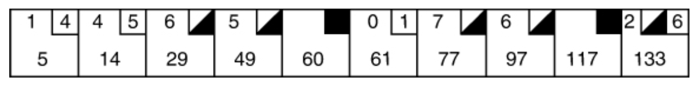
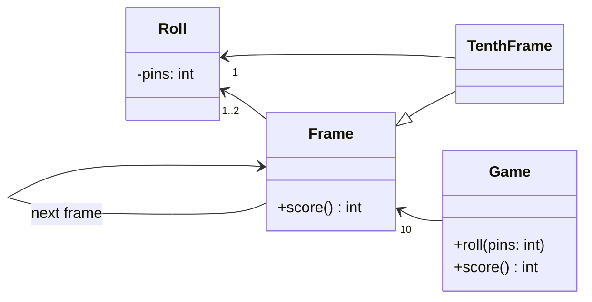
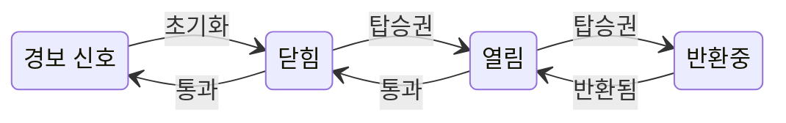
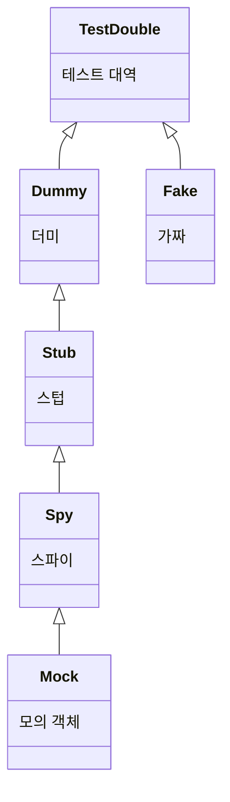

# 소트프웨어 장인정신(Clean Craftsmanship)

- [소트프웨어 장인정신(Clean Craftsmanship)](#소트프웨어-장인정신clean-craftsmanship)
    - [간략 정리](#간략-정리)
    - [목차](#목차)
        - [1부 규율](#1부-규율)
        - [2부 기준](#2부-기준)
        - [3부 윤리](#3부-윤리)
    - [개요](#개요)
    - [1장 장인 정신](#1장-장인-정신)
    - [1부 규율](#1부-규율-1)
        - [규율 개요](#규율-개요)
            - [익스트림 프로그래밍](#익스트림-프로그래밍)
            - [테스트 주도 개발](#테스트-주도-개발)
            - [리팩토링](#리팩토링)
            - [단순한 설계](#단순한-설계)
            - [페어 프로그래밍](#페어-프로그래밍)
            - [인수 테스트](#인수-테스트)
        - [2장 TDD](#2장-tdd)
            - [개요](#개요-1)
                - [테스트 주도 개발의 세 가지 법칙](#테스트-주도-개발의-세-가지-법칙)
                    - [첫 번째 법칙: 프로덕션 코드 작성 전, 실패하는 테스트를 작성하라](#첫-번째-법칙-프로덕션-코드-작성-전-실패하는-테스트를-작성하라)
                    - [두 번째 법칙: 실패하는 테스트가 통과하는 데 필요한 최소한의 프로덕션 코드만 작성하라](#두-번째-법칙-실패하는-테스트가-통과하는-데-필요한-최소한의-프로덕션-코드만-작성하라)
                    - [세 번째 법칙: 테스트가 통과하면 새로운 테스트를 추가하라](#세-번째-법칙-테스트가-통과하면-새로운-테스트를-추가하라)
                    - [녹스는 디버깅 감각](#녹스는-디버깅-감각)
                    - [문서화](#문서화)
                    - [설계의 구멍](#설계의-구멍)
                    - [재미](#재미)
                    - [설계](#설계)
                    - [부차적인 이유들](#부차적인-이유들)
                    - [두려움](#두려움)
                    - [용기](#용기)
                    - [보이 스카우트 규칙](#보이-스카우트-규칙)
                    - [진짜 이유](#진짜-이유)
                - [네 번째 법칙](#네-번째-법칙)
            - [TDD 기초](#tdd-기초)
                - [단순한 예제](#단순한-예제)
                - [스택](#스택)
                - [소인수(prime factor) 분해](#소인수prime-factor-분해)
                - [볼링: 볼링 경기의 점수 계산](#볼링-볼링-경기의-점수-계산)
        - [3장 고급 TDD](#3장-고급-tdd)
            - [정렬 1](#정렬-1)
            - [정렬 2](#정렬-2)
            - [막다른 길: 줄 바꿈 문제](#막다른-길-줄-바꿈-문제)
            - [준비, 행동, 확인](#준비-행동-확인)
                - [동작 주도 개발 도입](#동작-주도-개발-도입)
                - [유한 상태 기계](#유한-상태-기계)
                - [다시 BDD](#다시-bdd)
            - [테스트 대역](#테스트-대역)
                - [더미](#더미)
                - [스텁](#스텁)
                - [스파이](#스파이)
                - [모의 객체](#모의-객체)
                - [가짜](#가짜)
                - [모의 객체 사용 시점이 문제가 되는 이유](#모의-객체-사용-시점이-문제가-되는-이유)
                - [TDD 불확정성 원리](#tdd-불확정성-원리)
                - [(다시) TDD 불확정성 원리](#다시-tdd-불확정성-원리)
                - [런던 대 시카고](#런던-대-시카고)
                    - [깨지기 쉬운 테스트 문제](#깨지기-쉬운-테스트-문제)
                - [확실성 문제](#확실성-문제)

## 간략 정리

우선 TDD에 대해 네 가지 법칙을 정리합니다.
배포를 결정할 수 있을 정도로 신뢰도가 높은 테스트 묶음을 만들고, 이를 통해 개발자가 안전하게 코드를 변경할 수 있도록 합니다.
- 세 가지 법칙
    1. 프로덕션 코드 작성 전, 실패하는 테스트를 작성하라.
    2. 실패하는 테스트가 통과하는 데 필요한 최소한의 프로덕션 코드만 작성한다.
    3. 테스트가 통과하면 테스트를 더 추가하라.
- 네 번째 법칙: 리팩토링
    - 먼저 돌아가게 만들라. 그 다음 제대로 만들라.
- 목표는 빠른 피드팩 주기: 작은 실패 -> 바로 수정 -> 다시 작은 실패 -> 수정
- 규칙(이자 조언)
    - 규칙 1 "작성하고 싶은 코드를 작성하게 만드는 테스트를 쓰라."
    - 규칙 2 "실패시켜라. 통과시켜라. 그리고 정리하라."
    - 규칙 3 "최상의 결과를 추구하지 말라."
    - 규칙 4 "실패하는 가장 간단하고, 가장 구체적이며, 가장 퇴화한(degenerate) 테스트를 쓰라."
    - 규칙 5 "가능하면 일반화하라."
    - 규칙 6 "코드가 틀렸다고 느껴지면 잠시 멈춰서 설계를 고친다."
    - 규칙 7 "더 복잡한 경우로 넘어가기 전에, 현재의 더 단순한 경우를 철저히 테스트하라."
    - 규칙 8 "현재 테스트를 통과시키기 위해 너무 많은 구현을 해야 한다면, 지우고 더 쉽게 통과할 수 있는 더 단순한 테스트를 작성하라."
    - 규칙 9 "테스트 공간을 전부 포괄하는 신중하고 점진적인 패턴을 따르라."
    - 규칙 10 "필요 없는 것을 테스트에 넣지 말라"
    - 규칙 11 "테스트에 실제 서비스 데이터를 사용하지 말라."

## 목차

1장 장인 정신

### 1부 규율

- 익스트림 프로그래밍
- 테스트 주도 개발
- 리팩터링
- 단순한 설계
- 공동 프로그래밍
- 인수 테스트

2장 테스트 주도 개발:
- 개요
- 테스트 주도 개발 기초
- 결론

3장 고급 테스트 주도 개발:
- 정렬 1
- 정렬 2
- 막다른 길
- 준비, 행동, 확인
- 테스트 대역
- 아키텍처
- 결론

4장 테스트 설계:
- 데이터베이스 테스트하기
- GUI 테스트하기
- 테스트 패턴
- 테스트 설계
- 어떻게 변환해야 할까?
- 결론

5장 리팩터링:
- 리팩터링이란?
- 기본 도구
- 규율
- 결론

6장 단순한 설계:
- YAGNI
- 테스트로 검사함
- 표현력 최대화하기
- 중복 최소화하기
- 크기 최소화하기
- 단순한 설계

7장 공동 프로그래밍:

8장 인수 테스트:
- 규율
- 지속적 빌드

### 2부 기준

- 내가 여러분의 신임 CTO라면

9장 생산성:
- 우리는 절대 똥덩어리를 출시하지 않겠다
- 낮은 수정 비용
- 우리는 언제나 준비되어 있을 것이다
- 안정적인 생산성

10장 품질:
- 지속적 개선
- 두려움을 이기는 능력
- 극한의 품질
- 우리는 QA에게 떠넘기지 않을 것이다
- QA는 아무것도 찾지 못할 것이다
- 테스트 자동화
- 자동화 테스트와 사용자 인터페이스
- 사용자 인터페이스 테스트하기

11장 용기:
- 우리는 서로를 대신한다
- 정직한 추정
- "아니요"라고 말해야 한다
- 지속적이고 적극적인 학습
- 멘토링

### 3부 윤리

- 최초의 프로그래머
- 75년
- 괴짜와 구원자
- 롤 모델과 악당
- 우리가 세상을 지배한다
- 재앙들
- 선서

12장 피해:
- 우선 해를 끼치지 말라
- 최선의 결과물
- 반복적인 증명

13장 성실함:
- 짧은 주기
- 가차 없는 개선
- 높은 생산성 유지하기

14장 팀워크:
- 팀으로 일하기
- 정직하고 공정하게 추정하기
- 존중
- 배우기를 멈추지 말라

## 개요

소프트웨어 오류나 부정이 너무 많이 발생하면 소프트웨어 시스템을 떠받치고 있는 공공의 신뢰가 깨질 수 있습니다.
이 신뢰가 깨지고 프로그래밍에 대한 규율, 윤리, 기준을 갖추지 못한다면 이에 대한 불신으로 규제가 생길 수 있습니다.
규제가 생겨나면 개인의 능력을 침해하고 기술과 경제 성장에 제약을 가할 수 있습니다.
그리고 실제로 현실에서 소프트웨어로 인한 다양한 문제가 발생한 적 있고, 현재도 발생하고 있습니다.

소프트웨어 개발자와 관리자들이 '강건하고 && 오류에 안전하고 && 효과적인 소프트웨어'를 만들 수 있도록 가장 효과적인 규율, 기준, 윤리를 가르치는 것이 이 책의 목표입니다.
- 규율(Discipline): 가장 낮은 수준으로, 기술적인 내용을 세세하게 지시
- 기준(Standard): 중간 수준으로, 전문 프로그래머에게 무엇을 기대해야 하는지 배우기
- 윤리(Ethics): 가장 높은 수준으로, 프로그래밍이라는 직업의 윤리적 측면을 설명

## 1장 장인 정신

이론의 단계적인 발전, 마니아들의 도전과 실패, 역량의 단계적 발전을 거쳐 왔습니다.
하지만 자기 기술을 깊이 이해하는 프로그래머를 양성하는 노력은 부족했고, 그로 인해 "장인"이라고 부를 만한 프로그래머는 부족하다고 합니다.

책에서 '장인이 된다는 것'은 *무언가를 잘하는 방법을 안다는 것*이라고 합니다.
이를 위해서는 좋은 교육과 많은 경험이 필요합니다.
하지만 과거에는 프로그래밍을 관리직으로 가는 징검돌로 여겼기 때문에, 프로그래밍 기술을 다른 사람에게 가르칠 만큼 충분한 경험을 쌓은 프로그래머가 별로 없었습니다.

그 결과 대부분의 프로그래머는 한 번도 *자신의 기술을 정의하는 규율, 기준, 윤리*를 배워본 적이 없다고 합니다.

> The result has been that most programmers never learn the disciplines, standards, and ethics that could define their craft.
>
> 이에 대한 책의 번역은 "자신의 기술을 정의할 수도 있는 교육이나 기준, 윤리를 배워본 적이 없다"입니다.
> 하지만, 앞서 내용을 보면 가능성을 의미하는 "~할 수도 있는"이라기보다는, 프로그래머의 기술을 정의하는 데 중요한 역할을 하는 것은 맞지만 이를 배우지 못했다는 의미로 봐야 맞을 거 같습니다.

## 1부 규율

### 규율 개요

규육이란 "일련의 규칙들"이며, 규칙들은 두 가지로 구성됩니다.
- 본질적인 부분
    - 그 규율이 존재하는 이유입니다.
    - 규율에 권위를 부여합니다.

    ex: 외과의의 손은 매우 깨끗해야만 합니다.

- 임의적인 부분
    - 규율에 형태와 실체를 부여합니다.
    - 임의적인 부분 없이는 규율이 존재할 수 없습니다.

    ex: 손가락별로 윗면, 왼쪽 면, 아랫면, 오른쪽 면, 손톱을 각각 열 번 가로질러서 문지릅니다.

    왜 여덟 번이나 열두 번이 아니라 열 번인지, 손가락을 왜 세 부분이나 일곱 부분이 아닌 다섯 부분으로 나누었는지 등이 임의적인 부분입니다. 아마도 그 정도면 충분하다고 여겼기 때문일 겁니다.

거부감이 드는 규율이 있을 수 있는데, 거부감이 '본질적인 요소' 때문인지, 아니면 '임의적인 요소' 때문인지 잘못 판단하지 않도록 주의합니다. '임의적인 요소'보다는 '본질적인 요소'에 집중합니다.

예를 들어, 1861년 이그나즈 제멜바이스는 의사들의 손 씻기 규율 실천에 대한 연구 결과를 발포했습니다.
의사들이 산모를 검사하기 전 염소 표백제로 손을 꼼꼼히 씻은 경우 산모가 패혈증에 걸려서 사망할 비율이 사실상 0으로 떨어졌다고 합니다.
- 본질적인 부분: 손을 꼼꼼히 씻기
- 임의적인 부분: 염소 표백제 사용

하지만 번거롭다는 등의 이유로 염소 표백제로 손을 씨는 일을 기피했고, 이로 인해 본질적인 부분을 놓치게 되었습니다.

#### 익스트림 프로그래밍

폭포수 개발 방법론 이후 스크럼이나 기증 주도 개발(Feature-Driven Development, FDD), 동적 시스템 개발 방법(Dynamic Systems Development Method, DSDM), 크리스털 방법론(Crystal Methodology) 등의 개발 프로세스가 제안되었지만 큰 변화는 없었습니다.

1999년 켄트 백이 익스트림 프로그래밍이라는 책을 출간했습니다. 앞선 프로세스들에서 나온 발상에 기반했고, 여기에 '엔지니어 실천 방법(engineering practice)'을 추가했습니다.


출처: [What is Extreme Programming?](https://ronjeffries.com/xprog/what-is-extreme-programming/)

- 엔지니어 실천 방법
    - 테스트 주도 개발(TDD)
    - 리팩토링
    - 단순한 설계
    - 페어 프로그래밍
- 비즈니스 실천 방법
    - 고객 테스트(Customer Tests) 또는 인수 테스트(Acceptance Tests): 비즈니스 실천 방법 중 가장 기술적이고 엔지니어링에 초점을 둔 실천 방법입니다.

이 다섯 가지 실천 방법이 소프트웨어 장인 정신의 기본 규율에 속한다고 합니다.

#### 테스트 주도 개발

TDD는 핵심 규율로, TDD가 없다면 다른 규율은 지키기 어렵거나 지켜봐야 의미가 없다고 합니다.

TDD는 프로그래머가 일하는 방식을 초 단위로 통제하는 규율입니다.
미리 해치울 수 있는 규율도, 나중으로 미룰 수 있는 규율도 아닙니다.

TDD의 핵심:
- 작은 순환 주기 따르기
    - 모든 활동을 가장 작은 순환 주기로 쪼갭니다.
    - 순환 주기는 몇 초 단위, 몇 글자 단위입니다.
- 테스트 우선하기
    - 모든 활동에서 테스트가 먼저입니다.

TDD의 목표:
- 개발자가 전적으로 신뢰하는 테스트 묶음(Test Suite)를 만드는 것

TDD가 복잡한 이유:
- 코드가 복잡하기 때문입니다. 각 코드의 형태나 유형에 해당하는 TDD가 있습니다.
- 코드에 어울리는 동시에 커플링되지 않아야 하고, 모든 것을 커버하면서도 몇 초 안에 실행되어야 하기 때문입니다.

#### 리팩토링

리팩토링은 깨끗한(clean) 코드를 작성하도록 하는 규율입니다.
'동작을 바꾸지 않으면서' 형편없는 구조의 코드를 더 나은 구조의 코드로 고치는 규율입니다.

동작을 바꾸지 않는다는 게 보장되면, 구조를 개선해도 안전하다고 보장할 수 있습니다.
TDD를 통해 개선 사항이 동작에 영향을 주지 않는다고 보장할 수 있습니다.
그렇기 때문에 TDD가 없다면 리팩토링은 어렵거나 아예 불가능할 수 있습니다.

TDD와 리팩토링은 깊게 얽혀 있습니다.
TDD 없이는 리팩토링이 거의 불가능하고, 리팩토링을 실천하지 않으면 TDD 실천이 사실상 불가능합니다.

#### 단순한 설계

단순한 설계의 목표
- 프로그램, 시스템, 그리고 애플리케이션의 더 큰 구조에 잘 들어맞도록 단순하고 아주 작은 단위로 설계하는 것

    > That goal is the production of simple atomic granules of design that fit well into the larger structures of programs, systems, and applications.

단순한 설계는 리팩토링의 최종 목표입니다.
리팩토링이 없다면 단순한 설계는 거의 불가능합니다.

#### 페어 프로그래밍

소프트웨어 팀에서 함께 일하는 규율이자 기술입니다.
다음과 같은 하부 규율들이 포함됩니다.
- 짝 프로그래밍
- 몹(mob) 프로그래밍
- 코드 리뷰
- 브레인 스토밍 등

이를 통해 지식을 공유하고, 일관성을 보장하고, 팀을 하나로 묶습니다.

#### 인수 테스트

소프트웨어 개발 팀을 사업과 묶어 주는 규칙입니다.
시스템이 동작해야 하는 방식을 사업 목표로 명시하고, 테스트로 코딩하여 표현합니다.
테스트가 통과되면 시스템은 명시한 대로 동작합니다.

인수 테스트는 사업 부서를 대표하는 사람이 읽고 쓸 수 있어야 합니다.
사업 부서는 인수 테스트를 작성하고 읽습니다. 그리고 통과하는 것을 확인함으로써 소프트웨어가 무엇을 하는지, 그리고 사업 부서에 필요한 일을 하는지 알 수 있습니다.

### 2장 TDD

#### 개요

회계로 치면 TDD는 소프트웨어 개발에서 복식 부기입니다.
모든 것을 두 번씩 쓰고, 계속 테스트를 통과하게 함으로써 두 번 쓴 장부의 금액을 맞추는 것과 같습니다.

소프트웨어 개발이 생성하는 것은 소스 코드이고, 테스트는 소스 코드와 함께 작성되어 소스 코드의 기능이 의도대로 동작하는지 검증합니다.
복식 부기에서 차변과 대변이 맞지 않으면 오류를 발견할 수 있듯이, 테스트가 실패하면 코드에 오류가 있음을 발견할 수 있습니다.
따라서 소스 코드가 추가되면 테스트도 같이 추가하여 소프트웨어 개발의 회계 기록을 맞추는 것과 같은 역할을 수행하도록 해야 합니다.

> **복식 부기**
>
> > 자산(Assets) = 부채(Liabilities) + 자본(Equity) + 수익(Revenue) − 비용(Expenses)
>
> 복식부기는 *모든 거래를 차변(Debit)과 대변(Credit)으로 기록*하는 회계 원칙입니다.
> 모든 거래를 차변(Debit)과 대변(Credit) 양쪽에 동시에 기록하여 회계 등식의 균형을 유지합니다.> (대차평균의 원리)
> 각 거래는 최소 두 개 이상의 계정에 영향을 미치며, 차변과 대변의 합은 항상 일치해야 합니다.
>
> - 차변(Debit, Dr.):
>     - 자산의 증가
>     - 또는 부채/자본의 감소
> - 대변(Credit, Cr.):
>     - 자산의 감소
>     - 또는 부채/자본의 증가
>
> 다음은 복식부기 예시입니다.
>
> - A 계좌에서 B 계좌로 1,000원 계좌 이체하는 경우:
>
>     | 계정              | 차변  | 대변  |
>     | ----------------- | ----- | ----- |
>     | B 계좌(입금 계좌) | 1,000 |       |
>     | A 계좌(출금 계좌) |       | 1,000 |
>
>     - B 계좌에 1,000원 입금 -> 자산이 증가 -> 차변에 기입합니다.
>     - A 계좌에서 1,000원 출금 -> 자산이 감소 -> 대변에 기입합니다.
>
> - 은행에서 1,000만 원을 대출받은 경우:
>
>     | title     | 차변       | 대변       |
>     | --------- | ---------- | ---------- |
>     | 은행 계좌 | 10,000,000 |            |
>     | 대출금    |            | 10,000,000 |
>
>     - 은행 계좌에 10,000,000원 입금 -> 자산 증가 -> 차변에 기입합니다.
>     - 대출로 10,000,000원 부채 증가 -> 대변에 기입합니다.
>
> - 체크 카드로 5,000원 커피를 구매할 경우:
>
>     복식 부기는 개별적인 회계 단위를 기준으로 기록하기 때문에, 구매자(나)의 회계 기록과 판매자(커피숍)의 회계 기록이 각각 별도로 존재합니다.
>
>     아래는 구매자의 회계 기록입니다.
>
>     | 계정               | 차변(Debit) | 대변(Credit) |
>     | ------------------ | ----------- | ------------ |
>     | 식비               | 5,000       |              |
>     | 내 계좌(출금 계좌) |             | 5,000        |
>
>     - 식비가 5,000원 증가하므로 차변에 기입합니다.
>     - 내 계좌에서 5,000원 출금하여 자산이 감소하므로 대변에 기입합니다.
>
>     판매자의 회계 기록은 아래와 같을 겁니다.
>
>     | 계정      | 차변(Debit) | 대변(Credit) |
>     | --------- | ----------- | ------------ |
>     | 은행 계좌 | 5,000       |              |
>     | 매출      |             | 5,000        |
>
>     - 판매자 은행 계좌에 5,000원 입금 -> 자산이 증가 -> 차변에 기입합니다.
>     - 매출(Revenue), 즉 수익 증가 -> 순이익(Net Income) 자본이 증가 -> 대변에 기입합니다.

##### 테스트 주도 개발의 세 가지 법칙

우선 세 가지 법칙에 앞서, TDD는 본질적으로 다음과 같은 일을 하기 위한 규율입니다:
1. 테스트 묶음을 만듭니다.
    - 리팩토링을 가능하게 해야 합니다.
    - 통과 여부가 배포 여부를 결정할 수 있을 정도로 믿을 수 있어야 합니다.

2. 테스트와 리팩토링이 가능할 정도로 결합도가 낮은 프로덕션 코드(production code)를 개발합니다.

    > 프로덕션 코드(production code)란 [일반적으로 고객에게 배포할 준비가 된 코드](https://stackoverflow.com/a/52009324)를 의미합니다. ([Production-level code](https://stackoverflow.com/a/3908320) 등 참고)

    - 프로덕션 코드 자체가 독립적이고 모듈화되게 설계해야 함을 의미합니다.
    - 코드가 모듈화되고 독립적이어야 테스트 작성과 리팩토링이 용이해집니다.

3. 주기가 극단적으로 짧은 피드백 고리(loop)를 만들어서 프로그램 작성 작업의 리듬과 생산성을 안정적으로 유지합니다.

4. 테스트와 프로덕션 코드는 서로 충분히 분리되어야 합니다. 이를 통해서,
    - 두 코드 모두를 편리하게 유지보수할 수 있어야 합니다.
    - 두 코드 간에 변경 사항을 반복적으로 복제하는 일은 없어야 합니다.
    - 즉, 프로덕션 코드의 작은 변경에도 테스트 코드가 크게 변경되는 일은 없어야 합니다.

TDD는 완전히 임의적인 세 가지 법칙으로 표현됩니다.
"임의적"이란 점에서 다른 방법으로도 TDD의 본질을 구현할 수 있습니다.

###### 첫 번째 법칙: 프로덕션 코드 작성 전, 실패하는 테스트를 작성하라

> 실패하는 테스트 없이는 프로덕션 코드를 쓰지 말라.
> 테스트 코드를 먼저 작성하라.
> 그러면 이 테스트는 프로덕션 코드가 없어서 실패할 것이다.
>
> Write no production code until you have first written a test that fails due to the lack of that production code.

프로덕션 코드를 개발할 수 있다면, 그 코드를 테스트하는 코드도 개발할 수 있습니다.
테스트를 먼저 개발하는 데 필요한 정보는 이미 다 가지고 있기 때문입니다.

###### 두 번째 법칙: 실패하는 테스트가 통과하는 데 필요한 최소한의 프로덕션 코드만 작성하라

> 테스트 또는 컴파일이 실패하는 데 필요한 만큼만 테스트 코드를 쓰라.
> 그 다음에는 프로덕션 코드를 작성하여 테스트를 통과시켜라.
>
> Write no more of a test than is sufficient to fail or fail to compile.
> Resolve the failure by writing some production code.

프로덕션 코드가 전혀 없거나 부족해서 실패가 발생할 정도로만 테스트 코드를 작성합니다.
- 존재하지 않는 함수를 테스트에서 호출하려고 하면 컴파일 자체가 실패합니다.
- 함수가 존재하더라도 아직 원하는 결과를 반환하지 않으면 테스트가 실패할 수 있습니다.

실패하는 테스트 코드가 성공하도록 프로덕션 코드를 작성합니다.

###### 세 번째 법칙: 테스트가 통과하면 새로운 테스트를 추가하라

> 실패한 테스트를 고치는 데 필요한 만큼만 프로덕션 코드를 작성하라.
> 테스트가 통과하면 테스트를 더 추가하라.
>
> Write no more production code than will resolve the currently failing test.
> Once the test passes, write more test code.

이 세 가지 법칙을 지킬 경우 다음과 같은 주기를 따르게 됩니다.
1. 테스트 코드를 작성합니다. (컴파일 실패)
2. 프로덕션 코드를 개발합니다. (컴파일 성공)
3. 테스트 코드를 추가합니다. (컴파일 실패)
4. 프로덕션 코드를 개발합니다. (컴파일 성공)
5. 테스트 코드를 추가합니다. (컴파일 성공하지만 assertion 실패)
6. 프로덕션 코드를 개발합니다. (컴파일 성공 및 assertion 통과)

테스트 코드와 프로덕션 코드를 오가며 실패하는 코드를 성공으로 만듭니다.
`if` 등 제어문이나 `while` 등 반복문을 한번에 작성하지 않습니다.
테스트를 통과하기 위해 최소한의 논리만 작성한 후, 점진적으로 확장합니다.

> ***<생각>***
> 테스트 가능성을 고려하며 함수를 설계하면, 자연스럽게 결합도가 낮고 단일 책임을 갖는 함수를 개발하게 됩니다. 이를 통해 다음과 같은 관리하기 힘든 코드를 자연스럽게 피할 수 있습니다:
> - 상태에 따라 분기 처리가 많거나 상태를 변화시키는 코드
> - 결합도가 높아서 A 로직 수정 시 B, C, D 등 다른 로직이 깨지는 코드
>
> ```js
> // BAD
> 어떤_상태 = true
> function getUserName(userId) {
>     // - 데이터베이스가 없으면 이 함수는 테스트할 수 없습니다.
>     // - DB 연결이 실패하면 함수 실행도 실패합니다.
>     연결 = DB.연결하기();
>     // - SQL 직접 참조할 경우, 그리고 많은 곳에서 다양하게 사용될 경우,
>     //    스키마 변경 시 SQL 작성된 모든 곳을 찾아서 직접 수정하게 될 수 있습니다.
>     //    반면, ORM을 사용하면 ORM 모델만 수정하면 됩니다.
>     //    물론, ORM 모델을 여럿 만들면 같은 문제가 발생하는 건 마찬가지입니다.
>     결과 = 연결.실행(`쿼리 WHERE id = ${userId}`)
>     if(!결과) {
>         // - 상태 변경을 외부에서 알 수 없으며, 함수 실행 결과가 예측하기 어렵습니다.
>         어떤_상태 = false
>     }
>     if(!어떤_상태) {
>         // - 이 부분을 테스트하려면 상태가 false가 되는 userId를 매개변수로 전달해야 합니다.
>         // do something
>     }
>     return 결과
> }
> ```
>
> ```js
> // Better
> class 유저서비스 {
>     // DB 연결을 외부에서 의존성 주입
>     생성자(유저_리파지토리) {
>         this.유저_리파지토리 = 유저_리파지토리;
>     }
>
>     // 외부에서 예측할 수 없는 상태와 그 상태에 따른 로직은 제거합니다.
>     getUserName(userId) {
>         // 조회의 책임을 repository에 위임합니다.
>         결과 = this.유저_리파지토리.findByUserId(userId);
>
>         if (!결과) {
>             return { success: false, message: "Not Found", data: null };
>         }
>
>         return { success: true, data: 결과.이름 };
>     }
> }
> ```

###### 녹스는 디버깅 감각

디버깅이 필요한 순간도 있겠지만, 디버깅 빈도와 소요 시간을 최소화해야 합니다.
작동하는 코드를 개발하는 데 많은 시간을 사용하고, 작동하지 않는 코드를 고치는 데 최소한의 시간을 사용해야 합니다.

디버거에 익숙하고, 디버깅을 잘할수록 무언가 잘못되고 있다는 징조일 수 있습니다.

###### 문서화

TDD 세 가지 법칙을 따르면 '전체 시스템을 위한 코드 예제'를 쓰게 됩니다.
테스트 자체가 시스템이 어떻게 동작하는지 세부 사항을 사소한 것까지 빠짐없이 설명하기 때문입니다.
- 특정 비즈니스 객체 만드는 모든 방법을 보여주는 테스트
- 특정 API 함수 사용법, 가능한 에러 조건과 예외 등을 보여주는 테스트 등

테스트는 전체 시스템을 가장 낮은 수준에서 설명하는 문서입니다.
모호하지 않고, 실행할 수 있으며, 시스템과 따로 갱신되어 앞뒤가 안 맞게 되는 일이 없는, 거의 완벽한 문서입니다.

각각의 테스트는 전체 시스템에서 아주 제한된 일부에 초점을 맞춘 작은 코드 조각입니다.
각 테스트는 독립적이고, 테스트끼리는 서로 모르기 때문에 의존성이 없고, 그 자체로 이해할 수 있어야 합니다.
즉, 테스트는 시스템의 일부에 대해, 딱 알아야 하는 내용만 설명합니다.

###### 설계의 구멍

> 테스트 묶음이 통과한다면, 시스템을 배포해도 좋다는 확신을 가질 수 있어야 합니다.

구현을 마친 후에 테스트 코드를 작성하면, *이미 시스템이 정상적으로 작동한다는 것을 아는 상태*에서 테스트 코드를 작성하게 됩니다.
그러면 소스 코드를 테스트 가능하게 설계하지 않게 되고, 테스트 코드는 일정 수준의 커버리지를 채우거나 의무적으로 작성하게 될 가능성이 높습니다.

하지만 테스트 가능성을 고려하지 않고 개발하면, 테스트 코드를 작성하기 어려운 케이스가 생길 수밖에 없습니다.
이런 코드를 테스트하려면 이때 설계를 변경해야 하는데, 테스트 작성을 위해서 리소스를 다시 들여서 이미 정상 동작한다고 확인한 코드를 수정하는 경우는 잘 없습니다.
그러면 자연스럽게 테스트 묶음에는 구멍이 생깁니다.

하지만 좋은 테스트 묶음에는 구멍이 없어야 합니다.
그리고 구멍 없는 테스트 묶음의 통과를 통해 배포를 결정할 수 있습니다.

###### 재미

실패하던 테스트가 통과되도록 코드를 작성하는 것의 재미가 있고, 유능하다는 기분도 느끼게 하는 등의 장점이 있다고 합니다.

실제로 개발한 코드에 대해 작성한 테스트가 잘 통과하면, 서로 다른 두 모형이 빈틈 없이 결합되는 것과 같은 기분 좋은 느낌을 받기는 합니다.

###### 설계

테스트를 먼저 작성하다 보면, 자연스럽게 테스트하기 쉬운 코드를 설계하게 됩니다.

그렇다면 테스트하기 어려워지는 이유는 무엇일까? 결합과 의존성 때문이라고 합니다.
테스트하기 쉬운 코드는 잘 분리되어서 결합과 의존성이 없습니다.

###### 부차적인 이유들

TDD 세 가지 법칙을 적용하는 경우의 이점:
- 작동하는 코드를 작성하는 데 많은 시간을 사용하고, 작동하지 않는 코드를 디버깅하는 데에는 더 적은 시간을 사용합니다.
- 완벽에 가까운 저수준 문서 한 벌이 만들어집니다.
- 재미있거나 적어도 동기 부여가 됩니다.
- 배포에 대한 확인을 주는 테스트 묶음을 만들게 됩니다.
- 결합도가 낮은 설계를 만듭니다.

###### 두려움

코드를 변경하면 망가질 위험이 있고, 개발자는 망가진 후 여파를 두려워합니다.
이런 두려움의 결과로 코드는 언제나 썩게 되고, 아무도 정리하지 않게 됩니다.

꼭 바꿔야 할 때는 *시스템에 최선인 방향*이 아닌 개발자에게 가장 위험하지 않은 방향으로 변경이 이뤄집니다.
코드가 썩고 설계 품질이 떨어지면 생산성이 감소하고, 이는 생산성이 0이 될 때까지 이어집니다.

안 좋은 코드가 존재한다면, 그건 코드를 개선할 용기가 있는 사람이 없었기 때문일 것입니다.

###### 용기

테스트를 통과하면 배포해도 좋다고 확신을 가질 수 있는 테스트 묶음이 있다면, 무언가 망가뜨리는 순간 무엇이 잘못되었는지 알려줄 수 있는 테스트 묶음이 있다면 두려워할 필요가 없습니다.

**이러한 테스트 묶음과 함께라면, 안전하게 코드를 정리할 수 있습니다**.

###### 보이 스카우트 규칙

> 받았을 때(check out)보다 더 깨끗한 코드를 제출(check in)하라.
>
> Check the code in cleaner than you checked it out.

신뢰할 수 있는 테스트 묶음이 있다면, 안전하게 코드를 정리할 수 있고, 그렇다면 모두가 코드를 제출할 때마다 조금씩 더 나은 코드를 제출할 수 있습니다.

코드를 제출할수록 점점 깨끗해진다면, 더 원활하게 유지 보수할 수 있을 겁니다.
더 명확하게 소요 시간을 추정하고 일정 산정이 가능해질 겁니다.
계속 정리를 하므로 버그 목록이 그렇게 오래 유지되지도 않을 겁니다.
너무 많은 버그로 인해 버그 목록을 관리하기 위한 DB가 필요하지도 않을 겁니다.

###### 진짜 이유

TDD를 실천하는 이유는, *코드를 깨끗하게 유지*하고 *끊임없이 정리*하기 위함입니다.

코드를 보면 코드가 깨끗하다는 것을 알 수 있도록,
우리가 코드를 건드릴 때마다 이전보다 나아진다는 것을 알 수 있도록.

##### 네 번째 법칙

TDD의 네 번째 법칙은 '리팩토링'입니다.

TDD의 세 법칙으로 테스트 코드와 프로덕션 코드 작성을 반복하다 보면, 테스트 코드와 프로덕션 코드는 빠르게 엉망이 됩니다.
인간은 동시에 두 가지 일을 잘 못하기 때문입니다.
- '실패하는 테스트' 작성에 집중하면, 잘 작성된 테스트가 아닐 가능성이 높습니다.
- '테스트를 통과하는 프로덕션 코드' 작성에 집중하면, 좋은 프로덕션 코드가 아닐 가능성이 높습니다.

원하는 동작(실패하는 테스트, 테스트를 통과하는 프로덕션 코드)에 집중하면, 원하는 구조(잘 작성된 테스트, 좋은 프로덕션 코드)에 집중하지 못하게 됩니다.

동작하면서 동시에 올바른 구조를 갖도록 코드를 작성하는 것은 어려운 작업임을 인정하고, 켄트 백의 조언을 따릅니다.

> 먼저 돌아가게 만들라. 그 다음 제대로 만들라.
>
> First make it work. Then make it right.

#### TDD 기초

##### 단순한 예제

모든 훌륭한 소프트웨어 설계자의 핵심 목표는 *크고 복잡한 시스템을 작고 단순한 문제 여러 개로 쪼개는 것*입니다.
개발자의 일은 이런 크고 복잡한 시스템을 개별적인 코드 라인으로 분해하는 것입니다.(The job of a programmer is to break those systems down into individual lines of code.)

따라서 다음에 나올 예제들은 *프로젝트 규모와 관계없이* TDD를 대표합니다.
TDD 개발의 리듬과 기법은 적용 범위, 즉 규모와 무관하다고 합니다.

##### 스택

- 규칙 1:

    > 작성하고 싶은 코드를 작성하게 만드는 테스트를 쓰라.
    >
    > Write the test that forces you to write the code you already know you want to write.

    코드를 한 줄 작성할 수 있다는 것은, 그 코드를 테스트하는 테스트도 작성할 수 있다는 것을 의미합니다.

- 규칙 2:

    > 실패시켜라. 통과시켜라. 그리고 정리하라.
    >
    > Make it fail. Make it pass. Clean it up.

    테스트가 있으면, 코드가 계속 작동하는 것을 확인하면서 나쁜 코드를 쉽게 정리할 수 있습니다.
    TDD 주기를 한 바퀴 돌 때마다 나쁜 코드 조각을 정리할 기회가 생깁니다.

- 규칙 3:

    > 최상의 결과를 추구하지 말라.
    >
    > Don’t go for the gold.

    TDD 개발을 처음 배울 때는 어렵거나 흥미로운 부분부터 먼저 공략하고 싶은 유혹을 이겨 내기 힘듭니다.
    스택을 쓴다면 FILO 동작을 가장 먼저 테스트해 보고 싶은 마음이 들 수 있습니다.
    이렇게 최상의 결과를 위해 가장 어려운 문제에 덤벼드는 모습을 "황금을 좇는다(go for the gold)"고 합니다.

    이러한 규칙을 설정하는 이유는,
    - 최상의 결과를 너무 일찍 추구하면, **주변의 세부 사항을 죄다 놓치기 쉽기 때문**입니다.
    - 그리고 부수적인 세부 사항으로부터 나오는 **코드 단순화 기회 역시 놓치기 쉽기 때문**입니다.

예제 [`Stack` 클래스의 구현 과정](./example/app/src/main/java/craftsmanship/a/)과 [테스트 코드의 실패 -> 성공 -> 리팩토링 주기 적용 과정](./example/app/src/test/java/craftsmanship/a/StackTest.java)을 통해 조금 더 구체적으로 'TDD의 네 가지 법칙'과 여기서 정리한 '세 가지 규칙'이 적용되는 과정을 확인할 수 있습니다.

##### 소인수(prime factor) 분해

- 규칙 4:

    > 실패하는 가장 간단하고, 가장 구체적이며, 가장 퇴화한(degenerate) 테스트를 쓰라.

    여기서 '퇴화한'은 *황당할 정도로 제일 단순한 시작 지점*을 나태내기 위한 표현입니다.

- 규칙 5:

    > 가능하면 일반화하라.

    일반화 주문:

    > 테스트가 더 구체적으로 바뀔수록 제품 코드는 더 일반적으로 바뀐다.

    새로운 테스트를 추가할 때마다 테스트 묶음은 더 구체적으로 바뀝니다.
    규칙 5를 적용할 때마다 해답 코드는 더 일반적으로 바뀝니다.

    예를 들어,
    - `while`은 `if`의 일반적인 형태고,
    - `if`는 `while`의 퇴화한(degenerate) 형태라고 볼 수 있습니다.

    이 주문은 '테스트 설계' 및 '깨지기 쉬운(fragile) 테스트를 예방'하는 데 중요한 역할을 합니다.

저자는 처음에 "소인수 분해"를 하기 위해서 "에라토스테네스의 체"를 이용하여 "소수 목록"을 만든 다음, "소인수 분해할 수를 소수로 나누는 방식"을 염두에 뒀습니다.

하지만 TDD 과정을 거쳐서 최종적으로 완성한 코드는 다음과 같습니다:

```java
private List<Integer> factorsOf(int i) {
    List<Integer> factors = new ArrayList<>();
    for (int divisor = 2; i > 1; divisor++) {
        for (; i % divisor == 0; i /= divisor) {
            factors.add(divisor);
        }
    }

    return factors;
}
```

이 반복문에서는 모든 정수로 인수 여부를 확인하는데, 여기에는 합성수도 포함됩니다.
예를 들어, `i=12`라면, `divisor++`는 4도 인수인지 확인할 겁니다.
하지만 실제로는 "실행 순서" 때문에 4가 결과에 포함되지는 않습니다.
`divisor=2`일 때 이미 2의 배수가 모두 제거되었기 때문입니다.

그리고 익히 아는 형태와 다를 뿐, 이 코드가 바로 "에라토스테네스의 체"라는 것을 알 수 있습니다.

`factorsOf`에서 "`divisor`의 배수를 제거"하는 방식과,
`sieveOfEratosthenes`에서, "`i`의 배수를 제거"하는 방식은 마찬가지이기 때문입니다.

```java
/**
 *
 * - https://ko.wikipedia.org/wiki/%EC%97%90%EB%9D%BC%ED%86%A0%EC%8A%A4%ED%85%8C%EB%84%A4%EC%8A%A4%EC%9D%98_%EC%B2%B4#%EC%97%90%EB%9D%BC%ED%86%A0%EC%8A%A4%ED%85%8C%EB%84%A4%EC%8A%A4%EC%9D%98_%EC%B2%B4%EB%A5%BC_%ED%94%84%EB%A1%9C%EA%B7%B8%EB%9E%98%EB%B0%8D_%EC%96%B8%EC%96%B4%EB%A1%9C_%EA%B5%AC%ED%98%84
 */
public List<Boolean> sieveOfEratosthenes(int size) {
    List<Boolean> primeList = new ArrayList<>(Collections.nCopies(size + 1, true));
    // 0번째와 1번째를 '소수 아님' 처리합니다.
    primeList.set(0, false);
    primeList.set(1, false);

    // 2부터 i*i <= size 까지 반복하며 각각의 배수들을 '소수 아님' 처리합니다.
    for (int i = 2; (i * i) <= size; i++) {
        if (primeList.get(i)) {
            // - i = 2
            //   - j = 4
            //   - j = 6
            //   - j = 8
            //   ...
            // - i = 3
            //   - j = 9
            //   - j = 12
            //   - j = 15
            //   ...
            // ... 반복 ...
            for (int j = i * i; j <= size; j += i) {
                primeList.set(j, false);
            }
        }
    }

    // size = 10
    // [false, false, true, true, false, true, false, true, false, false, false]
    return primeList;
}
```

[PrimeFactorsTest](./example/app/src/test/java/craftsmanship/b/PrimeFactorsTest.java) 예제의 요점은, "테스트 케이스를 하나씩 추가하면서 알고리즘을 유도"했다는 것입니다.

이를 통해 저자는 "TDD는 단계적으로 알고리즘을 유도하는 일반적인 기법"일지도 모른다고 말합니다.
'적절한 순서의 테스트 묶음'이 주어진다면, TDD 개발을 사용하여 한 단계씩 결정짓는 방식으로 어떤 프로그램이든 유도할 수 있을지도 모릅니다.

> 1936년 앨런 튜링과 알론조 처치는 각각 '임의의 문제에 대해서 그 문제를 해결할 수 있는 프로그램이 존재하는지 여부를 결정할 수 있는 일반적인 절차는 없다'고 증명했습니다.
>
> 이것을 힐베트르의 '결정 가능성(decidability) 문제'라고 합니다.
> > 어떤 수학적 명제에 대해 그것이 참인지 거짓인지 결정할 수 있는 일반적인 알고리즘이 존재하는지
>
> 그리고 이 결론을 '결정 불가능성(Undecidability)' 이라고 부르며, 컴퓨터 과학의 근본적인 한계를 제시했습니다.
>
> 힐베르트의 문제는 "주어진 디오판토스 방정식(Diophantine equation)에 해가 있음을 증명하는 일반적인 방법이 있는지"였습니다.
>
> 여기서 '디오판토스 방정식'은 오직 정수 입출력을 갖는 수학 함수입니다.
> 예를 들어, 피타고라스 방정식이 이에 해당합니다.
> $$
> x^{2} + y^{2} = z^{2}
> $$
>
> 그리고 '컴퓨터 프로그램'도 정수 입출력을 갖는 수학 함수입니다.
> 따라서 힐베르트의 문제는 컴퓨터 프로그램에 대한 것이라 설명할 수 있습니다.
>
> References:
> - [정지 문제](https://namu.wiki/w/%EC%A0%95%EC%A7%80%20%EB%AC%B8%EC%A0%9C)
>
>    > 임의의 프로그램에 대해 그것이 종료하는지(halting) 여부를 결정짓는 알고리즘은 존재할 수 없다.
>
>    즉, 프로그램이 무한히 루프에 빠질지, 아니면 종료할지를 사전에 알 수 있는 일반화된 방법은 없습니다.

##### 볼링: 볼링 경기의 점수 계산

볼링 경기 한 게임은 10개의 프레임으로 이루어집니다.
- 각 프레임마다 선수는 공을 굴려서 나무 핀 10개를 쓰러뜨려야 하는데, 기회는 두 번입니다.
- 공으로 쓰러뜨린 핀의 수가 그 공의 투구 점수가 됩니다.
- 첫 번째 공으로 10개의 핀을 모두 쓰러뜨렸다면 스트라이크(strike)라 부릅니다.
- 공 두 개를 다 써서 10개의 핀을 모두 쓰러뜨렸다면 스페어(spare)라 부릅니다.
- 도랑(gutter)에 빠진 공은 0점입니다.

점수 계산 규칙은 다음과 같습니다:
- 스트라이크가 나오면 점수는 10점에 그 다음 투구 2회의 점수를 더합니다.
- 스페어가 나오면 점수는 10점에 그 다음 공의 투구 점수를 더합니다.
- 스트라이크나 스페어가 아니면 해당 프레임 투구 2회에서 쓰러뜨린 핀의 개수가 점수입니다.



1. 프레임: 5점
    1. 1개의 핀 쓰러뜨림
    2. 4개의 핀 쓰러뜨림
2. 프레임: 9점(총 14점)
    1. 4개의 핀 쓰러뜨림
    2. 5개의 핀 쓰러뜨림
3. 프레임: 다음 프레임 진행 전에는 계산 불가 -> '4.1'에서 5점 + 10점 = 15점(총 29점)
    1. 6개의 핀 쓰러뜨림
    2. 4개의 핀 쓰러뜨림(스페어)
4. 프레임: 다음 프레임 진행 전에는 계산 불가 -> '5.1'에서 10점 + 10점 = 20점(총 49점)
    1. 5개의 핀 쓰러뜨림
    2. 5개의 핀 쓰러뜨림(스페어)
5. 프레임: 다음 프레임 진행 전에는 계산 불가 -> '6.1'과 '6.2'에서 1점 + 10점 = 11점(총 60점)
    1. 10개의 핀 쓰러뜨림(스트라이크)
6. 프레임: 1점(총 61점)
    1. 0개의 핀 쓰러뜨림
    2. 1개의 핀 쓰러뜨림
7. 프레임: 다음 프레임 진행 전에는 계산 불가 -> '8.1'에서 6점 + 10점 = 16점(총 77점)
    1. 7개의 핀 쓰러뜨림
    2. 3개의 핀 쓰러뜨림(스페어)
8. 프레임: 다음 프레임 진행 전에는 계산 불가 -> '9.1'에서 10점 + 10점 = 20점(총 97점)
    1. 6개의 핀 쓰러뜨림
    2. 4개의 핀 쓰러뜨림(스페어)
9. 프레임: 다음 프레임 진행 저에는 계산 불가 -> '10.1'과 '10.2'에서 10점 + 10점 = 20점(총 117점)
    1. 10개의 핀 쓰러뜨림(스트라이크)
10. 프레임: 다음 투구 진행 저에는 계산 불가 -> '10.3'에서 6점 + 10점 = 16점(총 133점)
    1. 2개의 핀 쓰러뜨림
    2. 8개의 핀 쓰러뜨림(스페어)
    3. (스페어 점수 계산 위해 투구) 6개의 핀 쓰러뜨림



- `Game`은
    - 10개의 `Frame`을 갖습니다.
    - `roll` 함수는 선수가 투구할 때마다 호출되며, 쓰러뜨린 핀의 수가 인자로 넘어옵니다.
    - `score` 함수는 모든 투구가 끝난 후 한 번 호출되며 전체 게임의 점수를 반환합니다.
- `Frame`은
    - "1..2"개의 `Roll`(투구)을 갖습니다.
    - 각 `Frame` 객체는 다음 `Frame` 객체를 "next frame"으로 가리킵니다.
    - `score` 함수가 스페어나 스트라이크의 점수를 계산할 때 "next frame"으로 다름 프레임의 투구 내용을 볼 수 있습니다.
- `TenthFrame`은
    - `Frame`을 상속합니다.
    - 상속받은 "1..2" 투구 외에 한 번의 투구를 더 추가하여, "2..3"개의 `Roll`을 갖습니다.

> 계단(stairstep) 테스트
>
> 앞으로 필요로 할 클래스, 함수, 또는 다른 구조를 만들도록 강제하기 위해 작성하는 테스트가 있습니다.
> 이런 테스트는 너무 퇴화(degenerate)해서 단정문이 없거나 아주 단순한 단정문이 전부인 경우가 있습니다.
>
> 이런 테스트들은 나중에 추가한 좀 더 포괄적인 테스트로 대신할 수 있어서 지워도 안전한 경우가 많은데, 이런 종류의 테스트를 '계단 테스트'라고 부릅니다.
> '복잡도를 필요한 수준까지 점진적으로 증가시킬 수 있게 도와주는 계단' 역할을 하기 때문입니다.

[Game_24_14](./example/app/src/main/java/craftsmanship/c/Game_24_14.java)를 보면 TDD 개발 과정중 설계 결함이 생기는 경우를 확인할 수 있습니다.

함수의 이름상 `score()` 함수가 점수를 계산해야 하는데, `roll(pins: int)` 함수에서 점수를 계산하고 있습니다.
이를 '책임 배치 오류'(misplaced responsibility)라고 합니다.

> 책임 배치 오류(misplaced responsibility)
>
> '특정 계산을 수행한다고 주장'하는 함수가, '실제로는 그 계산을 하지 않는' 설계 결함입니다.
>
> 실제 계산은 다른 곳에서 이뤄집니다.

실제로 '특정 작업을 한다고 주장'하는 함수에 가 보았더니, 실제로는 그 작업을 하지 않는 경우를 종종 마주칩니다.
그래서 실제로 그 작업이 어디서 이뤄지는지 알 수 없는 경우가 있습니다.

저자는 "자신이 영리하다고 여기는 프로그래머 때문"이라고 합니다.
투구할 때마다 함수가 호출되니, 투구별 점수를 더하기만 하면 되므로, 덧셈을 `roll(pins: int)`에 넣어버립니다.

- 규칙 6:

    > 코드가 틀렸다고 느껴지면 잠시 멈춰서 설계를 고친다.
    >
    > When the code feels wrong, fix the design before proceeding.

올바른 설계를 만들면, 코드는 알아서 제자리를 찾아가기 시작합니다.
일찍부터 올바르게 설계하면, 시간을 엄청나게 절약할 수 있습니다.

최종적으로 구현된 점수를 계산하는 `score` 함수를 보면 다음과 같습니다([Game_26_15](./example/app/src/main/java/craftsmanship/c/Game_26_15.java))

```java
public int score() {
    int score = 0;

    // 스트라이크 여부를 테스트하는 `Predicate`으로 추출합니다.
    Predicate<Integer> isStrike = frameIdx -> rolls[frameIdx] == 10;
    // 스트라이크 점수 계산식을 `UnaryOperator`로 추출합니다: 10점 + 스트라이크 보너스(다음 두 개의 공)
    UnaryOperator<Integer> strikeBonus = frameIdx -> 10 + rolls[frameIdx + 1] + rolls[frameIdx + 2];

    // 스페어 여부를 테스트하는 `Predicate`으로 추출합니다.
    Predicate<Integer> isSpare = frameIdx -> rolls[frameIdx] + rolls[frameIdx + 1] == 10;
    // 스페어 점수 계산식을 `UnaryOperator`로 추출합니다: 10점 + 스페어 보너스(다음 한 개의 공)
    UnaryOperator<Integer> spareBonus = frameIdx -> 10 + rolls[frameIdx + 2];

    // 기본 "프레임당 투구 두 번 전략" 경우 점수 계산식을 `UnaryOperator`로 추출합니다: 공 두 개의 점수
    UnaryOperator<Integer> twoBallsInFrame = frameIdx -> rolls[frameIdx] + rolls[frameIdx + 1];

    int frameIdx = 0;
    for (int frame = 0; frame < 10; frame++) {
        if (isStrike.test(frameIdx)) {
            score += strikeBonus.apply(frameIdx);
            // 스트라이크 경우 해당 프레임은 투구가 한 번밖에 없으므로, "투구 한 번 전략"을 따릅니다.
            frameIdx++;
        } else if (isSpare.test(frameIdx)) {
            score += spareBonus.apply(frameIdx);
            // 스페어 경우에도 "프레임당 투구 두 번 전략"을 따릅니다.
            frameIdx += 2;
        } else {
            score += twoBallsInFrame.apply(frameIdx);
            // 기본적으로 "프레임당 투구 두 번 전략"을 따릅니다.
            frameIdx += 2;
        }
    }

    return score;
}
```

저자는 [BowlingTest](./example/app/src/test/java/craftsmanship/c/BowlingTest.java)처럼 TDD 방식으로 개발을 하니 위와 같은 결과를 얻을 수 있었다고 합니다.

하지만 앞서 UML을 그릴 때 `TenthFrame`가 필요할 것이라 생각했던 것과 달리, `score` 함수에서는 10 프레임에 대해 특별한 처리를 하고 있지 않습니다.(다만, 테스트 코드를 보면 알 수 있듯이, 총 몇 번을 `roll`할 것인지 고려해서 호출하긴 합니다.)

이를 통해 알 수 있는 것은, 처음 생각과 다리 사실은 "10 프레임이 전혀 특별하지 않았다는 것"입니다.

UML대로 구현하기로 하고 만약 서너 명이 나누어서 개발했다면, 400줄의 코드를 작성했을 수도 있습니다.
(저자는 실제로 그렇게 개발했기 때문에 400줄이나 된다는 것을 안다고 합니다.)

하지만 [Game_26_15](./example/app/src/main/java/craftsmanship/c/Game_26_15.java) 코드를 보면 총 52줄의 코드로 원하는 결과를 달성할 수 있습니다.(책에서는 `score` 함수만 14줄이라 하지만, 그냥 전체 코드 길이로 비교합니다.)

완성한 후에는 다음과 같은 생각들이 떠오를 수 있습니다.
- 하나의 `for` 반복문과 두 개의 `if`문으로 문제를 해결할 수 있다는 것을 떠올릴 수 있었는가?
- 테스트 중 하나가 결국 `Frame` 클래스를 작성하도록 만들 것이라 예상했는가?
- 10 프레임에 대한 처리가 나오길 기다렸는가? 그리고 거기서 엄청 복잡한 경우가 발생할 것이라 예상했는가?
- 10 프레임 테스트 실행 전에 사실 개발이 완료됐다는 것을 알고 있었는가? 아니면 뭔가 더 할 것이 있다고 생각했는가?
- 테스트를 작성할 때 더 많은 작업이 남아 있을 것이라 예상했지만, 놀랍게도, 이미 작업이 끝났다는 것을 알았는가?

누군가는 앞서 작성한 UML 도표에 따라 개발했다면 변경이나 유지보수가 더 쉬운 코드를 개발할 수 있었을 것이라고 말할 수 있습니다.
하지만, 400줄 이상의 코드와 52줄의 코드 중 후자가 더 관리하기 좋을 것입니다.

> ***<생각>***
>
> 처음에는 TDD가 `Game`의 인터페이스를 설계하는 데 도움을 주지는 않는다고 생각했습니다.
> 앞서 `Game` 클래스의 `score` 또는 `roll` 함수는 당연하다는 듯이 정의하고 넘어갔기 때문입니다.
>
> 하지만, UML을 그리기 전, 컴파일도 안 되는 테스트를 작성하면서 어떤 인터페이스를 사용할지 테스트해볼 수 있습니다.
>
> 실행은 안 되지만, 애초에 실행이 목적이 아니므로 IDE의 에러는 무시합니다.
> 그리고 어떤 인터페이스를 정의할 것인지를 작성하면서 첫 번째 법칙 "프로덕션 코드 작성 전, 실패하는 테스트를 작성하라."를 따릅니다.
>
> ```java
> // 이 시점 Game 클래스는 비어있는 클래스입니다.
> // public class Game {}
>
> // 하지만 일단 여러 함수를 고려해 봅니다.
> Game game = new Game();
> game.roll(5);
> game.rolls(5, 2, 1); // vargs 지원?
> game.ball(5);
>
> game.score();
> game.getScore();
> game.totalScore();
> game.getTotalScore();
> game.calculate();
> game.calculateScore();
> game.result();
> ```
>
> 물론 컴파일 성공을 위해 삭제하기 때문에 어딘가에 이런 고민에 대한 기록을 남지는 않습니다.
> 하지만 TDD를 통해 클래스가 어떤 역할을 하고, 어떤 인터페이스 갖는지 등을 고민할 수 있습니다.

### 3장 고급 TDD

#### 정렬 1

[TDD 기초](#tdd-기초)는 "TDD가 임의의 문제를 풀기 위한 알고리즘을 유도하는 단계적이고 점진적인 절차일 가능성"을 보여줍니다.

수학이나 기하학 증명 문제를 푸는 것처럼, 기본 공리에서 시작합니다.
기본 공리는 '실패하는 퇴화한(degenerate) 테스트'입니다.
그리고 한 번에 한 단계씩 문제의 해법을 쌓아 올립니다.

각 단계마다,
- 테스트는 제한적(constraining)이고 구체화(specific) 됩니다.
- 반면, 프로덕션 코드는 더 일반화(generic) 됩니다.

이 과정은 프로덕션 코드가 너무 일반적이어서 더 이상 실패하는 테스트를 생각해 낼 수 없을 때까지 계속됩니다.

자세한 과정은 [버블 정렬 TDD 과정](./example/app/src/test/java/craftsmanship/d/SortTest.java)를 참고합니다.

#### 정렬 2

- 규칙 7:

    > 더 복잡한 경우로 넘어가기 전에, 현재의 더 단순한 경우를 철저히 테스트하라.

여기서는 [정렬 1](#정렬-1)의 과정이 아닌 다른 방식으로 정렬 알고리즘을 구현합니다.

[정렬 1](#정렬-1)에서는 '비교 후 바꾸기 알고리즘'을 사용하여 리스트에서 in place으로 `swap`을 수행했습니다.
하지만 여기서는 순서대로 원소들을 추가하여 정렬된 새로운 리스트를 만듭니다.

새로운 리스트를 만들 때 모든 경우의 수를 고려하여 인자를 일일이 나열하는 것은 사실상 불가능합니다.
다음과 같이 원소의 개수가 두 개여서 (2 * 1) = 2가지 경우의 수가 존재하는 정도에만 일일이 나열하여 새로운 리스트를 만들 수 있을 겁니다.

```java
if (list.size() == 2) {
    var first = list.getFirst();
    var second = list.get(1);
    if (first > second) {
        return mutableList(second, first);
    }
    return mutableList(first, second);
}
```

하지만 원소의 개수가 늘어나면 고려해야 하는 리스트의 경우의 수는 기하급수적으로 증가합니다.
가령 원소에 중복이 존재하지 않은 경우, n개의 원소에 대해 'n!' 경우의 수만큼 리스트를 만들어야 합니다.

이는 현실적으로 불가능하며, 책에서는 더 단순하게 접근하기 위해 '삼분법(law of trichotomy)'을 제안합니다.
'삼분법(law of trichotomy)'은 '어떤 두 수 A와 B에 대해, 두 수의 관계는 $A < B$ 또는 $A = B$ 또는 $A > B$ 셋 중 하나'라는 것입니다

여러 개선 과정을 거치지만, 최종적으로는 임의의 값 `middle`(혹은 `pivot`)을 선택하여 원소들을 세 개의 리스트로 분할합니다.
그리고 다시 분할한 리스트에 대해 재귀적으로 `sort` 함수를 호출합니다.
마지막으로 `middle`보다 작은 값들, `middle`과 같은 값들, `middle`보다 큰 값들 순서(여기서는 오름차순)대로 담아서 정렬을 완료합니다.

```java
var lessThanMiddle = list.stream().filter(x -> x < middle).toList();
var middles = list.stream().filter(x -> x == middle).toList();
var greaterThanMiddle = list.stream().filter(x -> x > middle).toList();

var result = new ArrayList<>(sort2(lessThanMiddle));
result.addAll(middles);
result.addAll(sort2(greaterThanMiddle));

// 만약 순서를 다음과 같이 큰 값들, 중간 값들, 작은 값들 순서로 담으면 내림차순 정렬이 됩니다.
// ```
// var result = new ArrayList<>(sort2_5_refactored(greaterThanMiddle));
// result.addAll(middles);
// result.addAll(sort2_5_refactored(lessThanMiddle));
// ```
```

[정렬 1](#정렬-1)에서 구현한 정렬을 버블 정렬이라 하고,
여기 [정렬 2](#정렬-2)에서 구현한 정렬은 퀵 정렬이라 합니다.

자세한 TDD 과정은 [SortTest](./example/app/src/test/java/craftsmanship/d/SortTest.java)에서 `sort2_*`를 참고합니다.

#### 막다른 길: 줄 바꿈 문제

TDD 초보는 이따금 곤경에 빠진다고 합니다.
완벽하게 좋은 테스트를 작성했는데, 이 '테스트를 통과하려면 알고리즘 전체를 한 번에 다 구현'할 수밖에 없는 경우가 그렇습니다.
이러한 경우를 '막다른 길'이라고 부른다고 합니다.

- 규칙 8

    > 현재 테스트를 통과시키기 위해 너무 많은 구현을 해야 한다면, 테스트를 지우고 더 쉽게 통과시킬 수 있는 더 단순한 테스트를 작성하라.
    >
    > If you must implement too much to get the current test to pass, delete that test and write a simpler test that you can more easily pass.

'줄 바꿈 문제'는 '막다른 길'에 빠지기 쉬운 문제라고 합니다.
'줄 바꿈 문제'는 줄 바꿈이 없는 글이 문자열로 주어졌을 때, N 글자 너비의 화면에 맞도록 줄 바꿈 문자를 적절히 삽입하는 문제입니다. 되도록 단어 사이에만 줄 바꿈을 넣습니다.

```java
// 처음에 너무 이르게 일반화 한 경우
private String wrap_1(String s, int width) {
    return s.replace(" ", "\n");
}

// 아주 작은 케이스에서 일일이 직접 처리한 경우
private String wrap_5(String s, int width) {
    if (s.length() <= width) {
        return s;
    }

    // 바로 모든 공백 문자를 개행 문자로 바꾸는 대신, 더 퇴화된 수준의 코드를 먼저 작성합니다.
    // 아직은 일일이 처리할 수 있으므로, 아직은 '모든 공백을 개행문자로 치환'하는 일반화를 하지 않습니다.
    return s.substring(0, width) + "\n" + s.substring(width);
}

// `wrap_5`를 발전시켜거 완성한 함수
private String wrap_9(String s, int width) {
    if (s.length() <= width) return s;

    var newLineAt = s.lastIndexOf(" ", width);
    if (newLineAt == -1) {
        newLineAt = width;
    }

    return s.substring(0, newLineAt).trim()
        + "\n"
        + wrap_9(s.substring(newLineAt).trim(), width);
}
```

처음에 모든 문자열을 개행 문자로 바꾸도록 구현할 경우 테스트 케이스를 순차적으로 발전시키기 어렵습니다.
단순한 테스트 케이스에서도 발견할 수 있는 예외 처리나 엣지 케이스 등을 놓쳐버리기 때문입니다.

나중에 복잡한 테스트 케이스를 다룰 때 결국 해당 예외 처리나 엣지 케이스를 마주치게 되고, 그때가 되면 이미 늦습니다.
이미 일반화된 코드를 다시 구체적으로 변경해야 하고, 그러면 쓸데없는 `if`나 반복문이 추가되면서 관리하기 어려운 코드가 되기 때문입니다.

따라서 너무 이르게 일반화하지 말고, 겸손하게 테스트 케이스를 진행시켜야 합니다.
아주 단순한 테스트에서 가능한 많은 실패를 밟고 프로덕션 코드에 적용해야, 나중에 테스트 케이스가 복잡해졌을 때 일반화된 코드를 구체화하는 일이 없을 겁니다.

- 규칙 9

    > 테스트 공간을 전부 포괄하는 신중하고 점진적인 패턴을 따르라.
    >
    > Follow a deliberate and incremental pattern that covers the test space.

구체적인 과정은 [WrapTest](./example/app/src/test/java/craftsmanship/e/WrapTest.java)를 참고합니다.

#### 준비, 행동, 확인

오래전 빌, 웨이크(Bill Wake)라는 사람이 모든 테스트의 근본적인 패턴을 발견했다고 합니다.
이를 3A 또는 AAA 패턴이라고 하는데 '준비(Arrange) - 행동(Act) - 확인(Assert)'를 의미합니다.

- 준비(Arrange):

    준비는 보통 `setup` 메서드 또는 테스트 함수 가장 첫 부분에서 이뤄집니다.
    테스트 수행 전, 시스템을 필요한 상태로 만들어 놓는 것이 목적입니다.

- 행동(Act):

    테스트가 함수를 호출하거나, 동작을 수행하거나, 또는 테스트의 대상이 되는 절차를 작동시키는 것을 의미합니다.

- 확인(Assert):

    시스템이 원하는 상태로 바뀌었는지 확인하기 위해 행동의 결과를 살펴보는 과정입니다.

```java
@Test
public void gutterGame_26_15_refactoring_success() throws Exception {
    // 준비(Arrange)
    Game_26_15 game = new Game_26_15();
    IntStream.range(0, 20).forEach(idx -> game.roll(0));
    // 행동(Act)
    var actual = game.score();
    // 확인(Assert)
    assertThat(actual).isEqualTo(0);
}
```

##### 동작 주도 개발 도입

2003년 댄 노스는 크리스 스티븐슨, 크리스 마츠와 함께 TDD를 실천하고 가르치다 GWT라는 패턴을 발견했습니다. GWT는 '조건(given) - 만일(when) - 그러면(then)'을 의미합니다.
이것이 동작 주도 개발(Behavior driven development, BDD)의 시작이라고 합니다.

처음에 BDD는 개선된 테스트 작성 방법으로 여겨졌다고 합니다.
그리고 'JBehave' 또는 'RSpec' 같은 테스트 도구 안에 GWT 용어들이 추가됐습니다.

예를 들어, `gutterGame_26_15_refactoring_success`를 BDD 용어로 다시 작성하면 다음과 같습니다.

```plaintext
조건 볼링 게임에서 공을 20번 도랑에 빠뜨렸을 때,
만일 게임의 점수를 요청하면,
그러면 총점은 0점이다.
```

이 문장들을 실행할 수 있는 테스트로 번역하기 위해 'JBehave'와 'RSpec'은 어포던스(affordance)를 제공합니다.

> 어포던스(affordance)?
>
> 올바른 행동을 유도하는 디자인이나 성질 등을 의미합니다.
>
> 예를 들어, 'JBehave'가 제공하는 문장 분석 도구를 사용하면 자연스럽게 동작 주도 개발 구조에 맞는 테스트를 작성하게 됩니다.

또한 TDD의 테스트와 BDD의 테스트가 아주 비슷하다는 것도 명확합니다.

시간이 흐름에 따라 BDD 용어들은 테스트에서 '시스템 명세의 문제'로 자리를 옮겼다고 합니다.
BDD 지지자들은 GWT 문장이 테스트로서 전혀 실행되지 않더라도 '동작의 명세'로서 여전히 가치가 있다는 점을 깨달았습니다.

2013년 리즈 쿄(Liz Keogh)는 BDD에 대해 다음과 같이 말했다고 합니다.

> 예제를 사용하여 애플리케이션이 어떻게 동작하는지 설명한다.
> ...
> 그리고 그 예제에 대해 대화한다.

하지만 GWT는 테스트와 완전히 떼어 놓기 힘듭니다.
다음 문장을 보면 앞서 언급한 AAA(3A) 패턴과 연결됨을 알 수 있습니다.
- '조건' 테스트 데이터가 '준비'됐을 때
- '만일' 내가 테스트대로 '행동'한다면
- '그러면' 결과가 예상대로인지 '확인'한다

##### 유한 상태 기계

소프트웨어에서 자주 마주치는, 세 가지 요소로 이루어진 유명한 용어가 있는데, '유한 상태 기계(finite state machine)'의 '상태 이행(transition)'이라고 합니다.



- 개찰구는 '닫힘' 상태에서 시작합니다.
- '탑승권'을 내면 '열림' 상태로 바뀝니다.
- 누군가가 통과하면 개찰구는 '닫힘' 상태로 돌아갑니다.
- '탑승권'을 내지 않고 지나가면 '경보'가 울립니다.
- 누군가 '탑승권'을 두 장 내면 남은 한 장이 환불됩니다.

| 현재 상태 | 이벤트 | 다음 상태 |
| :-------: | :----: | :-------: |
|   닫힘    | 탑승권 |   열림    |
|   닫힘    |  통과  | 경보 신호 |
|   열림    | 탑승권 |  반환 중  |
|   열림    |  통과  |   닫힘    |
|  반환 중  | 반환됨 |   닫힘    |
| 경보 신호 | 초기화 |   닫힘    |

각 행에는 GWT나 AAA와 마찬가지로 세 가지 요소가 있습니다.
더 중요한 것은 이런 '상태 이행의 세 가지 요소'가 GWT나 AAA의 대응되는 세 요소와 뜻이 동일하다는 점입니다.

> '조건' 닫힘 상태일 때
> '만일' 탑승권 이벤트를 받으면
> '그러면' 열림 상태로 이행한다.

이를 바탕으로, "'모든 테스트'는 시스템의 동작을 기술하는 '유한 상태 기계의 상태 이행'이다."라고 추론할 수 있습니다.
"'모든 테스트'는 여러분이 프로그램에서 만들려고 하는 '유한 상태 기계의 상태 이행'"입니다.

모든 프로그램은 '유한 상태 기계'고, 컴퓨터는 그저 '유한 상태 기계 처리기'(processor)일 뿐입니다.
컴퓨터 자체는 명령어(instruction)를 실행할 때마다 하나의 상태에서 다음 상태로 이행합니다.

따라서 다음은 모두 '유한 상태 기계의 상태 이행'일 뿐입니다.
- TDD를 실천할 때 작성하는 테스트
- BDD를 실천할 때 기술하는 동작

테스트 묶음이 완벽하다면, 그 테스트 묶음이 바로 그 유한 상태 기계입니다.

그렇다면, 다음과 같은 의문들이 들 수 있습니다.
- 상태 기계에서 '처리하고 싶은 상태 이행을 모두 빠짐없이 테스트에 넣었는지' 어떻게 확인할 수 있을까?
- '테스트가 나타내는 상태 기계가 프로그램이 구현해야 하는 상태 기계 전체인지' 어떻게 확인할 수 있을까?
- 필요한 상태 이행을 테스트로 먼저 작성하고, 그 다음에 상태 이행을 구현하는 프로덕션 코드를 작성하는 방법보다 더 나은 방법이 있을까?

##### 다시 BDD

BDD 지지자들은 '시스템의 동작'을 설명하는 최고의 방법은 '유한 상태 기계'로 나타내는 것이라는 결론에 도달했습니다.

#### 테스트 대역

2000년 스티브 프리먼, 팀 매키넌, 필립 크레이그는 '[Endo-Testing: Unit Testing with Mock Objects](https://www2.ccs.neu.edu/research/demeter/related-work/extreme-programming/MockObjectsFinal.PDF)'라는 논문을 발표했습니다.

> Endo-Testing? 내부 테스트

이 논문의 영향으로 'mock'이 널리 쓰이게 됐고, 이후 동사가 됐습니다.
그리고 무언가를 '모의 객체'로 대신하기 위해, 즉 목(mock)하기 위해 모킹(mocking) 프레임워크를 사용합니다.

> 'mock'이라는 단어에는 여러 뜻이 있는데, 가짜라는 의미일 때는 원래 주로 형용사로 쓰인다고 합니다.
> 테스트 대역 사용을 돕는 라이브러리나 프레임워크는 대부분 이름에 'mock'이 들어 있습니다.

아직 TDD 발상이 스프트웨어 커뮤니티에 퍼지기 시작하던 초기, 대부분은 테스트 코드에 OOP를 적용해 본 경험이 없었다고 합니다. 사실 테스트 코드에 어떤 종류의 설계도 적용해본 적이 없었고, 이로 인해 테스트를 작성하다 보면 온갖 종류의 문제가 발생했다고 합니다.
- 단위 테스트에서 입출력 장치에 진짜로 오류가 발생시킬 수 없는데, 입출력 오류에 반응하는 코드는 어떻게 테스트할까?
- 외부 서비스와 상호 작용하는 코드는 어떻게 테스트할까?
- 테스트를 위해 외부 서비스를 연결해야 할까?
- 외부 서비스에서 발생하는 오류를 다루는 코드는 어떻게 테스트할까?

저자가 자바의 모의 객체 아이디어를 설명했을 때 메커니즘이 너무 많다는 피드백을 받았지만, 현재 이 기법은 주류가 됐습니다.

모의 객체 기법을 탐구하기에 앞서 용어를 먼저 정리합니다.
제라드 메스자로스는 ['xUnit Test Patterns'](http://xunitpatterns.com/)(2007)에서 오늘날 사용하는 엄밀한 의미의 용어들을 정의했습니다.

메스자로스는 보통 모의 객체라고 통칭하는 것들을 크게 다섯 종류로 나누고, 이를 묶어서 테스트 대역(test double)이라고 합니다.
- 더미(dummy)
- 스텁(stub)
- 스파이(spy)
- 모의 객체(mock)
- 가짜(fake)

스턴트 대역은 배우를 대신하고, 손 대역은 클로즈업 장면에서 배우의 손을 대신하고, 화면에 몸만 나올 경우 몸 대역이 배우를 대신하기도 합니다.
이와 마찬가지로 테스트 대역은 테스트가 실행될 때 다른 객체를 대신합니다.

테스트 대역들은 일종의 타입 계층 구조를 형성합니다.



- 더미가 가장 간단합니다.
- 스텁은 더미이기도 하고,
- 스파이는 스텁이기도 하며,
- 모의 객체는 스파이이기도 합니다.

모든 테스트 대역이 사용하는 메커니즘은 단순한 다형성(polymorphism)입니다.
예를 들어, 외부 서비스를 관리하는 코드를 테스트하고 싶다면, '외부 서비스를 다형성을 위한 인터페이스' 뒤로 떼어 놓은 뒤, 서비스 대신 사용할 '이 인터페이스의 구현체'를 만들면 됩니다.
그리고 이 구현체가 바로 테스트 대역입니다.

##### 더미

테스트 대역은 일반적으로 메서드 구현이 없는 추상 클래스인 인터페이스로 시작합니다.

```java
public interface Authenticator {
    public Boolean authenticate(String username, String password);
}
```

이때, 사용자가 `LoginDialog` 대화 상자에서 사용자명과 비밀번호를 입력하기 전에 닫기 아이콘을 누르면 취소되는지를 테스트한다고 할 때, 테스트는 아마 다음과 같을 겁니다.

```java
@Test
public void whenClosed_loginIsCancelled() throws Exception  {
    Authenticator authenticator = new ???;
    LoginDialog dialog = new LoginDialog(authenticator);
    dialog.show();
    Boolean success = dialog.sendEvent(Event.CLOSE);
    assertTrue(success);
}
```

`LoginDialog` 생성 시 `Authenticator`가 필요하지만, `Authenticator`가 테스트에서 호출될 일은 없습니다.

그렇다면 `LoginDialog` 생성 시 인자로 무엇을 전달해야 할지 고민이 됩니다.
그리고 여기서 더 나아가서 다음과 같은 상황을 가정해 봅니다.
- 만약 진짜 인증 기능을 수행하는 `RealAuthenticator`라는 클래스가 존재합니다.
- `RealAuthenticator` 인스턴스 생성 시 인자로 `DatabaseConnection` 인스턴스를 전달해야 합니다.
- `DatabaseConnection` 인스턴스 생성 시 `databaseUser`, `databaseAuthCode`에 유효한 UID(고유 식별자)를 넘겨야 합니다.

```java
public class RealAuthenticator implements Authenticator {
    public RealAuthenticator(DatabaseConnection conn) {
        // ...
    }
    // ...
}

public class DatabaseConnection {
    public DatabaseConnection(UID databaseUser, UID databaseAuthCode) {
        // ...
    }
}
```

만약 테스트에서 `RealAuthenticator`를 사용하려면 다음과 같이 끔찍한 코드를 작성해야 합니다.

```java
@Test
public void whenClosed_loginIsCancelled() throws Exception {
    UID dbUser = SecretCodes.databaseUserUID;
    UID daAuth = SecretCodes.databaseAuthCode;
    DatabaseConnection connection = new DatabaseConnection(dbUser, dbAuth);
    Authenticator authenticator = new RealAuthenticator(connection);
    LoginDialog dialog = new LoginDialog(authenticator);
    dialog.show();
    Boolean success = dialog.sendEvent(Event.CLOSE);
    assertTrue(success);
}
```

사용하지도 않은 `Authenticator`를 생성하기 위해 테스트에 불필요한 코드(terrible load of cruft)가 너무 많고, 테스트에 필요하지도 않은 의존성 두 개(`DatabaseConnection`, `Authenticator`)나 추가합니다.

> 'cruft'란?
>
> 'cruft'는 본래 UNIX/Linux 시스템 관리에서 오래된 파일이나 더 이상 사용하지 않는 파일 조각을 뜻하는 용어로 시작되었습니다.
>
> 불필요하고 더 이상 사용되지 않으며, 코드베이스에서 아무런 역할을 수행하지 않는 쓸모없는 코드, 데이터, 또는 기타 요소를 의미합니다.

이러한 의존성은 컴파일이나 로딩 시점에 테스트를 깨뜨릴 수도 있습니다.

> 불필요한 코드(cruft)와 불필요한 의존성(dependencies)
>
> 처음 예제를 봤을 때는 '불필요한 코드'와 '불필요한 의존성' 모두 그냥 '불필요한 코드' 아닌가라는 생각을 했습니다.
> 하지만 책에서는 'terrible load of cruft'와 'dependencies which the test does not need' 두 개를 구분하여 설명합니다.
>
> 이렇게 나눠서 설명하는 이유는 미묘하지만 둘이 각각 미치는 영향이 다르기 때문인 것으로 보입니다.
>
> - 불필요한 코드:
>     - 사용되지 않은, 의미가 없는 코드를 말합니다.
>     - 해당 코드가 어디서 사용되는지, 로직에 어떤 영향을 끼치는지 등을 매번 확인하는 등 복잡성이 증가하고 유지보수성이 떨어지게 됩니다.
>
> - 불필요한 의존성:
>     - 본래 테스트하려는 것과 무관하게, 필요 이상으로 끌어들인 외부의 클래스나 모듈을 말합니다.
>     - 코드의 크기와 복잡도가 증가하고, 특히 의존하는 코드 수정이 이뤄졌을 때 불필요하게 테스트에도 영향을 끼칠 가능성이 높습니다.
>
> 즉, '불필요한 코드'는 정말로 사용되지 않는 dead code에 가깝다면, '불필요한 의존성'는 해당 코드에서 사용은 되지만 리팩토링을 통해 제거할 수 있는 코드라고 이해되며, 책에서는 이 둘을 구분하여 설명하고 있는 것으로 보입니다.

- 규칙 10

    > 필요 없는 것을 테스트에 넣지 말라.

그 대신 아무 일도 하지 않는 구현체, 더미를 사용합니다.
인터페이스의 모든 메서드를 아무 일도 하지 않도록 구현합니다.
메서드가 무언가 값을 반환해야 한다면 되도록 `null`, `0`, 또는 그와 비슷한 값을 반환하도록 구현합니다.

```java
// 아무 일도 하지 않도록 인터페이스를 구현하는 테스트 대역
public class AuthenticatorDummy implements Authenticator {
    public Boolean authenticate(String username, String password) {
        return null;
    }
}

@Test
public void whenClosed_loginIsCancelled() throws Exception {
    Authenticator authenticator = new AuthenticatorDummy();
    LoginDialog dialog = new LoginDialog(authenticator);
    dialog.show();
    Boolean success = dialog.sendEvent(Event.CLOSE);
    assertTrue(success);
}
```

이러한 더미 구현체를 사용하면 불필요한 코드나 나쁜 의존성 없이도 테스트를 작성할 수 있습니다.
테스트하려는 함수가 객체를 인자로 받지만, 테스트의 논리(logic)상 실제로는 그 객체가 필요하지 않을 때 사용합니다.

하지만 저자의 경우 두 가지 이유로 자주 사용하지 않는다고 합니다:
1. 함수의 인자로 전달되었으나, 실제로 함수 내에서 사용되지 않는 코드 경로가 있는 것을 좋아하지 않고,
2. 'LoginDialog -> Authenticator -> DatabaseConnection -> UID'처럼 연쇄적인 의존성을 갖는 객체를 좋아하지 않기 때문입니다. 이런 연쇄는 나중에 꼭 문제가 됩니다.

하지만 이런 문제를 피할 수 없는 경우도 있고, 그런 상황이라면 복잡한 객체들과 악전고투하느니 더미가 훨씬 낫습니다.

##### 스텁

스텁은 더미이므로, 아무 일도 하지 않도록 구현합니다.
하지만 `0`이나 `null`을 반환한느 대신, 스텁의 함수는 우리가 원하는 대로 테스트를 실행할 수 있는 값을 반환합니다.

예를 들어, `Authenticator`가 `username`과 `password`를 거부하는 경우 로그인 시도가 실패하는지 확인하는 시나리오를 테스트 해봅니다.

```java
public void whenAuthenticatorRejects_loginFails() throws Exception {
    Authenticator authenticator = new ???;
    LoginDialog dialog = new LoginDialog(authenticator);
    dialog.show();
    Boolean success = dialog.submit("bad username", "bad password");
    assertFalse(success);
}
```

우선 앞서 본 것처럼, 여기서 `RealAuthenticator`를 사용한다면 `DatabaseConnection`과 `UID`와 관련된 코드 뭉치를 추가해서 `RealAuthenticator`를 초기화해야 하는 문제가 있습니다.
그리고 로그인 실패하는 시나리오를 위해 어떤 `username`과 `password`를 사용해야 할지 결정해야 하는 문제가 있습니다.

사용자 인증 데이터베이스 내용을 안다면 존재하지 않는 `username`과 `password`를 적절히 고를 수 있습니다.
하지만 이는 테스트와 실제 서비스 데이터 사이에 의존성을 만드는 끔찍한 행위입니다.
서비스 데이터가 바뀌면 테스트도 깨질 수 있기 때문입니다.

- 규칙 11

    > 테스트에 실제 서비스 데이터를 사용하지 말라.

이 경우 스텁을 사용합니다.

```java
// 항상 로그인이 실패하는 경우
public class RejectingAuthenticator implements Authenticator {
    public Boolean authenticate(String username, String password) {
        return false;
    }
}

public void whenAuthenticatorRejects_loginFails() throws Exception {
    Authenticator authenticator = new RejectingAuthenticator();
    LoginDialog dialog = new LoginDialog(authenticator);
    dialog.show();
    Boolean success = dialog.submit("bad username", "bad password");
    assertFalse(success);
}

// 항상 로그인이 성공하는 경우
// - promiscuous: 무차별적인, 마음 내키는 대로 하는
public class PromiscuousAuthenticator implements Authenticator {
    public Boolean authenticate(String username, String password) {
        return true;
    }
}

@Test
public void whenAuthenticatorAccepts_loginSuccess() throws Exception {
    Authenticator authenticator = new PromiscuousAuthenticator();
    LoginDialog dialog = new LoginDialog(authenticator);
    dialog.show();
    Boolean success = dialog.submit("good username", "good password");
    assertTrue(success);
}
```

정리하자면, 스텁은 "테스트 대상 시스템(system under test)을 '테스트하고자 하는 경로로 유도'하기 위해 '특정 값을 반환'하는 더미"입니다.

##### 스파이

스파이는 스텁이므로, 테스트 대상 시스템(system under test)을 '테스트하고자 하는 경로로 유도'하기 위해 '특정 값을 반환'하는 더미입니다.
하지만, 함수 호출 횟수, 인자값, 호출 순서 등 자신에게 수행된 작업을 기억하고, 테스트에서 이를 조회할 수 있다는 점이 스텁과 다릅니다.

> 초기 소프트웨어 테스트에서는 함수의 반환값과 상태 변경을 통해서만 테스트를 수행했다고 합니다.
> 하지만 GUI 애플리케이션, 네트워크 호출, 비동기 작업 등 더 복잡한 시스템이 등장하면서, 함수의 동작 과정 중 중요한 인터페이스나 함수 호출 순서까지도 검증할 필요가 생겼습니다.
> 이에 따라 spy 개념이 보편화되었다고 합니다.

스파이는 테스트하는 '알고리즘이 정확하게 통작하는지 확인'할 때 유용합니다.
하지만 '테스트와 테스트 대상 함수의 구현을 결합'하기 때문에 위험하기도 합니다.

> '테스트와 테스트 대상 함수의 구현을 결합'하기 때문에 위험하다?
>
> 테스트는 본래 함수의 '외부에서 보이는 동작(Behavior)을 테스트'해야 합니다.
> 예를 들어, `LoginDialog`가 올바른 데이터를 입력받았을 때, 인증이 성공하는가를 테스트합니다.
>
> 하지만 스파이를 사용하는 순간부터 테스트는 내부의 구현 세부 사항까지 관찰할 수 있게 됩니다.
> 가령, 함수 내부에서 어떤 메서드를 몇 번 호출했는지, 어떤 인자값이 전달됐는지 등 내부 구현이 외부로 노출됩니다.
>
> 따라서, 스파이를 사용하면 자연스럽게 테스트는 함수 내부 구현을 알고 테스트하게 되고, 테스트와 구현의 결합도가 높아집니다.

예를 들어, `LoginDialog`에서 올바르게 `Authenticator`를 호출했는지 확인하는 테스트를 작성합니다.

```java
public class AuthenticatorSpy implements Authenticator {
    // 호출한 횟수 기록
    private int count = 0;
    private Boolean result = false;
    // 마지막 호출 시 받은 사용자명 기록
    private String lastUsername = "";
    // 마지막 호출 시 받은 비밀번호 기록
    private String lastPassword = "";

    public Boolean authenticate(String username, String password) {
        count++;
        lastUsername = username;
        lastPassword = password;

        return result;
    }

    // `authenticate`가 반환하는 `result` 값을 설정할 수 있습니다.
    // 이 때문에 이 클래스는 프로그래밍 가능한 스텁이기도 합니다.
    public void setResult(Boolean result) {
        this.result = result;
    }

    public int getCount() {
        return count;
    }

    public getLastUsername() {
        return lastUsername;
    }

    public getLastPassword() {
        return lastPassword;
    }
}

@Test
public void loginDialog_correctlyInvokesAuthenticator() throws Exception {
    Authenticator spy = new AuthenticatorSpy();
    spy.setResult(true);

    LoginDialog dialog = new LoginDialog(spy);
    dialog.show();

    Boolean success = dialog.submit("username", "password");
    assertTrue(success);
    assertEquals(1, spy.getCount());
    assertEquals("username", spy.getLastUsername());
    assertEquals("password", spy.getLastPassword());
}
```

스파이는 단순하게는 특정 메서드의 호출 여부를 기록하는 `Boolean` 값 하나일 수도 있고, 모든 함수 호출을 호출별로 인자까지 모두 기록하는 복잡한 객체일 수 있습니다.

##### 모의 객체

매키넌, 프리먼, 크레이그가 'Endo-Testing' 논문에서 설명했던 모의 객체입니다.

모의 객체는 스파이입니다.
따라서 테스트 대상 시스템(system under test)을 '테스트하고자 하는 경로로 유도'하기 위해 '특정 값을 반환'하는 더미입니다.
그리고 자신에게 수행된 작업을 기억하고, 테스트에서 이를 조회할 수 있습니다.

여기서 더 나아가, 모의 객체는 어떤 작업이 일어날지도 알고, 이 예상에 따라 테스트의 성공과 실패를 가름합니다.

```java
// 프로그래밍할 수 있는 모의 객체입니다.
public class AuthenticatorMock extends AuthenticatorSpy {
                            // ^^^^^^^^^^^^^^^^^^^^^^^^ 스파이 코드를 재사용합니다.
    private String expectedUsername;
    private String expectedPassword;
    private int expectedCount;

    public AuthenticatorMock(String username, String password, int count) {
        expectedUsername = username;
        expectedPassword = password;
        expectedCount = count;
    }


    public boolean validate() {
        return getCount() == expectedCount &&
            getLastUsername().equals(expectedUsername) &&
            getLastPassword().equals(expectedPassword);
    }
}

@Test
public void loginDialogCallToAuthenticator_validated() throws Exception {
    Authenticator mock = new AuthenticatorMock("username", "password", 1);
    mock.setResult(true);

    LoginDialog dialog = new LoginDialog(mock);
    dialog.show();

    Boolean success = dialog.submit("username", "password");
    assertTrue(success);
    assertTrue(mock.validate());
}
```

모의 객체는 아주 복잡해질 수 있습니다.
가령, 함수 `f`가 세 번 부리는데, 매번 다른 인자로 불리고 매번 다른 값을 반환할 수 있습니다.
또한, 함수 `g`는 함수 `f`의 첫 번째 호출과 두 번째 호출 사이에 불려야 할 수도 있습니다.
이런 경우, 모의 객체 자체에 대한 단위 테스트 없이 모의 객체를 작성하는 것은 매우 큰 도전일 수 있습니다.

저자는 모의 객체에 크게 관심이 없다고 합니다.
모의 객체는 '스파이의 동작에 테스트 단정문을 묶어 놓은 것'인데, 이게 마음에 들지 않는다고 합니다.
저자 생각에, '테스트 검증 작업이 매우 직접적으로 이루어져야 하고, 검증을 다른 복잡한 메커니즘에 떠넘겨서는 안 된다'고 합니다.

##### 가짜

가짜는 더미, 스텁, 스파이, 모의 객체가 아닙니다.
가짜는 완전히 다른 종류의 테스트 대역이며, '시뮬레이터'입니다.

책에서는 '전화선을 검사하는 시스템'에 대한 사례를 보여줍니다.

1970년대 말, 전화 회사 설비에 설치해서 전화선을 검사하는 시스템을 만들었다고 합니다.
중앙국에 있는 '중앙 컴퓨터'(SAC, Service Area Computer)는 '교환국에 설치한 컴퓨터'(COLT, Central Office Line Tester)와 모뎀 연결로 통신했다고 합니다.

COLT는 교환기에 접속하여 '해당 교환국으로부터 이어지는 임의의 전화선'과 'COLT가 제어하는 측정 기기' 사이를 전기적으로 연결할 수 있었습니다.
전화선의 전기적 특성을 측정한 다음 측정치 원본을 SAC에 보고합니다.
SAC는 원본 데이터로 각종 분석을 수행한 다음 고장이 발생했는지, 발생했다면 위치가 어디인지 밝혀냅니다.

이 시스템을 테스트하기 위해 가짜를 만들었다고 합니다.

가짜 COLT는 교환기와 상호작용을 시뮬레이터로 대체합니다.
이 시뮬레이터는 전화선에 접속해서 '측정을 수행하는 척'합니다.
그런 다음 검사 대상 전화번호별로 '미리 정해 둔 측정치 원본을 그대로 보고'합니다.

가짜 덕분에 실제 COLT를 진짜 전화 회사의 교환국에 설치할 필요 없이, 진짜 교환기나 진짜 전화선을 설치할 필요 없이 SAC의 통신과 제어, 분석 소프트웨어를 테스트할 수 있습니다.

가짜는 아주 기초적인 비즈니스 규칙들을 구현하는 테스트 대역입니다.
그래서 가짜를 사용하는 테스트가 가짜가 어떻게 동작해야 하는지 고를 수 있습니다.

```java
public class FakeAuthenticator implements Authenticator {
    public Boolean authenticate(String username, String passowrd) {
        return username.equals("username") &&
            password.equals("good password");
    }
}

@Test
public void badPasswordAttempt_loginFails() throws Exception {
    Authenticator authenticator = new FakeAuthenticator();
    LoginDialog dialog = new LoginDialog(authenticator);
    dialog.show();
    Boolean success = dialog.submit("username", "bad password");
    assertFalse(success);
}

@Test
public void goodPasswordAttempt_loginSucceeds() throws Exception {
    Authenticator authenticator = new FakeAuthenticator();
    LoginDialog dialog = new LoginDialog(authenticator);
    dialog.show();
    Boolean success = dialog.submit("username", "good password");
    assertTrue(success);
}
```

두 테스트 모두 똑같이 `FakeAuthenticator`를 사용하지만, "bad password" 사용 시 실패하고, "good password" 사용 시 성공을 예상합니다.

가짜의 문제는 애플리케이션이 커짐에 따라 테스트해야 하는 조건도 늘어난다는 것입니다.
그 결과 새로운 테스트 조건을 추가할 때마다 가짜도 커지는 경향이 있습니다.
결국 너무 크고 복잡해져서 가짜 자체를 위한 테스트가 필요해집니다.

저자는 가짜를 거의 사용하지 않는다고 하는데, 가짜가 커지지 않을 리 없다고 보기 때문입니다.

##### 모의 객체 사용 시점이 문제가 되는 이유

"모의 객체를 쓸 것인지 쓰지 않을 것인지"는 문제가 아니고,
정말 던져야 하는 질문은 "'언제' 모의 객체를 쓰는지"이라고 합니다.
그 이유는 'TDD 불확정성 원리'(TDD uncertainty principle) 때문이라고 합니다.

예를 들어, TDD를 사용해서 라디안(radian) 단위의 각도에 대해 삼각 함수 사인(sine) 값을 계산하는 함수를 작성한다고 가정합니다.

가장 퇴화한 테스트로 시작하기 위해서, '0의 사인값을 계산할 수 있는지' 테스트 합니다.
구체적인 과정은 [SineTest](./example/app/src/test/java/craftsmanship/f/SineTest.java)를 참고합니다.

##### TDD 불확정성 원리

[SineTest](./example/app/src/test/java/craftsmanship/f/SineTest.java)에서 아무리 많은 값을 시도해 보더라도, 어떤 값은 틀린 출력값을 리턴할 거 같은 불확실함이 계속 남아 있습니다.

대부분의 함수의 경우에는 마지막 테스트를 작성하고 나면 잘 동작할 것이 분명한 높은 품질에 도달합니다.
하지만 `SineTest`처럼 실패할 어떤 값이 있지는 않을지 계속 신경 쓰이는 함수들이 존재합니다.

이전까지 작성해 본 종류의 테스트로 이 문제를 해결하려면, 가능한 값을 전부 테스트하는 방법밖에 없다고 합니다.
그리고 `double` 숫자는 64비트에 저장하므로 대략 $2 \times 10^{19}$개의 테스트를 작성해야 합니다.

> 자바의 `double`은 IEEE 754 64비트 부동소수점 표준을 따릅니다.
> - 1비트:
>     - 부호 비트.
>     - 양수(0), 음수(1) 여부를 결정합니다.
>     - 2개의 경우의 수가 가능합니다.
> - 11비트:
>     - 지수(Exponent)
>     - 2의 거듭제곱을 통해 숫자의 크기를 조절합니다.
>     - $2^{11} = 2,048$개의 경우의 수가 가능합니다. 단, 지수가 0(denormalized, 비정규화)인 경우와 2,047(Inf, NaN)인 경우는 따로 다루므로, 실제로 유효한 지수 값 개수는 2,046개입니다.
> - 52비트:
>     - 가수(Mantissa).
>     - 숫자의 정밀도를 결정하는 실제 값입니다.
>     - $2^{52}$개의 경우의 수가 가능합니다.
>
> 따라서 가능한 전체 개수는 다음과 같습니다:
> $$
> {2}\times{(2^{11} - 2)}\times{2^{52}}
> $$
>
> 이를 계산하면 대략 $1.84 \times{10^{19}}$이 됩니다.

그렇다면 `sin` 함수에 대해 믿을 수 있는 부분은 무엇인지 확인이 필요합니다.
우선 수학적으로 증명된 '테일러 급수를 이용해 주어진 라디안 각도의 사인값을 계산할 수 있다'고 믿을 수 있습니다.

그렇다면 이런 '테일러 급수에 대한 믿음'을 어떻게 '테일러 급수 계산의 정확성을 증명하는 일련의 테스트'로 바꿀 수 있는지 궁금합니다.
책에서는 각 항을 조사하는 가능성도 제시합니다.
예를 들어, $\sin(\pi)$을 계산할 때 테일러 급수 각 항의 값은 다음과 같습니다:
- 3.14592653589793
- -2.0261201264601763
- 0.5240439134171688
- −0.07522061590362306
- 0.006925270707505149 등

하지만 이런 테스트는 이미 [SineTest](./example/app/src/test/java/craftsmanship/f/SineTest.java)에서 이뤄진 테스트와 크게 다를 바가 없습니다.
결국, 딱 하나의 테스트에만 적용할 수 있고, '다른 값에 대해서는 각 항의 값이 제대로 계산되는지' 전혀 알려주지 않기 때문입니다.

더 결정적인 것, 알고리즘이 테일러 급수를 알맞게 실행하고 있다고 증명하는 무언가가 필요합니다.

테일러 급수란 $x$의 홀수 거듭제곱을 홀수 계승(factorial)으로 나눈 항을 무한히 교대로 더하고 뺀 값입니다.

$$
\sum_{n=1}^{\infty}(-1)^{n-1} = \frac{x^{2n-1}}{(2n-1)!}
$$

이를 다르게 표현하면 다음과 같습니다.

$$
x - \frac{x^3}{3!} + \frac{x^5}{5!} - \frac{x^7}{7!} + \frac{x^9}{9!} - \dotsb
$$

'스파이를 사용해서 테일러 급수의 각 항이 어떻게 계산되는지' 알려 줄 수 있도록, 다음과 같은 테스트를 작성할 수 있습니다.

```java
@Test
public void taylorTerms() throws Exception {
    SineTaylorCalculatorSpy spy = new SineTaylorCalculatorSpy();
    // 무작위 숫자와 적절한 n 값들을 사용하기 때문에, 특정한 값을 사용하지 않아도 됩니다.
    double r = Math.random() * PI;
    for(int n = 1; n <= 10; n++) {
        c.calculateTerm(r, n);
        // 여기서 실제 계산 함수들을 테스트하지는 않습니다.
        // 실제 계산 함수들의 코드는 꽤 간단하고, 어쩌면 테스트가 필요 없을 수도 있습니다.
        assertEquals(n - 1, c.getSignPower());
        assertEquals(r, c.getR(), EPSILON);
        assertEquals(2 * n - 1, c.getRPower());
        assertEquals(2 * n - 1, c.getFac());
    }
}

class SineTaylorCalculator {
    public double sin(double r) {
        double sin = 0;
        for (int i = 1; i < 10; i++) {
            sin += calculateTerm(r, i);
        }

        return sin;
    }

    public double calculateTerm(double r, int n) {
        int sign = calcSign(n - 1);
        double power = calcPower(r, 2 * n -1);
        double factorial = calcFactorial(2 * n - 1);

        return sign * power / factorial;
    }

    protected int calcSign(int n) {
        int sign = 1;
        for (int i = 0; i < n; i++) {
            sign *= -1;
        }
        return sign;
    }

    protected double calcPower(double r, int n) {
        double power = 1;
        for (int i = 0; i < n ; i++){
            power *= r;
        }
        return power;
    }

    protected double calcFactorial(int n) {
        double fac = 1;
        for (int i = 1; i <= n; i++) {
            fac *= i;
        }
        return fac;
    }
}

class SineTaylorCalculatorSpy extends SineTaylorCalculator {
    private int fac_n;
    private double power_r;
    private int power_n;
    private int sing_n;

    public double getR() {
        return power_r;
    }

    public int getRPower() {
        return power_n;
    }

    public int getFac() {
        return fac_n;
    }

    public int getSignPower() {
        return sing_n;
    }

    @Override
    protected double calcFactorial(int n ) {
        fac_n = n;
        return super.calcFactorial(n);
    }

    @Override
    protected double calcPower(double r, int n) {
        power_r = r;
        power_n = n;
        return super.calcPower(r, n);
    }

    @Override
    protected int calcSign(int n) {
        sing_n = n;
        return super.calcSign(n);
    }

    @Override
    public double calculateTerm(double r, int n) {
        return super.calculateTerm(r, n);
    }
}
```

여기서 주요 관심사는 '특정한 r(`Math.random() * PI`)과 n(`1..10`)을 사용했을 때, 적절한 숫자가 적절한 함수에 넘어가는지'입니다.
테스트가 성공한다면 부호(sign), 거듭제곱(power), 계승(factorial)을 계산하는 곳에 올바른 값이 입력됐음을 알 수 있습니다.

더 상세한 내용은 [SineTaylorCalculatorTest.java](./example/app/src/test/java/craftsmanship/f/SineTaylorCalculatorTest.java)를 참고합니다.

##### (다시) TDD 불확정성 원리

> '확실함'을 요구하는 만큼, 테스트는 '유연'해지지 않게 됩니다.
> '유연'성을 요구하는 만큼, '확실함'은 줄어듭니다.

사인 계산 시, 테일러 급수가 아닌 [CORDIC](https://infossm.github.io/blog/2021/05/18/CORDIC/)이라는 더 좋은 알고리즘이 있다고 합니다.

이 알고리즘을 사용하도록 수정할 경우, 스파이 테스트는 깨집니다.
스파이 테스트는 깨지기 쉽고, 알고리즘을 바꾸면 사실상 모든 테스트가 깨집니다.

테일러 급수 알고리즘을 위해 `SineTaylorCalculator`와 `SineTaylorCalculatorSpy` 두 개의 클래스를 작성했는데, 이를 모두 버리고 새로운 알고리즘에 맞는 새로운 테스트 전략을 만들어야 하고, 깨지는 테스트를 고치고, 심지어는 새로 작성해야 할 수도 있습니다.

하지만 만약 '값 기반 테스트'([SineTest](./example/app/src/test/java/craftsmanship/f/SineTest.java))를 계속 사용했다면, 새로운 CORDIC 알고리즘으로도 계속 통과했을 것이고, 새로운 테스트를 작성할 필요도 없습니다.

테스트에서 '확실함'을 구하고 싶다면, 결국 테스트를 구현에 결합(couple)할 수밖에 없을 것이고, 테스트는 깨지기 쉬워집니다.

##### 런던 대 시카고

TDD 불확정성 원리 때문에 테스트가 가망이 없어 보이는 행위처럼 보일 수 있지만, 전혀 그렇지 않고, 그저 '테스트의 유용성에 어느 정도 제한'이 생길 뿐이라고 합니다.

융통성 없고 깨지기 쉬운 테스트를 원하지 않고, 최대한 확신을 많이 얻고 싶습니다.

###### 깨지기 쉬운 테스트 문제

TDD 초보들은 깨지기 쉬운 테스트 문제를 자주 경험하는데, 이느 TDD를 주의 깊게 설계하지 않아서라고 합니다.
테스트를 부차적인 요소로 여기고, '결합'과 '응집성 규칙'을 모두 어겼기 때문입니다.

실패한 테스트를 고치려고 테스트 코드를 상당 부분 다시 작성하다 보면, TDD를 쉽게 포기해버릴 수 있습니다.
'테스트 역시 프로덕션 코드만큼이나 잘 설계되어야 한다'는 사실을 깨달아야 합니다.

테스트를 프로덕션 코드와 더 많이 결합할수록, 테스트는 더 깨지기 쉬워집니다.
스파이(또는 모의 객체)는 알고리즘 중심부까지 깊이 살피고, 테스트와 알고리즘은 강하게 결합됩니다.
이러한 이유로 저자는 모의 객체 도구르 좋아하지 않는다고 합니다.

모의 객체 도구는 모의 객체와 스파이를 자주 작성하도록 하며, 이는 깨지기 쉬운 테스트로 이어진다고 합니다.

##### 확실성 문제

스파이 작성을 꺼린다면, '값 테스트'와 '속성 테스트'만 남습니다.

'값 테스트'는 [SineTest](./example/app/src/test/java/craftsmanship/f/SineTest.java)처럼 입력과 출력을 짝지어 나열하는 방식입니다.

'속성 테스트'는 [SineTaylorCalculatorTest](./example/app/src/test/java/craftsmanship/f/SineTaylorCalculatorTest.java)의 `testSineInRange` 또는 `PythagoreanIdentity`(삼각 함수 제곱 공식) 같이, '다양한 입력에 대해 불변식이 성립하는지' 검사하는 방식입니다.

'값 테스트' 또는 '속성 테스트'는 구현에 사용한 알고리즘과 분리되어 있으므로 알고리즘을 바꾸거나 리팩토링을 하더라도 영향을 받지 않습니다.

유연성보다 '확실성'을 중요시한다면, '스파이'를 많이 사용하고 '테스트의 연약함'을 감수할 것입니다.
확실성보다 '유연성'을 중요시한다면, '값 테스트' 또는 '속성 테스트'를 선호하고 '찜찜함 불확실함'을 감수할 것입니다.

이러한 두 가지 마음 자세가 TDD 사상의 두 학파(런던과 시카고)로 이어졌습니다.
'유연성'과 '확실성' 중 어느 쪽을 중시하는지가 프로덕션 코드를 '설계하는 과정', 때로는 '실제 설계 자체'에까지 변화를 불러온다는 사실이 밝혀졌습니다.
