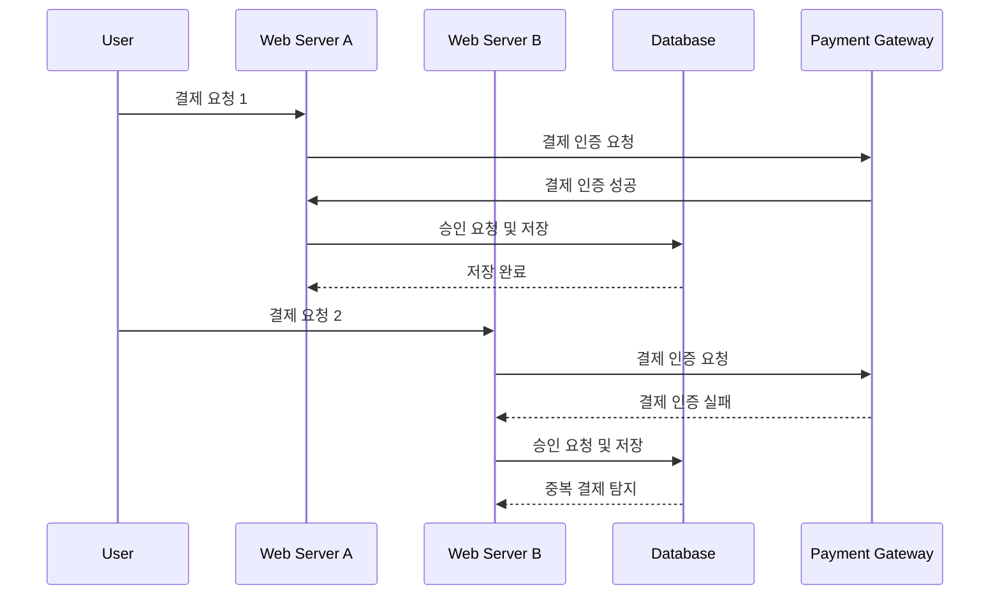
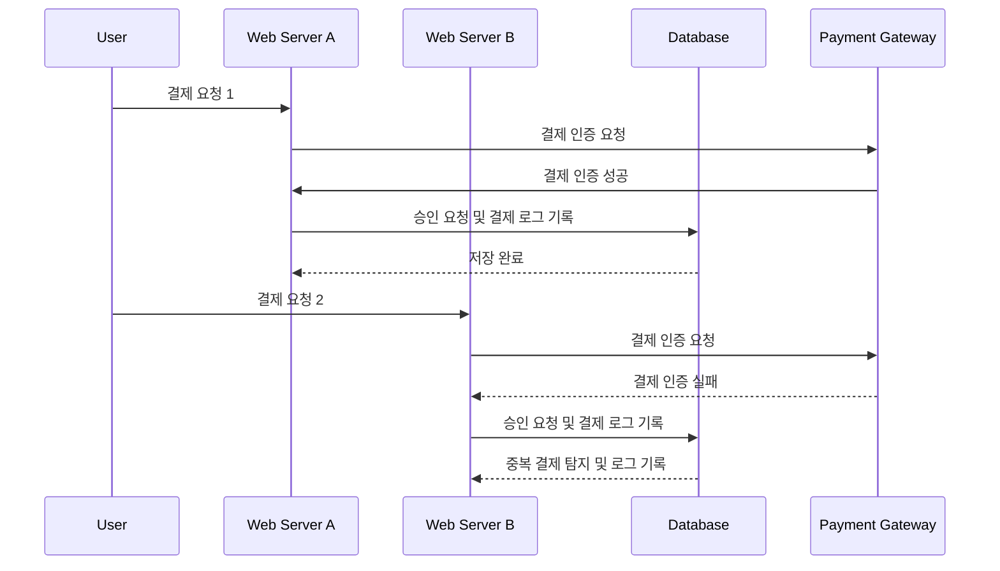
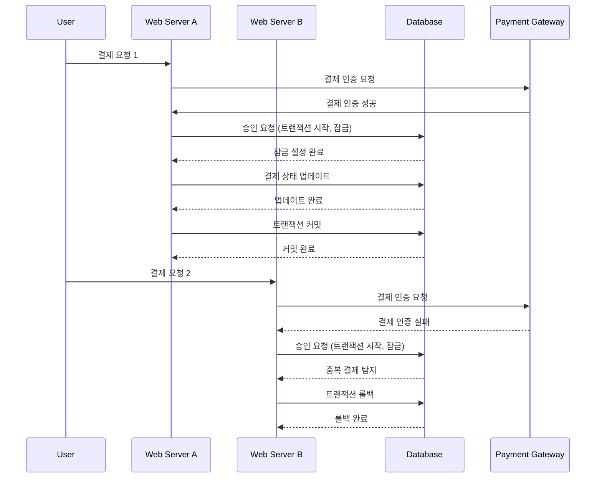

# transaction integrity

- [transaction integrity](#transaction-integrity)
    - [현실 세계 시나리오: 온라인 쇼핑몰의 결제 처리](#현실-세계-시나리오-온라인-쇼핑몰의-결제-처리)
        - [조건](#조건)
        - [상황 구체화](#상황-구체화)
        - [가능한 경우의 수 정리 및 시각적 표현](#가능한-경우의-수-정리-및-시각적-표현)
        - [해결법 및 각 경우의 수별 적용](#해결법-및-각-경우의-수별-적용)
            - [해결법](#해결법)
        - [시각적 해결법 적용](#시각적-해결법-적용)
            - [결제 로그 테이블 사용](#결제-로그-테이블-사용)
        - [각 해결법의 구체적 작동 원리와 동작 설명](#각-해결법의-구체적-작동-원리와-동작-설명)
            - [1. 트랜잭션과 잠금 메커니즘 사용](#1-트랜잭션과-잠금-메커니즘-사용)
                - [왜 효과적인가?](#왜-효과적인가)
            - [2. 중복 요청 검출](#2-중복-요청-검출)
                - [작동 원리](#작동-원리)
                - [동작 예시](#동작-예시)
                - [왜 효과적인가?](#왜-효과적인가-1)
            - [3. 낙관적 잠금(Optimistic Locking)](#3-낙관적-잠금optimistic-locking)
                - [작동 원리](#작동-원리-1)
                - [동작 예시](#동작-예시-1)
                - [왜 효과적인가?](#왜-효과적인가-2)
            - [4. 이벤트 소싱(Event Sourcing)](#4-이벤트-소싱event-sourcing)
                - [작동 원리](#작동-원리-2)
                - [동작 예시](#동작-예시-2)
                - [왜 효과적인가?](#왜-효과적인가-3)
            - [5. 결제 로그 테이블 사용](#5-결제-로그-테이블-사용)
                - [작동 원리](#작동-원리-3)
                - [동작 예시](#동작-예시-3)
                - [왜 효과적인가?](#왜-효과적인가-4)
        - [결론](#결론)

## 현실 세계 시나리오: 온라인 쇼핑몰의 결제 처리

### 조건

온라인 쇼핑몰에서 사용자가 결제를 시도합니다.
쇼핑몰 시스템은 두 개의 웹 서버(A와 B)와 하나의 데이터베이스(C)를 사용합니다.
사용자는 결제를 위해 PG사(결제 게이트웨이)와 통신하여 인증을 받고, 인증 결과를 승인 요청합니다.
각각의 결제 요청은 상태를 유지하지 않는 방식으로 처리됩니다(stateless).

1. **사용자 결제 요청**
    - 사용자는 쇼핑몰 웹사이트에서 결제를 시도합니다.
    - 결제 요청은 웹 서버 A 또는 B로 전달됩니다.

2. **결제 인증**
    - 웹 서버는 PG사와 통신하여 결제 인증을 시도합니다.
    - 인증이 성공하면 승인 요청을 하고, 결과를 DB에 저장합니다.

3. **동시성 문제**
    - 동일한 사용자가 동시에 두 번의 결제 요청을 보낼 수 있습니다.
    - 요청이 웹 서버 A와 B로 분산되어 들어올 수 있으며, DB에 저장 시 중복 처리가 발생할 수 있습니다.

### 상황 구체화

1. 쇼핑몰에서 사용자가 결제를 시도합니다.
2. 각 결제창 요청마다 고유한 `uuid`가 생성됩니다.
3. 동일한 주문 `order-id`에 대해 결제 요청이 여러 번 발생할 수 있습니다. 예를 들어, 사용자가 여러 번 클릭하거나 브라우저 확장 프로그램의 문제로 인해 결제창이 두 개 뜰 수 있습니다.
4. 결제창이 두 개 뜨면 두 개의 `uuid`가 생성됩니다.
    - 예: `payments-uuid-1 / order-id-user-2406240156`
    - 예: `payments-uuid-2 / order-id-user-2406240156`
5. 첫 번째 결제창 인증이 성공하고, 두 번째 결제창 인증은 시간이 지나 실패합니다. 이 두 요청이 거의 동시에 들어오게 됩니다.
6. 각 결제 요청의 결과를 기록하고, 한 주문에 대해 여러 번 시도했음을 관리자에게 보여주고 싶습니다.

### 가능한 경우의 수 정리 및 시각적 표현

1. **정상적인 단일 결제 요청**
    - 사용자가 결제를 시도하고 웹 서버 A 또는 B에서 정상적으로 처리됨.
    - 결제 인증이 성공하고, 데이터베이스에 결과가 저장됨.

2. **동일한 사용자의 중복 결제 요청**
    - 사용자가 두 번의 결제 요청을 보냄.
    - 두 요청이 각각 웹 서버 A와 B로 전달됨.
    - 두 요청이 거의 동시에 데이터베이스에 접근함.

3. **첫 번째 결제 요청 성공, 두 번째 요청 실패**
    - 사용자가 두 번의 결제 요청을 보냄.
    - 첫 번째 요청이 성공하고 두 번째 요청은 시간이 지나 실패함.
    - 두 요청이 동시에 데이터베이스에 접근함.



### 해결법 및 각 경우의 수별 적용

#### 해결법

1. **트랜잭션과 잠금 메커니즘 사용**
    - 결제 상태 업데이트 시 `SELECT ... FOR UPDATE`를 사용하여 락을 걸어 데이터 일관성을 보장.

2. **중복 요청 검출**
    - 데이터베이스에 고유 인덱스를 설정하여 중복 결제를 방지.

3. **낙관적 잠금(Optimistic Locking)**
    - 버전 번호를 사용하여 데이터베이스 업데이트 시 충돌을 탐지하고 재시도.

4. **이벤트 소싱(Event Sourcing)**
    - 모든 상태 변경을 이벤트로 기록하여 순차적으로 처리.

5. **결제 로그 테이블 사용**
    - 모든 결제 시도를 기록하여 관리자에게 제공.

이를 각 경우의 수에 대해 다음과 같이 적용할 수 있습니다.

1. **정상적인 단일 결제 요청**
    - **해결법**: 모든 결제 요청이 정상적으로 처리되므로 추가 조치 불필요.
    - **적용 방법**: 웹 서버에서 결제 요청을 처리하고 결과를 데이터베이스에 저장.

2. **동일한 사용자의 중복 결제 요청**
    - **해결법**: 트랜잭션과 잠금 메커니즘, 중복 요청 검출, 낙관적 잠금.
    - **적용 방법**:
        - 트랜잭션과 잠금을 사용하여 첫 번째 요청이 완료되기 전까지 두 번째 요청을 대기시킴.
        - 결제 요청 시 고유 `uuid`를 확인하여 중복 결제를 방지.
        - 버전 번호를 확인하여 업데이트 시 충돌을 탐지하고 재시도.

3. **첫 번째 결제 요청 성공, 두 번째 요청 실패**
    - **해결법**: 이벤트 소싱, 결제 로그 테이블 사용.
    - **적용 방법**:
        - 이벤트 소싱을 통해 모든 결제 시도를 기록하고 순차적으로 처리.
        - 결제 로그 테이블을 사용하여 모든 결제 시도를 기록하고, 실패한 시도도 관리자에게 제공.

### 시각적 해결법 적용

#### 결제 로그 테이블 사용



### 각 해결법의 구체적 작동 원리와 동작 설명

#### 1. 트랜잭션과 잠금 메커니즘 사용

트랜잭션과 잠금 메커니즘은 데이터베이스의 행 레벨 잠금을 통해 동시성 문제를 해결합니다.
특정 행에 대한 트랜잭션이 시작되면, 해당 행에 대한 다른 트랜잭션은 잠금이 해제될 때까지 대기하게 됩니다.
이를 통해 한 번에 하나의 트랜잭션만이 특정 데이터에 접근하고 수정할 수 있습니다.



1. **트랜잭션 시작**: 결제 요청을 처리할 때 트랜잭션을 시작합니다.
2. **락 걸기**: `SELECT ... FOR UPDATE` 구문을 사용하여 특정 주문 ID에 대해 행 레벨 락을 겁니다.
3. **결제 상태 업데이트**: 락이 걸린 상태에서 결제가 성공하면 주문 상태를 업데이트합니다.
4. **트랜잭션 커밋**: 모든 작업이 성공적으로 완료되면 트랜잭션을 커밋하여 변경 사항을 확정합니다.

```go
import (
    "database/sql"
    "fmt"
    _ "github.com/lib/pq"
)

func processPayment(db *sql.DB, orderID string, paymentUUID string) error {
    // 트랜잭션 시작
    tx, err := db.Begin()
    if err != nil {
        return fmt.Errorf("트랜잭션 시작 오류: %v", err)
    }
    defer tx.Rollback()

    // 주문 ID에 대해 락 걸기
    var status string
    err = tx.QueryRow("SELECT status FROM orders WHERE order_id = $1 FOR UPDATE", orderID).Scan(&status)
    if err != nil {
        return fmt.Errorf("주문 조회 오류: %v", err)
    }

    // 이미 결제된 주문인지 확인
    if status == "approved" {
        return fmt.Errorf("이미 결제가 완료된 주문입니다: %s", orderID)
    }

    // 결제 상태 업데이트
    _, err = tx.Exec("UPDATE orders SET status = 'approved' WHERE order_id = $1", orderID)
    if err != nil {
        return fmt.Errorf("주문 상태 업데이트 오류: %v", err)
    }

    // 결제 기록 저장
    _, err = tx.Exec("INSERT INTO payments (uuid, order_id, status) VALUES ($1, $2, $3)", paymentUUID, orderID, "approved")
    if err != nil {
        return fmt.Errorf("결제 기록 저장 오류: %v", err)
    }

    // 트랜잭션 커밋
    if err = tx.Commit(); err != nil {
        return fmt.Errorf("트랜잭션 커밋 오류: %v", err)
    }

    return nil
}
```

##### 왜 효과적인가?

이 방법은 트랜잭션이 완료될 때까지 다른 트랜잭션이 동일한 행에 접근할 수 없도록 하여 데이터 일관성을 보장합니다. 이로 인해 중복 결제 요청이 발생하더라도 한 번에 하나의 요청만 처리되어 중복 처리가 방지됩니다.

#### 2. 중복 요청 검출

##### 작동 원리

중복 요청을 검출하기 위해 각 결제 요청에 고유한 `uuid`를 생성하고, 데이터베이스에 고유 인덱스로 저장합니다. 이미 존재하는 `uuid`가 발견되면 중복 요청으로 간주하고 처리를 중단합니다.

##### 동작 예시

1. **고유 인덱스 생성**: 결제 요청 테이블에 `uuid` 필드를 고유 인덱스로 설정합니다.
2. **중복 요청 확인**: 결제 요청 시 이미 존재하는 `uuid`인지 확인합니다.
3. **결제 처리**: 중복 요청이 아닌 경우에만 결제를 처리합니다.

```sql
CREATE TABLE payments (
    id SERIAL PRIMARY KEY,
    uuid VARCHAR(36) UNIQUE NOT NULL,
    order_id VARCHAR(36) NOT NULL,
    status VARCHAR(20) NOT NULL,
    created_at TIMESTAMP DEFAULT CURRENT_TIMESTAMP
);
```

```go
import (
    "database/sql"
    "fmt"
    _ "github.com/lib/pq"
)

func processPayment(db *sql.DB, orderID string, paymentUUID string) error {
    // 중복 UUID 확인
    var existingOrderID string
    err := db.QueryRow("SELECT order_id FROM payments WHERE uuid = $1", paymentUUID).Scan(&existingOrderID)
    if err == nil {
        return fmt.Errorf("이미 처리된 결제 요청입니다: %s", paymentUUID)
    }

    // 트랜잭션 시작
    tx, err := db.Begin()
    if err != nil {
        return fmt.Errorf("트랜잭션 시작 오류: %v", err)
    }
    defer tx.Rollback()

    // 결제 상태 업데이트
    _, err = tx.Exec("UPDATE orders SET status = 'approved' WHERE order_id = $1", orderID)
    if err != nil {
        return fmt.Errorf("주문 상태 업데이트 오류: %v", err)
    }

    // 결제 기록 저장
    _, err = tx.Exec("INSERT INTO payments (uuid, order_id, status) VALUES ($1, $2, $3)", paymentUUID, orderID, "approved")
    if err != nil {
        return fmt.Errorf("결제 기록 저장 오류: %v", err)
    }

    // 트랜잭션 커밋
    if err = tx.Commit(); err != nil {
        return fmt.Errorf("트랜잭션 커밋 오류: %v", err)
    }

    return nil
}
```

##### 왜 효과적인가?

이 방법은 각 결제 요청에 고유한 `uuid`를 부여하고 데이터베이스에 고유 인덱스로 저장하여 중복 처리를 원천적으로 차단합니다. 이미 존재하는 `uuid`가 발견되면 해당 요청을 무시하므로 동일한 주문에 대한 중복 결제를 방지할 수 있습니다.

#### 3. 낙관적 잠금(Optimistic Locking)

##### 작동 원리

낙관적 잠금은 버전 번호를 사용하여 데이터베이스 업데이트 시 충돌을 탐지합니다. 데이터베이스 행에 버전 번호를 추가하고, 업데이트할 때 현재 버전 번호를 확인하여 동시에 다른 트랜잭션이 동일한 데이터를 변경하지 않았는지 확인합니다.

##### 동작 예시

1. **버전 번호 필드 추가**: 데이터베이스 테이블에 버전 번호 필드를 추가합니다.
2. **업데이트 시 버전 번호 확인**: 데이터 업데이트 시 현재 버전 번호를 확인하고, 업데이트 후 버전 번호를 증가시킵니다.

```sql
ALTER TABLE orders ADD COLUMN version INTEGER DEFAULT 0;

-- 트랜잭션 내에서 버전 번호를 확인하여 업데이트
UPDATE orders
SET status = 'approved', version = version + 1
WHERE order_id = $1 AND version = $2;
```

```go
import (
    "database/sql"
    "fmt"
    _ "github.com/lib/pq"
)

func processPayment(db *sql.DB, orderID string, paymentUUID string, currentVersion int) error {
    // 트랜잭션 시작
    tx, err := db.Begin()
    if err != nil {
        return fmt.Errorf("트랜잭션 시작 오류: %v", err)
    }
    defer tx.Rollback()

    // 결제 상태 업데이트 및 버전 번호 증가
    res, err := tx.Exec("UPDATE orders SET status = 'approved', version = version + 1 WHERE order_id = $1 AND version = $2", orderID, currentVersion)
    if err != nil {
        return fmt.Errorf("주문 상태 업데이트 오류: %v", err)
    }

    // 업데이트된 행 수 확인
    rowsAffected, err := res.RowsAffected()
    if err != nil {
        return fmt.Errorf("업데이트된 행 수 확인 오류: %v", err)
    }
    if rowsAffected == 0 {
        return fmt.Errorf("버전 충돌로 인해 업데이트 실패")
    }

    // 결제 기록 저장
    _, err = tx.Exec("INSERT INTO payments (uuid, order_id, status) VALUES ($1, $2, $3)", paymentUUID, orderID, "approved")
    if err != nil {
        return fmt.Errorf("결제 기록 저장 오류: %v", err)
    }

    // 트랜잭션 커밋
    if err = tx.Commit(); err != nil {
        return fmt.Errorf("트랜잭션 커밋 오류: %v", err)
    }

    return nil
}
```

##### 왜 효과적인가?

낙관적 잠금은 데이터 업데이트 시 버전 번호를 확인하여 충돌을 탐지합니다. 다른 트랜잭션이 동일한 데이터를 수정했을 경우 현재 트랜잭션은 실패하고 재시도하게 됩니다. 이를 통해 데이터 일관성을 유지하면서도 성능을 최적화할 수 있습니다.

#### 4. 이벤트 소싱(Event Sourcing)

##### 작동 원리

이벤트 소싱은 시스템의 모든 상태 변경을 이벤트로 기록합니다. 각 상태 변경은 이벤트로서 이벤트 로그에 기록되고, 이벤트 처리기를 통해 순차적으로 처리됩니다. 이를 통해 시스템의 일관성을

 유지하고, 모든 변경 사항을 추적할 수 있습니다.

##### 동작 예시

1. **이벤트 로그 테이블 생성**: 모든 상태 변경 이벤트를 기록하는 테이블을 만듭니다.
2. **이벤트 기록**: 각 결제 시도는 이벤트 로그에 기록됩니다.
3. **이벤트 처리기 구현**: 이벤트 처리기를 통해 이벤트를 순차적으로 처리합니다.

```sql
CREATE TABLE event_logs (
    event_id SERIAL PRIMARY KEY,
    order_id VARCHAR(36) NOT NULL,
    event_type VARCHAR(50) NOT NULL,
    event_data JSONB NOT NULL,
    created_at TIMESTAMP DEFAULT CURRENT_TIMESTAMP
);
```

```go
import (
    "database/sql"
    "encoding/json"
    "fmt"
    _ "github.com/lib/pq"
)

type Event struct {
    OrderID   string `json:"order_id"`
    EventType string `json:"event_type"`
    EventData string `json:"event_data"`
}

func logEvent(db *sql.DB, event Event) error {
    eventData, err := json.Marshal(event)
    if err != nil {
        return fmt.Errorf("이벤트 데이터 마샬링 오류: %v", err)
    }

    _, err = db.Exec("INSERT INTO event_logs (order_id, event_type, event_data) VALUES ($1, $2, $3)",
        event.OrderID, event.EventType, eventData)
    if err != nil {
        return fmt.Errorf("이벤트 로그 저장 오류: %v", err)
    }

    return nil
}

func processPayment(db *sql.DB, orderID string, paymentUUID string) error {
    // 이벤트 기록
    event := Event{
        OrderID:   orderID,
        EventType: "PaymentAttempt",
        EventData: fmt.Sprintf(`{"uuid": "%s"}`, paymentUUID),
    }
    if err := logEvent(db, event); err != nil {
        return err
    }

    // 실제 결제 처리 로직은 별도의 이벤트 처리기에서 수행
    // ...
    
    return nil
}
```

##### 왜 효과적인가?

이벤트 소싱은 모든 상태 변경을 이벤트로 기록하여 추적할 수 있습니다. 이를 통해 시스템의 상태를 쉽게 복원할 수 있으며, 이벤트 처리기를 통해 순차적으로 이벤트를 처리하여 일관성을 유지할 수 있습니다.

#### 5. 결제 로그 테이블 사용

##### 작동 원리

결제 로그 테이블을 사용하여 모든 결제 시도를 기록하고, 실패한 시도도 관리자에게 제공합니다. 이를 통해 결제 시도의 상세 정보를 추적할 수 있습니다.

##### 동작 예시

1. **결제 로그 테이블 생성**: 결제 시도를 기록하는 테이블을 만듭니다.
2. **결제 시도 기록**: 각 결제 시도마다 로그를 기록합니다.
3. **관리자 대시보드 구현**: 결제 로그를 조회하여 관리자에게 보여줍니다.

```sql
CREATE TABLE payment_logs (
    log_id SERIAL PRIMARY KEY,
    uuid VARCHAR(36) NOT NULL,
    order_id VARCHAR(36) NOT NULL,
    status VARCHAR(20) NOT NULL,
    created_at TIMESTAMP DEFAULT CURRENT_TIMESTAMP
);
```

```go
import (
    "database/sql"
    "fmt"
    _ "github.com/lib/pq"
)

type PaymentLog struct {
    UUID      string
    OrderID   string
    Status    string
    CreatedAt string
}

func logPaymentAttempt(db *sql.DB, paymentUUID string, orderID string, status string) error {
    _, err := db.Exec("INSERT INTO payment_logs (uuid, order_id, status) VALUES ($1, $2, $3)", paymentUUID, orderID, status)
    if err != nil {
        return fmt.Errorf("결제 로그 저장 오류: %v", err)
    }
    return nil
}

func getPaymentLogs(db *sql.DB, orderID string) ([]PaymentLog, error) {
    rows, err := db.Query("SELECT uuid, order_id, status, created_at FROM payment_logs WHERE order_id = $1", orderID)
    if err != nil {
        return nil, fmt.Errorf("결제 로그 조회 오류: %v", err)
    }
    defer rows.Close()

    var logs []PaymentLog
    for rows.Next() {
        var log PaymentLog
        if err := rows.Scan(&log.UUID, &log.OrderID, &log.Status, &log.CreatedAt); err != nil {
            return nil, fmt.Errorf("로그 스캔 오류: %v", err)
        }
        logs = append(logs, log)
    }
    return logs, nil
}

func processPayment(db *sql.DB, orderID string, paymentUUID string) error {
    // 결제 시도 기록
    if err := logPaymentAttempt(db, paymentUUID, orderID, "pending"); err != nil {
        return err
    }

    // 결제 처리 로직
    // ...
    
    // 결제 성공 시 로그 업데이트
    if err := logPaymentAttempt(db, paymentUUID, orderID, "approved"); err != nil {
        return err
    }
    
    return nil
}
```

##### 왜 효과적인가?

결제 로그 테이블을 사용하면 모든 결제 시도를 기록하여 추적할 수 있습니다. 실패한 시도도 관리자에게 제공하여 결제 과정에서 발생한 문제를 쉽게 파악할 수 있습니다. 이를 통해 결제 시스템의 투명성과 신뢰성을 높일 수 있습니다.

### 결론

위에서 설명한 각 해결법은 온라인 쇼핑몰 결제 시스템의 동시성과 일관성을 유지하는 데 효과적입니다. 각 방법의 구체적인 작동 원리와 동작 방식을 이해하고, 이를 실제로 구현함으로써 중복 결제와 데이터 불일치 문제를 해결할 수 있습니다. 다양한 상황에 맞게 적절한 방법을 선택하여 적용하는 것이 중요합니다.
