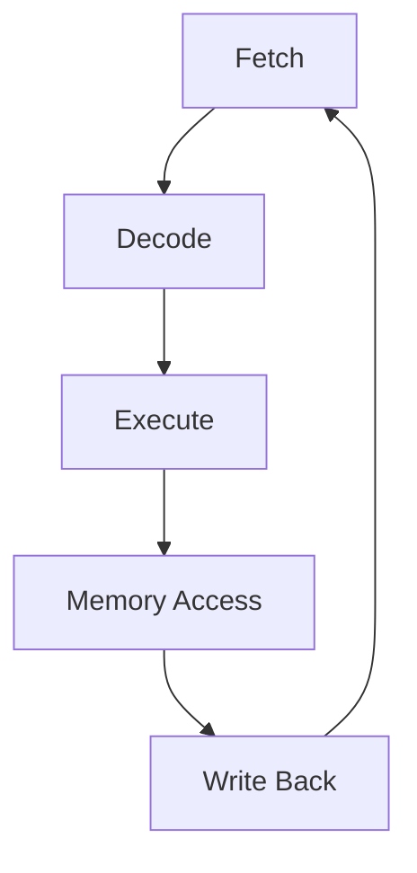

# CPU

- [CPU](#cpu)
    - [CPU 클럭과 사이클](#cpu-클럭과-사이클)
        - [클럭 신호, 클럭 주기, 클럭 속도, 그리고 명령어 사이클](#클럭-신호-클럭-주기-클럭-속도-그리고-명령어-사이클)
        - ['1 사이클' 동안 일어나는 일](#1-사이클-동안-일어나는-일)
        - [클럭 사이클과 성능의 관계](#클럭-사이클과-성능의-관계)
        - [실제 성능 고려사항](#실제-성능-고려사항)
    - [슈퍼스칼라 아키텍처](#슈퍼스칼라-아키텍처)
    - [분기 예측](#분기-예측)
    - [아웃-오브-오더 실행](#아웃-오브-오더-실행)
    - [SIMD (Single Instruction, Multiple Data)](#simd-single-instruction-multiple-data)

## [CPU 클럭과 사이클](https://www.intel.co.kr/content/www/kr/ko/gaming/resources/cpu-clock-speed.html)

- 클럭 (Clock)
    - CPU의 기본적인 타이밍 메커니즘
    - 일정한 간격으로 발생하는 전기적 펄스
    - CPU의 동작 속도를 결정하는 기준

- 사이클 (Cycle)
    - 클럭 펄스 사이의 시간 간격
    - CPU가 기본 작업을 수행하는 데 필요한 최소 시간 단위

CPU의 클럭과 사이클은 컴퓨터 성능의 기본 단위이지만, 실제 성능은 아키텍처, 캐시 구조, 명령어 집합 등 다양한 요소들을 종합적으로 고려해야 합니다.
현대 CPU 설계의 핵심은 주어진 클럭 사이클을 최대한 효율적으로 활용하여 더 많은 작업을 수행하는 것에 있습니다.

### 클럭 신호, 클럭 주기, 클럭 속도, 그리고 명령어 사이클

클럭 신호, 클럭 주기, 클럭 속도, 그리고 명령어 사이클의 관계는 *CPU의 작동 속도*와 *시간적 단위*에 관한 개념입니다.

- 클럭 신호(Clock Signal)

    클럭 신호는 외부의 클럭 발생기(Clock Generator)에서 주기적으로 발생하는 전기적 펄스로, CPU는 이 신호를 받아 동작 시점을 결정합니다.
    즉, CPU가 각 작업 단계를 언제 수행해야 하는지를 결정하는 타이밍 메커니즘입니다
    이러한 신호는 CPU 내부에서 PLL(Phase-Locked Loop) 같은 회로를 통해 더욱 정교하게 조정됩니다.

    CPU가 각 작업 단계(명령어 인출, 해석, 실행 등)를 언제 수행해야 하는지 결정하는 타이밍 메커니즘입니다.
    CPU는 클럭 신호에 따라 작업을 수행할 타이밍을 결정하지만, 각 클럭 신호가 오기 전이나 후에 작업이 멈추지는 않습니다.
    CPU는 지속적으로 동작하며, 클럭 신호는 그 동작을 동기화하는 역할을 합니다.
    CPU의 각 구성 요소가 이 신호에 맞춰서 동작합니다.

    즉, CPU의 모든 내부 작업(명령어 처리, 데이터 이동 등)은 이 클럭 신호에 맞춰 *동기화*됩니다.

    CPU는 클럭 신호를 기반으로 *작업을 분할*하고 *진행할 타이밍을 결정*합니다.
    명령어가 복잡할수록 여러 클럭 사이클이 걸리기도 하며, 파이프라인, 분기 예측, 메모리 접근 등 여러 아키텍처 요소에 따라 이 과정이 다양해질 수 있습니다.
    클럭 신호가 발생할 때마다 CPU는 명령어 처리의 다음 단계로 넘어가거나, 작업의 일부를 수행합니다.

클럭 속도와 클럭 주기는 반비례 관계입니다. 따라서 클럭 속도가 높을수록 클럭 주기는 짧아집니다.

$$T = \frac{1}{f}$$

- $f$: 클럭 주파수(Clock Frequency)

    클럭 주파수는 CPU가 작업을 처리하는 속도를 결정하는 기준입니다.
    즉, *1초 동안 발생하는 클럭 신호의 수*를 의미하며, CPU가 1초 동안 몇 번의 클럭 신호(사이클)를 처리하는지를 나타냅니다.
    클럭 주파수는 헤르츠(`Hz`) 단위로 측정됩니다.

    CPU는 매우 정밀한 타이밍에 따라 작업을 처리합니다.
    CPU는 클럭 신호에 맞춰 작업을 시작하고 끝내며, 이 신호가 주기적으로 발생하면서 CPU가 순차적으로 일을 처리합니다.
    예를 들어:
    1. 첫 번째 클럭 신호에서 CPU가 명령어를 가져오고(Fetch),
    2. 다음 클럭 신호에서 명령어를 해석하고(Decode),
    3. 그다음 클럭 신호에서 명령어를 실행(Execute)하고

    이러한 방식으로 동작이 계속됩니다.

    CPU는 복잡한 장치로, 내부에서 여러 작업들이 동시에 일어나야 합니다.
    클럭 신호는 이러한 *모든 작업들이 일정한 타이밍에 맞춰서 진행*되도록 도와줍니다.
    CPU의 각 부분들은 클럭 신호에 맞춰 일을 하는데, 클럭 신호가 없다면 작업 순서를 맞추거나 타이밍을 조정할 수 없습니다.

    따라서 클럭 주파수 값이 크다는 것은, 1초에 더 많은 클럭 신호가 발생한다는 것이고, CPU는 더 짧은 시간 간격으로 작업을 처리할 수 있음을 의미합니다.

    이는 일반적으로 외부 클럭 생성기(Clock Generator)에서 제공되는 기본 신호를 바탕으로 하지만, 현대 CPU에서는 PLL(Phase-Locked Loop)과 같은 회로를 통해 주파수를 배수(Multiplier)하거나 분주(Divider)하여 최종 작동 주파수를 결정합니다.

    예를 들어, 1Hz의 클럭 주파수는:
    - 초당 1번의 클럭 신호가 발생합니다.
    - 초당 1개의 클럭 사이클을 의미합니다.

    클럭 속도 1GHz(기가헤르츠)는 초당 10억 번의 클럭 신호가 발생한다는 의미입니다.

    > **배수 (Multiplier)**: CPU의 기본 클럭 속도를 증가시키는 데 사용됩니다.
    > - CPU의 최종 클럭 속도는 기본 클럭 속도(보통 BCLK)에 배수를 곱한 값입니다.
    >
    >   [BCLK(Base Clock)](https://www.thetechwire.com/what-is-bclk/)는 마더보드 칩셋의 주파수입니다.
    >   마더보드 칩셋은 CPU, GPU, RAM, 저장장치, 하드웨어 포트 등이 서로 통신하고 작업을 조율할 수 있게 해주는 중앙 허브입니다.
    >   기본값은 일반적으로 100 MHz입니다.
    >
    >   $$CPU 클럭 속도 = 배수 \times BCLK$$
    >
    > - 예를 들어, BCLK가 100MHz이고 배수가 46이면, CPU 클럭 속도는 4.6GHz (100MHz x 46)가 됩니다
    >
    > **분주 (Divider)**: CPU의 클럭 속도를 낮추거나 다른 컴포넌트의 클럭 속도를 조절하는 데 사용됩니다.
    > - 분주는 클럭 신호의 주파수를 낮추는 데 사용됩니다. 다른 속도로 작동해야 하는 시스템 컴포넌트들의 클럭을 조절하거나, 최대 성능을 필요로 하지 않을 때 클럭 속도를 낮춰 전력 소비를 줄입니다.
    > - 예: CPU 클럭이 4.0GHz이고 메모리 컨트롤러에 2:1 분주를 적용하면, 메모리 컨트롤러는 2.0GHz로 작동합니다.
    >
    > 배수와 분주는 서로 반대 개념으로 *배수*는 클럭 속도를 높이고, *분주*는 클럭 속도를 낮춥니다.
    > 현대 CPU에서는 동적으로 배수와 분주를 조절하여 성능과 전력 효율성의 균형을 맞춥니다.

- $T$: 클럭 주기(Clock Period)

    전기적 신호가 "높음"에서 "낮음"으로 다시 "높음"으로 돌아오는, *클럭 신호가 한 번 완전히 진동하는 데 걸리는 시간* 또는 *두 연속된 클럭 펄스 사이의 시간 간격*을 의미합니다.

    클럭 속도가 높을수록, 클럭 주기는 짧아지고, CPU는 더 짧은 시간 안에 작업을 처리할 수 있습니다.

    예를 들어, 1GHz 클럭 속도의 CPU의 클럭 주기는 다음과 같습니다.

    $$
    클럭 주기 = \frac{1}{클럭 속도} = \frac{1}{1 \, \text{GHz}} = \frac{1}{10^9} \, \text{초} = 1 \, \text{ns}
    $$

    1GHz 클럭 주파수는 1 나노초(ns)마다 하나의 클럭 신호가 발생하며, CPU는 이 신호에 맞춰 작업을 처리합니다.

- 클럭 사이클(Clock Cycle)

    클럭 사이클은 CPU가 클럭 신호에 맞춰 동기화하여 작업을 처리하는 단위입니다.
    CPU는 클럭 사이클마다 명령어의 일부를 처리하며, 명령어의 복잡도에 따라 여러 클럭 사이클이 필요할 수 있습니다.
    이 작업은 클럭 신호에 맞춰 동기화됩니다.

    예를 들어, 1GHz의 클럭 속도를 가진 CPU는 1 나노초 동안 하나의 클럭 사이클을 처리하며, 1GHz는 1초에 10억 번의 클럭 사이클이 발생하는 것을 의미합니다.

- 명령어 사이클

    CPU가 하나의 명령어를 처리하기 위해 거쳐야 하는 여러 단계를 말합니다.
    일반적으로 명령어 사이클은 다음 단계로 구성됩니다:
    1. Fetch (명령어 가져오기)
    2. Decode (명령어 해석)
    3. Execute (실행)
    4. Memory Access (필요시 메모리 접근)
    5. Write Back (결과 저장)

    하나의 명령어를 처리하는 데 여러 클럭 사이클이 필요할 수 있기 때문에, 명령어 사이클은 여러 개의 클럭 사이클에 걸쳐 발생할 수 있습니다.

    파이프라이닝은 이러한 명령어 사이클의 각 단계를 동시에 여러 명령어에 대해 병렬로 처리할 수 있게 하는 기법입니다. 즉, 하나의 명령어가 실행되는 동안, 다른 명령어는 이미 다음 단계에 들어가 있을 수 있습니다.

다음은 클럭 속도와 클럭 주기에 대한 예제입니다.

1. 클럭 속도 1GHz인 CPU:
    - 1GHz는 초당 10억 번의 클럭 신호를 의미합니다.
    - 주파수: $1 \times 10^9$ Hz
    - 클럭 주기: $\frac{1}{1 \times 10^9} = 1$ 나노초(ns)
    - 1 나노초 동안 CPU는 하나의 사이클을 처리하며, 이 사이클 동안 CPU는 명령어의 일부를 실행하거나 마이크로 연산을 수행합니다.

2. 클럭 속도 2GHz인 CPU:
    - 2GHz는 초당 20억 번의 클럭 신호를 발생시킨다는 의미입니다.
    - 주파수: $2 \times 10^9$ Hz
    - 클럭 주기: $\frac{1}{2 \times 10^9} = 0.5$ 나노초(ns)
    - 이 CPU는 0.5ns마다 하나의 클럭 사이클을 처리하며, 클럭 주기가 짧아졌으므로 더 빠르게 명령어를 처리할 수 있습니다.

3. 클럭속도 3 GHz인 CPU
    - 3GHz는 초당 30억 번의 클럭 신호를 발생시킨다는 의미입니다.
    - 주파수: $3 \times 10^9$ Hz
    - 클럭 주기: $\frac{1}{3 \times 10^9} = 0.333$ 나노초(ns)
    - 이 CPU는 0.333ns마다 하나의 클럭 사이클을 처리하며, 클럭 주기가 짧아졌으므로 더 빠르게 명령어를 처리할 수 있습니다.

클럭 속도가 빠를수록(즉, GHz 값이 높을수록) 클럭 주기가 짧아지므로, CPU는 더 자주 작업을 처리할 수 있습니다.
하지만 클럭 속도가 높다고 해서 반드시 CPU 성능이 비례해서 증가하는 것은 아닙니다.
클럭 속도 외에 CPU의 아키텍처, 파이프라인 설계, 명령어 효율성 등이 성능에 영향을 미칩니다.

CPU의 성능은 다음과 같은 지표로 측정됩니다:
- IPC (Instructions Per Cycle):
    - 클럭 사이클당 처리되는 평균 명령어의 수
    - 높을수록 CPU가 효율적으로 작동함을 의미합니다.
    - 계산: $IPC = \frac{실행된 총 명령어 수}{총 클럭 사이클 수}$

- CPI (Cycles Per Instruction):
    - 명령어 하나를 처리하는 데 필요한 평균 클럭 사이클 수
    - 낮을수록 CPU가 효율적으로 작동함을 의미합니다.
    - 계산: $CPI = \frac{1}{IPC} = \frac{총 클럭 사이클 수}{실행된 총 명령어 수}$

- MIPS (Million Instructions Per Second): 초당 실행되는 백만 단위의 명령어 수
    - 계산: $MIPS = \frac{클럭 속도 (MHz)}{CPI}$

### '1 사이클' 동안 일어나는 일

CPU의 클럭 사이클은 CPU가 명령어를 처리하는 기본 단위 시간입니다.
클럭 속도 1GHz인 CPU는 초당 10억 번의 클럭 사이클이 발생함을 의미합니다.

CPU의 파이프라인 구조는 하나의 사이클 동안 하나의 명령어가 전체적으로 완료되지 않고, 여러 명령어가 동시에 파이프라인의 다른 단계에서 처리되는 과정을 의미합니다. 즉, 한 사이클 동안 여러 명령어가 파이프라인의 **다른 단계**에 존재하며, 이를 통해 CPU는 병렬 처리 성능을 극대화할 수 있습니다.

CPU 사이클은 클럭 신호의 주기에 해당하며, *CPU의 기본 작동 단위 시간*으로 클럭 속도에 따라 결정됩니다.
예를 들어, 클럭 속도 1GHz인 CPU는 초당 10억 번의 클럭 사이클이 발생함을 의미합니다.

'1 사이클' 동안 일어나는 일은 단순히 하나의 명령어 실행이 완료되는 것이 아니라, 여러 명령어가 각각 파이프라인의 다른 단계에서 동시에 처리되는 과정입니다. 이를 *파이프라이닝*이라고 하며, CPU의 병렬 처리 성능을 높이기 위한 기법입니다.

'1 사이클' 동안 실제로 일어나는 일은 다음과 같습니다:
1. 클럭 신호 발생:
    CPU 클럭이 한 번 진동합니다.
    즉, CPU 사이클은 클럭 신호에 의해 동작합니다.

2. 상태 변화:
    CPU의 모든 연산은 클럭 신호에 동기화되어 실행됩니다.
    CPU 내부의 플립플롭과 레지스터가 클럭 신호에 맞춰 동기화되어 업데이트됩니다.

3. 마이크로 연산 수행:

    '1 사이클' 동안 CPU는 여러 마이크로 연산 중 하나를 처리합니다.

    마이크로 연산은 명령어 실행의 하위 작업으로, 하나의 명령어는 여러 개의 마이크로 연산으로 나뉩니다.
    CPU는 명령어를 여러 개의 작은 마이크로 연산으로 분해하고, 클럭 사이클 동안 이 마이크로 연산들을 처리합니다.
    - 레지스터 값을 읽기
    - ALU에서 계산을 수행
    - 메모리 주소를 계산하기 등

4. 파이프라인 단계 진행

    CPU 파이프라인의 각 단계가 한 칸씩 전진합니다.
    CPU 파이프라인은 일반적으로 다음 단계로 구성됩니다.
    - 명령어 가져오기(Fetch)
    - 명령어 해독(Decode)
    - 실행(Execute)
    - 쓰기(Write-back) 등

    각 사이클마다 서로 다른 명령어들이 각각의 파이프라인 단계에서 병렬로 처리됩니다.
    이를 통해 CPU는 동시에 여러 명령어를 처리할 수 있습니다.

이처럼 단일 사이클 동안 전체 `Fetch` - `Decode` - `Execute` - `Memory Access` - `Write Back`과정이 완료되지 않습니다.
대신, 각 단계가 하나의 사이클(또는 그 이상)을 차지하며, 파이프라이닝을 통해 여러 명령어의 다른 단계들이 동시에 처리됩니다.

명령어 실행 과정은 같은 단계로 구성됩니다:

1. Fetch (명령어 가져오기)
    - CPU가 프로그램 카운터(PC)가 가리키는 메모리 주소에서 다음 실행할 명령어를 가져옵니다.
    - 이 과정은 보통 1 사이클이 소요되지만, 캐시 미스 시 더 오래 걸릴 수 있습니다.

2. Decode (명령어 해석)
    - 가져온 명령어의 의미를 해석합니다.
    - 필요한 레지스터나 메모리 주소를 식별합니다.
    - 현대 CPU에서는 매우 빠르게 이루어지며, 때로는 Fetch와 동시에 수행됩니다.

3. Execute (실행)
    - 실제 연산을 수행합니다 (예: 덧셈, 뺄셈, 논리 연산 등).
    - 산술 논리 장치(ALU)가 이 단계를 담당합니다.
    - 복잡한 연산의 경우 여러 사이클이 필요할 수 있습니다.

4. Memory Access (메모리 접근)
    - 필요한 경우 메모리에 접근하여 데이터를 읽거나 씁니다.
    - 캐시나 주 메모리 접근이 필요한 경우 상당한 시간이 소요될 수 있습니다.

5. Write Back (결과 저장)
    - 연산 결과를 레지스터나 메모리에 저장합니다.

실제로는 이 과정이 파이프라인을 통해 중첩되어 실행됩니다:

| 사이클 | 파이프라인 1 | 파이프라인 2 | 파이프라인 3 | 파이프라인 4 | 파이프라인 5 |
| :----: | :----------: | :----------: | :----------: | :----------: | :----------: |
|   1    |    Fetch     |              |              |              |              |
|   2    |    Decode    |    Fetch     |              |              |              |
|   3    |   Execute    |    Decode    |    Fetch     |              |              |
|   4    |    Memory    |   Execute    |    Decode    |    Fetch     |              |
|   5    |  Write Back  |    Memory    |   Execute    |    Decode    |    Fetch     |
|   6    |    Fetch     |  Write Back  |    Memory    |   Execute    |    Decode    |

이 방식으로, 이상적인 경우 매 사이클마다 하나의 명령어가 완료될 수 있습니다.

다만,
- 실제 CPU는 이보다 훨씬 더 많은 단계와 복잡한 구조를 가집니다.
- 많은 현대 CPU는 명령어를 순서대로 실행하지 않고, 데이터 의존성을 고려하여 최적의 순서로 실행합니다.
- CPU는 조건문의 결과를 예측(분기 예측)하여 파이프라인을 최적화합니다.
- L1, L2, L3 등 여러 레벨의 캐시가 메모리 접근 시간을 크게 줄입니다.

### 클럭 사이클과 성능의 관계

- 클럭 속도와 IPC (Instructions Per Cycle):
    - 성능 = 클럭 속도 × IPC
    - 높은 클럭 속도가 반드시 더 좋은 성능을 의미하지는 않습니다.

- 열 관리와 전력 소비:
    - 높은 클럭 속도는 더 많은 열과 전력 소비를 야기합니다.
    - 현대 CPU는 동적으로 클럭 속도를 조절하여 열과 전력을 관리합니다.

### 실제 성능 고려사항

- 파이프라인 해저드: 데이터 의존성, 제어 흐름 변경 등으로 인해 파이프라인이 중단될 수 있습니다.
- 메모리 지연: 캐시 미스 시 수백 사이클의 지연이 발생할 수 있습니다.
- 병렬 실행: 슈퍼스칼라 아키텍처를 통해 여러 명령어가 동시에 실행될 수 있습니다.

## 슈퍼스칼라 아키텍처

여러 명령어를 동시에 실행할 수 있습니다.

## 분기 예측

조건문의 결과를 예측하여 파이프라인을 최적화합니다.

## 아웃-오브-오더 실행

명령어들을 최적의 순서로 재배열하여 실행합니다.

## SIMD (Single Instruction, Multiple Data)

하나의 명령어로 여러 데이터를 동시에 처리합니다.
