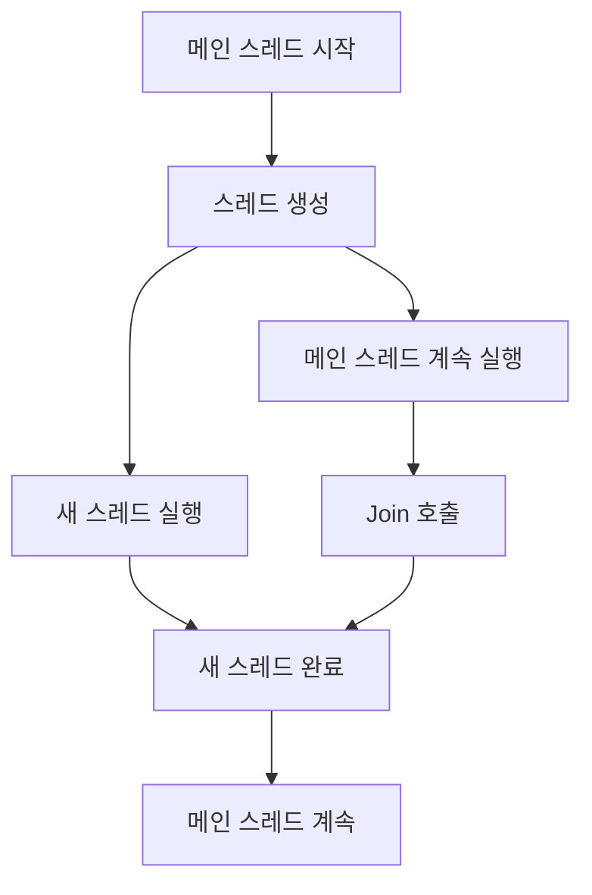
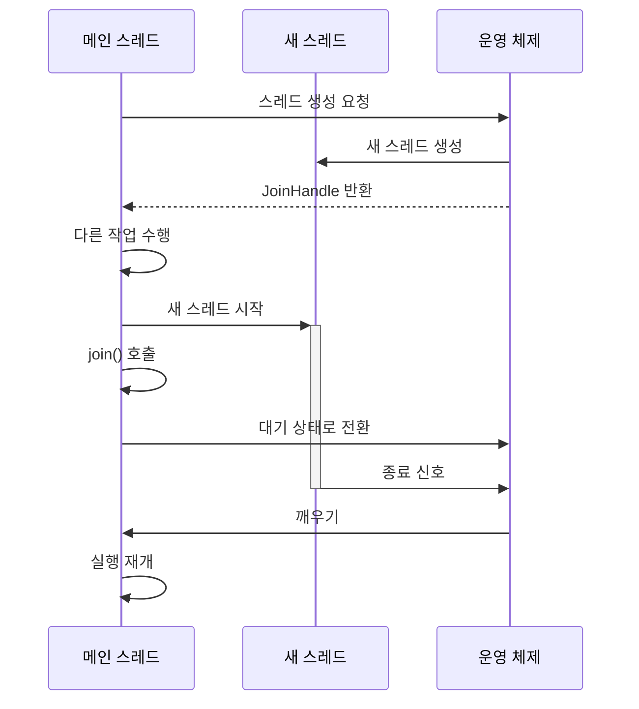
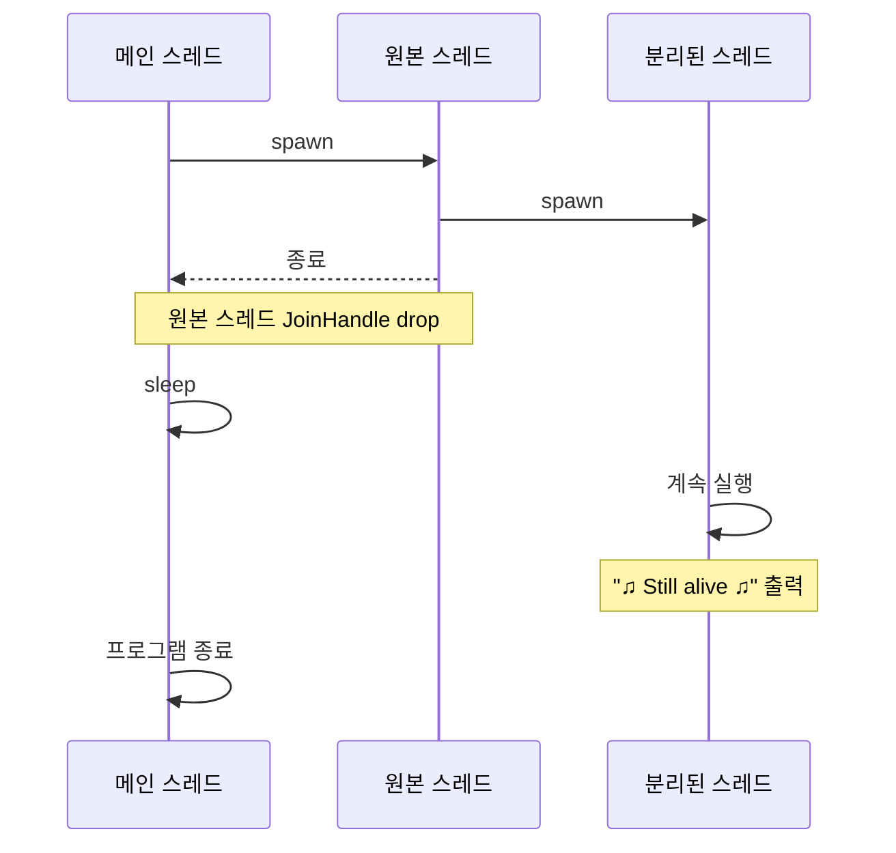

# Thread

- [Thread](#thread)
    - [스레드](#스레드)
    - [스레드의 종류](#스레드의-종류)
        - [하드웨어 스레드](#하드웨어-스레드)
            - [Threaded Processor](#threaded-processor)
            - [Temporal multithreading](#temporal-multithreading)
                - [Coarse-Grained Multithreading(block or cooperative multithreading)](#coarse-grained-multithreadingblock-or-cooperative-multithreading)
                - [Fine-Grained Multithreading(Interleaved, preemptive, fine-grained or time-sliced multithreading)](#fine-grained-multithreadinginterleaved-preemptive-fine-grained-or-time-sliced-multithreading)
            - [Simultaneous Multithreading (SMT, 동시 멀티스레딩)](#simultaneous-multithreading-smt-동시-멀티스레딩)
                - [하이퍼스레딩 (Hyper-Threading)](#하이퍼스레딩-hyper-threading)
        - [소프트웨어 스레드](#소프트웨어-스레드)
            - [커널 수준 스레드 (Kernel-Level Threads, KLTs)](#커널-수준-스레드-kernel-level-threads-klts)
            - [사용자 수준 스레드 (User-Level Threads, ULTs)](#사용자-수준-스레드-user-level-threads-ults)
            - [하이브리드 스레딩](#하이브리드-스레딩)
            - [그린 스레드(Green Threads)](#그린-스레드green-threads)
            - [파이버 (Fibers)](#파이버-fibers)
    - [k8s와 멀티스레딩](#k8s와-멀티스레딩)
        - [k8s의 CPU 자원 할당](#k8s의-cpu-자원-할당)
        - [호스트 노드와 컨테이너](#호스트-노드와-컨테이너)
        - [Kubernetes의 CPU 할당과 커널 스레드 간의 상호작용](#kubernetes의-cpu-할당과-커널-스레드-간의-상호작용)
    - [Thread와 Join](#thread와-join)
    - [Thread detach](#thread-detach)
    - [각 언어별 스레드](#각-언어별-스레드)
    - [멀티태스킹 운영체제와 GC `ParallelGCThreads` 설정](#멀티태스킹-운영체제와-gc-parallelgcthreads-설정)
        - [컨텍스트 스위칭 비용](#컨텍스트-스위칭-비용)
        - [자원 경합](#자원-경합)
        - [가비지 컬렉션 최적화](#가비지-컬렉션-최적화)
        - [스레드와 코어의 관계](#스레드와-코어의-관계)

## [스레드](https://en.wikipedia.org/wiki/Thread_(computing))

스레드(Thread)는 프로세스 내에서 실행되는 가장 작은 실행 단위입니다.
프로세스가 여러 작업을 동시에 수행할 수 있게 해주는 경량 프로세스(Lightweight Process)라고 볼 수 있습니다.

## 스레드의 종류

### 하드웨어 스레드

하드웨어 스레드는 CPU의 물리적인 구성 요소입니다.
- CPU가 *물리적으로 지원하는 명령어 실행의 단위*
- 또는 *동시에 수행할 수 있는 명령어 스트림의 수*

현대의 CPU는 다수의 하드웨어 스레드를 동시에 처리하거나, 각 스레드를 번갈아 실행하면서 자원을 효율적으로 사용합니다.

[하드웨어에서 스레드를 처리하는 방식](https://en.wikipedia.org/wiki/Multithreading_(computer_architecture))에는 크게 Temporal Multithreading(시간 기반 멀티스레딩)과 Simultaneous Multithreading(SMT, 동시 멀티스레딩) 두 가지가 있습니다.
Temporal Multithreading(시간 기반 멀티스레딩)은 다시 Coarse-grained와 Fine-grained 멀티쓰레딩으로 나뉩니다.
- [Temporal multithreading](https://en.wikipedia.org/wiki/Temporal_multithreading)
    - [Coarse-grained](https://en.wikipedia.org/wiki/Granularity_(parallel_computing))
    - [Fine-grained](https://en.wikipedia.org/wiki/Granularity_(parallel_computing)) (or interleaved)
- [Simultaneous multithreading](https://en.wikipedia.org/wiki/Simultaneous_multithreading)

#### Threaded Processor

Threaded processor는 일반적으로 *멀티스레딩(multithreading)을 지원하는 CPU*를 가리킵니다.

- Threaded Processor (스레드 지원 프로세서)란?

    멀티스레딩을 지원하는 CPU입니다. 멀티스레딩을 지원한다는 것은 한 번에 여러 스레드를 실행하거나, 스레드 간 빠르게 전환할 수 있는 능력을 갖춘 프로세서를 의미합니다.

    CPU가 여러 스레드를 처리할 수 있는 방법은 여러 가지가 있습니다. 대표적인 방식으로는 아래와 같은 것이 있습니다.

    - Coarse-Grained Multithreading: 한 스레드가 큰 지연(예: 메모리 접근)으로 인해 대기할 때, 다른 스레드로 전환하는 방식.
    - Fine-Grained Multithreading: 매 사이클마다 스레드 전환을 빠르게 수행하는 방식.
    - Simultaneous Multithreading (SMT): 여러 스레드가 동시에 프로세서의 여러 자원을 나누어 사용하는 방식(예: 하이퍼스레딩).

- Non-threaded Processor

    멀티스레딩을 지원하지 않는 프로세서는 단일 스레드(single-threaded)만을 실행할 수 있습니다.
    예전의 대부분의 RISC(Reduced Instruction Set Computer) 프로세서와 `CISC` 프로세서들이 이러한 구조를 따랐습니다.

    스레드를 지원하지 않는 프로세서에서는, 한 번에 하나의 스레드만 처리할 수 있습니다.
    따라서 하나의 스레드가 메모리 접근과 같은 긴 대기 상태에 들어가면 프로세서의 자원이 유휴 상태로 남게 되고, CPU 자원을 비효율적으로 사용할 수밖에 없습니다.

    예를 들어, 구형 프로세서나 특정 임베디드 시스템에서 사용되는 단일 스레드 프로세서가 이에 해당합니다.

#### Temporal multithreading

##### Coarse-Grained Multithreading(block or cooperative multithreading)

가장 간단한 유형의 멀티스레딩입니다.
하나의 스레드가 긴 지연 시간을 유발하는 이벤트(캐시 미스 등으로 오프칩 메모리에 접근 등)에 의해 차단될 때까지 실행될 때 발생합니다. 스레드 전환 기능을 지원하는 프로세서(threaded processor)는 멈춤이 해결될 때까지 기다리는 대신 실행 준비가 완료된 다른 스레드로 실행을 전환합니다.
즉, 한 스레드가 대기 상태에 빠져 있을 때만 전환이 이루어지며, 전환이 비교적 적게 발생합니다.

이전 스레드의 데이터가 도착했을 때만 이전 스레드가 [ready-to-run](https://en.wikipedia.org/wiki/Process_state#Ready) 스레드 목록에 다시 추가됩니다.

예를 들어,
1. Cycle i: A 쓰레드에서 instruction j 발생.
2. Cycle i + 1: A 쓰레드에서 instruction j + 1 발생.
3. Cycle i + 2: A 쓰레드에서 모든 캐시 미스되는 load instruction j + 2 발생.
4. Cycle i + 3: 쓰레드 스케쥴러가 호출되고 B 쓰레드로 전환
5. Cycle i + 4: B 쓰레드에서 instruction k 발생
6. Cycle i + 5: B 쓰레드에서 instruction k + 1 발생

개념적으로는 [실시간 운영 체제(RTOS)](https://en.wikipedia.org/wiki/Real-time_operating_system)에서 사용되는 협력적 멀티태스킹과 유사하며, 어떤 유형의 이벤트를 기다려야 할 때 작업들이 자발적으로 실행 시간을 포기하는 방식입니다.

전환 빈도가 비교적 낮고, 비용이 적으며, 단순한 구조를 가지고 있습니다.
스레드 전환은 주로 하드웨어의 긴 대기시간에 의존하기 때문에, 메모리 접근이 많은 작업에서 스레드가 자주 전환됩니다.

Coarse-Grained 방식은 CPU가 오랫동안 대기해야 할 때 자원을 낭비하지 않도록 하여,
지연 시간이 길거나 입출력(I/O) 대기 시간이 많은 작업에서 유용합니다.

##### Fine-Grained Multithreading(Interleaved, preemptive, fine-grained or time-sliced multithreading)

실행 [파이프라인](https://en.wikipedia.org/wiki/Pipeline_(computing))에서 모든 [데이터 종속성](https://en.wikipedia.org/wiki/Data_dependency) 지연(stall)을 제거하는 것이 목적입니다.
한 스레드는 다른 스레드로부터 비교적 독립적이기 때문에 파이프라인의 한 단계에서 처리되는 명령어가 이전 명령어의 출력을 필요로 하는 경우가 적어집니다.
개념적으로는 운영 체제에서 사용되는 선제적([preemptive](https://en.wikipedia.org/wiki/Preemption_(computing))) 멀티태스킹과 유사하며, 각 활성 스레드에 주어진 time slice가 하나의 CPU 사이클이라고 비유할 수 있습니다.

예를 들어,
1. Cycle i + 1: B 쓰레드로부터 instruction 발생.
2. Cycle i + 2: C 쓰레드로부터 instruction 발생.

이러한 유형의 멀티스레딩은 처음에 배럴 처리(barrel processing)라고 불렀는데, 배럴의 stave는 파이프라인 단계와 해당 실행 스레드를 나타냅니다.

블록 유형의 멀티스레딩에서 설명한 하드웨어 비용 외에도 각 파이프라인 단계에서 처리 중인 명령어의 스레드 ID를 추적하는 추가 비용이 있습니다.
또한 파이프라인에서 동시에 실행되는 스레드가 많아지기 때문에 캐시나 TLB와 같은 공유 리소스가 더 커야 서로 다른 스레드 간의 thrashing을 ​​방지할 수 있습니다.

전환이 매우 자주 일어나며, 매 사이클마다 스레드가 교체됩니다.
CPU의 자원 활용률을 극대화할 수 있기 때문에, 계산 작업이 많고 파이프라인 스톨을 줄여야 하는 경우에 사용됩니다.

#### Simultaneous Multithreading (SMT, 동시 멀티스레딩)

여러 스레드의 명령어가 동일한 CPU 사이클에서 병렬로 실행되는 것처럼 보이게 만듭니다.
논리적으로 동시에 실행되는 것으로 보이지만, 실질적으로는 CPU의 리소스가 나누어져 각 스레드가 병렬적으로 처리되는 것처럼 보이는 것입니다.

##### [하이퍼스레딩 (Hyper-Threading)](https://en.wikipedia.org/wiki/Hyper-threading)

Intel에 의해 개발된 기술로, 동시 멀티스레딩의 한 형태입니다.
진정한 물리적 동시성(parallel execution)은 아니며, 동시에 작업을 수행하는 것처럼 보이게 합니다.
실제로는 두 스레드가 CPU의 ALU(Arithmetic Logic Unit), FPU(Floating Point Unit), 캐시 메모리 등의 실행 유닛을 공유하면서 시분할(time-sharing) 방식으로 매우 빠른 속도로 스레드 간 전환이 이루어집니다.
따라서 두 개의 독립적인 물리적 코어만큼 성능 향상이 되지는 않습니다.

CPU 자원의 활용도를 개선하지만, 작업 종류에 따라 성능 향상 정도가 달라집니다.
- CPU를 논리적으로 두 개로 나누기 때문에 CPU 바운드 작업의 경우 하이퍼스레딩의 이점이 제한적일 수 있습니다.
- I/O 바운드 또는 다양한 유형의 작업이 혼합된 경우 하이퍼스레딩이 더 효과적일 수 있습니다.

예를 들어, 4코어 8스레드 CPU의 경우:
- 4개의 물리적 코어, 각 코어당 2개의 하드웨어 스레드로 총 8개의 스레드가 됩니다.
- 운영체제는 이를 8개의 논리적 프로세서로 인식합니다.

운영체제의 스레드 스케줄러가 소프트웨어 스레드를 하드웨어 스레드에 할당합니다.
예를 들어, 1000개의 소프트웨어 스레드가 있는 경우, 스케줄러가 이를 가용한 하드웨어 스레드에 동적으로 할당하고 관리합니다.

### 소프트웨어 스레드

소프트웨어 스레드는 운영체제가 관리하는 프로그램 실행의 단위로 운영체제의 스케줄러에 의해 직접 관리되고 스케줄링됩니다.
프로그램이나 프로세스 내에서 동시에 여러 작업을 수행하기 위해 생성됩니다.

각 스레드는 자체 스택을 가집니다.
힙 영역, 코드 영역, 데이터 영역과 같은 다른 자원은 프로세스 내에서 공유합니다.

#### 커널 수준 스레드 (Kernel-Level Threads, KLTs)

네이티브 스레드라고도 불립니다. 운영체제 커널에 의해 직접 관리되며 커널의 스케줄링 대상이 됩니다.
커널에 의해 관리되기 때문에, 멀티코어 환경에서 진정한 병렬성을 활용할 수 있습니다.
즉, 멀티코어 CPU에서는 여러 KLT가 각각의 물리적 코어에서 동시에 실행될 수 있습니다.

장점:
- 커널이 직접 스레드를 스케줄링하므로 효율적인 CPU 사용이 가능합니다.
- 한 스레드가 블로킹되어도 다른 스레드가 실행될 수 있습니다.

단점:
- 생성과 컨텍스트 스위칭에 더 많은 오버헤드가 발생합니다.

#### 사용자 수준 스레드 (User-Level Threads, ULTs)

사용자 공간에서 라이브러리에 의해 관리됩니다.
커널은 이 스레드의 존재를 알지 못합니다.

장점:

- 생성과 관리가 빠르고 효율적입니다.
- 사용자 공간에서 스케줄링되므로 컨텍스트 스위칭이 빠릅니다.

단점:

- 하나의 ULT가 블로킹되면 전체 프로세스가 블로킹될 수 있습니다.

    예를 들어, 사용자 수준에서 스케줄링되기 때문에, 커널이 이를 인식하지 못합니다.
    하나의 ULT가 I/O와 같은 블로킹 연산을 수행할 때 프로세스 전체가 대기 상태에 들어갈 수 있습니다.

- 멀티코어 시스템에서 진정한 병렬성을 활용하기 어렵습니다.

#### [하이브리드 스레딩](https://en.wikipedia.org/wiki/Thread_(computing)#M:N_(hybrid_threading))

'다대다(Many-to-Many) 스레딩 모델'이라고도 합니다.
M개의 사용자 수준 스레드를 N개의 커널 수준 스레드에 매핑합니다.
OS 스레드보다 더 가볍고, 병렬성을 쉽게 활용할 수 있습니다.
현실 세계의 시스템에서는 이 모델을 많이 사용합니다.

에를 들어, Go의 스케줄러는 고루틴을 M:N 모델로 관리합니다.
- M: 고루틴 수
- N: 커널 수준의 스레드(Kernel-Level Threads, KLT) 수

즉, 다수의 고루틴(M)을 소수의 커널 수준 스레드(N)에 매핑하여 실행합니다.

#### 그린 스레드(Green Threads)

가상 머신(예: JVM)에 의해 관리되는 스레드입니다.
사용자 수준 스레드의 한 형태로, 운영체제 스레드 대신 사용자 공간에서 직접 스케줄링되는 방식입니다.
초기 Java 버전에서 사용되었지만, 현재는 대부분의 JVM이 네이티브 스레드를 사용합니다.

#### 파이버 (Fibers)

협력적 멀티태스킹을 위한 매우 가벼운 스레드입니다.
운영 체제의 스케줄러가 아닌, 애플리케이션 코드가 명시적으로 스레드 간의 제어권을 양보(yield)하는 구조입니다.
이 때문에 컨텍스트 스위칭 비용이 매우 적고, 효율적입니다.
Windows OS와 일부 프로그래밍 언어에서 지원합니다.

## k8s와 멀티스레딩

### k8s의 CPU 자원 할당

k8s는 Linux 커널의 CFS(Completely Fair Scheduler) 스케쥴링 알고리즘을 사용하여 millicore 단위로 CPU 자원을 공정하게 분배합니다.

여기서 millicore는 컨테이너가 사용할 수 있는 *CPU 사용 비율*을 나타냅니다.
즉, *CPU 사용 시간을 기준*으로 한 *CPU 자원의 비율적 할당*을 의미합니다.
millicore 값은 *실제로 사용할 수 있는 CPU 시간을 제한*하는 방식으로 작동합니다.
전체 CPU 사용 시간에서 해당 컨테이너가 사용할 수 있는 비율을 의미하며, 컨테이너에 할당된 CPU 시간이 설정된 millicore 값을 넘지 않도록 보장합니다.

이러한 CPU 제한은 *스케줄러*와 *Linux cgroup*을 통해 적용됩니다.
*cgroup*은 리눅스 커널에서 리소스 제어를 제공하는 메커니즘으로, CPU, 메모리, I/O와 같은 자원을 제한하거나 우선순위를 설정할 수 있습니다.

예를 들어, `1000mil`는 다음과 같은 의미입니다.
- CPU의 100% 사용, 즉 하나의 CPU 코어에서 사용할 수 있는 전체 시간
- CPU 코어 하나를 풀 타임 사용할 수 있는 자원
- 1개의 CPU 코어 전체를 사용하는 것과 동일한 시간

`500mil`은 CPU 50% 사용을 의미하며, 컨테이너가 하나의 코어에서 전체 시간 중 절반만 사용할 수 있음을 나타냅니다.
`200mil`은 CPU 20% 사용을 의미하며, 컨테이너가 하나의 코어에서 20% 시간을 사용할 수 있음을 의미합니다.

이때 주의할 점은 CFS는 CPU 시간을 할당하는 것이지, 물리적 코어나 스레드의 수를 직접 제어하는 것은 아닙니다.
이 리소스 제한은 어떤 물리적 코어에서 실행되는지에 대한 직접적인 제어를 제공하지 않습니다.
따라서 컨테이너에 할당된 CPU 시간이 여러 물리적 코어에 걸쳐 분산될 수 있습니다.

즉, `1000mil`로 설정된 경우, 1개의 물리적 코어에서 100%를 사용하거나, 여러 코어에서 나누어 사용하더라도 *총합은 1000mil(1개 코어)*에 해당하는 만큼의 CPU 자원을 사용할 수 있게 됩니다.
이 제한은 컨테이너 내에서 실행되는 스레드나 프로세스들이 *시분할 방식(time-sharing)*으로 실행되면서 달성됩니다.

### 호스트 노드와 컨테이너

컨테이너는 단지 리눅스 네임스페이스(Linux namespaces), cgroup(control groups) 등의 커널 기능을 사용하여 리소스 사용을 격리하고 제한할 뿐이며, 스케줄링 자체는 여전히 호스트인 노드 서버의 커널 스케줄러가 담당합니다.

컨테이너 안에서 운영되는 애플리케이션은 컨테이너 자체가 마치 독립적인 운영체제처럼 동작하는 것처럼 보이지만,
제로는 호스트 노드(즉, 컨테이너가 실행되는 물리적/가상 머신)의 Linux 커널에 의해 관리됩니다.

- 호스트 물리 코어 10개 & `1000mil` 설정된 컨테이너 & 10개의 고루틴 경우:

    이때 10개의 고루틴은 1개의 코어에서 시분할로 병렬로 처리되는 것처럼 보일 수 있습니다.
    반면 10개의 고루틴이 10개의 코어에서 물리적으로 병렬로 처리될 수도 있습니다.

    - Pod:

        Host Node의 커널 스케줄러가 전체 CPU 스케줄링을 담당합니다.
        그리고 컨테이너들은 독립된 프로세스처럼 취급되어 커널의 프로세스 스케줄러에 의해 CPU 자원을 분배받습니다.

        `GOMAXPROCS=1`로 설정하여 Go 프로그램 내에서 동시에 실행될 수 있는 OS 스레드의 최대 수를 제어합니다.
        즉, 한 번에 하나의 OS 스레드만을 사용하여 고루틴을 실행한다는 것을 의미합니다.
        실제로는 추가적인 시스템 스레드(예: 가비지 컬렉션, 네트워크 폴링 등을 위한)가 존재할 수 있습니다.

    - Node(Host):

        호스트 시스템(노드)의 CFS는 컨테이너에 할당된 `1000mil`(1코어, 전체 10개 CPU 시간의 10%)의 CPU 시간을 관리합니다.
        CFS는 Go 프로그램의 OS 스레드를 10개의 물리적 코어 중 어느 것에서든 실행할 수 있습니다.
        실행 위치는 시스템의 전반적인 부하와 스케줄링 결정에 따라 동적으로 변경될 수 있습니다.

        즉, 하나의 OS 스레드는 노드의 여러 물리적 코어에서 시분할 방식으로 실행될 수 있습니다.
        예를 들어, 10ms 동안은 코어 1에서 실행되고, 다음 10ms는 코어 5에서 실행되고, 그 다음 10ms 동안은 코어 3에서 실행될 수 있습니다.

        또한 OS는 필요에 따라 Go 프로그램의 스레드를 다른 CPU 코어로 이동시킬 수 있습니다.

### Kubernetes의 CPU 할당과 커널 스레드 간의 상호작용

1. CPU 할당과 cgroup 사용

    k8s는 각 컨테이너가 사용할 수 있는 CPU 자원을 cgroup을 통해 제한합니다.
    cgroup은 컨테이너의 프로세스 및 스레드가 사용할 수 있는 CPU 자원을 제한하고, 커널이 스케줄링을 통해 CPU 시간을 조절합니다.

    즉, cgroup은 CPU 시간을 제한할 뿐, 스레드 수는 리눅스 커널의 프로세스 스케줄러 CFS(Completely Fair Scheduler)가 관리합니다.

    예를 들어, `500mil`로 설정된 컨테이너는 컨테이너 전체에 50%의 CPU 시간이 제한이 걸립니다.

2. 스레드 스케줄링

    컨테이너 내에서 생성된 스레드는 리눅스 커널의 CFS(Completely Fair Scheduler) 스케줄러에 의해 관리됩니다.
    k8s에서 설정한 CPU 제한은 컨테이너의 전체 CPU 사용 시간만 제한하며, 스레드의 개수와 직접적인 연관은 없습니다.

    즉, 여러 스레드가 생성되더라도, 스레드들이 사용할 수 있는 전체 CPU 시간은 cgroup에 의해 제한된 범위 내에서 공정하게 분배됩니다.

   예를 들어, 컨테이너가 여러 스레드를 생성하더라도, 스레드가 실행되는 CPU 시간은 cgroup에 의해 제한됩니다.
   컨테이너 내부에서 생성된 여러 스레드는 컨테이너에 할당된 전체 CPU 시간을 나누어 사용합니다.

3. 스레드와 M:N 맵핑

    k8s는 컨테이너 수준에서 리소스를 제한할 뿐, 애플리케이션의 스레드 관리는 전적으로 애플리케이션 자체나 OS 커널에 의존합니다.
    컨테이너 내부에서 애플리케이션은 전통적인 1:1 스레드 모델을 따릅니다.
    즉, 애플리케이션에서 생성한 사용자 스레드는 하나의 커널 스레드에 직접 매핑됩니다.

    고루틴과 같은 M:N 스레딩 모델을 사용하는 경우에는, M:N 스케줄링은 애플리케이션 레벨에서 이루어지므로, k8s의 리소스 관리와는 별개입니다. CPU 제한은 이러한 애플리케이션의 실행 시간에만 영향을 미칩니다.

    따라서 k8s의 CPU 제한은 고루틴처럼 애플리케이션 레벨의 M:N 스케줄링에 영향을 주지 않습니다.
    하지만 컨테이너에 할당된 CPU 시간이 부족하다면, 커널의 CFS 스케줄러에 의해 대기 상태에 들어갈 수 있습니다.

## Thread와 Join

## Thread detach

## 각 언어별 스레드

- [Java](./examples/java/src/main/ThreadExample.java)
    - 커널 수준 스레드(또는 네이티브 스레드)
    - Virtual Thread(사용자 수준 스레드)

- [Kotlin](./examples/kotlin/src/main/kotlin/Main.kt)
    - 커널 수준 스레드(또는 네이티브 스레드)
    - Coroutine

        경량 스레드로, Kotlin 런타임에 의해 관리되며 주로 이벤트 루프 기반으로 동작합니다.
        일반적으로 스레드 풀 위에서 실행됩니다.
        비동기 프로그래밍을 위한 추상화로, 실제 OS 스레드를 직접 사용하지 않습니다.

- [Rust](./examples/rust/src/main.rs)

    커널 수준 스레드(또는 네이티브 스레드) 사용합니다.

- Go

    M:N 하이브리드 멀티스레딩 모델입니다.
    경량 스레드로, Go 런타임에 의해 관리됩니다.

## 멀티태스킹 운영체제와 GC `ParallelGCThreads` 설정

맥북과 같은 멀티태스킹 운영체제에서 실행되는 수천 개의 스레드와 `ParallelGCThreads` 설정 간의 관계

### 컨텍스트 스위칭 비용

운영체제는 여러 프로세스와 스레드 간에 CPU 시간을 할당한다.
스레드 수가 코어 수를 초과하면, 운영체제는 컨텍스트 스위칭(Context Switching)을 자주 수행해야 한다.
컨텍스트 스위칭은 CPU가 한 작업에서 다른 작업으로 전환하는 과정에서 발생하는 오버헤드.
이 오버헤드가 많아지면 시스템 성능이 저하될 수 있다

### 자원 경합

하드웨어 코어 수보다 많은 스레드가 동시에 실행되면 자원 경합(Resource Contention)이 발생할 수 있다.
이는 특히 CPU 및 메모리 자원에 대한 경합이 심할 수 있으며, 이로 인해 시스템의 전반적인 성능이 저하될 수 있다.

### 가비지 컬렉션 최적화

`ParallelGCThreads`는 가비지 컬렉션 작업에 사용될 병렬 스레드의 수를 지정한다.
이 값이 너무 높으면 GC 작업 동안 시스템의 다른 프로세스나 애플리케이션에 필요한 자원을 과도하게 점유할 수 있으며, GC의 효율성이 저하될 수 있다.

### 스레드와 코어의 관계

하드웨어 코어 하나당 동시에 하나의 스레드만 실행할 수 있다.
따라서 코어 수를 초과하는 스레드는 대기 상태에 있거나 시간을 분할하여 실행된다.
`ParallelGCThreads`를 너무 높게 설정하면 이론적으로는 더 빠른 처리가 가능해 보일 수 있지만,
실제로는 컨텍스트 스위칭과 자원 경합으로 인해 GC 작업의 효율성이 저하될 수 있다.
