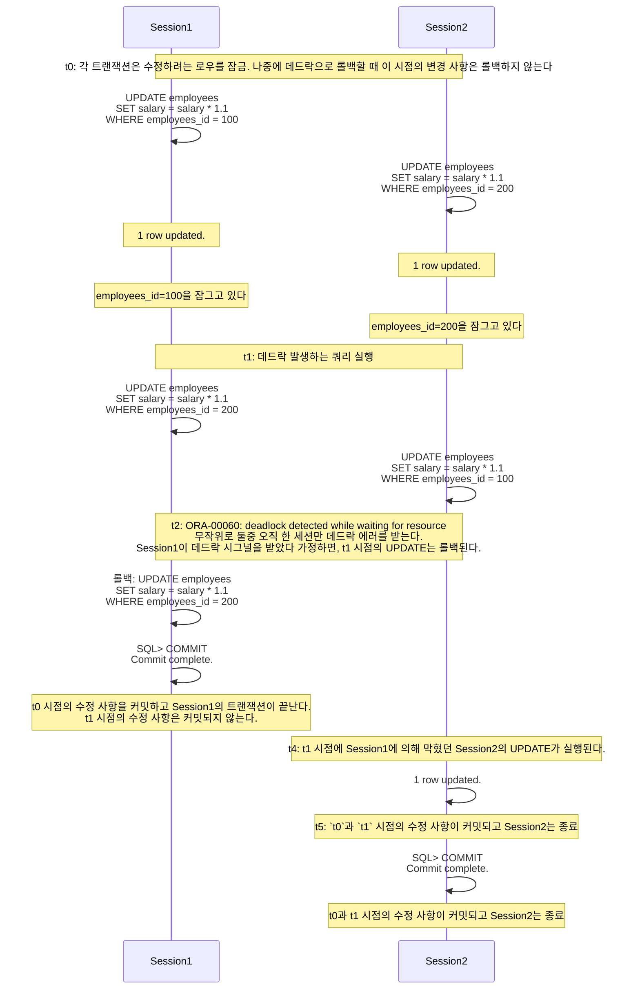
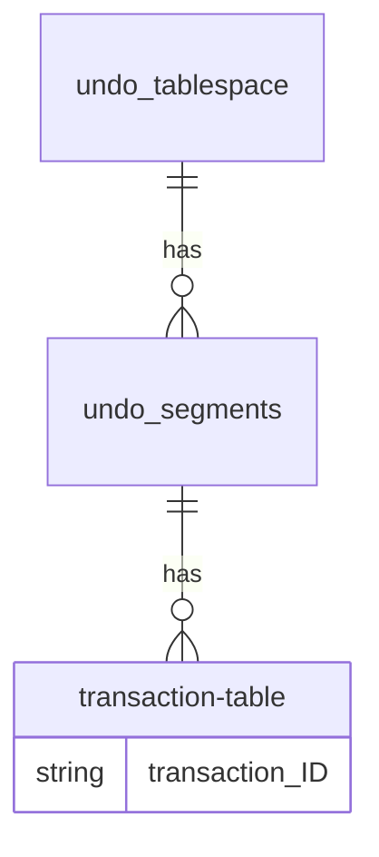
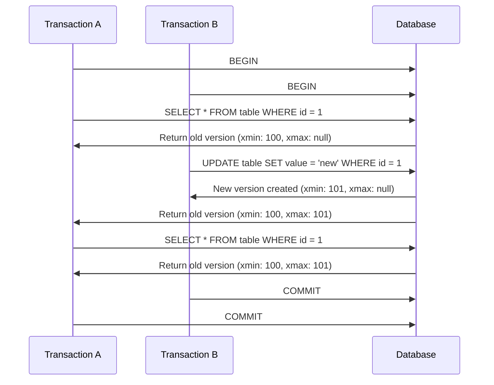
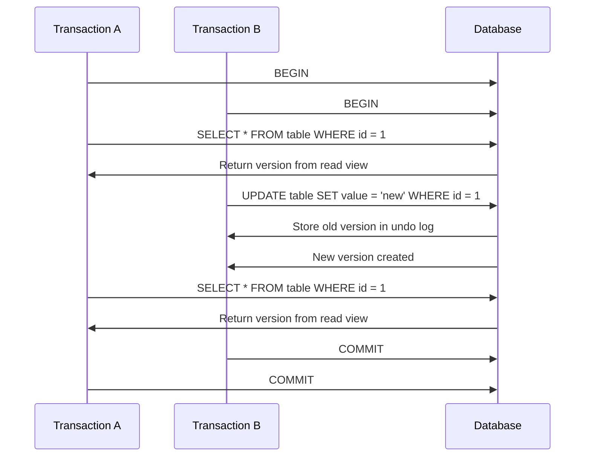

# mvcc

- [mvcc](#mvcc)
    - [정리 구조](#정리-구조)
    - [MVCC 개요](#mvcc-개요)
        - [MVCC의 목적과 중요성](#mvcc의-목적과-중요성)
        - [MVCC 정의](#mvcc-정의)
        - [MVCC 목적](#mvcc-목적)
        - [MVCC 장점](#mvcc-장점)
        - [MVCC 구현](#mvcc-구현)
    - [RDBMS와 MVCC 등장 역사](#rdbms와-mvcc-등장-역사)
        - [1960년대 ~ 1970년대 초반](#1960년대--1970년대-초반)
        - [1970년대 중반 ~ 1980년대](#1970년대-중반--1980년대)
        - [1980년대 말 ~ 1990년대](#1980년대-말--1990년대)
    - [MVCC 등장 배경](#mvcc-등장-배경)
    - [MVCC를 고안하게 된 사고 과정](#mvcc를-고안하게-된-사고-과정)
    - [MVCC의 두 가지 흐름](#mvcc의-두-가지-흐름)
        - [첫번째 흐름: `MGA`(PostgreSQL, Firebird/Interbase, SQL Server 등)](#첫번째-흐름-mgapostgresql-firebirdinterbase-sql-server-등)
            - [`MGA` 예제](#mga-예제)
        - [두번째 흐름: `Rollback segment`(Oracle, MySQL/InnoDB 등)](#두번째-흐름-rollback-segmentoracle-mysqlinnodb-등)
            - [`Rollback segment` 예제](#rollback-segment-예제)
            - [`Rollback Segment`에서 일관된 읽기](#rollback-segment에서-일관된-읽기)
    - [트랜잭션](#트랜잭션)
        - [샘플 트랜잭션: 계좌의 debit(차변)/credit(대변)](#샘플-트랜잭션-계좌의-debit차변credit대변)
        - [오라클의 락과 데드락](#오라클의-락과-데드락)
            - [`lock`?](#lock)
            - [`deadlock`?](#deadlock)
    - [DBMS별 MVCC 메커니즘 비교](#dbms별-mvcc-메커니즘-비교)
        - [비교 내용](#비교-내용)
            - [TX 식별자](#tx-식별자)
            - [Old Version 저장 위치](#old-version-저장-위치)
            - [Old Version 포인터](#old-version-포인터)
            - [레코드 포인터](#레코드-포인터)
            - [페이지 내 레코드 저장 순서](#페이지-내-레코드-저장-순서)
            - [COMMIT 시점의 Action](#commit-시점의-action)
            - [ReadView 사용 여부](#readview-사용-여부)
            - [레코드 헤더 크기](#레코드-헤더-크기)
            - [트랜잭션 리스트 관리](#트랜잭션-리스트-관리)
        - [트랜잭션 처리 위한 ID](#트랜잭션-처리-위한-id)
            - [Oracle](#oracle)
            - [PostgreSQL](#postgresql)
            - [MySQL/InnoDB](#mysqlinnodb)
        - [Old Version의 저장위치와 포인터](#old-version의-저장위치와-포인터)
            - [Oracle - Old Version](#oracle---old-version)
            - [PostgreSQL - Old Version](#postgresql---old-version)
        - [데이터 블록 내의 레코드 관리](#데이터-블록-내의-레코드-관리)
            - [Oracle와 PostgreSQL 레코드 관리](#oracle와-postgresql-레코드-관리)
        - [트랜잭션의 COMMIT 후 처리](#트랜잭션의-commit-후-처리)
            - [오라클의 커밋 후 처리](#오라클의-커밋-후-처리)
            - [PostgreSQL의 커밋 후 처리](#postgresql의-커밋-후-처리)
        - [Readview](#readview)
    - [격리 수준과 MVCC](#격리-수준과-mvcc)
        - [트랜잭션과 Isolation](#트랜잭션과-isolation)
        - [Isolation Level의 예시](#isolation-level의-예시)
        - [격리성의 문제점과 MVCC](#격리성의-문제점과-mvcc)
        - [MVCC와 Isolation Level의 상관관계](#mvcc와-isolation-level의-상관관계)
        - [MVCC와 Isolation Level의 상관관계 및 실생활 비유](#mvcc와-isolation-level의-상관관계-및-실생활-비유)
        - [도서관 비유를 통한 데이터베이스 트랜잭션과 MVCC의 설명](#도서관-비유를-통한-데이터베이스-트랜잭션과-mvcc의-설명)
    - [데이터베이스 락과 MVCC](#데이터베이스-락과-mvcc)
        - [데이터베이스 락 (Lock)](#데이터베이스-락-lock)
        - [커밋과 롤백](#커밋과-롤백)
        - [다중 버전 동시성 제어(Multi-Version Concurrency Control, MVCC)](#다중-버전-동시성-제어multi-version-concurrency-control-mvcc)
    - [MVCC 구현 방식](#mvcc-구현-방식)
        - [PostgreSQL의 MVCC](#postgresql의-mvcc)
        - [MySQL의 InnoDB](#mysql의-innodb)
    - [각 DBMS의 MVCC 구현 방식 비교](#각-dbms의-mvcc-구현-방식-비교)

## 정리 구조

1. MVCC의 개요
    - MVCC의 중요성
    - MVCC 정의
    - MVCC 목적
    - MVCC 장점
    - MVCC 구현
    - MVCC 발전

2. MVCC의 역사와 배경
    - 동시성 제어의 역사적 맥락
    - MVCC의 등장 배경
    - MVCC를 고안하게 된 사고 과정

3. MVCC의 기본 원리
    - 버전 관리 메커니즘
    - 트랜잭션 격리 수준과 MVCC
    - MVCC와 ACID 속성

4. MVCC의 구현 방식
    - 주요 DBMS별 MVCC 구현 비교
        - PostgreSQL
        - Oracle
        - MySQL (InnoDB)
        - SQL Server
    - 구현 방식의 차이점과 각각의 장단점

5. MVCC와 트랜잭션 관리
    - 트랜잭션 ID와 타임스탬프
    - 버전 체인 관리
    - 동시성 제어와 충돌 해결

6. MVCC의 성능과 최적화
    - 읽기/쓰기 성능에 미치는 영향
    - 버전 관리의 오버헤드
    - 가비지 컬렉션과 버전 정리

7. MVCC의 이론적 기반
    - 동시성 이론
    - 분산 시스템 이론
    - 데이터베이스 트랜잭션 이론

8. MVCC의 한계와 도전 과제
    - 장기 실행 트랜잭션 문제
    - 버전 관리의 복잡성
    - 확장성 문제

9. MVCC의 미래와 발전 방향
    - 새로운 MVCC 알고리즘
    - 분산 환경에서의 MVCC
    - MVCC와 NewSQL

10. 결론 및 요약

## MVCC 개요

MVCC(Multi-Version Concurrency Control)는 데이터베이스 관리 시스템(DBMS)에서 사용되는 *동시성 제어 방법*입니다.
이 기술은 *데이터의 여러 버전을 유지*함으로써 *읽기 작업과 쓰기 작업이 서로를 차단하지 않고 동시에 수행*될 수 있도록 합니다.

### MVCC의 목적과 중요성

MVCC의 주요 목적은 데이터베이스 시스템의 동시성과 성능을 향상시키는 것입니다.

MVCC의 중요성은 현대의 데이터베이스 시스템에서 더욱 부각되고 있습니다.
대규모 온라인 트랜잭션 처리(OLTP) 시스템, 웹 애플리케이션, 클라우드 서비스 등에서 높은 동시성과 성능이 요구되는 환경에서 MVCC는 핵심적인 역할을 수행합니다.
또한, MVCC의 원리는 분산 데이터베이스 시스템과 NoSQL 데이터베이스에서도 적용되어, 현대의 다양한 데이터 관리 시스템에서 중요한 기술로 자리 잡고 있습니다.

이는 다음과 같은 중요한 이점을 제공합니다:

- 높은 동시성:

    MVCC는 읽기 작업과 쓰기 작업이 서로를 차단하지 않고 동시에 실행될 수 있게 합니다.
    이는 전통적인 락(lock) 기반 동시성 제어 방식에 비해 더 높은 동시성을 제공합니다.

- 일관된 읽기:

    각 트랜잭션은 시작 시점의 일관된 데이터 스냅샷을 볼 수 있습니다.
    이를 통해 다음과 같은 문제들을 방지할 수 있습니다.
    - "dirty read"
    - "non-repeatable read"
    - "phantom read" 등

- 향상된 성능:

    읽기 작업이 쓰기 작업을 차단하지 않기 때문에, 읽기 중심의 워크로드에서 특히 높은 성능을 보입니다.
    락 경합(lock contention)이 줄어들어 전반적인 시스템 성능이 향상됩니다.

- 확장성:

    MVCC는 대규모 동시 사용자 환경에서도 효과적으로 작동합니다.
    이는 클라우드 기반 및 분산 데이터베이스 시스템에서 특히 중요합니다.

- 격리 수준 지원:

    MVCC는 다양한 트랜잭션 격리 수준을 효과적으로 지원할 수 있습니다.
    이를 통해 애플리케이션의 요구사항에 따라 일관성과 성능 사이의 균형을 조절할 수 있습니다.

### MVCC 정의

**Multiversion Concurrency Control (MVCC)**는 데이터베이스 시스템에서 *데이터 일관성*과 *동시성*을 유지하기 위해 사용되는 중요한 기술입니다.

MVCC는 데이터의 *각 변경사항을 새로운 버전으로 저장*하는 방식으로 동작합니다.
이를 통해 각 트랜잭션은 데이터의 일관된 스냅샷을 볼 수 있으며, 다른 트랜잭션의 변경 사항에 영향을 받지 않고 작업을 수행할 수 있습니다.

MVCC의 핵심 아이디어는 다음과 같습니다:
- 데이터 수정 시 새 버전 생성: 데이터가 수정될 때마다 새로운 버전의 데이터가 생성됩니다.
- 버전 관리: 각 버전에는 생성 시점과 관련된 메타데이터(예: 트랜잭션 ID, 타임스탬프)가 포함됩니다.
- 읽기 일관성: 각 트랜잭션은 시작 시점의 일관된 데이터 스냅샷을 볼 수 있습니다.
- 동시성 향상: 읽기 작업이 쓰기 작업을 차단하지 않고, 그 반대도 마찬가지입니다.

### MVCC 목적

MVCC의 목적은 *여러 사용자 또는 트랜잭션이 동시에 데이터에 접근할 때, 서로 간의 작업이 충돌하지 않도록 하면서 동시에 많은 트랜잭션을 처리하는 것*입니다.
이 방법은 각 사용자가 데이터의 특정 "버전"을 보도록 함으로써 작업합니다.

- Write 세션이 Read 세션을 블로킹하지 않습니다.
- Read 세션이 Write 세션을 블로킹하지 않습니다.
- 서로 다른 세션이 동일 데이터에 접근했을 때, 각 세션마다 스냅샷 이미지를 보장해주는 매커니즘입니다.
- `Multiversion`이라는 말 그대로, **데이터 변화를 여러 버전으로 관리**하여 동시성 제어를 합니다.

### MVCC 장점

이로 인해, 다음과 같은 중요한 장점들을 제공합니다:

- **비블로킹 읽기 및 쓰기 작업**

    MVCC는 읽기 작업이 쓰기 작업을 방해하지 않고, 쓰기 작업이 읽기 작업을 방해하지 않도록 합니다.

    예를 들어, 한 트랜잭션이 데이터를 읽고 있는 동안 다른 트랜잭션이 동일한 데이터를 수정할 수 있으며, 이는 서로를 블로킹하지 않습니다.

    예를 들어, 한 트랜잭션이 데이터를 읽고 있는 동안 다른 트랜잭션이 동일한 데이터를 수정할 수 있으며, 이는 서로를 블로킹하지 않습니다.

- **버전 관리를 통한 데이터 접근**

    데이터베이스 내의 *각 데이터 항목은 수정될 때마다 새로운 "버전"을 생성*합니다.
    트랜잭션이 데이터를 요청할 때, 해당 *트랜잭션의 타임스탬프와 일치하는 가장 최근의 데이터 버전이 제공*됩니다.
    이는 각 사용자가 데이터의 일관된 뷰를 가질 수 있도록 보장합니다.

- **스냅샷 격리**

    MVCC는 스냅샷 격리 수준을 제공합니다.
    이는 트랜잭션이 시작될 때 데이터베이스의 "스냅샷"을 취하고, 트랜잭션이 실행되는 동안 해당 스냅샷 데이터에 대해서만 작업을 수행한다는 의미입니다.
    이를 통해 트랜잭션은 다른 트랜잭션이 동시에 같은 데이터를 변경하더라도 그 변경 사항을 "보지" 않습니다.

- **동시성과 성능의 향상**

    데이터베이스에 MVCC를 구현함으로써, 동시에 많은 트랜잭션을 처리할 수 있으며, 이는 시스템의 전반적인 처리량과 성능을 크게 향상시킵니다.
    락을 사용하는 전통적인 동시성 제어 방법에 비해, MVCC는 훨씬 적은 충돌과 지연을 발생시킵니다.

### MVCC 구현

MVCC는 PostgreSQL, Oracle, MySQL(InnoDB), Microsoft SQL Server 등 다양한 현대 데이터베이스 관리 시스템에서 널리 사용됩니다.
각 시스템은 MVCC를 구현하기 위해 다양한 기법과 최적화를 적용하지만, 기본 원리는 동일합니다.

예를 들어, 고객 데이터베이스에서 한 트랜잭션이 고객의 주소를 업데이트하는 동안, 다른 트랜잭션이 해당 고객의 주소를 읽을 수 있습니다.
업데이트 작업을 하는 트랜잭션은 새로운 버전의 주소 데이터를 생성하지만, 읽기 트랜잭션은 업데이트가 완료되기 전의 주소 데이터 버전을 보게 됩니다.
이를 통해 읽기 작업은 업데이트 작업에 의해 방해받지 않고, 업데이트 작업 역시 읽기 작업에 의해 지연되지 않습니다.

## RDBMS와 MVCC 등장 역사

### 1960년대 ~ 1970년대 초반

초기 데이터베이스 시스템은 단일 사용자 환경을 위해 설계되었습니다.
동시성 제어는 큰 문제가 아니었으며, 대부분의 작업은 순차적으로 처리되었습니다.

### 1970년대 중반 ~ 1980년대

다중 사용자 환경의 등장으로 동시성 제어가 중요한 이슈로 부각되었습니다.
락(Lock) 기반의 동시성 제어 방식이 주로 사용되었습니다.
2단계 락킹(Two-Phase Locking, 2PL)이 가장 널리 사용된 프로토콜이었습니다.

하지만 락 기반 동시성 제어는 여러 문제점들이 발생할 수 있었습니다.

- 데드락(Deadlock) 발생 가능성:
    두 개 이상의 트랜잭션이 서로가 보유한 락을 기다리며 무한정 대기하는 상황이 발생할 수 있습니다.

- 읽기 작업과 쓰기 작업 간의 상호 차단으로 인한 성능 저하:

    읽기 작업이 쓰기 락을 기다리거나, 쓰기 작업이 읽기 락을 기다리는 상황이 빈번히 발생하여 전반적인 시스템 성능이 저하될 수 있습니다.

- 장기 실행 트랜잭션으로 인한 시스템 전반의 성능 저하:

    하나의 트랜잭션이 오랜 시간 동안 락을 보유하면, 다른 트랜잭션들이 그 락이 해제될 때까지 기다려야 하므로 전체 시스템의 처리량이 감소할 수 있습니다.

2PL은 1976년에 제안되었고, MVCC는 1978년에 처음 제안되었습니다.
따라서 이 역사적 사건들은 2PL과 MVCC의 개발을 위한 토대를 마련했다고 볼 수 있습니다.
이러한 락 기반 동시성 제어의 문제점들이 MVCC와 같은 새로운 동시성 제어 방식의 개발을 촉진하는 배경이 되었습니다.
MVCC는 2PL의 문제점들을 상당 부분 해결하거나 완화할 수 있는 방식으로 설계되었습니다.

- 1970년: 관계형 모델의 제안

    E. F. Codd 박사의 RDBMS 논문(A relational model of data for large **shared data** banks)
    - 이는 관계형 데이터베이스의 기본 개념을 소개한 획기적인 논문입니다.
    - 데이터의 독립성, 구조적인 간결함, SQL 같은 고급 언어를 통한 집합 처리 등에 대한 내용입니다.
    - 동시성 제어나 2PL, MVCC에 대한 직접적인 언급은 없지만, "shared data banks"라는 개념을 통해 여러 사용자가 동시에 데이터에 접근하는 환경의 필요성을 제시했습니다.
    - 이는 후에 동시성 제어 메커니즘 개발의 필요성으로 이어집니다.

- 1974년: RDBMS의 실제 구현 시도, 트랜잭션 처리 이론 발전

    IBM에서 System R프로젝트 시작:
    - Codd의 이론을 실제 구현한 최초의 RDBMS 프로토타입입니다.

    Raymond F. Boyce, Donald D. Chamberlin, SEQUEL(Structured English Query Language):
    - SEQUEL(후의 SQL)은 관계형 데이터베이스를 위한 쿼리 언어

    Jim Gray의 ACID 및 트랜잭션 처리 이론:
    - ACID, Locking, Recovery 매커니즘 등 트랜잭션 처리 관한 이론 정립
    - 2PL을 포함한 다양한 동시성 제어 메커니즘의 기초가 되었습니다. 그의 연구는 2PL의 발전에 직접적인 영향을 미쳤습니다.

    Ingres 프로젝트:
    - Michael Stonebraker, 동료 및 제자 $\to$ Ingres(Interactive Graphics and Retrieval System)
    - 또 다른 초기 RDBMS 구현으로, 후에 PostgreSQL의 기초가 되었습니다.

- 1976년: 락 기반 동시성 제어 메커니즘 개발, 2PL의 제안, 상용 RDBMS 출시

    Oracle DBMS:
    - Bob Miner, Ed Oates, Lally Ellison $\to$ SDL 찹업 후 Oracle DBMS 발표
    - Oracle의 설립과 첫 DBMS 출시는 상용 RDBMS 시장의 시작을 알렸습니다.
    - 초기 Oracle DBMS는 락 기반의 동시성 제어를 사용했으며, 후에 MVCC를 도입했습니다.

- 1978년: MVCC의 제안

    David P. Reed $\to$ READ와 WRITE 경합 최소화 아이디어 제시

    - 어떤 데이터에 여러 차례 수정이 있다고 가정할 때
    - 수정이 가해진 각 시점의 개별 버전을 모두 저장하고(`Multiversion`)
    - 데이터 객체는 이러한 개별 버전들의 연속체로 정의

    `Synchronization`?

    - mechanism for naming versions to be read,
    - and a mechanism for defining where in the sequence of versions the version resulting from some update should be placed

### 1980년대 말 ~ 1990년대

온라인 트랜잭션 처리(OLTP) 시스템의 등장으로 고성능, 고동시성 요구 증가했습니다.
그러면서 새로운 동시성 제어 방식에 대한 필요성 대두됐습니다.

- 1981년

    Philip A. Bernstein, Nathan Goodman $\to$ `MVCC`

- 1984년

    Jim Starkey

    $\to$ 최초로 Rdb/ELN 제품에 처음으로 MVCC 아키텍처 도입

    $\to$ 두번째로 Interbase DB에 발전시킨 MVCC 도입하는데, `Multi Generation Architecture(MGA, 추기형)`라고 한다

- 1986년

    Bob Miner $\to$ 오라클 version 6에서 `Rollback Segment` 도입

- 1999년

    Mikheev Vadim B. $\to$ `MGA` 아키텍처 채택하여 PostgreSQL 6.5에 MVCC 아키텍처 도입

## MVCC 등장 배경

MVCC는 이러한 역사적 맥락 속에서 기존 동시성 제어 방식의 한계를 극복하기 위해 등장했습니다.

1) 높은 동시성 요구:
   - OLTP 시스템의 확산으로 더 많은 동시 트랜잭션 처리 능력이 필요해졌습니다.
   - 기존의 락 기반 시스템은 이러한 요구를 충족시키기 어려웠습니다.

2) 읽기-쓰기 충돌 해결 필요성:
   - 많은 애플리케이션에서 읽기 작업의 비중이 높아졌습니다.
   - 읽기 작업이 쓰기 작업을 차단하거나, 그 반대의 경우를 최소화할 필요가 있었습니다.

3) 일관성과 격리성 보장:
   - 동시성을 높이면서도 트랜잭션의 ACID 속성, 특히 일관성(Consistency)과 격리성(Isolation)을 보장해야 했습니다.

4) 장기 실행 트랜잭션 문제 해결:
   - 기존 시스템에서 장기 실행 트랜잭션은 다른 트랜잭션들을 장시간 차단하는 문제가 있었습니다.

5) 분산 시스템의 등장:
   - 분산 데이터베이스 시스템에서 효율적인 동시성 제어 방식이 필요해졌습니다.

## MVCC를 고안하게 된 사고 과정

MVCC의 개념은 1978년 David P. Reed의 MIT 박사 학위 논문 "Naming and Synchronization in a Decentralized Computer System"에서 처음 소개되었습니다.

David P. Reed의 MVCC 개발 과정에서 나타나는 문제 해결 접근 방식:

1. 문제 정의 및 분석:
    > 해결하려는 문제를 명확히 정의하고, 그 근본 원인을 파악하세요.
    > 질문: 정확히 어떤 문제를 해결하려 하는가? 왜 이 문제가 발생하는가?

    Reed는 기존 락 기반 시스템의 한계를 명확히 인식했습니다.

    - 구체적 문제: 높은 동시성 환경에서의 성능 저하, 읽기-쓰기 충돌

    이 단계에서 Reed는 문제의 근본 원인을 파악하려 노력했습니다.

2. 기존 패러다임에 대한 도전:
    > 현재의 해결책들이 왜 충분하지 않은지 분석하세요.
    > 질문: 현재 해결책의 한계는 무엇인가? 어떤 가정들이 문제를 야기하는가?

    Reed는 "락"이라는 기존의 동시성 제어 패러다임에서 벗어나 생각했습니다.
    이는 문제 해결을 위해 기존의 사고 방식을 탈피하는 것의 중요성을 보여줍니다.

3. 새로운 관점 도입:
    > 문제를 완전히 새로운 관점에서 바라보세요.
    > 질문: 이 문제를 전혀 다른 방식으로 접근한다면 어떻게 될까?

    "버전"이라는 새로운 개념을 도입했습니다.
    이는 문제를 다른 각도에서 바라보는 능력의 중요성을 나타냅니다.

4. 아이디어의 구체화:
    > 추상적인 아이디어를 구체적인 메커니즘으로 발전시키세요.
    > 질문: 이 아이디어를 어떻게 실제로 구현할 수 있을까?

    버전 관리, 타임스탬프, 스냅샷 등의 구체적인 메커니즘을 고안했습니다.
    이는 추상적인 아이디어를 실제 구현 가능한 형태로 발전시키는 과정을 보여줍니다.

5. 전체론적 접근:
    > 문제와 관련된 모든 측면을 고려하세요.
    > 질문: 이 해결책이 시스템의 다른 부분에 어떤 영향을 미칠까?

    Reed는 단순히 동시성 문제만 해결하려 하지 않고, 일관성, 격리성 등 데이터베이스의 다른 중요한 속성들도 함께 고려했습니다.
    이는 문제 해결 시 관련된 모든 측면을 종합적으로 고려하는 것의 중요성을 보여줍니다.

6. 부작용 예측 및 대응:
    > 새로운 해결책이 가져올 수 있는 부작용을 미리 예측하고 대비하세요.
    > 질문: 이 해결책으로 인해 발생할 수 있는 새로운 문제는 무엇인가?

    가비지 컬렉션 문제를 미리 고려한 것은 새로운 해결책이 가져올 수 있는 부작용을 예측하고 대비하는 자세를 보여줍니다.

7. 이론적 기반 구축:
    > 실용적 해결책에 대한 이론적 근거를 마련하세요.
    > 질문: 이 해결책이 왜 작동하는지 수학적 또는 논리적으로 설명할 수 있는가?

    일관성 모델을 개발함으로써, 자신의 아이디어에 대한 이론적 기반을 마련했습니다.
    이는 실용적 해결책과 이론적 타당성을 모두 추구하는 균형 잡힌 접근을 보여줍니다.

이러한 사고 과정을 거쳐 MVCC의 기본 개념이 탄생했고, 이후 여러 연구자와 데이터베이스 시스템 개발자들에 의해 발전되었습니다.

여기서 `Synchronization`은 다음과 같은 의미를 가집니다:

1. 버전 명명 메커니즘 (mechanism for naming versions to be read):

   이는 *각 트랜잭션이 읽어야 할 데이터의 버전을 어떻게 결정하고 식별할 것인지*를 의미합니다.

   예를 들어, 각 트랜잭션에 타임스탬프를 부여하고, 이 타임스탬프를 기준으로 해당 트랜잭션이 볼 수 있는 데이터 버전을 결정합니다.

   이를 통해 각 트랜잭션은 자신의 시작 시점 이전에 커밋된 데이터만을 볼 수 있게 됩니다.

2. 새 버전 위치 결정 메커니즘 (mechanism for defining where in the sequence of versions the version resulting from some update should be placed):

   이는 새로운 데이터 버전이 생성될 때, 이 버전을 버전 시퀀스의 어느 위치에 삽입할 것인지를 결정하는 방법을 의미합니다.
   일반적으로 이는 트랜잭션의 커밋 시점을 기준으로 결정됩니다.
   이 메커니즘은 여러 트랜잭션이 동시에 같은 데이터를 수정하려 할 때 어떤 순서로 변경사항을 적용할지를 결정하는 데 중요합니다.

이러한 'Synchronization' 메커니즘은 MVCC의 핵심 아이디어를 구현하는 데 필수적입니다. 이를 통해 MVCC는 다음과 같은 목표를 달성합니다:

1. 읽기 작업과 쓰기 작업 간의 충돌 최소화:
   - 읽기 트랜잭션은 항상 일관된 스냅샷을 볼 수 있으며, 쓰기 트랜잭션에 의해 차단되지 않습니다.

2. 트랜잭션 격리성 보장:
   - 각 트랜잭션은 자신의 시작 시점을 기준으로 일관된 데이터베이스 상태를 볼 수 있습니다.

3. 동시성 향상:
   - 여러 트랜잭션이 동시에 실행되더라도 서로를 차단하지 않고 진행할 수 있습니다.

4. 일관성 유지:
   - 데이터의 여러 버전을 유지함으로써 트랜잭션 간의 일관성을 보장합니다.

Reed의 MVCC 제안에서 'Synchronization'은 단순히 동기화(여러 프로세스나 스레드가 동시에 실행될 때 그들 사이의 실행 순서를 조정하는 것)를 의미하는 것이 아니라, 여러 버전의 데이터가 존재하는 환경에서 각 트랜잭션이 적절한 버전의 데이터를 읽고 쓸 수 있도록 조정하는 메커니즘을 의미합니다. 이는 MVCC의 핵심 아이디어를 구현하는 데 필수적인 개념입니다.

특히 1980년대 후반부터 1990년대에 걸쳐 PostgreSQL, Oracle 등의 상용 데이터베이스 시스템에서 MVCC를 구현하면서 실제 적용 가능한 기술로 발전했습니다.

## MVCC의 두 가지 흐름

`MGA`는 데이터의 여러 버전을 동시에 관리하여 각 사용자가 데이터의 일관된 뷰를 볼 수 있도록 하며,
`롤백 세그먼트`는 데이터의 최신 상태만을 유지하면서 과거 버전을 필요에 따라 제공합니다.

### 첫번째 흐름: `MGA`(PostgreSQL, Firebird/Interbase, SQL Server 등)

- PostgreSQL, Firebird/Interbase, SQL Server 등
- 데이터베이스 내에 데이터의 여러 버전을 저장하고, 트랜잭션이 진행되는 동안 각 세션은 해당 시점의 스냅샷을 바탕으로 데이터를 볼 수 있습니다.
- 데이터는 업데이트될 때 새로운 버전으로 복사되며, 이전 버전은 유효 범위를 표시하여 관리됩니다.
- 데이터베이스 내에 다중 버전의 레코드 저장하고 더 이상 필요하지 않을 때 모아둔 레코드 버림
- `Multi Generation Architecture, MGA`

    Tuple 업데이트 시 새로운 값으로 대체하지 않고,
    동일한 데이터 페이지 내에서
    New Tuple을 새롭게 추가하고
    Old Tuple은 유효 범위를 마킹하여 처리

예를 들면 도서관의 책 복사본과 같습니다.
도서관에 있는 특정 책(데이터)에 대해 여러 사람(트랜잭션)이 동시에 접근하려고 합니다.
책을 읽는 사람은 책의 현재 상태를 보고, 또 다른 사람이 동시에 책의 내용을 업데이트(새로운 정보 추가) 할 경우 새로운 복사본을 만듭니다.
책을 읽는 사람은 자신이 시작한 시점의 복사본을 계속 보게 됩니다.

#### `MGA` 예제

- 업데이트 전

    `XMIN`에 `XID 10` 세팅 & `XMAX` 세팅된 값 없음 = **`XID 10`부터 현재까지 유효** 의미

    |         |         |         |
    | ------- | ------- | ------- |
    | XMIN 10 | XMAX -- | TUPLE 1 |
    | XMIN 10 | XMAX -- | TUPLE 2 |
    | XMIN 10 | XMAX -- | TUPLE 3 |

- TUPLE 2 업데이트

    **OLD** TUPLE 2:

    `XID 30`일 때, 기존 TUPLE 2의 `XMAX`에 `XID 30` 세팅하여 OLD 버전임을 표시

    $\to$ `XID 10`부터 `XID 30` 범위에서 visible한 값

    **NEW** TUPLE 2:

    `XMIN`의 `XID 30`, `XMAX`는 없음

    $\to$ **`XID 30`부터 현재까지 유효** 의미

    |             |             |                 |
    | ----------- | ----------- | --------------- |
    | XMIN 10     | XMAX --     | TUPLE 1         |
    | XMIN 10     | XMAX **30** | **OLD** TUPLE 2 |
    | XMIN 10     | XMAX --     | TUPLE 2         |
    | XMIN 10     | XMAX --     | TUPLE 3         |
    | XMIN **30** | XMAX --     | **NEW** TUPLE 2 |
    |             |             |                 |

- 서로 다른 세션끼리 어떻게 Snapshot image를 SELECT?

    시점별 XID:
    - T0: `XID 10`
    - T1: `XID 20`
    - T2: `XID 30`
    - T3: `XID 40`

    T1 시점: *SESSION-1* OPEN

    *SESSION-1* SELECT $\to$ TUPLE 1, TUPLE 2, TUPLE 3 조회

    ```bash
    PAGE HEADER

            ... FREE SPACE ...

    [TUPLE 3][TUPLE 2][TUPLE 1][PAGE TAIL]
    ```

    T2 시점: UPDATE TUPLE 2

    $\to$ 새로운 NEW TUPLE 2가 추가

    $\to$ *OLD TUPLE 2*는 `XMAX`에 유효한 `XID` 범위값 세팅

    ```bash
    PAGE HEADER

            ... FREE SPACE ...
                                 [NEW TUPLE 2]
    [TUPLE 3][OLD TUPLE 2][TUPLE 1][PAGE TAIL]
    ```

    T3 시점: *SESSION-3* OPEN

    *SESSION-1* SELECT $\to$ TUPLE 1, **OLD** TUPLE 2, TUPLE 3 조회

    *SESSION-3* SELECT $\to$ TUPLE 1, **NEW** TUPLE 2, TUPLE 3 조회

### 두번째 흐름: `Rollback segment`(Oracle, MySQL/InnoDB 등)

- Oracle, MySQL/InnoDB 등
- 데이터의 최신 버전만을 메인 저장소에 보관하고, 변경되기 전의 데이터는 별도의 저장소(롤백 세그먼트)에 저장합니다.(최신 버전의 데이터만 데이터베이스 내에 저장)
- 조회 시, 필요에 따라 이전 버전을 롤백 세그먼트에서 가져와 일관된 읽기를 제공합니다.(언두를 이용하여 이전 버전 데이터 재구성)
- 1986년 Bob Miner는 오라클 version 6에서 `Rollback Segment` 도입하여 MVCC 구현
- `Rollback segment` 메커니즘
    - UPDATE 실행

        $\to$ 기존 데이터 블록 내의 데이터 레코드를 New Version으로 변경

        $\to$ Old Version을 별도의 저장소인 `Rollback segment`에 보관

    - SELECT 실행

        $\to$ `SELECT SCN(System Change Number)`과 `데이터 블록의 SCN(System Change Number)`을 비교

        $\to$ **Consistent Read**가 필요하다고 판단

        $\to$ 롤백 세그먼트의 Old Version을 읽어서 버퍼캐시에 `CR(Consistence Read) 블록`을 생성
    - SELECT 쿼리의 Snapshot Read를 보장
    - `Ora-1555 snapshot too old`라는 한계점 제외하고는 동시성을 극대화해주는 최고의 방법이었다

이는 사진 앨범과 백업 사진과 같습니다.
당신은 사진 앨범(데이터베이스)을 가지고 있으며, 가장 최근의 사진(데이터)만을 앨범에 보관합니다.
사진을 업데이트(예: 필터 추가) 할 때마다, 원본 사진은 다른 장소(롤백 세그먼트)에 보관합니다.
사진 앨범을 볼 때, 특정 사진의 이전 상태가 필요하면 백업 장소에서 원본 사진을 가져와서 보게 됩니다.

#### `Rollback segment` 예제

- 업데이트 전

    | data block                       | undo block                 |
    | -------------------------------- | -------------------------- |
    | ITL(Interested Transaction List) | TX(Transaction) Table Slot |
    | Data Row `A`                     |                            |

- 업데이트 후

    | data block                       |        | undo block                      |
    | -------------------------------- | ------ | ------------------------------- |
    | ITL(Interested Transaction List) | ┬XID─> | TX(Transaction) Table Slot ┐UBA |
    | Data Row (new Image `B`)         | └UBA─> | Undo Record(Old Image `A`)<┘    |

- `ITL`?

    [`Interested Transaction List`](https://datacadamia.com/db/oracle/transaction_table)의 약자이며, `transaction table`이라고도 한다

    [ITL structure in detail](https://avdeo.com/2008/06/16/interested-transaction-list-itl/) 참고
    - Variable header: 위에서 아래로 필요에 따라 증가
    - row: 아래에서 위로 증가
    - ITL은 variable portion of data block header에 위치한다(그러니까 Variable header...?)
    - 이 데이터 블록 헤더의 가변 영역은 트랜잭션에 대한 슬롯들을 갖는다
        - 만약 어떤 row가 lock 된다면? $\to$ 트랜잭션은 lock 된 row의 rowid와 함께 한 슬롯에 lock을 넣는다
        - 달리 말하자면, **트랜잭션이 해당 row에 관심이 있다고 표시**하는 것(그래서 *Interested Transaction List*다)

- `UBA`?`Undo Block Address`
- `Consistence Read`(일관된, 언행이 일치된, 모순이 없는 읽기)?
    - [[Oracle] 문장수준 읽기 일관성 Consistent Mode, Current Mode 차이 :: 마이자몽](https://myjamong.tistory.com/195) 참고
    - Consistent Read 위해서, SELECT 시점에 SCN을 비교해서 Undo Segment에 존재하는 해당 Old Versions을 찾아서 버퍼 캐시에 CR 블록 생성

#### `Rollback Segment`에서 일관된 읽기

이 방식은 과거 데이터를 필요로 할 때 이전 버전의 데이터를 제공할 수 있도록 설계되었습니다.

롤백 세그먼트와 과거 데이터 조회 방식:

1. **Undo 로그의 역할**

    롤백 세그먼트 방식에서는 데이터의 각 변경 사항(업데이트, 삭제)에 대한 정보를 별도의 구조인 Undo 로그에 저장합니다.
    이 Undo 로그는 변경되기 전의 데이터의 상태를 포함하며, "언두" 정보라고도 합니다.

2. **Consistent Read**

    (읽기 일관성) 데이터베이스는 트랜잭션의 시작 시점에 대한 데이터 일관성을 보장해야 합니다.
    트랜잭션이 데이터를 읽을 때, 그 트랜잭션의 시작 시점에서의 데이터 상태를 보여주어야 합니다.
    이를 위해 데이터베이스는 최신 데이터와 함께 언두 정보를 활용합니다.

    (버전 관리) 트랜잭션이 데이터를 읽을 때, 해당 트랜잭션의 시점에 데이터가 어떻게 보였는지를 결정하기 위해 데이터의 현재 버전과 함께 저장된 Undo 정보를 비교합니다. *필요한 경우, Undo 정보를 사용하여 해당 시점의 데이터 상태를 재구성*합니다.

3. **Undo 로그를 통한 데이터 재구성**

    트랜잭션이 데이터를 조회할 때, 데이터베이스는 다음의 단계를 거칩니다:

    - 현재 데이터 블록의 상태와 트랜잭션의 시작 시점을 비교합니다.
    - 만약 데이터가 트랜잭션 시작 후에 변경되었다면, Undo 로그를 조회하여 트랜잭션 시작 시점의 데이터 상태를 재구성합니다.
    - 이 재구성된 데이터는 일관된 읽기(Consistent Read)를 위해 사용됩니다.

예를 들어,
1. 트랜잭션 A가 오전 10시에 시작되어 특정 레코드를 읽기 시작했습니다.
2. 오전 10시 5분에 다른 트랜잭션 B가 동일한 레코드를 업데이트했다고 가정합시다.
3. A가 다시 해당 레코드를 읽으려 할 때, 데이터베이스는 Undo 로그를 확인하여 오전 10시 시점의 데이터를 A에게 보여줍니다.

이 방식은 롤백 세그먼트를 사용하는 데이터베이스 시스템에서 데이터의 무결성과 일관성을 유지하는 데 필수적입니다.
롤백 세그먼트는 동시성 관리와 데이터 복구에도 중요한 역할을 하며, 특히 시스템 장애 발생 시 원래의 데이터 상태로 복구하는 데 사용됩니다.

## 트랜잭션

> **트랜잭션과 세션**
>
> 트랜잭션과 세션은 관련이 있지만, 데이터베이스 관리에서는 서로 다른 개념으로 사용됩니다. 각각의 정의와 차이점을 명확히 이해하는 것은 데이터베이스 시스템의 작동 방식을 파악하는 데 중요합니다.
>
> **트랜잭션(Transaction)**
>
> 트랜잭션은 *데이터베이스에서 하나의 논리적인 작업 단위*를 의미합니다.
> 이는 하나 이상의 쿼리를 포함할 수 있으며, 이러한 쿼리들은 모두 함께 성공하거나 실패합니다.
> 트랜잭션은 데이터의 *일관성*과 *무결성*을 유지하기 위해 설계되었습니다.
>
> 트랜잭션의 주요 특징은 다음과 같은 ACID 속성을 충족한다는 것입니다:
>
> - **Atomicity (원자성)**: 트랜잭션 내의 모든 작업은 하나의 단위로 처리되어야 하며, 모두 성공하거나 모두 실패해야 합니다.
> - **Consistency (일관성)**: 트랜잭션은 일관된 데이터베이스 상태에서 시작하여 완료될 때도 일관된 상태를 유지해야 합니다.
> - **Isolation (격리성)**: 동시에 실행되는 트랜잭션들이 서로의 중간 상태를 볼 수 없도록 격리되어야 합니다.
> - **Durability (지속성)**: 트랜잭션이 성공적으로 완료되면, 그 결과는 시스템 고장이 발생하더라도 유지되어야 합니다.
>
> **세션(Session)**
>
> 세션은 사용자의 데이터베이스 서버에 대한 연결을 나타냅니다.
> 사용자가 데이터베이스에 로그인하여 로그아웃할 때까지의 시간 동안 지속되는 상호작용의 기간입니다.
> 하나의 세션 동안 여러 트랜잭션이 발생할 수 있으며, 각 트랜잭션은 독립적으로 처리됩니다.
>
> 세션은 사용자의 연결을 관리하고, 사용자가 데이터베이스에 보내는 명령이 실행되는 환경을 제공합니다.
>
> 예를 들어, 사용자가 데이터베이스에 로그인하면 세션이 시작되고, 사용자가 여러 SQL 명령을 실행할 수 있습니다.
> 각 SQL 명령은 하나 이상의 트랜잭션을 발생시킬 수 있습니다.
>
> **트랜잭션 vs. 세션**
>
> - **트랜잭션**은 일련의 데이터베이스 작업을 의미하며, 모든 작업이 성공적으로 완료되거나, 오류가 발생한 경우 원래 상태로 롤백됩니다.
> - **세션**은 사용자가 데이터베이스 서버에 연결되어 있는 전체 기간을 의미하며, 이 기간 동안 여러 트랜잭션이 실행될 수 있습니다.
>
> 결국, 트랜잭션은 데이터의 무결성과 일관성을 유지하기 위한 데이터베이스 작업의 단위이며, 세션은 그러한 트랜잭션이 발생하는 사용자의 연결 기간입니다.
> 각 세션에서 발생하는 트랜잭션은 독립적으로 관리되며, 세션은 사용자와 데이터베이스 간의 상호작용을 관리합니다.

### [샘플 트랜잭션: 계좌의 debit(차변)/credit(대변)](https://docs.oracle.com/cd/E11882_01/server.112/e40540.pdf)

- Savings 계좌의 금액 감소
- Checking 계좌의 금액 증가

|     | DML                     |                                                     |                      |          비고           |
| --- | ----------------------- | --------------------------------------------------- | -------------------- | :---------------------: |
| 1   | UPDATE savings_accounts | SET balance = balance - 500                         | WHERE account = 3209 | Savings 계좌 금액 감소  |
| 2   | UPDATE savings_accounts | SET balance = balance + 500                         | WHERE account = 3208 | Checking 계좌 금액 증가 |
| 3   | INSERT INTO journal     | VALUES (journal_seq.NEXTVAL, '1B', 3209, 3208, 500) |                      |  트랜잭션 저널에 기록   |
| 4   | COMMIT WORK             |                                                     |                      |      트랜잭션 종료      |

### 오라클의 락과 데드락

#### `lock`?

| lock        |                                                                                           |                                                                  |
| ----------- | ----------------------------------------------------------------------------------------- | ---------------------------------------------------------------- |
| DML Lock    | 데이터 보호. 테이블 락은 테이블 전체를 잠그고, 로우 락은 선택된 로우만 잠근다             | Row Lock(TX), Table Lock(TM)                                     |
| DDL Lock    | 스키마 오브젝트의 구조를 보호. 가령 테이블과 뷰의 데이터 사전 정의(Dictionary definition) | `Exlusive DDL Locks`, `Share DDL Locks`, `Breakable Parse Locks` |
| System Lock | `data file` 같은 내부 데이터베이스 구조 보호.                                             | `Latches`, `Mutexes`, `Internal Locks`                           |

#### `deadlock`?

- 둘 이상의 사용자가 각 상대발에 의해 잠긴(locked) 데이터를 기다리는 상황으로, 트랜잭션이 진행되는 것을 막는다



**주의:** 데드락 발생 시, 하나의 세션만 에러를 받고 롤백되며, 다른 세션은 영향을 받지 않고 계속 진행됩니다.

## DBMS별 MVCC 메커니즘 비교

### 비교 내용

#### TX 식별자

- Oracle
    - TX 시작:
        - 무엇을? 트랜잭션 테이블의 위치정보인 `XID(위치 정보)`를
        - 어디에? 블록의 `ITL`에 저장
    - TX 완료:
        - 무엇을? TX 수행되면서 증가하는 `SCN(시간관련정보)`을
        - 어디에? `트랜잭션 테이블`과 `ITL`에 저장
- PostgreSQL
    - TX 시작:
        - 무엇을? TX 수행되면서 증가하는 `XID(시간관련정보)`
        - 어디에? `튜플 헤더`에
        - 어떻게? `t_xmin`, `t_xmax` 컬럼에 저장
- MySQL
    - TX 시작:
        - 무엇을? TX 수행되면서 증가하는 `TRX_ID(시간관련정보)`를
        - 어디에? `레코드 헤더`에 저장
    - TX 완료:
        - 무엇을? `TRX_ID(시간관련정보)`를
        - 어디에? `언두 블록`에 저장

#### Old Version 저장 위치

- Oracle: 별도로 분리된 `언두 세그먼트`에 저장
- PostgreSQL: `동일 데이터 페이지`에 저장
- MySQL: 별도로 분리된 `언두 세그먼트`에 저장

#### Old Version 포인터

- Oracle: `UBA(Undo Block Address)`
- PostgreSQL: `T_CTID(Current Tuple ID)`
- MySQL: `Roll Pointer`

#### 레코드 포인터

- Oracle: `Row offset`
- PostgreSQL: `Line pointer`
- MySQL: `Directory Slot`

#### 페이지 내 레코드 저장 순서

- Oracle: 블록 아래 $\to$ 블록 위
- PostgreSQL: 페이지 아래 $\to$ 페이지 위
- MySQL: 페이지 헤더 $\to$ 페이지 아래

#### COMMIT 시점의 Action

- Oracle: 블록 클린 아웃
- PostgreSQL: 튜플헤더 `t_nfomask` 칼럼에 상태정보 업데이트
- MySQL:
    - 페이지 클린 아웃 없음.
    - `언두 블록`의 `TRX_NO` 컬럼에 `TRX_ID(시간관련정보)` 저장
    - `히스터리 리스트` 등록
    - `TRX_SYS`의 `TRX_STRUCTURE` 더블 링크트 리스트에서 제외

#### ReadView 사용 여부

- Oracle: ReadView 사용하지 않음
- PostgreSQL: Snapshot Structure 사용
- MySQL: ReadView 사용

#### 레코드 헤더 크기

- Oracle: 3 Bytes +
- PostgreSQL: 24 Bytes
- MySQL: 18 Bytes +

#### 트랜잭션 리스트 관리

- Oracle: `언두 헤더`에 위치한 `트랜잭션 테이블`. v$transaction
- PostgreSQL: `pg_log` 디렉토리 아래에 256 Kbyte의 `clog` 파일들
- MySQL:
    - `언두 세그먼트`의 `언두 블록`에 저장
    - `TRX_SYS`의 `TRX_STRUCTURE` 더블 링크트 리스트

### 트랜잭션 처리 위한 ID

|              | 위치정보 | 시간관련정보 |
| ------------ | -------- | ------------ |
| Oracle       | `XID`    | `SCN`        |
| PostgreSQL   |          | `XID`        |
| MySQL/InnoDB |          | `TRX_ID`     |

#### Oracle

- [데이터 블록, 익스텐트, 세그먼트](https://docs.oracle.com/cd/B19306_01/server.102/b14220/logical.htm)

[](https://docs.oracle.com/cd/B19306_01/server.102/b14220/logical.htm#CHDGJJEJ)

[](https://docs.oracle.com/cd/E11882_01/server.112/e40540/logical.htm#CNCPT301)

- [`data block`](https://docs.oracle.com/cd/E11882_01/server.112/e40540/glossary.htm#i432306)?
    - 오라클 데이터베이스에서 논리적으로 가장 작은 단위
    - 한 데이터 블록은 물리적인 디스크 공간 내 특정 수의 바이트에 해당한다
- [`extent`](https://docs.oracle.com/cd/E11882_01/server.112/e40540/glossary.htm#i432386)?
    - 특정 타입의 정보를 저장하기 저장하기 위해 할당된 논리적으로 연속된 데이터 블록 집합
- [`segment`](https://docs.oracle.com/cd/E11882_01/server.112/e40540/glossary.htm#i432714)?
    - [테이블](https://docs.oracle.com/cd/E11882_01/server.112/e40540/glossary.htm#i432801) 같은 특정한 데이터베이스 오브젝트를 위해 할당된 익스텐트의 집합
    - 각 `segment`는 오직 하나의 테이블 스페이스에 속한다. 즉, 어떤 `segment`의 `extent`들도 모두 같은 테이블스페이스에 저장된다
- [`tablespace`](https://docs.oracle.com/cd/E11882_01/server.112/e40540/glossary.htm#i996731)?
    - 데이터베이스 저장 단위
    - 논리적으로 함께 연관된 구조들을 그룹화 한다
    - 데이터베이스의 [`data file`](https://docs.oracle.com/cd/E11882_01/server.112/e40540/glossary.htm#CHDHJCCC)이 `tablespace`에 저장된다

- [Introduction to Automatic Undo Management](https://docs.oracle.com/cd/B19306_01/server.102/b14220/logical.htm#CHDGJJEJ)
    - 데이터베이스의 변화를 무효화하기 위해 undo 사용
    - 오라클은 다음을 위해 undo를 사용
        - active transaction를 **롤백**
        - termincated transaction을 **복구**
        - 읽기 일관성(read consistency) 제공
        - 논리적 오염(logical corruptions)으로부터의 복구
    - 자동 언두 관리는 `undo tablespace`를 기반으로 하며, 롤백 세그먼트를 다양한 크기로 할당하기보다는, 언두 테이블스페이스의 형식으로 공간을 할당한다



```sql
SQL> UPDATE hr.employees SET salary=salary;
107 rows updated.
SQL> SELECT 
  XID AS "txn id", 
  XIDUSN AS "undo seg", 
  XIDSLOT AS "slot",
  XIDSQN AS "seq", STATUS AS "txn status"
FROM V$TRANSACTION;

txn id undo seg slot seq txn status
---------------- ---------- ---------- ---------- ----------------
0600060037000000 6 6 55 ACTIVE
```

- XID 생성 $\to$ 언두 헤더의 TX 테이블에 저장 $\to$ SCN을 언두 헤더에 저장 $\to$ 최신 데이터에 유지되던 SCN과 언두 블록의 SCN을 비교하여 예전 데이터로 찾아간다
- `XID(공간 정보)`와 `SCN(시간관련정보)`를 적절하게 조합하여 사용
    - `XID`:
        - 언두 정보가 기록되는 *위치*에 관한 정보
        - 언제? 트랜잭션 시작 시 할당
        - 어떻게? `Undo Segment Number` + `Slot` + `Sequence number`
    - `SCN(System Change Number)`
        - 시간에 따라 증가하는 시간관련정보
        - 언제? 트랜잭션 COMMIT 시 할당
        - 어떻게? 6 Bytes 데이터
- 참고 링크
    - [Rollback Segment and Undo Internals](https://www.yumpu.com/en/document/read/10495342/rollback-segment-and-undo-internals-dsvolkru)
    - [Undo Header Block & Undo Block 스트럭처](http://wiki.gurubee.net/pages/viewpage.action?pageId=9601080)

#### PostgreSQL


출처:exem

- `XID(시간관련정보)`를 `t_xmin`과 `t_xmax`를 적절하게 조합하여 사용
    - `XID`
        - 언제? 트랜잭션 시작 시점에만 할당
        - INSERT 시? `t_xmin`에 저장
        - DELETE 시? `t_xmax`에 저장
        - MySQL/InnoDB의 ReadView와 비슷한 `Snapshop Structure`에서 SELECT 시작 시점의 ACTIVE TX 리스트 관리해야 한다

#### MySQL/InnoDB

- *위치정보*와 *시간관련정보* 분리되어 있지 않다
- `TRX_ID(시간관련정보)`
    - 언제? 트랜잭션 시작 시점
    - 어디에? `페이지의 데이터 레코드`에 저장
- `TRX_NO`
    - 언두 블록을 회수하기 위한 비교 시점으로 사용
    - 언제? COMMIT 시
    - 무엇을? `TRX_ID`를
    - 어디에?
        - 언두 블록의 `TRX_NO` 컬럼에 저장.
        - UNDO_BLOCK['`TRX_NO`'] = `TRX_ID`
- 레코드의 Visibility는 세션마다 생성되는 Readview의 `Up_Limit_ID`, `Low_Limit_ID`, `Active TX List`에 의해 결정

### Old Version의 저장위치와 포인터

#### Oracle - Old Version

- 데이터 블록의 데이터 레코드 업데이트 시
    - 트랜잭션의 상태 정보 $\to$ *언두 헤더 트랜잭션 테이블*에 기록
    - Old Version $\to$ *언두 블록*에 기록
    - Old Versions의 위치 정보
        - $\to$ 데이터 블록의 ITL의 UBA 컬럼
        - $\to$ 트랜잭션 테이블의 Slot의 UBA 컬럼
- SELECT에서 Old Versions 필요
    - 언두 블록 $\to$ Old Version $\to$ 버퍼캐시 $\to$ CR 블록

#### PostgreSQL - Old Version

- 데이터 튜플 업데이트
    - 동일한 데이터 페이지 내에 Old Tuple와 New Tuple 저장
    - `t_ctid`는 New Version의 위치를 가리킨다
- SELECT에서 Old Versions 필요
    - `t_ctid` 컬럼에 저장된 New Version의 위치를 찾아간다
- SELECT 시점에는 Snapshot Structure를 가지고 아래 세 값을 비교하여 튜플의 visibility 결정
    - `SELECT XID`
    - `t_xmin`의 XID
    - `t_xmax`의 XID

### 데이터 블록 내의 레코드 관리

- DBMS는 기본적으로 데이터 레코드를 `블록` 또는 `페이지`라 불리는 단위 구조에 저장
- 스토리지와 메모리 버퍼 간의 SELECT와 WRITE할 때에도 이 `블록` 단위로 I/O
- `블록`의 크기는 8K 또는 16K 주로 사용하지만 내부 구조는 DBMS마다 다르며 구조에 따라 트랜잭션 처리 및 각 DBMS의 주요 특성 결정

#### Oracle와 PostgreSQL 레코드 관리

- `INSERT` 시 `블록` 아래쪽부터 차례대로 저장
- `블록 헤더`에에는 새로운 레코드를 가리키는 포인터가 차례대로 생긴다

### 트랜잭션의 COMMIT 후 처리

#### 오라클의 커밋 후 처리

- 커밋되면 트랜잭션 테이블에서
    - 해당 슬롯의 상태 값을 `10(Active)` $\to$ `9(Committed)`로 변경
    - `SCN` 칼럼에 `커밋 시점의 SCN` 기록
    - 블록 클린 아웃
        - 데이터 블록의 `ITL`: `Flag`, `Lock`, `Scn/Fsc` 칼럼을 커밋 시의 값으로 정리
        - 데이터 블록: `Lock Byte` 칼럼을 커밋 시의 값으로 정리
- Delayed Block Cleanout
    - 클린 아웃 대상이 과다하면 메모리 있는 일부 블록들만 우선적으로 클린아웃 하고 나머지 블록은 향후 SELECT 시에 클린 아웃

#### PostgreSQL의 커밋 후 처리

- `UPDATE` 시
    - Old Version이 `DELETE` 되고
    - New Version이 `INSERT` 된다
    - 이를 구분하기 위해 `t_infomask` 칼럼의 상위 4bits를 사용(`0010(0x2)`)
- 커밋되면 튜플 헤더의 `t_infomask` 칼럼에서
    - 첫 바이트의 하위 4bit에 COMMIT, ABORT 등 상태값 정리
    - 첫 바이트의 상위 4bit는
        - `DELETE` 시의 `DELETE bit`와
        - `UPDATE` 시의 `DELETE bit`를 구분

| COMMAND  | COMMIT 여부 | xmax invalid/aborted | xmax committed | xmin invalid/aborted | xmin committed | value                                 |
| -------- | ----------- | -------------------- | -------------- | -------------------- | -------------- | ------------------------------------- |
| `INSERT` | X           | 1                    | 0              | 0                    | 0              | $2^{3}$ = 8                           |
| `INSERT` | O           | 1                    | 0              | 0                    | 1              | $2^{3} + 2^{0}$ = 9                   |
| `DELETE` | X           | 0                    | 0              | 0                    | 1              | $2^{0}$ = 1                           |
| `DELETE` | O           | 0                    | 1              | 0                    | 1              | $2^{2} + 2^{0}$ = 5                   |
| `FROZEN` |             | 1                    | 0              | 1                    | 1              | $2^{3} + 2^{1} + 2^{0}$ = 11 = B(hex) |

### Readview

- `Readview(Snapshop)`?
    - 쿼리 시작 시점의 액티브 트랜잭션들의 집합을 저장
- PostgreSQL은 트랜잭션 시작 시 트랜잭션의 식별자만을 레코드 헤더에 저장하므로 MVCC 구현 위해서하는 반드시 필요

## 격리 수준과 MVCC

### 트랜잭션과 Isolation

트랜잭션은 데이터베이스의 상태를 변화시키기 위해 수행하는 작업의 단위입니다.

예를 들어, 은행 계좌에서 돈을 이체하는 경우, 아래 두 작업을 함께 묶어 하나의 트랜잭션으로 처리합니다.
1. 이체하는 계좌의 잔액을 감소
2. 받는 계좌의 잔액을 증가

Isolation(고립성)은 동시에 여러 트랜잭션이 처리될 때, 각 트랜잭션이 다른 트랜잭션의 연산이 미치는 영향을 얼마나 독립적으로 받느냐를 정의하는 속성입니다.
데이터베이스 시스템은 다양한 Isolation Level을 제공하여, 성능과 일관성 간의 균형을 조절할 수 있습니다.

트랜잭션은 데이터베이스에서 데이터의 *무결성*(integrity)과 *일관성*(consistency)을 유지하기 위해 사용되는 작업 단위입니다.
데이터베이스 시스템에서 트랜잭션은 네 가지 주요 특성을 만족해야 합니다.
- 원자성(Atomicity)
- 일관성(Consistency)
- 격리성(Isolation)
- 지속성(Durability)

이 중 격리성(Isolation)은 *트랜잭션이 서로 독립적으로 실행되어야 함*을 의미하며, 다른 트랜잭션의 작업이 현재 실행 중인 트랜잭션에 영향을 주지 않도록 합니다.

### Isolation Level의 예시

- **READ UNCOMMITTED**: "Dirty Read"

    가장 낮은 고립 수준으로, 다른 트랜잭션에서 아직 커밋되지 않은 데이터를 읽을 수 있습니다.
    이를 "Dirty Read"라고 합니다.

- **READ COMMITTED**: "Non-Repeatable Read"

    커밋된 데이터만 읽을 수 있어, Dirty Read는 방지합니다.
    하지만 같은 데이터에 대한 두 번의 조회 결과가 다를 수 있는 "Non-Repeatable Read"가 발생할 수 있습니다.

- **REPEATABLE READ**: "Phantom Read"

    트랜잭션 내에서 조회한 데이터는 그 트랜잭션이 종료될 때까지 일관된 상태를 유지합니다.
    하지만 다른 트랜잭션이 새로운 데이터를 삽입하는 것은 허용되어 "Phantom Read"가 발생할 수 있습니다.

- **SERIALIZABLE**

    가장 높은 고립 수준으로, 트랜잭션이 서로 독립적으로 실행되는 것처럼 보장합니다.
    이로 인해 성능 저하가 발생할 수 있지만, 모든 읽기 문제를 방지할 수 있습니다.

### 격리성의 문제점과 MVCC

격리성을 완벽히 보장하려면 성능이 저하될 수 있기 때문에, 실제 데이터베이스 시스템에서는 다양한 격리 수준을 제공합니다.
이 수준들은 더 높은 성능을 위해 일정 수준의 격리성을 희생할 수 있습니다.

예를 들어, 격리 수준이 낮으면 'Dirty Reads'나 'Non-Repeatable Reads' 같은 현상이 발생할 수 있습니다.

**MVCC (Multi-Version Concurrency Control)**은 격리성 문제를 해결하는 데 널리 사용되는 기술로, 각 트랜잭션을 실행할 때 데이터의 여러 버전을 생성하여 관리합니다. MVCC에서는 데이터를 업데이트하거나 삭제할 때, 실제로 원본 데이터를 변경하지 않고, 변경된 새로운 버전의 데이터를 생성합니다. 각 트랜잭션은 자신의 시점에서 유효한 데이터의 스냅샷을 보게 됩니다. 이는 마치 여러 사용자가 각자의 시간대에서 동일한 문서의 다른 버전을 보는 것과 유사합니다.

이 방식에서는 각 트랜잭션이 시작될 때의 데이터 상태를 기록하고, 트랜잭션이 데이터를 요구할 때 해당 시점에 존재했던 데이터의 버전을 제공함으로써, 여러 트랜잭션이 동시에 데이터베이스에 접근하더라도 서로의 작업에 영향을 주지 않도록 합니다.

### MVCC와 Isolation Level의 상관관계

MVCC는 다양한 Isolation Level을 효과적으로 지원하며, 격리 수준에 따라 다르게 작동할 수 있습니다.

예를 들어:
- `READ COMMITTED` 격리 수준에서는 트랜잭션이 커밋된 데이터만 읽을 수 있으므로 각 쿼리가 실행될 때마다 최신 커밋된 스냅샷을 참조합니다.
- `REPEATABLE READ` 격리 수준에서는 트랜잭션이 시작될 때의 스냅샷을 트랜잭션 종료 시까지 유지합니다.
- `SERIALIZABLE` 격리 수준에서는 트랜잭션 도중 다른 트랜잭션이 같은 데이터를 변경할 수 없게 합니다.

MVCC는 이러한 격리 수준을 구현하는 데 유용합니다.
각 격리 수준에 맞는 데이터 버전 관리를 통해 동시성을 크게 향상시키면서도, 필요한 고립 수준을 유지할 수 있게 하며, 성능 저하를 최소화합니다.

### MVCC와 Isolation Level의 상관관계 및 실생활 비유

MVCC (Multi-Version Concurrency Control)는 데이터베이스에서 다양한 격리 수준(Isolation Level)을 효과적으로 지원하며, 각 격리 수준에 따라 데이터의 버전 관리 방식이 달라집니다. 이를 통해 동시성을 향상시키고 성능 저하를 최소화할 수 있습니다.

### 도서관 비유를 통한 데이터베이스 트랜잭션과 MVCC의 설명

도서관 비유를 사용하여 데이터베이스의 트랜잭션, 격리 수준, 그리고 MVCC의 역할을 설명하기 위해 각 구성 요소의 역할을 명확히 정의하겠습니다.

비유의 구성 요소 설명:

- **도서관**

    전체 데이터베이스 시스템을 나타냅니다.
    도서관에는 많은 책들이 있으며, 이 책들은 데이터베이스 내의 데이터 레코드들에 해당합니다.

- **책**

    데이터베이스의 개별 레코드나 데이터 항목입니다.

    예를 들어, 한 행의 데이터나 특정 문서 등이 될 수 있습니다.
    이 책은 데이터베이스의 테이블에 저장된 데이터를 의미하며, LOB(Large Object) 데이터나 캐시된 데이터도 포함할 수 있습니다.

- **사서**

    데이터베이스 관리 시스템(DBMS)을 대표합니다.
    사서는 책의 대출, 반환 및 관리를 담당하며, 데이터베이스에서는 트랜잭션의 처리와 데이터의 일관성 유지 등을 관리합니다.

- **책을 빌리는 사람**

    데이터베이스의 클라이언트 또는 애플리케이션입니다.
    이들은 데이터를 요청하고 사용하며, 트랜잭션을 통해 데이터베이스와 상호 작용합니다.

- **책을 빌리는 행위**

    데이터베이스에서 트랜잭션을 실행하는 것에 해당합니다.
    책을 빌리면 데이터를 읽거나 수정하는 트랜잭션이 시작됩니다.

- **MVCC (Multi-Version Concurrency Control)**

    이는 도서관에서 각 책의 여러 복사본을 관리하는 것과 유사합니다.
    MVCC는 데이터의 여러 버전을 동시에 관리하여, 다양한 트랜잭션이 각자의 필요에 따라 적절한 버전의 데이터를 '빌릴' 수 있도록 합니다.

    예를 들어, 한 트랜잭션이 데이터를 읽는 동안 다른 트랜잭션이 동일한 데이터를 수정할 수 있습니다.
    수정 중인 트랜잭션은 새로운 데이터 버전을 생성하고, 읽기 트랜잭션은 기존의 데이터 버전을 계속 사용할 수 있습니다.
    이로 인해 동시성이 향상되고, 필요한 격리 수준에 따라 데이터 일관성을 유지할 수 있습니다.

격리 수준과 MVCC의 상관관계:

- `READ UNCOMMITTED`

    도서관에서 책을 읽고 있는 사람 옆에서 누군가가 책의 내용을 수정하고 있습니다.
    이 경우, 책을 읽는 사람은 수정 중인 내용까지 볼 수 있습니다.

    트랜잭션이 아직 완료되지 않은 데이터를 다른 트랜잭션이 읽을 수 있습니다.
    이로 인해 데이터의 정확성이 보장되지 않는 "Dirty Read"가 발생할 수 있습니다.

    이는 MVCC가 아닌 전통적인 락 기반의 접근 방식에서 발생할 수 있는 현상입니다.

- `READ COMMITTED`

    도서관에서 책을 빌려 읽을 때, 책의 최신 인쇄본만 빌릴 수 있습니다.
    책을 빌릴 때마다 가장 최근에 업데이트된 복사본을 받게 됩니다.

    트랜잭션이 커밋된 데이터만 읽을 수 있습니다.
    이는 "Dirty Read"를 방지하지만, 같은 데이터를 다시 읽을 때 다른 결과를 볼 수 있는 "Non-Repeatable Read"는 여전히 발생할 수 있습니다.

    MVCC에서는 각 트랜잭션이 시작할 때마다 커밋된 데이터의 "스냅샷"을 볼 수 있습니다.
    이는 트랜잭션이 실행 중인 동안 커밋된 변경사항만 볼 수 있으며, 동시에 다른 트랜잭션이 수행하는 변경사항은 보이지 않습니다.
    따라서, `READ COMMITTED`에서는 각 SQL 문장이 실행될 때마다 최신 커밋된 스냅샷을 참조합니다.

- `REPEATABLE READ`

    도서관에서 책을 빌린 후, 누군가가 그 책의 내용을 수정하려고 해도, 당신이 책을 반납할 때까지는 수정이 불가능합니다.
    즉, 빌린 책의 내용은 빌린 동안 일관되게 유지됩니다.

    트랜잭션이 시작될 때의 데이터 스냅샷을 유지하며, 이 스냅샷은 트랜잭션이 종료될 때까지 유효합니다.
    이는 "Non-Repeatable Read"를 방지하지만, 새로운 데이터의 삽입은 감지하지 못하는 "Phantom Read"가 발생할 수 있습니다.

    MVCC의 이 격리 수준에서는 트랜잭션이 시작될 때의 데이터 스냅샷을 통해 일관된 뷰를 제공합니다.
    트랜잭션 동안 이 스냅샷은 변경되지 않으므로, 동일한 데이터를 조회할 때마다 일관된 결과를 받게 됩니다.
    이는 "Non-Repeatable Read" 현상을 방지합니다.

- `SERIALIZABLE`

    도서관에서 책을 빌릴 때, 그 책에 대한 모든 작업(읽기, 쓰기, 수정)이 당신이 책을 반납할 때까지 다른 사람에게는 허용되지 않습니다.
    즉, 책에 대한 모든 접근이 당신에게만 허용되어 완벽한 독립성을 보장합니다.

    가장 엄격한 격리 수준으로, 트랜잭션이 서로 독립적으로 실행되는 것처럼 보장합니다.
    이는 모든 읽기 문제("Dirty Read", "Non-Repeatable Read", "Phantom Read")를 방지하지만, 동시성이 크게 제한될 수 있습니다.

    MVCC에서 가장 엄격한 격리 수준으로, 트랜잭션은 완전히 독립적으로 작동하는 것처럼 데이터를 처리합니다.
    이는 종종 추가적인 락이나 타임스탬프를 사용하여 구현되며, 트랜잭션 간의 간섭을 완전히 차단합니다.
    이 수준에서는 모든 읽기, 쓰기 작업이 마치 순차적으로 실행되는 것처럼 격리되어, 다른 트랜잭션의 영향을 전혀 받지 않습니다.
    MVCC는 이를 위해 복잡한 버전 관리와 충돌 감지 메커니즘을 사용하여, 필요한 경우 트랜잭션을 롤백시키거나 대기하게 합니다.

## 데이터베이스 락과 MVCC

데이터베이스 락과 MVCC는 데이터베이스에서 동시성을 제어하고 일관성을 유지하는 핵심 기법입니다. 각 DBMS는 MVCC를 구현하는 방식이 다르지만, 기본 개념은 동일합니다. 트랜잭션은 스냅샷을 통해 일관된 읽기 작업을 수행하며, 데이터 변경 시 버전 관리를 통해 충돌을 방지합니다. 커밋과 롤백은 트랜잭션의 성공 여부에 따라 변경 사항을 영구적으로 저장하거나 이전 상태로 되돌리는 작업입니다. 이를 통해 데이터베이스는 안정성과 무결성을 유지하면서도 높은 성능을 제공합니다.

### 데이터베이스 락 (Lock)

**락(Lock)**은 데이터베이스에서 동시성 제어를 위한 기법입니다. 여러 트랜잭션이 동시에 같은 데이터를 접근할 때, 데이터의 일관성과 무결성을 유지하기 위해 특정 행(row), 페이지(page), 테이블(table) 등에 대해 락을 걸어 다른 트랜잭션이 해당 데이터에 접근하지 못하게 합니다.

**락의 종류:**
1. **공유 락(Shared Lock, S-lock)**: 읽기 작업을 위해 사용됩니다. 여러 트랜잭션이 동시에 읽을 수 있지만, 쓰기 작업은 막습니다.
2. **배타 락(Exclusive Lock, X-lock)**: 쓰기 작업을 위해 사용됩니다. 해당 데이터에 대한 다른 모든 트랜잭션의 읽기와 쓰기 작업을 막습니다.

### 커밋과 롤백

**커밋(Commit)**은 트랜잭션이 성공적으로 완료되어 모든 변경 사항을 영구적으로 저장하는 작업입니다.

**롤백(Rollback)**은 트랜잭션 중 오류가 발생했거나 작업이 취소된 경우, 모든 변경 사항을 이전 상태로 되돌리는 작업입니다.

**트랜잭션의 상태 변화:**
1. **BEGIN**: 트랜잭션 시작.
2. **LOCK**: 데이터에 락을 걸어 다른 트랜잭션이 접근하지 못하게 함.
3. **COMMIT**: 모든 변경 사항을 영구적으로 저장.
4. **ROLLBACK**: 모든 변경 사항을 이전 상태로 되돌림.

### 다중 버전 동시성 제어(Multi-Version Concurrency Control, MVCC)

**MVCC**는 데이터베이스에서 동시성을 제어하는 기법 중 하나로, 트랜잭션이 데이터를 읽을 때마다 해당 데이터의 스냅샷을 제공하여 일관된 읽기 작업을 가능하게 합니다. 이를 통해 읽기 작업은 쓰기 작업에 방해받지 않고, 쓰기 작업도 읽기 작업에 방해받지 않습니다.

**MVCC의 주요 개념:**
1. **스냅샷 읽기(Snapshot Read)**: 트랜잭션이 시작될 때 시점의 데이터 버전을 읽습니다.
2. **트랜잭션 ID(Transaction ID)**: 각 트랜잭션에 고유한 ID를 부여하여 트랜잭션 간의 순서를 관리합니다.
3. **활성 트랜잭션 리스트**: 현재 활성화된 트랜잭션의 리스트를 유지하여, 해당 트랜잭션들이 보는 데이터 버전을 관리합니다.

## MVCC 구현 방식

### PostgreSQL의 MVCC

PostgreSQL에서 MVCC는 각 행에 추가적인 메타데이터를 저장하는 방식으로 구현됩니다:
- **xmin**: 해당 행을 삽입한 트랜잭션 ID
- **xmax**: 해당 행을 삭제한 트랜잭션 ID (삭제되지 않은 경우 null)

**예시:**
- 트랜잭션 A가 시작될 때 현재 활성 트랜잭션 리스트를 확인하고 스냅샷을 생성합니다.
- 트랜잭션 A는 자신보다 이후에 시작된 트랜잭션이 삽입한 데이터를 보지 않습니다.
- 트랜잭션 B가 동일한 데이터를 수정할 경우, 새로운 버전의 데이터를 생성하고 **xmax** 필드를 갱신하여 이전 버전을 무효화합니다.

**시각적 예시:**



### MySQL의 InnoDB

MySQL의 InnoDB 스토리지 엔진에서 MVCC는 **undo log**와 **read view**를 사용하여 구현됩니다:
- **undo log**: 변경 전의 데이터를 저장하여, 트랜잭션 롤백 시 사용됩니다.
- **read view**: 트랜잭션이 시작될 때의 활성 트랜잭션 리스트를 기반으로 스냅샷을 생성합니다.

**예시:**
- 트랜잭션 A가 시작될 때, **read view**를 생성하여 현재 활성 트랜잭션 리스트를 저장합니다.
- 트랜잭션 A는 **read view**를 사용하여 일관된 데이터를 읽습니다.
- 트랜잭션 B가 데이터를 수정할 경우, 변경 전의 데이터는 **undo log**에 저장됩니다.

**시각적 예시:**



## 각 DBMS의 MVCC 구현 방식 비교

**PostgreSQL**:
- 각 행에 **xmin**, **xmax** 필드로 버전 관리.
- 트랜잭션이 행을 삭제하거나 수정하면 **xmax** 필드 갱신.
- 트랜잭션은 활성 트랜잭션 리스트를 확인하여 스냅샷 생성.

**MySQL (InnoDB)**:
- **undo log**를 사용하여 변경 전 데이터 저장.
- **read view**를 생성하여 스냅샷 읽기 제공.
- 트랜잭션이 변경 사항을 커밋하면 **undo log**가 가비지 컬렉션을 통해 제거.
