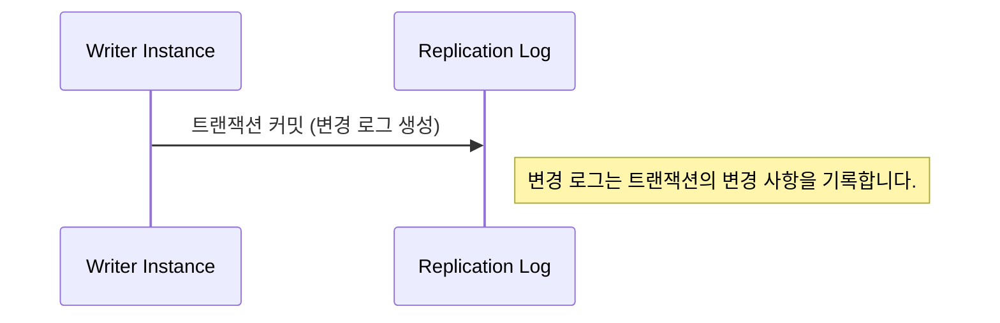
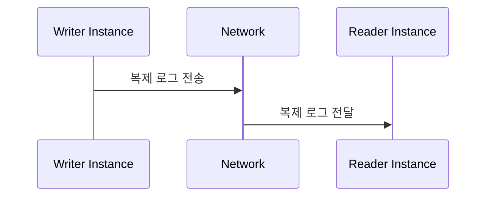
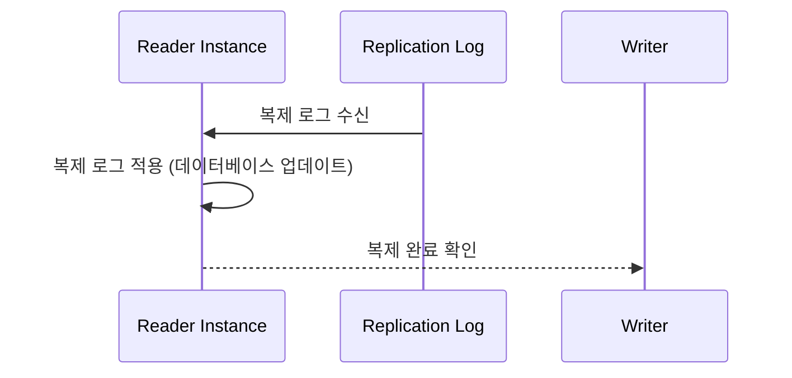
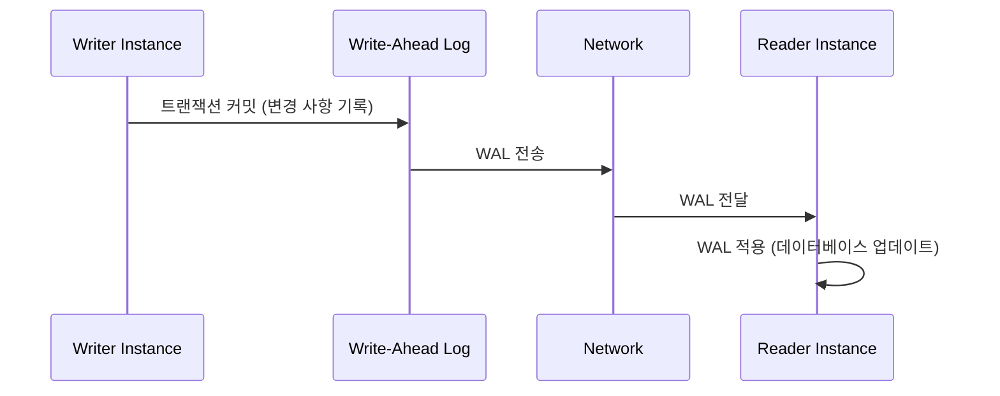
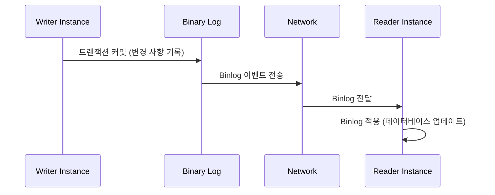

# Replication

- [Replication](#replication)
    - [데이터베이스 복제](#데이터베이스-복제)
    - [데이터베이스 복제의 작동 원리](#데이터베이스-복제의-작동-원리)
        - [1. 라이터 인스턴스에서 변경 사항 생성](#1-라이터-인스턴스에서-변경-사항-생성)
        - [2. 복제 로그 전송](#2-복제-로그-전송)
        - [3. 리더 인스턴스에서 복제 로그 적용](#3-리더-인스턴스에서-복제-로그-적용)
    - [구체적인 복제 프로세스 단계](#구체적인-복제-프로세스-단계)
        - [1. 트랜잭션 커밋 및 변경 로그 생성](#1-트랜잭션-커밋-및-변경-로그-생성)
        - [2. 변경 로그 전송](#2-변경-로그-전송)
        - [3. 로그 수신 및 적용](#3-로그-수신-및-적용)
    - [예시: PostgreSQL의 WAL (Write-Ahead Logging)](#예시-postgresql의-wal-write-ahead-logging)
    - [예시: MySQL의 Binary Log (Binlog)](#예시-mysql의-binary-log-binlog)
    - [결론](#결론)

## 데이터베이스 복제

데이터베이스 복제(Database Replication)는 데이터를 여러 데이터베이스 인스턴스 간에 복사하여 데이터의 가용성과 성능을 향상시키는 기술입니다.

예를 들어, Amazon RDS와 같은 시스템에서는 일반적으로 리더-라이터(Reader-Writer) 구조의 데이터 복제를 일반적으로 사용합니다.

## 데이터베이스 복제의 작동 원리

### 1. 라이터 인스턴스에서 변경 사항 생성

- **트랜잭션 커밋 시 로그 생성**:
    - 데이터베이스는 트랜잭션이 커밋될 때 변경 사항을 **변경 로그(Change Log)** 또는 **복제 로그(Replication Log)**에 기록합니다.
    - 이 로그에는 트랜잭션에서 변경된 데이터의 세부 정보가 포함됩니다.

### 2. 복제 로그 전송

- **변경 로그 전달**:
    - 라이터 인스턴스는 생성된 복제 로그를 리더 인스턴스에 전송합니다.
    - 이 전송은 주로 네트워크를 통해 비동기 방식으로 이루어집니다. 네트워크 지연이 없는 환경에서 실시간에 가깝게 전송됩니다.

### 3. 리더 인스턴스에서 복제 로그 적용

- **로그 수신 및 적용**:
    - 리더 인스턴스는 네트워크를 통해 전달된 복제 로그를 수신합니다.
    - 수신된 로그는 리더 인스턴스의 데이터베이스에 적용되어 라이터 인스턴스와 데이터 일치성을 유지합니다.

## 구체적인 복제 프로세스 단계

### 1. 트랜잭션 커밋 및 변경 로그 생성

트랜잭션이 라이터 인스턴스에서 커밋되면 변경 사항이 데이터 파일에 기록되고, 동시에 이러한 변경 사항은 복제 로그에 기록됩니다. 복제 로그는 변경된 데이터를 포함하며, 이를 통해 리더 인스턴스가 데이터 변경 사항을 인식할 수 있습니다.

### 2. 변경 로그 전송

라이터 인스턴스는 복제 로그를 리더 인스턴스에 전송합니다. 이 과정은 네트워크를 통해 이루어지며, 전송된 로그는 리더 인스턴스의 수신 대기 큐에 저장됩니다.

### 3. 로그 수신 및 적용

리더 인스턴스는 수신된 복제 로그를 데이터베이스에 적용합니다. 리더 인스턴스는 로그를 순차적으로 처리하여 데이터의 일관성을 유지합니다. 복제 로그가 적용되면 리더 인스턴스의 데이터는 라이터 인스턴스의 최신 상태와 일치하게 됩니다.

## 예시: PostgreSQL의 WAL (Write-Ahead Logging)

PostgreSQL에서는 **WAL(Write-Ahead Logging)**을 사용하여 변경 로그를 기록하고 복제합니다.

1. **변경 로그 생성**:
   - 트랜잭션이 커밋될 때, 변경 사항은 WAL에 기록됩니다.

2. **WAL 전송**:
   - WAL 세그먼트는 리더 인스턴스에 전송됩니다.

3. **WAL 적용**:
   - 리더 인스턴스는 수신된 WAL 세그먼트를 적용하여 데이터베이스를 업데이트합니다.

## 예시: MySQL의 Binary Log (Binlog)

MySQL에서는 **Binary Log(Binlog)**를 사용하여 변경 로그를 기록하고 복제합니다.

1. **Binlog 생성**:
   - 트랜잭션이 커밋될 때, 변경 사항은 Binlog에 기록됩니다.

2. **Binlog 전송**:
   - Binlog 이벤트는 리더 인스턴스에 전송됩니다.

3. **Binlog 적용**:
   - 리더 인스턴스는 수신된 Binlog 이벤트를 적용하여 데이터베이스를 업데이트합니다.

## 결론

데이터베이스 복제는 라이터 인스턴스에서 변경 사항을 복제 로그로 기록하고, 이를 리더 인스턴스로 전송하여 리더 인스턴스가 로그를 적용하는 방식으로 이루어집니다. PostgreSQL의 WAL이나 MySQL의 Binlog와 같은 기술을 통해 데이터베이스의 변경 사항을 기록하고 전송하여 데이터의 일관성을 유지합니다. 이러한 복제 과정은 데이터 가용성과 성능을 높이는 데 중요한 역할을 합니다.
