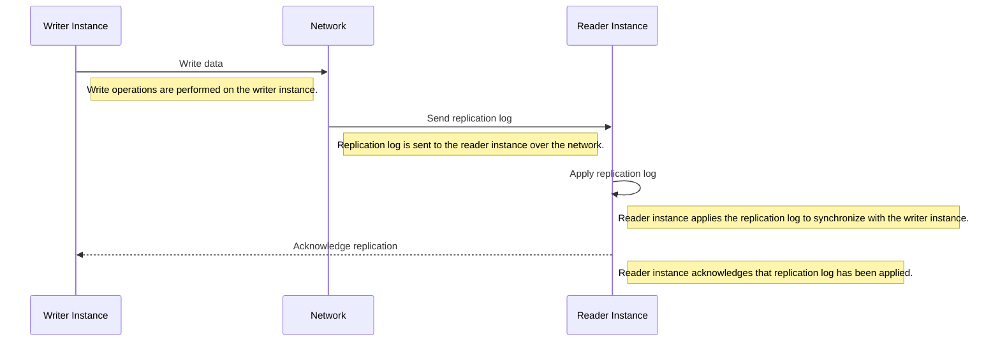
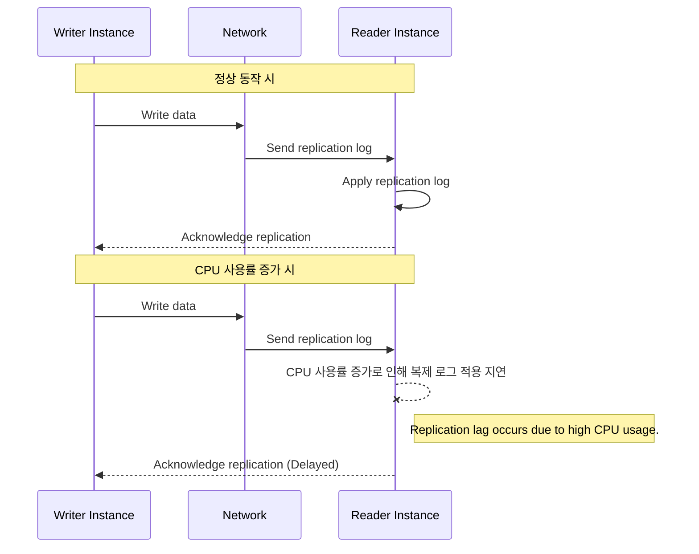

# Replication Lag

## 복제 지연(Replication Lag)

복제 과정의 시각적 설명

**복제 지연**은 데이터베이스 시스템에서 변경 사항이 주 데이터베이스(Writer 인스턴스)에서 보조 데이터베이스(Reader 인스턴스)로 전달되고 적용되는 데 걸리는 시간 차이를 의미합니다. 이 지연이 발생하면, Reader 인스턴스의 데이터가 Writer 인스턴스의 최신 상태와 일치하지 않게 됩니다. 이는 여러 가지 원인에 의해 발생할 수 있으며, 주로 다음과 같은 문제로 정의될 수 있습니다:

1. **자원 고갈 문제(Resource Contention)**: Reader 인스턴스의 CPU, 메모리, 디스크 I/O와 같은 자원이 고갈되어 복제 작업이 지연될 때 발생합니다.
2. **성능 병목 현상(Performance Bottlenecks)**: 네트워크 대역폭 부족, 디스크 I/O 병목 현상 등으로 인해 복제 로그를 처리하는 속도가 저하되는 경우입니다.
3. **동시성 문제(Concurrency Issues)**: 여러 트랜잭션이 동시에 실행되면서 발생하는 동시성 제어 문제로 인해 복제 지연이 발생할 수 있습니다.

## Reader 인스턴스의 CPU 사용률 증가로 인해 Writer 인스턴스로부터 데이터를 동기화받는 속도가 느려지는 문제

Amazon RDS(관계형 데이터베이스 서비스)는 높은 가용성과 성능을 제공하기 위해 읽기와 쓰기 작업을 분리할 수 있는 기능을 제공합니다.
이를 통해 **Reader 인스턴스(reader instance)**와 **Writer 인스턴스(writer instance)**로 역할을 분리할 수 있습니다.
Reader 인스턴스는 주로 읽기 작업을 처리하고, Writer 인스턴스는 쓰기 작업을 처리합니다.

Reader 인스턴스의 CPU 사용률 증가로 인해 Writer 인스턴스로부터 데이터를 동기화받는 속도가 느려지는 문제는 **복제 지연(Replication Lag)** 문제의 일종입니다

이 문제는 자원 고갈, 성능 병목 현상, 동시성 문제 등으로 인해 발생할 수 있으며, 이를 해결하기 위해 리소스 증설, 읽기 요청 분산, 쿼리 최적화, 성능 모니터링 등의 방법을 사용할 수 있습니다.

- 자원 고갈 문제 (Resource Contention)

    Reader 인스턴스의 자원 고갈 문제는 Reader 인스턴스가 처리해야 할 작업이 많아져 자원이 부족해지는 상황을 의미합니다.
    이는 CPU 사용률 증가, 메모리 부족, 디스크 I/O 포화 등으로 인해 발생할 수 있습니다.
    이 문제는 *Reader 인스턴스가 Writer 인스턴스로부터 복제 로그를 적용하는 속도를 저하*시킵니다.

    **예시:**
    - Reader 인스턴스의 CPU 사용률이 90% 이상으로 증가하면, 다른 중요한 작업을 처리할 리소스가 부족해져 복제 로그를 처리하는 속도가 느려질 수 있습니다.

- 성능 병목 현상 (Performance Bottlenecks)

    성능 병목 현상은 시스템의 특정 부분이 전체 성능을 저하시킬 때 발생합니다.
    이는 네트워크 지연, 디스크 I/O 병목 현상, 메모리 부족 등으로 인해 발생할 수 있습니다.

    **예시:**
    - Reader 인스턴스와 Writer 인스턴스 간의 네트워크 대역폭이 포화 상태에 도달하면, 복제 로그가 Reader 인스턴스로 전달되는 속도가 저하될 수 있습니다.

- 동시성 문제 (Concurrency Issues)

    동시성 문제는 여러 트랜잭션이 동시에 실행되면서 발생하는 문제입니다.
    이는 데이터베이스 락, 트랜잭션 충돌 등으로 인해 복제 지연이 발생할 수 있습니다.

    **예시:**
    - 여러 트랜잭션이 동시에 동일한 데이터를 수정하려고 할 때, 데이터베이스 락이 발생하여 복제 로그를 처리하는 속도가 느려질 수 있습니다.

### Reader 인스턴스 CPU 사용률 증가와 동기화 속도 저하의 관계

#### 1. Reader 인스턴스의 부하 증가

Reader 인스턴스의 CPU 사용률이 증가한다는 것은 Reader 인스턴스에서 처리해야 할 작업량이 많다는 것을 의미합니다.
이러한 작업량은 주로 다음과 같은 작업으로 인해 증가할 수 있습니다:
- 많은 수의 읽기 요청 처리
- 복잡한 쿼리 실행
- 인덱스 스캔 및 정렬 작업

*Reader 인스턴스가 과부하 상태가 되면, 기존의 읽기 요청을 처리하는 데 시간이 더 많이 소요*됩니다.
이로 인해, Reader 인스턴스는 Writer 인스턴스로부터 복제 로그(replication log)를 읽고 적용하는 작업을 지연시킬 수 있습니다.

#### 2. 리소스 경쟁

Reader 인스턴스는 CPU, 메모리, 디스크 I/O 등의 리소스를 사용하여 작업을 처리합니다. CPU 사용률이 높아지면 다른 중요한 작업, 예를 들어 복제 로그를 적용하는 작업에 사용할 수 있는 리소스가 줄어듭니다. 리소스가 부족해지면 데이터 동기화 속도가 저하될 수 있습니다.

#### 3. 복제 지연 (Replication Lag)

Reader 인스턴스는 Writer 인스턴스로부터 변경 사항을 복제 받아야 합니다. 이 과정은 네트워크를 통해 수행되며, CPU 및 디스크 I/O 리소스를 사용합니다. Reader 인스턴스의 CPU 사용률이 높아지면, 복제 작업이 지연되어 **복제 지연(replication lag)**이 발생할 수 있습니다. 복제 지연이 커지면, Reader 인스턴스의 데이터가 Writer 인스턴스와 동기화되지 않은 상태로 유지될 수 있습니다.

### 문제 해결 방안

1. **자원 증설 (Resource Scaling)**:
   - Reader 인스턴스의 CPU, 메모리, 디스크 I/O 리소스를 증설하여 성능을 향상시킵니다.

2. **읽기 요청 분산 (Read Request Distribution)**:
   - 여러 Reader 인스턴스를 구성하여 읽기 요청을 분산 처리합니다. 이는 Reader 인스턴스의 부하를 줄이는 데 도움이 됩니다.

3. **쿼리 최적화 (Query Optimization)**:
   - 복잡한 쿼리를 최적화하여 CPU 사용률을 줄입니다. 인덱스를 적절히 사용하여 쿼리 성능을 향상시킵니다.

4. **모니터링 및 조정 (Monitoring and Tuning)**:
   - AWS CloudWatch를 사용하여 Reader 인스턴스의 성능을 모니터링하고, 필요에 따라 리소스를 조정합니다. 복제 지연이 발생할 때 알림을 설정하여 신속하게 대응합니다.

### 실시간 동기화 지연의 원인

- **CPU 사용률 증가**: Reader 인스턴스가 높은 CPU 사용률로 인해 복제 로그를 처리하는 속도가 느려짐.
- **디스크 I/O 병목 현상**: 디스크 I/O가 과부하 상태가 되면 복제 로그를 읽고 쓰는 속도가 저하됨.
- **네트워크 지연**: 네트워크 대역폭이 포화 상태에 도달하면 복제 로그가 Reader 인스턴스로 전달되는 속도가 느려짐.

### 해결 방안

1. **리소스 증설**:
   - Reader 인스턴스의 CPU, 메모리, 디스크 I/O 리소스를 증설하여 성능을 향상시킵니다.

2. **읽기 요청 분산**:
   - 여러 Reader 인스턴스를 구성하여 읽기 요청을 분산 처리합니다.
   - Amazon RDS는 자동으로 읽기 요청을 여러 Reader 인스턴스로 분산하는 기능을 제공합니다.

3. **쿼리 최적화**:
   - 복잡한 쿼리를 최적화하여 CPU 사용률을 줄입니다.
   - 인덱스를 적절히 사용하여 쿼리 성능을 향상시킵니다.

4. **모니터링 및 조정**:
   - AWS CloudWatch를 사용하여 Reader 인스턴스의 성능을 모니터링하고, 필요에 따라 리소스를 조정합니다.
   - 복제 지연이 발생할 때 알림을 설정하여 신속하게 대응합니다.

### 결론

Reader 인스턴스의 CPU 사용률이 증가하면 Reader 인스턴스가 Writer 인스턴스로부터 데이터를 동기화받는 속도도 느려질 수 있습니다. 이는 Reader 인스턴스의 리소스가 부족해져 복제 작업이 지연되기 때문입니다. 이러한 문제를 해결하기 위해 리소스를 증설하고, 읽기 요청을 분산하며, 쿼리를 최적화하는 등의 방법을 사용할 수 있습니다. RDS의 성능 모니터링을 통해 Reader 인스턴스의 상태를 지속적으로 확인하고 적절한 조치를 취하는 것이 중요합니다.
