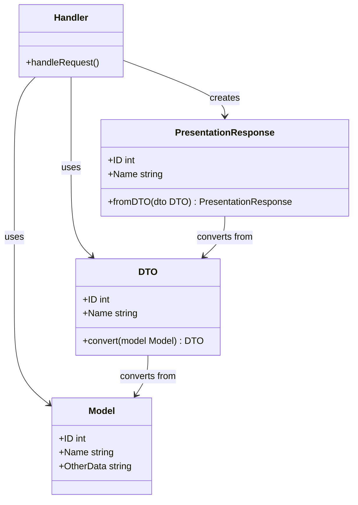

# Design Simple API Server

## 초안

```bash
project/
  convutil/
  merchant/
  product/
  repository/
  auth.go
  handlers.go
  go.mod
  main.go
```

장점:
- 간단하고 직관적인 구조로, 작은 규모의 프로젝트에 적합합니다.
- 불필요한 복잡성을 피하고 있어 개발 속도를 높일 수 있습니다.
- 루트 패키지에 핵심 컴포넌트를 두어 접근성이 좋습니다.
- 프로젝트의 실제 필요에 따라 구조를 조정할 수 있습니다.
- 팀원들이 더 쉽게 프로젝트 구조를 이해할 수 있습니다.

개선 가능한 점:
- auth.go가 루트에 있어 책임 분리가 명확하지 않습니다.
- handlers.go에 모든 핸들러가 있다면 파일이 너무 커질 수 있습니다.
- 비즈니스 로직의 위치가 명확하지 않습니다 (convutil, merchant 등의 패키지에 분산되어 있음).
- 설정, 유틸리티 함수 등을 위한 공간이 명확하지 않습니다.

프로젝트가 성장하면서 다음과 같은 징후가 보일 때 구조 개선을 고려해볼 수 있습니다:

1. 파일 크기가 너무 커져서 관리가 어려워질 때
2. 책임 분리가 모호해져 버그 발생 가능성이 높아질 때
3. 새로운 기능 추가가 점점 어려워질 때
4. 테스트 작성이 복잡해질 때
5. 팀 규모가 커져서 더 명확한 구조가 필요할 때

### 인증 미들웨어와 repository

장점:
1. 구현의 단순성: 직접적인 import로 코드 구현이 간단해집니다.
2. 빠른 개발: 작은 서비스에서는 복잡한 계층 구조 없이 빠르게 기능을 구현할 수 있습니다.
3. 가독성: 코드의 흐름을 직관적으로 파악하기 쉽습니다.

단점:
1. 관심사 분리 원칙 위배: Presentation 레이어(middleware)가 직접 Infra 레이어(repository)에 의존하게 됩니다.
2. 테스트 어려움: Middleware를 단독으로 테스트하기 어려워질 수 있습니다.
3. 유연성 감소: 나중에 다른 데이터 소스로 변경하거나 비즈니스 로직을 추가하기 어려워질 수 있습니다.

그러나 작은 서비스에서는 이러한 단점들이 큰 문제가 되지 않을 수 있습니다.
프로젝트의 규모, 팀의 크기, 향후 확장 계획 등을 고려하여 결정해야 합니다.

권장되는 접근 방식:

1. 직접 import 사용:

    ```go
    // auth/middleware.go
    package auth

    import (
        "yourproject/repository"
    )

    func AuthMiddleware(next http.HandlerFunc) http.HandlerFunc {
        return func(w http.ResponseWriter, r *http.Request) {
            userRepo := repository.NewUserRepository()
            // userRepo를 사용한 인증 로직
            // ...
        }
    }
    ```

    이 방식은 간단하고 직관적이지만, 앞서 언급한 단점들을 가집니다.

2. 의존성 주입을 사용한 개선:

    - auth/middleware.go

        ```go
        // auth/middleware.go
        package auth

        type UserRepository interface {
            GetUserByToken(token string) (*User, error)
        }

        type AuthMiddleware struct {
            userRepo UserRepository
        }

        func NewAuthMiddleware(userRepo UserRepository) *AuthMiddleware {
            return &AuthMiddleware{userRepo: userRepo}
        }

        func (am *AuthMiddleware) Middleware(next http.HandlerFunc) http.HandlerFunc {
            return func(w http.ResponseWriter, r *http.Request) {
                // am.userRepo를 사용한 인증 로직
                // ...
            }
        }
        ```

        - main.go 또는 app 초기화 부분에서 사용

            ```go
            // main.go 또는 app 초기화 부분
            userRepo := repository.NewUserRepository()
            authMiddleware := auth.NewAuthMiddleware(userRepo)
            // 라우팅 설정 시 authMiddleware.Middleware 사용
            ```

        이 방식은 조금 더 복잡하지만, 다음과 같은 이점이 있습니다:
        - 관심사 분리가 잘 이루어집니다.
        - 테스트가 용이해집니다 (mock repository 사용 가능).
        - 향후 확장성이 좋아집니다.

### 간단한 구조에서 데이터 변환 로직의 위치

추천: 간단한 구조를 유지하면서도 책임을 적절히 분리하려면, 2번이나 3번 방법이 좋을 것 같습니다.
특히 3번 방법은 변환 로직이 여러 곳에서 사용될 경우 유용합니다.

프로젝트의 규모와 복잡성, 그리고 팀의 선호도에 따라 가장 적합한 방법을 선택하시면 됩니다.
중요한 것은 일관성을 유지하고, 필요에 따라 리팩토링할 준비가 되어 있는 것입니다.

#### 1. 핸들러 내에서 직접 변환

이 방법은 가장 간단하지만, 핸들러가 데이터 변환 로직까지 책임지게 되어 단일 책임 원칙을 다소 위반할 수 있습니다.

```go
// handlers.go
type UserResponse struct {
    ID   int    `json:"id"`
    Name string `json:"name"`
}

func GetUserHandler(w http.ResponseWriter, r *http.Request) {
    user, err := repository.GetUser(userID)
    if err != nil {
        // 에러 처리
        return
    }

    response := UserResponse{
        ID:   user.ID,
        Name: user.Name,
    }

    json.NewEncoder(w).Encode(response)
}
```

#### 2. 변환 함수를 별도로 정의

핸들러 파일 내에 변환 함수를 정의하여 사용합니다. 이 방법은 변환 로직을 분리하면서도 간단한 구조를 유지할 수 있습니다.

```go
// handlers.go
type UserResponse struct {
    ID   int    `json:"id"`
    Name string `json:"name"`
}

func userToResponse(user *repository.User) UserResponse {
    return UserResponse{
        ID:   user.ID,
        Name: user.Name,
    }
}

func GetUserHandler(w http.ResponseWriter, r *http.Request) {
    user, err := repository.GetUser(userID)
    if err != nil {
        // 에러 처리
        return
    }

    response := userToResponse(user)
    json.NewEncoder(w).Encode(response)
}
```

#### 3. 변환 로직을 별도의 파일로 분리

프로젝트 루트에 `converter.go` 파일을 만들어 변환 로직을 모아둡니다. 이 방법은 변환 로직을 중앙화하고 재사용성을 높일 수 있습니다.

```go
// converter.go
package main

import (
    "yourproject/repository"
)

type UserResponse struct {
    ID   int    `json:"id"`
    Name string `json:"name"`
}

func ConvertUserToResponse(user *repository.User) UserResponse {
    return UserResponse{
        ID:   user.ID,
        Name: user.Name,
    }
}

// handlers.go
import "yourproject/converter"

func GetUserHandler(w http.ResponseWriter, r *http.Request) {
    user, err := repository.GetUser(userID)
    if err != nil {
        // 에러 처리
        return
    }

    response := converter.ConvertUserToResponse(user)
    json.NewEncoder(w).Encode(response)
}
```

#### 4. 모델에 메서드 추가

repository 패키지의 모델에 변환 메서드를 추가하는 방법입니다. 이 방법은 객체 지향적이며, 모델과 변환 로직을 가깝게 유지할 수 있습니다.

```go
// repository/user.go
type User struct {
    ID   int
    Name string
    // 다른 필드들...
}

func (u *User) ToResponse() UserResponse {
    return UserResponse{
        ID:   u.ID,
        Name: u.Name,
    }
}

// handlers.go
func GetUserHandler(w http.ResponseWriter, r *http.Request) {
    user, err := repository.GetUser(userID)
    if err != nil {
        // 에러 처리
        return
    }

    response := user.ToResponse()
    json.NewEncoder(w).Encode(response)
}
```

#### 5. Model -> DTO -> presentation 방식

1. 모델이 presentation을 알아서는 안 되는 이유:
   - 단일 책임 원칙 위반: 모델은 비즈니스 로직과 데이터 구조만 담당해야 합니다.
   - 의존성 방향: 내부 레이어(모델)가 외부 레이어(presentation)에 의존해서는 안 됩니다.
   - 재사용성 감소: 모델이 특정 presentation 형식에 종속되면 다른 컨텍스트에서의 재사용이 어려워집니다.

2. Presentation이 모델을 변환해야 하는 이유:
   - 관심사의 분리: Presentation 레이어는 데이터를 어떻게 표현할지 결정하는 책임을 가집니다.
   - 유연성: 다양한 클라이언트 요구사항에 따라 같은 모델 데이터를 다르게 표현할 수 있습니다.
   - 의존성 방향 준수: 외부 레이어(presentation)가 내부 레이어(모델)에 의존하는 것은 괜찮습니다.

3. 둘 다 서로를 모르게 하는 방법:
   이 접근 방식도 valid하며, 때로는 가장 깔끔한 해결책일 수 있습니다.
   이를 위해 DTO(Data Transfer Object) 패턴을 사용할 수 있습니다.

이러한 고려사항을 바탕으로, 다음과 같은 구조를 제안드립니다:



코드로 표현하면 다음과 같습니다:

- model.go

    ```go
    // model.go
    type Model struct {
        ID        int
        Name      string
        OtherData string
    }
    ```

- dto.go

    ```go
    // dto.go
    type DTO struct {
        ID   int
        Name string
    }

    func NewDTOFromModel(m Model) DTO {
        return DTO{
            ID:   m.ID,
            Name: m.Name,
        }
    }
    ```

- presentation.go

    ```go
    // presentation.go
    type PresentationResponse struct {
        ID   int    `json:"id"`
        Name string `json:"name"`
    }

    func NewPresentationResponseFromDTO(dto DTO) PresentationResponse {
        return PresentationResponse{
            ID:   dto.ID,
            Name: dto.Name,
        }
    }
    ```

- handler.go

    ```go
    // handler.go
    func HandleRequest(w http.ResponseWriter, r *http.Request) {
        model := getModelFromDatabase()
        dto := NewDTOFromModel(model)
        response := NewPresentationResponseFromDTO(dto)
        json.NewEncoder(w).Encode(response)
    }
    ```

이 접근 방식의 장점:
1. Model, DTO, PresentationResponse가 서로 독립적입니다.
2. 각 레이어의 책임이 명확히 분리되어 있습니다.
3. 변환 로직이 명시적이고 중앙화되어 있어 관리가 용이합니다.
4. 필요에 따라 다양한 DTO나 PresentationResponse를 쉽게 추가할 수 있습니다.

단점:
1. 코드량이 늘어나고 복잡성이 약간 증가합니다.
2. 작은 프로젝트에서는 과도한 설계로 보일 수 있습니다.

## 개선된 구조 제안: 만약 서비스가 더 복잡해진다면

```bash
project/
  ├── api/
  │   ├── handlers/
  │   │   ├── auth.go
  │   │   ├── merchant.go
  │   │   ├── product.go
  │   │   └── ... (other handlers)
  │   └── middleware/
  │       └── auth.go
  ├── internal/
  │   ├── models/
  │   │   ├── merchant.go
  │   │   ├── product.go
  │   │   └── ... (other domain models)
  │   ├── services/
  │   │   ├── merchant_service.go
  │   │   ├── product_service.go
  │   │   └── ... (other business logic)
  │   └── utils/
  │       ├── convutil/
  │       └── ... (other utility packages)
  ├── repository/
  │   ├── merchant_repo.go
  │   ├── product_repo.go
  │   └── ... (other repository files)
  ├── config/
  │   └── config.go
  ├── cmd/
  │   └── server/
  │       └── main.go
  └── go.mod
```

1. API 관련 코드(handlers, middleware)를 api 패키지로 분리하여 관심사를 명확히 구분합니다.
2. `internal` 패키지를 사용하여 외부에서 직접 접근할 수 없는 코드를 구분합니다.
3. models, services 패키지를 통해 도메인 모델과 비즈니스 로직을 명확히 구분합니다.
4. utils 패키지 내에 convutil 등의 유틸리티 함수를 모아 재사용성을 높입니다.
5. config 패키지를 통해 설정 관련 코드를 중앙화합니다.
6. cmd/server/main.go로 진입점을 명확히 합니다.

이 구조는 여전히 복잡성을 최소화하면서도, 책임을 명확히 분리하고 있습니다.
또한, 프로젝트가 성장함에 따라 쉽게 확장할 수 있는 구조입니다.

추가 제안:

1. 인터페이스 사용: 완전히 배제하기보다는, 핵심 컴포넌트(예: repository)에 대해서만 선택적으로 사용을 고려해보세요. 이는 테스트와 향후 확장성에 도움이 될 수 있습니다.
2. 에러 처리: errors 패키지를 만들어 중앙화된 에러 처리 로직을 구현할 수 있습니다.
3. 의존성 주입: 구조체 생성자(New 함수)를 통해 의존성을 주입하는 방식을 고려해보세요. 이는 테스트와 유지보수성을 향상시킬 수 있습니다.
4. 테스트: 각 패키지 옆에 _test.go 파일을 두어 단위 테스트를 구현하세요.

이 구조는 초기에는 약간 과도해 보일 수 있지만, 프로젝트가 성장함에 따라 유연성과 유지보수성을 제공할 것입니다.
프로젝트의 규모와 요구사항에 따라 이 구조를 조정하시면 됩니다.

### `api/handlers`와 `api/middleware`를 분리하는 이유

1. handlers와 middleware를 분리하는 이유:

    - 관심사의 분리:
        - handlers: 주로 요청을 처리하고 응답을 생성하는 역할
        - middleware: 요청/응답 처리 과정에 추가적인 로직을 삽입하는 역할

    - 재사용성: middleware는 여러 handlers에서 공통적으로 사용될 수 있습니다.

    - 유지보수성: 분리함으로써 각 컴포넌트의 역할이 명확해지고, 코드 변경이 더 쉬워집니다.

2. 실제 코드상에서의 구별:

    - handlers 예시 (api/handlers/user.go):

        ```go
        package handlers

        import (
            "net/http"
            "encoding/json"
        )

        func GetUser(w http.ResponseWriter, r *http.Request) {
            // 사용자 정보를 가져와서 응답
            user := getUserFromDB(userID)
            json.NewEncoder(w).Encode(user)
        }
        ```

    - middleware 예시 (api/middleware/auth.go):

        ```go
        package middleware

        import "net/http"

        func AuthMiddleware(next http.HandlerFunc) http.HandlerFunc {
            return func(w http.ResponseWriter, r *http.Request) {
                // 인증 로직
                if !isAuthenticated(r) {
                    http.Error(w, "Unauthorized", http.StatusUnauthorized)
                    return
                }
                next.ServeHTTP(w, r)
            }
        }
        ```

    - 사용 예시 (main.go 또는 routes.go):

        ```go
        import (
            "myproject/api/handlers"
            "myproject/api/middleware"
        )

        // ...

        http.HandleFunc("/user", middleware.AuthMiddleware(handlers.GetUser))
        ```

### 미들웨어에 들어갈 수 있는 기능들

미들웨어들은 핸들러 로직과 분리되어 있어, 여러 핸들러에서 재사용할 수 있고 필요에 따라 쉽게 추가/제거할 수 있습니다.
또한, 각 미들웨어의 책임이 명확히 분리되어 있어 유지보수와 테스트가 용이합니다.

- 로깅 (Logging): 요청/응답 정보를 로그로 기록

   ```go
   func LoggingMiddleware(next http.HandlerFunc) http.HandlerFunc {
       return func(w http.ResponseWriter, r *http.Request) {
           log.Printf("Received request: %s %s", r.Method, r.URL.Path)
           next.ServeHTTP(w, r)
       }
   }
   ```

- CORS (Cross-Origin Resource Sharing) 처리:

   ```go
   func CORSMiddleware(next http.HandlerFunc) http.HandlerFunc {
       return func(w http.ResponseWriter, r *http.Request) {
           w.Header().Set("Access-Control-Allow-Origin", "*")
           w.Header().Set("Access-Control-Allow-Methods", "GET, POST, OPTIONS")
           if r.Method == "OPTIONS" {
               return
           }
           next.ServeHTTP(w, r)
       }
   }
   ```

- 요청 속도 제한 (Rate Limiting):

   ```go
   func RateLimitMiddleware(next http.HandlerFunc) http.HandlerFunc {
       var requests = make(map[string]int)
       return func(w http.ResponseWriter, r *http.Request) {
           ip := r.RemoteAddr
           if requests[ip] > 100 {  // 예: IP당 100 요청/분 제한
               http.Error(w, "Too many requests", http.StatusTooManyRequests)
               return
           }
           requests[ip]++
           next.ServeHTTP(w, r)
       }
   }
   ```

- 압축 (Compression):

   ```go
   import "github.com/NYTimes/gziphandler"

   // 사용 시
   http.Handle("/", gziphandler.GzipHandler(yourHandler))
   ```

- 복구 (Recovery): panic 발생 시 처리

   ```go
   func RecoveryMiddleware(next http.HandlerFunc) http.HandlerFunc {
       return func(w http.ResponseWriter, r *http.Request) {
           defer func() {
               if err := recover(); err != nil {
                   log.Printf("Panic: %v", err)
                   http.Error(w, "Internal server error", http.StatusInternalServerError)
               }
           }()
           next.ServeHTTP(w, r)
       }
   }
   ```
