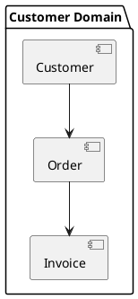
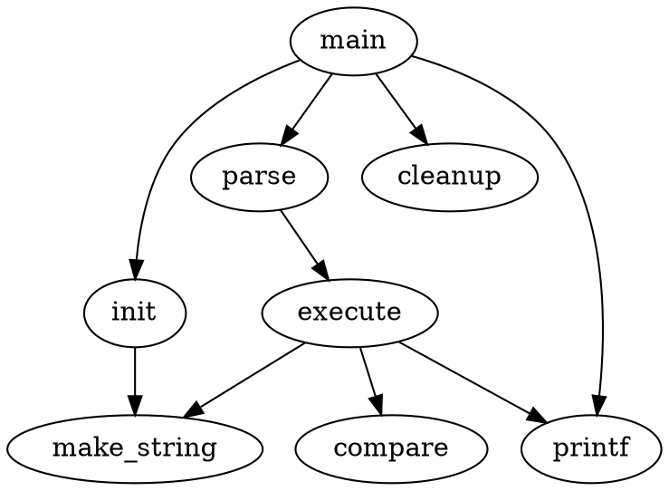

# Design Tools

- [Design Tools](#design-tools)
    - [1. PlantUML](#1-plantuml)
    - [2. Graphviz (DOT)](#2-graphviz-dot)
    - [3. ASCIIFlow](#3-asciiflow)
    - [4. Nomnoml](#4-nomnoml)
    - [5. Kroki](#5-kroki)
    - [6. Structurizr](#6-structurizr)

## 1. PlantUML

PlantUML은 텍스트 기반의 다이어그램 작성 도구로, UML 다이어그램을 비롯한 다양한 종류의 다이어그램을 생성할 수 있습니다.

예시:



## 2. Graphviz (DOT)

Graphviz는 그래프 시각화 소프트웨어로, DOT 언어를 사용하여 그래프를 정의합니다.

예시:



## 3. ASCIIFlow

ASCIIFlow는 ASCII 문자를 사용하여 다이어그램을 그리는 웹 기반 도구입니다.

예시:

```plaintext
+--------+   +-------+    +-------+
|        | --+ ditaa +--> |       |
|  Text  |   +-------+    |Diagram|
|Document|   |!magic!|    |       |
|     {d}|   |       |    |       |
+---+----+   +-------+    +-------+
    :                         ^
    |       Lots of work      |
    +-------------------------+
```

## 4. Nomnoml

Nomnoml은 텍스트 기반의 UML 다이어그램 생성 도구입니다.

예시:

```nomnoml
[Pirate|eyeCount: Int|raid();pillage()|
  [beard]--[parrot]
  [beard]-:>[foul mouth]
]

[<abstract>Marauder]<:--[Pirate]
[Pirate]- 0..7[mischief]
[jollyness]->[Pirate]
[jollyness]->[rum]
[jollyness]->[singing]
[Pirate]-> *[rum|tastiness: Int|swig()]
[Pirate]->[singing]
[singing]<->[rum]

[<start>st]->[<state>plunder]
[plunder]->[<choice>more loot]
[more loot]->[st]
[more loot] no ->[<end>e]

[<actor>Sailor] - [<usecase>shiver me;timbers]
```

## 5. Kroki

Kroki는 여러 다이어그램 유형을 지원하는 통합 서비스입니다. PlantUML, Graphviz, Mermaid 등 다양한 형식을 지원합니다.

예시 (BlockDiag):

```Kroki
blockdiag {
  A -> B -> C;
       B -> D;
}
```

## 6. Structurizr

Structurizr는 소프트웨어 아키텍처 다이어그램을 만들기 위한 DSL(Domain Specific Language)을 제공합니다.

예시:

```
workspace {
    model {
        user = person "User"
        softwareSystem = softwareSystem "Software System" {
            webapp = container "Web Application"
            database = container "Database"
        }
        user -> webapp "Uses"
        webapp -> database "Reads from and writes to"
    }

    views {
        systemContext softwareSystem {
            include *
            autolayout lr
        }

        container softwareSystem {
            include *
            autolayout lr
        }
    }
}
```

이러한 도구들은 각각 고유한 문법과 기능을 가지고 있습니다. 프로젝트의 요구사항, 팀의 선호도, 그리고 통합하려는 환경 (예: 마크다운 문서, 위키, CI/CD 파이프라인 등)에 따라 가장 적합한 도구를 선택할 수 있습니다. 또한, 이러한 도구들 대부분은 온라인 에디터나 플러그인 형태로 제공되어 쉽게 시작할 수 있습니다.
