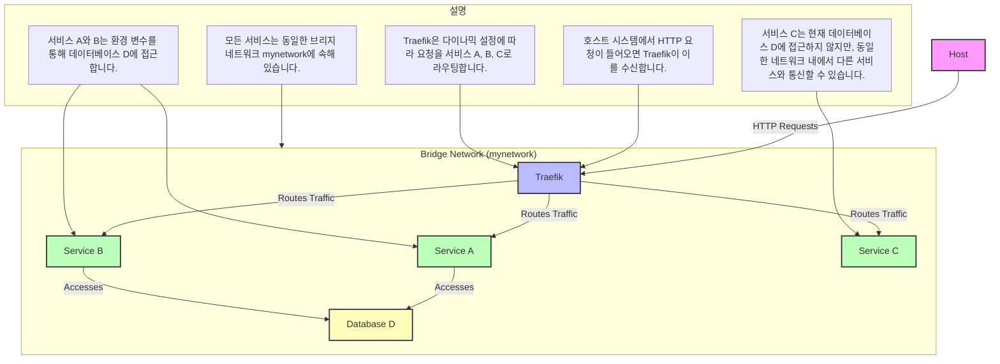

# Docker network

- [Docker network](#docker-network)
    - [Docker 네트워킹](#docker-네트워킹)
        - [`host.docker.internal`](#hostdockerinternal)
    - [Docker 네트워크와 IP 할당](#docker-네트워크와-ip-할당)
        - [네트워크 기본 이론](#네트워크-기본-이론)
        - [IP 주소 할당 과정](#ip-주소-할당-과정)
        - [`0.0.0.0`과 내부 IP 주소 `172.28.0.3`, `192.168.242.2`](#0000과-내부-ip-주소-1722803-1921682422)
    - [Docker 네트워크 관리 명령어](#docker-네트워크-관리-명령어)
    - [컨테이너 내부에서 실행되는 Vite와 `--host` 옵션](#컨테이너-내부에서-실행되는-vite와---host-옵션)
        - [`--host` 옵션의 역할](#--host-옵션의-역할)
    - [Docker Compose와 Traefik 네트워크 구성 예제](#docker-compose와-traefik-네트워크-구성-예제)
        - [Mermaid 도식](#mermaid-도식)
        - [트래픽 흐름 예시](#트래픽-흐름-예시)

## Docker 네트워킹

Docker 컨테이너는 기본적으로 격리된 네트워크 환경에서 실행됩니다.
`localhost`는 해당 컨테이너 내부에서만 접근 가능하며, 호스트 시스템이나 다른 컨테이너에서는 접근할 수 없습니다.

가령 이를 해결하기 위해 `--host` 옵션을 사용하여 Vite 서버를 `0.0.0.0`에 바인딩하면 외부에서도 접근할 수 있게 됩니다.

### `host.docker.internal`

`host.docker.internal`은 Docker에서 제공하는 특별한 DNS 이름으로, 컨테이너에서 호스트 시스템의 IP 주소를 참조할 수 있게 합니다.

그러나 컨테이너 내부의 `localhost`에서 실행 중인 서비스는 `host.docker.internal`로 접근할 수 없습니다.

## Docker 네트워크와 IP 할당

Docker는 컨테이너 간의 네트워킹을 위해 가상 네트워크를 생성하고, 사설 IP 주소 범위 내에서 IP 주소를 할당합니다.
기본적으로 브리지 네트워크를 사용하며, 사용자는 필요에 따라 사용자 정의 네트워크를 생성할 수 있습니다.
각 네트워크 유형은 특정 사용 사례에 맞게 설계되었으며, Docker 명령어를 통해 네트워크를 관리할 수 있습니다.

- **브리지 네트워크 (Bridge Network)**:

    Docker가 기본적으로 생성하는 네트워크 유형입니다.
    이 네트워크는 호스트 시스템의 네트워크와 분리된 가상 네트워크입니다.

    Docker는 브리지 네트워크를 생성할 때, 기본적으로 `172.16.0.0/12` 범위의 IP 주소를 사용합니다.
    이 범위는 사설 IP 주소 범위 중 하나로, 내부 네트워크에서 자유롭게 사용할 수 있습니다.

    컨테이너 간의 통신이 가능하며, 외부 네트워크와의 통신도 가능합니다.

- **호스트 네트워크 (Host Network)**:

    컨테이너가 호스트 시스템의 네트워크 인터페이스를 직접 사용합니다.
    네트워크 성능이 중요할 때 사용됩니다.

- **오버레이 네트워크 (Overlay Network)**:

    여러 Docker 데몬 간의 네트워크를 생성합니다.
    Swarm 모드에서 사용되며, 여러 호스트 간의 컨테이너 통신을 가능하게 합니다.

- **매킨드 네트워크 (Macvlan Network)**:

    컨테이너에 고유한 MAC 주소를 할당하여 물리적 네트워크 인터페이스처럼 동작하게 합니다.
    특정 네트워크 설정이 필요한 경우 사용됩니다.

### 네트워크 기본 이론

1. **IP 주소**:

    IP 주소는 네트워크 상의 장치를 식별하기 위한 고유한 주소입니다.
    IPv4 주소는 32비트로 구성되며, 일반적으로 `192.168.0.1`과 같은 형식으로 표현됩니다.

    사설 IP 주소 범위는 다음과 같습니다:
     - `10.0.0.0/8`
     - `172.16.0.0/12`
     - `192.168.0.0/16`

    Docker는 사설 IP 주소 범위를 사용하여 네트워크 충돌을 방지합니다.
    사설 IP 주소 범위 내에서 IP 주소를 할당함으로써, 외부 네트워크와의 충돌을 피하고, 내부 네트워크에서 자유롭게 사용할 수 있습니다.

2. **서브넷**:

    서브넷은 큰 네트워크를 더 작은 네트워크로 나누는 방법입니다.
    서브넷 마스크는 네트워크 부분과 호스트 부분을 구분하는 데 사용됩니다.

    예를 들어, `255.255.255.0`은 `/24` 서브넷 마스크를 나타냅니다.

3. **브리지 네트워크**:

    브리지 네트워크는 여러 네트워크 세그먼트를 연결하는 가상 네트워크입니다.
    Docker의 브리지 네트워크는 호스트 시스템의 네트워크와 분리된 가상 네트워크를 생성합니다.

### IP 주소 할당 과정

1. **네트워크 생성**:

    Docker는 컨테이너를 *실행할 때* 기본적으로 브리지 네트워크를 생성하거나 사용합니다.
    이 네트워크는 `docker0`라는 가상 네트워크 인터페이스를 통해 관리됩니다.

    **기본 브리지 네트워크**:
    - Docker를 설치하면 기본적으로 `docker0`라는 브리지 네트워크가 생성됩니다.
    - 이 네트워크는 `172.17.0.0/16` 범위의 IP 주소를 사용합니다.

    **사용자 정의 브리지 네트워크**:
    - 사용자는 `docker network create` 명령어를 사용하여 사용자 정의 브리지 네트워크를 생성할 수 있습니다.
    - 예를 들어, `docker network create --subnet=192.168.1.0/24 mynetwork` 명령어를 사용하여 `192.168.1.0/24` 범위를 사용하는 네트워크를 생성할 수 있습니다.

2. **IP 주소 할당**:

    Docker는 각 컨테이너에 고유한 내부 IP 주소를 할당합니다.
    이는 컨테이너가 서로 통신할 수 있도록 하기 위함입니다

    **컨테이너 생성 시 IP 할당**:
    - Docker는 컨테이너를 *생성할 때*, 브리지 네트워크 내에서 사용 가능한 IP 주소를 할당합니다.
    - 예를 들어, `docker run` 명령어를 사용하여 컨테이너를 생성하면, Docker는 `docker0` 브리지 네트워크 내에서 사용 가능한 IP 주소를 할당합니다.

    **IP 주소 범위**:
    - 기본 브리지 네트워크는 `172.17.0.0/16` 범위를 사용합니다.
    - 사용자 정의 브리지 네트워크는 생성 시 지정한 서브넷 범위를 사용합니다.
    - 네트워크 설정에 따라 `192.168.0.0/16` 범위를 사용할 수도 있으며, 사용자가 네트워크를 생성할 때 지정할 수 있습니다.

### `0.0.0.0`과 내부 IP 주소 `172.28.0.3`, `192.168.242.2`

- **0.0.0.0**:

    `0.0.0.0`에 바인드된다는 것은 모든 네트워크 인터페이스에서 접근 가능하다는 의미입니다.
    즉, 컨테이너 내부의 모든 네트워크 인터페이스에서 접근할 수 있습니다.

    이는 외부에서 접근할 때는 호스트의 IP 주소와 포트를 통해 접근할 수 있음을 의미합니다.

- **내부 IP 주소**:

    내부 IP 주소는 Docker가 컨테이너에 할당한 가상 네트워크 내의 IP 주소입니다.
    이 IP 주소는 Docker가 자동으로 관리하며, 컨테이너 간의 통신을 위해 사용됩니다.

    예를 들어, `172.28.0.3`이나 `192.168.242.2`는 Docker 네트워크 내에서 컨테이너가 통신할 수 있도록 할당된 IP 주소입니다.

가령, Docker 컨테이너 내에서 `pnpm vite --host`를 실행하면 기본적으로 `0.0.0.0`에 바인드되며,
이는 모든 네트워크 인터페이스에서 접근 가능하도록 설정하는 것입니다.

컨테이너 내부에서는 해당 컨테이너의 내부 IP 주소로 접근할 수 있습니다.
그러나 Docker 컨테이너 내부에서 네트워크 인터페이스를 확인할 때는 컨테이너의 내부 IP 주소가 표시됩니다.

1. **172.28.0.3**:

    Docker는 기본적으로 `172.16.0.0/12` 범위의 IP 주소를 사용하여 컨테이너에 IP를 할당합니다.
    `172.28.0.3`은 Docker 네트워크 브리지에서 할당된 컨테이너의 내부 IP 주소입니다.
    이는 Docker가 생성한 가상 네트워크 내에서 컨테이너가 통신할 수 있도록 하는 IP 주소입니다.

2. **192.168.242.2**:

    Docker 네트워크 설정에 따라 `192.168.0.0/16` 범위의 IP 주소를 사용할 수도 있습니다.
    `192.168.242.2` 역시 Docker 네트워크 브리지에서 할당된 컨테이너의 내부 IP 주소입니다.
    이는 특정 Docker 네트워크 설정에 따라 다를 수 있습니다.

## Docker 네트워크 관리 명령어

- **네트워크 생성**:

  ```sh
  docker network create --subnet=192.168.1.0/24 mynetwork
  ```

- **네트워크 목록 조회**:

  ```sh
  docker network ls
  ```

- **네트워크 상세 정보 조회**:

  ```sh
  docker network inspect mynetwork
  ```

- **네트워크 삭제**:

  ```sh
  docker network rm mynetwork
  ```

## 컨테이너 내부에서 실행되는 Vite와 `--host` 옵션

### `--host` 옵션의 역할

`vite` 개발 서버는 기본적으로 `localhost`에서만 바인딩합니다.
이는 보안상의 이유로 외부에서 접근하지 못하도록 하기 위함입니다.

하지만 `--host` 옵션을 사용하면 개발 서버가 `0.0.0.0`에 바인딩되어 외부 네트워크에서도 접근할 수 있게 됩니다.

- `localhost`

    컨테이너 내부에서만 접근 가능한 IP 주소입니다.
    이는 일반적으로 `127.0.0.1`로 해석됩니다.

- `0.0.0.0`

    모든 네트워크 인터페이스에서 접근 가능하도록 합니다.
    이는 컨테이너 외부에서도 접근할 수 있는 IP 주소를 포함합니다.

```bash
# localhost:5173에서만 서비스
# 컨테이너 내부에서만 접근할 수 있습니다.
pnpm vite

# 0.0.0.0:5173에서 서비스되어, 외부 IP 주소를 통해 접근 가능
# 컨테이너 내부뿐만 아니라 외부에서도 접근할 수 있습니다.
pnpm vite --host
```

## Docker Compose와 Traefik 네트워크 구성 예제

Docker Compose를 사용하여 Traefik, 서비스 A, B, C, 그리고 데이터베이스 D를 하나의 브리지 네트워크로 구성하는 예제를 설명하겠습니다. 이를 통해 네트워크가 어떻게 흐르는지 이해할 수 있도록 하겠습니다.

```yaml
version: '3.8'

services:
  traefik:
    image: traefik:v2.5
    command:
      - "--api.insecure=true"
      - "--providers.docker=true"
      - "--entrypoints.web.address=:80"
    ports:
      - "80:80"
      - "8080:8080"
    volumes:
      - "/var/run/docker.sock:/var/run/docker.sock"
    networks:
      - mynetwork

  a:
    image: myapp-a:latest
    networks:
      - mynetwork
    environment:
      - DATABASE_URL=postgres://user:password@d:5432/mydatabase

  b:
    image: myapp-b:latest
    networks:
      - mynetwork
    environment:
      - DATABASE_URL=postgres://user:password@d:5432/mydatabase

  c:
    image: myapp-c:latest
    networks:
      - mynetwork

  d:
    image: postgres:13
    environment:
      POSTGRES_USER: user
      POSTGRES_PASSWORD: password
      POSTGRES_DB: mydatabase
    networks:
      - mynetwork

networks:
  mynetwork:
    driver: bridge
```

### Mermaid 도식

Mermaid 다이어그램을 개선하여 네트워크 구성을 직관적으로 이해할 수 있도록 하겠습니다. 설명 노드와 네트워크 흐름을 더 명확하게 표현하겠습니다.



1. **호스트에서 Traefik으로의 요청**:
   - 호스트 시스템에서 HTTP 요청이 들어오면, Traefik이 이를 수신합니다. Traefik은 `80` 포트와 `8080` 포트에서 요청을 수신하도록 설정되어 있습니다.
   - 예를 들어, 사용자가 브라우저에서 `http://localhost`로 접속하면, 이 요청은 Traefik으로 전달됩니다.

2. **Traefik에서 서비스 A, B, C로의 트래픽 라우팅**:
   - Traefik은 다이나믹 설정에 따라 들어오는 요청을 서비스 A, B, C로 라우팅합니다. Traefik은 Docker 소켓을 통해 Docker 컨테이너의 상태를 모니터링하고, 각 서비스의 라우팅 규칙을 동적으로 설정합니다.
   - 예를 들어, `http://localhost/service-a`로 요청이 들어오면, Traefik은 이 요청을 서비스 A로 라우팅합니다.

3. **서비스 A, B의 데이터베이스 D 접근**:
   - 서비스 A와 B는 환경 변수 `DATABASE_URL`을 통해 데이터베이스 D에 접근합니다. 이 URL은 PostgreSQL 데이터베이스의 연결 정보를 포함하고 있습니다.
   - 서비스 A와 B는 동일한 브리지 네트워크 `mynetwork`에 속해 있으므로, `d`라는 호스트 이름을 사용하여 데이터베이스 D에 접근할 수 있습니다.
   - 예를 들어, 서비스 A가 데이터베이스 D에 쿼리를 보내면, 이 쿼리는 네트워크를 통해 데이터베이스 D로 전달됩니다.

4. **서비스 C**:
   - 서비스 C는 현재 데이터베이스 D에 접근하지 않지만, 동일한 브리지 네트워크 `mynetwork`에 속해 있어 필요 시 다른 서비스와 통신할 수 있습니다.
   - 예를 들어, 서비스 C가 서비스 A와 통신해야 하는 경우, 네트워크를 통해 직접 통신할 수 있습니다.

### 트래픽 흐름 예시

1. **사용자가 브라우저에서 `http://localhost/service-a`로 접속**:
   - 요청이 호스트 시스템의 포트 80으로 들어옵니다.
   - Traefik이 이 요청을 수신하고, 라우팅 규칙에 따라 서비스 A로 전달합니다.

2. **서비스 A가 데이터베이스 D에 쿼리 요청**:
   - 서비스 A는 `DATABASE_URL` 환경 변수를 사용하여 데이터베이스 D에 연결합니다.
   - 쿼리 요청이 브리지 네트워크를 통해 데이터베이스 D로 전달됩니다.

3. **데이터베이스 D가 응답을 서비스 A로 반환**:
   - 데이터베이스 D는 쿼리 결과를 서비스 A로 반환합니다.
   - 응답이 브리지 네트워크를 통해 서비스 A로 전달됩니다.

4. **서비스 A가 응답을 사용자에게 반환**:
   - 서비스 A는 데이터베이스 D로부터 받은 응답을 처리하고, 최종 결과를 Traefik을 통해 사용자에게 반환합니다.
   - Traefik은 이 응답을 호스트 시스템의 포트 80으로 전달하고, 사용자의 브라우저에 표시됩니다.
