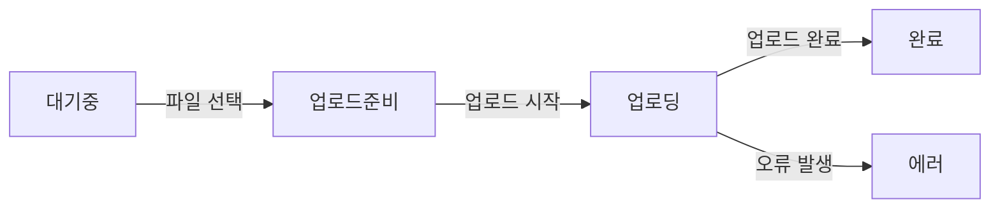

# [mermaid](https://mermaid.js.org/)

## [flowchart](https://mermaid.js.org/syntax/flowchart.html)

## state diagram

> "상태 다이어그램은 컴퓨터 과학 및 관련 분야에서 시스템의 행동을 설명하는 데 사용되는 다이어그램 유형입니다. 상태 다이어그램은 설명된 시스템이 유한한 수의 상태로 구성되어 있어야 한다고 요구합니다; 때때로 이는 실제 상황이며, 다른 때에는 합리적인 추상화입니다." 위키피디아

상태 다이어그램이 묘사하는 시스템이 실제로 유한한 수의 상태로 구성되어 있는 경우가 있으며, 다른 경우에는 시스템을 유한한 상태들로 나누어 표현하는 것이 현실을 단순화하는 추상화 과정이라는 의미.

다시 말해, 어떤 시스템들은 자연스럽게 명확하고 구분된 유한한 상태들을 갖고 있어, 상태 다이어그램으로 표현하기 적합하다.
예를 들어, 교통 신호등은 '빨간색', '노란색', '녹색'의 세 가지 상태를 갖고 있으며, 이는 상태 다이어그램으로 정확하게 표현될 수 있다.

반면에, 더 복잡한 시스템의 경우, 모든 가능한 상태를 명확하게 구분하는 것이 실제로는 불가능하거나 비효율적일 수 있다.
이런 경우, 상태 다이어그램은 시스템을 더 관리하기 쉽고 이해하기 쉬운 유한한 상태들로 추상화하여 나타낸다.
예를 들어, 소프트웨어 응용 프로그램은 사용자의 입력, 네트워크 상태, 내부 프로세스 등에 따라 수많은 상태를 가질 수 있지만, 상태 다이어그램을 사용하여 이를 더 간단한 상태들로 나타낼 수 있다. 이러한 추상화는 복잡한 시스템을 분석하고 이해하는 데 도움이 된다.

물론입니다. 상태 다이어그램의 두 가지 사용 사례 - 하나는 시스템의 실제 상태를 직접적으로 반영하는 경우, 다른 하나는 복잡한 시스템을 단순화한 추상화를 제공하는 경우 - 에 대해 예시를 들어 설명하겠습니다.

### 1. 실제 상태를 직접적으로 반영하는 경우: 교통 신호등

교통 신호등은 일반적으로 세 가지 상태를 갖습니다: 빨간색, 노란색, 녹색. 이 시스템의 상태 다이어그램은 다음과 같이 매우 단순하고 직관적입니다.

이 다이어그램은 실제 교통 신호등의 작동 방식을 정확하게 반영합니다. 각 상태는 실제로 존재하는 교통 신호등의 빛을 나타내며, 상태 간의 전환은 신호등이 실제로 순환하는 방식을 나타냅니다.

### 2. 복잡한 시스템을 단순화한 추상화: 소프트웨어 응용 프로그램

소프트웨어 응용 프로그램은 사용자의 입력, 네트워크 상태, 내부 프로세스 등에 따라 다양한 상태를 가질 수 있습니다. 이러한 복잡성을 관리하기 위해, 상태 다이어그램은 응용 프로그램의 상태를 더 간단한 형태로 추상화할 수 있습니다. 예를 들어, 파일 업로드 기능을 가진 응용 프로그램의 상태를 나타내는 다이어그램은 다음과 같을 수 있습니다.

이 다이어그램은 실제 응용 프로그램의 모든 내부 상태나 가능한 모든 상호작용을 자세히 나타내지는 않습니다. 대신, 사용자의 관점에서 중요한 주요 상태와 그 상태 간의 전환을 간결하게 나타냅니다. 이러한 추상화는 복잡한 시스템을 이해하고 설계하는 데 도움이 됩니다.

이 두 예시를 통해 상태 다이어그램이 실제 상태를 직접적으로 반영하는 경우와 복잡한 시스템을 단순화하는 추상화를 제공하는 경우를 보여줍니다.
