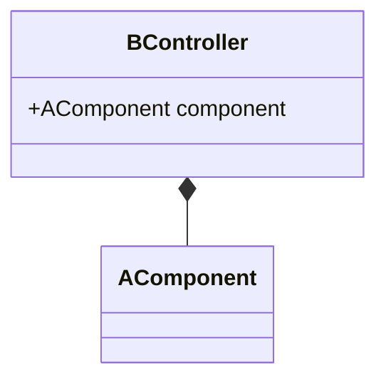

# class diagram

- [class diagram](#class-diagram)
    - [관계 표현](#관계-표현)

## 관계 표현

Mermaid 클래스 다이어그램에서 사용되는 다양한 관계를 설명하겠습니다. 각 관계는 클래스 간의 특정한 상호작용을 나타냅니다.

1. **Inheritance (상속)**:

    ```mermaid
    classDiagram
    classA <|-- classB
    ```

    - `classB`는 `classA`를 상속받습니다. 즉, `classB`는 `classA`의 모든 속성과 메소드를 상속받아 사용할 수 있습니다.

2. **Composition (합성)**:

    ```mermaid
    classDiagram
    classC *-- classD
    ```

    - `classC`는 `classD`를 포함합니다. `classD`는 `classC`의 생명 주기에 종속됩니다. 즉, `classC`가 삭제되면 `classD`도 함께 삭제됩니다.
    - 합성 관계는 강한 소유 관계를 나타내며, 다이어그램에서 `classC` 쪽에 색칠된 마름모로 표시됩니다.

3. **Aggregation (집합)**:

    ```mermaid
    classDiagram
    classE o-- classF
    ```

    - `classE`는 `classF`를 포함합니다. 그러나 `classF`는 `classE`의 생명 주기에 종속되지 않습니다. 즉, `classE`가 삭제되더라도 `classF`는 독립적으로 존재할 수 있습니다.

4. **Association (연관)**:

    ```mermaid
    classDiagram
    classG <-- classH
    ```

    - `classH`는 `classG`와 연관되어 있습니다. 이는 두 클래스 간의 일반적인 관계를 나타냅니다.

5. **Link (연결)**:

    ```mermaid
    classDiagram
    classI -- classJ
    ```

    - `classI`와 `classJ`는 서로 연결되어 있습니다. 이는 두 클래스 간의 일반적인 관계를 나타냅니다.

6. **Dependency (의존)**:

    ```mermaid
    classDiagram
    classK <.. classL
    ```

    - `classL`는 `classK`에 의존합니다. 이는 `classL`가 `classK`의 변경에 영향을 받을 수 있음을 나타냅니다.

7. **Realization (구현)**:

    ```mermaid
    classDiagram
    classM <|.. classN
    ```

    - `classN`는 `classM`을 구현합니다. 이는 `classN`가 `classM`의 인터페이스를 구현함을 나타냅니다.

8. **Dashed Link (점선 연결)**:

    ```mermaid
    classDiagram
    classO .. classP
    ```

    - `classO`와 `classP`는 점선으로 연결되어 있습니다. 이는 두 클래스 간의 약한 관계를 나타냅니다.

가령 `AComponent`가 `BController` 내에서 사용되는 경우, 이를 Composition 관계로 표현할 수 있습니다. 아래는 그 예시입니다:



이 다이어그램에서는 `BController`가 `AComponent`를 포함하고 있으며, `AComponent`는 `BController`의 생명 주기에 종속됩니다. 즉, `BController`가 삭제되면 `AComponent`도 함께 삭제됩니다.

Citations:
