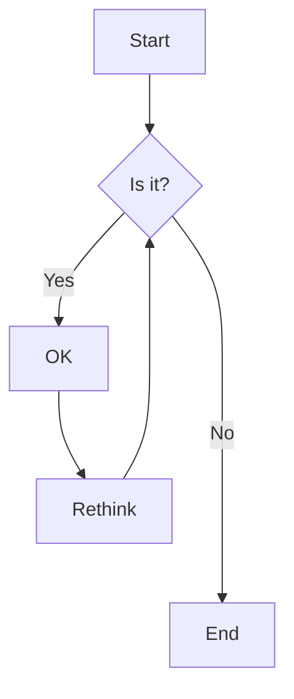

# mermaid flowchart

## [링크의 최소 길이](https://mermaid.js.org/syntax/flowchart.html#minimum-length-of-a-link)

플로차트의 각 노드는 링크된 노드를 기준으로 렌더링된 그래프의 순위, 즉 플로차트 방향에 따라 수직 또는 수평 레벨에 최종적으로 할당된다.
기본적으로 링크는 몇 개의 랭크에 걸쳐 있을 수 있지만, 링크 정의에 대시를 추가하여 어떤 링크가 다른 링크보다 길도록 요청할 수 있다.

다음 예에서는 `노드 B`에서 `노드 E`로 연결되는 링크에 대시 두 개를 추가하여 일반 링크보다 두 개의 랭크에 더 걸쳐 있다:

