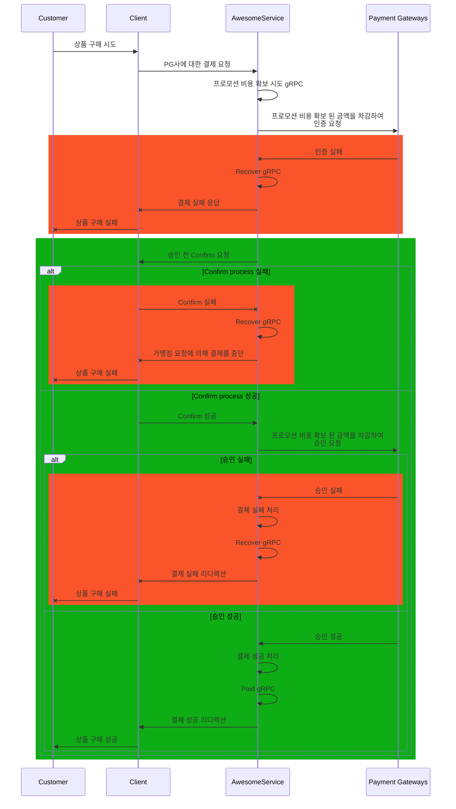
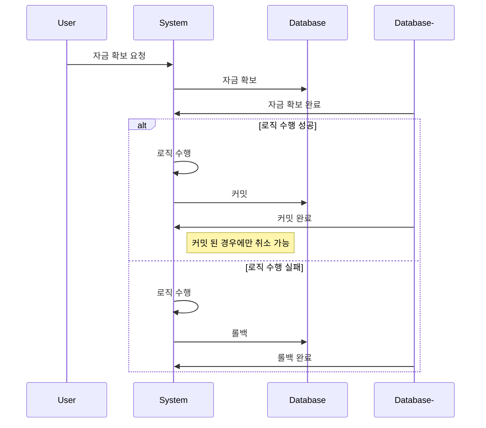
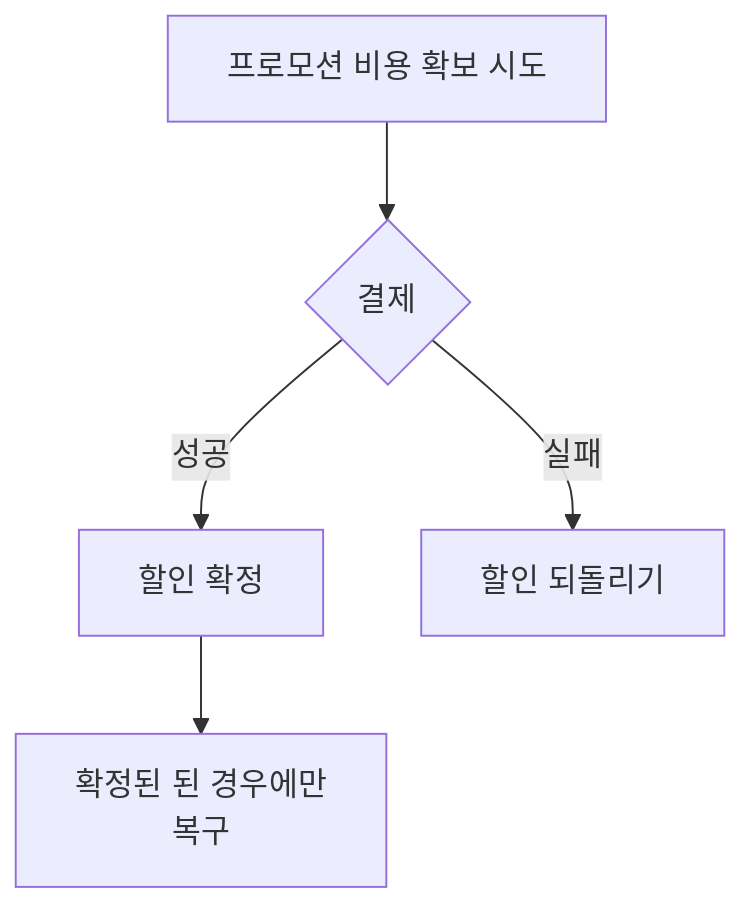

# sequence diagram

- [sequence diagram](#sequence-diagram)
    - [Messages](#messages)
    - [Examples](#examples)
        - [할인 적용 sequenceDiagram](#할인-적용-sequencediagram)

## Messages

- `->`:

    두 participant 간의 관계를 나타내며, 일반적으로 정보의 흐름이나 연관성을 나타냅니다.

    예를 들어, 시스템 간의 데이터 전송이나, 프로세스 간의 상호작용을 표현할 때 사용됩니다.

- `-->`:

    두 participant 간의 관계를 나타내지만, 일반적으로 약한 연관성을 나타냅니다.

    예를 들어, 시스템 간의 약한 연관성이나, 프로세스 간의 간접적인 상호작용을 표현할 때 사용됩니다.

- `->>`:

    두 participant 간의 관계를 나타내며, 일반적으로 명확한 명령이나 요청을 나타냅니다.

    예를 들어, 시스템 간의 명령이나 요청을 전달하는 경우, 또는 프로세스 간의 명령이나 요청을 전달하는 경우에 사용됩니다.

- `-->>`:

    두 participant 간의 관계를 나타내며, 일반적으로 약한 명령이나 요청을 나타냅니다.

    대개 비동기적 또는 덜 중요한 메시지 전달을 나타냅니다.
    이는 응답이나 결과를 나타낼 때 사용되며, 호출자가 응답을 기다리지 않고 다른 작업을 계속할 수 있음을 의미할 수 있습니다.

    예를 들어, 시스템 간의 약한 명령이나 요청을 전달하는 경우, 또는 프로세스 간의 약한 명령이나 요청을 전달하는 경우에 사용됩니다.

- `-x`:

    두 participant 간의 관계를 나타내며, 일반적으로 오류나 예외 상황을 나타냅니다.

    예를 들어, 시스템 간의 오류 발생이나, 프로세스 간의 예외 상황을 표현할 때 사용됩니다.

- `--x`:

    두 participant 간의 관계를 나타내며, 일반적으로 약한 오류나 예외 상황을 나타냅니다.

    예를 들어, 시스템 간의 약한 오류 발생이나, 프로세스 간의 약한 예외 상황을 표현할 때 사용됩니다.

- `-)`:

    두 participant 간의 관계를 나타내며, 일반적으로 비동기적인 상호작용을 나타냅니다.

    예를 들어, 시스템 간의 비동기적인 데이터 전송이나, 프로세스 간의 비동기적인 상호작용을 표현할 때 사용됩니다.

- `--)`:

    두 participant 간의 관계를 나타내며, 일반적으로 약한 비동기적인 상호작용을 나타냅니다.

    예를 들어, 시스템 간의 약한 비동기적인 데이터 전송이나, 프로세스 간의 약한 비동기적인 상호작용을 표현할 때 사용됩니다.

## Examples

### 할인 적용 sequenceDiagram

