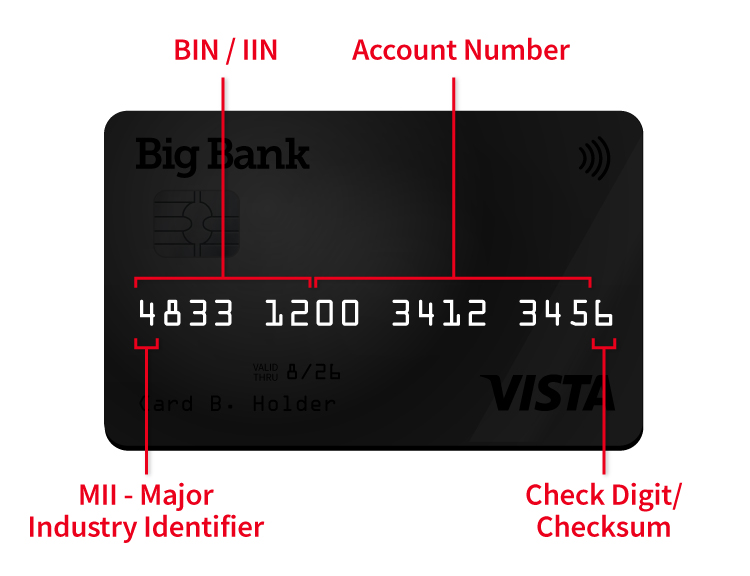

# Card

- [Card](#card)
    - [debit, credit, check 카드](#debit-credit-check-카드)
    - [What's the Difference between an Issuing Bank vs Acquiring Bank?](#whats-the-difference-between-an-issuing-bank-vs-acquiring-bank)
        - [매입사(acquirer), 발급사(issuer), 카드 네트워크](#매입사acquirer-발급사issuer-카드-네트워크)
            - [발급사](#발급사)
            - [매입사](#매입사)
            - [카드 네트워크](#카드-네트워크)
    - [카드 번호 구조](#카드-번호-구조)
        - [BIN(Bank Identification Numbers)](#binbank-identification-numbers)
        - [예시](#예시)
        - [사용 예시](#사용-예시)
        - [추가 정보](#추가-정보)
        - [요약](#요약)
    - [Card brands](#card-brands)
    - [카드 정보](#카드-정보)
    - [신용카드 번호의 유효성 검증](#신용카드-번호의-유효성-검증)
        - [Luhn 알고리즘](#luhn-알고리즘)

## debit, credit, check 카드

- [직불(Debit) 카드, 신용(Credit) 카드 그리고 체크(Check) 카드](http://sunphiz.me/wp/archives/528)
- 직불(debit)
    - 현금카드 또는 ATM 카드
    - 계좌 한도 내에서 즉시 출금
    - 사용 시마다 비밀번호 입력 필요
- 신용(credit)
    - 카드에 할당된 한도 내에서 선 지불 후, 한달 후 명세서를 받아서 결제
- 체크(check)
    - 직불카드와 신용카드의 중간적인 성격의 지불 결제 수단
    - 사용 즉시 지불액이 출금(직불카드 성격)
    - 비밀번호 입력 불필요(신용카드 성격)

## [What's the Difference between an Issuing Bank vs Acquiring Bank?](https://chargebacks911.com/issuer-vs-acquirer/)

1. customer
    1. 카드 소유자(cardholder)가 무언가를 구매
2. acquirer
    1. 해당 트랜잭션의 데이터는 [판매자(merchant)의 계좌(account)](https://www.forbes.com/advisor/business/what-is-merchant-account/)를 갖고 있는 매입사 은행(acquiring bank)로 전달(계좌가 없다면, [processor](https://midigator.com/glossary/payment-processor/)’s bank가 매입사 역할)
    2. 트랜잭션이 일괄 처리(batched)되고 정산(settled)되면, 매입사 은행은 이를 적절한 카드사 네트워크(Visa, Mastercard 등)에 제출한다
3. card network
    1. 카드사는 카드 발급사(issuer) 은행으로 트랜잭션을 포워딩
4. issuer
    1. 발급사는 트랜잭션 비용을 커버할 수 있는 충분한 예금(balance) 또는 신용이 있는지 확인
    2. 정상이라면 해당 트랜잭션을 승인(authorize)하고 카드 소지자의 계정에서 자금을 해제(release)하지만, 그렇다고 즉시 돈을 받는 것은 아님
    3. [발급사의 수수료(interchange fee)](https://chargebacks911.com/interchange-fee-increase/)를 제외한 트랜잭션 자금(fund)은 카드사로 전달
5. card network
    1. 서비스에 대한 수수료를 징수
    2. 매입사(acquirer)로 모든 정보를 전달하고, 승인된 금액이 최종적으로 계정에 표시
6. acquirer
    1. 카드사로부터 정보 수신

### 매입사(acquirer), 발급사(issuer), 카드 네트워크

#### 발급사

발급사는 고객을 위해 일을 한다. 카드 네트워크 자체는 개별 트랜잭션에 크게 관여하지 않는다.
issuing bank는 신청자의 신용도에 따라 카드 신청(card applications)을 승인, 제한, 거부해야 한다.

#### 매입사

매입사는 사업자에게 판매자 계좌(merchant account)를 제공하고 신용 또는 직불 카드 결제를 처리할 수 있는 권한을 받는다. 트랜잭션이 카드 네트워크로 적절하게 라우팅되는 것을 보장한다. 발급사(issuer)가 cardholder의 계좌에서 트랜잭션을 해제하면, 매입사(acquirer)는 지불(payment)을 승인(accept)하고 돈이 판매자 계좌로 입금되는지 확인(make sure the money gets to your account).

#### 카드 네트워크

발급사(issuer)/cardholder와 매입사(acquirer)/merchant를 연결
네트워크는 [카드 소지자로부터 판매자에게 전달되는 자금에 관한 최종 권한](https://chargebacks911.com/chargeback-reason-codes/mastercard/4837-no-cardholder-authorization/)

## 카드 번호 구조

마스킹된 카드 번호에서 초기에 제공된 숫자는 일반적으로 다음과 같은 의미를 가집니다:

1. **12345678****334***
2. **123456******334***
3. **1234********334***

이 예에서 각각의 숫자는 다음을 의미할 수 있습니다:

1. **BIN (Bank Identification Number)**: 카드 번호의 앞부분(예: 12345678, 123456, 1234)은 일반적으로 BIN으로 불리며, 이는 은행이나 카드 발행자를 식별합니다.
2. **Masked Digits**: 마스킹된 부분은 보안상의 이유로 숨겨진 카드 번호의 중간 부분을 나타냅니다.
3. **Last 4 Digits**: 카드 번호의 마지막 4자리(예: 334*)는 일반적으로 보안 검증 목적으로 공개될 수 있는 부분입니다.

### [BIN(Bank Identification Numbers)](https://chargebacks911.com/bank-identification-numbers/)

카드 번호의 처음 4자리에서 6자리까지를 지칭하며, 이는 금융 기관이나 카드 발행자를 식별하는 데 사용됩니다.

BIN 번호(은행 식별 번호)는 일반적으로 카드 번호의 첫 6자리 숫자를 말하지만, 특정 상황에서는 첫 4자리 숫자로도 발급자나 카드 유형을 식별할 수 있습니다.
이는 카드 발급자의 발급 정책에 따라 첫 4자리 숫자만으로도 특정 카드 종류나 발급자를 충분히 식별할 수 있기 때문입니다.

BIN은 *카드의 종류*, *발행자*, 그리고 *발행 지역*을 포함한 다양한 정보를 제공합니다.

신용카드 또는 기타 은행 카드를 발급한 기관과 해당 기관의 유형을 식별하기 위해 개발된 채번 규칙입니다.

[BIN은 카드 네트워크에 의해 발급자에게 제공](https://rpgc.com/bins-and-you-a-guide-for-merchants/)됩니다.

1. **첫 4~6자리 숫자**:

    BIN은 일반적으로 카드 번호의 첫 4자리에서 6자리까지를 포함합니다.

    BIN 번호가 6자리가 아닌 4자리인 경우에도 신용카드를 식별할 수 있습니다.
    많은 경우, 특정 카드 발급자는 일정한 범위 내에서 카드를 발급하기 때문입니다.

    예를 들어, 특정 은행이 4000-4999 범위 내에서만 카드를 발급하는 경우, 첫 4자리 숫자로 해당 은행의 카드를 식별할 수 있습니다.

    또한 카드의 첫 4자리 숫자만으로도 카드의 종류(예: Visa, MasterCard, American Express 등)를 구분할 수 있습니다.
    이는 각 카드 네트워크가 특정 숫자 범위를 사용하기 때문입니다.

2. **카드 발행자 정보**: BIN은 특정 금융 기관 또는 카드 발행자를 식별합니다.
3. **카드 종류**: 신용 카드, 직불 카드, 선불 카드 등 카드의 종류를 나타냅니다.
4. **카드 네트워크**: Visa, MasterCard, American Express, Discover 등의 카드 네트워크를 나타냅니다.

### 예시

다양한 BIN 예시와 그 의미를 살펴보겠습니다.

1. **Visa 카드**
   - **BIN**: 4111 11XX XXXX XXXX
     - 첫 4자리인 4111은 Visa 카드의 BIN입니다.
   - **BIN**: 4000 12XX XXXX XXXX
     - 첫 6자리인 400012는 Visa 카드의 BIN으로, 특정 금융 기관을 더 정확히 식별할 수 있습니다.

2. **MasterCard**
   - **BIN**: 5100 00XX XXXX XXXX
     - 첫 6자리인 510000은 MasterCard의 BIN입니다.
   - **BIN**: 5200 83XX XXXX XXXX
     - 첫 6자리인 520083은 MasterCard의 BIN으로, 특정 금융 기관과 카드 종류를 식별합니다.

3. **American Express**
   - **BIN**: 3714 49XX XXXX XXXX
     - 첫 6자리인 371449는 American Express 카드의 BIN입니다.

4. **Discover**
   - **BIN**: 6011 00XX XXXX XXXX
     - 첫 6자리인 601100은 Discover 카드의 BIN입니다.

### 사용 예시

BIN은 다음과 같은 상황에서 사용됩니다:
- **결제 처리**: 결제 시스템은 BIN을 사용하여 거래 요청을 적절한 카드 발행자로 라우팅합니다.
- **사기 방지**: BIN을 통해 카드의 유효성을 검증하고 사기 거래를 감지합니다.
- **카드 발급**: 금융 기관은 BIN을 사용하여 발급한 카드의 종류와 범위를 관리합니다.

### 추가 정보

- **BIN Directory**: 금융 기관은 BIN 디렉터리를 유지 관리하며, 이를 통해 BIN을 조회하고 발행자를 확인할 수 있습니다.
- **확장성**: 새로운 카드 유형이나 발행자 추가 시 기존 BIN 범위를 확장하거나 새로운 BIN을 할당할 수 있습니다.

### 요약

**BIN**은 카드 번호의 처음 4자리에서 6자리까지로, 카드 발행자를 식별하고 결제 처리, 사기 방지, 카드 발급 등의 목적으로 사용됩니다. 다양한 카드 네트워크의 BIN 예시를 통해, BIN이 금융 거래에서 중요한 역할을 한다는 점을 이해할 수 있습니다.

> For example, Visa assigns a number to the Issuer and Acquirer for all its cards, sets these numbers in a list, and circulates it to its “members,” namely those same Issuers and Acquirers (they are the only two parties other than Visa who actually receive this list)  
> 예를 들어, Visa는 모든 카드에 대해 발급자와 매입사에 번호를 할당하고 이 번호를 목록에 설정한 다음 "구성원", 즉 동일한 발급사와 매입사에 배포합니다(Visa를 제외한 유일한 두 당사자는 실제로 이 목록을 받음)



- 1XXX: UATP 카드
- 2200~2204: 미르
- 2221~2720: 마스터카드[1]
- 34XX, 37XX: 아메리칸 익스프레스
- 3528~3589: JCB (체크, 신용, 직불)
- 36XX: 다이너스 클럽
- 38XX: Hipercard (브라질)
- 4XXX: 비자카드 (체크, 신용, 직불)
- 5067: Elo (브라질)
- 51XX~55XX: 마스터카드 (체크, 신용, 직불)
- 50, 56~59: 마에스트로 카드 국제직불카드
- 506099~506198, 650002~650027: Verve (나이지리아)
- 5614: Uzcard 겸용 미르
- 6060, 63: 마에스트로 카드 직불카드
- 60XX, 65XX, 81XX, 82XX, 508X: RuPay
- 60(6060 제외), 61, 64: 디스커버
- 6056: 금융결제원 EXK[2]
- 650X, 636297, 636368, 636369: Elo (브라질)
- 62XX: UnionPay 중국은련카드(UPI)
- 6262: Uzcard 겸용 UnionPay 중국은련카드(UPI)
- 8600: Uzcard (우즈베키스탄)
- 88XX: 불명[3]
- 90XX~95XX: 한국 국내전용카드 [체크, 신용, 기프트](4)
- 9700: 한국 국내전용카드 (카카오페이 제휴 체크카드)
- 9792: TROY (튀르키예)
- 9860: HUMO (우즈베키스탄)

## [Card brands](https://midigator.com/glossary/card-brands/)

- 종종 `card network` 또는 `card association`로 불린다
- 결제 카드 거래(payment card transactions)를 용이하게 하는 조직

## 카드 정보

- 개인 && 체크 카드

    ```json
    {
        "cardInfo": {
            "binNumber": 536510,
            "issuer": "국민카드",
            "recipeName": "카카오뱅크카드",
            "ownerType": "personal",
            "brand": "Master",
            "creditType": "debit",
            "issuerNumber": 381,
            "publisher": "카카오뱅크",
            "publisherNumber": 90,
            "acquirer": "국민카드",
            "acquirerNumber": 381
        }
    }
    ```

- 개인 && 신용 카드

    ```json
    {
        "cardInfo": {
            "binNumber": 536181,
            "issuer": "삼성카드",
            "recipeName": "삼성카드",
            "ownerType": "personal",
            "brand": "Master",
            "creditType": "credit",
            "issuerNumber": 365,
            "publisher": "삼성카드",
            "publisherNumber": 365,
            "acquirer": "삼성카드",
            "acquirerNumber": 365
        }
    }
    ```

## 신용카드 번호의 유효성 검증

### Luhn 알고리즘

Luhn 알고리즘은 신용카드 번호의 유효성을 검증하기 위해 사용되는 간단한 체크섬 공식입니다.
이 알고리즘은 1954년 IBM의 과학자인 Hans Peter Luhn에 의해 고안되었습니다.
Luhn 알고리즘은 입력된 숫자가 특정 조건을 만족하는지 확인하여 유효한 카드 번호인지 검증합니다.
이 코드를 통해 카드 번호의 첫 4자리 숫자만으로도 특정 발급자나 카드 유형을 확인할 수 있습니다.

단 주의할 것은, *BIN 번호 검증과 Luhn 알고리즘은 서로 다른 목적*을 가지고 있습니다.
- BIN 번호는 카드 발급자와 카드 종류를 식별하는 데 사용
- Luhn 알고리즘은 카드 번호 전체의 유효성을 검증하는 데 사용
하지만 두 가지를 함께 사용하면 특정 카드 발급자와 카드 번호의 유효성을 동시에 검증할 수 있습니다.

예를 들어, BIN 번호가 유효하고 전체 카드 번호가 Luhn 알고리즘을 통과하면, 해당 카드 번호는 신뢰할 수 있는 카드 번호일 가능성이 높습니다.

```go
package main

import (
    "fmt"
    "strconv"
    "strings"
)

// Luhn 알고리즘을 사용하여 신용카드 번호의 유효성을 검증합니다.
func validateLuhn(cardNumber string) bool {
    sum := 0
    alt := false
    for i := len(cardNumber) - 1; i > -1; i-- {
        n, _ := strconv.Atoi(string(cardNumber[i]))
        if alt {
            n *= 2
            if n > 9 {
                n -= 9
            }
        }
        sum += n
        alt = !alt
    }
    return sum%10 == 0
}

// 4자리 BIN 번호 리스트에 있는지 확인합니다.
func isValidBIN(bin string, validBins []string) bool {
    for _, validBin := range validBins {
        if strings.HasPrefix(bin, validBin) {
            return true
        }
    }
    return false
}

func main() {
    cardNumber := "4532756279624064" // 예제 카드 번호
    validBins := []string{"4532", "4533", "4534"} // 예제 유효 BIN 번호 리스트 (4자리)

    if len(cardNumber) < 4 {
        fmt.Println("카드 번호가 너무 짧습니다.")
        return
    }

    bin := cardNumber[:4]

    if validateLuhn(cardNumber) && isValidBIN(bin, validBins) {
        fmt.Println("유효한 BIN 번호와 카드 번호입니다.")
    } else {
        fmt.Println("유효하지 않은 BIN 번호 또는 카드 번호입니다.")
    }
}
```

1. `validateLuhn` 함수는 Luhn 알고리즘을 사용하여 신용카드 번호의 유효성을 검증합니다.
2. `isValidBIN` 함수는 주어진 BIN 번호가 유효한 4자리 BIN 번호 리스트에 있는지 확인합니다.
3. `main` 함수는 예제 카드 번호와 유효한 4자리 BIN 번호 리스트를 사용하여 카드 번호와 BIN 번호의 유효성을 체크합니다.

Luhn 알고리즘은 다음과 같은 단계를 거치게 됩니다.

1. **숫자 배열 생성**:
   - 오른쪽에서 왼쪽으로 각 숫자를 배열에 저장합니다.

2. **짝수 자리 숫자 두 배**:
   - 각 짝수 위치(1부터 시작)의 숫자를 두 배로 만듭니다. 두 배로 만들었을 때 결과가 9보다 크면, 두 자리 숫자의 합(즉, 각 자리의 숫자들을 더한 값)을 계산합니다.

3. **합산**:
   - 배열의 모든 숫자를 합산합니다.

4. **10으로 나눴을 때 나머지 확인**:
   - 합산된 결과를 10으로 나눈 나머지가 0이면 유효한 번호입니다. 그렇지 않으면 유효하지 않은 번호입니다.

예를 들어 신용카드 번호가 `4532756279624064`인 경우를 살펴보겠습니다.

신용카드 번호: `4532756279624064`

1. **숫자 배열 생성 (오른쪽에서 왼쪽으로)**:

   ```plaintext
   4 6 0 4 2 6 9 7 2 5 6 7 3 2 5 4
   ```

2. **짝수 자리 숫자 두 배**:

   ```plaintext
   4 12 0 8 2 12 9 14 2 10 6 14 3 4 5 8
   ```

3. **두 자리 숫자의 합 계산**:

   ```plaintext
   4 (1+2) 0 8 2 (1+2) 9 (1+4) 2 (1+0) 6 (1+4) 3 4 5 8
   ```

   결과:

   ```plaintext
   4 3 0 8 2 3 9 5 2 1 6 5 3 4 5 8
   ```

4. **합산**:

   ```plaintext
   4 + 3 + 0 + 8 + 2 + 3 + 9 + 5 + 2 + 1 + 6 + 5 + 3 + 4 + 5 + 8 = 68
   ```

5. **10으로 나눴을 때 나머지 확인**:

   ```plaintext
   68 % 10 = 8 (유효하지 않은 번호)
   ```

```go
package main

import (
    "fmt"
    "strconv"
)

// Luhn 알고리즘을 사용하여 신용카드 번호의 유효성을 검증합니다.
func validateLuhn(cardNumber string) bool {
    sum := 0
    alt := false
    for i := len(cardNumber) - 1; i > -1; i-- {
        n, _ := strconv.Atoi(string(cardNumber[i]))
        if alt {
            n *= 2
            if n > 9 {
                n -= 9
            }
        }
        sum += n
        alt = !alt
    }
    return sum%10 == 0
}

func main() {
    cardNumber := "4532756279624064" // 예제 카드 번호

    if validateLuhn(cardNumber) {
        fmt.Println("유효한 카드 번호입니다.")
    } else {
        fmt.Println("유효하지 않은 카드 번호입니다.")
    }
}
```

1. **숫자 배열 생성 및 변환**:
   - `cardNumber` 문자열을 오른쪽에서 왼쪽으로 순회하여 각 자리 숫자를 배열로 변환합니다.

2. **짝수 자리 숫자 두 배 및 합산**:
   - `alt` 변수를 사용하여 짝수 위치의 숫자를 두 배로 만듭니다. 두 배로 만든 결과가 9보다 크면, 두 자리 숫자의 합을 계산합니다.
   - 모든 숫자를 `sum` 변수에 합산합니다.

3. **10으로 나눴을 때 나머지 확인**:
   - 최종 합산 값을 10으로 나눈 나머지가 0이면 유효한 번호로 판단합니다.
