# Checkout

- [Checkout](#checkout)
    - [remote branch checkout by intellij](#remote-branch-checkout-by-intellij)
    - [remote branch 체크아웃](#remote-branch-체크아웃)
    - [강제 체크아웃](#강제-체크아웃)
        - [You are in 'detached HEAD' state](#you-are-in-detached-head-state)
    - [Your branch is behind 'origin/develop' by 17 commits, and can be fast-forwarded](#your-branch-is-behind-origindevelop-by-17-commits-and-can-be-fast-forwarded)
    - [How to explain git in simple words?](#how-to-explain-git-in-simple-words)
    - [What is the check in and check out git?](#what-is-the-check-in-and-check-out-git)
    - [특정 디렉터리만을 체크아웃(Sparse checkout)](#특정-디렉터리만을-체크아웃sparse-checkout)
    - [에러 통해 배우기](#에러-통해-배우기)
        - [Your branch is behind 'origin/develop' by 17 commits, and can be fast-forwarded](#your-branch-is-behind-origindevelop-by-17-commits-and-can-be-fast-forwarded-1)
    - [기타](#기타)
        - [detached HEAD](#detached-head)

## remote branch checkout by intellij

```shell
# checkout
git -c credential.helper= -c core.quotepath=false -c log.showSignature=false \
    checkout -b fix/PORT-649_no_notification_paymentwall_if_not_pingback 0637ba3ed2fa91a12d06a37cd7cbc1b29d27e6a9 --

# fetch origin
git -c credential.helper= -c core.quotepath=false -c log.showSignature=false \
    fetch origin fix/PORT-649_no_notification_paymentwall_if_not_pingback \
    --recurse-submodules=no --progress --prune
```

## remote branch 체크아웃

```bash
git checkout --track origin/<BRANCH_NAME>
```

## 강제 체크아웃

`--force` 옵션은 일반적으로 충돌이 발생할 경우에도 체크아웃을 강제로 진행하라는 명령입니다.

예를 들어, 작업 중인 파일이 변경되었지만 저장하지 않은 상태에서 다른 브랜치로 체크아웃하려 할 때, 기본적으로 Git은 이를 거부합니다. `--force`를 사용하면 이러한 변경 사항을 무시하고 체크아웃을 강제로 진행합니다.

```bash
 git -c core.quotepath=false -c log.showSignature=false \
    checkout \
    --force \
    -b fix/ci-2024-02 origin/fix/ci-2024-02 --
```

이 명령어는 Git에서 새로운 브랜치를 생성하고 해당 브랜치로 체크아웃하는 과정을 수행합니다. 명령어 내 각각의 옵션들은 다음과 같은 역할을 수행합니다:

- `-c core.quotepath=false`

    이 옵션은 `core.quotepath` 설정을 일시적으로 `false`로 설정합니다.
    Git은 기본적으로 non-ASCII 파일명을 Unicode escape sequence로 출력하는데, 이 옵션을 `false`로 설정하면 파일 이름을 그대로 출력하도록 합니다.
    이렇게 설정하는 이유는 터미널에서 파일 이름을 읽거나 사용하기 쉽게 하기 위함입니다.

- `-c log.showSignature=false`

    `log.showSignature` 설정을 `false`로 설정하여, Git 로그 명령 실행 시 커밋의 GPG 서명을 보여주지 않도록 설정합니다.
    서명 정보가 필요하지 않을 때 로그 출력을 간소화하기 위해 사용됩니다.

- `checkout --force`

    `checkout` 명령은 지정된 브랜치로 작업 디렉토리와 인덱스를 업데이트합니다.
    `--force` 옵션은 체크아웃을 강제로 수행하여, 로컬 변경사항을 덮어쓰고 무시하도록 합니다.
    이는 작업 디렉토리에 변경사항이 있거나 스테이징된 파일이 있어도, 오류나 경고 없이 브랜치를 변경하고자 할 때 유용합니다.

- `-b fix/ci-2024-02`

    `-b` 옵션은 새로운 브랜치를 생성하고, 그 브랜치로 체크아웃하는 것을 동시에 수행합니다.
    이 예에서 `fix/ci-2024-02`는 새로 생성될 브랜치의 이름입니다.

- `origin/fix/ci-2024-02`

    이 부분은 새 브랜치의 기준이 될 원격 브랜치를 지정합니다.
    즉, `origin` 원격 저장소의 `fix/ci-2024-02` 브랜치를 기반으로 로컬에서 새로운 `fix/ci-2024-02` 브랜치를 생성하고 체크아웃합니다.

- `--`

    명령어의 마지막에 위치한 `--`는 옵션 파서에게 이후에 오는 모든 항목들이 옵션이 아니라 인자(또는 파일명 등)임을 명시하는 구분자 역할을 합니다.
    여기서는 특별히 필요한 인자가 없으므로 실제로는 영향을 주지 않지만, 사용자가 실수로 옵션으로 해석될 수 있는 인자를 제공할 경우를 대비해 사용되곤 합니다.

### You are in 'detached HEAD' state

```bash
❯ git checkout --force origin/develop

Note: switching to 'origin/develop'.

You are in 'detached HEAD' state. You can look around, make experimental
changes and commit them, and you can discard any commits you make in this
state without impacting any branches by switching back to a branch.

If you want to create a new branch to retain commits you create, you may
do so (now or later) by using -c with the switch command. Example:

  git switch -c <new-branch-name>

Or undo this operation with:

  git switch -

Turn off this advice by setting config variable advice.detachedHead to false

HEAD is now at a299135ee php-cs-fixer 업그레이드 (v3.18 → v3.52) (#675)
```

`git checkout`은 특정 브랜치나 커밋으로 작업 디렉토리와 인덱스를 업데이트합니다.
명령어에서 `--force` 옵션은 충돌이 있거나 다른 문제가 발생할 경우에도 강제로 체크아웃을 수행하라는 의미입니다.
이 경우 `origin/develop` 브랜치로 체크아웃하라는 명령입니다.

그런데 여기서 `origin/develop`은 원격 저장소 `origin`의 `develop` 브랜치를 가리키는 레퍼런스입니다.
일반적으로 `git checkout` 명령으로 로컬 브랜치를 체크아웃할 때는 해당 브랜치의 최신 커밋을 가리키는 HEAD가 그 브랜치를 추적합니다. 그러나 `origin/develop`과 같은 *원격 브랜치 레퍼런스를 직접 체크아웃할 경우, Git은 이를 'detached HEAD' 모드로 처리*합니다. 이는 *원격 브랜치가 로컬에서 직접적으로 추적되지 않기 때문*입니다.

1. **Detached HEAD 상태**:

    "You are in 'detached HEAD' state"라는 메시지는 현재 'detached HEAD' 상태에 있음을 나타냅니다.
    이는 특정 브랜치의 최신 커밋을 가리키는 것이 아니라, 개별 커밋을 직접 체크아웃한 상태를 의미합니다.
    이 상태에서는 변화를 시험해 보거나 임시 조치를 취할 수 있지만, 이러한 변경사항은 어떤 브랜치에도 속하지 않게 됩니다.

2. **브랜치 생성 권장**:

   만약 이 상태에서 변경사항을 보존하고 싶다면, 새로운 브랜치를 생성하여 커밋을 할 수 있습니다. 예를 들어, `git switch -c <new-branch-name>`을 사용하여 새로운 브랜치로 전환하고 그곳에 커밋할 수 있습니다.

3. **원래 브랜치로 돌아가기**:
   - 만약 이 변경사항을 원치 않거나 실험만 하고 싶다면, `git switch -` 명령을 사용하여 이전 브랜치로 돌아갈 수 있습니다. 이는 detached HEAD 상태를 벗어나 원래 브랜치의 최신 상태로 돌아가는 것을 의미합니다.

4. **Detached HEAD 상태의 조언 비활성화**:
   - 만약 detached HEAD에 대한 조언이 불필요하다고 생각된다면, `git config --global advice.detachedHead false`를 실행하여 이 조언을 비활성화할 수 있습니다.

`git status` 명령을 사용하여 현재 브랜치와 상태를 확인할 수 있습니다.
만약 detached HEAD 상태에서 유지하고 싶은 변경사항이 있다면, 새 브랜치를 만들어서 커밋하세요.
변경사항을 유지할 필요가 없다면, 원래 브랜치로 돌아가거나 다른 브랜치로 체크아웃하세요.

```bash
HEAD detached at origin/develop
Untracked files:
(use "git add <file>..." to include in what will be committed)
        .env.dev
        ... 생략 ...

nothing added to commit but untracked files present (use "git add" to track)
```

원격 브랜치의 최신 변경사항을 로컬 브랜치로 가져오고자 할 때, 일반적으로 다음과 같은 절차를 따릅니다:

1. **로컬 브랜치 체크아웃**:

   ```bash
   git checkout develop
   ```

   이 명령은 로컬의 `develop` 브랜치로 전환합니다.

2. **원격 브랜치의 변경 사항 가져오기**:

   ```bash
   git pull origin develop
   ```

   이 명령은 `origin`의 `develop` 브랜치에서 최신 변경사항을 현재 로컬 `develop` 브랜치로 통합합니다.

직접 `origin/develop`으로 체크아웃하는 대신, 로컬 `develop` 브랜치로 체크아웃한 후 `git pull` 또는 `git fetch`와 `git merge`를 사용하는 것이 일반적입니다. 이 방식은 `detached HEAD` 상태를 방지하고 로컬 브랜치에서 원격 브랜치의 최신 변경사항을 반영할 수 있게 해줍니다.

`--force` 옵션은 필요한 경우에만 사용하되, 주의해서 사용해야 합니다. 강제 체크아웃은 작업 중인 변경사항을 덮어쓸 위험이 있기 때문입니다.

## Your branch is behind 'origin/develop' by 17 commits, and can be fast-forwarded

- [What does git "behind or ahead by X commits" really mean?](https://stackoverflow.com/a/58667401)

## [How to explain git in simple words?](https://xosh.org/explain-git-in-simple-words/)

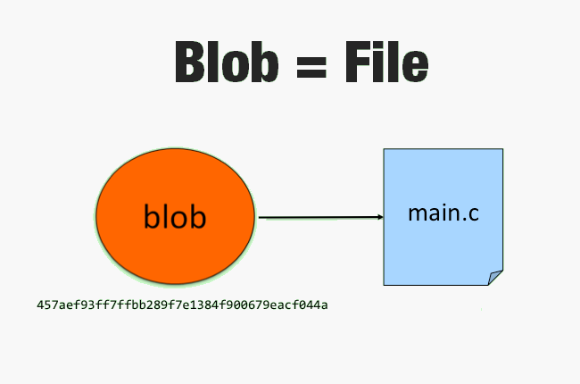

- `blob`:
    - most basic git data storage
    - Git stores just the contents of the files for each change which is called Blob in the git terminology.

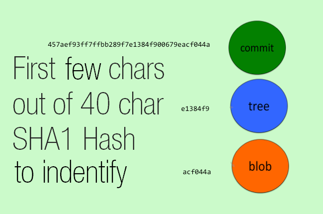

- The numbers you see are `SHA1` hash of contents which identify every object in git, be it a
    - commit
    - or tree
    - or blob

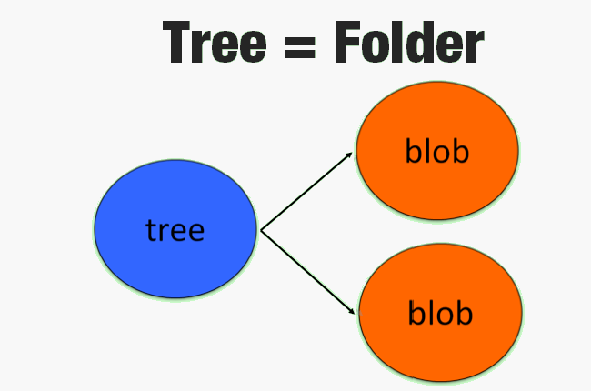
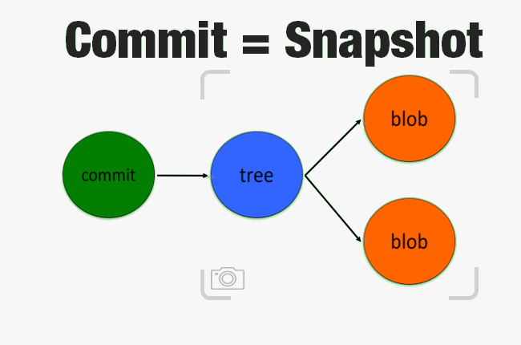
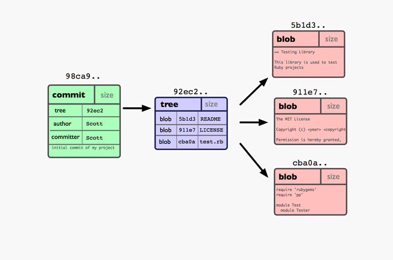

- **Check in** = Doing a Commit

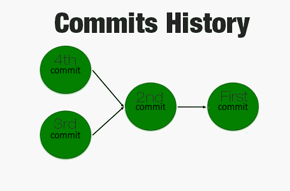
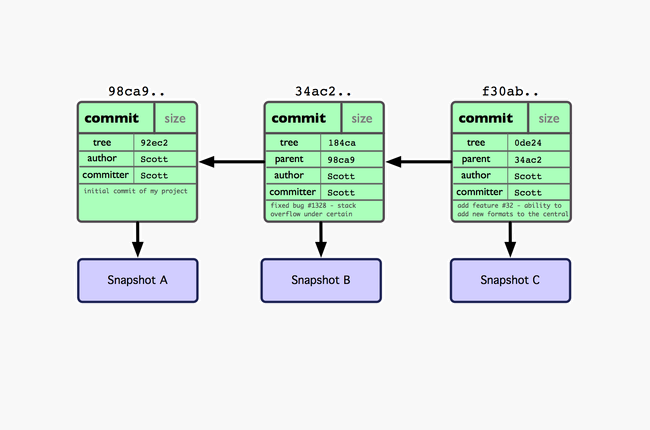

- If you make some changes and commit again, the next commit stores a pointer to the commit that came immediately before it.
- So the commits “flow” in one direction only. This flow of commits can be divide into branches.

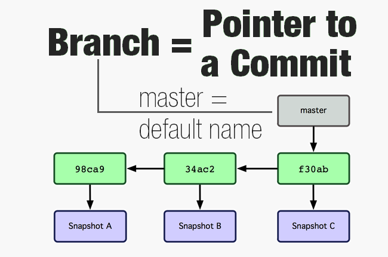
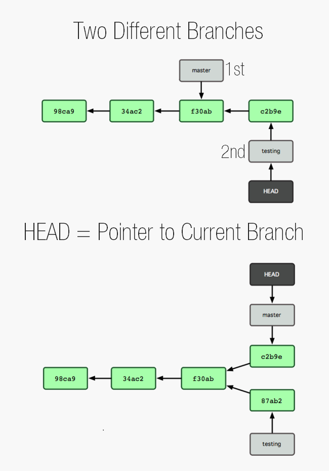

- The HEAD in Git is the pointer to the current branch reference, which is in turn a pointer to the last commit you made.
- It's generally simplest to think of it as `HEAD` is the snapshot of your last commit.

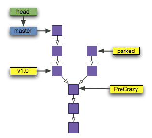
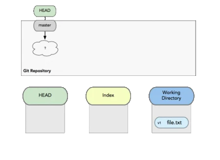

- The `Index` is your proposed next commit.
    - It’s basically a loading dock where you get to determine what changes get shipped away.

## What is the check in and check out git?

- **Check in** = Doing a Commit
- `Checking-in code`: to upload code to main branch repository so that its administrator can review the code and finally update the project version.

## 특정 디렉터리만을 체크아웃(Sparse checkout)

```shell
#  --no-checkout 옵션을 사용하여 아무 파일도 체크아웃하지 않는다
git clone https://github.com/mbadolato/iTerm2-Color-Schemes.git --no-checkout

cd iTerm2-Color-Schemes

git sparse-checkout init

git sparse-checkout set rio
```

## 에러 통해 배우기

### Your branch is behind 'origin/develop' by 17 commits, and can be fast-forwarded

- [What does git "behind or ahead by X commits" really mean?](https://stackoverflow.com/a/58667401)

## 기타

### detached HEAD

`detached HEAD` 상태는 Git에서 특정한 사용자 환경을 나타냅니다.
이 상태는 Git의 헤드(HEAD)가 브랜치의 최신 커밋을 가리키고 있지 않고, 대신 특정 커밋 자체를 직접적으로 가리킬 때 발생합니다.
일반적으로, HEAD는 현재 작업 중인 브랜치의 최신 커밋을 가리키는 포인터입니다.
그러나 `detached HEAD` 상태에서는 HEAD가 브랜치를 따르지 않고, 단독으로 특정 커밋을 가리킵니다.

- Detached HEAD 상태가 발생하는 경우

    1. **특정 커밋 체크아웃**: 사용자가 브랜치 이름 대신 커밋 해시를 사용하여 직접 체크아웃할 때 발생합니다. 예를 들어, `git checkout 1a2b3c4d`와 같이 실행하면, HEAD는 이제 그 특정 커밋에 "고정"됩니다.

    2. **태그 체크아웃**: 태그로 체크아웃할 때도 비슷한 상황이 발생할 수 있습니다. 태그는 특정 커밋을 가리키므로, 태그를 체크아웃하면 HEAD는 그 태그가 가리키는 커밋에 고정됩니다.

- Detached HEAD 상태의 특징과 주의사항

    - **변경 사항**: 이 상태에서 코드 변경 사항을 커밋하면, 이 커밋들은 현재 어떤 브랜치에도 속하지 않게 됩니다. 따라서, 나중에 다른 브랜치로 체크아웃하면, 이러한 커밋들에 대한 참조가 없어져 접근할 수 없게 됩니다.
  
    - **브랜치 생성**: 만약 `detached HEAD` 상태에서 작업을 계속하고 싶다면, 새로운 브랜치를 만들고 그곳에서 작업을 계속하는 것이 좋습니다. 예: `git switch -c new-branch-name` 또는 `git checkout -b new-branch-name`.
  
    - **원래 브랜치로 복귀**: 작업을 마치고 원래의 브랜치 상태로 돌아가려면, 해당 브랜치로 다시 체크아웃하면 됩니다. 예: `git checkout main`.

- 사용례

    `detached HEAD`는 다양한 시나리오에서 유용할 수 있습니다.

    예를 들어,
    - 과거의 특정 시점으로 돌아가 그 당시의 코드를 검토하거나, 실험적인 변경을 시험해 보기 위해 사용할 수 있습니다.
    - 또한, 배포나 릴리스를 위한 태그가 있는 코드 베이스를 빌드할 때도 자주 사용됩니다.

    이러한 상태는 Git의 유연성을 보여주는 하나의 예로서, 사용자가 이 상태의 성격과 이를 관리하는 방법을 잘 이해하고 있어야 합니다. 그렇지 않으면, 의도치 않은 데이터 손실이나 혼란을 초래할 수 있습니다.
