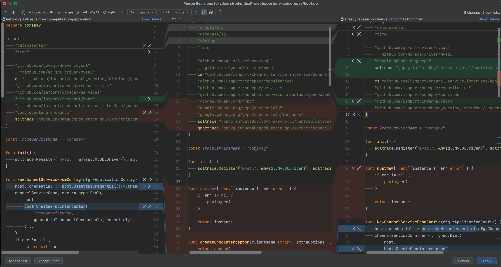

# Conflict

- [Conflict](#conflict)
    - [충돌](#충돌)
    - [Yours와 Theirs](#yours와-theirs)
    - [충돌 예시](#충돌-예시)
        - [간단한 충돌](#간단한-충돌)
        - [복잡한 충돌](#복잡한-충돌)
        - [예제1](#예제1)
        - [예제2](#예제2)
        - [예제3](#예제3)
    - [IntelliJ Merge Revisions for ${SOME\_FILE}](#intellij-merge-revisions-for-some_file)
        - [Left: Rebasing `6b8ceaca` from `some-qwerty-api-service/feature/application`](#left-rebasing-6b8ceaca-from-some-qwerty-api-servicefeatureapplication)
        - [Middle: Base](#middle-base)
        - [Right: Already rebased commits and commits from main](#right-already-rebased-commits-and-commits-from-main)

## 충돌

- 기본 개념

    - **HEAD**: 현재 체크아웃된 브랜치의 최신 커밋을 가리킵니다.
    - **MERGE_BASE**: 병합할 두 브랜치의 공통 조상을 가리킵니다.
    - **OURS**: 현재 체크아웃된 브랜치의 변경 사항을 나타냅니다.
    - **THEIRS**: 병합하려는 다른 브랜치의 변경 사항을 나타냅니다.

- Git Merge 중 충돌

    브랜치에 병합하려고 할 때, 서로 다른 변경 사항이 적용된 것을 확인하고 충돌이 발생했음을 알립니다.

- Stash 충돌

    Stash를 적용할 때도 비슷한 충돌이 발생할 수 있습니다.
    스태시가 생성된 이후 코드베이스에 변경 사항이 있을 경우입니다.
    이때의 충돌 표시는 스태시가 생성될 당시의 코드와 현재 상태를 보여줍니다.

충돌은 아래와 같이 표시됩니다.

```bash
git checkout A # `HEAD`
             └ 리베이스 하는 브랜치
git rebase B # branch being rebased
           └ 리베이스 되는, 기반이 될 브랜치
```

```go
<<<<<<< HEAD
var privateVar = []string{"1", "2"}
=======
var PublicVar = []string{"1", "2"}
>>>>>>> bc4d1105 (feature/add-test)
```

- `<<<<<<< HEAD`와 `=======` 사이

    현재 체크아웃된 브랜치(`HEAD`)에서 이루어진 변경 사항들입니다.
    즉, 충돌이 발생한 부분의 현재 브랜치 버전이 표시합니다.

- `=======`와 `>>>>>>> [commit hash]` 사이

    병합하려는 브랜치의 내용을 표시합니다.

```go
<<<<<<< HEAD
func Test() int {
||||||| parent of parent of bc4d1105
func Test() interface{} {
=======
func Test() string {
>>>>>>> bc4d1105 (feature/add-test)
```

- `<<<<<<< HEAD`와 `=======` 사이의 부분

    현재 체크아웃된 브랜치(`HEAD`)에서 이루어진 변경 사항들입니다.

- `||||||| parent of parent of bc4d1105`와 `=======` 사이의 부분

    충돌이 발생하기 전 이전의 공통 상태(공통 조상)을 나타냅니다.
    리베이스 되는 커밋의 부모 커밋에서의 코드 상태를 보여줍니다.
    즉, 충돌이 일어나기 전에 두 브랜치가 갈라지기 전의 상태를 보여줍니다.

    공통 조상은 충돌이 발생하기 전에 코드가 어떻게 생겼는지 이해하는 데 도움이 됩니다.

    아래와 같이 표현되는 경우들이 있습니다.

    - **`||||||| parent of bc4d1105`**

        직접적인 공통 조상을 나타낼 때 사용됩니다.
        즉, 두 브랜치가 갈라지기 직전의 커밋입니다.

    - **`||||||| parent of parent of bc4d1105`**

        이는 간접적인 공통 조상을 나타낼 때 사용됩니다.

        예를 들어, 충돌이 여러 번의 병합 또는 rebase 후에 발생할 때 사용됩니다.
        이 경우, Git은 공통 조상의 부모까지 추적하여 표시합니다.

    - **`||||||| constructed merge base`**

        명확한 공통 조상을 식별하기 어려울 때 Git이 자동 병합 시도를 하면서 만든 기준 버전을 나타냅니다.

    - **`||||||| Stash base`**

        스태시 충돌이 발생할 때 사용되며, 스태시가 생성될 당시의 코드 상태를 보여줍니다.

- `=======`

    두 브랜치 간의 충돌 변경 사항을 구분합니다.

- `=======`와 `>>>>>>> [commit hash]` 사이

    병합하거나 리베이스하려는 브랜치의 변경 사항의 끝을 표시하며, 해당 브랜치의 커밋 해시를 나타냅니다.

## Yours와 Theirs

"Yours"와 "Theirs"는 Git 병합 시 충돌이 발생했을 때 각 브랜치의 변경 내용을 나타내는 용어입니다.
- "Yours":

    현재 작업 중인 브랜치입니다.

    예를 들어, `git merge` 명령을 실행했을 때 병합 작업을 시도한 브랜치입니다.

- "Theirs":

    병합하려고 하는 대상 브랜치입니다.

    예를 들어, `git merge` 명령을 실행했을 때 병합하려는 다른 브랜치입니다.

IntelliJ와 같은 도구에서는 이 용어를 사용하여 충돌을 해결할 때 어떤 변경 내용을 선택할지 결정하게 도와줍니다.
이를 통해 개발자는 충돌을 효율적으로 해결하고, 병합 작업을 완료할 수 있습니다.

1. `main` 브랜치와 `feature-branch` 브랜치 두 개가 존재하는 상태를 가정합니다.

    **현재 브랜치** (`feature-branch`)

    ```bash
    A -- B -- C (feature-branch)
    ```

    **병합 대상 브랜치** (`main`)

    ```bash
    A -- D -- E (main)
    ```

    여기서 `A`는 두 브랜치의 공통 조상입니다.

2. `feature-branch`에서 `main`을 병합하려고 할 때 충돌이 발생했다고 가정합니다.

    ```bash
    A -- B -- C (feature-branch)
        \
        D -- E (main)
    ```

    이때 IntelliJ에서 충돌 해결 화면을 보면 다음과 같이 나옵니다:

    - **Yours (`feature-branch`)**: 현재 작업 중인 브랜치(`HEAD`)로, `feature-branch`가 가리키는 커밋 (`C`)
    - **Theirs (`main`)**: 병합하려는 대상 브랜치 `main`이 가리키는 커밋 (`E`)
    - **공통 조상**: 두 브랜치의 공통 조상 커밋 (`A`)

## 충돌 예시

### 간단한 충돌

- 두 브랜치가 공통 조상에서 직접적으로 갈라져 변경 사항이 있을 때 사용됩니다.
- 예: 단순히 `parent of bc4d1105`를 표시.

브랜치 A와 브랜치 B가 공통 조상 `C`에서 갈라졌고, 각각 `A1`과 `B1`에서 변경 사항이 발생한 후 병합하려고 합니다.

- **브랜치 A**: `C -> A1`
- **브랜치 B**: `C -> B1`

이 경우, 충돌이 발생하면 Git은 다음과 같은 형식을 사용합니다:
- **`parent of bc4d1105`** (즉, `C`)

### 복잡한 충돌

- 여러 번의 병합 또는 재기반(rebase) 후에 갈라진 브랜치가 있을 때 사용됩니다.
- 예: 공통 조상의 부모까지 추적하여 `parent of parent of bc4d1105`를 표시.

브랜치 A와 브랜치 B가 여러 번의 병합 후 갈라졌다고 가정해 봅시다.

- **브랜치 A**: `C -> A1 -> A2`
- **브랜치 B**: `C -> B1 -> B2`

또한, A2와 B2는 각각 병합된 커밋이라고 가정합니다. 이제 A2와 B2에서 충돌이 발생한 경우:

- **브랜치 A**: `C -> A1 -> M1 (A1 + B1 병합) -> A2`
- **브랜치 B**: `C -> B1 -> M2 (A1 + B1 병합) -> B2`

이 경우, 공통 조상은 `C`이지만, 여러 번의 병합이 이루어졌기 때문에 Git은 더 구체적인 공통 조상을 찾기 위해 다음과 같은 형식을 사용합니다:
- **`parent of parent of bc4d1105`** (즉, `C`)

### 예제1

```log
<<<<<<< HEAD
현재 작업 중인 브랜치에서의 변경 내용.
||||||| parent of f935f14cb (some_service: 삭제)
`f935f14cb` 커밋의 부모 커밋 상태.
=======
해당 커밋에서 변경된 내용 (예: 삭제된 내용).
>>>>>>> f935f14cb (some_service: 삭제)
```

1. **기본 브랜치에서 작업 중**: 기본 브랜치에서 파일의 일부 내용을 수정했습니다.
2. **다른 브랜치에서 작업 중**: 다른 브랜치 (`some_service`)에서 해당 파일의 동일한 부분을 삭제했습니다.
3. **Rebase 과정**: 기본 브랜치를 다른 브랜치 위로 Rebase하는 과정에서 충돌이 발생했습니다.

```plaintext
git checkout main
# main 브랜치에서 작업을 시작합니다.

# 파일 수정
echo "현재 내가 변경한 내용" >> some_file.txt
git commit -am "내용 변경"

# some_service 브랜치에서 동일 파일의 내용 삭제
git checkout -b some_service
echo "내용 삭제" > some_file.txt
git commit -am "내용 삭제"

# main 브랜치를 some_service 위로 Rebase 시도
git rebase some_service
```

### 예제2

```plaintext
<<<<<<< HEAD
(내가 변경하고 싶은 내용) 현재 작업 중인 브랜치에서의 변경 내용.
||||||| constructed merge base
병합 기반으로 사용된 임시적인 중간 상태.
=======
(이제는 필요 없는 내용) new_result_service 브랜치에서의 변경 내용.
>>>>>>> new_result_service
```

1. **기본 브랜치에서 작업 중**: 기본 브랜치에서 내용을 수정했습니다.
2. **new_result_service 브랜치에서 작업 중**: new_result_service 브랜치에서 해당 파일의 내용을 수정했습니다.
3. **Rebase 과정**: 기본 브랜치를 new_result_service 브랜치 위로 Rebase하는 과정에서 충돌이 발생했습니다.

```plaintext
git checkout main
# main 브랜치에서 작업을 시작합니다.

# 파일 수정
echo "내가 변경하고 싶은 내용" >> promo_service.txt
git commit -am "내용 변경"

# new_result_service 브랜치에서 동일 파일의 내용 수정
git checkout -b new_result_service
echo "이제는 필요 없는 내용" > promo_service.txt
git commit -am "내용 수정"

# main 브랜치를 new_result_service 위로 Rebase 시도
git rebase new_result_service
```

### 예제3

```plaintext
<<<<<<< HEAD
(현재 작업 중인 브랜치에서의 변경 내용.)
                [
                    SomeVeryOldResult::RESULT_SUCCESS => false,
                    SomeVeryOldResult::RESULT_ERROR_MESSAGE => SomeVeryOldError::ERR_MSG_INVALID_ARGUMENT,
                ]
||||||| parent of 9d48ce216 (new_result_service)
(`9d48ce216` 커밋의 부모 커밋 상태.)
                [
                    SomeOldResult::RESULT_SUCCESS => false,
                    SomeOldResult::RESULT_ERROR_MESSAGE => SomeOldError::ERR_INVALID_ARGUMENT_MSG,
                ]
=======
(해당 커밋에서 변경된 내용 (예: 새로운 내용 추가).)
                new SomeNewResult(
                    false,
                    SomeNewError::ERR_INVALID_ARGUMENT_MSG
                )
>>>>>>> 9d48ce216 (new_result_service)
```

1. **기본 브랜치에서 작업 중**: 기본 브랜치에서 파일의 일부 내용을 수정했습니다.
2. **new_result_service 브랜치에서 작업 중**: new_result_service 브랜치에서 해당 파일의 동일한 부분을 새로운 방식으로 수정했습니다.
3. **Rebase 과정**: 기본 브랜치를 new_result_service 브랜치 위로 Rebase하는 과정에서 충돌이 발생했습니다.

```bash
# main 브랜치에서 작업을 시작합니다.
git checkout main

# 파일 수정
echo "
[
    SomeVeryOldResult::RESULT_SUCCESS => false,
    SomeVeryOldResult::RESULT_ERROR_MESSAGE => SomeVeryOldError::ERR_MSG_INVALID_ARGUMENT,
]
" >> result_service.txt
git commit -am "결과 수정"

# new_result_service 브랜치에서 동일 파일의 내용 수정
git checkout -b new_result_service
echo "
new SomeNewResult(
    false,
    SomeNewError::ERR_INVALID_ARGUMENT_MSG
)
" > result_service.txt
git commit -am "새로운 결과 추가"

# main 브랜치를 new_result_service 위로 Rebase 시도
git rebase new_result_service
```

```plaintext
<<<<<<< HEAD
(현재 작업 중인 브랜치에서의 변경 내용.)
                new SomeNewResult(
                    false,
                    SomeNewError::ERR_INVALID_ARGUMENT_MSG
                )
||||||| parent of bce66eb02 (뭔가 삭제함)
(`bce66eb02` 커밋의 부모 커밋 상태.)
                [
                    SomeVeryOldResult::RESULT_SUCCESS => false,
                    SomeVeryOldResult::RESULT_ERROR_MESSAGE => SomeVeryOldError::ERR_MSG_INVALID_ARGUMENT,
                ]
=======
(해당 커밋에서 변경된 내용 (예: 기존 결과로 돌아감).)
                [
                    SomeOldResult::RESULT_SUCCESS => false,
                    SomeOldResult::RESULT_ERROR_MESSAGE => SomeOldError::ERR_INVALID_ARGUMENT_MSG,
                ]
>>>>>>> bce66eb02 (뭔가 삭제함)
```

1. **기본 브랜치에서 작업 중**: 기본 브랜치에서 파일의 일부 내용을 새로운 방식으로 수정했습니다.
2. **다른 브랜치에서 작업 중**: 다른 브랜치 (`bce66eb02`)에서 해당 파일의 내용을 이전 상태로 되돌렸습니다.
3. **Rebase 과정**: 기본 브랜치를 다른 브랜치 위로 Rebase하는 과정에서 충돌이 발생했습니다.

```bash
# main 브랜치에서 작업을 시작합니다.
git checkout main

# 파일 수정
echo "
new SomeNewResult(
    false,
    SomeNewError::ERR_INVALID_ARGUMENT_MSG
)
" >> result_service.txt
git commit -am "새로운 결과 추가"

# 다른 브랜치에서 동일 파일의 내용 수정
git checkout -b revert_branch
echo "
[
    SomeOldResult::RESULT_SUCCESS => false,
    SomeOldResult::RESULT_ERROR_MESSAGE => SomeOldError::ERR_INVALID_ARGUMENT_MSG,
]
" > result_service.txt
git commit -am "기존 결과로 돌아감"

# main 브랜치를 revert_branch 위로 Rebase 시도
git rebase revert_branch
```

## IntelliJ Merge Revisions for ${SOME_FILE}



- 리베이스 작업을 할 때는, 현재 체크아웃된 브랜치(리베이스를 수행하려는 브랜치)를 다른 브랜치의 상위 커밋으로 이동시키는 작업을 수행한다
- 이 때 "Left" 영역은 리베이스를 수행하려는 브랜치의 커밋을, "Right" 영역은 리베이스 대상이 되는 브랜치의 커밋을 나타낼 수 있다

### Left: Rebasing `6b8ceaca` from `some-qwerty-api-service/feature/application`

- 현재 **병합 또는 리베이스 작업 중인** 커밋 또는 브랜치의 내용을 나타낸다
- 리베이싱(Rebasing) 중인 커밋을 보여준다
- 여기서는 `6b8ceaca`라는 커밋이 `some-qwerty-api-service/feature/application` 브랜치에서 리베이싱되고 있다

### Middle: Base

- 영역은 병합의 기준이 되는 코드를 보여준다
- 병합 과정에서 충돌이 발생하면, 이 영역에서 충돌 부분을 확인할 수 있습니다.

### Right: Already rebased commits and commits from main

- **병합 또는 리베이스의 대상이 되는** 커밋 또는 브랜치의 내용을 나타낸다
- 이 영역은 이미 리베이싱된 커밋과 `main` 브랜치에서의 커밋을 보여준다
- **Already rebased commits**은 이전에 리베이스(rebase) 작업을 거친 커밋들을 말한다.
    - 리베이스는 **한 브랜치의 변경 사항을 다른 브랜치의 최신 상태로 이동시키는 작업**인데, 이 과정에서 충돌이 발생할 수 있다
    - 이미 리베이스된 커밋들은 이러한 충돌을 해결한 후의 상태를 나타낸다
- **Commits from main**은 main 브랜치에서의 최신 커밋들을 나타낸다
    - 리베이스 작업은 보통 현재 브랜치의 커밋들을 main 브랜치의 최신 상태로 이동시키기 위해 수행된다
