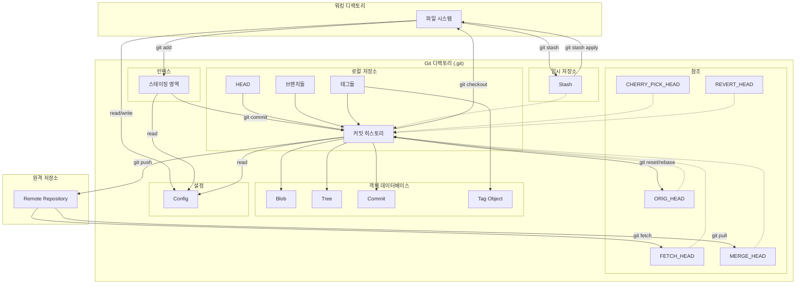

# Git

- [Git](#git)
    - [Git의 기본 구조](#git의-기본-구조)
        - [객체 저장소 (Object Store)](#객체-저장소-object-store)
            - [**블롭 (Blob)**](#블롭-blob)
            - [**트리 (Tree)**](#트리-tree)
            - [**커밋 (Commit)**](#커밋-commit)
            - [**태그 (Tag)**](#태그-tag)
        - [인덱스 (Index)](#인덱스-index)
        - [저장소 (Repository)](#저장소-repository)
        - [레퍼런스 (Refs)](#레퍼런스-refs)
        - [브랜치 (Branch)](#브랜치-branch)
        - [`HEAD`](#head)
    - [Git 객체 저장소](#git-객체-저장소)
    - [Git 디렉토리의 구조](#git-디렉토리의-구조)
    - [Git Ref(레퍼런스)](#git-ref레퍼런스)
        - [1. refs/heads](#1-refsheads)
        - [2. refs/remotes](#2-refsremotes)
        - [3. refs/tags](#3-refstags)
        - [4. refs/stash](#4-refsstash)
        - [5. refs/notes](#5-refsnotes)
        - [6. `HEAD`](#6-head)
        - [7. `ORIG_HEAD`](#7-orig_head)
        - [8. `FETCH_HEAD`](#8-fetch_head)
        - [9. `MERGE_HEAD`](#9-merge_head)
        - [10. `REBASE_HEAD`](#10-rebase_head)
        - [11. `CHERRY_PICK_HEAD`](#11-cherry_pick_head)
        - [레퍼런스 확인 방법](#레퍼런스-확인-방법)
    - [직접 확인하기](#직접-확인하기)
        - [1. 로컬 브랜치 확인](#1-로컬-브랜치-확인)
        - [2. 원격 브랜치 확인](#2-원격-브랜치-확인)
        - [3. 태그 확인](#3-태그-확인)
    - [레퍼런스를 파일로 직접 확인](#레퍼런스를-파일로-직접-확인)
        - [예시](#예시)

## Git의 기본 구조

Git의 워킹 트리, 인덱스, 저장소의 관계



1. **워킹 디렉토리**:
    실제 파일들이 존재하는 공간입니다.

    - `git add`: 워킹 디렉토리 -> 인덱스로 파일이 이동
    - `git checkout`: 로컬 저장소 -> 워킹 디렉토리로 파일이 이동

2. **Git 디렉토리 (.git)**:
    모든 Git 관련 정보가 저장되는 디렉토리입니다. 다음 요소들을 포함합니다:

    a. **인덱스 (스테이징 영역)**:

    - `git add`를 통해 워킹 디렉토리에서 인덱스로 파일이 이동합니다. 워킹 디렉토리에서 변경사항을 받아 다음 커밋을 준비합니다.
    - `git commit`으로 인덱스의 내용을 로컬 저장소에 커밋합니다.

    b. **로컬 저장소**:

    - 커밋 히스토리: 모든 커밋된 변경사항을 저장합니다.
    - `HEAD`: 현재 체크아웃된 커밋을 가리킵니다.
    - 브랜치들: 각 브랜치의 최신 커밋을 가리킵니다.
    - 태그들: 특정 커밋에 대한 이름표 역할을 합니다.

    c. **참조**:

    - `HEAD`: 현재 체크아웃된 브랜치 또는 커밋을 가리킵니다. "분리된 `HEAD`" 상태에서는 특정 커밋을 직접 가리킬 수 있습니다.
    - `ORIG_HEAD`: 위험한 작업(예: merge, reset) 전의 `HEAD` 위치를 저장하여, 작업을 쉽게 되돌릴 수 있게 합니다.
    - `FETCH_HEAD`: 가장 최근에 fetch한 브랜치의 끝을 가리킵니다. git pull 명령은 이를 사용하여 merge를 수행합니다.
    - `MERGE_HEAD`: merge 작업 중 병합 대상 브랜치의 `HEAD`를 가리킵니다.
    - `CHERRY_PICK_HEAD`: cherry-pick 작업 중 적용할 커밋을 가리킵니다.
    - `REVERT_HEAD`: revert 작업 중 되돌릴 커밋을 가리킵니다.

    d. **임시 저장소**:

    - Stash: 작업 중인 변경사항을 임시로 저장합니다.

    e. **객체 데이터베이스**:

    - Blob: 파일의 내용을 저장합니다.
    - Tree: 디렉토리 구조와 blob에 대한 참조를 저장합니다.
    - Commit: 특정 시점의 프로젝트 스냅샷을 나타냅니다.
    - Tag Object: 태그에 대한 추가 메타데이터를 저장합니다.

3. **원격 저장소**:

    네트워크를 통해 접근 가능한 별도의 Git 저장소입니다.

상호작용과 관계:

1. **워킹 디렉토리 ↔ 인덱스**:
   - `git add`로 변경사항을 스테이징합니다.
   - `git reset`으로 스테이징된 변경사항을 취소할 수 있습니다.

2. **인덱스 ↔ 로컬 저장소**:
   - `git commit`으로 스테이징된 변경사항을 저장소에 커밋합니다.

3. **로컬 저장소 ↔ 워킹 디렉토리**:
   - `git checkout`으로 특정 커밋이나 브랜치의 상태를 워킹 디렉토리에 반영합니다.

4. **로컬 저장소 ↔ 원격 저장소**:
   - `git push`로 로컬 변경사항을 원격으로 전송합니다.
   - `git fetch`로 원격의 변경사항을 로컬로 가져옵니다 (`FETCH_HEAD` 업데이트).
   - `git pull`은 `git fetch` 후 `git merge`를 수행합니다.

5. **`HEAD`, 브랜치, 태그 ↔ 커밋 히스토리**:
   - 이들은 모두 특정 커밋을 가리키는 포인터 역할을 합니다.

6. **`ORIG_HEAD`, `FETCH_HEAD`, `MERGE_HEAD` ↔ 커밋 히스토리**:
   - 특정 Git 작업 중에 참조되는 특수한 포인터입니다.

7. **Stash ↔ 워킹 디렉토리**:
   - `git stash`로 작업 중인 변경사항을 임시 저장합니다.
   - `git stash apply`로 저장된 변경사항을 다시 워킹 디렉토리에 적용합니다.

8. **객체 데이터베이스 ↔ 로컬 저장소**:
   - 모든 커밋, 파일 내용, 디렉토리 구조가 객체로 저장됩니다.
   - 커밋 객체는 트리 객체를 참조하고, 트리 객체는 blob 객체를 참조합니다.

이러한 관계와 상호작용은 대부분 순차적으로 이루어지지만, 일부 작업은 병렬적으로 수행될 수 있습니다. 예를 들어:

- 여러 브랜치에서 동시에 작업할 수 있습니다.
- `git fetch`는 원격 저장소의 변경사항을 가져오는 동안 로컬 작업을 계속할 수 있습니다.
- Stash를 사용하면 현재 작업을 중단하지 않고 다른 작업을 수행할 수 있습니다.

이 구조를 이해하면 Git의 내부 작동 원리를 더 명확히 파악할 수 있으며, 복잡한 Git 작업을 수행할 때 각 요소들이 어떻게 상호작용하는지 예측할 수 있습니다.

### 객체 저장소 (Object Store)

객체 저장소는 블롭, 트리, 커밋, 태그 객체로 구성되어 각 파일의 내용과 변경 이력을 관리합니다.

#### **블롭 (Blob)**

- 파일의 내용 자체를 저장하는 객체.
- 파일의 해시값을 키로 하여 저장됩니다.
- 중복 파일을 방지하기 위해 동일한 내용의 파일은 동일한 블롭 객체로 관리됩니다.

#### **트리 (Tree)**

- 디렉토리 구조를 나타내는 객체.
- 트리 객체는 블롭과 다른 트리 객체에 대한 포인터를 포함합니다.
- 파일 시스템의 스냅샷을 제공하며, 파일의 이름과 모드를 저장합니다.

#### **커밋 (Commit)**

커밋은 특정 시점에서의 프로젝트 상태를 나타내는 스냅샷입니다.
각 커밋은 고유한 SHA-1 해시를 가지며 다음과 같은 정보들을 포함합니다:
- 내용
- 시간
- 부모 커밋을 가리키는 포인터
- 변경 사항
- 작성자 정보
- 커밋 메시지 등

커밋은 연속적인 스냅샷으로 프로젝트의 역사(history)를 만듭니다.
프로젝트의 변경 이력을 관리하며, 브랜치의 포인터가 가리키는 대상이 됩니다.

**예시**:
- 커밋 해시: `d1e2a3b4c5d6e7f8g9h0i1j2k3l4m5n6o7p8q9r0`
- 부모 커밋: `parent: abcdef1234567890abcdef1234567890abcdef12`
- 작성자: `Author: John Doe <john.doe@example.com>`
- 커밋 메시지: `Initial commit`

참고로 리베이스 과정에서 커밋 내용이 변경되면 새로운 해시가 생성되므로, 이전 커밋과의 연결이 끊어집니다.

#### **태그 (Tag)**

- 특정 커밋에 대한 고정된 레이블을 나타내는 객체.
- 주로 소프트웨어 릴리즈를 표시하는 데 사용됩니다.
- 가벼운 태그는 단순히 커밋을 가리키지만, 주석이 있는 태그는 태그 객체를 통해 추가 메타데이터를 포함할 수 있습니다.

### 인덱스 (Index)

인덱스(Index)는 변경된 파일들을 커밋하기 전에 스테이징하는 중간 단계입니다.
- `git add`: 변경된 파일을 인덱스에 추가
- `git commit`: 인덱스의 내용을 커밋하여 저장소에 기록

이 과정을 통해 작업 디렉토리와 객체 저장소 간의 중간 상태를 유지하여 파일의 변경 이력을 효율적으로 관리할 수 있습니다.

인덱스는 `.git/index` 파일에 저장됩니다.

인덱스(스테이징 영역)는 다음과 같은 역할을 합니다:

1. **변경사항 추적**

    `git add` 명령을 통해 워킹 디렉토리의 변경사항을 인덱스에 기록합니다.
    이는 파일의 현재 상태를 스냅샷으로 저장하는 것과 같습니다.

    즉, 커밋하기 전에 변경된 파일들을 스테이징 영역에 저장하는데,
    이는 다음 커밋에 포함될 변경사항들의 스냅샷입니다.

2. **커밋 준비**

    인덱스는 다음 커밋에 포함될 파일들의 상태를 저장합니다.

    "다음 커밋을 준비"합니다. 이 "다음 커밋을 준비"한다는 것은 다음과 같은 중간 단계들을 제공한다는 의미입니다:
    1. **변경사항 선택**: 사용자가 커밋하고 싶은 변경사항만을 선택적으로 `git add`를 통해 인덱스에 추가할 수 있습니다.
    2. **커밋 내용 미리보기**: 인덱스의 상태는 다음 커밋에 포함될 내용을 정확히 반영합니다. `git status` 명령을 통해 이를 확인할 수 있습니다.
    3. **부분 커밋 가능**: 하나의 파일에서 여러 변경을 했을 때, 그 중 일부만 선택적으로 커밋할 수 있게 해줍니다.
    4. **커밋 전 최종 확인**: 실제 커밋을 생성하기 전에 변경사항을 검토하고 수정할 수 있는 기회를 제공합니다.

3. **중간 저장소 역할**:

    워킹 디렉토리와 저장소(repository) 사이의 중간 지점 역할을 합니다.

예를 들어:

```bash
# 파일 수정 후
$ git add file1.txt  # file1.txt의 변경사항을 인덱스에 추가
$ git add file2.txt  # file2.txt의 변경사항을 인덱스에 추가
# 이 시점에서 인덱스는 file1.txt와 file2.txt의 현재 상태를 "다음 커밋을 위해 준비"한 상태

$ git status  # 인덱스의 상태 확인
# 이를 통해 다음 커밋에 포함될 변경사항을 미리 볼 수 있음

$ git commit  # 실제로 커밋을 생성
# 이 때 커밋되는 내용은 인덱스에 준비된 상태 그대로임
```

### 저장소 (Repository)

저장소는 Git의 모든 데이터를 포함하고 있으며, 이는 **객체 저장소**와 **레퍼런스**로 나뉩니다.

- 모든 Git 데이터와 메타데이터를 포함하는 디렉토리입니다.
- `.git` 디렉토리 안에 객체 저장소, 인덱스, 설정 파일 등이 포함되어 있습니다.
- Git 프로젝트의 루트 디렉토리를 가리키며, 모든 버전 관리 데이터가 저장됩니다.

### 레퍼런스 (Refs)

레퍼런스는 브랜치와 태그를 통해 특정 커밋을 가리킵니다.

- 브랜치, 태그, 원격 저장소 등 다양한 참조를 나타내는 파일입니다.
- 브랜치의 최신 커밋을 가리키는 포인터 역할을 합니다.
- 다양한 레퍼런스 타입이 있으며, 다음과 같은 경로들에서 관리됩니다.
    - `refs/heads/`
    - `refs/tags/`
    - `refs/remotes/`

### 브랜치 (Branch)

- 특정 커밋을 가리키는 이동 참조입니다.
- 새로운 커밋이 추가되면 브랜치의 포인터가 업데이트됩니다.
- 메인 브랜치(예: `main`, `master`)와 기능 브랜치(feature branches)로 나눌 수 있습니다.

### `HEAD`

- 현재 체크아웃된 브랜치를 가리키는 참조입니다.
- 직접적으로 커밋을 가리킬 수도 있으며, 이 경우 `detached HEAD` 상태가 됩니다.
- 작업 디렉토리와 인덱스의 현재 상태를 반영합니다.

Git의 구조는 크게 다음과 같이 나뉩니다.
- **저장소(repository)**

    저장소는 Git에서 모든 데이터와 메타데이터를 포함하는 최상위 개념입니다.
    `.git` 디렉토리가 있는 곳이 Git 저장소입니다.
    이 디렉토리 안에는 Git이 버전 관리를 위해 사용하는 모든 데이터와 객체가 저장됩니다.

- **트리(tree)**

    트리는 Git의 디렉토리 구조를 나타내는 객체입니다.
    트리는 하나 이상의 블롭이나 하위 트리를 포함할 수 있습니다.
    트리는 *각 파일이나 디렉토리의 이름*과 *모드*를 저장하고, *해당 파일이나 디렉토리의 해시*를 가리킵니다.

    **예시**:
    - `040000 tree 27b4e9a2f3173d8c6e1a9b2d8e4e1a9b2d8e4e1a`
    - `100644 blob 9daeafb9864cf43055ae93beb0afd6c7d144bfa4    README.md`

- **블롭(blob)**

    블롭은 파일의 내용을 저장하는 객체입니다.
    블롭 객체는 파일의 데이터만 포함하며, 파일 이름이나 메타데이터는 포함하지 않습니다.
    블롭은 *파일의 실제 콘텐츠를 저장하는 역할*을 합니다.

    **예시**:
    - `100644 blob 9daeafb9864cf43055ae93beb0afd6c7d144bfa4`

- **태그(tag)**

    태그는 특정 커밋에 대한 고정된 참조입니다.
    태그는 릴리스 버전과 같은 중요한 시점을 표시하는 데 사용됩니다.
    태그는 주로 두 가지 유형이 있습니다:
    - **경량 태그 (Lightweight Tag)**: 단순히 특정 커밋을 가리킵니다.
    - **주석 태그 (Annotated Tag)**: 주석, 작성자, 날짜 등의 추가 메타데이터를 포함합니다.

    **예시**:
    - `v1.0.0`

- **레퍼런스(refs)**

    레퍼런스는 커밋, 브랜치, 태그, 원격 브랜치 등을 가리키는 포인터입니다.

- **브랜치(branch)**

    브랜치는 단순히 *특정 커밋을 가리키는 가리키는 포인터*입니다.
    브랜치는 새로운 기능 개발이나 버그 수정을 위한 *독립된 작업 공간을 제공*합니다.
    브랜치는 `HEAD` 포인터를 통해 현재 작업 중인 브랜치를 가리킵니다.

    **예시**:
    - `refs/heads/master`
    - `refs/heads/feature-branch`

- **`HEAD`**

    `HEAD`는 *현재 체크아웃된 브랜치를 가리키는 특별한 레퍼런스*입니다.
    보통 현재 작업 중인 브랜치의 최신 커밋을 가리킵니다.
    `HEAD`가 가리키는 브랜치의 변경 사항이 실제로 작업 디렉토리에 반영됩니다.

    **예시**:
    - `ref: refs/heads/master`

## Git 객체 저장소

Git은 데이터를 네 가지 주요 객체 형식으로 저장합니다. 각 객체는 고유한 SHA-1 해시로 식별됩니다.
- 블롭(blob): 파일의 콘텐츠를 저장합니다.
- 트리(tree): 디렉토리 구조와 블롭 및 하위 트리에 대한 포인터를 저장합니다.
- 커밋(commit): 특정 트리 객체를 가리키며, 부모 커밋, 작성자 정보, 커밋 메시지를 포함합니다.
- 태그(tag): 특정 커밋을 가리키는 태그 객체를 저장합니다.

## Git 디렉토리의 구조

```bash
.git/
├── `HEAD`        # 현재 체크아웃된 브랜치를 가리킵니다.
├── config      # 저장소의 설정 파일입니다.
├── description
├── hooks/
├── info/
├── objects/    # Git 객체가 저장되는 디렉토리입니다.
│   ├── info/
│   └── pack/
├── refs/       # 브랜치, 태그 및 기타 레퍼런스를 저장합니다.
│   ├── heads/
│   ├── remotes/
│   └── tags/
└── index
```

## Git Ref(레퍼런스)

Git에서 사용하는 모든 레퍼런스 구조를 이해하는 것은 버전 관리의 기본적인 작업 흐름을 이해하는 데 도움이 됩니다.
레퍼런스는 커밋, 브랜치, 태그, 원격 브랜치 등을 가리키는 포인터입니다.
Git의 레퍼런스 구조는 다양한 형태를 취할 수 있으며, 이들 모두를 이해하는 것은 Git의 강력한 기능을 최대한 활용하는 데 중요합니다.
아래에서는 가능한 모든 레퍼런스의 구조를 설명합니다.

### 1. refs/heads

**로컬 브랜치**들을 저장합니다.
각 파일은 브랜치 이름을 가지며, 그 내용은 해당 브랜치가 가리키는 커밋 해시입니다.

**예시**:
- `refs/heads/master`
- `refs/heads/feature-branch`

```sh
$ ls .git/refs/heads
feature-branch  master

$ cat .git/refs/heads/master
d1e2a3b4c5d6e7f8g9h0i1j2k3l4m5n6o7p8q9r0
```

### 2. refs/remotes

**원격 브랜치**들을 저장합니다.
원격 저장소의 이름을 디렉토리로 사용하고, 그 안에 각 브랜치의 이름을 파일 이름으로 사용합니다.

**예시**:
- `refs/remotes/origin/master`
- `refs/remotes/origin/feature-branch`

```sh
$ ls .git/refs/remotes/origin
`HEAD`  master  feature-branch

$ cat .git/refs/remotes/origin/master
a1b2c3d4e5f6g7h8i9j0k1l2m3n4o5p6q7r8s9t0
```

### 3. refs/tags

**태그**들을 저장합니다. 각 파일은 태그 이름을 가지며, 그 내용은 해당 태그가 가리키는 커밋 해시입니다.

**예시**:
- `refs/tags/v1.0`
- `refs/tags/release-2022`

```sh
$ ls .git/refs/tags
v1.0  release-2022

$ cat .git/refs/tags/v1.0
9e8d7c6b5a4d3f2e1b0c1d2e3f4g5h6i7j8k9l0m
```

### 4. refs/stash

**stash** 저장소를 위한 특별한 레퍼런스입니다. Git stash 명령으로 생성된 임시 저장된 변경 사항을 가리킵니다.

**예시**:
- `refs/stash`

```sh
$ cat .git/refs/stash
e1d2c3b4a5f6e7d8c9b0f1e2a3b4c5d6e7f8g9h0
```

### 5. refs/notes

**노트** 저장소를 위한 레퍼런스입니다. 커밋에 대한 추가 정보를 저장할 때 사용됩니다.

**예시**:
- `refs/notes/commits`

```sh
$ ls .git/refs/notes
commits

$ cat .git/refs/notes/commits
f1e2d3c4a5b6c7d8e9f0a1b2c3d4e5f6a7b8c9d0
```

### 6. `HEAD`

**현재 체크아웃된 커밋**을 가리키는 특별한 레퍼런스입니다. 보통 현재 브랜치를 가리킵니다.

**예시**:
- `HEAD`

```sh
$ cat .git/`HEAD`
ref: refs/heads/master
```

### 7. `ORIG_HEAD`

**이전 `HEAD`**를 가리킵니다.
보통 리베이스, 병합, 리셋 등의 작업을 수행하기 전의 커밋을 가리킵니다.

**예시**:
- `ORIG_HEAD`

```sh
$ cat .git/`ORIG_HEAD`
d1e2a3b4c5d6e7f8g9h0i1j2k3l4m5n6o7p8q9r0
```

### 8. `FETCH_HEAD`

**가장 최근에 fetch된 커밋**을 가리킵니다.
원격 저장소에서 데이터를 가져올 때 사용됩니다.

**예시**:
- `FETCH_HEAD`

```sh
$ cat .git/`FETCH_HEAD`
a1b2c3d4e5f6g7h8i9j0k1l2m3n4o5p6q7r8s9t0
```

### 9. `MERGE_HEAD`

**병합 도중 병합 대상 브랜치**를 가리킵니다. 병합 충돌이 발생했을 때 사용됩니다.

**예시**:
- `MERGE_HEAD`

```sh
$ cat .git/`MERGE_HEAD`
f1e2d3c4a5b6c7d8e9f0a1b2c3d4e5f6a7b8c9d0
```

### 10. `REBASE_HEAD`

**리베이스 도중 현재 리베이스된 커밋**을 가리킵니다. 리베이스 중에 사용됩니다.

**예시**:
- `REBASE_HEAD`

```sh
$ cat .git/rebase-apply/head-name
refs/heads/feature-branch
```

### 11. `CHERRY_PICK_HEAD`

**체리픽 도중 체리픽 대상 커밋**을 가리킵니다. 체리픽 중에 사용됩니다.

**예시**:
- `CHERRY_PICK_HEAD`

```sh
$ cat .git/`CHERRY_PICK_HEAD`
a1b2c3d4e5f6g7h8i9j0k1l2m3n4o5p6q7r8s9t0
```

### 레퍼런스 확인 방법

Git에서 레퍼런스를 직접 확인하기 위해 `.git` 디렉토리 내의 파일을 탐색할 수 있습니다.

1. **레퍼런스 디렉토리 탐색**:

    ```sh
    $ ls .git/refs
    heads/  remotes/  tags/  stash/  notes/
    ```

2. **특정 레퍼런스 파일 내용 확인**:

    ```sh
    $ cat .git/refs/heads/master
    d1e2a3b4c5d6e7f8g9h0i1j2k3l4m5n6o7p8q9r0
    ```

## 직접 확인하기

Git의 내부 구조를 직접 확인하려면 `.git` 디렉토리 내의 `refs` 디렉토리를 탐색할 수 있습니다.

### 1. 로컬 브랜치 확인

```sh
cat .git/refs/heads/master
```

이 명령어는 `master` 브랜치가 가리키는 커밋 해시를 출력합니다.

### 2. 원격 브랜치 확인

```sh
cat .git/refs/remotes/origin/master
```

이 명령어는 원격 저장소 `origin`의 `master` 브랜치가 가리키는 커밋 해시를 출력합니다.

### 3. 태그 확인

```sh
cat .git/refs/tags/v1.0
```

이 명령어는 `v1.0` 태그가 가리키는 커밋 해시를 출력합니다.

## 레퍼런스를 파일로 직접 확인

Git의 레퍼런스는 `.git` 디렉토리 내부의 파일로 저장됩니다. 각 파일에는 해당 레퍼런스가 가리키는 커밋 해시가 저장되어 있습니다. 예를 들어, `.git/refs/heads/master` 파일의 내용은 `master` 브랜치가 가리키는 커밋 해시입니다.

### 예시

```sh
$ ls .git/refs/heads
feature-branch master

$ cat .git/refs/heads/master
d1e2a3b4c5d6e7f8g9h0i1j2k3l4m5n6o7p8q9r0
```

위의 명령어는 `master` 브랜치가 커밋 `d1e2a3b4c5d6e7f8g9h0i1j2k3l4m5n6o7p8q9r0`를 가리키고 있음을 보여줍니다.
