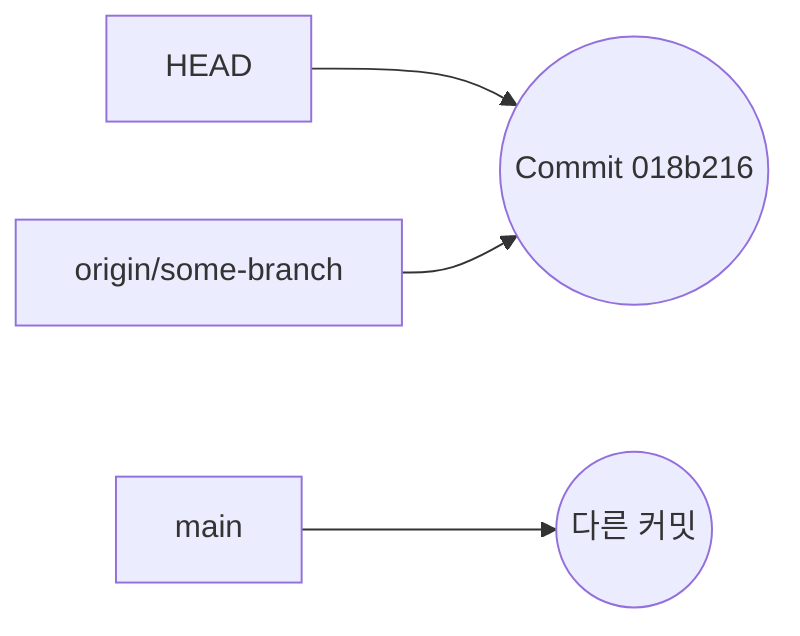
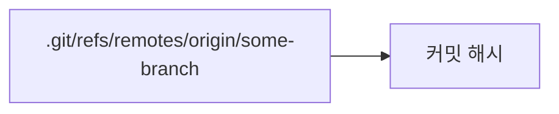
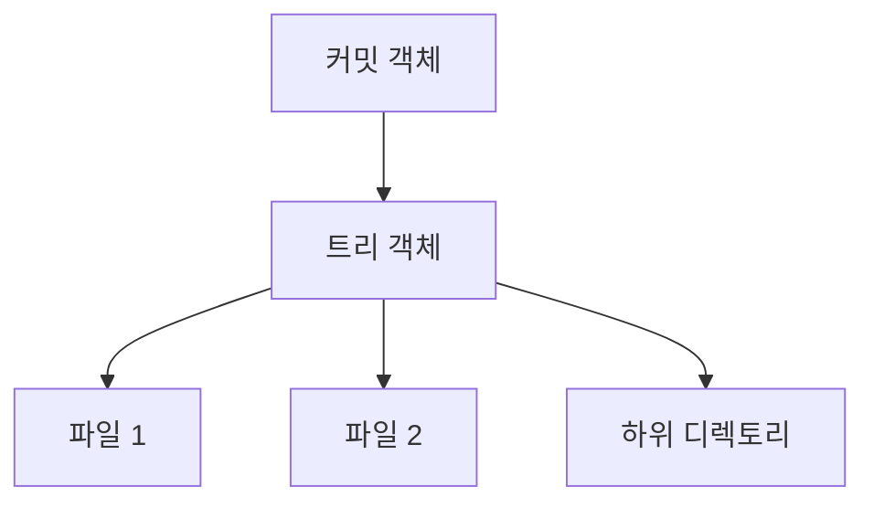
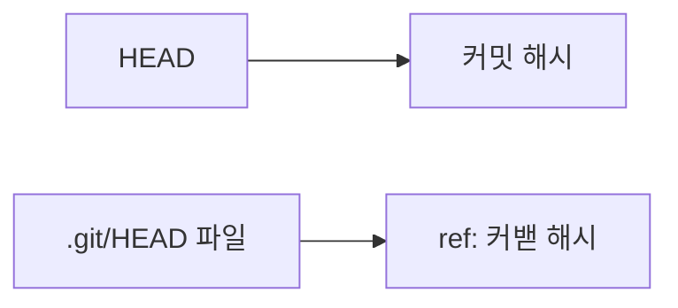

# Git checkout

## You are in 'detached `HEAD`' state

`git clone` 후 `git checkout origin/some-branch` 시 아래와 같은 메시지가 출력됩니다.

```sh
Note: switching to 'origin/some-branch '.

You are in 'detached HEAD' state. You can look around, make experimental
changes and commit them, and you can discard any commits you make in this
state without impacting any branches by switching back to a branch.

If you want to create a new branch to retain commits you create, you may
do so (now or later) by using -c with the switch command. Example:

  git switch -c <new-branch-name>

Or undo this operation with:

  git switch -

Turn off this advice by setting config variable advice.detachedHead to false

HEAD is now at 018b216 someapi/repository: Fix `go test`
```

Git에서 `HEAD`는 현재 작업 중인 커밋을 가리키는 포인터입니다.
일반적으로 `HEAD`는 현재 체크아웃된 브랜치의 최신 커밋을 가리킵니다.

브랜치는 특정 커밋을 가리키는 이동 가능한 포인터입니다.
브랜치는 일련의 커밋들을 하나의 작업 흐름으로 관리하는 데 사용됩니다.

"Detached `HEAD`" 상태는 `HEAD`가 특정 브랜치가 아닌 특정 커밋을 직접 가리키는 상태를 말합니다.

아래는 이 상황을 시각화한 다이어그램입니다:



- `HEAD`는 직접 커밋 `018b216`을 가리킵니다.
- `origin/some-branch`도 같은 커밋을 가리키지만, `HEAD`와 직접 연결되지 않습니다.
- `main` 등의 다른 로컬 브랜치는 다른 커밋을 가리킵니다.

`git checkout origin/some-branch` 명령을 실행할 때 아래와 같은 작업들이 이뤄집니다:

1. Git은 `origin/some-branch` 원격 브랜치가 가리키는 커밋을 찾습니다. 원격 브랜치는 로컬에서 직접 수정할 수 없는 읽기 전용 참조입니다.
2. 해당 커밋의 내용을 작업 디렉토리에 반영합니다.
3. `HEAD`를 해당 커밋에 직접 연결합니다. 하지만 브랜치를 통하지는 않습니다.
4. Git은 이 원격 브랜치가 가리키는 커밋으로 `HEAD`를 이동시키지만, 실제 브랜치를 생성하지는 않습니다.

Git의 내부 동작을 의사 코드로 표현하면 다음과 같습니다:

```go
type Commit struct {
    Hash    string
    Message string
    Parent  *Commit
}

type Branch struct {
    Name   string
    Commit *Commit
}

type HEAD struct {
    RefName string  // 브랜치 이름 또는 "detached"
    Commit  *Commit
}

func checkout(ref string) {
    if isRemoteBranch(ref) {
        commit := getCommitFromRemoteBranch(ref)
        setHEAD("detached", commit)
        updateWorkingDirectory(commit)
    } else if isLocalBranch(ref) {
        branch := getLocalBranch(ref)
        setHEAD(branch.Name, branch.Commit)
        updateWorkingDirectory(branch.Commit)
    }
}

func setHEAD(refName string, commit *Commit) {
    HEAD = HEAD{
        RefName: refName,
        Commit:  commit,
    }
}

func updateWorkingDirectory(commit *Commit) {
    // 작업 디렉토리를 commit의 상태로 업데이트
}
```

이 의사 코드에서:
1. `checkout` 함수는 주어진 참조(브랜치 또는 커밋)로 전환합니다.
2. 원격 브랜치인 경우, `HEAD`를 "detached" 상태로 설정하고 해당 커밋을 직접 가리킵니다.
3. 로컬 브랜치인 경우, `HEAD`를 해당 브랜치로 설정합니다.

"detached `HEAD`" 상태는 특정 커밋을 확인하거나 일시적인 실험을 할 때 유용합니다.
하지만 이 상태에서 새 커밋을 만들어도 브랜치로 전환하면 이 커밋들은 "떠돌아다니는" 상태가 됩니다.

이를 해결하기 위해서는:
- 새 브랜치 생성: `git switch -c new-branch-name`
- 기존 브랜치로 전환: `git switch existing-branch`
- 원격 브랜치의 내용을 기반으로 작업하기 위해 로컬 브랜치 생성

   ```sh
   git checkout -b local-branch-name origin/some-branch
   ```

---

네, 말씀하신 내용이 정확합니다. 이 과정을 더 자세히 살펴보고, Git의 내부 동작 원리에 대해 깊이 있게 설명하겠습니다.

## Git의 내부 동작 원리

### 1. 원격 브랜치 참조 확인



- Git은 `.git/refs/remotes/origin/some-branch` 파일을 읽어 해당 원격 브랜치가 가리키는 커밋의 해시를 확인합니다.
- 이 파일은 단순히 커밋 해시를 텍스트로 저장하고 있습니다.

### 2. 커밋 객체 로딩


- Git은 해당 해시를 사용하여 `.git/objects/` 디렉토리에서 커밋 객체를 로드합니다.
- 커밋 객체는 트리 객체(디렉토리 구조), 부모 커밋, 작성자, 커미터, 커밋 메시지 등의 정보를 포함합니다.

### 3. 작업 디렉토리 업데이트



- Git은 커밋 객체가 가리키는 트리 객체를 사용하여 작업 디렉토리를 업데이트합니다.
- 이 과정에서 기존 작업 디렉토리의 내용이 덮어씌워집니다.

### 4. HEAD 업데이트



- 일반적으로 `.git/HEAD` 파일은 현재 브랜치를 가리킵니다 (예: `ref: refs/heads/master`).
- 하지만 이 경우, Git은 HEAD를 직접 커밋 해시로 업데이트합니다.
- `.git/HEAD` 파일에 직접 커밋 해시가 기록됩니다.

## 코드로 보는 Git의 내부 동작

Git의 이러한 동작을 의사 코드로 표현하면 다음과 같습니다:

```go
type Commit struct {
    Hash    string
    TreeHash string
    Parent  []string
    Author  string
    Committer string
    Message string
}

type GitRepository struct {
    WorkingDirectory string
    ObjectStore      map[string]interface{} // 단순화를 위해 map 사용
    Refs             map[string]string
    HEAD             string
}

func (repo *GitRepository) Checkout(ref string) error {
    var commitHash string

    // 1. 원격 브랜치 참조 확인
    if strings.HasPrefix(ref, "origin/") {
        commitHash = repo.Refs["refs/remotes/"+ref]
    } else {
        return errors.New("지원되지 않는 참조 형식")
    }

    // 2. 커밋 객체 로딩
    commit, ok := repo.ObjectStore[commitHash].(Commit)
    if !ok {
        return errors.New("커밋 객체를 찾을 수 없음")
    }

    // 3. 작업 디렉토리 업데이트
    err := repo.updateWorkingDirectory(commit.TreeHash)
    if err != nil {
        return err
    }

    // 4. HEAD 업데이트
    repo.HEAD = commitHash

    return nil
}

func (repo *GitRepository) updateWorkingDirectory(treeHash string) error {
    // 트리 객체를 사용하여 작업 디렉토리 업데이트
    // (실제 구현은 더 복잡합니다)
    return nil
}

// 사용 예
repo := &GitRepository{
    WorkingDirectory: "/path/to/repo",
    ObjectStore:      make(map[string]interface{}),
    Refs:             make(map[string]string),
}

err := repo.Checkout("origin/some-branch")
if err != nil {
    log.Fatal(err)
}
```

이 의사 코드는 Git의 내부 동작을 단순화하여 보여줍니다. 실제 Git 구현은 훨씬 더 복잡하고 최적화되어 있습니다.

## 주요 포인트

1. **원격 브랜치의 특성**: 원격 브랜치는 로컬에서 직접 수정할 수 없는 읽기 전용 참조입니다. 이는 원격 저장소의 상태를 로컬에 반영하는 역할을 합니다.

2. **커밋 직접 참조**: `HEAD`가 브랜치가 아닌 커밋을 직접 가리키는 것은 Git의 유연한 설계를 보여줍니다. 이를 통해 특정 시점의 코드 상태를 쉽게 확인할 수 있습니다.

3. **브랜치 미생성**: Git이 실제 브랜치를 생성하지 않는 이유는 원격 브랜치의 상태를 변경하지 않고 그대로 유지하기 위함입니다. 이는 로컬과 원격의 상태를 명확히 구분하는 데 도움이 됩니다.

4. **성능 고려**: 이 방식은 새로운 브랜치 객체를 생성하지 않고 직접 커밋을 참조함으로써, 불필요한 객체 생성을 피하고 성능을 최적화합니다.

## 결론

Git의 이러한 동작은 분산 버전 관리 시스템으로서의 유연성과 효율성을 잘 보여줍니다. "detached HEAD" 상태는 일시적인 작업이나 특정 커밋 검토에 유용하지만, 지속적인 개발 작업을 위해서는 명시적인 로컬 브랜치 생성이 필요합니다. 이러한 Git의 내부 동작 원리를 이해함으로써, 개발자는 더 효과적으로 버전 관리 작업을 수행할 수 있습니다.
