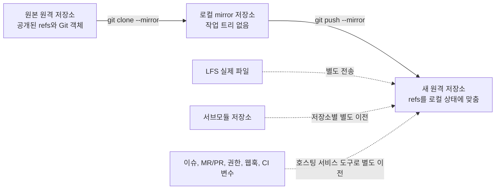

# `git clone --mirror` 결과를 새 원격 저장소에 그대로 반영하기

- [핵심 결론](#핵심-결론)
- [`--mirror`가 복사하는 것과 복사하지 않는 것](#--mirror가-복사하는-것과-복사하지-않는-것)
- [`git push --mirror`가 위험한 이유](#git-push---mirror가-위험한-이유)
- [안전한 일회성 이전 절차](#안전한-일회성-이전-절차)
- [GitLab과 GitHub의 서버 관리 ref를 만났을 때](#gitlab과-github의-서버-관리-ref를-만났을-때)
- [주기적으로 원본을 대상에 동기화하려면](#주기적으로-원본을-대상에-동기화하려면)
- [실패 상황별 판단](#실패-상황별-판단)
- [롤백과 마감 체크리스트](#롤백과-마감-체크리스트)
- [로컬에서 확인한 동작](#로컬에서-확인한-동작)
- [근거 자료](#근거-자료)

## 핵심 결론

새 원격 저장소가 비어 있고 대상 서버가 원본의 모든 ref 네임스페이스를 받아들인다면, 아래 흐름으로 Git 저장소를 이전할 수 있습니다.

```powershell
$sourceUrl = 'https://old.example.com/group/project.git'
$targetUrl = 'https://new.example.com/group/project.git'

git clone --mirror $sourceUrl project-mirror.git
Set-Location project-mirror.git

git fetch --prune origin
git fsck --full

git push --mirror --dry-run --porcelain $targetUrl
git push --mirror $targetUrl
```

그러나 `git push --mirror`는 단순히 브랜치와 태그를 추가하는 명령이 아닙니다. 로컬 `refs/` 아래의 ref를 대상에 강제로 맞추며, 로컬에 없는 대상 ref는 삭제합니다. 따라서 대상 저장소는 README, 라이선스, `.gitignore`조차 만들지 않은 빈 저장소여야 합니다. 대상에 이미 데이터가 있다면 위 명령을 실행하지 말고 먼저 별도 백업과 덮어쓰기 승인을 준비해야 합니다.

여기서 "그대로"는 Git이 관리하는 ref와 그 ref에서 도달 가능한 Git 객체가 같다는 뜻입니다. 기본 브랜치 설정, 이슈, Merge Request 또는 Pull Request, 권한, 보호 브랜치, 웹훅, CI/CD 변수, 릴리스 첨부 파일은 별도 이전 대상입니다. Git Large File Storage(LFS)의 실제 대용량 파일과 서브모듈 저장소도 별도로 옮겨야 합니다.

## `--mirror`가 복사하는 것과 복사하지 않는 것

일반 `git clone`은 원격 브랜치를 `refs/remotes/origin/*` 아래의 원격 추적 브랜치로 만듭니다. `git clone --mirror`는 다릅니다. 작업 트리가 없는 bare 저장소를 만들고, 원본이 공개하는 모든 ref를 같은 이름으로 로컬에 배치합니다.

[Git의 `git clone` 공식 문서](https://git-scm.com/docs/git-clone#Documentation/git-clone.txt---mirror)는 `--mirror`가 `--bare`를 포함하며 브랜치뿐 아니라 원격 추적 브랜치, notes 등 모든 ref를 매핑한다고 설명합니다. 또한 이후 원격 갱신이 이 ref들을 덮어쓰도록 다음 설정을 만듭니다.

```text
remote.origin.fetch=+refs/*:refs/*
remote.origin.mirror=true
```

구조를 단순화하면 다음과 같습니다.



| 대상 | mirror 이전 결과 | 이유 또는 후속 조치 |
|---|---|---|
| `refs/heads/*` 브랜치 | 복사됨 | 브랜치 ref와 도달 가능한 커밋, 트리, blob이 전송됨 |
| `refs/tags/*` 태그 | 복사됨 | lightweight tag와 annotated tag 객체가 전송됨 |
| `refs/notes/*`, 사용자 정의 ref | 원본이 공개하고 대상이 허용하면 복사됨 | 대상 서버의 ref 정책을 확인해야 함 |
| 원본 서버가 숨긴 ref | 복사되지 않음 | 클라이언트는 서버가 공개하지 않은 ref를 알 수 없음 |
| ref에서 도달할 수 없는 객체, reflog | 보장되지 않음 | ref 복제는 저장소 디렉터리의 바이트 단위 복사가 아님 |
| 원격의 symbolic `HEAD`와 기본 브랜치 설정 | 직접 복사되지 않음 | `HEAD`는 `refs/` 아래가 아니므로 대상 UI 또는 API에서 확인 |
| LFS 실제 파일 | 기본 Git push만으로는 복사되지 않음 | `git lfs fetch --all`과 `git lfs push --all` 실행 |
| 서브모듈 저장소 | 복사되지 않음 | 상위 저장소에는 gitlink 커밋과 `.gitmodules`만 들어 있음 |
| 이슈, MR/PR, 권한, 보호 규칙, 웹훅, CI/CD 변수 | 복사되지 않음 | 호스팅 서비스의 import/export 또는 API 사용 |
| 위키 | 대개 별도 저장소 | 위키가 Git 저장소라면 그 저장소를 별도로 mirror 이전 |

즉, `--mirror`는 "프로젝트 전체 이전 도구"가 아니라 "Git ref와 객체 이전 도구"입니다. 프로젝트를 완전히 옮기려면 Git 데이터와 호스팅 서비스 데이터를 나누어 다뤄야 합니다.

## `git push --mirror`가 위험한 이유

[Git의 `git push` 공식 문서](https://git-scm.com/docs/git-push#Documentation/git-push.txt---mirror)에 따르면 `--mirror`는 `refs/` 아래의 모든 ref를 대상으로 다음 세 작업을 합니다.

1. 로컬에 새로 생긴 ref를 대상에 생성합니다.
2. 같은 이름의 대상 ref가 다르면 fast-forward 여부와 관계없이 강제로 갱신합니다.
3. 대상에만 있고 로컬에는 없는 ref를 삭제합니다.

예를 들어 원본의 `main`과 대상의 `main`이 서로 다른 커밋으로 갈라졌고, 대상에만 `obsolete` 브랜치가 있다고 가정합니다. dry-run은 다음과 같은 계획을 보여 줍니다.

```text
+ refs/heads/main:refs/heads/main       (forced update)
- :refs/heads/obsolete                  [deleted]
* refs/notes/commits:refs/notes/commits [new reference]
* refs/tags/v1.0:refs/tags/v1.0         [new tag]
```

`--dry-run`은 실제 변경 없이 전송 계획을 보여 줍니다. 다만 최종 push 시점의 동시 변경, 서버 hook, 보호 규칙, 용량 제한까지 성공시킨다는 보장은 아닙니다. dry-run 통과는 사전 점검이고, 실제 push와 사후 ref 비교가 최종 검증입니다.

## 안전한 일회성 이전 절차

### 1. 이전 경계와 쓰기 중지 시점을 정한다

초기 mirror clone은 원본을 사용하는 중에도 만들 수 있습니다. 정확한 전환 시점을 만들려면 최종 `git fetch --prune origin` 직전부터 원본 저장소의 push를 잠시 막아야 합니다.

1. 새 대상 저장소를 비공개로 만들고 이전 담당자만 접근하게 합니다.
2. README, 라이선스, `.gitignore`를 자동 생성하지 않습니다.
3. 원본 쓰기를 중지합니다.
4. 원본을 마지막으로 fetch하고 대상에 push합니다.
5. ref, 기본 브랜치, LFS, 일반 clone을 검증합니다.
6. 보호 규칙과 권한을 설정한 뒤 사용자를 새 저장소로 전환합니다.

원본 쓰기를 막지 않으면 최종 fetch 뒤에 생긴 커밋은 대상에 없습니다. 이 상태는 명령이 성공했더라도 시점이 다른 두 저장소일 뿐, 같은 저장소가 아닙니다.

### 2. 원본을 mirror clone 한다

PowerShell에서는 다음과 같이 실행합니다.

```powershell
$sourceUrl = 'https://old.example.com/group/project.git'
$targetUrl = 'https://new.example.com/group/project.git'
$mirrorDir = 'project-mirror.git'

git clone --mirror $sourceUrl $mirrorDir
if ($LASTEXITCODE -ne 0) {
    throw '원본 mirror clone에 실패했습니다.'
}

Set-Location $mirrorDir
```

이 디렉터리에는 체크아웃한 소스 파일이 보이지 않습니다. bare 저장소에서는 디렉터리 자체가 일반 저장소의 `.git` 역할을 합니다.

설정과 URL을 확인합니다.

```powershell
git remote -v
git config --get-all remote.origin.fetch
git config --bool remote.origin.mirror
```

PASS 기준은 다음과 같습니다.

```text
origin의 fetch URL = 원본 URL
remote.origin.fetch = +refs/*:refs/*
remote.origin.mirror = true
```

원본과 대상 URL을 바꾸어 입력하면 이후 검증도 잘못된 저장소끼리 비교하게 됩니다. URL 확인을 생략하지 않습니다.

### 3. 원본 ref와 객체 상태를 확인한다

먼저 mirror에 들어온 ref를 확인합니다.

```powershell
git for-each-ref --format='%(objectname:short) %(refname)' | Sort-Object
```

GitLab과 GitHub 같은 호스팅 서비스의 내부 ref 후보도 따로 확인합니다.

```powershell
git for-each-ref --format='%(refname)' `
    refs/merge-requests `
    refs/pull `
    refs/environments `
    refs/keep-around `
    refs/pipelines
```

아무것도 출력되지 않으면 현재 mirror에 해당 ref가 없다는 뜻입니다. 출력이 있으면 대상 서버가 이 네임스페이스를 받을 수 있는지 확인하기 전에는 전체 mirror push를 실행하지 않습니다.

객체 연결도 검사합니다.

```powershell
git fsck --full
if ($LASTEXITCODE -ne 0) {
    throw 'mirror 저장소의 Git 객체 검사에 실패했습니다.'
}
```

`missing blob`, `bad tree`와 같은 오류는 중단 조건입니다. 반면 강제 ref 이동 뒤의 `dangling commit`은 ref가 더 이상 가리키지 않는 객체가 남았다는 뜻이므로 그 자체로 저장소 손상을 의미하지는 않습니다.

### 4. 대상이 비어 있는지 확인한다

```powershell
$targetRefs = @(git ls-remote --refs $targetUrl)
if ($LASTEXITCODE -ne 0) {
    throw '대상 원격 저장소에 접속하지 못했습니다.'
}

if ($targetRefs.Count -ne 0) {
    $targetRefs
    throw '대상 저장소가 비어 있지 않습니다. mirror push를 중단합니다.'
}
```

`git ls-remote --refs`는 원격이 공개하는 ref와 객체 ID를 출력합니다. 이 명령의 출력이 비어 있어야 이 가이드의 기본 절차를 계속할 수 있습니다.

대상에 이미 ref가 있다면 가장 단순하고 안전한 선택은 대상 저장소를 삭제 후 재생성하여 빈 상태로 만드는 것입니다. 저장소 삭제 권한이나 기존 데이터 보존 요구가 있다면 임의로 진행하지 않습니다. 최소한 다음과 같이 대상을 별도 mirror로 백업하고, 어떤 ref를 덮어쓰고 삭제할지 승인받은 뒤 별도 이전 계획을 세웁니다.

```powershell
git clone --mirror $targetUrl target-before-migration.git
```

이 백업도 대상 서버가 공개한 Git ref만 보존합니다. 이슈, 권한, CI/CD 변수 같은 호스팅 메타데이터의 백업은 아닙니다.

### 5. 원본의 마지막 상태를 가져온다

원본 쓰기를 중지한 뒤 실행합니다.

```powershell
git remote get-url origin
git fetch --prune origin
if ($LASTEXITCODE -ne 0) {
    throw '원본의 마지막 ref 동기화에 실패했습니다.'
}

git fsck --full
if ($LASTEXITCODE -ne 0) {
    throw '최종 fetch 뒤 Git 객체 검사에 실패했습니다.'
}
```

mirror clone의 fetch refspec은 `+refs/*:refs/*`입니다. 따라서 `--prune`은 원본에서 사라진 ref를 로컬 mirror에서도 제거합니다. 이 단계가 끝난 시점의 로컬 `refs/`가 대상에 반영할 기준 상태입니다.

### 6. LFS 객체를 원본에서 모두 받는다

다음 명령에 파일이 출력되면 저장소가 Git LFS를 사용합니다.

```powershell
git lfs ls-files --all
```

LFS를 사용한다면 Git ref를 push하기 전에 원본의 LFS 객체를 로컬에 모두 받습니다.

```powershell
git lfs fetch --all origin
if ($LASTEXITCODE -ne 0) {
    throw '원본의 LFS 객체 다운로드에 실패했습니다.'
}
```

`git clone --mirror`가 복사하는 Git blob에는 대용량 파일 자체가 아니라 LFS 포인터가 들어 있습니다. 이 단계를 생략하면 대상의 커밋과 ref는 맞아도 실제 파일을 checkout할 때 LFS 다운로드가 실패할 수 있습니다.

### 7. 전체 mirror push를 dry-run 한다

```powershell
git push --mirror --dry-run --porcelain $targetUrl
if ($LASTEXITCODE -ne 0) {
    throw 'mirror push dry-run에 실패했습니다.'
}
```

다음 중 하나라도 보이면 실제 push를 중단합니다.

- 빈 대상이라고 예상했는데 `[deleted]`가 출력됨
- `deny updating a hidden ref`가 출력됨
- protected branch, pre-receive hook, permission 오류가 출력됨
- 예상하지 못한 `refs/remotes/*`, `refs/pull/*`, `refs/merge-requests/*`가 push 목록에 포함됨
- 대용량 객체, 저장소 크기, quota 제한 오류가 출력됨

dry-run 전체를 읽지 않고 마지막 `Done`만 보는 것은 검증이 아닙니다. 어떤 ref가 생성, 강제 갱신, 삭제되는지를 확인해야 합니다.

### 8. 실제 mirror push를 실행한다

```powershell
git push --mirror $targetUrl
if ($LASTEXITCODE -ne 0) {
    throw 'mirror push에 실패했습니다. 사후 ref 비교로 부분 반영 여부를 확인해야 합니다.'
}
```

대상 서버가 atomic push를 지원하고 일부 ref만 반영되는 상황을 막아야 한다면 다음 명령을 사용할 수 있습니다.

```powershell
git push --mirror --atomic $targetUrl
```

`--atomic`은 모든 ref를 한 트랜잭션으로 갱신합니다. 서버가 atomic push를 지원하지 않으면 명령 전체가 실패하므로, 실제 이전 전에 같은 옵션으로 dry-run하고 서버 지원 여부를 확인합니다.

### 9. LFS 객체를 대상에 push 한다

LFS를 사용하는 저장소라면 Git mirror push 뒤에 실행합니다.

```powershell
git lfs push --all $targetUrl
if ($LASTEXITCODE -ne 0) {
    throw '대상의 LFS 객체 업로드에 실패했습니다.'
}
```

[GitHub의 저장소 복제 공식 가이드](https://docs.github.com/en/repositories/creating-and-managing-repositories/duplicating-a-repository)는 Git ref의 mirror push와 LFS 객체의 `fetch --all`, `push --all`을 별도 단계로 안내합니다. GitHub가 아닌 호스팅 서비스에서도 대상의 LFS endpoint, 인증, 저장 용량이 준비되어 있어야 합니다.

### 10. 원본과 대상의 ref 해시를 비교한다

전체 mirror push를 사용했다면 원본과 대상이 공개하는 전체 ref를 비교합니다.

```powershell
$sourceRefs = @(git ls-remote --refs origin | Sort-Object)
$targetRefs = @(git ls-remote --refs $targetUrl | Sort-Object)

$refDiff = @(Compare-Object $sourceRefs $targetRefs)
if ($refDiff.Count -ne 0) {
    $refDiff
    throw '원본과 대상의 ref 이름 또는 객체 ID가 다릅니다.'
}

'PASS: 원본과 대상의 공개된 ref가 모두 일치합니다.'
```

출력 형식은 `<객체 ID><TAB><ref 이름>`입니다. 따라서 ref 이름만 세는 것보다 이름과 객체 ID를 함께 비교해야 브랜치나 태그가 다른 커밋을 가리키는 오류를 잡을 수 있습니다.

대상 서비스가 자동으로 내부 ref를 만들거나 숨기면 전체 집합이 다를 수 있습니다. 이 경우 차이를 무시하지 말고, 각 차이가 서버 관리 ref인지와 이식해야 할 사용자 ref인지 분류합니다.

### 11. 기본 브랜치와 일반 clone을 확인한다

`git push --mirror`는 대상 저장소의 symbolic `HEAD`를 직접 설정하지 않습니다. 원본과 대상의 기본 브랜치를 비교합니다.

```powershell
git ls-remote --symref origin HEAD
git ls-remote --symref $targetUrl HEAD
```

두 저장소 모두 다음과 같이 같은 브랜치를 가리켜야 합니다.

```text
ref: refs/heads/main HEAD
```

대상이 다른 브랜치를 가리키면 호스팅 서비스의 저장소 설정에서 기본 브랜치를 수정합니다.

마지막으로 별도 디렉터리에 일반 clone을 만들어 실제 사용자의 경로를 확인합니다.

```powershell
Set-Location ..
git clone $targetUrl project-verify
git -C project-verify fsck --full
git -C project-verify branch --all
git -C project-verify tag --list
```

LFS를 사용한다면 파일 다운로드도 확인합니다.

```powershell
git -C project-verify lfs pull
```

PASS는 기본 브랜치 checkout, `git fsck --full`, 필요한 LFS 파일 다운로드가 모두 성공하는 상태입니다. mirror 디렉터리 안에서만 검사하면 일반 clone 경로의 기본 브랜치와 LFS 문제를 놓칠 수 있습니다.

## GitLab과 GitHub의 서버 관리 ref를 만났을 때

### 왜 전체 mirror push가 거부되는가

Git 호스팅 서비스는 Merge Request, Pull Request, 배포, 파이프라인을 구현하기 위해 자체 ref를 만들 수 있습니다. 사용자는 이 ref를 fetch할 수 있어도 대상 서버에 같은 이름으로 push할 권한은 없을 수 있습니다.

[GitLab의 Gitaly 문제 해결 공식 문서](https://docs.gitlab.com/administration/gitaly/troubleshooting/#repository-pushes-fail-with-a-deny-updating-a-hidden-ref-error)는 다음 네임스페이스를 읽기 전용 내부 ref로 설명합니다.

- `refs/environments/`
- `refs/keep-around/`
- `refs/merge-requests/`
- `refs/pipelines/`

이 ref가 로컬 mirror에 있으면 `git push --mirror`가 함께 전송하려 하므로 `deny updating a hidden ref`가 발생합니다. GitHub의 `refs/pull/*`도 읽기 전용이므로 같은 종류의 문제가 생길 수 있습니다.

이 오류는 브랜치 커밋이 잘못됐다는 뜻이 아닙니다. 이식할 수 없는 호스팅 서비스 내부 ref까지 "모든 `refs/`"에 포함해 push했다는 뜻입니다.

### 빈 대상에는 브랜치와 태그만 push 한다

대상 서버가 내부 ref의 mirror push를 거부한다면 portable Git 데이터의 범위를 명시합니다.

```powershell
$portableRefspecs = @(
    'refs/heads/*:refs/heads/*'
    'refs/tags/*:refs/tags/*'
)

git push --dry-run --porcelain $targetUrl $portableRefspecs
if ($LASTEXITCODE -ne 0) {
    throw '브랜치와 태그 push dry-run에 실패했습니다.'
}

git push $targetUrl $portableRefspecs
if ($LASTEXITCODE -ne 0) {
    throw '브랜치와 태그 push에 실패했습니다.'
}
```

notes도 이식해야 하고 대상이 허용한다면 refspec을 추가합니다.

```powershell
$portableRefspecs += 'refs/notes/*:refs/notes/*'
```

이 경로는 전체 mirror와 같지 않습니다. 브랜치와 태그, 선택한 notes만 이식합니다. MR/PR 내부 ref는 옮기지 않으며, MR/PR 자체는 호스팅 서비스의 import/export 또는 API로 별도 이전합니다.

대상이 비어 있지 않을 때 `--force`, `+refs/...`, `--prune`을 즉시 추가하지 않습니다. 이 옵션은 대상 이력을 덮어쓰거나 대상 전용 브랜치와 태그를 삭제할 수 있습니다. 기존 대상을 의도적으로 교체해야 한다면 대상 ref를 백업하고, 기대하는 대상 객체 ID를 고정한 `--force-with-lease` 또는 명시적 ref별 변경 계획을 별도로 검토합니다.

### 브랜치와 태그만 비교한다

선택적 push 뒤에는 같은 네임스페이스만 비교해야 합니다.

```powershell
$patterns = @('refs/heads/*', 'refs/tags/*')
$sourceRefs = @(git ls-remote --refs origin $patterns | Sort-Object)
$targetRefs = @(git ls-remote --refs $targetUrl $patterns | Sort-Object)

$refDiff = @(Compare-Object $sourceRefs $targetRefs)
if ($refDiff.Count -ne 0) {
    $refDiff
    throw '원본과 대상의 브랜치 또는 태그가 다릅니다.'
}

'PASS: 원본과 대상의 브랜치와 태그가 모두 일치합니다.'
```

notes refspec을 추가했다면 비교 패턴에도 `refs/notes/*`를 추가합니다.

## 주기적으로 원본을 대상에 동기화하려면

일회성 이전이 아니라 원본을 계속 권위 있는 저장소로 두고 대상 mirror를 갱신하려면, `origin`의 fetch URL은 원본으로 유지하고 push URL만 대상으로 분리할 수 있습니다.

```powershell
git remote set-url --push origin $targetUrl
git remote -v
```

예상 관계는 다음과 같습니다.

```text
origin (fetch) = 원본 저장소
origin (push)  = 대상 저장소
```

동기화할 때마다 반드시 원본을 먼저 기준 상태로 복원한 뒤 대상에 push합니다.

```powershell
git fetch --prune origin
git push --mirror --dry-run --porcelain origin
git push --mirror origin
```

[GitHub의 공식 mirror 동기화 절차](https://docs.github.com/en/repositories/creating-and-managing-repositories/duplicating-a-repository#mirroring-a-repository-in-another-location)도 fetch URL과 push URL을 분리하고 `git fetch -p origin` 뒤 `git push --mirror`를 실행합니다.

이 구성에서는 대상에서 직접 만든 브랜치나 태그가 다음 동기화 때 덮어써지거나 삭제될 수 있습니다. 양쪽 저장소에서 동시에 쓰는 active-active 구조가 아니라, 원본에서 대상으로 복제하는 단방향 구조입니다.

GitLab 또는 GitHub의 서버 관리 ref 때문에 전체 mirror가 불가능하다면 주기 동기화에서도 브랜치와 태그의 명시적 refspec을 사용합니다. 전체 `--mirror`와 선택적 refspec을 섞어 실행하지 않습니다.

## 실패 상황별 판단

### `deny updating a hidden ref`

원인: 호스팅 서비스가 관리하는 읽기 전용 ref까지 `--mirror`가 push하려 했습니다.

조치: 실패한 ref 이름을 확인하고, 브랜치와 태그 등 대상이 허용하는 네임스페이스만 명시적으로 push합니다. 오류가 난 전체 push가 일부 ref를 이미 반영했을 수 있으므로 사후 ref 비교를 먼저 실행합니다.

### `non-fast-forward` 또는 `fetch first`

원인: 대상이 비어 있지 않거나 이전 시도 뒤 누군가 대상에 push했습니다.

조치: 즉시 force하지 않습니다. 대상 ref를 다시 조회하고 누가 만든 커밋인지 확인합니다. 새 저장소라면 비어 있는 상태로 재생성하는 편이 가장 단순합니다.

### protected branch 또는 pre-receive hook 거부

원인: 대상의 보호 규칙이나 서버 정책이 이식하려는 ref 갱신을 막았습니다.

조치: 이전 기간에 필요한 최소 권한과 예외를 승인받아 적용합니다. 데이터 이전이 끝난 뒤 보호 규칙을 원본과 같은 수준으로 복구하고 다시 검증합니다.

### 일부 ref만 반영됨

원인: 서버가 atomic push를 지원하지 않거나 일부 ref만 정책을 통과했습니다.

조치: 원본과 대상의 ref 차이를 먼저 출력합니다. 실패 원인을 제거한 뒤 같은 기준 상태에서 다시 push합니다. 대상 서버가 지원하면 `--atomic`을 사용해 재발을 막습니다.

### 저장소는 clone되지만 LFS 파일이 내려오지 않음

원인: Git ref와 LFS 포인터만 옮겼고 LFS 객체 저장소를 옮기지 않았습니다.

조치: 원본에서 `git lfs fetch --all origin`, 대상에 `git lfs push --all <대상 URL>`을 실행한 뒤 새 clone에서 `git lfs pull`로 검증합니다.

### 기본 브랜치가 없거나 잘못 열림

원인: 대상의 symbolic `HEAD` 또는 호스팅 서비스 기본 브랜치 설정이 원본과 다릅니다.

조치: `git ls-remote --symref`로 원본과 대상을 비교하고 대상 UI 또는 API에서 기본 브랜치를 설정합니다.

### 서브모듈 checkout 실패

원인: 상위 저장소는 옮겼지만 `.gitmodules`가 가리키는 하위 저장소를 옮기지 않았거나 새 사용자가 기존 URL에 접근하지 못합니다.

조치: 각 서브모듈 저장소를 별도로 이전합니다. URL이 바뀐다면 `.gitmodules` 변경을 별도 커밋으로 남기고, 새 clone에서 `git submodule update --init --recursive`를 검증합니다.

## 롤백과 마감 체크리스트

mirror push는 원본 저장소를 변경하지 않습니다. 문제가 생겼을 때 원본을 계속 권위 있는 저장소로 유지하고 대상 사용 전환을 보류하면 데이터 손실 없이 다시 시도할 수 있습니다.

대상이 비어 있었고 아직 사용자가 쓰지 않았다면 가장 명확한 롤백은 대상 접근을 막고 저장소를 비운 뒤 다시 이전하는 것입니다. 대상에 기존 데이터가 있었다면 사전 mirror 백업에서 Git ref를 복원할 수 있지만, 호스팅 메타데이터는 별도 백업에서 복원해야 합니다.

검증이 끝날 때까지 로컬 mirror와 원본 저장소를 삭제하지 않습니다.

- [ ] 대상 저장소를 초기 파일 없이 빈 상태로 만들었다.
- [ ] 원본과 대상 URL을 사람이 다시 확인했다.
- [ ] 전환 직전에 원본 쓰기를 중지했다.
- [ ] `git fetch --prune origin`과 `git fsck --full`이 성공했다.
- [ ] 서버 관리 ref와 사용자 ref를 구분했다.
- [ ] dry-run에서 생성, 강제 갱신, 삭제 ref를 모두 검토했다.
- [ ] 실제 push 종료 코드가 0이다.
- [ ] 원본과 대상의 ref 이름과 객체 ID가 일치한다.
- [ ] 대상 기본 브랜치가 원본과 같다.
- [ ] LFS 객체와 서브모듈을 별도로 확인했다.
- [ ] 새 디렉터리의 일반 clone과 checkout이 성공했다.
- [ ] 권한, 보호 규칙, 웹훅, CI/CD 변수 등 호스팅 설정을 복원했다.
- [ ] 사용자와 자동화의 원격 URL을 대상으로 전환했다.
- [ ] 검증이 끝날 때까지 원본과 로컬 mirror를 보존했다.

## 로컬에서 확인한 동작

2026-07-30에 Windows용 Git `2.54.0.windows.1`로 다음 실험을 실행했습니다.

1. 원본 bare 저장소에 `main`, annotated tag, Git notes, 사용자 정의 `refs/meta/review`를 만들었습니다.
2. 대상에는 원본과 갈라진 `main`과 대상 전용 `obsolete` 브랜치를 만들었습니다.
3. 원본을 `git clone --mirror`로 복제했습니다.
4. `git push --mirror --dry-run`과 실제 push를 실행했습니다.
5. 원본과 대상의 `git ls-remote --refs` 결과를 비교했습니다.

관측 결과는 다음과 같습니다.

- mirror 설정은 `remote.origin.fetch=+refs/*:refs/*`, `remote.origin.mirror=true`였습니다.
- 대상의 갈라진 `main`은 forced update로 원본 커밋을 가리키게 됐습니다.
- 대상 전용 `obsolete` 브랜치는 삭제됐습니다.
- notes, annotated tag, 사용자 정의 ref가 새로 생성됐습니다.
- 원본과 대상의 공개된 ref 이름과 객체 ID 차이는 0건이었습니다.
- 대상의 이전 `main` 커밋은 `git fsck --full`에서 `dangling commit`으로 남았습니다. 이는 강제 갱신의 결과이며 객체 손상 오류는 아니었습니다.

이 실험은 로컬 bare 저장소 사이의 Git 동작을 확인한 것입니다. GitLab, GitHub, 사내 Git 서버의 권한, hook, hidden ref, quota 정책은 각 대상에서 별도로 확인해야 합니다.

## 근거 자료

- [Git `git clone` 문서: `--mirror`](https://git-scm.com/docs/git-clone#Documentation/git-clone.txt---mirror)
- [Git `git push` 문서: `--mirror`, `--dry-run`, `--atomic`](https://git-scm.com/docs/git-push)
- [Git `git ls-remote` 문서: ref와 객체 ID 조회](https://git-scm.com/docs/git-ls-remote)
- [GitLab Gitaly 문제 해결: hidden ref mirror push 거부](https://docs.gitlab.com/administration/gitaly/troubleshooting/#repository-pushes-fail-with-a-deny-updating-a-hidden-ref-error)
- [GitHub 저장소 복제: mirror와 Git LFS 이전](https://docs.github.com/en/repositories/creating-and-managing-repositories/duplicating-a-repository)
- [GitHub Pull Request 로컬 checkout: `refs/pull/*`은 읽기 전용](https://docs.github.com/en/pull-requests/collaborating-with-pull-requests/reviewing-changes-in-pull-requests/checking-out-pull-requests-locally#checking-out-pull-requests-locally)
