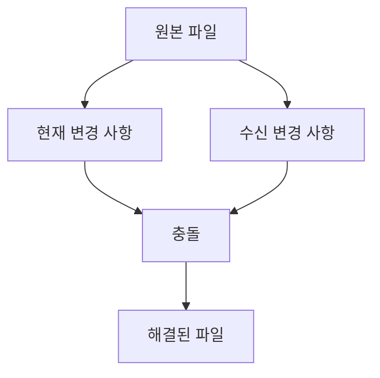
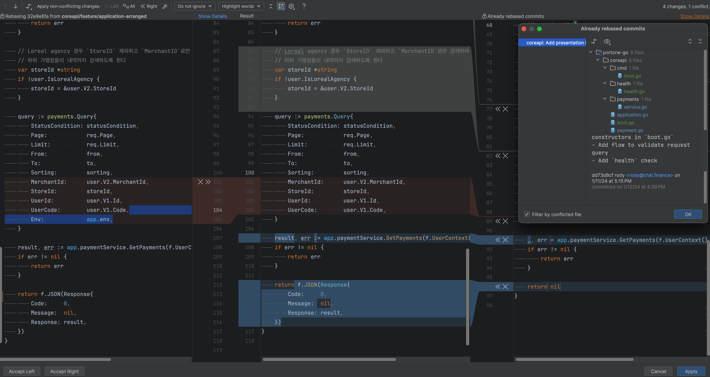
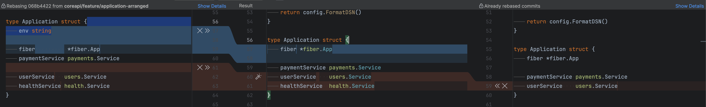
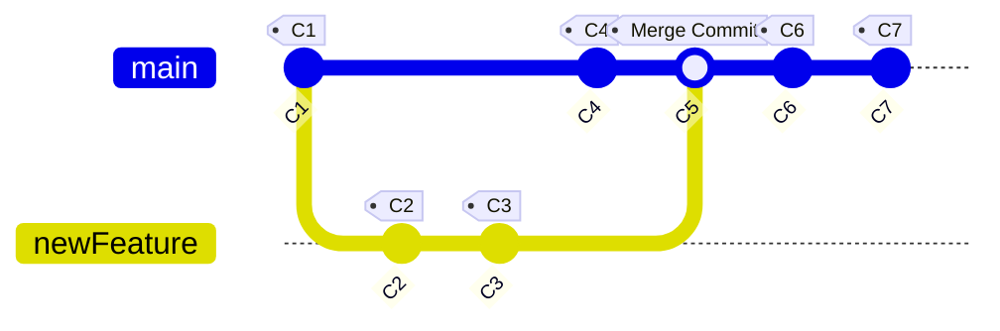

# git rebase

- [git rebase](#git-rebase)
    - [Rebase?](#rebase)
    - [리베이스와 충돌](#리베이스와-충돌)
    - [git rebase 명령어](#git-rebase-명령어)
    - [Rebase 예시](#rebase-예시)
        - [`git rebase <branch>`](#git-rebase-branch)
        - [GitHub 에서 Rebase \& Merge 과정](#github-에서-rebase--merge-과정)
    - [IntelliJ에서 리베이스시 발생한 충돌 및 해결 과정](#intellij에서-리베이스시-발생한-충돌-및-해결-과정)
        - [충돌 해결 과정 2](#충돌-해결-과정-2)
        - [squash commits](#squash-commits)
        - [리베이스 하는 커밋, 이미 리베이스 된 커밋, 그리고 결과](#리베이스-하는-커밋-이미-리베이스-된-커밋-그리고-결과)
    - [interactive rebase](#interactive-rebase)
    - [Drop commit](#drop-commit)
    - [Rebase branches](#rebase-branches)
        - [rebase 기본 동작 방식](#rebase-기본-동작-방식)
        - [rebase commands](#rebase-commands)
    - [squash commits](#squash-commits-1)
        - [HEAD 기준으로 이전 몇 개의 커밋들 스쿼시](#head-기준으로-이전-몇-개의-커밋들-스쿼시)
        - [가장 첫 커밋을 대상으로 리베이스](#가장-첫-커밋을-대상으로-리베이스)
        - [특정 커밋 이후 모두 스쿼시하기](#특정-커밋-이후-모두-스쿼시하기)
    - [git rebase 되돌리기](#git-rebase-되돌리기)
    - [머지 커밋을 포함시키면, 리베이스의 결과가 더 복잡해지고 선형적이지 않게 될 수 있다](#머지-커밋을-포함시키면-리베이스의-결과가-더-복잡해지고-선형적이지-않게-될-수-있다)
    - [Options](#options)
        - [`--onto`](#--onto)
        - [`--preserve-merges`](#--preserve-merges)
        - [`--rebase-merges`](#--rebase-merges)
    - [ETC](#etc)
        - [CLI를 사용한 Rebase 과정](#cli를-사용한-rebase-과정)
        - [Already rebased commits](#already-rebased-commits)
        - [`git commit --allow-empty`](#git-commit---allow-empty)
        - [fatal: invalid upstream](#fatal-invalid-upstream)
    - [리베이스와 reflog](#리베이스와-reflog)
    - [rebase 정리](#rebase-정리)
    - [주의사항](#주의사항)
    - [기타](#기타)

## Rebase?

Git rebase는 Git에서 브랜치를 재정렬하고 변경 내역을 재구성하는 과정입니다.
리베이스(Rebase)는 한 브랜치의 커밋을 다른 브랜치의 최신 상태 위로 이동시킵니다.
이를 통해 브랜치의 기반을 변경하거나 업데이트할 수 있습니다.
리베이스를 수행하면, 커밋의 기록이 변경됩니다.

- **커밋 히스토리 정리**

    리베이스는 커밋 히스토리를 깔끔하게 유지할 수 있도록 도와줍니다.
    병합(merge) 대신 리베이스를 사용하면, 불필요한 병합 커밋 없이 *선형적인 커밋 히스토리*를 만들 수 있습니다.

- **코드 충돌 해결**

    개발 중인 브랜치를 최신 상태로 유지하면서, *다른 브랜치에서 발생한 변경 사항을 현재 작업에 반영*할 수 있습니다.
    이는 코드 충돌을 조기에 발견하고 해결하는 데 도움이 됩니다.

`rebase`는 본질적으로 커밋 집합을 가져와서 복사하고 다른 곳에 버리는 것입니다.

> Rebasing essentially takes a set of commits, "copies" them, and plops them down somewhere else

예를 들면:

```shell
# 현재 브랜치는 bugFix
git checkout bugFix

# bugFix 브랜치의 작업(work)을 main 브랜치의 작업(work) 위로 이동시키기
git rebase main

# 이러면, 기존 bugFix에 있던 C3 커밋은 어딘가에 존재하고,
# 새로운 C3' 라는 커밋은 main 브랜치로 rebase 된 "복사본(copy)"이다 

# `main` 브랜치도 업데이트
git checkout main
git rebase bugFix
# 앞서 `bugFix` 브랜치에서 `main` 브랜치를 리베이스 했기 때문에,
# 이제 `main` 브랜치가 `bugFix` 브랜치의 부모가 되고,
# git은 단순히 `main` 브랜치 참조(reference)를 history상에서 전진 시킨다(move forward)
```

## 리베이스와 충돌

리베이스(Rebase)는 한 브랜치의 커밋을 다른 브랜치의 최신 상태 위로 이동시키는 과정을 말합니다.
여러 커밋을 하나로 합치는 squash 작업을 할 때 이전에 없었던 코드가 새로운 커밋에 포함되어 있으면 충돌이 발생할 수 있습니다.

Git에서 "현재 변경 사항"과 "수신 변경 사항"은 주로 병합(merge) 또는 리베이스(rebase) 과정에서 충돌이 발생했을 때 자주 접하게 됩니다.



- 현재 변경 사항 (Current Changes)

    현재 변경사항의 출처는 *로컬에서 직접 수정한 내용*입니다.
    현재 변경 사항은 로컬 저장소에서 작업 중인 브랜치의 최신 상태를 나타냅니다.

    - 이는 여러분이 직접 수정한 코드나 파일의 상태를 의미합니다.
    - 아직 커밋되지 않은 변경 사항이나 가장 최근에 커밋한 변경 사항을 포함할 수 있습니다.
    - Git에서는 이를 "HEAD"라고 부르기도 합니다.

    ```python
    <<<<<<< HEAD # 현재 변경 사항, 원래 파일 내용
    def greet():
        print("Hello, Git!")
    ||||||| parent of 563c2efeb (Hello, Git)
    =======
    def greet():
        print("Hello, GitHub!")
    >>>>>>> 563c2efeb (Hello, Git) # 수신 변경 사항
    ```

    여기서 "Hello, World!"를 "Hello, Git!"으로 변경한 것이 현재 변경 사항입니다.

- 수신 변경 사항 (Incoming Changes)

    수신 변경 사항의 출처는 *원격 저장소나 다른 브랜치에서 가져온 내용*입니다.
    수신 변경 사항은 원격 저장소나 다른 브랜치에서 가져온(pull) 변경 사항을 의미합니다.

    - 이는 다른 개발자가 변경하고 원격 저장소에 푸시한 내용일 수 있습니다.
    - 또는 병합하려는 다른 브랜치의 변경 사항일 수도 있습니다.
    - Git에서는 이를 "MERGE_HEAD" 또는 "REBASE_HEAD"라고 부르기도 합니다.

    예를 들어, 원격 저장소에 다음과 같은 변경 사항이 있다고 가정해 봅시다:

    ```python
    <<<<<<< HEAD # 현재 변경 사항, 원래 파일 내용
    def greet():
        print("Hello, World!")
    ||||||| parent of 563c2efeb (Hello, Git)
    =======
    def greet():
        print("Hello, GitHub!")
    >>>>>>> 563c2efeb (Hello, Git) # 수신 변경 사항
    ```

    여기서 "Hello, World!"를 "Hello, GitHub!"로 변경한 것이 수신 변경 사항입니다.

## git rebase 명령어

`git rebase` 명령어는 하나의 브랜치의 커밋들을 다른 브랜치의 커밋들 위로 다시 적용하는 작업을 수행합니다.

```shell
# git rebase <upstream> <branch>

# `test/develop` 브랜치를 `main` 브랜치의 최신 커밋들 위로 다시 적용하는 것입니다.
git rebase main test/develop
           │    └ 리베이스를 적용할 대상 브랜치(Rebasing Branch)
           │
           └ 리베이스의 기준이 되는 브랜치(Base Branch)
```

- `<upstream>`: 리베이스 **되는** 브랜치 (Base Branch, 수동적 역할)

    리베이스의 기준이 되는 브랜치입니다.
    리베이스 과정에서 다른 브랜치의 커밋들이 자신의 커밋들 위로 적용되는 브랜치입니다.
    이 브랜치의 커밋들이 기반으로 사용되며, 다른 브랜치의 커밋들이 이 위에 적용됩니다.

    ```bash
    git rebase main test/develop
               └ 리베이스 되는 브랜치
    ```

- `<branch>`: 리베이스 **하는** 브랜치 (Rebasing Branch, 능동적 역할)

    리베이스를 적용할 대상 브랜치입니다.
    리베이스 과정에서 자신의 커밋들을 기준 브랜치(`<upstream>`)의 최신 커밋 위로 재배치하는 브랜치입니다.
    이 브랜치의 커밋들이 `<upstream>` 브랜치의 커밋들 다음에 위치하게 됩니다.
    즉, `<upstream>` 브랜치의 커밋들 위로 자신의 커밋들을 다시 적용하는 능동적 역할을 수행합니다.

    예를 들어, `test/develop` 브랜치를 `main` 브랜치에 리베이스하는 경우, `test/develop` 브랜치가 리베이스하는 브랜치가 되며, `main` 브랜치의 커밋들 위로 `test/develop` 브랜치의 커밋들이 재배치됩니다.
    이를 통해 `test/develop` 브랜치가 `main` 브랜치의 최신 상태와 일치하게 됩니다.

    ```bash
    git rebase main test/develop
                    └ 리베이스 하는 브랜치
    ```

- 리베이스 전과 후

    **리베이스 전**:

    ```bash
    main:
    A---B---C

    test/develop:
    D---E---F
    ```

    **리베이스(`git rebase main test/develop`) 후**:

    ```bash
    main:
    A---B---C
              \
                D'---E'---F' (test/develop)
    ```

    `D'`, `E'`, `F'`는 `D`, `E`, `F` 커밋이 `main` 브랜치의 최신 커밋들(`A`, `B`, `C`) 위로 다시 적용된 형태입니다.

## Rebase 예시

### `git rebase <branch>`

```bash
git checkout feature/A
             └ 리베이스 하는(능동) 브랜치
git pull
git rebase main
           └ 리베이스 되는(수동) 브랜치
```

`test/develop`브랜치를 `main` 브랜치 위로 올리는 작업입니다.

- **`main` 브랜치**

    리베이스의 기준이 되는 브랜치로, 리베이스 과정에서 변경되지 않고 그대로 유지됩니다.
    `feature/A` 브랜치의 커밋들이 `main` 브랜치의 최신 커밋들 위에 적용됩니다.

- **`feature/A` 브랜치**

    리베이스를 수행하는 브랜치로, `main` 브랜치의 최신 상태로 커밋들이 이동하게 됩니다.

    이 과정에서 `feature/A` 브랜치의 커밋들은 `main` 브랜치의 커밋들 위에 재배치되어,
    마치 `feature/A` 브랜치가 `main` 브랜치의 변경 사항들을 모두 포함한 후에 추가적인 변경을 한 것처럼 보이게 됩니다.

    `feature/A` 브랜치는 `main` 브랜치의 최신 상태를 기반으로 하게 되며,
    이는 `feature/A` 브랜치가 최신 코드와 호환되도록 하고, 충돌을 해결하는 데 도움을 줍니다.

### GitHub 에서 Rebase & Merge 과정

1. 메인 브랜치 업데이트 및 임시 브랜치 생성

    먼저 메인 브랜치를 업데이트합니다.

    ```shell
    ❯ git checkout main # 메인 브랜치로 이동
    ❯ git pull # 원격 저장소의 최신 변경 사항을 가져오기
    ```

    안전한 환경에서 복잡한 리베이스 작업을 수행하고, 원본 브랜치를 보호하기 위해 임시 브랜치를 생성하고 그 브랜치로 이동합니다.

    ```bash
    ❯ git checkout -b rebase/temp-2303071821
    ```

2. `test/develop` 브랜치를 `main` 브랜치의 최신 상태로 재정렬

    `main` 브랜치의 변경 사항을 `test/develop` 브랜치에 적용합니다.

    ```shell
    ❯ git rebase main test/develop
                 │    └rebase **되는** 브랜치 
                 │
                 └rebase **하는** 브랜치 
    
    Successfully rebased and updated refs/heads/test/develop.
    ```

    - 먼저 `test/develop` 브랜치의 커밋들을 떼어냅니다.
    - 그 다음, `main` 브랜치의 커밋들 위에 `test/develop` 브랜치의 커밋들을 순서대로 다시 적용합니다.

    이 과정에서 `test/develop` 브랜치의 커밋들은 새로운 기반 위로 이동하게 됩니다

    ```bash
    # Before
    main:
    A---B---C

    test/develop:
    D---E---F

    # After
    main:
    A---B---C
              \
                D'---E'---F' (test/develop)
    ```

3. 여기부터는 Merge 과정입니다. `test/develop` 브랜치를 `main` 브랜치에 병합합니다.

    리베이스가 완료되었다면 메인 브랜치에서 병합 작업이 수행되어야 하기 때문에 메인 브랜치로 돌아갑니다.

    ```shell
    ❯ git checkout main
    ```

    `test/develop` 브랜치를 `main` 브랜치에 빠른 병합(Fast-forward) 방식으로 병합합니다.
    빠른 병합(Fast-forward) 방식의 병합은 충돌 없는 경우에만 수행됩니다.

    ```shell
    ❯ git merge --ff-only test/develop
    Updating a37aa1d..d48f5b7
    Fast-forward
    rebase-b1-b1.txt | 1 +
    rebase.txt       | 2 ++
    test_develop_A   | 1 +
    test_develop_B   | 1 +
    4 files changed, 5 insertions(+)
    create mode 100644 rebase-b1-b1.txt
    create mode 100644 rebase.txt
    create mode 100644 test_develop_A
    ```

4. 병합 후 임시 브랜치를 삭제합니다.

    ```bash
    ❯ git branch -d rebase/temp-2303071821
    ```

## IntelliJ에서 리베이스시 발생한 충돌 및 해결 과정

IntelliJ에서 리베이스를 할 때 충돌이 발생하면 *Conflicts* 모달창에 *Rebasing branch `branchA` onto branch `branchB`*라고 하면서 어떤 파일들이 충돌하는지 목록을 보여준다

*Accept Yours*, *Accept Theirs* 버튼이 있는데,
- *Yours*는 현재 `branchA` 브랜치의 로컬 작업본 의미
- *Theirs*는 리베이스되는 `branchB` 브랜치의 작업본 의미

아래 명령어는 **branchA**의 커밋들을 **branchB**의 커밋 스택 위로 옮깁니다.

```bash
git rebase branchB branchA
           │       └ 리베이스 적용 대상이 되는 브랜치, 리베이스 **하는** 브랜치
           │
           └ 리베이스 기준이 되는 브랜치, 리베이스 **되는** 브랜치
```

```plaintext
branchA:          branchB:(base)
  ┌───┐            ┌───┐
  │ D │ (최신)      │ G │ (최신)
  ├───┤            ├───┤
  │ C │            │ F │
  ├───┤            ├───┤
  │ B │            │ E │
  ├───┤            └───┘
  │ A │ (오래됨)
  └───┘

- **branchA**: A (오래됨) → B → C → D (최신)
- **branchB**: E (오래됨) → F → G (최신)
```

```bash
git checkout branchA
git rebase branchB
```

```plaintext
branchA:          branchB:(base)
  ┌───┐            ┌───┐
  │ D'│ (최신)      │ G │ (최신)
  ├───┤            ├───┤
  │ C'│            │ F │
  ├───┤            ├───┤
  │ B'│            │ E │
  ├───┤            └───┘
  │ A'│ (오래됨)
  ├───┤
  │ G │ (최신)
  ├───┤
  │ F │
  ├───┤
  │ E │ (오래됨)
  └───┘

- **branchA**: E → F → G → A' (오래됨) → B' → C' → D' (최신)
- **branchB**: E (오래됨) → F → G (최신)
```

아래는 IntelliJ에서 리베이스 과정중 충돌이 발생했을 때 충돌 해결을 하는 창을 나타냅니다.
`branchA`의 `93eccde2` 커밋을 이미 리베이스 된 커밋들과 `branchB` 커밋들 위에 올리고 있다는 것을 알 수 있습니다.

```bash
                                                                 우측 화면의 `Show Details` 버튼을 클릭하면 
                                                                 1. 이미 리베이스 된 커밋들과 
                                                                 2. `branchB` 커밋들을 볼 수 있다.
                                                                                            ⬇️        
# 좌측 화면              Show Details  # 결과 화면   # 우측 화면                              Show Details
| Rebasing 93eccde2 from `branchA`   |          | Already rebased commits and commits from `branchB`
|                                    |          |
```

- 좌측 화면: **Rebasing 93eccde2 from `branchA`**

    현재 리베이스 중인 커밋을 나타냅니다.
    `branchA` 브랜치에서 가져온 `93eccde2` 커밋이 다른 브랜치(`branchB`) 위에 적용되려고 하는 커밋임을 의미합니다.
    이 화면은 현재 진행 중인 리베이스 과정에서 어떤 커밋이 충돌의 원인인지 보여줍니다.
    즉, 현재 커밋(`93eccde2`)을 리베이스하면서 발생한 충돌임을 명시합니다.

    현재 리베이스 중인 커밋 정보 제공합니다.
    즉,리베이스할 커밋이 어떤 것인지, 이 커밋이 어디서 왔는지를 명확하게 보여줍니다.

    충돌의 원인 파악을 돕습니다.
    충돌이 발생한 커밋을 명확히 하여 사용자가 어떤 부분에서 충돌이 발생했는지를 쉽게 파악할 수 있게 합니다.

    **좌측 화면의 Show Details**:
    - 현재 리베이스 중인 커밋의 상세 정보를 제공합니다.
    - 리베이스할 커밋이 포함된 파일의 변경사항 등을 볼 수 있습니다.

- 우측 화면: **Already rebased commits and commits from `branchB`**

    이미 리베이스된 커밋들과 현재 리베이스 대상인 `branchB` 브랜치의 커밋들을 나열합니다.
    이 중 `93eccde2` 커밋과 충돌이 발생한 커밋들을 확인할 수 있습니다.

    - **Already rebased commits**: `branchA`에서 이미 리베이스된 커밋들입니다.
    - **commits from `branchB`**: 리베이스 대상 브랜치인 `branchB`(base)의 커밋들입니다.

    리베이스 진행 상황 제공합니다.
    리베이스된 커밋과 리베이스 대상 커밋을 보여주어 리베이스가 어떻게 진행되고 있는지 이해할 수 있게 합니다.

    충돌 해결을 위한 기준을 제공합니다.
    어떤 커밋들이 이미 리베이스되었고, 어떤 커밋들이 리베이스 대상인지를 확인하여 충돌 해결 시 참고할 수 있습니다.

    **우측 화면의 Show Details**:
    - 리베이스된 커밋들과 리베이스 대상 브랜치의 커밋들에 대한 상세 정보를 제공합니다.
    - 각 커밋의 변경 내역, 작성자, 날짜 등을 확인할 수 있습니다.
    - 특히 충돌이 발생한 파일과 관련된 커밋 내역을 필터링하여 볼 수 있습니다.

이 케이스에서는 `93eccde2`(`branchA`) VS (안 나오고 있지만)`92a48efe`(`branchB`) 두 커밋이 충돌하고 있다.
이때 *Accept Right*를 하면`branchB`에서 이뤄진 작업을 받아들이고, *Accept Left*를 하면 현재 브랜치의 작업을 유지한다.

```gitlog
| | * ed958ee8 (HEAD, origin/branchB, branchB) branchB: Done(Old) <---- 현재 위치
| | * 92a48efe branchB: eea
| | * c8e5d283 branchB: dde
| | * 1b4db9f8 branchB: bbb
| | * c12facb4 branchB: abc

    ============== 생략 ==============

| | * 580c0370 (branchA) branchA: Done after refactoring
| | * 536f2485 branchA: jjj
| | * 428a119d branchA: iii
| | * 4b17d4ea branchA: hhh
| | * 80786596 branchA: ggg
| | * 06d0c56f branchA: branchA: Done(New)
| | * d543a1dd branchA: eee
| | * 1e25c1f5 branchA: ddd
| | * afb1cb33 branchA: ccc
| | * 1f7618d5 branchA: bbb
| | * 93eccde2 branchA: aaa
```

그리고 충돌을 해결하고 `git rebase --continue`를 하면 커밋은 다음과 같이 진행한다

```gitlog
* f91635fa (HEAD) branchA: xxx <---- 현재 위치. Already rebased commits and commits from `branchB`에 위치.
* 7b099d0b branchA: iii
* d5d291af branchA: hhh
* 021f593e branchA: ggg
* 919e7b1e branchA: branchA: Done(New)
* 6f3cc517 
* ed958ee8 (origin/branchB, branchB) branchB: Done(Old)
* 6efa069e branchA: eee
* c3a7a2b7 
* 42beeee3 
* 9f4af0e1 
* 92a48efe branchB: eea 
* eb1a15d0 
* c8e5d283 branchB: dde
* 1b4db9f8 branchB: bbb
* c12facb4 branchB: abc

    ============== 생략 ==============

| | * 580c0370 (branchA) branchA: Done after refactoring
| | * 536f2485 branchA: jjj
| | * 428a119d branchA: iii
| | * 4b17d4ea branchA: hhh
| | * 80786596 branchA: ggg
| | * 06d0c56f branchA: branchA: Done(New)
| | * d543a1dd branchA: eee
| | * 1e25c1f5 branchA: ddd
| | * afb1cb33 branchA: ccc
| | * 1f7618d5 branchA: bbb
| | * 93eccde2 branchA: aaa
```

커밋 해시 내역을 보면 하나의 선으로 이어지면서 리베이스가 이뤄지는 것을 알 수 있다.
이때 다시 *Conflicts* 모달 창이 떴고, 파일을 머지하기 위해 충돌 해결 창을 키니 아래와 같이 나왔다.

```bash
# 좌측 화면              Show Details  # 결과 화면   # 우측 화면                              Show Details
| Rebasing 536f2485 from `branchA`   |          | Already rebased commits and commits from `branchB`
|                                    |          |
|                                    |          |
```

`536f2485` 커밋은 현재 브랜치에 있는 커밋이고, 이를 리베이스 하면서 새로운 커밋을 생성하여 올리는중에 `branchB`와 다시 충돌이 발생.

### 충돌 해결 과정 2

```bash
# 좌측 화면              Show Details  # 결과 화면   # 우측 화면                              Show Details
| Rebasing f935f14c from `branchA`   |          | Already rebased commits
|                                    |          |
```

`git checkout branchA` 후에 `git rebase -i` 사용해서 과거 코드를 수정 및 커밋한 후 `rebase --continue` 진행했는데,
*방금 과거 코드에서 수정된 부분*과 *`git rebase -i` 전에 원래 존재했던 커밋(`f935f14c`)의 코드*의 충돌이 발생한 상황입니다.

그래서 좌측 화면의 `Show Details`를 클릭하면 리베이스 전에 원래 커밋했던 변경 사항이 보이고,
우측 화면의 `Show Details`를 클릭하면 방금 `git rebase -i` 사용해서 수정 및 커밋한 변경 사항이 보입니다.

그래서 좌측 화면에는 리베이스 전에 원래 존재했던 커밋(`f935f14c`)에서 삭제했던 코드를 마찬가지로 삭제하려고 하고,
우측 화면에서는 방금 `git rebase -i` 사용해서 수정 및 커밋했지만 `f935f14c` 내용이 반영 안 돼서 삭제가 안 된 코드를 유지하려고 해서 충돌이 발생합니다.

이 경우에는 좌측에서 삭제하려던 것을 삭제하고, 우측에서 방금 `git rebase -i` 사용해서 수정 및 커밋했던 부분만 살려내야 합니다.

### squash commits



Rebasing 32e9e6fa from some-qwerty-api-service/feature/application-arranged

Already rebased commits

우측의 Already rebase commits를 결과에 반영?

우측 패널의 Show Details 보면 `some-qwerty-api-service: Add presentation layer` dd73d8cf 커밋.
좌측의 내용을 우측에 반영하기 위해 스쿼시 했는데, 중간에 우측의 커밋 내용이 들어가 있다.
이러면 좌측에 미래의 커밋에 반영된 내용이 과거에 반영되게 된다

### 리베이스 하는 커밋, 이미 리베이스 된 커밋, 그리고 결과



좌측 패널애는 `Rebasing 068b4422 from some-qwerty-api-service/feature/application-arranged`라고 나온다. 이는 현재 `some-qwerty-api-service/feature/application-arranged` 브랜치에서 시작된 rebase 작업을 수행 중이고, rebase를 하는 도중에 발생한 충돌 상태를 수정 중임을 의미한다.

중간 패널은 `Result`로 좌/우 패널 충돌을 정리한 결과이다.

우측 패널은 `Already rebased commits`로 이미 rebase 처리가 완료된 커밋들을 보여준다.

이 충돌은 `7177d4f56` 커밋과 `068b4422c` 커밋을 squash 하려고 할 때 발생했다. 이는 rebase 과정에서 `068b4422c` 커밋이 `7177d4f56` 커밋 다음으로 적용될 때, 이미 `120877e0c` 커밋에 의해 변경된 `userService` 코드와 충돌이 발생한다는 것을 나타낸다.

```log
| * 068b4422c some-qwerty-api-service/application.go: Add `env` string  // `healthService  health.Service` 있음
| * 120877e0c some-qwerty-api-service: Add `health` service             // `healthService  health.Service` 추가
... 생략 ...
| * 7177d4f56 some-qwerty-api-service: Add presentation layer           // `healthService  health.Service` 없음
|/
* 64108a755 some-qwerty-api-service/response.go: Add Response type
```

`7177d4f56` 커밋에는 `healthService health.Service`가 포함되어 있지 않았지만,
`120877e0c` 커밋에서 이 코드가 추가되었고,
`068b4422c` 커밋에도 이 코드가 여전히 존재한다

이 상황에서 `7177d4f56`와 `068b4422c`를 squash 하려고 하면, 이전에 없었던 `healthService health.Service`가 갑자기 추가되기 때문에 충돌이 발생한다.

1. `7177d4f56` 커밋은 `healthService health.Service` 코드가 없다
2. 그 사이에 있는 `120877e0c` 커밋에서 `healthService health.Service`가 추가된다
3. `068b4422c` 커밋에서 `healthService health.Service`가 여전히 존재한다
4. `7177d4f56` 커밋과 `068b4422c` 커밋을 squash 하려고 하니, `healthService health.Service`에 대한 충돌이 발생한다

이 문제를 해결하는 방법은 상황에 따라 다를 수 있습니다:
- 최종 결과에 맞게 조정: 만약 `healthService health.Service`를 유지하려는 경우, Result 창에서 이를 반영해야 합니다. 즉, 이 필드를 최종 결과에 포함시켜야 합니다.
- 특정 커밋의 변경 사항만 반영: 만약 `068b4422c` 커밋의 변경 사항만 반영하려는 경우, 해당 커밋에서 `healthService health.Service`를 제거하고, `env string`과 `env: cfg.ENV`만 추가한다

## interactive rebase

```bash
git rebase -i HEAD~3
```

```bash
pick a6c5530 thumnail image is a thumnail image
pick b3061a6 schema change to better normalize asset->thumbnail relationships
pick 92a9049 fix up commenting after refactoring. Also, don't reraise an exception during thumbnail generation - we just want to swallow the exception, log, and continue.
# Rebase 0d41907..92a9049 onto 0d41907
#
# Commands:
#  p, pick = use commit
#  r, reword = use commit, but edit the commit message
#  e, edit = use commit, but stop for amending
#  s, squash = use commit, but meld into previous commit
#  f, fixup = like "squash", but discard this commit's log message
#  x, exec = run command (the rest of the line) using shell
#
# These lines can be re-ordered; they are executed from top to bottom.
#
# If you remove a line here THAT COMMIT WILL BE LOST.
# However, if you remove everything, the rebase will be aborted.
```

## Drop commit

```bash
# 다른 변경 사항은 스테이징
# git -c core.quotepath=false -c log.showSignature=false restore --staged --worktree --source=HEAD -- go.work.sum

# 사용자가 커밋을 조정할 수 있는 인터랙티브 모드에서 리베이스를 시작하여 실제 drop commit
git -c core.quotepath=false \
    -c log.showSignature=false \
    #           Git 리베이스 중에 주석을 나타내는 데 사용되는 문자를 설정
    #        ⬇️ 보통 #이 주석 문자로 사용되지만, IntelliJ나 다른 도구에서는 다른 문자를 사용할 수도 있다
    -c core.commentChar= \
    #                  ⬆️ 여기에는 실제로 `U+0000`(ASCII 제어 문자 "Start of Header", SOH) 코드가 들어가 있다
    #                     "Start of Header"는 전송되는 메시지의 시작을 나타내는 데 사용된다
    # 기존 커밋을 새로운 기준 위로 재배치
    rebase \
    # 인터랙티브 모드를 활성화하여 사용자가 리베이스 과정을 수동으로 조정할 수 있게 한다
    --interactive \
    # 자동으로 squash 작업을 하지 않도록 설정
    --no-autosquash \
    # 리베이스할 기준 커밋
    a358471f386d4125281d81cc30f92721251e8d4b
```

```bash
# Undo Drop commit
# HEAD를 지정된 커밋으로 재설정하고, 작업 디렉토리의 변경 사항은 유지
git -c core.quotepath=false \
    -c log.showSignature=false \
    # 현재 브랜치의 HEAD를 다른 위치로 이동시킨다
    reset \
    # 현재 작업 디렉토리의 변경 사항은 유지하면서 HEAD를 이동
    --keep \
    # HEAD를 이동할 목표 커밋
    43e6f3c0698fb837806d904e4d8f1bc9973f2155
```

## [Rebase branches](https://www.jetbrains.com/help/idea/apply-changes-from-one-branch-to-another.html#rebase-branch)

### rebase 기본 동작 방식

*내 로컬 A 브랜치*를 *다른 B 브랜치* 위에 `rebase` 한다는 것은,

1. 본질적으로 *내 로컬 A 브랜치*의 커밋 히스토리를 재작성하는 것이며,
2. 그 결과 *내 로컬 A 브랜치*의 커밋 히스토리는 *내 원격 A 브랜치*의 커밋 히스토리와 달라지게 된다
3. 따라서 `git fetch`를 하면  *내 원격 A 브랜치*로부터 가져올 커밋 내역이 있다고 나오는데, 이는 리베이스 과정에서 커밋 히스토리가 재작성 됐기 때문이다

아래 리베이스 전/후를 비교해보면, 커밋 내역이 재작성 되면서 `55fc57da`, `9a573a45`, `8085be75` 커밋 해시들은 사라졌다. 다만 해당 커밋 히스토리는 원격에 아직 남아 있으므로, IDE나 Github GUI에서는 이 사라진 세 커밋을 원격 브랜치에서 받아올(pull) 수 있는 내역으로 표시한다.

재작성 했으므로 무시하고 `git push --force-with-lease` 통해서 덮어쓴다.

### rebase commands

- `git rebase <UPSTREAM> <BRANCH>`
    - `<UPSTREAM>`:
        - 상류. 즉, 현재 브랜치를 올릴 대상.
        - 생략하면 `branch.<name>.remote` 또는 `branch.<name>.merge` 옵션에 설정된 upstream 사용
    - `<BRANCH>`:
        - 작업이 이뤄질 브랜치.
        - 생략하면 현재 브랜치 기준으로 작업 진행

어떤 브랜치를 다른 브랜치 위에 `rebase`할 경우, 첫번째 브랜치로의 커밋들을 두번째 브랜치의 `HEAD` 커밋 위에 적용한다.

```shell
#                |- 1 <- 2 <- 3  (feature)
# A <- B <- C <- D               (main)
#
#                |- 1 <- 2 <- 3  (feature)
# A <- B <- C <- D <- E <- F     (main)

# `main`: <UPSTREAM>
# `feature`: <BRANCH>
git rebase main feature # `git checkout feature`하고, 그 다음에 `git rebase main`하는 것과

# `feature` 브랜치의 커밋들을 `main` 브랜치의 현재 `HEAD` 커밋 위에 적용해서 
# `feature` 브랜치의 변경사항을 `main` 브랜치에 통합
# A <- B <- C <- D <- E <- F <- 1' <- 2' <- 3' (main) // ? main인가? feature가 아니라?
```

- [3.6 Git 브랜치 - Rebase 하기](https://git-scm.com/book/ko/v2/Git-%EB%B8%8C%EB%9E%9C%EC%B9%98-Rebase-%ED%95%98%EA%B8%B0)
- [Merging vs. Rebasing](https://www.atlassian.com/git/tutorials/merging-vs-rebasing)
- [The Golden Rule of Rebasing](https://www.atlassian.com/git/tutorials/merging-vs-rebasing#the-golden-rule-of-rebasing)

일단 두 브랜치가 나뉘기 전인 공통 커밋으로 이동하고 나서 그 커밋부터 지금 Checkout 한 브랜치가 가리키는 커밋까지 diff를 차례로 만들어 어딘가에 임시로 저장해 놓는다.
Rebase 할 브랜치(`feature`)가 합칠 브랜치(`main`)가 가리키는 커밋을 가리키게 하고, 아까 저장해 놓았던 변경 사항을 차례대로 적용.

## squash commits

### HEAD 기준으로 이전 몇 개의 커밋들 스쿼시

Git CLI를 사용하여 과거 커밋들을 하나의 커밋으로 squash하는 방법은 다음과 같습니다. 이 과정은 주로 풀 리퀘스트(Pull Request) 또는 머지(Merge) 요청을 깔끔하게 정리하기 위해 사용됩니다. 이를 위해 `rebase` 명령어를 사용하며, interactive 모드(`-i`)를 활용합니다.

1. **대상 범위 결정**: Squash하고자 하는 커밋들의 범위를 결정합니다. 예를 들어, 최신 커밋부터 3개의 커밋을 squash하고 싶다면, `HEAD~3`을 대상으로 합니다. `HEAD`는 현재 브랜치의 최신 커밋을 가리키며, `~3`은 그로부터 3개의 커밋을 나타냅니다.

2. **Interactive Rebase 실행**: 아래 명령어를 통해 interactive rebase 모드로 진입합니다.

   ```bash
   git rebase -i HEAD~3
   ```

   이 명령은 최근 3개의 커밋을 대상으로 rebase를 시작합니다. `-i` 옵션은 interactive 모드를 의미하며, 커밋 순서 변경, 삭제, 수정, squash 등을 할 수 있는 텍스트 에디터를 엽니다.

3. **Squash 수행**: 텍스트 에디터가 열리면, squash하고자 하는 커밋 앞에 `pick`이라는 단어가 있을 것입니다. 이 단어를 `squash` 또는 그 단축형인 `s`로 변경합니다. 첫 번째 커밋을 제외한 나머지 커밋들의 `pick`을 `squash`로 바꿉니다. 이렇게 하면, 첫 번째 커밋에 나머지를 합치게 됩니다.

   ```bash
   pick e3a1b35 Initial commit
   squash 7ac9a67 Add new feature
   squash d3adf3e Fix bug
   ```

   여기서 첫 번째 커밋은 그대로 두고, 나머지 두 커밋을 첫 번째 커밋에 합치도록 지시합니다.

4. **커밋 메시지 수정**: Squash 작업 후, 새로운 커밋 메시지를 작성하라는 프롬프트가 나타납니다. 기본적으로 모든 커밋 메시지가 포함된 상태로 표시됩니다. 필요에 따라 이 메시지를 수정하고 저장합니다.

5. **변경 사항 확인 및 push**: Rebase가 완료되면, 변경 사항을 확인합니다. 이때, 원격 저장소에 이미 push된 커밋을 squash했다면 `--force` 옵션을 사용해야 합니다. **주의**: `--force` 옵션은 원격 저장소의 히스토리를 변경하므로, 협업 중인 다른 사람들과 사전에 충분히 협의하는 것이 좋습니다.

   ```bash
   git push origin <branch-name> --force
   ```

### 가장 첫 커밋을 대상으로 리베이스

```bash
git rebase -i --root
```

### 특정 커밋 이후 모두 스쿼시하기

```bash
# 특정 커밋 해시 **이후**의 모든 커밋을 interactive rebase 
git rebase -i <commit-hash>^
```

- `<commit-hash>`: 스쿼시하고자 하는 커밋 범위의 **첫 커밋 바로 이전** 커밋의 해시
- `^`(caret 기호): "해당 커밋의 부모"

예를 들어, `ae0e96e` 커밋 이후의 커밋들을 스쿼시하고 싶은 경우, 다음과 같이 입력합니다:

```bash
# `ae0e96e` 커밋의 부모 커밋을 rebase의 기점으로 삼아, 
# `ae0e96e` 포함하여 그 이후의 모든 커밋들을 interactive rebase의 대상으로 삼는다
git rebase -i ae0e96e^
```

## git rebase 되돌리기

- Undoing a git rebase

```shell
git reflog
```

rebase는 과거 상태를 `ORIG_HEAD`로 유지해 두므로, `ORIG_HEAD`로 이전 상태로 돌아갈 수 있다

```shell
git reset --hard ORIG_HEAD
```

```shell
git reset --hard HEAD@{1}
```

## 머지 커밋을 포함시키면, 리베이스의 결과가 더 복잡해지고 선형적이지 않게 될 수 있다

머지 커밋을 포함시키면 리베이스의 결과가 더 복잡해지고 선형적이지 않게 되는 이유는 *머지 커밋이 두 개 이상의 부모*를 가지고 있기 때문입니다. 이는 리베이스를 수행할 때 머지 커밋의 각 부모에 대한 변경 사항을 적절히 처리하고, 그 결과를 하나의 선형 히스토리로 통합하기 어렵게 만듭니다.

예를 들어 두 개의 브랜치가 있으며, 하나의 머지 커밋을 포함하고 있습니다.
리베이스를 수행할 때 머지 커밋을 포함하면 선형적이지 않은 히스토리가 생성되는 것을 볼 수 있습니다.

다음은 Mermaid `gitGraph`를 사용한 예제입니다:



이 다이어그램에서:

- `main` 브랜치에서 시작하여 `C1`과 `C4`, `C6`, `C7` 커밋이 있습니다.
- `newFeature` 브랜치가 생성되고, `C2`와 `C3` 커밋이 추가됩니다.
- `main`으로 다시 체크아웃한 후, `newFeature` 브랜치를 `main`에 머지합니다. 이 때 머지 커밋 `C5`가 생성됩니다.
    - `C3`와 `C4`는 각각 다른 브랜치에서의 마지막 커밋을 대표하며, 머지 커밋 `C5`의 부모 커밋이 됩니다.

리베이스를 사용할 경우, `newFeature` 브랜치의 커밋 `C2`와 `C3`를 `main` 브랜치의 `C4` 이후로 이동하려고 할 때, 머지 커밋 `C5`는 원래의 두 부모 커밋 (`C3`와 `C4`) 사이의 관계를 유지하기 어렵습니다. 리베이스 과정에서 이 머지 커밋을 재현하려면, 복잡한 충돌 해결과 조정이 필요할 수 있으며, 이는 히스토리를 비선형적으로 만들 수 있습니다.

이처럼 머지 커밋을 포함하는 리베이스는 기존의 선형적인 커밋 흐름을 유지하기 어렵게 만들며, 히스토리의 복잡성을 증가시킵니다. 따라서, 일반적으로 머지 커밋을 제외하고 단일 커밋만을 재적용하는 방식이 기본적으로 사용됩니다.

이러한 복잡성 때문에 기본적으로 `git rebase`는 머지 커밋을 무시하고 단일 커밋들만을 새로운 베이스 위에 재적용합니다. 그러나 필요에 따라 `--preserve-merges` 또는 `--rebase-merges` 옵션을 사용하여 머지 커밋을 포함시킬 수 있으며, 이 경우 머지 커밋의 처리에 주의가 필요합니다.

## Options

### `--onto`

```shell
git rebase --onto <new_base_target> <from> <to>
# main의 핫픽스들을 develop에 머지하고 싶음
# git rebase --onto rebase/tmp-develop-to-merge-channel-migration \
#                   ^^^^^^^^^^^^^^^^^^^^^^^^^^^^^^^^^^^^^^^^^^^^^ develop에 합치기 위해 임시로 develop에서 새로 빼낸 브랜치
#   dfcf6e02ba49e83a925909d907eb7a54f06f6df rebase/tmp-main-to-merge-channel-migration
#   ^^^^^^^^^^^^^^^^^^^^^^^^^^^^^^^^^^^^^^^ ^^^^^^^^^^^^^^^^^^^^^^^^^^^^^^^^^^^^^^^^^^
#   핫픽스 전의 커밋                            핫픽스가 반영된 메인으로부터 임시로 새로 생성한 브랜치

git checkout develop && git checkout -b rebase/tmp-develop-base
git checkout main && git checkout -b rebase/tmp-main-latest-to-develop

git rebase --onto rebase/tmp-develop-base \
    6b1244b8 rebase/tmp-main-latest-to-develop
```

- `<target_base>`: 리베이스 진행하려는 타겟
- `<from>`: 리베이스 시 모든 커밋을 리베이스하지 않고, 특정 커밋 기준부터 스캔을 하는데, 그 시작점이 되는 커밋/브랜치
- `<to>`: 특정 커밋 기준부터 스캔을 하는데, 그 끝이 되는 커밋/브랜치. 그리고 이 브랜치에 리베이스 된 결과가 합쳐지고, 체크아웃한다

```shell
# git book 예제
git rebase --onto master server client
```

```git
| | * 9155d6712 (HEAD, origin/develop, rebase/channel-migration-to-develop-base, rebase/230317-develop, develop) feat: apply static postfix to gRPC service endpoints in production
| | | * 738cdaf77 (tag: v1.44.6) feat: apply static postfix to gRPC service endpoints in production
| |_|/

... 생략 ...

| * | 3f1d9d1a1 Update app/Lib/MerchantService/StoreService.php
| * | 479ff1a24 Update app/Lib/ChannelService/Channel.php
| * | 3c21f1790 feat: IMP.init에서 채널 조회가 느려서 아직 iframe이 다 로드되지 않은 상태에서 IMP.request_pay가 호출됐을때 버그 수정
| | * 9155d6712 (HEAD, origin/develop, rebase/channel-migration-to-develop-base, rebase/230317-develop, develop) feat: apply static postfix to gRPC service e
ndpoints in production
| | | * 738cdaf77 (tag: v1.44.6) feat: apply static postfix to gRPC service endpoints in production
| |_|/
|/| |

... 생략 ...

| | |/| | |
| | * | | | 116760169 release/230213 develop 브랜치에 반영 (#533)
| | |/ / /
| | * | | 7c87c3dff Hotfix/add b3 header for grpc (#529)
| * | | |   d83145907 Merge branch 'main' into hotfix/PORT-688-logging-for-migrating-v1-to-checkout-service
| |\ \ \ \
| |/ / / /
|/| | | |
* | | | |   1a75abfc2 (tag: v1.42.6) Merge pull request #531 from some-org/release/230213
```

```git
| | * | | | 3f4631387 (fix/PORT-650-wpay-isp) chore: Reword
| | * | | | 90bbab11f fix: 모바일은 분기처리 불필요 확인받음에 따라 수정                        // Already rebased commits로 잡힌다
| | * | | | 8a13f9f28 fix: KCP 우리카드 다이렉트 ISP 이슈 수정                              // Already rebased commits로 잡힌다
| * | | | |   2c351424d Merge pull request #513 from some-org/feature/remove-danal-giftcard-false-alarm
| |\ \ \ \ \
| | * | | | | a4239b014 feat: remove false alarm from danal gift cards controller    // Already rebased commits로 잡힌다
| | |/ / / /
| * | | | |   ce1e68531 Merge pull request #458 from some-org/fix/docs-inicis-unified
| |\ \ \ \ \
| | |/ / / /
| |/| | | |
| | * | | | 6c9e399ff docs: Fix wrong comments about inicis certs                    // Already rebased commits로 잡힌다
| | | * | | 16ef28f56 fix: change size and number of log rotations
| | | * | | 811fd8e0a style: 카멜 케이스로 수정
| | | * | | 91ca39af8 refactor: 각 라인이 json으로만 남기도록 수정
| | | * | | 6bf0779f7 docs: 주석 설명 추가 및 함수명 수정
| | | * | | c5ef4848e refactor: send log data by listening message event
| | | * | | f6d372a69 chore: leave logs of raw requests from merchants
| |_|/ / /
|/| | | |
* | | | |   cf173c681 (tag: v1.42.4) Merge pull request #524 from some-org/hotfix/PORT-682-retry-grpc-call
|\ \ \ \ \
| * \ \ \ \   f693a391f Merge branch 'main' into hotfix/PORT-682-retry-grpc-call
| |\ \ \ \ \
| |/ / / / /
|/| | | | |
* | | | | |   812139ec1 Merge pull request #523 from some-org/hotfix/PORT-682-retry-grpc-call
|\ \ \ \ \ \
| |_|_|_|/ /
|/| | | | |
| | * | | | 578478ad8 feat :  grpc deadline exceeded 발생 시, retry
| |/ / / /
| * | | | b48a099f7 feat : grpc deadline exceeded 발생 시, retry 처리                   // rebasing b48a099f7 from rebase/230317-main-hotfix-to-develop
```

- Rebasing `f4004c5d` from `rebase/230317-main-hotfix-to-develop`

```git
| | * | | | | 703ec4d12 feat: add b3 header context to port logger output
| | * | | | | 2167f5b7b feat: set b3 header in context when get request
| | * | | | | f4004c5d5 feat: add util for trace header
| |/ / / / /
| | * | | |   7aaba8597 Merge pull request #530 from some-org/hotfix/add-b3-header-for-grpc
| | |\ \ \ \
| | | * \ \ \   789edd29d Merge branch 'develop' into hotfix/add-b3-header-for-grpc
| | | |\ \ \ \
| |_|_|/ / / /
|/| | | | | |
* | | | | | | f93443d06 feat :  grpc deadline exceeded 발생 시, retry
* | | | | | | c025f0d46 feat : grpc deadline exceeded 발생 시, retry 처리
* | | | | | | 74e55d2af feat : grpc deadline exceeded 발생 시, retry 처리
* | | | | | | ee7255753 fix: change kcp quickpay domain
* | | | | | | c9a0e4591 Exclude autogenerated protobuf files from SonarCloud
| | | * | | | 08aee5f2e feat: add b3 header and log in tosspayments billing key issue request
| | | * | | | e3cee25ba feat: change span id for logging
| | | * | | | 82bebc81d feat: generate spanId from header if null
| | | * | | | 032ce57d3 feat: add log for retry when gRPC timeout occurred
| | | * | | | 58d9c968b feat: add b3 header to gRPC requests
| | | * | | | e689465c4 feat: add b3 header context to port logger output
| | | * | | | bde53ae72 feat: set b3 header in context when get request
| | | * | | | 5d4ac9748 feat: add util for trace header
```

- Rebasing `703ec4d1` from `rebase/230317-main-hotfix-to-develop`

```git
 | * | | | | 404a4eaac feat: add b3 header and log in tosspayments billing key issue request
| | * | | | | 730dd2511 (origin/hotfix/add-parent-span-id) feat: change span id for logging
| | * | | | | ca08586a3 feat: generate spanId from header if null
| | * | | | | a60f722ad feat: add log for retry when gRPC timeout occurred
| | * | | | | a4fe3b939 feat: add b3 header to gRPC requests
| | * | | | | 703ec4d12 feat: add b3 header context to port logger output <--- 현재 리베이스 컨플릭트 리졸브
| | * | | | | 2167f5b7b feat: set b3 header in context when get request
| | * | | | | f4004c5d5 feat: add util for trace header <--------------------- 직전 리베이스 컨플릭트 리졸브
| |/ / / / /
| | * | | |   7aaba8597 Merge pull request #530 from some-org/hotfix/add-b3-header-for-grpc
| | |\ \ \ \
| | | * \ \ \   789edd29d Merge branch 'develop' into hotfix/add-b3-header-for-grpc
```

and `HEAD` is

```git
* 007afd99f (HEAD) refactor: send log data by listening message event
* 577ee29ca chore: leave logs of raw requests from merchants
| *   ca9442c10 (refs/stash) WIP on rebase/230317-main-hotfix-to-develop: 57fc244c8 feat: 멱등성이 보장되지 않는 gRPC 요청에 대해 Socket Closed인 경우에만 re
try
| |\
| | * 4ccc46c8d index on rebase/230317-main-hotfix-to-develop: 57fc244c8 feat: 멱등성이 보장되지 않는 gRPC 요청에 대해 Socket Closed인 경우에만 retry
```

- Rebasing `a4fe3b93` from r`ebase/230317-main-hotfix-to-develop`

```git
 | * | | | | 730dd2511 (origin/hotfix/add-parent-span-id) feat: change span id for logging
| | * | | | | ca08586a3 feat: generate spanId from header if null
| | * | | | | a60f722ad feat: add log for retry when gRPC timeout occurred
| | * | | | | a4fe3b939 feat: add b3 header to gRPC requests
| | * | | | | 703ec4d12 feat: add b3 header context to port logger output
| | * | | | | 2167f5b7b feat: set b3 header in context when get request
| | * | | | | f4004c5d5 feat: add util for trace header
| |/ / / / /
| | * | | |   7aaba8597 Merge pull request #530 from some-org/hotfix/add-b3-header-for-grpc
```

and `HEAD` is

```git
* 007afd99f (HEAD) refactor: send log data by listening message event
* 577ee29ca chore: leave logs of raw requests from merchants
| *   ca9442c10 (refs/stash) WIP on rebase/230317-main-hotfix-to-develop: 57fc244c8 feat: 멱등성이 보장되지 않는 gRPC 요청에 대해 Socket Closed인 경우에만 re
try
| |\
| | * 4ccc46c8d index on rebase/230317-main-hotfix-to-develop: 57fc244c8 feat: 멱등성이 보장되지 않는 gRPC 요청에 대해 Socket Closed인 경우에만 retry
```

- Rebasing `404a4eaa` from `rebase/230317-main-hotfix-to-develop`

```git
| | * \ \ \   c1a4547e0 Merge pull request #532 from some-org/fix/resolve-conflict-main-release_230213
| | |\ \ \ \
| | | * | | | 9f092c5e7 Resolve merge conflict main release 230213
| | |/| | | |
| | |/ / / /
| |/| | | |
| * | | | |   1658b4589 (tag: v1.42.5) Merge pull request #526 from some-org/hotfix/add-b3-header-for-grpc
| |\ \ \ \ \
| | * | | | | 404a4eaac feat: add b3 header and log in tosspayments billing key issue request
| | * | | | | 730dd2511 (origin/hotfix/add-parent-span-id) feat: change span id for logging
| | * | | | | ca08586a3 feat: generate spanId from header if null
| | * | | | | a60f722ad feat: add log for retry when gRPC timeout occurred
| | * | | | | a4fe3b939 feat: add b3 header to gRPC requests
| | * | | | | 703ec4d12 feat: add b3 header context to port logger output
| | * | | | | 2167f5b7b feat: set b3 header in context when get request
| | * | | | | f4004c5d5 feat: add util for trace header
```

and `HEAD` is

```git
* 007afd99f (HEAD) refactor: send log data by listening message event
* 577ee29ca chore: leave logs of raw requests from merchants
| *   ca9442c10 (refs/stash) WIP on rebase/230317-main-hotfix-to-develop: 57fc244c8 feat: 멱등성이 보장되지 않는 gRPC 요청에 대해 Socket Closed인 경우에만 re
try
| |\
```

- Rebasing `bc149bf7` from `rebase/230317-main-hotfix-to-develop`

```git
| | * f3ee4c191 fix: ES6 -> ES5  includes() to indexOf()
| | * eeb55a19e fix: ES6 to ES5 로 레거시 브라우져 지원가능하도록 수정
| | * a2610e596 feat: 통신사 제어 파라메터 validation 추가
| | * 303a570b5 feat: 다날 휴대폰 소액결제 통신사 제어 Mobile 구현
| | * eac520116 feat: 다날 휴대폰 소액결제 노출 통신사 제어 PC 우선 구현
| |/
| * a7c41f0cb Revert "protoc : add Channel, Merchant service protobuf (#538)" (#540)
| * bc149bf79 protoc : add Channel, Merchant service protobuf (#538)
| | * bcb33f748 (origin/feature/reduce-grpc-calls-on-controller, feature/reduce-grpc-calls-on-controller) feat: ready 단계에서 pg 식별 정보가 넘어오지 않을때
만 channel service 조회하도록 조치
| | * 7fc773925 fix: pass `pg_provider`, `pg_id` to ListChannelsRequest
| | * 767afb937 feat : 테스트를 위한 데모 페이지에 버전 추가
| | * 5eb0795bd refactor : GrpcEnumUtil 사용
```

`7e8a584c`은 이미 리베이스가 된 커밋. `rebase/230317-main-hotfix-to-develo` 브랜치의 `bc149bf7` 커밋을 리베이스
그 다음에도 `7e8a584c`은 이미 리베이스가 된 커밋. `rebase/230317-main-hotfix-to-develo` 브랜치의 `a7c41f0cb` 커밋을 리베이스

```git
* | | | 6ee1c9bbb hotfix/fatal error not import grpclogger 및 release/230227 브랜치 내용을 develop에 적용 (#569)
* | | | 30b57d500 fix: 구토스 모바일 카드사 다이렉트 호출 시 결제 중단했을 때 페이지 넘어가지 않는 버그 수정
* | | | 7e8a584cd review: php 파일에서 indent 이슈 해결
* | | | 31b900aad feat: 코드 잘못 수정한 부분 조치
* | | | 5754b4a23 feat: minify 버전 generate

... 무수히 많은 커밋듯 ...

| | * eac520116 feat: 다날 휴대폰 소액결제 노출 통신사 제어 PC 우선 구현
| |/
| * a7c41f0cb Revert "protoc : add Channel, Merchant service protobuf (#538)" (#540)
| * bc149bf79 protoc : add Channel, Merchant service protobuf (#538)
```

```text
<Git Commit Message>
Git Root: /Users/rody/IdeaProjects/some-A-serivce

Revert "protoc : add Channel, Merchant service protobuf (#538)" (#540)

This reverts commit bc149bf79f1fe85f821c4636ca1e2a94b9ff0d6f.

                                            [cancel] [Continue Rebasing]
```

Rebasing `eac52011` from `rebase/230317-main-hotfix-to-develop`.
Already rebased commits `78570bcc`는 좌측 패널에 나타나며, 미래에 있다.
그러면 나중에 리베이스 된 코드가 더 믿을만하지 않을까?
참고로 `78570bcc` 커밋의 메시지는 `hotfix-543 -> develop (#550)`

```text
// `78570bcc` 커밋의 메시지
hotfix-543 -> develop  (#550)

* fix: change kcp quickpay domain

* fix: kcp_wpay_yn is shipped as data

* feat : grpc deadline exceeded 발생 시, retry 처리

* feat : grpc deadline exceeded 발생 시, retry 처리

... 무수히 많은 커밋 메시지 ...

* feat: 다날 휴대폰 소액결제 통신사 제어 Mobile 구현

* feat: 통신사 제어 파라메터 validation 추가

* fix: ES6 to ES5 로 레거시 브라우져 지원가능하도록 수정

* fix: ES6 -> ES5  includes() to indexOf()
```

```text
채널 마이그레이션 전 커밋 `fix: KCP 퀵페이 결제 요청 시 무인증ID 발급이 정상적으로 가능토록 변경(hash: dfcf6e02ba49e83a925909d907eb7a54f06f6df)`부터의 변경사항을 develop 기반으로 리베이스한 PR 입니다.

- `rebase/tmp-develop-to-merge-channel-migration` from `develop`
- `dfcf6e02ba49e83a925909d907eb7a54f06f6df`: main -> develop 반영 위해, 임의의 시작점으로 잡은 채널 마이그레이션 전의 커밋
- `rebase/tmp-main-to-merge-channel-migration` from `main`

git rebase --onto rebase/tmp-develop-to-merge-channel-migration \
  dfcf6e02ba49e83a925909d907eb7a54f06f6df rebase/tmp-main-to-merge-channel-migration
```

### `--preserve-merges`

> `--preserve-merges` 옵션을 주면 머지 커밋들도 리베이스 된다.

`git rebase` 명령어는 기본적으로 특정 브랜치의 커밋들을 다른 브랜치 위로 재배치하는 작업을 수행합니다. 이 과정에서 *기본적으로는 머지 커밋들을 무시하고 단일 커밋들만을 새로운 베이스 위에 재적용*합니다. 그러나 `--preserve-merges` (혹은 Git 2.18 이후로는 `--rebase-merges`로 대체됨) 옵션을 사용하면, 이러한 머지 커밋들도 보존하면서 재배치할 수 있습니다.

> 왜 기본적으로는 머지 커밋들을 무시하고 단일 커밋들만을 새로운 베이스 위에 재적용하는가?
>
> 1. **단순성과 선형성 유지**: `git rebase`의 주 목적 중 하나는 프로젝트의 커밋 히스토리를 깔끔하고 선형적으로 유지하는 것입니다. 머지 커밋을 포함시키면, 리베이스의 결과가 더 복잡해지고 선형적이지 않게 될 수 있습니다. 이는 리베이스의 기본 목적에 반하는 결과를 초래할 수 있습니다
>
> 2. **원래의 머지 컨텍스트 보존 문제**: 머지 커밋은 특정한 컨텍스트(예: 특정 브랜치 간의 병합)에서 생성됩니다. 리베이스 과정에서 이러한 컨텍스트를 정확히 재현하기 어렵거나 불가능할 수 있습니다. 따라서, 기본적으로 머지 커밋을 무시하고 단일 커밋만을 재적용함으로써, 잘못된 머지 커밋의 재생성을 방지할 수 있습니다
>
> 3. **복잡성 관리**: 머지 커밋을 포함시키면 리베이스 과정이 훨씬 복잡해질 수 있습니다. 예를 들어, 머지 커밋에 의해 해결된 충돌을 다시 해결해야 할 수도 있습니다. 이는 리베이스를 더 어렵고 오류가 발생하기 쉬운 작업으로 만들 수 있습니다
>
> 4. **개발자의 의도와 작업 흐름**: `git rebase`를 사용하는 개발자는 종종 특정 브랜치에서 작업을 시작하여 최종적으로는 모든 커밋을 마스터 브랜치에 재배치하려는 의도를 가지고 있습니다. 이 과정에서 머지 커밋은 필요하지 않을 수 있으며, 단순히 선형적인 커밋 시리즈만을 유지하는 것이 목표일 수 있습니다

이러한 이유들로 인해 `git rebase`는 기본적으로 머지 커밋을 무시하고 단일 커밋들만을 재적용하는 방식으로 작동합니다. 그러나 특정 상황에서 머지 커밋의 보존이 필요하다면, `--preserve-merges` 또는 `--rebase-merges` 옵션을 사용하여 이를 관리할 수 있습니다.

`--preserve-merges` 옵션은 머지 커밋을 재생성하는 방식으로 작동합니다.
이 옵션을 사용할 때, Git은 머지 커밋을 단순히 무시하는 것이 아니라, 해당 머지 커밋이 포함하는 변경 사항들을 새로운 베이스 위에 다시 적용하려고 시도합니다.
이 과정에서 원본 머지 커밋의 부모 커밋들을 새로운 컨텍스트에 맞게 조정해야 할 수도 있습니다.

예를 들어, `feature/A`에서 시작된 커밋들이 브랜치 `feature/B`로 리베이스되는 상황을 가정해 봅시다. `--preserve-merges` 옵션을 사용하면, `feature/A`와 `feature/B`의 공통 조상 이후에 생성된 머지 커밋들도 `feature/B` 위에 재생성됩니다. 이때, 각 머지 커밋의 새로운 부모는 리베이스 과정에서 재조정되며, 이는 복잡한 머지 충돌 해결과정을 수반할 수 있습니다.

### `--rebase-merges`

`--rebase-merges` 옵션은 `--preserve-merges`의 개선된 버전으로, 인터랙티브 리베이스와 함께 사용될 수 있으며, 머지 커밋의 재생성을 더 정교하게 제어할 수 있습니다.
- 이 옵션을 사용하면, 사용자는 리베이스 과정 중에 커밋의 순서를 변경하거나, 특정 커밋을 생략하는 등의 조작을 할 수 있습니다.
- 또한, `exec` 명령을 사용하여 리베이스 스크립트에 커맨드 라인 명령을 추가할 수도 있습니다.

## ETC

### CLI를 사용한 Rebase 과정

Git CLI에서 rebase 과정을 수행하면 IntelliJ의 UI에서 제공하는 것과 유사한 작업을 할 수 있습니다. CLI를 사용한 rebase 과정은 다음과 같습니다:

1. Rebase 시작:
   - 먼저, rebase하고자 하는 브랜치로 체크아웃합니다. 예를 들어, `my-branch`를 `some-qwerty-api-service/feature/application`에 rebase하고자 한다면:

     ```bash
     git checkout my-branch
     git rebase some-qwerty-api-service/feature/application
     ```

2. 충돌 해결:
   - rebase 과정에서 충돌이 발생하면, CLI에서 충돌 메시지를 보여줍니다.
   - 충돌이 발생한 파일들을 편집기에서 열어 수동으로 충돌을 해결합니다.

3. 충돌 해결 후 커밋:
   - 충돌을 해결한 후, 수정된 파일들을 스테이지에 추가하고 rebase를 계속 진행합니다:

     ```bash
     git add <충돌 해결한 파일들>
     git rebase --continue
     ```

4. Rebase 완료:
   - 모든 충돌이 해결되고 rebase가 완료되면, `my-branch`는 `some-qwerty-api-service/feature/application` 브랜치의 최신 커밋들을 기반으로 재구성됩니다.

CLI에서는 IntelliJ의 세 개의 화면과 동일한 시각적 표현을 제공하지 않지만, 같은 과정을 수행합니다. Rebase 과정에서 충돌이 발생하면, 이를 수동으로 해결하고 rebase를 계속 진행해야 합니다.

### Already rebased commits

- `git rebase --continue` 하면 쭉 커밋 히스토리를 타고 올라가면서 HEAD가 올라온다
- IntelliJ 기준 좌측이 과거(가령 `b48a099f`), 우측이 더 최근(가령 `7c87c3df`)이 된다
- 그리고 우측이 `Already rebased commits`라고 나온다

```log
* a97efadf some-qwerty-api-service/payments/receipt/command.go: 불필요 속성 삭제
| * 8974eba7 (some-qwerty-api-service/feature/application) some-qwerty-api-service/payments/receipt/command.go: Remove `GetCancelId`, `GetPaymentId`, `GetCustomerUid`, and duplicate `GetContext`
| * e72f0f4d some-qwerty-api-service/payments: `id` -> `ID`

...............................................
| * e145edae .github/workflows: `some-qwerty-api-service` github actions 추가
| * 5eae82e2 some-qwerty-api-service: `github.com/some-org`를 `github.com/some-qwerty-org.io`로 수정
```

- `a97efadf` 커밋이 Already rebased commit
- Rebasing `5eae82e2` from some-qwerty-api-service/feature/application 으로, `5eae82e2` 커밋이 현재 리베이스중인 커밋

### `git commit --allow-empty`

### fatal: invalid upstream

```bash
❯ grbi HEAD^3
fatal: invalid upstream 'HEAD^3
```

`HEAD^3`는 현재 브랜치의 세 번째 부모 커밋을 의미한다.
하지만, 대부분의 경우 각 커밋은 단 하나의 부모 커밋만을 가지며, 병합 커밋의 경우에만 여러 부모 커밋을 가질 수 있다.
따라서, `HEAD^3`를 사용하려면 현재 커밋이 병합 커밋이고, 적어도 세 개의 부모 커밋을 가져야 한다.

```bash
❯ gloga

* 04cb813 (HEAD -> main, feature/f) add f file
* 72676e3 add d file
* 34ede65 (feature/c) add c file
* 721b9b4 add a and b file
```

위 로그를 보면,
- `main` 브랜치에는 4개의 커밋이 있고,
- `feature/f` 브랜치는 최신 커밋에서 시작되어 있으며,
- `feature/c`는 세 번째 커밋에서 시작되어 있다

현재 `HEAD` (즉, `main` 브랜치의 최신 커밋)는 단 한 개의 부모 커밋만을 가지기 때문에, `HEAD^3`를 사용하려고 하면 오류가 발생한다.

Git에서 특정 커밋을 참조하려면 올바른 상대 참조를 사용해야 합니다. 현재 상황에서 `HEAD^3` 대신 사용할 수 있는 옵션은 다음과 같습니다:

- `HEAD^` 또는 `HEAD~1`: 현재 커밋의 바로 이전 커밋을 참조한다.
- `HEAD~2`: 현재 커밋으로부터 두 번째 이전 커밋을 참조한다.
- `HEAD~3`: 이 경우, 사용하려고 했지만 존재하지 않는 커밋을 참조하려고 했기 때문에 오류가 발생한다.

예를 들어, `HEAD~2`를 사용하여 현재 커밋의 두 번째 이전 커밋을 참조할 수 있습니다. 이는 `34ede65` (add c file) 커밋을 가리킨다.

```bash
git rebase --interactive HEAD~3
```

```log
pick 34ede65 add c file
pick 72676e3 add d file
pick 04cb813 add f file

# Rebase 721b9b4..04cb813 onto 721b9b4 (3 commands)
#
# Commands:
# p, pick <commit> = use commit
# r, reword <commit> = use commit, but edit the commit message
# e, edit <commit> = use commit, but stop for amending
# s, squash <commit> = use commit, but meld into previous commit
# f, fixup [-C | -c] <commit> = like "squash" but keep only the previous
#                    commit's log message, unless -C is used, in which case
#                    keep only this commit's message; -c is same as -C but
#                    opens the editor
# x, exec <command> = run command (the rest of the line) using shell
# b, break = stop here (continue rebase later with 'git rebase --continue')
# d, drop <commit> = remove commit
# l, label <label> = label current HEAD with a name
# t, reset <label> = reset HEAD to a label
# m, merge [-C <commit> | -c <commit>] <label> [# <oneline>]
#         create a merge commit using the original merge commit's
#         message (or the oneline, if no original merge commit was
#         specified); use -c <commit> to reword the commit message
# u, update-ref <ref> = track a placeholder for the <ref> to be updated
#                       to this position in the new commits. The <ref> is
#                       updated at the end of the rebase
#
# These lines can be re-ordered; they are executed from top to bottom.
#
# If you remove a line here THAT COMMIT WILL BE LOST.
#
# However, if you remove everything, the rebase will be aborted.
#
```

## 리베이스와 reflog

```log
f7f3d07c7 (HEAD) HEAD@{0}: rebase (start): checkout f7f3d07c7463fa135ee69358730371b0960ddfda
3272f9c5c (some-qwerty-api-service/feature/application-arranged) HEAD@{1}: rebase (finish): returning to refs/heads/some-qwerty-api-service/feature/application-arranged
3272f9c5c (some-qwerty-api-service/feature/application-arranged) HEAD@{2}: rebase (pick): some-qwerty-api-service/payments/v1.go: Fix `PaymentTaxFree` from `*int64` to `*float64`
eebb81e30 HEAD@{3}: rebase (pick): some-qwerty-api-service/payments: Add `SearchAfter` 적용
```

`--abort` 후의 reflog

```log
3272f9c5c (HEAD -> some-qwerty-api-service/feature/application-arranged) HEAD@{0}: rebase (abort): returning to refs/heads/some-qwerty-api-service/feature/application-arranged
f7f3d07c7 HEAD@{1}: rebase (start): checkout f7f3d07c7463fa135ee69358730371b0960ddfda
3272f9c5c (HEAD -> some-qwerty-api-service/feature/application-arranged) HEAD@{2}: rebase (finish): returning to refs/heads/some-qwerty-api-service/feature/application-arranged
3272f9c5c (HEAD -> some-qwerty-api-service/feature/application-arranged) HEAD@{3}: rebase (pick): some-qwerty-api-service/payments/v1.go: Fix `PaymentTaxFree` from `*int64` to `*float64`
```

## rebase 정리

리베이스 전

```bash
* 61e01e865 (HEAD -> coreapi/feature/application-payments-pkg-oriented) coreapi/users: Various enhancements
* d31b2a74a coreapi/utils/testing.go: Delete
* 5520ae198 (origin/coreapi/feature/application-payments-pkg-oriented) coreapi: Add entry point and application
```

이때 d31b2a74a 에서는 repository_test.go 파일의 수정이 있었고
그 다음 61e01e865에서 repository_test.go -> user_test.go란 파일로 변경되어 있음

```bash
* 61e01e865 (coreapi/feature/application-payments-pkg-oriented) coreapi/users: Various enhancements
* d31b2a74a coreapi/utils/testing.go: Delete
* 5520ae198 (HEAD, origin/coreapi/feature/application-payments-pkg-oriented) coreapi: Add entry point and application
```

inellij에서
좌측에 Rebasing 61e01e86 from coreapi/feature/application-payments-pkg-oriented
중간에 아마도 Result d31b2a74a
우측에 Already rebased commits(???)

이때 좌측에 Rebasing 61e01e86 from coreapi/feature/application-payments-pkg-oriented 항목을 Accept Left

Continue rebasing

```bash
* e838b6067 (HEAD) coreapi/users: Various enhancements
| * 61e01e865 (coreapi/feature/application-payments-pkg-oriented) coreapi/users: Various enhancements
| * d31b2a74a coreapi/utils/testing.go: Delete
|/
* 5520ae198 (origin/coreapi/feature/application-payments-pkg-oriented) coreapi: Add entry point and application
```

inellij에서
좌측에 Rebasing d31b2a74 from coreapi/feature/application-payments-pkg-oriented
중간에 아마도 Result(???)
우측에 Already rebased commits(아마도 앞서 리베이스 성공한 61e01e86 커밋으로 보임)

앞서 성공한 61e01e86 커밋이 당시 최신 커밋이었어서, 이번에는 우측의 Accept Right
그리고 실제로도 우측이 최종적으로 원하는 코드

## 주의사항

- **공개 브랜치에는 사용하지 않기**: 리베이스는 커밋의 기록을 변경하기 때문에, 다른 사람들이 작업 중인 공개 브랜치에 리베이스를 사용하면 혼란을 야기할 수 있습니다. 따라서 개인 브랜치나 팀 내에서 합의된 브랜치에만 리베이스를 사용하는 것이 좋습니다.
- **정확한 사용**: 리베이스는 강력한 도구이지만, 잘못 사용하면 커밋 히스토리를 복잡하게 만들 수 있습니다. 리베이스를 사용하기 전에는 항상 현재 브랜치와 대상 브랜치의 상태를 정확히 파악하고 진행하는 것이 중요합니다.

## 기타

- [Git Rebase HOWTO](https://openedx.atlassian.net/wiki/spaces/AC/pages/13205835/Git+Rebase+HOWTO)
