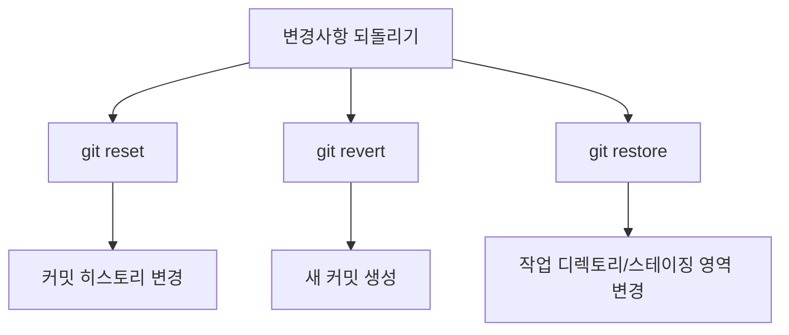

# Git revert, restore, reset

## Git Reset, Revert, Restore 비교

Git에서 변경사항을 되돌리는 세 가지 주요 명령어: reset, revert, restore는 각각 다른 방식으로 작동하며, 서로 다른 상황에서 사용됩니다.



이 명령어들의 주요 차이점은 다음과 같습니다:
1. git reset: 커밋 히스토리를 직접 수정합니다.
2. git revert: 새로운 커밋을 생성하여 변경사항을 취소합니다.
3. git restore: 작업 디렉토리나 스테이징 영역의 파일을 이전 상태로 복원합니다.

## git reset 상세 분석

git reset은 브랜치의 HEAD를 이동시켜 커밋 히스토리를 변경하는 강력한 명령어입니다.

git reset의 정의:
Git 저장소의 현재 HEAD와 브랜치 참조를 특정 커밋으로 이동시키는 명령어입니다.

git reset의 구성 요소:
1. 모드:
   - --soft: HEAD만 이동
   - --mixed (기본값): HEAD 이동 및 스테이징 영역 초기화
   - --hard: HEAD 이동, 스테이징 영역 초기화, 작업 디렉토리 변경
2. 대상 커밋: reset할 대상 커밋 지정 (예: HEAD~3, 커밋 해시 등)

작동 원리:
1. 지정된 커밋으로 HEAD와 현재 브랜치 참조를 이동합니다.
2. 선택한 모드에 따라 스테이징 영역과 작업 디렉토리를 업데이트합니다.

실제 구현 예시:

```bash
# 직전 커밋을 취소하고 변경사항을 스테이징 영역에 유지
git reset --soft HEAD~1

# 직전 3개의 커밋을 취소하고 변경사항을 작업 디렉토리에 유지
git reset --mixed HEAD~3

# 특정 커밋으로 완전히 되돌리기 (주의: 작업 디렉토리의 변경사항도 삭제됨)
git reset --hard 1a2b3c4
```

이론적 한계 및 실제 적용시 주의점:
1. 공유 브랜치에서의 사용: 이미 push된 커밋을 reset하면 다른 협업자와의 충돌이 발생할 수 있습니다.
2. 데이터 손실 위험: --hard 옵션 사용 시 복구가 어려운 데이터 손실이 발생할 수 있습니다.

## git revert 상세 분석

git revert는 특정 커밋의 변경사항을 취소하는 새로운 커밋을 생성합니다.

git revert의 정의:
지정된 커밋의 변경사항을 취소하는 새로운 커밋을 생성하는 명령어입니다.

git revert의 구성 요소:
1. 대상 커밋: 취소할 커밋 지정
2. 옵션:
   - --no-commit: 변경사항만 스테이징하고 자동으로 커밋하지 않음
   - -m <parent-number>: 병합 커밋을 되돌릴 때 사용

작동 원리:
1. 지정된 커밋의 변경사항을 역으로 적용합니다.
2. 새로운 커밋을 생성하여 이 역방향 변경사항을 기록합니다.

실제 구현 예시:

```bash
# 직전 커밋을 취소하는 새 커밋 생성
git revert HEAD

# 특정 커밋을 취소하는 새 커밋 생성
git revert 1a2b3c4

# 병합 커밋 취소 (첫 번째 부모로 되돌리기)
git revert -m 1 <merge-commit-hash>
```

이론적 한계 및 실제 적용시 주의점:
1. 복잡한 병합 되돌리기: 병합 커밋을 revert할 때 주의가 필요합니다.
2. 연속적인 커밋 되돌리기: 여러 연속된 커밋을 revert할 때 충돌이 발생할 수 있습니다.

## git restore 상세 분석

git restore는 작업 디렉토리나 스테이징 영역의 파일을 이전 상태로 복원합니다.

git restore의 정의:
작업 트리의 파일을 특정 소스(커밋, 스테이징 영역 등)로부터 복원하는 명령어입니다.

git restore의 구성 요소:
1. 대상 파일: 복원할 파일 지정
2. 소스:
   - --source: 파일을 복원할 소스 지정 (기본값: HEAD)
   - --staged: 스테이징 영역에서 파일 복원
3. 작업 모드:
   - 기본: 작업 디렉토리 파일 복원
   - --staged: 스테이징 영역 파일 복원
   - --worktree: 작업 디렉토리 파일 복원 (명시적 지정)

작동 원리:
1. 지정된 소스로부터 파일 내용을 읽어옵니다.
2. 작업 디렉토리나 스테이징 영역의 파일을 해당 내용으로 덮어씁니다.

실제 구현 예시:

```bash
# 작업 디렉토리의 파일을 HEAD의 상태로 복원
git restore file.txt

# 스테이징된 변경사항 취소 (unstage)
git restore --staged file.txt

# 특정 커밋의 파일 상태로 복원
git restore --source=HEAD~3 file.txt
```

이론적 한계 및 실제 적용시 주의점:
1. 커밋되지 않은 변경사항 손실: 작업 디렉토리의 변경사항이 덮어써질 수 있습니다.
2. 제한된 범위: 커밋 히스토리나 브랜치 구조는 변경할 수 없습니다.

## 전체 시스템에서의 역할 및 상호작용

이 세 명령어는 Git의 버전 관리 시스템에서 각각 다른 레벨에서 작동합니다:

1. git reset: 리포지토리 레벨에서 작동하며, 커밋 히스토리를 직접 조작합니다.
2. git revert: 커밋 레벨에서 작동하며, 기존 히스토리를 유지하면서 변경사항을 취소합니다.
3. git restore: 파일 레벨에서 작동하며, 작업 디렉토리와 스테이징 영역의 상태를 관리합니다.

이들은 Git의 3개 트리(HEAD, Index, Working Directory)와 상호작용하며, 각기 다른 방식으로 변경사항을 관리합니다.

## 비교 분석

1. 사용 목적:
   - reset: 로컬 브랜치의 상태를 완전히 변경할 때 사용
   - revert: 공유 브랜치에서 특정 변경사항을 안전하게 취소할 때 사용
   - restore: 작업 중인 파일의 상태를 빠르게 복원할 때 사용

2. 히스토리 변경:
   - reset: 커밋 히스토리를 직접 변경
   - revert: 히스토리에 새 커밋을 추가
   - restore: 커밋 히스토리에 영향을 주지 않음

3. 협업 시 안전성:
   - reset: 공유 브랜치에서 사용 시 주의 필요
   - revert: 공유 브랜치에서 안전하게 사용 가능
   - restore: 로컬 변경사항에만 영향을 미치므로 안전

4. 유연성:
   - reset: 가장 유연하지만 위험할 수 있음
   - revert: 특정 커밋의 변경사항만 취소 가능
   - restore: 파일 단위의 변경에 국한됨

## 최신 연구 동향 및 산업계 적용

1. Git의 발전:
   - Git 2.23.0 (2019년)에서 restore와 switch 명령어가 도입되어, reset의 일부 기능을 더 직관적으로 사용할 수 있게 되었습니다.
   - 대규모 리포지토리에서의 성능 개선을 위한 연구가 계속되고 있습니다.

2. 산업계 적용:
   - CI/CD 파이프라인에서의 자동화된 revert 사용이 증가하고 있습니다.
   - 대규모 오픈소스 프로젝트에서는 revert를 통한 안전한 변경사항 관리가 표준 관행으로 자리잡고 있습니다.

## 심화 학습 내용 및 관련 개념

- Git의 내부 구조: Git의 객체 모델과 참조 시스템에 대한 이해는 이 명령어들의 작동 방식을 더 깊이 이해하는 데 도움이 됩니다.
- Git 리베이스(rebase): reset과 유사하게 커밋 히스토리를 변경하지만, 다른 접근 방식을 사용합니다.
- Git 리플로그(reflog): reset이나 revert로 인한 변경사항을 추적하고 복구하는 데 사용됩니다.
- Git 훅(hooks): reset, revert, restore 작업 전후에 자동화된 스크립트를 실행하여 추가적인 검증이나 작업을 수행할 수 있습니다.

이러한 Git 명령어들을 깊이 이해하고 적절히 사용하면, 효과적인 버전 관리와 협업이 가능해집니다. 각 명령어의 특성과 영향을 정확히 알고 상황에 맞게 선택하는 것이 중요합니다.
