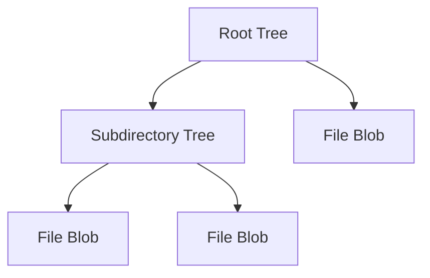

# Git Tree

- [Git Tree](#git-tree)
    - [Git 트리](#git-트리)
    - [Git의 내부 객체](#git의-내부-객체)
    - [Git의 작동 원리](#git의-작동-원리)
        - [Git 명령어의 작동 흐름](#git-명령어의-작동-흐름)
    - [전체 시스템에서의 역할 및 상호작용](#전체-시스템에서의-역할-및-상호작용)
        - [블롭(blob) 객체](#블롭blob-객체)
        - [트리(tree) 객체](#트리tree-객체)
            - [엔트리(Entry) 상세 분석](#엔트리entry-상세-분석)
                - [파일 모드 상세 분석](#파일-모드-상세-분석)
            - [트리(Tree) 참조 상세 분석](#트리tree-참조-상세-분석)
            - [전체 시스템에서의 역할 및 상호작용](#전체-시스템에서의-역할-및-상호작용-1)
            - [비교 분석](#비교-분석)
        - [커밋(commit) 객체](#커밋commit-객체)
        - [태그(tag) 객체](#태그tag-객체)
        - [명령어 예시](#명령어-예시)
            - [트리 객체 확인](#트리-객체-확인)
            - [트리 객체의 구조 확인](#트리-객체의-구조-확인)
            - [블롭 객체 확인](#블롭-객체-확인)
            - [커밋 객체 확인](#커밋-객체-확인)
        - [커밋과 트리의 관계](#커밋과-트리의-관계)
            - [커밋 객체의 구조](#커밋-객체의-구조)
            - [트리 객체의 구조](#트리-객체의-구조)
        - [Git 트리 탐색 및 확인 명령어](#git-트리-탐색-및-확인-명령어)
            - [트리 객체 확인](#트리-객체-확인-1)
            - [블롭 객체 확인](#블롭-객체-확인-1)
            - [커밋 객체 확인](#커밋-객체-확인-1)
        - [Git 트리의 생성 및 활용](#git-트리의-생성-및-활용)
            - [Git 트리의 생성 과정](#git-트리의-생성-과정)
            - [트리 객체의 활용](#트리-객체의-활용)
        - [Git의 동작 원리 이해를 위한 추가 개념](#git의-동작-원리-이해를-위한-추가-개념)
            - [SHA-1 해시](#sha-1-해시)
            - [객체 저장소](#객체-저장소)
            - [압축 및 중복 제거](#압축-및-중복-제거)
        - [Git 트리와 커밋의 동작 원리 요약](#git-트리와-커밋의-동작-원리-요약)
    - [Git Tree 이동](#git-tree-이동)
    - [심화 학습 내용 및 관련 개념](#심화-학습-내용-및-관련-개념)
    - [기타](#기타)

## Git 트리

Git의 핵심 철학은 *데이터를 일련의 스냅샷으로 취급한다*는 것이고, Git 트리는 파일 시스템의 스냅샷을 나타냅니다.
이는 Git이 프로젝트의 전체 상태를 특정 시점에 캡처한다는 의미입니다.

Git 트리는 디렉토리 구조를 표현하는 객체입니다.
트리 객체는 다음 항목들을 포함하고 있습니다.
- 블롭(blob) 객체
- 다른 트리 객체를 가리키는 포인터들

## Git의 내부 객체

Git의 내부 구조는 크게 두 부분으로 나눌 수 있습니다:
1. **객체 저장소(Object Store)**
   - `.git/objects` 디렉토리에 위치합니다.
   - 각 객체는 그 내용의 SHA-1 해시로 이름 지어진 파일로 저장됩니다.
   - Git은 SHA-1 해시를 사용하여 각 객체를 고유하게 식별합니다.

    ```plaintext
    .git/objects/
    ├── 01/
    │   └── 23456789abcdef0123456789abcdef012345678
    ├── ab/
    │   └── cdef0123456789abcdef0123456789abcdef01
    └── ...
    ```

2. **인덱스(Index)**

## Git의 작동 원리

Git은 기본적으로 다음과 같은 단계를 통해 작동합니다:

1. **작업 디렉토리**: 실제 파일이 존재하는 디렉토리로, 사용자가 파일을 수정하는 공간입니다.
2. **인덱스**: 스테이징 영역으로, 다음 커밋에 포함될 파일의 스냅샷을 저장합니다.
3. **저장소**: 실제 Git 객체가 저장되는 장소로, 커밋, 트리, 블롭 등의 객체가 위치합니다.

### Git 명령어의 작동 흐름

1. **git add**: 파일을 인덱스에 추가하여 스냅샷을 만듭니다.
2. **git commit**: 인덱스의 스냅샷을 커밋 객체로 저장하고, 해당 커밋은 트리 객체를 가리킵니다.
3. **git push**: 로컬 커밋을 원격 저장소에 업로드합니다.

## 전체 시스템에서의 역할 및 상호작용

Git의 각 구성 요소들은 서로 유기적으로 상호작용하여 버전 관리 시스템을 구성합니다. 각 트리 객체는 파일과 디렉토리 구조를 나타내며, 커밋 객체는 이러한 트리 객체를 참조하여 특정 시점의 전체 프로젝트 상태를 캡처합니다. 인덱스는 이러한 커밋을 준비하는 중간 단계로, 사용자가 `git add` 명령어를 통해 변경사항을 추가하고, `git commit` 명령어를 통해 최종적으로 저장소에 커밋합니다.

### 블롭(blob) 객체

"Blob"은 "Binary Large Object"의 약자로, Git에서는 파일의 내용을 저장하는 객체를 의미합니다.
블롭(blob) 객체는 파일의 내용 자체를 저장하는 Git 객체입니다.
블롭은 파일의 메타데이터(파일 이름, 권한 등)를 저장하지 않고, 오직 파일의 내용만을 저장합니다.
파일의 내용이 변경되지 않으면, 동일한 블롭 객체가 여러 커밋에서 참조될 수 있습니다.

예를 들어, 파일 `hello.txt`의 내용이 "Hello, Git"인 경우:

```sh
# 'hello.txt' 파일을 생성하고 그 내용을 "Hello, Git!"으로 작성합니다.
$ echo "Hello, Git!" > hello.txt

# Git은 이 파일을 블롭 객체로 저장합니다.
$ git add hello.txt

# 블롭 객체는 파일의 내용으로부터 해시를 생성합니다. 이 해시는 파일의 고유 식별자 역할을 합니다.
# 해시는 SHA-1 알고리즘을 사용하여 계산됩니다.
# 예를 들어, 아래 명령어는 "Hello, Git!" 문자열에 대한 SHA-1 해시를 계산합니다.
$ echo -n "Hello, Git!" | sha1sum
# 출력 결과는 `e9650471e6b9fcf1b2d98d7c7ae3c4200a292477`와 같습니다. 이 값이 블롭 객체의 식별자가 됩니다.

# 저장된 블롭 객체를 확인해봅니다. 해시 값으로 블롭 객체의 내용을 조회할 수 있습니다.
$ git cat-file -p $(git hash-object hello.txt)
Hello, Git!
```

작동 원리:
1. Git은 파일의 내용을 해싱하여 블롭 객체를 생성합니다.
2. 블롭 객체는 Git 객체 데이터베이스에 저장됩니다.
3. 트리 객체의 엔트리는 블롭 객체의 SHA-1 해시를 참조합니다.
4. 파일 내용이 필요할 때 Git은 SHA-1 해시를 사용하여 블롭 객체를 조회합니다.

최적화 및 성능 고려사항:
- 동일한 내용의 파일은 같은 블롭 객체를 공유하여 저장 공간을 절약합니다.
- Git은 블롭 객체를 압축하여 저장하므로 디스크 공간을 효율적으로 사용합니다.

Git의 블롭 객체와 그 저장 방식을 간단히 구현한 예시:

```python
import hashlib
import zlib

class Blob:
    def __init__(self, data):
        self.data = data

    def serialize(self):
        # 블롭 객체의 내용을 직렬화
        return b"blob " + str(len(self.data)).encode() + b"\0" + self.data

    def get_sha1(self):
        # 블롭 객체의 SHA-1 해시 계산
        return hashlib.sha1(self.serialize()).hexdigest()

class GitObject:
    @staticmethod
    def write_object(data, obj_type):
        # Git 객체를 압축하여 저장
        obj = obj_type.encode() + b" " + str(len(data)).encode() + b"\0" + data
        compressed = zlib.compress(obj)
        sha1 = hashlib.sha1(obj).hexdigest()
        # 실제로는 여기서 파일 시스템에 객체를 저장해야 합니다
        return sha1

# 블롭 객체 생성 및 저장 예시
file_content = b"Hello, Git!"
blob = Blob(file_content)
sha1 = GitObject.write_object(file_content, "blob")

print(f"Blob SHA-1: {sha1}")
print(f"Blob content: {blob.data.decode()}")
```

이론적 한계 및 실제 적용시 주의점:
1. 대용량 파일 처리: Git은 큰 파일을 효율적으로 처리하기 위해 설계되지 않았으므로, 대용량 파일은 성능 문제를 일으킬 수 있습니다.
2. 파일 내용 변경 추적: 작은 변경사항도 새로운 블롭 객체를 생성하므로, 빈번한 변경이 있는 대용량 파일의 경우 저장소 크기가 빠르게 증가할 수 있습니다.

### 트리(tree) 객체

Git 트리(Tree) 객체는 Git 버전 관리 시스템에서 디렉토리 구조와 파일 메타데이터를 표현하는 핵심적인 데이터 구조입니다.
트리 객체는 프로젝트의 특정 시점에서의 전체 파일 시스템 스냅샷을 나타내며, 디렉토리의 내용을 계층적으로 구성합니다.

Git Tree는 Git의 내부 객체 타입 중 하나로, 블롭(blob) 객체와 다른 트리 객체에 대한 참조를 포함하는 경량화된 파일 시스템입니다.
각 트리 객체는 디렉토리에 대응되며, 파일 이름, 파일 모드, 그리고 해당 파일이나 하위 디렉토리를 가리키는 SHA-1 해시를 포함합니다.

트리 객체는 Git의 내부 객체 모델에서 중요한 역할을 하며, 커밋 객체와 함께 프로젝트의 전체 구조와 히스토리를 표현하는 데 사용됩니다.

```sh
     Tree Object
         |
    +----+----+----+
    |    |    |    |
  File  File  Dir  Dir
              |    |
            File  Tree
```



Git 트리 객체의 구성 요소:
1. 엔트리(Entry): 트리 객체의 기본 구성 요소
   - 모드(Mode): 파일 또는 디렉토리의 권한을 나타내는 6자리 8진수
   - 타입(Type): 객체의 종류 (blob 또는 tree)
   - SHA-1 해시: 해당 객체의 고유 식별자
   - 이름(Name): 파일 또는 디렉토리의 이름
2. 블롭(Blob) 참조: 파일 내용을 가리키는 참조
3. 트리(Tree) 참조: 하위 디렉토리를 가리키는 참조

#### 엔트리(Entry) 상세 분석

트리 엔트리는 Git Tree 객체의 가장 기본적인 구성 요소로, 파일 시스템의 각 항목(파일 또는 디렉토리)에 대한 메타데이터와 참조 정보를 포함합니다.
이는 Git의 객체 모델에서 트리 객체와 블롭 객체를 연결하는 중요한 역할을 합니다.

트리 엔트리의 이론적 기반은 그래프 이론과 해시 테이블에 근거합니다.
각 엔트리는 노드로, 해시 참조는 엣지로 볼 수 있어 전체 저장소를 방향성 비순환 그래프(DAG)로 표현할 수 있습니다.

엔트리의 구성 요소:
- 모드(Mode): 파일 또는 디렉토리의 권한을 나타내는 6자리 8진수
    - 일반 파일: 100644 (읽기/쓰기) 또는 100755 (실행 가능)
    - 디렉토리: 040000
    - 심볼릭 링크: 120000
- 타입(Type): 객체의 종류
    - "blob": 파일 내용을 나타내는 Blob 객체
    - "tree": 디렉토리를 나타내는 Tree 객체
- SHA-1 해시: 해당 객체(Blob 또는 Tree)의 고유 식별자
- 이름(Name): 파일 또는 디렉토리의 이름

작동 원리:
1. Git은 커밋을 생성할 때 *프로젝트의 현재 상태를 트리 객체로 변환*합니다.
2. 각 *디렉토리는 트리 객체*로, 각 *파일은 블롭 객체*로 표현됩니다.
    - 파일의 경우, 해당 내용의 SHA-1 해시를 계산하여 블롭 객체를 생성하고, 이를 트리 엔트리에서 참조합니다.
    - 디렉토리의 경우, 재귀적으로 하위 트리 객체를 생성하고, 이를 트리 엔트리에서 참조합니다.
3. 트리 객체는 엔트리들의 목록으로 구성되며, 각 엔트리는 파일 또는 하위 디렉토리를 가리킵니다.
4. 엔트리의 SHA-1 해시를 통해 Git은 빠르게 객체를 조회하고 변경 사항을 추적할 수 있습니다.

최적화 및 성능 고려사항:
- Git은 트리 객체를 압축하여 저장하므로 디스크 공간을 효율적으로 사용합니다.
- SHA-1 해시를 사용하여 객체를 고유하게 식별하므로 중복 저장을 방지합니다.

Git의 트리 객체와 엔트리를 간단히 구현한 예시:

```python
import hashlib

class TreeEntry:
    def __init__(self, mode, type, sha1, name):
        self.mode = mode
        self.type = type
        self.sha1 = sha1
        self.name = name

class Tree:
    def __init__(self):
        self.entries = []

    def add_entry(self, entry):
        self.entries.append(entry)

    def serialize(self):
        # 트리 객체의 내용을 바이트 문자열로 직렬화
        content = b''
        for entry in self.entries:
            content += f"{entry.mode} {entry.name}\0".encode()
            content += bytes.fromhex(entry.sha1)
        return content

    def get_sha1(self):
        # 트리 객체의 SHA-1 해시 계산
        return hashlib.sha1(b"tree " + str(len(self.serialize())).encode() + b"\0" + self.serialize()).hexdigest()

# 트리 객체 생성 및 사용 예시
tree = Tree()
tree.add_entry(TreeEntry("100644", "blob", "1234567890123456789012345678901234567890", "file.txt"))
tree.add_entry(TreeEntry("040000", "tree", "abcdefabcdefabcdefabcdefabcdefabcdefabcd", "subdir"))

print(f"Tree SHA-1: {tree.get_sha1()}")
```

이론적 한계 및 실제 적용시 주의점:
1. SHA-1 충돌 가능성: SHA-1의 이론적 충돌 가능성 때문에 Git은 SHA-256으로의 전환을 준비하고 있습니다.
2. 대규모 디렉토리 처리: 매우 많은 파일이 있는 디렉토리의 경우 트리 객체가 커질 수 있어 성능 문제가 발생할 수 있습니다.

##### 파일 모드 상세 분석

파일 모드는 Git Tree 엔트리에서 파일의 종류와 권한을 나타내는 중요한 메타데이터입니다.
이는 Unix 파일 시스템의 권한 체계에서 영감을 받아 설계되었습니다.

파일 모드의 이론적 기반은 비트 필드(`bitfield`) 개념에 근거합니다.
6자리 8진수로 표현되며, 각 비트는 특정한 의미를 갖습니다.

파일 모드는 다음 항목들로 구성됩니다:
- **객체 타입 비트** (상위 4비트)
- **실행 권한 비트** (하위 9비트)

작동 원리:
1. 상위 4비트는 객체의 타입을 나타냅니다:
   - 1000: 일반 파일
   - 1010: 심볼릭 링크
   - 1110: Git 하위모듈
2. 하위 9비트는 Unix 스타일의 실행 권한을 나타냅니다:
   - 755: 실행 가능한 파일 (rwxr-xr-x)
   - 644: 일반 파일 (rw-r--r--)

Git Tree 엔트리의 파일 모드를 간단히 구현한 예시:

```python
def parse_mode(mode):
    """파일 모드를 파싱하여 객체 타입과 권한을 반환합니다."""
    mode_int = int(mode, 8)  # 8진수 문자열을 정수로 변환
    
    # 상위 4비트로 객체 타입 결정
    if mode_int & 0o040000:
        obj_type = "tree"
    elif mode_int & 0o120000:
        obj_type = "symlink"
    elif mode_int & 0o160000:
        obj_type = "commit"  # submodule
    else:
        obj_type = "blob"
    
    # 하위 9비트로 권한 결정
    permissions = mode_int & 0o777
    
    return obj_type, oct(permissions)

# 예시 사용
modes = ["100644", "100755", "120000", "040000"]
for mode in modes:
    obj_type, perms = parse_mode(mode)
    print(f"Mode {mode}: Type = {obj_type}, Permissions = {perms}")
```

#### 트리(Tree) 참조 상세 분석

트리 참조는 Git 트리 객체에서 하위 디렉토리를 가리키는 포인터입니다.
이를 통해 Git은 복잡한 디렉토리 구조를 계층적으로 표현할 수 있습니다.

트리 참조의 구성 요소:
- SHA-1 해시: 참조되는 트리 객체의 고유 식별자
- 디렉토리 이름: 트리 엔트리에 저장된 하위 디렉토리의 이름

작동 원리:
1. Git은 디렉토리 구조를 재귀적으로 트리 객체로 변환합니다.
2. 각 하위 디렉토리는 별도의 트리 객체로 표현됩니다.
3. 상위 트리 객체는 하위 트리 객체의 SHA-1 해시를 참조합니다.
4. 이러한 구조를 통해 Git은 전체 디렉토리 구조를 효율적으로 표현하고 탐색할 수 있습니다.

최적화 및 성능 고려사항:
- 트리 객체 간의 참조를 통해 중복을 최소화하고 저장 공간을 절약합니다.
- 변경된 디렉토리만 새로운 트리 객체로 생성되므로 효율적인 버전 관리가 가능합니다.

Git의 트리 객체와 트리 참조를 간단히 구현한 예시:

```python
import hashlib

class TreeEntry:
    def __init__(self, mode, type, sha1, name):
        self.mode = mode
        self.type = type
        self.sha1 = sha1
        self.name = name

class Tree:
    def __init__(self):
        self.entries = []

    def add_entry(self, entry):
        self.entries.append(entry)

    def serialize(self):
        content = b''
        for entry in self.entries:
            content += f"{entry.mode} {entry.name}\0".encode()
            content += bytes.fromhex(entry.sha1)
        return content

    def get_sha1(self):
        return hashlib.sha1(b"tree " + str(len(self.serialize())).encode() + b"\0" + self.serialize()).hexdigest()

# 트리 객체 생성 및 참조 예시
root_tree = Tree()
sub_tree = Tree()

sub_tree.add_entry(TreeEntry("100644", "blob", "1234567890123456789012345678901234567890", "file.txt"))
sub_tree_sha1 = sub_tree.get_sha1()

root_tree.add_entry(TreeEntry("040000", "tree", sub_tree_sha1, "subdir"))
root_tree.add_entry(TreeEntry("100644", "blob", "abcdefabcdefabcdefabcdefabcdefabcdefabcd", "root_file.txt"))

print(f"Root Tree SHA-1: {root_tree.get_sha1()}")
print(f"Subtree SHA-1: {sub_tree_sha1}")
```

이론적 한계 및 실제 적용시 주의점:
1. 깊은 디렉토리 구조: 매우 깊은 디렉토리 구조의 경우, 트리 객체의 중첩이 깊어져 성능 문제가 발생할 수 있습니다.
2. 많은 파일이 있는 디렉토리: 단일 디렉토리에 너무 많은 파일이 있는 경우, 해당 디렉토리를 나타내는 트리 객체가 매우 커질 수 있어 성능 저하가 발생할 수 있습니다.

#### 전체 시스템에서의 역할 및 상호작용

Git 트리 객체는 Git의 버전 관리 시스템에서 핵심적인 역할을 수행합니다.
트리 객체는 프로젝트의 디렉토리 구조와 파일 상태를 표현하며, 다른 Git 객체들과 긴밀하게 상호작용합니다.

1. 커밋 객체와의 관계:
    - 각 커밋 객체는 하나의 루트 트리 객체를 가리킵니다.
    - 이 루트 트리 객체는 해당 커밋 시점의 전체 프로젝트 구조를 나타냅니다.

2. 블롭 객체와의 관계:
    - 트리 객체의 엔트리들은 파일 내용을 나타내는 블롭 객체들을 참조합니다.
    - 이를 통해 파일 시스템의 구조와 내용을 연결합니다.

3. 다른 트리 객체와의 관계:
    - 트리 객체는 다른 트리 객체를 참조하여 하위 디렉토리를 표현합니다.
    - 이러한 계층 구조를 통해 복잡한 디렉토리 구조를 효율적으로 표현합니다.

4. 인덱스(Staging Area)와의 상호작용:
    - Git의 인덱스는 다음 커밋에 포함될 변경사항을 추적합니다.
    - 커밋 생성 시, 인덱스의 상태를 기반으로 새로운 트리 객체가 생성됩니다.

5. 버전 관리 시스템에서의 역할:
    - 트리 객체를 통해 Git은 각 커밋에서의 프로젝트 상태를 효율적으로 저장하고 비교할 수 있습니다.
    - 파일과 디렉토리의 변경 사항을 정확하게 추적할 수 있게 합니다.

성능, 확장성, 보안 등에 미치는 영향 분석:

1. 성능:
    - 트리 객체의 계층 구조로 인해 특정 파일이나 디렉토리의 변경 사항만 새로운 객체로 생성되므로, 저장 공간과 처리 시간을 절약합니다.
    - SHA-1 해시를 이용한 빠른 객체 조회로 효율적인 데이터 접근이 가능합니다.

2. 확장성:
    - 트리 구조를 통해 대규모 프로젝트의 복잡한 디렉토리 구조도 효과적으로 관리할 수 있습니다.
    - 그러나 매우 큰 저장소나 깊은 디렉토리 구조에서는 성능 저하가 발생할 수 있습니다.

3. 보안:
    - 각 객체가 SHA-1 해시로 식별되므로 데이터의 무결성을 보장합니다.
    - 그러나 SHA-1의 취약점으로 인해 Git은 SHA-256으로의 전환을 준비하고 있습니다.

#### 비교 분석

Git의 트리 객체 모델을 다른 버전 관리 시스템의 유사 개념과 비교해보겠습니다.

1. SVN(Subversion)과의 비교:
    - SVN: 디렉토리 버전 관리를 위해 각 리비전마다 전체 디렉토리 스냅샷을 저장합니다.
    - Git: 트리 객체를 통해 변경된 부분만 새로운 객체로 저장하여 효율적입니다.

    장점: Git의 방식이 저장 공간을 더 효율적으로 사용하며, 브랜치 생성과 병합이 빠릅니다.
    단점: Git의 모델이 더 복잡하여 초보자가 이해하기 어려울 수 있습니다.

2. Mercurial과의 비교:
    - Mercurial: Manifest라는 유사한 개념을 사용하지만, 파일 이름과 해시의 평면적인 목록으로 구성됩니다.
    - Git: 계층적인 트리 구조를 사용하여 디렉토리 구조를 더 명확히 표현합니다.

    장점: Git의 트리 구조가 더 유연하고 대규모 프로젝트에 적합합니다.
    단점: Mercurial의 단순한 구조가 일부 작업에서 더 빠를 수 있습니다.

3. Perforce와의 비교:
    - Perforce: 중앙 집중식 모델로, 서버에 전체 파일 히스토리를 저장합니다.
    - Git: 분산형 모델로, 각 클라이언트가 전체 저장소의 복사본을 가집니다.

    장점: Git의 분산 모델이 오프라인 작업과 빠른 브랜칭을 가능하게 합니다.
    단점: 대용량 바이너리 파일 처리에서는 Perforce가 더 효율적일 수 있습니다.

적합한 사용 시나리오:
- Git의 트리 객체 모델은 소스 코드와 같은 텍스트 기반 프로젝트에 매우 적합합니다.
- 빈번한 브랜칭과 병합이 필요한 협업 프로젝트에 이상적입니다.
- 분산 작업 환경에서 효과적으로 사용할 수 있습니다.
- 그러나 대용량 바이너리 파일이 많은 프로젝트에는 다른 솔루션(예: Git LFS)을 고려해야 할 수 있습니다.

### 커밋(commit) 객체

커밋(commit) 객체는 특정 시점에서의 프로젝트 상태(스냅샷)를 저장합니다.
프로젝트의 변경 사항을 기록하고, 각 변경 사항에 대한 설명과 메타데이터를 포함합니다.

커밋 객체는 다음 정보들을 포함합니다.
- 부모 커밋에 대한 참조
- 커밋 메시지
- 트리 객체
- 저자 정보
- 커밋 날짜 등

각 커밋 객체는 루트 트리를 가리키며, 루트 트리는 해당 커밋 시점의 전체 디렉토리 구조를 나타냅니다.

```sh
commit 1a410efbd13591db07496601ebc7a059dd55cfe9
Author: John Doe <john@example.com>
Date:   Fri May 15 14:45:44 2020 +0000

    Initial commit

tree 40d24c539dd2d7f17ef2c5b8e9b7fc9db1d5e2b1
parent <SHA-1 of parent commit>
```

루트 디렉토리의 트리 객체 해시가 `4b825dc642cb6eb9a060e54bf8d69288fbee4904`라고 가정합니다.
커밋 객체는 다음과 같이 구성됩니다:

```sh
tree 4b825dc642cb6eb9a060e54bf8d69288fbee4904
parent <부모 커밋의 해시> (첫 번째 커밋인 경우 부모 커밋 없음)
author John Doe <john@example.com> 1628171135 +0900
committer John Doe <john@example.com> 1628171135 +0900

Initial commit
```

위 커밋 객체는 Git의 내부 데이터베이스에 저장되며, 각 커밋은 고유한 해시를 가집니다.

### 태그(tag) 객체

태그(tag) 객체는 특정 커밋을 가리키는 고정된 참조입니다.
태그는 주로 릴리스 버전을 표시하는 데 사용되며, 특정 시점의 프로젝트 상태를 고정합니다.

태그는 두 가지로 나눌 수 있습니다:
- 주석이 있는 태그(annotated tag): 태그 이름, 태그 메시지, 태그 생성자, 생성 날짜 등을 포함합니다.

    특정 커밋에 대해 태그를 생성하면, 태그 객체는 다음과 같이 구성될 수 있습니다:

    ```sh
    object <커밋 객체의 해시>
    type commit
    tag <태그 이름>
    tagger <태그 생성자 정보> <생성 날짜>

    <태그 메시지>
    ```

    ```sh
    object 1a410efbd13591db07496601ebc7a059dd55cfe9
    type commit
    tag v1.0.0
    tagger John Doe <john@example.com> 1628171135 +0900

    Version 1.0.0 release
    ```

    위 예시는 `1a410efbd13591db07496601ebc7a059dd55cfe9` 해시를 가진 커밋을 가리키는 `v1.0.0`이라는 주석이 있는 태그를 나타냅니다.
    태그 생성자는 John Doe이며, 생성 날짜는 UNIX 타임스탬프로 표시됩니다.
    태그 메시지는 "Version 1.0.0 release"입니다.

- 경량 태그(lightweight tag): 단순히 커밋을 가리키는 포인터입니다.

Git에서 태그 객체를 보려면 다음 명령어를 사용할 수 있습니다:

1. **태그 목록 보기**:

   ```sh
   git tag
   ```

2. **특정 태그에 대한 정보 보기**:

   ```sh
   git show <태그 이름>
   ```

   예를 들어, `v1.0.0` 태그에 대한 정보를 보려면:

   ```sh
   git show v1.0.0
   ```

이 명령어는 주석이 있는 태그의 경우 태그 메시지와 태그가 가리키는 커밋 정보를 모두 보여줍니다. 경
량 태그의 경우 단순히 해당 커밋의 정보를 보여줍니다.

다음은 주석이 있는 태그와 경량 태그를 생성하고 확인하는 예시입니다.

1. **주석이 있는 태그 생성**:

   ```sh
   git tag -a v1.0.0 -m "Version 1.0.0 release"
   ```

2. **경량 태그 생성**:

   ```sh
   git tag v1.0.0-light
   ```

3. **태그 정보 확인**:

   ```sh
   git show v1.0.0
   ```

   ```sh
   git show v1.0.0-light
   ```

이 명령어들은 각각 주석이 있는 태그와 경량 태그의 정보를 보여줍니다.
주석이 있는 태그는 태그 메시지와 생성자 정보가 포함된 반면, 경량 태그는 단순히 커밋만 가리킵니다.

### 명령어 예시

#### 트리 객체 확인

```bash
# 특정 커밋의 트리 객체 확인
git cat-file -p <commit-hash>

# 예시: 커밋 해시가 `abcd1234`인 경우
git cat-file -p abcd1234
```

결과:

```plaintext
tree 4b825dc642cb6eb9a060e54bf8d69288fbee4904
```

#### 트리 객체의 구조 확인

```bash
# 트리 객체의 구조 확인
git ls-tree <tree-hash>

# 예시: 트리 해시가 `4b825dc642cb6eb9a060e54bf8d69288fbee4904`인 경우
git ls-tree 4b825dc642cb6eb9a060e54bf8d69288fbee4904
```

결과:

```plaintext
100644 blob e9650471e6b9fcf1b2d98d7c7ae3c4200a292477    hello.txt
040000 tree <src 디렉토리의 해시>    src
```

#### 블롭 객체 확인

```bash
# 블롭 객체의 내용 확인
git cat-file -p <blob-hash>

# 예시: 블롭 해시가 `e9650471e6b9fcf1b2d98d7c7ae3c4200a292477`인 경우
git cat-file -p e9650471e6b9fcf1b2d98d7c7ae3c4200a292477
```

결과:

```plaintext
Hello, Git
```

#### 커밋 객체 확인

```bash
# 커밋 객체의 구조 확인
git cat-file -p <commit-hash>

# 예시: 커밋 해시가 `abcd1234`인 경우
git cat-file -p abcd1234
```

결과:

```sh
tree 4b825dc642cb6eb9a060e54bf8d69288fbee4904
parent <부모 커밋의 해시> (첫 번째 커밋인 경우 부모 커밋 없음)
author John Doe <john@example.com> 1628171135 +0900
committer John Doe <john@example.com> 1628171135 +0900

Initial commit
```

### 커밋과 트리의 관계

#### 커밋 객체의 구조

- **커밋 메시지**: 변경 사항에 대한 설명.
- **저자(author)**: 변경 사항을 만든 사람의 정보.
- **타임스탬프**: 커밋이 생성된 시간.
- **부모 커밋**: 이전 커밋의 해시 (병합 커밋의 경우 여러 부모 커밋이 있을 수 있음).
- **트리 객체**: 현재 커밋의 파일 시스템 스냅샷을 가리킴.

#### 트리 객체의 구조

- **디렉토리 엔트리**: 각 디렉토리 항목은 파일 이름, 파일 모드, 블롭/트리 객체의 해시로 구성됨.
- **포인터**: 블롭 객체(파일)나 다른 트리 객체(디렉토리)를 가리킴.

### Git 트리 탐색 및 확인 명령어

#### 트리 객체 확인

```bash
# 특정 커밋의 트리 객체 확인
git cat-file -p <commit-hash>

# 트리 객체의 구조 확인
git ls-tree <tree-hash>
```

#### 블롭 객체 확인

```bash
# 블롭 객체의 내용 확인
git cat-file -p <blob-hash>
```

#### 커밋 객체 확인

```bash
# 커밋 객체의 구조 확인
git cat-file -p <commit-hash>
```

### Git 트리의 생성 및 활용

#### Git 트리의 생성 과정

1. **파일의 추가 및 스테이징**: `git add` 명령어로 파일을 스테이징 영역에 추가.
2. **트리 객체 생성**: 스테이징된 파일들을 기준으로 트리 객체 생성.
3. **커밋 객체 생성**: 트리 객체를 가리키는 커밋 객체 생성.

```bash
# 파일 추가 및 스테이징
echo "Hello, Git" > hello.txt
git add hello.txt

# 커밋 생성
git commit -m "Add hello.txt"
```

#### 트리 객체의 활용

- **파일 시스템 스냅샷**: 프로젝트의 특정 시점 상태를 저장하여 이후에 해당 상태로 돌아갈 수 있음.
- **브랜치와 병합**: 브랜치를 통해 독립적으로 작업한 후 병합하여 트리 객체를 업데이트.
- **리베이스**: 브랜치를 다른 베이스 커밋으로 이동하여 히스토리를 깔끔하게 유지.

### Git의 동작 원리 이해를 위한 추가 개념

#### SHA-1 해시

Git은 SHA-1 해시를 사용하여 객체를 식별합니다. 각 객체는 고유한 SHA-1 해시를 가지며, 이를 통해 객체를 빠르고 효율적으로 찾을 수 있습니다.

#### 객체 저장소

Git은 모든 객체를 `.git/objects` 디렉토리에 저장합니다. 각 객체는 해시 값을 기반으로 한 고유 경로를 가지며, 이를 통해 데이터의 무결성을 보장합니다.

#### 압축 및 중복 제거

Git은 객체 저장 시 압축을 적용하여 저장 공간을 절약하며, 중복 데이터를 효율적으로 제거합니다. 동일한 내용의 파일은 동일한 해시를 가지므로, 한 번만 저장됩니다.

### Git 트리와 커밋의 동작 원리 요약

- **트리 객체**: 디렉토리 구조를 표현하며, 블롭과 다른 트리 객체를 가리킴.
- **커밋 객체**: 프로젝트의 특정 시점 상태를 저장하며, 트리 객체와 부모 커밋을 가리킴.
- **블롭 객체**: 파일의 내용을 저장하며, 파일 이름이나 위치 정보는 포함하지 않음.
- **SHA-1 해시**: 각 객체를 식별하는 고유 값으로, 데이터의 무결성을 보장.

이와 같은 내용들을 git_tree.md 파일에 정리하면 Git 트리와 커밋의 구조를 깊이 이해하는 데 큰 도움이 될 것입니다. 이러한 이해를 바탕으로 리베이스, 머지, 체크아웃, 브랜치 등의 고급 기능을 효과적으로 활용할 수 있습니다.

## Git Tree 이동

In Git, there are various notations used to refer to specific commits or revisions. Here's
an explanation of the notations you mentioned:

1. `HEAD`: This refers to the current commit that your repository is pointing to. It's the
latest commit on the currently checked-out branch. [1]

2. `HEAD^2`: The ^ notation is used to refer to the parent commit of a specific commit. HEAD^2
means the second parent commit of the current HEAD commit. This notation is useful when
dealing with merge commits, which can have multiple parent commits.

3. `HEAD~2`: The ~ notation is used to refer to a commit that is a certain number of commits
before the specified commit. HEAD~2 means the commit that is two commits before the current
HEAD commit. This is useful when you want to move back in the commit history.

4. `git rebase -i HEAD~5`: This command initiates an interactive rebase, allowing you to
rewrite the commit history of the last 5 commits (including the current HEAD commit). It
opens an editor where you can choose to reorder, squash, edit, or drop commits.

5. `git reset HEAD~3`: This command moves the current branch tip backward by three commits,
effectively undoing the last three commits. However, it doesn't remove the commit objects
from the repository; it just moves the branch pointer.

6. `git branch -f main HEAD~5`: This command forces the main branch to point to the commit
that is five commits behind the current HEAD. It's useful when you want to move a branch to
a different commit without modifying the current HEAD.

7. `git revert HEAD~2..HEAD`: This command creates a new commit that undoes the changes
introduced by the commit range HEAD~2..HEAD. It doesn't remove the original commits but
creates a new commit that reverts their changes.

These notations are powerful tools for navigating and manipulating the commit history in
Git. They allow you to refer to specific commits, move branch pointers, and rewrite commit
histories as needed.

## 심화 학습 내용 및 관련 개념

- Git 내부 구조: Git의 객체 모델(커밋, 트리, 블롭, 태그)에 대한 더 깊은 이해가 필요합니다. 이는 Git의 작동 원리를 깊이 있게 이해하는 데 도움이 됩니다.

- 분산 시스템 이론: Git의 분산 특성을 더 잘 이해하기 위해 분산 시스템의 기본 개념과 이론을 학습하는 것이 좋습니다.

- 암호학 기초: SHA-1, SHA-256 등의 해시 함수와 그 특성에 대한 이해가 필요합니다. 이는 Git의 무결성 보장 메커니즘을 이해하는 데 중요합니다.

- 그래프 이론: Git의 커밋 히스토리는 방향성 비순환 그래프(DAG)로 표현됩니다. 그래프 이론의 기본 개념을 이해하면 복잡한 브랜치 구조를 더 잘 다룰 수 있습니다.

- 데이터 압축 알고리즘: Git이 객체를 효율적으로 저장하는 방식을 이해하기 위해 zlib 등의 압축 알고리즘에 대한 지식이 도움됩니다.

- 파일 시스템 이론: Git이 어떻게 파일 시스템과 상호작용하는지 이해하기 위해 기본적인 파일 시스템 개념을 학습하는 것이 좋습니다.

- 병합 알고리즘: 3-way 병합, recursive 병합 등 Git에서 사용되는 다양한 병합 알고리즘에 대한 이해가 필요합니다.

- 성능 최적화 기법: 대규모 저장소에서 Git의 성능을 최적화하는 방법에 대한 학습이 필요합니다.

이러한 개념들은 Git의 트리 객체와 직간접적으로 관련되어 있으며, 이들에 대한 심화 학습을 통해 Git의 작동 원리와 효율적인 사용법을 더욱 깊이 이해할 수 있습니다.

## 기타

- [HEAD and ORIG_HEAD in Git](https://stackoverflow.com/questions/964876)
