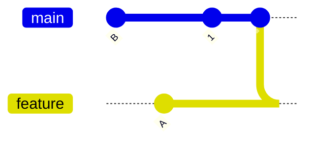
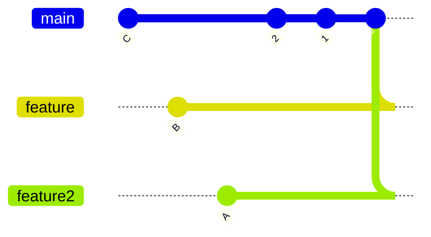
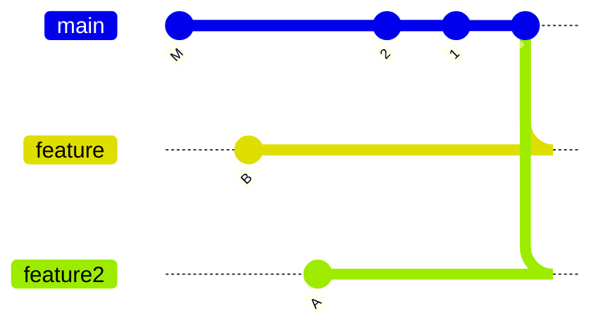
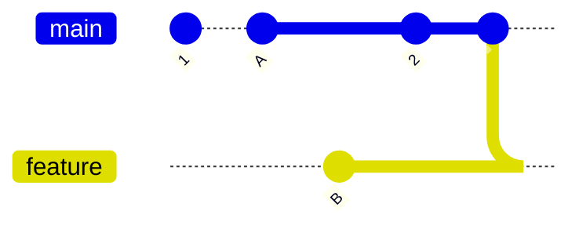

# merge-base

## merge-base?

`git merge-base`는 세 방향 병합(three-way merge)에서 두 커밋 간의 최적의 공통 조상(ancestor)을 찾습니다.
한 공통 조상이 다른 공통 조상보다 더 나은 경우, 후자가 전자의 조상인 경우입니다.

더 나은 공통 조상이 없는 공통 조상은 최적의 공통 조상, 즉 병합 기준(merge base)입니다.
두 커밋 쌍에 대해 하나 이상의 병합 기준이 있을 수 있습니다.

## discussion

두 커밋 A와 B가 주어졌을 때, `git merge-base A B` 명령어는 A와 B 모두에서 부모 관계를 통해 도달할 수 있는 커밋을 출력합니다.

예를 들어, 다음과 같은 토폴로지에서:

```bash
         o---o---o---B
        /
---o---1---o---o---o---A
```

// TODO 수정 필요



A와 B 사이의 merge base는 1입니다.

세 커밋 A, B, C가 주어졌을 때, `git merge-base A B C` 명령어는 B와 C 사이의 가상의 머지 커밋 M과 A 사이의 merge base를 계산합니다. 예를 들어, 다음과 같은 토폴로지에서:

```bash
       o---o---o---o---C
      /
     /   o---o---o---B
    /   /
---2---1---o---o---o---A
```



`git merge-base A B C`의 결과는 1입니다. 이는 B와 C 사이의 머지 커밋 M이 있는 등가 토폴로지에서:

```bash
       o---o---o---o---o
      /                 \
     /   o---o---o---o---M
    /   /
---2---1---o---o---o---A
```



`git merge-base A M`의 결과가 1이기 때문입니다. 커밋 2도 A와 M의 공통 조상이지만, 1이 더 나은 공통 조상입니다. 왜냐하면 2는 1의 조상이기 때문입니다. 따라서 2는 merge base가 아닙니다.

`git merge-base --octopus A B C`의 결과는 2입니다. 왜냐하면 2가 모든 커밋의 최상의 공통 조상이기 때문입니다.

역사에 교차 머지가 포함된 경우, 두 커밋에 대해 최상의 공통 조상이 둘 이상 있을 수 있습니다. 예를 들어, 다음과 같은 토폴로지에서:

```bash

---1---o---A
    \ /
     X
    / \
---2---o---o---B
```



1과 2 모두 A와 B의 merge base입니다. 어느 것도 다른 것보다 더 낫지 않습니다 (둘 다 최상의 merge base입니다). `--all` 옵션이 주어지지 않으면, 어느 것이 출력될지는 지정되지 않습니다.

두 커밋 A와 B 사이의 "fast-forward-ness"를 확인하는 일반적인 방법은 A와 B 사이의 merge base를 계산하고, 그것이 A와 동일한지 확인하는 것입니다. 이 경우, A는 B의 조상입니다. 이 방법은 오래된 스크립트에서 자주 사용됩니다.

```bash
A=$(git rev-parse --verify A)
if test "$A" = "$(git merge-base A B)"
then
        ... A is an ancestor of B ...
fi
```

현대의 Git에서는 더 직접적으로 말할 수 있습니다:

```bash
if git merge-base --is-ancestor A B
then
        ... A is an ancestor of B ...
fi
```

이 방법을 대신 사용할 수 있습니다.

## feature/A가 feature/B의 조상인지 확인

```bash
git merge-base --is-ancestor feature/A feature/B
```

만약 feature/B가 feature/A의 모든 내용을 포함하고 있다면, 출력 결과가 없어야 합니다.
