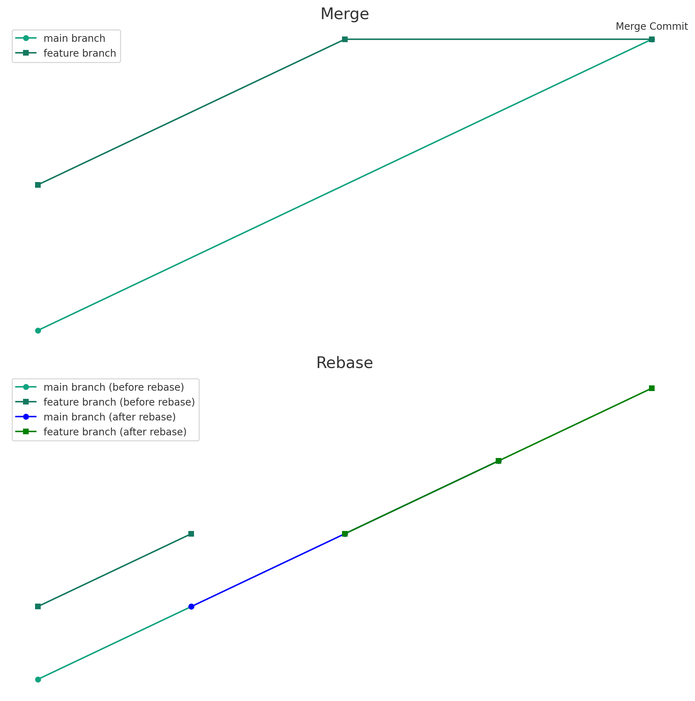
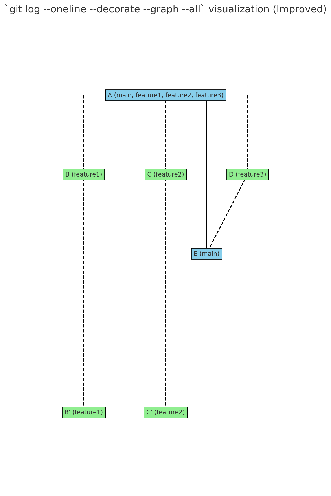

# Merge and rebase

## Merge와 Rebase의 차이



### 병합 (Merge)

- `main` 브랜치와 `feature` 브랜치는 각각 다른 커밋 경로를 가지고 있다
- `feature` 브랜치에서 `main` 브랜치를 병합하면, 두 브랜치의 변경 사항을 모두 포함하는 새로운 커밋 (병합 커밋)이 생성된다

### 리베이스 (Rebase)

- `main` 브랜치와 `feature` 브랜치는 원래 각각 다른 커밋 경로를 가지고 있다
- `feature` 브랜치에서 `main` 브랜치로 리베이스를 수행하면, `feature` 브랜치의 변경 사항이 `main` 브랜치의 최신 상태로 이동된다
- 이 때, `feature` 브랜치의 커밋 기록은 새롭게 변경되며, 이는 마치 `feature` 브랜치의 변경 사항이 `main` 브랜치의 최신 상태 위에서 진행된 것처럼 보이게 된다

## merge와 rebase by git log

시나리오

1. `main` 브랜치에 초기 커밋이 있음
2. `feature1`, `feature2`, `feature3` 브랜치가 각각 `main`에서 분기되어 다양한 작업을 진행
3. `feature3` 브랜치가 먼저 `main`에 병합됨
4. `feature1`와 `feature2` 브랜치가 `main`을 리베이스 합니다.



1. `A` 커밋은 초기 상태에서 `main`, `feature1`, `feature2`, `feature3` 브랜치 모두가 가리키고 있다
2. 각 피처 브랜치에서는 고유한 커밋 (`B`, `C`, `D`)이 발생
3. `feature3`의 `D` 커밋이 `main`에 병합되면서 새로운 병합 커밋 `E`가 생성된다. 이 때 `main`과 `feature3` 브랜치는 이 커밋을 가리키게 된다.
4. `feature1`과 `feature2` 브랜치는 main을 리베이스하면서 새로운 커밋 (`B'`, `C'`)이 생성된다
    - 이 커밋들은 원래의 변경 사항을 포함하지만, 커밋의 기록이 새롭게 변경된다
    - 이는 마치 이 변경 사항들이 `main`의 최신 상태 위에서 진행된 것처럼 보이게 한다

```log
# git log --oneline --decorate --graph --all

* C' (feature2)
* B' (feature1)
* E (main)
| * D (feature3)
| * C 
| * B 
|/
* A
```
