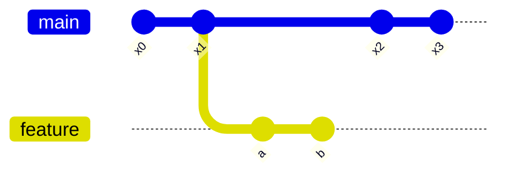
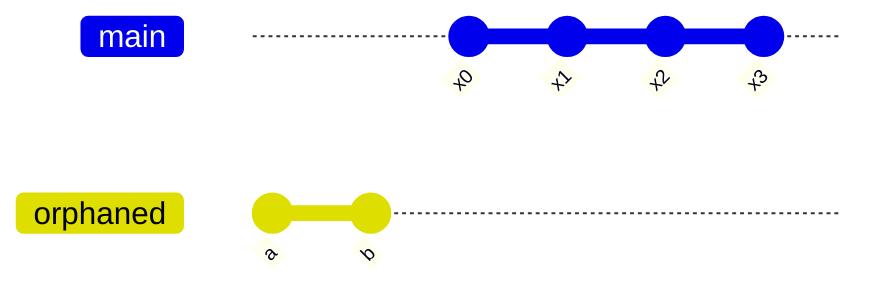

# orphan

## orphan commit

Git에서 orphaned commit은 어떤 브랜치나 태그에 의해 참조되지 않는 커밋을 의미합니다.
이러한 커밋은 부모 커밋 그래프에서 떨어져 나와 있어, 일반적인 Git 명령어로는 접근할 수 없습니다.

### Orphaned Commit의 생성

예를 들어, 브랜치 `feature`에서 커밋 `a`와 `b`를 만든 후

```bash
x0-x1-x2-x3   <- main
     \
      a-b  <- feature
```



브랜치 `feature`를 삭제하면, `a`와 `b` 커밋은 orphaned commit이 됩니다.

```bash
x0-x1-x2-x3   <- main
    
    a-b
```



Mermaid를 사용하여 orphaned commit이 생성되기 전과 후의 Git 그래프를 각각 그려보겠습니다.

### Orphaned Commit의 관리

#### 1. 데이터 복구

실수로 브랜치를 삭제하거나 리셋했을 때, orphaned commit을 통해 데이터를 복구할 수 있습니다.
`git reflog` 명령어를 사용하여 최근의 커밋을 추적하고, 필요한 커밋을 복구할 수 있습니다.

```bash
git reflog
git checkout <commit-hash>
```

#### 2. 임시 작업

새로운 기능을 실험하거나 임시 작업을 수행할 때, orphaned commit을 사용하여 기존 브랜치에 영향을 주지 않고 작업할 수 있습니다.

```bash
git checkout --orphan temp-branch
```

#### 3. 커밋 히스토리 초기화

프로젝트의 커밋 히스토리를 초기화하고 새로 시작하고자 할 때, orphaned commit을 사용하여 새로운 브랜치를 생성하고 기존 히스토리를 제거할 수 있습니다.

```bash
git checkout --orphan new-start
git rm -rf .
git commit --allow-empty -m "Initial commit"
```

### Orphaned Commit의 삭제

#### 자동 삭제: `git gc`

Git은 주기적으로 가비지 컬렉션을 수행하여 참조되지 않는 커밋(즉, orphaned commit)을 자동으로 삭제합니다.
기본적으로 30일 동안 참조되지 않은 커밋은 삭제됩니다.

```bash
git gc --prune=now --aggressive
```

#### 수동 삭제: `git reflog delete`

특정 커밋을 완전히 삭제하려면, 해당 커밋이 참조된 모든 브랜치와 reflog에서 제거해야 합니다.

```bash
git reflog delete <commit-hash>
git gc --prune=now --aggressive
```

### 현실 세계의 사례

#### 1. 소프트웨어 개발

새로운 기능을 개발할 때, 기존 브랜치에 영향을 주지 않기 위해 orphaned commit을 사용하여 실험적인 브랜치를 생성하고 작업할 수 있습니다.

예를 들어, 새로운 알고리즘을 테스트할 때 기존 코드베이스에 영향을 주지 않도록 합니다.

#### 2. 데이터 복구

개발자가 실수로 중요한 브랜치를 삭제했을 때, orphaned commit을 통해 해당 브랜치의 커밋을 복구할 수 있습니다.
이는 데이터 손실을 방지하고, 프로젝트의 연속성을 유지하는 데 중요합니다.

#### 3. 오픈 소스 프로젝트

오픈 소스 프로젝트에서 여러 기여자가 작업할 때, 각 기여자가 자신의 작업을 orphaned commit으로 관리하고, 최종적으로 필요한 커밋만 메인 브랜치에 병합할 수 있습니다.
이는 프로젝트의 일관성을 유지하고, 불필요한 커밋을 제거하는 데 도움이 됩니다.

### 기타

- [Git Documentation](https://git-scm.com/docs/git-reflog): `git reflog` 명령어를 통해 orphaned commit을 추적하고 복구하는 방법을 설명합니다.
- [Stack Overflow](https://stackoverflow.com/questions/7907372/how-to-hard-delete-an-orphan-commit-in-git): orphaned commit을 삭제하는 방법에 대한 다양한 접근법을 논의합니다.
