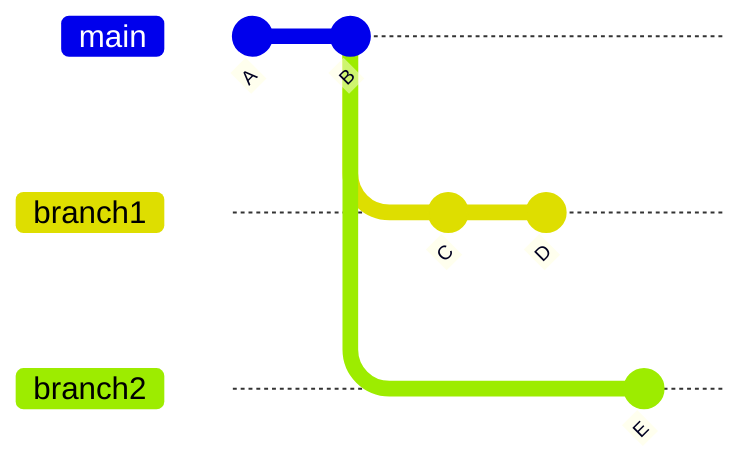
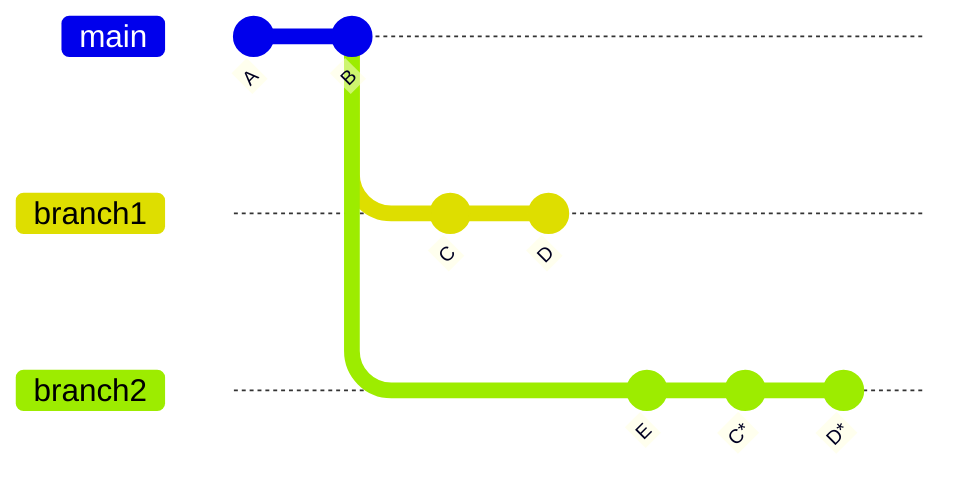
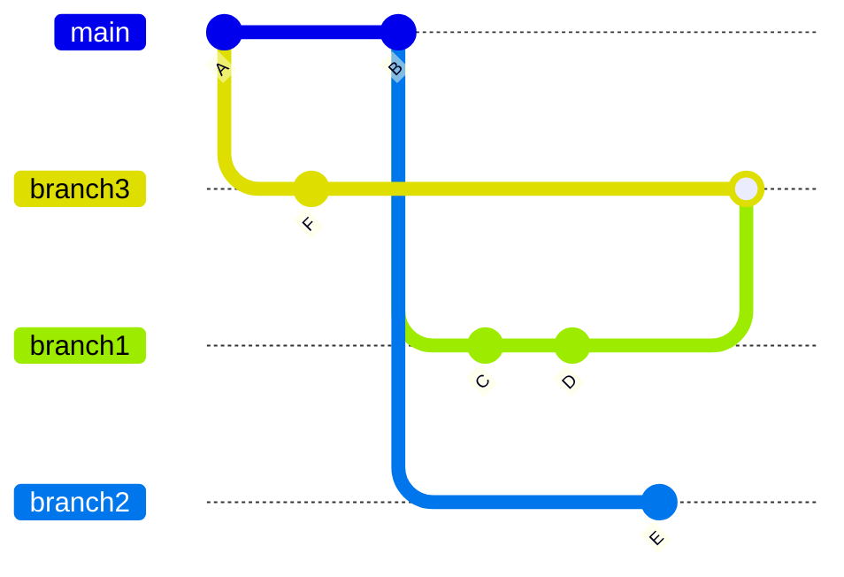
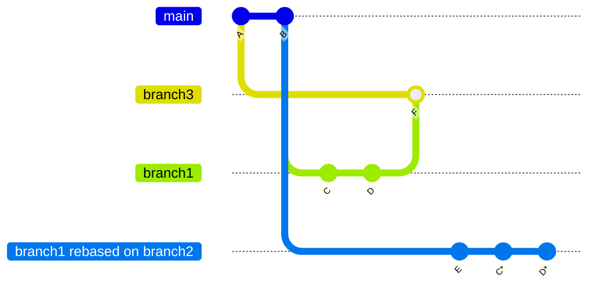

# git rebase

- [git rebase](#git-rebase)
    - [Rebase?](#rebase)
    - [Rebase branches](#rebase-branches)
        - [rebase 기본 동작 방식](#rebase-기본-동작-방식)
        - [rebase commands](#rebase-commands)
    - [git rebase case 1](#git-rebase-case-1)
    - [git rebase case 2](#git-rebase-case-2)
    - [Duplicate commits after rebase](#duplicate-commits-after-rebase)
        - [git rebase 과정의 예시](#git-rebase-과정의-예시)
        - [리베이스로 인해 여러 커밋이 복사된 경우](#리베이스로-인해-여러-커밋이-복사된-경우)
            - [로컬에만 `branch3`가 있는 경우](#로컬에만-branch3가-있는-경우)
            - [`branch3` 또는 `branch1`이 publish 된 경우](#branch3-또는-branch1이-publish-된-경우)
    - [git rebase 되돌리기](#git-rebase-되돌리기)
    - [rebase when do it on github PR](#rebase-when-do-it-on-github-pr)
    - [explanation by chatgpt](#explanation-by-chatgpt)
    - [Options](#options)
        - [`--onto`](#--onto)
    - [squash commit](#squash-commit)
    - [ETC](#etc)
    - [error: The following untracked working tree files would be overwritten by merge](#error-the-following-untracked-working-tree-files-would-be-overwritten-by-merge)
    - [리베이스 충돌](#리베이스-충돌)
    - [IntelliJ에서 git rebase와 충돌 해결 과정](#intellij에서-git-rebase와-충돌-해결-과정)
        - [CLI를 사용한 Rebase 과정](#cli를-사용한-rebase-과정)
    - [Already rebased commits](#already-rebased-commits)
    - [`git commit --allow-empty`](#git-commit---allow-empty)

## Rebase?

- 리베이스는 한 브랜치의 변경 사항을 다른 브랜치의 최신 상태로 이동시키는 작업
- 리베이스를 수행하면, 커밋의 기록이 변경된다

예제:

1. `main` 브랜치와 `feature` 브랜치가 있다
2. `feature` 브랜치에서 새로운 기능을 개발하고, `main` 브랜치는 다른 사람들의 작업으로 인해 업데이트되었다
3. `feature` 브랜치에서 `main` 브랜치로 리베이스를 수행하면, `feature` 브랜치의 변경 사항이 `main` 브랜치의 최신 상태로 이동된다. 이 때 feature 브랜치의 커밋 기록이 변경된다

## [Rebase branches](https://www.jetbrains.com/help/idea/apply-changes-from-one-branch-to-another.html#rebase-branch)

### rebase 기본 동작 방식

*내 로컬 A 브랜치*를 *다른 B 브랜치* 위에 `rebase` 한다는 것은,

1. 본질적으로 *내 로컬 A 브랜치*의 커밋 히스토리를 재작성하는 것이며,
2. 그 결과 *내 로컬 A 브랜치*의 커밋 히스토리는 *내 원격 A 브랜치*의 커밋 히스토리와 달라지게 된다
3. 따라서 `git fetch`를 하면  *내 원격 A 브랜치*로부터 가져올 커밋 내역이 있다고 나오는데, 이는 리베이스 과정에서 커밋 히스토리가 재작성 됐기 때문이다

아래 리베이스 전/후를 비교해보면, 커밋 내역이 재작성 되면서 `55fc57da`, `9a573a45`, `8085be75` 커밋 해시들은 사라졌다. 다만 해당 커밋 히스토리는 원격에 아직 남아 있으므로, IDE나 Github GUI에서는 이 사라진 세 커밋을 원격 브랜치에서 받아올(pull) 수 있는 내역으로 표시한다.

재작성 했으므로 무시하고 `git push --force-with-lease` 통해서 덮어쓴다.

`-`는 리베이스 전, `+`는 리베이스 후

```diff
+   * b03bbd3d (HEAD -> feature/nicepay-on-refactoring_base, feature/nicepay) tossClient request validation (#544)
-   * b03bbd3d (HEAD) tossClient request validation (#544)
    * 4688df32 KsnetClient request validation (#539)
    * b8353f39 Effect 를 사용한 KsnetClient 리팩토링  (#538)
    * 3e39cb74 refactor: add typealias ResponseWithRawString<T> = Pair<T, String>
    * 1a138cd0 chore: remove unused TossPaymentsErrorDecoder and the old request method using it
    * 0bc8cae4 refactor: rename TossPaymentsResponseHandler with postfix Handling
    * 440439a5 refactor!: TossPaymentsClient by using Effect
    * ce7857a7 refactor: add effect version of private request function in TossPaymentsHttpClient
    * e4555126 flyway 적용 (#534)
    * 5b2eb7d1 [PPG-46] feat: 토스페이먼츠 고정식 가상계좌 연동 (#515)
    * b9441ced fix: add catch of ShiftCancellationException in WebClientExt.kt
    * e863c373 refactor: CardInformationClient using Effect
    * c20e65d2 feat: new WebClient extension well-fitted with Effect
    * 12a2b614 fix: 간헐적으로 실패하는 publish-unit-test-results 삭제 (#540)
    * 97b49b65 fix: 의도치 않게 null.toString()를 호출하는 코드 수정 (#527)
    * 339feaae feat: interface Transaction for using Either (#526)
    * 1936fece chore: remove needless qualifiers
    * 09320a6a refactor: ChannelServiceContainer with Spring DI style class
    * 9ac30b64 refactor: ensure presentation tests to share only one postgresql container
    * 514e73fa refactor: ensure infrastructure tests to run with only one postgresql container
    * 35b50c82 refactor: TestPostgreSQLContainer with spring DI style class
    * dbd202b8 refactor: rename field `pgTxId` to `pgCashReceiptId` (#516)
    * a83c80e4 remove requestWithoutBody
    * 7f2b880e add decodeOnlyError
    * 9d0c74a9 move Client to infrastructure & move extension functions to Client member functions
    * b7771b46 lint
    * 27443785 Remove unnecessary method
    * 71701d9c lint
    * 427931da ```KsnetTransaction``` 리팩토링 (#520)
    * d6f619b8 refactor: move ksnetSpecific domain to infra, KsnetTransaction이 iso4217value를 사용하도록 변경 (#518)
    * a9c87e61 refactor: TossPaymentsTransaction
    * bed3fa41 chore: move intoEnumByResolver into ResolvableEnum.kt
    * ef6fda1c chore: remove intoEnumByName
    * 4f5331b1 refactor common http client handling
    * 2dc1c247 KsnetClient issueBilligKey Command제거 (#513)
    * 3605fbb2 Refactor/ksnet escrow (#512)
    * 49977deb refactor: improve readability of KsnetModuleAdaptor
    * f62ce3ea refactor: remove KsnetEasyPay and rename KsnetEasyPay.Provider as KsnetEasyPayProvider
    * c3e16ade chore: rename from KsnetTransformerTest to KsnetCardTest
    * 1be0be56 chore: remove unused CardInfoService and other codes about it
    * 7db955f4 refactor: result type of confirm method in KsnetModule
    * 9695a663 refactor: replace confirm command type with String in KsnetModule
-   | * 55fc57da (feature/nicepay) fix: 잘못된 package 이름 수정
-   | * 9a573a45 fix: 잘못된 package 이름 수정
-   | * 8085be75 refactor: `nicepay-common` 브랜치 코드를 `refactoring_base` 위에서 실행되도록 재작성
+   | * 208e9918 (origin/feat/smartro) [PPG-75] feat: 스마트로 연동 공통 코드 추가 (#535)
-   | | * 208e9918 (origin/feat/smartro) [PPG-75] feat: 스마트로 연동 공통 코드 추가 (#535)
-   | |/
    | * e5495dd7 (tag: v1.3.0-qa.1, tag: v1.2.2-qa.2, origin/release/20230227, release/20230227) tossClient request validation (#544)
    | * e6093878 KsnetClient request validation (#539)
    | * 5d760a5a Effect 를 사용한 KsnetClient 리팩토링  (#538)
+   | | * e8e68c27 (feature/nicepay-latest, feature/nicepay-bak) refactor: `nicepay-common` 브랜치 코드를 `refactoring_base` 위에서 실행되도록 재작성
-   | | * e8e68c27 (feature/nicepay-on-refactoring_base, feature/nicepay-latest, feature/nicepay-bak) refactor: `nicepay-common` 브랜치 코드를 `refactoring_base` 위에서
    실행되도록 재작성
    | | * 2dc3859f fix: 의도치 않게 null.toString()를 호출하는 코드 수정 (#527)
```

재작성된 커밋을 커밋 메시지("잘못된 package 이름 수정")로 검색해서 찾아가 보면 아래와 같이 커밋 해시가 바뀐 것을 볼 수 있다

```log
| | | * 1256ef66 (tag: v1.1.0-ci-test) docker-push-to-ecr.yml: Refactor CI script
| | | * 7e91b815 build.gradle.kts: New plugin, jib
| | | | * 1ad42918 (origin/feature/PPG-77/stc) feat: STC 구현
| | | | | * 26e08e77 (feature/PORT-677-nicepay-cancel, feature/PORT-659-nicepay-checkout) feat: Nicepay 인증 결제 구현
| | | |_|/
| | |/| |
| | * | | 9ab0f066 (origin/feature/nicepay) fix: 잘못된 package 이름 수정
| | * | | fc73b8ec fix: 잘못된 package 이름 수정
| | * | | d41e7744 refactor: `nicepay-common` 브랜치 코드를 `refactoring_base` 위에서 실행되도록 재작성
| | | | | * 3dfc1c17 (origin/feature/PPG-9/paypal-checkout) feat: apply review
| | | | | * 2231e686 fix: apply review
| | | | | * 24c33ec0 feat: implement paypal checkout
| | | | |/
| | | | * 4d49ae34 (origin/feature/paypal) fix: 변경된 PaypalV2 크레덴셜 적용 (#525)
```

### rebase commands

- `git rebase <UPSTREAM> <BRANCH>`
    - `<UPSTREAM>`:
        - 상류. 즉, 현재 브랜치를 올릴 대상.
        - 생략하면 `branch.<name>.remote` 또는 `branch.<name>.merge` 옵션에 설정된 upstream 사용
    - `<BRANCH>`:
        - 작업이 이뤄질 브랜치.
        - 생략하면 현재 브랜치 기준으로 작업 진행

어떤 브랜치를 다른 브랜치 위에 `rebase`할 경우, 첫번째 브랜치로의 커밋들을 두번째 브랜치의 `HEAD` 커밋 위에 적용한다.

```shell
#                |- 1 <- 2 <- 3  (feature)
# A <- B <- C <- D               (main)
#
#                |- 1 <- 2 <- 3  (feature)
# A <- B <- C <- D <- E <- F     (main)

# `main`: <UPSTREAM>
# `feature`: <BRANCH>
git rebase main feature # `git checkout feature`하고, 그 다음에 `git rebase main`하는 것과

# `feature` 브랜치의 커밋들을 `main` 브랜치의 현재 `HEAD` 커밋 위에 적용해서 
# `feature` 브랜치의 변경사항을 `main` 브랜치에 통합
# A <- B <- C <- D <- E <- F <- 1' <- 2' <- 3' (main) // ? main인가? feature가 아니라?
```

[3.6 Git 브랜치 - Rebase 하기](https://git-scm.com/book/ko/v2/Git-%EB%B8%8C%EB%9E%9C%EC%B9%98-Rebase-%ED%95%98%EA%B8%B0)
[Merging vs. Rebasing](https://www.atlassian.com/git/tutorials/merging-vs-rebasing)
[The Golden Rule of Rebasing](https://www.atlassian.com/git/tutorials/merging-vs-rebasing#the-golden-rule-of-rebasing)

일단 두 브랜치가 나뉘기 전인 공통 커밋으로 이동하고 나서 그 커밋부터 지금 Checkout 한 브랜치가 가리키는 커밋까지 diff를 차례로 만들어 어딘가에 임시로 저장해 놓는다.
Rebase 할 브랜치(`feature`)가 합칠 브랜치(`main`)가 가리키는 커밋을 가리키게 하고, 아까 저장해 놓았던 변경 사항을 차례대로 적용.

## git rebase case 1

1. `feature/test1` 체크아웃한 상태에서 `gloga`는 다음과 같다

```shell
*   ba9aab0 (origin/develop) Merge pull request #4 from aimpugn/snippets/220817
|\
| * 5c15700 (origin/snippets/220817, snippets/220817) docs: add commit result message
| * 0788756 docs: git related commands
| * af32326 snippet: 빌드 코드 수정
| * 178383b add snippets
|/
| * 3104fef (HEAD -> feature/test1, origin/feature/test1) docs: add git log related files
|/
*   91cbc8f (origin/main, main, feature/test2, develop) Merge pull request #3 from aimpugn/snippets/220729
|\
| * 4ca0c46 (origin/snippets/220729, snippets/220729) snippet: 빌드 코드 수정
* | 60ac45e Merge pull request #2 from aimpugn/snippets/220729
|\|
| * 779be86 snippet: shell 스니펫
| * 5cca721 snippet: php 스니펫
| * 05c37aa snippet: form -> json 스니펫
| * 9e7c275 snippet:git 관련 스니펫
| * a20a52f snippet: php7.4 & fpm & nginx 1.22.0 스택의 컨테이너
|/
*   8641718 (tag: v0.0.5, tag: v0.0.4, tag: v0.0.3, tag: v0.0.2) Merge pull request #1 from aimpugn/docs/220728-add-snippets
|\
| * b41ef3e (origin/docs/220728-add-snippets, docs/220728-add-snippets) snippets 추가
|/
* 4bb53ba (tag: v0.0.1) 코드 정리 및 추가
* ae0e96e 스크립트 태그를 동적으로 추가하는 코드
```

3. `ba9aab0 (origin/develop)`를 보면, 현재 `origin/develop`에 반영된 것이 local에 반영이 안 되어 있다.

```shell
git checkout develop
git pull

# pick 3104fef docs: add git log related files
# Updating 91cbc8f..ba9aab0
# Fast-forward
#  .gitignore               |    4 +-
#  docs/payments/tax/VAT.md |   61 ++
#  git/commands.md          |   74 ++
#  git/fetch                |    4 +-
#  git/learngitbranching.md |  284 +++++
#  git/log                  |    3 +
#  git/rebase               |   71 ++
#  javascript/query.js      |    6 +-
#  old.js                   | 7986 ++++++++++++++++++++++++++++++++++++++++++++++++++++++++++++++++++++++++++++++++++++++++++++++++++++++++++++++++++++++++++++++++++++++++++++
#  shell/scp                |   12 +
#  shell/sudo               |    5 +
#  shell/tls                |   59 ++
#  shell/tls_chain          |   35 +
#  13 files changed, 8601 insertions(+), 3 deletions(-)
#  create mode 100644 docs/payments/tax/VAT.md
#  create mode 100644 git/commands.md
#  create mode 100644 git/learngitbranching.md
#  create mode 100644 git/log
#  create mode 100644 git/rebase
#  create mode 100644 old.js
#  create mode 100644 shell/scp
#  create mode 100644 shell/sudo
#  create mode 100644 shell/tls
#  create mode 100644 shell/tls_chain
```

3. `develop` 브랜치에서 `git pull` 후, `ba9aab0 (HEAD -> develop, origin/develop)` 통해 이제 origin과 로컬의 브랜치가 같은 선상에 있음을 알 수 있다

```shell
*   ba9aab0 (HEAD -> develop, origin/develop) Merge pull request #4 from aimpugn/snippets/220817
|\
| * 5c15700 (origin/snippets/220817, snippets/220817) docs: add commit result message
| * 0788756 docs: git related commands
| * af32326 snippet: 빌드 코드 수정
| * 178383b add snippets
|/
| * 3104fef (origin/feature/test1, feature/test1) docs: add git log related files
|/
*   91cbc8f (origin/main, main, feature/test2) Merge pull request #3 from aimpugn/snippets/220729
|\
| * 4ca0c46 (origin/snippets/220729, snippets/220729) snippet: 빌드 코드 수정
* | 60ac45e Merge pull request #2 from aimpugn/snippets/220729
|\|
| * 779be86 snippet: shell 스니펫
| * 5cca721 snippet: php 스니펫
| * 05c37aa snippet: form -> json 스니펫
| * 9e7c275 snippet:git 관련 스니펫
| * a20a52f snippet: php7.4 & fpm & nginx 1.22.0 스택의 컨테이너
|/
*   8641718 (tag: v0.0.5, tag: v0.0.4, tag: v0.0.3, tag: v0.0.2) Merge pull request #1 from aimpugn/docs/220728-add-snippets
|\
| * b41ef3e (origin/docs/220728-add-snippets, docs/220728-add-snippets) snippets 추가
|/
* 4bb53ba (tag: v0.0.1) 코드 정리 및 추가
* ae0e96e 스크립트 태그를 동적으로 추가하는 코드
```

4. `feature/test1`을 `develop` 위에 리베이스

```shell
git checkout feature/test1
# -i: interactive
git rebase -i develop
```

5. 이제 `8f05307 (HEAD -> feature/test1)` 커밋이 `ba9aab0 (origin/develop, develop)` 커밋 위에 있는 걸 확인할 수 있다. 하지만 `8f05307 (HEAD -> feature/test1)`와 `3104fef (origin/feature/test1)` 다른 선상에 있어서, 이를 맞춰야 한다

```shell
* 8f05307 (HEAD -> feature/test1) docs: add git log related files
*   ba9aab0 (origin/develop, develop) Merge pull request #4 from aimpugn/snippets/220817
|\
| * 5c15700 (origin/snippets/220817, snippets/220817) docs: add commit result message
| * 0788756 docs: git related commands
| * af32326 snippet: 빌드 코드 수정
| * 178383b add snippets
|/
| * 3104fef (origin/feature/test1) docs: add git log related files
|/
*   91cbc8f (origin/main, main, docs/learning-git) Merge pull request #3 from aimpugn/snippets/220729
|\
| * 4ca0c46 (origin/snippets/220729, snippets/220729) snippet: 빌드 코드 수정
* | 60ac45e Merge pull request #2 from aimpugn/snippets/220729
|\|
| * 779be86 snippet: shell 스니펫
| * 5cca721 snippet: php 스니펫
| * 05c37aa snippet: form -> json 스니펫
| * 9e7c275 snippet:git 관련 스니펫
| * a20a52f snippet: php7.4 & fpm & nginx 1.22.0 스택의 컨테이너
|/
*   8641718 (tag: v0.0.5, tag: v0.0.4, tag: v0.0.3, tag: v0.0.2) Merge pull request #1 from aimpugn/docs/220728-add-snippets
|\
| * b41ef3e (origin/docs/220728-add-snippets, docs/220728-add-snippets) snippets 추가
|/
* 4bb53ba (tag: v0.0.1) 코드 정리 및 추가
* ae0e96e 스크립트 태그를 동적으로 추가하는 코드* ae0e96e 스크립트 태그를 동적으로 추가하는 코드
```

## git rebase case 2

1. `gloga` 결과는 다음과 같다.

```shell
* 323c56b (HEAD -> docs/learning-git) docs: rebase 과정 정리 문서
| * 6973e22 (origin/feature/test1, feature/test1) add git commands
| *   d02daac Merge remote-tracking branch 'origin/feature/test1' into feature/test1
| |\
| | * 3104fef docs: add git log related files
| |/
|/|
| * 8f05307 docs: add git log related files
| * ba9aab0 (origin/develop, develop) Merge pull request #4 from aimpugn/snippets/220817
|/|
| * 5c15700 (origin/snippets/220817, origin/pr/4, snippets/220817) docs: add commit result message
| * 0788756 docs: git related commands
| * af32326 snippet: 빌드 코드 수정
| * 178383b add snippets
|/
*   91cbc8f (origin/main, main) Merge pull request #3 from aimpugn/snippets/220729
|\
| * 4ca0c46 (origin/snippets/220729, origin/pr/3, snippets/220729) snippet: 빌드
코드 수정
* | 60ac45e Merge pull request #2 from aimpugn/snippets/220729
|\|
| * 779be86 (origin/pr/2) snippet: shell 스니펫
| * 5cca721 snippet: php 스니펫
| * 05c37aa snippet: form -> json 스니펫
| * 9e7c275 snippet:git 관련 스니펫
| * a20a52f snippet: php7.4 & fpm & nginx 1.22.0 스택의 컨테이너
|/
*   8641718 (tag: v0.0.5, tag: v0.0.4, tag: v0.0.3, tag: v0.0.2) Merge pull request #1 from aimpugn/docs/220728-add-snippets
|\
| * b41ef3e (origin/pr/1, origin/docs/220728-add-snippets, docs/220728-add-snippets) snippets 추가
|/
* 4bb53ba (tag: v0.0.1) 코드 정리 및 추가
* ae0e96e 스크립트 태그를 동적으로 추가하는 코드
```

2. `gloga` 결과가 위와 같을 때, `docs/learning-git` 브랜치에서 `git rebase -i develop` 실행하면 다음과 같이 된다

```shell
pick 323c56b docs: rebase 과정 정리 문서

# Rebase ba9aab0..323c56b onto ba9aab0 (1 command)
#
# Commands:
# p, pick <commit> = use commit
# r, reword <commit> = use commit, but edit the commit message
# e, edit <commit> = use commit, but stop for amending
# s, squash <commit> = use commit, but meld into previous commit
# f, fixup [-C | -c] <commit> = like "squash" but keep only the previous
#                    commit's log message, unless -C is used, in which case
#                    keep only this commit's message; -c is same as -C but
#                    opens the editor
# x, exec <command> = run command (the rest of the line) using shell
# b, break = stop here (continue rebase later with 'git rebase --continue')
# d, drop <commit> = remove commit
# l, label <label> = label current HEAD with a name
# t, reset <label> = reset HEAD to a label
# m, merge [-C <commit> | -c <commit>] <label> [# <oneline>]
# .       create a merge commit using the original merge commit's
# .       message (or the oneline, if no original merge commit was
# .       specified); use -c <commit> to reword the commit message
#
# These lines can be re-ordered; they are executed from top to bottom.
#
# If you remove a line here THAT COMMIT WILL BE LOST.
#
# However, if you remove everything, the rebase will be aborted.
#
```

3. 리베이스 후에는 아래와 같이 된다

```shell
* 4df27c7 (HEAD -> docs/learning-git) docs: rebase 과정 정리 문서
| * 6973e22 (origin/feature/test1, feature/test1) add git commands
| *   d02daac Merge remote-tracking branch 'origin/feature/test1' into feature/test1
| |\
| | * 3104fef docs: add git log related files
| * | 8f05307 docs: add git log related files
|/ /
* |   ba9aab0 (origin/develop, develop) Merge pull request #4 from aimpugn/snippets/220817
|\ \
| |/
|/|
| * 5c15700 (origin/snippets/220817, origin/pr/4, snippets/220817) docs: add commit result message
| * 0788756 docs: git related commands
| * af32326 snippet: 빌드 코드 수정
| * 178383b add snippets
|/
*   91cbc8f (origin/main, main) Merge pull request #3 from aimpugn/snippets/220729
|\
| * 4ca0c46 (origin/snippets/220729, origin/pr/3, snippets/220729) snippet: 빌드
코드 수정
* | 60ac45e Merge pull request #2 from aimpugn/snippets/220729
|\|
| * 779be86 (origin/pr/2) snippet: shell 스니펫
| * 5cca721 snippet: php 스니펫
| * 05c37aa snippet: form -> json 스니펫
| * 9e7c275 snippet:git 관련 스니펫
| * a20a52f snippet: php7.4 & fpm & nginx 1.22.0 스택의 컨테이너
|/
*   8641718 (tag: v0.0.5, tag: v0.0.4, tag: v0.0.3, tag: v0.0.2) Merge pull request #1 from aimpugn/docs/220728-add-snippets
|\
| * b41ef3e (origin/pr/1, origin/docs/220728-add-snippets, docs/220728-add-snippets) snippets 추가
|/
* 4bb53ba (tag: v0.0.1) 코드 정리 및 추가
* ae0e96e 스크립트 태그를 동적으로 추가하는 코드
```

4. 현재 `origin/docs/learning-git` 없으므로, 이를 추가한다

```shell
git push --progress --porcelain origin refs/heads/docs/learning-git:refs/heads/docs/learning-git --set-upstream

# Enumerating objects: 6, done.
# Counting objects: 100% (6/6), done.
# Delta compression using up to 10 threads
# Compressing objects: 100% (4/4), done.
# Writing objects: 100% (4/4), 1.67 KiB | 1.67 MiB/s, done.
# Total 4 (delta 2), reused 0 (delta 0), pack-reused 0
# remote: Resolving deltas: 100% (2/2), completed with 2 local objects.
# remote:
# remote: Create a pull request for 'docs/learning-git' on GitHub by visiting:
# remote:      https://github.com/aimpugn/snippets/pull/new/docs/learning-git
# remote:
# To https://github.com/aimpugn/snippets.git
# * refs/heads/docs/learning-git:refs/heads/docs/learning-git [new branch]
# Branch 'docs/learning-git' set up to track remote branch 'docs/learning-git' from 'origin'.
# Done
```

## Duplicate commits after rebase

- [Duplicate commits after rebase have been merged into the develop branch](https://stackoverflow.com/questions/40551486/duplicate-commits-after-rebase-have-been-merged-into-the-develop-branch)
- [Git commits are duplicated in the same branch after doing a rebase](https://stackoverflow.com/questions/9264314/git-commits-are-duplicated-in-the-same-branch-after-doing-a-rebase)

커밋을 복사하는 것이 `git rebase`가 하는 일. 커밋을 복사한 다음, 원래 커밋을 잊거나(forget) 포기(abandon)하도록 브랜치 포인터를 섞는다.

### git rebase 과정의 예시

아래와 같이 같이 "original" 커밋만 가지고 있는 경우를 가정해보자.

- 각 `A`, `B`, `C`, `D`는 각각 하나의 커밋이고,
- 브랜치 이름은 분기의 끝(tip of branch)에 있는 한 커밋만 가리킨다.
- 각 커밋은 그 부모 커밋을 가리킨다. `A--B` 연결 라인은 실제로는 `A<--B`를 의미한다



```log
* 562d3dd (HEAD -> branch2) E
| * ecfea93 (branch1) D
| * 138b48a C
|/
* 3d36309 (main) B
* 5ccdaa4 A
```

`git checkout branch1` 후 `git rebase branch2`를 할 경우 `C`와 `D`는 `E` 다음에 오게 된다. 이때 git은 실제로 원래 `C--D`를 바꾸지 않고 대신에 `C*`, `D*`라는 커밋으로 복사한다.

```log
* e918ad2 (HEAD -> branch1) D
* 32bd1b0 C
* 562d3dd (branch2) E
* 3d36309 (main) B
* 5ccdaa4 A
```

```reflog
e918ad2 (HEAD -> branch1) HEAD@{0}: rebase (finish): returning to refs/heads/branch1
e918ad2 (HEAD -> branch1) HEAD@{1}: rebase (pick): D
32bd1b0 HEAD@{2}: rebase (pick): C
562d3dd (branch2) HEAD@{3}: rebase (start): checkout branch2 // git rebase branch2
ecfea93 HEAD@{4}: checkout: moving from branch2 to branch1 // git checkout branch1
562d3dd (branch2) HEAD@{5}: commit: E
3d36309 (main) HEAD@{6}: checkout: moving from main to branch2 // git checkout -b branch2
3d36309 (main) HEAD@{7}: checkout: moving from branch1 to main // git checkout main
ecfea93 HEAD@{8}: commit: D
138b48a HEAD@{9}: commit: C
3d36309 (main) HEAD@{10}: checkout: moving from main to branch1 // git checkout -b branch1
3d36309 (main) HEAD@{11}: commit: B
5ccdaa4 HEAD@{12}: commit (initial): A
```

이제 원래 커밋 `C--D`를 이제 잊어버려도 되지만, 만약 이게 좋은 생각이 아니었다고 결정하게 된다면 어떻게 될까?

rebase는 브랜치의 원래 값을 기억하기 위해 `reflogs`에 이를 유지하며, 특별한 이름인 `ORIG_HEAD`를 사용한다. 사용하기 쉽지만, 오직 하나의 `ORIG_HEAD`가 있는 반면, 잠재적으로 무한한 수의 `reflog` 항목들(entries)이 있다. `reflog` 항목들은 기본적으로 최소 30일 유지되며, 마음을 바꿀 시간을 준다.



리베이스 후 커밋 로그가 중복으로 나오는 문제는, 이전 커밋을 기억하는 게 브랜치 이름만이 아니기 때문이다. **각 커밋 또한 각자의 이전 커밋을 기억**한다

만약 `C`와 `D`를 기억하는 다른 이름 또는 다른 (머지) 커밋이 있다면 어떻게 될까?



```shell
 rody  ~/IdeaProjects/test-git   branch3  git merge branch1
Updating 5ccdaa4..e5d7cbf
Fast-forward
 B.txt | 1 +
 C.txt | 1 +
 D.txt | 1 +
 3 files changed, 3 insertions(+)
 create mode 100644 B.txt
 create mode 100644 C.txt
 create mode 100644 D.txt
```

```log
// before merge
* 3d253a6 (branch2) E
| * e5d7cbf (branch1) D
| * db9540b C
|/
* a69790a (HEAD -> main) B
* 5ccdaa4 (branch3) A

// after merge
* 3d253a6 (branch2) E
| * e5d7cbf (HEAD -> branch3, branch1) D
| * db9540b C
|/
* a69790a (main) B
* 5ccdaa4 A
```

여기서 `git checkout branch1` 후 `git rebase branch2` 한다면 아래처럼 된다

`F` 커밋은 머지 커밋으로, `A`와 `D` 커밋을 가리키고 있다. 따라서 원본 `C`를 유지하는 원본 `D`를 유지하게 된다(`C<--D`).

`F`는 머지 커밋이 아닌 일반적인 병범한 커밋일 수 있고, 이 커밋이 `D`를 가리키고 있다면 같은 문제가 발생한다. 이 경우 `F`는 `D`만 가리키고 `A`는 가리키지 않게 되므로 `branch3`도 리베이스할 수 있다.



```log
* 964798e (HEAD -> branch1) D
* 6a4631b C
* 3d253a6 (branch2) E
| * e5d7cbf (branch3) D
| * db9540b C
|/
* a69790a (main) B
* 5ccdaa4 A
```

### 리베이스로 인해 여러 커밋이 복사된 경우

결국 이 문제는 아래 같은 조건의 경우 발생한다

1. 나 또는 다른 사람이 만든 커밋을 복사하고,
2. 여전히 나와 다른 누군가(또 다른 나)가 **원래 커밋을 사용**

#### 로컬에만 `branch3`가 있는 경우

새로운 `F*` 커밋을 만들어서(즉 리베이스해서) 수정할 수 있다

#### `branch3` 또는 `branch1`이 publish 된 경우

이 경우 누군가가 `origin/branch1` 또는 `origin/branch3` 브랜치를 가질 수 있기 때문에, 원래 `C--D` 커밋 체인에 대한 제어를 상실한다

private(unpublished) 커밋만 리베이스하는 것이 표준적인 조언(standard advice)

만약 리베이스를 했고 이를 publish 했다면, 갇혀버린다(you're kind of stuck). 리베이스를 취소(undo)할 수 있고 `origin`을 사용하는 모두에게 공유하여 `C*--D*` 복사본을 사용하지 않도록 요해야 한다.

## git rebase 되돌리기

- Undoing a git rebase

```shell
git reflog
```

```log
3859c1a3 (HEAD -> feature/nicepay, origin/refactoring_base, refactoring_base) HEAD@{0}: checkout: moving from feature/nicepay-common to feature/nicepay
39e3cf00 (origin/feature/nicepay-common, feature/nicepay-common) HEAD@{1}: rebase (abort): updating HEAD
02339086 HEAD@{2}: rebase (continue): refactor: nicepay의 공통 부분을 refactoring_base에 맞게 리팩토링
3859c1a3 (HEAD -> feature/nicepay, origin/refactoring_base, refactoring_base) HEAD@{3}: rebase (start): checkout feature/nicepay
39e3cf00 (origin/feature/nicepay-common, feature/nicepay-common) HEAD@{4}: checkout: moving from feature/nicepay to feature/nicepay-common
3859c1a3 (HEAD -> feature/nicepay, origin/refactoring_base, refactoring_base) HEAD@{5}: rebase (finish): returning to refs/heads/feature/nicepay
3859c1a3 (HEAD -> feature/nicepay, origin/refactoring_base, refactoring_base) HEAD@{6}: rebase (start): checkout refactoring_base
a60f3b34 (origin/feature/nicepay) HEAD@{7}: checkout: moving from feature/nicepay-common to feature/nicepay
39e3cf00 (origin/feature/nicepay-common, feature/nicepay-common) HEAD@{8}: checkout: moving from feature/nicepay to feature/nicepay-common
a60f3b34 (origin/feature/nicepay) HEAD@{9}: checkout: moving from feature/nicepay-common to feature/nicepay
29f74614 HEAD@{10}: rebase (continue) (finish): returning to refs/heads/feature/nicepay-common
29f74614 HEAD@{11}: rebase (continue) (pick): refactor: naming translate 불필요한 regex 비교 코드 제거
e39c68ea HEAD@{12}: rebase (continue): refactor: domain -> infrastructure 레이어 분리에 따른 코드 수정
40e76336 HEAD@{13}: rebase (continue) (pick): docs: useIframe에 대한 설명 추가 및 오타 수정.
5112507d HEAD@{14}: rebase (continue): refactor: row에서 enum 사용하지 않기로 하여 수정
bd21f9e9 HEAD@{15}: rebase (continue) (pick): refactor: raw request를 infra에서 처리 후 필요한 데이터를 도메인에 맞게 변환하여 반환하도록 수정
480872bf HEAD@{16}: rebase (continue) (pick): fix: 주석처리된 불필요 코드 제거
ce24f5b5 HEAD@{17}: rebase (continue) (pick): docs: 없어진 변수에 대한 설명 제거
bb933269 HEAD@{18}: rebase (continue) (pick): fix: 잘못된 package 이름 수정
13f75a21 HEAD@{19}: rebase (continue): refactor: 해시, 암호화 등은 infra에서 PG사 요청 시에만 필요할 것으로 보여 infra로 이동
0786ac2a HEAD@{20}: rebase (continue): refactor: nicepay의 공통 부분을 refactoring_base에 맞게 리팩토링
3859c1a3 (HEAD -> feature/nicepay, origin/refactoring_base, refactoring_base) HEAD@{21}: rebase (start): checkout refactoring_base
39e3cf00 (origin/feature/nicepay-common, feature/nicepay-common) HEAD@{22}: commit: refactor: naming translate 불필요한 regex 비교 코드 제거
72321d1d HEAD@{23}: commit: refactor: domain -> infrastructure 레이어 분리에 따른 코드 수정
ab87947c HEAD@{24}: commit: docs: useIframe에 대한 설명 추가 및 오타 수정.
e68a5194 HEAD@{25}: commit: refactor: row에서 enum 사용하지 않기로 하여 수정
d3b9bfbc HEAD@{26}: commit: refactor: raw request를 infra에서 처리 후 필요한 데이터를 도메인에 맞게 변환하여 반환하도록 수정
8d1c39b3 HEAD@{27}: commit: fix: 주석처리된 불필요 코드 제거
032030ec (feature/nicepay-checkout-and-cancels) HEAD@{28}: checkout: moving from feature/nicepay-checkout-and-cancels to feature/nicepay-common
032030ec (feature/nicepay-checkout-and-cancels) HEAD@{29}: reset: moving to 032030ec9c047fac7d0cd7e76e8693cf125d8d81
4196b2f6 HEAD@{30}: commit: fix: 주석처리된 불필요 코드 제거
```

rebase는 과거 상태를 `ORIG_HEAD`로 유지해 두므로, `ORIG_HEAD`로 이전 상태로 돌아갈 수 있다

```shell
git reset --hard ORIG_HEAD
```

## rebase when do it on github PR

```shell
git checkout main && git pull && git checkout -b rebase/temp-2303071821
```

```log
*   d15ff63 (test/develop) Merge branch 'test/develop-B' into test/develop
|\  
| * 82da526 (test/develop-B) test develop B
* | 280f017 (test/develop-A) test develop A
|/  
* b8d3f58 (test/rebase-b1-b1) 2nd depth branch for testing rebase
* c8aa586 (test/rebase-b1) 1st depth branch. modified file to test rebase
* c6e9f5f 1st depth branch for testing rebase
| * a37aa1d (HEAD -> rebase/temp-2303071821, test/hotfix, main) test hotfix
|/  
| * 964798e (branch1) D
| * 6a4631b C
| * 3d253a6 (branch2) E
|/  
| * e5d7cbf (branch3) D
| * db9540b C
|/  
* a69790a B
* 5ccdaa4 A
```

```shell
❯ git rebase main test/develop
Successfully rebased and updated refs/heads/test/develop.
```

```log
* d48f5b7 (HEAD -> test/develop) test develop B
* 491b083 test develop A
* 714f317 2nd depth branch for testing rebase
* dd0152e 1st depth branch. modified file to test rebase
* d4ee277 1st depth branch for testing rebase
* a37aa1d (test/hotfix, rebase/temp-2303071821, main) test hotfix
| * 280f017 (test/develop-A) test develop A
| | * 82da526 (test/develop-B) test develop B
| |/  
| * b8d3f58 (test/rebase-b1-b1) 2nd depth branch for testing rebase
| * c8aa586 (test/rebase-b1) 1st depth branch. modified file to test rebase
| * c6e9f5f 1st depth branch for testing rebase
|/  
| * 964798e (branch1) D
| * 6a4631b C
| * 3d253a6 (branch2) E
|/  
| * e5d7cbf (branch3) D
| * db9540b C
|/  
* a69790a B
* 5ccdaa4 A
```

```shell
❯ git merge --ff-only test/develop
Updating a37aa1d..d48f5b7
Fast-forward
 rebase-b1-b1.txt | 1 +
 rebase.txt       | 2 ++
 test_develop_A   | 1 +
 test_develop_B   | 1 +
 4 files changed, 5 insertions(+)
 create mode 100644 rebase-b1-b1.txt
 create mode 100644 rebase.txt
 create mode 100644 test_develop_A
```

```log
* d48f5b7 (HEAD -> main, test/develop) test develop B
* 491b083 test develop A
* 714f317 2nd depth branch for testing rebase
* dd0152e 1st depth branch. modified file to test rebase
* d4ee277 1st depth branch for testing rebase
* a37aa1d (test/hotfix, rebase/temp-2303071821) test hotfix
| * 280f017 (test/develop-A) test develop A
| | * 82da526 (test/develop-B) test develop B
| |/  
| * b8d3f58 (test/rebase-b1-b1) 2nd depth branch for testing rebase
| * c8aa586 (test/rebase-b1) 1st depth branch. modified file to test rebase
| * c6e9f5f 1st depth branch for testing rebase
|/  
| * 964798e (branch1) D
| * 6a4631b C
| * 3d253a6 (branch2) E
|/  
| * e5d7cbf (branch3) D
| * db9540b C
|/  
* a69790a B
* 5ccdaa4 A
```

## explanation by chatgpt

Sure, I can explain what will happen when you rebase your feature/add-some-feature branch onto the develop branch using the GitHub UI and provide equivalent Git CLI commands.

When you click the Rebase and merge button on the GitHub UI, the following will happen:

1. Git will create a new temporary branch that is based on the develop branch.
   CLI equivalent: `git checkout develop && git pull && git checkout -b temporary-branch`

2. Git will apply the changes from your feature/add-some-feature branch onto the temporary branch, one commit at a time.
    CLI equivalent: `git rebase develop feature/add-some-feature`
3. Git will fast-forward the develop branch to the new temporary branch, effectively integrating the changes from your feature/add-some-feature branch.
   CLI equivalent: `git checkout develop && git merge --ff-only temporary-branch && git branch -d temporary-branch`

Note that in step 2, Git may pause the rebase process and prompt you to resolve conflicts between the changes made in your feature/add-some-feature branch and the changes in the develop branch. If this happens, you will need to resolve the conflicts manually before continuing the rebase process.

After the rebase process is complete, your feature/add-some-feature branch will no longer exist in its original form, as the changes have been integrated into the develop branch. Instead, you will have a new commit on the develop branch that reflects the changes made in your feature/add-some-feature branch.

In general, rebasing is a powerful but potentially risky operation, as it can change the history of a branch and alter the relationship between different branches in the repository. It's important to carefully review the changes made during a rebase, and to communicate with your team members to ensure that everyone is aware of any changes to the Git history.

## Options

### `--onto`

```shell
git rebase --onto <new_base_target> <from> <to>
# main의 핫픽스들을 develop에 머지하고 싶음
# git rebase --onto rebase/tmp-develop-to-merge-channel-migration \
#                   ^^^^^^^^^^^^^^^^^^^^^^^^^^^^^^^^^^^^^^^^^^^^^ develop에 합치기 위해 임시로 develop에서 새로 빼낸 브랜치
#   dfcf6e02ba49e83a925909d907eb7a54f06f6df rebase/tmp-main-to-merge-channel-migration
#   ^^^^^^^^^^^^^^^^^^^^^^^^^^^^^^^^^^^^^^^ ^^^^^^^^^^^^^^^^^^^^^^^^^^^^^^^^^^^^^^^^^^
#   핫픽스 전의 커밋                            핫픽스가 반영된 메인으로부터 임시로 새로 생성한 브랜치

git checkout develop && git checkout -b rebase/tmp-develop-base
git checkout main && git checkout -b rebase/tmp-main-latest-to-develop

git rebase --onto rebase/tmp-develop-base \
    6b1244b8 rebase/tmp-main-latest-to-develop
```

- `<target_base>`: 리베이스 진행하려는 타겟
- `<from>`: 리베이스 시 모든 커밋을 리베이스하지 않고, 특정 커밋 기준부터 스캔을 하는데, 그 시작점이 되는 커밋/브랜치
- `<to>`: 특정 커밋 기준부터 스캔을 하는데, 그 끝이 되는 커밋/브랜치. 그리고 이 브랜치에 리베이스 된 결과가 합쳐지고, 체크아웃한다

```shell
# git book 예제
git rebase --onto master server client
```

```shell
❯ git rebase --onto rebase/230317-develop rebase/230317-develop rebase/230317-main-hotfix-to-develop
warning: skipped previously applied commit 7abcf8d92
warning: skipped previously applied commit 3fbcbc09d
warning: skipped previously applied commit b9f807f97
warning: skipped previously applied commit dbe1ebac3
warning: skipped previously applied commit 41c2fff88
warning: skipped previously applied commit 5d88e133c
warning: skipped previously applied commit 23418e085
warning: skipped previously applied commit fb054ce9f
warning: skipped previously applied commit 5326fe443
warning: skipped previously applied commit c13764a35
warning: skipped previously applied commit 9c810ad64
warning: skipped previously applied commit c79459a4b
warning: skipped previously applied commit ec483238a
warning: skipped previously applied commit 2f5790a47
warning: skipped previously applied commit 9a4c858b2
warning: skipped previously applied commit 7d90467bb
warning: skipped previously applied commit b85cd7e78
warning: skipped previously applied commit 78121535b
warning: skipped previously applied commit 76edfe09d
warning: skipped previously applied commit b2a2882d2
warning: skipped previously applied commit 868d31a72
warning: skipped previously applied commit f8f7477b7
warning: skipped previously applied commit a575afc44
warning: skipped previously applied commit efd3c4662
warning: skipped previously applied commit edc4e0822
warning: skipped previously applied commit afbc19a9c
warning: skipped previously applied commit f45456ccd
warning: skipped previously applied commit 914c21b98
warning: skipped previously applied commit e6aa83ca2
warning: skipped previously applied commit 8f42ece69 // 아래에 있을수록 최신
warning: skipped previously applied commit f4cfb4ef3 // 263da51c9 아래 커밋 
warning: skipped previously applied commit 263da51c9 // tag: v1.44.5 바로 아래 커밋
warning: skipped previously applied commit b13998d50 // tag: v1.44.5 버전의 커밋
warning: skipped previously applied commit 81c82acfc // tag: v1.45.0, 주변 커밋
```

- Rebasing branch `rebase/230317-main-hotfix-to-develop` onto `9155d671`

```git
| | * | | 7c87c3dff Hotfix/add b3 header for grpc (#529) // IntelliJ 우측 패널
| * | | |   d83145907 Merge branch 'main' into hotfix/PORT-688-logging-for-migrating-v1-to-checkout-service
| |\ \ \ \
| |/ / / /
|/| | | |
* | | | |   1a75abfc2 (tag: v1.42.6) Merge pull request #531 from some-org/release/230213
|\ \ \ \ \
| * \ \ \ \   c1a4547e0 Merge pull request #532 from some-org/fix/resolve-conflict-main-release_230213
| |\ \ \ \ \
| | * | | | | 9f092c5e7 Resolve merge conflict main release 230213
| |/| | | | |
| |/ / / / /
|/| | | | |
* | | | | |   1658b4589 (tag: v1.42.5) Merge pull request #526 from some-org/hotfix/add-b3-header-for-grpc
|\ \ \ \ \ \
| * | | | | | 404a4eaac feat: add b3 header and log in tosspayments billing key issue request
| * | | | | | 730dd2511 (origin/hotfix/add-parent-span-id) feat: change span id for logging
| * | | | | | ca08586a3 feat: generate spanId from header if null
| * | | | | | a60f722ad feat: add log for retry when gRPC timeout occurred
| * | | | | | a4fe3b939 feat: add b3 header to gRPC requests
| * | | | | | 703ec4d12 feat: add b3 header context to port logger output
| * | | | | | 2167f5b7b feat: set b3 header in context when get request
| * | | | | | f4004c5d5 feat: add util for trace header
|/ / / / / /
| * | | | |   7aaba8597 Merge pull request #530 from some-org/hotfix/add-b3-header-for-grpc
| |\ \ \ \ \
| | * \ \ \ \   789edd29d Merge branch 'develop' into hotfix/add-b3-header-for-grpc
| | |\ \ \ \ \
| | | | |/ / /
| | | |/| | |
| | | * | | | f93443d06 feat :  grpc deadline exceeded 발생 시, retry
| | | * | | | c025f0d46 feat : grpc deadline exceeded 발생 시, retry 처리
| | | * | | | 74e55d2af feat : grpc deadline exceeded 발생 시, retry 처리
| | | * | | | ee7255753 fix: change kcp quickpay domain
| | | * | | | c9a0e4591 Exclude autogenerated protobuf files from SonarCloud
| | * | | | | 08aee5f2e feat: add b3 header and log in tosspayments billing key issue request
| | * | | | | e3cee25ba feat: change span id for logging
| | * | | | | 82bebc81d feat: generate spanId from header if null
| | * | | | | 032ce57d3 feat: add log for retry when gRPC timeout occurred
| | * | | | | 58d9c968b feat: add b3 header to gRPC requests
| | * | | | | e689465c4 feat: add b3 header context to port logger output
| | * | | | | bde53ae72 feat: set b3 header in context when get request
| | * | | | | 5d4ac9748 feat: add util for trace header
| | * | | | | 99417365b feat :  grpc deadline exceeded 발생 시, retry
| | * | | | | 5b37e3a41 feat : grpc deadline exceeded 발생 시, retry 처리
| | * | | | | d3258b1eb feat : grpc deadline exceeded 발생 시, retry 처리
| | * | | | | c26db1980 fix: change kcp quickpay domain
| |/ / / / /
| * | | | |   fb7a02455 Merge pull request #528 from some-org/fix/append-kcp-merchant-uid-whitelist
| |\ \ \ \ \
| | * | | | | 7775855b7 feat: append whitelist for mid using merchant_uid as kcp oid
| |/ / / / /
| * | | | |   b6a4467ce Merge pull request #521 from some-org/fix/PORT-650-wpay-isp-data
| |\ \ \ \ \
| | |/ / / /
| |/| | | |
| | * | | | 8ebded9e3 fix: kcp_wpay_yn is shipped as data
| |/ / / /
| * | | |   4becc55d4 (feature/PORT-659-nicepay-checkout) Merge pull request #519 from some-org/fix/PORT-694_paymentwall_notice_when_failed
| |\ \ \ \
| | * | | | c43cb2bf3 fix: MpaymentsController.php: rename `succcess_notice` to `send_notice_webhook`
| | * | | | d2825a49c (fix/PORT-694_paymentwall_notice_when_failed) fix: 잘못된 코드 삭제
| | * | | | 3dddcbc96 fix: 핑백 수신 시 결제상태가 `failed`인 경우도 가맹점 결제통보 전송하도록 변경
| | * | | | 6009698d6 refactor: rename `succcess_notice` to `send_notice_webhook`
| * | | | |   7aa6a5c5f Merge pull request #516 from some-org/fix/PORT-650-wpay-isp
| |\ \ \ \ \
| | |/ / / /
| |/| | | |
| | * | | | 3f4631387 (fix/PORT-650-wpay-isp) chore: Reword
| | * | | | 90bbab11f fix: 모바일은 분기처리 불필요 확인받음에 따라 수정
| | * | | | 8a13f9f28 fix: KCP 우리카드 다이렉트 ISP 이슈 수정
| * | | | |   2c351424d Merge pull request #513 from some-org/feature/remove-danal-giftcard-false-alarm
| |\ \ \ \ \
| | * | | | | a4239b014 feat: remove false alarm from danal gift cards controller
| | |/ / / /
| * | | | |   ce1e68531 Merge pull request #458 from some-org/fix/docs-inicis-unified
| |\ \ \ \ \
| | |/ / / /
| |/| | | |
| | * | | | 6c9e399ff docs: Fix wrong comments about inicis certs
| | | * | | 16ef28f56 fix: change size and number of log rotations
| | | * | | 811fd8e0a style: 카멜 케이스로 수정
| | | * | | 91ca39af8 refactor: 각 라인이 json으로만 남기도록 수정
| | | * | | 6bf0779f7 docs: 주석 설명 추가 및 함수명 수정
| | | * | | c5ef4848e refactor: send log data by listening message event
| | | * | | f6d372a69 chore: leave logs of raw requests from merchants
| |_|/ / /
|/| | | |
* | | | |   cf173c681 (tag: v1.42.4) Merge pull request #524 from some-org/hotfix/PORT-682-retry-grpc-call
|\ \ \ \ \
| * \ \ \ \   f693a391f Merge branch 'main' into hotfix/PORT-682-retry-grpc-call
| |/ / / / /
| * | | | |   b6a4467ce Merge pull request #521 from some-org/fix/PORT-650-wpay-isp-data
| |\ \ \ \ \
| | |/ / / /
| |/| | | |
| | * | | | 8ebded9e3 fix: kcp_wpay_yn is shipped as data
| |/ / / /
| * | | |   4becc55d4 (feature/PORT-659-nicepay-checkout) Merge pull request #519 from some-org/fix/PORT-694_paymentwall_notice_when_failed
| |\ \ \ \
| | * | | | c43cb2bf3 fix: MpaymentsController.php: rename `succcess_notice` to `send_notice_webhook`
| | * | | | d2825a49c (fix/PORT-694_paymentwall_notice_when_failed) fix: 잘못된 코드 삭제
| | * | | | 3dddcbc96 fix: 핑백 수신 시 결제상태가 `failed`인 경우도 가맹점 결제통보 전송하도록 변경
| | * | | | 6009698d6 refactor: rename `succcess_notice` to `send_notice_webhook`
| * | | | |   7aa6a5c5f Merge pull request #516 from some-org/fix/PORT-650-wpay-isp
| |\ \ \ \ \
| | |/ / / /
| |/| | | |
| | * | | | 3f4631387 (fix/PORT-650-wpay-isp) chore: Reword
| | * | | | 90bbab11f fix: 모바일은 분기처리 불필요 확인받음에 따라 수정
| | * | | | 8a13f9f28 fix: KCP 우리카드 다이렉트 ISP 이슈 수정
| * | | | |   2c351424d Merge pull request #513 from some-org/feature/remove-danal-giftcard-false-alarm
| |\ \ \ \ \
| | * | | | | a4239b014 feat: remove false alarm from danal gift cards controller
| | |/ / / /
| * | | | |   ce1e68531 Merge pull request #458 from some-org/fix/docs-inicis-unified
| |\ \ \ \ \
| | |/ / / /
| |/| | | |
| | * | | | 6c9e399ff docs: Fix wrong comments about inicis certs
| | | * | | 16ef28f56 fix: change size and number of log rotations
| | | * | | 811fd8e0a style: 카멜 케이스로 수정
| | | * | | 91ca39af8 refactor: 각 라인이 json으로만 남기도록 수정
| | | * | | 6bf0779f7 docs: 주석 설명 추가 및 함수명 수정
| | | * | | c5ef4848e refactor: send log data by listening message event
| | | * | | f6d372a69 chore: leave logs of raw requests from merchants
| |_|/ / /
|/| | | |
* | | | |   cf173c681 (tag: v1.42.4) Merge pull request #524 from some-org/hotfix/PORT-682-retry-grpc-call
|\ \ \ \ \
| * \ \ \ \   f693a391f Merge branch 'main' into hotfix/PORT-682-retry-grpc-call
| |\ \ \ \ \
| |/ / / / /
|/| | | | |
* | | | | |   812139ec1 Merge pull request #523 from some-org/hotfix/PORT-682-retry-grpc-call
|\ \ \ \ \ \
| |_|_|_|/ /
|/| | | | |
| | * | | | 578478ad8 feat :  grpc deadline exceeded 발생 시, retry
| |/ / / /
| * | | | b48a099f7 feat : grpc deadline exceeded 발생 시, retry 처리
| * | | | 39018ed42 feat : grpc deadline exceeded 발생 시, retry 처리 <- IntelliJ 좌측 패널
```

- `git rebase --continue` 하면 쭉 커밋 히스토리를 타고 올라가면서 HEAD가 올라온다
- IntelliJ 기준 좌측이 과거(가령 `b48a099f`), 우측이 더 최근(가령 `7c87c3df`)이 된다
- 그리고 우측이 `Already rebased commits`라고 나온다

```git
| | * 9155d6712 (HEAD, origin/develop, rebase/channel-migration-to-develop-base, rebase/230317-develop, develop) feat: apply static postfix to gRPC service endpoints in production
| | | * 738cdaf77 (tag: v1.44.6) feat: apply static postfix to gRPC service endpoints in production
| |_|/

... 생략 ...

| * | 3f1d9d1a1 Update app/Lib/MerchantService/StoreService.php
| * | 479ff1a24 Update app/Lib/ChannelService/Channel.php
| * | 3c21f1790 feat: IMP.init에서 채널 조회가 느려서 아직 iframe이 다 로드되지 않은 상태에서 IMP.request_pay가 호출됐을때 버그 수정
| | * 9155d6712 (HEAD, origin/develop, rebase/channel-migration-to-develop-base, rebase/230317-develop, develop) feat: apply static postfix to gRPC service e
ndpoints in production
| | | * 738cdaf77 (tag: v1.44.6) feat: apply static postfix to gRPC service endpoints in production
| |_|/
|/| |

... 생략 ...

| | |/| | |
| | * | | | 116760169 release/230213 develop 브랜치에 반영 (#533)
| | |/ / /
| | * | | 7c87c3dff Hotfix/add b3 header for grpc (#529)
| * | | |   d83145907 Merge branch 'main' into hotfix/PORT-688-logging-for-migrating-v1-to-checkout-service
| |\ \ \ \
| |/ / / /
|/| | | |
* | | | |   1a75abfc2 (tag: v1.42.6) Merge pull request #531 from some-org/release/230213
```

```git
| | * | | | 3f4631387 (fix/PORT-650-wpay-isp) chore: Reword
| | * | | | 90bbab11f fix: 모바일은 분기처리 불필요 확인받음에 따라 수정                        // Already rebased commits로 잡힌다
| | * | | | 8a13f9f28 fix: KCP 우리카드 다이렉트 ISP 이슈 수정                              // Already rebased commits로 잡힌다
| * | | | |   2c351424d Merge pull request #513 from some-org/feature/remove-danal-giftcard-false-alarm
| |\ \ \ \ \
| | * | | | | a4239b014 feat: remove false alarm from danal gift cards controller    // Already rebased commits로 잡힌다
| | |/ / / /
| * | | | |   ce1e68531 Merge pull request #458 from some-org/fix/docs-inicis-unified
| |\ \ \ \ \
| | |/ / / /
| |/| | | |
| | * | | | 6c9e399ff docs: Fix wrong comments about inicis certs                    // Already rebased commits로 잡힌다
| | | * | | 16ef28f56 fix: change size and number of log rotations
| | | * | | 811fd8e0a style: 카멜 케이스로 수정
| | | * | | 91ca39af8 refactor: 각 라인이 json으로만 남기도록 수정
| | | * | | 6bf0779f7 docs: 주석 설명 추가 및 함수명 수정
| | | * | | c5ef4848e refactor: send log data by listening message event
| | | * | | f6d372a69 chore: leave logs of raw requests from merchants
| |_|/ / /
|/| | | |
* | | | |   cf173c681 (tag: v1.42.4) Merge pull request #524 from some-org/hotfix/PORT-682-retry-grpc-call
|\ \ \ \ \
| * \ \ \ \   f693a391f Merge branch 'main' into hotfix/PORT-682-retry-grpc-call
| |\ \ \ \ \
| |/ / / / /
|/| | | | |
* | | | | |   812139ec1 Merge pull request #523 from some-org/hotfix/PORT-682-retry-grpc-call
|\ \ \ \ \ \
| |_|_|_|/ /
|/| | | | |
| | * | | | 578478ad8 feat :  grpc deadline exceeded 발생 시, retry
| |/ / / /
| * | | | b48a099f7 feat : grpc deadline exceeded 발생 시, retry 처리                   // rebasing b48a099f7 from rebase/230317-main-hotfix-to-develop
```

- Rebasing `f4004c5d` from `rebase/230317-main-hotfix-to-develop`

```git
| | * | | | | 703ec4d12 feat: add b3 header context to port logger output
| | * | | | | 2167f5b7b feat: set b3 header in context when get request
| | * | | | | f4004c5d5 feat: add util for trace header
| |/ / / / /
| | * | | |   7aaba8597 Merge pull request #530 from some-org/hotfix/add-b3-header-for-grpc
| | |\ \ \ \
| | | * \ \ \   789edd29d Merge branch 'develop' into hotfix/add-b3-header-for-grpc
| | | |\ \ \ \
| |_|_|/ / / /
|/| | | | | |
* | | | | | | f93443d06 feat :  grpc deadline exceeded 발생 시, retry
* | | | | | | c025f0d46 feat : grpc deadline exceeded 발생 시, retry 처리
* | | | | | | 74e55d2af feat : grpc deadline exceeded 발생 시, retry 처리
* | | | | | | ee7255753 fix: change kcp quickpay domain
* | | | | | | c9a0e4591 Exclude autogenerated protobuf files from SonarCloud
| | | * | | | 08aee5f2e feat: add b3 header and log in tosspayments billing key issue request
| | | * | | | e3cee25ba feat: change span id for logging
| | | * | | | 82bebc81d feat: generate spanId from header if null
| | | * | | | 032ce57d3 feat: add log for retry when gRPC timeout occurred
| | | * | | | 58d9c968b feat: add b3 header to gRPC requests
| | | * | | | e689465c4 feat: add b3 header context to port logger output
| | | * | | | bde53ae72 feat: set b3 header in context when get request
| | | * | | | 5d4ac9748 feat: add util for trace header
```

- Rebasing `703ec4d1` from `rebase/230317-main-hotfix-to-develop`

```git
 | * | | | | 404a4eaac feat: add b3 header and log in tosspayments billing key issue request
| | * | | | | 730dd2511 (origin/hotfix/add-parent-span-id) feat: change span id for logging
| | * | | | | ca08586a3 feat: generate spanId from header if null
| | * | | | | a60f722ad feat: add log for retry when gRPC timeout occurred
| | * | | | | a4fe3b939 feat: add b3 header to gRPC requests
| | * | | | | 703ec4d12 feat: add b3 header context to port logger output <--- 현재 리베이스 컨플릭트 리졸브
| | * | | | | 2167f5b7b feat: set b3 header in context when get request
| | * | | | | f4004c5d5 feat: add util for trace header <--------------------- 직전 리베이스 컨플릭트 리졸브
| |/ / / / /
| | * | | |   7aaba8597 Merge pull request #530 from some-org/hotfix/add-b3-header-for-grpc
| | |\ \ \ \
| | | * \ \ \   789edd29d Merge branch 'develop' into hotfix/add-b3-header-for-grpc
```

and `HEAD` is

```git
* 007afd99f (HEAD) refactor: send log data by listening message event
* 577ee29ca chore: leave logs of raw requests from merchants
| *   ca9442c10 (refs/stash) WIP on rebase/230317-main-hotfix-to-develop: 57fc244c8 feat: 멱등성이 보장되지 않는 gRPC 요청에 대해 Socket Closed인 경우에만 re
try
| |\
| | * 4ccc46c8d index on rebase/230317-main-hotfix-to-develop: 57fc244c8 feat: 멱등성이 보장되지 않는 gRPC 요청에 대해 Socket Closed인 경우에만 retry
```

- Rebasing `a4fe3b93` from r`ebase/230317-main-hotfix-to-develop`

```git
 | * | | | | 730dd2511 (origin/hotfix/add-parent-span-id) feat: change span id for logging
| | * | | | | ca08586a3 feat: generate spanId from header if null
| | * | | | | a60f722ad feat: add log for retry when gRPC timeout occurred
| | * | | | | a4fe3b939 feat: add b3 header to gRPC requests
| | * | | | | 703ec4d12 feat: add b3 header context to port logger output
| | * | | | | 2167f5b7b feat: set b3 header in context when get request
| | * | | | | f4004c5d5 feat: add util for trace header
| |/ / / / /
| | * | | |   7aaba8597 Merge pull request #530 from some-org/hotfix/add-b3-header-for-grpc
```

and `HEAD` is

```git
* 007afd99f (HEAD) refactor: send log data by listening message event
* 577ee29ca chore: leave logs of raw requests from merchants
| *   ca9442c10 (refs/stash) WIP on rebase/230317-main-hotfix-to-develop: 57fc244c8 feat: 멱등성이 보장되지 않는 gRPC 요청에 대해 Socket Closed인 경우에만 re
try
| |\
| | * 4ccc46c8d index on rebase/230317-main-hotfix-to-develop: 57fc244c8 feat: 멱등성이 보장되지 않는 gRPC 요청에 대해 Socket Closed인 경우에만 retry
```

- Rebasing `404a4eaa` from `rebase/230317-main-hotfix-to-develop`

```git
| | * \ \ \   c1a4547e0 Merge pull request #532 from some-org/fix/resolve-conflict-main-release_230213
| | |\ \ \ \
| | | * | | | 9f092c5e7 Resolve merge conflict main release 230213
| | |/| | | |
| | |/ / / /
| |/| | | |
| * | | | |   1658b4589 (tag: v1.42.5) Merge pull request #526 from some-org/hotfix/add-b3-header-for-grpc
| |\ \ \ \ \
| | * | | | | 404a4eaac feat: add b3 header and log in tosspayments billing key issue request
| | * | | | | 730dd2511 (origin/hotfix/add-parent-span-id) feat: change span id for logging
| | * | | | | ca08586a3 feat: generate spanId from header if null
| | * | | | | a60f722ad feat: add log for retry when gRPC timeout occurred
| | * | | | | a4fe3b939 feat: add b3 header to gRPC requests
| | * | | | | 703ec4d12 feat: add b3 header context to port logger output
| | * | | | | 2167f5b7b feat: set b3 header in context when get request
| | * | | | | f4004c5d5 feat: add util for trace header
```

and `HEAD` is

```git
* 007afd99f (HEAD) refactor: send log data by listening message event
* 577ee29ca chore: leave logs of raw requests from merchants
| *   ca9442c10 (refs/stash) WIP on rebase/230317-main-hotfix-to-develop: 57fc244c8 feat: 멱등성이 보장되지 않는 gRPC 요청에 대해 Socket Closed인 경우에만 re
try
| |\
```

- Rebasing `bc149bf7` from `rebase/230317-main-hotfix-to-develop`

```git
| | * f3ee4c191 fix: ES6 -> ES5  includes() to indexOf()
| | * eeb55a19e fix: ES6 to ES5 로 레거시 브라우져 지원가능하도록 수정
| | * a2610e596 feat: 통신사 제어 파라메터 validation 추가
| | * 303a570b5 feat: 다날 휴대폰 소액결제 통신사 제어 Mobile 구현
| | * eac520116 feat: 다날 휴대폰 소액결제 노출 통신사 제어 PC 우선 구현
| |/
| * a7c41f0cb Revert "protoc : add Channel, Merchant service protobuf (#538)" (#540)
| * bc149bf79 protoc : add Channel, Merchant service protobuf (#538)
| | * bcb33f748 (origin/feature/reduce-grpc-calls-on-controller, feature/reduce-grpc-calls-on-controller) feat: ready 단계에서 pg 식별 정보가 넘어오지 않을때
만 channel service 조회하도록 조치
| | * 7fc773925 fix: pass `pg_provider`, `pg_id` to ListChannelsRequest
| | * 767afb937 feat : 테스트를 위한 데모 페이지에 버전 추가
| | * 5eb0795bd refactor : GrpcEnumUtil 사용
```

`7e8a584c`은 이미 리베이스가 된 커밋. `rebase/230317-main-hotfix-to-develo` 브랜치의 `bc149bf7` 커밋을 리베이스
그 다음에도 `7e8a584c`은 이미 리베이스가 된 커밋. `rebase/230317-main-hotfix-to-develo` 브랜치의 `a7c41f0cb` 커밋을 리베이스

```git
* | | | 6ee1c9bbb hotfix/fatal error not import grpclogger 및 release/230227 브랜치 내용을 develop에 적용 (#569)
* | | | 30b57d500 fix: 구토스 모바일 카드사 다이렉트 호출 시 결제 중단했을 때 페이지 넘어가지 않는 버그 수정
* | | | 7e8a584cd review: php 파일에서 indent 이슈 해결
* | | | 31b900aad feat: 코드 잘못 수정한 부분 조치
* | | | 5754b4a23 feat: minify 버전 generate

... 무수히 많은 커밋듯 ...

| | * eac520116 feat: 다날 휴대폰 소액결제 노출 통신사 제어 PC 우선 구현
| |/
| * a7c41f0cb Revert "protoc : add Channel, Merchant service protobuf (#538)" (#540)
| * bc149bf79 protoc : add Channel, Merchant service protobuf (#538)
```

```text
<Git Commit Message>
Git Root: /Users/rody/IdeaProjects/some-a-serivce

Revert "protoc : add Channel, Merchant service protobuf (#538)" (#540)

This reverts commit bc149bf79f1fe85f821c4636ca1e2a94b9ff0d6f.

                                            [cancel] [Continue Rebasing]
```

Rebasing `eac52011` from `rebase/230317-main-hotfix-to-develop`.
Already rebased commits `78570bcc`는 좌측 패널에 나타나며, 미래에 있다.
그러면 나중에 리베이스 된 코드가 더 믿을만하지 않을까?
참고로 `78570bcc` 커밋의 메시지는 `hotfix-543 -> develop (#550)`

```text
// `78570bcc` 커밋의 메시지
hotfix-543 -> develop  (#550)

* fix: change kcp quickpay domain

* fix: kcp_wpay_yn is shipped as data

* feat : grpc deadline exceeded 발생 시, retry 처리

* feat : grpc deadline exceeded 발생 시, retry 처리

... 무수히 많은 커밋 메시지 ...

* feat: 다날 휴대폰 소액결제 통신사 제어 Mobile 구현

* feat: 통신사 제어 파라메터 validation 추가

* fix: ES6 to ES5 로 레거시 브라우져 지원가능하도록 수정

* fix: ES6 -> ES5  includes() to indexOf()
```

```text
채널 마이그레이션 전 커밋 `fix: KCP 퀵페이 결제 요청 시 무인증ID 발급이 정상적으로 가능토록 변경(hash: dfcf6e02ba49e83a925909d907eb7a54f06f6df)`부터의 변경사항을 develop 기반으로 리베이스한 PR 입니다.

- `rebase/tmp-develop-to-merge-channel-migration` from `develop`
- `dfcf6e02ba49e83a925909d907eb7a54f06f6df`: main -> develop 반영 위해, 임의의 시작점으로 잡은 채널 마이그레이션 전의 커밋
- `rebase/tmp-main-to-merge-channel-migration` from `main`

git rebase --onto rebase/tmp-develop-to-merge-channel-migration \
  dfcf6e02ba49e83a925909d907eb7a54f06f6df rebase/tmp-main-to-merge-channel-migration
```

## squash commit

```shell
# 작업 내용 잠시 staging
10:44:09.644: [some-a-serivce] git -c core.quotepath=false -c log.showSignature=false restore --staged --worktree --source=HEAD -- .env
# 실제 rebase
10:44:09.687: [some-a-serivce] git -c core.quotepath=false -c log.showSignature=false -c core.commentChar= rebase --interactive --no-autosquash b640e74eb52b7edcb4ed19d7ed03bae0abfa0828
Rebasing (1/2)
Rebasing (2/2)
Successfully rebased and updated refs/heads/feature/CORS-383-kcp-hyundai-m_point-installment.
```

```shell
# 위 작업 후 git reflog
6a4d42280 (HEAD -> feature/CORS-383-kcp-hyundai-m_point-installment) HEAD@{0}: rebase (finish): returning to refs/heads/feature/CORS-383-kcp-hyundai-m_point-instal
lment
6a4d42280 (HEAD -> feature/CORS-383-kcp-hyundai-m_point-installment) HEAD@{1}: rebase (fixup): refactor: `parseInstallmentInfo` 로직 간소화
a3f57dd76 HEAD@{2}: rebase (reword): refactor: `parseInstallmentInfo` 로직 간소화
8a1f886da (origin/feature/CORS-383-kcp-hyundai-m_point-installment) HEAD@{3}: rebase: fast-forward
b640e74eb HEAD@{4}: rebase (start): checkout b640e74eb52b7edcb4ed19d7ed03bae0abfa0828
90c9d1269 HEAD@{5}: reset: moving to 90c9d126954effb7a6bd8573c537ada85acb6d7e
a87ac178c HEAD@{6}: rebase (finish): returning to refs/heads/feature/CORS-383-kcp-hyundai-m_point-installment
a87ac178c HEAD@{7}: rebase (fixup): refactor: `parseInstallmentInfo` 로직 간소화
0084f924f HEAD@{8}: rebase (reword): refactor: `parseInstallmentInfo` 로직 간소화
8a1f886da (origin/feature/CORS-383-kcp-hyundai-m_point-installment) HEAD@{9}: rebase: fast-forward
b640e74eb HEAD@{10}: rebase (start): checkout b640e74eb52b7edcb4ed19d7ed03bae0abfa0828
90c9d1269 HEAD@{11}: commit: refactor: `parseInstallmentInfo` 로직 간소화
8a1f886da (origin/feature/CORS-383-kcp-hyundai-m_point-installment) HEAD@{12}: rebase (finish): returning to refs/heads/feature/CORS-383-kcp-hyundai-m_point-installment
8a1f886da (origin/feature/CORS-383-kcp-hyundai-m_point-installment) HEAD@{13}: rebase (fixup): refactor: `parseInstallmentInfo` 로직 간소화
d417016ec HEAD@{14}: rebase (reword): refactor: `parseInstallmentInfo` 로직 간소화
428925c1d HEAD@{15}: rebase: fast-forward
b640e74eb HEAD@{16}: rebase (start): checkout b640e74eb52b7edcb4ed19d7ed03bae0abfa0828
7d1fd4483 HEAD@{17}: commit: refactor: `parseInstallmentInfo` 로직 간소화
428925c1d HEAD@{18}: rebase (finish): returning to refs/heads/feature/CORS-383-kcp-hyundai-m_point-installment
428925c1d HEAD@{19}: rebase (fixup): refactor: `parseInstallmentInfo` 로직 간소화
8f0a071db HEAD@{20}: rebase (reword): refactor: `parseInstallmentInfo` 로직 간소화
8175602eb HEAD@{21}: rebase: fast-forward
b640e74eb HEAD@{22}: rebase (start): checkout b640e74eb52b7edcb4ed19d7ed03bae0abfa0828
57d3ab33b HEAD@{23}: commit: refactor: `parseInstallmentInfo` 로직 간소화
8175602eb HEAD@{24}: commit: refactor: `parseInstallmentInfo` 로직 간소화
b640e74eb HEAD@{25}: rebase (finish): returning to refs/heads/feature/CORS-383-kcp-hyundai-m_point-installment
b640e74eb HEAD@{26}: rebase (fixup): feat: kcp long term installment including points of credit card
59e491b43 HEAD@{27}: rebase (reword): feat: kcp long term installment including points of credit card
0f5005b21 HEAD@{28}: rebase: fast-forward
c4a3fee4d (develop) HEAD@{29}: rebase (start): checkout c4a3fee4d18148a40bce98d80df3a9858bcf3343
0fdeb3570 HEAD@{30}: commit: feat: kcp long term installment including points of credit card
0f5005b21 HEAD@{31}: rebase (finish): returning to refs/heads/feature/CORS-383-kcp-hyundai-m_point-installment
0f5005b21 HEAD@{32}: rebase (fixup): feat: kcp long term installment including points of credit card
a7246c70c HEAD@{33}: rebase (reword): feat: kcp long term installment including points of credit card
b525d84e9 HEAD@{34}: rebase: fast-forward
c4a3fee4d (develop) HEAD@{35}: rebase (start): checkout c4a3fee4d18148a40bce98d80df3a9858bcf3343
297eb452b HEAD@{36}: commit: feat: kcp long term installment including points of credit card
b525d84e9 HEAD@{37}: rebase (finish): returning to refs/heads/feature/CORS-383-kcp-hyundai-m_point-installment
b525d84e9 HEAD@{38}: rebase (fixup): feat: kcp long term installment including points of credit card
48966ac33 HEAD@{39}: rebase (reword): feat: kcp long term installment including points of credit card
de71586b6 HEAD@{40}: rebase: fast-forward
c4a3fee4d (develop) HEAD@{41}: rebase (start): checkout c4a3fee4d18148a40bce98d80df3a9858bcf3343
34dfc3130 HEAD@{42}: commit: feat: kcp long term installment including points of credit card
de71586b6 HEAD@{43}: cherry-pick: feat: kcp long term installment including points of credit card
c4a3fee4d (develop) HEAD@{44}: reset: moving to c4a3fee4d18148a40bce98d80df3a9858bcf3343
```

```shell
# undo squash commit
10:42:22.733: [some-a-serivce] git -c core.quotepath=false -c log.showSignature=false reset --keep 90c9d126954effb7a6bd8573c537ada85acb6d7e
10:42:51.437: [some-a-serivce] git -c core.quotepath=false -c log.showSignature=false fetch origin --recurse-submodules=no --progress --prune
From https://github.com/some-org/some-a-serivce
 - [deleted]             (none)     -> origin/chore/update-danal-cardcode
remote: Enumerating objects: 10, done.        
remote: Counting objects:  10% (1/10)        
remote: Counting objects:  20% (2/10)        
remote: Counting objects:  30% (3/10)        
remote: Counting objects:  40% (4/10)        
remote: Counting objects:  50% (5/10)        
remote: Counting objects:  60% (6/10)        
remote: Counting objects:  70% (7/10)        
remote: Counting objects:  80% (8/10)        
remote: Counting objects:  90% (9/10)        
remote: Counting objects: 100% (10/10)        
remote: Counting objects: 100% (10/10), done.        
remote: Compressing objects:  16% (1/6)        
remote: Compressing objects:  33% (2/6)        
remote: Compressing objects:  50% (3/6)        
remote: Compressing objects:  66% (4/6)        
remote: Compressing objects:  83% (5/6)        
remote: Compressing objects: 100% (6/6)        
remote: Compressing objects: 100% (6/6), done.        
remote: Total 10 (delta 4), reused 8 (delta 4), pack-reused 0        
   c4a3fee4d..40c47d4ef  develop    -> origin/develop
 + c0a6ec5d4...1f5dc6baa feat/remove-deadcode-webhook-migration -> origin/feat/remove-deadcode-webhook-migration  (forced update)
```

## ETC

- [How to Rebase a Pull Request](https://github.com/openedx/edx-platform/wiki/How-to-Rebase-a-Pull-Request)

```text
# ChatGPT에게 물어보기

Our team use git flow. There are three main important branches, `main`, `develop`, `release/YYYYMMDD`.

Recently, because of several bugs, we had to do multiple hotfixes into main. And now I'm trying to those hotfixes to `develop`.

Because I want linear commit history, I don't want squash merge or making new merge commit. 

So I generate new branch `rebase/230317-develop` from `develop` as , 
and `rebase/230317-main-hotfix-to-develop` from `main`.


At first, in this case, is `rebase --onto` useful? If it is useful, then can you explain why?

Secondly is `git rebase --onto  rebase/230317-develop  rebase/230317-develop  rebase/230317-main-hotfix-to-develop` correct?

Third, what happen when I run the command above? Can you explain it in detail step by step?
```

```text
# rebase/tmp-main-to-merge-channel-migration from main
git checkout rebase/tmp-main-to-merge-channel-migration

# fix: KCP 퀵페이 결제 요청 시 무인증ID 발급이 정상적으로 가능토록 변경(dfcf6e02ba49e83a925909d907eb7a54f06f6df)
git rebase --onto rebase/tmp-develop-to-merge-channel-migration dfcf6e02ba49e83a925909d907eb7a54f06f6df rebase/tmp-main-to-merge-channel-migration

# Git will then apply these hotfix commits onto the `rebase/tmp-develop-to-merge-channel-migration`, 
# creating new commits with the same changes but different commit hashes. 
# This will result in a linear history of commits without any merge commits.


```

```1
* 9323f72 (HEAD -> feat/B) add B
* 6952dd1 (main, feat/A, develop) add A
* 2b7b5a9 modify main
* 7da2df0 main
```

```2
* 9323f72 (HEAD -> develop, feat/B) add B
* 6952dd1 (main, feat/A) add A
* 2b7b5a9 modify main
* 7da2df0 main
```

```3
* 9323f72 (HEAD -> main, feat/B, develop) add B
* 6952dd1 (feat/A) add A
* 2b7b5a9 modify main
* 7da2df0 main
```

```4
# Switched to branch 'develop'
# ❯ git rebase feat/C
* 491a792 (feat/D) add D
| * 1b83a87 (HEAD -> develop, feat/C) add C
|/
* 9323f72 (main, feat/B) add B
* 6952dd1 (feat/A) add A
* 2b7b5a9 modify main
* 7da2df0 main
```

```5
# Switched to branch 'main'
# git rebase develop
* 491a792 (feat/D) add D
| * 1b83a87 (HEAD -> main, feat/C, develop) add C
|/
* 9323f72 (feat/B) add B
* 6952dd1 (feat/A) add A
* 2b7b5a9 modify main
* 7da2df0 main
```

```6
* 2439290 (main, hotfix/A) add hotifx
* 1b83a87 (feat/C, develop) add C
| * 491a792 (HEAD -> feat/D) add D
|/
* 9323f72 (feat/B) add B
* 6952dd1 (feat/A) add A
* 2b7b5a9 modify main
* 7da2df0 main
```

```7
# Switched to branch 'feat/D'
# ❯ gloga
# ❯ git rebase main
# Successfully rebased and updated refs/heads/feat/D.
# ❯ gloga
# ❯ gco main
# Switched to branch 'main'
# ❯ gloga

* 49d3a18 (HEAD -> feat/D) add D
* 2439290 (main, hotfix/A) add hotifx
* 1b83a87 (feat/C, develop) add C
* 9323f72 (feat/B) add B
* 6952dd1 (feat/A) add A
* 2b7b5a9 modify main
* 7da2df0 main
```

```8
❯ gco main
Already on 'main'
❯ git rebase feat/D
Successfully rebased and updated refs/heads/main.
❯ gloga

* 49d3a18 (HEAD -> main, feat/D) add D
* 2439290 (hotfix/A) add hotifx
* 1b83a87 (feat/C, develop) add C
* 9323f72 (feat/B) add B
* 6952dd1 (feat/A) add A
* 2b7b5a9 modify main
* 7da2df0 main
```

## error: The following untracked working tree files would be overwritten by merge

```log
18:35:00.973: [some-qwerty-org.io-go] git -c core.quotepath=false -c log.showSignature=false -c core.commentChar= rebase --continue
Rebasing (2/2)
error: The following untracked working tree files would be overwritten by merge:
    internal/encryption/cancel_id_cipher_test.go
Please move or remove them before you merge.
Aborting
hint: Could not execute the todo command
hint: 
hint:     pick cbb079c681ac6395836a8fee05212e24c5b73564 chore: `encryptAndEncode` 주석 및 테스트 추가, `EncryptCancelID` 사용하도록 수정, 테스트 케이스 이름 수정
hint: 
hint: It has been rescheduled; To edit the command before continuing, please
hint: edit the todo list first:
hint: 
hint:     git rebase --edit-todo
hint:     git rebase --continue
Could not apply cbb079c... chore: `encryptAndEncode` 주석 및 테스트 추가, `EncryptCancelID` 사용하도록 수정, 테스트 케이스 이름 수정
18:35:12.823: [some-qwerty-org.io-go] git -c core.quotepath=false -c log.showSignature=false -c core.commentChar= rebase --continue
Rebasing (3/3)
error: The following untracked working tree files would be overwritten by merge:
    internal/encryption/cancel_id_cipher_test.go
Please move or remove them before you merge.
Aborting
hint: Could not execute the todo command
hint: 
hint:     pick cbb079c681ac6395836a8fee05212e24c5b73564 chore: `encryptAndEncode` 주석 및 테스트 추가, `EncryptCancelID` 사용하도록 수정, 테스트 케이스 이름 수정
hint: 
hint: It has been rescheduled; To edit the command before continuing, please
hint: edit the todo list first:
hint: 
hint:     git rebase --edit-todo
hint:     git rebase --continue
Could not apply cbb079c... chore: `encryptAndEncode` 주석 및 테스트 추가, `EncryptCancelID` 사용하도록 수정, 테스트 케이스 이름 수정
18:35:15.624: [some-qwerty-org.io-go] git -c core.quotepath=false -c log.showSignature=false rebase --abort
error: The following untracked working tree files would be overwritten by reset:
    internal/encryption/cancel_id_cipher.go
    internal/encryption/cancel_id_cipher_test.go
Please move or remove them before you reset.
Aborting
fatal: could not move back to cbb079c681ac6395836a8fee05212e24c5b73564
```

## 리베이스 충돌

```log
* 710619b9b (origin/corewebhook/common-and-cancellation-notice, corewebhook/common-and-cancellation-notice) refactor: `$isScheduledPayment` 여부를 `isScheduledPayment` 메서드 내에서 검증하도록 수정
* 47168ade3 feat: `payment_result_notice`에서 corewebhook 사용 여부 판단 후 웹훅 발송 로직 실행
* dc858b956 feat: common notice, payment scheduled, cancellation 그리고 isMigrated 구현
| * 77a506133 (HEAD -> corewebhook/naverpay) refactor: `$isScheduledPayment` 여부를 `isScheduledPayment` 메서드 내에서 검증하도록 수정
| * 44eda7503 feat: `payment_result_notice`에서 corewebhook 사용 여부 판단 후 웹훅 발송 로직 실행
| * f44cf416a feat: common notice, payment scheduled, cancellation 그리고 isMigrated 구현
|/
```

IntelliJ에서 리베이스 할 때 충돌이 나는데
- 좌측에 `Rebasing f44cf416 from corewebhook/naverpay`이라 나오고,
- 우측에 `Already rebased commits and commits from corewebhook/common-and-cancel-notice`라고 나온다

좌측에는 현재 브랜치에서 커밋된 최신 내용, 중간에는 커밋은 안 됐지만 수정된 내용, 그리고 우측은 리베이스 대상인 베이스의 변경 사항이 나온다

현재 `corewebhook/naverpay`를 `corewebhook/common-and-cancel-notice` 위에 리베이스 중이고, 우측 화면은 말 그대로
이미 `corewebhook/common-and-cancel-notice`에 리베이스 된 커밋을 가리킨다

```log
<<<<<<< HEAD
        /** @var PaymentToNoticeType $payment */
=======
        /** @var PaymentToNoticeType $paymentToNotice */
>>>>>>> f44cf416a (feat: common notice, payment scheduled, cancellation 그리고 isMigrated 구현)
```

```log
<<<<<<< HEAD
        $isScheduledPayment = self::isScheduledPayment($userId, $paymentId, $status);
=======
        $isScheduledPayment = $userId === 13075
            && $status === 'paid'
            && self::isScheduledPayment($paymentId);
>>>>>>> f44cf416a (feat: common notice, payment scheduled, cancellation 그리고 isMigrated 구현)
```

아래에 있는 `f44cf416a` 커밋이 과거의 작업 내용. 위의 `HEAD` 부분이 `corewebhook/common-and-cancel-notice`에 이미 반영되었고, 현재 `corewebhook/naverpay` 브랜치에 반영해야 할 내용.

## IntelliJ에서 git rebase와 충돌 해결 과정

IntelliJ의 Git ToolBox에서 제공하는 rebase 과정 중 충돌 해결 화면의 각 부분은 다음과 같은 의미를 가집니다:

1. 좌측 화면 (`Rebasing add2a5d3 from some-qwerty-api-service/feature/application`):
   - `add2a5d3`는 현재 rebase 과정에 있는 커밋의 해시입니다. 이는 현재 작업하고 있는 커밋을 식별합니다.
   - `some-qwerty-api-service/feature/application`은 현재 rebase 대상 브랜치를 가리킵니다. 즉, `add2a5d3` 커밋은 `some-qwerty-api-service/feature/application` 브랜치에 있었고, 이 커밋을 현재 체크아웃된 브랜치 위에 적용(rebase)하고 있음을 의미합니다.
   - 여기서 "Rebasing ... from ..."는 `add2a5d3` 커밋이 원래 있던 브랜치에서 현재 브랜치로 rebase되고 있다는 것을 나타냅니다.

2. 중간 화면 (Result, 즉 합친 결과):
   - 중간 화면은 rebase 과정에서 발생한 충돌을 해결한 후의 결과를 보여줍니다. 즉, 사용자가 충돌을 해결하고 커밋을 재구성한 최종 결과입니다.

3. 우측 화면 (`Already rebased commits`):
   - `Already rebased commits`는 현재 rebase 과정에서 이미 적용된 커밋들을 보여줍니다. 이는 rebase가 진행되면서 이미 처리된 커밋들의 목록입니다.

### CLI를 사용한 Rebase 과정

Git CLI에서 rebase 과정을 수행하면 IntelliJ의 UI에서 제공하는 것과 유사한 작업을 할 수 있습니다. CLI를 사용한 rebase 과정은 다음과 같습니다:

1. Rebase 시작:
   - 먼저, rebase하고자 하는 브랜치로 체크아웃합니다. 예를 들어, `my-branch`를 `some-qwerty-api-service/feature/application`에 rebase하고자 한다면:

     ```bash
     git checkout my-branch
     git rebase some-qwerty-api-service/feature/application
     ```

2. 충돌 해결:
   - rebase 과정에서 충돌이 발생하면, CLI에서 충돌 메시지를 보여줍니다.
   - 충돌이 발생한 파일들을 편집기에서 열어 수동으로 충돌을 해결합니다.

3. 충돌 해결 후 커밋:
   - 충돌을 해결한 후, 수정된 파일들을 스테이지에 추가하고 rebase를 계속 진행합니다:

     ```bash
     git add <충돌 해결한 파일들>
     git rebase --continue
     ```

4. Rebase 완료:
   - 모든 충돌이 해결되고 rebase가 완료되면, `my-branch`는 `some-qwerty-api-service/feature/application` 브랜치의 최신 커밋들을 기반으로 재구성됩니다.

CLI에서는 IntelliJ의 세 개의 화면과 동일한 시각적 표현을 제공하지 않지만, 같은 과정을 수행합니다. Rebase 과정에서 충돌이 발생하면, 이를 수동으로 해결하고 rebase를 계속 진행해야 합니다.

## Already rebased commits

```log
* a97efadf some-qwerty-api-service/payments/receipt/command.go: 불필요 속성 삭제
| * 8974eba7 (some-qwerty-api-service/feature/application) some-qwerty-api-service/payments/receipt/command.go: Remove `GetCancelId`, `GetPaymentId`, `GetCustomerUid`, and duplicate `GetContext`
| * e72f0f4d some-qwerty-api-service/payments: `id` -> `ID`

...............................................
| * e145edae .github/workflows: `some-qwerty-api-service` github actions 추가
| * 5eae82e2 some-qwerty-api-service: `github.com/some-org`를 `github.com/some-qwerty-org.io`로 수정
```

- `a97efadf` 커밋이 Already rebased commit
- Rebasing `5eae82e2` from some-qwerty-api-service/feature/application 으로, `5eae82e2` 커밋이 현재 리베이스중인 커밋

## `git commit --allow-empty`
