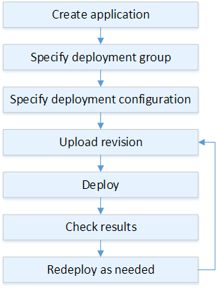
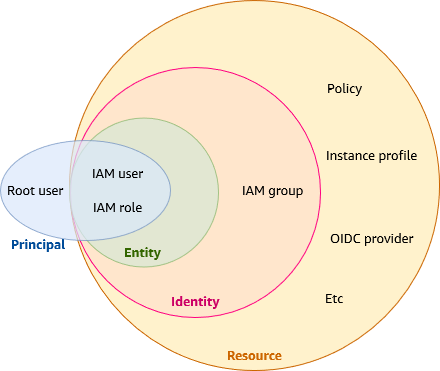

# [AWS CodeDeploy](https://docs.aws.amazon.com/ko_kr/codedeploy/latest/userguide/welcome.html)

- [AWS CodeDeploy](#aws-codedeploy)
    - [CodeDeploy?](#codedeploy)
    - [Amazon ECS 컴퓨팅 플랫폼에서의 배포](#amazon-ecs-컴퓨팅-플랫폼에서의-배포)
    - [EC2/온프레미스 컴퓨팅 플랫폼의 배포 개요](#ec2온프레미스-컴퓨팅-플랫폼의-배포-개요)
        - [1. Create Application](#1-create-application)
        - [2. Specify deployment group](#2-specify-deployment-group)
        - [3. Specify deployment configuration](#3-specify-deployment-configuration)
        - [4. Upload revision](#4-upload-revision)
        - [5. Deploy](#5-deploy)
        - [6. Check Results](#6-check-results)
        - [7. Redeploy](#7-redeploy)
    - [IAM 권한 관계](#iam-권한-관계)
    - [CodeDeploy 설정하기](#codedeploy-설정하기)
    - [troubleshooting](#troubleshooting)
        - [InstanceAgent::Plugins::CodeDeployPlugin::CommandPoller: Missing credentials](#instanceagentpluginscodedeployplugincommandpoller-missing-credentials)
            - [문제](#문제)
            - [원인](#원인)
            - [해결](#해결)
        - [The CodeDeploy agent did not find an AppSpec file within the unpacked revision directory at revision-relative path "appspec.yml"](#the-codedeploy-agent-did-not-find-an-appspec-file-within-the-unpacked-revision-directory-at-revision-relative-path-appspecyml)
            - [문제](#문제-1)
            - [원인](#원인-1)
            - [해결](#해결-1)
    - [기타](#기타)

## CodeDeploy?

EC2 인스턴스, 온프레미스 인스턴스, 서버리스 Lambda 함수 또는 Amazon ECS 서비스로의 애플리케이션 배포를 자동화하는 배포 서비스입니다.

서버에서 실행되고
- Amazon S3 버킷,
- GitHub 리포지토리
- 또는 Bitbucket 리포지토리에 저장되는 애플리케이션 콘텐츠를 배포할 수 있습니다.

CodeDeploy 두 가지 유형의 배포를 지원합니다.

- 현재 위치(in place) 배포:

    배포 그룹의 각 인스턴스에 있는 애플리케이션이 중지되고 최신 애플리케이션 revision 버전이 설치되며 애플리케이션의 새 버전이 시작되고 유효성이 검사됩니다.
    로드 밸런서를 사용하면 배포가 진행될 때 각 인스턴스를 등록 취소한 후 배포가 완료된 후 서비스로 복원할 수 있습니다.
    EC2/온프레미스 컴퓨팅 플랫폼을 사용하는 배포만 인 플레이스 배포를 사용할 수 있습니다.
    현재 위치 배포에 대한 자세한 내용은 [인 플레이스 배포 개요](https://docs.aws.amazon.com/ko_kr/codedeploy/latest/userguide/welcome.html#welcome-deployment-overview-in-place) 단원을 참조하세요.

- Blue/Green 배포: 배포 동작은 사용하는 컴퓨팅 플랫폼에 따라 다릅니다.
    - EC2/온프레미스 컴퓨팅 플랫폼에서의 블루/그린 배포
    - 또는 AWS Lambda Amazon ECS 컴퓨팅 플랫폼의 블루/그린
    - AWS CloudFormation 통한 블루/그린 배포

## [Amazon ECS 컴퓨팅 플랫폼에서의 배포](https://docs.aws.amazon.com/ko_kr/codedeploy/latest/userguide/deployment-steps-ecs.html)

ECS 사용 안하여 현재는 관련 없어서 링크만 걸어 둡니다.

## [EC2/온프레미스 컴퓨팅 플랫폼의 배포](https://docs.aws.amazon.com/ko_kr/codedeploy/latest/userguide/deployment-steps-server.html) 개요

> TL;DR
>
> AWS S3 또는 GitHub에 애플리케이션 리비전을 업로드하고, CodeDeploy 에이전트가 해당 리비전 파일을 인스턴스로 가져와서 실행하는 방식입니다.



### 1. Create Application

애플리케이션을 생성하고 배포하려는 애플리케이션 revision과 애플리케이션의 컴퓨팅 플랫폼을 고유하게 식별하는 이름을 지정합니다.

CodeDeploy 배포 중에 이 이름을 사용하여 배포 그룹, 배포 구성, 애플리케이션 revision과 같은 올바른 배포 구성 요소를 참조하는지 확인합니다.
[CodeDeploy로 애플리케이션 생성하기](https://docs.aws.amazon.com/ko_kr/codedeploy/latest/userguide/applications-create.html)를 참고하세요.

### 2. Specify deployment group

애플리케이션 revision을 배포하려는 인스턴스 및 배포 유형을 지정하여 배포 그룹을 설정합니다.
- 인 플레이스(in-place) 배포: 최신 애플리케이션 revision으로 인스턴스를 업데이트합니다.
- 블루/그린 배포: 로드 밸런서에 배포 그룹의 대체 인스턴스 세트를 등록하고 원본 인스턴스의 등록을 취소합니다.

인스턴스, Amazon EC2 Auto Scaling 그룹 이름 또는 둘 다에 적용되는 태그를 지정할 수 있습니다.

배포 그룹에
- 하나의 태그 그룹을 지정하는 경우: 지정된 태그 중 하나 이상이 적용된 인스턴스에 CodeDeploy가 배포됩니다.
- 두 개 이상의 태그 그룹을 지정하는 경우: 각 태그 그룹의 기준을 충족하는 인스턴스에만 CodeDeploy 배포합니다.
자세한 정보는 [Tagging Instances for Deployments](https://docs.aws.amazon.com/ko_kr/codedeploy/latest/userguide/instances-tagging.html)을 참조하세요.

모든 경우에 인스턴스를 배포에 사용할 수 있도록 구성하고 (즉, Amazon EC2 Auto Scaling 그룹에 속하거나 태그가 지정되어 있어야 함) CodeDeploy 에이전트를 설치 및 실행해야 합니다.

다음 옵션도 지정할 수 있습니다.

- Amazon SNS 알림. 배포 및 인스턴스에서 지정된 이벤트(예: 성공 또는 실패 이벤트)가 발생하면 Amazon SNS 주제 구독자에게 알림을 보내는 트리거를 만듭니다. 자세한 정보는 Monitoring Deployments with Amazon SNS Event Notifications을 참조하세요.

- 경보 기반 배포 및 관리. 지표가 설정된 임계값을 초과하거나 아래로 떨어질 경우 배포를 중지하도록 Amazon CloudWatch 알람 모니터링을 구현하십시오. CloudWatch

- 자동 배포 롤백. 배포에 실패하거나 경보 임계값에 도달한 경우 이전에 알려진 양호한 상태의 revision으로 자동 롤백되도록 배포를 구성합니다.

### 3. Specify deployment configuration

애플리케이션 revision을 동시에 배포해야 할 인스턴스 수와 배포 성공 및 실패 조건을 설정하는 배포 구성을 지정합니다.
자세한 정보는 [View Deployment Configuration Details](https://docs.aws.amazon.com/ko_kr/codedeploy/latest/userguide/deployment-configurations-view-details.html)을 참조하세요.

### 4. Upload revision

Amazon S3 또는 GitHub에 애플리케이션 revision을 업로드합니다.
배포하려는 파일 및 배포 중에 실행하려는 스크립트 외에도 *application specification file*(AppSpec 파일) 을 포함해야 합니다.
이 파일에는 각 인스턴스에 파일을 복사할 위치 및 배포 스크립트를 실행할 시점 등과 같은 배포 명세가 포함되어 있습니다.
자세한 정보는 [CodeDeploy 위한 애플리케이션 revision 작업](https://docs.aws.amazon.com/codedeploy/latest/userguide/application-revisions.html)을 참조하세요.

### 5. Deploy

애플리케이션 revision을 배포 그룹에 배포합니다.
배포 그룹 내 각 인스턴스의 CodeDeploy 에이전트는 Amazon S3 또는 GitHub에서 인스턴스로 애플리케이션 revision 버전을 복사합니다.
그런 다음 CodeDeploy 에이전트는 revision 버전을 번들링하고 AppSpec 파일을 사용하여 파일을 지정된 위치에 복사한 다음 배포 스크립트를 실행합니다.
자세한 정보는 [CodeDeploy를 사용하여 배포 생성하기](https://docs.aws.amazon.com/codedeploy/latest/userguide/deployments-create.html)를 참조하세요.

### 6. Check Results

배포 결과를 체크합니다. [CodeDeploy에서 배포 모니터링하기](https://docs.aws.amazon.com/codedeploy/latest/userguide/monitoring.html)를 참고해주세요.

### 7. Redeploy

소스 콘텐츠에서 버그를 수정하거나, 배포 스크립트를 다른 순서로 실행하거나, 실패한 배포를 해결해야 하는 경우 다시 배포하고 싶을 수 있습니다.
이렇게 하려면 수정된 소스 콘텐츠, 배포 스크립트 및 AppSpec 파일을 새 수정 버전으로 다시 번들링한 다음 Amazon S3 버킷 또는 GitHub 리포지토리에 revision 버전을 업로드하십시오.
그런 다음 그 새로운 revision을 사용하여 동일한 배포 그룹으로 새로 배포를 실행합니다. 자세한 정보는 [CodeDeploy를 사용하여 배포 생성하기](https://docs.aws.amazon.com/codedeploy/latest/userguide/deployments-create.html)를 참조하세요.

## IAM 권한 관계



```mermaid
flowchart TD
    subgraph "Identity and Access Management(IAM)"
        IAMUser[IAM 사용자]
        IAMGroup[IAM 그룹]
        IAMRole[IAM 역할]
        IAMPolicy[IAM 정책]

        IAMUser -.->|선택적 소속| IAMGroup
        IAMUser -->|연결| IAMPolicy
        IAMGroup -->|연결| IAMPolicy
        IAMRole -->|연결| IAMPolicy
        IAMUser -.->|맡음| IAMRole
    end

    subgraph "IAM Identity Center"
        AWSAccount[AWS 계정]
        Group[그룹]
        PermissionSet[권한 세트]
        WorkforceUser[인력 사용자]

        WorkforceUser[인력 사용자] -.->|선택적 소속| Group
        WorkforceUser[인력 사용자] --> PermissionSet[권한 세트]
        Group[그룹] --> PermissionSet[권한 세트]
        PermissionSet[권한 세트] --> |액세스|AWSAccount[AWS 계정]

    end

    subgraph "CodeDeploy"
        CD[CodeDeploy]
        CD --> CDApp[CodeDeploy 애플리케이션]
        CD --> CDDeploymentGroup[배포 그룹]
        CDApp --> CDDeploymentGroup
    end

    subgraph "EC2"
        EC2[EC2]
        IAMRole --> |설정|EC2
    end

    IAMRole -->|서비스 역할 부여| CDDeploymentGroup

    PermissionSet -->|연결| IAMRole
```

> 단일 계정의 경우 기존 IAM만으로도 충분하지만, 다중 AWS 계정이 필요한 경우 IAM Identity Center가 더 적합합니다.

1. IAM 구성 요소

    - `CodeDeployService-EC2toS3-Policy` (IAM Policy)

        EC2 인스턴스가 S3 버킷에 접근할 수 있는 권한을 정의합니다.

        `CodeDeployService-EC2-Profile`에 포함되어 EC2 인스턴스에 권한을 부여합니다.
        S3 버킷의 파일을 읽고 쓸 수 있는 권한을 제공하여 애플리케이션 파일 배포를 가능하게 합니다.

    - `CodeDeployService-EC2-Profile` (IAM Instance Profile)

        EC2에 바로 IAM 역할을 연결할 수 없고, IAM 인스턴스 프로파일을 통해 역할이 연결됩니다

        > Allows EC2 instances to call AWS services on your behalf.

        `CodeDeployService-EC2toS3-Policy`를 포함하여 EC2 인스턴스에 S3 접근 권한을 부여합니다.
        EC2 인스턴스가 CodeDeploy 에이전트를 실행하고 필요한 리소스에 접근할 수 있게 합니다.

        신기하게도 `codedeploy:*` 정책이 없음에도 해당 프로필을 EC2 인스턴스 IAM 역할에 추가하는 것만으로도 codedeploy-agent가 CodeDeploy 서비스와 상호작용을 합니다.

        프로필 생성시에 신뢰할 수 있는 엔터티로 EC2를 선택하는데, 아마도 이 덕분이 아닌가 싶습니다.

        > Allows EC2 instances to call AWS services on your behalf.

    - `CodeDeployServiceRole` (IAM Role)

        CodeDeploy 서비스에 다른 AWS 서비스와 상호작용할 수 있는 권한을 부여합니다.

        CodeDeploy 서비스가 이 역할을 맡아 EC2, S3, Auto Scaling 등의 서비스를 관리합니다.
        `CodeDeployServicePermissionSet`의 'iam:PassRole' 액션을 통해 이 역할이 CodeDeploy 서비스에 전달됩니다.

2. IAM Identity Center 구성 요소

    - `CodeDeployServicePermissionSet`

        IAM Identity Center 사용자에게 CodeDeploy 관련 권한을 부여합니다.

        `iam:PassRole` 액션을 통해 다른 서비스나 사용자가 이 역할을 CodeDeploy에 *전달(pass)*할 수 있습니다. 이 역할은 실제로 CodeDeploy 배포 그룹에서 사용되어 리소스에 접근할 수 있도록 합니다.

        즉, 이 권한 집합이 `ec2_aimpugn_agent` 인력 사용자에게 부여되면,
        `ec2_aimpugn_agent` 인력 사용자는 `CodeDeployServiceRole`을 CodeDeploy 서비스에 *전달*할 수 있습니다.

    - `ec2_aimpugn_agent` (IAM Identity Center 사용자)

        CodeDeploy를 관리할 수 있는 인력 사용자입니다.

        `CodeDeployServicePermissionSet`로부터 권한을 받아 CodeDeploy 서비스를 관리합니다.
        CodeDeploy 콘솔을 통해 배포를 생성, 관리, 모니터링할 수 있습니다.
        또한 `iam:PassRole` 액션을 통해 `CodeDeployServiceRole`을 CodeDeploy 서비스에 *전달*할 수 있으므로, 배포 그룹 생성시 해당 역할을 선택하여 CodeDeploy 서비스에 전달할 수 있습니다.

> `iam:PassRole` 액션:
>
> 한 IAM 엔터티(사용자, 역할)가 다른 AWS 서비스에 IAM 역할을 전달할 수 있게 합니다.
>
> `ec2_aimpugn_agent` 사용자가 CodeDeploy 배포 그룹을 생성하거나 업데이트할 때,
> `CodeDeployServiceRole`을 CodeDeploy 서비스에 전달할 수 있습니다.
> 이를 통해 CodeDeploy 서비스가 필요한 권한을 가진 역할을 맡아 작업을 수행할 수 있게 됩니다.

## CodeDeploy 설정하기

1. Identity and Access Management(IAM)에서 서비스 역할을 생성합니다.

    > IAM 역할은 단기간 동안 유효한 자격 증명을 가진 특정 권한이 있는 자격 증명입니다.
    > 신뢰할 수 있는 엔터티가 역할을 맡을 수 있습니다.

    여기서 생성하는 역할은 다음 경우에 사용됩니다:
    - IAM Identity Center에서 생성한 인력 사용자의 권한 세트 생성시 사용
    - '11. 생성된 애플리케이션에서 배포 그룹 생성'시 서비스 역할 지정에 사용

    서비스 역할 생성이므로, *신뢰할 수 있는 엔터티* 유형은 *AWS 서비스*를 선택합니다.
    그리고 *사용 사례*에서 `CodeDeploy`를 선택합니다.

    역할 이름은 `CodeDeployServiceRole` 등으로 지정합니다.

    그러면 다음과 같은 신뢰 정책을 생성하게 됩니다.

    ```json
    {
        "Version": "2012-10-17",
        "Statement": [
            {
                "Sid": "",
                "Effect": "Allow",
                "Principal": {
                    "Service": [
                        "codedeploy.amazonaws.com"
                    ]
                },
                "Action": [
                    "sts:AssumeRole"
                ]
            }
        ]
    }
    ```

2. *IAM Identity Center > 사용자* 메뉴에서 인력(workforce) 사용자(e.g `ec2_aimpugn_agent`)를 추가합니다.

3. *IAM Identity Center > 다중 계정 권한 > 권한 세트* 메뉴에서 루트 사용자를 대신할 권한 집합을 생성합니다.

    > 권한 집합? IAM Identity Center의 사용자 및 그룹이 *AWS 계정에 대해* 갖는 액세스 수준을 정의합니다.

    1. 권한 세트 유형 선택에서 *사용자 지정 권한 세트*를 선택합니다.
    2. 정책 및 권한 경계 지정에서 AWS 관리형 정책, 고객 관리형 정책, 인라인 정책 중 인라인 정책을 선택합니다.

        > 인라인 정책?
        >
        > 인라인 정책을 사용하면 세분화된 사용자 지정 권한을 정의할 수 있습니다.
        > IAM Identity Center를 사용할 때 대부분의 경우에 고객 관리형 정책보다는 인라인 정책을 생성하기를 권장합니다.
        > 인라인 정책은 IAM Identity Center 관리자만 변경할 수 있으며, 이 권한 세트는 프로비저닝된 모든 AWS 계정에서 동일합니다.
        > 인라인 정책 문서를 생성 또는 붙여 넣은 후, 변경 사항을 적용하기에 앞서 IAM 정책 시뮬레이터를 사용해 정책의 효과를 테스트할 수 있습니다

        예제 코드는 지우고 [가이드에서 제공하는 다음 정책](https://docs.aws.amazon.com/ko_kr/codedeploy/latest/userguide/getting-started-policy.html)을 붙여 넣습니다.

        ```json
        {
            "Version": "2012-10-17",
            "Statement": [
                {
                    "Sid": "CodeDeployAccessPolicy",
                    "Effect": "Allow",
                    "Action": [
                        "autoscaling:*",
                        "codedeploy:*",
                        "ec2:*",
                        "lambda:*",
                        "ecs:*",
                        "elasticloadbalancing:*",
                        "iam:AddRoleToInstanceProfile",
                        "iam:AttachRolePolicy",
                        "iam:CreateInstanceProfile",
                        "iam:CreateRole",
                        "iam:DeleteInstanceProfile",
                        "iam:DeleteRole",
                        "iam:DeleteRolePolicy",
                        "iam:GetInstanceProfile",
                        "iam:GetRole",
                        "iam:GetRolePolicy",
                        "iam:ListInstanceProfilesForRole",
                        "iam:ListRolePolicies",
                        "iam:ListRoles",
                        "iam:PutRolePolicy",
                        "iam:RemoveRoleFromInstanceProfile",
                        "s3:*",
                        "ssm:*"
                    ],
                    "Resource": "*"
                },
                {
                    "Sid": "CodeDeployRolePolicy",
                    "Effect": "Allow",
                    "Action": ["iam:PassRole"],
                    "Resource": "arn:aws:iam::{account-ID}:role/CodeDeployServiceRole"
                }
            ]
        }
        ```

        여기서 리소스의 `arn:aws:iam::{account-ID}:role/CodeDeployServiceRole`를
        앞서 생성한 CodeDeploy 서비스 역할(e.g `CodeDeployServiceRole` 서비스 역할)의 arn 값으로 바꿉니다.

        이 정책을 통해 다음 곳들을 대상으로 배포할 수 있습니다.
        - AWS Lambda compute platform
        - EC2/On-Premises compute platform
        - and an Amazon ECS compute platform

        [배포 대상별로 필요한 권한 집합 정책은 상이](https://docs.aws.amazon.com/ko_kr/codedeploy/latest/userguide/getting-started-create-service-role.html)할 수 있습니다.

    3. 권한 세트 이름은 `CodeDeployServicePermissionSet` 등으로 지정하고 다음으로 넘어갑니다.
    4. 검토 및 생성합니다.

4. *IAM Identity Center > 다중 계정 권한 > AWS 계정* 메뉴에서 AWS 계정를 선택하고 '사용자 또는 그룹 할당' 버튼을 클릭하여 권한 세트를 연결합니다.

    이제 해당 권한 집합을 두 가지 방식으로 부여할 수 있습니다.
    이 과정을 통해 IAM 자격 증명 센터의 사용자 및 그룹에 다중 계정 액세스를 제공합니다.

    - AWS 계정과 직접 연결하여 권한 집합을 부여

        1. 연결하려는 AWS 계정을 선택
        2. 사용자 또는 그룹 할당 클릭
        3. IAM 자격 증명 센터에서 다중 계정 액세스 권한을 부여하고자 하는 사용자를 하나 이상 선택(e.g  인력 사용자 `ec2_aimpugn_agent`)
        4. 앞서 생성했던 `CodeDeployServicePermissionSet` 권한 집합을 선택
        5. 제출합니다.

        제출이 성공적으로 마친 후, 인력(workforce) 유저로 로그인하면 연결된 계정과 권한 등이 보이게 됩니다.

    - 그룹을 생성하고 AWS 계정을 해당 그룹에 추가하면서 권한 집합을 부여

        그룹을 생성하고, 생성된 그룹에 AWS 계정을 연결합니다.
        개인 계정으로 현재는 root 계정만 존재하므로 root 계정에만 연결합니다.

        그룹에 권한 세트를 그룹에 부여할 수 있는데, 이 권한 세트는 *AWS 계정이나 애플리케이션에 대한* 접근 수준을 정의합니다.

        그룹에 새로 생성된 인력(workforce) 사용자와 AWS 계정이 같이 포함된다면,
        이제 사용자는 해당 root AWS 계정에 접근이 가능합니다.

    이제 `ec2_aimpugn_agent`(인력 사용자) 이 인력 사용자를 통해 `CodeDeployServicePermissionSet` 권한의 작업을 수행할 수 있습니다.

5. Amazon EC2 인스턴스에 대한 IAM 정책(Policies)을 생성합니다.

    Amazon EC2 인스턴스에는 애플리케이션이 저장된 Amazon S3 버킷 또는 GitHub 리포지토리에 액세스할 수 있는 권한이 필요합니다.

    1. IAM 페이지로 이동하여 정책(Policies) 메뉴로 진입하여 *정책 생성* 버튼을 클릭합니다.
    2. 권한 지정 페이지에서 JSON을 선택하고 다음 코드로 덮어씁니다.

        S3에 애플리케이션 아티팩트 등이 올라갈 경우 해당 파일을 가져오기 위해 필요한 권한입니다.

        ```json
        {
            "Version": "2012-10-17",
            "Statement": [
                {
                    "Action": ["s3:Get*", "s3:List*"],
                    "Effect": "Allow",
                    "Resource": "*"
                }
            ]
        }
        ```

    3. 다음으로 넘어가서 검토 및 생성 페이지에서 정책 이름으로 `CodeDeployService-EC2toS3-Policy` 등을 입력합니다.
    4. 리뷰하고 정책을 생성합니다.

6. (EC2 역할) Amazon EC2 인스턴스에 대한 IAM 인스턴스 프로파일 만듭니다.

    CodeDeploy호환되는 Amazon EC2 인스턴스를 시작하려면 추가 IAM 역할인 인스턴스 프로필을 생성해야 합니다.
    이 프로필은 CodeDeploy 에이전트에게 (S3 사용한다면) 애플리케이션 아티팩트가 저장될 Amazon S3 버킷에 액세스할 수 있는 권한을 부여합니다.

    1. *정책* 페이지를 나와서 *역할* 페이지로 이동한 후 *역할 생성*을 클릭합니다.
    2. 신뢰할 수 있는 엔터티 유형에 AWS 서비스, 사용 사례에 EC2를 선택합니다.
    3. *권한 추가* 페이지에서 방금 생성한 `CodeDeployService-EC2toS3-Policy` 권한 정책을 추가합니다.

        [Systems Manager로 CodeDeploy 에이전트를 설치](https://docs.aws.amazon.com/codedeploy/latest/userguide/codedeploy-agent-operations-install-ssm.html)할 경우
        `ManagedInstanceCoreAmazonSSM` 권한 정책이 필요하지만, CLI로 설치할 경우에는 필요 없습니다.

    4. 다음 이름 지정, 검토 및 생성 페이지에서 역할 이름에 서비스 역할 이름 `CodeDeployService-EC2-Profile` 등을 입력하고 역할을 생성합니다.

7. [EC2 인스턴스에 IAM 역할](https://docs.aws.amazon.com/ko_kr/codedeploy/latest/userguide/getting-started-create-iam-instance-profile.html) 설정

    EC2에서 개발자가 직접 자격 증명을 관리하는 대신, IAM 역할을 EC2 인스턴스에 부여합니다.
    그리고 해당 역할을 기반으로 자격 증명을 하고 API 호출할 수 있도록 합니다.

    EC2 메뉴로 이동하여 설정할 EC2 인스턴스에서 *작업 > 보안 > IAM 역할 수정*을 클릭합니다.
    그러면 [IAM 역할 셀렉트박스에서 앞서 생성한 `CodeDeployService-EC2-Profile`을 선택](https://docs.aws.amazon.com/ko_kr/codedeploy/latest/userguide/instances-ec2-create.html)할 수 있습니다.

    > IAM 역할
    >
    > 인스턴스에 연결할 IAM 역할을 선택하거나 역할이 생성되어 있지 않다면 새 역할을 생성합니다.
    > *선택한 역할이 현재 인스턴스에 연결된 모든 역할을 대체*합니다.

    이제 그러면 이 EC2 인스턴스에서는 `AWSCodeDeployRole` 역할을 수행할 수 있습니다.

8. [배포 그룹 위해 인스턴스에 태깅](https://docs.aws.amazon.com/codedeploy/latest/userguide/instances-tagging.html) 합니다.

    태그를 사용하여 각 리소스에 고유의 메타데이터를 할당하면 Amazon EC2 인스턴스 및 온프레미스 인스턴스를 손쉽게 관리할 수 있습니다.

    '9.2. 배포 그룹 생성'시에 배포 대상이 되는 'Amazon EC2 인스턴스 또는 온프레미스 인스턴스'를 식별하는 데 사용됩니다.

9. EC2에서 CodeDeploy 에이전트 작업

    - [Ubuntu](https://docs.aws.amazon.com/ko_kr/codedeploy/latest/userguide/codedeploy-agent-operations-install-ubuntu.html)
    - [리비전별 리소스 키트 버킷 이름](https://docs.aws.amazon.com/ko_kr/codedeploy/latest/userguide/resource-kit.html#resource-kit-bucket-names)

    ```plaintext
    https://<bucket_name>.s3.<region_identifier>.amazonaws.com/latest/install
    # 서울 리전 경우
    https://ap-northeast-2.s3.aws-codedeploy-ap-northeast-2.amazonaws.com/latest/install
    ```

    ```sh
    sudo apt update && sudo apt install ruby-full wget

    cd /home/ubuntu
    wget https://aws-codedeploy-ap-northeast-2.s3.ap-northeast-2.amazonaws.com/latest/install
    chmod +x ./install
    # 20.04를 제외하고 지원되는 Ubuntu Server 버전에 최신 버전의 CodeDeploy 에이전트를 설치
    sudo ./install auto

    # 실행중인지 확인
    systemctl status codedeploy-agent
    ```

    다음 명령어 통해 [에이전트를 업데이트](https://docs.aws.amazon.com/codedeploy/latest/userguide/codedeploy-agent-operations-update-ubuntu.html)할 수 있습니다.

    ```sh
    sudo /opt/codedeploy-agent/bin/install auto
    ```

    [삭제하려면 다음 명령어](https://docs.aws.amazon.com/codedeploy/latest/userguide/codedeploy-agent-operations-uninstall.html#codedeploy-agent-operations-uninstall-ubuntu)를 실행합니다.

    ```sh
    sudo dpkg --purge codedeploy-agent
    ```

    로그 파일 경로:

    ```sh
    # 에이전트 자체의 로그입니다.
    /var/log/aws/codedeploy-agent/codedeploy-agent.log
    # 실제 배포가 이뤄지면 deployment-root 이하 경로에 로그가 적재됩니다.
    /opt/codedeploy-agent/deployment-root/deployment-logs/codedeploy-agent-deployments.log
    # 에이전트를 업데이트할 때의 로그입니다.
    /tmp/codedeploy-agent.update.log
    ```

10. 애플리케이션 생성
    - 애플리케이션 이름: ${이름}
    - 컴퓨팅 플랫폼: EC2/온프레미스

11. 생성된 애플리케이션에서 배포 그룹 생성

    각 배포 그룹은 애플리케이션 하나에 속합니다.
    새 배포 그룹과 다른 애플리케이션의 기존 배포 그룹은 이름이 같더라도 각각 별도의 응용 프로그램과 연결되어 있으므로 별도의 배포 그룹으로 CodeDeploy 취급합니다.

    - 배포 그룹 이름: 이 배포 그룹의 이름
    - 서비스 역할: CodeDeploy 권한이 있는 서비스 역할(e.g `arn:aws:iam::{account-ID}:role/CodeDeployServiceRole`)
    - 배포 유형: in place 또는 블루/그린
    - 환경 구성
        - Amazon EC2 Auto Scaling 그룹:

            애플리케이션 revision을 배포할 Amazon EC2 Auto Scaling 그룹의 이름을 입력하거나 선택합니다.
            Amazon EC2 Auto Scaling CodeDeploy 그룹의 일부로 새 Amazon EC2 인스턴스를 시작하면 수정 버전을 새 인스턴스에 자동으로 배포할 수 있습니다.
            배포 그룹당 최대 10개의 Amazon EC2 Auto Scaling 그룹을 추가할 수 있습니다.

        - Amazon EC2 인스턴스 또는 온프레미스 인스턴스:

            키 및 값 필드에서 인스턴스에 태그를 지정하는 데 사용하는 키-값 페어의 값을 입력합니다.
            한 태그 그룹에서 최대 10개의 키-값 페어에 태그를 지정할 수 있습니다.

            값 필드에서 와일드카드를 사용해 특정 패턴으로 태그가 지정된 모든 인스턴스를 식별할 수 있습니다(예: Amazon EC2 인스턴스, 코스트 센터 및 그룹 이름 등).

            예를 들어, `Key` 필드에서 'Name'을 선택하고 `Value` 'GRP-*a' 필드에 입력하면,
            CodeDeploy는 'GRP-1a', 'GRP-2a', 'GRP-XYZ-a'와 같이 해당 패턴에 맞는 모든 인스턴스를  식별합니다.

            값 필드는 대/소문자를 구분하고, 목록에서 키-값 페어를 제거하려면 태그 제거를 선택합니다.

        CodeDeploy는 지정된 각 키-값 쌍 또는 Amazon EC2 Auto Scaling 그룹 이름과 일치하는 인스턴스를 찾으면 일치하는 인스턴스 수를 표시합니다.

        배포된 인스턴스의 기준을 세분화하려면 `[Add tag group]`을 선택하여 태그 그룹을 만듭니다.
        키-값 쌍이 각각 최대 10개인 태그 그룹을 최대 세 개까지 만들 수 있습니다.
        배포 그룹에서 여러 태그 그룹을 사용하는 경우 모든 태그 그룹으로 식별되는 인스턴스만 배포 그룹에 포함됩니다.
        즉 인스턴스는 배포 그룹에 포함될 각 그룹의 태그 중 적어도 하나와 일치해야 합니다.

        태그 그룹을 사용하여 배포 그룹을 세분화하는 방법에 대한 자세한 내용은 [Tagging Instances for Deployments](https://docs.aws.amazon.com/ko_kr/codedeploy/latest/userguide/instances-tagging.html) 단원을 참조하세요.

    - AWS Systems Manager를 사용한 에이전트 구성

        Systems Manager를 사용하여 CodeDeploy 에이전트의 설치를 구성하고 업데이트를 예약할 수 있습니다.

    - 배포 설정
        - 배포 구성:
            기본 및 사용자 지정 배포 구성 목록에서 선택합니다.
            배포 구성은 애플리케이션이 배포되는 속도와 배포 성공 또는 실패 조건을 결정하는 규칙 세트입니다.

            - `CodeDeployDefault.OneAtATime`
            - `CodeDeployDefault.HalfAtATime`
            - `CodeDeployDefault.AllAtOnce`을 선택합니다.

    - 로드 밸런서

        배포 프로세스 중에 수신 트래픽을 관리할 로드 밸런서를 선택합니다.
        로드 밸런서는 배포 중인 각 인스턴스에서 트래픽을 차단하고 배포 성공 후 인스턴스에 대한 트래픽을 다시 허용합니다.

        클래식 로드 밸런서, Application Load Balancer 대상 그룹, Network Load Balancer 대상 그룹을 선택하여 배포 중에 인스턴스에 대한 트래픽을 관리합니다.

        CodeDeploy 배포용 로드 밸런서에 대한 자세한 내용은 [Integrating CodeDeploy with Elastic Load Balancing](https://docs.aws.amazon.com/ko_kr/codedeploy/latest/userguide/integrations-aws-elastic-load-balancing.html)을 참고합니다.

        (로드밸런싱이 필요한 앱이 아니니 그냥 비활성화)

    - 고급: 선택 사항
        - 트리거

            Amazon Simple Notification Service(SNS)의 주제를 구독하는 트리거를 생성하여 이 배포 그룹의 인스턴스 이벤트 및 배포에 대한 알림을 수신합니다.
            최대 10개의 트리거를 생성할 수 있습니다.

            > 트리거를 생성하기 전에 트리거가 가리키는 Amazon SNS 주제를 설정해야 합니다.
            >
            > AWS CodeDeploy는 이 배포 그룹에서 주제에 게시할 수 있는 권한이 있어야 합니다.

        - 경고
        - 롤백: '배포에 실패하는 경우 롤백' 선택

12. 인스턴스에서 배포 사전 작업을 합니다.

    EC2에 애플리케이션 파일이 위치할 경로를 미리 생성해 둡니다.

    ```sh
    sudo mkdir -p /var/www/aimpugn.me
    sudo chown -R ubuntu:ubuntu /var/www/
    ```

    repository와 commit이 필요합니다.
    그리고 `appspec.yaml` 파일을 미리 준비해 둡니다.
    예를 들어 다음과 같은 속성과 값들로 구성됩니다.

    ```yaml
    version: 0.0
    os: linux
    files:
      - source: /
        destination: /var/www/aimpugn.me
    permissions:
      - object: /var/www/aimpugn.me
        owner: ubuntu
        group: ubuntu
        mode: 755
        type:
          - directory
          - file
    hooks:
      AfterInstall:
        - location: scripts/start.sh
          timeout: 300
          runas: ubuntu
    ```

13. [배포 생성](https://docs.aws.amazon.com/ko_kr/codedeploy/latest/userguide/deployments-create-console.html):

    애플리케이션 소스 코드를 배포하려면 S3 버킷 또는 Git 리포지토리와 연동할 수 있습니다.

    - S3 사용

        1. **S3 버킷 생성**: AWS S3에서 버킷을 생성하고 애플리케이션 소스 코드를 업로드합니다.
        2. **애플리케이션 아카이브 준비**: `appspec.yml` 파일을 포함한 소스 코드를 압축(zip)하여 S3 버킷에 업로드합니다.

    - [GitHub 연동](https://docs.aws.amazon.com/ko_kr/codedeploy/latest/userguide/deployments-create-console-github.html) (선택 사항)

        미리 연동된 'GitHub 토큰 이름'이 있으면 재사용할 수 있습니다.
        처음 연결이하면 'GitHub에 연결'을 선택하여 연결합니다.

        연결 후 '애플리케이션 aimpugn.me이(가) aimpugn GitHub 토큰에 바인드됨'라는 메시지가 뜨면서 정상적으로 연결되었다고 나옵니다. 그 후 다음 두 항목을 입력합니다.
        - 리파지토리 이름:

            GitHub 사용자 또는 조직 이름을 입력하고 슬래시 (`/`) 를 입력한 다음 수정 버전이 포함된 리포지토리 이름을 입력합니다.

            ```plaintext
            aimpugn/me
            ```

        - Commit ID(커밋 ID): 리포지토리의 revision을 참조하는 커밋 ID를 입력합니다.

            예를 들어, [50aa6a04133b2046b98a9830eb52424a665d6114](https://github.com/aimpugn/me/commit/50aa6a04133b2046b98a9830eb52424a665d6114)

        추가 배포 동작 설정:
        - [ ] 인스턴스에서 이 수명 주기 이벤트가 실패하는 경우 해당 인스턴스에 대한 배포에 실패 안 함
        - 콘텐츠 옵션
            - [ ] 배포 실패: 오류가 보고 되고 배포 상태가 실패로 변경됩니다.
            - [ ] 콘텐츠 덮어쓰기: 애플리케이션 revision 파일을 인스턴스의 대상 위치에 복사하고 이전 파일을 대체합니다.
            - [ ] 콘텐츠 유지: 애플리케이션 revision 파일을 인스턴스에 복사하지 않습니다. 기존 파일은 대상 위치에 유지되고 새 배포의 일부로 처리됩니다.

14. 배포 실행

    1. CodeDeploy 콘솔에서 `배포 시작(Start deployment)` 버튼을 클릭합니다.
    2. 앞서 생성한 애플리케이션과 배포 그룹을 선택합니다.
    3. 소스(S3 또는 GitHub)를 선택하고, `appspec.yml` 파일이 올바르게 설정되었는지 확인합니다.
    4. 배포 상태를 실시간으로 모니터링할 수 있습니다. 실패하거나 경고가 발생한 경우, 로그를 통해 원인을 확인합니다.

15. 로그 확인 및 디버깅

    배포 과정 중 발생한 문제를 해결하기 위해 로그를 확인합니다.

    1. **로그 위치**: 기본적으로 `/opt/codedeploy-agent/deployment-root/deployment-logs/codedeploy-agent-deployments.log`에서 로그를 확인할 수 있습니다.

        ```bash
        tail -f /opt/codedeploy-agent/deployment-root/deployment-logs/codedeploy-agent-deployments.log
        ```

    2. **문제 해결**: 로그에 나오는 에러 메시지나 실패 원인을 분석하고, `appspec.yml`이나 스크립트를 수정하여 재배포를 시도합니다.

## troubleshooting

### InstanceAgent::Plugins::CodeDeployPlugin::CommandPoller: Missing credentials

#### 문제

```log
2024-09-10T18:01:58 ERROR [codedeploy-agent(33869)]: InstanceAgent::Plugins::CodeDeployPlugin::CommandPoller: Missing credentials - please check if this instance was started with an IAM instance profile
```

#### 원인

IAM 역할
- CodeDeployService-EC2-Profile

    CodeDeployService-EC2toS3-Permissions 권한 집합을 갖고 있습니다.

- CodeDeployServiceRole

    AWSCodeDeployRole 권한 정책을 갖고 있습니다.

생성된 인스턴스 프로필은 EC2 서비스가 사용해야 합니다.
[IAM 역할과 함께 인스턴스 실행하거나 IAM 역할을 인스턴스에 추가하기 위해 EC2 콘솔을 사용한다면, 인스턴스 프로필 이름 목록에 기반하여 역할을 선택](https://docs.aws.amazon.com/AWSEC2/latest/UserGuide/iam-roles-for-amazon-ec2.html)합니다.

- [운영 중인 EC2 인스턴스에 IAM 역할 연결하기](https://aws.amazon.com/ko/blogs/korea/attach-aws-iam-role-to-an-existing-ec2-instance/)

#### 해결

- 콘솔 사용시

    - 콘솔에서 배포할 인스턴스를 우클릭 > 보안 > IAM 역할 수정 메뉴로 진입하면 IAM 역할을 추가할 수 있습니다.

    - 또는 특정 인스턴스 선택 > 우측 상단 작업 버튼 클릭 > 보안 > IAM 역할 수정 메뉴로 진입하면 IAM 역할을 추가할 수 있습니다.

역할 추가에 성공하면 '인스턴스 i-<instance_id>에 CodeDeployService-EC2-Profile을(를) 연결함'이라고 나옵니다.

서비스를 재시작 하면 아래와 같이 성공 로그가 출력됩니다.

```log
2024-09-10T22:33:10 INFO  [codedeploy-agent(50192)]: Started master 50192 with 1 children
2024-09-10T22:33:54 INFO  [codedeploy-agent(50195)]: [Aws::CodeDeployCommand::Client 200 45.350663 0 retries] poll_host_command(host_identifier:"arn:aws:ec2:ap-northeast-2:<AWS Account ID>:instance/i-<instance_id>")
```

### The CodeDeploy agent did not find an AppSpec file within the unpacked revision directory at revision-relative path "appspec.yml"

#### 문제

```log
{
  "error_code": 5,
  "script_name": "",
  "message": "The CodeDeploy agent did not find an AppSpec file within the unpacked revision directory at revision-relative path \"appspec.yml\". The revision was unpacked to directory \"/opt/codedeploy-agent/deployment-root/<UUID>/<deployment_id>/deployment-archive\", and the AppSpec file was expected but not found at path \"/opt/codedeploy-agent/deployment-root/<UUID>/<deployment_id>/deployment-archive/appspec.yml\". Consult the AWS CodeDeploy Appspec documentation for more information at http://docs.aws.amazon.com/codedeploy/latest/userguide/reference-appspec-file.html",
  "log": ""
}
```

#### 원인

[기본값이 'appspec.yml'](https://docs.aws.amazon.com/ko_kr/codedeploy/latest/userguide/deployments-local.html)인데 'appspec.yaml'이라고 되어 있었습니다.

#### 해결

- [docs/CI & CD/CodeDeploy/EC2.md](https://github.com/ArcoKim/AWS-Study/blob/4c29c1c251fb4667e3e6d6d8d67372d2ded9a0fa/docs/CI%20%26%20CD/CodeDeploy/EC2.md)

## 기타

- [시작하기](https://docs.aws.amazon.com/ko_kr/codedeploy/latest/userguide/getting-started-setting-up.html)
- [Integrating with GitHub Actions – CI/CD pipeline to deploy a Web App to Amazon EC2](https://github.com/aws-samples/aws-codedeploy-github-actions-deployment.git)
- [Run your GitHub Actions locally](https://github.com/nektos/act?tab=readme-ov-file)
