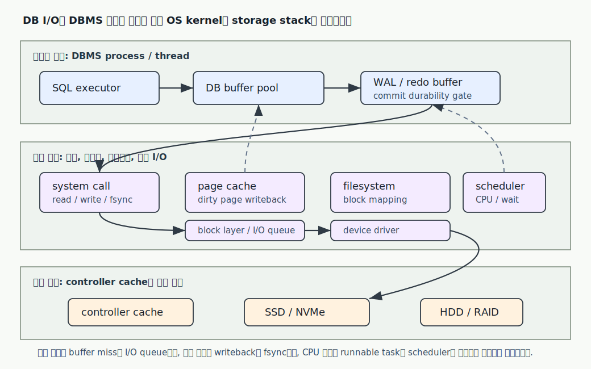

# 데이터베이스는 SQL 문장을 파일에 저장하는 프로그램이 아니라, 의미와 물리를 계속 중재하는 시스템이다

데이터베이스를 면접에서 설명할 때 가장 위험한 답변은 "SQL을 받아서 데이터를 저장하고 조회합니다"에서 멈추는 답변입니다. 이 말은 틀리지는 않지만, 데이터베이스가 실제로 어려워지는 지점을 거의 설명하지 못합니다. SQL 문장은 사람이 읽는 인터페이스이고, 그 뒤에는 관계 모델의 논리 규칙, 타입과 NULL의 판단 규칙, 문자열 비교 규칙, 실행 계획, 페이지와 인덱스, 동시성 제어, 장애 복구가 한꺼번에 맞물립니다.

이 문서는 데이터베이스를 하나의 층으로 보지 않고, SQL 인터페이스가 논리 모델과 물리 저장 사이에서 어떤 계약을 만들고, 실행 계획과 동시성, 복구가 그 계약을 어떻게 지키는지 설명합니다. 핵심은 "같은 결과표를 돌려준다"와 "같은 방식으로 찾는다"가 전혀 다른 말이라는 점입니다. `SELECT * FROM orders WHERE user_id = ?`라는 한 줄은 논리적으로는 조건을 만족하는 행의 집합을 요구하지만, 실제 엔진은 어떤 인덱스를 탈지, 어떤 문자열 비교 규칙을 쓸지, NULL을 어떻게 판단할지, 현재 transaction snapshot에서 어떤 version을 볼지, crash 뒤에도 commit 결과를 보존할 수 있는지를 따로 결정해야 합니다. 물리 I/O가 궁금해지면 [page와 buffer 흐름](02-storage-pages-buffer-io.md), plan 선택이 궁금해지면 [인덱스와 옵티마이저](04-index-query-optimizer.md), snapshot과 version 판단이 궁금해지면 [MVCC와 snapshot visibility](07-mvcc-snapshot-visibility.md), crash 뒤 commit 보존이 궁금해지면 [WAL과 crash recovery](03-wal-redo-undo-crash-recovery-pitr.md)로 바로 이어서 보면 됩니다.
- [2-5분 개요](#2-5분-개요)
- [먼저 잡아야 할 작은 모델](#먼저-잡아야-할-작은-모델)
- [깊은 메커니즘](#깊은-메커니즘)
    - [SQL 인터페이스는 값과 구조를 먼저 나눈다](#sql-인터페이스는-값과-구조를-먼저-나눈다)
    - [관계 모델은 결과 의미를 말하고, 물리 저장은 찾는 경로를 말한다](#관계-모델은-결과-의미를-말하고-물리-저장은-찾는-경로를-말한다)
    - [SQL의 논리 처리 순서는 실행 순서와 다르다](#sql의-논리-처리-순서는-실행-순서와-다르다)
    - [NULL은 값이 아니라 unknown 판단을 만든다](#null은-값이-아니라-unknown-판단을-만든다)
    - [collation은 문자열의 정렬과 같음 판단에 참여한다](#collation은-문자열의-정렬과-같음-판단에-참여한다)
    - [prepared statement는 parse와 plan 비용만의 이야기가 아니다](#prepared-statement는-parse와-plan-비용만의-이야기가-아니다)
    - [실행 계획은 row stream을 만드는 작업 계획이다](#실행-계획은-row-stream을-만드는-작업-계획이다)
    - [DBMS는 운영체제 위에서 실행되는 사용자 공간 프로세스다](#dbms는-운영체제-위에서-실행되는-사용자-공간-프로세스다)
    - [동시성과 복구는 SQL 의미를 시간 속에서 지킨다](#동시성과-복구는-sql-의미를-시간-속에서-지킨다)
- [DBMS별 경계](#dbms별-경계)
- [직접 재생해 보기](#직접-재생해-보기)
    - [NULL 판단 재생](#null-판단-재생)
    - [값 바인딩과 구조 조립 경계 재생](#값-바인딩과-구조-조립-경계-재생)
    - [논리 순서와 물리 계획 재생](#논리-순서와-물리-계획-재생)
- [면접 꼬리 질문](#면접-꼬리-질문)
- [함정 질문](#함정-질문)
- [더 깊게 볼 자료](#더-깊게-볼-자료)

아래 그림은 이 문서 전체의 방향을 먼저 잡기 위한 지도입니다. SQL 한 줄은 DBMS 내부에서만 끝나는 요청이 아니라, 필요할 때 운영체제의 system call, page cache, filesystem, block layer, device driver, storage cache까지 내려가는 요청입니다.



## 2-5분 개요

데이터베이스는 SQL을 실행하는 저장소라기보다, 애플리케이션이 던진 선언적 요청을 일관된 데이터 상태와 물리적인 I/O 작업으로 바꾸는 시스템입니다. SQL은 "어떤 결과가 필요하다"를 말합니다. 실행 계획은 "그 결과를 어떤 경로로 만들겠다"를 정합니다. 저장 엔진은 "그 경로에서 읽고 쓰는 row가 실제로 어느 page와 index entry에 있는가"를 다룹니다. 동시성 제어는 "다른 transaction이 동시에 읽고 쓰는 중에도 이 요청이 어떤 시점의 데이터를 보는가"를 정합니다. 복구는 "성공했다고 답한 변경이 crash 뒤에도 살아 있는가"를 보장합니다.

관계 모델의 relation은 논리적인 표입니다. relation은 row를 어떤 물리 순서로 저장해야 한다고 말하지 않습니다. SQL 결과도 `ORDER BY`가 없으면 순서를 약속하지 않습니다. 반대로 물리 저장은 page, heap, clustered index, secondary index, buffer pool 같은 구조로 이루어집니다. 같은 relation을 PostgreSQL은 heap table과 별도 index로 읽을 수 있고, MySQL InnoDB는 primary key에 맞춰 row data를 clustered index leaf에 둘 수 있습니다. 따라서 "테이블이 B+tree로 저장된다" 같은 말은 제품과 엔진을 가리지 않으면 틀릴 수 있습니다.

SQL 의미 규칙도 단순하지 않습니다. `NULL`은 빈 문자열이나 0이 아니라 "값을 알 수 없음"에 가깝습니다. 그래서 `col = NULL`은 true가 아니라 unknown이 되고, `WHERE`는 true인 행만 통과시킵니다. 문자열 비교는 collation, 즉 정렬과 문자 분류 규칙에 영향을 받습니다. 같은 `name = 'ß'`나 `ORDER BY title`도 collation이 달라지면 결과나 인덱스 사용 가능성이 달라질 수 있습니다. quoting에도 경계가 있습니다. 문자열 값은 작은따옴표로 표현하고, 식별자 이름은 PostgreSQL에서는 큰따옴표, MySQL에서는 보통 백틱으로 quoting합니다. 이 둘을 섞으면 SQL injection을 막는다고 착각하거나, 예약어와 대소문자 문제를 만들 수 있습니다.

placeholder와 prepared statement는 보안과 성능의 경계를 동시에 만듭니다. placeholder는 보통 값 자리에 들어갑니다. 테이블명, 컬럼명, 정렬 방향 같은 SQL 구조 자체를 값처럼 바인딩하지는 못합니다. prepared statement는 SQL text를 먼저 parse, analyze, rewrite 하거나 서버 쪽 객체로 준비해 두고, 실행 때 parameter 값을 넣습니다. PostgreSQL은 prepared statement에서 custom plan과 generic plan을 상황에 따라 고를 수 있고, MySQL도 server-side prepared statement와 `?` parameter marker를 제공합니다. 하지만 준비된 statement가 모든 injection 문제를 자동으로 해결하는 것은 아닙니다. identifier를 문자열로 이어 붙이는 동적 SQL은 여전히 별도 quoting과 허용 목록 검증이 필요합니다.

면접에서 좋은 답변은 데이터베이스를 "SQL -> optimizer -> executor -> storage -> concurrency/recovery"의 흐름으로 말하면서도, 각 층의 책임을 섞지 않는 것입니다. SQL은 결과 의미를 정하고, optimizer는 비용 추정으로 경로를 고르며, executor는 plan node를 row stream으로 실행합니다. storage는 page와 index를 읽고 쓰고, transaction과 recovery는 같은 요청이 동시에 실행되고 crash가 나도 약속한 의미를 지키게 만듭니다.

## 먼저 잡아야 할 작은 모델

가장 작은 모델은 이메일로 사용자 한 명을 찾는 요청입니다. 애플리케이션 코드는 보통 다음처럼 씁니다.

```sql
SELECT id, display_name
FROM users
WHERE email = ? AND deleted_at IS NULL
ORDER BY created_at DESC
LIMIT 1;
```

이 SQL은 한 줄이지만, 실제로는 여러 경계가 동시에 걸립니다.

```text
client code
  SQL text: SELECT id, display_name ... WHERE email = ? ...
  bind value: "kim@example.com"

SQL interface
  token: SELECT / FROM / users / email / ? / ORDER BY / LIMIT
  parameter: ? is a value, not a column name or table name

logical meaning
  relation users에서 email이 bind value와 같고
  deleted_at이 NULL인 row를 고른다
  created_at 내림차순으로 정렬한 뒤 첫 row만 반환한다

planner
  candidate path A: users 전체 scan -> filter -> sort -> limit
  candidate path B: email index lookup -> deleted_at filter -> sort/limit
  candidate path C: composite index(email, deleted_at, created_at) range scan

executor/storage
  index page를 읽고 row 위치를 찾는다
  heap 또는 clustered leaf에서 필요한 column을 얻는다
  현재 transaction snapshot에서 보이는 row인지 확인한다

response
  result set: id, display_name column을 가진 row stream
```

이 trace에서 첫 번째로 붙잡을 점은 `?`가 "SQL 문장의 빈칸"이 아니라 "값 자리"라는 점입니다. `WHERE email = ?`에서 parameter는 `'kim@example.com'`이라는 값으로 들어갑니다. 반대로 `ORDER BY ?`에 `created_at DESC`를 넣어 정렬 구조를 바꾸거나, `FROM ?`에 테이블 이름을 넣는 식으로 SQL 구조를 바인딩한다고 생각하면 경계가 무너집니다. 많은 DBMS와 driver에서 placeholder는 literal 값이 들어갈 수 있는 위치에만 의미가 있고, identifier나 keyword 조합을 대신 만들어 주지 않습니다. 구조를 바꿔야 하는 경우에는 허용된 identifier 목록을 애플리케이션에서 고르고, DBMS별 quoting 규칙에 맞게 안전하게 조립해야 합니다.

이 경계를 조금 더 작은 표로 쪼개면, SQL 한 줄 안에도 네 종류의 판단이 섞여 있음을 볼 수 있습니다.

| 조각 | DBMS가 먼저 묻는 질문 | 틀리게 섞으면 생기는 문제 |
| --- | --- | --- |
| `users` | 이 이름은 어떤 relation 또는 table을 가리키는가 | 문자열 값처럼 escape하면 이름이 아니라 literal이 됩니다. |
| `email = ?` | 왼쪽 column의 타입과 오른쪽 값의 타입을 어떻게 비교할 것인가 | 값 자리를 문자열 연결로 만들면 injection과 character set 문제가 생깁니다. |
| `deleted_at IS NULL` | unknown 값을 어떤 predicate로 판정할 것인가 | `= NULL`로 쓰면 true가 아니라 unknown이 되어 row가 빠집니다. |
| `ORDER BY created_at DESC` | 결과 stream을 어떤 key 순서로 내보낼 것인가 | 정렬 column과 direction을 값 parameter로 착각하면 구조 선택이 실패합니다. |

이 표에서 중요한 점은 DBMS가 "문자열 전체"를 한 번에 실행하지 않는다는 사실입니다. 먼저 token과 문법 구조를 만들고, 그 구조 안에서 값이 들어갈 자리만 parameter로 받습니다. 애플리케이션 코드가 이 순서를 거꾸로 해서 SQL text를 문자열 덧붙이기로 먼저 완성하면, DBMS가 구조와 값을 분리해 줄 기회를 잃습니다.

이 분리가 중요한 이유는 데이터베이스가 더 이상 한 사람이 터미널에서 직접 치는 명령만 받는 도구가 아니기 때문입니다. 업무 시스템과 웹 애플리케이션에서는 사용자가 입력한 값이 애플리케이션 코드를 지나 SQL로 들어갑니다. DBMS가 처음부터 구조와 값을 나누어 받을 수 있으면 `email` column, 비교 연산자, placeholder 자리는 SQL 구조로 해석하고, `"kim@example.com"`은 값으로만 다룹니다. 반대로 애플리케이션이 문자열 조립을 끝낸 뒤 DBMS에 넘기면, DBMS는 어느 부분이 사용자의 데이터였고 어느 부분이 의도된 SQL 구조였는지 알 수 없습니다. SQL injection이 단순 escape 실수가 아니라 "데이터가 코드가 되는 경계 붕괴"로 설명되는 이유가 여기에 있습니다.

두 번째로 붙잡을 점은 relation과 file이 다르다는 점입니다. `users`라는 relation은 SQL이 보는 논리 객체입니다. 그 relation의 row가 디스크에서 어떤 순서로 놓이는지는 논리 결과의 일부가 아닙니다. `ORDER BY created_at DESC`를 적었기 때문에 결과 순서가 생깁니다. `ORDER BY`가 없다면, primary key가 있다고 해도 결과 순서를 약속받은 것이 아닙니다. MySQL InnoDB에서 clustered index 때문에 primary key 순서로 읽히는 것처럼 보이는 경우가 있어도, 그것은 현재 실행 계획과 저장 구조가 만든 관측이지 SQL 의미 계약이 아닙니다.

세 번째로 붙잡을 점은 equality 하나에도 타입, NULL, collation이 들어간다는 점입니다. `email = ?`는 양쪽 값의 타입을 정해야 하고, 문자열이면 collation에 따라 비교 규칙이 정해집니다. `deleted_at IS NULL`은 `deleted_at = NULL`과 다릅니다. `NULL`은 값이 아니라 unknown 판단을 만들기 때문에 equality operator로 비교하면 true가 나오지 않습니다. `WHERE`는 true만 통과시키므로, NULL을 확인할 때는 `IS NULL` 또는 null-safe 비교 연산을 써야 합니다.

네 번째로 붙잡을 점은 같은 논리 요청이 여러 물리 경로로 실행될 수 있다는 점입니다.

```text
논리 요청
  email이 "kim@example.com"이고 deleted_at이 NULL인 최신 user 1명

물리 경로 후보
  A. table scan
     모든 row를 읽고 조건을 검사합니다.

  B. email index
     email index에서 후보 row 위치를 찾고, row를 가져와 deleted_at을 검사합니다.

  C. composite index
     (email, deleted_at, created_at) 순서가 query와 맞으면
     조건과 정렬을 index scan 자체에서 많이 해결할 수 있습니다.
```

옵티마이저는 의미를 바꾸지 않는 범위에서 비용이 낮아 보이는 경로를 고릅니다. 비용 추정에는 통계가 들어갑니다. `kim@example.com`이 거의 유일하면 index lookup이 유리할 수 있고, 조건이 너무 넓어서 대부분의 row를 가져와야 한다면 순차 scan이 더 나을 수 있습니다. 그래서 "index가 있으면 무조건 빠르다"는 답변은 약합니다. 더 정확한 답변은 "index는 후보 위치를 줄이는 물리 경로를 제공하지만, 그 경로가 이 query와 데이터 분포에서 실제로 싸야 옵티마이저가 선택한다"입니다. 이 판단을 더 깊게 읽을 때는 [인덱스와 옵티마이저](04-index-query-optimizer.md)의 `EXPLAIN`과 통계 설명으로 이어집니다.

작은 숫자로 보면 같은 논리 요청이 왜 서로 다른 물리 비용을 만들 수 있는지 더 분명해집니다.

```text
users table: 1,000,000 rows
email = 'kim@example.com' matches: 1 row
deleted_at IS NULL among that row: 1 row

Path A: table scan
  read many table pages
  test email for 1,000,000 rows
  sort only if multiple candidates remain

Path B: email index
  read a few index pages
  visit the matching data page
  test deleted_at on the candidate row

same logical answer:
  id/display_name for kim@example.com

different physical work:
  Path A spends work proving 999,999 rows are not candidates.
  Path B spends work following the index path to the small candidate set.
```

반대로 `deleted_at IS NULL`이 거의 모든 row를 통과시키고, `email` 조건이 빠진 query라면 index lookup이 항상 유리하다고 말할 수 없습니다. 물리 경로의 우열은 "인덱스가 있다"가 아니라 "이 조건이 실제 후보 page를 얼마나 줄이고, 그 뒤 table 접근과 sort를 얼마나 줄이는가"로 판단해야 합니다.

## 깊은 메커니즘

### SQL 인터페이스는 값과 구조를 먼저 나눈다

SQL 문장은 문자열처럼 보이지만, DBMS는 그 문자열을 token으로 나눈 뒤 문법과 의미를 해석합니다. PostgreSQL 문서도 SQL input을 command의 sequence로 보고, command는 token의 sequence로 구성된다고 설명합니다. token에는 keyword, identifier, quoted identifier, literal, special character가 있습니다. 이 구분은 SQL injection 방지의 기초이기도 합니다. 사람이 보기에는 `users`, `'users'`, `"users"`, `` `users` ``가 비슷해 보일 수 있지만 DBMS는 전혀 다른 것으로 읽습니다.

```text
SELECT "user", 'user', user
       |       |       |
       |       |       +-- unquoted identifier 또는 keyword 해석 대상
       |       +---------- string literal, 값
       +------------------ quoted identifier, 이름
```

PostgreSQL에서는 큰따옴표가 delimited identifier입니다. 큰따옴표로 감싼 `"select"`는 keyword가 아니라 column이나 table 이름이 될 수 있습니다. 작은따옴표는 문자열 값입니다. MySQL에서는 identifier quote character가 백틱이고, `ANSI_QUOTES` mode를 켜면 큰따옴표도 identifier quoting으로 해석됩니다. 이 mode에서는 double-quoted string literal을 쓸 수 없고 문자열은 작은따옴표로 써야 합니다. 이 차이를 모르면 PostgreSQL에서 되던 SQL을 MySQL로 옮기거나, MySQL SQL mode가 달라진 환경에서 동작이 바뀝니다.

값과 구조의 경계는 다음 작은 예시로 더 직접적으로 확인할 수 있습니다.

```text
안전한 값 바인딩
  SQL:   SELECT * FROM users WHERE email = ?
  value: kim@example.com
  의미:  email column 값과 문자열 값을 비교합니다.

위험한 구조 조립
  SQL:   SELECT * FROM users ORDER BY ?
  value: created_at DESC
  기대:  created_at DESC로 정렬
  실제:  DBMS/driver에 따라 문자열 값 하나로 취급되거나 문법 오류가 납니다.

안전한 구조 선택
  allowed sort keys: created_at, id, email
  app picks: created_at
  SQL: SELECT * FROM users ORDER BY created_at DESC
```

이 차이는 보안만의 문제가 아닙니다. 구조를 값처럼 다루면 optimizer가 어떤 relation, column, operator를 대상으로 통계를 봐야 하는지도 늦게 알거나 아예 알 수 없습니다. DBMS가 statement를 준비하려면 적어도 relation 이름, column 이름, operator, result column 구조가 문법적으로 고정되어야 합니다. 값은 그 구조 안에서 비교나 계산의 입력으로 들어갑니다.

```text
structure fixed before execution
  FROM users
  WHERE email = $1
  ORDER BY created_at DESC

value supplied at execution
  $1 = 'kim@example.com'

planner can reason about
  users.email statistics
  available index on users(email)
  result column id/display_name
```

동적 SQL이 필요한 경우가 없다는 뜻은 아닙니다. 관리자 화면에서 사용자가 정렬 column을 고르거나, multi-tenant 구조에서 허용된 table suffix를 고를 수는 있습니다. 다만 이때도 선택지는 application이 검증한 구조 조각이어야 하고, 사용자가 준 문자열을 DBMS 값 parameter처럼 넣으면 안 됩니다.

placeholder는 값의 encoding과 escaping 문제를 driver와 server protocol 쪽으로 넘겨서 보안 위험을 크게 줄입니다. 하지만 placeholder가 SQL 문법 전체를 대신 작성해 주지는 않습니다. 동적 table name, column name, direction, operator를 허용해야 할 때는 값 바인딩과 별개로 허용 목록, quoting, DBMS별 syntax를 확인해야 합니다.

### 관계 모델은 결과 의미를 말하고, 물리 저장은 찾는 경로를 말한다

관계 모델에서 table은 relation에 가깝고 row는 tuple에 가깝습니다. 여기서 중요한 것은 relation이 "사실의 집합"이라는 사고방식입니다. `orders` relation은 주문이라는 사실들을 담고, primary key는 그 사실 하나를 식별하는 후보를 고릅니다. 하지만 SQL의 실제 결과는 수학적 set만으로 끝나지 않습니다. SQL은 중복 row를 허용하는 bag 성질을 많이 가집니다. `SELECT status FROM orders`는 status가 같은 주문이 여러 개라면 같은 status 값을 여러 번 반환할 수 있습니다. `DISTINCT`를 명시해야 중복 제거가 의미 계약이 됩니다.

관계 모델이 강한 이유는 애플리케이션이 물리적인 이동 경로를 덜 말하게 만들었다는 데 있습니다. 더 오래된 방식의 데이터 접근에서는 프로그램이 "이 record에서 저 record로 포인터를 따라간다"처럼 탐색 경로를 코드에 품는 경우가 많았습니다. 그런 방식은 현재 저장 구조를 정확히 알 때는 빠를 수 있지만, index를 바꾸거나 저장 위치가 바뀌거나 더 좋은 join 순서가 생겨도 애플리케이션 코드가 그 물리 경로에 묶입니다. SQL은 사용자가 결과 의미를 말하고 DBMS가 물리 경로를 고르게 합니다. 옵티마이저가 존재할 수 있는 여지가 바로 이 분리에서 나옵니다.

이 차이는 query debugging에서 중요합니다.

```sql
SELECT u.id, o.id
FROM users u
JOIN orders o ON o.user_id = u.id
WHERE u.email = 'kim@example.com';
```

`users.email`이 unique라서 user는 한 명이어도, 그 user가 주문을 세 건 가지고 있으면 결과는 세 row입니다. "user를 찾는 query인데 왜 세 줄이 나오지?"라는 질문은 join이 relation을 어떻게 곱하고 조건으로 줄이는지 이해해야 풀립니다. 반대로 물리 실행에서는 nested loop, hash join, merge join 같은 방법으로 같은 논리 join을 실행할 수 있습니다. 어떤 join algorithm을 택하든 결과 의미는 같아야 하지만, 읽는 page 수와 메모리 사용량은 달라집니다.

손으로 한 번 펼치면 bag 성질과 join 결과가 더 잘 보입니다.

```text
users
  u1: id=7, email='kim@example.com'

orders
  o1: id=101, user_id=7
  o2: id=102, user_id=7
  o3: id=103, user_id=7

join condition
  orders.user_id = users.id

result rows
  (u1, o1)
  (u1, o2)
  (u1, o3)
```

이 결과는 "사용자 한 명"이라는 application 표현과 충돌하지 않습니다. SQL 결과는 join 조건을 만족하는 row 조합의 stream이고, 한 user가 여러 order와 연결되면 user column 값이 여러 번 반복됩니다. 중복을 없애고 싶으면 `DISTINCT`, grouping, semi join 형태의 `EXISTS`처럼 결과 의미를 따로 써야 합니다. 물리적으로 DBMS가 nested loop를 쓰든 hash join을 쓰든, 이 세 row라는 논리 의미를 보존해야 합니다.

이 관점은 면접에서 "데이터베이스는 왜 선언형 SQL을 쓰나요?"라는 꼬리 질문으로 이어집니다. 선언형이라는 말은 DBMS가 마음대로 결과를 바꿔도 된다는 뜻이 아닙니다. 사용자는 `JOIN`과 `WHERE`로 결과의 의미를 고정하고, DBMS는 그 의미를 깨지 않는 여러 물리 경로 중 하나를 선택합니다. 데이터가 작을 때는 nested loop가 단순하고, 데이터가 커지면 hash join이나 merge join이 더 나을 수 있습니다. 애플리케이션이 처음부터 "orders를 이렇게 한 건씩 따라가라"고 명령했다면 이런 선택권이 줄어듭니다.

### SQL의 논리 처리 순서는 실행 순서와 다르다

SQL은 선언형 언어입니다. 사람이 적은 문장 순서가 DBMS 내부 실행 순서와 같다는 뜻이 아닙니다. `SELECT`가 문장 앞에 있지만, 논리적으로는 `FROM`에서 row source를 만들고, `WHERE`로 row를 걸러내고, grouping과 aggregate를 처리한 뒤, select list를 계산하고, order와 limit을 적용한다고 설명하는 편이 이해하기 쉽습니다. 실제 engine은 이 논리 순서를 그대로 한 단계씩 실행하지 않을 수 있습니다. predicate pushdown, index condition, join reorder 같은 최적화가 들어가도 결과 의미가 같아야 합니다.

```text
논리적으로 이해하는 순서
  FROM/JOIN -> WHERE -> GROUP BY -> HAVING -> SELECT -> ORDER BY -> LIMIT

가능한 물리 실행
  index scan으로 WHERE 일부를 먼저 처리
  join 순서를 바꿔 더 작은 후보부터 읽기
  sort를 피하려고 index order 활용
  LIMIT 때문에 상위 node가 child node를 끝까지 읽지 않음
```

예를 들어 아래 query에서 `SELECT` list가 문장 앞에 있어도, `WHERE`가 먼저 후보 row를 줄이고 나서 select list의 표현식이 계산된다고 생각하면 오류를 줄일 수 있습니다.

```sql
SELECT user_id, count(*) AS paid_count
FROM orders
WHERE status = 'PAID'
GROUP BY user_id
HAVING count(*) >= 3
ORDER BY paid_count DESC
LIMIT 10;
```

```text
논리적 row stream 변화
  orders 전체 row
    -> status='PAID'인 row만 통과
    -> user_id별로 묶음
    -> 각 묶음의 count 계산
    -> count >= 3인 묶음만 통과
    -> paid_count 내림차순 정렬
    -> 앞 10개만 반환
```

실제 plan은 이 설명과 같은 모양의 순차 흐름이 아닐 수 있습니다. 예를 들어 `status` index로 먼저 좁히거나, hash aggregate를 쓰거나, 정렬 대신 top-N heap을 쓸 수 있습니다. 그래도 바뀌면 안 되는 것은 "어떤 row가 집계에 들어가고 어떤 group이 최종 결과에 남는가"라는 논리 의미입니다.

이 구분을 모르면 실행 계획을 읽을 때 "SQL에는 WHERE가 뒤에 있는데 왜 index scan에 조건이 붙어 있나요?" 같은 혼란이 생깁니다. 옵티마이저는 논리 의미를 보존하는 변환만 해야 합니다. `NULL`, outer join, volatile function, collation처럼 의미를 바꾸기 쉬운 요소가 있으면 변환 가능성이 줄어들거나 결과가 달라질 수 있습니다.

### NULL은 값이 아니라 unknown 판단을 만든다

`NULL`은 "비어 있는 값"이라고 부르면 편하지만, SQL 조건식에서는 unknown을 만든다고 기억하는 편이 안전합니다. PostgreSQL 비교 연산 문서도 일반 비교 연산은 입력 한쪽이 NULL이면 true나 false가 아니라 null, 즉 unknown을 낸다고 설명합니다. 그래서 `7 = NULL`도 unknown이고, `NULL = NULL`도 unknown입니다. `WHERE`는 true만 남기므로 unknown row는 탈락합니다.

```text
row
  nickname = NULL

predicate
  nickname = NULL        -> unknown -> WHERE 통과 안 함
  nickname IS NULL       -> true    -> WHERE 통과
  nickname IS DISTINCT FROM NULL -> false 또는 true를 명확히 반환
```

세 값 논리(three-valued logic)는 `AND`, `OR`, `NOT`에서도 흔들림을 만듭니다. 핵심은 `unknown`이 false와 같지 않다는 점입니다.

| predicate | 결과 | WHERE 통과 여부 |
| --- | --- | --- |
| `NULL = 'kim'` | unknown | 통과 안 함 |
| `NOT (NULL = 'kim')` | unknown | 통과 안 함 |
| `NULL = 'kim' OR true` | true | 통과 |
| `NULL = 'kim' AND true` | unknown | 통과 안 함 |
| `NULL = 'kim' OR false` | unknown | 통과 안 함 |

이 표가 중요한 이유는 `NOT col = 'kim'`이 `col`이 NULL인 row를 자동으로 포함하지 않는다는 데 있습니다. "kim이 아닌 모든 nickname"을 찾는다고 생각하고 `nickname <> 'kim'`만 쓰면, nickname이 NULL인 row는 결과에서 빠질 수 있습니다. NULL까지 포함하려면 `nickname IS NULL OR nickname <> 'kim'`처럼 unknown을 의도적으로 처리해야 합니다.

이 성질은 constraint에도 영향을 줍니다. PostgreSQL의 check constraint는 표현식이 true 또는 null이면 만족한 것으로 봅니다. `CHECK (price > 0)`만 있으면 `price`가 NULL인 row를 막지 못합니다. NULL을 막으려면 `NOT NULL`이 필요합니다. unique constraint도 DBMS마다 NULL 처리 세부가 다릅니다. "unique면 중복이 없어야 하니 NULL도 하나만 가능하다"처럼 일반화하면 제품별 반례가 나옵니다.

NULL을 잘 설명하는 면접 답변은 세 문장을 가져야 합니다. 첫째, NULL은 값 비교에서 unknown을 만듭니다. 둘째, WHERE는 true만 통과시킵니다. 셋째, NULL을 의도적으로 다루려면 `IS NULL`, `IS NOT NULL`, `IS DISTINCT FROM` 같은 null-aware predicate나 DBMS별 null-safe operator를 써야 합니다.

### collation은 문자열의 정렬과 같음 판단에 참여한다

collation은 문자열을 어떤 순서로 정렬하고 어떤 문자를 같은 범주로 볼지 정하는 규칙입니다. PostgreSQL 문서는 collation이 column 단위 또는 operation 단위로 sort order와 character classification behavior를 지정할 수 있게 한다고 설명합니다. MySQL도 `COLLATE` clause로 비교나 `ORDER BY`, `GROUP BY`에서 default collation을 override할 수 있습니다.

```text
문자열 비교에서 실제로 묻는 것
  byte가 같은가?
  character code point가 같은가?
  대소문자를 같은 글자로 볼 것인가?
  악센트 차이를 무시할 것인가?
  언어권별 정렬 규칙을 따를 것인가?
```

작은 예를 보면 collation이 단순한 표시 문제가 아니라 predicate와 order의 일부임을 알 수 있습니다.

| 비교 감각 | 가능한 판단 예 | 주의할 점 |
| --- | --- | --- |
| byte 기준 | `A`와 `a`는 다릅니다. | encoding이 같아도 사용자 기대와 다를 수 있습니다. |
| case-insensitive 기준 | `Kim`과 `kim`을 같게 볼 수 있습니다. | equality가 달라지면 unique index의 충돌 판단도 달라질 수 있습니다. |
| accent-insensitive 기준 | `resume`과 `résumé`를 같게 볼 수 있습니다. | 검색에는 편하지만 식별자나 법적 이름에는 위험할 수 있습니다. |
| locale order 기준 | 언어권별 정렬 순서가 달라질 수 있습니다. | index order와 `ORDER BY` 결과가 collation에 묶입니다. |

따라서 "문자열 index가 있다"는 말도 충분하지 않습니다. 어떤 collation과 operator class 또는 DBMS별 비교 규칙으로 정렬된 index인지가 함께 중요합니다. 같은 column이라도 `WHERE lower(name) = 'kim'`, `WHERE name COLLATE ... = 'kim'`, `ORDER BY name COLLATE ...`는 서로 다른 index 사용 가능성을 만들 수 있습니다.

이 경계는 인덱스와도 연결됩니다. B-tree index는 key를 정렬된 순서로 보관합니다. 문자열 column의 index는 그 column의 collation과 operator class가 정한 비교 규칙에 기대어 정렬됩니다. `ORDER BY name`이 index order를 쓸 수 있는지, `WHERE lower(name) = 'kim'`이 일반 `name` index를 쓸 수 있는지, `LIKE` 검색이 어디까지 index를 탈 수 있는지는 문자열 비교 규칙과 expression 형태에 영향을 받습니다.

MySQL에서 `VARCHAR(10)`은 10 bytes가 아니라 10 characters의 길이 제한으로 이해해야 합니다. 저장에는 문자 집합에 따른 byte 수와 길이 정보가 필요합니다. PostgreSQL 문서도 `character varying(n)`과 `character(n)`에서 `n`은 bytes가 아니라 characters라고 설명합니다. 한글, emoji, UTF-8 환경을 다루는 애플리케이션에서 "varchar 길이"를 byte 감각으로만 설명하면 입력 검증, index prefix, foreign key collation mismatch 같은 문제가 생깁니다.

### prepared statement는 parse와 plan 비용만의 이야기가 아니다

prepared statement는 같은 SQL 구조를 여러 번 실행할 때 parse, analyze, rewrite 같은 반복 작업을 줄이고, parameter binding 경계를 명확히 해 줍니다. PostgreSQL의 `PREPARE`는 statement를 준비할 때 parse, analyze, rewrite를 수행하고, `EXECUTE` 때 plan과 execute가 일어난다고 설명합니다. parameter type을 지정하지 않으면 문맥에서 추론될 수 있습니다. 또한 PostgreSQL은 prepared statement에 대해 generic plan과 custom plan을 선택할 수 있습니다. parameter 값에 따라 selectivity가 크게 달라지는 query라면 매번 값에 맞춘 custom plan이 더 나을 수 있고, 값과 무관하게 비슷한 plan이면 generic plan이 planning overhead를 줄일 수 있습니다.

MySQL도 server-side prepared statement를 제공하고, `?` placeholder를 쓰는 binary protocol 기반 API를 지원합니다. SQL script 수준에서는 `PREPARE`, `EXECUTE`, `DEALLOCATE PREPARE`를 사용할 수 있습니다. MySQL prepared statement도 session에 속하고, session이 끝나면 자동으로 해제됩니다. 이 경계 때문에 connection pool을 쓰는 애플리케이션에서는 "prepared statement cache가 애플리케이션 전체에 하나"라고 단순화하면 안 됩니다. driver, server session, pool checkout 정책이 함께 영향을 줍니다.

prepared statement의 작은 trace를 보면 역할이 분명해집니다.

```text
prepare phase
  SQL text: SELECT id FROM users WHERE email = $1
  DBMS parses tokens and names
  DBMS resolves relation/column/type context
  prepared statement object belongs to current session

execute phase
  bind value: "kim@example.com"
  DBMS uses custom or generic plan depending on engine/policy
  executor compares email column to bound value

wrong expectation
  bind value: "users"
  SQL text: SELECT * FROM $1
  result: not a safe dynamic table name mechanism
```

prepared statement의 상태를 connection pool과 함께 보면 더 현실적입니다.

| 단계 | 누가 기억하는가 | 바뀔 수 있는 것 | 바뀌면 안 되는 것 |
| --- | --- | --- | --- |
| prepare | server session 또는 driver cache | parameter type 추론, plan 선택 정책 | SQL 구조, relation/column 이름 |
| execute | 같은 session의 executor | parameter 값, custom/generic plan 선택 | statement가 가리키는 구조적 의미 |
| pool checkout | 애플리케이션 pool | 어떤 physical connection을 빌리는가 | 다른 session의 prepared object를 당연히 공유한다고 가정하면 안 됩니다. |
| schema change | DBMS invalidation/reprepare 정책 | plan 재작성, metadata 재확인 | 오래된 plan이 새 schema와 어긋나면 재검증이 필요합니다. |

이 표 때문에 "prepared statement는 미리 컴파일된 함수처럼 어디서나 재사용된다"는 설명은 위험합니다. 애플리케이션은 logical connection을 쓰는 것처럼 보여도 실제로는 pool 안의 physical session을 번갈아 빌립니다. 서버 쪽 prepared statement가 session에 묶이면, cache hit나 statement lifetime은 driver와 pool 정책의 영향을 받습니다.

보안 관점에서 prepared statement는 "값을 SQL 코드로 해석하지 않게 하는 경계"가 핵심입니다. 성능 관점에서는 "반복되는 구조에 대해 parse/plan 일부를 재사용할 수 있는 경계"가 핵심입니다. 하지만 plan caching은 언제나 이득이 아닙니다. parameter 값에 따라 선택도가 크게 달라지고 generic plan이 넓은 scan을 고르면, prepared statement가 느려지는 plan regression의 원인이 될 수 있습니다.

### 실행 계획은 row stream을 만드는 작업 계획이다

실행 계획은 저장소에서 결과 row stream을 만들어 내는 tree입니다. PostgreSQL `EXPLAIN` 문서는 plan이 plan node의 tree이고, bottom node는 table의 raw row를 반환하는 scan node라고 설명합니다. join, aggregate, sort 같은 작업이 필요하면 그 위에 추가 node가 붙습니다. MySQL `EXPLAIN`은 statement를 어떻게 실행할지, SELECT에서 table을 어떤 순서로 읽을지를 보여 줍니다.

```text
Index Scan users_email_idx
  input: index key email = "kim@example.com"
  output: candidate row location(s)

Heap/Clustered lookup
  input: row location or primary key
  output: row columns and visibility check

Filter
  input: candidate rows
  rule: deleted_at IS NULL
  output: active user rows

Sort or index-order scan
  input: active user rows
  rule: created_at DESC
  output: ordered row stream

Limit
  input: ordered row stream
  output: first row
```

row stream이라는 표현이 추상적으로 느껴지면, 각 node가 row 수를 어떻게 바꾸는지 숫자로 적어 보면 됩니다.

```text
users table
  rows: 1,000,000

Index Scan users_email_idx
  condition: email = 'kim@example.com'
  estimated rows: 1
  actual rows: 1

Filter
  condition: deleted_at IS NULL
  input rows: 1
  output rows: 1

Sort or index order
  input rows: 1
  output rows: 1

Limit
  input rows consumed: 1
  output rows: 1
```

문제가 되는 plan은 보통 이 숫자 흐름이 어긋납니다. 예를 들어 optimizer는 `estimated rows: 1`이라고 생각했는데 실제로는 200,000 row가 나오면, nested loop나 sort가 전혀 다른 비용이 됩니다. 그래서 `EXPLAIN`을 읽을 때는 index 이름보다 "각 node가 얼마나 읽고 얼마나 버렸는가"를 먼저 봅니다.

계획을 읽을 때는 "무슨 index를 탔나"만 보면 부족합니다. scan이 몇 row를 읽었고 몇 row를 내보냈는지, filter가 index 조건으로 들어갔는지 table에서 나중에 걸러졌는지, sort가 별도로 일어났는지, join 순서가 예상과 다른지, row estimate와 actual row 차이가 큰지 봐야 합니다. 옵티마이저는 통계를 바탕으로 비용을 추정하므로 통계가 낡거나 데이터 분포가 치우치면 같은 SQL도 다른 plan을 택할 수 있습니다.

### DBMS는 운영체제 위에서 실행되는 사용자 공간 프로세스다

데이터베이스를 SQL 계층까지만 보면 DBMS가 마치 디스크를 직접 붙잡고 있는 것처럼 느껴집니다. 실제 서버에서는 DBMS도 운영체제 위에서 실행되는 사용자 공간 프로세스입니다. SQL executor가 page를 읽거나 WAL을 flush하려고 해도, 마지막에는 `read`, `write`, `fdatasync`, `fsync` 같은 시스템 호출을 통해 커널에 요청합니다. 커널은 CPU scheduler로 DBMS worker와 background writer, WAL writer 같은 thread가 언제 실행될지 정하고, memory manager와 page cache로 file block을 메모리에 올리며, filesystem과 block layer를 거쳐 storage driver와 장치 queue로 I/O를 보냅니다.

```text
SQL client
  |
  v
DBMS user-space process
  parser -> planner -> executor -> buffer manager -> WAL/checkpoint code
      |                                      |
      | read/write/fsync                    | wake/sleep, locks, background workers
      v                                      v
Linux kernel
  scheduler -> memory/page cache -> VFS/filesystem -> block layer -> device driver
                                                                  |
                                                                  v
                                                           SSD/HDD/controller
```

이 그림에서 `kernel`은 SQL 의미를 알지 못합니다. 커널은 `orders` relation, transaction snapshot, row visibility를 판단하지 않습니다. 대신 어느 process가 runnable인지, 어느 file page가 memory에 있는지, 어떤 dirty page를 writeback해야 하는지, filesystem이 어떤 block I/O를 내보내야 하는지를 다룹니다. 반대로 DBMS는 pageLSN, tuple visibility, index entry의 의미를 알지만, 실제 storage 장치의 volatile write-back cache가 언제 비워졌는지는 kernel과 device flush 경계에 의존합니다.

이 경계를 계층별 질문으로 나누면 디버깅도 쉬워집니다.

| 계층 | 그 계층이 아는 것 | 그 계층이 모르는 것 | 대표 관측 |
| --- | --- | --- | --- |
| SQL executor | plan node, row stream, expression 결과 | storage device queue 상태 | actual rows, node time |
| DB buffer manager | page id, dirty 여부, pageLSN, pin/latch | filesystem 내부 journal 순서 | buffer hit/read, dirty buffers |
| OS page cache/filesystem | file offset, dirty file pages, metadata | transaction commit 의미 | page cache pressure, writeback |
| block layer/device | block request, queue, cache flush | relation 이름, row visibility | I/O latency, queue depth, flush latency |

따라서 `SELECT`가 느릴 때는 plan과 buffer를 먼저 보고, commit이 느릴 때는 WAL/redo flush와 `fsync` 경계를 더 의심합니다. 물론 두 흐름은 겹칠 수 있습니다. checkpoint가 많은 dirty page를 내리는 중이면 read query도 I/O 경쟁을 겪을 수 있고, sort spill이 temp file을 많이 만들면 OS와 block layer 병목으로 보일 수 있습니다.

그래서 DB 성능과 안정성 문제는 자주 두 문장으로 나누어야 합니다. 첫 문장은 DBMS 내부 질문입니다. "어떤 plan이 어떤 page를 요구했고, buffer pool에서 hit였는가?" 두 번째 문장은 OS 질문입니다. "그 page 요청이 OS page cache, filesystem writeback, block queue, device flush에서 어디까지 내려갔는가?" 이 둘을 섞으면 `SELECT`가 느린 원인을 인덱스만으로 설명하거나, commit 지연을 SQL plan만으로 설명하는 오류가 생깁니다.

### 동시성과 복구는 SQL 의미를 시간 속에서 지킨다

데이터베이스는 혼자 실행되는 계산기가 아닙니다. 동시에 여러 transaction이 같은 row를 읽고 쓰고, 중간에 crash가 날 수도 있습니다. 동시성 제어는 같은 SQL이 어느 시점의 데이터를 보는지 정합니다. PostgreSQL은 MVCC tuple visibility를 통해 snapshot마다 보이는 row version을 판단하고, InnoDB는 undo log와 read view를 이용해 consistent read를 제공합니다. 자세한 구현은 다르지만, 공통 질문은 같습니다. "이 statement 또는 transaction은 어떤 시간의 데이터베이스를 보고 있는가?"

복구는 commit 성공 응답의 의미를 crash 뒤에도 지키는 장치입니다. commit이 client에게 성공으로 돌아간 뒤 서버가 죽었는데 변경이 사라진다면 SQL semantics보다 더 근본적인 durability가 깨집니다. 그래서 WAL, redo log, checkpoint, fsync 같은 하위 구조가 필요합니다. 이 파일은 복구 내부를 깊게 다루지는 않지만, 정신 모델에서는 꼭 연결해야 합니다. 다만 durable하다고 말할 수 있는 지점은 단순한 statement 실행 성공 전체가 아니라 autocommit DML의 성공 응답이나 명시적 `COMMIT` 성공 응답입니다. `SELECT`에는 durability 의미가 없고, 명시적 transaction 안의 DML은 statement가 성공해도 이후 `ROLLBACK`될 수 있습니다. 이 경계는 [transaction과 ACID 경계](06-transaction-acid-boundary.md)에서, crash 뒤 재적용 시간축은 [WAL, redo, undo, crash recovery, PITR](03-wal-redo-undo-crash-recovery-pitr.md)에서 따로 추적합니다.

## DBMS별 경계

PostgreSQL과 MySQL/InnoDB는 둘 다 SQL을 제공하지만, 같은 단어가 같은 구조를 뜻하지 않을 때가 많습니다.

PostgreSQL은 client/server model을 명시적으로 설명합니다. server process는 database file을 관리하고 client connection을 받아 database action을 수행합니다. 기본적으로 connection마다 server process가 붙는 구조로 설명됩니다. 저장 쪽에서는 table의 main data area를 heap이라고 부르고, PostgreSQL의 일반 index는 heap과 분리된 secondary index입니다. index entry가 row를 직접 품는 것이 아니라 heap tuple 위치를 가리키므로, index scan 뒤 heap access와 MVCC visibility 확인이 중요합니다. index-only scan도 가능하지만, visibility map이 all-visible이라고 알려 주는 heap page가 많을 때 이득이 커집니다.

MySQL은 SQL server와 storage engine 경계를 함께 봐야 합니다. InnoDB table은 clustered index가 row data를 저장합니다. primary key를 정의하면 보통 그 primary key가 clustered index가 되고, secondary index entry에는 indexed columns와 primary key columns가 들어갑니다. secondary index lookup은 결국 primary key를 이용해 clustered index에서 row를 찾는 경로를 만들 수 있습니다. 그래서 InnoDB에서 primary key가 길면 secondary index가 커지는 문제가 생깁니다. 반대로 PostgreSQL의 heap + secondary index 모델에서는 같은 식으로 설명하면 틀립니다.

quoting도 다릅니다. PostgreSQL은 unquoted identifier를 lower case로 접고, quoted identifier는 case-sensitive하게 유지합니다. MySQL은 백틱을 identifier quote로 쓰고, `ANSI_QUOTES` mode를 켜야 큰따옴표가 identifier quote가 됩니다. MySQL의 identifier case sensitivity는 운영체제와 `lower_case_table_names` 같은 설정에도 영향을 받습니다. 면접에서는 세부 설정을 모두 외우기보다, "identifier quoting과 case folding은 DBMS별 이식성 경계다"라고 말하는 것이 안전합니다.

prepared statement도 경계가 있습니다. PostgreSQL의 `PREPARE`는 session 동안 존재하는 server-side object이고, parameter는 `$1`, `$2` 같은 위치 표기를 씁니다. MySQL SQL-level prepared statement는 `?` parameter marker를 쓰고, `PREPARE`, `EXECUTE`, `DEALLOCATE PREPARE`를 통해 다룹니다. 애플리케이션 driver는 각 DBMS의 wire protocol과 statement cache 정책을 감쌉니다. 따라서 "prepared statement는 DBMS가 미리 컴파일해 둔 SQL"이라고만 말하면 PostgreSQL의 generic/custom plan, MySQL의 session scope, driver-side emulation 같은 중요한 경계를 놓칩니다.

collation도 제품별 기본값이 다릅니다. PostgreSQL은 expression마다 collatable data type의 collation이 정해지고, 명시적 `COLLATE`가 충돌하면 error가 날 수 있습니다. MySQL은 character set과 collation 조합이 더 전면에 드러나며, foreign key에서도 character string column은 character set과 collation이 같아야 하는 제약이 나옵니다. 문자 비교가 business identity와 연결되는 서비스라면, DBMS migration이나 schema diff에서 collation 변경을 단순 DDL 차이로 보면 안 됩니다.

## 직접 재생해 보기

이 문서는 특정 로컬 DB가 떠 있다고 가정하지 않습니다. 아래 replay는 disposable PostgreSQL 또는 MySQL 환경에서 직접 해 볼 수 있는 작은 실험입니다. 운영 DB에서 실행하지 말고, 빈 schema를 만든 뒤 결과 모양만 관찰합니다.

### NULL 판단 재생

PostgreSQL 또는 MySQL에서 비슷하게 확인할 수 있습니다.

```sql
CREATE TABLE users_null_lab (
  id integer PRIMARY KEY,
  nickname varchar(20)
);

INSERT INTO users_null_lab VALUES
  (1, 'kim'),
  (2, NULL);

SELECT id FROM users_null_lab WHERE nickname = NULL;
SELECT id FROM users_null_lab WHERE nickname IS NULL;
```

PASS 신호는 첫 query가 row를 반환하지 않고, 두 번째 query가 `id = 2`를 반환하는 것입니다. FAIL 신호는 `= NULL`이 NULL row를 찾는다고 설명하는 것입니다. 그렇게 설명했다면 NULL을 값 비교로 오해하고 있는 상태입니다.

### 값 바인딩과 구조 조립 경계 재생

PostgreSQL에서는 `PREPARE`를 이용해 값 parameter와 구조 parameter의 차이를 볼 수 있습니다.

```sql
CREATE TABLE users_bind_lab (
  id integer PRIMARY KEY,
  email text NOT NULL
);

INSERT INTO users_bind_lab VALUES (1, 'kim@example.com');

PREPARE find_user(text) AS
  SELECT id FROM users_bind_lab WHERE email = $1;

EXECUTE find_user('kim@example.com');
```

PASS 신호는 준비된 statement가 value parameter로 정상 조회되는 것입니다. 이어서 table name이나 column name을 parameter로 바꾸려 하면 문법 또는 의미 경계에 걸립니다. 이때의 학습 포인트는 "identifier는 값처럼 bind하지 않고, 허용 목록과 quoting을 통해 SQL 구조로 조립한다"입니다.

MySQL SQL-level prepared statement에서도 같은 감각을 볼 수 있습니다.

```sql
CREATE TABLE users_bind_lab (
  id int PRIMARY KEY,
  email varchar(100) NOT NULL
);

INSERT INTO users_bind_lab VALUES (1, 'kim@example.com');

PREPARE s FROM 'SELECT id FROM users_bind_lab WHERE email = ?';
SET @email = 'kim@example.com';
EXECUTE s USING @email;
DEALLOCATE PREPARE s;
```

PASS 신호는 `?`가 문자열 값으로 들어가 row를 찾는 것입니다. FAIL 신호는 이 실험을 보고 "그럼 `?`에 table name도 넣으면 된다"고 결론 내리는 것입니다. MySQL 문서의 동적 table name 예제도 table name을 parameter marker로 bind하는 것이 아니라, SQL text를 user variable로 조립한 뒤 prepare합니다. 이 방식은 허용 목록 검증 없이는 위험합니다.

### 논리 순서와 물리 계획 재생

PostgreSQL에서 작은 table을 만들고 `EXPLAIN`을 봅니다.

```sql
CREATE TABLE plan_lab (
  id integer PRIMARY KEY,
  email text NOT NULL,
  deleted_at timestamp
);

CREATE INDEX plan_lab_email_idx ON plan_lab(email);

EXPLAIN
SELECT id
FROM plan_lab
WHERE email = 'kim@example.com' AND deleted_at IS NULL
ORDER BY id
LIMIT 1;
```

PASS 신호는 plan이 scan, filter, sort 또는 index order, limit 같은 node로 표현된다는 점을 읽는 것입니다. 정확한 plan 모양은 데이터 양, 통계, DBMS version, 설정에 따라 달라질 수 있습니다. FAIL 신호는 plan이 다르게 나왔다고 SQL 의미가 달라졌다고 결론 내리는 것입니다. plan은 결과 의미를 지키는 물리 경로 후보 중 하나입니다.

## 면접 꼬리 질문

1. relation과 table file은 어떻게 다른가?

    relation은 SQL이 보는 논리적인 사실 집합입니다. table file이나 page layout은 그 사실을 저장하는 물리 구조입니다. SQL은 `ORDER BY` 없는 결과 순서를 약속하지 않고, DBMS는 같은 relation을 heap, clustered index, secondary index 같은 다양한 구조로 저장할 수 있습니다.

2. `NULL = NULL`이 왜 true가 아닌가?

    NULL은 일반 값이 아니라 unknown을 나타내므로, 두 unknown이 같은지 알 수 없다는 판단이 됩니다. 일반 비교 연산은 입력이 NULL이면 unknown을 내고, WHERE는 true만 통과시킵니다. NULL을 비교 의도에 맞게 다루려면 `IS NULL`, `IS NOT NULL`, `IS DISTINCT FROM` 같은 null-aware predicate가 필요합니다.

3. prepared statement는 SQL injection을 완전히 막는가?

    값 자리에 들어가는 parameter에 대해서는 SQL 코드와 데이터를 분리해 injection 위험을 크게 줄입니다. 그러나 table name, column name, sort direction, operator 같은 SQL 구조는 보통 parameter로 bind하지 못합니다. 동적 구조는 허용 목록과 DBMS별 identifier quoting으로 따로 다뤄야 합니다.

4. 실행 계획이 바뀌어도 결과가 같은 이유는 무엇인가?

    optimizer는 SQL의 논리 의미를 보존하는 범위에서 물리 경로를 바꿉니다. index scan, sequential scan, hash join, nested loop join은 row를 만드는 방식이 다르지만, 올바른 plan이라면 SQL이 요구한 결과 의미는 같아야 합니다. 단, NULL, collation, outer join, volatile function 같은 의미 경계가 변환 가능성을 제한합니다.

5. collation은 왜 index와 연결되는가?

    문자열 index는 key를 정렬된 비교 규칙에 따라 유지합니다. collation이 문자열의 정렬과 equality 판단에 참여하므로, index order를 이용한 `ORDER BY`, 문자열 range scan, case-insensitive 검색 가능성이 collation과 expression 형태에 영향을 받습니다.

## 함정 질문

1. "MySQL table은 primary key 순서로 저장되니까 ORDER BY가 없어도 primary key 순서로 나오나요?"

    InnoDB clustered index 때문에 그렇게 관측되는 경우가 있을 수 있지만, SQL 의미 계약은 아닙니다. `ORDER BY`가 없으면 결과 순서를 약속받지 못합니다. 실행 계획, version, optimizer 선택, access path가 바뀌면 관측 순서도 바뀔 수 있습니다.

2. "prepared statement는 query를 미리 컴파일하니까 항상 빠르죠?"

    항상은 아닙니다. 반복 parse/analyze 비용을 줄일 수 있지만, 실행 비용이 대부분이면 효과가 작습니다. PostgreSQL에서는 generic plan과 custom plan 선택이 있고, parameter 값에 따라 selectivity가 크게 달라지면 generic plan이 나쁜 선택이 될 수 있습니다. MySQL도 metadata change 시 repreparation, session scope, statement count 제한 같은 운영 경계가 있습니다.

3. "escape만 잘하면 placeholder는 필요 없나요?"

    escaping은 문자열 literal을 안전하게 표현하는 한 방법이지만, driver와 DBMS의 character set, SQL mode, quoting 규칙을 모두 정확히 맞춰야 합니다. 값 바인딩은 SQL 코드와 값을 protocol/statement 경계에서 분리하므로 보안 모델이 더 단단합니다. 다만 identifier에는 여전히 별도 검증이 필요합니다.

4. "VARCHAR(10)은 10 bytes인가요?"

    일반적으로 character 길이 제한으로 이해해야 합니다. PostgreSQL 문서도 `character varying(n)`의 `n`을 characters로 설명합니다. MySQL에서도 character set에 따라 실제 저장 byte가 달라집니다. byte 제한과 index prefix 제한을 논할 때는 DBMS와 character set을 함께 봐야 합니다.

5. "DBMS가 알아서 최적화하니 index 설계는 크게 중요하지 않나요?"

    optimizer는 가능한 경로 중에서 비용이 낮아 보이는 것을 고릅니다. 후보 경로 자체가 schema와 index에 의해 제한됩니다. 잘못된 composite index 순서, collation mismatch, outdated statistics, selectivity 낮은 predicate는 optimizer가 좋은 선택을 하기 어렵게 만듭니다.

## 더 깊게 볼 자료

공식 자료는 제품 동작을 확인하는 1차 근거로 봅니다. 이 저장소의 기존 `database/` 문서는 학습 재료와 초안 흐름을 제공하지만, DBMS별 내부 동작은 공식 문서로 다시 확인해야 합니다.

- PostgreSQL current docs
    - [Architectural Fundamentals](https://www.postgresql.org/docs/current/tutorial-arch.html)
    - [Lexical Structure](https://www.postgresql.org/docs/current/sql-syntax-lexical.html)
    - [PREPARE](https://www.postgresql.org/docs/current/sql-prepare.html)
    - [Comparison Functions and Operators](https://www.postgresql.org/docs/current/functions-comparison.html)
    - [Collation Support](https://www.postgresql.org/docs/current/collation.html)
    - [Character Types](https://www.postgresql.org/docs/current/datatype-character.html)
- MySQL 8.4 Reference Manual
    - [Schema Object Names](https://dev.mysql.com/doc/refman/8.4/en/identifiers.html)
    - [String Literals](https://dev.mysql.com/doc/refman/8.4/en/string-literals.html)
    - [Prepared Statements](https://dev.mysql.com/doc/refman/8.4/en/sql-prepared-statements.html)
    - [Using COLLATE in SQL Statements](https://dev.mysql.com/doc/refman/8.4/en/charset-collate.html)
- Linux kernel and man-pages
    - [Linux Page Cache](https://docs.kernel.org/next/mm/page_cache.html)
    - [Linux Scheduler](https://docs.kernel.org/scheduler/index.html)
    - [fsync(2)](https://man7.org/linux/man-pages/man2/fsync.2.html)
- Repo study material
    - `database/query.md`
    - `database/collation.md`
    - `database/placeholder.md`
    - `database/prepared_statements.md`
    - `database/quote_and_escape.md`
    - `database/mysql/types/mysql_varchar.md`
    - `database/deep-dive/foundations/01-database-mental-model.md`
    - `database/deep-dive/foundations/02-relational-model-and-sql.md`
    - `database/deep-dive/foundations/03-sql-semantics-types-null-collation.md`
