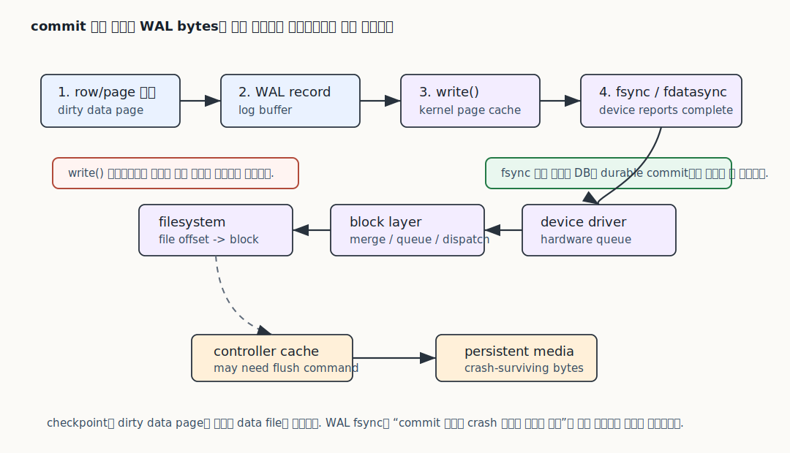

# WAL, redo, undo, crash recovery, PITR은 각각 무엇의 로그인가?

데이터베이스 로그를 설명할 때 가장 위험한 답변은 "변경 내용을 로그에 남겨서 복구합니다"에서 멈추는 답변입니다. 이 말은 아주 작은 단위에서는 대체로 맞지만, 면접 꼬리 질문으로 들어가면 금방 무너집니다. 어떤 로그가 무엇보다 먼저 기록되어야 하는지, 어떤 로그가 데이터 페이지를 다시 고치는지, 어떤 로그가 이전 값을 다시 보여 주는지, 어떤 로그가 백업 이후 특정 시점까지 시간을 되감는 재료인지가 서로 다르기 때문입니다.

이 문서는 데이터베이스 로그를 파일 이름이 아니라 "누가 읽고, 어떤 상태를 만들기 위해 쓰는가"로 나누어 설명합니다. 여기서 다루는 중심 질문은 네 가지입니다. WAL이 왜 데이터 파일보다 먼저 안정화되어야 하는지, redo가 crash 뒤 어떤 변경을 다시 적용하는지, undo가 rollback과 일관된 읽기에서 어떤 이전 상태를 제공하는지, PITR이 왜 백업 파일 하나가 아니라 백업 이후의 로그 흐름까지 요구하는지를 차례로 설명합니다.

본문은 PostgreSQL과 MySQL/InnoDB를 중심으로 씁니다. Oracle, SQL Server, RocksDB 계열처럼 다른 저장 엔진과 DBMS에도 비슷한 원리가 있지만, 같은 이름을 그대로 옮기면 틀릴 수 있습니다. 이 파일의 목표는 모든 제품의 내부 구조를 다 외우는 것이 아니라, 면접에서 "로그로 복구한다"는 말을 했을 때 그 말이 어떤 계층의 어떤 소비자를 가리키는지 끝까지 설명할 수 있게 만드는 것입니다. Dirty page와 checkpoint의 물리 흐름은 [page와 buffer I/O](02-storage-pages-buffer-io.md), 오래된 version을 누가 볼 수 있는지는 [MVCC와 snapshot visibility](07-mvcc-snapshot-visibility.md), 복제 lag와 failover는 [replication, backup, failover](09-replication-lag-backup-failover.md), DB 밖으로 나간 외부 부작용(side effect)은 [outbox와 애플리케이션 경계](12-application-boundaries-idempotency-money-outbox.md)로 이어집니다.
- [2-5분 개요](#2-5분-개요)
- [먼저 잡아야 할 작은 모델](#먼저-잡아야-할-작은-모델)
- [깊은 메커니즘](#깊은-메커니즘)
    - [정상 commit 경로](#정상-commit-경로)
    - [commit log flush는 커널과 장치 flush 경계를 지나간다](#commit-log-flush는-커널과-장치-flush-경계를-지나간다)
    - [crash recovery는 최신 일관성 회복이다](#crash-recovery는-최신-일관성-회복이다)
    - [undo는 이전 상태를 제공하는 장치다](#undo는-이전-상태를-제공하는-장치다)
    - [checkpoint는 복구 시작점을 줄이는 장치다](#checkpoint는-복구-시작점을-줄이는-장치다)
    - [PITR은 과거 시점으로 시간을 재생하는 작업이다](#pitr은-과거-시점으로-시간을-재생하는-작업이다)
    - [replication log와 recovery log를 섞지 않기](#replication-log와-recovery-log를-섞지-않기)
    - [애플리케이션 경계까지 보기](#애플리케이션-경계까지-보기)
- [DBMS별 경계](#dbms별-경계)
    - [PostgreSQL](#postgresql)
    - [MySQL/InnoDB](#mysqlinnodb)
    - [같은 질문, 다른 답](#같은-질문-다른-답)
- [직접 재생해 보기](#직접-재생해-보기)
    - [PostgreSQL에서 확인할 것](#postgresql에서-확인할-것)
    - [MySQL/InnoDB에서 확인할 것](#mysqlinnodb에서-확인할-것)
    - [손으로 하는 replay 질문](#손으로-하는-replay-질문)
- [면접 꼬리 질문](#면접-꼬리-질문)
- [함정 질문](#함정-질문)
- [더 깊게 볼 자료](#더-깊게-볼-자료)

## 2-5분 개요

면접에서 짧게 답해야 한다면 이렇게 말할 수 있습니다. 데이터베이스의 로그는 하나의 뭉뚱그린 백업 파일이 아니라, 장애 뒤 상태를 다시 설명하기 위한 시간순 증거입니다. WAL은 Write-Ahead Logging의 줄임말이고, 핵심은 데이터 파일에 변경을 쓰기 전에 그 변경을 설명하는 로그를 먼저 영구 저장한다는 점입니다. PostgreSQL 공식 문서는 테이블과 인덱스가 들어 있는 데이터 파일의 변경은 그 변경을 설명하는 WAL record가 영구 저장된 뒤에만 기록되어야 한다고 설명합니다. 그래야 crash가 나도 데이터 파일에 아직 반영되지 않은 변경을 로그에서 다시 적용할 수 있습니다.

redo는 이름 그대로 "다시 적용"에 초점을 둡니다. 어떤 transaction이 commit되었는데 dirty page가 아직 디스크 데이터 파일까지 내려가지 못한 상태에서 서버가 죽으면, 재시작 시 로그를 읽어 그 변경을 다시 page에 반영합니다. MySQL InnoDB의 redo log도 이런 crash recovery 용도입니다. InnoDB 공식 문서는 redo log가 crash recovery 중 사용되는 디스크 기반 구조이고, 예기치 않은 종료 전에 데이터 파일 갱신을 끝내지 못한 변경이 초기화 과정에서 재생된다고 설명합니다.

undo는 redo의 단순 반대말이 아닙니다. InnoDB에서 undo log record는 transaction이 clustered index record에 가한 최근 변경을 되돌리는 정보를 담고, 다른 transaction이 일관된 읽기에서 원래 데이터를 봐야 할 때도 그 이전 데이터를 가져오는 데 쓰입니다. 그래서 undo는 rollback과 consistent read, 즉 "이 transaction 입장에서 예전 값이 무엇이었는가"라는 질문에 답합니다. PostgreSQL도 과거 버전을 보여 주지만, InnoDB처럼 별도의 undo log chain을 같은 방식으로 따라가는 모델이 아니라 heap tuple의 여러 버전과 visibility metadata로 설명하는 편이 더 정확합니다.

crash recovery와 PITR도 구분해야 합니다. crash recovery는 방금 죽은 같은 database cluster를 다시 일관된 최신 상태로 세우는 작업입니다. 보통 마지막 checkpoint 이후의 WAL이나 redo를 읽고, commit된 변경은 다시 적용하며, 완료되지 않은 transaction은 보이지 않게 하거나 되돌리는 흐름입니다. PITR(Point-in-Time Recovery, 특정 시점 복구)은 기준 backup을 복원한 뒤 그 이후의 로그를 목표 시점까지만 replay해서 과거의 일관된 상태를 만드는 작업입니다. PostgreSQL에서는 base backup과 archived WAL을 결합합니다. MySQL에서는 full backup 이후 생성된 binary log를 이용합니다.

따라서 좋은 답변의 핵심은 "로그가 있다"가 아니라 "어떤 로그가 어떤 복구 질문에 답하는가"입니다. WAL이나 redo는 page 변경을 crash 뒤 다시 적용할 수 있게 해 줍니다. undo는 rollback과 consistent read에서 이전 상태를 제공합니다. PITR은 backup과 연속된 log stream을 조합해 특정 시점까지 시간을 재생합니다. 이 경계를 나누면 "WAL이 있으면 backup이 필요 없나요?", "redo log로 MySQL 특정 시점 복구를 하면 되나요?", "undo는 crash recovery용인가요?", "replication log와 recovery log는 같은가요?" 같은 꼬리 질문에도 흔들리지 않습니다.

## 먼저 잡아야 할 작은 모델

가장 작은 모델은 계좌 한 줄을 수정하는 update입니다. 실제 엔진은 page header, tuple header, transaction id, checksum, full page write, mini-transaction 같은 많은 세부 구조를 갖지만, 처음에는 상태가 시간순으로 어떻게 바뀌는지만 잡으면 됩니다.

```text
초기 상태
  disk data page P10:
    accounts[id=42].balance = 10000

T1 실행
  UPDATE accounts SET balance = 9000 WHERE id = 42;

메모리 안에서 먼저 일어나는 일
  buffer page P10 becomes dirty
  log record describes the change
  transaction has commit record or commit decision

장애 상황
  log record is durable
  dirty data page may still be only in memory
  server crashes before P10 is flushed to data file

재시작
  recovery reads log
  if page P10 on disk is older than the log record, recovery replays the change
  after recovery, committed balance is visible as 9000
```

이 작은 모델의 핵심은 dirty page와 durable log의 시간 차입니다. dirty page는 메모리 안에서 바뀐 page입니다. 아직 디스크의 data file에 완전히 내려갔다는 뜻이 아닙니다. 반대로 durable log는 crash가 나도 다시 읽을 수 있는 저장소에 내려간 증거입니다. 데이터베이스는 commit 때마다 수정된 모든 page를 즉시 디스크에 쓰는 방식으로도 안전해질 수 있습니다. 하지만 그렇게 하면 작은 transaction 하나가 여러 data page를 동기화해야 하고, random I/O가 늘어나 정상 성능이 크게 나빠집니다.

그래서 많은 DBMS는 "데이터 page는 나중에 써도 되지만, 그 page를 복원할 수 있는 log는 먼저 안전하게 남긴다"는 방식을 택합니다. 이게 write-ahead의 핵심입니다. 여기서 ahead는 시간순 우선순위입니다. 데이터 파일에 변경이 먼저 영구 반영되고 그 변경을 설명하는 로그가 아직 없다면, crash 뒤에는 그 변경이 commit된 것인지, 절반만 반영된 것인지, 다시 적용해도 되는지 판단하기 어렵습니다. 반대로 로그가 먼저 안정화되어 있으면, data page가 오래된 상태여도 recovery가 로그를 읽고 필요한 변경을 다시 적용할 수 있습니다.

이 모델은 transaction 처리 이론에서 흔히 force/no-force, steal/no-steal로 설명됩니다. force는 commit 때 바뀐 data page를 반드시 디스크에 쓰는 정책입니다. no-force는 commit이 되어도 data page flush를 나중으로 미룰 수 있는 정책입니다. steal은 아직 commit되지 않은 transaction의 dirty page라도 buffer가 필요하면 디스크에 쓸 수 있는 정책입니다. 실제 엔진은 성능 때문에 no-force와 steal 쪽 성질을 섞어 쓰는 경우가 많습니다. 그러면 crash 뒤에는 "commit되었지만 data file에 아직 없는 변경"과 "commit되지 않았는데 data file 어딘가에 내려간 변경"을 모두 설명해야 합니다. redo와 undo라는 두 질문이 여기서 나옵니다.

정책 조합을 작게 펼치면 왜 redo와 undo가 함께 등장하는지 보입니다.

| 정책 감각 | commit된 변경이 data file에 없을 수 있는가 | commit 안 된 변경이 data file에 있을 수 있는가 | crash 뒤 필요한 질문 |
| --- | --- | --- | --- |
| force + no-steal | 거의 없게 만들려는 정책 | 없게 만들려는 정책 | 단순하지만 정상 실행 I/O가 큽니다. |
| no-force | 예 | 정책에 따라 다름 | commit된 변경을 redo할 수 있어야 합니다. |
| steal | 정책에 따라 다름 | 예 | commit 안 된 변경을 undo하거나 보이지 않게 해야 합니다. |
| no-force + steal | 예 | 예 | redo와 undo/visibility 판단이 모두 필요합니다. |

실제 제품이 이 표의 칸 하나에 딱 맞는다고 외우기보다, 면접에서는 먼저 질문을 분리하는 편이 안전합니다. "commit된 변경이 빠졌는가"는 redo 질문이고, "commit되지 않은 변경이 보이면 안 되는가"는 undo 또는 visibility 질문입니다. PostgreSQL과 InnoDB는 이 질문에 답하는 자료 구조가 다릅니다.

이 어휘가 중요한 이유는 데이터베이스가 처리량을 얻기 위해 오래전부터 "정상 실행을 빠르게 하고, 장애 때 논리적으로 수습한다"는 방향을 택해 왔기 때문입니다. commit 때 모든 data page를 강제로 쓰는 force 정책은 설명은 쉽지만, 계좌 하나를 바꾸는 transaction이 index page, heap 또는 clustered page, metadata page까지 여러 random write를 기다리게 만들 수 있습니다. no-force와 steal 계열의 설계는 정상 실행 중에는 buffer를 더 자유롭게 쓰게 해 주지만, 그 대신 장애 뒤에 무엇을 다시 적용하고 무엇을 되돌릴지 설명하는 로그와 visibility 규칙이 필요합니다. WAL, redo, undo는 그래서 "로그 파일 종류"라기보다 이 성능과 복구성의 교환을 안전하게 만들기 위한 답입니다.

redo는 commit된 변경이 data file에 없으면 다시 적용하는 질문입니다. undo는 commit되지 않은 변경이 이미 보이거나 page에 남아 있으면 되돌리거나, 다른 transaction이 봐야 하는 이전 버전을 찾는 질문입니다. WAL은 이 두 질문을 가능하게 만드는 더 넓은 원칙 또는 로그 체계로 쓰입니다. PostgreSQL에서는 WAL 자체가 crash recovery의 redo 재료이고, archiving을 통해 PITR과 standby에도 쓰입니다. InnoDB에서는 redo log와 undo log가 역할을 나누고, MySQL server 계층의 binary log가 replication과 특정 시점 복구의 중요한 재료가 됩니다.

이 구분을 잡으면 "로그"라는 단어가 더 이상 하나로 보이지 않습니다. 같은 update라도 네 가지 관점이 생깁니다.

| 관점 | 묻는 질문 | 대표 재료 |
| --- | --- | --- |
| write-ahead | data file보다 먼저 안전하게 남겨야 하는 증거가 무엇인가 | PostgreSQL WAL, InnoDB redo log |
| redo | crash 뒤 data file에 없으면 다시 적용할 변경은 무엇인가 | WAL record, redo record |
| undo | rollback이나 consistent read에서 이전 상태를 어떻게 찾는가 | InnoDB undo log, PostgreSQL heap tuple visibility |
| PITR | backup 이후 목표 시점까지 어떤 변경을 어디까지 재생할 것인가 | archived WAL, MySQL binary log |

여기서 조심할 점은 "대표 재료"가 항상 1:1로만 대응하지 않는다는 것입니다. PostgreSQL WAL은 crash recovery에도 쓰이고, replication에도 쓰이고, archiving을 통해 PITR에도 쓰입니다. 그러므로 "PostgreSQL WAL은 PITR용 로그다"라고만 말하면 틀리고, "PostgreSQL WAL은 data file 변경을 설명하는 write-ahead log이며, 그 record stream을 어떤 소비자가 읽느냐에 따라 crash recovery, standby replay, PITR의 재료가 된다"라고 말해야 합니다.

## 깊은 메커니즘

### 정상 commit 경로

정상 commit 경로는 애플리케이션의 update 요청에서 시작합니다. 애플리케이션이 update를 보내면 DBMS는 논리적으로 row 하나를 바꾸는 것처럼 보입니다. 하지만 저장 엔진은 row를 page 안에서 찾고, 그 page를 buffer에 올리고, page 안의 record나 tuple을 바꾸고, 그 변경을 설명하는 log record를 만듭니다. 이때 data page가 디스크에 내려가는 시점과 log가 내려가는 시점은 다릅니다.

아래 그림은 commit 성공 응답이 단순한 `write()` 성공이 아니라 WAL bytes가 OS와 storage 경계를 어디까지 통과했는지에 걸려 있음을 보여 줍니다. PostgreSQL처럼 `wal_sync_method=fdatasync` 또는 `fsync` 계열을 쓰는 경우에는 `write()`가 WAL bytes를 kernel cache로 옮기고, 별도 sync 단계가 그 bytes를 영구 저장 장치까지 밀어 내려 commit durability 경계를 닫습니다.



```text
1. SQL 실행
   client -> server: UPDATE accounts SET balance = 9000 WHERE id = 42

2. page 수정
   buffer pool/shared buffer:
     P10 old balance 10000 -> new balance 9000
   page is dirty

3. log 생성
   log buffer:
     LSN 500: P10 record id=42 balance change

4. commit
   commit record or transaction outcome becomes durable according to durability policy
   client receives success only after the DBMS' commit rule is satisfied

5. checkpoint or background flush
   dirty P10 is eventually written to data file
```

정상 commit 경로를 상태별로 보면, "로그가 있다"라는 말 안에도 여러 중간 상태가 있음을 알 수 있습니다.

| 단계 | P10 data page | log bytes | transaction 결과 | crash가 여기서 나면 |
| --- | --- | --- | --- | --- |
| update 직후 | buffer에서 dirty | DBMS log buffer에 있을 수 있음 | 아직 commit 아님 | commit되지 않았으므로 보이면 안 됩니다. |
| commit 결정 직전 | dirty일 수 있음 | commit 관련 record가 준비됨 | 아직 client success 아님 | DBMS 정책상 commit 성공으로 말하지 않은 상태입니다. |
| log flush 완료 | dirty일 수 있음 | durable boundary 통과 | client에게 success 가능 | data page가 오래되어도 redo로 복원해야 합니다. |
| page flush 완료 | data file도 새 page 반영 | log는 여전히 복구/replication/PITR 재료일 수 있음 | success 이후 상태 | recovery 부담이 줄어듭니다. |

이 표에서 data page와 log bytes를 나란히 보는 이유는 commit의 안전성이 data page flush가 아니라 log flush에 기대는 경우가 많기 때문입니다. 다만 어떤 flush를 commit 성공 조건으로 삼는지는 DBMS와 설정에 따라 달라집니다.

여기서 LSN(Log Sequence Number)은 로그 안에서의 위치 또는 순서를 나타내는 값입니다. 실제 제품마다 이름과 단위는 다르지만, "이 page가 어느 log 위치까지 반영되었는가"를 판단하는 데 중요합니다. page가 이미 최신 LSN을 반영하고 있으면 redo를 다시 적용할 필요가 없습니다. page가 더 오래된 LSN에 머물러 있으면 recovery는 log를 읽고 빠진 변경을 다시 적용합니다. 이 성질 때문에 redo는 보통 idempotent, 즉 이미 적용된 변경을 다시 만났을 때도 pageLSN 같은 기준으로 중복 적용을 피할 수 있게 설계됩니다.

PostgreSQL 공식 문서는 WAL을 쓰면 transaction commit을 보장하기 위해 변경된 모든 data file을 flush할 필요 없이 WAL file만 flush하면 되는 경우가 많고, WAL은 순차적으로 쓰이므로 data page를 여기저기 flush하는 것보다 비용이 낮다고 설명합니다. 이것은 단순 성능 팁이 아니라 구조적 이유입니다. commit의 durability를 "모든 data page가 지금 디스크에 있다"로 보장하지 않고, "그 page들을 다시 만들 수 있는 log가 안전하다"로 보장하는 것입니다.

이 구조가 특히 효과적인 이유는 log가 시간순으로 append되는 경향이 강하고, data page는 업무 key와 index 구조에 따라 여러 파일 위치로 흩어지기 쉽기 때문입니다. 사용자가 `accounts[42]` 하나를 수정해도 실제로는 data page, index page, transaction metadata, commit record가 서로 다른 곳을 건드릴 수 있습니다. DBMS가 commit 순간에 흩어진 page를 모두 안정화하려 하면 작은 transaction도 여러 random write의 합이 됩니다. WAL/redo는 이 흩어진 변경을 먼저 한 줄의 시간순 증거로 모읍니다. 정상 경로에서는 순차 log flush에 더 많이 기대고, 장애 경로에서는 그 증거를 따라 흩어진 page를 다시 맞춥니다.

### commit log flush는 커널과 장치 flush 경계를 지나간다

WAL이나 redo log가 durable하다고 말할 때는 DBMS 내부의 log buffer만 보면 부족합니다. PostgreSQL WAL 설정 문서는 `XLogInsertRecord`가 WAL buffer에 record를 넣고, transaction commit 시점에는 주로 `XLogFlush` 요청이 transaction record를 permanent storage로 flush한다고 설명합니다. MySQL InnoDB 내부 문서도 redo log에서 `write_lsn`과 `flushed_to_disk_lsn`을 구분합니다. 즉 log가 "메모리 buffer에 있음", "log file로 write됨", "disk까지 flush됨"은 서로 다른 상태입니다.

```text
transaction commit path, simplified

DBMS memory
  WAL/redo record reserved
  WAL/redo buffer contains commit-related bytes
       |
       v
DBMS log writer/flusher
  writes bytes to WAL/redo log file
       |
       v
kernel / filesystem
  page cache or direct I/O path
  filesystem ordering and metadata rules
       |
       v
block layer / driver / storage
  request queue
  controller cache
  non-volatile media
       |
       v
client receives commit success
  only after the DBMS durability policy's required boundary is satisfied
```

Linux `fsync(2)` manual은 `fsync()`가 파일의 수정된 in-core data와 metadata를 영구 저장 장치로 flush하고, disk cache가 있으면 그것까지 flush한다고 설명합니다. Linux block layer 문서도 volatile write-back cache가 있는 장치는 OS에 I/O completion을 먼저 알릴 수 있으므로, filesystem이 data integrity operation에서 forced cache flush나 FUA(Force Unit Access)를 사용할 수 있다고 설명합니다. 따라서 commit latency는 단순히 SQL 실행 시간이 아닙니다. DBMS log flusher가 CPU를 언제 받는지, kernel writeback과 filesystem journal이 어떤 ordering을 요구하는지, block queue와 device cache flush가 얼마나 걸리는지가 모두 commit 지연에 들어갈 수 있습니다.

아래 trace는 하나의 transaction이 commit success를 받기 전까지 통과할 수 있는 경계를 더 잘게 나눈 것입니다.

```text
T1 commit wants LSN 510 durable

DBMS memory
  WAL buffer contains bytes up to LSN 510
  commit is not yet safe against process crash

DBMS WAL writer/flusher
  issues write for WAL file range
  bytes leave DBMS buffer

kernel/filesystem
  accepts write
  may keep dirty file pages or submit I/O
  filesystem metadata/order rules may matter

block layer/device
  request reaches storage queue
  volatile controller cache may acknowledge early unless flush/FUA is used

sync completion
  DBMS durability policy says required boundary is satisfied
  T1 can receive commit success
```

group commit은 이 경로를 여러 transaction이 공유하게 만드는 최적화입니다.

```text
T1 commit waits for LSN 510
T2 commit waits for LSN 520
T3 commit waits for LSN 530

one flush completes durable up to LSN 530
  T1, T2, T3 can all be released
```

이 구조는 commit latency를 줄일 수 있지만, 원리를 없애지는 않습니다. 성공 응답을 받은 transaction의 log 위치가 DBMS가 요구하는 flush boundary를 통과해야 crash 뒤 redo 재료가 남습니다.

면접에서는 이 경계를 한 문장으로 압축할 수 있습니다. "WAL/redo가 안전하다는 말은 log record가 DBMS 메모리에 생겼다는 뜻이 아니라, 해당 DBMS 설정이 commit 성공으로 인정하는 flush 경계까지 내려갔다는 뜻입니다." 이 문장을 말한 뒤에는 제품별 설정으로 내려가야 합니다. PostgreSQL은 `synchronous_commit`, `fsync`, `wal_sync_method`, group commit을 봅니다. InnoDB는 `innodb_flush_log_at_trx_commit`, redo log writer/flusher, doublewrite와 checkpoint 압력을 함께 봅니다. 설정이 성능을 위해 flush 경계를 약하게 만들면 crash 때 잃을 수 있는 window도 같이 달라집니다.

### crash recovery는 최신 일관성 회복이다

서버가 갑자기 죽으면 디스크에는 세 종류의 흔적이 섞여 있을 수 있습니다.

1. commit되었고 data file에도 반영된 변경
2. commit되었지만 data file에는 아직 반영되지 않은 변경
3. commit되지 않았는데 일부 data page에 내려갔을 수 있는 변경

crash recovery는 이 셋을 구분해 database를 일관된 상태로 세웁니다. PostgreSQL에서는 checkpoint 이후의 WAL을 읽어 필요한 변경을 다시 적용합니다. InnoDB도 redo log를 사용해 data file 갱신을 끝내지 못한 변경을 재생합니다. 이 단계에서 중요한 것은 "서버가 죽기 전 마지막 순간의 메모리 상태를 복원한다"가 아닙니다. 메모리는 사라졌으므로, 디스크에 남은 data file과 log를 근거로 transaction 규칙에 맞는 상태를 다시 만드는 것입니다.

```text
crash 직전
  disk page P10: balance = 10000, pageLSN = 420
  redo/WAL:
    LSN 500: balance 10000 -> 9000
    LSN 510: T1 commit
  buffer memory:
    P10 balance = 9000, pageLSN = 500
  server dies before P10 is flushed

recovery
  read checkpoint
  scan log after checkpoint
  find committed update at LSN 500/510
  compare disk pageLSN 420 with log LSN 500
  replay update

after recovery
  disk page P10: balance = 9000, pageLSN >= 500
```

crash recovery 판단은 보통 다음 네 가지 상태를 구분하는 일입니다.

| disk data page | log에 commit 증거 | recovery 판단 | 이유 |
| --- | --- | --- | --- |
| 최신 | 있음 | redo를 건너뛰거나 idempotent하게 확인 | pageLSN 등이 이미 반영을 보여 줍니다. |
| 오래됨 | 있음 | redo 적용 | client에게 성공한 변경이 data file에 빠져 있습니다. |
| 일부 변경 흔적 | 없음 또는 commit 아님 | undo/visibility 정리 필요 | commit되지 않은 변경이 확정 상태처럼 보이면 안 됩니다. |
| log chain이 끊김 | 판단 불가 | 복구를 멈추고 원인과 대체 복원 지점을 다시 확인해야 하는 위험 | 필요한 증거가 없으면 이후 상태를 신뢰하기 어렵습니다. |

이 표가 중요한 이유는 recovery가 "마지막 메모리 상태를 복원한다"가 아니라는 점입니다. 복구는 사라진 메모리를 되살리는 작업이 아니라, 디스크에 남은 page와 log 증거를 읽어 transaction 규칙에 맞는 새 일관 상태를 만드는 작업입니다.

만약 commit되지 않은 T2가 있었다면 이야기가 달라집니다. InnoDB에서는 undo log가 rollback과 consistent read에 쓰이며, recovery 과정에서도 완료되지 않은 transaction의 영향을 정리하는 데 관여합니다. PostgreSQL에서는 transaction visibility 정보와 tuple version 규칙 때문에 commit되지 않은 tuple은 정상 조회에서 보이지 않습니다. 두 제품 모두 "commit되지 않은 변경이 사용자에게 확정된 상태처럼 보이면 안 된다"는 목표는 공유하지만, 이전 버전을 어디에 어떻게 두는지는 다릅니다.

### undo는 이전 상태를 제공하는 장치다

undo를 redo의 반대말로만 외우면 반쯤만 맞습니다. InnoDB undo log는 transaction의 최근 변경을 되돌리는 정보를 담습니다. 그런데 그 정보는 rollback에만 쓰이지 않습니다. 다른 transaction이 consistent read, 즉 자기 snapshot 기준으로 일관된 읽기를 해야 할 때도 unmodified data를 undo log record에서 가져올 수 있습니다. MySQL 8.4 공식 문서도 undo log record가 transaction의 최신 변경을 undo하는 정보를 담고, 다른 transaction이 일관된 읽기의 일부로 원래 데이터를 봐야 할 때 그 unmodified data를 undo log record에서 가져온다고 설명합니다.

다음 작은 예시는 undo가 rollback과 consistent read에 어떻게 동시에 연결되는지 보여 줍니다.

```text
초기
  accounts[42].balance = 10000

T1 starts at 10:00
  T1 snapshot sees balance = 10000

T2 starts at 10:01
  T2 updates balance = 9000
  InnoDB stores old value 10000 in undo records
  T2 commits

T1 reads again at 10:02
  T1 still needs the 10:00 snapshot
  InnoDB can follow undo information to reconstruct balance = 10000
```

이 예를 더 작게 쪼개면 undo가 정상 읽기 경로에도 들어온다는 점이 보입니다.

| 시간 | 현재 clustered record | undo 쪽에 남은 정보 | T1 snapshot이 봐야 하는 값 |
| --- | --- | --- | --- |
| 10:00 | balance=10000 | 없음 | 10000 |
| 10:01 update | balance=9000 | 이전 값 10000을 되돌릴 정보 | 10000 |
| 10:01 commit | balance=9000 | 오래된 snapshot이 필요하면 아직 보존 | 10000 |
| 10:02 T1 read | 최신 record는 9000 | undo를 따라 이전 상태 재구성 | 10000 |
| T1 종료 후 purge 가능 시점 | 최신 record 9000 | 더 이상 필요 없으면 정리 후보 | 새 snapshot은 9000 |

그래서 오래 열린 transaction은 단순히 lock만의 문제가 아닙니다. 오래된 snapshot이 남아 있으면 이전 버전이나 undo 정보를 빨리 버릴 수 없고, purge 또는 vacuum이 밀립니다. "undo는 rollback용"이라는 설명은 이 정상 실행 중 읽기 비용을 놓칩니다.

이 예에서 undo는 "장애가 났을 때만 쓰는 로그"가 아닙니다. 정상 실행 중에도 오래된 snapshot을 재구성하는 데 쓰입니다. 그래서 long transaction이 오래 살아 있으면 undo를 빨리 지울 수 없고, purge가 밀릴 수 있습니다. 면접에서 InnoDB MVCC를 설명할 때 undo log와 read view를 함께 말해야 하는 이유가 여기에 있습니다.

PostgreSQL은 같은 질문에 다른 구조로 답합니다. PostgreSQL은 update가 기존 tuple을 제자리에서 덮어쓰기보다 새 tuple version을 만들고, tuple header의 `xmin`, `xmax` 같은 transaction metadata와 snapshot visibility 규칙으로 어떤 version이 보이는지 판단합니다. 그래서 PostgreSQL을 InnoDB처럼 "undo log를 따라가서 이전 row를 읽는다"고 설명하면 큰 그림은 비슷해 보여도 구현 경계가 틀립니다. 이 차이는 운영에서도 중요합니다. PostgreSQL에서는 오래된 snapshot이 dead tuple 정리를 막아 vacuum pressure를 만들 수 있고, InnoDB에서는 undo history와 purge pressure가 문제가 될 수 있습니다.

### checkpoint는 복구 시작점을 줄이는 장치다

로그를 계속 쌓기만 하면 crash recovery 때 처음부터 모든 log를 읽어야 합니다. checkpoint는 "여기까지의 변경은 data file 쪽에도 충분히 반영되었다"는 기준점을 만들어 recovery가 읽어야 할 범위를 줄입니다. checkpoint가 있다고 해서 모든 위험이 사라지는 것은 아닙니다. checkpoint 이후에 commit된 변경 중 data page에 아직 내려가지 않은 것은 redo로 다시 적용해야 합니다. checkpoint 이전이라도 page flush와 log flush의 순서 규칙이 깨지면 안 됩니다.

```text
time ---->

LSN 100   LSN 200   LSN 300   LSN 400   LSN 500
  |         |          |          |          |
 update    update     CHECKPOINT update     commit

crash after LSN 500
  recovery usually starts from checkpoint-related position
  log after that point is scanned
  data pages older than their log records are redone
```

checkpoint는 성능과 복구 시간 사이의 trade-off도 만듭니다. checkpoint를 자주 하면 crash recovery 때 읽을 log는 줄지만, 정상 실행 중 dirty page flush 압력이 커질 수 있습니다. checkpoint를 드물게 하면 평소 쓰기 부담은 줄 수 있지만, crash 뒤 replay해야 할 log가 길어집니다. 그래서 WAL이나 redo를 공부할 때 checkpoint를 "로그 청소" 정도로만 보면 부족합니다. checkpoint는 정상 I/O 패턴과 장애 후 복구 시간의 균형점입니다.

### PITR은 과거 시점으로 시간을 재생하는 작업이다

crash recovery가 "갑자기 죽은 서버를 최신의 일관된 상태로 다시 세우는 작업"이라면, PITR은 "기준 backup에서 출발해 원하는 과거 시점까지 시간을 재생하는 작업"입니다. 둘 다 replay라는 단어를 쓰지만 목표가 다릅니다. crash recovery는 보통 같은 cluster가 죽기 직전까지 commit된 상태를 회복하려 합니다. PITR은 운영자가 지정한 time, LSN, transaction, binary log position 같은 목표에서 일부러 멈춥니다. 예를 들어 10:31에 잘못된 DELETE가 실행되었다면, 10:30:59의 상태로 돌아가고 싶을 수 있습니다.

PostgreSQL에서는 base backup과 archived WAL이 함께 필요합니다. 공식 문서는 WAL이 database data file 변경을 기록하고, file-system-level backup과 WAL file backup을 결합해 복구 시 file system backup을 복원한 뒤 WAL을 replay할 수 있다고 설명합니다. 또한 replay를 끝까지 하지 않고 어느 지점에서 멈추면 그 시점의 일관된 snapshot을 얻을 수 있으므로 PITR이 가능하다고 설명합니다.

MySQL도 구조는 비슷하지만 재료 이름이 다릅니다. MySQL 공식 문서는 point-in-time recovery를 full backup으로 backup 당시 상태를 복원한 뒤, full backup 이후 더 최근 시점까지 incremental하게 변경을 가져오는 작업으로 설명합니다. binary log를 이용한 PITR에서는 full backup 이후 생성된 binary log file들이 정보의 source이며, binary logging이 켜져 있어야 합니다. `mysqlbinlog`는 binary log event를 읽거나 적용할 수 있는 형태로 바꾸고, event time이나 position으로 필요한 구간을 고를 수 있습니다. 물리 backup 제품이나 운영 절차가 세부를 감싸더라도, 면접에서 구분해야 할 핵심은 InnoDB redo log가 engine crash recovery의 재료이고, server 계층의 binary log가 특정 시점까지 변경을 재적용하는 대표 재료라는 점입니다.

```text
PITR mental model

01:00 full/base backup
      |
      v
01:00-10:30 log stream
      |
      v
10:31 wrong DELETE
      |
      v
target = 10:30:59

restore
  1. restore the backup from 01:00
  2. replay every required WAL/binlog record after 01:00
  3. stop before the wrong DELETE
  4. run business validation queries
  5. decide whether and how to replace or extract data
```

PITR에서 실제로 확인해야 하는 것은 "복구 명령을 실행했다"가 아니라 chain이 끊기지 않았고 목표 시점이 맞다는 점입니다.

| 확인 항목 | PASS 신호 | FAIL 신호 |
| --- | --- | --- |
| 기준 backup | 목표 시점보다 이전이며 restore 가능한 backup이 있습니다. | backup은 있지만 restore rehearsal을 해 본 적이 없습니다. |
| log continuity | backup 시작/종료 경계부터 목표 시점까지 WAL archive 또는 binary log가 연속입니다. | 중간 segment/file이 빠졌거나 보존 기간이 지나 삭제되었습니다. |
| target boundary | time, LSN, transaction id, binlog position 중 목표가 명확합니다. | timezone, commit 순서, 잘못된 작업의 정확한 경계가 불분명합니다. |
| business validation | 핵심 row와 업무 invariant가 목표 시점 상태와 맞습니다. | server가 켜진 것만 보고 성공으로 판단합니다. |
| external effects | DB 밖으로 나간 결제, 메시지, 파일, cache를 어떻게 맞출지 계획이 있습니다. | DB만 되돌리면 전체 시스템도 돌아간다고 가정합니다. |

특히 목표 시간이 wall-clock time이면 더 조심해야 합니다. 사용자가 본 "10:31"과 DB server timezone, binary log event time, transaction commit 순서가 어긋날 수 있습니다. 가능한 경우에는 업무 event id, LSN, binlog position, transaction boundary 같은 더 명확한 기준을 함께 잡는 편이 안전합니다.

여기서 "backup이 있다"와 "원하는 시점으로 복구할 수 있다"는 같은 말이 아닙니다. backup만 있으면 backup 시점으로 돌아갈 수 있을 뿐입니다. backup 이후 목표 시점까지의 log chain이 연속으로 있어야 합니다. log가 일부 빠졌거나, archive command가 실패했거나, binary log 보존 기간이 지나 삭제되었거나, 목표 시각의 timezone과 transaction boundary가 불명확하면 PITR은 곧바로 위험해집니다. 복구 가능성은 문서상 정책이 아니라 실제 restore rehearsal, 즉 격리된 환경에서 복원하고 업무 검증 쿼리를 돌려 본 결과로 닫아야 합니다.

PITR이 별도 주제로 분리되는 이유는 운영 데이터베이스가 "완벽한 순간에 멈춰서 백업되는 파일 묶음"으로 존재하지 않기 때문입니다. 서비스는 backup이 도는 동안에도 계속 쓰이고, 어떤 파일은 backup 초반 상태이고 어떤 파일은 backup 후반 상태일 수 있습니다. 그래서 신뢰할 수 있는 절차는 기준 backup이 어느 log 위치와 연결되는지 기록하고, 그 이후의 log stream을 끊기지 않게 보존한 뒤, 복원할 때 목표 지점까지만 재생합니다. 백업은 사진 한 장이고, WAL archive나 binary log는 그 사진 이후의 시간을 이어 주는 필름에 가깝습니다. 필름 중간이 끊기면 원하는 장면까지 갈 수 없습니다.

### replication log와 recovery log를 섞지 않기

복제도 로그를 읽습니다. 하지만 복제를 설명하는 log 소비자와 PITR을 설명하는 log 소비자는 같은 질문에 답하지 않습니다. PostgreSQL streaming replication은 WAL record를 standby로 보내 replay하게 할 수 있습니다. MySQL replication은 source의 binary log event를 replica가 relay log로 받아 적용합니다. 이때 질문은 "primary의 변경을 다른 서버가 얼마나 늦게 따라가는가"입니다. PITR의 질문은 "기준 backup 이후 어느 시점까지 replay하고 멈출 것인가"입니다. crash recovery의 질문은 "data file과 log를 보고 현재 cluster를 transaction-consistent 상태로 회복할 수 있는가"입니다. lag와 failover 관측값은 [replication 문서](09-replication-lag-backup-failover.md)에서 별도 질문으로 분리해 읽는 편이 안전합니다.

같은 재료가 여러 소비자에게 읽힐 수 있으므로, "WAL은 replication log다"처럼 한 용도로만 이름 붙이면 틀립니다. 반대로 MySQL의 InnoDB redo log와 MySQL binary log를 모두 "로그"라고 묶어 버리면, crash recovery와 PITR의 재료를 섞게 됩니다. InnoDB redo log는 storage engine이 page 변경을 crash 뒤 재적용하는 데 쓰는 물리적 성격의 로그입니다. MySQL binary log는 server 계층에서 데이터 변경 event를 기록하며 replication과 PITR에 쓰입니다. 실제 운영에서 복구 절차를 만들 때 이 둘의 책임을 혼동하면, redo log만 보고 특정 시점 복구가 된다고 믿거나, binary log만 있으면 engine crash consistency가 해결된다고 착각할 수 있습니다.

같은 update 하나도 소비자에 따라 다르게 읽힙니다.

| 소비자 | 읽는 질문 | 대표적으로 필요한 순서 |
| --- | --- | --- |
| crash recovery | data file이 commit된 page 상태를 빠뜨렸는가 | checkpoint 이후 WAL/redo 순서 |
| standby/replica | primary/source 변경을 어디까지 따라왔는가 | receive position과 replay/apply position |
| PITR restore | backup 이후 목표 지점까지 무엇을 적용하고 어디서 멈출 것인가 | backup base와 archived WAL/binlog chain |
| old snapshot reader | 이 transaction이 봐야 할 이전 version은 무엇인가 | undo chain 또는 tuple visibility |

이 표처럼 "누가 읽는가"를 먼저 정하면 로그 이름이 헷갈려도 복구 질문을 다시 잡을 수 있습니다.

### 애플리케이션 경계까지 보기

DB를 특정 시점으로 되돌리는 일은 DB 안에서만 끝나지 않습니다. 결제 승인, 외부 메시지 발행, 검색 색인, 캐시, 파일 업로드, 이메일 발송처럼 DB 밖에 이미 나간 외부 부작용이 있으면, DB만 10:30:59로 되돌려도 시스템 전체가 10:30:59로 돌아가지 않습니다. PITR은 database state를 되돌리는 강력한 도구지만, 외부 시스템과의 정합성 맞춤(reconciliation)을 자동으로 해결하지 않습니다. 이 경계는 [outbox, idempotency, money flow](12-application-boundaries-idempotency-money-outbox.md)를 함께 봐야 면접 답변이 DB 내부 설명에서 멈추지 않습니다.

예를 들어 주문 DB를 잘못된 DELETE 직전으로 복원했다고 하자. 그 사이 결제 PG에는 이미 승인된 거래가 있고, Kafka나 SQS에는 발행된 이벤트가 있고, 검색 인덱스에는 삭제나 수정이 반영되었을 수 있습니다. 이때 복구 판단은 "DB가 복원되었는가"만이 아니라 "외부 부작용과 다시 맞출 계획이 있는가"까지 포함해야 합니다. 면접에서 더 성숙하게 답하려면 DB 내부 로그 설명 뒤에 이 경계를 짧게라도 붙이는 편이 좋습니다. 복구는 저장소의 시간 이동이면서 동시에 시스템 경계의 정합성 문제입니다.

## DBMS별 경계

### PostgreSQL

PostgreSQL에서 WAL은 database data file의 변경을 먼저 기록하는 핵심 log stream입니다. 공식 문서 기준으로 WAL은 data integrity를 보장하는 표준 방법이고, data file 변경은 그 변경을 설명하는 WAL record가 permanent storage에 flush된 뒤에만 쓰여야 합니다. 이 원칙 덕분에 crash 뒤 data page에 적용되지 않은 변경을 WAL record에서 redo할 수 있습니다.

PostgreSQL WAL은 여러 소비자에게 읽힐 수 있습니다.

- crash recovery: 마지막 checkpoint 이후 필요한 WAL record를 replay해 database file 내용을 일관된 상태로 회복합니다.
- streaming/log shipping replication: standby가 WAL을 받아 replay하면서 primary를 따라갑니다.
- continuous archiving and PITR: base backup과 archived WAL을 결합해 원하는 시점까지 replay하고 멈춥니다.

이 때문에 PostgreSQL WAL을 한 가지 이름으로만 외우면 위험합니다. "PostgreSQL은 WAL로 복구합니다"는 맞지만 너무 짧습니다. 더 정확한 답은 "PostgreSQL WAL은 data file 변경을 먼저 설명하는 log stream이고, crash recovery는 그 stream으로 최신 일관성을 회복하며, PITR은 base backup에서 출발해 archived WAL을 목표 시점까지만 replay한다"입니다.

PostgreSQL MVCC의 이전 버전 처리도 InnoDB와 다릅니다. PostgreSQL은 update 때 새 tuple version을 만들고, transaction id와 snapshot visibility로 어떤 tuple이 보이는지 결정합니다. 그래서 old version을 이야기할 때 InnoDB undo log처럼 별도의 undo record chain을 중심으로 설명하지 않습니다. 오래된 transaction이 남아 있으면 vacuum이 죽은 tuple을 치우지 못해 bloat가 생길 수 있고, 이것이 InnoDB의 undo history pressure와 닮은 운영 문제를 만들 수는 있지만, 저장 방식은 다릅니다.

### MySQL/InnoDB

MySQL은 server 계층과 InnoDB storage engine 계층을 나누어 봐야 합니다. InnoDB redo log는 storage engine의 crash recovery 재료입니다. InnoDB 공식 문서는 redo log가 crash recovery 중 사용되는 disk-based data structure이고, 정상 실행 중 SQL statement나 low-level API call에서 나온 table data 변경 요청을 encode한다고 설명합니다. 예기치 않은 shutdown 전에 data file update가 끝나지 않은 변경은 initialization 중 자동으로 replay되고, connection을 받기 전에 처리됩니다.

InnoDB undo log는 rollback과 consistent read에 관여합니다. undo log record는 transaction이 clustered index record에 가한 최신 변경을 되돌리는 정보를 담고, 다른 transaction이 일관된 읽기에서 원래 데이터를 봐야 할 때 unmodified data를 제공합니다. 그래서 InnoDB MVCC를 "read view + undo log"로 설명하는 것은 좋은 출발점입니다. 다만 임시 테이블 undo처럼 crash recovery에 필요 없어서 redo-logged 되지 않는 경우도 있으므로, 모든 undo를 crash recovery의 같은 재료로 단순화하면 안 됩니다.

MySQL PITR은 binary log가 중요합니다. MySQL 공식 문서는 point-in-time recovery가 보통 full backup을 복원한 뒤 그 시점 이후 더 최근 시점까지 변경을 incremental하게 적용하는 작업이라고 설명합니다. binary log를 이용한 PITR에서 정보의 source는 full backup 이후 생성된 binary log file set이고, `mysqlbinlog`로 event time이나 position을 골라 적용할 수 있습니다. 따라서 MySQL에서 특정 시점 복구를 말할 때 "InnoDB redo log를 replay한다"가 아니라 "full backup을 기준으로 binary log를 목표 지점까지 적용한다"라고 말해야 합니다.

### 같은 질문, 다른 답

| 질문 | PostgreSQL | MySQL/InnoDB |
| --- | --- | --- |
| crash 뒤 data file에 빠진 변경을 어떻게 다시 적용하는가 | WAL replay | InnoDB redo log replay |
| 이전 버전 또는 rollback 정보는 어디서 보는가 | heap tuple version과 visibility metadata 중심 | undo log record와 read view 중심 |
| 특정 시점 복구는 무엇이 필요한가 | base backup + archived WAL + recovery target | full backup + binary log files + time/position target |
| replication은 무엇을 따라가는가 | WAL stream 또는 log shipping | binary log event, relay log, applier |
| 흔한 오해 | WAL을 backup 파일 자체로 보는 것 | redo log와 binary log를 같은 복구 재료로 보는 것 |

이 표는 제품을 암기하기 위한 표가 아닙니다. 면접에서 어떤 단어가 나왔을 때 어느 계층으로 내려갈지 고르는 지도입니다. 질문이 "commit latency가 왜 튀나요?"라면 WAL/redo flush와 fsync, checkpoint pressure를 봅니다. 질문이 "오래된 transaction 때문에 storage가 커집니다"라면 PostgreSQL vacuum과 InnoDB purge/undo history를 봅니다. 질문이 "어제 14:03 직전으로 되돌릴 수 있나요?"라면 crash recovery가 아니라 backup과 archived WAL 또는 binary log의 연속성을 봅니다.

## 직접 재생해 보기

여기서 직접 재생해 본다는 말은 운영 DB를 일부러 죽이라는 뜻이 아닙니다. disposable local database, 테스트 container, 또는 별도 restore rehearsal 환경에서 로그 위치와 복구 결과를 관측해 본다는 뜻입니다. 검증은 내부 절차 용어가 아니라 독자가 "내가 이 설명을 실제로 다시 확인하려면 무엇을 보면 되는가"에 답하는 부분입니다.

### PostgreSQL에서 확인할 것

PostgreSQL에서는 WAL 위치와 replay 위치를 관찰할 수 있습니다. 가장 단순한 관찰은 현재 WAL LSN을 확인하고, write workload 뒤 LSN이 증가하는지 보는 것입니다.

```sql
SELECT pg_current_wal_lsn();

CREATE TABLE IF NOT EXISTS wal_demo (
  id bigint PRIMARY KEY,
  balance bigint NOT NULL
);

INSERT INTO wal_demo(id, balance)
VALUES (42, 10000)
ON CONFLICT (id) DO UPDATE SET balance = EXCLUDED.balance;

SELECT pg_current_wal_lsn();

UPDATE wal_demo SET balance = balance - 1000 WHERE id = 42;

SELECT pg_current_wal_lsn();
```

PASS는 update 뒤 WAL 위치가 진행되고, 그 위치가 "row가 바뀌었다"는 논리 사실과 별개로 storage engine이 crash 뒤 재구성할 증거를 남긴다는 설명으로 이어지는 것입니다. FAIL은 LSN 숫자가 변했다는 사실만 보고 "복구가 검증되었다"고 말하는 것입니다. LSN 증가 관찰은 WAL 생성의 작은 증거일 뿐, PITR 가능성이나 백업 유효성을 증명하지 않습니다.

standby가 있다면 replay 위치도 볼 수 있습니다.

```sql
-- primary
SELECT pg_current_wal_lsn() AS primary_lsn;

-- standby
SELECT pg_last_wal_receive_lsn() AS received_lsn,
       pg_last_wal_replay_lsn() AS replayed_lsn,
       now() - pg_last_xact_replay_timestamp() AS replay_lag;
```

이 관찰의 PASS는 primary가 만든 WAL 위치, standby가 받은 위치, standby가 replay한 위치를 분리해 설명하는 것입니다. 이 값들이 다르면 복제 지연입니다. 하지만 이 실험은 replication 관찰이지 PITR 검증 자체는 아닙니다. 같은 WAL이 여러 소비자에게 읽힌다는 사실 때문에, 소비자별 질문을 분리해야 합니다.

PITR rehearsal은 별도의 복원 환경에서 해야 합니다. 실제 명령은 환경마다 달라지지만, 검증 질문은 고정됩니다.

```text
1. base backup을 만듭니다.
2. WAL archive가 base backup 시작 지점부터 목표 시점까지 연속인지 확인합니다.
3. restore 환경에 base backup을 풉니다.
4. restore_command와 recovery_target_time 또는 recovery_target_lsn을 설정합니다.
5. server를 recovery mode로 기동합니다.
6. 목표 시점 직전/직후의 업무 검증 쿼리를 실행합니다.
```

PASS는 "잘못된 DELETE 직전의 row는 있고, DELETE 이후 들어온 row는 없다"처럼 목표 시점이 업무 상태로 확인되는 것입니다. FAIL은 server가 올라왔다는 사실만 보고 복구가 맞다고 보는 것입니다. 복구된 database가 일관된 SQL 응답을 해도, 목표 시점과 업무 불변식이 맞는지는 따로 확인해야 합니다.

### MySQL/InnoDB에서 확인할 것

MySQL에서는 server 계층의 binary log와 InnoDB engine 계층의 redo/undo 관찰을 분리합니다.

```sql
SHOW BINARY LOGS;
SHOW BINARY LOG STATUS;
```

이 값은 PITR과 replication에서 중요한 binary log 위치를 보여 줍니다. MySQL 8.4 기준으로 특정 시점 복구를 하려면 full backup 이후의 binary log file set이 필요합니다. `mysqlbinlog`로 필요한 event 구간을 보고 적용할 수 있습니다.

```bash
mysqlbinlog --start-datetime="2026-05-20 10:00:00" \
            --stop-datetime="2026-05-20 10:30:59" \
            binlog.000123 > replay.sql

mysql -u root -p restored_database < replay.sql
```

PASS는 full backup을 restore한 환경에 binary log event를 목표 시점까지만 적용하고, 업무 검증 쿼리로 목표 상태가 맞는지 확인하는 것입니다. FAIL은 운영 source에 곧바로 replay하거나, full backup 기준 위치를 모른 채 binary log 일부만 적용하는 것입니다.

InnoDB redo와 undo 쪽은 `SHOW ENGINE INNODB STATUS\G`, performance schema, information schema의 InnoDB 관련 view, error log를 통해 간접적으로 관찰합니다. 이 관찰의 목표는 "redo log가 있으니 PITR이 된다"가 아니라, engine crash recovery와 transaction/version 관리의 지표를 읽는 것입니다.

```sql
SHOW ENGINE INNODB STATUS\G
```

PASS는 checkpoint age, history list length, transaction 상태 같은 신호를 보고 "redo pressure", "undo/purge pressure", "long transaction 때문에 이전 버전이 유지되는 문제"를 분리하는 것입니다. FAIL은 InnoDB 상태 출력 한 줄을 보고 replication lag, PITR 가능성, 업무 복구 가능성을 한꺼번에 단정하는 것입니다.

### 손으로 하는 replay 질문

도구가 없어도 종이에 다음 상태를 적어 보면 이해가 깊어집니다.

```text
상황 A
  commit record is durable
  data page is old
  crash happens

질문
  recovery는 무엇을 해야 하는가?

답
  redo를 적용해야 합니다.

상황 B
  transaction changed page
  transaction did not commit
  another old snapshot reads the row

질문
  reader는 무엇을 봐야 하는가?

답
  commit되지 않은 새 값이 아니라 snapshot 기준의 이전 값을 봐야 합니다.
  InnoDB라면 undo record와 read view가 설명의 중심입니다.
  PostgreSQL이라면 tuple visibility가 설명의 중심입니다.

상황 C
  full backup exists at 01:00
  wrong DELETE happened at 10:31
  binary log or WAL archive exists until 10:30

질문
  10:30:59로 복원할 수 있는가?

답
  목표 시점까지의 log chain이 연속이고 restore rehearsal이 통과하면 가능합니다.
  하지만 wrong DELETE 직전인지, timezone과 transaction boundary가 맞는지, 외부 부작용이 어떻게 정리되는지는 별도 검증해야 합니다.
```

이 손 replay가 가능한 상태가 되면 면접 답변이 단단해집니다. 외운 문장은 꼬리 질문을 만나면 흔들리지만, 상태 전이를 손으로 다시 그릴 수 있으면 질문이 변해도 같은 원리로 내려갈 수 있습니다.

## 면접 꼬리 질문

1. WAL이 있으면 data page를 commit 때마다 디스크에 쓰지 않아도 되는 이유는 무엇인가?

    WAL record가 먼저 durable하게 남아 있으면 crash 뒤 data page에 빠진 변경을 redo할 수 있기 때문입니다. 그래서 commit durability를 모든 data page의 즉시 flush가 아니라 log의 안정화로 보장할 수 있습니다. 다만 설정에 따라 commit 응답과 flush 정책은 달라질 수 있으므로, durability 설정을 함께 봐야 합니다.

2. redo와 undo는 정확히 어떤 질문이 다른가?

    redo는 "commit된 변경이 data file에 없으면 다시 적용할 수 있는가"라는 질문입니다. undo는 "되돌려야 하거나, snapshot 기준으로 이전 값을 보여 줘야 할 때 그 이전 상태를 어디서 찾는가"라는 질문입니다. InnoDB에서는 redo log와 undo log가 이 구분을 잘 보여 줍니다.

3. PostgreSQL에는 InnoDB 같은 undo log가 없나요?

    PostgreSQL도 이전 버전을 보여 주는 메커니즘은 있지만, InnoDB undo log chain을 따라가는 모델과 다릅니다. PostgreSQL은 heap tuple version과 transaction visibility metadata로 어떤 tuple이 보이는지 판단합니다. 그래서 "둘 다 MVCC니까 undo log로 읽는다"고 일반화하면 틀립니다.

4. PITR과 crash recovery는 둘 다 replay인데 왜 다르게 보나요?

    crash recovery는 갑자기 죽은 cluster를 최신의 transaction-consistent 상태로 다시 세우는 작업입니다. PITR은 기준 backup에서 출발해 운영자가 정한 과거 시점까지만 replay하고 멈추는 작업입니다. 둘 다 log replay를 쓰지만 목표 상태, 준비물, 실행 환경, 검증 기준이 다릅니다.

5. MySQL에서 특정 시점 복구를 redo log로 하면 되나요?

    일반적으로 그렇게 설명하면 틀립니다. InnoDB redo log는 engine crash recovery의 핵심 재료입니다. MySQL PITR은 full backup 이후의 binary log event를 목표 시점이나 position까지 적용하는 방식으로 설명해야 합니다.

6. backup이 성공했다는 알림이 있으면 복구 가능하다고 봐도 되나요?

    부족합니다. backup file은 출발점이고, 목표 시점까지의 log chain이 연속으로 있어야 하며, 실제 restore rehearsal과 업무 검증 쿼리가 통과해야 합니다. backup 성공과 복구 가능성은 같은 말이 아닙니다.

7. replication lag와 PITR은 어떻게 연결되고 어떻게 다른가?

    둘 다 log stream을 읽는다는 점에서는 닮았지만 질문이 다릅니다. replication lag는 primary/source의 변경이 standby/replica에서 언제 보이는지의 문제입니다. PITR은 backup에서 출발해 특정 시점까지 변경을 재생하고 멈추는 문제입니다. lag 지표만으로 PITR 가능성을 증명할 수 없습니다.

8. 로그가 손상되거나 중간에 빠지면 어떻게 되나요?

    crash recovery나 PITR 모두 필요한 log record가 없으면 그 지점 이후 상태를 신뢰하기 어렵습니다. PostgreSQL continuous archiving도 base backup 시작 지점까지 거슬러 올라가는 연속 archived WAL sequence가 필요합니다. MySQL PITR도 full backup 이후 필요한 binary log files를 보존해야 합니다.

9. checkpoint가 자주 일어나면 무조건 좋은가요?

    아닙니다. checkpoint가 자주 일어나면 recovery 때 읽을 log 범위는 줄 수 있지만, 정상 실행 중 dirty page flush가 많아져 I/O spike가 생길 수 있습니다. 반대로 checkpoint 간격이 길면 평소 부담은 줄어도 crash recovery 시간이 길어질 수 있습니다.

10. DB만 PITR하면 서비스 전체도 그 시점으로 돌아가나요?

    아닙니다. DB 밖으로 나간 결제 승인, 메시지, 검색 색인, 캐시, 이메일 같은 외부 부작용은 자동으로 되돌아가지 않습니다. 그래서 PITR 계획에는 복구 DB 검증뿐 아니라 외부 시스템 정합성 맞춤 계획이 함께 있어야 합니다.

## 함정 질문

1. "WAL은 replication을 위한 로그죠?"

    PostgreSQL WAL은 replication에도 쓰일 수 있지만 replication만을 위한 로그라고 말하면 좁습니다. WAL은 data file 변경을 먼저 기록해 crash recovery를 가능하게 하고, archived WAL은 PITR의 재료가 되며, streaming replication에서도 standby replay의 재료가 됩니다. 질문을 받으면 "어떤 소비자가 읽는 WAL인가"로 되물어 보는 편이 정확합니다.

2. "redo와 undo는 그냥 적용/취소라서 반대 개념 아닌가요?"

    이름만 보면 반대처럼 보이지만 실제 역할은 더 다릅니다. redo는 crash 뒤 page 변경을 다시 적용하는 재료이고, undo는 rollback뿐 아니라 consistent read에서 이전 버전을 제공하는 데도 쓰입니다. 특히 InnoDB undo를 정상 실행 중 MVCC와 분리해서 보면 안 됩니다.

3. "PITR은 최신 backup만 있으면 되죠?"

    아닙니다. backup은 기준 상태일 뿐입니다. 그 이후 목표 시점까지의 WAL archive나 binary log가 있어야 합니다. log chain이 끊기면 backup 이후 원하는 시점으로 가는 길도 끊깁니다.

4. "PostgreSQL과 MySQL은 둘 다 log replay니까 같은 방식으로 복구하죠?"

    원리는 닮았지만 재료와 계층이 다릅니다. PostgreSQL은 WAL을 중심으로 crash recovery, archiving, PITR, standby replay를 설명합니다. MySQL/InnoDB는 engine crash recovery의 redo/undo와 server-level binary log PITR/replication을 나누어 봐야 합니다.

5. "replica에 데이터가 있으니 backup은 없어도 되지 않나요?"

    replica는 장애 대기나 읽기 분산에 도움이 되지만, backup을 대체하지 않습니다. 잘못된 DELETE가 primary에서 commit되고 replica까지 적용되면 replica도 같은 오염을 가집니다. 지연 replica가 일부 사고에서 완충 역할을 할 수는 있지만, 그것도 명시적 정책과 검증이 있어야 합니다.

6. "복구 테스트는 DB가 기동되는지만 보면 되죠?"

    아닙니다. DB가 기동되는 것은 시작일 뿐입니다. 목표 시점이 맞는지, 핵심 업무 row와 invariant가 맞는지, 외부 시스템과의 정합성은 어떻게 복구할지 확인해야 합니다. 복구는 기술적으로 server를 켜는 일이 아니라, 업무 상태를 다시 신뢰할 수 있게 만드는 일입니다.

7. "WAL/redo가 안전하면 fsync 설정은 크게 중요하지 않나요?"

    중요합니다. log가 안전해야 한다는 말은 실제로 어느 시점에 storage에 flush하고 sync하는지의 정책을 포함합니다. 성능을 위해 durability 설정을 낮추면 crash 때 잃을 수 있는 window가 달라집니다. 면접에서는 원리와 설정의 차이를 함께 말해야 합니다.

8. "logical dump로 PostgreSQL PITR을 하면 되나요?"

    PostgreSQL logical dump는 유용하지만 continuous archiving에서 말하는 file-system-level backup과 같은 재료가 아닙니다. PostgreSQL 공식 문서는 `pg_dump`와 `pg_dumpall`이 WAL replay에 필요한 충분한 정보를 담지 않아 continuous-archiving solution의 일부로 사용할 수 없다고 설명합니다. 일부 객체 이동이나 migration에는 좋지만, WAL replay 기반 PITR과는 목적이 다릅니다.

## 더 깊게 볼 자료

- [PostgreSQL 18 Write-Ahead Logging](https://www.postgresql.org/docs/current/wal-intro.html): WAL의 write-ahead 원칙, data page flush를 commit마다 강제하지 않아도 되는 이유, online backup과 PITR 연결을 확인합니다.
- [PostgreSQL 18 Continuous Archiving and Point-in-Time Recovery](https://www.postgresql.org/docs/current/continuous-archiving.html): base backup, WAL archive, recovery target, timeline, archive command의 실패 모드를 확인합니다.
- [MySQL 8.4 InnoDB Redo Log](https://dev.mysql.com/doc/refman/8.4/en/innodb-redo-log.html): InnoDB redo log가 crash recovery에서 어떤 변경을 다시 적용하는지, LSN과 checkpoint 진행이 어떤 의미인지 확인합니다.
- [MySQL 8.4 InnoDB Undo Logs](https://dev.mysql.com/doc/refman/8.4/en/innodb-undo-logs.html): undo log가 rollback과 consistent read에서 어떤 이전 상태를 제공하는지 확인합니다.
- [MySQL 8.4 Point-in-Time Recovery](https://dev.mysql.com/doc/refman/8.4/en/point-in-time-recovery.html): full backup에서 출발해 더 최근 시점까지 incremental하게 복구하는 큰 모델을 확인합니다.
- [MySQL 8.4 Point-in-Time Recovery Using Binary Log](https://dev.mysql.com/doc/refman/8.4/en/point-in-time-recovery-binlog.html): full backup 이후의 binary log files, `SHOW BINARY LOGS`, `SHOW BINARY LOG STATUS`, `mysqlbinlog` 적용 경로를 확인합니다.
- [MySQL 8.4 InnoDB redo log internals](https://dev.mysql.com/doc/dev/mysql-server/8.4.9/PAGE_INNODB_REDO_LOG.html): redo log의 write LSN, flushed-to-disk LSN, checkpoint 관련 LSN이 왜 분리되는지 확인합니다.
- [Linux fsync(2)](https://man7.org/linux/man-pages/man2/fsync.2.html): `fsync`와 `fdatasync`가 파일 data, metadata, disk cache flush 경계에서 무엇을 보장하는지 확인합니다.
- [Linux block layer writeback cache control](https://docs.kernel.org/block/writeback_cache_control.html): volatile write-back cache, forced cache flush, FUA가 durability 경계에 왜 필요한지 확인합니다.
- `study/database/mvcc.md`: InnoDB read view와 undo, PostgreSQL tuple visibility 차이를 다시 읽을 때 source로 씁니다.
- `study/database/replication.md`, `study/database/replication_lag.md`: replication log와 lag를 recovery log와 섞지 않기 위한 source로 씁니다.
- `study/database/deep-dive/storage-index-optimizer/06-wal-undo-redo-recovery.md`: 이전 장문 초안입니다. 좋은 trace seed와 반복/경계 흐림이 함께 있으므로, 정식 문서로 바로 복사하지 말고 주장 단위로 선별해 읽습니다.
