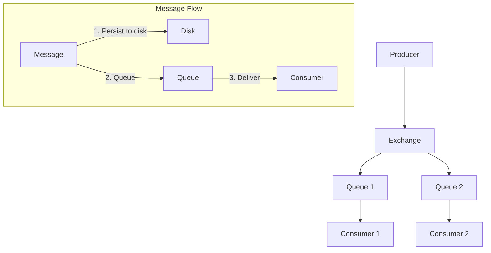

# interviews

- [interviews](#interviews)
    - [Docker 컨테이너 가상화](#docker-컨테이너-가상화)
        - [결론](#결론)
    - [부동소수점](#부동소수점)
    - [경쟁 조건 (Race Condition)](#경쟁-조건-race-condition)
    - [교착 상태 (Deadlock)](#교착-상태-deadlock)
    - [네트워크를 통한 스트리밍 방식](#네트워크를-통한-스트리밍-방식)
    - [서버에서 100GB 파일을 스트리밍 방식으로 읽는 방법 (CPU 4코어, RAM 16GB, SWAP 16GB 조건에서)](#서버에서-100gb-파일을-스트리밍-방식으로-읽는-방법-cpu-4코어-ram-16gb-swap-16gb-조건에서)
    - [eventual consistency](#eventual-consistency)
    - [토폴로지](#토폴로지)
    - [DB와 레플리케이션과 고가용성](#db와-레플리케이션과-고가용성)
    - [Distributed Systems에서 고가용성이란?](#distributed-systems에서-고가용성이란)
    - [DB - ACID](#db---acid)
    - [ACID(Atomicity, Consistency, Isolation, Durability)와 MVCC(Multi-Version Concurrency Control, 다중 버전 동시성 제어)](#acidatomicity-consistency-isolation-durability와-mvccmulti-version-concurrency-control-다중-버전-동시성-제어)
    - [NAT(Network Address Translation)](#natnetwork-address-translation)
    - [IP 구조](#ip-구조)
    - [왜 맥북이나 가정용 PC로 서비스하지 않고 별도의 서버용 컴퓨터를 사용하나요?](#왜-맥북이나-가정용-pc로-서비스하지-않고-별도의-서버용-컴퓨터를-사용하나요)
    - [B Tree \& B+ Tree](#b-tree--b-tree)
    - [서버 부팅 과정](#서버-부팅-과정)
    - [systemd가 다른 시스템 데몬들을 실행하는 과정](#systemd가-다른-시스템-데몬들을-실행하는-과정)
    - [결제 MSA에서 결제 PG사 기능 구현](#결제-msa에서-결제-pg사-기능-구현)
    - [리파지토리 메서드에 `@Transactional` 사용](#리파지토리-메서드에-transactional-사용)
    - [Nginx가 Tomcat을 업스트림으로 요청을 전달하고, Tomcat이 Spring 애플리케이션의 `@RestController`나 `@Controller`로 요청을 전달하는 과정](#nginx가-tomcat을-업스트림으로-요청을-전달하고-tomcat이-spring-애플리케이션의-restcontroller나-controller로-요청을-전달하는-과정)
    - [어노테이션 프로세싱과 Spring의 내부 동작 원리](#어노테이션-프로세싱과-spring의-내부-동작-원리)
    - [kotlin의 `when` 표현식에서의 exhaustiveness 체크](#kotlin의-when-표현식에서의-exhaustiveness-체크)
    - [hikari cp](#hikari-cp)
    - [jvm 계열 언어에서 어노테이션 선언 방법 및 spring 어노테이션 동작 원리](#jvm-계열-언어에서-어노테이션-선언-방법-및-spring-어노테이션-동작-원리)
    - [Go의 Goroutine은 M 대 N 모델 멀티스레딩](#go의-goroutine은-m-대-n-모델-멀티스레딩)
    - [Kotlin Coroutine](#kotlin-coroutine)
    - [`pthread_create` 이후 커널에서 발생하는 작업들](#pthread_create-이후-커널에서-발생하는-작업들)
    - [비동기 프로그래밍](#비동기-프로그래밍)
    - [libuv, aio\_\*, io\_uring](#libuv-aio_-io_uring)
    - [싱글 코어 \& 싱글 스레드 경우 커널에서의 비동기와 멀티플렉싱](#싱글-코어--싱글-스레드-경우-커널에서의-비동기와-멀티플렉싱)
    - [블로킹 vs 논블로킹, 동기 vs 비동기, 동시성 vs 병렬성 개념 정리](#블로킹-vs-논블로킹-동기-vs-비동기-동시성-vs-병렬성-개념-정리)
    - [논블로킹 vs 비동기 차이](#논블로킹-vs-비동기-차이)
    - [I/O 서브시스템](#io-서브시스템)
    - [과거 톰캣 \& 스프링 실행 방식 vs Spring boot 비교](#과거-톰캣--스프링-실행-방식-vs-spring-boot-비교)
    - [Spring boot에서 톰캣 실행 후 일어나는 일](#spring-boot에서-톰캣-실행-후-일어나는-일)
    - [Spring Framework의 Dependency Injection (DI)](#spring-framework의-dependency-injection-di)
    - [Inversion of Control (IoC)](#inversion-of-control-ioc)
    - [적절한 Bean 선택](#적절한-bean-선택)
    - [선점형(Pre-emption)OS와 비선점형(Nonpre-emption)OS 차이](#선점형pre-emptionos와-비선점형nonpre-emptionos-차이)
    - [VM, GC, 그리고 런타임](#vm-gc-그리고-런타임)
    - [Golang의 Concurrent Mark and Sweep(CMS)](#golang의-concurrent-mark-and-sweepcms)
    - [Apache + mod\_php와 Nginx + php-fpm의 차이](#apache--mod_php와-nginx--php-fpm의-차이)
    - [JVM, PHP runtime, Go runtime](#jvm-php-runtime-go-runtime)
    - [fork](#fork)
    - [exec](#exec)
    - [java 프로그램이 프로세스로 실행되는 과정: 시스템 레벨부터 JVM까지](#java-프로그램이-프로세스로-실행되는-과정-시스템-레벨부터-jvm까지)
    - [네트워크 통신 시 epoll 동작 방식](#네트워크-통신-시-epoll-동작-방식)
    - [클라이언트와 서버 간의 소켓 통신 과정](#클라이언트와-서버-간의-소켓-통신-과정)
    - [HTTPS 통신에서 TLS 핸드셰이크](#https-통신에서-tls-핸드셰이크)
    - [DHE(Diffie-Hellman)/ECDHE와 TLS](#dhediffie-hellmanecdhe와-tls)
    - [NGINX와 Java Spring Web 애플리케이션이 함께 사용되는 경우](#nginx와-java-spring-web-애플리케이션이-함께-사용되는-경우)
    - [소켓, epoll, nginx, 과다한 요청](#소켓-epoll-nginx-과다한-요청)
    - [nginx와 java/kotlin spring web app 사이에 tomcat이 필요한 이유](#nginx와-javakotlin-spring-web-app-사이에-tomcat이-필요한-이유)
    - [HTTPS 통신 과정](#https-통신-과정)
    - [노트북도 서버가 될 수 있는데 왜 굳이 서버 호스팅을 받나요?](#노트북도-서버가-될-수-있는데-왜-굳이-서버-호스팅을-받나요)
    - [프로젝트에서 사용한 오픈소스들에 대해서 내부적으로 어떻게 돌아가고 있는지 알고 있어야](#프로젝트에서-사용한-오픈소스들에-대해서-내부적으로-어떻게-돌아가고-있는지-알고-있어야)
    - [Elasticsearch, OOM 문제, Hot/Warm 아키텍처 설명](#elasticsearch-oom-문제-hotwarm-아키텍처-설명)
    - [ElasticSearch에서 OOM(Out of Memory) 문제](#elasticsearch에서-oomout-of-memory-문제)
    - [ElasticSearch Hot/Warm 아키텍처](#elasticsearch-hotwarm-아키텍처)
    - [Elasticsearch의 샤드와 레플리카 샤드](#elasticsearch의-샤드와-레플리카-샤드)
    - [ElasticSearch 쿼리 과정 예시](#elasticsearch-쿼리-과정-예시)
    - [rabbit mq, kafka 등 차이](#rabbit-mq-kafka-등-차이)
    - [표준 메세징 프로토콜 정리 (AMQP, STOMP, MQTT)](#표준-메세징-프로토콜-정리-amqp-stomp-mqtt)
    - [데이터베이스 락(Lock)과 격리 수준(Isolation Level)](#데이터베이스-락lock과-격리-수준isolation-level)
    - [MVCC와 스냅숏 격리](#mvcc와-스냅숏-격리)
    - [TCP 컨제스천 컨트롤](#tcp-컨제스천-컨트롤)
    - [카우치베이스](#카우치베이스)
    - [pkcs 11 멀티 프로세스 curl 에러](#pkcs-11-멀티-프로세스-curl-에러)
    - [정규표현식](#정규표현식)
    - [2단계커밋과 2단계 잠금](#2단계커밋과-2단계-잠금)
    - [proxy와 reverse proxy](#proxy와-reverse-proxy)
    - [프록시 패턴](#프록시-패턴)
    - [전방 비밀성](#전방-비밀성)
    - [RabbitMQ와 Kafka](#rabbitmq와-kafka)
    - [RabbitMQ가 Node.js 앱으로 메시지를 전달하는 과정](#rabbitmq가-nodejs-앱으로-메시지를-전달하는-과정)
    - [`amqplib`의 동작 원리](#amqplib의-동작-원리)
    - [Node.js의 싱글 스레드와 libuv의 멀티 스레딩](#nodejs의-싱글-스레드와-libuv의-멀티-스레딩)
    - [epoll 상세](#epoll-상세)
    - [`&`와 background process](#와-background-process)
    - [PDO가 데이터베이스에서 데이터 가져오는 원리](#pdo가-데이터베이스에서-데이터-가져오는-원리)
    - [Spring JDBC에서도 데이터를 가져오는 방식](#spring-jdbc에서도-데이터를-가져오는-방식)
    - [테스트 더블](#테스트-더블)
    - [java, php에서 mock 생성 원리](#java-php에서-mock-생성-원리)
    - [`@Bean` vs. `@Component`](#bean-vs-component)
    - [Tomcat과 Spring의 동작 원리 및 WAR 파일 처리 과정](#tomcat과-spring의-동작-원리-및-war-파일-처리-과정)
    - [부모 위임 모델](#부모-위임-모델)
    - [Spring의 동시성 및 Thread Management 정리](#spring의-동시성-및-thread-management-정리)
    - [RestTemplate vs WebClient 차이](#resttemplate-vs-webclient-차이)
    - [Spring WebFlux의 이벤트 루프(Event Loop)](#spring-webflux의-이벤트-루프event-loop)
    - [Mono와 Flux: 개념, 필요성, 이벤트 루프와의 관계](#mono와-flux-개념-필요성-이벤트-루프와의-관계)
    - [Netty의 이벤트 루프(Event Loop)와 epoll 기반 논블로킹 I/O 구현](#netty의-이벤트-루프event-loop와-epoll-기반-논블로킹-io-구현)
    - [시나리오1](#시나리오1)
    - [시나리오 2](#시나리오-2)

## Docker 컨테이너 가상화

Docker는 전통적인 하드웨어 가상화와는 다르게, 운영체제 수준의 가상화를 통해 컨테이너를 실행합니다.
Docker 컨테이너는 커널을 공유하지만, 각 컨테이너는 독립된 환경에서 실행되는 것처럼 동작합니다.
Docker는 이러한 가상화와 격리를 리눅스 커널의 기능을 활용해 구현합니다. 여기에는 네임스페이스(`namespaces`)와 `cgroups`(control groups)라는 핵심 기술이 사용됩니다.

컨테이너는 호스트 OS의 커널을 공유하며, 이는 컨테이너 내부에서 발생하는 시스템 호출이 호스트 커널로 직접 전달된다는 의미입니다.
따라서 Docker는 하이퍼바이저처럼 호스트 OS 위에 새로운 커널을 실행하지 않고, 하나의 커널을 여러 격리된 컨텍스트로 분리하는 방식으로 가상화 효과를 제공합니다.

1. Docker와 운영체제 수준의 가상화

    Docker는 하드웨어 가상화와는 다르게 OS 수준의 가상화를 통해 애플리케이션을 격리합니다.
    Docker 컨테이너는 호스트 시스템의 커널을 공유하면서도 각 컨테이너는 독립된 프로세스, 파일 시스템, 네트워크 환경을 갖는 것처럼 보이게 만듭니다.

    컨테이너는 각자의 애플리케이션과 필요한 라이브러리를 포함하지만, 호스트 커널과 직접 상호작용합니다.
    즉, Docker 컨테이너 내부에서 발생하는 시스템 호출은 호스트의 커널에 의해 처리됩니다.
    이를 가능하게 하는 두 가지 주요 기술은 네임스페이스(`namespaces`)와 `cgroups`(control groups)입니다.

2. 네임스페이스(namespaces): 자원의 격리

    네임스페이스는 커널 레벨에서 자원(리소스)을 격리하는 메커니즘입니다.
    각 네임스페이스는 프로세스 그룹이 독립된 환경에서 실행되는 것처럼 보이도록 만들어줍니다.
    Docker는 이러한 네임스페이스를 활용해 프로세스, 파일 시스템, 네트워크 인터페이스, IPC 등을 각각의 컨테이너에 대해 격리합니다.

    리눅스에는 다음과 같은 여러 네임스페이스가 있습니다:

    1. PID 네임스페이스:
        - 컨테이너는 독립된 프로세스 ID (PID) 공간을 가집니다. 이를 통해 각 컨테이너는 마치 자신만의 프로세스 트리가 있는 것처럼 보입니다.
        - 컨테이너 내에서 `pid=1` 프로세스는 컨테이너의 주 프로세스로 동작하며, 호스트의 PID와는 무관한 프로세스 트리를 형성합니다.

    2. NET 네임스페이스:
        - 컨테이너는 독립적인 네트워크 인터페이스와 IP 주소를 가집니다. 각 컨테이너는 고유한 네트워크 네임스페이스 내에서 동작하며, 다른 컨테이너 및 호스트와 격리된 네트워크 스택을 사용합니다.
        - NAT(Network Address Translation) 등을 통해 호스트의 네트워크와 통신할 수 있지만, 기본적으로는 각 컨테이너가 별도의 네트워크 인터페이스를 가진 것처럼 보입니다.

    3. MNT 네임스페이스 (Mount):
        - 컨테이너는 독립된 파일 시스템을 갖습니다. 호스트의 파일 시스템 일부를 컨테이너 내부에서 마운트하거나, 호스트 파일 시스템과는 별도로 컨테이너에 고유한 파일 시스템을 사용할 수 있습니다.
        - 이로 인해 각 컨테이너는 격리된 루트 파일 시스템을 가지고 실행됩니다.

    4. IPC 네임스페이스 (Inter-process communication):
        - 컨테이너는 독립된 IPC 메커니즘(공유 메모리나 세마포어 등)을 사용하여 다른 컨테이너와 격리된 상태로 통신합니다.

    5. UTS 네임스페이스 (UNIX Timesharing System):
        - 컨테이너는 각자 호스트 이름(hostname)과 도메인 이름(domain name)을 가질 수 있습니다. 이는 네임스페이스 내에서만 유효한 독립된 이름을 설정하여, 컨테이너가 자신만의 네트워크 식별자를 갖는 것처럼 보이게 합니다.

    6. USER 네임스페이스:
        - 컨테이너는 사용자 권한을 격리할 수 있습니다. 컨테이너 내에서는 루트 사용자로 동작하더라도, 실제로는 호스트에서는 권한이 제한된 사용자로 매핑됩니다. 이는 보안적으로 중요한 역할을 합니다.

    네임스페이스 동작 방식 예시:
    컨테이너 내부에서 `ps` 명령어로 프로세스 목록을 보면, 컨테이너 내부 프로세스만 보이게 됩니다.
    이때 실제로는 호스트 OS의 프로세스 ID와 매핑되지만, PID 네임스페이스를 통해 컨테이너 내부에서는 격리된 프로세스 트리처럼 동작합니다.

3. Cgroups (Control Groups): 자원 사용량 제어

    cgroups(Control Groups)는 리눅스 커널 기능으로, 시스템 자원의 사용량을 제어하고 모니터링하는 역할을 합니다.
    이를 통해 CPU 사용률, 메모리, 디스크 I/O, 네트워크 대역폭 등을 특정 프로세스 그룹에 대해 제한하거나 관리할 수 있습니다.

    Docker는 cgroups를 사용해 각 컨테이너가 사용할 수 있는 자원을 제한하거나 할당하며, 이로 인해 리소스의 과도한 사용을 방지하고 안정성을 확보합니다.
    Docker는 컨테이너를 생성할 때, 해당 컨테이너가 사용할 수 있는 리소스를 제어하기 위해 각 컨테이너에 대해 별도의 cgroup을 생성합니다.
    각 cgroup은 독립적으로 CPU, 메모리, I/O 등의 자원을 제어하며, 컨테이너마다 cgroup이 고유하게 설정됩니다.
    이는 하나의 컨테이너가 과도하게 자원을 사용하는 것을 방지하고, 호스트 전체 자원 사용을 안정적으로 관리할 수 있게 해줍니다.

    ```sh
    # 이 명령을 실행하면, Docker는 컨테이너에 대해 독립된 cgroup을 생성하고 해당 설정을 반영합니다.
    # 컨테이너는 자신에게 할당된 메모리와 CPU만 사용할 수 있으며, 이를 초과하려고 하면 cgroup에 의해 제한됩니다.
    # 메모리를 512MB로 제한하고, CPU의 50%만 사용할 수 있도록 설정합니다.
    docker run -d --memory="512m" --cpus="0.5" myapp
    ```

    - CPU 제한:
        - 특정 컨테이너가 사용할 수 있는 *CPU 시간을 제어*할 수 있습니다.
        - 이를 통해 여러 컨테이너가 동시에 실행될 때 공정한 CPU 자원 배분이 이루어집니다.
        - 예: `--cpu-quota`, `--cpu-shares` 옵션을 사용하여 컨테이너의 CPU 사용을 제한할 수 있습니다.
    - 메모리 제한:
        - 각 컨테이너가 사용할 수 있는 최대 메모리 용량을 설정할 수 있습니다.
        - 설정된 메모리를 초과하면 컨테이너는 종료되거나 메모리 부족 오류(OOM)가 발생할 수 있습니다.
    - 디스크 I/O 제어:
        - 특정 컨테이너가 디스크 읽기 및 쓰기 작업에서 사용할 수 있는 I/O 대역폭을 제한할 수 있습니다
        - `--blkio-weight` 옵션을 사용하여 I/O 우선순위를 설정할 수 있습니다.
    - 네트워크 대역폭 제한: 특정 컨테이너가 사용할 수 있는 네트워크 대역폭을 제한할 수 있습니다.

    Docker는 각 컨테이너를 하나의 프로세스 트리로 관리합니다.
    각 컨테이너의 프로세스는 cgroups에 의해 자원 제약을 받으며, 해당 프로세스 트리의 모든 자식 프로세스가 동일한 cgroup 제한을 상속받습니다.
    컨테이너가 시작되면 Docker는 해당 컨테이너의 프로세스들을 특정 cgroup에 할당하여 자원 사용을 제한하거나 관리합니다.

    예를 들어, 컨테이너 A와 컨테이너 B가 있을 때:
    - 컨테이너 A는 cgroup A에 할당되어, CPU 사용률 50%, 메모리 1GB로 제한될 수 있습니다.
    - 컨테이너 B는 cgroup B에 할당되어, CPU 사용률 25%, 메모리 512MB로 제한될 수 있습니다.

    cgroups 동작 방식:
    Docker는 각 컨테이너에 대해 별도의 cgroup을 생성하여 자원 사용을 제어합니다.
    이를 통해 호스트 시스템의 자원이 특정 컨테이너에 의해 고갈되지 않도록 보장합니다.
    cgroups는 컨테이너 간 자원 경쟁을 관리하는 중요한 역할을 합니다.

4. 시스템 콜과 호스트 커널 상호작용

    Docker 컨테이너 내에서 발생하는 모든 시스템 콜은 호스트 커널에서 처리됩니다.
    즉, 컨테이너는 자체적으로 커널을 갖지 않고, 호스트 커널과 직접 상호작용합니다.
    컨테이너 내부에서 동작하는 애플리케이션이 시스템 호출을 하면, 그 호출은 호스트 커널에 의해 실행되며, 이때 네임스페이스와 cgroups에 의해 격리된 상태에서 처리됩니다.

    시스템 콜의 흐름:
    1. 컨테이너 내부 애플리케이션에서 시스템 호출(예: 파일 읽기)을 발생시킵니다.
    2. 해당 시스템 호출은 호스트 커널로 전달됩니다.
    3. 호스트 커널은 네임스페이스와 cgroups 설정에 따라 해당 컨테이너의 자원 제한과 격리를 반영하여 시스템 호출을 처리합니다.
    4. 결과는 컨테이너로 다시 전달됩니다.

    호스트 커널은 네임스페이스를 기반으로 격리된 환경을 유지하면서도 동일한 커널 자원을 공유할 수 있게 하며,
    이러한 동작 방식 덕분에 컨테이너는 마치 별도의 운영체제에서 동작하는 것처럼 느껴지지만 실제로는 호스트 OS의 커널을 공유합니다.

5. 컨테이너의 "가상화된" 환경

    컨테이너는 마치 독립된 OS에서 실행되는 것처럼 보이지만,
    사실상 단일 커널을 공유하면서 격리된 리소스를 사용하는 것입니다.

    이로 인해 다음과 같은 특징이 발생합니다:
    - 가볍고 빠름: 하이퍼바이저를 사용하는 전통적인 가상화와 달리, 컨테이너는 추가적인 커널을 실행하지 않기 때문에 메모리와 CPU 자원을 적게 사용하며, 빠르게 시작할 수 있습니다.
    - 효율적인 자원 사용: 여러 컨테이너가 동일한 커널을 공유하면서도, 각자 자원을 격리하여 사용하는 방식이므로, 리소스를 효율적으로 사용할 수 있습니다.
    - 보안 격리: 네임스페이스와 cgroups을 통해 각 컨테이너는 보안적으로 격리된 상태로 실행되며, 호스트 시스템에 영향을 주지 않고 실행될 수 있습니다.

6. Docker와 서로 다른 OS 사용에 대한 오해

    컨테이너 내부에서 다른 운영체제를 실행할 수 있다는 오해가 종종 있습니다.
    Docker는 호스트 OS의 커널을 그대로 사용하며, 실제로는 동일한 커널 버전의 Linux 기반 운영체제만을 지원합니다.
    Docker 컨테이너에서 제공하는 환경은 호스트 OS 커널과 직접 상호작용하며, 호스트 OS와 동일한 커널을 사용하는 Linux 기반의 파일 시스템과 사용자 공간을 제공합니다.

    다만, 컨테이너 이미지에 포함된 라이브러리, 실행 환경, 도구들이 다르기 때문에, 각 컨테이너가 서로 다른 배포판처럼 보일 수 있습니다.
    예를 들어, Ubuntu 기반 컨테이너와 CentOS 기반 컨테이너는 서로 다른 패키지 매니저와 파일 시스템 구조를 가질 수 있지만, 커널은 동일합니다.

### 결론

Docker는 리눅스 커널의 네임스페이스와 cgroups 기능을 활용하여, 각 컨테이너가 독립된 운영체제에서 실행되는 것처럼 자원 격리와 가상화를 제공합니다. 이 방식은 하이퍼바이저 기반의 가상화와 달리 단일 커널을 공유하면서도 컨테이너 간 격리된 환경을 유지하여, 경량의 가상화 솔루션을 제공합니다.

Docker 내부의 애플리케이션에서 발생하는 시스템 콜은 호스트 커널에서 처리되며, 이를 통해 각 컨테이너는 독립적인 파일 시스템과 네트워크 공간을 사용하면서도, 호스트 커널과 자원을 효율적으로 공유하게 됩니다.

## 부동소수점

1. 부동 소수점(Floating Point)의 기본 개념

    부동 소수점은 매우 크거나 매우 작은 실수를 표현하기 위한 컴퓨터의 수 표현 방식입니다.
    "부동(浮動, floating)"이란 소수점이 움직일 수 있다는 의미로, 이는 지수 표기법과 유사합니다.

    예를 들어:
    - 12345.6789는 1.23456789 × 10⁴로 표현 가능
    - 0.0000123456은 1.23456 × 10⁻⁵로 표현 가능

2. IEEE 754 표준

    IEEE 754는 부동 소수점 표현의 국제 표준으로, 다음과 같은 형식을 정의합니다:

    ```plaintext
    단정밀도(32비트)
    ┌──────┬──────────┬─────────────────────┐
    │ 부호  │  지수부    │        가수부        │
    │ (1)  │   (8)    │        (23)         │
    └──────┴──────────┴─────────────────────┘

    배정밀도(64비트)
    ┌──────┬───────────┬────────────────────────────────────────┐
    │ 부호  │  지수부     │               가수부                     │
    │ (1)  │   (11)    │               (52)                     │
    └──────┴───────────┴────────────────────────────────────────┘
    ```

    ```plaintext
    [부호 비트(1)] [지수부(k)] [가수부(n)]
    ```

    - 부호 비트(Sign bit):
        - 0: 양수
        - 1: 음수

    - 지수부(Exponent):
        - 단정밀도: -126 ~ +127 (바이어스: 127)
        - 배정밀도: -1022 ~ +1023 (바이어스: 1023)

        ```plaintext
        실제 지수 = 저장된 값 - 바이어스
        예: 단정밀도에서 129가 저장되어 있다면
        실제 지수 = 129 - 127 = 2
        ```

        bias를 사용하여 음수 지수 표현합니다:

    - 가수부(Mantissa/Significand):
        - 1.xxxxx 형태로 정규화
        - 첫 번째 1은 암묵적으로 저장 (정규화된 수의 경우)

    예를 들어, 32비트 단정밀도(single precision)의 경우:

    ```plaintext
    [부호(1)][지수부(8)][가수부(23)] = 총 32비트
    ```

    ```plaintext
    # 실제 값 계산
    값 = (-1)^부호비트 × 2^(지수부-127) × (1.가수부)

    # 예를 들어 10.625 변환
    10.625(10) = 1010.101(2)
               = 1.010101(2) × 2^3

    부호비트: 0 (양수)
    지수부: 3 + 127 = 130 = 10000010(2)
    가수부: 010101... = 01010100000000000000000

    최종: 0 10000010 01010100000000000000000

    # 예를 들어 12.375 변환
    1. 12.375를 이진수로 변환
        - 12(정수부) = 1100(2진수)
        - 0.375(소수부) = 0.011(2진수)

        => 1100.011(2진수)

    2. 정규화 (소수점을 이동하여 1.xxx 형태로)

        1100.011 = 1.100011 × 2³

    3. 각 필드의 비트 계산
        - 부호비트: 0 (양수)
        - 지수부: 3 + 127(바이어스) = 130
                130 = 10000010(2진수)
        - 가수부: 100011(나머지는 0으로 채움)

    3. 최종 32비트 표현

        0 10000010 10001100000000000000000

    # 예를 들어 3.25 변환
    1. 3.25를 이진수로 변환
        - 3(정수부) = 11(2진수)
        - 0.25(소수부) = 01(2진수)

        => 11.01(2진수)

    2. 정규화

        11.01 = 1.101 × 2¹

    3. 각 필드의 비트 계산
        - 부호비트: 0 (양수)
        - 지수부: 1 + 127 = 128
                128 = 10000000(2진수)

    4. 가수부: 101(나머지는 0으로 채움)

    Step 4: 최종 32비트 표현
    0 10000000 10100000000000000000000
    ```

3. 특수한 값들의 표현

    32비트 부동 소수점에서:
    - 0의 표현

        ```plaintext
        [0][00000000][00000000000000000000000] = +0
        [1][00000000][00000000000000000000000] = -0
        ```

    - 무한대

        ```plaintext
        [0][11111111][00000000000000000000000] = +∞
        [1][11111111][00000000000000000000000] = -∞
        ```

    - NaN (Not a Number)

        ```plaintext
        [x][11111111][non-zero mantissa] = NaN
        ```

4. 부동 소수점 연산의 구현

    - 덧셈/뺄셈의 경우:

        '12.375 + 3.25' 덧셈 과정의 비트 단위 연산은 다음과 같습니다.

        ```plaintext
        12.375 = 0 10000010 (1.)10001100000000000000000(32)
        3.25   = 0 10000000 (1.)10100000000000000000000(32)
                            ^^^^ '1.'이 있다고 가정

        1. 지수 비교
            - 첫 번째 수 (12.375)의 지수: 10000010 (130₁₀ - 127 = 3)
            - 두 번째 수 (3.25)의 지수:   10000000 (128₁₀ - 127 = 1)

            지수 차이: 2

        2. 가수부 덧셈 준비

            작은 지수를 가진 수의 가수 조정합니다.
            IEEE 754에서 유효한 덧셈을 하려면 두 수의 지수가 같아야 합니다.
            덧셈은 같은 자리의 숫자끼리만 가능하기 때문입니다

            따라서, 3.25의 가수부를 2비트 오른쪽 시프트합니다.
            2비트 오른쪽 시프트는 지수가 2 감소하는 것과 같습니다.

                1.101 × 2¹ = 0.01101 × 2³

            - 3.25  원래 가수:  1.10100 000000000000000000(23)
            - 3.25  시프트 후:  0.01101 000000000000000000(23)

            12.375와 조정된 3.25의 가수를 비교하면 아래와 같습니다.
            - 12.375의 가수: 1.100011 00000000000000
            - 3.25의 가수:   0.011010 00000000000000

        3. 이진 덧셈 수행

              1.100011 00000000000000
            + 0.011010 00000000000000
            -------------------------
              1.111111 00000000000000

        4. 결과 정규화 확인

            이미 1.xxx 형태이므로 추가 정규화 불필요

        5. 최종 비트 패턴 구성
            - 부호: 0 (양수)
            - 지수: 10000010 (130₁₀, 즉 3 + 127)
            - 가수: 11111100000000000000000

            최종 32비트 표현:
            0 10000010 11111100000000000000000
        ```

        ```java
        class FloatingPointOperation {
            /
             * 부동 소수점 덧셈의 의사 코드
            * @param a 첫 번째 피연산자
            * @param b 두 번째 피연산자
            * @return a + b의 결과
            */
            float add(float a, float b) {
                // 1. 지수 비교
                int expA = getExponent(a);
                int expB = getExponent(b);

                // 2. 작은 지수를 가진 수의 가수를 오른쪽으로 시프트
                int shift = Math.abs(expA - expB);
                float smaller = (expA < expB) ? a : b;
                float larger = (expA < expB) ? b : a;

                // 3. 가수부 덧셈
                float mantissaSum = alignAndAdd(smaller, larger, shift);

                // 4. 결과 정규화
                return normalize(mantissaSum, Math.max(expA, expB));
            }
        }
        ```

    - 곱셈의 경우:

        original: 40.218750
        0 10000100 01000001110000000000000

        IEEE 754 분석:
        Sign bit: 0
        Exponent: 10000100 (132)
        Mantissa: 1.01000001110000000000000

        '12.375 x 3.25' 곱셈 과정의 비트 단위 연산은 다음과 같습니다.

        ```plaintext
        12.375 = 0 10000010 (1.)10001100000000000000000(32)
        3.25   = 0 10000000 (1.)10100000000000000000000(32)
                            ^^^^ '1.'이 있다고 가정

        1. 부호 비트 계산 (XOR 연산)

            0 XOR 0 = 0 (양수)

        2. 지수 덧셈
            - 첫 번째 지수: 10000010 (130₁₀ - 127 = 3)
            - 두 번째 지수: 10000000 (128₁₀ - 127 = 1)

            130 + 128 - 127 = 131 (10000011)
            - Note: 이 값은 정규화 과정에서 조정됩니다.

        3. 가수부 곱셈

            이진수 곱셈은 십진수 곱셈과 유사하게, 각 비트에 대해 0 또는 1로 곱한 후 자리 이동(시프트)하여 더해주는 방식입니다.

               1.100011
            ×     1.101
            -----------
                1100011   (× 1)
               0000000    (× 0)
              1100011     (× 1)
             1100011      (× 1)
                  └┘
            -----------------
            10100000111

        4. 정규화

            10.100000111... × 2⁴ = 1.0100000111... × 2⁵

            - 새 지수: 5 + 127 = 132 (10000100)

        5. 가수 반올림

            1.0010111111... → 1.001011111100000000000

        6. 최종 비트 패턴
            - 부호: 0
            - 지수: 10000100
            - 가수: 01000001110000000000000

        최종 32비트 표현:
        0 10000100 01000001110000000000000
        ```

        ```java
        class FloatingPointMultiplication {
            /
             * 부동 소수점 곱셈의 의사 코드
            * @param a 첫 번째 피연산자
            * @param b 두 번째 피연산자
            * @return a * b의 결과
            */
            float multiply(float a, float b) {
                // 1. 부호 결정
                int sign = getSign(a) ^ getSign(b);

                // 2. 지수 더하기
                int exp = getExponent(a) + getExponent(b) - bias;

                // 3. 가수부 곱하기
                float mantissa = multiplyMantissas(getMantissa(a), getMantissa(b));

                // 4. 결과 정규화
                return normalize(sign, mantissa, exp);
            }
        }
        ```

5. 32비트와 64비트의 차이점

    - 정밀도:
        - 32비트: 약 7자리의 십진 정밀도
        - 64비트: 약 15-17자리의 십진 정밀도

    - 범위:
        - 32비트: ±1.18 × 10⁻³⁸ ~ ±3.4 × 10³⁸
        - 64비트: ±2.23 × 10⁻³⁰⁸ ~ ±1.80 × 10³⁰⁸

    - 메모리 사용:

        ```java
        float f = 1.0f;    // 32비트 = 4바이트
        double d = 1.0;    // 64비트 = 8바이트
        ```

6. 정밀도 손실과 오차

    ```java
    class PrecisionLoss {
        void demonstratePrecisionLoss() {
            float f = 0.1f;
            double d = 0.1;

            // 0.1을 10번 더하기
            float sumF = 0.0f;
            double sumD = 0.0;

            for (int i = 0; i < 10; i++) {
                sumF += f;
                sumD += d;
            }

            // sumF ≈ 1.0000001
            // sumD ≈ 1.0000000000000007
            // 정확한 값 1.0과는 약간의 차이가 있음
        }
    }
    ```

7. 실제 응용에서의 고려사항

    - 금융 계산:

        ```java
        class FinancialCalculations {
            // 금융 계산에는 부동 소수점 대신 BigDecimal 사용 권장
            void calculateMoney() {
                // 잘못된 방법
                double price = 19.99;
                double tax = price * 0.06;

                // 올바른 방법
                BigDecimal price = new BigDecimal("19.99");
                BigDecimal tax = price.multiply(new BigDecimal("0.06"));
            }
        }
        ```

    - 과학 계산:

        ```java
        class ScientificCalculations {
            // 과학 계산에서는 double 사용이 일반적
            void calculatePhysics() {
                double gravity = 9.81;
                double time = 2.5;
                double distance = 0.5 * gravity * time * time;
            }
        }
        ```

8. 오차 처리:

    ```java
    class ErrorHandling {
        /
         * 부동 소수점 비교를 위한 안전한 방법
         */
        boolean approximatelyEqual(double a, double b) {
            final double EPSILON = 1e-10;
            return Math.abs(a - b) <= EPSILON;
        }

        /
         * 상대 오차를 사용한 비교
         */
        boolean relativelyEqual(double a, double b) {
            final double EPSILON = 1e-10;
            return Math.abs(a - b) <= EPSILON * Math.max(Math.abs(a), Math.abs(b));
        }
    }
    ```

## 경쟁 조건 (Race Condition)

경쟁 조건(Race Condition)이란 멀티스레드 환경에서 여러 스레드가 공유 자원에 동시 접근할 때, 실행 순서에 따라 예측할 수 없는 결과가 발생하는 문제를 의미합니다. 즉, 코드의 실행 순서가 의도한 대로 보장되지 않아서 논리적 오류가 발생하는 상황을 의미합니다.

경쟁 조건은 다음과 같은 상황에서 발생합니다:

1. 타이밍 이슈(Timing Issues)와 인터리빙 실행

    다중 스레드나 프로세스가 공유 자원을 사용할 때 실행 순서에 따라 결과가 달라지는 상황을 의미합니다.
    특히 비원자적 연산을 통해 공유 자원에 접근할 때 발생합니다.
    인터리빙(interleaving) 실행으로 인해 예측할 수 없는 결과가 나타나며, 경쟁 상태가 발생하게 됩니다.

    인터리빙(Interleaving)이란 멀티스레드 환경에서 여러 스레드가 동시에 실행될 때, 각 스레드의 명령어가 번갈아(interleave) 실행되는 방식을 의미합니다.
    단일 스레드에서는 순차적으로 실행되지만, 멀티스레드에서는 OS의 스케줄러가 실행 순서를 결정하므로 실행 순서가 달라질 수 있습니다. 그 결과, 공유 자원에 대한 접근 순서가 변하면서 예측할 수 없는 결과가 발생할 수 있습니다.

2. 메모리 일관성 이슈 (Memory Consistency Issues)

    현대의 멀티코어 시스템에서는 각 코어가 로컬 캐시를 가지고 있기 때문에, 캐시와 메인 메모리 간 동기화 문제가 발생할 수 있습니다.
    또한, 메모리 재배치(memory reordering)는 명령어 실행 순서를 변경하여 메모리 가시성 문제를 유발할 수 있습니다.
    이런 경우, 스레드가 업데이트된 데이터를 보지 못하거나, 부분적으로 업데이트된 상태의 데이터를 읽게 되는 문제가 생깁니다.

    메모리 재배치는 CPU와 컴파일러가 최적화를 위해 명령어의 순서를 변경할 수 있는 상황을 말합니다.
    이로 인해 프로그램의 논리적인 실행 순서와 다르게 명령어를 실행할 수 있습니다.
    - 성능 최적화: CPU는 연산 속도를 극대화하기 위해 병렬 실행 및 명령어 재배치를 수행.
    - 파이프라이닝(Pipelining): 명령어를 병렬로 실행하여 성능을 향상.

    ```java
    class ReorderingExample {
        int a = 0, b = 0;
        boolean flag = false;
        // volatile boolean flag = false; //  `volatile` 사용 시, 이전 명령어가 완료된 후 실행됨

        public void writer() {
            a = 1;  // (1)
            flag = true; // (2) CPU가 실행 최적화를 위해 `flag = true;` 를 먼저 실행할 수도 있음.
        }

        public void reader() {
            if (flag) {
                b = a * 2; // (3) 그러면 `b = a * 2;` 가 실행될 때 a의 값이 여전히 0일 수도 있음.
            }
        }
    }
    ```

    이로 인해 동기화된 코드가 아닌 경우, 데이터의 가시성에 문제가 생깁니다.
    메모리 가시성이란 "한 스레드에서 변경한 데이터가 다른 스레드에서 즉시 볼 수 있는가?"에 대한 문제입니다.
    현대 CPU는 캐시 계층 구조를 사용하므로, 각 코어의 캐시와 메인 메모리 간 데이터 동기화 문제가 발생할 수 있습니다.

    ```java
    class VisibilityExample {
        // CPU가 flag를 로컬 캐시에 저장할 경우, 다른 스레드는 이 값을 즉시 확인하지 못할 수 있음.
        boolean flag = false;
        // volatile boolean flag = false; // flag 값이 변경되면 CPU 캐시가 즉시 동기화되어, 모든 스레드가 최신 값을 볼 수 있음.

        public void writer() {
            // 즉, writer()가 flag = true;를 실행했어도,
            // reader() 스레드는 여전히 flag = false로 보일 수 있음.
            flag = true;
        }

        public void reader() {
            while (!flag) {
                // flag가 true가 될 때까지 대기 (busy-waiting)
            }
            System.out.println("Flag is true!");
        }
    }
    ```

    또한, 캐시 일관성 문제는 캐시를 사용하는 모든 프로세서 코어들이 동일한 데이터를 보장하지 못할 때 발생할 수 있습니다.

```java
public class Counter {
    private int count = 0;

    // 잘못된 구현
    public void increment() {
        // 다음 세 단계가 원자적이지 않음
        int temp = count;      // READ
        temp = temp + 1;       // MODIFY
        count = temp;          // WRITE
    }
}

/*
스레드 1과 2가 동시에 실행할 때 가능한 시나리오:

시작: count = 0

스레드 1: READ count = 0
스레드 2: READ count = 0
스레드 1: MODIFY temp = 1
스레드 2: MODIFY temp = 1
스레드 1: WRITE count = 1
스레드 2: WRITE count = 1

최종: count = 1 (기대값: 2)
*/
```

다양한 레벨에서 경쟁 조건이 발생할 수 있습니다.

1. CPU 레벨

    ```nasm
    ; x86 어셈블리에서의 경쟁 조건
    mov eax, [count]   ; load
    inc eax            ; increment
    mov [count], eax   ; store

    ; 원자적 연산 사용
    lock inc dword [count]  ; atomic increment
    ```

    이 경우 경쟁 조건은 비원자적 연산에서 비롯됩니다.
    `mov`, `inc`, `mov` 연산은 각각 별개의 명령어로 CPU에서 실행되므로,
    이들 사이에 다른 스레드가 count 값을 변경할 수 있습니다.

    `lock` 프리픽스를 사용하여 `inc` 명령을 원자적으로 만들어 경쟁 상태를 방지할 수 있습니다.

    추가적으로, 원자적 연산을 사용할 때 메모리 장벽(memory barrier)은 명령어 재배치나 캐시 일관성 문제를 방지하는 데 도움을 줍니다.

2. 메모리 레벨

    ```c
    // Memory Barrier 없는 경우
    int ready = 0;
    int data = 0;

    // Thread 1
    data = 42;    // Store
    ready = 1;    // Store

    // Thread 2
    while (!ready) {}  // Load
    use(data);        // Load

    // Memory Barrier 사용
    atomic_store(&data, 42);
    atomic_store(&ready, 1);
    ```

    메모리 장벽이 없는 경우, CPU는 명령어 최적화를 위해 명령어 순서를 변경할 수 있습니다(메모리 재배치).
    `ready` 변수가 1로 설정되기 전에 `data`가 먼저 사용될 수 있습니다.
    이를 방지하기 위해 메모리 장벽(memory barrier) 또는 원자적 연산을 사용합니다.
    `atomic_store`는 이 연산이 완료되기 전까지 메모리 장벽을 삽입하여, 다른 스레드가 이를 올바르게 읽을 수 있게 만듭니다.

    `atomic_store`는 메모리 일관성을 보장하는 Happens-Before 관계를 설정하여,
    `ready = 1`이 이루어진 후에만 `data` 값이 읽히도록 보장합니다.

3. 파일 시스템 레벨

    ```python
    # 파일 시스템 레벨 경쟁 조건
    def update_config(key, value):
        config = read_config_file()
        config[key] = value
        write_config_file(config)

    # 해결: 파일 락 사용
    def safe_update_config(key, value):
        with FileLock("config.lock"):
            update_config(key, value)
    ```

    파일 시스템에서도 경쟁 조건이 발생할 수 있습니다.
    여러 프로세스가 동시에 동일한 파일에 접근하여 내용을 수정하려 하면, 데이터 손실이나 불일치가 발생할 수 있습니다.
    이를 방지하기 위해 파일 락(file lock)을 사용하여, 파일이 안전하게 수정되도록 합니다.
    FileLock을 사용하여 파일에 대한 독점적인 접근을 보장할 수 있습니다.

    추가로, 파일 잠금이 적절히 해제되지 않을 경우 발생할 수 있는 교착 상태(deadlock) 문제도 고려해야 합니다.
    이를 해결하기 위해 타임아웃 설정을 추가할 수도 있습니다.

이를 해결 메커니즘은 다음과 같습니다:

1. 원자성 보장

    ```java
    public class SafeCounter {
        private AtomicInteger count = new AtomicInteger(0);

        public void increment() {
            count.incrementAndGet(); // 원자적 연산
        }
    }
    ```

2. 스핀락

    ```java
    public class SpinLockExample {
        private AtomicBoolean locked = new AtomicBoolean(false);

        public void lock() {
            while (!locked.compareAndSet(false, true)) {
                // 계속 CPU를 사용하면서 확인
                // 다른 스레드에게 CPU를 양보하지 않음
            }
        }
    }
    ```

    - CPU를 계속 사용 (busy waiting)
    - 락이 곧 해제될 것으로 예상될 때 유용
    - 컨텍스트 스위칭 비용 회피 가능
    - 하지만 CPU 자원 낭비가 심함

3. synchronized

    `synchronized`는 자바의 기본적인 동기화 기법으로, 여러 스레드가 공유 자원에 동시 접근할 때 경쟁 조건(Race Condition)을 방지하는 데 사용됩니다.
    `synchronized` 블록이나 메서드 내부에 진입한 스레드는 해당 객체의 락을 획득해야만 실행 가능합니다.
    객체(또는 클래스) 단위로 Monitor Lock(모니터 락)을 사용하여 하나의 스레드만 특정 코드 블록을 실행할 수 있도록 보장합니다.

    `synchronized` 블럭으로 동기화를 하면 자동적으로 lock이 잠기고 풀립니다.
    `synchronized` 블럭 내에서 예외가 발생해도 lock은 자동적으로 풀립니다.
    그러나 같은 메소드 내에서만 lock을 걸 수 있다는 제약이 존재합니다.
    WAITING 상태인 스레드는 interrupt가 불가능합니다.

    1. Biased Locking (편향 락): 락이 자주 사용되는 단일 스레드에 편향됨

        JVM은 하나의 스레드가 반복적으로 같은 객체를 락을 걸고 해제하는 패턴이 많다고 가정하고, 락을 "편향(Biased)"되도록 설정합니다.
        락 획득 비용을 최소화하기 위해, 객체의 mark word에 "어느 스레드가 이 락을 사용하는지" 기록합니다.

        ```java
        class Example {
            // 대부분의 경우 같은 스레드가 반복적으로 락을 획득
            private synchronized void method() {
                // 최초 락 획득시 스레드 ID를 객체 헤더에 기록
                // 이후 같은 스레드는 실제 락 획득 없이 진입
                // ...
            }
        }
        ```

        편향 락의 동작 과정:
        1. 처음 락을 획득할 때, JVM 내부적으로는 객체의 헤더(Object Header)에 있는 mark word에 스레드 ID를 기록하여 락을 관리.
        2. 같은 스레드가 다시 해당 락을 획득하려고 하면, 추가적인 동기화 없이 바로 실행 가능 (거의 비용 없음).
        3. 다른 스레드가 이 락을 획득하려고 하면, 편향 락을 해제하고 경량 락으로 전환.

        편향 락이 해제되는 조건:
        - 다른 스레드가 같은 락을 획득하려고 시도할 때
        - `System.identityHashCode(obj)` 호출 시 (mark word를 해시코드 저장용으로 변경해야 함)
        - JVM 내부에서 GC(Garbage Collection)가 편향 락을 해제해야 할 필요가 있을 때

        만약 두 개의 메서드중 하나에만 synchronized가 존재할 경우 결과는 순차적으로 실행되지 않습니다.
        synchronized 키워드가 블럭 or 메소드에 있다고 해서 무조건 해당 쓰레드가 계속 점유를 하는 것은 아닙니다.
        synchronized 메소드에 들어갔더라도 해당 메소드에 *여러 쓰레드가 동시에 접근이 불가능*할 뿐이지, 문맥 교환은 발생합니다.

        그리고 Lock의 범위는 객체 단위라는 것을 하나 더 알 수 있습니다.
        즉, 객체당 Lock을 하나만 가질 수 있습니다.
        그렇기 때문에 synchronized가 메소드 둘 다 붙어있다면 하나의 메소드가 이미 lock을 쥐고 있기 때문에 나머지 메소드는 기다리게 되는 것입니다.

    2. static 메소드에서 synchronized lock을 사용하면

        ```java
        class Example {
            // 대부분의 경우 같은 스레드가 반복적으로 락을 획득
            private static synchronized void method1() {
                // 최초 락 획득시 스레드 ID를 객체 헤더에 기록
                // 이후 같은 스레드는 실제 락 획득 없이 진입
                // ...
            }

            // 대부분의 경우 같은 스레드가 반복적으로 락을 획득
            private static synchronized void method2() {
                // 최초 락 획득시 스레드 ID를 객체 헤더에 기록
                // 이후 같은 스레드는 실제 락 획득 없이 진입
                // ...
            }
        }
        ```

        `method1`와 `method2`가 번갈아 가면서 실행됩니다.
        `static` 메소드는 객체의 것이 아니라 클래스 메소드 입니다.
        그렇기 때문에 Lock을 클래스도 하나를 가지고, 객체들 마다 하나씩 가지게 되는 것입니다.
        그래서 둘 다 락을 가지고 메소드에 접근을 할 수 있는 것입니다.

    3. Thin Lock (경량 락)

        경량 락은 CAS(Compare-And-Swap) 연산을 활용하여 락 경쟁을 최소화합니다.

        경량 락의 핵심 원리:
        1. 스레드가 락을 시도하면, 객체의 mark word를 "락 레코드(Lock Record) 포인터"로 변경.
        2. 다른 스레드가 동시에 락을 시도하면 CAS 연산을 통해 락 획득 여부를 결정.
        3. 스핀 락(Spin Lock)을 사용하여 일부 경쟁 상황에서 스레드 대기 시간을 줄임.

        ```plaintext
        객체 헤더 (mark word) 구조:

        일반 상태:
        [해시코드 | 나이 | 락 정보 | 01]  // 마지막 비트: 일반 상태

        편향 락 상태:
        [스레드 ID | 에포크 | 나이 | 01]  // 특정 스레드에 편향

        경량 락 상태:
        [락 레코드 포인터 | 00]  // 스택의 락 레코드 가리킴

        중량 락 상태:
        [모니터 포인터 | 10]  // 힙의 모니터 객체 가리킴
        ```

    4. Fat Lock (중량 락)

        ```java
        // JVM 내부 모니터 구현 (의사 코드)
        class ObjectMonitor {
            void* owner;                  // 락 보유 스레드
            intptr_t recursions;         // 재진입 카운트
            ObjectWaiter* waitSet;       // wait() 중인 스레드들
            ObjectWaiter* entryList;     // 진입 대기 스레드들
            int contentions;            // 경쟁 카운트

            void enter(Thread* thread) {
                if (owner == thread) {
                    recursions++;            // 재진입
                    return;
                }

                if (contentions++ > 0) {    // 경쟁 발생
                    enqueue_and_wait(thread);
                } else {
                    set_owner(thread);      // 락 획득
                }
            }
        }
        ```

    5. 락 단계 상승(Lock Inflation)

        ```plaintext
        편향 락 → 경량 락 → 중량 락
        ```

        1. 편향 락 해제 조건:
            - 다른 스레드가 락 획득 시도
            - `System.identityHashCode()` 호출
            - 편향 락 해제 요청

        2. 경량 락 → 중량 락 전환 조건:
            - 락 획득 실패 후 스핀 횟수 초과
            - 너무 많은 스레드가 대기
            - 특정 시간 이상 락 획득 실패

    실제 예시로 확인해보면:

    ```java
    public class LockEscalationExample {
        private static final int THREADS = 4;
        private final Object lock = new Object();
        private int counter = 0;

        public void increment() {
            synchronized(lock) {  // 처음엔 편향 락으로 시작
                counter++;       // 경쟁 발생시 경량 락으로 전환
            }                    // 심한 경쟁시 중량 락으로 전환
        }

        public static void main(String[] args) {
            LockEscalationExample example = new LockEscalationExample();

            // 단일 스레드: 편향 락 사용
            example.increment();

            // 여러 스레드: 락 단계 상승 발생
            for (int i = 0; i < THREADS; i++) {
                new Thread(() -> {
                    for (int j = 0; j < 1000000; j++) {
                        example.increment();
                    }
                }).start();
            }
        }
    }
    ```

    이 락 단계 상승 메커니즘 때문에:
    - 경쟁이 없는 경우 거의 무비용 동기화 (편향 락)
    - 약한 경쟁의 경우 스핀으로 해결 (경량 락)
    - 심한 경쟁의 경우 OS 수준 동기화 (중량 락)

    이렇게 상황에 따라 최적의 성능을 발휘할 수 있습니다.

    이 메커니즘을 이해하면 synchronized 사용 시 더 나은 성능을 위한 최적화가 가능합니다:
    - 가능한 한 락의 범위를 좁게 유지
    - 불필요한 락 경쟁 피하기
    - 동일 스레드의 반복적인 락 사용 패턴 활용

4. ReentrantLock 락 기반 동기화

    ReentrantLock에서 Reentrant라는 이름은 재진입 가능성(reentrancy)을 의미합니다.
    재진입 가능성은 다음을 의미합니다:
    - 동일한 스레드가 이미 소유한 락을 다시 요청할 수 있고, 이를 성공적으로 획득할 수 있음.
    - 락이 여러 번 획득되었더라도, 락을 해제(unlock)할 때는 획득한 횟수만큼 해제해야 완전히 락이 풀림.

    이는 동일한 스레드가 이미 소유한 락을 다시 획득하려고 시도할 때, 교착 상태 없이 성공적으로 획득할 수 있음을 보장합니다.

    ReentrantLock이 경쟁 조건을 방지하는 원리:
    1. CAS(Compare-And-Swap) 기반의 락 획득
        - ReentrantLock은 내부적으로 CAS 연산을 활용하여 락을 관리.
        - CAS를 통해 다른 스레드가 현재 락을 획득했는지 확인하고, 획득하지 않았다면 현재 스레드가 락을 획득.

    2. 락이 해제될 때만 다른 스레드가 락을 획득 가능
        - 락을 보유한 스레드가 `lock.unlock()`을 호출해야만 다른 스레드가 실행 가능.

    3. 재진입 가능
        - 같은 스레드가 여러 번 `lock.lock()`을 호출해도, Deadlock이 발생하지 않음.
        - 같은 스레드가 여러 번 `lock()`을 호출하면, 락 횟수(recursion count)가 증가하며, 같은 횟수만큼 `unlock()`을 호출해야 락이 해제됨.
    synchronized와 달리 수동으로 lock을 잠그고 해제해야 합니다.
    `lockInterruptably()` 함수를 통해 WAITING 상태의 스레드를 interrupt할 수 있습니다.

    ```java
    public class ReentrantLockExample {
        // 재 진입할 수 있는(Reentrant) 이라는 단어가 붙어 있는 이유는
        // wait(), notify()와 같이 특정 조건에서 lock을 풀고
        // 나중에 다시 lock을 얻고 임계영역으로 들어와서 이후의 작업을 수행할 수 있기 때문입니다.
        //
        // 생성자의 매개변수를 true를 주면 lock이 풀렸을 때 가장 오래 기다린 쓰레드가 lock을 획득할 수 있게 공정(fair)하게 처리합니다.
        // 하지만 공정하게 처리하려면 어떤  쓰레드가 가장 오래 기다렸는지 확인하는 과정을 거칠 수 밖에 없으므로 성능은 떨어질 수 밖에 없습니다.
        private final ReentrantLock lock = new ReentrantLock(true); // true: 공정성 활성화

        public void process() {
            // 인터럽트 가능한 락 획득
            try {
                // 락 획득 시도 방법 2: 타임아웃
                if (lock.tryLock(1, TimeUnit.SECONDS)) {
                    try {
                        // 임계 영역
                    } finally {
                        lock.unlock();
                    }
                }
            } catch (InterruptedException e) {
                Thread.currentThread().interrupt();
            }
        }

        // 조건 변수 사용
        private final Condition notFull = lock.newCondition();
        private final Condition notEmpty = lock.newCondition();

        public void produce() throws InterruptedException {
            // 락 획득 시도 방법 1: 계속 대기
            lock.lock(); // 락을 얻을 때까지 WAITING 상태
            try {
                while (isFull()) {
                    notFull.await();
                }
                // 생산
                notEmpty.signal();
            } finally {
                lock.unlock();
            }
        }
    }
    ```

    - 더 유연한 대기 정책 제공
    - lock() 사용시 `WAITING` 상태로 전환 (CPU 사용 안함)
    - tryLock() 사용시 즉시 리턴 가능
    - 인터럽트 가능
    - 공정성 정책 설정 가능

## 교착 상태 (Deadlock)

발생 필수 조건 (Coffman 조건):

1. 상호 배제 (Mutual Exclusion)
    - 자원은 한 번에 하나의 프로세스만 사용 가능
    - 다른 프로세스의 자원 사용 완료를 기다려야 함

2. 점유와 대기 (Hold and Wait)
    - 프로세스가 이미 자원을 보유한 상태에서
    - 다른 자원을 추가로 요청하고 대기

3. 비선점 (No Preemption)
    - 다른 프로세스가 사용 중인 자원을 강제로 빼앗을 수 없음
    - 자원을 보유한 프로세스가 자발적으로 반환해야 함

4. 순환 대기 (Circular Wait)
    - 프로세스들이 순환적으로 서로의 자원을 기다림
    - P1→P2→P3→P1 형태의 대기 사이클 형성

심층 예시와 분석:

1. 데이터베이스 트랜잭션 데드락

    ```sql
    -- Transaction 1
    BEGIN;
    UPDATE accounts SET balance = balance - 100 WHERE id = 1;
    -- Lock acquired on account 1
    UPDATE accounts SET balance = balance + 100 WHERE id = 2;
    COMMIT;

    -- Transaction 2 (동시 실행)
    BEGIN;
    UPDATE accounts SET balance = balance - 100 WHERE id = 2;
    -- Lock acquired on account 2
    UPDATE accounts SET balance = balance + 100 WHERE id = 1;
    COMMIT;
    ```

2. 자바 스레드 데드락

    ```java
    public class ResourceManager {
        private final Object resource1 = new Object();
        private final Object resource2 = new Object();

        public void method1() {
            synchronized(resource1) {
                processResource1();
                synchronized(resource2) {
                    processResource2();
                }
            }
        }

        public void method2() {
            synchronized(resource2) {
                processResource2();
                synchronized(resource1) {
                    processResource1();
                }
            }
        }
    }

    // 데드락 감지를 위한 스레드 덤프 분석
    /*
    "Thread-1" Id=12 BLOCKED
        at ResourceManager.method1()
        - waiting to lock resource2
        - locked resource1

    "Thread-2" Id=13 BLOCKED
        at ResourceManager.method2()
        - waiting to lock resource1
        - locked resource2
    */
    ```

해결 및 예방 전략:

1. 예방 (Prevention)

    ```java
    public class DeadlockFreeResourceManager {
        private final Object resource1 = new Object();
        private final Object resource2 = new Object();

        // 자원에 전역 순서 부여
        public void method1() {
            synchronized(resource1) {  // 항상 먼저 획득
                synchronized(resource2) {
                    process();
                }
            }
        }

        public void method2() {
            synchronized(resource1) {  // 동일한 순서 유지
                synchronized(resource2) {
                    process();
                }
            }
        }
    }
    ```

2. 회피 (Avoidance)

    ```java
    public class ResourceAllocator {
        private final Set<Resource> available = new HashSet<>();
        private final Map<Process, Set<Resource>> allocated = new HashMap<>();

        public boolean allocate(Process p, Resource r) {
            // 은행가 알고리즘 구현
            if (wouldBeDeadlocked(p, r)) {
                return false;
            }
            allocateResource(p, r);
            return true;
        }

        private boolean wouldBeDeadlocked(Process p, Resource r) {
            // 시스템 상태 검사
            // 안전 상태 유지 가능성 확인
            return false;
        }
    }
    ```

3. 탐지 및 복구 (Detection & Recovery)

    ```java
    public class DeadlockDetector {
        private final DirectedGraph resourceGraph = new DirectedGraph();

        public void detect() {
            // 자원 할당 그래프 분석
            if (hasCycle()) {
                recoverFromDeadlock();
            }
        }

        private void recoverFromDeadlock() {
            // 1. 프로세스 종료
            // 2. 자원 선점
            // 3. 프로세스 롤백
        }
    }
    ```

고급 해결 기법:

1. 타임아웃 기반

    ```java
    public class TimeoutBasedLocking {
        private final Lock lock = new ReentrantLock();

        public void process() throws TimeoutException {
            if (!lock.tryLock(1, TimeUnit.SECONDS)) {
                throw new TimeoutException("Lock acquisition timed out");
            }
            try {
                // 임계 영역
            } finally {
                lock.unlock();
            }
        }
    }
    ```

2. 트랜잭션 메모리

    ```java
    @Transactional
    public class OptimisticResourceManager {
        private Map<String, Integer> resources;

        public void updateResources(String r1, String r2) {
            // 낙관적 동시성 제어
            // 충돌 시 자동 재시도
            resources.compute(r1, (k, v) -> v + 1);
            resources.compute(r2, (k, v) -> v - 1);
        }
    }
    ```

## 네트워크를 통한 스트리밍 방식

네트워크 상에서의 스트리밍은 서버와 클라이언트가 데이터를 지속적으로 주고받으며, 실시간으로 소비할 수 있게 하는 중요한 통신 방식입니다.
서버가 100GB 파일을 클라이언트에 스트리밍할 때는 프로토콜, 네트워크 스택, 데이터 처리 및 메모리 관리 등의 다양한 시스템 컴포넌트들이 복합적으로 작동하게 됩니다.

1. 프로토콜의 선택과 그 의미

    스트리밍이 가능하게 된 근본적인 이유는 프로토콜의 발전에 있습니다.
    HTTP/2, gRPC와 같은 최신 프로토콜은 기존의 HTTP/1.1에서 발생하던 제약을 극복하고, 실시간 스트리밍을 가능하게 합니다.

    - HTTP/1.1의 한계와 해결 방안

        HTTP/1.0의 기본 동작 방식은 단일 요청-응답 모델로 하나의 요청이 완료되면 TCP 연결이 종료됩니다.
        즉, 새로운 요청을 보낼 때마다 새로운 TCP 연결을 생성해야 하고, TCP 연결 설정(3-way handshake) 비용이 높고, 네트워크 지연이 커집니다.

        HTTP/1.1도 단일 요청-응답 구조로 동작합니다.
        즉, 순차적 처리가 이루어지며 한 요청이 끝날 때까지 다음 요청을 보낼 수 없습니다.
        이는 특히 대용량 파일을 스트리밍할 때 문제가 됩니다.
        네트워크 지연이 발생하거나 일부 패킷이 손실되면 해당 요청 전체가 지연되며, 버퍼 언더런(buffer underrun)과 같은 현상이 발생할 수 있습니다.
        이를 해결하기 위한 초기 방식은 연결 유지(persistent connection) 또는 청크 전송(chunked transfer encoding) 방식이었습니다.

        일반적인 HTTP 요청-응답 모델에서는 하나의 요청이 완료되면 연결이 종료되지만, 스트리밍 통신에서는 클라이언트와 서버가 지속적으로 데이터를 주고받기 위해 단일 연결을 계속 유지해야 합니다.
        HTTP/1.1에서의 Persistent Connection(연결 유지)은 TCP 연결을 한 번 맺은 후 여러 요청과 응답을 주고받을 수 있게 합니다.

        스트리밍 중 연결을 계속 유지하는 방식은 Persistent TCP라고 합니다.
        TCP 연결이 한 번 설정되면, 클라이언트가 명시적으로 연결을 끊기 전까지 계속해서 열린 상태로 유지됩니다.
        이 과정에서 클라이언트와 서버는 지속적으로 패킷을 교환하며 데이터를 주고받습니다.

        HTTP/1.1에서는 클라이언트가 요청을 보낼 때, `Connection: Keep-Alive` 헤더를 추가하여 연결을 유지할 수 있습니다.
        이 헤더가 있으면 서버는 TCP 연결을 끊지 않고 유지하며, 클라이언트가 추가적인 요청을 보낼 수 있도록 기다립니다.
        TCP는 연결을 유지하면서 클라이언트와 서버가 지속적으로 데이터를 주고받을 수 있도록 지원합니다.

        청크 전송은 HTTP/1.1에서 대용량 데이터를 청크 단위로 나누어 전송하여, 클라이언트가 청크를 받을 때마다 처리할 수 있게 하였습니다.
        이는 스트리밍의 기본적인 구현 방식 중 하나로, 클라이언트는 계속해서 데이터를 받아 재생하는 동안 버퍼가 충분히 유지되도록 합니다.

        하지만 HTTP/1.1에서 연결을 유지한다고 해서 모든 문제(지연, 성능, 병렬성)가 해결되는 것은 아닙니다.
        요청 헤드 차단 (Head-of-Line Blocking)하면 Keep-Alive를 사용하더라도, 여전히 요청은 순차적으로 처리됩니다.

        브라우저가 여러 개의 리소스를 로드해야 하는 경우, 특정 요청이 오래 걸리면, 다른 요청들도 대기해야 하는 구조이므로 전체 성능이 저하됩니다:
        1. 요청: index.html
        2. 응답: 150ms 후 완료
        3. 요청: style.css (2번째 요청은 첫 번째 응답 후에야 가능)
        4. 응답: 50ms 후 완료
        5. 요청: script.js (3번째 요청은 두 번째 응답 후에야 가능)
        6. 응답: 70ms 후 완료

        그리고 다수의 요청을 동시에 처리할 수 없습니다.
        HTTP/1.1에서 Keep-Alive를 사용하면 여러 요청을 같은 연결에서 순차적으로 보낼 수 있습니다.
        하지만, 여전히 한 번에 하나의 요청만 처리되므로 병렬 처리가 불가능하여, 성능 저하가 발생합니다.
        기존의 해결책은 브라우저가 여러 개의 TCP 연결을 동시에 열어서 문제를 완화했습니다.
        일반적으로 브라우저는 도메인당 6개 정도의 TCP 연결을 열어 여러 요청을 병렬로 처리합니다.
        하지만, TCP 연결을 여러 개 열면 네트워크 리소스를 많이 사용하고, 성능 저하를 유발할 수 있습니다.
        HTTP/2에서는 멀티플렉싱(Multiplexing)을 통해 하나의 TCP 연결로 여러 개의 요청을 동시에 처리할 수 있습니다.

        1. 요청: index.html
        2. 요청: style.css (동시에 처리됨)
        3. 요청: script.js (동시에 처리됨)
        4. 응답: index.html (50ms 후 완료)
        5. 응답: script.js (60ms 후 완료)
        6. 응답: style.css (70ms 후 완료)

    - HTTP/2와 멀티플렉싱을 통한 효율적 스트리밍

        HTTP/2는 이러한 문제를 해결하기 위해 멀티플렉싱 기능을 도입하였습니다.
        멀티플렉싱은 하나의 TCP 연결에서 여러 개의 요청과 응답을 동시에 처리할 수 있도록 하는 기술입니다.
        HTTP/2는 단일 TCP 연결에서 여러 개의 스트림(stream)을 열어 데이터를 동시에 전송할 수 있습니다.
        이를 통해 서버와 클라이언트는 연결을 끊지 않고 여러 데이터 흐름을 한 번에 처리할 수 있습니다.
        예를 들어, 동영상 스트리밍 중 새로운 요청이 발생하면 추가 스트림을 통해 처리하고, 기존의 연결을 계속 유지합니다.
        요청-응답 사이클을 줄이고, 지연 시간을 감소시키며, 스트리밍을 훨씬 더 부드럽게 만듭니다.

        OS는 기본적으로 TCP/IP 네트워크 계층을 관리하지만, HTTP/2의 멀티플렉싱은 프로토콜 레벨에서 동작하므로 OS의 특별한 변경 없이 실행될 수 있습니다.
        HTTP/2의 멀티플렉싱은 애플리케이션 계층에서 이루어지며, OS의 TCP 계층은 단순히 바이트 스트림을 처리할 뿐입니다.

        | 계층 | 주요 역할 | HTTP/2의 동작 방식 |
        |----|---------------------|---------------------|
        | 애플리케이션 계층 | HTTP, gRPC, FTP | HTTP/2의 멀티플렉싱 구현 |
        | 전송 계층 | TCP, UDP | 스트림을 단일 TCP 연결에 매핑 |
        | 인터넷 계층 | IP | 패킷을 목적지로 전달 |
        | 네트워크 인터페이스 계층 | 이더넷, Wi-Fi | 물리적 데이터 전송 |

        구체적인 흐름은 다음과 같습니다:
        - 스트림 단위 전송:
            HTTP/2에서는 단일 TCP 연결이 여러 개의 스트림(stream)으로 분리됩니다.
            각 스트림은 독립적으로 작동하며, 이를 통해 클라이언트와 서버 간에 여러 요청과 응답이 동시에 교환됩니다.

        - 헤더 압축:
            HTTP/2는 헤더 정보를 HPACK 압축 방식으로 줄여, 불필요한 데이터 전송을 최소화하고, 스트리밍 성능을 더욱 향상시킵니다.
            대용량 파일을 스트리밍할 때 반복적으로 전송되는 헤더 정보를 줄임으로써, 네트워크 대역폭을 절약하고, 빠르게 데이터를 주고받을 수 있게 합니다.

    - gRPC와 양방향 스트리밍

        gRPC는 HTTP/2를 기반으로 구축된 고성능 프로토콜로, 양방향 스트리밍을 지원합니다.
        이는 클라이언트와 서버가 동시에 데이터를 주고받을 수 있음을 의미합니다.
        gRPC는 주로 원격 프로시저 호출을 효율적으로 처리하기 위해 설계되었지만, HTTP/2의 스트림 기능을 활용하여 실시간 데이터 흐름을 관리합니다.

        양방향 스트리밍은 클라이언트와 서버가 서로 데이터를 교환할 때, 한쪽이 기다리지 않고 동시에 데이터를 전송할 수 있습니다.
        이는 대량의 데이터가 실시간으로 전송되어야 할 때 매우 유용합니다.
        gRPC는 이를 통해 낮은 지연 시간을 보장하고, 파일 또는 미디어 스트리밍에 적합합니다.

    - WebSocket을 통한 양방향 통신

        WebSocket은 HTTP 기반 프로토콜이지만, HTTP/1.1과는 다르게 일반적인 요청-응답 주기를 반복할 필요 없이 서버와 클라이언트 간에 지속적인 양방향 통신을 지원하는 프로토콜입니다.
        HTTP의 요청-응답 구조를 탈피하여 실시간 데이터를 주고받을 수 있도록 만들어졌습니다.

        WebSocket은 HTTP 프로토콜을 기반으로 하여 연결을 시작하지만, 일단 연결이 설정되면 독립된 양방향 통신 채널이 됩니다.
        이를 통해 서버와 클라이언트가 실시간으로 데이터를 자유롭게 주고받을 수 있으며, 일반적인 요청-응답 주기를 반복할 필요 없이 양방향 통신을 유지할 수 있습니다.

        WebSocket이 가능하게 되는 이유는, HTTP 업그레이드 메커니즘을 통해 연결이 성립된 후 TCP 소켓을 유지하면서 데이터를 주고받는 방식으로 작동하기 때문입니다.

        WebSocket 연결은 HTTP/1.1 연결을 통해 처음 시작됩니다.
        이때 HTTP 업그레이드 요청을 사용하여 WebSocket으로 전환하는 과정을 거칩니다.

        1. HTTP 요청 시작:
            클라이언트는 처음에 HTTP 연결을 설정하고, 서버에 HTTP 업그레이드 요청을 보냅니다.
            이 업그레이드 요청에는 "Upgrade: websocket"이라는 헤더가 포함되어 있습니다.
            이 헤더는 서버에게 기존의 HTTP 연결을 WebSocket 프로토콜로 변경할 것을 요청하는 신호입니다.

            ```http
            GET /chat HTTP/1.1
            Host: example.com
            Upgrade: websocket
            Connection: Upgrade
            Sec-WebSocket-Key: dGhlIHNhbXBsZSBub25jZQ==
            Sec-WebSocket-Version: 13
            ```

        2. HTTP 업그레이드:

            WebSocket이 HTTP 업그레이드를 통해 TCP 소켓으로 전환되면, 커널은 이 TCP 연결을 계속 열어 둡니다.
            클라이언트와 서버 간에 주기적으로 Keep-Alive 패킷이 전송되어 연결 상태를 확인하며, 일정 시간 동안 데이터를 주고받지 않더라도 연결이 끊기지 않도록 관리합니다.

            TCP 연결이 오랫동안 사용되지 않으면, 커널에서 Keep-Alive 패킷을 주기적으로 전송하여 연결이 살아 있는지 확인합니다.
            만약 클라이언트나 서버가 응답하지 않으면 연결이 종료될 수 있지만, Keep-Alive 메커니즘 덕분에 WebSocket 연결이 오랫동안 유지될 수 있습니다.

        3. 서버 응답:
            서버가 이를 수락하면, HTTP 응답으로 101 Switching Protocols 상태 코드를 반환하여, HTTP 프로토콜에서 WebSocket 프로토콜로 전환을 허가합니다.
            이때부터 TCP 소켓 연결이 계속 유지되며, WebSocket을 통해 실시간 양방향 통신이 가능해집니다.

            ```http
            HTTP/1.1 101 Switching Protocols
            Upgrade: websocket
            Connection: Upgrade
            Sec-WebSocket-Accept: s3pPLMBiTxaQ9kYGzzhZRbK+xOo=
            ```

            WebSocket은 비동기 I/O 모델로 동작합니다.
            서버와 클라이언트가 데이터를 주고받을 때, 논블로킹 I/O를 사용하여 특정 작업을 처리하는 동안 다른 작업을 차단하지 않고 계속해서 통신을 처리할 수 있습니다.

            리눅스 커널에서는 `epoll()`, `select()`와 같은 시스템 호출을 사용해 여러 소켓을 동시에 감시하고 관리할 수 있습니다.
            이는 WebSocket이 많은 클라이언트와 연결을 유지하며, 각각의 클라이언트와 독립적으로 실시간 데이터를 주고받을 수 있게 합니다.

        4. TCP 연결 유지:
            WebSocket이 설정된 이후에는, TCP 연결이 계속 열려 있는 상태로 유지됩니다.
            이 상태에서는 별도의 HTTP 요청이나 응답 주기가 필요 없으며, 서버와 클라이언트가 자유롭게 데이터를 주고받을 수 있는 통신 채널이 됩니다.

        WebSocket에서 데이터는 프레임(frame)이라는 단위로 전송됩니다.
        이 프레임 구조는 매우 가볍고 효율적으로 설계되어, 데이터를 작은 단위로 실시간 전송할 수 있습니다.

        - 텍스트 프레임: 텍스트 데이터를 UTF-8 인코딩으로 전송합니다.
        - 바이너리 프레임: 바이너리 데이터를 전송할 수 있습니다.
        - 제어 프레임: 연결 유지 또는 종료와 같은 제어 신호를 전송합니다.

        이러한 프레임들은 양방향으로 전송되며, 서버와 클라이언트가 언제든지 데이터를 전송할 수 있습니다.
        WebSocket은 비동기 방식으로 동작하며, 클라이언트나 서버 중 한쪽이 데이터를 요청하거나 응답할 필요 없이 실시간으로 데이터를 주고받을 수 있습니다.

2. TCP/IP 프로토콜 스택에서의 스트리밍

    TCP는 신뢰성 있는 데이터 전송을 보장하는 전송 계층 프로토콜입니다.
    특히 스트리밍 통신에서는 대용량 데이터를 작은 패킷으로 나누어 전송하고, 재조립하는 과정에서 TCP의 역할이 매우 중요합니다.
    데이터 손실, 순서 불일치, 패킷 중복 같은 문제를 처리하기 위해 TCP는 자동으로 패킷을 재전송하거나, 올바른 순서로 패킷을 정렬해 전송합니다.

    스트리밍 중에는 대용량 파일이 작은 패킷으로 나뉘어 전송되며, 각 패킷은 순차적으로 재조립됩니다.
    TCP는 패킷의 순서가 어긋나거나, 중간에 손실된 패킷이 있을 경우 이를 자동으로 재요청하여 정확한 순서로 데이터를 전달합니다.

    - 슬라이딩 윈도우(Sliding Window):

        슬라이딩 윈도우는 전송 중인 데이터의 범위를 동적으로 관리하는 TCP의 핵심 메커니즘입니다.
        TCP는 패킷을 한 번에 하나씩 전송하는 대신, 여러 패킷을 동시에 보내고 각 패킷에 대한 응답(ACK)을 기다립니다.
        - 슬라이딩 윈도우의 크기는 한 번에 전송할 수 있는 패킷의 양을 나타냅니다. 수신자의 수신 윈도우(Receive Window)와 네트워크 상태에 따라 이 크기가 동적으로 조정됩니다.
        - 패킷이 전송되면, 송신자는 응답이 돌아오지 않은 패킷을 기억하고 있으며, 수신자의 응답에 따라 윈도우를 앞으로 이동(slide) 시킵니다.
        - 윈도우 크기는 네트워크의 상태와 수신자의 처리 능력에 따라 조정되며, 네트워크 혼잡이 발생하면 윈도우 크기가 줄어들고, 상황이 안정되면 다시 커집니다.

        네트워크가 원활할 때 송신자는 한 번에 많은 패킷을 전송할 수 있으며, 수신자로부터 ACK 응답을 받으면서 전송 범위를 점진적으로 넓혀 나갑니다.
        이 방식은 네트워크 대역폭을 효율적으로 사용하고, 패킷을 빠르게 전송할 수 있도록 돕습니다.

    - 혼잡 제어(Congestion Control):

        혼잡 제어는 네트워크 혼잡 상태에서 TCP가 네트워크 과부하를 방지하기 위해 전송 속도를 조절하는 메커니즘입니다.
        이는 네트워크의 트래픽 상태에 따라 동적으로 전송량을 조절하여 패킷 손실과 지연을 줄이는 것을 목표로 합니다.
        - TCP는 혼잡 윈도우(Congestion Window, CWND)라는 변수를 사용하여 전송 속도를 제어합니다. 네트워크가 원활할 때는 CWND가 증가하고, 혼잡 상태가 감지되면 CWND가 감소합니다.
        - 혼잡 상태는 패킷 손실이나 RTT (Round-Trip Time) 증가를 통해 감지되며, TCP는 혼잡을 최소화하기 위해 전송 속도를 줄이거나 일시적으로 중단합니다.

        네트워크 트래픽이 많을 경우 TCP는 전송 속도를 줄여 혼잡을 피하고, 네트워크 대역폭을 최적화합니다.
        이를 통해 패킷 손실이나 전송 지연을 최소화하고,네트워크의 과부하를 방지하고, 스트리밍의 연속성 및 스트리밍 품질을 보장합니다.

        혼잡 제어 알고리즘:
        - Slow Start: 전송이 시작될 때는 낮은 전송 속도부터 시작하여, 네트워크 상태에 따라 점진적으로 속도를 늘립니다.
        - Congestion Avoidance: 일정 수준의 전송 속도에 도달한 후, 네트워크 혼잡을 방지하기 위해 윈도우 크기를 더 천천히 증가시킵니다.
        - Fast Retransmit/Recovery: 패킷 손실이 발생할 경우, 손실된 패킷을 빠르게 재전송하고 혼잡 상태에서 복구합니다.

    반면, UDP는 패킷의 순서 보장이나 손실 복구를 제공하지 않지만, 속도와 실시간성이 필요한 경우에 유리합니다.
    UDP는 스트리밍 미디어에 자주 사용되며, 패킷 손실이 약간 발생하더라도 이를 무시하고 지속적으로 데이터를 전송합니다.

    예를 들어, 비디오 스트리밍에서는 일부 패킷 손실이 발생해도 시청에 큰 영향을 미치지 않기 때문에, UDP를 사용하여 지연 시간을 최소화하고, 빠르게 데이터를 전송합니다.

3. 데이터 청크와 메모리 관리

    대용량 파일을 네트워크로 스트리밍할 때, 서버는 한 번에 모든 데이터를 보내지 않고, 파일을 작은 청크(chunk)로 나누어 전송하며, 클라이언트는 이 청크들을 받아 버퍼에 저장합니다.

    스트리밍 서버는 데이터를 일정 크기의 청크로 나눕니다.
    일반적으로 1MB 또는 4MB와 같은 크기의 청크가 사용됩니다.
    이러한 청크는 클라이언트에서 순차적으로 처리되며, 스트리밍이 끊기지 않도록 계속해서 받아들여집니다.

    클라이언트는 데이터를 받는 즉시 재생하지 않고, 먼저 버퍼에 저장합니다.(버퍼링)
    버퍼는 일종의 캐시 역할을 하며, 네트워크 지연이 발생하더라도 사용자가 끊김 없이 스트리밍을 즐길 수 있게 합니다.

    커널은 페이지 캐시를 사용해 자주 접근하는 데이터를 메모리에 저장하며, 디스크 I/O를 줄이고 성능을 최적화합니다.
    커널은 메모리 부족 상황에서는 오래된 데이터를 캐시에서 제거하고, 새로운 데이터를 불러오는 LRU(Least Recently Used) 알고리즘을 사용합니다.
    이 과정을 통해 스트리밍 성능을 극대화하고, 큰 파일을 실시간으로 전송하는 데 있어 효율적인 메모리 관리를 수행합니다.

    서버는 클라이언트로 데이터를 전송할 때, 송신 버퍼 (send buffer)를 사용하여 데이터를 패킷으로 나누어 전송합니다.
    클라이언트 측에서는 수신 버퍼(receive buffer)를 통해 데이터를 받아, 스트리밍 데이터를 순차적으로 처리합니다.

    서버와 클라이언트 간의 네트워크 버퍼 크기를 적절히 조정하면 전송 속도와 스트리밍 품질이 크게 향상됩니다.
    너무 작은 버퍼는 데이터를 받는 동안 중단을 유발할 수 있으며, 너무 큰 버퍼는 메모리 낭비를 초래할 수 있습니다.

## 서버에서 100GB 파일을 스트리밍 방식으로 읽는 방법 (CPU 4코어, RAM 16GB, SWAP 16GB 조건에서)

100GB 파일이 디스크에 무작위로 분포되어 있을 수 있는데, 어떻게 `read()` 시스템 콜이 특정 크기의 청크를 정확한 위치에서 읽어올 수 있을까?
이 부분은 디스크 구조, 파일 시스템, 그리고 커널의 역할을 깊이 이해해야 합니다.

1. 파일 시스템의 역할

    파일이 디스크 상의 어느 위치에 저장되어 있는지는 파일 시스템이 관리합니다.
    대표적인 파일 시스템으로는 EXT4, XFS, NTFS 등이 있습니다.

    파일 시스템은 파일을 여러 개의 블록으로 나누어 디스크에 저장하며, 각 블록이 어느 위치에 있는지에 대한 정보를 `인덱스 블록`이나 `파일 할당 테이블`에 기록해둡니다.

    예를 들어, 파일 시스템은 파일의 첫 번째 1MB가 디스크의 특정 블록에 있고, 두 번째 1MB가 다른 위치에 있다는 정보를 관리합니다.
    이를 통해 파일이 디스크 상에서 물리적으로 떨어져 있더라도 논리적 순서를 유지할 수 있게 됩니다.

2. 디스크와 파일 저장 구조

    - 디스크의 물리적 구조

        디스크는 섹터(sector)라는 가장 작은 저장 단위를 가지고 있으며, 전형적으로 하나의 섹터는 512바이트 또는 4KB 크기를 가집니다.
        여러 개의 섹터가 모여서 블록(block)을 형성하며, 블록 크기는 파일 시스템에 따라 다르지만 일반적으로 4KB나 8KB입니다.

        디스크에 물리적으로 데이터가 분산되어 저장될 때, 파일 시스템은 섹터 단위로 데이터의 위치를 추적하지만, 파일을 읽고 쓸 때는 일반적으로 블록 단위로 작업이 이루어집니다.

        예를 들어, 100GB 파일은 수백만 개의 블록으로 나뉘어 저장될 수 있으며, 각 블록은 디스크의 물리적 위치가 다를 수 있습니다.

    - 파일 시스템과 블록 매핑(파일 시스템의 메타데이터)

        파일 시스템은 파일을 여러 블록으로 분할하고, 각 블록이 디스크의 어느 위치에 저장되어 있는지 기록하는 메타데이터를 관리합니다.
        이러한 메타데이터는 디스크의 특정 섹터에 저장되며, 각 파일이 디스크 상의 어느 블록에 저장되어 있는지, 파일의 논리적 오프셋(예: 파일의 10GB 지점)이 디스크의 어느 블록에 해당하는지 등의 정보가 포함되어 있습니다.

        파일이 매우 클 경우, 메타데이터 역시 여러 블록에 걸쳐 분산될 수 있습니다.
        `인덱스 블록` 또는 `간접 블록(indirect block)`을 통해 파일 시스템은 파일의 각 부분이 어느 블록에 저장되어 있는지 알려줍니다.
        즉, 큰 파일의 경우, 파일 시스템은 해당 파일이 디스크의 여러 위치에 저장된 블록들의 목록을 참조하여 특정 청크를 읽어올 수 있습니다.

        예를 들어, 100GB 파일의 10GB 지점은 인덱스 블록을 통해 해당 지점이 어떤 디스크 블록에 위치해 있는지 찾게 됩니다.

        파일 시스템은 자주 사용하는 메타데이터도 캐싱하여 성능을 최적화합니다.
        커널의 `페이지 캐시`는 파일 데이터를 캐싱할 뿐만 아니라, 파일 시스템 메타데이터도 캐싱합니다.
        이를 통해 파일 블록을 찾는 과정을 빠르게 처리할 수 있습니다.
        즉, 디스크에서 파일을 읽을 때마다 매번 디스크의 메타데이터를 탐색하지 않고, 메타데이터가 메모리에 캐시되어 있으면 훨씬 빠르게 해당 블록을 찾을 수 있습니다.

    - 파일의 물리적 분포

        100GB 파일은 파일 시스템에 의해 여러 블록에 분산되어 저장됩니다.
        하지만 파일 시스템은 해당 파일이 논리적으로는 연속된 데이터처럼 보이도록 해줍니다.
        다시 말해, 애플리케이션은 파일의 물리적 분포를 알 필요 없이, 논리적 오프셋(파일의 시작부터 떨어진 위치)으로 데이터를 접근합니다.

    따라서, 100GB 파일은 여러 개의 블록에 나뉘어 저장되며, 파일 시스템은 이러한 블록들을 추적하고 관리합니다.
    블록은 물리적으로 디스크의 다양한 위치에 흩어져 있을 수 있습니다(파일 조각화).

    디스크에서 파일을 읽을 때는 파일 시스템이 어떤 블록에 해당 파일의 데이터가 있는지 알고 있어야 합니다.

3. `read()` 시스템 콜과 파일 읽기 과정(파일 오프셋 기반 읽기)

    파일에서 특정 위치를 읽을 수 있는 이유는, 파일 시스템이 *파일의 논리적 오프셋을 물리적 디스크 블록과 매핑*하기 때문입니다.

    예를 들어, 100GB 파일에서 10GB 지점부터 1MB를 읽고 싶다면, 다음과 같은 과정이 이루어집니다:

    1. 파일 디스크립터:
        파일이 `open()` 시스템 콜을 통해 열리면, 커널은 해당 파일에 대한 파일 디스크립터(File Descriptor, FD)를 생성합니다.
        이 파일 디스크립터는 파일의 메타데이터를 포함하고 있으며, 여기에는 파일의 파일 포인터(파일 내에서 현재 읽고 있는 위치)도 포함되어 있습니다.

    2. 파일 포인터 위치:
        `read()`가 호출될 때, 커널은 파일 포인터의 현재 위치를 기반으로 해당 지점부터 데이터를 읽습니다.
        파일 포인터는 기본적으로 파일의 시작점에서 시작하지만, `lseek()` 시스템 콜을 통해 파일 포인터를 원하는 위치로 이동시킬 수 있습니다.

    3. 파일 오프셋에서 데이터 읽기:
        파일 시스템은 해당 파일이 디스크의 어느 블록에 분포되어 있는지 알고 있습니다.

        예를 들어, 10GB 지점의 데이터가 디스크 상의 어느 물리적 블록에 위치해 있는지를 파일 시스템이 관리하는 테이블에서 찾아냅니다.

        이때, `read()` 시스템 콜은 파일 포인터의 위치에 따라 파일 시스템에게 그 위치에 대응하는 디스크 블록을 메모리로 읽어오도록 요청합니다.

        디스크가 요청받은 블록들을 읽어 메모리에 로드한 후, `페이지 캐시`를 통해 애플리케이션이 요청한 크기(예: 1MB)의 데이터를 반환하게 됩니다.

    구체적으로는 다음과 같은 과정을 거치게 됩니다.
    파일이 100GB 크기라고 가정하고, 그 중 10GB 지점부터 1MB의 데이터를 읽는 경우를 살펴보겠습니다.

    - 파일 열기:

        ```c
        int fd = open("bigfile.bin", O_RDONLY);  // 파일을 읽기 모드로 연다
        ```

    - 파일 포인터를 10GB 지점으로 이동:

        `read()` 시스템 콜은 항상 파일 포인터(file pointer)의 위치에서부터 데이터를 읽습니다.
        파일 포인터는 파일에서 현재 읽고 있거나 쓰고 있는 위치를 가리킵니다.
        기본적으로 파일을 열면 파일 포인터는 파일의 시작 부분을 가리키지만, `lseek()` 시스템 콜을 통해 파일의 임의의 위치로 이동할 수 있습니다.

        ```c
        lseek(fd, 10L * 1024 * 1024 * 1024, SEEK_SET);  // 10GB 위치로 파일 포인터 이동
        ```

        `lseek()`를 사용하여 파일 포인터를 파일의 10GB 지점으로 이동시키면, 그 다음에 호출된 `read()`는 파일의 논리적 오프셋 10GB부터 데이터를 읽기 시작합니다.

        파일 포인터의 개념은 파일의 논리적 구조와 관련이 있으며, 물리적으로 파일이 디스크에 어떻게 저장되어 있는지에 대한 정보는 파일 시스템이 관리합니다.

    - 데이터 읽기:

        일반적으로, 파일을 스트리밍 방식으로 읽는 애플리케이션은 파일 포인터를 계속해서 이동시키며, 일정한 크기의 데이터를 연속적으로 읽습니다.
        `read()` 시스템 콜은 매번 호출될 때마다 파일 포인터를 자동으로 이동시키고, 그에 따라 다음 위치에서 데이터를 읽습니다.

        ```c
        char buffer[1024 * 1024];  // 1MB 버퍼
        read(fd, buffer, sizeof(buffer));  // 1MB 데이터를 읽는다
        ```

        파일 포인터는 바이트 단위로 이동하므로, 100GB 파일에서 10GB 지점에서 시작해 1MB 데이터를 읽으면, 그 다음 파일 포인터는 자동으로 10GB + 1MB 지점을 가리키게 됩니다.

    이 과정에서 `lseek()`는 파일 포인터를 논리적 오프셋 10GB 지점으로 이동시키고,
    `read()`는 해당 위치에서 데이터를 청크 단위로 읽어들입니다.

    100GB 파일의 특정 구간이 디스크 상에 연속적으로 존재하지 않고, 여러 물리적 위치에 나뉘어 있을 수 있습니다. 이 경우 파일 시스템은 각 블록을 찾아 연속적으로 메모리에 읽어들입니다.

    예를 들어, 10GB 지점부터 1MB의 데이터를 읽는 요청이 있을 때, 이 1MB가 여러 블록에 나뉘어 있다면 파일 시스템은 각 블록을 순차적으로 읽어들이고, 해당 데이터를 메모리 내에 합쳐서 애플리케이션에 반환합니다.

4. 데이터를 청크 단위로 읽는 과정

    `read()` 시스템 콜이 특정 청크 크기만큼 데이터를 읽어오는 것은 다음과 같은 과정을 통해 이루어집니다.

    1. 디스크 블록에 접근:

        커널은 파일 시스템을 통해 파일의 논리적 오프셋에 해당하는 물리적 블록을 찾아냅니다.

        디스크는 파일 시스템의 요청에 따라 물리적 블록을 읽어옵니다.
        `read()` 시스템 콜이 호출되면, 파일 시스템은 요청된 논리적 오프셋에 해당하는 물리적 블록의 위치를 찾아내고, 그 블록을 디스크에서 메모리로 로드합니다.

        하드디스크(HDD)의 경우, 디스크 헤드가 해당 블록을 찾기 위해 탐색 시간(seek time)과 회전 지연(rotational latency)을 필요로 합니다.
        SSD의 경우 이러한 탐색 시간이 존재하지 않지만, 여전히 블록을 읽는 데 걸리는 시간이 중요합니다.

        100GB 파일의 일부를 읽을 때, `read()` 시스템 콜은 해당 부분에 대응하는 블록을 디스크에서 읽어와 메모리로 전달합니다.
        디스크에서 데이터를 읽는 최소 단위는 블록이지만, 애플리케이션이 요청한 크기(예: 1MB)에 따라 여러 블록을 한 번에 읽어올 수 있습니다.
        커널의 I/O 스케줄러는 이러한 블록 요청을 최적화하여, 한 번에 여러 블록을 연속적으로 읽어들이는 방식으로 디스크 접근을 최적화합니다.

    2. 블록을 메모리에 로드:
        디스크의 물리적 블록에 저장된 데이터를 커널의 `페이지 캐시`로 읽어옵니다.
        이때, 디스크에서 읽어오는 데이터 크기는 청크 크기(예: 1MB)입니다.

    3. `페이지 캐시`에서 애플리케이션으로 전달:
        `페이지 캐시`에 읽어들인 데이터를 `read()` 시스템 콜을 통해 애플리케이션의 버퍼로 전달합니다.

    4. 메모리 관리:
        커널은 메모리 자원이 부족하면 `페이지 캐시`에서 오래된 데이터를 제거하고, 새 데이터를 적재합니다.
        이를 통해 디스크에서 데이터를 읽어오는 과정을 최적화합니다.

## eventual consistency

Eventual consistency(also called optimistic replication)는 항목이 새롭게 업데이트되지 않는다는 전제하에 항목의 모든 읽기 작업이 최종적으로는 마지막으로 업데이트된 값을 반환한다는 것을 이론적으로 보장합니다.
인터넷 DNS(도메인 이름 시스템)는 eventual consistency 모델이 사용된 시스템의 예로 잘 알려져 있습니다.

반대되는 개념으로 Strong Consistency 가 있습니다. 관계형 데이터베이스가 대표적인 모델입니다.
관계형 데이터베이스에서 트랜잭션의 속성 ACID를 떠올려보면,
- Consistency - 트랜잭션이 완료되면 일관된 데이터를 유지해야합니다.
- 클라이언트가 서로 다른 데이터를 조회할 수 없습니다.
- 그렇기 때문에 서버간 데이터를 복사할 때 락킹 메커니즘이 동작하고, 가용성에 문제가 생기게 됩니다.

그러나 Eventaul Consistency는 동기화 전이라도 이를 노드에 접근을 허용하기 때문에 가용한 상태를 유지합니다.

## 토폴로지

"토폴로지(Topology)"는 *구성 요소 간의 관계나 연결 방식*을 의미하는 용어로, 다양한 분야에서 사용됩니다.
특히, 수학, 네트워크, 시스템 설계 등에서 각기 다른 맥락에서 쓰이지만, 공통적으로 *요소들 간의 연결 구조*를 설명하는 데 초점이 맞춰져 있습니다.

- 수학적 토폴로지

    수학에서는 "토폴로지"가 공간 내의 점들이 어떻게 연결되고 배열되어 있는지에 대한 추상적 구조를 설명합니다.
    예를 들어, 공간에서의 점들의 "연결성"을 다루며, 기하학적 형태보다는 연결 구조 자체에 초점을 맞춥니다.

- 컴퓨터 네트워크의 토폴로지

    네트워크 토폴로지는 컴퓨터 네트워크의 물리적 또는 논리적 연결 구조를 나타냅니다.
    예를 들어, 버스형, 스타형, 링형 네트워크 등이 네트워크 토폴로지의 예입니다. 각 장치들이 어떻게 연결되고 데이터가 어떻게 흐르는지를 정의합니다.

- 시스템 설계에서의 토폴로지

    시스템 설계에서는 여러 구성 요소(하드웨어, 소프트웨어, 데이터 흐름 등)의 상호작용과 배치 방식을 나타냅니다.
    이는 시스템에서 정보나 신호가 어떻게 전달되고 처리되는지를 설명합니다.

Apache Heron에서 "토폴로지"는 실시간 데이터 스트리밍 애플리케이션의 처리 흐름을 나타내는 구조로, 데이터가 시스템 내에서 어떻게 처리되고 전달되는지를 정의합니다.
Heron의 토폴로지는 컴퓨터 네트워크나 시스템 설계에서 사용되는 개념과 유사하게 논리적 처리 단위 간의 연결 및 데이터 흐름을 의미합니다.

- 토폴로지 구성 요소:
    Heron에서 토폴로지는 스파우트(Spout)와 볼트(Bolt)라는 처리 단위로 구성됩니다.

    - 스파우트(Spout): 외부에서 데이터를 받아오는 역할을 합니다. 이는 데이터 스트림의 시작점입니다.
    - 볼트(Bolt): 데이터를 가공하고 처리하는 역할을 합니다. 예를 들어, 중복 제거, 이벤트 유효성 판단, 필터링, 변환 등의 작업을 수행할 수 있습니다.

- Directed Acyclic Graph (DAG) 구조:

    Heron의 토폴로지는 방향성 비순환 그래프(DAG)로 구성됩니다.
    즉, 데이터는 토폴로지 내에서 한 방향으로만 흐르며, 처리 과정 중 다시 이전 단계로 돌아가거나 무한 루프에 빠지지 않도록 설계됩니다.
    이 구조는 실시간 데이터 처리에서 매우 중요합니다.

Heron에서 토폴로지 형태로 구성한다는 것은 데이터 처리의 논리적 흐름을 단계별로 구성하고 이를 그래프 형태로 표현하는 것을 의미합니다.
다음과 같은 단계로 설명할 수 있습니다:

1. 스파우트(Spout)에서 데이터 입력:
    Heron 토폴로지는 스파우트에서 시작됩니다.
    스파우트는 외부 시스템(예: Kafka, 메시지 큐 등)으로부터 데이터를 가져와서 처리 흐름을 시작합니다.

2. 볼트(Bolt)에서 데이터 처리:
    데이터는 스파우트에서 볼트로 전달됩니다.
    각 볼트는 특정 작업을 수행하며, 여러 볼트들이 서로 연결되어 있어 데이터가 차례대로 처리됩니다.
    예를 들어, 첫 번째 볼트는 중복 제거 작업을 하고, 두 번째 볼트는 이벤트 유효성 판단 작업을 수행하는 식으로 여러 단계로 처리됩니다.

3. 데이터 흐름의 병렬 및 분기:
    Heron의 토폴로지는 각 단계에서 데이터를 병렬로 처리하거나 분기할 수 있도록 설계됩니다.
    즉, 하나의 데이터를 여러 볼트에서 병렬로 처리하거나, 특정 조건에 따라 다른 경로로 데이터를 분기할 수 있습니다.
    이는 대규모 데이터를 실시간으로 빠르게 처리하는 데 필수적인 구조입니다.

Heron을 이용해 토폴로지를 구성하는 방식은 다음과 같습니다:
- 스파우트가 외부에서 데이터를 받아오고(예: Kafka에서 메시지 수신),
- 첫 번째 볼트는 데이터의 중복을 확인하며, 중복된 데이터는 버리고 유효한 데이터만을 다음 단계로 넘깁니다.
- 두 번째 볼트는 데이터의 유효성을 판단합니다(예: 부정적 경로 여부를 확인).
- 세 번째 볼트는 과금형 이벤트를 판별하여 필요 시 특정 처리 로직을 적용합니다.

이 모든 단계가 DAG 형태의 토폴로지로 구성되며, 각 단계는 독립적이지만 논리적 흐름에 따라 연결되어 있습니다.

## DB와 레플리케이션과 고가용성

데이터베이스 레플리케이션은 단순히 마스터의 모든 변경사항을 그대로 복제하는 것이 아니라, 다음과 같은 보호 메커니즘을 포함합니다:
1. 지연된 복제(Delayed Replication)
2. 백업 시스템
3. 변경 로그(Change Log) 관리
4. Point-in-Time Recovery (PITR)

구체적으로 데이터 손실 방지 메커니즘은 다음과 같습니다.

1. 지연된 복제

    ```mermaid
    sequenceDiagram
        participant Master
        participant Buffer as Replication Buffer
        participant Slave

        Master->>Buffer: 1. 변경사항 기록
        Note over Buffer: 2. 설정된 시간만큼 대기
        Buffer->>Slave: 3. 지연 후 복제
    ```

    작동 방식:
    - 슬레이브는 마스터의 변경사항을 즉시 적용하지 않고 일정 시간(예: 1시간) 지연
    - 실수로 데이터가 삭제되었을 때 지연 시간 내에 복구 가능

    ```sql
    -- MySQL에서 복제 지연 설정 예시
    CHANGE MASTER TO MASTER_DELAY = 3600; -- 1시간 지연
    ```

2. 바이너리 로그(Binary Log)

    ```mermaid
    graph LR
        A[트랜잭션 시작] --> B[바이너리 로그 기록]
        B --> C[데이터 변경]
        C --> D[트랜잭션 커밋]
        D --> E[레플리케이션 전송]
    ```

    - 목적: 모든 데이터 변경사항을 시간 순서대로 기록
    - 활용: 특정 시점으로 복구 가능
    - 보관: 일정 기간(예: 7일) 동안 보관

    ```sql
    -- MySQL 바이너리 로그 설정
    SET GLOBAL binlog_retention_period = 604800; -- 7일간 보관
    ```

    단, 디스크 용량 관리에 대한 고려가 필요합니다.
    바이너리 로그는 용량을 많이 차지할 수 있으므로, 백업과 삭제 주기를 정하고 디스크 용량이 부족해지지 않도록 모니터링하는 것이 중요합니다.

    ```sql
    -- 바이너리 로그 정리 (용량 관리)
    PURGE BINARY LOGS BEFORE 'YYYY-MM-DD HH:MM:SS';
    ```

3. Point-in-Time Recovery (PITR)

    전체 백업과 바이너리 로그를 조합하여 특정 시점까지 데이터를 복구하는 방식입니다.

    ```mermaid
    graph TD
        A[전체 백업] --> B[바이너리 로그]
        B --> C[특정 시점 선택]
        C --> D[복구 실행]
    ```

    작동 방식:
    1. 전체 백업본 사용
    2. 바이너리 로그로 특정 시점까지 복구
    3. 원하는 시점 이후의 변경사항은 무시

    ```sql
    -- MySQL에서 특정 시점으로 복구 예시
    RESTORE FROM BACKUP;
    APPLY BINARY LOGS UNTIL '2024-01-20 15:30:00';
    ```

    PITR을 실제로 사용할 때 데이터 무결성을 확보하는 것도 중요합니다.
    예를 들어, 복구 시 중단된 트랜잭션이나 불완전한 데이터 업데이트가 없도록 트랜잭션 일관성을 유지해야 합니다.

    또한, 복구하는 과정에서 데이터가 많을 경우 복구 시간(RTO)이 길어질 수 있으므로, 복구 속도를 고려하여 백업 주기를 설정하는 것이 좋습니다.

실제 상황에서의 데이터 손실 대응은 다음과 같이 이뤄질 수 있습니다:

1. 시나리오 1: 실수로 데이터 삭제

    지연된 복제를 통해 실수로 데이터가 삭제된 경우 복구할 수 있습니다.

    ```mermaid
    sequenceDiagram
        participant Admin
        participant Master
        participant Slave

        Admin->>Master: DELETE 실수 발생
        Note over Master,Slave: 복제 지연 시간 내
        Admin->>Master: 복제 중지 명령
        Admin->>Slave: 데이터 복구
        Admin->>Master: Slave에서 데이터 복사
    ```

    - 슬레이브를 마스터로 승격하는 방식 (Failover 방식):
        실수로 삭제된 데이터가 슬레이브에 남아 있다면, 슬레이브를 새로운 마스터로 승격하여 복구할 수 있습니다.

        1. 데이터 삭제 확인

            마스터에서 실수로 데이터를 삭제했음을 확인합니다.
            삭제된 시점과 데이터를 기록해 두어야 나중에 복구 시 필요한 정보를 확보할 수 있습니다.

        2. 복제 중지 명령 실행 (슬레이브에서 삭제 반영 방지)
            지연된 복제 상태에서 데이터가 실수로 삭제된 경우 복제를 중지하지 않으면, 지연된 슬레이브에도 삭제가 반영될 수 있습니다.

            ```sql
            -- 복제 중지 명령
            STOP SLAVE;
            ```

        3. 슬레이브 상태 확인

            슬레이브가 어느 시점까지 마스터의 변경 사항을 반영했는지 확인합니다.
            이를 통해 슬레이브에 복구할 수 있는 데이터가 있는지 확인해야 합니다.

            ```sql
            -- 슬레이브 상태 확인
            SHOW SLAVE STATUS;
            ```

            이를 통해 슬레이브가 마스터의 변경 사항을 얼마나 반영했는지 확인하고, 복제 지연이 올바르게 동작했는지를 점검해야 합니다.

        4. 슬레이브를 새로운 마스터로 승격: 슬레이브에서 데이터를 직접 복구하는 대신, 슬레이브를 새로운 마스터로 승격시킵니다.

            ```sql
            RESET MASTER;
            ```

        5. 애플리케이션 연결 전환:
            애플리케이션이 새로운 마스터로 정상적으로 작동하도록 설정을 업데이트합니다.
            로드밸런서를 사용하거나 직접 DB 연결 설정을 변경하여 새로운 마스터로 연결되도록 합니다.

        6. 기존 마스터를 슬레이브로 전환: 기존 마스터 DB가 복구된 후에는 기존 마스터를 새로운 마스터의 슬레이브로 전환할 수 있습니다.

            ```sql
            CHANGE MASTER TO MASTER_HOST='new_master_ip', MASTER_LOG_FILE='new_master_log_file', MASTER_LOG_POS=new_master_log_position;
            START SLAVE;
            ```

    - 복제 시스템을 사용한 복구:

        1. 데이터 삭제 확인

            마스터에서 실수로 데이터를 삭제했음을 확인합니다.
            삭제된 시점과 데이터를 기록해 두어야 나중에 복구 시 필요한 정보를 확보할 수 있습니다.

        2. 복제 중지 명령 실행 (슬레이브에서 삭제 반영 방지)
            지연된 복제 상태에서 데이터가 실수로 삭제된 경우 복제를 중지하지 않으면, 지연된 슬레이브에도 삭제가 반영될 수 있습니다.

            ```sql
            -- 복제 중지 명령
            STOP SLAVE;
            ```

        3. 슬레이브 상태 확인

            슬레이브가 어느 시점까지 마스터의 변경 사항을 반영했는지 확인합니다.
            이를 통해 슬레이브에 복구할 수 있는 데이터가 있는지 확인해야 합니다.

            ```sql
            -- 슬레이브 상태 확인
            SHOW SLAVE STATUS;
            ```

            이를 통해 슬레이브가 마스터의 변경 사항을 얼마나 반영했는지 확인하고, 복제 지연이 올바르게 동작했는지를 점검해야 합니다.

        4. 슬레이브의 데이터 덤프: 슬레이브에서 데이터를 mysqldump와 같은 도구를 사용하여 전체 데이터를 덤프합니다.

            ```sql
            mysqldump -u root -p --all-databases > slave_backup.sql
            ```

        5. 마스터에서 데이터 복구: 덤프된 데이터를 마스터에 복구합니다. 이 방식은 모든 데이터를 일관되게 복구할 수 있어 쿼리를 수동으로 추출하는 방식보다 안전합니다.

            ```sql
            mysql -u root -p < slave_backup.sql
            ```

        6. 복제 재설정: 복구가 완료되면, 복제를 다시 설정하고 슬레이브로부터 최신 상태의 데이터를 마스터로 복제할 수 있도록 합니다.

2. 시나리오 2: 마스터 DB 장애

    ```mermaid
    sequenceDiagram
        participant Master
        participant Slave
        participant Monitor

        Monitor->>Master: 장애 감지
        Monitor->>Slave: Promote to Master
        Note over Slave: 새로운 마스터로 승격
        Note over Master: 복구 후 Slave로 전환
    ```

    1. 슬레이브를 새로운 마스터로 승격 (Failover)

        슬레이브를 새로운 마스터로 승격시키기 위해, 필요한 설정을 변경합니다.
        이 과정에서 GTID(Globally Unique Transaction ID)가 설정되어 있으면, 데이터 불일치 문제를 최소화할 수 있습니다.

        ```sql
        -- 복제 중지 명령
        STOP SLAVE;
        -- 슬레이브의 새로운 로그 파일을 생성하고, 현재 슬레이브가 새로운 마스터로 동작하도록 설정합니다.
        RESET MASTER;
        ```

    2. 슬레이브의 데이터 일관성 확인

        슬레이브를 마스터로 승격한 후, 데이터가 일관성 있는지 확인합니다.
        이를 위해 SHOW SLAVE STATUS를 통해 확인하고, 장애 시점 전까지 모든 트랜잭션이 제대로 반영되었는지 확인합니다.

        ```sql
        -- 슬레이브 상태 및 데이터 일관성 확인
        SHOW SLAVE STATUS;
        ```

        ```log
        # 슬레이브가 마스터로부터 얼마나 뒤처져 있는지를 초 단위로 나타냅니다.
        # 0에 가까울수록 슬레이브가 마스터와 거의 일치함을 의미합니다.
        Seconds_Behind_Master: 0

        # 두 필드 모두 Yes여야 슬레이브가 정상적으로 복제 작업을 수행하고 있다는 것을 의미합니다.
        # 만약 하나라도 No인 경우, 복제가 중단되었거나 장애가 발생한 것입니다.
        Slave_IO_Running: Yes
        Slave_SQL_Running: Yes

        # 슬레이브의 복제가 정상적으로 진행되고 있다면, Master_Log_File와 Relay_Master_Log_File이 동일하거나 근접해야 합니다.
        # 두 파일 간의 차이가 크다면 슬레이브가 복제 작업을 늦게 처리하고 있다는 의미일 수 있습니다.
        # 마스터에서 현재 슬레이브가 읽고 있는 마스터의 바이너리 로그 파일입니다.
        Master_Log_File: mysql-bin.000123
        # 슬레이브에서 현재 처리 중인 마스터의 바이너리 로그 파일입니다.
        Relay_Master_Log_File: mysql-bin.000123

        # 아래 두 값이 가까울수록 슬레이브가 마스터의 바이너리 로그를 빠르게 처리하고 있음을 나타냅니다.
        # 두 값이 많이 차이가 난다면 슬레이브의 SQL 실행이 느리거나 병목이 발생했을 가능성이 있습니다.
        # 슬레이브가 마스터에서 바이너리 로그를 읽어온 로그 위치입니다.
        Read_Master_Log_Pos: 345678
        # 슬레이브가 받은 바이너리 로그 중에서 현재 SQL로 실행된 로그 위치입니다.
        Exec_Master_Log_Pos: 345678

        # Last_Errno가 0이고 Last_Error가 비어 있어야 슬레이브 복제가 정상적으로 진행되었음을 의미합니다.
        # 오류가 발생한 경우 해당 번호와 메시지를 참고하여 문제를 해결해야 합니다.
        Last_Errno: 0
        Last_Error:

        # 슬레이브가 현재 읽고 있는 릴레이 로그 파일 및 로그 위치를 나타냅니다.
        # 릴레이 로그는 마스터에서 받은 바이너리 로그를 슬레이브에서 재생하는 용도로 사용됩니다.
        Relay_Log_File: relay-bin.000456
        Relay_Log_Pos: 789012
        ```

    3. 애플리케이션 연결 전환

        슬레이브가 새로운 마스터로 승격되었으므로, 애플리케이션을 새로운 마스터로 연결합니다.
        애플리케이션의 DB 연결 설정을 변경하거나, 로드밸런서를 사용하는 경우 로드밸런서를 통해 새로운 마스터로 연결 경로를 변경합니다.

    4. 장애 복구 후 기존 마스터를 슬레이브로 전환: 마스터 장애 복구가 완료되면, 기존 마스터를 슬레이브로 재구성합니다.

        ```sql
        -- 기존 마스터를 슬레이브로 설정
        CHANGE MASTER TO MASTER_HOST='새로운 마스터 주소', MASTER_USER='replication_user', MASTER_PASSWORD='password', MASTER_LOG_FILE='마스터 로그 파일', MASTER_LOG_POS=마스터 로그 위치;
        START SLAVE;
        ```

    5. 모니터링 및 복제 상태 확인

        모든 설정이 완료된 후, 복제 상태와 데이터 일관성을 다시 한 번 확인하고 시스템을 정상적으로 모니터링합니다.

        ```sql
        -- 복제 상태 확인
        SHOW SLAVE STATUS;
        ```

고가용성 보장을 위한 모범 사례는 다음과 같습니다.

1. 다중 레플리케이션

    ```plaintext
    Master  -> Slave1 (즉시 복제)
            -> Slave2 (1시간 지연)
            -> Slave3 (24시간 지연)
    ```

2. 정기적인 백업
    - 전체 백업(Full Backup)
    - 증분 백업(Incremental Backup)
    - 차등 백업(Differential Backup)

3. 모니터링 및 자동화

    ```python
    def monitor_replication_lag():
        if get_replication_lag() > threshold:
            alert_admin()
            if is_critical():
                pause_replication()
    ```

4. 복구 계획 및 테스트
    - 정기적인 복구 테스트 수행
    - 복구 시간 목표(RTO) 및 복구 시점 목표(RPO) 설정

```sql
-- 레플리케이션 상태 확인
SHOW SLAVE STATUS;

-- 복제 중지
STOP SLAVE;

-- 특정 시점으로 복구
-- 1. 바이너리 로그 위치 확인
SHOW BINARY LOGS;

-- 2. 특정 시점까지 복구
CHANGE MASTER TO MASTER_LOG_FILE='mysql-bin.000123',
                 MASTER_LOG_POS=456789;

-- 3. 복제 재시작
START SLAVE;
```

권장 사항:

1. 레플리케이션 설정
    - 최소 하나의 지연된 복제본 유지
    - 바이너리 로그 충분한 기간 보관

2. 모니터링
    - 복제 지연 모니터링
    - 데이터 불일치 감지

3. 백업 전략
    - 정기적인 전체 백업
    - 실시간 바이너리 로그 백업

4. 문서화
    - 복구 절차 문서화
    - 긴급 연락망 유지

## Distributed Systems에서 고가용성이란?

고가용성이란 시스템이 "약속된 서비스를 중단 없이 지속적으로 제공할 수 있는 능력"을 의미합니다.
이는 장애가 "없는" 것이 아니라, 장애가 발생하더라도 서비스가 "중단되지 않는" 상태를 말합니다.

$Availability = \frac{MTTF}{MTTF + MTTR}$

여기서:
- MTTF (Mean Time To Failure): 평균 고장 시간
- MTTR (Mean Time To Recovery): 평균 복구 시간

시스템의 가용성은 보통 "9의 개수"로 표현됩니다:
- 99% ("Two Nines"): 연간 87.6시간 다운타임
- 99.9% ("Three Nines"): 연간 8.76시간 다운타임
- 99.99% ("Four Nines"): 연간 52.56분 다운타임
- 99.999% ("Five Nines"): 연간 5.26분 다운타임

분산 시스템에서는 다음 세 가지 특성 중 동시에 두 가지만 만족할 수 있습니다:
1. 일관성(Consistency): 모든 노드가 동일한 시점에 동일한 데이터를 가짐
2. 가용성(Availability): 모든 요청이 성공 또는 실패 응답을 받음
3. 분할 허용성(Partition Tolerance): 네트워크 분할이 발생해도 시스템이 계속 동작

시스템에서 발생할 수 있는 다양한 유형의 장애:

1. Fail-Stop:
    - 노드가 완전히 중지
    - 다른 노드들이 장애를 감지 가능

2. Crash:
    - 노드가 갑자기 중지
    - 다른 노드들이 장애를 즉시 감지하지 못할 수 있음

3. Byzantine:
    - 노드가 임의의 잘못된 동작을 수행
    - 가장 복잡한 장애 유형

고가용성의 기본 원칙은 다음과 같습니다.
1. 단일 장애점 제거 (No Single Point of Failure)
    - 모든 핵심 컴포넌트는 이중화
    - 모든 중요 연결은 대체 경로 확보

2. 장애 격리 (Failure Isolation)
    - 장애의 전파 방지
    - 부분 장애가 전체 장애로 확대되는 것을 방지

3. 신속한 장애 감지와 복구
    - 자동화된 모니터링
    - 자동화된 복구 절차

4. 우아한 성능 저하 (Graceful Degradation)
    - 완전한 장애 대신 부분적 기능 저하 허용
    - 핵심 기능 유지를 위한 비핵심 기능 포기

현실 세계에서 다음과 같은 시나리오들이 가능합니다

1. 상점 시나리오: "편의점의 고가용성"

    ```mermaid
    graph TB
        A[정전] --> B{UPS 작동}
        B -->|Yes| C[기본 전력 공급]
        B -->|No| D{발전기 작동}
        D -->|Yes| E[백업 전력 공급]
        D -->|No| F[비상 조명만 가동]
    ```

    문제 상황: 전력 공급 중단
    - 냉장/냉동 시설 가동 중지 위험
    - POS 시스템 작동 중지 위험

    고가용성 솔루션

    1. 우아한 성능 저하
        - 1단계: UPS로 핵심 시스템만 유지
        - 2단계: 수동 계산기와 영수증으로 전환
        - 3단계: 현금 거래만 허용

    2. 비상 대응 절차

        ```python
        def handle_power_failure():
            if check_ups_status():
                run_critical_systems()
            elif check_generator_status():
                run_all_systems()
            else:
                run_emergency_mode()
        ```

2. 의료 시나리오: "중환자실의 고가용성"

    ```mermaid
    graph TD
        A[환자 상태 모니터링] --> B{주 시스템 장애}
        B -->|Yes| C[백업 시스템 활성화]
        B -->|No| D[정상 모니터링]
        C --> E{백업 시스템 장애}
        E -->|Yes| F[수동 모니터링]
        E -->|No| G[백업 모니터링]
    ```

    문제 상황: 생명 유지 장치의 연속성
    - 전원 공급 중단 위험
    - 모니터링 시스템 장애 위험

    자동 전환 시스템:

    ```java
    public class PatientMonitoring {
        private Monitor primaryMonitor;
        private Monitor backupMonitor;
        private ManualMonitoring manualSystem;

        public void handleMonitorFailure() {
            if (!primaryMonitor.isWorking()) {
                switchToBackup();
                alertMedicalStaff();
            }
        }

        private void switchToBackup() {
            if (backupMonitor.isWorking()) {
                activateBackupSystem();
            } else {
                activateManualMonitoring();
            }
        }
    }
    ```

3. 금융 시나리오: "ATM 네트워크의 고가용성"

    ```mermaid
    graph LR
        A[ATM] --> B[주 네트워크]
        A --> C[백업 네트워크]
        B --> D[주 서버]
        C --> E[백업 서버]
        D --> F[데이터베이스 1]
        E --> G[데이터베이스 2]
    ```

    문제 상황: 네트워크 연결 중단
    - 거래 처리 불가
    - 잔액 조회 불가

    오프라인 운영 모드

    ```java
    public class ATMOperation {
        private static final BigDecimal OFFLINE_LIMIT =
            new BigDecimal("100000");

        public Transaction processWithdrawal(Account account,
            BigDecimal amount) {
            if (isOnline()) {
                return processOnlineWithdrawal(account, amount);
            } else {
                return processOfflineWithdrawal(account, amount);
            }
        }

        private Transaction processOfflineWithdrawal(
            Account account, BigDecimal amount) {
            if (amount.compareTo(OFFLINE_LIMIT) > 0) {
                throw new LimitExceededException();
            }
            // 오프라인 거래 기록 저장
            return new Transaction(TransactionType.OFFLINE);
        }
    }
    ```

4. 교통 시나리오: "신호 체계의 고가용성"

    ```mermaid
    graph TD
        A[교통 신호] --> B{주 제어 시스템}
        B -->|정상| C[정상 운영]
        B -->|장애| D{백업 제어 시스템}
        D -->|정상| E[백업 운영]
        D -->|장애| F[독립 운영 모드]
    ```

    문제 상황: 신호 제어 시스템 장애
    - 교통 혼잡 발생
    - 사고 위험 증가

    다단계 백업 시스템:

    ```python
    def traffic_signal_control():
        if main_system.is_operational():
            return main_system.get_signal_pattern()
        elif backup_system.is_operational():
            return backup_system.get_signal_pattern()
        else:
            return default_timing_pattern()
    ```

    독립 운영 모드:
    - 미리 프로그래밍된 기본 신호 패턴 실행
    - 교통 경찰 수동 통제 전환

고가용성을 위해 다음과 같은 구현 원칙들이 존재합니다.

1. 중복성 설계 (Redundancy Design)

    ```python
    class HighAvailabilitySystem:
        def __init__(self):
            self.primary = Component()
            self.secondary = Component()
            self.status = "NORMAL"

        def process_request(self, request):
            try:
                return self.primary.process(request)
            except ComponentFailure:
                self.status = "DEGRADED"
                return self.secondary.process(request)
    ```

2. 장애 감지와 복구

    ```python
    def monitor_and_recover():
        while True:
            for component in system_components:
                if not component.is_healthy():
                    try:
                        component.restart()
                        log.info("Component restarted successfully")
                    except RecoveryFailure:
                        activate_backup(component)
            time.sleep(CHECK_INTERVAL)
    ```

## [DB - ACID](https://postgresql.kr/blog/pg_phantom_read.html)

ACID는 데이터베이스 트랜잭션의 네 가지 핵심 속성을 나타내는 약어로, 데이터베이스의 무결성과 일관성을 보장하는 기본 원칙입니다.

각 속성은 특정한 문제를 해결하며, 이들이 결합하여 신뢰할 수 있는 데이터베이스 시스템을 구현합니다:
- Atomicity(원자성): 트랜잭션의 모든 연산이 성공하거나 모두 실패해야 함
- Consistency(일관성): 트랜잭션 실행 전후의 데이터베이스가 일관된 상태를 유지
- Isolation(격리성): 동시에 실행되는 트랜잭션들이 서로 영향을 미치지 않음
- Durability(지속성): 성공적으로 완료된 트랜잭션의 결과는 영구적으로 보존

    "내구성"이란 일반적으로 작업이 성공적으로 완료되면 디스크가 작업으로 인한 변경 사항을 저장하는 것을 의미합니다.
    분산 데이터베이스에서 내구성이란 디스크 및/또는 다른 노드의 메모리가 변경 사항을 저장하는 것을 의미할 수 있습니다.
    Couchbase에서 네트워크가 디스크보다 훨씬 빠르기 때문에 다른 노드로의 복제는 내구성을 위해 선호되는 메커니즘입니다.
    (카우치베이스는 메모리에 상주시키다가 자체적인 로직에 따라 나주에 디스크로 flush 하기 때문)
    궁극적으로 개발자에게는 시스템 장애가 발생하더라도 변경 사항이 계속 유지된다는 의미입니다.

ACID별로 문제되는 상황과 어떻게 이를 해결하는지를 확인해보겠습니다.
ACID는 데이터베이스 트랜잭션에서 반드시 지켜야 하는 4가지 중요한 특성을 의미합니다.
이는 트랜잭션이 데이터를 안전하고 일관되게 관리할 수 있도록 보장합니다.
각 특성은 원자성(Atomicity), 일관성(Consistency), 격리성(Isolation), 지속성(Durability)으로 나뉩니다.
아래에서는 각 특성에 대한 설명과 구체적인 예시를 제공합니다.

1. Atomicity (원자성)

    원자성은 트랜잭션이 완전히 실행되거나 전혀 실행되지 않은 상태를 보장합니다.
    즉, 트랜잭션 중 일부 작업만 성공하고 나머지가 실패하는 상황은 허용되지 않으며, 중간에 문제가 발생하면 모든 작업이 롤백되어야 합니다.

    - 고객 A의 계좌에서 1000원을 출금하고, 고객 B의 계좌에 1000원을 입금하는 트랜잭션을 수행하는 중, 시스템 장애로 인해 출금은 성공했지만 입금이 실패하는 상황.

    이 시나리오에서는 트랜잭션이 출금과 입금이 모두 성공했을 때만 커밋되고, 중간에 오류가 발생하면 모든 작업이 롤백됩니다.

    ```sql
    -- 트랜잭션 시작
    BEGIN;
        -- 출금 계좌에서 금액 차감
        UPDATE accounts
        SET balance = balance - 1000
        WHERE account_id = 'A';

        -- 장애 발생 또는 논리적 오류
        -- 입금 계좌에 금액 추가
        UPDATE accounts
        SET balance = balance + 1000
        WHERE account_id = 'B';

    -- 트랜잭션 완료
    COMMIT;
    ```

    Java 코드:

    ```java
    try {
        connection.setAutoCommit(false); // 트랜잭션 시작
        withdrawStatement.executeUpdate(); // 출금 처리
        depositStatement.executeUpdate();  // 입금 처리
        connection.commit(); // 트랜잭션 성공 시 커밋
    } catch (SQLException e) {
        connection.rollback();  // 실패 시 롤백
    }
    ```

    핵심 원리:
    1. Undo 로그: 트랜잭션이 진행되는 동안 이전 상태를 기록하여, 트랜잭션 실패 시 이 로그를 사용해 데이터를 복원합니다.
    2. 이중 쓰기 버퍼: 데이터 손상 방지를 위해 데이터가 실제로 디스크에 쓰이기 전에 이중 버퍼에 기록하여 안전성을 보장합니다.

2. Consistency (일관성)

    일관성은 트랜잭션이 데이터베이스의 무결성 제약 조건을 유지해야 함을 의미합니다.
    트랜잭션이 성공적으로 완료된 후 데이터는 항상 일관된 상태에 있어야 하며, 데이터 무결성을 위반하는 트랜잭션은 실패해야 합니다.

    - 제품 A의 재고가 10개 남아 있는 상황에서, 주문을 통해 15개를 요청하는 경우. 이때 재고가 음수가 되어서는 안 되며, 트랜잭션이 실패해야 합니다.

    ```sql
    -- 재고 음수 방지를 위한 제약조건 설정
    CREATE TABLE products (
        id INT PRIMARY KEY,
        name VARCHAR(100),
        stock INT CHECK (stock >= 0), -- 재고 음수 방지
        price DECIMAL(10,2)
    );

    -- 주문 트랜잭션 실행
    BEGIN;
        -- 재고 확인
        SELECT stock FROM products WHERE id = 1;

        -- 재고 감소 (음수 발생 시 트랜잭션 실패)
        UPDATE products
        SET stock = stock - 15
        WHERE id = 1;
    ROLLBACK; -- 트랜잭션 실패
    ```

    트리거 사용: 재고가 부족한 상황에서 주문이 발생하지 않도록 트리거를 사용할 수 있습니다.

    ```sql
    CREATE TRIGGER check_stock
    BEFORE INSERT ON orders
    FOR EACH ROW
    BEGIN
        DECLARE current_stock INT;

        SELECT stock INTO current_stock
        FROM products
        WHERE id = NEW.product_id;

        IF NEW.quantity > current_stock THEN
            SIGNAL SQLSTATE '45000'
            SET MESSAGE_TEXT = 'Insufficient stock';
        END IF;
    END;
    ```

    핵심 원리:
    - 제약조건은 데이터 무결성을 보장하는 데 중요한 역할을 합니다. 제약조건을 위반하는 트랜잭션은 자동으로 롤백됩니다.
    - 트리거는 트랜잭션 실행 전 추가적인 무결성 검사를 수행하여 데이터의 일관성을 보장합니다.

3. Isolation (격리성)

    격리성은 여러 트랜잭션이 동시에 실행될 때, 서로 간섭하지 않고 독립적으로 실행되도록 보장합니다.
    트랜잭션이 완료되기 전까지는 다른 트랜잭션이 그 결과를 볼 수 없습니다.

    - 사용자 A와 B가 동시에 제품 A를 주문하는 경우, 트랜잭션이 서로 간섭하지 않도록 해야 합니다. 트랜잭션 1이 제품 가격을 변경하는 동안 트랜잭션 2가 Dirty Read를 통해 변경된 값을 읽으면 안 됩니다.

    Dirty Read 문제:

    ```sql
    -- 트랜잭션 1: 가격 인상
    BEGIN;
        UPDATE products
        SET price = price * 1.1
        WHERE id = 1;
        -- 아직 커밋되지 않음

    -- 트랜잭션 2: 주문 처리
    BEGIN;
        SELECT price FROM products WHERE id = 1;
        -- 커밋되지 않은 가격을 읽음 (Dirty Read)
    COMMIT;
    ```

    해결 방법:
    - 격리 수준을 SERIALIZABLE로 설정하면 트랜잭션이 독립적으로 처리되어 동시성 문제를 방지할 수 있습니다.

    ```sql
    SET TRANSACTION ISOLATION LEVEL SERIALIZABLE;

    BEGIN;
        SELECT * FROM products WHERE id = 1
        FOR UPDATE;  -- 행 잠금
        -- 안전한 주문 처리
    COMMIT;
    ```

    낙관적 락(Optimistic Locking):
    낙관적 락은 트랜잭션 간에 충돌이 발생하지 않을 것이라 가정하고 작업을 진행하다가, 커밋 시점에 충돌을 감지하여 처리합니다.

    ```sql
    UPDATE products
    SET price = NEW_PRICE,
        version = version + 1
    WHERE id = 1
    AND version = CURRENT_VERSION;
    ```

    핵심 원리:
    - 락 메커니즘을 사용하여 여러 트랜잭션이 동시에 같은 데이터를 수정하지 못하게 합니다.
    - 낙관적 락은 데이터 충돌 가능성을 줄이기 위해 버전 번호 등을 사용해 동시성을 제어합니다.

4. Durability (지속성)

    지속성은 트랜잭션이 커밋된 후에는 시스템 장애가 발생하더라도 변경 사항이 영구적으로 유지되어야 함을 의미합니다.
    트랜잭션이 커밋된 데이터는 항상 안전하게 저장됩니다.

    - 고객이 주문을 제출하고 트랜잭션이 커밋된 후 시스템 장애가 발생해도, 주문 데이터가 손실되지 않아야 합니다.

    WAL (Write-Ahead Logging) 사용:
    트랜잭션에서 변경된 사항을 데이터베이스에 적용하기 전에 로그에 먼저 기록합니다. 시스템 장애 발생 시 이 로그를 바탕으로 데이터를 복구할 수 있습니다.

    ```plaintext
    Log Entry {
        LSN: 1234,              // 로그 순번
        TransactionID: T123,     // 트랜잭션 ID
        PageID: P456,            // 수정된 페이지 ID
        Operation: UPDATE,       // 수행된 연산
        OldValue: 10,            // 이전 값
        NewValue: 5,             // 새로운 값
        Timestamp: 2024-01-20 10:15:00
    }
    ```

    이중 쓰기 버퍼(Double Write Buffer):
    장애 시 데이터 손상을 방지하기 위해 데이터를 실제 디스크에 기록하기 전에 버퍼에 먼저 기록하고, 이후 데이터베이스에 적용합니다.

    핵심 원리:
    - WAL은 트랜잭션이 커밋되기 전에 로그에 기록하여 장애 발생 시 복구가 가능하도록 합니다.
    - 이중 쓰기 버퍼는 디스크 손상이나 시스템 중단에도 데이터를 안전하게 유지하는 방법입니다.

## ACID(Atomicity, Consistency, Isolation, Durability)와 MVCC(Multi-Version Concurrency Control, 다중 버전 동시성 제어)

ACID(Atomicity, Consistency, Isolation, Durability)와 MVCC(Multi-Version Concurrency Control, 다중 버전 동시성 제어)는 데이터베이스 시스템에서 트랜잭션의 일관성과 동시성을 관리하기 위한 중요한 개념들입니다. 두 개념은 서로 보완적이며, ACID 트랜잭션의 격리성(Isolation)을 보장하기 위해 MVCC가 많이 사용됩니다.

MVCC는 데이터베이스에서 다중 버전의 데이터를 저장함으로써 동시성 문제를 해결하는 기법입니다.
MVCC는 각 트랜잭션이 데이터에 접근할 때마다 데이터의 버전을 기준으로 작업을 수행하여, 트랜잭션 간의 충돌을 줄이고 동시성 제어를 효율적으로 처리합니다.
이를 통해 읽기 작업과 쓰기 작업이 서로 충돌하지 않게 만듭니다.

MVCC의 주요 특징:
- 읽기 작업은 항상 일관된 데이터 버전을 읽음: 읽기 트랜잭션이 실행되는 동안 다른 트랜잭션에서 쓰기 작업이 이루어져도 읽기 작업은 자신이 시작할 때의 데이터 버전을 유지합니다.
- 쓰기 작업은 새로운 버전을 생성: 쓰기 트랜잭션이 완료되면 기존 데이터를 수정하지 않고, 새로운 버전의 데이터를 생성합니다. 그 결과 읽기 작업에 영향을 주지 않으면서 쓰기가 가능해집니다.
- 낙관적 동시성 제어(Optimistic Concurrency Control)에 가깝습니다. 쓰기 충돌이 발생할 가능성을 낮게 보고, 충돌이 발생하면 나중에 해결하는 방식입니다.

ACID와 MVCC의 연관성:

1. Atomicity (원자성):

    MVCC는 원자성을 유지하는 데 도움이 됩니다.
    MVCC에서 각 트랜잭션은 고유한 데이터 버전을 사용하며, 트랜잭션이 성공하면 새로운 데이터 버전이 커밋되고 실패하면 롤백됩니다.
    이로써 모든 변경사항이 한 번에 적용되거나 전혀 적용되지 않는 원자성을 보장할 수 있습니다.

2. Consistency (일관성):

    MVCC는 일관성도 유지합니다.
    트랜잭션이 시작되면, 트랜잭션은 고정된 시점의 데이터 버전에 기반해 작업을 수행하며, 무결성을 위반하는 작업은 거부됩니다.
    트랜잭션이 성공적으로 커밋되면, 모든 작업이 일관성 있게 반영되며 새로운 데이터 버전이 생성됩니다.

3. Isolation (격리성):

    MVCC는 주로 격리성을 보장하기 위해 설계된 기법입니다.
    여러 트랜잭션이 동시에 실행될 때, MVCC는 각각의 트랜잭션에 별도의 데이터 버전을 제공하여 트랜잭션 간의 간섭을 최소화합니다.

    예를 들어, 트랜잭션 1이 데이터를 읽고 있는 동안 트랜잭션 2가 해당 데이터를 수정할 수 있습니다.
    이 경우, 트랜잭션 1은 수정 전의 데이터 버전을 계속 읽을 수 있으며, 트랜잭션 2는 새로운 버전을 생성합니다.
    이 방식으로 Non-repeatable Read와 같은 문제를 해결할 수 있습니다.

    격리 수준이 낮을 때도 읽기 작업이 쓰기 작업에 방해받지 않기 때문에 동시성 처리 성능이 향상됩니다.
    이는 특히 READ COMMITTED나 REPEATABLE READ 격리 수준에서 많이 사용됩니다.

4. Durability (지속성):

    MVCC는 트랜잭션이 커밋되면, 새로운 데이터 버전이 영구적으로 저장됩니다.
    이때 데이터는 로그와 같은 메커니즘에 의해 안전하게 보존되며, 시스템 장애가 발생해도 데이터를 복구할 수 있습니다.
    데이터 버전 관리 덕분에 지속성이 보장됩니다.

MVCC는 PostgreSQL, MySQL(InnoDB 스토리지 엔진)과 같은 현대의 많은 관계형 데이터베이스에서 동시성 제어를 위해 채택하고 있는 기법입니다.
이러한 데이터베이스에서는 ACID 트랜잭션과 MVCC가 결합되어, 높은 동시성을 지원하면서도 트랜잭션의 일관성을 보장합니다.
- PostgreSQL:
    트랜잭션을 실행할 때, PostgreSQL은 각 트랜잭션이 시작된 시점의 데이터 스냅샷을 제공하며, 트랜잭션이 완료될 때까지 해당 스냅샷이 유지됩니다.
    트랜잭션이 커밋되면 새로운 데이터 버전이 생성됩니다.

- MySQL (InnoDB):
    InnoDB 스토리지 엔진도 MVCC를 통해 트랜잭션 격리성을 보장하며, 주로 `REPEATABLE READ` 격리 수준에서 사용됩니다.
    InnoDB는 쓰기 작업 시 새로운 데이터 버전을 생성하여 읽기 작업과 충돌을 방지합니다.

## NAT(Network Address Translation)

NAT(Network Address Translation)는 IP 주소 변환 기술로, 내부 네트워크에서 사용되는 프라이빗 IP 주소를 공인 IP 주소로 변환하여 외부 네트워크(예: 인터넷)와 통신할 수 있도록 해줍니다.
NAT는 주로 프라이빗 네트워크(예: 가정, 회사 네트워크)가 공인 IP 주소를 통해 인터넷과 연결될 때 사용됩니다.
NAT는 라우터나 게이트웨이 장치에서 작동하며, 여러 장치가 하나의 공인 IP 주소를 공유할 수 있게 해주는 중요한 역할을 합니다.

1. 주소 변환: 프라이빗 IP 주소를 공인 IP 주소로 변환하여 인터넷과 통신할 수 있게 합니다.
2. 보안 강화: 외부에서 내부 네트워크의 프라이빗 IP 주소를 직접 볼 수 없게 만들어 네트워크 보안을 강화합니다.
3. IP 주소 절약: 하나의 공인 IP 주소를 여러 내부 장치가 공유하여 IP 주소를 절약합니다.

다음과 같은 종류의 NAT가 있습니다.

1. Static NAT (고정 NAT):
    하나의 프라이빗 IP 주소와 하나의 공인 IP 주소가 1:1로 매핑되는 방식입니다.
    주로 특정 내부 장치가 항상 고정된 공인 IP로 외부와 통신해야 할 때 사용됩니다.

2. Dynamic NAT (동적 NAT):
    내부 프라이빗 IP 주소가 여러 공인 IP 주소 중 하나로 변환됩니다.
    하지만 IP 주소를 고정하지 않고, 외부와 통신할 때마다 사용 가능한 공인 IP 주소를 할당합니다.

3. PAT (Port Address Translation, 다중 포트 변환):
    여러 프라이빗 IP 주소를 하나의 공인 IP 주소에 포트를 통해 매핑하는 방식입니다.
    이는 여러 내부 장치가 하나의 공인 IP 주소를 공유하여 인터넷과 통신할 수 있게 합니다.
    NAT의 가장 일반적인 형태입니다.

클라이언트가 서버 API를 호출할 때 NAT가 어떻게 동작하는지 설명하기 위해 클라이언트(프라이빗 네트워크 내)가 서버(공인 IP를 가진 외부 서버)로 API 요청을 보내는 일반적인 시나리오를 살펴보겠습니다.

1. 클라이언트가 API 요청을 시작 (프라이빗 네트워크 내)
    - 클라이언트가 `프라이빗 IP 주소(예: 192.168.1.10)`를 사용하여 `원격 서버의 공인 IP 주소(예: 203.0.113.5)`로 API 요청을 보냅니다.
    - 클라이언트의 요청은 내부 네트워크를 통해 라우터(혹은 NAT 장치)로 전달됩니다.

2. NAT 장치가 IP 주소 변환 (출발지 주소 변환)
    - 라우터에 내장된 NAT 장치는 클라이언트의 `프라이빗 IP 주소(192.168.1.10)`를 `NAT 장치의 공인 IP 주소(예: 198.51.100.1)`로 변환합니다.
    - 동시에, 클라이언트의 출발지 포트 번호를 변경하거나 유지합니다.
    - NAT는 변환된 IP와 포트 정보를 내부 테이블에 기록하여 나중에 응답이 들어올 때 이를 역으로 변환할 수 있도록 저장합니다.

3. 변환된 패킷이 외부 서버로 전송
    - 이제 NAT 장치는 변환된 패킷을 인터넷으로 전송합니다. 이 패킷의 출발지 주소는 `NAT 장치의 공인 IP 주소(예: 198.51.100.1)`, 출발지 포트는 변경되거나 유지된 포트 번호가 됩니다.
    - 패킷은 인터넷을 통해 `원격 서버의 공인 IP 주소(예: 203.0.113.5)`에 도달합니다.

4. 서버가 응답 생성 (공인 IP에서 프라이빗 IP로 응답)
    - 서버는 클라이언트의 API 요청을 처리한 후, 응답 패킷을 출발지 IP 주소 `원격 서버의 공인 IP 주소(예: 203.0.113.5)`에서 도착지 IP 주소 `NAT 장치의 공인 IP 주소(예: 198.51.100.1)`로 전송합니다.
    - 응답 패킷의 도착지 포트는 NAT 장치가 처음 요청을 보낼 때 사용했던 변환된 포트 번호입니다.

5. NAT 장치가 응답을 수신 (역방향 주소 변환)
    - NAT 장치는 응답 패킷을 수신한 후, 내부 테이블을 참조하여 변환된 포트 번호와 일치하는 항목을 찾아봅니다.
    - NAT 장치는 해당 항목을 기반으로 `NAT 장치의 공인 IP 주소(예: 198.51.100.1)`와 변환된 포트 번호를 다시 원래의 `프라이빗 IP 주소(예: 192.168.1.10)`와 출발지 포트로 복원합니다.

6. 응답이 클라이언트로 전달됨
    - NAT 장치는 역방향 변환된 응답 패킷을 다시 내부 네트워크로 보내고, 최종적으로 클라이언트 `프라이빗 IP 주소(예: 192.168.1.10)`에게 응답이 도달합니다.
    - 클라이언트는 서버의 응답을 처리하여 API 요청의 결과를 받습니다.

NAT의 장점:
- IP 주소 절약: 하나의 공인 IP로 여러 장치가 인터넷에 연결 가능.
- 보안성: 외부에서는 내부 네트워크의 프라이빗 IP 주소를 직접 알 수 없어 보안성이 강화됨.
- 유연성: 네트워크 관리자는 내부 IP 주소 체계를 자유롭게 설정할 수 있습니다.

NAT의 단점:
- 역방향 통신의 제한: 내부에서 외부로의 통신은 쉽게 이루어지지만, 외부에서 내부로 직접 통신하는 경우에는 NAT 설정(포트 포워딩 등)이 필요합니다.
- 패킷 변환의 성능 부담: 라우터나 NAT 장치가 패킷마다 변환 작업을 수행해야 하므로, 네트워크 성능에 영향을 미칠 수 있습니다.

## IP 구조

IP(Internet Protocol)의 구조는 네트워크에서 데이터를 전달하는 데 핵심적인 역할을 하는 프로토콜입니다.
IP는 인터넷 상에서 컴퓨터들 간에 데이터 패킷을 전달할 수 있도록 해주는 기본적인 방법을 정의합니다.
IP의 구조를 이해하기 위해서는 두 가지 중요한 버전인 IPv4와 IPv6를 살펴볼 필요가 있습니다.

- IPv4의 구조

    IPv4(Internet Protocol version 4)는 IP의 네 번째 버전으로, 전 세계적으로 널리 사용되고 있는 인터넷 주소 체계입니다.
    IPv4 패킷은 다음과 같은 구조를 가지고 있습니다:

    1. 헤더(Header): IPv4 패킷의 첫 번째 부분으로, 데이터가 어떻게 처리되어야 하는지에 대한 정보를 포함하고 있습니다. 일반적으로 20바이트의 크기를 가지며, 다음과 같은 필드들로 구성되어 있습니다:
        - 버전(Version): IPv4 버전은 항상 4로 설정됩니다.
        - 헤더 길이(IHL, Internet Header Length): IP 헤더의 길이를 32비트 단위로 나타냅니다. 기본적으로 5(즉, 20바이트)로 설정되며, 옵션 필드가 포함되면 길이가 더 커질 수 있습니다.
        - 서비스 타입(Type of Service): 서비스의 우선순위를 정의하며, 특정 패킷에 대한 처리 방식을 결정하는 필드입니다. QoS(Quality of Service) 설정에 사용되며, 오늘날의 Differentiated Services Code Point (DSCP)로 대체되었습니다.
        - 전체 길이(Total Length): IP 패킷 전체의 길이(헤더 + 데이터)의 크기를 바이트 단위로 나타냅니다. 최대 값은 65,535바이트로, 단일 IPv4 패킷의 최대 크기를 정의합니다.
        - 식별자(Identification): 패킷의 고유 식별자입니다. 데이터그램이 조각화되었을 경우, 조각들이 동일한 원본 데이터그램에 속해 있음을 식별하는 데 사용됩니다.
        - 플래그(Flags): 조각화 여부를 나타내는 플래그입니다. 3비트 중 2비트가 사용됩니다. 주요 플래그로는 DF(Do not Fragment)와 MF(More Fragments) 플래그가 있습니다.
        - 프래그먼트 오프셋(Fragment Offset): 데이터그램이 조각화되었을 때, 각 조각이 원래의 데이터그램에서 어디에 해당하는지를 나타냅니다.
        - TTL(Time to Live): 패킷이 네트워크를 통해 이동할 수 있는 최대 홉 수를 나타냅니다. 라우터를 통과할 때마다 TTL 값이 감소하며, 0이 되면 패킷이 폐기됩니다.
        - 프로토콜(Protocol): 상위 계층에서 사용하는 프로토콜을 지정합니다. 예를 들어, TCP(6), UDP(17) 등이 있습니다.
        - 헤더 체크섬(Header Checksum): 헤더에 대한 오류 검출을 위해 사용됩니다. 송신자는 이 값을 계산하여 패킷에 포함하고, 수신자는 이 값을 통해 오류가 있는지 확인합니다.
        - 출발지 IP 주소(Source IP Address): 패킷을 보낸 장치의 IP 주소입니다. IPv4의 경우, 32비트 주소 체계를 사용하여 총 43억 개의 고유 주소를 제공합니다.
        - 목적지 IP 주소(Destination IP Address): 패킷을 수신할 목적지 장치의 IP 주소입니다.
        - 옵션(Options, 선택사항): 특수한 상황에서만 사용되는 추가 정보를 포함할 수 있는 필드입니다.
        - Padding: 옵션 필드가 32비트로 나눠지지 않는 경우에 사용되는 필드로, 나머지 빈 공간을 채우는 데 사용됩니다.

    2. 데이터(Data): 패킷의 실제 데이터가 포함된 부분입니다. IP 계층은 데이터에 대한 변형 없이 상위 계층에서 받은 데이터를 전달합니다.

    3. IPv4 주소 클래스

         IPv4 주소 클래스는 네트워크 규모에 따라 네트워크와 호스트 부분을 구분하고, 해당 주소 범위 내에서 어떤 네트워크에 속하는지 결정하는 방식입니다.

        - 1.0.0.0 - 126.255.255.255:
            - 클래스: A
            - 대규모 네트워크(대기업, 정부 기관)
            - 서브넷 마스크: 255.0.0.0

            네트워크 주소 부분이 8비트이므로 대규모 네트워크에 사용됩니다.
            각 네트워크에는 많은 수의 호스트(약 1,600만 개)를 포함할 수 있습니다.
            0.0.0.0과 127.0.0.0은 제외됩니다(127.x는 루프백 주소로 예약).

        - 128.0.0.0 - 191.255.255.255:
            - 클래스: B
            - 중규모 네트워크(중견기업)
            - 서브넷 마스크: 255.255.0.0

            네트워크 주소가 16비트이므로 중규모 네트워크에서 사용됩니다.
            각 네트워크는 최대 약 65,000개의 호스트를 포함할 수 있습니다.

        - 192.0.0.0 - 223.255.255.255:
            - 클래스: C
            - 소규모 네트워크(소기업, 개인 네트워크)
            - 서브넷 마스크: 255.255.255.0

            네트워크 주소가 24비트로, 작은 네트워크를 위한 것입니다.
            각 네트워크는 최대 254개의 호스트를 포함할 수 있습니다.

        - 224.0.0.0 - 239.255.255.255:
            - 클래스: D
            - 멀티캐스트 그룹(특정 수신 그룹에만 데이터를 전송)
            - 서브넷 마스크: N/A

            멀티캐스트 그룹을 위한 주소로, 특정 그룹에 속한 장치들이 패킷을 받도록 설계되었습니다.
            호스트 주소를 지정하지 않고, 그룹을 형성한 여러 장치에 동시에 데이터를 보냅니다.

        - 240.0.0.0 - 255.255.255.255:
            - 클래스: E
            - 연구 및 개발 목적으로 예약됨
            - 서브넷 마스크: N/A

            클래스 E 주소는 미래의 연구 및 개발 목적으로 예약된 주소 범위입니다.
            실제로는 일반적으로 사용되지 않습니다.

    4. 프라이빗 IP 주소 범위

        프라이빗 IP 주소는 내부 네트워크 내에서만 유효한 IP 주소로, 인터넷에서 직접적으로 라우팅되지 않습니다.
        이 주소들은 IETF의 RFC 1918에 정의되어 있으며, 여러 회사, 조직, 가정 등에서 자유롭게 사용할 수 있습니다.
        프라이빗 IP 주소는 네트워크 내부의 장치들 간의 통신을 위해 사용되며, 외부 인터넷과 연결될 때는 NAT 장치를 통해 공인 IP 주소로 변환됩니다.
        RFC 1918에 따라, 다음 세 가지 IP 주소 블록이 프라이빗 IP 주소로 예약되어 있습니다:

        - 클래스 A: 10.0.0.0 ~ 10.255.255.255 (전체 범위: 16,777,216개 IP)
        - 클래스 B: 172.16.0.0 ~ 172.31.255.255 (전체 범위: 1,048,576개 IP)
        - 클래스 C: 192.168.0.0 ~ 192.168.255.255 (전체 범위: 65,536개 IP)

    5. 클래스리스 주소 체계 (Classless Inter-Domain Routing, CIDR)

        IPv4의 주소 공간이 제한적이기 때문에, 효율적인 주소 할당을 위해 *CIDR (Classless Inter-Domain Routing)*이 도입되었습니다.
        CIDR은 IP 주소를 고정된 클래스에 구애받지 않고 가변 길이 서브넷 마스크를 사용하여 유연하게 네트워크를 나누고 관리할 수 있게 해줍니다.
        CIDR 표기법은 IP 주소 뒤에 /를 붙여 네트워크 부분의 길이를 명시합니다.
        예를 들어,
        - 192.168.1.0/24는 첫 24비트를 네트워크로 사용한다는 의미입니다.
        - 10.0.0.0/8은 클래스 A의 기본 서브넷 마스크와 동일하게, 대규모 네트워크에서 사용될 수 있습니다.

- IPv6의 구조

    IPv6(Internet Protocol version 6)는 IPv4의 주소 공간 부족 문제를 해결하기 위해 개발된 차세대 IP 프로토콜입니다. IPv6 패킷의 구조는 다음과 같습니다:

    1. 헤더(Header): IPv6의 헤더는 고정된 40바이트 크기를 가지며, 다음과 같은 필드들로 구성됩니다:
        - 버전(Version): IPv6는 버전 필드가 항상 6으로 설정됩니다.
        - 트래픽 클래스(Traffic Class): 패킷의 우선순위를 지정하는 데 사용됩니다.
        - 플로우 레이블(Flow Label): 패킷의 흐름을 식별하는 데 사용됩니다.
        - 페이로드 길이(Payload Length): 데이터의 크기를 나타냅니다.
        - 다음 헤더(Next Header): 상위 계층 프로토콜을 지정하며, IPv4의 "프로토콜" 필드와 유사합니다.
        - 홉 제한(Hop Limit): IPv4의 TTL과 유사하게, 패킷이 네트워크를 통과할 수 있는 최대 횟수를 나타냅니다.
        - 출발지 주소(Source Address): 패킷을 보낸 장치의 IPv6 주소를 나타냅니다.
        - 목적지 주소(Destination Address): 패킷을 받을 장치의 IPv6 주소를 나타냅니다.

    2. 확장 헤더(Extension Header): 추가적인 옵션이나 제어 정보를 포함할 수 있습니다. IPv6에서는 여러 확장 헤더가 정의되어 있으며, 필요한 경우에만 사용됩니다.

    3. 데이터(Data): IPv6 패킷도 상위 계층에서 받은 데이터를 전달하며, 변형 없이 데이터 필드에 저장합니다.

IPv4는 32비트 주소 체계를 사용하여 약 43억 개의 주소를 지원하지만, IPv6는 128비트 주소 체계를 사용하여 사실상 무한에 가까운 주소를 제공합니다.
IPv6는 IPv4에 비해 헤더 구조를 단순화하여 라우터에서의 처리 속도를 향상시켰습니다.
IPv6는 확장 헤더를 도입하여, 필요에 따라 기능을 확장할 수 있도록 설계되었습니다.

## 왜 맥북이나 가정용 PC로 서비스하지 않고 별도의 서버용 컴퓨터를 사용하나요?

서버용 컴퓨터와 가정용 PC는 하드웨어 설계 목적에 따라 많은 차이점을 가지고 있습니다.
서버는 안정성, 확장성, 고가용성, 성능을 목표로 설계되었으며, 가정용 PC는 일반적으로 비용과 성능의 균형을 중시합니다.

- 프로세서 (CPU)

    - 가정용 PC 프로세서
        - 예시 모델: Intel Core i9-13900K, AMD Ryzen 9 7950X
        - 코어/스레드 수: 16코어 32스레드 (Ryzen 9), 24코어 32스레드 (Intel Core)
        - 클럭 속도: 최대 5.8GHz (터보 부스트), 기본 클럭 3.0~4.0GHz
        - 캐시: L3 캐시 32MB (Ryzen 9), L3 캐시 36MB (Intel Core)
        - 지원 메모리: DDR5 최대 128GB, 비-ECC 메모리 지원
        - 특징:
            - 높은 클럭 속도로 단일 스레드 성능을 극대화.
            - 비-ECC 메모리만 지원, ECC 메모리 필요 시 제한적.
            - 소비 전력(일반적으로 125W~250W)은 높은 편이며, 주로 게이밍 및 멀티미디어 작업에 최적화됨.

    - 서버용 프로세서
        - 예시 모델: Intel Xeon Gold 6258R, AMD EPYC 7773X
        - 코어/스레드 수: 28코어 56스레드 (Xeon), 64코어 128스레드 (EPYC)
        - 클럭 속도: 2.7GHz (기본), 터보 부스트 시 4.0GHz 이하
        - 캐시: L3 캐시 38.5MB (Xeon), L3 캐시 256MB (EPYC)
        - 지원 메모리: 최대 4TB 이상 (DDR4 ECC 지원), 멀티 채널 메모리 컨트롤러
        - 특징:
            - 다중 코어에 최적화된 설계로 멀티스레드 작업에서 성능 극대화.
            - ECC 메모리 지원으로 메모리 오류를 감지 및 수정 가능.
            - 서버급 프로세서는 NUMA (Non-Uniform Memory Access) 아키텍처를 통해 다수의 메모리 채널에 고속으로 접근 가능.
            - 전력 소비는 200~400W로 높지만, 장기적인 고부하 작업에 최적화.

    가정용 PC는 일반적으로 더 높은 클럭 속도를 제공하여 단일 스레드 성능에 유리하지만, 서버용 CPU는 다중 스레드 처리와 안정성을 중시합니다.
    서버용 CPU는 가정용 PC보다 훨씬 많은 코어를 지원하여 멀티태스킹 성능이 뛰어납니다.
    서버용 CPU는 수십 개의 메모리 슬롯을 지원하며, 수 TB의 ECC 메모리를 사용할 수 있습니다.

- 메모리 (RAM)

    - 가정용 PC 메모리
        - 예시 모델: Corsair Vengeance LPX DDR5 128GB (4 x 32GB)
        - 메모리 용량: 최대 128GB (일반적으로 32GB~64GB 사용)
        - 메모리 유형: DDR5, 비-ECC
        - 특징:
            - ECC 기능이 없어 메모리 오류에 취약함.
            - 주로 게이밍, 멀티미디어 작업 등에서 고속으로 작동하도록 설계됨.
            - 비-ECC 메모리는 주기적으로 메모리 오류가 발생할 수 있으며, 서버 환경에서는 데이터 무결성이 보장되지 않음.

    - 서버용 메모리
        - 예시 모델: Samsung DDR4 ECC Registered RAM 256GB (8 x 32GB)
        - 메모리 용량: 최대 4TB (서버용 마더보드와 CPU에 따라 달라짐)
        - 메모리 유형: ECC (Error-Correcting Code) 메모리
        - 특징:
            - ECC 기능: 메모리 비트 오류를 실시간으로 감지하고 수정하여 데이터 무결성을 보장.
            - 대용량 지원: 멀티 소켓 시스템에서 테라바이트 단위의 메모리 지원 가능.
            - 메모리 채널 수가 많아 멀티채널 메모리 구성이 가능하여 데이터 전송 대역폭이 훨씬 넓음.

    서버 메모리는 ECC 기능을 통해 메모리 오류를 감지하고 수정하여 데이터 무결성이 보장되지만, 가정용 PC 메모리는 ECC를 지원하지 않아 안정성 면에서 차이가 있습니다.
    서버는 수 TB의 메모리를 지원하는 반면, 가정용 PC는 128GB 정도가 최대입니다.

- 저장 장치 (Storage)

    - 가정용 PC 저장 장치
        - 예시 모델: Samsung 980 PRO 2TB NVMe SSD
        - 인터페이스: PCIe 4.0 NVMe
        - 속도: 읽기 속도 7,000 MB/s, 쓰기 속도 5,000 MB/s
        - 신뢰성: 일반적인 소비자용 SSD는 보통 600 TBW (Total Bytes Written)의 수명을 가짐.
        - 특징:
            - 고성능 SSD지만, 내구성과 신뢰성은 서버용 SSD에 비해 떨어짐.
            - 고용량의 데이터 기록/삭제가 반복될 경우 성능 저하가 발생할 수 있음.

    - 서버용 저장 장치
        - 예시 모델: Intel DC P4510 4TB NVMe SSD (엔터프라이즈급)
        - 인터페이스: PCIe 3.0 NVMe
        - 속도: 읽기 속도 3,200 MB/s, 쓰기 속도 3,000 MB/s
        - 신뢰성: 20,000 TBW 이상의 내구성을 가짐.
        - 특징:
            - RAID 구성 가능: 데이터를 안전하게 보호하기 위한 RAID 1, 5, 6, 10 구성이 가능함.
            - 핫스왑 지원: 하드웨어 오류 발생 시 시스템 중단 없이 디스크 교체 가능.
            - 엔터프라이즈급 SSD는 데이터 센터 환경에서 지속적인 쓰기 작업에도 내구성이 뛰어남.

    서버용 저장 장치는 높은 TBW 수명과 강력한 내구성을 제공하여 데이터 무결성을 유지합니다.
    PC용 저장 장치는 성능은 뛰어나지만, 내구성에서 서버급 장치보다 낮습니다.

    서버용 저장 장치는 RAID 구성을 통해 데이터 보호를 강화하지만, PC는 일반적으로 단일 디스크로 구성됩니다.

- 전원 공급 장치 (PSU)

    - 가정용 PC 전원 공급 장치
        - 예시 모델: Corsair RM850x 850W
        - 출력: 850W
        - 특징:
            - 단일 PSU 구성으로 설계되어 고장 시 전력 공급 중단.
            - 게이밍 및 고성능 작업용으로 설계되었으나, 서버처럼 지속적인 고부하 작업에 적합하지 않음.

    - 서버용 전원 공급 장치
        - 예시 모델: HPE 1200W 플래티넘 핫스왑 전원 공급 장치 (Dual PSU)
        - 출력: 1200W
        - 특징:
            - 중복 전원 공급 장치: 서버는 이중화된 PSU 구성을 지원하여 하나의 PSU가 고장 나도 다른 PSU가 전력을 공급하여 시스템을 중단 없이 운영 가능.
            - 핫스왑 기능: PSU 고장 시 시스템 운영 중에도 PSU를 교체 가능.
            - 에너지 효율: 서버용 PSU는 일반적으로 플래티넘 등급 이상의 고효율 제품을 사용하여 전력 낭비를 줄임.

    서버는 PSU가 중복되어 전원 문제 시에도 지속적으로 운영될 수 있습니다.
    가정용 PC는 단일 PSU만 사용하므로 PSU 고장 시 시스템이 중단될 위험이 있습니다.

    서버는 PSU 고장 시 교체를 위한 시스템 중단이 필요 없지만, PC는 반드시 시스템을 종료해야 합니다.

- 네트워크 인터페이스

    - 가정용 PC 네트워크
        - 예시 모델: Intel I219-V 기가비트 이더넷 컨트롤러
        - 속도: 최대 1Gbps
        - 특징:
            - 일반적인 가정용 인터넷 속도를 지원하며, 다중 포트를 지원하지 않음.
            - 주로 단일 네트워크 연결을 지원하며, 고속 네트워크 사용이 제한됨.

    - 서버용 네트워크
        - 예시 모델: Intel X710 10GbE Quad-Port 네트워크 어댑터
        - 속도: 10Gbps, 40Gbps 이상 지원 가능
        - 특징:
            - 다중 포트: 서버는 일반적으로 다중 네트워크 인터페이스를 갖추고 있으며, 10Gbps 이상의 고속 네트워크를 지원함.
            - 리던던시 지원: 네트워크 장애 시 자동으로 백업 네트워크로 전환되는 기능 제공.
            - 대규모 트래픽을 처리할 수 있으며, 데이터 센터 환경에서 안정적인 대역폭을 제공함.

    서버 네트워크 인터페이스는 PC에 비해 훨씬 빠른 네트워크 속도와 대역폭을 제공합니다.
    서버는 다중 네트워크 포트를 사용하여 더 높은 가용성과 안정성을 제공하지만, PC는 단일 기가비트 이더넷만을 지원합니다.

같은 코어 수와 RAM 크기를 가진 PC와 서버 컴퓨터가 있다고 가정해도, 서버 컴퓨터를 선택하는 데에는 여러 중요한 이유가 있습니다:

1. 프로세서 아키텍처의 차이:
    서버용 프로세서(예: Intel Xeon)는 데스크톱 프로세서와 다른 아키텍처를 가집니다.
    이들은 다음과 같은 특징을 갖습니다:
    - 더 큰 캐시 메모리: L3 캐시가 훨씬 크며, 이는 대량의 데이터를 처리할 때 성능을 향상시킵니다.
    - 고급 명령어 세트: AVX-512와 같은 고급 벡터 처리 명령어를 지원하여 과학 계산, 암호화 등에서 우수한 성능을 발휘합니다.
    - 더 높은 메모리 대역폭: 멀티 채널 메모리 컨트롤러를 통해 더 많은 동시 메모리 액세스를 지원합니다.

2. ECC (Error-Correcting Code) 메모리:
    서버용 시스템은 ECC 메모리를 사용합니다.
    ECC 메모리는 다음과 같은 이점을 제공합니다:
    - 비트 플립 오류 감지 및 수정: 우주 방사선 등으로 인한 메모리 오류를 실시간으로 수정합니다.
    - 데이터 무결성 보장: 금융 거래, 과학 계산 등 정확성이 중요한 작업에 필수적입니다.

3. 고급 I/O 기능:
    서버 하드웨어는 더 발전된 I/O 기능을 제공합니다:
    - PCIe 레인 수 증가: 더 많은 고성능 장치(NVMe SSD, GPU 등)를 동시에 사용할 수 있습니다.
    - NUMA (Non-Uniform Memory Access) 아키텍처: 대규모 멀티프로세서 시스템에서 메모리 액세스 최적화를 제공합니다.

4. 전원 관리 및 발열 처리:
    서버 하드웨어는 지속적인 고부하 작업을 위해 설계되었습니다:
    - 고급 전력 관리 기능: 부하에 따른 동적 전압 및 주파수 조정(DVFS)이 더 세밀하게 제어됩니다.
    - 효율적인 열 설계: 고성능 방열 시스템으로 장시간 최대 성능 유지가 가능합니다.

5. 확장성:
    서버 시스템은 미래의 확장을 고려하여 설계되었습니다:
    - 다중 소켓 지원: 단일 시스템에서 여러 물리적 프로세서를 사용할 수 있습니다.
    - 대용량 메모리 지원: 테라바이트 단위의 RAM을 지원하는 메모리 컨트롤러를 갖추고 있습니다.

6. 신뢰성 및 가용성 기능:
    서버 하드웨어는 중단 없는 운영을 위한 기능을 제공합니다:
    - 핫스왑 가능한 구성 요소: 전원 공급 장치, 팬, 드라이브 등을 시스템 운영 중에 교체할 수 있습니다.
    - 예측 오류 분석(PFA): 하드웨어 구성 요소의 잠재적 오류를 미리 감지하고 경고합니다.

7. 관리 기능:
    서버는 원격 및 자동화된 관리를 위한 고급 기능을 제공합니다:
    - 내장 관리 컨트롤러(예: iLO, iDRAC): 하드웨어 수준의 모니터링 및 제어가 가능합니다.
    - 고급 시스템 이벤트 로깅: 하드웨어 및 시스템 수준의 이벤트를 상세히 기록하여 문제 해결을 용이하게 합니다.

8. 보안 기능:
    서버 하드웨어는 엔터프라이즈급 보안 기능을 제공합니다:
    - TPM(Trusted Platform Module): 하드웨어 기반 암호화 및 키 관리를 제공합니다.
    - 보안 부팅: 부팅 프로세스의 무결성을 보장하여 부트킷과 같은 위협을 방지합니다.

## B Tree & B+ Tree

B Tree와 B+ Tree는 모두 균형 잡힌 트리 구조로, 대용량 데이터의 효율적인 검색, 삽입, 삭제를 위해 설계된 자료구조입니다.
B Tree와 B+ Tree는 모두 다중 경로 검색 트리이지만, 데이터 저장 방식, 리프 노드의 구조, 검색 효율성 등에서 차이가 있습니다.

- B Tree는 *모든 노드에서 데이터를 찾을 수 있어 특정 검색에서 더 효율적*일 수 있습니다.
- B+ Tree는 *순차 접근과 범위 검색에서 뛰어난 성능*을 보이며, *더 낮은 트리 높이로 인해 대량의 데이터를 다룰 때 유리*할 수 있습니다.

실제 적용 시에는 사용 사례, 데이터의 특성, 접근 패턴 등을 고려하여 적절한 구조를 선택해야 합니다.
데이터베이스 시스템에서는 주로 B+ Tree가 선호되는 경향이 있지만, 특정 상황에서는 B Tree가 더 적합할 수 있습니다.

1. 데이터 저장 위치
    - B Tree
        - 모든 노드(내부 노드와 리프 노드)에 키와 데이터를 저장합니다.
        - 각 노드는 키와 해당 키에 연관된 데이터, 그리고 자식 노드에 대한 포인터를 포함합니다.

    - B+ Tree
        - 내부 노드에는 키만 저장하고, 실제 데이터는 리프 노드에만 저장합니다.
        - 내부 노드는 키와 자식 노드에 대한 포인터만을 포함합니다.

2. 리프 노드 구조
    - B Tree
        - 리프 노드와 내부 노드의 구조가 동일합니다.
        - 리프 노드들 사이에 특별한 연결이 없습니다.

    - B+ Tree
        - 리프 노드들이 연결 리스트로 연결되어 있습니다.
        - 이 연결을 통해 순차적 접근이 가능합니다.

3. 검색 효율성
    - B Tree
        - 검색 시 루트에서 리프까지 내려가지 않아도 중간에 데이터를 찾을 수 있습니다.
        - 최악의 경우 루트에서 리프까지 탐색해야 합니다.

    - B+ Tree
        - 항상 리프 노드까지 내려가야 데이터를 찾을 수 있습니다.
        - 그러나 내부 노드에 키만 저장하므로 더 많은 키를 저장할 수 있어, 트리의 높이가 낮아질 수 있습니다.

4. 범위 검색 (Range Query) 성능
    - B Tree
        - 범위 검색 시 여러 노드를 오가며 검색해야 할 수 있습니다.

    - B+ Tree
        - 리프 노드가 연결되어 있어 범위 검색이 매우 효율적입니다.
        - 시작 지점을 찾은 후 연결된 리프 노드를 따라 순차적으로 접근할 수 있습니다.

5. 트리 높이와 균형
    - B Tree
        - 데이터가 내부 노드에도 저장되므로 B+ Tree에 비해 트리의 높이가 높을 수 있습니다.

    - B+ Tree
        - 내부 노드에 키만 저장하므로 더 많은 키를 저장할 수 있어 트리의 높이가 낮아질 수 있습니다.
        - 이는 검색 시 더 적은 I/O 연산을 필요로 할 수 있음을 의미합니다.

6. 노드 크기와 분기 요소 (Fanout)
    - B Tree
        - 각 노드가 키와 데이터를 모두 저장하므로 노드의 크기가 더 클 수 있습니다.
        - 이로 인해 각 노드의 자식 수(분기 요소)가 B+ Tree에 비해 적을 수 있습니다.

    - B+ Tree
        - 내부 노드가 키만 저장하므로 더 많은 키를 포함할 수 있습니다.
        - 이는 더 높은 분기 요소를 가능하게 하여, 트리의 높이를 낮출 수 있습니다.

7. 구현 복잡성
    - B Tree
        - 모든 노드가 동일한 구조를 가지므로 구현이 상대적으로 간단할 수 있습니다.

    - B+ Tree
        - 내부 노드와 리프 노드의 구조가 다르고, 리프 노드 간의 연결을 관리해야 하므로 구현이 더 복잡할 수 있습니다.

다음은 B Tree와 B+ Tree의 노드 구조를 Java로 간단히 표현한 예시입니다:

```java
// B Tree 노드는 키, 데이터, 자식 노드 참조를 모두 포함합니다.
public class BTreeNode {
    private int[] keys;  // 키 배열
    private Object[] data;  // 데이터 배열
    private BTreeNode[] children;  // 자식 노드 배열

    // 생성자, getter, setter 등 메서드...
}

// B+ Tree는 내부 노드와 리프 노드가 다른 구조를 가집니다.
// B+ Tree 내부 노드는 키와 자식 노드 참조만을 포함합니다.
public class BPlusTreeInternalNode {
    private int[] keys;  // 키 배열
    private BPlusTreeNode[] children;  // 자식 노드 배열

    // 생성자, getter, setter 등 메서드...
}

// B+ Tree 리프 노드는 키, 데이터, 그리고 다음 리프 노드에 대한 참조를 포함합니다.
public class BPlusTreeLeafNode {
    private int[] keys;  // 키 배열
    private Object[] data;  // 데이터 배열
    private BPlusTreeLeafNode next;  // 다음 리프 노드에 대한 참조

    // 생성자, getter, setter 등 메서드...
}
```

## 서버 부팅 과정

1. 전원 공급 및 하드웨어 초기화

    서버에 전원이 공급되면 다음 과정이 진행됩니다:

    - PSU (Power Supply Unit, 전원 공급 장치):
        서버의 모든 컴포넌트에 적절한 전압과 전류를 공급하는 하드웨어입니다.

    - CPU (Central Processing Unit, 중앙 처리 장치):
        컴퓨터의 '두뇌' 역할을 하는 핵심 부품으로, 연산과 제어를 담당합니다.

    - 리셋 벡터 (Reset Vector):
        CPU가 리셋될 때 실행을 시작하는 메모리 주소입니다. x86 아키텍처에서는 일반적으로 0xFFFFFFF0입니다.

    - 메모리 컨트롤러 초기화: RAM을 사용 가능한 상태로 준비합니다.
    - 마더보드 칩셋 초기화: 다양한 하드웨어 컴포넌트 간의 통신을 설정합니다.

2. BIOS/UEFI 실행

    대부분의 현대 시스템은 BIOS나 UEFI 중 하나만 사용합니다.
    - BIOS (Basic Input/Output System):
        컴퓨터 하드웨어를 초기화하고 제어하는 펌웨어입니다. 레거시 시스템에서 주로 사용됩니다.

    - UEFI (Unified Extensible Firmware Interface):
        BIOS의 현대적인 대체제로, 더 빠른 부팅 시간과 향상된 보안 기능을 제공합니다.

        - UEFI 보안 부팅: 디지털 서명된 부트 로더와 커널만 실행을 허용하여 악성 소프트웨어로부터 부팅 과정을 보호합니다.

    - POST (Power-On Self-Test):
        컴퓨터가 부팅될 때 하드웨어의 정상 작동 여부를 확인하는 진단 과정입니다.

    - 부팅 순서 결정: BIOS/UEFI 설정에 따라 부팅 장치의 우선순위를 결정합니다.
    - 하드웨어 열거 및 초기화: 연결된 모든 장치를 식별하고 초기화합니다.

3. 부트 로더 로딩

    부트 로더는 운영 체제를 로드하는 소프트웨어 프로그램입니다.
    운영 체제가 올바르게 시작될 수 있도록 필요한 초기 환경을 제공합니다.

    디스크는 MBR이나 GPT 중 하나의 파티션 테이블만 사용합니다.
    UEFI 시스템은 주로 GPT를 사용하며, 레거시 BIOS 시스템은 MBR을 사용합니다.
    - MBR (Master Boot Record): 하드 디스크의 첫 번째 섹터로, 부트 로더의 첫 단계와 파티션 테이블을 포함합니다.
    - GPT (GUID Partition Table): MBR의 현대적 대안으로, 더 큰 디스크와 더 많은 파티션을 지원합니다.

    일반적으로 하나의 부트 로더만 사용됩니다 (예: GRUB2).
    - GRUB2 (GRand Unified Bootloader version 2): 가장 널리 사용되는 오픈 소스 부트 로더입니다.

    서버는 로컬 디스크에서 부팅하거나 PXE를 통해 네트워크에서 부팅합니다.
    - PXE (Preboot eXecution Environment): 네트워크를 통한 부팅을 지원하는 프로토콜로, 서버 환경에서 중앙 집중식 OS 배포에 사용됩니다.

4. 부트 로더 실행

    부트 로더는 다양한 커널 버전이나 운영 체제 중 선택할 수 있는 메뉴를 제공하고, 선택된 커널에 필요한 파라미터를 전달합니다
    부트 로더의 작동 원리는 다음과 같습니다.

    ```plaintext
    BIOS/UEFI가 부트 로더 로드
        |
        ˅
    부트 로더 초기화
        |
        ˅
    설정 파일 읽기 (예: /boot/grub/grub.cfg)
        |
        ˅
    사용자 선택 또는 기본 옵션 사용
        |
        ˅
    커널 및 initrd 로딩
        |
        ˅
    커널에 제어권 전달
    ```

    1. 커널 로딩:

        운영 체제의 핵심 부분으로, 하드웨어와 소프트웨어 사이의 중개자 역할을 하는 커널을 메모리에 로드합니다.

    2. 커널 로딩 후:

        - 커널 압축 해제: 대부분의 커널 이미지는 압축되어 있어, 메모리에 로드 후 압축을 해제합니다.
        - 커널 초기화: 메모리 관리, 장치 드라이버, 스케줄러 등 핵심 서브시스템을 초기화합니다.

    3. 초기 RAM 디스크 (initrd/initramfs) 로딩:

        임시 루트 파일 시스템을 로드합니다.
        대부분의 현대 시스템은 initramfs를 사용하며, initrd는 레거시 시스템에서 사용됩니다.

        - initrd (initial ramdisk):
            임시 루트 파일 시스템으로, 실제 루트 파일 시스템을 마운트하기 전에 필요한 드라이버와 커널 모듈을 제공합니다.

        - initramfs (initial RAM filesystem):
            initrd의 현대적 버전으로, 더 유연하고 효율적인 구조를 가집니다.

        - 필수 드라이버 로드: 실제 루트 파일 시스템에 접근하기 위한 드라이버를 로드합니다.

    4. 커널 파라미터 전달: 부팅 옵션을 커널에 전달합니다.
    5. 멀티부팅: 여러 운영 체제 중 선택할 수 있게 합니다.

5. 시스템 초기화 및 서비스 시작

    - 실제 루트 파일 시스템 마운트: initrd/initramfs에서 실제 루트 파일 시스템으로 전환합니다.
    - systemd:

        systemd는 많은 Linux 배포판에서 사용하는 초기화 시스템(init system)이자 시스템 및 서비스 관리자입니다.
        이전의 SysV init 시스템을 대체했습니다.

        시스템 부팅 시 프로세스 ID 1로 실행되며, 다른 모든 프로세스의 부모 프로세스 역할을 합니다.
        systemd의 주요 역할은 시스템 데몬을 포함한 다양한 서비스를 관리하고 시작/중지하는 것입니다.

        systemd는 시스템 상태 및 로그 관리, 네트워크 설정, 전원 관리 등 다양한 시스템 관리 작업을 통합적으로 처리합니다.

        - 병렬 서비스 시작: systemd는 의존성을 고려하여 여러 서비스를 동시에 시작할 수 있습니다.
        - 소켓 활성화: 필요 시 서비스를 시작하는 소켓 기반 활성화를 지원합니다.

    - 시스템 데몬 시작:

        시스템 데몬은 백그라운드에서 실행되는 프로세스로, 특정 서비스나 기능을 제공합니다.
        예를 들어 sshd (SSH 서버), httpd (웹 서버), crond (작업 스케줄러) 등이 있습니다.
        systemd가 이러한 네트워크, 로깅, 보안 등 기본 시스템 서비스(데몬)를 시작합니다.

    - 사용자 공간 초기화: 로그인 프롬프트 또는 그래픽 사용자 인터페이스를 시작합니다.

## systemd가 다른 시스템 데몬들을 실행하는 과정

systemd가 다른 시스템 데몬들을 실행하는 과정은 기본적으로 fork와 exec의 조합을 사용합니다.
하지만 systemd는 전통적인 Unix 방식에 몇 가지 최적화와 추가 기능을 더했습니다.

1. 기본 원리: fork와 exec

    - fork(): systemd는 자신의 프로세스를 복제(fork)합니다.
    - exec(): 그 후 fork된 자식 프로세스에서 목표 데몬(예: sshd)으로 실행 이미지를 교체(exec)합니다.

2. systemd의 최적화:

    - 소켓 활성화 (Socket Activation):
        - systemd는 서비스를 위한 소켓을 미리 생성하고 관리합니다.
        - 실제 서비스 프로세스는 필요할 때만 시작됩니다.

    - D-Bus 활성화:
        - 특정 D-Bus 인터페이스가 요청될 때 서비스를 시작합니다.

    - 병렬 실행:
        - 의존성을 고려하여 여러 서비스를 동시에 시작합니다.

3. 실제 프로세스 생성 과정:

   ```sh
   systemd
     |
     ├─ fork()
     |    |
     |    └─ exec(sshd)  -> sshd 프로세스
     |
     ├─ fork()
     |    |
     |    └─ exec(httpd) -> httpd 프로세스
     |
     ├─ fork()
          |
          └─ exec(crond) -> crond 프로세스
   ```

4. 추가적인 고려사항:

    - Cgroups: systemd는 각 서비스를 별도의 cgroup에 배치하여 리소스 관리와 격리를 수행합니다.

    - Namespaces: 일부 서비스는 별도의 namespace에서 실행되어 추가적인 격리를 제공할 수 있습니다.

    - 서비스 유형: systemd는 다양한 서비스 유형(simple, forking, oneshot 등)을 지원하며, 각 유형에 따라 프로세스 생성 방식이 약간 다를 수 있습니다.

5. 코드 예시 (systemd의 단순화된 서비스 시작 로직):

    ```c
    pid_t pid = fork();
    if (pid == 0) {  // 자식 프로세스
        // 환경 설정, 리소스 제한 등 적용
        setup_environment();
        setup_resource_limits();

        // 소켓 활성화의 경우, 미리 생성된 소켓 파일 디스크립터 전달
        if (socket_activated) {
            pass_socket_fds();
        }

        // 실제 서비스 실행
        execv(service_path, service_args);
        _exit(EXIT_FAILURE);  // exec 실패 시
    } else if (pid > 0) {  // 부모 프로세스 (systemd)
        // 자식 프로세스 추적, 상태 관리 등
        monitor_child_process(pid);
    } else {
        // fork 실패 처리
        handle_fork_error();
    }
    ```

이렇게 systemd는 기본적인 fork-exec 모델을 사용하면서도, 추가적인 기능과 최적화를 통해 더 효율적이고 유연한 서비스 관리를 제공합니다.
소켓 활성화, D-Bus 활성화, cgroups 사용 등의 기능은 전통적인 init 시스템에서는 볼 수 없었던 systemd의 특징적인 기능들입니다.

## 결제 MSA에서 결제 PG사 기능 구현

kotlin & spring & hikari pool & arrow-kt(함수형 라이브러리) 등을 사용하는 ddd(4 layered architecture)로 presentation, application, domain, infrastructure로 구성된 결제 담당 마이크로 서비스가 있습니다.
쿼리는 orm이 아닌 직접 쿼리를 코드에 작성한 방식으로 구현되어 있습니다.

결제 요청이 gRPC 요청이 들어오면 presentation 레이어에서 결제 요청 Command로 바뀌고, 애플리케이션 레이어에서 요청이 들어온 PG사의 결제 서비스를 선택하여 해당 command를 전달합니다.
이때 애플리케이션 레이어에서는 요청으로 들어온 PG사에 따라 구현된 애플리케이션 레이어의 인스턴스를 직접 맵핑하도록 구현됐습니다.
구현된 PG사들 enum이 정의되어 있고 when을 통해 exhaustiveness를 체크해서 누락 여부를 컴파일 타임에 알 수 있게 구현됐습니다.
애플리케이션 레이어에서는 도메인 레이어의 인터페이스를 구현한 인프라 레이어의 인스턴스를 생성자로 주입 받아서 갖고 있습니다.
따라서 이 인터페이스로 드러나 있는 구현체에 해당 커맨드를 다시 도메인 레이어에 정의된 결제 요청 DTO로 변환합니다.
그리고 인프라스트럭처의 구현체는 해당 PG사와 통신하고 그 결과를 리턴합니다.
애플리케이션 레이어에서는 결과를 저장하는 등 후처리를 하고, 프리젠테이션 레이어에서 필요한 형태로 데이터를 마련하여 리턴합니다.
프리젠테이션 레이어는 다시 gRPC 응답 인터페이스에 맞는 DTO로 변환해서 최종 응답합니다.
PG사와의 통신부에는 어쩔 수 없이 외부 client 라이브러리를 사용하므로 try ~ catch가 있을 수밖에 없지만, 클라이언트에서 발생하는 Exception을 제외하고는 모두 도메인에 에러들을 일일이 정의했습니다.
그래서 웹 통신이 정상적으로 이뤄졌더라도 결제가 성공 또는 실패할 수 있는데, `Either<Error, Success>` 로 실패 또는 성공 둘중 하나를 반드시 리턴하도록 구현됐습니다.
에러 핸들링은 애플리케이션 레이어에서 마찬가지로 했는데, 에러들은 sealed class로 선언되어서 반드시 when을 통해 exhaustiveness 체크를 하도록 했습니다. 즉, 결제 요청한 클라이언트로 어떻게 응답할지 애플리케이션 레이어에서 반드시 한번 개발자가 결정하도록 구현했습니다.

사실 처음에는 interface를 정의하고, 인터페이스 통해서 DI를 하도록 구현했었습니다.
하지만 나중에는 Spring 통해서 DI하는 게 아닌, 직접 맵핑을 하는 방식으로 리팩토링 됐습니다.
당시 CTO가 이 리팩토링을 진행했는데, 근거는 프레임워크가 많은 것을 해주지만, 그것들이 디버깅하기 어렵기 때문에, 손이 가더라도 최대한 가능한 한 많이 드러내서 개발자가 직접 제어할 수 있도록 하는 게 목표였습니다.
스프링의 어노테이션이나 DI 등 프레임워크가 제공하는 기능은 필요 최소한으로 사용했습니다.

## 리파지토리 메서드에 `@Transactional` 사용

Spring에서의 트랜잭션 관리와 관련하여 `@Transactional` 어노테이션의 작동 방식, 현재의 트랜잭션 관리 구현 방식의 장단점, 그리고 베스트 프랙티스에 대해 차례대로 설명하겠습니다.

1. `@Transactional` 어노테이션의 작동 방식

    `@Transactional` 어노테이션은 AOP(Aspect-Oriented Programming) 방식을 사용하여 트랜잭션을 관리합니다.
    이 어노테이션이 적용된 메서드가 호출되면, 프록시 객체가 생성되어 트랜잭션의 시작과 종료, 롤백을 처리하게 됩니다.
    기본적인 작동 방식은 다음과 같습니다:

    - 트랜잭션 시작: `@Transactional`이 선언된 메서드가 호출되면, 트랜잭션이 시작됩니다. 이때, 트랜잭션 매니저가 메서드를 트랜잭션 범위 내에서 실행할 준비를 합니다.
    - 트랜잭션 커밋: 메서드가 정상적으로 종료되면, 트랜잭션이 커밋됩니다.
    - 트랜잭션 롤백: 메서드 실행 중에 체크되지 않은 예외(RuntimeException)가 발생하면, 트랜잭션은 롤백됩니다. 기본 설정에서는 `RuntimeException` 및 그 하위 클래스에서만 롤백이 발생하며, 체크 예외는 기본적으로 롤백되지 않습니다. 롤백 정책은 설정을 통해 수정할 수 있습니다.

2. 현재 구현된 방식의 장단점 (`@Transactional`이 repository 메서드에 붙은 경우)

    현재 구현된 방식은 repository 레벨에서 각 메서드마다 `@Transactional`을 적용한 형태입니다.
    이를 통해 각 메서드가 호출될 때마다 트랜잭션이 시작되고, 해당 메서드 실행에만 트랜잭션이 적용됩니다.

    - 장점
        1. 세분화된 트랜잭션 관리: 트랜잭션을 더 세밀하게 관리할 수 있습니다. 각 repository 메서드마다 트랜잭션이 독립적으로 처리되므로, 한 메서드에 문제가 발생해도 다른 메서드의 트랜잭션에 영향을 주지 않습니다.
        2. 특정 작업에만 트랜잭션 적용 가능: 트랜잭션이 반드시 필요한 메서드에서만 트랜잭션을 적용할 수 있으므로, 성능 최적화에 도움이 될 수 있습니다. 특히, 읽기 전용 작업에서 트랜잭션을 피하거나, 특정 작업에서만 트랜잭션을 사용할 수 있습니다.

    - 단점
        1. 트랜잭션 경계 문제:

            여러 repository 메서드를 호출하는 애플리케이션 레벨의 서비스가 있다면, 트랜잭션이 메서드 호출 단위로 분리됩니다.
            즉, 하나의 작업이 여러 repository 메서드를 호출하는 경우, 각 호출마다 별도의 트랜잭션이 적용되므로, 작업 전체를 하나의 트랜잭션으로 처리하지 못합니다. 이는 데이터 일관성 문제가 발생할 수 있음을 의미합니다.
            - 예: `saveOrder()` 메서드와 `savePayment()` 메서드를 각각 호출하는 서비스에서, 트랜잭션이 각각의 메서드에만 적용되어 두 작업이 원자적으로 처리되지 않는 문제.

        2. 트랜잭션 전파 문제:

            repository 메서드에 `@Transactional`을 적용하면, 상위 레벨(서비스나 애플리케이션 레이어)에서 트랜잭션 전파 설정이 정확히 관리되지 않을 수 있습니다.
            상위 레이어에서 트랜잭션 전파 규칙을 정의하지 않으면, 트랜잭션 범위가 예상치 못하게 작동할 수 있습니다.

        3. 복잡한 트랜잭션 제어:

            트랜잭션이 여러 repository 메서드에 분산되어 있는 경우, 트랜잭션 관리가 복잡해지고, 전체 비즈니스 로직을 하나의 트랜잭션 단위로 처리하는 것이 어려울 수 있습니다.

베스트 프랙티스는 트랜잭션 관리를 서비스 레이어나 애플리케이션 레이어에서 중앙 집중적으로 관리하는 것입니다.
일반적으로 비즈니스 로직을 담당하는 서비스 계층에서 `@Transactional`을 사용하는 방식이 더 효율적이고 유지 관리에 용이합니다.
이유는 다음과 같습니다:

1. 비즈니스 로직 기반 트랜잭션:

    트랜잭션을 비즈니스 로직 단위로 묶어서 관리할 수 있습니다.
    즉, 여러 repository 메서드 호출을 포함하는 하나의 비즈니스 로직 전체가 원자적으로 실행되며, 데이터 일관성을 보장할 수 있습니다.
    - 예: `createOrder()` 메서드가 `saveOrder()`와 `savePayment()`를 호출하는 경우, 이 전체 작업을 하나의 트랜잭션으로 처리하여 문제 발생 시 전체가 롤백됩니다.

2. 단순한 트랜잭션 경계 설정:

    트랜잭션의 경계를 서비스 계층에서 설정하면, 트랜잭션 관리가 단순해집니다.
    여러 레이어에 걸쳐 트랜잭션이 흩어져 있지 않으므로, 예기치 못한 트랜잭션 문제를 방지할 수 있습니다.

3. 트랜잭션 전파 제어 용이:

    서비스 레벨에서 트랜잭션을 관리하면, 트랜잭션 전파(propagation) 옵션을 일관되게 제어할 수 있습니다.
    상위 레이어에서 트랜잭션을 전파받아 여러 작업을 하나로 처리할지, 각각 별도로 처리할지를 명확하게 결정할 수 있습니다.
    - 예: 하나의 메서드에서 또 다른 트랜잭션을 호출할 때, Propagation.REQUIRED나 Propagation.REQUIRES_NEW 등의 정책을 쉽게 설정 가능.

4. 단일 트랜잭션 관리 포인트: 서비스 레이어에서 트랜잭션을 관리하면, 트랜잭션의 시작, 커밋, 롤백을 일관성 있게 관리할 수 있습니다. 이를 통해 트랜잭션 관련 버그를 쉽게 찾고 해결할 수 있습니다.

하지만 서비스 레이어에서 트랜잭션을 관리하는 경우, 일부 메서드에 트랜잭션이 필요 없을 때도 트랜잭션을 사용하게 되는 경우가 있을 수 있습니다.
하지만 이런 경우는 `readOnly = true`와 같은 옵션을 통해 최적화할 수 있습니다.

## Nginx가 Tomcat을 업스트림으로 요청을 전달하고, Tomcat이 Spring 애플리케이션의 `@RestController`나 `@Controller`로 요청을 전달하는 과정

Nginx가 Tomcat을 업스트림으로 요청을 전달하고, Tomcat이 Spring 애플리케이션의 `@RestController`나 `@Controller`로 요청을 전달하는 과정은 여러 단계로 이루어져 있습니다.
이 과정에서 중요한 요소는 Tomcat의 서블릿 컨테이너와 Spring 프레임워크의 동작 방식입니다.

1. Nginx에서 Tomcat으로의 요청 전달: Nginx는 리버스 프록시로 동작하여 HTTP 요청을 Tomcat으로 전달합니다.
2. Tomcat에서 서블릿 컨테이너로 요청 처리: Tomcat의 서블릿 컨테이너가 HTTP 요청을 받고 서블릿으로 전달합니다.
3. Spring `DispatcherServlet`이 요청을 처리: Spring의 핵심 컴포넌트인 `DispatcherServlet`이 요청을 받아 적절한 컨트롤러로 요청을 라우팅합니다.
4. 컨트롤러 메서드가 실행됨: `@RestController`나 `@Controller`가 요청을 처리하고, 결과를 반환합니다.

이제 각 단계를 더 자세히 살펴보면 다음과 같습니다.

1. Nginx에서 Tomcat으로 요청 전달

    - Nginx는 리버스 프록시로서 클라이언트의 HTTP 요청을 받아 내부적으로 Tomcat 서버로 전달합니다.
    - 일반적으로 Nginx는 `proxy_pass` 지시어를 사용하여 Tomcat이 리스닝 중인 포트(기본적으로 8080)로 요청을 전달합니다.

    ```nginx
    server {
        listen 80;

        location / {
            proxy_pass http://localhost:8080;  # 요청을 Tomcat(8080)으로 전달
            proxy_set_header Host $host;       # 원본 호스트 헤더 유지
            proxy_set_header X-Real-IP $remote_addr;  # 클라이언트 IP 전달
        }
    }
    ```

    여기서 Nginx는 리버스 프록시(Reverse Proxy) 로 동작하면서, 클라이언트의 HTTP 요청을 받아 내부적으로 Tomcat 등의 백엔드 서버로 전달하는 역할을 수행합니다.

    ```sh
    클라이언트 → (소켓 연결) → Nginx → (소켓 연결) → Tomcat
    ```

    1. 클라이언트 → Nginx
        - 클라이언트가 Nginx(80번 포트)로 HTTP 요청을 보냄.
        - Nginx는 listen 80; 설정에 따라 80번 포트에 소켓을 바인딩하여 대기.(listen 상태로 대기)
        - `accept()` 호출을 통해 클라이언트의 연결을 처리.

        ```sh
        # lsof -i :80
        nginx    12345 www-data  6u  IPv4 123456789  0t0  TCP *:80 (LISTEN)
        nginx    12345 www-data  7u  IPv4 123456790  0t0  TCP 192.168.1.100:80->192.168.1.50:53214 (ESTABLISHED)
        ```

    2. Nginx → Tomcat
        - Nginx는 새로운 소켓을 생성하여 Tomcat(8080)으로 요청을 전달.
        - 즉, Nginx가 `proxy_pass`를 수행할 때, Nginx가 클라이언트 역할이 되고, Tomcat이 서버 역할이 됨.
        - 이때, Nginx는 HTTP 클라이언트처럼 Tomcat에 새로운 TCP 연결을 맺음.
            - Nginx는 백엔드 서버(Tomcat)로 새로운 HTTP 요청을 생성.
            - 새로운 TCP 소켓을 생성하여 Tomcat(8080)과 연결.
            - Nginx는 클라이언트 요청을 Tomcat으로 전달 (`write()` 호출).
            - Tomcat이 응답을 보내면, Nginx는 이를 클라이언트에게 다시 전달.

        ```sh
        # lsof -i :8080
        tomcat   23456 tomcat   8u  IPv4 234567890  0t0  TCP *:8080 (LISTEN)
        tomcat   23456 tomcat   9u  IPv4 234567891  0t0  TCP 127.0.0.1:8080->127.0.0.1:55555 (ESTABLISHED)
        ```

    이처럼 HTTP 기반 프록시(proxy_pass)는 HTTP 헤더를 재구성하고, 요청을 수정할 수 있습니다.

    HTTP 요청을 새로 만들지 않고, 소켓을 통해 직접 전달하는 방식이 가능합니다.
    - AJP (Apache JServ Protocol)
    - FastCGI
    - gRPC 또는 WebSocket을 활용한 직접 통신
    - Unix Domain Socket (UDS) 사용

        ```nginx
        server {
            listen 80;

            location / {
                # /var/run/tomcat.sock → Tomcat이 수신하는 Unix 소켓.
                # 네트워크 스택을 거치지 않으므로 TCP보다 빠르게 로컬 프로세스 간 통신 가능.
                proxy_pass http://unix:/var/run/tomcat.sock;
            }
        }
        ```

    다만, TCP 소켓을 직접 사용하면, HTTP 헤더를 재구성하는 과정 없이 바로 요청을 전달할 수 있지만, 요청 정보(예: 헤더, 쿠키, 세션 관리)를 Nginx에서 수정할 방법이 사라질 수도 있습니다.

2. Tomcat 서블릿 컨테이너로 요청 처리

    Tomcat은 서블릿 컨테이너로서 자바 웹 애플리케이션을 실행하는 플랫폼입니다.
    Tomcat은 HTTP 요청을 받아 서블릿(Servlet)으로 전달하고, 서블릿은 클라이언트의 요청을 처리합니다.

    - HTTP 요청 수신: Tomcat은 클라이언트(Nginx)를 통해 들어온 HTTP 요청을 받습니다.
    - 서블릿에 요청 전달: Tomcat은 서블릿 컨테이너를 통해 요청을 관리하며, 서블릿 컨테이너는 요청을 서블릿으로 전달합니다.

    톰캣이 시작될 때, `web.xml` 파일이나 자바 설정 클래스를 통해 `DispatcherServlet`이 초기화됩니다.
    이 서블릿은 Spring MVC의 핵심 역할을 수행하는 프론트 컨트롤러로, 모든 HTTP 요청을 가로채서 처리할 컨트롤러를 찾아 호출하는 역할을 합니다.

    - Spring MVC 애플리케이션에서는 `DispatcherServlet`이 프론트 컨트롤러로 동작하며, 모든 요청을 받아들이는 중앙 허브 역할을 합니다.
    - Tomcat은 `DispatcherServlet`이 모든 경로를 처리하도록 설정되어 있으므로, 모든 요청은 `DispatcherServlet`으로 전달됩니다.

    ```xml
    <servlet>
        <servlet-name>dispatcher</servlet-name>
        <servlet-class>org.springframework.web.servlet.DispatcherServlet</servlet-class>
    </servlet>

    <servlet-mapping>
        <servlet-name>dispatcher</servlet-name>
        <url-pattern>/</url-pattern>
    </servlet-mapping>
    ```

    이 설정에서 `DispatcherServlet`이 모든 요청(모든 URL 경로에 대해 `/*`)을 받는 역할을 하며, 이후의 처리는 Spring MVC에 의해 이루어집니다.

3. Spring의 `DispatcherServlet`이 요청 처리

    `DispatcherServlet`은 프론트 컨트롤러 패턴을 구현한 클래스입니다.
    모든 HTTP 요청은 Tomcat 서블릿 컨테이너에 의해 `DispatcherServlet`으로 전달됩니다.
    `DispatcherServlet`은 다음과 같은 역할을 수행합니다:

    1. 핸들러 매핑(Handler Mapping):

        들어온 요청을 처리할 핸들러(Controller 메서드)를 찾습니다.
        이때, 요청 URL과 매핑된 컨트롤러를 찾기 위해 `HandlerMapping` 인터페이스를 사용합니다.
        Spring은 `@RequestMapping`과 같은 어노테이션을 이용해 URL 경로와 컨트롤러 메서드를 매핑합니다.

    2. 핸들러 어댑터(Handler Adapter):

        매핑된 핸들러를 호출하기 위해 `HandlerAdapter`를 사용하여 적절한 컨트롤러 메서드를 호출합니다.

        ```java
        public void doDispatch(HttpServletRequest request, HttpServletResponse response) throws Exception {
            // DispatcherServlet에서 요청을 처리할 핸들러 찾기
            HandlerExecutionChain handler = getHandler(request);

            // 핸들러 실행
            if (handler != null) {
                handle(request, response, handler);
            }
        }
        ```

    3. 메서드 실행 및 결과 반환:

        컨트롤러 메서드가 실행되어 비즈니스 로직을 처리하고, 그 결과를 반환합니다.
        `@RestController`의 경우, 메서드의 반환값은 JSON 형식으로 자동 직렬화되어 클라이언트로 전송됩니다.

        요청을 처리한 후, 뷰(View)가 필요할 경우 `ViewResolver`를 통해 적절한 뷰를 선택하여 렌더링합니다. (예: JSP, Thymeleaf 등)

    `DispatcherServlet`이 요청을 받아 적절한 컨트롤러 메서드를 호출하는 것이 Spring MVC의 핵심 동작 방식입니다.

    `DispatcherServlet`이 초기화되면 Spring의 `ApplicationContext`도 함께 초기화됩니다.
    이때 Spring은 클래스패스에 존재하는 모든 컴포넌트(즉, `@Controller`, `@RestController`, `@Service`, `@Repository`가 붙은 클래스)를 스캔하고, 이들을 빈(Bean)으로 등록합니다.
    `ClassPathScanningCandidateComponentProvider`와 같은 컴포넌트 스캐닝 메커니즘을 사용하여 클래스패스에서 적절한 빈(Bean)들을 찾고, Reflection을 이용해 `@RestController` 등의 어노테이션이 붙은 클래스를 인식합니다.

    ```java
    // ClassPathScanningCandidateComponentProvider 클래스를 이용한 스캔
    public Set<BeanDefinition> findCandidateComponents(String basePackage) {
        Set<BeanDefinition> candidates = new LinkedHashSet<>();
        // 클래스패스에서 @Component, @Controller 등의 어노테이션이 붙은 클래스를 스캔
        for (String className : this.scanner.findCandidateComponents(basePackage)) {
            candidates.add(loadBeanDefinition(className));
        }
        return candidates;
    }
    ```

    `@GetMapping("/hello")`는 `/hello` 경로에 대한 GET 요청을 처리하도록 설정된 컨트롤러 메서드입니다.
    Spring의 HandlerMapping이 이 매핑 정보를 이용해 `/hello` 경로에 대한 요청을 `hello()` 메서드로 전달하게 됩니다.

    ```java
    @RestController
    public class MyController {

        @GetMapping("/hello")
        public String hello() {
            return "Hello, World!";
        }
    }
    ```

4. 컨트롤러 메서드가 실행되고 응답 반환

    Spring은 어노테이션 기반 설정을 통해 각종 빈(Bean)과 매핑을 자동으로 구성합니다.

    예를 들어, `@RestController`는 스프링이 해당 클래스를 컨트롤러로 인식하도록 하고,
    `@GetMapping`, `@PostMapping` 등의 어노테이션은 HTTP 메서드와 URL 경로를 처리할 메서드를 지정합니다.

    - 핸들러 찾기: `DispatcherServlet`은 `HandlerMapping`을 통해 적절한 컨트롤러를 찾아 해당 메서드를 호출합니다.
    - 메서드 실행: 찾은 핸들러 메서드를 실행하여 클라이언트 요청을 처리합니다.
    - 응답 반환: 메서드가 결과를 반환하면, Spring은 그 결과를 HTTP 응답으로 만들어 클라이언트에게 전달합니다.

    응답 처리 과정은 다음과 같습니다.

    - 뷰 리졸버(View Resolver): 만약 일반적인 `@Controller`라면, `ViewResolver`가 HTML, JSP 등의 템플릿을 렌더링하여 응답을 만듭니다.
    - JSON 응답: `@RestController`라면, 반환된 객체는 JSON으로 직렬화되어 클라이언트에 응답됩니다.

    예를 들어, `hello()` 메서드는 문자열 `"Hello, World!"`를 반환하며, 이 문자열이 JSON 응답으로 변환되어 클라이언트에 전달됩니다.

## 어노테이션 프로세싱과 Spring의 내부 동작 원리

1. 어노테이션 기반 핸들러 매핑

   스프링은 `HandlerMapping` 인터페이스를 구현한 여러 클래스를 통해 URL 패턴과 컨트롤러 메서드를 매핑합니다.
   `@RequestMapping`, `@GetMapping` 등의 어노테이션이 컨트롤러 메서드에 붙어있다면, 이를 HandlerMethod로 등록합니다.

    ```java
    public class RequestMappingHandlerMapping extends AbstractHandlerMethodMapping<RequestMappingInfo> {
        @Override
        protected RequestMappingInfo getMappingForMethod(Method method, Class<?> handlerType) {
            RequestMapping requestMapping = AnnotationUtils.findAnnotation(method, RequestMapping.class);
            if (requestMapping != null) {
                // URL 패턴과 메서드를 매핑하는 로직
                return createRequestMappingInfo(requestMapping, method);
            }
            return null;
        }
    }
    ```

    `RequestMappingHandlerMapping` 클래스는 `@RequestMapping`이나 `@GetMapping`이 붙은 메서드를 스캔하고, URL 패턴과 매핑 정보를 `RequestMappingInfo` 객체로 저장합니다.
    이 정보는 나중에 `DispatcherServlet`이 요청을 처리할 때 사용됩니다.

2. `@RestController`가 동작하는 방식

    `@RestController`는 기본적으로 `@Controller` + `@ResponseBody`의 역할을 수행합니다.
    즉, 해당 클래스가 HTTP 요청을 처리하는 컨트롤러임을 나타내고, 반환되는 값이 직렬화되어 클라이언트로 반환됨을 의미합니다. 주로 JSON 형식으로 응답을 반환하는 RESTful 웹 서비스에서 사용됩니다.

    ```java
    @Target({ElementType.TYPE})
    @Retention(RetentionPolicy.RUNTIME)
    @Documented
    @Controller
    @ResponseBody
    public @interface RestController {
        // RestController는 결국 두 개의 어노테이션이 결합된 형태
    }
    ```

자바 어노테이션은 런타임에 유지되며, 바이트 코드 수준에서는 클래스나 메서드 위에 메타데이터로 저장됩니다.
이는 리플렉션을 통해 런타임에 인식할 수 있습니다.
스프링은 이를 사용하여 해당 클래스나 메서드가 어떤 역할을 하는지 동적으로 처리합니다.

리플렉션을 통해 Spring Framework는 클래스와 메서드에 붙어 있는 어노테이션을 분석하고, 이를 통해 적절한 빈 등록, 핸들러 매핑 등을 수행합니다.

```java
Method method = MyController.class.getMethod("hello");
RequestMapping mapping = method.getAnnotation(RequestMapping.class);
```

위 코드에서와 같이, 스프링은 리플렉션을 이용해 메서드나 클래스에 붙은 어노테이션을 탐색하고, 그에 맞는 동작을 수행합니다.

## kotlin의 `when` 표현식에서의 exhaustiveness 체크

Kotlin에서 `when` 표현식의 exhaustiveness 체크는 컴파일러가 모든 가능한 경우를 처리하도록 보장합니다.
처리되지 않은 케이스로 인한 런타임 오류를 방지합니다.
이 기능은 주로 sealed 클래스나 enum과 함께 사용되지만, 다른 상황에서도 exhaustiveness를 달성할 수 있습니다.

- Sealed 클래스:

    sealed 클래스는 상속 가능한 클래스를 제한하여, 동일한 파일 내에서만 서브클래스를 정의할 수 있습니다.
    `when` 표현식에서 sealed 클래스를 사용하면 컴파일러는 모든 가능한 서브클래스를 알고 있으므로 exhaustiveness를 체크할 수 있습니다.

    ```kotlin
    sealed class PaymentResult
    class Success : PaymentResult()
    class Failure : PaymentResult()

    fun handleResult(result: PaymentResult) = when (result) {
        is Success -> // 성공 처리
        is Failure -> // 실패 처리
        // 'else' 필요 없음; 컴파일러가 모든 서브클래스를 알고 있음
    }
    ```

- Enums:

    enum은 고정된 상수 집합을 가지므로, `when` 표현식에서 enum을 사용할 때 컴파일러가 모든 케이스를 알고 있어 exhaustiveness를 체크할 수 있습니다.

    ```kotlin
    enum class PaymentMethod { CreditCard, PayPal, BankTransfer }

    fun processPayment(method: PaymentMethod) = when (method) {
        PaymentMethod.CreditCard -> // 신용카드 처리
        PaymentMethod.PayPal -> // 페이팔 처리
        PaymentMethod.BankTransfer -> // 은행 이체 처리
        // 'else' 필요 없음
    }
    ```

Sealed 클래스나 enum을 사용하지 않더라도 컴파일러가 exhaustiveness 체크를 할 수 있는 몇 가지 경우가 있습니다.

- Boolean 조건을 사용하는 경우

    `when`을 주제(subject) 없이 표현식으로 사용하고 모든 가능한 boolean 조건을 다루면,
    컴파일러가 이를 exhaustiveness로 간주할 수 있습니다.

    ```kotlin
    fun categorizeNumber(number: Int) = when {
        number > 0 -> "양수"
        number == 0 -> "영"
        number < 0 -> "음수"
        // 모든 케이스를 다룸
    }
    ```

- 알려진 타입으로 스마트 캐스팅하는 경우

    컴파일러가 스마트 캐스팅을 통해 모든 가능한 타입이 처리되었음을 알 수 있다면, exhaustiveness 체크가 가능합니다.

    ```kotlin
    interface PaymentGateway
    class PayPalGateway : PaymentGateway
    class CreditCardGateway : PaymentGateway
    class BankTransferGateway : PaymentGateway

    fun processGateway(gateway: PaymentGateway) = when (gateway) {
        is PayPalGateway -> // 페이팔 처리
        is CreditCardGateway -> // 신용카드 처리
        is BankTransferGateway -> // 은행 이체 처리
        else -> throw IllegalArgumentException("알 수 없는 게이트웨이")
    }
    ```

    이 경우, `PaymentGateway`가 열린 인터페이스이기 때문에 컴파일러는 exhaustiveness를 보장하지 않으므로 `else`가 필요합니다.

- Companion Object나 Object 선언을 사용하는 경우

    각 케이스를 나타내는 object 선언을 사용하고, 이를 `when` 표현식에서 사용할 때 모든 object를 다루면 exhaustiveness를 달성할 수 있습니다.

    ```kotlin
    object PayPalGateway : PaymentGateway
    object CreditCardGateway : PaymentGateway
    object BankTransferGateway : PaymentGateway

    fun processGateway(gateway: PaymentGateway) = when (gateway) {
        PayPalGateway -> // 페이팔 처리
        CreditCardGateway -> // 신용카드 처리
        BankTransferGateway -> // 은행 이체 처리
        // 'PaymentGateway'가 sealed인 경우 컴파일러가 exhaustiveness를 체크
    }
    ```

    하지만 `PaymentGateway`가 sealed 클래스나 인터페이스가 아니라면 컴파일러는 모든 구현체를 알지 못하므로 exhaustiveness를 보장하지 않습니다.

- Sealed 인터페이스 (Kotlin 1.5 이상)

    Kotlin 1.5부터 sealed 인터페이스를 지원합니다.
    인터페이스를 sealed로 정의하면, 컴파일러가 모든 구현체를 알고 exhaustiveness를 체크할 수 있습니다.

    ```kotlin
    sealed interface PaymentGateway
    object PayPalGateway : PaymentGateway
    object CreditCardGateway : PaymentGateway
    object BankTransferGateway : PaymentGateway

    fun processGateway(gateway: PaymentGateway) = when (gateway) {
        PayPalGateway -> // 페이팔 처리
        CreditCardGateway -> // 신용카드 처리
        BankTransferGateway -> // 은행 이체 처리
        // 'else' 필요 없음; 컴파일러가 exhaustiveness를 보장
    }
    ```

## hikari cp

HikariCP는 고성능 JDBC 커넥션 풀로서, Java 애플리케이션에서 데이터베이스와의 연결을 효율적으로 관리하기 위해 사용됩니다.
- 데이터베이스 연결 비용: 데이터베이스에 새로운 연결을 생성하고 종료하는 것은 비용이 많이 드는 작업입니다.
- 효율성 향상: 커넥션 풀은 미리 일정 수의 연결을 생성해 두고 재사용함으로써 애플리케이션의 성능을 향상시킵니다.
- 자원 관리: 동시 연결 수를 제한하여 데이터베이스의 과부하를 방지합니다.

HikariCP의 주요 특징은 다음과 같습니다.
- 경량성: 다른 커넥션 풀에 비해 메모리 사용량이 적습니다.
- 고성능: 낮은 대기 시간과 높은 처리량을 제공합니다.
- 신뢰성: 안정적인 커넥션 관리와 복구 메커니즘을 갖추고 있습니다.
- 구성 용이성: 최소한의 설정으로도 효과적으로 동작하며, 필요한 경우 세부적인 튜닝이 가능합니다.

HikariCP의 기능들은 다음과 같습니다:

- 커넥션 풀링

    애플리케이션이 시작될 때 HikariCP는 설정된 최소 수(minimumIdle)의 커넥션을 생성합니다.

    커넥션 대여 및 반납:
    - 대여: 애플리케이션에서 데이터베이스 작업이 필요할 때 커넥션 풀에서 사용 가능한 커넥션을 대여합니다.
    - 반납: 작업이 끝나면 커넥션을 풀에 반납하여 다른 요청에서 재사용할 수 있게 합니다.

    설정된 최대 수(maximumPoolSize)를 초과하지 않도록 커넥션 생성을 관리합니다.

- 커넥션 유효성 검사

    - 일정한 주기로 커넥션의 유효성을 확인하여 문제가 있는 커넥션을 제거합니다.
    - keepalive: 오래된 커넥션이 방치되지 않도록 주기적으로 테스트 쿼리를 실행합니다.

- 초기화 시 데이터베이스 연결 실패를 빠르게 감지하여 애플리케이션이 즉시 대처할 수 있게 합니다.(fail-fast)
- 특정 시간 동안 사용되지 않은 커넥션을 풀에서 제거하여 자원을 관리합니다.
- 문제가 있는 커넥션을 자동으로 교체하여 안정성을 유지합니다.

요청이 많을 때 HikariCP의 동작은 다음과 같습니다.

1. 최대 풀 크기 도달하는 경우

    HikariCP는 설정된 `maximumPoolSize`까지 커넥션을 생성하여 동시에 처리할 수 있는 최대 연결 수를 제한합니다.

    요청이 많아지면 커넥션 풀이 최대 크기에 도달하고, 추가 요청은 커넥션이 반환될 때까지 대기하게 됩니다.
    이를 통해 데이터베이스에 과도한 부하가 걸리지 않도록 제어합니다.

    커넥션 풀 크기를 너무 작게 설정하면 대기 시간이 증가하고, 너무 크게 설정하면 데이터베이스에 과부하가 발생할 수 있습니다.

2. 커넥션 획득 대기

    - 커넥션 타임아웃:
        - `connectionTimeout` 설정에 따라, 커넥션을 얻기 위해 대기하는 최대 시간을 지정합니다.
        - 이 시간을 초과하면 예외(`SQLTransientConnectionException`)가 발생하여 애플리케이션이 대처할 수 있게 합니다.
    - 대기 큐 관리:
        - HikariCP는 내부적으로 대기 중인 스레드를 효율적으로 관리하여 성능 저하를 최소화합니다.

3. 스루풋과 대기 시간

    HikariCP는 최소한의 동기화와 락을 사용하여 스루풋을 최대화하고 대기 시간을 최소화합니다.

    애플리케이션 레벨에서 요청이 폭주하더라도, 커넥션 풀을 통해 데이터베이스의 안정성을 유지합니다.

## jvm 계열 언어에서 어노테이션 선언 방법 및 spring 어노테이션 동작 원리

## Go의 Goroutine은 M 대 N 모델 멀티스레딩

Go 언어에서 goroutine은 M:N 스레드 모델을 기반으로 동작합니다.
이 모델에서 수많은 goroutine이 소수의 OS-level 스레드에 매핑됩니다.
M:N 모델이란 많은 사용자 레벨 스레드가 소수의 커널 스레드 위에서 실행됨을 의미합니다.

구체적으로 Go는 내부에서 `G` (goroutine), `M` (machine, OS-level 스레드), 그리고 `P` (processor, 스케줄러 역할)를 사용하여 goroutine을 관리합니다.
Goroutine이 블록될 때, Go 런타임은 해당 goroutine을 중지하고 다른 OS 스레드에 있는 다른 goroutine을 실행시키면서 동시성을 유지합니다.

- Go는 이를 프리엠티브 멀티태스킹 방식을 사용하여 구현합니다. 즉, goroutine은 Go 런타임에 의해 강제로 멈춰지고 다른 goroutine에게 CPU 자원을 할당할 수 있습니다.
- Goroutine은 OS 스레드와 독립적으로 Go 런타임에 의해 관리되며, 스케줄링이 이루어집니다.

## Kotlin Coroutine

Kotlin의 Coroutine은 협업적 멀티 스레딩(Cooperative Multithreading)을 기반으로 합니다.

> 협업적 멀티태스킹 (Cooperative Multitasking)
>
> 협업적 멀티태스킹 모델에서 작업은 스스로 적절한 지점에서 중단하고, 다른 작업이 실행되도록 양보합니다.
> 이 과정에서 커널의 스케줄러 개입 없이도 효율적인 비동기 동작을 수행할 수 있습니다.
>
> Kotlin Coroutines은 협업적 멀티태스킹의 대표적인 예입니다.
> 코루틴은 명시적으로 일시 중단(`suspend`)되고, 필요한 시점에 다시 실행되어 비동기 작업을 처리합니다.

협업적 멀티 스레딩은 스레드가 명시적으로 스케줄링 제어를 양보하는 방식입니다.
이를 통해 제어권을 명시적으로 반환하여 다른 Coroutine이 실행되도록 합니다.
즉, Coroutine은 자신이 직접 제어하여 언제 일시 중단하고 언제 재개할지 결정합니다.

이는 코루틴을 명시적으로 일시 중단하는 `suspend` 키워드나 `yield`와 같은 함수를 통해 이루어집니다.

비교적 적은 리소스를 사용하며, *여러 코루틴이 하나의 스레드에서 순차적으로 실행*됩니다.
Kotlin의 Dispatchers를 통해 다양한 스레드 풀에서 코루틴이 실행되도록 제어할 수 있지만, 기본적으로는 협업적 방식으로 실행됩니다.

- 코루틴은 하나의 스레드에서 여러 코루틴을 관리할 수 있지만, 협업적 모델이므로 코루틴은 강제로 멈춰지지 않으며, 명시적으로 멈춰져야 합니다.
- Kotlin 코루틴은 경량 쓰레드로 작동하며, JVM의 `Thread`와 비교했을 때 훨씬 적은 메모리 오버헤드로 수천 개의 코루틴을 동시에 실행할 수 있습니다.

## `pthread_create` 이후 커널에서 발생하는 작업들

Linux에서 스레드는 실제로 프로세스의 경량 버전입니다.
스레드는 프로세스 내에서 실행되는 가벼운 실행 단위입니다.
여러 스레드는 같은 프로세스 내에서 코드, 데이터, 힙을 공유하면서 독립적인 실행 흐름(스택, 레지스터)을 유지합니다.
스레드는 병렬 처리를 위해 사용되며, 각 스레드는 프로세스의 자원을 공유하지만, 독립적인 실행 컨텍스트(레지스터 상태 및 스택)를 가집니다.

쓰레드 생성은 커널에 직접적인 개입을 필요로 하며, 이를 위해 `pthread_create` 함수가 사용됩니다.
`pthread_create`는 결국 시스템 호출인 `clone()` 함수를 사용하여 새로운 쓰레드를 생성합니다.

clone()은 스레드 생성뿐만 아니라 프로세스 생성도 담당할 수 있는 다목적 시스템 호출입니다.
clone()은 인자로 전달된 플래그에 따라 프로세스나 스레드가 공유할 자원을 결정합니다.

스레드 생성 시, 부모 프로세스의 PCB가 복사되어 스레드 제어 블록(TCB, Thread Control Block)이 생성됩니다.
PCB와 TCB는 구조적으로 유사하지만, 스레드는 프로세스의 메모리 자원을 공유합니다.
커널은 clone() 플래그를 참조하여 스레드가 공유할 자원을 결정합니다.
일반적으로 스레드는 부모와 가상 메모리 공간, 파일 디스크립터 테이블, 신호 처리 정보를 공유합니다.

스레드는 독립적인 스택을 가집니다.
clone() 호출 시, 새로운 스레드를 위한 스택 공간이 설정되고, 새 스레드는 독립적인 레지스터 상태 및 프로그램 카운터를 가지고 실행을 시작합니다.

새로 생성된 스레드는 스케줄링 큐에 추가되어 독립적으로 실행됩니다.
스레드는 같은 프로세스 내의 다른 스레드들과 병렬로 실행될 수 있습니다.

1. 커널은 새로운 쓰레드가 기존 프로세스와 공유할 리소스(메모리, 파일 디스크립터, 시그널 핸들러 등)를 설정합니다.
2. 쓰레드마다 별도의 스택이 필요하므로, 쓰레드용 스택이 할당됩니다.
3. 부모 프로세스의 레지스터와 문맥 정보를 복사하여 새 쓰레드가 동일한 환경에서 실행을 시작할 수 있도록 합니다.
4. 커널은 `clone()` 시스템 호출을 통해 이 작업을 처리하며, 이를 통해 쓰레드는 같은 주소 공간을 공유하게 됩니다
5. 새로 생성된 스레드는 커널의 스케줄러에 의해 스케줄링 큐에 등록되어, 시스템이 언제 해당 스레드를 실행할지 결정합니다​​.

프로세스는 독립적인 가상 메모리 공간을 가집니다(복사 혹은 COW 적용).
스레드는 가상 메모리 공간을 공유하며, 같은 힙과 전역 데이터를 사용할 수 있습니다.

프로세스 간의 컨텍스트 스위칭은 더 많은 작업을 요구합니다.
프로세스는 독립적인 메모리 공간을 사용하기 때문에 페이지 테이블, PCB(프로세스 제어 블록), 캐시 등을 모두 교체해야 합니다.
이로 인해 프로세스 간의 스위칭은 더 많은 비용을 소모합니다.

스레드 간의 컨텍스트 스위칭은 비교적 비용이 적게 듭니다.
왜냐하면 스레드는 동일한 프로세스 내에서 실행되므로 가상 메모리, 파일 디스크립터 테이블 등 대부분의 자원을 공유하기 때문입니다.
스택, 레지스터, 프로그램 카운터만을 변경하면 되기 때문에 오버헤드가 상대적으로 적습니다.

## 비동기 프로그래밍

비동기 프로그래밍은 I/O 작업을 효율적으로 처리하고 시스템 리소스를 최적화하기 위한 모델로, 동시성 구현에 도움을 줄 수 있습니다.
주요 기반 기술은 *이벤트 기반 아키텍처*와 *논 블로킹 I/O* 시스템입니다.
시스템 호출이나 커널의 도움을 최소화하는 방식으로 동작합니다.

- 논 블로킹 I/O (Non-blocking I/O)

    비동기 프로그래밍의 핵심 요소는 논 블로킹 I/O입니다.
    일반적인 블로킹 I/O는 I/O 작업이 완료될 때까지 프로그램의 실행이 멈춥니다.
    반면 논 블로킹 I/O는 I/O 작업이 즉시 리턴되어 프로그램의 실행이 계속되고, 실제 I/O 작업은 백그라운드에서 처리됩니다.
    논 블로킹 I/O가 가능하게 하는 기술들은 다음과 같습니다.

    - `select`와 `poll`:

        오래된 이벤트 대기 메커니즘으로, 파일 디스크립터의 상태 변화를 감지하여 비동기 I/O를 구현합니다.
        그러나 대규모 파일 디스크립터 관리에 비효율적입니다.

    - `epoll` (Linux):

        `select`와 `poll`의 성능 문제를 해결하기 위해 도입된 Linux의 고성능 이벤트 감지 시스템입니다.
        `epoll`은 파일 디스크립터의 변경을 감지하고, 비동기적으로 I/O 작업을 처리할 수 있게 합니다.

    - `kqueue` (BSD, macOS):

        BSD와 macOS에서 제공하는 유사한 이벤트 대기 메커니즘입니다.
        다수의 파일 디스크립터에 대한 상태 변화를 효율적으로 감지하여 비동기 I/O를 처리합니다.

- 이벤트 루프 (Event Loop)

    이벤트 루프는 비동기 프로그래밍의 중요한 구성 요소입니다.
    프로그램이 논 블로킹 방식으로 I/O 작업을 처리할 때, 이벤트 루프는 이벤트 발생을 감지하고, 적절한 콜백 함수나 핸들러를 실행합니다.

    - Node.js와 같은 비동기 런타임은 `libuv`라는 이벤트 루프 라이브러리를 기반으로 하여 논 블로킹 I/O와 타이머, 비동기 작업 스케줄링을 관리합니다.
    - JavaScript의 `Promise`, `async`/`await` 역시 이벤트 루프와 함께 작동하여, 비동기 작업의 결과를 받을 때까지 대기하지 않고 다른 작업을 계속 수행할 수 있도록 돕습니다.

- 시스템 호출 (System Calls)

    비동기 프로그래밍은 특정 시스템 호출을 통해 커널의 도움을 받기도 합니다.
    대표적인 비동기 I/O 관련 시스템 호출들은 다음과 같습니다:

    - `aio_*`:

        POSIX에서 제공하는 비동기 I/O(AIO) 시스템 호출입니다.
        `aio_read()`, `aio_write()` 같은 호출을 통해 비동기적으로 파일을 읽고 쓸 수 있습니다.

    - `io_uring`: 최신 Linux 커널에서 도입된 io_uring은 비동기 I/O를 위한 고성능 API입니다. 이는 기존의 `epoll`보다 훨씬 더 효율적이고 확장 가능한 비동기 I/O 시스템을 제공합니다.

비동기 프로그래밍을 쉽게 구현할 수 있도록 다양한 이벤트 드리븐 프레임워크들이 존재합니다.
이들은 비동기 I/O와 이벤트 루프를 추상화하여 개발자가 쉽게 사용할 수 있게 해줍니다.
- Python의 asyncio:
    Python에서 비동기 프로그래밍을 지원하는 모듈입니다.
    이벤트 루프와 `async/await` 구문을 통해 비동기 작업을 관리합니다.

- Go의 goroutine
    Go 언어는 자체 런타임에서 비동기 처리를 위한 goroutine을 제공합니다.
    이는 가볍고 효율적인 비동기 처리 방식입니다.

비동기 프로그래밍은 멀티스레딩과는 다르게 하나의 스레드에서 여러 작업을 동시적으로 처리할 수 있습니다.
전통적인 멀티스레딩 모델은 OS 스레드에 의존해 작업을 병렬로 처리하지만,
비동기 프로그래밍은 이벤트 기반 아키텍처 덕분에 스레드 간의 전환이 없이도 높은 동시성을 제공할 수 있습니다.

## libuv, aio_*, io_uring

- libuv

    libuv는 Node.js와 같은 비동기 애플리케이션을 위한 이벤트 기반 비동기 I/O 라이브러리입니다.

    1. 이벤트 루프(Event Loop) 초기화

        libuv의 핵심은 이벤트 루프입니다.
        이벤트 루프는 작업을 관리하며, I/O 이벤트가 발생할 때 적절한 콜백 함수를 호출합니다.
        이 루프는 애플리케이션이 계속해서 동작하면서도 비동기적으로 많은 작업을 처리할 수 있게 해줍니다.

        - 애플리케이션이 시작되면 libuv는 이벤트 루프를 초기화합니다.
        - 플랫폼별 I/O 다중화 메커니즘(예: Linux의 `epoll`, macOS의 `kqueue`, Windows의 `IOCP`)을 설정합니다.
            - 리눅스의 `epoll`은 이벤트 기반으로 대규모 파일 디스크립터를 효율적으로 처리할 수 있으며, macOS의 `kqueue`는 비슷한 방식으로 동작하지만 macOS와 BSD에서 사용됩니다.
            - Windows의 경우, I/O Completion Ports(IOCP)를 사용해 완료 기반 모델로 비동기 작업을 처리하며, 운영체제가 작업 완료 시 이를 비동기적으로 통지하는 방식입니다.

        libuv는 이와 같은 추상화 계층을 통해 운영체제별 차이를 숨기고, 모든 플랫폼에서 동일한 비동기 인터페이스를 제공합니다.

    2. 논 블로킹 I/O 요청

        애플리케이션은 논 블로킹 I/O 작업(파일 읽기/쓰기, 네트워크 요청 등)을 요청합니다.
        libuv는 이 요청을 내부 작업 큐에 추가하고, 이를 OS의 I/O 서브시스템에 전달합니다.
        이때 애플리케이션은 블로킹되지 않고, 작업이 완료될 때까지 기다리지 않습니다.

        libuv는 요청을 큐에 추가한 뒤 OS에 작업을 전달하며, 요청이 완료되면 콜백 함수가 실행됩니다.
        - 콜백 함수는 작업이 완료된 후에만 실행되며, 작업이 완료되기 전에는 호출되지 않습니다.
        - 작업 큐는 요청이 비동기적으로 처리되기 전까지 해당 요청을 관리하며, OS의 비동기 메커니즘을 통해 요청이 처리될 때 이를 콜백으로 연결합니다.

            - 비동기 메커니즘:
                비동기 I/O 메커니즘은 운영체제(OS)가 제공하는 I/O 다중화 기능을 사용하여 여러 I/O 작업을 병렬로 관리하고,
                그 작업이 완료되었을 때만 애플리케이션에 알림을 주는 방식입니다.

                각 플랫폼은 각기 다른 비동기 메커니즘을 제공합니다:

                - Linux의 `epoll`: 다수의 파일 디스크립터에서 이벤트가 발생했을 때 이를 감시하고, 발생한 이벤트만 비동기적으로 애플리케이션에 전달합니다.
                - macOS의 `kqueue`: 유사하게 다수의 파일 디스크립터나 소켓에서 이벤트를 감시하고, 이벤트가 발생했을 때 이를 처리합니다.
                - Windows의 `IOCP`: 비동기 I/O 완료 시 완료 포트를 통해 완료된 이벤트를 전달하고 처리합니다.

                이 비동기 메커니즘을 사용하면, CPU가 I/O 작업을 직접 기다리지 않고도 많은 요청을 병렬로 처리할 수 있게 됩니다.
                요청이 완료될 때까지 블로킹되지 않으며, 커널은 I/O가 완료되면 이를 애플리케이션에 통보합니다.

            - 요청 처리

                libuv에서 I/O 요청이 처리되는 과정은 다음과 같이 이루어집니다:

                1. 애플리케이션이 비동기 I/O 요청을 발생시키면, libuv는 이 요청을 OS에 전달합니다.
                    예를 들어, 파일을 읽거나 네트워크 데이터를 수신하는 요청일 수 있습니다.

                2. 이 요청은 libuv의 작업 큐에 먼저 저장되며, 비동기적으로 처리됩니다.
                    libuv는 OS의 I/O 다중화 메커니즘(`epoll`, `kqueue`, `IOCP`)을 사용하여 이러한 요청이 완료되기를 기다립니다.

                3. 요청이 커널로 전달되면, 커널은 이 작업을 처리하기 위해 파일 시스템 또는 네트워크 스택과 같은 하위 시스템을 통해 실제 작업을 수행합니다.
                    여기서 중요한 점은 비동기적 방식으로 요청을 처리한다는 것입니다.
                    즉, 요청을 OS가 처리하는 동안 애플리케이션은 다른 작업을 계속 수행할 수 있습니다.

                4. I/O 작업이 완료되면, 커널은 이를 비동기 메커니즘(예: `epoll`, `kqueue`, `IOCP`)을 통해 통지합니다.

            - 콜백으로 연결

                I/O 요청이 완료되었을 때, 커널은 libuv에 이를 알리고, libuv는 콜백 함수를 호출하여 해당 I/O 작업이 완료되었음을 애플리케이션에 전달합니다.
                이 과정은 다음과 같이 구체적으로 이루어집니다:

                1. I/O 완료 이벤트 발생:
                    OS의 비동기 I/O 메커니즘은 I/O 작업이 완료되었음을 감지하고, 해당 이벤트를 libuv의 이벤트 루프로 전달합니다.
                    예를 들어, `epoll`은 수신된 소켓에 데이터가 있음을 libuv에 알립니다.

                2. 이벤트 루프에서 콜백 실행:
                    libuv의 이벤트 루프는 OS에서 전달받은 이벤트 큐를 감시합니다.
                    I/O 작업이 완료되었다는 이벤트가 발생하면, 등록된 콜백 함수를 호출하여 해당 요청이 완료되었음을 애플리케이션에 알립니다.

                3. 콜백 함수 실행:
                    콜백 함수는 이벤트 루프의 다음 순환에서 실행되며, 이때 애플리케이션은 해당 I/O 작업에 대한 후속 작업을 수행할 수 있게 됩니다.
                    예를 들어, 파일을 모두 읽은 후 그 내용을 처리하거나, 네트워크로부터 수신한 데이터를 처리하는 작업이 이루어집니다.

                이 콜백 구조는 비동기 I/O 모델의 핵심입니다. 비동기 방식에서는 요청이 완료될 때까지 기다리지 않고, OS가 작업을 완료하면 콜백을 통해 작업 결과를 전달합니다. libuv는 이 구조를 통해 높은 동시성을 제공하며, 애플리케이션이 블로킹되지 않고 많은 작업을 처리할 수 있게 합니다.

    3. 이벤트 루프 시작

        이벤트 루프는 다음 단계들을 반복적으로 실행합니다:

        1. 타이머 확인: 등록된 타이머가 만료되었는지 확인하고, 만료된 타이머의 콜백을 실행합니다.
        2. 보류 중인 콜백 실행: 완료된 비동기 작업의 콜백을 처리합니다.
        3. idle, prepare 핸들러 실행: CPU가 유휴 상태일 때 실행되는 핸들러로, 필요한 작업을 처리합니다.
        4. I/O 폴링 (핵심 단계)

            이벤트 루프는 OS의 *I/O 다중화 메커니즘*을 사용하여 I/O 이벤트를 폴링합니다.
            이를 통해 파일 디스크립터와 네트워크 소켓에서 이벤트가 발생했는지 확인합니다.
            - Linux에서는 `epoll`, macOS에서는 `kqueue`, Windows에서는 `IOCP`(I/O Completion Ports)와 같은 시스템 호출을 통해 커널이 I/O 작업의 완료 상태를 알립니다.
            - libuv는 이 메커니즘을 통해 각 플랫폼에서 발생한 이벤트를 감지하고, 이를 처리합니다. 이는 CPU를 블로킹하지 않고 비동기적으로 다수의 작업을 처리할 수 있게 합니다.

        5. check 핸들러 실행: 이전 단계에서 완료된 I/O 작업 후 추가적인 처리를 진행합니다.
        6. close 콜백 실행: 종료된 핸들러에 대해 후속 처리를 진행합니다.

    4. 하드웨어와 OS의 상호작용

        libuv는 OS의 논블로킹 I/O 메커니즘을 사용하여 하드웨어와 상호작용합니다.
        I/O 작업이 발생하면, 디스크 컨트롤러, 네트워크 인터페이스 카드(NIC)와 같은 하드웨어가 실제로 I/O 작업을 수행하고, 완료되면 인터럽트를 통해 OS에 알립니다.

        1. I/O 요청이 발생하면, libuv는 이를 `epoll`, `kqueue`, 또는 `IOCP` 같은 메커니즘을 통해 커널에 전달합니다.
        2. OS는 이 작업을 관리하고, DMA(Direct Memory Access)를 사용해 메모리 버퍼에 데이터를 적재합니다.
           이 과정은 CPU의 개입 없이 진행되며, 하드웨어가 완료되었음을 인터럽트를 통해 OS에 알립니다.
        3. OS는 I/O 작업의 완료를 기록하며, I/O 작업이 완료되었음을 이벤트 큐에 기록합니다. 이때 I/O가 완료되었음을 libuv에 통지합니다.

    5. 이벤트 처리 및 콜백 실행

        I/O 작업이 완료되면 OS는 libuv가 관리하는 이벤트 큐에 작업 완료 신호를 보냅니다.
        libuv의 이벤트 루프는 이 큐를 확인하고, 작업이 완료된 I/O 요청에 대한 콜백 함수를 실행합니다.

        - 이벤트 큐:
            libuv는 완료된 I/O 작업을 처리하기 위해 이벤트 큐를 사용합니다.
            이 큐에 완료된 작업이 기록되면, 해당 작업에 대한 콜백이 호출됩니다.

        - 콜백 함수의 실행 시점:
            작업이 완료된 후에만 콜백이 실행되며, 비동기 모델에 따라 이벤트 루프가 처리 가능한 시점에서 콜백이 호출됩니다.

        추가적으로, libuv는 타이머 이벤트도 처리합니다.
        타이머가 만료되면 해당 타이머에 설정된 콜백이 실행됩니다.
        또한, 네트워크 I/O 작업의 경우 소켓에서 데이터가 수신되면 이를 이벤트 루프를 통해 처리하고, 적절한 콜백 함수가 실행됩니다.

    이와 같은 구조를 통해 libuv는 비동기 작업을 효율적으로 처리하며, OS, 하드웨어와 애플리케이션 간의 원활한 상호작용을 가능하게 합니다.

- [POSIX `aio_*`](https://pubs.opengroup.org/onlinepubs/009695399/basedefs/aio.h.html)

    POSIX에서 비동기 I/O 시스템 호출인 `aio_*` 함수들을 제공합니다.
    이를 통해 사용자가 비동기적으로 파일 I/O 작업을 수행할 수 있게 해줍니다.
    `aio_read`, `aio_write` 등은 파일 디스크립터를 비동기적으로 읽고 쓸 수 있도록 설계되었습니다.

    1. AIO 서브시스템을 초기화
        - 애플리케이션이 `aio_init()`을 호출하여 AIO 서브시스템을 초기화합니다 (선택적).
        - AIO 컨트롤 블록(`struct aiocb`)을 생성하고 초기화합니다.

    2. 비동기 I/O 요청

        애플리케이션이 `aio_read()` 또는 `aio_write()`와 같은 시스템 호출을 통해 비동기 I/O 작업을 요청합니다.
        이때 작업을 설명하는 `aiocb`(Asynchronous I/O Control Block) 구조체에 작업에 대한 세부 정보(파일 디스크립터, 오프셋, 버퍼, 바이트 수 등)를 인자로 받습니다.

        커널의 AIO 서브시스템이 I/O 요청을 관리합니다.

    3. I/O 요청 커널 전달

        `aio_*` 함수는 내부적으로 커널에 비동기 I/O 요청을 전달합니다.
        커널은 I/O 요청을 작업 큐에 추가하고, 즉시 제어를 애플리케이션에 반환합니다.
        이때 블로킹 없이 요청을 처리하므로, 커널 내부에서 I/O 작업이 완료될 때까지 사용자 프로세스는 다른 작업을 계속할 수 있습니다.

    4. 하드웨어와 OS의 상호작용

        이 요청은 하드웨어 I/O 서브시스템에 전달되어 실제 I/O 작업이 진행됩니다.
        하드웨어는 디스크 I/O 또는 네트워크 I/O 작업을 처리하고, 작업이 완료되면 OS에 완료 신호를 보냅니다.
        이 과정은 애플리케이션의 메인 실행 흐름과 독립적으로 진행됩니다.

        I/O 스케줄러는 하드웨어와의 상호작용을 최적화하여, 필요한 디스크 또는 네트워크 I/O 작업을 수행합니다.
        I/O 작업은 Direct Memory Access (DMA) 등을 통해 CPU의 개입 없이 메모리와 디바이스 간 데이터를 전송할 수 있습니다.

    5. I/O 작업 완료 알림

        I/O 작업이 완료되면, 하드웨어가 인터럽트를 통해 커널에 작업 완료를 알립니다.
        커널은 완료 상태를 AIO 컨트롤 블록에 업데이트하고, 시그널 또는 이벤트를 사용하여 애플리케이션에 이 사실을 알립니다.
        애플리케이션은 미리 등록한 콜백 함수를 통해 작업이 완료되었음을 알 수 있습니다.

        통지 방식에 따라 다음 중 하나가 발생합니다:
        - 시그널 발송 (`SIGEV_SIGNAL`)
        - 스레드 생성 및 콜백 함수 호출 (`SIGEV_THREAD`)
        - 아무 동작 없음 (`SIGEV_NONE`)

    6. 결과 처리

        - `aio_error()`: I/O 작업이 완료되었는지, 오류가 발생했는지 여부를 확인할 수 있게 합니다.
        - `aio_return()`: 완료된 I/O 작업의 결과(전송된 바이트 수 등)를 반환합니다.

    POSIX 비동기 I/O는 주로 C와 C++ 언어에서 사용되며, 특히 고성능 네트워크 애플리케이션이나 파일 입출력 시스템에서 많이 사용됩니다.
    - GlusterFS: 분산 파일 시스템으로, 높은 성능과 비동기 I/O 처리를 위해 aio_*를 사용합니다.
    - Ceph: 고성능 분산 스토리지 시스템으로, 비동기 I/O 작업을 최적화하기 위해 aio_*를 사용하는 경우가 많습니다.
    - Nginx: 고성능 웹 서버로서 비동기 I/O 처리에 aio_*를 사용하여 요청 처리 성능을 향상시킵니다.
    - MySQL: 데이터베이스 서버에서도 대규모 파일 입출력을 최적화하기 위해 aio_* 시스템 호출을 사용하는 경우가 있습니다.

- `io_uring`

    io_uring은 최신 Linux 커널 5.1부터 제공하는 고성능 비동기 I/O API입니다.
    기존 비동기 I/O 메커니즘에 비해 더욱 효율적이고 강력한 성능을 제공합니다.
    io_uring은 *링 버퍼*를 사용하여 사용자 공간과 커널 공간 간의 상호작용을 개선하였습니다.

    1. 초기화
        - 애플리케이션이 `io_uring_setup()`을 호출하여 io_uring 인스턴스를 생성합니다.
        - 제출 큐(SQ)와 완료 큐(CQ)라는 두 개의 락프리 링 버퍼가 생성됩니다.
            - 서브미션 큐(submission queue, SQ)

                애플리케이션은 I/O 요청을 서브미션 큐에 기록합니다. 사용자 공간에 존재합니다.

            - 컴플리션 큐(completion queue, CQ)

                커널이 서브미션 큐의 I/O 작업을 완료하면 컴플리션 큐에 완료된 작업을 기록합니다.

    2. 메모리 매핑

        애플리케이션은 `mmap()`을 사용하여 SQ와 CQ를 자신의 주소 공간에 매핑합니다.
        이를 통해 커널과 사용자 공간 간의 직접적인 데이터 교환이 가능해집니다.

    3. I/O 요청

        애플리케이션은 SQ 엔트리(SQE)를 준비합니다.
        각 SQE는 수행할 I/O 작업의 세부 정보를 포함합니다.

        준비된 SQE들을 `io_uring_enter()` 시스템 콜을 통해 커널에 제출합니다.
        또는 `io_uring_submit()` 래퍼 함수를 사용할 수 있습니다.

        애플리케이션이 비동기 I/O 작업을 요청하면, 서브미션 큐에 작업을 추가합니다.

        커널은 SQ를 폴링하여 새로운 요청을 확인합니다.
        각 요청에 대해 비동기 I/O 작업을 시작합니다.

        이 큐는 사용자 공간에 존재하며, 시스템 호출을 하지 않고도 I/O 요청을 기록할 수 있기 때문에 매우 빠르게 요청을 제출할 수 있습니다.

    4. 커널과 하드웨어 상호작용

        커널은 서브미션 큐에 기록된 요청을 처리하여 하드웨어 I/O 서브시스템에 전달합니다.
        하드웨어는 요청된 I/O 작업을 처리하고, 작업이 완료되면 결과를 커널에 반환합니다.

    5. 컴플리션 큐에서 결과 확인

        I/O 작업이 완료되면 커널은 컴플리션 큐에 작업 결과를 기록합니다.
        이 큐는 사용자 공간에 노출되어 있으므로, 애플리케이션은 시스템 호출을 하지 않고도 작업 완료 여부를 확인할 수 있습니다.

        애플리케이션은 CQ를 폴링하여 완료된 작업을 확인합니다.

    6. 결과 처리

        애플리케이션은 컴플리션 큐에서 작업 결과를 확인하고, 완료된 작업에 대해 후속 처리를 수행합니다.
        io_uring은 이러한 작업을 매우 효율적으로 수행할 수 있도록 설계되었으며, 기존 메커니즘보다 낮은 오버헤드로 비동기 I/O 작업을 처리합니다.

## 싱글 코어 & 싱글 스레드 경우 커널에서의 비동기와 멀티플렉싱

싱글 코어 & 싱글 스레드 환경에서도 비동기 I/O가 가능한 이유는 CPU가 비동기적으로 I/O 작업을 요청한 후, 커널이 하드웨어 인터럽트 및 비동기 대기 메커니즘을 사용해 I/O 작업을 처리하기 때문입니다.
애플리케이션은 I/O 작업을 요청한 후 다른 작업을 처리할 수 있으며, I/O 작업 완료 여부는 커널이 적절히 관리하고, 애플리케이션은 이를 비동기적으로 처리합니다.

비동기 I/O의 처리 과정은 다음과 같습니다:
1. 비동기 I/O 요청 전달 (애플리케이션 → 커널):
    - 애플리케이션이 `aio_*` 함수를 호출하면, 해당 I/O 요청은 커널로 전달됩니다.
    - 커널은 해당 요청을 작업 큐(Work Queue)에 추가하고, 바로 애플리케이션에 제어를 반환합니다.
    - 이때 I/O 요청은 비동기로 처리되므로, 애플리케이션은 블로킹되지 않고 다른 작업을 수행할 수 있습니다.

2. 커널의 I/O 처리 (커널 내에서):
    - 커널은 I/O 장치(디스크, 네트워크 등)에 직접 접근하여 데이터를 읽거나 쓰는 작업을 수행합니다.
    - 커널은 I/O 작업이 CPU 자원을 많이 요구하지 않기 때문에(디스크 접근, 네트워크 전송 등의 작업은 주로 I/O 장치에서 이루어지므로), CPU는 다른 작업을 계속 수행할 수 있습니다.
    - 커널은 인터럽트(Interrupt) 기반으로 I/O 작업을 관리합니다. I/O 작업이 완료되면 하드웨어 인터럽트가 발생하여 커널에 작업 완료를 알립니다.

3. I/O 완료 시점까지의 애플리케이션 상태:
    - 애플리케이션은 커널로 I/O 요청을 보낸 후, 다른 작업을 계속 수행하거나 대기 상태로 전환될 수 있습니다. 만약 애플리케이션이 다른 작업을 할 것이 없을 경우, 대기 상태로 들어가 이벤트 루프(Event Loop)를 통해 I/O 완료 여부를 체크할 수 있습니다.
    - 이때 애플리케이션이 I/O 요청의 완료 여부를 확인하는 방법은 `aio_suspend` 또는 `epoll`, `select`와 같은 이벤트 기반 I/O 대기 메커니즘을 사용합니다.

4. 커널에서 I/O 완료 알림:
   - 커널이 I/O 작업을 완료하면, 하드웨어 인터럽트를 통해 CPU에 완료 상태를 알립니다.
   - 커널은 해당 I/O 작업이 완료되었음을 애플리케이션에 알릴 준비를 합니다.
   - 애플리케이션이 대기 상태일 경우, 커널은 작업 큐에서 대기 중인 프로세스나 스레드를 깨워 I/O가 완료되었음을 알립니다.

5. 싱글 코어 & 싱글 스레드 환경에서의 비동기 처리:
   - 코어 하나와 스레드 하나만 있는 경우, 애플리케이션이 I/O 요청을 보내면 CPU는 애플리케이션의 다른 코드를 실행하거나 대기 상태로 전환합니다.
   - I/O 작업은 CPU가 아닌 I/O 장치에서 주로 처리되므로, CPU는 다른 작업을 처리할 수 있습니다. CPU는 주기적으로 인터럽트를 통해 I/O 완료 여부를 확인하거나, 애플리케이션이 명시적으로 `aio_suspend`나 `select`를 호출하여 I/O 완료 여부를 확인하게 됩니다.

6. I/O 완료 후 애플리케이션 처리:
   - I/O 작업이 완료되면, 커널은 애플리케이션에 I/O 완료 알림을 전달합니다.
   - 그 후, 애플리케이션은 I/O 작업 결과를 처리하고, 해당 데이터를 기반으로 추가 작업을 수행할 수 있습니다.
   - 이 전체 과정에서 CPU는 계속해서 애플리케이션 코드와 커널 간의 스위칭을 관리하며, 필요한 작업이 완료될 때마다 애플리케이션이 적절히 반응할 수 있도록 합니다.

비록 싱글 코어에서 하나의 스레드만 존재하더라도, 비동기 I/O가 가능한 이유는 다음과 같습니다:

- 비동기 I/O 작업은 CPU를 점유하지 않음:

    비동기 I/O는 하드웨어 장치(디스크, 네트워크 인터페이스)에서 이루어지기 때문에 CPU가 관여하지 않습니다.
    CPU는 I/O 작업의 완료 여부를 추적할 뿐, 실제로는 I/O 장치가 작업을 처리합니다.

- 커널의 인터럽트 처리:

    커널은 I/O 작업이 완료되면 하드웨어 인터럽트를 통해 작업이 완료되었음을 알립니다.
    이 인터럽트는 CPU가 애플리케이션 코드와 다른 작업을 수행하고 있는 중에도 처리됩니다.

- 비동기 요청 후 애플리케이션의 대기 방식:

    애플리케이션이 I/O 완료를 기다리는 동안 CPU는 다른 작업을 하거나 대기 상태로 들어갈 수 있습니다.
    필요한 경우 `aio_suspend`, `select`, `epoll` 등의 비동기 대기 메커니즘을 통해 비동기적으로 완료를 확인할 수 있습니다.

## 블로킹 vs 논블로킹, 동기 vs 비동기, 동시성 vs 병렬성 개념 정리

- 블로킹(Blocking):
    - 호출된 함수가 자신의 작업을 완료할 때까지 호출한 함수의 실행을 멈추게 합니다.
    - 즉, 제어권을 호출된 함수가 가지고 있으며, 작업이 끝날 때까지 호출한 함수는 대기 상태에 놓입니다.

- 논블로킹(Non-Blocking):
    - 호출된 함수가 즉시 제어권을 호출한 함수에게 반환하여, 호출한 함수가 다른 작업을 계속 수행할 수 있도록 합니다.
    - 호출된 함수는 자신의 작업 완료 여부와 상관없이 즉시 반환합니다.

- 동기(Synchronous):
    - 호출한 함수가 호출된 함수의 작업 완료 여부를 직접 확인하며, 작업이 완료될 때까지 기다립니다.
    - 즉, 작업의 완료 여부를 호출한 함수가 신경 쓰며, 순차적으로 작업을 처리합니다.

- 비동기(Asynchronous):
    - 호출한 함수가 호출된 함수의 작업 완료 여부를 신경 쓰지 않고, 호출된 함수가 작업 완료 후 결과를 전달하는 방식입니다.
    - 일반적으로 콜백 함수나 이벤트 리스너를 통해 결과를 전달받으며, 호출한 함수는 다른 작업을 계속 수행할 수 있습니다.

- 블로킹(Blocking) vs 논블로킹(Non-blocking): "작업을 요청한 스레드가 결과를 기다리는 방식"

    📌 블로킹과 논블로킹은 "작업을 요청한 스레드가 결과를 기다리는 방식"에 대한 개념입니다.

    | 개념 | 설명 |
    |------|----------------------------------------------------|
    | 블로킹(Blocking) | 요청한 작업이 완료될 때까지 스레드가 대기함. |
    | 논블로킹(Non-blocking) | 요청한 작업이 즉시 반환되며, 완료 여부와 관계없이 스레드는 계속 실행됨. |

    ✅ 블로킹 I/O 예제

    ```java
    // 블로킹 방식: read()가 완료될 때까지 현재 스레드는 멈춰 있음
    InputStream input = socket.getInputStream();
    int data = input.read();  // 데이터가 도착할 때까지 스레드가 대기
    ```

    ➡ 입력이 없으면 `read()`가 블로킹되어, 현재 스레드는 대기 상태가 됨.

    ✅ 논블로킹 I/O 예제

    ```java
    socket.configureBlocking(false);  // 논블로킹 모드 설정
    int data = input.read();  // 데이터가 없으면 -1 반환, 스레드는 대기하지 않음
    ```

    ➡ 데이터가 없으면 즉시 반환하므로, 스레드가 계속 실행될 수 있음.

    📌 즉, 블로킹은 "작업이 끝날 때까지 기다리는 방식"이고, 논블로킹은 "기다리지 않고 즉시 반환하는 방식"이다.

- 동기(Synchronous) vs 비동기(Asynchronous): "작업의 완료를 어떻게 처리하는가?"

    📌 동기와 비동기는 "작업의 완료를 어떻게 처리하는가?"에 대한 개념입니다.

    | 개념 | 설명 |
    |------|---------------------------------------------------|
    | 동기(Synchronous) | 요청한 작업이 완료될 때까지 요청한 스레드가 작업을 직접 처리함. |
    | 비동기(Asynchronous) | 요청한 작업을 별도의 스레드가 처리하고, 요청한 스레드는 즉시 반환됨. |

    ✅ 동기 예제

    ```java
    void syncMethod() {
        String result = fetchData();  // 데이터 요청 후 직접 기다림
        System.out.println("Result: " + result);
    }

    String fetchData() {
        return "Data";  // 데이터 반환 후 다음 코드 실행
    }
    ```

    ➡ `fetchData()`가 완료될 때까지 `syncMethod()`는 대기함.

    ✅ 비동기 예제

    ```java
    void asyncMethod() {
        CompletableFuture.supplyAsync(this::fetchData)
            .thenAccept(result -> System.out.println("Result: " + result));
        System.out.println("Request sent, doing other work...");
    }
    ```

    ➡ 데이터를 요청한 후 즉시 반환되고, 나중에 결과가 오면 처리됨.

    📌 즉, 동기는 "작업이 완료될 때까지 대기하는 방식"이고, 비동기는 "작업을 요청하고 결과가 오면 처리하는 방식"이다.

- 동시성(Concurrency) vs 병렬성(Parallelism)

    📌 동시성과 병렬성은 "여러 작업을 어떻게 실행하는가?"에 대한 개념입니다.

    | 개념 | 설명 |
    |------|--------------------------------------------------|
    | 동시성(Concurrency) | 여러 작업이 논리적으로 동시에 실행되지만, 실제로는 한 개의 CPU 코어에서 교차 실행됨. |
    | 병렬성(Parallelism) | 여러 작업이 물리적으로 동시에 실행됨 (멀티코어 CPU 필요). |

    ✅ 동시성 예제 (Concurrency)

    ```java
    ExecutorService executor = Executors.newFixedThreadPool(2);
    executor.submit(() -> { processTask(1); });
    executor.submit(() -> { processTask(2); });
    executor.shutdown();
    ```

    ➡ CPU가 하나의 코어에서 빠르게 스위칭하면서 두 작업을 동시에 실행하는 것처럼 보이게 만듦.

    ✅ 병렬성 예제 (Parallelism)

    ```java
    IntStream.range(1, 5).parallel().forEach(i -> processTask(i));
    ```

    ➡ 멀티코어에서 여러 개의 작업이 실제로 동시에 실행됨.

    📌 즉, 동시성은 "한 개의 CPU에서 여러 작업을 빠르게 전환하며 실행하는 방식"이고, 병렬성은 "여러 개의 CPU에서 실제로 동시에 실행하는 방식"이다.

- 블로킹, 논블로킹, 동기, 비동기의 조합

    📌 이제 개념들을 조합하여 네 가지 패턴을 정리해 보겠습니다.

    | 유형 | 블로킹/논블로킹 | 동기/비동기 | 예제 |
    |------|---------------|----------|------------------------------|
    | 블로킹 동기 | 블로킹 | 동기 | `Thread.sleep()`, `read()` |
    | 블로킹 비동기 | 블로킹 | 비동기 | `Future.get()` (결과 대기) |
    | 논블로킹 동기 | 논블로킹 | 동기 | `poll()`, `tryLock()` |
    | 논블로킹 비동기 | 논블로킹 | 비동기 | `CompletableFuture.supplyAsync()` |

    1. 동기 + 블로킹 (Synchronous + Blocking):
        - 요청한 스레드가 작업을 직접 처리 + 요청한 스레드가 결과를 기다림
        - 호출한 함수가 호출된 함수의 작업이 완료될 때까지 기다립니다.
        - 그동안 다른 작업을 수행하지 못합니다.
    2. 동기 + 논블로킹 (Synchronous + Non-Blocking):
        - 요청한 스레드가 작업을 직접 처리 + 요청한 스레드가 결과를 기다리지 않음
        - 호출된 함수가 즉시 제어권을 반환하여 호출한 함수가 다른 작업을 수행할 수 있습니다.
        - 하지만 호출한 함수는 주기적으로 호출된 함수의 작업 완료 여부를 확인해야 합니다.
    3. 비동기 + 블로킹 (Asynchronous + Blocking):
        - 요청한 작업을 별도의 스레드가 처리 + 요청한 스레드가 결과를 기다림
        - 호출한 함수가 호출된 함수의 작업 완료 여부를 신경 쓰지 않습니다.
        - 하지만 호출된 함수가 작업을 완료할 때까지 제어권을 반환하지 않아 호출한 함수의 실행이 멈춥니다.
    4. 비동기 + 논블로킹 (Asynchronous + Non-Blocking):
        - 요청한 작업을 별도의 스레드가 처리 + 요청한 스레드가 결과를 기다리지 않음
        - 호출된 함수가 즉시 제어권을 반환합니다.
        - 호출한 함수는 호출된 함수의 작업 완료 여부를 신경 쓰지 않습니다.
        - 호출된 함수는 작업 완료 후 콜백 등을 통해 결과를 전달합니다.

    ✅ 예제 코드

    ```java
    // 블로킹 동기 (Blocking Synchronous)
    String result = fetchData(); // 작업 완료될 때까지 대기

    // 블로킹 비동기 (Blocking Asynchronous)
    // 비동기 작업을 실행하지만, 최종적으로 결과를 가져올 때 블로킹하는 패턴입니다.
    // 즉, 작업을 실행하는 동안은 비동기적으로 수행되지만, 결과를 가져올 때는 블로킹되는 방식입니다.
    Future<String> future = executor.submit(this::fetchData);
    String result = future.get(); // get()을 호출하면 대기함

    // 논블로킹 동기 (Non-blocking Synchronous)
    Optional<String> result = queue.poll(); // 데이터가 없으면 즉시 반환

    // 논블로킹 비동기 (Non-blocking Asynchronous)
    CompletableFuture.supplyAsync(this::fetchData)
        .thenAccept(result -> System.out.println("Result: " + result));
    ```

    📌 즉, "동기/비동기"는 "작업 완료를 어떻게 처리할 것인가?", "블로킹/논블로킹"은 "작업 중에 대기할 것인가?"의 차이이다.

- 블로킹 비동기 추가 정리

    - 동기식 API가 필요하지만 내부적으로 비동기 실행이 필요한 경우

        예를 들어, 라이브러리나 프레임워크가 동기적인 API만 지원하지만, 내부적으로는 비동기로 실행할 필요가 있을 때 유용함.

        ```java
        // fetchData()는 동기 API지만, 내부적으로는 비동기 asyncDatabaseCall() 실행
        // → 동기 API를 유지하면서 비동기의 장점을 활용.
        public String fetchData() throws Exception {
            Future<String> future = asyncDatabaseCall();
            return future.get(); // 최종적으로 블로킹되지만, 내부적으로 비동기 실행됨
        }
        ```

    - 멀티스레딩 환경에서 조인(join) 필요: 멀티스레드 환경에서 하나의 스레드가 다른 스레드의 작업을 기다릴 때 유용함.

        ```java
        // 예제: 여러 개의 비동기 작업을 실행한 후, 모든 작업이 완료될 때까지 대기
        // 여러 개의 비동기 작업을 동시에 실행한 후, 모든 작업이 완료될 때까지 기다려야 하는 경우 유용함.
        import java.util.concurrent.*;

        public class ParallelAPICalls {
            public static void main(String[] args) throws Exception {
                ExecutorService executor = Executors.newFixedThreadPool(3);

                Future<String> future1 = executor.submit(() -> fetchDataFromAPI("Service1"));
                Future<String> future2 = executor.submit(() -> fetchDataFromAPI("Service2"));
                Future<String> future3 = executor.submit(() -> fetchDataFromAPI("Service3"));

                // 다른 작업 수행 가능
                System.out.println("다른 로직 실행 중...");

                // 모든 결과가 필요할 때 블로킹하여 최종 결과 취합
                String result1 = future1.get();
                String result2 = future2.get();
                String result3 = future3.get();

                System.out.println("모든 데이터 수집 완료: " + result1 + ", " + result2 + ", " + result3);
                executor.shutdown();
            }

            public static String fetchDataFromAPI(String service) throws InterruptedException {
                Thread.sleep(3000);  // 3초 지연 (API 호출 시뮬레이션)
                return service + " 응답 완료";
            }
        }
        ```

    - CPU 작업과 I/O 작업을 효율적으로 분리

        비동기적으로 실행한 후, 특정 시점에서만 블로킹하여 결과를 사용할 수도 있음.

        ```java
        public class CPUAndIOParallel {
            public static void main(String[] args) throws Exception {
                ExecutorService executor = Executors.newSingleThreadExecutor();

                Future<String> future = executor.submit(() -> {
                    return fetchDataFromDB();  // DB에서 데이터를 가져오는 비동기 작업
                });

                performCPUIntensiveTask();  // I/O 작업 중 CPU 연산 수행

                // I/O 작업이 끝났다면 블로킹하여 데이터 가져오기
                String data = future.get();
                System.out.println("최종 데이터: " + data);

                executor.shutdown();
            }

            public static String fetchDataFromDB() throws InterruptedException {
                Thread.sleep(5000);  // DB 쿼리 시뮬레이션 (5초 지연)
                return "DB 데이터 로드 완료";
            }

            public static void performCPUIntensiveTask() {
                System.out.println("CPU 연산 수행 중...");
                for (int i = 0; i < 1_000_000_000; i++) { /* 연산 */ }
                System.out.println("CPU 연산 완료");
            }
        }
        ```

    - UI 애플리케이션에서 네트워크 호출을 백그라운드에서 실행
        - UI 애플리케이션(JavaFX, Android, Swing 등)에서 네트워크 요청을 직접 실행하면 UI가 멈추는 문제 발생.
        - 따라서 네트워크 요청을 비동기적으로 실행한 후, UI 스레드에서 get()으로 결과를 받아 업데이트.
        - UI 스레드는 네트워크 요청을 직접 실행하지 않으므로, UI가 멈추지 않음.
        - 백그라운드에서 실행한 후, 결과가 필요할 때 get()을 호출하여 UI를 업데이트.

        ```java
        SwingWorker<String, Void> worker = new SwingWorker<>() {
            @Override
            protected String doInBackground() throws Exception {
                return fetchDataFromAPI();  // 네트워크 요청 (비동기 실행)
            }

            @Override
            protected void done() {
                try {
                    String result = get();  // 결과 가져오기 (UI 스레드에서 블로킹)
                    label.setText(result);  // UI 업데이트
                } catch (Exception e) {
                    e.printStackTrace();
                }
            }
        };

        worker.execute();  // 비동기 실행
        ```

    - 타임아웃을 설정하여 일정 시간 동안만 결과를 기다림

        어떤 비동기 작업이 너무 오래 걸릴 경우, 특정 시간까지만 기다리고 이후에는 다른 처리를 수행해야 할 수도 있음.
        - 일정 시간 동안만 기다리고, 제한 시간을 초과하면 타임아웃 처리 가능.
        - 시스템이 멈추지 않고, 적절한 예외 처리를 수행할 수 있음.

        ```java
        ExecutorService executor = Executors.newSingleThreadExecutor();
        Future<String> future = executor.submit(() -> {
            Thread.sleep(5000);  // 5초 동안 실행
            return "완료된 작업";
        });

        try {
            String result = future.get(3, TimeUnit.SECONDS);  // 최대 3초 대기 후 결과 가져오기
            System.out.println("결과: " + result);
        } catch (TimeoutException e) {
            System.out.println("타임아웃 발생: 작업이 너무 오래 걸림");
        }

        executor.shutdown();
        ```

    블로킹 비동기의 단점:
    - 비동기의 장점(응답 속도 향상, 동시성 개선)을 완전히 살리지 못할 수 있음.
        - future.get()을 호출하면 결과를 받을 때까지 블로킹되므로, 결국 동기적인 방식과 비슷해짐.
        - 여러 개의 Future.get()을 순차적으로 호출하면 사실상 동기 실행과 다를 바 없음.

        ```java
        // 결과를 기다리지 않고, 비동기적으로 처리할 수 있음.
        CompletableFuture.supplyAsync(() -> {
            return fetchDataFromDB();
        }).thenAccept(result -> {
            System.out.println("비동기적으로 결과 처리: " + result);
        });
        ```

## 논블로킹 vs 비동기 차이

논블로킹(Non-blocking)과 비동기(Asynchronous)는 비슷해 보이지만, 같은 개념이 아닙니다.
둘 다 "즉시 반환된다"는 공통점이 있지만, 결정적인 차이는 "작업이 어디에서 실행되는가?"입니다.

| 개념 | 설명 |
|------|---------------------------------------------------|
| 논블로킹 (Non-blocking) | 요청한 작업이 즉시 반환되지만, 요청한 스레드가 계속 작업을 직접 확인해야 함. |
| 비동기 (Asynchronous) | 요청한 작업을 별도의 스레드 또는 이벤트 루프가 처리하고, 요청한 스레드는 즉시 반환됨. |

📌 즉, 논블로킹은 요청한 스레드가 작업을 직접 확인해야 하지만, 비동기는 작업이 별도의 실행 컨텍스트에서 실행됨.

- 논블로킹(Non-blocking) 예제: 논블로킹은 "결과를 직접 확인해야 하는 방식"
    - 요청한 스레드가 직접 결과를 확인해야 함.
    - 데이터를 사용할 수 없는 경우, 반복해서 확인해야 함 (Polling 방식).

    ✅ 예제: 논블로킹 소켓 읽기

    ```java
    socket.configureBlocking(false);  // 논블로킹 모드 설정
    ByteBuffer buffer = ByteBuffer.allocate(1024);
    int bytesRead = socket.read(buffer);  // 데이터가 없으면 즉시 -1 반환

    if (bytesRead > 0) {
        System.out.println("데이터 수신 완료");
    } else {
        System.out.println("데이터 없음, 다른 작업 수행");
    }
    ```

    - `read()`가 데이터를 읽을 준비가 되어 있지 않으면 즉시 -1을 반환함.
    - 즉, 스레드는 직접 반복해서 확인해야 함 (Polling).

    ➡ 즉, 논블로킹은 작업을 직접 확인해야 하므로, 효율적이지 않을 수 있음.

- 비동기(Asynchronous) 예제: 비동기는 "작업을 별도의 스레드에서 실행하고, 요청한 스레드는 바로 반환되는 방식"
    - 작업을 별도의 스레드에서 실행하며, 요청한 스레드는 즉시 반환됨.
    - 작업이 완료되면 자동으로 결과를 전달받아 처리 가능.

    ✅ 예제: 비동기 소켓 읽기

    ```java
    CompletableFuture.supplyAsync(() -> {
        return readDataFromSocket();
    }).thenAccept(data -> {
        System.out.println("데이터 수신 완료: " + data);
    });
    ```

    - `readDataFromSocket()`이 백그라운드 스레드에서 실행됨.
    - 요청한 스레드는 즉시 반환되며, 작업이 완료되면 `thenAccept()`에서 결과를 처리.

    ➡ 즉, 비동기는 요청한 스레드가 직접 데이터를 확인할 필요 없이, 작업이 완료되면 자동으로 콜백을 실행함.

## I/O 서브시스템

I/O 서브시스템은 컴퓨터 시스템에서 입출력(Input/Output) 작업을 처리하는 전체적인 구성 요소들의 집합을 의미합니다.
이 시스템은 애플리케이션과 하드웨어(디스크, 네트워크, 기타 I/O 장치) 사이에서 입출력 요청을 효율적으로 관리합니다.
일반적으로 운영체제의 커널이 관리하며, I/O 작업을 처리하고 성능을 최적화하는 역할을 합니다.

I/O 서브시스템은 여러 부분으로 나뉘며, 주요 구성 요소들은 다음과 같습니다:

- 파일 시스템 (File System)

    I/O 작업이 디스크에서 읽고 쓰는 데이터를 처리할 때 사용되는 계층입니다.
    파일 시스템은 데이터를 파일로 관리하며, 파일 읽기, 쓰기 등의 I/O 요청을 처리합니다.

- 버퍼 캐시 (Buffer Cache)

    입출력 성능을 향상시키기 위한 메모리 영역입니다.
    데이터를 디스크로부터 직접 읽거나 쓰는 대신, 자주 사용하는 데이터를 메모리에 캐싱하여 성능을 향상시킵니다.

- 장치 드라이버 (Device Driver)

    장치 드라이버는 하드웨어와 커널 사이에서 하드웨어 장치에 접근하고 제어할 수 있는 인터페이스를 제공합니다.

    예를 들어, 네트워크 카드, 디스크 드라이브, USB 장치 등이 해당됩니다.
    장치 드라이버는 I/O 요청을 하드웨어 명령으로 변환하여 실제 I/O 작업이 이루어지게 합니다.

- I/O 스케줄러

    커널의 I/O 서브시스템은 여러 I/O 요청이 들어왔을 때, 이를 최적화하여 처리하기 위해 스케줄링합니다.
    I/O 스케줄러는 성능을 극대화하기 위해 어떤 순서로 I/O 작업을 처리할지를 결정합니다.

    예를 들어, 디스크에서 데이터를 읽을 때는 디스크 헤드 이동을 최소화하는 방향으로 최적화합니다.

- 인터럽트 처리 (Interrupt Handling)

    I/O 작업이 완료되면 하드웨어는 인터럽트를 발생시켜 운영체제에 알립니다.
    커널은 이 인터럽트를 처리하여 작업이 완료되었음을 애플리케이션에 알리며, 필요한 후속 작업을 수행합니다.

- DMA (Direct Memory Access)

    I/O 서브시스템의 중요한 부분 중 하나는 DMA입니다.
    이는 데이터를 CPU의 개입 없이 메모리와 I/O 장치 사이에서 직접 전송할 수 있게 해주는 기술로,
    CPU 자원을 절약하고 입출력 성능을 크게 향상시킵니다.

    Direct memory access (DMA)는 메모리와 I/O 장치 사이에 채널을 설정하여 프로세서를 우회하기 때문에 CPU 없이도 가능합니다.

    DMA 컨트롤러는 시스템 버스를 제어하여 CPU 없이 메모리에 직접 액세스할 수 있습니다.
    그런 다음 컨트롤러는 특정 메모리 주소에 데이터를 읽거나 씁니다.
    DMA를 사용하면 메모리 위치와 주변 장치 간에 효율적이고 빠른 데이터 전송이 가능합니다. 또한 CPU의 오버헤드도 줄여줍니다.

    버스 마스터링 시스템에서는 CPU와 주변 장치가 모두 메모리 버스를 제어할 수 있습니다.
    주변 장치가 버스 마스터가 되어 CPU의 개입 없이 시스템 메모리에 직접 쓸 수 있습니다.

- I/O 서브시스템의 동작 예시
    - 애플리케이션이 파일을 읽으려는 요청을 하면, 이 요청은 파일 시스템을 거쳐 버퍼 캐시에서 먼저 데이터를 확인합니다.
    - 캐시에 데이터가 없으면, 요청은 장치 드라이버를 통해 디스크로 전달되고, 디스크에서 데이터를 읽은 후 인터럽트를 통해 커널에 작업 완료를 알립니다.
    - 이 과정에서 DMA는 CPU 없이도 데이터를 메모리에 적재하고, I/O 스케줄러는 여러 요청을 최적화된 순서로 처리합니다.

더 자세한 내용은 [Linux I/O Architecture](https://www.kernel.org/doc/html/latest/block/index.html) 등을 참고합니다.

## 과거 톰캣 & 스프링 실행 방식 vs Spring boot 비교

Spring 애플리케이션을 톰캣(Tomcat)을 사용하여 실행하는 방식은 Spring Boot 등장 이전과 Spring Boot 등장 이후로 크게 나눌 수 있습니다.
이 두 방식의 차이점은 톰캣 서버 관리와 애플리케이션의 배포 방식에서 발생합니다. 각각의 방식을 구체적으로 설명드리겠습니다.

1. 기존 방식: 별도로 톰캣을 실행하고 web.xml을 사용하는 경우

    Spring Boot 이전에는 톰캣과 같은 서블릿 컨테이너를 애플리케이션 서버로 사용하여 Spring 애플리케이션을 실행했습니다.
    이 방식에서는 *톰캣을 별도로 설치하고, war(WAR) 파일 형태로 애플리케이션을 배포*하는 방식이 일반적이었습니다.

    1. 톰캣 서버 설치:
        - 톰캣은 Apache Tomcat 사이트에서 별도로 다운로드하여 설치해야 했습니다. 톰캣은 서블릿 컨테이너로서 웹 애플리케이션의 실행 환경을 제공합니다.
        - 톰캣 서버의 `conf/server.xml` 파일에서 포트(예: 8080)와 호스트 설정을 정의합니다.

            ```xml
            <!-- conf/server.xml -->
            <Connector port="8080" protocol="HTTP/1.1"
                    connectionTimeout="20000"
                    redirectPort="8443" />
            ```

        - webapps 폴더에 배포된 애플리케이션을 자동으로 탐지하여 실행하는 역할을 수행합니다.

    2. Spring 애플리케이션 구성:

        Spring 애플리케이션의 서블릿 설정과 매핑 정보는 일반적으로 `web.xml` 파일을 사용하여 디스패처 서블릿(DispatcherServlet)과 같은 서블릿들을 설정합니다.
        이 파일은 `WEB-INF/web.xml` 경로에 위치하며, 서블릿 컨테이너가 애플리케이션을 시작할 때 이 파일을 읽어 서블릿을 초기화합니다.

        `web.xml` 파일에는 서블릿 매핑, 필터, 리스너 등의 정보가 포함되어 있습니다.
        주로 `DispatcherServlet`과 같은 Spring MVC의 진입점을 설정합니다.

        ```xml
        <!-- WEB-INF/web.xml -->
        <web-app>
            <!-- DispatcherServlet 설정 -->
            <servlet>
                <servlet-name>dispatcher</servlet-name>
                <servlet-class>org.springframework.web.servlet.DispatcherServlet</servlet-class>
                <load-on-startup>1</load-on-startup>
            </servlet>

            <!-- DispatcherServlet URL 매핑 -->
            <servlet-mapping>
                <servlet-name>dispatcher</servlet-name>
                <url-pattern>/</url-pattern>
            </servlet-mapping>

            <!-- 컨텍스트 리스너 설정 -->
            <listener>
                <listener-class>org.springframework.web.context.ContextLoaderListener</listener-class>
            </listener>

            <!-- Spring Context 파일 위치 -->
            <context-param>
                <param-name>contextConfigLocation</param-name>
                <param-value>/WEB-INF/spring-servlet.xml</param-value>
            </context-param>
        </web-app>
        ```

    3. Spring 설정 파일 (spring-servlet.xml):

        web.xml에서 참조하는 Spring 설정 파일은 주로 WEB-INF 아래에 위치하며, 애플리케이션의 Spring 빈(bean) 설정, 데이터베이스 연결, 서비스 레이어 등의 설정을 포함합니다.

        ```xml
        <!-- WEB-INF/spring-servlet.xml -->
        <beans xmlns="http://www.springframework.org/schema/beans"
            xmlns:xsi="http://www.w3.org/2001/XMLSchema-instance"
            xsi:schemaLocation="http://www.springframework.org/schema/beans
                http://www.springframework.org/schema/beans/spring-beans.xsd">

            <!-- View Resolver -->
            <bean class="org.springframework.web.servlet.view.InternalResourceViewResolver">
                <property name="prefix" value="/WEB-INF/views/" />
                <property name="suffix" value=".jsp" />
            </bean>

            <!-- Controller, Service, Repository 빈 설정 등 -->
        </beans>
        ```

    4. WAR 파일로 배포:
        - Spring 애플리케이션은 WAR(WAR: Web Application Archive) 파일로 패키징됩니다.
        - WAR 파일은 `WEB-INF/web.xml`, 애플리케이션의 소스 코드와 리소스 파일, 설정 파일, 정적 자원, 서블릿 설정 등을 포함하는 아카이브 파일입니다.

    5. 톰캣에 WAR 배포:
        - 톰캣의 `webapps` 디렉토리에 WAR 파일을 배포하거나, 톰캣 관리 콘솔을 사용하여 WAR 파일을 업로드합니다.
        - 톰캣은 배포된 WAR 파일을 자동으로 해제(압축을 풀고)하여 해당 애플리케이션을 실행합니다.
        - 톰캣은 해당 애플리케이션을 서블릿 컨테이너에서 실행하며, `web.xml`을 통해 애플리케이션의 엔트리 포인트를 설정하고, 서블릿과 필터를 초기화합니다.

    6. 애플리케이션 실행:
        - 톰캣 서버를 수동으로 시작해야 합니다. 이를 위해 톰캣의 bin/startup.sh (Linux/Unix) 또는 bin/startup.bat (Windows) 스크립트를 실행합니다.
        - 톰캣 서버가 시작되면 지정된 포트(기본적으로 8080)에서 리스닝을 시작하고, 클라이언트 요청을 처리합니다.
        - 클라이언트는 브라우저에서 `http://localhost:8080/애플리케이션이름`으로 접근하여 애플리케이션에 접속할 수 있습니다.

    단점:
    - 톰캣 관리의 복잡성: 톰캣 서버는 별도로 관리해야 하며, 여러 애플리케이션이 같은 톰캣 인스턴스에서 동작할 때 충돌이나 자원 관리 문제가 발생할 수 있습니다.
    - WAR 배포의 번거로움: WAR 파일로 패키징하고, 이를 톰캣에 배포하는 과정이 번거롭습니다.
    - 설정의 복잡성: `web.xml`을 통한 서블릿 설정, 매핑, 필터, 리스너 관리가 복잡할 수 있습니다.

2. Spring Boot 등장 후: 내장 톰캣을 사용하는 방식

    Spring Boot는 내장 톰캣(Embedded Tomcat)을 사용하여 자동으로 웹 애플리케이션을 실행합니다.
    Spring Boot의 가장 큰 장점은 개발자가 별도로 서블릿 컨테이너를 설치하거나 관리할 필요 없이, 애플리케이션이 자체적으로 톰캣 서버를 포함하여 실행된다는 점입니다.
    이 방식은 jar(JAR) 파일로 패키징되어 실행됩니다.

    1. Spring Boot 프로젝트 설정:
        Spring Boot에서는 `web.xml`을 사용하지 않고, Java Config를 사용합니다.
        `@SpringBootApplication` 어노테이션을 사용하여 애플리케이션 진입점을 정의하고, 모든 설정을 자바 코드로 구성할 수 있습니다.

        ```java
        @SpringBootApplication
        public class Application {
            public static void main(String[] args) {
                SpringApplication.run(Application.class, args);
            }
        }
        ```

    2. 내장 톰캣 포함:
        Spring Boot는 내장 톰캣을 자동으로 포함합니다.
        Maven이나 Gradle을 사용하여 프로젝트를 빌드할 때, Spring Boot는 톰캣을 의존성에 포함시켜 자동으로 애플리케이션에 포함합니다.

        ```xml
        <!-- Maven 예시 -->
        <dependency>
            <groupId>org.springframework.boot</groupId>
            <artifactId>spring-boot-starter-web</artifactId>
        </dependency>
        ```

    3. JAR 파일로 패키징:
        - Spring Boot 애플리케이션은 JAR(Java Archive) 파일로 패키징됩니다. JAR 파일에는 애플리케이션 코드와 함께 내장 톰캣이 포함되어 있습니다. 이 JAR 파일은 스탠드얼론 애플리케이션처럼 실행 가능합니다.
        - `mvn package` 또는 `gradle build` 명령어를 사용하여 JAR 파일로 패키징할 수 있습니다.

    4. 애플리케이션 실행:
        - JAR 파일로 패키징된 애플리케이션은 다음과 같이 명령어 한 줄로 실행할 수 있습니다:

            ```bash
            java -jar myapp.jar
            ```

        - 이 명령어를 실행하면 내장된 톰캣이 시작되며, 애플리케이션이 자동으로 포트 8080에서 리스닝을 시작합니다.

    5. 자동 설정 및 실행:
        - Spring Boot는 자동 설정(Autoconfiguration) 기능을 사용하여 톰캣을 포함한 모든 웹 관련 설정을 자동으로 처리합니다. 개발자는 복잡한 설정 없이 즉시 애플리케이션을 실행할 수 있습니다.
        - 추가적인 톰캣 설정이 필요할 경우, `application.properties`나 `application.yml` 파일을 통해 쉽게 설정을 변경할 수 있습니다.

            ```properties
            server.port=9090  # 포트 변경 예시
            ```

    6. 애플리케이션 접속:
        - 애플리케이션이 실행되면 클라이언트는 `http://localhost:8080`에서 애플리케이션에 접근할 수 있습니다.

    장점:
    - 내장 톰캣: 별도로 톰캣을 설치하거나 관리할 필요 없이 애플리케이션 내부에 톰캣이 포함됩니다.
    - JAR 파일 배포: WAR 파일 대신 JAR 파일로 애플리케이션을 패키징하고 실행할 수 있어 배포가 간편합니다.
    - 자동 설정: Spring Boot는 웹 서버, 서블릿 설정 등을 자동으로 처리하므로, 설정 복잡성이 크게 줄어듭니다.
    - 독립 실행 가능: Spring Boot 애플리케이션은 JAR 파일만으로 독립적으로 실행될 수 있어, 다른 애플리케이션 서버에 의존하지 않습니다.

| 기능                | 기존 방식 (WAR + 외부 톰캣)          | Spring Boot 방식 (내장 톰캣 + JAR)     |
| ------------------- | ------------------------------------ | -------------------------------------- |
| 서버 설치           | 톰캣을 별도로 설치해야 함            | 내장 톰캣을 포함하여 별도 설치 불필요  |
| 배포 형태           | WAR 파일을 배포                      | JAR 파일을 실행                        |
| 애플리케이션 설정   | `web.xml` 및 서블릿 설정 필요        | `@SpringBootApplication` 사용          |
| 애플리케이션 실행   | 톰캣에 WAR 파일 배포 후 서버 시작    | `java -jar` 명령어로 실행              |
| 확장성 및 설정 관리 | 서버와 애플리케이션 설정을 따로 관리 | Spring Boot에서 자동 설정 및 관리      |
| 포트 설정           | `server.xml`에서 포트 설정           | `application.properties`에서 간편 설정 |
| 애플리케이션 독립성 | 톰캣 서버에 의존                     | 애플리케이션이 독립적으로 실행 가능    |

## Spring boot에서 톰캣 실행 후 일어나는 일

 Spring Boot는 내장 톰캣을 포함하여 독립 실행형 애플리케이션을 구동할 수 있습니다.
 이를 위해 Spring Boot는 다양한 설정을 자동으로 처리하고, 애플리케이션이 정상적으로 시작될 수 있도록 여러 단계를 거칩니다.

1. Spring Boot 애플리케이션 시작

    Spring Boot 애플리케이션이 실행되면, `SpringApplication.run()` 메서드가 호출됩니다.
    이 메서드는 애플리케이션의 부트스트랩 과정에서 모든 설정과 컴포넌트 초기화를 담당하는 핵심 역할을 합니다.

    ```java
    @SpringBootApplication
    public class MyApplication {
        public static void main(String[] args) {
            SpringApplication.run(MyApplication.class, args);  // 애플리케이션 실행
        }
    }
    ```

    이 `SpringApplication.run()` 호출을 기점으로 아래 단계들이 순차적으로 이루어집니다.

2. 애플리케이션 컨텍스트 초기화

    Spring Boot는 애플리케이션 컨텍스트(Application Context)를 초기화합니다.
    여기서 애플리케이션 컨텍스트는 Spring의 IoC(제어의 역전) 컨테이너로, 애플리케이션의 모든 빈(bean)을 관리하고, 애플리케이션의 컴포넌트와 서비스들을 생성 및 초기화하는 역할을 합니다.

    - 빈 정의: `@Component`, `@Service`, `@Repository`, `@Controller` 등으로 선언된 빈들을 찾아 컨텍스트에 등록합니다.
    - 설정 파일 로딩: `application.properties` 또는 `application.yml` 파일에서 설정을 로드하고, 애플리케이션 속성을 초기화합니다.

3. 내장 톰캣 서버 생성 및 초기화

    Spring Boot는 내장된 톰캣 서버를 포함하고 있기 때문에, 별도의 서블릿 컨테이너 설치 없이 자체적으로 톰캣 서버를 시작합니다.
    이 과정에서 Spring Boot는 자동 설정을 통해 톰캣 서버 인스턴스를 생성하고 초기화합니다.

    1. `TomcatServletWebServerFactory` 생성

        Spring Boot는 자동 설정을 통해 `TomcatServletWebServerFactory`를 생성합니다.
        이 팩토리 클래스는 내장 톰캣의 설정과 생성을 담당하며, 서블릿 웹 서버(Servlet Web Server) 환경을 위한 기본 구성을 제공합니다.

        ```java
        @Bean
        public ServletWebServerFactory servletContainer() {
            return new TomcatServletWebServerFactory();
        }
        ```

    2. 톰캣 커넥터 설정
        - 커넥터는 톰캣이 외부 클라이언트와 통신할 수 있도록 네트워크 소켓을 열고, HTTP 요청을 받을 준비를 합니다.
        - 포트 설정: 기본적으로 톰캣은 8080 포트에서 리스닝을 시작합니다. 이는 `server.port` 속성을 통해 변경할 수 있습니다.

            ```properties
            # 기본적으로 8080이지만, 9090으로 변경 가능
            server.port=9090
            ```

    3. 톰캣 초기화 및 서블릿 컨테이너 시작

        - `TomcatServletWebServerFactory`는 톰캣의 인스턴스를 생성한 후, 이를 시작하는 과정에서 `Tomcat` 객체를 초기화합니다.
        - 서블릿 컨테이너 초기화: 톰캣은 서블릿 컨테이너로서 `DispatcherServlet`을 등록하고 초기화합니다. `DispatcherServlet`은 Spring MVC의 핵심 서블릿으로, 모든 HTTP 요청을 처리하고, 컨트롤러로 전달하는 역할을 합니다.

        ```java
        DispatcherServlet dispatcherServlet = new DispatcherServlet();
        ServletRegistration.Dynamic registration = servletContext.addServlet("dispatcher", dispatcherServlet);
        registration.setLoadOnStartup(1);
        registration.addMapping("/");
        ```

4. 서블릿과 필터 등록

    Spring Boot는 웹 애플리케이션에서 필요한 서블릿, 필터, 리스너들을 자동으로 등록합니다.
    특히, Spring MVC의 `DispatcherServlet`은 모든 요청을 처리하는 프론트 컨트롤러로 등록됩니다.

    1. DispatcherServlet 등록
        - `DispatcherServlet`은 클라이언트로부터 들어오는 모든 HTTP 요청을 수신하고 처리하는 프론트 컨트롤러입니다.
        - 핸들러 매핑과 뷰 리졸버를 사용해 클라이언트 요청을 적절한 컨트롤러 메서드로 매핑한 후, 결과를 렌더링합니다.

    2. 필터와 리스너 등록
        - Spring Security와 같은 기능을 사용하는 경우, 필터(Filter)도 자동으로 등록됩니다.
        - 필터는 HTTP 요청을 처리하기 전에 인증, 인가와 같은 작업을 수행할 수 있도록 해줍니다.
        - 필요에 따라 리스너(Listener)도 초기화되어 특정 이벤트(예: 세션 생성, 파괴 등)를 처리할 수 있습니다.

5. 애플리케이션 컨텍스트 빈 초기화

    Spring Boot는 애플리케이션 컨텍스트에 등록된 빈(bean)을 초기화하고, 필요한 의존성을 주입(DI)합니다.
    이는 애플리케이션 전반에서 사용되는 서비스, 리포지토리, 컨트롤러 등이 포함됩니다.

    1. 빈 주입 (DI)

        각 빈에 필요한 의존성이 자동으로 주입됩니다.
        이를 통해 애플리케이션의 모든 레이어가 연결되고, 의존성 주입을 통한 비즈니스 로직이 실행될 준비를 합니다.

    2. 애플리케이션 이벤트 발생

        Spring Boot는 애플리케이션 이벤트(Application Events)를 발생시키며, 특정 이벤트에 반응하는 리스너들을 호출합니다.
        예를 들어, `ApplicationReadyEvent`는 애플리케이션이 준비된 후 발생하여, 특정 작업을 시작할 수 있는 신호로 사용됩니다.

6. 톰캣 서버 시작 및 HTTP 요청 대기

    모든 설정이 완료되면, 톰캣 서버는 지정된 포트(기본 8080)에서 리스닝을 시작합니다.
    이 상태에서 서버는 HTTP 요청을 기다리며, 요청이 들어오면 `DispatcherServlet`을 통해 해당 요청을 처리합니다.

    - 클라이언트 요청이 들어오면, 톰캣은 HTTP 프로토콜을 통해 요청을 수신하고, 이를 Spring의 `DispatcherServlet`으로 전달합니다.
    - `DispatcherServlet`은 요청을 핸들러 매핑을 통해 적절한 컨트롤러로 라우팅하고, 처리된 결과를 클라이언트에 응답합니다.

7. 애플리케이션 상태 확인 및 모니터링 (Actuator)

    Spring Boot는 Actuator를 통해 애플리케이션의 상태를 모니터링하고 관리할 수 있는 기능을 제공합니다.
    Actuator는 다양한 엔드포인트(예: `/actuator/health`, `/actuator/metrics`)를 통해 애플리케이션의 상태와 메트릭스를 제공하며, 애플리케이션이 정상적으로 동작하는지 확인할 수 있습니다.

Spring Boot 내장 톰캣 실행 후 요약:

1. Spring Boot 애플리케이션 실행: `SpringApplication.run()`이 호출되면서 애플리케이션 실행이 시작됩니다.
2. 애플리케이션 컨텍스트 초기화: IoC 컨테이너가 초기화되며, 애플리케이션의 빈을 등록하고 설정 파일을 로드합니다.
3. 내장 톰캣 서버 생성 및 초기화: `TomcatServletWebServerFactory`가 톰캣 인스턴스를 생성하고, 포트와 커넥터 설정을 통해 HTTP 요청을 처리할 준비를 합니다.
4. 서블릿 및 필터 등록: `DispatcherServlet`과 필요한 필터 및 리스너들이 등록되고 초기화됩니다.
5. 빈 초기화 및 의존성 주입: Spring의 빈이 초기화되고, 의존성 주입이 완료됩니다.
6. 톰캣 서버 시작: 톰캣이 포트에서 리스닝을 시작하고, HTTP 요청을 기다립니다.
7. HTTP 요청 처리: `DispatcherServlet`이 요청을 수신하고, 컨트롤러를 호출하여 클라이언트에 응답을 반환합니다.
8. Actuator를 통한 상태 모니터링: 애플리케이션 상태를 실시간으로 모니터링할 수 있습니다.

## Spring Framework의 Dependency Injection (DI)

Dependency Injection(DI)은 객체 간의 의존성을 외부에서 주입하는 디자인 패턴 및 프로그래밍 기법입니다.
객체가 자신의 의존성을 직접 생성하지 않고, 외부로부터 주입받습니다.

주요 원칙:
- 의존성 분리: 객체는 자신의 의존성을 직접 생성하지 않습니다.
- 설정의 외부화: 의존성 설정을 외부(주로 IoC 컨테이너)에서 관리합니다.
    > IoC 컨테이너: Bean의 생성, 설정, 관리를 담당하는 Spring의 핵심 컴포넌트
- Autowiring: 의존성을 자동으로 연결하는 Spring의 기능
- 인터페이스 기반: 구체적인 구현보다는 인터페이스에 의존합니다.

객체의 생성과 생명주기 관리를 개발자가 아닌 프레임워크가 담당한다는 Inversion of Control (IoC) 원칙에 기반합니다.

DI의 핵심 이론은 객체 지향 설계의 SOLID 원칙, 특히 의존성 역전 원칙(Dependency Inversion Principle)과 밀접하게 연관되어 있습니다.

1. 단일 책임 원칙 (SRP): DI를 통해 각 클래스는 의존성 관리라는 책임에서 벗어나, 본연의 기능에만 집중할 수 있습니다.
2. 개방-폐쇄 원칙 (OCP): DI를 사용하면 기존 코드를 수정하지 않고도 새로운 의존성을 주입할 수 있어, 확장에는 열려있고 수정에는 닫혀있는 설계가 가능합니다.
3. 의존성 역전 원칙 (DIP): DI는 고수준 모듈이 저수준 모듈에 직접 의존하지 않고, 둘 다 추상화(인터페이스)에 의존하게 함으로써 DIP를 실현합니다.

```java
/*
 * 메시지 서비스의 인터페이스를 정의합니다.
 * 이 인터페이스는 메시지 전송 기능을 추상화합니다.
 */
public interface MessageService {
    void sendMessage(String message, String recipient);
}

/*
 * 이메일을 통해 메시지를 전송하는 구체적인 구현 클래스입니다.
 * MessageService 인터페이스를 구현합니다.
 */
@Service
public class EmailService implements MessageService {
    @Override
    public void sendMessage(String message, String recipient) {
        // 이메일 전송 로직 구현
        System.out.println("Sending email to " + recipient + ": " + message);
    }
}

/*
 * 사용자 서비스 클래스입니다.
 * MessageService에 의존하며, 이를 생성자를 통해 주입받습니다.
 */
@Service
public class UserService {
    private final MessageService messageService;

    /*
     * UserService 생성자입니다.
     * @param messageService 주입받을 MessageService 구현체
     */
    @Autowired
    public UserService(MessageService messageService) {
        this.messageService = messageService;
    }

    /*
     * 사용자에게 알림을 보내는 메서드입니다.
     * @param user 알림을 받을 사용자
     * @param message 전송할 메시지
     */
    public void notifyUser(String user, String message) {
        messageService.sendMessage(message, user);
    }
}

/*
 * 애플리케이션의 진입점입니다.
 * Spring 애플리케이션 컨텍스트를 설정하고 UserService를 사용하는 예를 보여줍니다.
 */
@SpringBootApplication
public class Application {
    public static void main(String[] args) {
        ApplicationContext context = SpringApplication.run(Application.class, args);
        UserService userService = context.getBean(UserService.class);
        userService.notifyUser("user@example.com", "Hello, Spring DI!");
    }
}
```

1. `MessageService` 인터페이스는 메시지 전송 기능을 추상화합니다.
2. `EmailService`는 `MessageService`의 구체적인 구현입니다.
3. `UserService`는 `MessageService`에 의존하며, 이를 생성자를 통해 주입받습니다.
4. `@Service` 어노테이션은 Spring에게 이 클래스들을 Bean으로 관리하라고 지시합니다.
5. `@Autowired` 어노테이션은 Spring에게 적절한 `MessageService` 구현체를 주입하라고 지시합니다.

이 구조는 `UserService`가 `MessageService`의 구체적인 구현에 의존하지 않고, 인터페이스에만 의존하게 함으로써 DIP를 실현합니다. 또한, `UserService`는 `MessageService`의 생성에 대해 알 필요가 없어 SRP를 따릅니다.

DI는 시스템 아키텍처에 다음과 같은 영향을 미칩니다:

1. DI는 시스템을 작고 독립적인 모듈로 분리하는 것을 촉진합니다.
2. 새로운 기능을 추가할 때, 기존 코드를 수정하지 않고 새로운 구현을 주입할 수 있습니다.
3. 의존성을 쉽게 모의 객체(mock)로 대체할 수 있어, 단위 테스트가 용이해집니다.
4. 코드 간의 결합도가 낮아져 유지보수가 쉬워집니다.

그러나 다음 사항을 고려해야 합니다:
- DI 프레임워크는 학습 곡선이 있으며, 초기 설정이 복잡할 수 있습니다.
- 런타임 시 의존성 해결로 인한 약간의 오버헤드가 발생할 수 있습니다.

참고 링크:
- [Spring Framework Documentation](https://docs.spring.io/spring-framework/docs/current/reference/html/core.html#beans-introduction): Spring의 공식 문서로, DI와 IoC에 대한 깊이 있는 설명을 제공합니다.
- [Martin Fowler's article on Dependency Injection](https://martinfowler.com/articles/injection.html): DI 개념의 원문 소개와 깊이 있는 분석을 제공합니다.

## Inversion of Control (IoC)

Inversion of Control (IoC)는 소프트웨어 엔지니어링에서 사용되는 디자인 원칙으로, *프로그램의 제어 흐름을 역전*시키는 것을 말합니다.
전통적인 프로그래밍에서는 프로그래머가 프로그램의 흐름을 제어하지만, IoC에서는 외부 프레임워크나 컨테이너가 그 역할을 담당합니다.
> 컨테이너: 객체의 생명주기와 의존성을 관리하는 프레임워크의 핵심 컴포넌트

IoC는 "할리우드 원칙(Don't call us, we'll call you)"으로도 알려져 있으며, *프로그램의 부품(컴포넌트)들이 프레임워크에 의해 관리되고 호출되는 구조*를 만듭니다.

주요 원칙:
- 제어의 역전: 프로그램의 제어 흐름이 프레임워크에 의해 관리됩니다.
- 의존성 관리: 컴포넌트 간의 의존성을 외부에서 관리합니다.
- 유연성: 프로그램 구조의 유연성과 확장성을 향상시킵니다.

의존성 주입 (DI)은 IoC를 구현하는 디자인 패턴 중 하나입니다.
서비스 로케이터는 필요한 서비스나 컴포넌트를 찾아주는 IoC 구현 방식이고,
팩토리 패턴은 객체 생성을 캡슐화하는 디자인 패턴으로 IoC 구현에 자주 사용됩니다.

IoC의 이론적 기반은 다음과 같은 소프트웨어 설계 원칙과 밀접하게 연관되어 있습니다:

```java
// 간단한 IoC 컨테이너 구현 예제
import java.util.HashMap;
import java.util.Map;

/*
 * 간단한 IoC 컨테이너 구현
 * 이 클래스는 객체의 생성과 의존성 주입을 관리하고 검색하는 기능을 제공합니다.
 */
public class SimpleIoCContainer {
    private Map<Class<?>, Object> container = new HashMap<>();

    /*
     * 객체를 컨테이너에 등록합니다.
     * @param clazz 등록할 객체의 클래스
     * @param instance 등록할 객체의 인스턴스
     */
    public void register(Class<?> clazz, Object instance) {
        container.put(clazz, instance);
    }

    /*
     * 컨테이너에서 객체를 검색합니다.
     * @param clazz 검색할 객체의 클래스
     * @return 검색된 객체 인스턴스
     * @throws IllegalArgumentException 객체가 등록되어 있지 않은 경우
     */
    public <T> T resolve(Class<T> clazz) {
        T instance = (T) container.get(clazz);
        if (instance == null) {
            throw new IllegalArgumentException("No instance registered for class: " + clazz.getName());
        }
        return instance;
    }
}

/*
 * 메시지 서비스 인터페이스
 * 메시지 전송 기능을 추상화한 인터페이스입니다.
 */
interface MessageService {
    void sendMessage(String message);
}

/*
 * 이메일 서비스 구현체
 * `MessageService`의 구체적인 구현입니다.
 */
class EmailService implements MessageService {
    @Override
    public void sendMessage(String message) {
        System.out.println("Sending email: " + message);
    }
}

/*
 * 사용자 서비스
 * `MessageService`에 의존하며, 이 의존성은 생성자를 통해 주입됩니다.
 * `UserService`가 `MessageService`의 구체적인 구현에 직접 의존하지 않고,
 * 컨테이너를 통해 의존성을 주입받음으로써 IoC 원칙을 실현합니다.
 */
class UserService {
    private MessageService messageService;

    // IoC 컨테이너에 의해 의존성이 주입됩니다.
    public UserService(MessageService messageService) {
        this.messageService = messageService;
    }

    public void notifyUser(String message) {
        messageService.sendMessage(message);
    }
}

/*
 * 메인 애플리케이션 클래스
 * IoC 컨테이너를 설정하고 사용하는 예를 보여줍니다.
 */
public class Application {
    public static void main(String[] args) {
        // IoC 컨테이너 생성
        SimpleIoCContainer container = new SimpleIoCContainer();

        // 객체 등록
        container.register(MessageService.class, new EmailService());
        container.register(UserService.class, new UserService(container.resolve(MessageService.class)));

        // 컨테이너에서 UserService 해결 및 사용
        UserService userService = container.resolve(UserService.class);
        userService.notifyUser("Hello, IoC!");
    }
}
```

1. 단일 책임 원칙 (SRP): IoC를 통해 각 컴포넌트는 자신의 핵심 기능에만 집중할 수 있습니다. 의존성 관리와 같은 부가적인 책임은 컨테이너가 담당합니다.
2. 개방-폐쇄 원칙 (OCP): IoC는 기존 코드를 수정하지 않고도 새로운 기능을 추가할 수 있게 해줍니다. 이는 프로그램을 확장에는 열려있고 수정에는 닫혀있게 만듭니다.
3. 의존성 역전 원칙 (DIP): IoC는 고수준 모듈이 저수준 모듈에 직접 의존하지 않고, 둘 다 추상화에 의존하게 함으로써 DIP를 실현합니다.
4. 인터페이스 분리 원칙 (ISP): IoC는 컴포넌트들이 필요한 인터페이스만을 알도록 돕습니다. 이는 시스템을 더 모듈화하고 유연하게 만듭니다.

## 적절한 Bean 선택

Spring에서 DI(Dependency Injection)를 사용할 때, 한 인터페이스를 구현한 여러 클래스가 존재할 경우, 어떤 빈을 주입할지 결정하는 방법에는 여러 가지가 있습니다.
기본적으로, Spring은 인터페이스 타입으로 주입할 때 동일한 타입의 여러 빈이 있을 경우 주입할 빈을 결정할 수 있도록 다양한 메커니즘을 제공합니다.

1. `@Primary` 어노테이션 사용
2. `@Qualifier` 어노테이션 사용
3. 컬렉션 또는 맵 형태로 주입
4. `@Profile` 어노테이션을 통한 환경에 따른 빈 선택
5. `@Autowired`의 생성자 주입을 통한 명시적 빈 주입
6. Spring Expression Language(SpEL)를 사용하여 주입

각 방법을 구체적으로 살펴보겠습니다.

1. `@Primary` 어노테이션

    `@Primary` 어노테이션은 동일한 타입의 여러 빈이 있을 때, 우선적으로 주입할 빈을 지정하는 방법입니다.
    여러 구현 클래스가 존재하는 경우, 하나의 빈에 `@Primary`를 지정하면 Spring이 이 빈을 기본적으로 주입합니다.

    ```java
    public interface GreetingService {
        void greet();
    }

    @Service
    @Primary  // 기본적으로 주입할 빈
    public class EnglishGreetingService implements GreetingService {
        @Override
        public void greet() {
            System.out.println("Hello");
        }
    }

    @Service
    public class SpanishGreetingService implements GreetingService {
        @Override
        public void greet() {
            System.out.println("Hola");
        }
    }
    ```

    이 경우, `GreetingService` 타입으로 주입을 받을 때 `EnglishGreetingService`가 기본적으로 주입됩니다.

    ```java
    @Autowired
    private GreetingService greetingService;  // EnglishGreetingService가 주입됨
    ```

2. `@Qualifier` 어노테이션

    `@Qualifier`는 특정한 빈 이름을 지정하여 원하는 빈을 주입할 수 있는 방법입니다.
    인터페이스의 구현체가 여러 개 있을 때, 주입하려는 빈을 명시적으로 지정할 수 있습니다.

    ```java
    @Service("englishGreetingService")
    public class EnglishGreetingService implements GreetingService {
        @Override
        public void greet() {
            System.out.println("Hello");
        }
    }

    @Service("spanishGreetingService")
    public class SpanishGreetingService implements GreetingService {
        @Override
        public void greet() {
            System.out.println("Hola");
        }
    }
    ```

    이제 `@Qualifier`로 주입할 빈을 지정할 수 있습니다.

    ```java
    @Autowired
    @Qualifier("spanishGreetingService")
    private GreetingService greetingService;  // SpanishGreetingService가 주입됨
    ```

    이 방법은 매우 명시적이고, 다양한 상황에서 유용하게 사용됩니다.

3. 컬렉션 또는 맵 형태로 주입

    Spring은 동일한 타입의 모든 빈을 컬렉션으로 주입할 수 있습니다.
    이를 통해 여러 빈을 한꺼번에 주입받아 사용할 수 있습니다.

    ```java
    @Autowired
    private List<GreetingService> greetingServices;  // 모든 GreetingService 구현체가 주입됨

    public void greetAll() {
        greetingServices.forEach(GreetingService::greet);
    }
    ```

    이 경우, `greetingServices` 리스트에는 `EnglishGreetingService`와 `SpanishGreetingService` 두 빈이 모두 포함되어 순서대로 주입됩니다.

    또는, 맵(Map) 형태로 주입받을 수도 있습니다.

    ```java
    @Autowired
    private Map<String, GreetingService> greetingServiceMap;  // 빈 이름과 함께 주입됨

    public void greetByLanguage(String language) {
        GreetingService service = greetingServiceMap.get(language);
        service.greet();
    }
    ```

    맵으로 주입받으면, 빈 이름을 키로 하여 해당 빈을 사용할 수 있습니다.

4. `@Profile` 어노테이션을 통한 빈 선택

    `@Profile` 어노테이션을 사용하여 특정 환경(프로파일)에 맞는 빈을 주입할 수 있습니다.
    개발, 테스트, 프로덕션 등 프로파일에 따라 주입되는 빈을 달리할 때 유용합니다.

    ```java
    @Profile("english")
    @Service
    public class EnglishGreetingService implements GreetingService {
        @Override
        public void greet() {
            System.out.println("Hello");
        }
    }

    @Profile("spanish")
    @Service
    public class SpanishGreetingService implements GreetingService {
        @Override
        public void greet() {
            System.out.println("Hola");
        }
    }
    ```

    프로파일을 설정하면, 해당 환경에 맞는 빈이 주입됩니다.

    ```properties
    # application.properties
    spring.profiles.active=english
    ```

    이 설정을 사용하면, 현재 프로파일에 맞는 빈이 자동으로 주입됩니다.

5. `@Autowired`의 생성자 주입을 통한 명시적 빈 주입

    Spring에서는 생성자 주입을 통해 특정 구현체를 명확하게 주입할 수 있습니다.
    생성자에 `@Qualifier`를 사용하여 명시적으로 주입할 수 있습니다.

    ```java
    public class GreetingController {

        private final GreetingService greetingService;

        @Autowired
        public GreetingController(@Qualifier("spanishGreetingService") GreetingService greetingService) {
            this.greetingService = greetingService;
        }

        public void greet() {
            greetingService.greet();  // SpanishGreetingService 사용
        }
    }
    ```

    생성자를 사용한 주입은 의존성 주입의 명확성과 불변성을 유지하는 장점이 있습니다.

6. Spring Expression Language(SpEL)를 사용하여 빈 주입

    Spring에서는 SpEL(Spring Expression Language)을 사용하여 빈 주입 시 더욱 유연한 제어가 가능합니다.
    예를 들어, 조건에 따라 빈을 동적으로 주입할 수 있습니다.

    ```java
    @Autowired
    @Qualifier("#{systemProperties['language'] == 'es' ? 'spanishGreetingService' : 'englishGreetingService'}")
    private GreetingService greetingService;
    ```

    이 예시에서는 시스템 프로퍼티의 값에 따라 `spanishGreetingService` 또는 `englishGreetingService`를 동적으로 주입할 수 있습니다.

Spring에서 한 인터페이스를 구현한 여러 클래스가 존재할 때, 다양한 방법으로 알맞은 빈을 주입할 수 있습니다.
`@Primary`와 `@Qualifier`를 이용한 명시적 빈 주입 외에도 컬렉션 주입, `@Profile`, SpEL, 생성자 주입 등을 통해 다양한 시나리오에서 유연하게 DI(Dependency Injection)를 사용할 수 있습니다.

개발자가 `@Bean` 메서드로 수동 설정하지 않고도, 이와 같은 메커니즘을 활용하면 좀 더 자동화된 방식으로 상황에 맞는 빈을 적절히 주입할 수 있습니다.

## 선점형(Pre-emption)OS와 비선점형(Nonpre-emption)OS 차이

## VM, GC, 그리고 런타임

VM(Virtual Machine)과 GC(Garbage Collection)는 별개의 개념입니다.
GC는 메모리 관리와 관련된 기술이고, VM은 프로그램을 실행하기 위한 가상 환경을 제공합니다.

예를 들어, JVM(Java Virtual Machine)은 Java 프로그램을 바이트코드로 실행하는 가상 환경입니다.
JVM은 반드시 GC를 포함하지는 않지만, Java와 같은 언어는 JVM 내부에 GC가 구현되어 자동으로 메모리를 관리합니다.

언어가 VM을 사용하지 않고도 GC를 사용할 수 있습니다.
예를 들어, Go 언어는 네이티브 코드로 컴파일되어 하드웨어에서 바로 실행되지만, Go 런타임은 자체적으로 GC를 포함해 메모리를 자동으로 관리합니다.
이 경우, VM은 없지만 GC는 존재합니다.

Go는 VM을 사용하지 않고, 네이티브 머신 코드로 컴파일됩니다.
하지만 Go 런타임은 VM과 유사한 기능을 제공하는데, 이는 프로그램 실행 중에 메모리 관리, 스케줄링, GC를 포함합니다.
이 런타임은 Go 프로그램이 안전하고 효율적으로 실행되도록 돕지만, 전통적인 VM처럼 바이트코드를 실행하는 것은 아닙니다.

VM이 없어도 언어 자체에서 메모리 관리를 위해 GC를 사용할 수 있습니다.
VM이 없는 경우, GC는 언어의 런타임 환경에서 구현되어 작동합니다.
Go는 네이티브로 컴파일되어 하드웨어에서 직접 실행되지만, Go 런타임에 GC가 포함되어 있어 메모리 관리를 자동으로 처리합니다.

VM과 런타임은 겹치는 부분이 있지만, 역할과 기능에서 차이가 있습니다.

- VM(Virtual Machine):

    프로그램이 하드웨어와 직접 상호작용하는 대신, 가상화된 하드웨어 환경에서 프로그램을 실행할 수 있게 해주는 소프트웨어입니다.
    예를 들어, Java 프로그램은 JVM이라는 VM에서 실행되어 특정 플랫폼에 독립적인 실행 환경을 제공합니다.

- 런타임(Runtime):

    프로그램이 실행되는 동안 필요한 기능을 제공하는 실행 환경입니다.
    런타임은 메모리 관리, 오류 처리, 스레드 관리 등을 포함하며, 이는 네이티브 코드 실행이거나 VM 위에서 실행될 수도 있습니다.
    Go와 같은 언어는 VM 없이도 런타임을 통해 메모리 관리와 스레드 관리 등을 처리합니다.

## Golang의 Concurrent Mark and Sweep(CMS)

Go 언어에서 사용하는 Concurrent Mark and Sweep (CMS) 가비지 컬렉션(GC) 알고리즘은 성능을 극대화하면서 STW(Stop The World) 시간을 최소화하는 데 중점을 둔 트라이컬러 마킹 알고리즘에 기반을 두고 있습니다.
이는 Go 런타임이 Go의 고루틴(Goroutine)과 같은 동시성 모델을 지원하면서도 원활한 메모리 관리를 가능하게 하는 중요한 메커니즘입니다.
Go의 가비지 컬렉터는 성능, 일관성, 그리고 메모리 사용 간의 균형을 맞추기 위해 설계되었으며, 비동기식으로 작동하는 특성을 가지고 있습니다.
여기에서는 Go의 GC가 어떻게 동작하는지에 대한 구체적이고 전문적인 설명을 다루겠습니다.

1. Go의 GC가 해결하려는 문제

    Go 프로그램은 동시성(concurrency)을 강하게 지원하며, 여러 고루틴이 동시에 실행됩니다.
    따라서 메모리 할당과 해제도 빈번하게 발생하고, 이에 대한 메모리 관리를 효율적으로 해야 합니다.
    Concurrent Mark and Sweep 알고리즘은 이러한 메모리 해제를 효율적으로 수행하면서, 애플리케이션이 가능한 한 중단되지 않도록 설계되었습니다.

2. CMS 알고리즘의 기본 흐름

    Go의 가비지 컬렉터는 크게 3단계로 나눌 수 있습니다:

    1. Mark 단계: 객체가 사용 중인지 확인하여 생존 중인 객체를 식별합니다.
    2. Sweep 단계: 사용되지 않는 객체(즉, 가비지로 간주되는 객체)를 수집하여 메모리를 해제합니다.
    3. STW(Stop The World) 단계: Go 런타임에서 고루틴을 일시 중지하고 GC가 처리할 수 있도록 하는 최소화된 중단 시간이 포함됩니다.

    Go의 CMS는 트라이컬러 마킹 알고리즘을 사용하여 이 단계를 최적화합니다.

3. 트라이컬러 마킹 알고리즘

    Go의 GC는 트라이컬러 추적(Three-color marking)을 사용하여 메모리 수집을 관리합니다.
    이 알고리즘은 객체의 상태를 색상으로 나타내며, 각 객체는 세 가지 색 중 하나로 표시됩니다:
    - 흰색: 아직 방문되지 않은 객체입니다. 가비지 컬렉션이 완료된 후에도 흰색으로 남아 있으면 이 객체는 가비지로 간주됩니다.
    - 회색: 이 객체는 마킹 중이며, 아직 모든 자식 객체가 확인되지 않은 상태입니다.
    - 검은색: 이 객체와 그 자식 객체들이 모두 마킹된 상태이며, 이 객체는 사용 중인 메모리로 간주됩니다.

    트라이컬러 마킹 단계:
    1. 초기 상태에서 모든 객체는 흰색입니다.
    2. 루트 객체(스택 변수, 전역 변수 등)부터 시작해 사용 중인 객체를 찾아 회색으로 표시합니다.
    3. 회색 객체를 확인하며 해당 객체가 참조하는 모든 자식 객체를 회색으로 바꾸고, 자신은 검은색으로 표시합니다.
    4. 이 과정이 반복되면서 점점 더 많은 객체가 검은색으로 바뀌고, 마킹이 끝날 때 모든 사용 중인 객체는 검은색이 됩니다. 아직 흰색으로 남아 있는 객체는 더 이상 사용되지 않으며 가비지로 간주됩니다.

    이 마킹 작업은 동시성을 고려해 설계되었습니다. GC가 실행되는 동안에도 애플리케이션의 코드가 실행될 수 있도록 고루틴과 GC가 병렬로 작업을 진행합니다.

4. Concurrent Mark 단계

    가비지 컬렉션의 마킹 작업은 동시적으로 수행되며, 애플리케이션이 실행되는 동안에도 고루틴과 병렬로 진행됩니다.
    이 과정에서 런타임은 `Write Barrier`라는 메커니즘을 사용하여 애플리케이션이 변경하는 포인터 값을 추적합니다.
    이는 Go 런타임이 객체 참조 관계의 변경 사항을 정확히 기록하고, 동시성이 유지되는 동안에도 정확한 마킹을 가능하게 합니다.

    > `Write Barrier`:
    > - 프로그램이 메모리 위치에 새로운 값을 쓰려고 할 때마다 GC는 `Write Barrier`를 사용하여 해당 참조 관계가 업데이트되는 순간을 인식합니다.
    > - 이를 통해 프로그램이 실행 중일 때도 변경된 참조 관계를 올바르게 추적할 수 있어, 정확한 마킹을 보장합니다.

    예를 들어, 만약 고루틴이 회색으로 마킹된 객체에 새로운 자식 객체를 추가하면, 그 자식 객체는 즉시 회색으로 표시되어 마킹 과정에서 누락되지 않게 됩니다.

5. Sweep 단계

    마킹이 완료되면, 이제 사용되지 않는 메모리를 회수하는 Sweep 단계가 시작됩니다.
    이 단계에서는 흰색으로 남은 객체가 메모리에서 해제됩니다.

    - Go의 스윕 단계는 동시성을 지원합니다. 즉, 가비지 컬렉션이 진행되는 동안에도 새로운 메모리 할당이 가능합니다.
    - 스윕(sweep) 단계에서 흰색 객체가 발견되면 해당 객체는 가비지로 간주되어 메모리에서 해제됩니다.
        이때 흰색 객체는 더 이상 사용되지 않는 객체를 나타내며, 스윕 단계의 주요 목표는 이 흰색 객체를 프리 리스트(free list)에 추가하여 메모리를 회수하는 것입니다.

    스윕 단계에서 Go의 런타임은 메모리를 재사용하는 방식으로 동작하여, 새로 할당할 메모리를 찾을 때 불필요한 시스템 호출을 줄이고 성능을 향상시킵니다.

6. STW(Stop The World)와 최소화 전략

    Go의 CMS 알고리즘은 STW(Stop The World) 시간을 최소화하는 데 중점을 둡니다.
    이 단계에서 애플리케이션의 모든 고루틴이 일시적으로 중단되고 GC 작업이 완료될 때까지 기다립니다.

    - Stop The World는 주로 다음 두 시점에서 발생합니다:
        1. Mark 시작 시점: 루트 객체를 식별하기 위해 잠시 중단이 필요합니다.
        2. Sweep 완료 시점: 최종적으로 마킹과 스윕을 정리하고 마무리하는 짧은 시간 동안 중단됩니다.

    Go 런타임은 STW 시간을 최소화하기 위해 대부분의 가비지 컬렉션 작업을 동시성 있게 처리하여, 긴 중단 없이 애플리케이션이 자연스럽게 실행될 수 있도록 합니다.
    최신 Go 버전에서는 STW 시간이 밀리초 수준으로 매우 짧게 유지됩니다.

7. Heap 성장과 GC 트리거

    Go 런타임은 힙 메모리 사용량을 모니터링하여, 힙 크기가 일정 임계치에 도달하면 GC를 트리거합니다.
    Go의 힙 크기 관리 방식은 동적으로 조절되며, 메모리 사용 패턴에 따라 힙을 확장하거나 축소할 수 있습니다.

    - GC 시작 조건

        기본적으로 Go는 현재 힙 크기의 1.5배에 도달하면 가비지 컬렉션을 시작합니다.
        이 임계치는 GOGC 환경 변수를 통해 조정할 수 있습니다.
        - 예: `GOGC=100`은 힙 크기가 2배로 증가할 때 GC를 트리거하는 설정입니다.

        힙 사용량이 갑작스럽게 증가하거나, 프로그램의 메모리 할당 속도가 빠를 때는 GC가 더 자주 실행되며, 메모리 관리가 안정적으로 유지됩니다.

8. 성능 최적화와 튜닝

    Go는 GOGC라는 환경 변수를 통해 GC의 동작을 조정할 수 있습니다.

    - GOGC=100은 힙 크기가 100% 커지면 GC를 트리거하는 기본 설정입니다.
    - 더 자주 GC가 발생하도록 설정하면 메모리 사용량이 줄어들지만, GC 비용이 높아질 수 있습니다. 반대로 GC 발생 빈도를 줄이면 힙 크기가 커지지만, GC 오버헤드가 감소할 수 있습니다.

    Go의 GC는 실시간 시스템처럼 동작하지는 않지만, 매우 짧은 STW 시간을 유지하면서도 성능과 메모리 사용량의 균형을 맞추도록 설계되었습니다.

Go의 Concurrent Mark and Sweep(CMS) 가비지 컬렉션은 트라이컬러 마킹 알고리즘을 기반으로 설계되어, 동시성을 효율적으로 관리하고, Stop The World 시간을 최소화하면서 GC 성능을 향상시킵니다.
이를 통해 Go 프로그램은 다수의 고루틴이 동시에 실행되는 상황에서도 메모리 관리를 안정적으로 처리할 수 있습니다.
Go의 GC는 `Write Barrier`와 같은 메커니즘을 통해 동시성 문제를 해결하며, GOGC를 사용한 메모리 사용 패턴에 따른 조정 기능을 제공하여 고성능 애플리케이션을 위한 최적의 메모리 관리를 지원합니다.

## Apache + mod_php와 Nginx + php-fpm의 차이

- Apache + mod_php:

    Apache는 요청을 처리할 때 사용하는 MPM(Multi-Processing Module) 방식을 통해 요청을 여러 프로세스나 쓰레드로 나눠 처리합니다.
    대표적인 MPM 방식에는 prefork, worker, event가 있습니다.

    각 Apache 프로세스는 PHP 코드를 실행할 수 있도록 PHP 인터프리터와 관련된 모든 데이터를 메모리에 로드해야 합니다.
    이는 PHP의 모듈, 확장 기능, 설정 정보 등이 포함되며, 각 프로세스가 독립적으로 이러한 자원을 할당받습니다.
    이 때문에 각 프로세스에 PHP 인터프리터가 중복으로 로드됩니다. 이는 PHP의 메모리 사용량이 각 프로세스마다 추가됩니다.

    - Pre-fork MPM:

        Apache는 미리 여러 개의 프로세스를 생성해 두고, 각 프로세스가 하나의 요청을 처리합니다.
        이때 각 요청은 독립적인 프로세스에서 처리되며, 동시에 여러 프로세스가 요청을 병렬적으로 처리합니다.

        각 프로세스는 독립적으로 실행되며, 쓰레드를 사용하지 않기 때문에 메모리 보호가 강력합니다.
        그러나 프로세스 간의 메모리 격리로 인해 메모리 사용량이 상대적으로 많습니다.

        mod_php를 사용하는 경우, PHP는 각 요청마다 새롭게 프로세스에서 실행됩니다.
        즉, 각 프로세스는 독립적이므로, 하나의 프로세스가 모든 요청을 처리하는 것은 아니며 여러 프로세스가 요청을 나눠서 처리합니다.

    - Worker MPM:

        Worker MPM은 프로세스와 쓰레드를 혼합하여 요청을 처리합니다.
        각 프로세스는 여러 개의 쓰레드를 실행하며, 각 쓰레드가 하나의 요청을 처리합니다.

        프로세스 수는 제한되지만, 각 프로세스 내에서 여러 쓰레드가 동작하기 때문에 메모리 사용량이 더 효율적입니다.
        다만, 쓰레드를 사용하는 만큼 동시성 문제가 발생할 수 있어 이를 적절히 관리해야 합니다.

        Worker MPM에서도 PHP는 mod_php를 통해 실행되지만, 여러 요청이 동일한 프로세스 내의 쓰레드에서 처리될 수 있습니다.

    - Event MPM:

        Event MPM은 Worker MPM과 유사하지만, 비동기 방식으로 동작하여 더 많은 동시 요청을 처리할 수 있습니다.
        연결이 활성 상태일 때만 쓰레드를 사용하고, 비활성 상태에서는 쓰레드를 해제하여 리소스를 절약합니다.

        비동기 처리가 가능해 더 많은 동시 연결을 효율적으로 처리합니다.

        Event MPM은 비동기 I/O에 최적화되어 있지만, PHP가 쓰레드 안전(thread-safe)하지 않다면 기본적으로 Worker MPM과 유사하게 작동합니다.

    요청을 처리하는 과정은 다음과 같습니다:
    1. 초기화 단계:
        - Apache 웹 서버가 시작될 때, mod_php 모듈이 로드됩니다.
        - 각 Apache 워커 프로세스(또는 스레드)에 PHP 인터프리터가 내장됩니다.
        - PHP 설정 파일(php.ini)이 읽히고 적용됩니다.

    2. 요청 수신:
        - 클라이언트가 HTTP 요청을 보냅니다.
        - Apache의 리스닝 소켓이 요청을 받아들입니다.

    3. 요청 처리:
        - Apache의 요청 처리 파이프라인이 시작됩니다.
        - URL을 분석하여 요청된 리소스가 PHP 파일인지 확인합니다.

    4. PHP 실행:
        - mod_php가 PHP 파일 실행을 담당합니다.
        - PHP 인터프리터가 파일을 읽고 파싱합니다.
        - PHP 코드가 Apache 프로세스의 컨텍스트 내에서 직접 실행됩니다.

    5. 데이터베이스 연결 (필요한 경우):
        - PHP 코드가 데이터베이스 연결을 요청하면, mod_php는 해당 워커 프로세스 내에서 연결을 생성합니다.
        - 이 연결은 다른 요청에서 재사용될 수 있습니다(영구 연결 설정에 따라).

    6. 출력 생성:
        - PHP 코드의 실행 결과(HTML, JSON 등)가 생성됩니다.
        - 출력은 Apache의 출력 버퍼로 직접 전달됩니다.

    7. 응답 전송:
        - Apache가 생성된 출력을 HTTP 응답으로 클라이언트에게 전송합니다.

    8. 정리:
        - 요청 처리가 완료되면, 사용된 리소스(메모리 등)가 해제됩니다.
        - 그러나 PHP 인터프리터는 메모리에 계속 로드된 상태로 유지됩니다.

- Nginx + php-fpm:

    Nginx는 가벼운 웹 서버로, PHP 처리를 php-fpm(PHP FastCGI Process Manager)에 위임합니다.
    즉, Nginx는 정적 파일이나 리버스 프록시 역할을 하면서, PHP 스크립트가 필요할 때는 PHP-FPM에 해당 작업을 요청합니다.

    PHP-FPM은 PHP를 전용 프로세스로 실행하며, 여러 개의 프로세스가 동시에 실행될 수 있어, Nginx와 PHP 처리 간에 명확한 분리가 이루어집니다.
    php-fpm이 별도의 프로세스 풀에서 PHP 코드를 실행합니다.

    1. 초기화 단계:
        - nginx 웹 서버가 시작됩니다.
        - 별도로 php-fpm 프로세스 매니저가 시작됩니다.
        - php-fpm은 미리 정의된 수의 워커 프로세스를 생성합니다.
        - 각 php-fpm 워커는 독립적인 PHP 실행 환경을 가집니다.

    2. 요청 수신:
        - 클라이언트가 HTTP 요청을 보냅니다.
        - nginx의 리스닝 소켓이 요청을 받아들입니다.

    3. nginx의 요청 처리:
        - nginx가 요청을 분석하여 PHP 파일에 대한 요청인지 확인합니다.
        - PHP 파일 요청이면, nginx는 이를 php-fpm에 전달하기 위해 준비합니다.

    4. FastCGI 프로토콜:
        - nginx는 요청을 FastCGI 프로토콜 형식으로 변환합니다.
        - 이 과정에서 HTTP 헤더, 서버 변수, GET/POST 데이터 등이 포함됩니다.

    5. php-fpm과의 통신:
        - nginx는 Unix 소켓 또는 TCP 소켓을 통해 php-fpm에 연결합니다.
        - FastCGI 형식의 요청을 php-fpm에 전송합니다.

    6. PHP 실행:
        - php-fpm 프로세스 매니저가 요청을 받아 유휴 워커에 할당합니다.
        - 선택된 php-fpm 워커가 PHP 스크립트를 실행합니다.
        - PHP 인터프리터가 코드를 파싱하고 실행합니다.

    7. 데이터베이스 연결 (필요한 경우):
        - PHP 코드가 데이터베이스 연결을 요청하면, php-fpm 워커가 연결을 생성합니다.
        - 연결 풀링은 php-fpm 설정에 따라 관리됩니다.

    8. 출력 생성:
        - PHP 코드의 실행 결과가 생성됩니다.
        - 결과는 FastCGI 프로토콜을 통해 nginx로 전송됩니다.

    9. nginx의 응답 처리:
        - nginx가 php-fpm으로부터 받은 결과를 처리합니다.
        - 필요한 경우 추가 헤더를 붙이거나 압축을 수행합니다.

    10. 응답 전송:
        - nginx가 최종 처리된 응답을 클라이언트에게 전송합니다.

## JVM, PHP runtime, Go runtime

1. Java의 실행 환경과 메모리 관리

    Java는 "Write Once, Run Anywhere" 철학을 구현하기 위해 JVM(Java Virtual Machine)을 사용합니다.

    JVM은 Java 바이트코드를 실행하는 가상 머신입니다.
    1. Java 소스코드(.java)가 컴파일되어 바이트코드(.class)로 변환됩니다.
    2. JVM이 이 바이트코드를 로드하고 실행합니다.
    3. JVM은 처음에는 인터프리터 방식으로 바이트코드를 실행합니다.
    4. JIT(Just-In-Time) 컴파일러가 자주 실행되는 코드(핫스팟)를 감지하고 네이티브 코드로 컴파일합니다.

    메모리 관리:
    - JVM은 가비지 컬렉션(GC)을 통해 자동으로 메모리를 관리합니다.
    - 다양한 GC 알고리즘(예: Serial, Parallel, CMS, G1)을 제공합니다.

2. PHP의 실행 환경과 메모리 관리

    PHP는 주로 웹 서버 환경에서 실행되며, 스크립트 언어로 설계되었습니다.
    엄밀히 말하면 VM은 아니지만, Zend Engine이 PHP 코드를 실행하는 역할을 합니다.

    실행 과정은 다음과 같습니다:
    1. PHP 소스코드가 Zend Engine에 의해 파싱되고 컴파일됩니다.
    2. 생성된 opcode가 실행됩니다.
    3. OPcache 확장을 사용하면 컴파일된 opcode를 메모리에 캐시하여 성능을 향상시킵니다.

    메모리 관리:
    - PHP는 참조 카운팅 방식의 가비지 컬렉션을 주로 사용합니다.
    - PHP 5.3 이후로는 순환 참조를 처리하기 위한 Cycle Collector도 도입되었습니다.

3. Go의 실행 환경과 메모리 관리

    Go는 컴파일 언어이지만, 컴파일된 네이티브 코드와 함께 런타임 시스템이 포함됩니다.

    실행 과정은 다음과 같습니다.
    1. Go 소스코드가 컴파일되어 실행 파일로 변환됩니다.
    2. 실행 파일에는 Go 런타임이 포함되어 있습니다.

    메모리 관리:
    - Go 런타임은 동시성 지원과 가비지 컬렉션을 담당합니다.
    - Go의 GC는 동시성을 고려하여 설계되었으며, 짧은 stop-the-world 시간을 가집니다.

Runtime과 VM은 다른 건가요? 다르다면 어떻게 다른가요?
- Runtime: 프로그램 실행에 필요한 라이브러리와 지원 기능들의 집합입니다.
- VM: 가상의 컴퓨터 환경을 소프트웨어로 구현한 것입니다.
- 차이점: VM은 일반적으로 더 복잡하고 완전한 실행 환경을 제공하며, 종종 중간 언어(예: 바이트코드)를 실행합니다. Runtime은 보통 더 가벼우며, 특정 언어나 플랫폼에 특화된 지원 기능을 제공합니다.

VM이 있는 Java 경우 VM이 메모리 할당과 GC를 전적으로 관리합니다.
VM이 없지만 GC는 존재하는 Golang의 경우 런타임 시스템의 일부로 GC가 구현되어 있습니다.
VM과 GC 모두 없는 C++ 경우 개발자가 직접 메모리를 관리하거나, 외부 GC 라이브러리를 사용할 수 있습니다.

1. Apache + mod_php와 nginx + php-fpm의 동작 방식은 어떻게 다른가요?
   - Apache + mod_php:
     1. Apache 웹 서버가 요청을 받습니다.
     2. mod_php가 Apache 프로세스 내에서 직접 PHP 코드를 실행합니다.
     3. 각 Apache 프로세스가 PHP 인터프리터를 포함하게 됩니다.

   - nginx + php-fpm:
     1. nginx 웹 서버가 요청을 받습니다.
     2. PHP 관련 요청을 FastCGI 프로토콜을 통해 php-fpm에 전달합니다.
     3. php-fpm이 별도의 프로세스 풀에서 PHP 코드를 실행합니다.
     4. 실행 결과를 nginx에 반환하고, nginx가 클라이언트에게 응답합니다.

   주요 차이점:
   - 리소스 사용: mod_php는 각 Apache 프로세스에 PHP를 로드하므로 메모리 사용량이 높을 수 있습니다. php-fpm은 필요한 만큼만 PHP 프로세스를 유지하므로 더 효율적일 수 있습니다.
   - 확장성: php-fpm은 PHP 프로세스를 독립적으로 관리할 수 있어 더 나은 확장성을 제공합니다.
   - 보안: php-fpm은 웹 서버와 PHP 실행 환경을 분리하여 추가적인 보안 계층을 제공할 수 있습니다.

이러한 차이점들로 인해 최근에는 nginx + php-fpm 조합이 더 많이 선호되는 추세입니다.

## fork

- `fork()`는 현재 프로세스의 복사본(자식 프로세스)을 생성합니다. 자식 프로세스는 부모 프로세스와 동일한 메모리 공간을 공유하되, Copy-On-Write(COW) 방식을 사용해 메모리 페이지가 실제로 복사되는 시점은 메모리 변경이 발생할 때입니다.
- `fork()`는 새로운 프로세스를 생성하는 것만을 수행하며, 자식 프로세스는 부모 프로세스와 동일한 코드를 실행합니다. 이때 부모와 자식은 별도의 프로세스로 나뉘어 각자 독립적으로 실행됩니다.

`fork`는 현재 실행 중인 부모 프로세스(Apache 마스터 프로세스)를 COW(Copy-On-Write) 방식으로 복사하여 자식 프로세스를 만듭니다.
`fork` 호출 시, 자식 프로세스는 부모 프로세스의 메모리 공간을 그대로 공유합니다.
즉, 자식 프로세스는 부모 프로세스와 동일한 메모리 맵을 가지고 있지만, 메모리 페이지는 실제로 복사되지 않습니다.
이때의 복사는 논리적인 복사로, 실제 메모리 페이지는 자식 프로세스가 해당 페이지를 수정하려고 할 때까지 물리적으로 복사되지 않습니다.

COW 방식으로 동작하므로, 자식 프로세스가 메모리 내용을 수정할 때까지는 부모와 자식 프로세스가 동일한 메모리 페이지를 공유합니다.
그러나 자식 프로세스가 메모리를 수정하려고 하면, 해당 메모리 페이지가 실제로 복사되어 자식 프로세스에서만 수정됩니다.
자식 프로세스가 처음 생성되었을 때는 Apache 마스터 프로세스의 메모리 상태를 공유합니다.
하지만 PHP를 처리하는 동안 PHP 코드가 실행되면서 메모리 수정이 일어나면, 해당 메모리 페이지는 COW에 의해 독립적으로 복사됩니다.

Apache 마스터 프로세스는 미리 설정된 수만큼의 자식 프로세스를 생성합니다.
이때, 자식 프로세스는 Apache 마스터 프로세스의 상태를 그대로 상속받습니다.
이 프로세스들은 PHP를 처리하기 위한 프로세스로 동작합니다.
mod_php 모듈을 사용할 경우, PHP 인터프리터가 Apache 마스터 프로세스에 이미 로드되어 있으면, 자식 프로세스가 부모 프로세스의 메모리 공간을 상속하게 됩니다.

## exec

`exec`와 `fork`는 서로 다른 시스템 호출로, 역할과 동작 방식에 차이가 있습니다.
`fork`는 현재 프로세스를 복사하여 새로운 자식 프로세스를 생성하는 반면, `exec`은 *현재 프로세스의 메모리 공간을 대체하는 시스템 호출*합니다.

- `exec()`은 현재 프로세스에서 호출된 프로그램을 새로운 프로그램으로 대체합니다. 즉, `exec()`가 호출되면 현재 프로세스의 메모리 공간, 코드, 데이터 섹션 등이 모두 새로운 프로그램으로 교체됩니다.
- `exec()`은 새로운 프로세스를 생성하지 않으며, 기존 프로세스가 실행 중이던 메모리 공간을 완전히 덮어씁니다. 프로세스 ID(PID)는 그대로 유지되지만, 새로운 프로그램이 해당 프로세스를 덮어쓰고 실행됩니다.

`exec()`가 호출되면, 기존 프로세스의 메모리 공간은 완전히 새로운 프로그램으로 대체되므로, COW 방식이 적용되지 않습니다.
`exec()` 호출은 메모리 페이지를 복사하는 것이 아니라, 기존의 메모리 맵을 지우고 새로운 메모리 맵을 로드하기 때문에, 기존의 부모 프로세스 메모리를 재사용하지 않습니다.
따라서 `exec()` 호출 후에는 이전 프로세스의 메모리 상태가 남아 있지 않고, 새로운 프로그램이 해당 프로세스의 메모리 공간을 차지하게 됩니다.

## java 프로그램이 프로세스로 실행되는 과정: 시스템 레벨부터 JVM까지

1. 시스템 레벨 프로세스 실행 메커니즘

    1. 셸의 명령어 처리 시스템

        셸은 사용자의 명령어를 처리하기 위해 복잡한 내부 시스템을 운영합니다.
        `bash -c "java -jar some_boot_app.jar"`가 실행될 때, 다음과 같은 과정이 발생합니다:

        1. 프로세스 컨텍스트 초기화
            - 셸은 먼저 자신의 실행 컨텍스트를 설정합니다.
            - 프로세스 환경(environment)은 다음 구조를 가집니다:

            ```c
            struct process_context {
                char environ;          // 환경 변수 배열
                struct rlimit *rlimits;  // 리소스 제한
                sigset_t sigmask;        // 시그널 마스크
                uid_t real_uid;          // 실제 사용자 ID
                gid_t real_gid;          // 실제 그룹 ID
            };
            ```

        2. Java 실행 파일 경로 해석
            시스템은 다음과 같은 계층적 구조로 Java 실행 파일을 찾습니다:

            ```plaintext
            사용자 입력: java
            ↓
            /usr/bin/java (심볼릭 링크)
            ↓
            /etc/alternatives/java (심볼릭 링크)
            ↓
            /usr/lib/jvm/java-11-openjdk-amd64/bin/java (실제 바이너리)
            ```

            이 과정에서 각 심볼릭 링크는 다음과 같은 메타데이터를 포함합니다:

            ```plaintext
            파일 타입: ELF 64-bit LSB shared object
            아키텍처: x86-64
            동적 링크: 필요 (uses shared libs)
            ASLR: 활성화
            스택 보호: 활성화
            ```

            - ASLR 활성화:

                ASLR이 활성화되어 있어 JVM의 베이스 주소가 매번 달라집니다.
                가령 아래 ELF 구조 분석에서 나오는 Entry point address(0x1040)는 파일 내에서의 상대적인 오프셋입니다.
                ASLR이 적용되는 실제 베이스 주소는 프로세스가 메모리에 로드될 때 결정됩니다.
                실제 실행 시 Entry point의 절대 주소는 `베이스 주소 + 0x1040`이 됩니다.

                ```sh
                # 같은 프로세스를 여러 번 실행했을 때의 베이스 주소
                $ cat /proc/<pid>/maps
                첫 번째 실행: 0x555555554000-...
                두 번째 실행: 0x7f1234567000-...
                세 번째 실행: 0x7ff987654000-...

                # 더 자세히 보려면 readelf 명령어로 확인할 수 있습니다:
                ❯ readelf -a /usr/bin/java | grep -i stack -A 2
                GNU_STACK      0x0000000000000000 0x0000000000000000 0x0000000000000000
                                0x0000000000000000 0x0000000000000000  RW     0x10
                GNU_RELRO      0x0000000000002d40 0x0000000000003d40 0x0000000000003d40
                ```

                - GNU_STACK:
                    프로그램의 실행 스택에 대한 속성을 지정하는 특별한 세그먼트입니다

                    1. 주소값이 전부 0:
                        - 실제 스택 주소는 런타임에 동적으로 할당됨
                        - ASLR에 의해 실행할 때마다 다른 주소에 위치하게 됨
                    2. 권한 플래그 "RW"
                        - `R`(Read): 읽기 가능
                        - `W`(Write): 쓰기 가능
                        - `X` 플래그가 없음: 실행 불가능 = NX(No eXecute) bit 활성화
                            - NX bit가 활성화되어 있다는 것은 스택에서 코드를 실행할 수 없음을 의미
                            - 이는 스택 기반 공격(예: 버퍼 오버플로우를 통한 셸코드 실행)을 방지
                            - 정상적인 Java 프로그램은 스택에서 코드를 실행할 필요가 없음

                - GNU_RELRO

                    Relocation Read-Only의 약자로, GOT(Global Offset Table) 덮어쓰기 공격을 방지하기 위한 또 다른 보안 메커니즘입니다.

            - 스택 보호

                스택 보호는 주로 다음 두 가지 방식으로 작동합니다:

                1. Stack Canary:

                    ```plaintext
                    스택 프레임 구조:
                    [지역 변수들]
                    [Canary 값]  <- 무작위 값
                    [이전 EBP]
                    [리턴 주소]
                    ```

                    - 함수 시작 시 Canary 값을 스택에 저장
                    - 함수 종료 시 Canary 값이 변경되었는지 확인
                    - 변경되었다면 스택 오버플로우 공격 시도로 간주

                    ```c
                    void someFunction() {
                        // 컴파일러가 자동으로 삽입하는 코드
                        long canary = __stack_chk_guard;

                        char buffer[64];
                        // ... 함수 로직 ...

                        // 종료 전 검사
                        if (canary != __stack_chk_guard) {
                            __stack_chk_fail();  // 프로세스 종료
                        }
                    }
                    ```

                2. 실행 방지(NX bit):
                    - 스택 영역을 실행 불가능하게 마킹
                    - 버퍼 오버플로우를 통한 코드 실행 방지
                    - 앞서 본 `LOAD` 세그먼트의 권한 플래그(`r--`, `rw-` 등)로 확인 가능

            ELF(Executable and Linkable Format)는 실행 파일, 객체 파일, 공유 라이브러리, 코어 덤프 등을 위한 표준 파일 포맷입니다.
            Unix 계열 시스템에서 가장 널리 사용되는 실행 파일 포맷입니다.
            - 유연성: 다양한 타입의 파일(실행 파일, 라이브러리 등)을 하나의 포맷으로 표현
            - 확장성: 새로운 섹션이나 세그먼트 추가 가능
            - 플랫폼 독립성: 다양한 프로세서와 아키텍처 지원

    2. ELF 바이너리 구조 분석

        Java 실행 파일은 ELF(Executable and Linkable Format) 형식을 따릅니다.
        다음과 같은 ELF 구조의 특징들은 JVM이 시작될 때 기반이 되는 환경을 제공하며, JVM의 성능과 보안에 직접적인 영향을 미칩니다.
        예를 들어, JIT 컴파일러가 생성하는 네이티브 코드는 이러한 ELF 구조가 제공하는 제약 조건 내에서 동작해야 합니다.

        1. ELF 헤더 구조

            ELF 헤더는 파일의 가장 처음에 위치하며, 파일의 구성과 특성을 정의합니다.

            ```plaintext
            ELF Header:
                Magic:   7f 45 4c 46 02 01 01 00
                Class:                ELF64                         → 64비트 실행 파일임을 나타냄
                Data:                 2's complement, little endian → 데이터 인코딩 방식: 2의 보수를 사용하는 리틀 엔디안
                Version:              1 (current)                   → ELF 규격 버전, 현재는 버전 1만 존재
                OS/ABI:               UNIX - System V               → 목표 운영체제와 ABI(Application Binary Interface)
                ABI Version:          0                             → ABI의 버전 번호
                Type:                 DYN (Shared object file)      → 파일 타입: 동적 링크 라이브러리 또는 PIE(Position Independent Executable)
                Machine:              Advanced Micro Devices X86-64 → 목표 아키텍처: AMD64/Intel 64
                Entry point address:  0x1040                        → 프로그램 실행이 시작될 메모리 주소
            ```

            - Magic
                - `7f`: ELF 파일의 시작을 나타내는 특별한 바이트
                - `45 4c 46`: ASCII로 "ELF"
                - `02`: 64비트 포맷(01은 32비트)
                - `01`: 리틀 엔디안
                - `01`: ELF 버전 1
                - `00`: System V ABI

        2. 주요 세그먼트

            프로그램 헤더는 실행을 위해 메모리에 어떻게 파일을 매핑할지 정의합니다.

            ```plaintext
            프로그램 헤더:
            PHDR     0x0000000000000040 0x0000000000000040 r--
            INTERP   0x0000000000000238 0x0000000000000238 r--
                [/lib64/ld-linux-x86-64.so.2]
            LOAD     0x0000000000000000 0x0000000000000000 r--
            LOAD     0x0000000000001000 0x0000000000001000 r-x
            LOAD     0x0000000000002000 0x0000000000002000 r--
            LOAD     0x0000000000002d68 0x0000000000003d68 rw-
            DYNAMIC  0x0000000000002d78 0x0000000000003d78 rw-
            ```

            Java 실행 파일(예: /usr/bin/java)의 ELF 구조는 일반적인 네이티브 실행 파일과 다른 몇 가지 특징적인 구조를 가집니다:

            - `PHDR` 세그먼트
                - 목적: 프로그램 헤더 테이블 자체를 메모리에 매핑
                - 권한: r--(읽기 전용)
                    > - `r`: read (읽기)
                    > - `w`: write (쓰기)
                    > - `x`: execute (실행)
                    > - `-`: 해당 권한 없음
                - 의미: 런타임에 프로그램 헤더 정보 접근 가능

            - `INTERP` 세그먼트
                - 목적: 동적 링커의 경로 지정
                - 권한: r--(읽기 전용)
                - 내용: /lib64/ld-linux-x86-64.so.2
                - 의미: 이 프로그램이 동적 링킹을 필요로 함을 나타냄

                `INTERP` 세그먼트가 지정한 동적 링커는 JVM 시작 시 필요한 모든 공유 라이브러리를 찾아 매핑합니다

            - `LOAD` 세그먼트들
                - `LOAD r--`: 읽기 전용 데이터. ELF 헤더, 프로그램 헤더 등 실행 파일 메타데이터
                - `LOAD r-x`: 실행 가능한 코드. 실제 프로그램 코드(텍스트 세그먼트)

                    다음 코드들이 실제 JVM을 시작하기 전에 필요한 환경을 구성합니다.
                    - JVM 부트스트래퍼 코드
                    - 클래스 로더 초기화 코드
                    - JNI 인터페이스 초기화
                    - 시그널 핸들러 설정

                - `LOAD r--`: 읽기 전용 데이터. 상수, 문자열 리터럴 등
                - `LOAD rw-`: 읽기/쓰기 데이터. 전역 변수, 정적 변수 등

                    다음과 같은 초기 설정값들이 저장되어 있습니다.
                    - JVM 설정을 위한 전역 변수들
                    - GC 옵션 기본값
                    - 힙 크기 기본값
                    - 스레드 스택 크기 기본값

                `LOAD` 세그먼트들의 메모리 매핑이 완료된 후에야 JVM이 자신의 힙 공간을 할당할 수 있습니다
                PLT/GOT를 통한 동적 심볼 해석으로 인해 JNI 호출 시 약간의 오버헤드가 발생합니다

            - `DYNAMIC` 세그먼트
                - 목적: 동적 링킹 정보 저장
                - 내용: 공유 라이브러리 의존성, 심볼 테이블 등
                - 권한: rw-(읽기/쓰기)

                Java 실행 파일은 매우 많은 공유 라이브러리 의존성을 가집니다.
                다음과 같은 공유 라이브러리들이 `DYNAMIC` 세그먼트에 명시되어 있습니다.
                - libjvm.so (JVM 코어)
                - libjava.so (`네이티브 메소드` 구현)

                    `네이티브 메소드`는 Java Native Interface(JNI)를 통해 호출되는 C/C++ 로 작성된 메소드입니다.

                    ```java
                    public class Example {
                        // native 키워드로 선언된 메소드
                        private native void someNativeMethod();

                        static {
                            // 네이티브 라이브러리 로드
                            System.loadLibrary("example");
                        }
                    }
                    ```

                - libverify.so (클래스 파일 검증)
                - libzip.so (JAR 파일 처리)
                - libnio.so (네이티브 I/O)

            - 특별한 섹션들:
                - `.debug_java`: JVM 디버깅을 위한 심볼 정보
                - `.note.jvm`: JVM 버전 및 구현 정보
                - `.rodata.hotspot`: HotSpot JVM 관련 상수 데이터

    3. 메모리 매핑 프로세스

        ELF 파일이 실행될 때 다음과 같은 순서로 메모리에 매핑됩니다:

        1. 초기 매핑

            ```plaintext
            Virtual Address Space
            +----------------------+ 높은 주소
            |      Stack           |
            +----------------------+
            |        ↓             |
            +----------------------+
            |                      |
            +----------------------+
            |                      |
            +----------------------+
            |        ↑             |
            +----------------------+
            |      Heap            |
            +----------------------+
            |   LOAD (rw-)         | → .data, .bss
            +----------------------+
            |   LOAD (r--)         | → .rodata
            +----------------------+
            |   LOAD (r-x)         | → .text
            +----------------------+
            |   LOAD (r--)         | → ELF 헤더 등
            +----------------------+ 낮은 주소
            ```

        2. 동적 링커 로드
            - `INTERP` 세그먼트가 지정한 동적 링커 로드
            - 공유 라이브러리 의존성 해석
            - 필요한 라이브러리 매핑

        3. 재배치(Relocation)
            - 심볼 주소 해석
            - 코드/데이터 참조 수정
            - PLT/GOT 테이블 설정

2. 프로세스 생성 및 메모리 초기화

    1. Fork-Exec 메커니즘:

        운영체제는 새로운 프로세스를 생성하기 위해 Fork-Exec 패턴을 사용합니다.
        이 과정은 다음과 같은 단계로 이루어집니다:

        1. 프로세스 복제 (Fork)
            - 현재 프로세스의 전체 메모리 공간이 복사됩니다
            - Copy-on-Write(CoW) 메커니즘이 사용됩니다
            - 파일 디스크립터가 복제됩니다

        2. 새 프로그램 로딩 (Exec)
            커널은 다음과 같은 작업을 수행합니다:

            ```c
            // 핵심 시스템 콜 구조
            int execve(const char *pathname, char *const argv[], char *const envp[]);
            ```

            실제 실행 시 다음 단계가 수행됩니다:
            1. 현재 프로세스의 메모리 정리
            2. ELF 파일 검증
            3. 프로그램 헤더 파싱
            4. 메모리 세그먼트 매핑
            5. 동적 링커 초기화

    2. 메모리 레이아웃 변환

        프로세스의 메모리 레이아웃은 다음과 같이 변환됩니다:

        ```plaintext
        변환 전 (bash):              변환 후 (JVM):
        +------------------+        +------------------+
        | Kernel Space     |        | Kernel Space     |
        +------------------+        +------------------+
        | Stack            |        | Stack            |
        |                  |        | (Thread Stacks)  |
        +------------------+        +------------------+
        | Shared Libraries |  →     | Shared Libraries |
        |                  |        | (JVM + Native)   |
        +------------------+        +------------------+
        | Heap             |        | Heap             |
        |                  |        | (Java Heap)      |
        +------------------+        +------------------+
        | Data/BSS         |        | Data/BSS         |
        +------------------+        +------------------+
        | Text             |        | Text             |
        +------------------+        +------------------+
        ```

3. JVM 초기화 및 구성

    1. JVM 프로세스 초기화:

        JVM이 시작되면 다음과 같은 초기화 단계를 거칩니다.

        1. JVM 코어 컴포넌트 초기화
            1. 메모리 서브시스템
                - 힙 영역 할당
                - 가비지 컬렉터 초기화
                - 메타스페이스 설정

            2. 실행 엔진
                - 인터프리터 초기화
                - JIT 컴파일러 준비
                - 최적화 시스템 설정

            3. 런타임 데이터 영역
                - 메서드 영역 설정
                - 힙 영역 구성
                - 스레드 로컬 영역 준비

        2. 클래스로더 시스템 초기화:

            JVM은 계층적 클래스로더 시스템을 구성합니다.

            ```plaintext
            Bootstrap ClassLoader (네이티브)
            ↓
            Extension ClassLoader (Java)
            ↓
            System ClassLoader (Java)
            ↓
            Custom ClassLoaders (필요시)
            ```

    2. 메모리 관리 시스템

        JVM의 메모리 관리 시스템은 다음과 같은 구조를 가집니다:

        1. 힙 구조

            ```plaintext
            힙 메모리 구조:
            +----------------------------------------+
            |                                        |
            |             Old Generation             |
            |                                        |
            +----------------------------------------+
            |          |          |                  |
            | Eden     | S0       | S1               |
            | Space    | Space    | Space            |
            |          |          |                  |
            +----------------------------------------+
            Young Generation
            ```

        2. 가비지 컬렉션 알고리즘
            - Minor GC (Young Generation)
            - Major GC (Old Generation)
            - Full GC (전체 힙)

            각 GC는 다음과 같은 기본 단계를 가집니다:

            1. Marking Phase
                - 살아있는 객체 식별
                - 참조 그래프 순회
                - 도달 가능성 분석

            2. Sweeping Phase
                - 죽은 객체 식별
                - 메모리 회수
                - 프리 리스트 업데이트

            3. Compacting Phase (필요시)
                - 살아있는 객체 재배치
                - 메모리 단편화 제거
                - 포인터 업데이트

4. JAR 파일 실행 및 클래스 로딩

    1. JAR 파일 구조 분석:
        Spring Boot JAR 파일은 다음과 같은 특별한 구조를 가집니다.

        ```plaintext
        backend-0.0.1-SNAPSHOT.jar
        .
        ├── org/springframework/boot/loader
        │   ├── ref
        │   ├── net
        │   │   ├── util
        │   │   └── protocol
        │   │       ├── jar
        │   │       └── nested
        │   ├── jarmode
        │   ├── launch
        │   ├── jar
        │   ├── zip
        │   ├── nio
        │   │   └── file
        │   └── log
        ├── META-INF
        │   ├── MANIFEST.MF
        │   └── services
        │       └── java.nio.file.spi.FileSystemProvider
        └── BOOT-INF
            ├── classes
            │   ├── META-INF
            │   │   └── backend.kotlin_module
            │   ├── me
            │   │   └── aimpugn
            │   │       └── backend
            │   │           ├── controller
            │   │           │   └── HomeController.class
            │   │           ├── BackendApplication.class
            │   │           └── BackendApplicationKt.class
            │   └── application.properties
            ├── layers.idx
            ├── classpath.idx
            └── lib
        ```

        주요 컴포넌트:
        1. MANIFEST.MF: 실행 정보 포함
        2. BOOT-INF/classes: 컴파일된 애플리케이션 클래스
        3. BOOT-INF/lib: 의존성 라이브러리
        4. Spring Boot Loader: 특수 클래스로더 및 실행 메커니즘

    2. 클래스 로딩 메커니즘

        Spring Boot의 클래스 로딩은 다음 단계로 진행됩니다:

        1. `LaunchedURLClassLoader` 초기화
            - JAR 파일 내부 구조 분석
            - 클래스패스 구성
            - 리소스 로딩 전략 설정

        2. 클래스 로딩 순서
            1. Bootstrap Classes (JVM 코어)
            2. Extension Classes (JDK 확장)
            3. Application Classes (BOOT-INF/classes)
            4. Dependency Classes (BOOT-INF/lib)

5. JIT 컴파일과 최적화

    1. JIT 컴파일 프로세스

        JIT 컴파일러는 다음과 같은 단계로 작동합니다:

        1. 프로파일링 단계
            1. 메서드 호출 빈도 측정
            2. 루프 실행 횟수 추적
            3. 브랜치 예측 데이터 수집
            4. 타입 정보 수집

        2. 최적화 단계

        3. 인라이닝
            - 메서드 크기 분석
            - 호출 빈도 확인
            - 컨텍스트 특화 복제

        4. 루프 최적화
            - 루프 언롤링
            - 벡터화
            - 범위 체크 제거

        5. 탈출 분석
            - 객체 할당 제거
            - 락 제거
            - 스택 할당

    2. 코드 캐시 관리

        JIT 컴파일된 코드는 다음과 같이 관리됩니다:

        ```plaintext
        코드 캐시 구조:
        +--------------------------------+
        | Non-profiled Code              |
        | (일반 컴파일 코드)                 |
        +--------------------------------+
        | Profiled Code                  |
        | (프로파일링 데이터 포함)             |
        +--------------------------------+
        | Non-method Code                |
        | (스텁, 어댑터 등)                 |
        +--------------------------------+
        ```

6. 스레드 관리 및 동기화
    1. 스레드 모델

        JVM의 스레드 시스템은 다음과 같은 구조를 가집니다:
        1. 스레드 타입
            1. VM 스레드
                - GC 작업 수행
                - JIT 컴파일 수행
                - 내부 최적화 작업

            2. Java 스레드
                - 사용자 코드 실행
                - 애플리케이션 로직 처리
                - 동기화 작업 수행

            3. Compiler 스레드
                - JIT 컴파일 수행
                - 코드 최적화
                - 프로파일링 데이터 수집

        2. 스레드 상태 전이

            ```plaintext
            NEW → RUNNABLE → BLOCKED ↔ WAITING ↔ TIMED_WAITING → TERMINATED
            ```

    2. 동기화 메커니즘

        JVM은 다음과 같은 동기화 시스템을 제공합니다:
        1. 모니터 구현
            1. Thin Lock
                - 단순 동기화
                - 스핀락 사용
                - 빠른 획득/해제

            2. Fat Lock
                - 복잡한 동기화
                - OS 뮤텍스 사용
                - 스레드 대기열 관리

        2. Biased Locking
            - 단일 스레드 최적화
            - 락 획득/해제 오버헤드 제거
            - 자동 리바이어스

7. 메모리 관리 상세 분석

    1. 세대별 가비지 컬렉션 구현

        JVM의 가비지 컬렉션은 "Generational Hypothesis"에 기반하여 설계되었습니다.
        이는 다음과 같은 특성을 가집니다:

        1. Young Generation 관리

            Eden Space 할당 프로세스:
            1. TLAB (Thread Local Allocation Buffer) 할당
                - 스레드별 독립 할당 영역
                - 동기화 오버헤드 감소
                - 일반적으로 Eden의 약 1% 크기

            2. 객체 이동 경로:
                Eden → Survivor 0/1 → Old Generation

            3. 에이징(Aging) 메커니즘:
                - 객체당 나이 카운터 유지
                - Survivor 공간 이동시 증가
                - 임계값(기본 15) 도달시 승격

        2. 메모리 할당 최적화

            ```plaintext
            Fast Path 할당:
            +------------------+
            | TLAB 할당 시도     |
            +------------------+
                    ↓ (실패시)
            +------------------+
            | Eden 직접 할당     |
            +------------------+
                    ↓ (실패시)
            +------------------+
            | Slow Path 할당    |
            +------------------+
            ```

            크기별 할당 전략:
            - 작은 객체 (<128KB): TLAB/Eden
            - 중간 객체 (128KB-2MB): Eden 직접
            - 큰 객체 (>2MB): Old Generation 직접

    2. 메타스페이스 관리

        Java 8 이후 도입된 메타스페이스는 다음과 같은 특성을 가집니다:

        ```plaintext
        메타스페이스 구조:
        +--------------------------------+
        | Klass Metaspace                |
        | - 클래스 메타데이터                |
        | - 메서드 메타데이터                |
        | - 상수 풀                        |
        +--------------------------------+
        | Non-Klass Metaspace            |
        | - 런타임 상수                     |
        | - 메서드 데이터                   |
        | - 기타 메타데이터                  |
        +--------------------------------+
        ```

        메모리 할당 단위:
        - Metachunk: 기본 할당 단위
        - Metablock: Chunk 내부 할당 단위
        - Metacache: Chunk 관리 캐시

8. JIT 컴파일러 상세 분석

    1. 컴파일 단계별 최적화

        JIT 컴파일러는 다음과 같은 단계적 최적화를 수행합니다:
        1. IR(Intermediate Representation) 생성

            ```plaintext
            바이트코드 → HIR → LIR → 머신 코드
            ```

            - HIR (High-level IR) 최적화:
                - 메서드 인라이닝
                - 루프 최적화
                - 탈출 분석
                - 타입 특화

            - LIR (Low-level IR) 최적화:
                - 레지스터 할당
                - 명령어 스케줄링
                - 피프홀 최적화

        2. 컴파일 티어 시스템

            ```plaintext
            Tier 0: 인터프리터
            ↓
            Tier 1: C1 컴파일러 (최적화 없음)
            ↓
            Tier 2: C1 컴파일러 (제한적 최적화)
            ↓
            Tier 3: C1 컴파일러 (전체 최적화)
            ↓
            Tier 4: C2 컴파일러 (서버 컴파일러)
            ```

            각 티어별 특성:
            - 컴파일 시간
            - 최적화 수준
            - 메모리 사용량
            - 코드 품질

    2. OSR (On-Stack Replacement)

        실행 중인 메서드의 최적화 버전 교체 메커니즘:

        - OSR 트리거 조건:
            1. 루프 카운터 임계값 초과
            2. 메서드 호출 횟수 임계값 초과
            3. 백엣지 카운터 임계값 초과

        - 교체 프로세스:
            1. 현재 프레임 상태 캡처
            2. 최적화 코드 생성
            3. 상태 전이 코드 생성
            4. 프레임 상태 복원

9. Spring Boot 애플리케이션 실행 프로세스

    1. 스프링 부트 로더 메커니즘

        Spring Boot JAR의 실행은 다음 단계로 이루어집니다:

        1. JarFile URL 처리

            ```plaintext
            archive:jar:file:/app.jar!/BOOT-INF/classes!/
            ↓
            JarFileUrlConnection
            ↓
            NestedJarFile
            ↓
            실제 클래스/리소스 로딩
            ```

        2. 클래스로더 계층

            ```plaintext
            LaunchedURLClassLoader
            ↓
            ExtClassLoader
            ↓
            Bootstrap ClassLoader
            ```

            검색 순서:
            1. BOOT-INF/classes/
            2. BOOT-INF/lib/*.jar
            3. JVM 시스템 클래스

    2. 스프링 컨텍스트 초기화

        애플리케이션 컨텍스트 초기화 프로세스:

        1. 환경 준비
            1. 시스템 속성 로드
            2. OS 환경 변수 로드
            3. 애플리케이션 속성 파일 로드
            4. 활성 프로파일 결정

        2. 빈 생성 주기

            ```plaintext
            생성 단계:
            Constructor → @PostConstruct → InitializingBean
                                                ↓
            소멸 단계:    DisposableBean ← @PreDestroy
            ```

10. 네이티브 인터페이스 (JNI) 통합

    1. JNI 구조

        JVM과 네이티브 코드의 통합:

        ```plaintext
        JNI 호출 스택:
        Java 메서드
        ↓
        JNI 스텁
        ↓
        네이티브 메서드 스텁
        ↓
        네이티브 코드
        ```

        JNI 참조 관리:
        - Local References
        - Global References
        - Weak Global References

    2. 네이티브 메모리 관리

        네이티브 메모리 영역의 구성:

        ```plaintext
        네이티브 메모리 레이아웃:
        +---------------------------+
        | 코드 캐시                   |
        +---------------------------+
        | 네이티브 힙                  |
        +---------------------------+
        | 스레드 스택                  |
        +---------------------------+
        | 컴파일러 힙                  |
        +---------------------------+
        | 직접 버퍼                   |
        +---------------------------+
        ```

11. 성능 모니터링 및 프로파일링

    1. JVM은 다양한 모니터링 인터페이스를 제공합니다.
        1. JMX (Java Management Extensions): 모니터링 메트릭
            - 힙 메모리 사용량
            - 스레드 상태
            - 클래스 로딩 통계
            - GC 통계
            - JIT 컴파일 통계

        2. Flight Recorder 데이터

            이벤트 타입:
            - JVM 내부 이벤트
            - GC 이벤트
            - 컴파일 이벤트
            - 스레드 이벤트
            - I/O 이벤트

    2. JVM 제공 성능 분석 도구:
        - `jstat`: GC 통계
        - `jmap`: 힙 덤프
        - `jstack`: 스레드 덤프
        - `jcmd`: 진단 명령
        - `jinfo`: 설정 조회

12. 장애 처리 및 디버깅

    1. 예외 처리 메커니즘

        JVM의 예외 처리 구조:

        ```plaintext
        예외 처리 스택:
        Java 예외
        ↓
        JVM 시그널 핸들러
        ↓
        OS 시그널
        ```

        예외 테이블 구조:
        - try 범위
        - catch 타입
        - 핸들러 위치
        - 스택 언와인딩 정보

    2. 크래시 덤프 분석

        시스템 장애 시 생성되는 덤프 컨텐츠:
        1. 스레드 상태
        2. 메모리 맵
        3. 로드된 라이브러리
        4. 시스템 정보
        5. GC 상태

## 네트워크 통신 시 epoll 동작 방식

1. 외부 네트워크 요청의 시작

    사용자가 웹 브라우저나 HTTP 클라이언트(예: `curl`)를 통해 웹 서버에 요청을 보냅니다.
    이 요청은 일반적으로 TCP 연결을 통해 이루어지며, HTTP, HTTPS, 또는 다른 프로토콜을 통해 전달됩니다.

    요청이 도달하면 인터넷을 통해 NGINX가 동작하는 서버의 네트워크 인터페이스 카드(NIC)로 전달됩니다.

2. 커널 네트워크 스택에서 TCP 세그먼트 처리

    서버 운영체제의 커널은 네트워크 스택을 관리하며, 네트워크 인터페이스를 통해 들어오는 패킷을 처리합니다.

    1. NIC에서 커널로 전달
        - 클라이언트가 보내는 패킷이 네트워크 인터페이스 카드(NIC)를 통해 수신됩니다.
        - NIC는 이 패킷을 커널 메모리 공간의 수신 버퍼로 전달합니다. 이 과정은 일반적으로 DMA(Direct Memory Access) 기술을 사용해 CPU 개입 없이 이루어집니다.

    2. 커널의 TCP/IP 스택에서 패킷 처리
        - 커널의 TCP/IP 네트워크 스택은 수신 버퍼에 도착한 패킷을 분석하고, 해당 패킷이 TCP 패킷인 경우 TCP 세그먼트로 재조립합니다.
        - TCP 세그먼트가 올바르게 조립되면, 이를 소켓과 연결된 수신 버퍼로 전달합니다.

3. epoll과 nginx 상호작용

    1. epoll이 nginx에 이벤트 전달

        `epoll`은 리눅스에서 많은 수의 파일 디스크립터를 효율적으로 감시하기 위한 인터페이스입니다.
        클라이언트의 요청이 도착하면, *커널은 해당 소켓에 대한 읽기 이벤트를 `epoll`을 통해 NGINX에 전달*합니다.

        `epoll`은 소켓의 이벤트(예: 데이터 수신)를 감지하면, 이를 nginx에 전달합니다.
        구체적인 과정은 다음과 같습니다.

        1. nginx가 `epoll_wait()` 호출:
            nginx는 비동기 I/O로 동작하며, 새로운 이벤트가 발생하기 전까지 `epoll_wait()`로 대기 상태에 있습니다.

        2. 이벤트 발생 시 epoll이 알림:
            수신 버퍼에 데이터가 도착하면 epoll은 그 이벤트를 nginx 프로세스에 알립니다.
            epoll은 발생한 이벤트들만 nginx로 전달하므로, nginx는 수천 개의 소켓 중에서 데이터가 수신된 소켓만 처리합니다.

    2. nginx의 처리 방식

        이벤트가 발생하면, nginx는 이를 처리하기 위해 대기 중인 작업 큐에 해당 소켓 작업을 추가합니다.
        nginx는 논블로킹 방식으로 동작하며, 하나의 요청을 처리하는 동안 다른 작업을 막지 않습니다.
        이렇게 비동기적으로 여러 연결을 처리하는 방식 덕분에 nginx는 매우 효율적으로 대규모 트래픽을 처리할 수 있습니다.

        각 이벤트가 발생할 때 NGINX는 소켓에 데이터를 읽거나 쓰는 작업을 수행합니다.
        이 작업은 매우 빠르게 이루어지며, 메모리에서 몇 사이클의 CPU 작업으로 데이터를 전송하거나 수신하는 정도의 작업만 필요할 수 있습니다.

    `epoll`은 리눅스 커널에서 다수의 파일 디스크립터(소켓 포함)를 효율적으로 감시하는 비동기 이벤트 감시 메커니즘입니다.
    특히 nginx와 같은 서버 애플리케이션이 대규모 연결을 처리할 수 있게 도와줍니다.

    - epoll의 구조

        `epoll`은 기존의 `select()`나 `poll()`과 비교해 매우 효율적인 비동기 감시 메커니즘입니다.
        수천~수만 개의 파일 디스크립터를 감시할 때도 성능을 크게 저하시키지 않고 처리할 수 있습니다.
        이는 다음과 같은 구조 덕분입니다.

        - 파일 디스크립터 등록:
            먼저 서버 애플리케이션(예: nginx)은 `epoll_ctl()` 시스템 호출을 사용해 파일 디스크립터(소켓 등)를 epoll에 등록합니다.
            등록된 소켓은 epoll이 감시하는 대상이 됩니다.

        - 이벤트 기반 감시:
            `epoll`은 이벤트 기반으로 동작합니다.
            즉, 소켓에 변화가 생겼을 때(데이터가 수신되었거나, 오류가 발생했거나 등)만 이벤트가 발생하여, 이를 epoll이 감지합니다.
            이 방식은 `poll()`처럼 매번 모든 파일 디스크립터를 반복문으로 순차 확인하는 방식과 달리, 변화가 있는 디스크립터만 처리하므로 매우 효율적입니다.

    - epoll이 수천 개의 소켓을 감시하는 방법

        `epoll`은 커널의 파일 디스크립터 테이블과 연동되어 효율적으로 파일 디스크립터의 상태를 감시합니다.
        특히 O(1)의 시간 복잡도로 이벤트를 감지하는 방식으로 설계되어, 수천~수만 개의 소켓을 효율적으로 감시할 수 있습니다.
        구체적인 방식은 다음과 같습니다.

        1. 소켓에 변화가 생기면 이벤트가 발생: 각 소켓의 수신 버퍼에 데이터가 도착하면 커널은 이 변화를 감지하고, 이벤트 발생을 기록합니다.
        2. 이벤트 대기 상태: `epoll_wait()`는 소켓에 변화가 생길 때까지 대기 상태에 있으며, 데이터가 도착하거나 오류가 발생할 경우 이벤트가 발생합니다.
        3. 변화가 있는 소켓만 처리: epoll은 변화가 감지된 파일 디스크립터들만을 반환하므로, 매번 수천 개의 소켓을 확인하지 않고, 변화가 발생한 디스크립터만 처리합니다.

    - 버퍼의 변화 감지

        epoll이 감시하는 것은 소켓의 수신 버퍼에서 일어나는 변화입니다.
        즉, 수신 버퍼에 새로운 데이터가 도착하거나, 에러가 발생하는 등의 이벤트를 감지합니다.

        - 수신 버퍼의 데이터 도착:
            클라이언트로부터 패킷이 도착하면 커널은 TCP 세그먼트를 재조립하여 소켓의 수신 버퍼에 데이터를 적재합니다.
            이때 커널은 소켓에 읽을 수 있는 데이터가 있다는 이벤트를 epoll에 알립니다.

        - 수신 버퍼의 크기 변화:
            수신 버퍼의 크기가 변동되면(데이터가 추가되거나, 읽혔을 때) 이벤트가 발생하며, epoll이 이를 감지하여 nginx 같은 애플리케이션으로 전달합니다.

4. nginx가 CPU를 선점할 수 있는 방법

    `nginx`와 같은 서버 애플리케이션은 이벤트 기반 아키텍처로 설계되어, CPU 리소스를 효율적으로 사용합니다.

    1. 이벤트 기반 처리 방식

        nginx는 이벤트 기반 아키텍처로 동작합니다.
        이는 폴링 방식과 다르게, 이벤트가 발생했을 때만 작업을 처리하므로 CPU 리소스를 절약할 수 있습니다.

        1. CPU 대기 상태:
            nginx는 `epoll_wait()`로 대기 상태에 있다가, 이벤트가 발생하면 이를 처리하기 위해 활성화됩니다.

        2. CPU 선점:
            이벤트가 발생하면, 커널은 nginx 프로세스에 이벤트를 전달합니다.
            이때 nginx는 CPU를 선점하여 해당 이벤트를 처리합니다.
            이후 작업이 완료되면 다시 `epoll_wait()` 상태로 돌아가 대기합니다.

    2. 스레드 또는 프로세스 풀

        nginx는 멀티스레드 또는 멀티프로세스 방식으로 동작할 수 있습니다.
        이 경우, 각 스레드 또는 프로세스가 별도의 이벤트를 처리하게 되며, 각각의 스레드 또는 프로세스는 비동기적으로 작업을 처리합니다.
        이는 대규모 연결에서 매우 효율적입니다.

        nginx는 각 연결을 별도의 비동기 작업으로 처리하며, CPU를 효율적으로 사용하여 각 연결을 관리합니다.
        이를 통해 nginx는 많은 클라이언트의 요청을 동시에 처리할 수 있게 됩니다.

## 클라이언트와 서버 간의 소켓 통신 과정

PHP, Java, Go, Kotlin 등 다양한 언어에서도 소켓을 활용한 네트워크 프로그래밍이 가능하며, 모두 운영체제의 네트워크 스택을 기반으로 동작합니다.
소켓은 TCP/IP 계층에서 데이터가 애플리케이션까지 전달되는 과정에서 중요한 역할을 하며, 클라이언트와 서버 간의 통신을 관리하는 인터페이스입니다.

소켓(Socket)은 *운영체제의 네트워크 스택에서 통신의 끝점(endpoint)을 나타내는 추상화된 개념*입니다.
소켓은 다음 요소로 식별됩니다:
- IP 주소
- 포트 번호
- 프로토콜 (예: TCP, UDP)

이는 운영 체제에서 제공하는 추상화된 인터페이스로, 애플리케이션이 네트워크를 통해 데이터를 송수신할 수 있게 해줍니다.
- 소켓을 통해 응용 프로그램이 네트워크를 통해 다른 시스템과 데이터를 주고받을 수 있습니다.
- 소켓은 네트워크 상의 양 끝점(클라이언트-서버) 간에 양방향 통신을 제공합니다.
- 소켓을 통해 애플리케이션이 네트워크 인터페이스에 접근하고, 데이터를 읽고 쓸 수 있습니다.

소켓의 동작 원리는 다음과 같습니다:
1. 소켓 생성: 애플리케이션이 운영 체제에 소켓 생성을 요청합니다.
2. 바인딩: 서버 소켓의 경우, 특정 IP 주소와 포트 번호에 바인딩됩니다.
3. 연결 설정: TCP의 경우, 클라이언트와 서버 간에 3-way handshake를 통해 연결을 설정합니다.
4. 데이터 전송: 연결이 설정되면, 애플리케이션은 소켓을 통해 데이터를 송수신합니다.
5. 연결 종료: 통신이 완료되면 소켓을 닫아 연결을 종료합니다.

소켓이 데이터를 전달하는 원리는 TCP/IP 네트워크 스택에서 이루어집니다.
웹 요청이 클라이언트에서 시작되어 서버의 웹 애플리케이션까지 도달하는 과정에서 소켓 생성과 통신의 흐름을 포함한 전체 과정은 TCP/IP 네트워크 스택을 기반으로 동작합니다.
클라이언트와 서버 간의 통신에서 소켓, 커널, 운영체제(OS), 그리고 서버의 웹 애플리케이션(NGINX, Apache, Java Spring 등)이 상호작용합니다.

1. 클라이언트 측에서의 요청 시작

    - 클라이언트 (웹 브라우저, HTTP 클라이언트):

        사용자가 웹 브라우저에 URL을 입력하거나, HTTP 클라이언트를 사용하여 서버에 요청을 보냅니다.
        브라우저는 이 URL을 DNS를 통해 서버의 IP 주소로 변환한 후, 서버의 특정 포트(예: 80번 포트 또는 443번 포트)로 연결하려고 시도합니다.

    - 클라이언트 측 네트워크 인터페이스 카드(NIC):

        브라우저는 서버와 통신하기 위해 TCP 연결을 설정하는데, 이때 클라이언트 측 운영체제에서 `socket()` 시스템 호출이 발생하여 소켓이 생성됩니다.
        클라이언트 측에서는 소켓을 통해 운영체제의 네트워크 스택을 사용하여 데이터를 전송합니다.
        이 소켓은 TCP 소켓으로, 서버와 3-way handshake를 통해 신뢰할 수 있는 연결을 설정합니다.

2. 인터넷을 통한 데이터 전송

    TCP 소켓을 통해 클라이언트 측에서 보낸 패킷은 인터넷을 통해 라우터, 스위치 등의 네트워크 장비를 경유하여 목적지 서버로 전달됩니다.
    TCP/IP 프로토콜을 사용하여 패킷으로 전송되며, 패킷은 클라이언트의 IP 주소와 서버의 IP 주소 및 포트 번호를 포함하고 있습니다.

3. 서버 측 네트워크 인터페이스 카드(NIC)

    클라이언트의 패킷이 서버의 네트워크 인터페이스 카드(NIC)로 도착합니다.
    서버의 NIC는 물리적 네트워크 레이어에서 데이터를 수신합니다.
    NIC는 수신한 패킷을 TCP/IP 스택을 통해 처리하기 위해 운영체제 커널로 전달합니다.

4. 서버 커널과 소켓 생성

    - 커널에서의 소켓 처리:

        소켓을 생성하는 작업은 운영체제에 의해 관리됩니다.
        소켓을 생성할 때는 프로토콜(TCP 또는 UDP)과 주소 체계(IPv4 또는 IPv6)를 지정해야 합니다.

        서버의 운영체제 커널은 클라이언트로부터 도착한 TCP 패킷을 IP 계층에서 처리하고, 그 패킷을 다시 TCP 계층으로 전달합니다.
        서버는 클라이언트가 특정 포트(예: 80, 443)로 접근했으므로, 해당 포트에서 리슨 중(listening)인 소켓을 찾아 패킷을 전달합니다.

        서버의 애플리케이션(NGINX, Apache 등)이 미리 소켓을 열고 특정 포트에서 대기(listening)하고 있습니다.
        이때 소켓은 `bind()` 및 `listen()` 시스템 호출을 통해 커널에 의해 생성되고 관리됩니다.

    - TCP 3-way handshake:

        클라이언트와 서버는 TCP 3-way handshake를 통해 연결을 성립시킵니다. 이
        과정에서 소켓을 통해 연결이 성립됩니다.
        서버는 클라이언트로부터 `SYN` 패킷을 받고, `SYN-ACK` 패킷을 응답하며, 다시 클라이언트로부터 `ACK` 패킷을 받아 연결이 성립됩니다.

5. NGINX 또는 Apache로 요청 전달

    - NGINX 또는 Apache:

        서버의 NGINX 또는 Apache는 특정 포트(예: 80번 포트 또는 443번 포트)에서 소켓을 통해 클라이언트의 요청을 받습니다.
        accept() 시스템 호출: 커널에서 관리하는 소켓을 통해 NGINX/Apache는 `accept()` 호출로 클라이언트와의 연결을 수락하고, 새로운 연결된 소켓을 생성합니다. 이 소켓은 클라이언트와의 데이터를 주고받는 데 사용됩니다.
        NGINX 또는 Apache는 이 소켓을 통해 클라이언트의 요청 데이터를 HTTP 프로토콜로 해석하여 처리합니다.

    - NGINX/Apache 리버스 프록시:

        NGINX나 Apache가 리버스 프록시로 설정되어 있는 경우, 이 요청을 백엔드 애플리케이션(예: Java/Kotlin Spring Web Application)으로 전달해야 합니다.

        이때 proxy_pass 지시어를 사용하여 백엔드 서버로 요청을 전달합니다.
        여기서도 새로운 소켓을 통해 NGINX/Apache가 백엔드 애플리케이션과 통신할 수 있습니다.

6. 백엔드 웹 애플리케이션 (Java/Kotlin Spring Web App)

    - 내장형 톰캣 (Spring Boot의 경우):

        Java/Kotlin의 Spring Boot 애플리케이션이 실행되고 있는 경우,
        이 애플리케이션은 내장된 톰캣 서버를 통해 특정 포트(예: 8080)에서 HTTP 요청을 리슨하고 있습니다.

        NGINX/Apache는 백엔드 애플리케이션 서버로 요청을 전달하며,
        해당 애플리케이션 서버는 자체적으로 소켓을 통해 클라이언트 요청을 수신합니다.

    - 요청 처리:
        - 톰캣이 HTTP 요청을 받아 Spring MVC 애플리케이션으로 전달합니다.
        - Spring MVC는 URL에 맞는 컨트롤러를 찾아 비즈니스 로직을 처리하고, 응답 데이터를 생성합니다.
        - 응답이 생성되면, HTTP 응답으로 포맷팅되어 톰캣을 통해 다시 NGINX로 전달됩니다.

7. 응답 처리 및 클라이언트 반환

    - NGINX/Apache가 응답을 받음:
        - 백엔드 애플리케이션에서 생성된 응답을 NGINX 또는 Apache가 수신합니다.
        - NGINX는 리버스 프록시로 동작하며, 해당 응답을 클라이언트에게 전달할 준비를 합니다.

    - 응답 반환 (TCP 소켓):
        - NGINX는 클라이언트가 연결된 소켓을 통해 HTTP 응답을 클라이언트에게 전달합니다.
        - 응답이 완료되면, 서버와 클라이언트 간의 TCP 연결을 유지할 것인지(HTTP Keep-Alive) 또는 종료할 것인지 결정됩니다. 일반적으로 HTTP 1.1에서는 Keep-Alive가 기본 설정이며, 연결이 유지될 수 있습니다.

8. 소켓 종료: TCP 연결 종료 (Connection Close):

    클라이언트와 서버가 더 이상 통신할 필요가 없을 때, TCP 4-way handshake를 통해 연결이 종료됩니다.
    서버 또는 클라이언트는 `FIN` 패킷을 보내고, 상대방이 이를 확인한 후 `FIN-ACK` 패킷을 반환하면서 연결이 종료됩니다.
    이 과정에서 클라이언트와 서버 양쪽의 소켓이 모두 닫히고(closed), 운영체제는 해당 소켓을 반환하여 자원을 회수합니다.

소켓을 통해 데이터가 전달되는 과정은 운영체제의 네트워크 스택과 밀접한 관련이 있습니다.
소켓은 응용 프로그램과 네트워크 하드웨어(예: 네트워크 인터페이스 카드, NIC) 간의 인터페이스 역할을 하며, TCP/IP 스택의 여러 계층을 거쳐 데이터를 전송합니다.
- 송신 측:
    - 애플리케이션이 소켓에 데이터를 쓰면, 그 데이터는 먼저 TCP 계층으로 전달됩니다.
    - TCP 계층에서 데이터를 세그먼트로 나누고, 각 세그먼트에 TCP 헤더(포트 정보, 순서 정보 등)를 추가합니다.
        > 세그먼트화:
        >
        > 전송 계층(4계층)에서 전송 제어 프로토콜(TCP, Transmission Control Protocol)은 애플리케이션으로부터 받은 큰 데이터 스트림을 더 작은 조각인 [세그먼트](https://docs.tosspayments.com/resources/glossary/tcp#tcp-%EC%84%B8%EA%B7%B8%EB%A8%BC%ED%8A%B8)로 나눕니다.
        > 각 세그먼트에는 데이터의 일부와 함께 순서 번호, 확인 응답 번호 등의 데이터 전송 관리를 위한 정보를 포함하는 TCP 헤더가 추가됩니다.

    - 세그먼트는 IP 계층으로 전달되어 IP 패킷으로 변환되고, IP 헤더가 추가됩니다.
        > 패킷화:
        >
        > 세그먼트화된 데이터는 네트워크 계층(3계층)으로 이동하여 각 세그먼트가 IP 패킷으로 캡슐화됩니다.
        > 이 과정에서는 출발지와 목적지 IP 주소 등의 정보를 포함하는 IP 헤더가 각 세그먼트에 추가됩니다.
        > 이러한 캡슐화 과정을 통해 데이터는 네트워크를 통해 목적지로 라우팅될 수 있습니다.
    - 데이터 링크 계층에서 프레이밍

        > 프레이밍:
        >
        > 데이터 링크 계층(2계층)에서는 각 IP 패킷이 프레임으로 추가 캡슐화됩니다.
        > 프레임에는 로컬 네트워크 전달을 위한 *MAC 주소*와 *오류 검사를 위한 코드* 등의 정보를 포함하는 데이터 링크 헤더와 트레일러가 포함됩니다.

    - IP 패킷은 이더넷 계층으로 전달되어 네트워크 인터페이스 카드(NIC)를 통해 물리적인 네트워크로 전송됩니다.

- 수신 측:
    - 네트워크를 통해 전달된 패킷은 네트워크 인터페이스 카드에서 수신됩니다.
    - 패킷은 이더넷 계층을 통해 IP 계층으로 전달되며, IP 계층에서 IP 헤더가 제거되고 TCP 세그먼트가 복원됩니다.
    - TCP 계층에서 재조립된 데이터는 소켓을 통해 응용 프로그램에 전달됩니다.

다양한 언어에서 소켓 프로그래밍은 동일한 개념을 따르며, 언어별 API로 구현할 수 있습니다.

```php
// 소켓을 생성하고
$socket = socket_create(AF_INET, SOCK_STREAM, SOL_TCP);
// 특정 IP와 포트에 바인딩한 후
socket_bind($socket, '127.0.0.1', 8080);
socket_listen($socket);

while (true) {
    // 클라이언트의 연결을 받아
    $client = socket_accept($socket);
    // 요청을 처리합니다.
    $request = socket_read($client, 1024);
    socket_write($client, "HTTP/1.1 200 OK\r\n\r\nHello World!");
    socket_close($client);
}

socket_close($socket);
```

```java
ServerSocket serverSocket = new ServerSocket(8080);
while (true) {
    // 클라이언트의 연결을 받아
    Socket clientSocket = serverSocket.accept();
    // 데이터를 주고받습니다.
    BufferedReader in = new BufferedReader(new InputStreamReader(clientSocket.getInputStream()));
    PrintWriter out = new PrintWriter(clientSocket.getOutputStream(), true);

    String request = in.readLine();
    out.println("HTTP/1.1 200 OK\r\n\r\nHello World!");

    clientSocket.close();
}
```

```go
package main

import (
    "net"
    "fmt"
)

func main() {
    ln, _ := net.Listen("tcp", ":8080")
    for {
        conn, _ := ln.Accept()
        buf := make([]byte, 1024)
        conn.Read(buf)
        fmt.Fprintf(conn, "HTTP/1.1 200 OK\r\n\r\nHello World!")
        conn.Close()
    }
}
```

정리하자면 소켓의 역할은 다음과 같습니다.
- 네트워크 통신의 인터페이스: 소켓은 애플리케이션이 네트워크를 통해 다른 시스템과 데이터를 주고받을 수 있는 인터페이스를 제공합니다.
- TCP/IP 스택과의 상호작용: 소켓은 운영체제의 네트워크 스택과 직접 상호작용하여 데이터 전송과 수신을 처리합니다.
- 다양한 언어에서 통합된 프로그래밍 모델: PHP, Java, Go, Kotlin 등 다양한 언어에서 소켓 프로그래밍을 사용할 수 있으며, 이는 모두 운영체제의 소켓 API를 기반으로 동작합니다.

## HTTPS 통신에서 TLS 핸드셰이크

HTTP는 웹에서 클라이언트(예: 웹 브라우저)와 서버 간 데이터를 전송하는 애플리케이션 계층 프로토콜입니다. 주로 요청(request)과 응답(response) 모델을 따르며, 기본적으로 TCP를 사용하여 데이터를 교환합니다.

HTTP/1.1 표준(RFC 2616 기준)부터 HTTP/2(RFC 7540), HTTP/3까지 발전했습니다.
초기 HTTP(1.0/1.1)는 평문(Plain text) 형태로 데이터를 전송하기 때문에 중간자 공격(Man-in-the-Middle attack), 도청(eavesdropping), 패킷 변조와 같은 보안 취약점이 존재합니다.

SSL과 TLS:
- SSL(Secure Sockets Layer):
    - 인터넷 통신을 안전하게 만들기 위해 Netscape가 초기 개발한 프로토콜입니다.
    - 그러나 여러 보안 취약점 발견으로 인해 더 이상 사용되지 않으며, SSL 3.0마저도 보안 이슈로 사실상 사용이 중단되었습니다.
- TLS(Transport Layer Security):
    - SSL의 후속 버전으로, IETF를 통해 표준화가 이루어졌습니다.
    - 현재 많이 쓰이는 버전은 TLS 1.2(RFC 5246)와 TLS 1.3(RFC 8446)입니다.
        - TLS 1.2: 전반적으로 RSA 키 교환, DHE/ECDHE(타원 곡선) 키 교환 방식을 지원하고, 해시/HMAC 방식으로 기록 계층의 무결성과 기밀성을 보장합니다.
        - TLS 1.3: RSA 키 교환이 제거되고, *전방 비밀성(Forward Secrecy)을 기본 강제*(ECDHE 등), 0-RTT/1-RTT 핸드셰이크 도입, 암호화 스위트 간소화 등 다양한 보안/성능 개선이 있었습니다.

            > 전방 비밀성(Forward Secrecy)의 중요성
            >
            > 과거에는 RSA 고정 키 교환을 사용할 경우, 서버가 사용하는 개인키(Private Key)가 유출되면 과거 트래픽도 모두 해독될 수 있었습니다.
            > *DHE(Ephemeral Diffie-Hellman)*, *ECDHE(Ephemeral Elliptic Curve Diffie-Hellman)*을 사용하면, 세션마다 임시 키를 생성하므로 과거 통신 기록에 대한 해독을 방지할 수 있습니다.

HTTPS (HyperText Transfer Protocol Secure)는 HTTP 위에 TLS 계층을 추가하여, 애플리케이션 계층(HTTP)과 전송 계층(TCP) 사이에서 데이터를 암호화 및 무결성 검증하게 만듭니다.
- 클라이언트(예: 웹 브라우저)는 HTTP 요청을 보내기 전에 TLS 핸드셰이크를 수행하여 보안 연결을 설정합니다.
- TLS 핸드셰이크가 완료되면, 이후 모든 HTTP 요청과 응답은 암호화된 채널을 통해 전송됩니다.

TLS 핸드셰이크는 클라이언트(예: 웹 브라우저)와 서버 간의 안전한 연결을 설정하기 위한 일련의 단계입니다.
이 과정은 암호화된 데이터를 전송하기 전에 두 당사자가 서로를 인증하고, 암호화 알고리즘을 협상하며, 세션 키를 생성하는 것을 포함합니다.

TLS 1.2

1. (클라이언트 → 서버) 클라이언트 헬로(Client Hello):

    클라이언트는 서버에 `ClientHello` 메시지를 보냅니다.
    이 메시지에는 다음 정보들이 포함됩니다.
    - 지원하는 TLS 버전 목록 (예: TLS 1.0, 1.1, 1.2 등)
    - 클라이언트가 생성한 랜덤 값 (Client Random)
    - 지원하는 암호화 알고리즘 목록 (Cipher Suites)
    - 지원하는 압축 방법 목록
    - 세션 재개에 사용할 세션 ID
        - 클라이언트가 서버와 처음 연결을 시도하거나 새로운 세션을 시작하려는 경우 임의의 세션 ID
        - 클라이언트가 이전에 연결했던 세션을 재개하려는 경우 이전 세션의 ID
    - 선택적인 확장 정보 (예: 서버 이름 표시(SNI), 지원하는 확장 기능 등)

    ```c
    SSL *ssl = SSL_new(ctx);
    SSL_set_fd(ssl, sock_fd);
    int ret = SSL_connect(ssl); // 내부적으로 `ClientHello` 보냄
    ```

2. (서버 → 클라이언트) 서버 헬로(Server Hello):

    서버는 `ServerHello` 메시지로 응답합니다.
    이 메시지에는 다음 정보들이 포함됩니다.
    - 선택된 TLS 버전 (예: TLS 1.2)
    - 서버가 생성한 랜덤 값 (Server Random)
    - 선택된 암호화 알고리즘 (Cipher Suite)
    - 선택된 압축 방법을
    - 세션 ID(혹은 새 세션 ID) 등

        서버는 클라이언트의 세션 ID를 받아들여 세션 재개를 승인하거나, 새로운 세션 ID를 제공하여 새로운 세션을 시작합니다.

    - 선택적인 확장 정보

3. (서버 → 클라이언트) 서버의 디지털 인증서 전송 (Certificate)

    서버는 자신의 공개키(또는 공개키가 담긴 인증서 체인)을 클라이언트로 전송하여 신원을 증명합니다.
    서버의 공개키는 이후 암호화 통신에 사용됩니다.

    클라이언트는 서명 알고리즘과 루트 인증 기관(CA) 신뢰 체인을 검증합니다.

    이 과정을 생략하면 중간자 공격(MITM) 위험 증가할 수 있습니다.

4. (서버 → 클라이언트) 서버 키 교환 (Server Key Exchange)  (필요한 경우)

    - RSA 키 교환일 경우:
        - 인증서에 이미 서버의 공개키가 포함되어 있기 때문에, `ServerKeyExchange` 메시지가 생략될 수 있습니다.
        - RSA 키 교환은 전방 비밀성을 제공하지 않습니다.

    - DHE/ECDHE일 경우: 임시 Diffie-Hellman 파라미터(공개키 등)를 서버가 전송합니다.
        - *DHE/ECDHE 등 전방 비밀성을 제공하는 키 교환 알고리즘을 사용할 때*, 서버는 Diffie-Hellman 파라미터(공개키 등)를 전송합니다.
        - *세션마다 새로운 키를 생성*하여, 과거의 통신 내용이 보호되는 것을 "전방 비밀성"이라고 합니다.(과거로 돌아갈 수 없음)

    이 메시지가 없으면 DHE(디피-헬만 임시 키 교환)/ECDHE(타원 곡선 디피-헬만 임시 키 교환) 키 교환을 수행할 수 없고, 전방 비밀성을 확보할 수 없습니다. 보안상의 이유로 현대의 TLS에서는 'DHE', 'ECDHE' 등 전방 비밀성을 제공하는 키 교환 방식을 권장합니다.

5. (서버 → 클라이언트) 클라이언트 인증서 요청 (Certificate Request) *(선택적)*

    클라이언트 인증서는 상호 인증을 위해 사용되며, 일반적으로 선택적입니다.
    서버가 클라이언트 인증서를 요구하는 경우, `CertificateRequest` 메시지를 전송합니다.

    일반적인 웹 브라우징에서는 필요하지 않지만, 보안이 중요한 환경에서는 중요합니다.

6. (서버 → 클라이언트) 서버 헬로 완료

    서버는 `ServerHelloDone` 메시지를 보내 서버 측 핸드셰이크 메시지의 끝을 알립니다.
    즉, 더 이상 보낼 핸드셰이크 메시지가 없음을 알립니다.

7. (클라이언트 → 서버) 클라이언트 인증서 전송 (Certificate) *(선택적)*

    서버가 클라이언트 인증서를 요청(5번의 `CertificateRequest` 메시지 전송)한 경우, 클라이언트는 자신의 디지털 인증서를 서버에 전송하고 서버가 이를 검증합니다.

8. (클라이언트 → 서버) 클라이언트 키 교환 (Client Key Exchange)

    클라이언트는 서버의 인증서를 검증하여 서버의 신뢰성을 확인합니다.
    서버 인증서 검증 후 `ClientKeyExchange` 메시지를 전송합니다.

    - RSA 키 교환:

        클라이언트는 *프리마스터 시크릿(Pre-Master Secret)*을 생성하고, 서버의 공개키로 암호화하여 전송합니다.

    - DHE/ECDHE(Elliptic-curve Diffie-Hellman) 키 교환

        클라이언트는 Diffie-Hellman(ECDH) 공개값을 서버에 전송하고, 서버와 클라이언트는 *각각 공유 비밀값(shared secret)을 계산*합니다.

        즉, DHE/ECDHE를 사용할 경우 *양측이 별도의 공개키/개인키 쌍을 사용*하여 세션 키를 생성합니다.

        DHE(디피-헬만 임시 키 교환) 및 ECDHE(타원 곡선 디피-헬만 임시 키 교환) 방식에서 프리마스터 시크릿이 RSA 키 교환처럼 명시적으로 전송되지 않습니다.
        대신, 클라이언트와 서버가 각각 디피-헬만 알고리즘을 사용하여 공유 비밀 값(shared secret)을 독립적으로 계산합니다.
        이 공유 비밀 값이 프리마스터 시크릿의 역할을 합니다.

9. (클라이언트 → 서버) 인증서 검증 (Certificate Verify) *(선택적)*

    클라이언트가 인증서를 전송한 경우, 자신의 *개인키*로 서명한 `CertificateVerify` 메시지를 전송하여 인증서의 소유권을 증명합니다.
    서버는 클라이언트의 인증서를 검증하여 서버가 클라이언트의 신원을 확인할 수 있게 합니다.

10. 세션 키 생성:

    세션 키 생성은 클라이언트와 서버에서 각각 내부적으로 수행되며, 별도의 메시지 교환이 필요하지 않습니다.

    클라이언트와 서버는 각자 PRF(Pseudo-Random Function)와 다음 정보를 사용하여 동일한 마스터 시크릿(Master Secret)을 생성합니다.
    - 프리마스터 시크릿
    - 클라이언트 랜덤
    - 서버 랜덤

    ```sh
    master_secret = PRF(pre_master_secret + client_random + server_random)
    ```

    이후 이 마스터 시크릿을 기반으로 세션 키, MAC 키, 암호화 키 등을 유도합니다.

11. (클라이언트 → 서버) 변경 암호 사양(Change Cipher Spec):

    클라이언트와 서버는 "암호화 모드 전환"을 알리기 위해 `ChangeCipherSpec` 메시지를 보냅니다.
    메시지 자체는 암호화되지 않지만, 그 직후의 `Finished` 메시지는 암호화됩니다.

    클라이언트는 `ChangeCipherSpec` 메시지를 전송하여 이후 메시지들이 암호화될 것임을 알립니다.
    이를 통해 서버가 암호화된 메시지를 기대하도록 합니다.
    만약 이 메시지가 없다면 서버는 클라이언트가 암호화를 시작했는지 알 수 없으므로, 메시지를 올바르게 해석할 수 없습니다.
    암호화된 메시지를 평문으로 해석하려 하거나 그 반대의 상황이 발생하여 통신이 실패할 수 있습니다.

    이 메시지는 핸드셰이크 메시지가 아니며, 별도의 프로토콜 메시지입니다.

12. (클라이언트 → 서버) 완료(Finished) 메시지 교환:

    클라이언트는 지금까지의 모든 핸드셰이크 메시지에 대한 해시 값을 사용하여 특정 방식으로 계산된 `verify_data`를 생성하고, 이 데이터를 세션 키로 암호화하여 "Finished" 메시지로 서버에 전송합니다.
    이 메시지는 새로 생성된 세션 키로 암호화된 첫 번째 메시지입니다.

    클라이언트와 서버는 각각 `verify_data`를 계산하여 상대방에게 전송하고, 이를 통해 마스터 시크릿과 이전 핸드셰이크 메시지의 무결성을 확인합니다.

    `verify_data`는 다음 정보들로 구성됩니다:

    ```sh
    # 사용되는 해시 함수와 PRF는 선택된 Cipher Suite에 따라 결정됩니다.
    verify_data = PRF(master_secret, "client finished", Hash(handshake_messages))[0..verify_data_length-1]
    ```

    - 마스터 시크릿 (Master Secret)
    - 고정된 레이블 (Label)
        - 클라이언트의 경우: "client finished"
        - 서버의 경우: "server finished"
    - 지금까지의 모든 핸드셰이크 메시지에 대한 해시 값
        - 핸드셰이크 메시지의 연속된 바이트 스트림을 해시 함수로 처리합니다.
        - 사용되는 해시 함수는 선택된 암호화 알고리즘에 따라 다릅니다 (예: SHA-256).

13. (서버 → 클라이언트) 변경 암호 사양 (Change Cipher Spec):

    서버도 "ChangeCipherSpec" 메시지를 보내 이후의 통신이 암호화될 것임을 알립니다.
    서버도 이후 메시지부터 암호화된 상태로 통신하겠다고 선언하여 클라이언트가 메시지를 올바르게 해석할 수 있게 합니다.

14. (서버 → 클라이언트) 완료 (Finished) 메시지 전송

    1. 서버는 클라이언트로부터 받은 "Finished" 메시지를 복호화하여 `verify_data`를 추출하고, 자신이 계산한 `verify_data`와 비교합니다
        - 일치하면 핸드셰이크가 성공적으로 완료되었음을 확인합니다.
        - 불일치하면 핸드셰이크를 중단하고 연결을 종료합니다.
    2. 서버는 지금까지의 모든 핸드셰이크 메시지에 대한 해시 값을 사용하여 특정 방식으로 계산된 `verify_data` 데이터를 세션 키로 암호화하여 "Finished" 메시지로 클라이언트에 전송합니다.

15. 애플리케이션 데이터 전송

    핸드셰이크가 완료되었으며, 세션 키를 사용하여 암호화된 애플리케이션 데이터가 교환됩니다.

각 단계는 다음과 같은 보안 목표를 달성하기 위해 필요합니다:
- 암호화 알고리즘 협상: 안전한 암호화 알고리즘을 선택하여 통신을 보호합니다.
- 난수 교환: 세션 키의 예측 가능성을 낮추어 공격을 방지합니다.
- 인증서 교환 및 검증: 상대방의 신원을 확인하여 신뢰할 수 있는 통신을 보장합니다.
- 키 교환 및 세션 키 생성: 안전한 방식으로 세션 키를 공유하여 이후 통신을 암호화합니다.
- 무결성 검증: 핸드셰이크 과정에서 메시지가 조작되지 않았음을 확인합니다.
- 암호화 모드 전환: 클라이언트와 서버가 암호화된 통신을 시작하는 시점을 동기화합니다.

TLS 1.3에서는 핸드셰이크 과정이 간소화되어 1-RTT(Round Trip Time) 또는 경우에 따라 0-RTT로 완료될 수 있습니다.

1. (클라이언트 → 서버) 클라이언트 헬로(Client Hello):

    다음 정보들이 포함됩니다.
    - 클라이언트는 프로토콜 버전
    - 클라이언트가 생성한 랜덤 값 (Client Random)
    - 지원하는 암호화 알고리즘
    - 지원하는 키 교환 그룹
    - (선택적) 0-RTT를 위해 사전 공유 키(PSK) 식별자와 초기 데이터를 보낼 수도 있습니다.

2. (서버 → 클라이언트) 서버 헬로(Server Hello):

    서버는 단일 메시지로 다음 정보를 모두 전송합니다:
    - `ServerHello`
    - 클라이언트가 보낸 암호화 알고리즘 중 하나
    - 서버의 랜덤 값(Server Random)
    - 서버의 키 공유 정보
    - 서버 인증서 및 서명
    - (선택적) 클라이언트 인증서 요청

3. (서버 ⇄ 클라이언트) 서버 인증 및 키 교환:

    서버는 자신의 인증서를 전송하고, (필요할 경우) 키 교환 정보를 함께 보냅니다.
    서버의 인증서를 검증한 후, 클라이언트는 자신의 키 교환 정보를 보냅니다.

4. (클라이언트 → 서버) 클라이언트 완료:

    클라이언트는 다음 정보를 단일 메시지로 전송합니다:
    - 클라이언트의 키 공유 정보
    - (선택적) 클라이언트 인증서 및 서명
    - `Finished` 메시지

5. (서버 → 클라이언트) 서버 완료:

    서버는 `Finished` 메시지를 전송합니다.

TLS 1.3은 RSA나 공격에 취약한 기타 암호 스위트 및 매개변수를 지원하지 않습니다.
또한 TLS 핸드셰이크가 단축되어 TLS 1.3 핸드셰이크가 더 빠르고 안전해집니다.

추가로 다음과 같은 사항들을 고려할 수 있습니다.

1. 세션 재개:
    - TLS 1.2: 클라이언트가 이전 세션 ID를 제공하고, 서버가 이를 수락하면 축소된 핸드셰이크로 세션을 재개합니다.
    - TLS 1.3: PSK(Pre-Shared Key)를 사용하여 세션을 재개하며, 0-RTT 데이터 전송이 가능합니다.

2. 0-RTT (Zero Round Trip Time):
    - TLS 1.3에서 새롭게 도입된 기능으로, 클라이언트가 첫 메시지와 함께 암호화된 애플리케이션 데이터를 전송할 수 있습니다.
    - 주의: 재생 공격에 취약할 수 있으므로 사용 시 주의가 필요합니다.

3. 암호화 스위트 협상:
    - 클라이언트가 지원하는 암호화 스위트 목록을 제공하고, 서버는 이 중 가장 선호하는 (그리고 지원하는) 스위트를 선택합니다.
    - TLS 1.3에서는 지원되는 암호화 스위트의 수가 줄어들어 협상 과정이 단순화되었습니다.

4. 클라이언트 인증:
    - 서버가 요구할 경우, 클라이언트도 자신의 인증서를 제공하여 상호 인증을 수행할 수 있습니다.
    - 이는 주로 기업 환경이나 높은 보안이 요구되는 애플리케이션에서 사용됩니다.

## DHE(Diffie-Hellman)/ECDHE와 TLS

디피-헬만 키 교환은 두 당사자가 공개 채널을 통해 비밀 키를 안전하게 공유할 수 있도록 하는 알고리즘입니다.
이 과정에서 비밀 키 자체를 전송하지 않고도 공유 비밀 값을 생성할 수 있습니다.
이 방식의 보안은 이산 로그 문제 또는 타원 곡선 이산 로그 문제의 어려움에 기반합니다.

- 키 생성:
    - 서버는 디피-헬만 개인 값 $b$와 공개 값 $g^b \mod p$를 생성합니다.
    - 클라이언트는 디피-헬만 개인 값 $a$와 공개 값 $g^a \mod p$를 생성합니다.

- 공개키 교환:
    - 서버는 자신의 공개 값 $g^b \mod p$를 클라이언트에게 전송합니다.
    - 클라이언트는 자신의 공개 값 $g^a \mod p$를 서버에게 전송합니다.

- 공유 비밀 값 계산:
    - 클라이언트는 $(g^b \mod p)^a \mod p = g^{ab} \mod p$를 계산합니다.
    - 서버는 $(g^a \mod p)^b \mod p = g^{ab} \mod p$를 계산합니다.

- 결과:
    - 클라이언트와 서버는 동일한 공유 비밀 값 $g^{ab} \mod p$를 얻습니다.

TLS에서의 DHE/ECDHE 적용은 다음과 같습니다.

- TLS 프로토콜에서:
    - 서버 키 교환 메시지 (서버 → 클라이언트):

        서버는 `ServerKeyExchange` 메시지를 통해 디피-헬만 매개변수와 자신의 공개 값을 클라이언트에게 전송합니다.
        - 디피-헬만 매개변수:
            - 소수 $p$ (필요한 경우)
            - 생성기 $g$ (필요한 경우)
        - 서버의 공개 값: $g^b \mod p$ 또는 ECDHE의 경우 서버의 공개 포인트 $Q_s$
        - 서명: 서버의 인증서에 있는 개인키로 서명하여 매개변수의 무결성과 인증을 보장합니다.

    - 클라이언트 키 교환 메시지 (클라이언트 → 서버):

        클라이언트는 `ClientKeyExchange` 메시지를 통해 자신의 디피-헬만 공개 값 $g^a \mod p$ 또는 ECDHE의 경우 공개 포인트 $Q_c$를 서버에게 전송합니다.

- 프리마스터 시크릿의 생성

    - 클라이언트와 서버는 각각 공유 비밀 값을 계산합니다:

        - 클라이언트 계산: $(g^b \mod p)^a \mod p = g^{ab} \mod p$
        - 서버 계산: $(g^a \mod p)^b \mod p = g^{ab} \mod p$

    - 이 공유 비밀 값 $g^{ab} \mod p$가 프리마스터 시크릿입니다.

- 마스터 시크릿의 생성

    - 프리마스터 시크릿을 얻은 후, 클라이언트와 서버는 RSA 키 교환과 동일한 방식으로 마스터 시크릿을 생성합니다:

        - 마스터 시크릿 = PRF(프리마스터 시크릿, "master secret", ClientHello.random + ServerHello.random)

    - 마스터 시크릿은 세션 키를 생성하는 데 사용됩니다.

프리마스터 시크릿을 명시적으로 전송하지 않는 이유는 다음과 같습니다.
- RSA 키 교환에서는 클라이언트가 프리마스터 시크릿을 생성하고 서버의 공개키로 암호화하여 전송합니다.
    - 프리마스터 시크릿이 전송되지 않으므로, 중간자 공격자가 이를 가로챌 수 없습니다.
- DHE/ECDHE에서는 디피-헬만 알고리즘을 통해 클라이언트와 서버가 독립적으로 공유 비밀 값을 계산하므로, 프리마스터 시크릿을 전송할 필요가 없습니다.
- 이 방법은 전방 비밀성(Forward Secrecy)을 제공하며, 세션마다 새로운 임시 키를 사용하므로 이전 통신 내용의 안전성을 보장합니다.
    - 서버의 장기 개인키가 유출되더라도, 개별 세션의 임시 키는 노출되지 않으므로 이전 통신 내용을 보호할 수 있습니다.
    - 세션 키가 노출되더라도 이전의 통신 내용은 보호되는 보안 특성입니다.
    - 이는 임시 키를 사용하여 세션마다 새로운 키를 생성하기 때문에 가능합니다.

ECDHE는 디피-헬만 알고리즘을 타원 곡선 암호학에 적용한 방식입니다.
- 동일한 보안 수준에서 더 작은 키 크기를 사용하여 효율성을 높입니다.
- 전방 비밀성을 제공하며, 높은 수준의 보안을 유지합니다.

TLS DHE/ECDHE에서의 상세한 과정은 다음과 같습니다.

- 서버의 `ServerKeyExchange` 메시지 전송
    - 디피-헬만 매개변수:
        - DHE의 경우:
            - 소수 $p$
            - 생성기 $g$
            - 서버의 공개 값 $g^b \mod p$
        - ECDHE의 경우:
            - 사용되는 타원 곡선의 식별자
            - 서버의 공개 포인트 $Q_s$
    - 서명:
        - 서버는 이러한 매개변수에 자신의 개인키로 서명하여 무결성과 인증을 보장합니다.

- 클라이언트의 `ClientKeyExchange` 메시지 전송
    - 디피-헬만 공개 값:
        - DHE의 경우: 클라이언트의 공개 값 $g^a \mod p$
        - ECDHE의 경우: 클라이언트의 공개 포인트 $Q_c$

- 공유 비밀 값 계산
    - DHE의 경우:
        - 클라이언트 계산: $(g^b \mod p)^a \mod p = g^{ab} \mod p$
        - 서버 계산: $(g^a \mod p)^b \mod p = g^{ab} \mod p$

    - ECDHE의 경우:
        - 클라이언트 계산: $d_c \cdot Q_s = \text{공유 비밀 값}$
        - 서버 계산: $d_s \cdot Q_c = \text{공유 비밀 값}$
        - 여기서:
            - $d_c$: 클라이언트의 임시 개인키
            - $d_s$: 서버의 임시 개인키
            - $Q_s$: 서버의 임시 공개키
            - $Q_c$: 클라이언트의 임시 공개키

- 프리마스터 시크릿: 계산된 공유 비밀 값이 프리마스터 시크릿 역할을 합니다.

## NGINX와 Java Spring Web 애플리케이션이 함께 사용되는 경우

NGINX와 Java Spring Web 애플리케이션이 함께 사용되는 경우, NGINX는 리버스 프록시(reverse proxy) 역할을 합니다.
클라이언트의 웹 요청을 받아서 Java Spring 애플리케이션 서버로 전달하고, 그 응답을 다시 클라이언트에게 전달하는 역할을 합니다.

1. 클라이언트 요청 (웹 브라우저, HTTP 클라이언트 등)

    클라이언트가 웹 브라우저나 HTTP 클라이언트를 사용하여 Java Spring Web 애플리케이션에 접근하려고 할 때,
    클라이언트는 HTTP 또는 HTTPS 요청을 전송합니다.
    이 요청은 인터넷을 통해 서버의 네트워크 인터페이스 카드(NIC)로 도달합니다.

2. 서버의 NIC가 네트워크 패킷을 수신

    NIC의 드라이버가 패킷을 커널의 네트워크 스택으로 전달합니다.

3. 서버의 커널(Network Stack)

    서버의 운영체제 커널은 네트워크 인터페이스 카드(NIC)에서 받은 요청 패킷을 TCP/IP 스택을 통해 처리합니다.

    커널의 네트워크 스택에서 수신된 이더넷 프레임을 IP 패킷으로 해석하고, IP 계층이 패킷들을 재조립하여 완전한 IP 데이터그램을 생성합니다.
    TCP 계층에서 IP 데이터그램의 페이로드를 처리하여 TCP 세그먼트로 디코딩합니다. 이 과정에서 IP 주소 및 포트 번호가 맞는지 확인합니다.
    TCP 계층에서는 데이터 무결성을 보장하기 위해 재전송, 패킷 순서 확인 등의 작업을 수행합니다.

    재구성된 TCP 세그먼트는 해당 포트(443)에 바인딩된 소켓의 수신 버퍼로 전달됩니다.

    443 포트는 계속 열려 있어야 새로운 연결을 받을 수 있습니다.
    이는 "리스닝 소켓"이라고 불립니다.
    - 서버의 443 포트에서 리스닝하는 소켓이 새 연결 요청을 받습니다.
    - 연결이 수립되면, 커널은 새로운 소켓을 생성합니다. 이 소켓은 임시 포트 번호(ephemeral port)를 할당받습니다.
    - 이 새 소켓은 특정 클라이언트와의 통신에 사용됩니다.

   따라서 443 포트는 새 연결을 위해 계속 열려 있고, 각 클라이언트 연결은 고유한 소켓과 임시 포트 번호를 가집니다.

4. NGINX 프로세스 깨우기

    커널은 연결된 소켓 버퍼에 데이터를 저장합니다.
    그리고 `epoll` 시스템 콜은 소켓에 데이터가 도착했음을 감지해 대기 중인 프로세스를 깨웁니다.
    이때, Nginx와 같은 웹 서버는 리스닝 소켓에서 대기하고 있다가, 클라이언트와의 새로운 연결을 위해 새로운 소켓(랜덤 포트)을 생성합니다.

5. NGINX 웹 서버 (리버스 프록시 역할)

    NGINX는 수신된 데이터를 HTTP 요청으로 파싱합니다.
    NGINX는 웹 서버이자 리버스 프록시로 설정되었기 때문에, HTTP 요청을 처리한 후, 특정 조건에 따라 요청을 백엔드 서버로 프록시할 수 있습니다.
    요청이 Spring Web App으로 프록시되어야 한다고 판단되면, NGINX는 upstream 서버(Spring App)로 요청을 전달할 준비를 합니다.

    이 과정은 보통 NGINX의 설정 파일(`nginx.conf`)에서 정의됩니다.

    ```conf
    # NGINX 설정 파일
    server {
        listen 80;
        server_name example.com;

        location / {
            proxy_pass http://localhost:8080;  # Java Spring 애플리케이션이 동작하는 포트로 프록시
            proxy_set_header Host $host;
            proxy_set_header X-Real-IP $remote_addr;
            proxy_set_header X-Forwarded-For $proxy_add_x_forwarded_for;
            proxy_set_header X-Forwarded-Proto $scheme;
        }
    }
    ```

    여기서, `proxy_pass` 지시어는 요청을 백엔드의 Java Spring 서버로 전달하는 역할을 합니다.

6. NGINX에서 Spring App으로 요청 전달

    NGINX는 클라이언트의 요청을 기반으로 새로운 HTTP 요청을 생성합니다.
    이 요청은 로컬호스트의 8080 포트로 전송됩니다 (Spring App이 리스닝 중인 포트).
    이 과정은 내부적으로 로컬 소켓 통신을 통해 이루어집니다.

7. 백엔드 서버 (Java Spring 애플리케이션 서버)

    NGINX가 리버스 프록시 역할을 할 때, HTTP/1.1 또는 HTTP/2 등의 프로토콜을 사용하여 요청을 백엔드로 전달합니다.

    이 백엔드 서버는 보통 Tomcat, Jetty, Undertow와 같은 서블릿 컨테이너에서 동작하는 Java 애플리케이션입니다.
    Spring Boot라면 내장된 Tomcat 서버가 8080 포트에서 요청을 수신합니다.
    요청은 Servlet 컨테이너를 통과하여 Spring의 DispatcherServlet에 도달합니다.

8. 서블릿 컨테이너 (Tomcat 등)

    Java Spring 애플리케이션은 서블릿 컨테이너(Tomcat, Jetty, Undertow) 내에서 동작합니다.
    서블릿 컨테이너는 Java 애플리케이션의 HTTP 요청을 처리하는 환경을 제공합니다.

    NGINX가 전달한 HTTP 요청이 서블릿 컨테이너의 포트(예: 8080)로 도달하면, 서블릿 컨테이너는 이 요청을 받아 해당하는 Spring 컨트롤러로 전달합니다.

9. Spring MVC 처리

    Spring 애플리케이션은 요청 URL, HTTP 메서드(GET, POST 등)에 따라 Spring MVC 컨트롤러에서 해당 요청을 처리합니다.

    Spring의 요청 처리 흐름:
    1. 요청이 `DispatcherServlet`에 도달합니다. `DispatcherServlet`은 Spring의 프론트 컨트롤러로, 모든 HTTP 요청을 중앙에서 처리합니다.
    2. `DispatcherServlet`은 요청에 맞는 컨트롤러 메서드를 찾습니다.
    3. 컨트롤러는 요청을 처리하고, 비즈니스 로직을 수행합니다. 필요할 경우, 서비스 계층 및 데이터베이스에 접근하여 데이터를 가져옵니다.
    4. 처리 결과를 모델(Model) 객체에 담고, 이를 뷰(View)에 전달합니다. 뷰는 클라이언트에 반환될 HTML, JSON, XML 등의 응답 데이터로 렌더링됩니다.

10. 응답 생성 및 반환

    Spring 애플리케이션이 요청을 처리한 후, 응답 데이터를 생성합니다.
    이 응답은 HTTP 응답으로 포맷팅되어 서블릿 컨테이너에 의해 클라이언트로 반환될 준비를 합니다.

    서블릿 컨테이너(Tomcat 등)는 이 HTTP 응답을 다시 NGINX로 전달합니다.

11. NGINX를 통한 응답 반환

    NGINX는 백엔드 서버(Java Spring 애플리케이션)로부터 받은 응답을 클라이언트에게 전달합니다.
    이 과정에서 NGINX는 캐싱을 할 수도 있고, 추가적인 HTTP 헤더를 조작할 수도 있습니다.

    최종적으로 NGINX는 클라이언트(웹 브라우저 등)에게 HTTP 응답을 반환합니다.

12. 클라이언트 응답 수신

    클라이언트는 NGINX로부터 반환된 HTTP 응답을 받습니다.
    이 응답은 HTML, JSON, 또는 다른 포맷으로 되어 있으며, 브라우저는 이를 렌더링하거나 처리합니다.
    이로써 전체 요청-응답 사이클이 완료됩니다.

## 소켓, epoll, nginx, 과다한 요청

1. 멀티플렉싱(Multiplexing):

    멀티플렉싱은 여러 개의 입력 신호나 데이터 스트림을 하나의 채널을 통해 전송하는 기술입니다. I/O 멀티플렉싱의 경우:

    - 하나의 프로세스가 여러 I/O 작업을 동시에 모니터링할 수 있게 합니다.
    - 블로킹 없이 여러 소켓이나 파일 디스크립터의 상태를 효율적으로 관찰할 수 있습니다.

2. epoll과 멀티플렉싱 메커니즘의 동작:

    `epoll`은 Linux 커널의 I/O 이벤트 통지 기능입니다. 작동 방식은 다음과 같습니다:

    - NGINX는 시작 시 `epoll` 인스턴스를 생성하고, 관심 있는 파일 디스크립터(소켓 포함)를 등록합니다.
    - 커널은 이 파일 디스크립터들의 상태를 모니터링합니다.
    - 데이터가 도착하면 커널은 이를 감지하고, `epoll` 인스턴스에 이벤트를 기록합니다.
    - NGINX는 주기적으로 또는 필요할 때 `epoll_wait()` 시스템 콜을 호출하여 이벤트를 확인합니다.
    - 이벤트가 있으면 NGINX는 해당 이벤트에 대응하는 처리를 수행합니다.

    이 메커니즘을 통해 NGINX는 효율적으로 여러 연결을 동시에 관리할 수 있습니다.

3. 대량의 동시 연결 처리:

   10만 개의 동시 연결을 처리하는 방법은 다음과 같습니다:

   - 포트 제한 극복: 서버 측에서는 65535개의 포트 제한이 클라이언트-서버 쌍에 적용됩니다. 즉, (클라이언트 IP, 클라이언트 Port, 서버 IP, 서버 Port)의 고유한 조합으로 식별됩니다. 따라서 다른 클라이언트로부터의 연결이라면 같은 서버 포트를 재사용할 수 있습니다.

   - NGINX의 이벤트 기반 모델: NGINX는 비동기, 이벤트 기반 아키텍처를 사용합니다. 이를 통해 적은 수의 워커 프로세스로 많은 연결을 처리할 수 있습니다.

   - epoll의 확장성: epoll은 수십만 개의 파일 디스크립터를 효율적으로 모니터링할 수 있도록 설계되었습니다.

   - 커널 튜닝: net.ipv4.ip_local_port_range, net.core.somaxconn 등의 커널 파라미터를 조정하여 더 많은 동시 연결을 지원할 수 있습니다.

   - 연결 풀링: NGINX는 업스트림 서버(예: Spring 애플리케이션)와의 연결을 풀링하여 재사용함으로써 효율성을 높입니다.

이러한 기술과 최적화를 통해 현대적인 웹 서버는 수십만, 심지어 수백만 개의 동시 연결을 처리할 수 있습니다. 물론 하드웨어 리소스, 네트워크 대역폭 등의 물리적 제한도 고려해야 합니다.

## nginx와 java/kotlin spring web app 사이에 tomcat이 필요한 이유

과거에는 NGINX나 Apache HTTP Server가 리버스 프록시 역할을 하고, 그 뒤에 Tomcat 같은 서블릿 컨테이너가 애플리케이션 서버로 동작하는 구조가 흔했습니다.

- NGINX -> Tomcat -> Spring 애플리케이션 구조

    1. 클라이언트가 웹 브라우저나 HTTP 클라이언트를 통해 HTTP/HTTPS 요청을 보냅니다.
    2. NGINX 리버스 프록시 역할:

        클라이언트의 요청은 NGINX(또는 Apache HTTP 서버)에 도착합니다.
        NGINX는 리버스 프록시로 동작하며,
        - 정적 리소스(CSS, JS, 이미지 등)는 직접 제공합니다.
        - 동적 요청(예: Java 애플리케이션 관련 요청)은 백엔드 서버인 Tomcat으로 전달합니다.

        NGINX는 클라이언트와 오픈한 TCP 연결을 유지하고, 클라이언트로부터 받은 요청을 백엔드 서버(Tomcat)로 전달하는 역할을 합니다.

    3. Tomcat 서블릿 컨테이너:

        Tomcat은 서블릿 컨테이너로서 동작합니다.

        > 서블릿 컨테이너는 Java EE 표준에서 규정한 서블릿 API를 구현한 서버입니다.
        > HTTP 요청과 응답을 관리하며, Spring 같은 프레임워크가 웹 애플리케이션의 요청-응답 라이프사이클을 처리할 수 있도록 합니다.

        서블릿 컨테이너는 Java 웹 애플리케이션의 서블릿(Servlet)을 실행하고, 요청을 처리하는 역할을 담당합니다.

        Tomcat은 HTTP 요청을 받아, 이를 Spring MVC 애플리케이션에서 등록된 컨트롤러로 전달합니다.

    4. Spring 애플리케이션:

        Tomcat은 요청을 Spring MVC 애플리케이션으로 전달하고, 애플리케이션은 요청에 맞는 비즈니스 로직을 수행하여 응답을 생성합니다.
        이때 Tomcat은 요청을 받고 응답을 클라이언트로 반환하기까지 HTTP 요청 처리의 중심이 됩니다.

    5. 응답 반환:

        Tomcat은 Spring 애플리케이션으로부터 받은 응답을 다시 NGINX로 전달하고, NGINX는 이를 클라이언트에게 최종적으로 반환합니다.

    톰캣이 중간에 있어야 했던 이유는 다음과 같습니다:
    - 서블릿 컨테이너 역할:

        과거에는 Spring 같은 웹 애플리케이션 프레임워크가 서블릿 기반으로 설계되었습니다.
        서블릿 컨테이너는 웹 요청을 처리할 수 있는 기반을 제공하며, 이는 Java EE 표준에 맞춰 만들어진 Tomcat과 같은 컨테이너에서 작동해야 했습니다.

    - 동적 웹 콘텐츠 처리:

        NGINX는 주로 정적 파일을 제공하는 데 최적화되어 있습니다.
        반면 Tomcat은 동적 웹 콘텐츠(JSP, 서블릿, Spring 컨트롤러)와 비즈니스 로직을 처리할 수 있는 기능을 제공했습니다.

    - Java 표준을 준수하는 실행 환경:

        Java EE에서 정의한 웹 애플리케이션 표준(서블릿, JSP 등)을 준수하기 위해 서블릿 컨테이너가 필요했습니다.
        톰캣은 이러한 표준을 제공하는 대표적인 컨테이너 중 하나였습니다.

- 현재 Spring Boot 환경에서의 동작 방식 (Java -jar 방식)

    현재는 Spring Boot와 같은 프레임워크가 등장하면서, 톰캣이 애플리케이션 서버로서 내장형(Embedded)으로 동작하는 방식이 일반적입니다.
    이 경우, Tomcat은 독립적인 애플리케이션 서버로 존재하지 않고, Spring Boot 애플리케이션에 내장된 서버로 동작하게 됩니다.

1. Java 애플리케이션 실행:

    Spring Boot 애플리케이션은 `java -jar spring_web_app.jar` 명령어로 실행됩니다.
    이 명령어는 Java 가상 머신(JVM)에서 Spring Boot 애플리케이션을 실행하는 명령어입니다.

    이 애플리케이션은 Spring Boot에 내장된 Tomcat(또는 Jetty, Undertow) 서버를 자동으로 시작하여 HTTP 서버로 동작하게 만듭니다.

2. 내장형 Tomcat 서버:

    내장된 Tomcat 서버는 특정 포트(기본 8080)에서 클라이언트의 HTTP 요청을 리슨합니다.
    Tomcat은 NGINX처럼 자체적인 HTTP 서버 기능을 제공하며, 클라이언트로부터 들어오는 요청을 처리합니다.
    NGINX가 없는 경우에도 Tomcat은 HTTP 서버로서 동작할 수 있습니다.

3. Spring 애플리케이션 요청 처리:

    Tomcat은 요청을 받아, 이를 Spring의 DispatcherServlet으로 전달합니다.
    Spring MVC는 요청 URL과 HTTP 메서드에 맞는 컨트롤러를 찾아서 요청을 처리하고, 응답을 생성합니다.
    비즈니스 로직을 처리한 후, Spring은 응답을 Tomcat으로 반환하고, Tomcat은 이를 클라이언트에게 다시 반환합니다.

4. NGINX와의 통합:

    NGINX가 있는 환경에서는 NGINX가 리버스 프록시 역할을 하여 클라이언트 요청을 받아, Spring Boot 애플리케이션으로 프록시할 수 있습니다.

    예를 들어, `proxy_pass http://localhost:8080;` 설정을 통해 NGINX는 백엔드 Spring Boot 서버로 요청을 전달합니다.

    이 과정에서 NGINX는 여전히 정적 리소스를 제공할 수 있고, Spring Boot는 동적 요청을 처리합니다.

## HTTPS 통신 과정

특히 암호화 과정

## 노트북도 서버가 될 수 있는데 왜 굳이 서버 호스팅을 받나요?

## 프로젝트에서 사용한 오픈소스들에 대해서 내부적으로 어떻게 돌아가고 있는지 알고 있어야

대략적인 개념보다는 더 깊게 알고 있어야 대답이 가능한 질문들

## Elasticsearch, OOM 문제, Hot/Warm 아키텍처 설명

Elasticsearch는 대량의 데이터를 실시간으로 검색하고 분석할 수 있는 분산형 검색 엔진입니다.
주로 로그나 데이터를 빠르게 검색하고 저장할 수 있는 NoSQL 데이터베이스로 사용됩니다.
Elasticsearch는 분산 아키텍처를 기반으로 다수의 노드로 구성된 클러스터 형태로 운영되며,
각 노드는 여러 개의 샤드(shard)와 인덱스(index)로 나뉘어 데이터를 저장하고 처리합니다.

- 노드(Node): Elasticsearch 클러스터에 속한 하나의 서버입니다. 각 노드는 데이터를 저장하고, 검색 쿼리를 처리합니다.
- 샤드(Shard): 인덱스를 쪼개어 분산된 데이터의 작은 부분입니다. 검색 성능을 높이기 위해 데이터를 여러 샤드에 분산하여 저장합니다.
- 인덱스(Index): 데이터를 논리적으로 분류한 단위입니다. 데이터베이스의 테이블과 비슷한 개념으로, 데이터가 검색되고 저장되는 기본 단위입니다.

## ElasticSearch에서 OOM(Out of Memory) 문제

OOM(Out of Memory) 문제는 프로그램이 실행 중에 사용할 수 있는 메모리가 부족해질 때 발생합니다. 이는 주로 다음과 같은 이유로 발생할 수 있습니다:

- 메모리 누수: 프로그램에서 사용한 메모리가 제대로 해제되지 않는 경우.
- 과도한 데이터 처리: 프로그램이 처리해야 할 데이터 양이 메모리 용량을 초과하는 경우.
- Garbage Collection 문제: Java 기반의 애플리케이션(예: Elasticsearch)에서 GC(Garbage Collection)가 제때 실행되지 않으면, 메모리가 효율적으로 회수되지 않아 OOM 문제가 발생할 수 있습니다.

Elasticsearch에서는 대량의 데이터를 처리하다 보면 heap 메모리가 꽉 차는 경우가 있습니다.
특히 실시간으로 대규모 검색과 색인 작업이 이루어지는 Hot 노드에서 이러한 문제가 빈번하게 발생할 수 있습니다.

Elasticsearch에서 OOM 문제는 메모리가 부족하여 검색 또는 색인 작업이 실패할 때 발생합니다.
이를 해결하기 위해서는 여러 가지 방법이 있습니다.

1. Heap 메모리 크기 조정

    Elasticsearch는 JVM(Java Virtual Machine) 기반으로 동작하므로,
    JVM heap 메모리 크기를 적절하게 설정하는 것이 중요합니다.
    Elasticsearch의 heap 크기는 다음 설정을 통해 조정할 수 있습니다.

    - 설정 파일: `jvm.options`
    - 권장 사항: 전체 시스템 메모리의 50% 정도를 Elasticsearch의 heap으로 할당하고, 최대 32GB를 넘지 않도록 설정하는 것이 좋습니다.

        ```bash
        -Xms16g
        -Xmx16g
        ```

        - Xms와 Xmx 옵션은 JVM의 초기 및 최대 heap 크기를 설정합니다.
        - 너무 작은 heap 크기를 설정하면 OOM 문제가 발생하고, 너무 큰 크기를 설정하면 Garbage Collection이 느려질 수 있습니다.

2. Garbage Collection 최적화

    Garbage Collection(GC)은 Elasticsearch에서 메모리를 정리하는 중요한 과정입니다.
    GC 설정을 통해 메모리 사용 효율성을 높일 수 있습니다.

    JVM에서 GC 로깅을 활성화하면 메모리 누수를 추적하거나, 불필요한 메모리 할당 문제를 확인할 수 있습니다.

    ```bash
    -XX:+PrintGCDetails
    -XX:+PrintGCDateStamps
    -XX:+UseGCLogFileRotation
    ```

    필요한 경우 Garbage Collector를 G1GC 또는 CMS(Concurrent Mark-Sweep)로 변경하여 GC 동작 방식을 최적화할 수 있습니다.

3. 인덱스 크기 최적화

    메모리 사용을 줄이기 위해서는 인덱스 크기를 적절하게 관리하는 것이 중요합니다.
    너무 많은 샤드와 인덱스를 유지하면 메모리 사용량이 급격히 증가할 수 있습니다.

    - 샤드 크기 관리:
        샤드 크기를 적절하게 조정하여 메모리 사용을 줄일 수 있습니다.
        일반적으로 30GB~50GB의 샤드 크기가 권장됩니다.

    - 복제본 설정 최적화:
        필요 이상의 복제본을 생성하면 메모리 사용량이 급증하므로, 복제본 수를 적절히 조정합니다.

4. 노드 간 데이터 분산

    Hot/Warm 아키텍처에서 Hot 노드와 Warm 노드 간에 데이터를 적절하게 분산시켜 메모리 부담을 줄일 수 있습니다.

    - Index Lifecycle Management(ILM) 정책을 사용하여 오래된 데이터를 Warm 또는 Cold 노드로 자동으로 이동시켜 메모리와 CPU 자원을 최적화합니다.
    - Hot 노드에서는 자주 액세스되는 데이터만 유지하고, 오래된 데이터는 자동으로 Warm 노드로 이동하게끔 설정할 수 있습니다.

## [ElasticSearch Hot/Warm 아키텍처](https://www.elastic.co/kr/blog/elasticsearch-data-lifecycle-management-with-data-tiers)

Hot/Warm 아키텍처는 Elasticsearch에서 데이터 처리 성능을 최적화하기 위해 사용하는 데이터 분류 방식입니다.
이 구조는 다양한 데이터 사용 패턴에 맞추어 서버 자원을 효율적으로 관리할 수 있게 도와줍니다.

- Hot 노드:

    실시간으로 자주 액세스되는 데이터를 처리합니다.
    최신 데이터를 색인하고 검색하는 역할을 하며, 성능이 중요한 작업이기 때문에 SSD와 같은 고성능 스토리지와 많은 메모리가 필요합니다.
    하지만 많은 메모리를 사용하기 때문에 OOM 문제가 종종 발생할 수 있습니다.

- Warm 노드:

    Hot 노드보다 덜 자주 조회되는 데이터(오래된 로그 등)를 처리합니다.
    성능이 덜 중요하므로 상대적으로 저렴한 스토리지(예: HDD)를 사용해도 됩니다.
    Warm 노드는 Hot 노드처럼 메모리 문제가 심각하지 않지만, 디스크 I/O 성능이 중요할 수 있습니다.

이 구조의 목적은 Hot 노드에서 자주 사용되는 최신 데이터를 빠르게 처리하고, Warm 노드에서 덜 빈번하게 조회되는 데이터를 처리하여 시스템 자원의 효율을 극대화하는 것입니다.

```plaintext
+-----------------+            +-----------------+
|   Hot Node 1    |   <---->   |   Warm Node 1    |
+-----------------+            +-----------------+
|   Hot Node 2    |            |   Warm Node 2    |
+-----------------+            +-----------------+
        |                             |
        +---------+     +-------------+
                  |     |
           +-----------------------+
           |  Cold Node (Optional) |
           +-----------------------+
```

- Hot Node: 주로 실시간 데이터 처리.
- Warm Node: 오래된 데이터 처리.
- Cold Node(Optional): 거의 접근하지 않는 데이터를 저장, 주로 매우 오래된 로그 데이터.

## Elasticsearch의 샤드와 레플리카 샤드

- 샤드(Shard):

    Elasticsearch 인덱스는 기본적으로 프라이머리 샤드(Primary Shard)와 레플리카 샤드(Replica Shard)로 나누어집니다.
    하나의 샤드는 인덱스 데이터를 담는 독립적인 데이터 단위입니다.

- 프라이머리 샤드:

    원본 데이터를 저장하는 샤드입니다.
    인덱스에 데이터를 쓸 때 이 프라이머리 샤드에 기록됩니다.

    "number_of_shards: 3" 설정은 인덱스의 전체 데이터를 3개의 프라이머리 샤드에 분산하여 저장하겠다는 의미입니다.

- 레플리카 샤드:

    프라이머리 샤드의 복사본입니다.
    레플리카 샤드는 고가용성을 보장하기 위해 사용되며, 프라이머리 샤드가 장애가 발생할 경우 이를 대체할 수 있습니다.
    또한 검색 쿼리에서 부하 분산 역할도 합니다.

    "number_of_replicas: 1" 설정은 각 프라이머리 샤드마다 1개의 레플리카 샤드를 생성하겠다는 의미입니다.
    프라이머리 샤드가 3개인 경우, 각 프라이머리 샤드에 대해 1개의 레플리카 샤드가 생성되므로, 레플리카 샤드도 3개가 만들어집니다.
    따라서 프라이머리 샤드 3개 + 레플리카 샤드 3개 = 총 6개의 샤드가 존재하게 됩니다.

Elasticsearch 클러스터는 노드들이 모여 하나의 클러스터를 이루고, 각각의 노드는 샤드를 보유합니다.
샤드 분배는 아래의 원칙을 따릅니다.

- 프라이머리 샤드의 분배 원칙

    Elasticsearch는 클러스터에 있는 여러 노드에 프라이머리 샤드를 최대한 고르게 분산시킵니다.
    이로 인해 데이터가 한 노드에 집중되지 않게 하고, 시스템 리소스(CPU, 메모리, 디스크)의 효율적인 사용을 보장합니다.

    예를 들어, 인덱스에 5개의 프라이머리 샤드를 설정하고 3개의 노드가 있다면, 각 노드에 최대한 균등하게 샤드를 분배합니다.
    한 노드가 2개의 프라이머리 샤드를 가지고, 나머지 노드는 1개의 프라이머리 샤드를 가지는 방식입니다.

    - 샤드 이동 원칙 (Rebalancing)

        새로운 노드를 클러스터에 추가하거나 기존 노드를 제거하면 Elasticsearch는 자동으로 샤드를 재분배합니다.
        새로운 노드가 추가되면 기존에 과부하가 걸릴 수 있는 노드에서 샤드를 이동시켜 부하를 균등화하려 합니다.

    - 샤드의 성능 고려

        샤드 하나의 크기는 성능에 영향을 미칩니다.
        일반적으로 하나의 샤드 크기는 30GB~50GB로 설정하는 것이 적당합니다.
        너무 작은 샤드가 많으면 오버헤드가 커지고, 너무 큰 샤드가 있으면 메모리 및 CPU 성능이 저하될 수 있습니다.

- 레플리카 샤드 분배 원칙

    레플리카 샤드는 프라이머리 샤드의 복사본이므로, 고가용성과 부하 분산을 위해 여러 노드에 위치하게 됩니다.
    레플리카 샤드가 분배되는 원칙은 다음과 같습니다.

    - 프라이머리 샤드와 다른 노드에 위치

        레플리카 샤드는 절대 해당 프라이머리 샤드와 같은 노드에 위치하지 않습니다.
        이는 한 노드가 다운되더라도 해당 노드에 있던 프라이머리 샤드를 레플리카 샤드를 통해 복구할 수 있게 하기 위한 것입니다.
        만약 프라이머리와 레플리카가 같은 노드에 있다면 그 노드가 다운될 경우 데이터를 잃게 될 가능성이 있기 때문입니다.

    - 레플리카 샤드의 부하 분산

        Elasticsearch는 검색 쿼리를 프라이머리 샤드뿐만 아니라 레플리카 샤드에서도 처리할 수 있습니다.
        이렇게 함으로써 여러 샤드에 부하를 분산하여 성능을 향상시킵니다.
        따라서 레플리카 샤드는 최대한 고르게 여러 노드에 분산됩니다.

    - 레플리카 샤드의 재분배

        노드가 추가되거나 제거되면, Elasticsearch는 레플리카 샤드를 적절히 이동시켜 각 노드가 균형 있게 부하를 분산하도록 조정합니다.
        마찬가지로, 한 노드가 다운되면 Elasticsearch는 자동으로 레플리카 샤드를 이용해 프라이머리 샤드를 다시 복구합니다.

## ElasticSearch 쿼리 과정 예시

> Elasticsearch에서 데이터 노드 A, B, C 3대, `number_of_shards: 3`, `number_of_replicas: 2`로 설정된 경우

위의 설정을 기반으로 샤드 분배 상황은 다음과 같다고 가정합니다. 총 9개의 샤드가 생성됩니다.
- 3개의 프라이머리 샤드 (각각 P1, P2, P3)
- 각 프라이머리 샤드의 2개의 레플리카 샤드 (R1_1, R1_2, R2_1, R2_2, R3_1, R3_2)

각 샤드는 최대한 균등하게 데이터 노드 A, B, C에 분배됩니다. 샤드의 분배는 다음과 같이 구성될 수 있습니다:
- 노드 A: P1, R2_1, R3_2
- 노드 B: P2, R1_1, R3_1
- 노드 C: P3, R1_2, R2_2

이렇게 구성하면 프라이머리 샤드와 해당 레플리카 샤드가 같은 노드에 위치하지 않도록 보장됩니다.

쿼리 수행 방식은 다음과 같습니다.

- 쓰기 쿼리 (Indexing)

    쓰기 작업(인덱싱)은 프라이머리 샤드에서 먼저 수행된 후, 해당 레플리카 샤드로 복제됩니다.

    예를 들어, 데이터가 프라이머리 샤드 P1에 저장될 경우, 노드 A에 있는 P1에 쓰기 작업이 수행됩니다.
    그 후 노드 B의 R1_1과 노드 C의 R1_2로 복제됩니다.

    쓰기 작업이 프라이머리 샤드에 완료된 후에야 레플리카 샤드로 복제가 진행됩니다.
    프라이머리 샤드가 주도권을 가지고 쓰기 작업을 처리합니다.

- 읽기 쿼리 (Search)

    읽기 작업(검색)의 경우, Elasticsearch는 프라이머리 샤드와 레플리카 샤드 중에서 선택적으로 쿼리를 수행할 수 있습니다.
    이때, Elasticsearch는 프라이머리 샤드와 레플리카 샤드에 대해 부하를 분산시켜 성능을 최적화합니다.

    프라이머리 샤드 또는 레플리카 샤드 모두 동일한 데이터를 가지고 있습니다.
    따라서 Elasticsearch는 프라이머리 샤드와 레플리카 샤드 중 아무 샤드에서나 쿼리를 처리할 수 있습니다.

    예를 들어, P1에 해당하는 데이터를 검색한다고 가정해 봅니다.
    노드 A의 P1, 노드 B의 R1_1, 또는 노드 C의 R1_2 중 아무 노드에서나 쿼리를 처리할 수 있습니다.
    Elasticsearch는 부하를 분산하기 위해 자동으로 결정합니다.

    사용자가 Elasticsearch에 검색 쿼리를 요청하면, 쿼리는 다음과 같은 방식으로 처리됩니다.

    1. 쿼리 전달:

        클라이언트는 마스터 노드나 데이터 노드 중 하나에 쿼리를 보냅니다.
        쿼리를 받은 노드는 전체 인덱스의 프라이머리 샤드와 레플리카 샤드 중 어디서 데이터를 가져올지 결정합니다.

    2. 샤드 선택:

        예를 들어, 쿼리가 P1에 해당하는 데이터를 요청한다고 가정합니다.
        Elasticsearch는 P1(프라이머리 샤드) 또는 R1_1, R1_2(레플리카 샤드) 중 하나를 선택하여 데이터를 검색합니다.

    3. 쿼리 분배:

        여러 샤드에서 동시에 검색 작업을 수행합니다.
        P1, P2, P3에서 각각 검색 쿼리가 실행될 수 있고, 레플리카 샤드에서 처리될 수도 있습니다.
        Elasticsearch는 부하를 분산하여 처리합니다.

    4. 결과 집계: 각 샤드에서 검색된 결과는 하나로 통합되어 클라이언트에게 반환됩니다.

- 장애 발생 시 처리

    만약 특정 프라이머리 샤드가 있는 노드가 다운되면, Elasticsearch는 해당 샤드의 레플리카 샤드 중 하나를 프라이머리 샤드로 승격하여 가용성을 유지합니다.

    예를 들어, 노드 A의 P1이 있는 노드가 다운되면, 노드 B의 R1_1이나 노드 C의 R1_2가 프라이머리 샤드로 승격됩니다.

    이렇게 하면 읽기 및 쓰기 작업이 중단되지 않고 계속 진행될 수 있습니다.

Elasticsearch에서 코디네이터 노드는 클러스터 내에서 쿼리 분배 및 결과 통합을 담당합니다.
코디네이터 노드는 데이터를 저장하거나 색인하지 않지만, 클러스터의 모든 프라이머리 샤드와 레플리카 샤드의 정보를 알고 있습니다.
따라서 검색 쿼리를 여러 데이터 노드로 분배하고, 그 결과를 다시 클라이언트에 반환하는 역할을 합니다.

코디네이터 노드가 존재하는 경우 쿼리 처리 단계는 다음과 같습니다.

1. 쿼리 수신

    클라이언트가 Elasticsearch에 검색 쿼리를 보내면, 이 쿼리는 코디네이터 노드에 도착합니다.
    이때 코디네이터 노드는 검색할 인덱스와 해당 인덱스에 포함된 샤드의 위치 정보를 알고 있습니다.

2. 쿼리 분배

    코디네이터 노드는 프라이머리 샤드와 레플리카 샤드 중에서 해당 쿼리를 처리할 수 있는 샤드를 선택합니다.

    예를 들어, 프라이머리 샤드(P1, P2, P3)와 레플리카 샤드(R1_1, R2_1, R3_1)가 노드 A, B, C에 각각 분산되어 있는 경우, 코디네이터 노드는 모든 프라이머리 또는 레플리카 샤드에 쿼리를 분배합니다.

3. 샤드에서 검색 실행

    각 데이터 노드에서 해당 쿼리를 처리합니다.

    예를 들어, 노드 A에서 P1이, 노드 B에서 R2_1이, 노드 C에서 R3_1이 쿼리를 수행할 수 있습니다. 코디네이터는 이러한 노드들에게 검색 작업을 분배하여 병렬로 처리하게 합니다.

    검색 작업은 각각의 샤드에서 이루어지므로 데이터가 분산된 여러 샤드에서 동시에 처리됩니다.

4. 결과 수집

    각 노드에서 수행된 검색 결과는 코디네이터 노드로 다시 전송됩니다.
    코디네이터 노드는 여러 노드에서 반환된 검색 결과를 병합합니다.

    예를 들어, 각 샤드가 반환한 검색 결과가 다수의 문서일 수 있으며, 이 결과를 통합하여 정렬합니다.

5. 결과 정렬 및 집계

    코디네이터는 모든 샤드에서 가져온 결과를 집계합니다.
    만약 쿼리가 집계(aggregation) 작업을 포함하고 있다면, 이를 수행합니다.
    Elasticsearch는 스코어링(relevance score)을 사용해 문서를 정렬할 수도 있고, 집계 결과(예: 평균, 합계)를 계산할 수도 있습니다.

6. 코디네이터 노드는 최종적으로 병합된 결과를 클라이언트에게 반환합니다.

코디네이터 노드가 없는 경우 직접 데이터 노드로 쿼리 수행할 수 있습니다.
이 방식은 클라이언트가 여러 데이터 노드로 직접 쿼리를 보내는 방식으로 작동합니다.
각 데이터 노드는 클러스터 내 샤드의 위치 정보를 알고 있어 적절한 샤드가 있는 노드로 쿼리를 라우팅할 수 있습니다.

1. 노드 목록 제공 및 쿼리 전송

    - 클라이언트는 Elasticsearch 클러스터의 여러 데이터 노드의 주소 목록을 알고 있습니다.
        - 이 주소는 각 데이터 노드의 IP 주소나 호스트 이름으로 구성됩니다.
        - 클라이언트는 쿼리를 임의의 데이터 노드(예: 노드 A)에 전송합니다.

    - 데이터 노드 A는 클러스터 상태와 샤드 위치 정보를 가지고 있습니다.

        이 정보는 마스터 노드가 관리하며, 모든 데이터 노드에 메타데이터로 배포됩니다.
        이를 통해 각 데이터 노드는 어떤 노드에 어떤 프라이머리 샤드 또는 레플리카 샤드가 있는지를 알고 있습니다.

2. 해당 노드에 샤드가 없을 경우

    클라이언트가 보낸 쿼리에 해당하는 샤드가 노드 A에 없을 경우, 노드 A는 해당 샤드가 어느 노드에 위치하는지 알고 있습니다.
    노드 A는 쿼리를 적절한 노드로 라우팅합니다.

    예를 들어, 클라이언트가 P1에 해당하는 데이터를 쿼리했지만, 노드 A에 P1 샤드가 없다면, 노드 A는 노드 B에 P1이 있다는 것을 알고 쿼리를 노드 B로 라우팅합니다.

    쿼리 라우팅은 노드 A가 직접 처리하며, 노드 간 통신은 Elasticsearch가 내부적으로 관리합니다.

3. 쿼리 분배 및 검색 수행

    쿼리를 받은 노드 B는 자신이 보유한 샤드(P1)에 대해 쿼리를 수행합니다.
    노드 B는 자신이 관리하는 샤드에서 검색을 수행하고, 결과를 준비합니다.

    만약 프라이머리 샤드가 바쁘거나 레플리카 샤드를 활용할 수 있는 경우, 레플리카 샤드에서 쿼리를 수행할 수도 있습니다.

    예를 들어, 노드 B에 P1 프라이머리 샤드가 있지만, 노드 C에 있는 P1 레플리카 샤드가 부하가 적다면, 쿼리가 노드 C에서 처리될 수 있습니다.

4. 결과 통합

    클라이언트는 쿼리를 보낸 노드(노드 A)를 통해 결과를 수신합니다.
    - 쿼리를 보낸 노드가 결과를 받으면 직접 클라이언트로 반환합니다.
    - 클라이언트는 여러 데이터 노드로부터 직접 결과를 받지 않습니다. 클라이언트는 쿼리를 보낸 노드가 모든 처리 과정을 중계하여, 최종 결과를 반환합니다.

    클라이언트는 단일 노드로부터 병합된 결과를 받습니다.
    - 클라이언트는 검색 결과를 받아 결과를 정렬하거나, 집계 작업을 처리할 수 있습니다.
    - 대량의 데이터를 처리할 때는 scroll API나 search_after 기능을 통해 페이지별로 데이터를 가져올 수 있습니다.

## rabbit mq, kafka 등 차이

## [표준 메세징 프로토콜 정리 (AMQP, STOMP, MQTT)](https://velog.io/@holicme7/%ED%91%9C%EC%A4%80-%EB%A9%94%EC%84%B8%EC%A7%95-%ED%94%84%EB%A1%9C%ED%86%A0%EC%BD%9C-%EC%A0%95%EB%A6%AC-AMQP-STOMP-MQTT)

## 데이터베이스 락(Lock)과 격리 수준(Isolation Level)

데이터베이스 락과 격리 수준은 *동시성 제어*와 *데이터 일관성을 유지*하는 데 중요한 역할을 합니다.
- 락(Lock): 데이터베이스 리소스에 대한 동시 접근을 제어하는 메커니즘
- 격리 수준(Isolation Level): 동시에 실행되는 트랜잭션들 사이의 상호작용 정도를 정의
- 트랜잭션(Transaction): 데이터베이스의 상태를 변화시키는 하나의 논리적 작업 단위
- 동시성 제어(Concurrency Control): 동시에 실행되는 트랜잭션들이 데이터베이스의 일관성을 해치지 않도록 보장하는 기법
- 데드락(Deadlock): 두 개 이상의 트랜잭션이 서로가 점유하고 있는 자원을 요구하며 무한정 기다리는 상황

낙관적 잠금과 비관적 잠금
- 낙관적 잠금:
    "낙관적" 잠금은 CAS(compare-and-swap)라는 Couchbase의 값에 달려 있습니다.
    모든 문서에는 불투명한 값인 CAS 값이 있습니다.
    해당 문서가 변경될 때마다 새로운 CAS 값을 얻습니다.
    문서를 업데이트하려고 할 때 작업의 일부로 CAS 값을 전달합니다.
    CAS 값이 일치하면 Couchbase는 작업을 허용합니다.
    일치하지 않으면 작업이 허용되지 않고 대신 오류를 반환합니다.

    예를 들어 두 개의 프로세스가 있다고 가정해 보겠습니다: A와 B.
    A와 B는 모두 문서를 가져오기 위해 Couchbase에 "get" 요청을 합니다.
    Couchbase는 CAS 값과 함께 문서를 반환합니다.
    그런 다음 A와 B는 모두 이전에 받은 CAS 값을 전달하면서 Couchbase에 "set" 요청을 보냅니다.
    처리는 경쟁을 통해 둘 중 하나에서 먼저 발생합니다.
    B의 차례가 되면 문서의 CAS 값이 이미 변경되었으므로 작업이 실패한다고 가정해 보겠습니다.

    이 프로세스가 끝나면 B는 실패하고 플레이어의 검은 레벨 2에 머물러 있습니다.
    B가 성공하도록 하려면 문서를 다시 가져와서 최신 CAS 값을 가져온 다음 다시 시도하는 것이 한 가지 해결책입니다.

    물론 이 솔루션도 다시 실패하고 또 다시 실패할 수 있습니다.
    하지만 이것이 바로 "낙관적"이라고 불리는 이유입니다.
    이 방법은 문서가 심한 경합 상태에 있지 않을 것이고 *결국에는 성공할 것이라고 가정*합니다.
    서버에 의한 실제 잠금은 필요하지 않으며 값만 확인하면 됩니다.

- 비관적 잠금

    비관적 잠금을 사용하여 실제로 잠금을 설정할 수 있습니다.
    이 기능은 여러 문서를 변경하기 위해 문서 그래프를 잠그고 싶을 때 유용할 수 있습니다.

    카우치베이스에는 "GetAndLock"이라는 원자 연산이 있습니다.
    이 연산은 문서와 CAS 값을 반환합니다.
    이 시점에서 문서는 "잠긴" 것으로 간주됩니다.
    다른 프로세스에서 더 이상 잠글 수 없으며 CAS 값만 문서의 잠금을 해제할 수 있습니다.

    또한 GetAndLock을 사용할 때는 시간 제한 기간을 설정해야 합니다.
    타임아웃 기간이 지나면 Couchbase는 자동으로 잠금을 해제합니다.

## MVCC와 스냅숏 격리

데이터베이스는 객체마다 커밋된 버전 여러 개를 유지할 수 있어야 한다.
진행중인 여러 트랜잭션에서 서로 다른 시점의 데이터베이스 상태를 봐야 할 수도 있기 때문이다.
데이터베이스가 객체의 여러 버전을 함께 유지하므로 이 기법은 다중 버전 동시성 제어(multi-version concurrency control, MVCC)라고 한다.

## TCP 컨제스천 컨트롤

TCP 컨제스천 컨트롤 후질때엔 의미가있었는데 요즘은 뭐 TCP cubic BBR BBR2 이렇게 다들 너무 좋아서 큰 의미없어요

## 카우치베이스

Couchbase는 NoSQL 분산형 데이터베이스로, 고성능과 확장성을 목표로 설계된 시스템입니다.
이를 통해 대규모 트래픽을 처리하는 애플리케이션에서 많이 사용됩니다.
메모리 중심 구조를 기반으로 하여 빠른 응답 속도를 제공하며, 다양한 데이터 모델링 방식과 강력한 관리 도구를 갖추고 있습니다.

1. 하이브리드 구조: 키-값과 문서 데이터베이스

    Couchbase는 키-값(Key-Value) 스토어와 문서 지향형(Document-Oriented) 데이터베이스의 기능을 결합한 하이브리드 NoSQL 데이터베이스입니다.
    내부적으로 JSON 문서 형식을 사용하여 데이터를 저장하며, 각 문서는 고유한 키(Key)로 식별됩니다.

    - 키-값 스토어: 빠른 읽기/쓰기 성능을 제공하는 캐시 기반의 저장 방식으로, 각 키는 고유하며, 키에 대한 조회는 메모리에서 직접 처리되므로 매우 빠릅니다.
    - 문서 지향 데이터베이스: Couchbase는 JSON 형식의 문서를 저장하며, 데이터가 스키마리스(Schemaless) 방식으로 저장되므로 유연한 구조 변경이 가능합니다. JSON 데이터는 네이티브로 저장되고 쿼리됩니다.

2. 메모리 우선 구조

    Couchbase는 메모리 중심 데이터베이스로, 모든 데이터가 메모리에 우선 저장된 후, 일정 주기나 트래픽 변화에 따라 디스크로 플러시(Flush)됩니다.
    이를 통해 빠른 데이터 읽기 및 쓰기 속도를 보장합니다.

    - 메모리 캐싱: 데이터를 읽고 쓸 때 캐시에서 먼저 처리하며, 캐시에 없을 때만 디스크에서 읽습니다. 또한, 메모리 내 데이터는 백그라운드 플러시 작업을 통해 디스크에 기록되므로 빠른 성능을 유지할 수 있습니다.
    - ejection: 메모리가 부족할 경우에는 Ejection 메커니즘을 사용해 데이터를 디스크로 밀어내고, 더 자주 사용하는 데이터를 메모리에 남겨둡니다.

3. 분산 아키텍처 및 클러스터링

    Couchbase는 분산 시스템으로 설계되어 있으며, 데이터를 클러스터 전체에 분산하여 저장합니다.
    클러스터는 여러 노드(Node)로 구성되며, 각 노드는 독립적으로 데이터를 처리하고 저장합니다.

    - 데이터 파티셔닝:
        Couchbase는 데이터를 vBucket이라는 단위로 나눕니다.
        데이터는 각 vBucket에 할당된 노드에 분배되며, 이 방식으로 클러스터 간에 데이터를 고르게 분산하여 수평 확장성을 제공합니다.

    - 복제:
        각 데이터는 하나 이상의 리플리카(Replica)로 복제됩니다.
        이를 통해 노드 장애 시 데이터를 다른 노드에서 복구할 수 있으며, 고가용성을 보장합니다.

    - Failover 및 장애 복구:
        Couchbase는 자동 장애 복구(Failover) 기능을 제공하여, 한 노드에 장애가 발생할 경우 다른 노드에서 복구가 이루어집니다.
        수동 또는 자동 복구 설정이 가능합니다.

4. N1QL (SQL-like 쿼리 언어)

    Couchbase는 N1QL이라는 SQL 기반의 쿼리 언어를 제공합니다.
    N1QL은 SQL과 매우 유사하며, JSON 문서를 대상으로 복잡한 쿼리를 실행할 수 있는 기능을 제공합니다.
    NoSQL임에도 불구하고 SQL처럼 JOIN, GROUP BY, WHERE 등의 연산을 사용할 수 있습니다.

    SQL의 유연성과 JSON의 확장성을 결합하여, 개발자들이 친숙한 SQL 문법을 사용하면서도 NoSQL의 스키마리스 데이터를 다룰 수 있도록 해줍니다.

5. 인덱싱

    Couchbase는 빠른 데이터 조회를 위해 인덱싱 기능을 제공합니다.
    주 인덱스(primary index)와 보조 인덱스(secondary index)를 사용할 수 있습니다.

    - 주 인덱스: 모든 문서에 대해 기본적으로 제공되는 인덱스입니다.
    - 보조 인덱스: 특정 필드를 기반으로 인덱스를 생성할 수 있으며, 이를 통해 효율적으로 데이터를 조회할 수 있습니다.

6. 어드민 콘솔과 관리 도구

    Couchbase는 웹 기반 GUI 어드민 콘솔을 제공합니다. 이 콘솔을 통해 다음과 같은 관리 작업을 쉽게 할 수 있습니다.

    - 클러스터 모니터링: 각 노드의 상태, 데이터 분포, 리소스 사용량, 트래픽 등을 실시간으로 모니터링할 수 있습니다.
    - 데이터 관리: 버킷 생성, 인덱스 관리, 쿼리 실행, 복제본 설정 등을 인터페이스에서 직접 관리할 수 있습니다.
    - 클러스터 확장: 노드 추가, 제거, 업그레이드 등의 클러스터 관리 작업을 웹 콘솔을 통해 쉽게 할 수 있습니다.
    - 백업 및 복원: Couchbase는 데이터를 백업하고 복원할 수 있는 기능도 제공합니다.

7. 라이브 업그레이드 및 무중단 운영

    Couchbase는 라이브 업그레이드를 지원하여, 서비스를 중단하지 않고 실시간으로 노드를 추가하거나 업그레이드할 수 있습니다. 이를 통해 무중단 서비스가 가능합니다.

Couchbase의 장단점:

- 장점
    1. 고성능 메모리 중심 구조:
        - Couchbase는 메모리 우선 아키텍처를 사용하여 매우 빠른 읽기/쓰기 성능을 제공합니다. 이는 실시간 처리가 중요한 애플리케이션에 적합합니다.
        - 데이터를 메모리에 캐싱하고, 백그라운드에서 디스크로 플러시하는 방식으로 설계되어 성능 최적화가 가능합니다.

    2. 수평 확장성 (Horizontal Scalability):
        - Couchbase는 분산형 데이터베이스로 설계되어 있어, 노드를 쉽게 추가하여 클러스터를 확장할 수 있습니다. 클러스터 내의 노드는 데이터를 고르게 분산해 처리합니다.
        - 확장할 때 데이터 리밸런싱이 자동으로 이루어지며, 노드 간 장애가 발생해도 Failover를 통해 자동 복구됩니다.

    3. N1QL 쿼리:
        - Couchbase는 SQL과 유사한 N1QL 쿼리 언어를 지원하므로, 기존의 SQL 경험이 있는 개발자들이 NoSQL 환경에서도 쉽게 적응할 수 있습니다. 이를 통해 복잡한 데이터 조회 및 필터링을 유연하게 처리할 수 있습니다.

    4. 어드민 콘솔 및 관리 기능:
        - Couchbase는 웹 기반 관리 도구를 통해 클러스터 모니터링, 버킷 관리, 인덱스 관리 등 다양한 기능을 제공합니다.
        - 장애 복구, 백업 및 복원, 모니터링 등 관리 작업을 GUI로 쉽게 수행할 수 있습니다.

    5. 고가용성 및 자동 장애 복구:
        - Couchbase는 복제본을 사용해 데이터를 여러 노드에 복제하며, 한 노드에 장애가 발생해도 다른 노드에서 자동으로 데이터를 복구할 수 있습니다.
        - 이는 클러스터의 무중단 운영을 가능하게 하며, 노드 추가/삭제 또는 업그레이드 시 서비스 중단 없이 작업할 수 있습니다.

    6. 노드 추가시 자동 리밸런싱

    7. [ACID](https://www.couchbase.com/blog/acid-properties-couchbase-part-1/)

- 단점:
    1. 메모리 사용량:
        - Couchbase는 메모리 중심 아키텍처이기 때문에, 대규모 데이터 처리 시 메모리 사용량이 매우 큽니다. 메모리가 부족할 경우 성능이 저하될 수 있으며, 메모리 튜닝이 필요할 수 있습니다.
        - 데이터가 메모리에 적재되지 않으면 디스크 액세스가 빈번하게 발생할 수 있어 성능이 저하될 수 있습니다.

    2. 복잡한 설정:
        - Couchbase의 분산 클러스터 설정 및 확장 작업은 다른 NoSQL 솔루션에 비해 비교적 복잡할 수 있습니다.
        - 특히, 대규모 클러스터를 운영할 때 노드 간의 데이터 분배 및 복구 설정에 신경을 써야 합니다.

    3. N1QL 성능 문제:
        - N1QL은 SQL과 유사한 기능을 제공하지만, 매우 복잡한 쿼리에서 성능 저하가 발생할 수 있습니다. 잘못된 인덱스 설정이나 쿼리 최적화가 부족하면 속도가 느려질 수 있습니다.

    4. 거버넌스 및 모니터링의 추가 비용:
        - Couchbase의 많은 기능(특히 고급 모니터링, 백업 및 보안 기능)은 엔터프라이즈 버전에서만 제공되며, 이러한 기능을 사용하기 위해 추가 비용이 발생할 수 있습니다.

Couchbase는 빠른 성능, 대규모 확장성, 고가용성을 요구하는 다양한 분야에서 사용됩니다.

- 실시간 애플리케이션: 온라인 광고 플랫폼, 소셜 네트워크, 실시간 게임 등에서 빠른 데이터 조회와 업데이트가 중요한 경우.
- 분산 캐시: 대규모 웹 애플리케이션에서 메모리 중심 캐시로 사용해 대용량 트래픽을 처리합니다.
- IoT 데이터 처리: 대규모 사물인터넷(IoT) 데이터를 처리하고 관리할 때 분산 데이터베이스로 유용합니다.
- 모바일 백엔드: Couchbase는 오프라인 동기화 기능을 지원하는 Couchbase Lite와 연동할 수 있어, 모바일 애플리케이션의 백엔드로도 자주 사용됩니다.

카우치베이스(Couchbase)가 Erlang을 사용하고 있고, 그로 인해 메모리 사용에 대한 이슈가 있을 수 있다는 말은 일면 맞는 부분도 있지만, 오해의 소지가 있을 수 있습니다.
이를 정확히 이해하려면 Couchbase의 구조와 Erlang의 역할, 그리고 메모리 사용 방식에 대해 자세히 설명하는 것이 필요합니다.

1. Couchbase와 Erlang의 관계

    Couchbase는 분산 데이터베이스 시스템으로, 기본적으로 Couchbase 서버는 여러 프로세스 간의 통신과 분산 처리를 효율적으로 관리하기 위해 Erlang을 사용합니다.
    Erlang은 높은 병렬성과 분산 시스템에 최적화된 언어로, 분산 환경에서의 안정적인 운영을 위해 Couchbase의 클러스터 관리와 노드 간 통신 등을 처리하는 데 사용됩니다.

2. Couchbase의 메모리 사용 특성

    Couchbase는 메모리 사용을 상당히 중시하는 메모리 중심 데이터베이스로 설계되었습니다.
    즉, 데이터를 빠르게 처리하기 위해 대부분의 데이터가 메모리에서 캐싱되고, 필요시 디스크에 플러시(flush)되는 방식으로 동작합니다.
    이러한 설계는 고성능을 목표로 하기 때문에, 메모리를 많이 사용할 수밖에 없는 구조입니다.

Couchbase의 메모리 사용 방식:
1. 캐시 메모리:
    Couchbase는 메모리 우선(memory-first) 구조로 동작하며, 가능한 한 많은 데이터를 메모리에 캐싱합니다.
    이를 통해 읽기와 쓰기 작업에서 높은 성능을 제공합니다.

2. 메모리 풀 관리:
    Couchbase는 데이터를 처리하는 동안 메모리 풀(pool)을 사용해 관리하고, 메모리에서 데이터를 처리한 후 백그라운드로 디스크에 기록하는 구조입니다.
    이는 대규모 데이터를 메모리에 많이 의존하게 만들고, 메모리 부족 시 성능 저하가 발생할 수 있습니다.

3. Erlang의 역할:
    Erlang은 Couchbase의 클러스터 통신과 노드 간의 분산 처리에 사용되며, 노드 간 안정성을 위해 중요한 역할을 합니다.
    Erlang 자체는 가벼운 프로세스를 사용하여 병렬 처리를 효율적으로 수행하지만, Couchbase의 주요 데이터 처리는 C++로 작성된 데이터베이스 엔진이 담당합니다.

Couchbase가 메모리 부담이 크다는 말은, Couchbase의 메모리 중심 설계에서 기인한 것입니다.
Couchbase는 성능을 극대화하기 위해 데이터 캐시를 가능한 한 메모리에 저장하려 하며, 그로 인해 메모리를 많이 사용하게 됩니다.

- 대규모 메모리 캐싱:
    Couchbase는 성능을 높이기 위해 데이터를 메모리에 캐시하고 관리합니다.
    이를 통해 매우 빠른 응답성을 제공하지만, 메모리 부족 상황이 오면 성능 저하가 발생할 수 있습니다.

- 메모리 튜닝:
    Couchbase는 기본적으로 메모리 사용량을 설정할 수 있으며, 이를 적절히 튜닝하여 메모리 사용량을 조절할 수 있습니다.

Erlang은 주로 분산 시스템의 안정성을 보장하고, 클러스터 관리에서 사용되기 때문에 메모리 사용량 자체에 직접적인 영향을 미치는 것은 아닙니다.
다만, Couchbase의 설계 자체가 메모리 중심적이기 때문에, Erlang의 사용 여부와는 별개로 많은 메모리를 사용하는 구조입니다.

- Erlang은 Couchbase에서 클러스터 관리와 노드 간 통신에 사용되며, Couchbase의 분산 처리 시스템의 안정성을 높여줍니다.
- Couchbase의 메모리 사용 부담은 Couchbase가 메모리 중심 구조로 설계되었기 때문에 발생하며, 이는 성능을 높이기 위한 설계 선택입니다.
- Couchbase는 대규모 메모리 캐싱을 통해 빠른 성능을 제공하지만, 메모리 설정을 잘못하거나 메모리가 부족한 환경에서는 성능 저하가 발생할 수 있습니다.

## pkcs 11 멀티 프로세스 curl 에러

## 정규표현식

## 2단계커밋과 2단계 잠금

2단계 커밋(Two-Phase Commit, 2PC)은 분산 시스템에서 트랜잭션의 원자성(Atomicity)을 보장하기 위한 프로토콜입니다.
주로 데이터베이스 시스템이나 분산 트랜잭션 관리에서 사용됩니다.
여러 시스템이나 노드가 하나의 트랜잭션에 참여할 때, 트랜잭션의 모든 참여자가 성공적으로 트랜잭션을 수행했는지 확인하고, 모든 참여자가 동의했을 때만 최종적으로 커밋하는 방식입니다.

1. 준비(Prepare) 단계
    - 코디네이터(또는 트랜잭션 관리자)는 각 참여 노드(서버나 데이터베이스)에 트랜잭션을 준비할 수 있는지 물어봅니다.
    - 각 노드는 트랜잭션을 수행할 준비가 되면, "준비 완료(Prepared)" 상태가 됩니다.
    - 모든 노드가 준비 상태라는 응답을 보내면, 코디네이터는 트랜잭션을 커밋할 준비가 된 것으로 간주합니다.

2. 커밋(Commit) 단계
    - 코디네이터는 모든 참여 노드가 준비되었다는 응답을 받으면, 각 노드에 트랜잭션을 커밋하라고 지시합니다.
    - 각 노드는 트랜잭션을 실제로 커밋하고, 성공 여부를 코디네이터에게 보고합니다.
    - 만약 어떤 노드라도 준비되지 않았다고 응답하거나, 중간에 실패하면 코디네이터는 트랜잭션을 롤백(Rollback) 하라고 지시합니다.

2단계 커밋의 특징:
- 원자성 보장: 모든 참여 노드가 트랜잭션에 성공하거나, 실패하면 트랜잭션 전체가 롤백됩니다. 중간에 일부 노드만 성공하고 다른 노드가 실패하는 경우는 없습니다.
- 동기화 비용: 2PC는 각 노드와 코디네이터 간의 통신을 여러 번 요구하기 때문에, 성능 상의 오버헤드가 발생할 수 있습니다.
- 문제점: 코디네이터가 장애가 나거나 노드 중 하나가 응답하지 않으면 트랜잭션이 오랫동안 대기 상태에 머물 수 있는 블록킹 문제가 발생할 수 있습니다.

예를 들어, 두 개의 데이터베이스 시스템이 동일한 트랜잭션에 참여하는 경우, 하나의 데이터베이스에서 작업이 완료되었지만 다른 데이터베이스에서 작업이 실패할 수 있습니다.
이때 2단계 커밋 프로토콜은 두 데이터베이스가 모두 성공했는지 확인한 후, 성공하면 트랜잭션을 커밋하고, 하나라도 실패하면 롤백하여 데이터의 일관성을 보장합니다.

2단계 잠금(Two-Phase Locking, 2PL)은 데이터베이스 트랜잭션에서 일관성을 보장하기 위해 사용되는 잠금(lock) 프로토콜입니다.
2PL은 직렬 가능성(Serializability), 즉 트랜잭션이 동시에 수행될 때 발생할 수 있는 경쟁 조건(Race Condition)이나 데이터 불일치 문제를 방지하는 데 사용됩니다.

1. 잠금 획득 단계 (Growing Phase)
    - 트랜잭션은 필요한 모든 자원에 대해 잠금을 요청합니다.
    - 트랜잭션이 필요한 자원에 대한 모든 잠금을 획득할 때까지 잠금만 요청할 수 있으며, 이 동안 잠금을 해제할 수 없습니다.

2. 잠금 해제 단계 (Shrinking Phase)
    - 트랜잭션이 더 이상 자원에 대한 잠금을 획득하지 않고, 잠금을 해제하는 단계입니다.
    - 일단 잠금을 해제하기 시작하면, 그 이후에는 더 이상 새로운 자원에 대한 잠금을 요청할 수 없습니다.

여러 트랜잭션들이 동시에 어떤 자원에 대해 잠금을 요청하는 경우, 잠금 관리자(lock manager)는 누가 먼저 요청했는지를 기준으로 우선순위를 결정합니다.
일반적으로 요청 시점에 따라 우선순위가 정해지며, 먼저 요청한 트랜잭션이 우선권을 갖습니다.

2단계 잠금의 특징:
- 직렬 가능성 보장: 2PL은 트랜잭션 간의 직렬 가능성을 보장합니다. 즉, 동시에 여러 트랜잭션이 실행되더라도 그 결과는 순차적으로 실행한 것과 동일하게 보장됩니다.
- 교착 상태 가능성: 2PL은 교착 상태(Deadlock)를 발생시킬 가능성이 있습니다. 트랜잭션이 자원을 획득하기 위해 서로 대기하는 상황이 발생할 수 있기 때문입니다.
- 엄격 2단계 잠금 (Strict 2PL): 모든 자원의 잠금을 트랜잭션이 완료될 때까지 유지하다가 트랜잭션이 끝나면 한 번에 모든 잠금을 해제하는 방식으로, 교착 상태를 방지할 수 있지만 더 많은 잠금을 오랫동안 유지하게 됩니다.

예를 들어, 트랜잭션 A가 먼저 자원 X에 대해 잠금을 요청하고, 자원 Y에 대한 잠금을 요청하는 동안, 트랜잭션 B가 자원 Y에 대해 잠금을 요청할 수 있습니다.
2단계 잠금 프로토콜에서는 트랜잭션이 필요한 자원에 대한 잠금을 요청할 때, 먼저 요청한 트랜잭션이 우선적으로 처리됩니다.
따라서 2단계 잠금 프로토콜을 통해 트랜잭션 A가 자원 Y에 대한 잠금을 성공적으로 획득하고 작업을 완료한 후 자원을 해제하면, 그제서야 트랜잭션 B는 자원 Y에 접근할 수 있습니다.
이를 통해 트랜잭션 간 충돌을 피할 수 있습니다.

만약 트랜잭션 A와 B가 서로 다른 자원에 대해 잠금을 요청하고, 동시에 다른 트랜잭션이 이미 소유하고 있는 자원에 대해 잠금을 요청하는 상황이 발생하면 *교착 상태(Deadlock)*가 발생할 수 있습니다.
이를 방지하기 위해 여러 가지 기법이 사용됩니다:
- 타임아웃(Timeouts):

    특정 시간 동안 잠금을 획득하지 못하면 트랜잭션이 실패하고 롤백되는 방식으로, 교착 상태를 피할 수 있습니다.

- 교착 상태 탐지(Deadlock Detection):

    시스템이 교착 상태를 감지하고, 특정 트랜잭션을 중단시켜 교착 상태를 해결합니다.

- 락 순서 규칙(Lock Ordering):

    자원에 대한 잠금을 요청할 때 항상 일정한 순서를 따르게 함으로써 교착 상태를 방지하는 방법입니다.

    예를 들어, 자원 X를 먼저 잠근 트랜잭션이 자원 Y에 대한 잠금을 요청할 때, 자원 Y를 먼저 잠근 트랜잭션이 자원 X에 대한 잠금을 요청하지 않도록 규칙을 설정하는 방식입니다.

2단계 커밋과 2단계 잠금의 차이점:
- 2단계 커밋:

    분산 시스템에서 트랜잭션의 원자성(Atomicity)을 보장하기 위한 프로토콜입니다.
    트랜잭션이 여러 노드에서 동시에 성공했는지 확인하고 최종적으로 커밋 또는 롤백을 결정합니다.

- 2단계 잠금:

    데이터베이스에서 트랜잭션 간의 일관성(Consistency)과 직렬 가능성을 보장하는 프로토콜입니다.
    자원에 대한 잠금을 두 단계로 나누어 트랜잭션이 완료될 때까지 필요한 자원을 독점적으로 사용할 수 있게 합니다.

이 두 가지 개념은 분산 트랜잭션이나 데이터베이스의 일관성을 보장하는 중요한 메커니즘이지만, 적용되는 대상과 해결하고자 하는 문제의 관점에서 다릅니다.

## proxy와 reverse proxy

- 프록시 서버 (Proxy Server)

    프록시 서버는 *클라이언트를 대신*하여 서버에 요청을 전달하고, 서버의 응답을 클라이언트에게 반환하는 중개자 역할을 합니다.
    - 클라이언트는 프록시 서버에 연결하고, 프록시 서버는 클라이언트의 요청을 실제 서버로 전달합니다.
    - 서버의 응답은 프록시 서버를 거쳐 클라이언트에게 전달됩니다.

    사용 목적:
    - 보안 및 익명성: 클라이언트의 IP 주소를 숨겨 익명성을 제공합니다.
    - 콘텐츠 필터링: 특정 콘텐츠에 대한 접근을 제어합니다.
    - 캐싱: 자주 요청되는 데이터를 캐싱하여 성능을 향상시킵니다.

    프록시의 일반적인 사용 예:
    - 네트워크 프록시 서버: 클라이언트의 웹 요청을 중개하여 보안이나 캐싱 등의 기능을 제공합니다.
    - 소프트웨어 디자인 패턴의 프록시 패턴:
        - 정의: 다른 객체에 대한 접근을 제어하기 위한 대리인 객체를 제공합니다.
        - 용도: 원격 프록시, 가상 프록시, 보호 프록시 등으로 사용됩니다.
        - 적용 예시: 실제 객체의 생성 비용이 높을 때, 접근 제어가 필요할 때 등.

- 리버스 프록시 서버 (Reverse Proxy Server)

    리버스 프록시는 *서버를 대신*하여 클라이언트의 요청을 받아들이고, 적절한 내부 서버로 요청을 전달한 뒤 응답을 클라이언트에게 반환하는 역할을 합니다.
    - 클라이언트는 리버스 프록시 서버에 요청을 보내며, 실제로는 내부 서버에 접근하고 있다는 것을 알지 못합니다.
    - 리버스 프록시는 요청을 적절한 내부 서버로 전달하고, 서버의 응답을 받아 클라이언트에게 반환합니다.

    사용 목적:
    - 로드 밸런싱: 여러 서버에 트래픽을 분산시켜 서버 부하를 관리합니다.
    - 보안 강화: 내부 서버의 정보를 노출하지 않고, SSL 종료 등을 처리합니다.
    - 캐싱 및 압축: 응답 데이터를 캐싱하거나 압축하여 성능을 향상시킵니다.

    리버스 프록시의 일반적인 사용 예:
    - 웹 서버 앞단의 리버스 프록시: Nginx나 Apache를 사용하여 백엔드 서버로의 요청을 중개합니다.
    - 사용 목적:
        - 로드 밸런싱: 여러 서버에 요청을 분산합니다.
        - SSL 종료: SSL 암호화를 리버스 프록시에서 처리하여 백엔드 서버의 부담을 줄입니다.
        - 보안 강화: 방화벽 역할을 하여 내부 서버를 보호합니다.

"결제 모듈 선택"은 다음과 같은 디자인 패턴과 더 관련이 있습니다.

- 전략 패턴 (Strategy Pattern)
    - 정의: 여러 알고리즘을 캡슐화하고, 런타임에 알고리즘을 선택하여 사용할 수 있도록 합니다.
    - 적용 방식:
        - 컨텍스트: 애플리케이션 레이어에서 결제 모듈을 사용하는 부분.
        - 전략: 각 결제 모듈 구현체(PG사별 구현체).
        - 선택 로직: 런타임에 조건에 따라 적절한 전략(결제 모듈)을 선택합니다.

- 팩토리 패턴 (Factory Pattern)
    - 정의: 객체 생성 로직을 별도의 클래스나 메소드로 분리하여, 객체 생성을 캡슐화합니다.
    - 적용 방식:
        - 팩토리: 결제 모듈을 생성하는 역할을 하는 클래스나 메소드.
        - 생성 로직: 요청에 따라 적절한 결제 모듈 구현체를 생성하여 반환합니다.

## 프록시 패턴

일반적으로 프록시는 다른 무언가와 이어지는 인터페이스의 역할을 하는 클래스입니다.
프록시는 어떠한 것(이를테면 네트워크 연결, 메모리 안의 커다란 객체, 파일, 또 복제할 수 없거나 수요가 많은 리소스)과도 인터페이스의 역할을 수행할 수 있습니다.

프록시 패턴은 실제 객체의 동작을 제어하거나 부가적인 기능을 추가하기 위해 활용되는 디자인 패턴입니다.
이 패턴은 실제 객체의 동작을 제어하거나 추가적인 기능을 제공하기 위해 사용됩니다.
- 실제 객체의 생성 비용이 높을 때: 가상 프록시(Virtual Proxy)
- 접근 제어가 필요할 때: 보호 프록시(Protection Proxy)
- 원격 객체에 대한 접근 추상화: 원격 프록시(Remote Proxy)
- 부가적인 기능을 투명하게 추가하고 싶을 때: 스마트 프록시(Smart Reference Proxy)

Spring Framework에서는 프록시 패턴을 기반으로 AOP, 트랜잭션 관리, 지연 로딩 등의 기능을 제공합니다.

- 실제 객체의 생성 비용이 높을 때 (Virtual Proxy)

    예시: 고해상도의 이미지나 대용량 데이터를 로딩해야 하는 경우
    - 애플리케이션에서 고해상도 이미지를 표시해야 하는데, 이미지 파일의 크기가 매우 커서 로딩 시간이 오래 걸립니다.
    - 사용자가 해당 이미지를 반드시 볼 필요가 없을 수도 있으므로, 필요할 때만 이미지를 로딩하고 싶습니다.

    프록시 패턴 적용:
    - 가상 프록시(Virtual Proxy)를 사용하여 실제 이미지 객체의 로딩을 지연시킵니다.
    - 프록시 객체는 이미지가 필요한 시점까지 실제 이미지를 로딩하지 않고 대기합니다.
    - 이미지가 필요할 때 프록시 객체는 실제 이미지 객체를 생성하고 로딩합니다.

    ```kotlin
    // 이미지 인터페이스
    interface Image {
        fun display()
    }

    // 실제 이미지 클래스
    class RealImage(private val filename: String) : Image {
        init {
            loadFromDisk(filename)
        }

        private fun loadFromDisk(filename: String) {
            println("Loading $filename")
            // 실제 이미지 로딩 코드 (시간이 많이 걸림)
        }

        override fun display() {
            println("Displaying $filename")
        }
    }

    // 프록시 이미지 클래스
    class ProxyImage(private val filename: String) : Image {
        private var realImage: RealImage? = null

        override fun display() {
            if (realImage == null) {
                realImage = RealImage(filename) // 실제 객체 생성 지연
            }
            realImage?.display()
        }
    }

    // 사용 예시
    fun main() {
        val image: Image = ProxyImage("test_image.jpg")
        // 실제 이미지는 아직 로딩되지 않음

        // 이미지가 필요할 때
        image.display()
        // 여기서 실제 이미지가 로딩되고 표시됨
    }
    ```

    불필요한 자원 낭비를 방지하고 애플리케이션의 초기 로딩 시간을 단축합니다.

- 접근 제어가 필요할 때 (Protection Proxy)

    예시: 데이터베이스에 민감한 데이터가 있고, 접근 권한이 있는 사용자만 데이터에 접근해야 하는 경우
    - 시스템에서 특정 작업이나 데이터에 대한 접근을 사용자 권한에 따라 제한해야 합니다.
    - 모든 클래스에 권한 체크 로직을 구현하면 코드가 복잡해집니다.

    프록시 패턴 적용:
    - 보호 프록시(Protection Proxy)를 사용하여 접근 제어를 담당하는 프록시 객체를 만듭니다.
    - 프록시 객체는 실제 객체에 대한 접근 전에 권한을 확인하고, 권한이 없으면 예외를 발생시킵니다.

    ```kotlin
    // 업무 인터페이스
    interface WorkService {
        fun performTask()
    }

    // 실제 업무 클래스
    class RealWorkService : WorkService {
        override fun performTask() {
            println("작업을 수행합니다.")
        }
    }

    // 보호 프록시 클래스
    class WorkServiceProxy(private val userRole: String) : WorkService {
        private val realWorkService = RealWorkService()

        override fun performTask() {
            if (userRole == "ADMIN") {
                realWorkService.performTask()
            } else {
                throw IllegalAccessException("접근 권한이 없습니다.")
            }
        }
    }

    // 사용 예시
    fun main() {
        val adminService: WorkService = WorkServiceProxy("ADMIN")
        adminService.performTask() // 작업 수행 성공

        val userService: WorkService = WorkServiceProxy("USER")
        userService.performTask() // 예외 발생: 접근 권한이 없습니다.
    }
    ```

    접근 제어 로직을 중앙화하여 코드의 유지보수성을 높이고, 보안을 강화합니다.

- 원격 객체에 대한 접근 추상화 (Remote Proxy)

    예시: 클라이언트가 원격 서버의 객체를 사용하는 경우
    - 클라이언트 애플리케이션이 원격 서버에서 제공하는 서비스를 사용해야 합니다.
    - 네트워크 통신, 데이터 직렬화 등 복잡한 로직을 클라이언트가 알 필요 없이 서비스를 사용하고 싶습니다.

    프록시 패턴 적용:
    - 원격 프록시(Remote Proxy)를 사용하여 원격 객체에 대한 대리자를 제공합니다.
    - 프록시 객체는 네트워크 통신 및 데이터 처리를 담당하고, 클라이언트는 로컬 객체를 사용하듯이 서비스를 이용할 수 있습니다.

    ```kotlin
    // 서비스 인터페이스
    interface RemoteService {
        fun fetchData(): String
    }

    // 실제 원격 서비스 (서버 측에 존재)
    class RealRemoteService : RemoteService {
        override fun fetchData(): String {
            return "원격 데이터"
        }
    }

    // 원격 프록시 (클라이언트 측에 존재)
    class RemoteServiceProxy : RemoteService {
        override fun fetchData(): String {
            // 네트워크 통신 코드 (예: REST API 호출)
            println("원격 서비스에 요청을 보냅니다.")
            // 실제로는 HTTP 요청 등을 통해 데이터를 가져옴
            return "원격 데이터 (프록시를 통해 수신)"
        }
    }

    // 사용 예시 (클라이언트 측)
    fun main() {
        val service: RemoteService = RemoteServiceProxy()
        val data = service.fetchData()
        println("데이터: $data")
    }
    ```

    네트워크 통신의 복잡성을 숨기고, 클라이언트가 쉽게 원격 서비스를 사용할 수 있게 합니다.

- 부가적인 기능을 투명하게 추가하고 싶을 때 (Smart Reference Proxy)

    예시: 객체의 메서드 호출 전후로 로깅이나 트랜잭션 처리 등을 수행하고 싶은 경우
    - 기존 클래스의 코드를 변경하지 않고 부가적인 기능(로깅, 트랜잭션 등)을 추가하고 싶습니다.
    - 여러 클래스에서 동일한 부가 기능을 적용해야 합니다.

    프록시 패턴 적용:
    - 스마트 프록시(Smart Reference Proxy)를 사용하여 실제 객체의 메서드 호출 전후로 부가적인 처리를 수행합니다.
    - 프록시 객체는 실제 객체와 동일한 인터페이스를 구현하고, 부가 기능을 추가합니다.

    ```kotlin
    // 서비스 인터페이스
    interface Service {
        fun execute()
    }

    // 실제 서비스 클래스
    class RealService : Service {
        override fun execute() {
            println("실제 서비스 실행")
        }
    }

    // 로깅 프록시 클래스
    class LoggingProxy(private val realService: Service) : Service {
        override fun execute() {
            println("메서드 실행 전 로깅")
            realService.execute()
            println("메서드 실행 후 로깅")
        }
    }

    // 사용 예시
    fun main() {
        val service: Service = LoggingProxy(RealService())
        service.execute()
        // 출력:
        // 메서드 실행 전 로깅
        // 실제 서비스 실행
        // 메서드 실행 후 로깅
    }
    ```

    코드 수정 없이 부가적인 기능을 투명하게 추가할 수 있습니다.

Spring Framework는 프록시 패턴을 광범위하게 활용하여 다양한 기능을 제공합니다.

- AOP (Aspect-Oriented Programming, 관점 지향 프로그래밍)

    Spring AOP는 프록시 패턴을 사용하여 메서드 호출 전후로 부가적인 기능(어드바이스)을 적용합니다.
    예를 들어, 메서드 실행 전에 권한 체크, 실행 후 로깅 등을 추가할 수 있습니다.

    동작 방식:
    - JDK 동적 프록시: 인터페이스가 있는 경우, `java.lang.reflect.Proxy`를 사용하여 런타임에 프록시 객체를 생성합니다.
    - CGLIB 프록시: 클래스 기반의 프록시로, 상속을 통해 프록시 객체를 생성합니다.

        > [CGLIB(Code Generator Library): 코드 생성 라이브러리로서 런타임에 동적으로 자바 클래스의 프록시를 생성해주는 기능을 제공한다. 인터페이스가 아닌 클래스에 대해서 동적 프록시를 생성할 수 있다.](https://memodayoungee.tistory.com/151)
        > CGLIB는 타겟에 대한 정보를 직접적으로 제공 받아 바이트 코드를 조작하여 프록시를 생성한다.
        > 때문에 리플렉션을 사용하는 JDK Dynamic Proxy에 비해 성능이 좋다.
        >
        > 또한 CGLIB는 메소드가 처음 호출 되었을 때 동적으로 타겟 클래스의 바이트 코드를 조작하고,
        > 이후 호출 시엔 조작된 바이트 코드를 재사용한다.

    ```java
    @Component
    public class MyService {
        public void perform() {
            System.out.println("서비스 실행");
        }
    }

    @Aspect
    @Component
    public class LoggingAspect {
        @Before("execution(* com.example.MyService.perform(..))")
        public void logBefore(JoinPoint joinPoint) {
            System.out.println("메서드 실행 전 로깅");
        }

        @After("execution(* com.example.MyService.perform(..))")
        public void logAfter(JoinPoint joinPoint) {
            System.out.println("메서드 실행 후 로깅");
        }
    }

    // 사용 예시
    @SpringBootApplication
    public class Application {
        public static void main(String[] args) {
            ApplicationContext context = SpringApplication.run(Application.class, args);
            MyService service = context.getBean(MyService.class);
            service.perform();
            // 출력:
            // 메서드 실행 전 로깅
            // 서비스 실행
            // 메서드 실행 후 로깅
        }
    }
    ```

- `@Transactional` 어노테이션

    `@Transactional`을 사용하여 메서드나 클래스에 트랜잭션을 적용하면,
    Spring은 해당 객체의 프록시를 생성하여 트랜잭션 경계를 관리합니다.
    메서드 호출 시 프록시가 트랜잭션 시작과 종료를 처리합니다.

    프록시 객체가 실제 객체의 메서드를 호출하기 전에 트랜잭션을 시작하고, 메서드 실행 후 트랜잭션을 커밋하거나 롤백합니다.

    ```java
    @Service
    public class OrderService {
        @Transactional
        public void placeOrder(Order order) {
            // 주문 처리 로직
        }
    }

    // 사용 예시
    @Component
    public class OrderController {
        @Autowired
        private OrderService orderService;

        public void processOrder() {
            orderService.placeOrder(new Order());
            // 프록시를 통해 트랜잭션이 관리됨
        }
    }
    ```

    단, 스프링의 `@Transactional`은 프록시 패턴을 사용하므로, 같은 클래스 내의 메소드 호출에서는 트랜잭션이 적용되지 않을 수 있습니다

    Spring의 `@Transactional` 어노테이션은 기본적으로 프록시 패턴을 사용하여 트랜잭션을 관리합니다.
    이로 인해 같은 클래스 내에서 메서드를 호출할 때, 예상대로 트랜잭션이 적용되지 않는 경우가 발생할 수 있습니다.

    이 프록시는 원래 객체를 감싸고 있으며, 클라이언트가 `@Transactional`이 붙은 메서드를 호출할 때 프록시가 중간에 개입하여 트랜잭션을 시작하고, 종료 시 커밋 또는 롤백을 수행합니다.
    프록시의 역할:
    - 클라이언트가 트랜잭션을 관리해야 하는 메서드를 호출할 때, 프록시가 대신 호출을 가로채고 트랜잭션을 처리합니다.
    - 트랜잭션을 시작하거나 롤백할지 여부는 프록시가 결정합니다.

    스프링의 `@Transactional`은 프록시 패턴을 사용하기 때문에, *외부에서 프록시 객체를 통해 메서드가 호출되어야 트랜잭션이 적용*됩니다.
    하지만, 같은 클래스 내에서 `@Transactional`이 붙은 다른 메서드를 호출할 때는 프록시가 개입하지 못합니다.
    즉, 트랜잭션이 설정된 메서드를 호출할 때 프록시 객체를 거치지 않으면, 트랜잭션이 적용되지 않습니다.

    1. 내부 호출 시 프록시가 작동하지 않음:
        같은 클래스 내에서 메서드가 호출될 경우, 이 호출은 직접 호출로 간주되며, 프록시를 거치지 않고 원래 객체의 메서드를 호출하게 됩니다.
        즉, 프록시가 개입할 기회를 얻지 못하므로 트랜잭션이 시작되지 않습니다.

    2. 프록시는 외부 호출을 가로채도록 설계됨:
        프록시 패턴의 핵심은 클라이언트가 외부에서 해당 메서드를 호출할 때만 동작하도록 설계되어 있습니다.
        같은 클래스 내에서 직접 메서드를 호출하면 이 프록시 패턴이 우회되며, 트랜잭션 관리 기능이 작동하지 않습니다.

    ```java
    // 트랜잭션이 적용되지 않는 상황
    @Service
    public class OrderService {

        @Transactional
        public void createOrder() {
            // Some business logic
            updateOrder();  // 같은 클래스 내에서 호출
        }

        @Transactional
        public void updateOrder() {
            // Some update logic
        }
    }
    ```

    위 코드에서 `createOrder()`가 호출될 때, 그 내부에서 `updateOrder()`가 호출되더라도 `updateOrder()`에 선언된 `@Transactional`이 적용되지 않습니다.
    이유는 `createOrder()` 메서드가 `updateOrder()`를 *직접 호출*하고 있으며, 이 호출은 *프록시를 경유하지 않기 때문*입니다.

    이 문제를 해결하기 위한 몇 가지 방법이 있습니다.

    - 자기 자신을 프록시 객체로 호출하기

        스프링에서 자기 자신을 프록시로 호출하게 하는 방법은 `AopContext.currentProxy()`를 사용하는 것입니다.
        이를 통해 자기 자신의 프록시 객체를 참조하여 프록시를 경유해 트랜잭션을 적용할 수 있습니다.

        ```java
        import org.springframework.aop.framework.AopContext;

        @Service
        public class OrderService {

            @Transactional
            public void createOrder() {
                // Some business logic
                ((OrderService) AopContext.currentProxy()).updateOrder();  // 프록시를 통해 호출
            }

            @Transactional
            public void updateOrder() {
                // Some update logic
            }
        }
        ```

        위 코드에서는 `AopContext.currentProxy()`를 사용해 자기 자신의 프록시 객체를 가져와 `updateOrder()`를 호출합니다.
        이렇게 하면 트랜잭션이 정상적으로 적용됩니다.

    - 별도의 서비스 클래스 사용

        한 클래스 내에서 메서드 간 호출로 트랜잭션이 적용되지 않는 문제를 해결하는 또 다른 방법은 트랜잭션이 필요한 메서드를 별도의 서비스 클래스로 분리하는 것입니다.
        이렇게 하면 호출할 때마다 프록시 객체를 통해 메서드가 호출되므로 트랜잭션이 적용됩니다.

        ```java
        @Service
        public class OrderService {

            private final UpdateOrderService updateOrderService;

            public OrderService(UpdateOrderService updateOrderService) {
                this.updateOrderService = updateOrderService;
            }

            @Transactional
            public void createOrder() {
                // Some business logic
                updateOrderService.updateOrder();  // 외부 서비스로 호출
            }
        }

        @Service
        public class UpdateOrderService {

            @Transactional
            public void updateOrder() {
                // Some update logic
            }
        }
        ```

        이 방식에서는 `updateOrder()`가 `UpdateOrderService`라는 별도의 서비스로 분리되므로, 항상 프록시 객체를 통해 호출됩니다.
        따라서 `@Transactional`이 올바르게 작동하게 됩니다.

    - Spring의 `@Transactional`은 프록시 패턴을 사용하여 트랜잭션을 관리합니다.
    - 같은 클래스 내에서 메서드 간 호출이 발생하면, 프록시 객체를 경유하지 않고 직접 호출되므로, `@Transactional`이 작동하지 않습니다.
    - 이를 해결하기 위해서는 프록시 객체를 통해 메서드를 호출하거나, 별도의 서비스 클래스로 트랜잭션이 필요한 메서드를 분리하는 방법이 있습니다.

- Lazy Initialization

    `@Lazy` 어노테이션을 사용하여 빈의 초기화를 지연시킬 수 있습니다.
    실제 빈이 필요할 때까지 초기화를 늦추기 위해 프록시를 사용합니다.

    동작 방식:
    - 프록시 객체는 실제 빈에 대한 참조를 갖지 않고, 메서드 호출 시점에 실제 빈을 초기화하고 호출을 위임합니다.

    ```java
    @Component
    @Lazy
    public class HeavyService {
        public HeavyService() {
            System.out.println("HeavyService 초기화");
            // 초기화 비용이 큰 작업
        }

        public void perform() {
            System.out.println("HeavyService 실행");
        }
    }

    @Component
    public class ApplicationRunner implements CommandLineRunner {
        @Autowired
        private HeavyService heavyService;

        @Override
        public void run(String... args) throws Exception {
            // heavyService가 아직 초기화되지 않음
            heavyService.perform();
            // 여기서 초기화되고 메서드 실행
        }
    }
    ```

## 전방 비밀성

전방 비밀성은 현재 또는 미래의 키 노출이 과거 통신의 기밀성에 영향을 미치지 않도록 보장하는 암호화 시스템의 속성입니다.

작동 원리는 다음과 같습니다.
1. 임시 키 사용: 각 세션마다 고유한 임시 키를 생성하여 사용합니다.
2. 키 교환 알고리즘: 주로 Diffie-Hellman Ephemeral(DHE) 또는 Elliptic Curve Diffie-Hellman Exchange(ECDHE)와 같은 키 교환 알고리즘을 사용합니다.
3. 세션 키 독립성: 각 세션의 키는 이전 세션의 키와 수학적으로 관련이 없습니다[3].

장기 키가 노출되더라도 과거 통신 내용은 안전하게 보호됩니다.
덕분에 키 노출의 영향을 현재 세션으로 제한되어 전체적인 시스템 보안을 강화합니다.

TLS 1.2 및 1.3에서는 전방 비밀성을 기본적으로 지원합니다.
Apache, Tomcat 등의 웹 서버에서 적절한 암호 스위트를 선택하여 PFS를 활성화할 수 있습니다.
ECDHE 또는 DHE를 포함하는 암호 스위트를 우선적으로 사용합니다.

전방 비밀성은 현대 암호화 통신에서 필수적인 요소로, 데이터의 장기적인 보안을 보장하는 데 중요한 역할을 합니다.
이를 통해 과거 통신의 기밀성을 유지하면서 현재와 미래의 보안 위협에 대비할 수 있습니다.

## RabbitMQ와 Kafka

RabbitMQ는 오픈 소스 메시지 브로커 소프트웨어로, AMQP(Advanced Message Queuing Protocol)를 구현한 대표적인 시스템입니다.
이는 분산 시스템 간의 비동기 메시징을 가능하게 하여 시스템 간 결합도를 낮추고 확장성을 높이는 데 기여합니다.

- RabbitMQ 관련 핵심 개념들은 다음과 같습니다.
    1. Producer: 메시지를 생성하여 큐에 발송하는 애플리케이션
    2. Consumer: 큐에서 메시지를 받아 처리하는 애플리케이션
    3. Queue: 메시지가 저장되는 버퍼
    4. Exchange: 메시지를 받아 특정 규칙에 따라 큐에 라우팅하는 라우터.

        다음과 같은 Exchange 타입들이 존재합니다:
        1. Direct: 라우팅 키가 정확히 일치하는 큐에 메시지 전달
        2. Fanout: 바인딩된 모든 큐에 메시지 브로드캐스트
        3. Topic: 와일드카드 패턴 매칭을 통한 라우팅
        4. Headers: 메시지 헤더의 속성을 기반으로 한 라우팅
    5. Binding: Exchange와 Queue를 연결하는 규칙

- RabbitMQ의 아키텍처는 다음과 같은 구성요소로 이루어져 있습니다:
    1. Broker: 메시지를 관리하는 중앙 서버
    2. Virtual Hosts: 논리적으로 분리된 리소스 그룹
    3. Connections: 클라이언트와 브로커 간의 TCP 연결
    4. Channels: 하나의 연결 내에서 생성되는 가상의 연결

- RabbitMQ의 주요 특징
    1. 신뢰성: 메시지 지속성(메시지를 디스크에 저장하여 손실 방지), 전달 확인(확인 응답 메커니즘을 통해 메시지 전송 성공 여부를 확인), 재시도 메커니즘을 통해 높은 신뢰성을 제공합니다.
    2. 유연성: 다양한 라우팅 전략과 메시지 형식 지원
    3. 클러스터링: 여러 노드를 하나의 논리적 브로커로 구성 가능
    4. 관리 도구: 웹 기반 UI를 통한 모니터링 및 관리 기능 제공
    5. 플러그인 시스템: 기능 확장이 용이

RabbitMQ의 메시지 관리의 기본 아키텍처는 다음과 같습니다.



- 메시지 저장 구조는 다음과 같습니다.
    - 내부 데이터베이스 (Mnesia)
        - Erlang의 분산 데이터베이스
        - 메타데이터 저장 (큐 구조, 바인딩, 사용자 등)

    - 메시지 저장소

        ```sh
        /var/lib/rabbitmq/mnesia/[노드명]/msg_store_persistent/
        ├── 1.rdq          # 메시지 데이터 파일
        ├── 2.rdq
        └── file_summary   # 인덱스 정보
        ```

    - 큐 인덱스
        - 메모리에 저장
        - 메시지 참조 정보 관리

- 메시지 순차성 보장은 다음과 같습니다.

    ```mermaid
    sequenceDiagram
        participant P as Producer
        participant Q as Queue
        participant C as Consumer

        P->>Q: Message 1 (delivery-tag: 1)
        P->>Q: Message 2 (delivery-tag: 2)
        Q->>C: Message 1
        Note over C: Process Message 1
        C->>Q: Ack Message 1
        Q->>C: Message 2
    ```

    - Producer 측:
        - 각 메시지는 채널 내에서 채널별로 순차적으로 증가하는, 순차적인 delivery-tag를 받음
        - 태그는 채널이 살아있는 동안 단조 증가

    - Queue 측:
        - FIFO(First In First Out) 순서로 메시지 저장
        - 메시지는 delivery-tag 순서대로 Consumer에게 전달

    - Consumer 측:
        - 메시지를 순차적으로 수신
        - ACK를 통해 처리 완료 확인
        - multiple flag를 통한 일괄 확인 가능

- 클러스터에서 메시지 유일성

    ```mermaid
    graph TD
        P[Producer] --> LB[Load Balancer]
        LB --> N1[Node 1]
        LB --> N2[Node 2]
        LB --> N3[Node 3]

        subgraph "Queue Mirroring"
            N1 --> |Sync| N2
            N1 --> |Sync| N3
        end
    ```

    메시지 아이디를 생성합니다:

    ```erlang
    % RabbitMQ 내부 메시지 ID 생성 (의사 코드)
    MessageId = {
        TimestampMicros,
        NodeId,
        SequenceNumber
    }
    ```

    큐 미러링:
    - Classic Queues: 마스터-슬레이브 복제
    - Quorum Queues: Raft 합의 알고리즘 사용

- 장점
    1. 다양한 메시징 패턴 지원
    2. 높은 신뢰성과 확장성
    3. 다양한 프로그래밍 언어 지원
    4. 활발한 커뮤니티와 풍부한 문서

- 단점
    1. 설정 및 관리의 복잡성
    2. 메시지 순서 보장의 어려움 (특정 상황에서)
    3. 대용량 메시지 처리 시 성능 저하 가능성

Apache Kafka는 LinkedIn에서 개발하고 나중에 Apache Software Foundation에 기부된 분산 스트리밍 플랫폼입니다.
대용량의 실시간 데이터 피드를 효율적으로 처리하기 위해 설계되었습니다.

- 핵심 개념
    1. Topic: 데이터 스트림의 카테고리 또는 피드 이름
    2. Partition: 토픽의 데이터를 분산 저장하는 단위
    3. Producer: 토픽에 메시지를 발행하는 애플리케이션
    4. Consumer: 토픽의 메시지를 구독하고 처리하는 애플리케이션
    5. Broker: Kafka 서버
    6. Zookeeper: Kafka 클러스터의 메타데이터 관리 및 브로커 헬스 체크

- 아키텍처

    Kafka의 아키텍처는 다음과 같은 구성요소로 이루어져 있습니다:

    1. Kafka Cluster: 여러 Kafka 브로커로 구성
    2. Producer API: 메시지를 토픽에 발행
    3. Consumer API: 토픽의 메시지를 구독
    4. Streams API: 스트림 처리 애플리케이션 개발
    5. Connector API: 외부 시스템과의 연동

- 주요 특징
    1. 높은 처리량: 대량의 실시간 데이터 스트림을 처리할 수 있는 능력
    2. 확장성: 클러스터 구성을 통한 수평적 확장 가능
    3. 영속성: 디스크에 데이터를 저장하여 내구성 제공
    4. 분산 처리: 파티션을 통한 병렬 처리
    5. 낮은 지연시간: 밀리초 단위의 실시간 데이터 처리

- Kafka의 장점
    1. 높은 처리량과 낮은 지연시간
    2. 강력한 내구성과 장애 허용성
    3. 분산 아키텍처를 통한 높은 확장성
    4. 데이터 스트리밍에 최적화된 설계

- Kafka의 단점
    1. 초기 설정과 관리의 복잡성
    2. 작은 규모의 메시징에는 과도할 수 있음
    3. Zookeeper 의존성 (최신 버전에서는 개선됨)

- Kafka와 RabbitMQ의 상세 비교

    1. 처리량과 성능

        Kafka는 초당 수백만 개의 메시지를 처리할 수 있습니다.
        대량의 데이터 처리와 확장성이 필요한 경우에 더 적합합니다.

        RabbitMQ는 일반적으로 초당 수만 개의 메시지를 처리합니다.
        주로 낮은 대기 시간과 높은 처리율을 제공하는 시스템에 더 적합합니다.

        - 데이터 모델:
            - Kafka는 로그 중심 모델을 사용합니다. 메시지가 디스크에 순차적으로 추가되며, 읽기 작업도 순차적으로 이루어집니다.
            - RabbitMQ는 큐 기반 모델을 사용합니다. 메시지는 개별적으로 처리되며, 각 메시지마다 메타데이터 처리가 필요합니다.

        - I/O 최적화:
            - Kafka는 `페이지 캐시`를 활용한 순차적 I/O를 사용하여 디스크 접근을 최소화합니다.
            - RabbitMQ는 기본적으로 메모리에 메시지를 저장하며, 디스크에 저장할 경우 랜덤 I/O가 발생할 수 있습니다.

        - 배치 처리:
            - Kafka는 메시지를 배치로 처리하여 네트워크 및 디스크 I/O를 최적화합니다.
            - RabbitMQ는 기본적으로 개별 메시지 처리에 최적화되어 있습니다.

    2. 데이터 영속성

        Kafka: 기본적으로 모든 데이터를 디스크에 저장합니다.
        RabbitMQ: 기본 설정은 메모리에 저장하며, 필요 시 디스크에 저장할 수 있습니다.

        - 설계 철학:
            - Kafka는 대용량 로그 처리 및 장기 데이터 보존을 목적으로 설계되었습니다.
            - RabbitMQ는 실시간 메시지 라우팅 및 빠른 전달을 목적으로 설계되었습니다.

        - 저장 메커니즘:
            - Kafka는 append-only 로그 구조를 사용하여 효율적인 디스크 쓰기를 수행합니다.
            - RabbitMQ는 메모리 기반 저장소를 사용하며, 디스크 저장은 추가적인 옵션입니다.

1. 확장성

    Kafka: 파티션을 통해 쉽게 수평적 확장이 가능합니다.
    RabbitMQ: 클러스터링을 지원하지만, Kafka만큼 대규모 확장에 최적화되어 있지 않습니다.

    - 분산 모델:
        - Kafka는 파티션 기반 분산 모델을 사용합니다. 각 파티션은 독립적으로 확장 가능합니다.
        - RabbitMQ는 노드 기반 클러스터링을 사용합니다. 큐는 기본적으로 단일 노드에 존재합니다.

    - 상태 관리:
        - Kafka는 ZooKeeper(또는 최근 버전에서는 자체 관리)를 통해 분산 상태를 관리합니다.
        - RabbitMQ는 Erlang의 분산 데이터베이스를 사용하여 클러스터 상태를 관리합니다.

2. 메시지 순서 보장

    Kafka: 파티션 내에서 메시지 순서를 보장합니다.
    RabbitMQ: 특정 상황에서 순서 보장이 어려울 수 있습니다.

    - 메시지 모델:
        - Kafka는 로그 기반 모델을 사용하여 파티션 내에서 메시지의 순서를 자연스럽게 유지합니다.
        - RabbitMQ는 개별 메시지 라우팅을 사용하며, 여러 소비자가 동시에 메시지를 처리할 경우 순서가 바뀔 수 있습니다.

    - 소비 모델:
        - Kafka 소비자는 오프셋을 통해 메시지를 읽기 때문에 순서를 유지할 수 있습니다.
        - RabbitMQ는 메시지를 소비자에게 푸시하는 모델을 사용하여, 병렬 처리 시 순서 보장이 어려울 수 있습니다.

3. 다중 구독자 지원

    Kafka: 동일한 데이터에 대해 여러 컨슈머 그룹이 독립적으로 구독할 수 있습니다.
    RabbitMQ: 메시지는 일반적으로 하나의 소비자에 의해 처리됩니다.

    - 소비 모델:
        - Kafka는 로그 기반 모델을 사용하여 여러 소비자가 독립적으로 같은 데이터를 읽을 수 있습니다.
        - RabbitMQ는 큐 기반 모델을 사용하여 메시지가 소비되면 큐에서 제거됩니다.

    - 메시지 보존:
        - Kafka는 메시지를 일정 기간 보존하여 여러 소비자가 접근할 수 있게 합니다.
        - RabbitMQ는 기본적으로 메시지가 소비되면 삭제됩니다.

## RabbitMQ가 Node.js 앱으로 메시지를 전달하는 과정

RabbitMQ는 AMQP 프로토콜을 사용하며, AMQP는 TCP/IP 기반으로 동작합니다.
TCP/IP 네트워크 스택을 사용하는 것은 동일하나, RabbitMQ 자체의 메시지 전달 과정이 다소 다릅니다.

1. AMQP 연결 설정

    RabbitMQ와 Node.js 앱은 TCP 연결을 통해 통신합니다.
    Node.js에서 `amqplib`와 같은 라이브러리를 통해 AMQP 연결을 설정합니다.
    이 과정에서 RabbitMQ 서버로 TCP 연결이 열리고, AMQP 프로토콜 핸드셰이크를 통해 연결이 설정됩니다.

2. RabbitMQ에서 메시지 큐 대기

    Node.js 앱은 RabbitMQ 큐에 대해 consumer 역할을 합니다.
    이때 `channel.consume()` 메서드를 사용하여 특정 큐에 대한 메시지를 지속적으로 구독(listen)합니다.
    구독이 설정되면 RabbitMQ는 큐에 새로운 메시지가 들어올 때 이를 대기 중인 consumer에게 전달할 준비를 합니다.

3. TCP를 통한 메시지 전송

    RabbitMQ는 TCP 연결을 통해 메시지를 전달합니다.
    > RabbitMQ는 메시지를 큐에 저장하며, 큐에 도착한 메시지를 기다리고 있는 consumer에게 push 방식으로 전달합니다.
    > 메시지가 TCP 연결을 통해 AMQP 프레임으로 전송되고, Node.js 애플리케이션은 이를 처리합니다.

    이때, RabbitMQ 서버는 AMQP 프레임을 TCP 패킷에 담아 클라이언트(Node.js 애플리케이션)로 전송합니다.
    이 메시지는 TCP 프로토콜에 따라 IP 패킷으로 캡슐화된 후, 네트워크 스택을 거쳐 전송됩니다.

4. 커널의 네트워크 스택 처리

    RabbitMQ 서버에서 전송한 패킷은 Node.js 애플리케이션이 실행 중인 머신에서 NIC를 통해 수신됩니다.
    TCP/IP 스택은 커널 내에서 처리가 이루어집니다.
    수신된 데이터는 TCP 세그먼트로 해석된 후, AMQP 프레임으로 복원됩니다.
    > AMQP 프레임 구조:
    >
    > AMQP 프로토콜은 각 메시지를 프레임 단위로 나누어 전송합니다.
    > 프레임에는 메시지 본문, 속성, 헤더 등의 정보가 포함되어 있으며, TCP 연결을 통해 consumer로 전달됩니다.

5. Node.js 애플리케이션에 데이터 전달

    Node.js 애플리케이션은 `epoll` 등의 이벤트 기반 I/O 모델을 사용하여 대기 중입니다.
    > Node.js는 기본적으로 libuv 라이브러리를 통해 이벤트 기반 I/O를 처리하는데, 이 과정에서 `epoll`이 사용됩니다.
    > TCP 소켓에서 새로운 데이터가 도착하면 `epoll`이 그 사실을 알리고, 그에 맞춰 Node.js 이벤트 루프는 준비된 작업을 처리합니다.

    RabbitMQ에서 수신된 데이터는 해당 소켓을 통해 전달되며, 이벤트 루프는 이를 감지하여 콜백 함수(`channel.consume()`에서 설정한 콜백)를 실행합니다.
    그 결과, 메시지가 `consume` 메서드로 전달되어 처리됩니다.

RabbitMQ는 메시지의 신뢰성을 보장하기 위해 `acknowledgment`(확인 응답) 메커니즘을 사용합니다.
Node.js 애플리케이션은 메시지를 처리한 후 RabbitMQ에 메시지 수신 및 처리 완료를 확인시켜야 하며, 이는 AMQP 프로토콜의 일부로 처리됩니다.

그리고 RabbitMQ는 QoS 설정을 통해 메시지 처리 속도와 양을 제어할 수 있습니다.
이를 통해 한 번에 몇 개의 메시지를 처리할지 또는 메시지를 미리 가져올지 등을 설정할 수 있습니다.

## `amqplib`의 동작 원리

Node.js는 libuv라는 이벤트 기반 비동기 I/O 라이브러리를 사용하여 I/O 작업을 처리합니다.
libuv는 여러 운영 체제에서 비동기 처리를 제공하기 위해 플랫폼별로 비동기 I/O 메커니즘을 사용합니다.
- 리눅스에서는 `epoll`
- 윈도우에서는 `IOCP`
- 맥OS에서는 `kqueue` 등

`amqplib`은 Node.js의 이러한 비동기 이벤트 루프를 활용하는 라이브러리입니다.
Node.js에서 `amqplib`을 사용할 때, 메시지 수신을 비동기적으로 처리하기 위해 이벤트 기반 모델을 사용합니다.
하지만 amqplib 자체가 직접적으로 `epoll` 시스템 콜을 호출하지는 않으며, 이는 Node.js의 libuv에 의해 추상화된 방식으로 관리됩니다.

1. TCP 연결 설정:

    `amqplib`은 RabbitMQ와 TCP 연결을 설정합니다.
    이 TCP 연결은 비동기적으로 관리되며, Node.js 이벤트 루프는 연결을 통해 수신되는 데이터를 처리하기 위해 대기합니다.

2. 소켓 대기:

    메시지가 RabbitMQ 서버에서 전송되면, 이 데이터는 TCP 소켓을 통해 Node.js로 전송됩니다.
    이때 소켓에서 데이터가 도착하면 Node.js 이벤트 루프는 이를 감지하고 적절한 콜백을 실행합니다.
    이벤트 루프 내부에서 libuv가 운영 체제에 따라 `epoll`이나 다른 비동기 I/O 메커니즘을 사용하여 소켓에서 데이터를 감지합니다.

3. 메시지 처리:

    메시지가 도착하면, `channel.consume()`에서 설정한 콜백 함수가 호출됩니다.
     이 콜백 함수는 RabbitMQ에서 전달된 메시지를 처리하게 됩니다.

## Node.js의 싱글 스레드와 libuv의 멀티 스레딩

Node.js는 흔히 싱글 스레드(single-threaded)라고 알려져 있지만, 내부적으로는 libuv를 통해 멀티 스레드 작업을 수행합니다.

Node.js는 자바스크립트 런타임이기 때문에, 기본적으로 자바스크립트 코드를 실행하는 이벤트 루프(Event Loop)는 하나의 스레드에서 실행됩니다.
이 싱글 스레드 이벤트 루프가 모든 비동기 작업을 처리하는 것처럼 보이지만, 실제로는 비동기 작업의 종류에 따라 libuv가 동작을 관리하며, 때에 따라 멀티 스레딩을 사용합니다.

Node.js에서 비동기 I/O 작업을 처리하는 방식은 크게 두 가지로 나눌 수 있습니다:
1. I/O 작업: 네트워크 요청, 파일 읽기/쓰기, DNS 조회 등의 비동기 작업.
2. CPU 바운드 작업: 암호화, 압축 등의 CPU 집약적인 작업.

libuv는 Node.js의 비동기 I/O 작업을 처리하는 핵심 라이브러리입니다.
libuv는 *이벤트 루프를 관리*하고, *비동기 작업의 결과가 준비되면 Node.js에 알려주는 역할*을 합니다.

- libuv에서의 I/O 작업 처리

    대부분의 I/O 작업(파일 읽기/쓰기, 네트워크 요청 등)은 실제로 운영 체제에서 비동기 처리가 가능합니다.

    예를 들어, 리눅스에서는 커널의 비동기 I/O 메커니즘을 사용하여 작업을 처리합니다.
    이 경우, libuv는 운영 체제의 비동기 기능을 사용하여 작업을 비동기로 처리하고, 그 결과가 완료되면 이벤트 루프를 통해 처리합니다.
    리눅스 경우에는 다음과 같은 비동기 I/O 방식들을 제공하며, libuv 경우 주로 `epoll`을 사용합니다.

    - Non-blocking I/O (논블로킹 I/O)

        시스템 콜이 즉시 리턴되도록 하여, 작업이 완료될 때까지 기다리지 않고 다른 작업을 수행할 수 있도록 하는 방식입니다.
        일반적으로 파일 디스크립터에 대해 non-blocking 모드로 설정한 후, 데이터를 읽거나 쓸 때 I/O 작업이 바로 완료되지 않더라도 시스템 콜이 즉시 반환됩니다.

        `O_NONBLOCK` 플래그로 소켓이나 파일을 논블로킹 모드로 설정합니다.
        데이터가 준비되지 않았을 때 시스템 콜은 바로 실패를 리턴하고, 나중에 다시 시도할 수 있습니다.

        그러나 논블로킹 I/O는 비동기 I/O와는 다르게, 결과를 바로 받을 수 없기 때문에 루프를 돌면서 확인해야 하므로 CPU 리소스를 많이 소비할 수 있습니다.

    - `epoll` 또는 `select` (이벤트 기반 I/O)

        리눅스에서는 `epoll`(이전의 `select()` 또는 `poll()`)을 사용하여 다수의 파일 디스크립터(소켓, 파일, 파이프 등)의 상태 변화를 이벤트 기반으로 감시할 수 있습니다.
        `epoll`은 Linux에서 제공하는 고성능 이벤트 감지 시스템 호출로, 주어진 파일 디스크립터(FD)들의 상태 변화를 감시하는 기능을 합니다.

        `epoll`은 논블로킹 I/O의 단점을 보완하기 위한 메커니즘입니다.
        `epoll`은 다수의 파일 디스크립터를 등록한 후, 해당 디스크립터들에 읽기, 쓰기, 연결 등 이벤트가 발생했을 때 이를 감지하여 알림을 받습니다.

        이 방법은 여러 I/O 작업이 동시에 진행될 때, 각 I/O 작업이 완료되면 이를 감지하여 적절한 콜백을 호출합니다.

        FD 유형별 감지 가능 여부:
        - 소켓(Socket): TCP/UDP 네트워크 소켓(✅ 가능)
        - 파이프(Pipe): 익명/이름 있는 파이프 (✅ 가능)
        - 터미널(TTY, PTS): 가상 터미널 장치 (✅ 가능)
        - 이벤트 파일(inotify, signalfd 등): 파일 시스템 이벤트 모니터링 (✅ 가능)
        - 일반 파일: 디스크에 저장된 파일 (❌ 불가능)

        Linux에서 일반 파일(Regular File, HDD/SSD에 저장된 파일)의 FD는 "항상 읽기 가능(ready-to-read)" 상태이기 때문에 `epoll`로 감지할 수 없습니다. `epoll`은 "파일 디스크립터의 상태 변화를 감지"하는 시스템입니다. 하지만 일반 파일은 비어 있거나, 파일 포인터가 끝에 도달하지 않는 한 항상 읽기 가능합니다. 따라서 이벤트 루프에서 일반 파일의 "읽기 가능" 상태를 감지하는 것은 의미가 없습니다.
        - 파일을 읽기 위해서는 디스크에서 데이터를 가져와야 하므로 물리적인 지연(latency)이 발생.
        - 파일은 이벤트 루프에서 기다릴 필요 없이 즉시 읽을 수 있으므로, 이벤트 기반 방식과 맞지 않음.

        ```c
        int file_fd = open("test.txt", O_RDONLY);
        epoll_ctl(epoll_fd, EPOLL_CTL_ADD, file_fd, &event);  // ❌ 실패: 일반 파일은 epoll 감지가 불가능
        ```

        네트워크 소켓은 클라이언트가 데이터를 보낼 때만 "읽기 가능" 상태가 되므로 감지가 가능하지만, 파일은 항상 읽기 가능 상태이므로 감지가 불가능합니다.

        소켓(Socket)의 상태 변화는 네트워크 I/O 이벤트가 발생할 때마다 달라집니다.
        - `EPOLLIN`: 소켓에 읽을 수 있는 데이터가 있음
        - `EPOLLOUT`: 소켓이 쓰기 가능 상태
        - `EPOLLERR`: 소켓에 오류 발생
        - `EPOLLHUP`: 연결이 종료됨
        소켓은 연결이 없으면 읽을 수 없고, 데이터가 들어오면 읽을 수 있는 상태가 됩니다. 따라서 이벤트 루프에서 epoll을 사용하여 "데이터가 도착했을 때만 실행"하도록 최적화할 수 있습니다.

        libuv는 이러한 `epoll` 인터페이스를 이용해 이벤트 루프에서 I/O 작업이 준비되었을 때 처리할 수 있도록 합니다.
        `epoll`은 커널이 파일 디스크립터의 상태 변화를 감지하는 효율적인 메커니즘이므로, 다수의 클라이언트로부터 들어오는 네트워크 요청을 처리할 때 유용합니다.

    - AIO (Asynchronous I/O)

        AIO(비동기 I/O)는 리눅스에서 제공하는 고급 I/O 처리 방식으로, 커널 레벨에서 직접 비동기 작업을 처리할 수 있습니다.
        AIO는 작업이 완료되기를 기다리지 않고, 작업이 백그라운드에서 실행된 후 완료되면 그 결과를 알리는 방식입니다.

        `aio_read()`, `aio_write()` 등의 함수는 커널이 파일 읽기/쓰기 작업을 비동기적으로 수행하도록 요청합니다.
        작업이 끝나면, 커널은 시그널 또는 콜백을 통해 완료를 알리거나, `aio_suspend()`를 통해 완료 여부를 폴링할 수 있습니다.

        그러나 *AIO는 제한적인 파일 시스템에서만 효율적으로 작동*하며, 주로 네트워크가 아닌 디스크 I/O에서 사용됩니다.
        또한 AIO의 구현은 다소 복잡하고 성능 이슈가 있어, 실무에서는 자주 사용되지는 않습니다.

    - io_uring

        io_uring은 최근 리눅스 커널에서 도입된 I/O 인터페이스로, 비동기 I/O를 더 효율적으로 처리할 수 있도록 설계되었습니다.
        io_uring은 사용자 공간과 커널 공간 간의 데이터를 주고받을 때 발생하는 시스템 콜 오버헤드를 줄이고, 비동기 작업을 더욱 빠르고 효과적으로 처리할 수 있습니다.

        io_uring은 큐 기반 메커니즘을 사용합니다.
        커널과 사용자 공간 간에 공유 메모리 영역을 두고, 사용자는 I/O 요청을 큐에 넣으면 커널이 비동기적으로 이를 처리합니다.
        작업이 완료되면 사용자 공간에서 결과를 확인할 수 있습니다.
        이 방식은 기존의 epoll이나 AIO 방식보다 더 효율적입니다.

        libuv는 아직 io_uring을 기본적으로 사용하지 않지만, io_uring의 도입으로 비동기 I/O 성능이 크게 향상될 수 있습니다.

    이 과정에서 싱글 스레드에서 이벤트 루프가 해당 작업이 완료되었음을 감지하고, 콜백을 실행합니다.
    CPU 작업 없이 I/O만 처리하는 작업들은 일반적으로 멀티 스레드를 사용하지 않습니다.

- libuv에서의 멀티 스레드 활용 (Thread Pool)

    libuv는 기본적으로 이벤트 루프 기반의 논블로킹(Non-blocking) I/O 모델을 따릅니다.
    하지만 파일 읽기, 쓰기와 같은 비동기 파일 I/O의 경우, 네트워크 통신에서 사용하는 소켓과 달리,
    파일 디스크립터(File Descriptor)를 epoll과 같은 I/O 다중화 메커니즘에 직접 등록하지는 않습니다.
    파일 시스템의 I/O는 네트워크 소켓 I/O와 다르게 비동기 처리를 지원하지 않는 경우가 많기 때문입니다.

    리눅스 및 유닉스 계열 시스템에서 네트워크 소켓은 epoll, kqueue, IOCP 같은 비동기 I/O 멀티플렉싱 기술을 사용할 수 있습니다.

    - `epoll`, `kqueue`, `IOCP`는 이벤트 기반으로 동작하므로, 네트워크 소켓의 상태 변화를 이벤트 루프에서 감지하고 처리할 수 있음.
    - 따라서 네트워크 소켓의 읽기/쓰기 이벤트가 발생하면, 이벤트 루프가 이를 감지하여 논블로킹 방식으로 처리 가능.

    ```c
    // epoll을 사용한 네트워크 I/O 처리 예제
    int epoll_fd = epoll_create1(0);
    struct epoll_event event;
    event.events = EPOLLIN;
    event.data.fd = server_socket;
    epoll_ctl(epoll_fd, EPOLL_CTL_ADD, server_socket, &event);

    while (1) {
        struct epoll_event events[MAX_EVENTS];
        int num_events = epoll_wait(epoll_fd, events, MAX_EVENTS, -1);  // 이벤트 발생 대기

        for (int i = 0; i < num_events; i++) {
            if (events[i].events & EPOLLIN) {
                // 비동기적으로 데이터 읽기 처리
            }
        }
    }
    ```

    즉, 네트워크 소켓은 OS 차원에서 비동기 처리를 지원하므로 이벤트 루프에서 효율적으로 관리할 수 있습니다.

    반면 epoll, kqueue, IOCP 등의 이벤트 기반 감지 시스템은 파일 디스크립터의 상태 변화를 감지하지 못합니다.즉, 파일이 읽기 가능해질 때까지 기다리는 Polling 방식이 불가능하며, 파일 읽기/쓰기를 시작하면 OS가 즉시 블로킹됩니다.
    - 이벤트 루프에서 파일 I/O 작업을 처리하려면, 파일 읽기 요청이 들어올 때마다 이벤트 루프가 멈춰야 함.
    - 이는 네트워크 I/O와는 다르게 비효율적인 구조를 만들게 됨.

    ```c
    // epoll을 사용하여 파일 I/O를 처리할 수 없음
    int fd = open("file.txt", O_RDONLY);
    struct epoll_event event;
    event.events = EPOLLIN;
    event.data.fd = fd;
    epoll_ctl(epoll_fd, EPOLL_CTL_ADD, fd, &event);  // 실패: 파일 디스크립터는 epoll로 감시할 수 없음
    ```

    즉, 파일 I/O는 epoll을 사용할 수 없으므로, 논블로킹 이벤트 루프에서 다루기에 적절하지 않습니다.

    대신 스레드 풀(thread pool)을 사용하여 일부 비동기 작업을 병렬로 처리합니다.
    스레드 풀의 작업이 완료되면, 그 결과는 이벤트 루프로 다시 전달되어 해당 작업의 콜백이 실행됩니다.

    1. 파일 디스크립터 생성 및 사용:
        파일도 소켓과 마찬가지로 파일 디스크립터(File Descriptor, FD)를 사용합니다.
        파일을 열 때 OS는 파일 디스크립터를 할당하며, 이 디스크립터를 통해 파일에 접근하게 됩니다.
        하지만 *네트워크 소켓과는 달리, 파일 시스템은 기본적으로 비동기 I/O를 지원하지 않습니다*.
        이를 해결하기 위해, 리눅스에서는 주로 `스레드 풀`이나 `AIO`(Asynchronous I/O) 같은 방식을 사용합니다.

        애플리케이션이 `uv_fs_read()` 또는 `uv_fs_write()`를 호출하여 파일 읽기/쓰기 비동기 작업을 요청합니다.

        ```c
        void on_read(uv_fs_t* req) {
            printf("File Read Completed: %s\n", (char*)req->bufs->base);
            uv_fs_req_cleanup(req);
        }

        void read_file(uv_loop_t* loop) {
            uv_fs_t req;
            uv_buf_t buffer = uv_buf_init((char*)malloc(1024), 1024);

            uv_fs_open(loop, &req, "example.txt", O_RDONLY, 0, NULL);
            uv_fs_read(loop, &req, req.result, &buffer, 1, 0, on_read);  // 비동기 파일 I/O
        }
        ```

        - `uv_fs_read()`는 이벤트 루프를 블로킹하지 않으며, 스레드 풀에서 파일을 읽음.
        - 파일 읽기가 완료되면 `on_read()` 콜백이 실행됨.

        즉, libuv는 파일 I/O를 이벤트 루프에서 직접 처리하는 것이 아니라, 별도의 스레드에서 실행한 후 콜백을 통해 결과를 반환합니다.

    2. 스레드 풀 기반 비동기 I/O (libuv의 기본 방식):
        libuv는 네트워크 소켓과 달리 파일 시스템에 대한 비동기 요청을 처리할 때 스레드 풀(thread pool)을 활용합니다.
        이는 기본적으로 동기 방식으로 처리되는 파일 I/O를 백그라운드 스레드에서 비동기적으로 처리하는 방식입니다.
        따라서 libuv는 파일 읽기 또는 쓰기 작업을 수행할 때 파일을 열어 파일 디스크립터를 생성하지만, 이 디스크립터는 네트워크 소켓처럼 `epoll`에 등록되지 않습니다.

        - 스레드 풀에서 파일 작업 실행:
            libuv는 내부적으로 스레드 풀을 사용하여 파일 읽기/쓰기와 같은 블로킹 작업을 백그라운드 스레드에서 실행합니다.
            이를 통해 메인 이벤트 루프가 블로킹되지 않고 다른 작업을 계속 처리할 수 있게 됩니다.

        - 작업 완료 후 콜백 실행:
            스레드 풀에서 작업이 완료되면, libuv는 메인 이벤트 루프에 이를 통지하고, 등록된 콜백 함수(`on_read`)를 실행하여 완료된 작업에 대한 후속 처리를 수행합니다.
            파일 읽기 또는 쓰기 작업이 백그라운드 스레드에서 완료되면, 메인 이벤트 루프로 돌아와 콜백을 실행합니다.

    3. Linux AIO(Asynchronous I/O):
        리눅스에서는 AIO라는 비동기 파일 I/O 메커니즘을 제공합니다.
        AIO는 파일 I/O 작업을 비동기적으로 처리하며, 이를 사용하면 별도의 스레드 풀 없이 비동기 파일 I/O를 수행할 수 있습니다.
        하지만 AIO는 일반적으로 네트워크 소켓보다는 복잡하고, 모든 파일 시스템에서 지원하지 않기 때문에 널리 사용되지는 않습니다.

        기본적으로 libuv는 스레드 풀 방식을 사용하지만, 일부 시스템에서 AIO를 활용할 수도 있습니다.
        그러나 대부분의 경우 스레드 풀 방식이 더 널리 사용됩니다.

    결국 비동기 파일 I/O에서 epoll을 사용하지 않는 이유는 파일 시스템의 I/O 작업은 네트워크 소켓과 달리 블로킹 방식으로 동작하기 때문입니다.

    Node.js의 싱글 스레드 이벤트 루프와는 별개로, libuv는 네 가지 작업 유형에서 스레드 풀을 사용하여 비동기 처리를 합니다.
    - 파일 시스템 작업:
        파일 읽기/쓰기와 같은 I/O 작업은 운영 체제에서 비동기 처리가 불가능한 경우가 많습니다.
        이때, libuv는 스레드 풀을 사용하여 이러한 작업을 백그라운드에서 처리합니다.
        파일을 읽거나 쓸 때, libuv는 이를 스레드 풀의 스레드 중 하나에 할당하여 동시 작업을 처리합니다.

    - DNS 조회:
        일부 DNS 조회 작업은 운영 체제에서 비동기 처리가 되지 않습니다.
        libuv는 스레드 풀을 이용해 이러한 작업도 비동기적으로 처리할 수 있습니다.

    - 암호화 및 압축:
        CPU 집약적인 작업(예: 암호화, 압축, 해싱)도 스레드 풀에서 실행됩니다.
        이 작업들은 이벤트 루프에서 직접 처리되지 않고, 스레드 풀에서 처리한 후 결과가 준비되면 다시 이벤트 루프로 전달됩니다.

    - 사용자 정의 비동기 작업:
        C++ 애드온을 사용하는 경우, libuv의 스레드 풀을 사용하여 사용자 정의 비동기 작업을 처리할 수 있습니다.

    libuv는 기본적으로 4개의 스레드를 갖춘 스레드 풀을 사용합니다.
    이는 libuv의 기본 설정이지만, `UV_THREADPOOL_SIZE` 환경 변수를 통해 스레드 풀 크기를 조정할 수 있습니다.
    스레드 풀의 크기를 늘리면 더 많은 비동기 작업을 병렬로 처리할 수 있지만, 너무 많은 스레드가 생성되면 오히려 성능이 저하될 수 있습니다.

결국 전체적인 작업 흐름은 다음과 같습니다.
1. I/O 작업:

    네트워크 요청, 파일 읽기/쓰기 등은 운영 체제에서 비동기로 처리할 수 있는 경우, libuv는 이를 커널에 위임합니다.
    커널에서 작업이 완료되면 이벤트 루프에서 그 사실을 감지하여 처리합니다.

2. 스레드 풀 사용 작업:

    파일 시스템 작업이나 CPU 집약적인 작업은 libuv의 스레드 풀에서 처리됩니다.
    작업이 완료되면 그 결과를 이벤트 루프가 처리하고, 콜백 함수를 호출합니다.

## epoll 상세

`epoll`은 리눅스에서 제공하는 시스템 콜이며, C 언어나 다른 고수준 언어에서 이를 호출하여 사용합니다.
시스템 콜은 일반적으로 운영 체제의 커널 기능을 호출하는 방식으로, 애플리케이션 레벨에서 커널 레벨로 작업을 위임합니다.

- `epoll`과 C 언어

    `epoll`은 리눅스에서 제공하는 이벤트 기반 비동기 I/O 처리를 위한 시스템 콜 중 하나입니다.
    C 언어에서 직접 호출할 수 있습니다.
    파일 디스크립터(file descriptor)를 등록하고, 등록된 파일 디스크립터에서 이벤트가 발생했을 때 알림을 받는 방식으로 동작합니다.

    C 언어에서 `epoll` 관련 함수는 다음과 같습니다:
    - `epoll_create`: `epoll` 인스턴스를 생성하는 함수.
    - `epoll_ctl`: 파일 디스크립터를 `epoll` 인스턴스에 등록하거나, 수정하거나, 삭제하는 함수.
    - `epoll_wait`: 등록된 파일 디스크립터에 이벤트가 발생했을 때 대기하고, 그 이벤트를 반환하는 함수.

    C에서 `epoll` 사용하는 코드는 다음과 같습니다.

    ```c
    #include <sys/epoll.h>
    #include <fcntl.h>
    #include <unistd.h>
    #include <stdio.h>

    int main() {
        int epfd = epoll_create(1); // epoll 인스턴스 생성
        struct epoll_event event;
        struct epoll_event events[10];

        int fd = open("somefile.txt", O_RDONLY); // 파일 열기
        event.events = EPOLLIN; // 읽기 이벤트를 감지
        event.data.fd = fd;

        epoll_ctl(epfd, EPOLL_CTL_ADD, fd, &event); // epoll에 파일 디스크립터 추가

        // 이벤트 대기
        int n = epoll_wait(epfd, events, 10, -1); // 이벤트 발생 시까지 대기

        // 처리
        for (int i = 0; i < n; i++) {
            if (events[i].events & EPOLLIN) {
                printf("Data available to read\n");
            }
        }

        close(fd);
        close(epfd);
        return 0;
    }
    ```

    위의 예제에서는 `epoll_create`를 통해 `epoll` 인스턴스를 만듭니다.
    `epoll_ctl`을 통해 파일 디스크립터를 등록합니다.
    그 후 `epoll_wait`를 사용하여 이벤트가 발생할 때까지 대기합니다.

- 시스템 콜과 어셈블리

    `epoll`은 시스템 콜이므로, 결국 커널 레벨의 작업을 호출하는 명령입니다.

    시스템 콜은 일반적으로 사용자 공간에서 커널 공간으로 제어를 넘기고 커널에서 동작하는 기능을 호출하는 것입니다.
    C에서 호출될 수 있지만, 실제로 시스템 콜을 트리거하는 어셈블리 레벨의 명령어인 `syscall` 또는 `int 0x80` 등을 통해 커널과 통신합니다.
    시스템 콜을 호출하는 방식은 CPU 아키텍처에 따라 다르지만, 리눅스 x86-64 시스템에서는 `syscall` 명령어가 주로 사용됩니다.

    C 언어에서 `epoll`을 호출하면, C 컴파일러가 시스템 콜 번호와 매개변수를 설정하고, 어셈블리 명령을 사용하여 커널에 제어를 넘깁니다.
    1. 사용자 공간에서 시스템 콜 호출:
        C 코드에서 `epoll_wait`와 같은 시스템 콜을 호출하면, 이 호출은 실제로 시스템 콜 트랩을 통해 커널로 전달됩니다.

    2. 커널 모드 전환:
        CPU는 사용자 모드에서 커널 모드로 전환되며, 커널은 요청된 시스템 콜을 처리합니다.

    3. 커널에서 작업 수행:
        커널은 시스템 콜의 매개변수를 확인하고, 그에 맞는 작업을 수행합니다.
        `epoll`의 경우, 파일 디스크립터의 상태를 확인하거나 대기하는 작업을 합니다.

    4. 결과 반환:
        작업이 완료되면 커널은 결과를 다시 사용자 공간으로 반환하고, CPU는 사용자 모드로 돌아갑니다.

    ```assembly
    ; 시스템 콜의 어셈블리 예시 (x86-64 기준)
    mov rax, 시스템콜_번호  ; epoll_wait의 경우, 시스템 콜 번호가 rax 레지스터에 들어갑니다.
    mov rdi, 첫번째_인자     ; 첫 번째 인자는 rdi 레지스터에
    mov rsi, 두번째_인자     ; 두 번째 인자는 rsi 레지스터에
    mov rdx, 세번째_인자     ; 세 번째 인자는 rdx 레지스터에
    syscall                 ; syscall 명령을 사용하여 커널에 요청
    ```

## `&`와 background process

## PDO가 데이터베이스에서 데이터 가져오는 원리

`PDO`가 MySQL과 같은 데이터베이스와 통신할 때, 네트워크를 통해 데이터를 주고받는 방식은 내부적으로 MySQL 프로토콜에 의존합니다.
특히 데이터베이스에서 많은 양의 데이터를 가져올 때는 이를 효율적으로 처리하기 위해 데이터가 청크(chunk) 단위로 전송되며, PDO는 이를 관리하고 파싱하는 역할을 수행합니다.

1. MySQL 서버와의 통신은 MySQL 프로토콜을 통해 이루어지며, SQL 쿼리 결과는 청크 단위로 전송됩니다.
2. PDO는 네트워크를 통해 전송된 청크 데이터를 수신하고 파싱하여 PHP에서 사용할 수 있는 데이터 구조(배열, 객체)로 변환합니다.
3. 대량 데이터 처리를 최적화하려면 페이징이나 스트리밍 방식을 사용하여 메모리 사용을 줄일 수 있습니다.
4. MySQL 패킷과 청크 처리 과정은 자동으로 PDO가 관리하므로, 개발자는 주로 메모리 최적화와 결과셋 처리 전략에 집중할 수 있습니다.

PDO는 내부적으로 MySQL 프로토콜을 사용하여 데이터를 주고받으며, 이를 파싱하고 관리하는 역할을 효율적으로 수행합니다.

- MySQL 프로토콜

    `mysql:host=localhost;dbname=testdb`와 같은 방식으로 PDO가 MySQL에 연결을 설정하면,
    내부적으로 MySQL 프로토콜을 사용하여 통신이 이루어집니다.

    MySQL 클라이언트와 서버 간의 통신은 다음 단계를 거칩니다:

    1. 요청 전송: 애플리케이션에서 SQL 쿼리를 작성하고, 이를 PDO 객체를 통해 MySQL 서버에 전송합니다. 이때, MySQL 클라이언트는 SQL 쿼리를 패킷(packet)으로 변환하여 전송합니다.
    2. MySQL 서버에서 쿼리 실행: MySQL 서버는 쿼리를 실행하고, 그 결과를 결과셋(result set) 형태로 클라이언트에 반환합니다. 이때, 결과가 매우 크면 MySQL은 이를 청크(chunk) 단위로 나누어 전송합니다.
    3. 결과 반환: 클라이언트(PHP 애플리케이션)는 MySQL 서버로부터 청크 단위로 데이터를 수신하여 처리합니다.

- PDO의 역할

    `PDO`는 MySQL과의 통신에서 추상화 레이어 역할을 합니다. 다음은 PDO가 수행하는 주요 작업입니다:

    - 데이터베이스 연결 관리: PDO는 MySQL 서버와의 연결을 관리하고, 네트워크를 통해 주고받는 데이터를 처리합니다.
    - SQL 쿼리 전송: SQL 쿼리를 MySQL 서버에 전송하며, 이 과정에서 SQL 명령어를 네트워크 프로토콜 패킷으로 변환하여 서버에 전달합니다.
    - 결과셋 수신 및 파싱: MySQL 서버에서 반환된 청크 데이터를 수신하고, 이를 파싱하여 PHP에서 사용할 수 있는 형태로 변환합니다. PDO는 이 과정을 자동으로 처리하며, 결과는 배열, 객체 등의 형태로 반환됩니다.

데이터 청크 전송과 수신 과정은 다음과 같습니다.

1. MySQL 데이터 전송

    MySQL 서버는 쿼리 결과를 반환할 때 단일 패킷으로 데이터를 전송하는 것이 아니라, 청크(chunk) 단위로 데이터를 나누어 전송합니다.
    이는 데이터의 크기가 클 경우 네트워크 효율성을 높이기 위한 메커니즘입니다.

    - 패킷 단위:

        MySQL은 클라이언트로 데이터를 전송할 때, 네트워크 패킷의 크기를 제한하여 데이터를 청크 단위로 나눕니다.
        일반적으로 한 패킷은 최대 16MB 크기일 수 있으며, 데이터가 그 이상일 경우 여러 패킷으로 나누어 전송됩니다.

    - 청크 처리:

        PDO는 이러한 청크를 연속적으로 수신하며, 데이터를 하나의 결과셋으로 합칩니다.

        예를 들어, 100MB 크기의 데이터를 가져오는 경우 MySQL은 이를 여러 청크로 나누어 전송하고, PDO는 이를 차례로 수신하여 파싱합니다.

2. PDO의 청크 수신 및 파싱

    PDO는 MySQL에서 전송된 청크 데이터를 수신한 후 PHP 데이터 구조로 변환하는 작업을 합니다.

    - 결과셋 처리:

        쿼리 결과는 MySQL 서버에서 전송된 바이너리 포맷의 데이터를 기반으로 합니다.
        PDO는 이 데이터를 수신하여 PHP에서 사용할 수 있는 배열 또는 객체 형태로 변환합니다.
        이는 `fetch()`나 `fetchAll()` 등의 메서드를 사용할 때 내부적으로 수행됩니다.

    - 메모리 관리:

        PDO는 대량의 데이터를 한 번에 가져올 수 있지만, 이로 인해 메모리 사용이 급증할 수 있습니다.
        이를 방지하기 위해 페이징 처리나 스트리밍 방식으로 데이터를 부분적으로 가져오는 전략을 사용할 수 있습니다.

        예를 들어, `PDOStatement::fetch()` 메서드를 사용하여 한 행씩 데이터를 처리하는 방식은 메모리 사용량을 줄일 수 있습니다.

3. PDO 내부에서 데이터 파싱 및 메모리 사용

    1. 파싱 및 데이터 구조 변환

        PDO는 MySQL 서버에서 받은 바이너리 포맷의 결과를 파싱하여 PHP의 데이터 구조로 변환합니다.
        파싱 과정은 MySQL 프로토콜에 따라 수행되며, 주로 다음과 같은 데이터 변환 작업을 포함합니다:

        - 숫자형 데이터: MySQL에서 숫자형 데이터는 바이너리로 전송되며, PDO는 이를 PHP의 숫자형 데이터로 변환합니다.
        - 문자열: 문자열은 UTF-8 또는 기타 인코딩 방식으로 전송되며, PDO는 이를 적절한 PHP 문자열로 변환합니다.
        - NULL 값: MySQL에서 NULL 값은 PDO에서 PHP의 `null`로 변환됩니다.

    2. 메모리 사용 최적화

        PDO는 데이터를 메모리 내에서 처리하므로, 대량의 데이터를 한 번에 가져올 때 메모리 사용량이 급증할 수 있습니다.
        이를 최적화하기 위해 다음과 같은 전략을 사용할 수 있습니다:

        - 페이징 처리: 한 번에 전체 데이터를 가져오는 대신, LIMIT과 OFFSET을 사용하여 데이터베이스에서 결과를 나눠서 가져옵니다.

            ```php
            $stmt = $pdo->prepare("SELECT * FROM large_table LIMIT :limit OFFSET :offset");
            $limit = 1000;
            $offset = 0;
            while (true) {
                $stmt->bindValue(':limit', $limit, PDO::PARAM_INT);
                $stmt->bindValue(':offset', $offset, PDO::PARAM_INT);
                $stmt->execute();
                $rows = $stmt->fetchAll(PDO::FETCH_ASSOC);
                if (empty($rows)) {
                    break;
                }
                // 데이터 처리
                $offset += $limit;
            }
            ```

        - 스트리밍 방식: `fetch()`를 사용하여 한 번에 한 행씩 가져오면, 메모리 사용량을 줄이면서도 데이터를 효율적으로 처리할 수 있습니다.

            ```php
            $stmt = $pdo->prepare("SELECT * FROM large_table");
            $stmt->execute();
            // fetch()를 호출할 때마다, PDO는 MySQL 서버에서 다음 행을 요청하고, 그 행만을 메모리에 로드하여 반환합니다.
            // 이 과정은 결과셋을 모두 한꺼번에 가져와서 메모리에 저장한 후 하나씩 리턴하는 것이 아니라,
            // 필요할 때마다 다음 데이터를 서버에서 가져오는 방식으로 동작합니다.
            while ($row = $stmt->fetch(PDO::FETCH_ASSOC)) {
                // 각 행에 대해 처리
            }
            ```

## Spring JDBC에서도 데이터를 가져오는 방식

Spring JDBC에서도 데이터를 가져오는 방식은 PDO의 `fetch()`와 매우 유사합니다.
즉, Spring JDBC는 결과셋을 한 번에 모두 메모리로 로드하지 않고, 필요할 때마다 한 행씩 가져와 처리하는 방식으로 동작할 수 있습니다.
이를 통해 메모리 사용량을 줄이고, 대규모 데이터를 효율적으로 처리할 수 있습니다.

Spring JDBC에서 데이터베이스에서 데이터를 가져오는 방식은 JDBC 표준에 따라 이루어지며, 크게 두 가지 방식으로 나눌 수 있습니다:

1. `RowMapper` 인터페이스를 사용하는 방식: 한 번에 한 행씩 매핑하여 처리합니다.
2. `ResultSetExtractor` 인터페이스를 사용하는 방식: 전체 결과셋을 처리할 수 있습니다.

Spring JDBC의 데이터 페칭 방식은 다음과 같습니다.

1. `JdbcTemplate`을 이용한 `RowMapper`

    Spring JDBC의 `JdbcTemplate`을 사용하면, `RowMapper`를 통해 *결과셋을 한 번에 하나씩 가져와 처리*할 수 있습니다.
    이 방식은 스트리밍 방식으로 대량의 데이터를 처리하는 데 적합합니다.

    - `RowMapper`는 데이터베이스의 각 행을 애플리케이션에서 사용할 수 있는 객체로 변환하는 역할을 합니다.
    - 데이터베이스 쿼리 결과에서 한 행씩 읽어 처리하는 방식이므로, 메모리 사용을 최소화할 수 있습니다.

    ```java
    String sql = "SELECT * FROM users";

    List<User> users = jdbcTemplate.query(sql, new RowMapper<User>() {
        @Override
        public User mapRow(ResultSet rs, int rowNum) throws SQLException {
            User user = new User();
            user.setId(rs.getInt("id"));
            user.setName(rs.getString("name"));
            return user;
        }
    });
    ```

    이 방식은 `RowMapper`가 결과셋의 각 행에 대해 호출되므로, 전체 데이터를 메모리에 로드하지 않고 순차적으로 처리할 수 있습니다.

2. `ResultSetExtractor`

    `ResultSetExtractor`는 결과셋 전체를 처리할 때 사용됩니다.
    이는 결과셋 전체를 메모리에 로드하는 방식이므로, 대량의 데이터를 처리할 때는 메모리 사용량에 주의해야 합니다.
    `fetchAll()`과 유사한 방식이라고 볼 수 있습니다.

    ```java
    String sql = "SELECT * FROM users";

    List<User> users = jdbcTemplate.query(sql, new ResultSetExtractor<List<User>>() {
        @Override
        public List<User> extractData(ResultSet rs) throws SQLException {
            List<User> list = new ArrayList<>();
            while (rs.next()) {
                User user = new User();
                user.setId(rs.getInt("id"));
                user.setName(rs.getString("name"));
                list.add(user);
            }
            return list;
        }
    });
    ```

    이 방식은 `while (rs.next())` 루프를 통해 결과셋을 한 행씩 처리하지만,
    전체 결과셋을 메모리에 저장하는 콜렉션(`List`)에 넣기 때문에,
    메모리 사용이 `RowMapper` 방식에 비해 상대적으로 더 많아질 수 있습니다.

Spring JDBC는 JDBC 표준을 따르므로, JDBC의 기본 동작 원리와 유사합니다.
즉, 데이터베이스에서 쿼리 실행 시 결과셋이 네트워크를 통해 청크(chunk) 단위로 전송되며, JDBC 드라이버가 이를 `ResultSet` 객체로 제공합니다.
`ResultSet` 객체는 데이터베이스로부터 한 행씩 데이터를 가져올 수 있는 인터페이스를 제공하므로, Spring JDBC는 이를 통해 데이터를 스트리밍 방식으로 처리할 수 있습니다.

- `RowMapper`나 `ResultSetExtractor` 모두 JDBC의 `ResultSet`을 사용하여 한 행씩 데이터를 가져와 처리합니다. 이 때문에 대량의 데이터를 메모리 부담 없이 처리할 수 있습니다.
- 페이징 또는 배치 처리를 통해 결과셋이 매우 클 경우에도 이를 적절히 나누어 처리하는 것이 가능합니다.

Spring JDBC가 MySQL이나 다른 데이터베이스에서 데이터를 가져올 때, JDBC 드라이버는 네트워크를 통해 데이터베이스 서버와 통신합니다.
이 과정은 다음과 같이 이루어집니다:

1. SQL 쿼리 전송: 애플리케이션이 `JdbcTemplate`을 통해 SQL 쿼리를 작성하고, 이를 데이터베이스에 전송합니다.
2. 결과셋 수신: MySQL 서버는 쿼리를 처리하고, 그 결과를 네트워크 패킷으로 나누어 클라이언트(애플리케이션)로 전송합니다.
3. JDBC 드라이버는 데이터베이스 서버로부터 패킷을 순차적으로 수신하고, 이 데이터를 ResultSet으로 제공합니다.
4. Spring JDBC는 이 ResultSet을 통해 한 행씩 데이터를 가져와 애플리케이션에서 처리합니다.

이 과정은 청크 단위의 데이터 수신과 순차적 처리로 인해, 메모리를 효율적으로 사용할 수 있게 해줍니다.

Spring에서 대량의 데이터를 효율적으로 처리하려면 다음과 같은 방법을 사용할 수 있습니다:

1. 페이징 처리: 쿼리에 `LIMIT`와 `OFFSET`을 사용하여 데이터베이스에서 한 번에 처리할 데이터 양을 제한하는 방식입니다. 이를 통해 쿼리 결과를 여러 번에 나누어 가져오면 메모리 사용을 줄일 수 있습니다.

   ```java
   String sql = "SELECT * FROM users LIMIT ? OFFSET ?";
   List<User> users = jdbcTemplate.query(sql, new Object[] {limit, offset}, new UserRowMapper());
   ```

2. 배치 처리: 대량의 데이터를 한 번에 메모리에 로드하지 않고, 부분적으로 가져와 처리한 후 다음 데이터를 가져오는 방식입니다. 이를 통해 메모리 부담을 줄일 수 있습니다.

## 테스트 더블

테스트 더블(Test Double)은 소프트웨어 테스트에서 사용되는 가짜 객체 또는 대체 객체입니다.

테스트 더블이라는 용어는 원래 영화 산업에서 배우를 대신해 위험한 스턴트나 장면을 연기하는 대역 배우(스턴트 더블)에서 유래했습니다.
영화에서 배우가 위험한 장면을 직접 수행하지 않고 대역을 쓰는 것처럼, 소프트웨어 테스트에서도 실제 객체를 사용하지 않고 대체 객체를 사용하는 개념에서 비롯된 것입니다.

실제 객체를 대신하여 테스트를 진행할 때 사용되며, 테스트 환경에서 실제 객체가 가져오는 복잡성을 줄이거나 특정 상황을 재현하기 위해 사용됩니다.

1. Dummy (더미)
    - 실제로 사용되지 않는 객체로, 단순히 메서드의 매개변수를 채우기 위한 목적으로 사용됩니다.
    - 테스트에서 사용되지는 않지만, 파라미터가 필요해서 만들어지는 객체입니다.
    - 예: 메서드에서 파라미터로 전달되지만, 테스트 동안 전혀 사용되지 않는 객체.

2. Fake (페이크)
    - 간단한 구현을 제공하는 객체로, 실제 제품 코드에서는 사용되지 않지만 테스트 환경에서는 충분한 기능을 수행할 수 있습니다.
    - 예: 인메모리 데이터베이스, 실제 데이터베이스 대신 사용하는 간단한 데이터 저장소.

3. Stub (스텁)
    - 미리 정의된 응답을 반환하는 객체로, 외부 시스템에 의존하지 않고 테스트를 수행할 수 있도록 합니다.
    - 예: 특정 메서드 호출 시, 항상 같은 값을 반환하도록 하는 객체.
    - 주로 고정된 반환 값을 제공하여 테스트의 예측 가능성을 높여줍니다.

4. Mock (목)
    - 행동을 사전에 정의하고, 그 행동이 실제로 일어났는지 확인하는 데 중점을 둡니다.
    - 테스트 중 메서드가 호출되었는지, 특정 파라미터로 호출되었는지 등 행위 검증을 위한 객체입니다.
    - Mock 객체는 호출된 메서드나 사용된 인자들이 예상된 대로 작동했는지 검증할 수 있는 기능을 제공합니다.

5. Spy (스파이)
    - 실제 객체처럼 동작하지만, 메서드 호출 등을 기록하여 나중에 검증할 수 있습니다.
    - Mock과 비슷하지만, Spy는 실제로 일부 로직을 수행하면서도 호출된 메서드나 전달된 파라미터를 확인할 수 있게 해줍니다.
    - 행동을 감시하는 목적이지만, 실제 코드의 동작도 수행합니다.

테스트 더블 사용의 장점은 다음과 같습니다:
- 독립성 보장: 외부 시스템(데이터베이스, 네트워크, 파일 시스템 등)과의 의존성을 제거하여, 테스트가 독립적으로 실행될 수 있습니다.
- 테스트 속도 향상: 실제 객체나 외부 시스템 대신 가짜 객체를 사용함으로써 테스트 실행 속도를 높일 수 있습니다.
- 특정 상황 재현: 테스트에서 다양한 경계 조건이나 예외 상황을 쉽게 재현할 수 있습니다.

## java, php에서 mock 생성 원리

Java나 PHP에서 사용되는 Mock 객체는 주로 리플렉션(reflection)과 프록시(proxy) 패턴을 사용하여 동적으로 생성됩니다.
Mocking 프레임워크들은 이러한 기술을 이용해 런타임 시점에 가짜 객체를 생성하고, 특정 메서드 호출 시 지정된 동작을 수행하도록 만들어줍니다.

- 리플렉션 (Reflection)

    리플렉션은 프로그램이 실행 중에 자신의 구조에 대해 알 수 있게 해주고, 런타임에 객체의 메서드나 필드에 접근하고 수정할 수 있는 기능을 제공합니다.
    Java나 PHP의 Mocking 프레임워크는 리플렉션을 통해 객체의 메서드와 필드를 동적으로 조작하고, 호출된 메서드의 정보를 추적할 수 있습니다.

    ```java
    /*
     * 리플렉션을 사용하여 메서드를 동적으로 호출하는 예제
     *
     * 이 메서드는 주어진 객체의 메서드를 이름으로 찾아 호출합니다.
     * 리플렉션을 사용하여 런타임에 메서드의 존재를 확인하고 호출할 수 있습니다.
     *
     * @param obj 메서드를 호출할 객체
     * @param methodName 호출할 메서드의 이름
     * @param args 메서드에 전달할 인자들
     * @return 메서드 호출의 결과
     * @throws Exception 메서드를 찾지 못하거나 호출 중 예외가 발생한 경우
     */
    public static Object invokeMethod(Object obj, String methodName, Object... args) throws Exception {
        // 객체의 클래스 정보를 가져옵니다.
        Class<?> clazz = obj.getClass();

        // 인자들의 클래스 타입을 저장할 배열을 생성합니다.
        Class<?>[] parameterTypes = new Class<?>[args.length];
        for (int i = 0; i < args.length; i++) {
            parameterTypes[i] = args[i].getClass();
        }

        // 지정된 이름과 파라미터 타입을 가진 메서드를 찾습니다.
        Method method = clazz.getMethod(methodName, parameterTypes);

        // 메서드를 호출하고 결과를 반환합니다.
        return method.invoke(obj, args);
    }

    public static void main(String[] args) {
        String str = "Hello, World!";
        try {
            // length() 메서드를 동적으로 호출합니다.
            int length = (int) invokeMethod(str, "length");
            System.out.println("String length: " + length);

            // charAt(int) 메서드를 동적으로 호출합니다.
            char ch = (char) invokeMethod(str, "charAt", 7);
            System.out.println("Character at index 7: " + ch);
        } catch (Exception e) {
            e.printStackTrace();
        }
    }
    ```

    이 예제는 리플렉션을 사용하여 메서드를 동적으로 호출하는 방법을 보여줍니다.
    Mock 객체 생성 시 이와 유사한 기술이 사용되어 메서드 호출을 가로채고 사용자 정의 동작을 주입할 수 있습니다.

- 프록시 (Proxy) 패턴

    프록시 패턴은 대리 객체를 생성하여 실제 객체와 상호작용할 때 그 사이에서 중간 역할을 수행하는 방식입니다.
    Mock 객체는 프록시 패턴을 이용하여 실제 객체처럼 보이지만, 실제로는 모킹된 동작을 수행합니다.
    프록시 객체는 실제 객체의 메서드를 호출하기 전에 추가적인 로직을 실행하거나, 아예 다른 동작을 수행하도록 설정될 수 있습니다.

    Java의 `java.lang.reflect.Proxy` 클래스는 인터페이스 기반의 프록시 객체를 동적으로 생성할 수 있도록 해줍니다.

    ```java
    import java.lang.reflect.InvocationHandler;
    import java.lang.reflect.Method;
    import java.lang.reflect.Proxy;

    /*
     * 동적 프록시를 사용하여 인터페이스의 메서드 호출을 가로채는 예제
     *
     * 이 예제는 MyInterface의 모든 메서드 호출을 가로채고 로깅하는 프록시를 생성합니다.
     * 동적 프록시는 런타임에 인터페이스를 구현하는 클래스를 생성하여 메서드 호출을 중개합니다.
     */

    // 프록시할 인터페이스
    interface MyInterface {
        void doSomething();
        String getSomething();
    }

    // 실제 구현 클래스
    class MyImplementation implements MyInterface {
        @Override
        public void doSomething() {
            System.out.println("Doing something");
        }

        @Override
        public String getSomething() {
            return "Something";
        }
    }

    // InvocationHandler 구현
    class LoggingInvocationHandler implements InvocationHandler {
        private final Object target;

        public LoggingInvocationHandler(Object target) {
            this.target = target;
        }

        @Override
        public Object invoke(Object proxy, Method method, Object[] args) throws Throwable {
            System.out.println("Before method: " + method.getName());
            Object result = method.invoke(target, args);
            System.out.println("After method: " + method.getName() + ", result: " + result);
            return result;
        }
    }

    public class DynamicProxyExample {
        public static void main(String[] args) {
            MyInterface realObject = new MyImplementation();

            MyInterface proxyObject = (MyInterface) Proxy.newProxyInstance(
                MyInterface.class.getClassLoader(),
                new Class<?>[] { MyInterface.class },
                new LoggingInvocationHandler(realObject)
            );

            // 프록시 객체를 통한 메서드 호출
            proxyObject.doSomething();
            String result = proxyObject.getSomething();
            System.out.println("Main got result: " + result);
        }
    }
    ```

    이 예제에서 `LoggingInvocationHandler`는 모든 메서드 호출을 가로채고 로깅합니다.
    이는 Mock 객체가 메서드 호출을 가로채고 사용자 정의 동작을 수행하는 방식과 유사합니다.

- 바이트코드 조작

    바이트코드 조작은 컴파일된 클래스의 바이트코드를 직접 수정하는 기술입니다.
    이 방법은 더 강력하고 유연하지만, 복잡성도 높습니다.
    Java에서는 ASM, javassist 같은 라이브러리가 이 기능을 제공합니다.

    ```java
    import javassist.*;

    /*
     * Javassist를 사용하여 런타임에 클래스를 수정하는 예제
     *
     * MyClass의 doSomething 메서드를 런타임에 수정하여
     * 메서드 실행 전후에 로깅을 추가합니다.
     */
    public class BytecodeManipulationExample {
        public static void main(String[] args) throws Exception {
            // 클래스 풀 생성
            ClassPool pool = ClassPool.getDefault();

            // 수정할 클래스 가져오기
            CtClass cc = pool.get("MyClass");

            // 수정할 메서드 가져오기
            CtMethod m = cc.getDeclaredMethod("doSomething");

            // 메서드 내용 수정
            m.insertBefore("System.out.println(\"Before doSomething\");");
            m.insertAfter("System.out.println(\"After doSomething\");");

            // 수정된 클래스를 새 이름으로 저장
            cc.setName("MyClass_Modified");
            cc.writeFile();

            // 수정된 클래스 로드 및 인스턴스 생성
            Class<?> modifiedClass = cc.toClass();
            Object obj = modifiedClass.newInstance();

            // 수정된 메서드 호출
            modifiedClass.getMethod("doSomething").invoke(obj);
        }
    }

    // 원본 클래스
    class MyClass {
        public void doSomething() {
            System.out.println("Doing something");
        }
    }
    ```

- Mocking 프레임워크의 내부 동작 원리

    Mocking 프레임워크들은 리플렉션과 프록시를 사용하여 가짜 객체를 동적으로 생성하고, 다음과 같은 방식으로 동작합니다:

    1. 클래스 분석:
        Mocking 프레임워크는 모킹할 클래스나 인터페이스의 메서드와 필드를 리플렉션을 사용해 분석합니다.

    2. 프록시 생성:

        Mocking 프레임워크는 프록시 객체를 생성하여 실제 클래스처럼 동작하도록 만듭니다.
        Java에서는 `Proxy.newProxyInstance()` 메서드를 통해 동적으로 프록시를 생성하고,
        PHP에서는 `__call()` 메서드를 오버라이드하는 방식으로 비슷한 기능을 제공합니다.

    3. 메서드 호출 가로채기:

        프록시 객체의 메서드가 호출되면 `InvocationHandler`나 `MethodInterceptor`와 같은 핸들러가 호출을 가로채고, 미리 정의된 동작(예: 지정된 값 반환, 예외 발생 등)을 수행합니다.
        이 과정에서 호출 횟수나 인자 등을 기록하여 나중에 검증할 수 있습니다.

    4. 결과 반환 또는 예외 발생:

        모킹된 메서드는 사전에 설정된 동작을 수행하고, 그 결과를 반환하거나 특정 예외를 발생시킵니다.
        이를 통해 실제 객체의 복잡한 로직이나 외부 의존성 없이도 테스트를 진행할 수 있습니다.

Java와 PHP에서의 Mocking 프레임워크

- Java - Mockito

    Java에서 널리 사용되는 Mockito는 프록시와 리플렉션을 결합하여 Mock 객체를 생성합니다.
    Mockito는 다음과 같은 방식으로 작동합니다:

    - `Mockito.mock()`: 특정 클래스나 인터페이스의 Mock 객체를 생성합니다.
    - `when().thenReturn()`: 특정 메서드 호출 시 반환될 값을 지정합니다.
    - `verify()`: 메서드가 호출되었는지, 특정 인자와 함께 호출되었는지 등을 검증할 수 있습니다.

    ```java
    // Mockito 사용 예시
    import static org.mockito.Mockito.*;

    public class MockitoExample {
        public static void main(String[] args) {
            // List 인터페이스의 mock 객체 생성
            List<String> mockedList = mock(List.class);

            // mock 객체의 동작 정의
            when(mockedList.get(0)).thenReturn("first");
            when(mockedList.get(1)).thenThrow(new RuntimeException());

            // mock 객체 사용
            System.out.println(mockedList.get(0)); // 출력: first
            try {
                mockedList.get(1); // RuntimeException 발생
            } catch (RuntimeException e) {
                System.out.println("Exception caught as expected");
            }

            // 메서드 호출 검증
            verify(mockedList).get(0);
            verify(mockedList).get(1);
            verify(mockedList, never()).clear();

            // Mock 객체 생성
            UserRepository mockRepository = mock(UserRepository.class);

            // 특정 메서드의 반환값 설정
            when(mockRepository.findUserById(1)).thenReturn(new User(1, "Test User"));

            // Mock 객체 사용
            User user = mockRepository.findUserById(1);
            System.out.println(user.getName()); // "Test User" 출력

            // 메서드 호출 검증
            verify(mockRepository).findUserById(1);
        }
    }
    ```

- PHP - PHPUnit

    PHP에서는 PHPUnit의 Mock 기능을 통해 가짜 객체를 생성할 수 있습니다.
    PHPUnit은 프록시 객체를 만들어 인터페이스나 클래스의 메서드를 모킹할 수 있도록 도와줍니다.
    PHP는 동적으로 메서드를 호출할 수 있는 `__call()` 메서드와 리플렉션을 활용하여 비슷한 원리로 작동합니다.

    ```php
    // PHPUnit 사용 예시
    use PHPUnit\Framework\TestCase;

    class UserServiceTest extends TestCase {
        public function testGetUserName() {
            // Mock 객체 생성
            $mockRepository = $this->createMock(UserRepository::class);

            // 특정 메서드의 반환값 설정
            $mockRepository->method('findUserById')
                        ->willReturn(new User(1, 'Test User'));

            // Mock 객체 사용
            $userService = new UserService($mockRepository);
            $this->assertEquals('Test User', $userService->getUserName(1));
        }
    }
    ```

    이 코드에서는 `createMock()` 메서드를 사용해 `UserRepository` 인터페이스의 Mock 객체를 생성하고, `findUserById` 메서드가 호출될 때 `User` 객체를 반환하도록 설정합니다.

## `@Bean` vs. `@Component`

스프링에서 빈(Bean)을 등록하는 두 가지 주요 방식인 `@Bean`과 `@Component`는 개념적으로 유사하지만 동작 방식, 사용 목적, 내부 처리 과정에서 큰 차이점이 존재합니다.

- `@Component`: 자동 빈 등록

    `@Component`는 클래스 레벨에서 사용되며, 해당 클래스를 스프링 컨테이너가 자동으로 감지하여 빈으로 등록하는 역할을 합니다.
    이는 "Component Scanning" 이라는 기능에 의해 동작하며, 클래스가 특정 패키지 내에 존재하면 자동으로 빈으로 등록됩니다.

    - 핵심 특징
        - 클래스 단위로 선언하여 스캔 범위(`@ComponentScan`) 내에서 자동으로 감지됨
        - 개발자가 직접 빈의 생성 과정에 관여하지 않음
        - 스프링 애플리케이션의 주요 계층을 표현하는 확장 어노테이션 존재 (`@Service`, `@Repository`, `@Controller`)

    ```java
    @Component
    public class MyComponent {
        public void doSomething() {
            System.out.println("Component is working...");
        }
    }
    ```

    자동 감지(Auto-detection)에 의해 빈으로 등록됨

- `@Bean`: 수동 빈 등록

    `@Bean`은 메서드 레벨에서 사용되며, 해당 메서드가 반환하는 객체를 수동으로 스프링 컨테이너에 빈으로 등록하는 방식입니다.
    이 방식은 "Java 기반의 명시적 빈 등록" 방법으로, 주로 `@Configuration` 클래스에서 사용됩니다.

    - 핵심 특징
        - 메서드 단위에서 빈을 정의하고 직접 반환값을 생성함
        - 객체의 생성 로직을 세밀하게 제어할 수 있음
        - 외부 라이브러리 클래스나 객체를 스프링 빈으로 등록할 때 유용

    ```java
    @Configuration
    public class AppConfig {
        @Bean
        public MyService myService() {
            return new MyService();  // 객체 직접 생성
        }
    }
    ```

    개발자가 `new MyService()`를 직접 호출하여 빈을 수동으로 등록

- `@Bean`과 `@Component`의 동작 방식 분석

    - `@Component`의 내부 동작 (`Component Scanning`)

        1. Spring Boot가 실행되면 `@SpringBootApplication` 내부의 `@ComponentScan`이 특정 패키지를 스캔
        2. 패키지 내에서 `@Component`가 선언된 클래스를 찾음
        3. 해당 클래스를 인스턴스화하여 스프링 컨테이너에 빈으로 등록

        ```java
        @SpringBootApplication
        public class Application {
            public static void main(String[] args) {
                ApplicationContext context = SpringApplication.run(Application.class, args);

                MyComponent component = context.getBean(MyComponent.class);
                component.doSomething();
            }
        }
        ```

        실행 시 `MyComponent`가 자동으로 빈으로 등록됨

        자동 빈 등록 과정:
        - `ClassPathBeanDefinitionScanner`가 클래스패스를 검색하여 `@Component`가 붙은 클래스를 찾음
        - 찾은 클래스를 `BeanDefinition`으로 변환 후 `ApplicationContext`에 등록

    - `@Bean`의 내부 동작 (`Java 기반 수동 등록`)

        1. 스프링이 `@Configuration`이 선언된 클래스를 찾아 객체 생성
        2. 해당 클래스 내부의 `@Bean` 메서드를 실행하여 빈을 반환
        3. 반환된 객체를 컨테이너에 빈으로 등록
        4. 추후 같은 빈이 요청될 때 동일한 인스턴스를 반환 (싱글톤 유지)

        ```java
        @Configuration
        public class AppConfig {
            @Bean
            public DataSource dataSource() {
                HikariDataSource ds = new HikariDataSource();
                ds.setJdbcUrl("jdbc:mysql://localhost:3306/mydb");
                ds.setUsername("user");
                ds.setPassword("password");
                return ds;
            }
        }
        ```

        실행 흐름:
        - `AnnotationConfigApplicationContext`가 `@Configuration` 클래스를 감지
        - `@Bean` 메서드를 호출하여 반환값을 빈으로 등록
        - 스프링 컨테이너에서 `dataSource()` 호출 시 이미 생성된 빈을 반환

- `@Component` 확장 어노테이션 분석

    스프링은 `@Component`를 보다 명확한 역할로 구분하기 위해 확장 어노테이션을 제공합니다.

    - `@Service`

        - 비즈니스 로직을 담당하는 클래스에서 사용
        - 일반적으로 `Service Layer`의 빈으로 사용됨

        ```java
        @Service
        public class UserService {
            public String getUser() {
                return "User A";
            }
        }
        ```

    - `@Repository`

        - DAO(데이터 액세스) 계층에서 사용
        - 데이터 예외 처리를 스프링이 자동으로 처리하도록 지원

        ```java
        @Repository
        public class UserRepository {
            public User findById(Long id) {
                return new User(id, "User A");
            }
        }
        ```

    - `@Controller`

        - Spring MVC의 컨트롤러 역할
        - 웹 요청을 받아서 처리하는 프레젠테이션 계층에서 사용

        ```java
        @Controller
        public class UserController {
            @GetMapping("/user")
            public String getUser() {
                return "User A";
            }
        }
        ```

        > `@RestController`는 `@Controller` + `@ResponseBody` 조합으로 JSON을 직접 반환

- 언제 `@Bean`을 쓰고, 언제 `@Component`를 써야 할까?

    ✅ `@Component`를 사용할 때:
    - 애플리케이션 내부에서 직접 만든 클래스를 빈으로 등록할 때
    - 자동 감지 기능을 활용하여 깔끔한 코드 유지가 가능할 때
    - 서비스, 레포지토리, 컨트롤러 등 계층별 역할을 표현하고 싶을 때

    ✅ `@Bean`을 사용할 때:
    - 외부 라이브러리 객체를 빈으로 등록해야 할 때
    - 객체 생성 과정이 복잡하여 커스텀 로직을 포함해야 할 때
    - 동일한 객체를 여러 개의 빈으로 등록할 필요가 있을 때

- 빈 라이프사이클과 연계한 심층 분석

    📌 빈의 생성 과정
    1. 객체 생성 (`@Component`는 `Component Scan`, `@Bean`은 `@Configuration` 메서드 실행)
    2. 초기화 (`@PostConstruct` 및 `InitializingBean`)
    3. 사용
    4. 소멸 (`@PreDestroy` 및 `DisposableBean`)

    ```java
    @Component
    public class LifecycleComponent {
        @PostConstruct
        public void init() {
            System.out.println("빈 초기화");
        }

        @PreDestroy
        public void destroy() {
            System.out.println("빈 소멸");
        }
    }
    ```

    `@Component`든 `@Bean`이든 동일한 라이프사이클을 따름

## Tomcat과 Spring의 동작 원리 및 WAR 파일 처리 과정

Apache Tomcat은 Java EE(Java Enterprise Edition) 환경에서 Servlet, JSP(JavaServer Pages), WebSocket 등을 실행하는 서블릿 컨테이너(Servlet Container) 입니다.
Spring Boot와 결합하여 내장형 웹 서버로 활용할 수도 있고, 독립 실행형 WAR(Web Application Archive) 파일을 배포하여 서블릿 기반 애플리케이션을 실행할 수도 있습니다.

- Tomcat의 구조 및 동작 원리

    Tomcat은 다음과 같은 주요 구성 요소로 이루어져 있습니다.

    | 구성 요소   | 설명                                                             |
    | ----------- | ---------------------------------------------------------------- |
    | Catalina    | Tomcat의 핵심 엔진. 모든 요청을 처리                             |
    | Connector   | 클라이언트 요청을 받아들이고, HTTP/HTTPS 프로토콜을 처리         |
    | Service     | 여러 개의 Connector를 포함하는 컨테이너                          |
    | Engine      | 하나의 `Catalina` 내에서 여러 개의 `Host`를 관리                 |
    | Host        | 하나의 Tomcat 인스턴스에서 여러 개의 웹 애플리케이션을 실행 가능 |
    | Context     | 각각의 웹 애플리케이션을 관리하는 컨텍스트 (`/example`, `/app`)  |
    | ClassLoader | `.war` 파일 내부의 클래스와 리소스를 로드                        |

    🔹 Tomcat의 요청 처리 흐름
    1️⃣ 클라이언트가 HTTP 요청 전송
    2️⃣ Connector가 요청을 받아 HTTP 프로토콜을 파싱
    3️⃣ Engine → Host → Context로 요청이 전달됨
    4️⃣ Context가 `web.xml` 또는 `@WebServlet`에 등록된 서블릿을 찾음
    5️⃣ 요청이 `DispatcherServlet`(Spring) 또는 서블릿으로 전달됨
    6️⃣ 응답을 생성하고, 클라이언트에게 반환

    📌 이때 Spring Boot에서는 `DispatcherServlet`이 요청을 받아 `Controller`에 매핑된 메서드를 호출함.

- Tomcat과 Spring의 동작 관계

    Tomcat이 Spring 애플리케이션을 실행하는 방식은 다음과 같습니다.
    Spring 기반 웹 애플리케이션은 Servlet 기반이므로 Tomcat이 제공하는 Servlet API를 활용하여 동작합니다.
    Spring Boot는 Tomcat을 내장 웹 서버(Embedded Tomcat) 로 활용할 수도 있고, 배포 가능한 WAR 파일을 생성하여 Tomcat에 배포할 수도 있음.

    🔹 Spring Boot(내장 Tomcat) 실행 흐름
    1️⃣ `java -jar myapp.jar` 실행
    2️⃣ Spring Boot가 내장형 Tomcat 서버를 시작 (`TomcatWebServer`)
    3️⃣ `SpringApplication.run()`이 실행되면서 `DispatcherServlet`이 등록됨
    4️⃣ HTTP 요청이 DispatcherServlet을 통해 Spring MVC 핸들러로 전달됨
    5️⃣ 요청이 처리되고 HTTP 응답이 반환됨

    🔹 배포형 WAR 실행 흐름 (외부 Tomcat 사용)
    1️⃣ Tomcat이 실행되면서 `webapps/` 디렉토리에 있는 WAR 파일을 자동 배포
    2️⃣ `web.xml` 또는 `@WebServlet` 기반으로 DispatcherServlet이 등록됨
    3️⃣ 요청이 들어오면 Tomcat의 Catalina → Host → Context 로 요청이 전달됨
    4️⃣ `DispatcherServlet`이 요청을 받아 `Controller`로 전달
    5️⃣ 결과를 다시 Tomcat을 통해 클라이언트에 반환

    📌 즉, 내장형 Tomcat을 사용할 때는 Spring Boot가 Tomcat을 직접 관리하지만, 배포형 WAR 파일을 사용할 때는 Tomcat이 Spring 애플리케이션을 관리함.

- WAR 파일의 내부 구조 및 Tomcat의 처리 과정

    WAR(Web Application Archive)는 Java 웹 애플리케이션을 배포하기 위한 압축 파일 포맷입니다.
    이 파일을 Tomcat의 `webapps/` 폴더에 배포하면 자동으로 해석되어 애플리케이션이 실행됩니다.

    📌 WAR 파일 내부 구조

    ```sh
    myapp.war
    │── META-INF/
    │   └── MANIFEST.MF
    │── WEB-INF/
    │   ├── web.xml
    │   ├── classes/
    │   │   ├── com/example/Main.class
    │   │   └── com/example/controller/UserController.class
    │   ├── lib/
    │   │   ├── spring-core.jar
    │   │   ├── spring-web.jar
    │   │   └── hibernate.jar
    │   └── applicationContext.xml
    │── static/
    │   ├── css/
    │   ├── js/
    │   └── images/
    │── index.html
    ```

    - META-INF/ → JAR/WAR의 메타데이터 (`MANIFEST.MF`)
    - WEB-INF/ → 웹 애플리케이션의 내부 설정 (`web.xml`, `classes/`, `lib/`)
    - WEB-INF/classes/ → 컴파일된 `.class` 파일 (Spring 컨트롤러 포함)
    - WEB-INF/lib/ → 외부 라이브러리 JAR 파일 (Spring, Hibernate 등)
    - static/ → 정적 리소스 (HTML, CSS, JS 등)

- Tomcat이 WAR 파일을 배포하는 과정

    Tomcat은 `webapps/` 디렉토리에 배포된 WAR 파일을 자동으로 해석하여 애플리케이션을 실행합니다.

    🔹 WAR 파일 배포 과정
    1️⃣ `webapps/` 폴더에 `.war` 파일이 복사됨
    2️⃣ Tomcat이 WAR 파일을 자동 해제(Extract)하여 `webapps/myapp/` 디렉토리 생성
    3️⃣ `WEB-INF/web.xml` 또는 `@WebServlet`을 기반으로 서블릿 초기화
    4️⃣ `DispatcherServlet`이 컨텍스트를 로드하고 Spring 애플리케이션이 실행
    5️⃣ 요청이 들어오면 Servlet Container가 요청을 `DispatcherServlet`으로 전달
    6️⃣ Spring MVC가 요청을 `Controller`로 라우팅하고 응답을 반환

    📌 결과적으로, Tomcat은 웹 애플리케이션을 실행하는 컨테이너 역할을 하며, Spring은 그 위에서 비즈니스 로직을 처리하는 프레임워크로 동작함.

- Tomcat의 WAR 파일 클래스 로딩 과정

    Tomcat은 WAR(Web Application Archive) 파일을 배포하면 내부적으로 여러 개의 `ClassLoader`를 사용하여 클래스를 로드하고 애플리케이션을 실행합니다.

    - Tomcat의 ClassLoader 계층 구조

        Tomcat은 자체적인 `ClassLoader` 계층 구조를 유지하며, 애플리케이션 클래스와 공유 라이브러리를 분리하여 로드합니다.

        1. Bootstrap ClassLoader: Java 기본 클래스를 로드합니다. (`$JAVA_HOME/lib`)
        2. System ClassLoader: JDK의 확장 클래스를 로드합니다. (`$JAVA_HOME/lib/ext`)
        3. Common ClassLoader: `common/lib`에 위치한 라이브러리를 로드합니다.
        4. Catalina ClassLoader: Tomcat의 핵심 실행 코드 (`catalina.jar` 등)를 로드합니다.
        5. Shared ClassLoader: 모든 웹 애플리케이션에서 공유되는 라이브러리를 로드합니다. (`shared/lib`)
        6. Webapp ClassLoader: 각 웹 애플리케이션의 클래스 및 라이브러리를 로드합니다. (`WEB-INF/classes`, `WEB-INF/lib`)

        이러한 계층 구조를 통해 Tomcat은 각 웹 애플리케이션이 독립적으로 실행되도록 보장합니다.

    - WAR 파일에서 클래스 로딩 프로세스

        1. WAR 파일 배포: Tomcat이 `webapps` 디렉토리 내에서 `.war` 파일을 감지하면 이를 자동으로 추출합니다.
        2. `WEB-INF/classes`에서 클래스 로딩: 애플리케이션의 `.class` 파일을 `WebappClassLoader`를 사용하여 로드합니다.
        3. `WEB-INF/lib`에서 JAR 로딩: 애플리케이션이 의존하는 JAR 파일들을 로드합니다.
        4. Parent Delegation Model: Tomcat의 `ClassLoader`는 부모 `ClassLoader`에서 클래스를 먼저 찾고, 없을 경우 애플리케이션의 클래스를 로드하는 부모 위임 모델을 따릅니다.
        5. Servlet 및 필터 초기화: `web.xml` 설정에 따라 서블릿과 필터를 로드하고 초기화합니다.

    - Parent Delegation Model의 예외
        - `conf/lib` 또는 `shared/lib`에 존재하는 라이브러리는 모든 애플리케이션에서 공유되므로, 특정 버전 충돌이 발생할 수 있음. `WEB-INF/lib`와 `common/lib`에서 중복된 라이브러리가 존재할 경우, `tomcat.util.scan.StandardJarScanner`를 조정하여 충돌을 방지할 수 있음.
        - `WEB-INF/lib`에 포함된 라이브러리가 우선 적용되도록 설정하면 충돌을 방지할 수 있음.

- Tomcat 내부의 요청 처리 및 ThreadPoolExecutor 구조

    Tomcat은 HTTP 요청을 처리하기 위해 내부적으로 스레드 풀(`ThreadPoolExecutor`)을 활용합니다.
    Tomcat의 요청 처리 흐름은 다음과 같습니다.

    1. 클라이언트 요청 수신: Tomcat의 `Connector`가 `ServerSocket`을 통해 요청을 받음.
    2. 요청을 `RequestProcessor`에 전달: Tomcat의 `Endpoint`가 요청을 처리할 스레드를 생성하거나 기존 스레드 풀에서 재사용.
    3. `ThreadPoolExecutor`에서 스레드 할당:
        - 코어 스레드 개수(`minSpareThreads`)만큼 미리 생성하여 대기.
        - 요청이 증가하면 `maxThreads`만큼 동적으로 확장.
        - 요청이 끝나면 스레드가 풀에 반환됨.
    4. 요청을 `HttpServlet`으로 전달: 요청이 적절한 서블릿으로 라우팅되어 실행됨.
    5. 응답 반환 및 스레드 해제: 처리된 응답이 클라이언트로 반환되며, 스레드는 다시 풀로 반환됨.

    Tomcat의 `server.xml`에서 스레드 풀(ThreadPoolExecutor) 설정을 조정할 수 있습니다.

    ```xml
    <Connector port="8080" protocol="HTTP/1.1"
            connectionTimeout="20000"
            redirectPort="8443"
            maxThreads="200"
            minSpareThreads="25"
            acceptCount="100"/>
    ```

    - `maxThreads`: 최대 동시 요청을 처리할 스레드 개수 (기본값: 200)
    - `minSpareThreads`: 미리 생성할 코어 스레드 개수 (기본값: 10~25)
    - `acceptCount`: 큐에서 대기할 수 있는 최대 요청 개수. `acceptCount`를 너무 크게 설정하면 메모리 사용량이 급격히 증가할 수 있으므로, 최적의 값(100~500)을 설정해야 함.

- Spring 기반 WAR 배포 실습

    Spring Boot 프로젝트를 `war` 파일로 패키징하여 Tomcat에 배포 가능하게 만들려면 다음을 수행해야 합니다.

    1. `pom.xml` 설정 변경

        ```xml
        <packaging>war</packaging>

        <dependencies>
            <!-- Spring Boot Starter -->
            <dependency>
                <groupId>org.springframework.boot</groupId>
                <artifactId>spring-boot-starter-web</artifactId>
            </dependency>

            <!-- Tomcat을 제공하는 대신 제공된 컨테이너에서 실행 -->
            <dependency>
                <groupId>org.springframework.boot</groupId>
                <artifactId>spring-boot-starter-tomcat</artifactId>
                <scope>provided</scope>
            </dependency>
        </dependencies>
        ```

    2. `SpringBootServletInitializer` 상속

        ```java
        @SpringBootApplication
        public class MyApplication extends SpringBootServletInitializer {
            @Override
            protected SpringApplicationBuilder configure(SpringApplicationBuilder builder) {
                return builder.sources(MyApplication.class);
            }
        }
        ```

    3. WAR 파일 생성

        ```sh
        mvn clean package
        ```

    4. Tomcat `webapps/`에 배포

        ```sh
        cp target/myapp.war /usr/local/tomcat/webapps/
        ```

- Tomcat은 Servlet 기반의 Java 웹 애플리케이션을 실행하는 컨테이너
- Spring Boot는 내장형 Tomcat을 활용하여 쉽게 배포 가능
- WAR 파일을 배포하면 Tomcat이 내부적으로 클래스를 로드하고 애플리케이션을 실행
- Spring의 `DispatcherServlet`이 요청을 처리하고, Tomcat은 서블릿 컨테이너 역할을 수행

## 부모 위임 모델

Java의 클래스 로딩(Class Loading) 모델 중 하나로, 클래스 로더(ClassLoader)들이 계층적인 구조를 가지며, 클래스를 로드할 때 먼저 부모 클래스 로더에게 위임(delegate)하는 방식을 따릅니다.

이 방식은 Java의 기본적인 보안 모델과 클래스 충돌 방지를 위해 설계된 구조입니다.

> 💡 핵심 원칙:
> "클래스를 로드하려면, 먼저 부모 ClassLoader에게 위임하고, 부모가 해당 클래스를 찾지 못할 때만 자신이 직접 로드한다."

이 모델을 활용하면, JVM의 기본 클래스(`java.lang.*`, `java.util.*` 등) 및 공유 클래스가 일관되게 유지되며, 서로 다른 클래스 로더 간의 중복 로딩 및 충돌을 방지할 수 있습니다.

- 부모 위임 모델의 동작 방식

    🔹 클래스 로딩의 기본 흐름
    1️⃣ 애플리케이션에서 특정 클래스를 로드하려고 할 때,
    2️⃣ 해당 요청을 가장 상위 부모 클래스 로더(Bootstrap ClassLoader)에게 위임
    3️⃣ 부모 클래스 로더가 해당 클래스를 찾으면 반환, 찾을 수 없으면 자식(ClassLoader)에게 요청을 넘김
    4️⃣ 최종적으로 해당 클래스를 로드할 수 있는 클래스 로더가 직접 로드하여 반환

    이러한 재귀적 방식으로 클래스를 탐색하며, 부모가 먼저 클래스를 찾을 기회를 가지므로, Java의 핵심 클래스(`java.lang.String` 등)가 항상 표준 클래스 로더에서 먼저 로드되는 구조를 유지할 수 있습니다.

- Tomcat의 ClassLoader 계층 구조

    Tomcat의 `ClassLoader`는 부모 위임 모델을 따르며, 다음과 같은 계층을 가집니다.

    | ClassLoader | 설명 | 클래스 로딩 경로 |
    |---------------|-----------------------------------|-------------------------------|
    | Bootstrap ClassLoader | JDK의 핵심 클래스를 로드 | `$JAVA_HOME/lib/rt.jar` (Java 8 이하) |
    | System ClassLoader | `java.ext.dirs`에 위치한 라이브러리 로드 | `$JAVA_HOME/lib/ext` |
    | Common ClassLoader | Tomcat 내부 및 공유 클래스 로드 | `$CATALINA_HOME/lib` |
    | Catalina ClassLoader | Tomcat의 핵심 실행 코드 로드 | `$CATALINA_HOME/lib/catalina.jar` |
    | Shared ClassLoader | 모든 애플리케이션이 공유하는 라이브러리 로드 | `$CATALINA_HOME/shared/lib` |
    | Webapp ClassLoader | 각 웹 애플리케이션별 클래스 로드 | `WEB-INF/classes` 및 `WEB-INF/lib/*.jar` |

    📌 동작 예시:
    - `java.lang.String`을 로드할 경우:
        → Bootstrap ClassLoader에서 로드 (JVM 핵심 클래스이므로 최상위에서 관리)
    - `javax.servlet.http.HttpServlet`을 로드할 경우:
        → Common ClassLoader에서 로드 (Tomcat의 공유 클래스이므로 공통 로드)
    - `com.example.MyController`를 로드할 경우:
        → Webapp ClassLoader에서 로드 (각 애플리케이션별 고유한 클래스이므로 개별 관리)

- 부모 위임 모델을 사용하는 이유 (Why Parent Delegation Model?)

    1. 보안(Security) 강화
        - JVM의 핵심 클래스(`java.lang.Object`, `java.lang.String`)를 애플리케이션에서 재정의하지 못하도록 보호
        - 악의적인 코드가 JVM의 기본 클래스를 덮어쓰거나 변조하는 것을 방지

        📌 예제: `java.lang.String`을 재정의하는 악성 코드 차단

        ```java
        package java.lang;

        public class String {
            public static void main(String[] args) {
                System.out.println("Hacked!");
            }
        }
        ```

        ➡ 부모 위임 모델 덕분에, `Bootstrap ClassLoader`에서 `java.lang.String`을 먼저 찾고, 위 코드를 무시하여 보안을 유지함.

    2. 클래스 충돌 방지
        - 서로 다른 애플리케이션이 같은 라이브러리를 사용할 때, 중복 로딩을 방지
        - 모든 애플리케이션이 공통적으로 사용하는 클래스(`javax.servlet.*`, `javax.sql.*`)는 공용 `ClassLoader`에서 로드하여 불필요한 메모리 낭비 방지

        📌 예제: 서블릿 API 충돌 방지
        - 만약 `javax.servlet.Servlet`이 각 애플리케이션의 `WEB-INF/lib`에서 로드된다면, 서로 다른 버전이 존재할 가능성이 있음.
        - 부모 위임 모델 덕분에, Tomcat의 공통 ClassLoader에서 한 번만 로드됨.

    3. 애플리케이션 간 클래스 격리 (Class Isolation)
        - 서로 다른 웹 애플리케이션이 같은 패키지를 사용하더라도 클래스 로더가 다르면 서로 독립적으로 동작
        - 애플리케이션 간 의도치 않은 클래스 공유 및 간섭을 방지

        📌 예제: 두 개의 WAR 파일이 같은 패키지 구조를 사용할 때

        ```sh
        webapps/
        ├── app1.war
        │   ├── WEB-INF/classes/com/example/MyService.class
        │   ├── WEB-INF/lib/library-1.0.jar
        ├── app2.war
        │   ├── WEB-INF/classes/com/example/MyService.class
        │   ├── WEB-INF/lib/library-2.0.jar
        ```

        ➡ `app1.war`의 `MyService.class`가 `library-1.0.jar`을 사용하고,
        ➡ `app2.war`의 `MyService.class`가 `library-2.0.jar`을 사용함.
        ✅ 부모 위임 모델 덕분에, 각 애플리케이션이 자신의 라이브러리만 참조하도록 보장됨.

- 부모 위임 모델의 한계 및 해결 방법

    1. 특정 라이브러리를 무조건 부모에서 찾도록 강제하는 문제
        - Spring Boot의 경우, `WEB-INF/lib`에 있는 특정 라이브러리를 우선적으로 로드하고 싶을 때 문제가 발생할 수 있음.

        ✅ 해결 방법: `tomcat.util.scan.StandardJarScanner` 설정 변경

        ```xml
        <Context>
            <JarScanner scanClassPath="false"/>
        </Context>
        ```

        ➡ `scanClassPath="false"`로 설정하면, 부모 클래스 로더에서 라이브러리를 찾지 않고, 애플리케이션의 `WEB-INF/lib`에서 우선 로드함.

    2. Spring Boot와 같은 Fat JAR 환경에서 문제 발생
        - Spring Boot는 `fat JAR`로 실행되므로, Tomcat의 기본적인 `ClassLoader`와 충돌할 가능성이 있음.
        - 이를 해결하기 위해 Spring Boot의 `LaunchedURLClassLoader`가 사용되며, 내부적으로 클래스를 동적으로 로드함.

        ✅ 해결 방법: `Spring Boot ClassLoader`를 활용

        ```java
        ClassLoader cl = Thread.currentThread().getContextClassLoader();
        System.out.println(cl.getClass().getName());
        // org.springframework.boot.loader.LaunchedURLClassLoader
        ```

        ➡ Spring Boot는 자체 ClassLoader를 사용하여 부모 위임 모델을 일부 우회함.

## Spring의 동시성 및 Thread Management 정리

- `ThreadLocal`이란?
    - `ThreadLocal<T>`은 각각의 스레드가 독립적인 변수 공간을 가지도록 보장하는 클래스입니다.
    - `ThreadLocal<T>`은 스레드별로 독립적인 변수 저장 공간을 제공하는 클래스.
    - 같은 `ThreadLocal` 인스턴스를 여러 스레드에서 참조하더라도, 각 스레드는 자신의 값만 저장하고 읽음.

    ```java
    public class ThreadLocalExample {
        private static ThreadLocal<Integer> threadLocal = ThreadLocal.withInitial(() -> 0);

        public static void main(String[] args) {
            Runnable task = () -> {
                threadLocal.set((int) (Math.random() * 100));
                System.out.println(Thread.currentThread().getName() + " : " + threadLocal.get());
            };

            new Thread(task).start();
            new Thread(task).start();
        }
    }
    ```

    객체(`new` 키워드로 생성된 인스턴스)는 항상 Heap에 저장됩니다.
    하지만 `ThreadLocal`이 관리하는 값(value)은 `ThreadLocalMap`이라는 특별한 저장소에 보관됩니다.
    `ThreadLocalMap` 자체는 각 `Thread` 객체 내부에서 관리되지만, Heap 메모리에 존재합니다.
    즉, `ThreadLocalMap`은 Heap에 존재하지만, 각 `Thread` 객체 내부에 포함되어 있으며,
    각 `Thread` 객체에 종속됩니다.

    ```java
    public class Thread {
        /* 각 스레드가 개별적으로 가지는 ThreadLocal 저장소 */
        ThreadLocalMap threadLocals;
    }
    ```

    📌 `ThreadLocal`이 값을 저장하는 과정
    1. Thread 객체는 Heap에 저장됨
        - `Thread` 객체는 `new Thread()`를 호출할 때 Heap에 생성됨.
    2. ThreadLocalMap도 Heap에 저장됨
        - `Thread` 객체의 필드(`threadLocals`)는 Heap에 저장된 `ThreadLocalMap`을 가리킴.
    3. ThreadLocal의 값도 Heap에 저장됨
        - `ThreadLocalMap`의 `Entry` 내부의 `value` 필드도 Heap에 저장됨.

    📌 동작 원리:
    `ThreadLocal.get()`을 호출하면, 현재 스레드의 `ThreadLocalMap`에서 값을 찾습니다.
    값이 없으면 `initialValue()`를 호출하여 값을 생성하고 저장합니다.
    이후 `get()`을 호출하면, 처음 저장된 값을 그대로 반환합니다.

    📌 사용 시 주의점은 다음과 같습니다:
    ✅ 메모리 누수 가능성
    - `ThreadLocal` 변수는 스레드가 종료될 때까지 `ThreadLocalMap`에 남아 있음.
    - 특히 WAS(Web Application Server) 환경에서 스레드 풀을 사용하면, 스레드가 재사용되므로 의도치 않은 값이 유지될 수 있음.
    - 해결 방법: 사용 후 반드시 `remove()` 호출

        ```java
        threadLocal.remove();
        ```

    ✅ 스레드 풀(Thread Pool)과 함께 사용 시 주의
    - 스레드가 재사용될 경우, 이전 요청의 `ThreadLocal` 값이 남아 있을 수 있음
    - 해결 방법: AOP 또는 Interceptor에서 `remove()` 자동 호출

    ✅ 싱글톤 빈과 함께 사용 시 주의
    - `ThreadLocal`이 싱글톤 빈 내부에서 사용되면, 여러 스레드가 공유하는 객체 내에서 독립적인 값을 유지하려는 의도와 충돌 가능성 존재.

    📌 `ThreadLocal`의 실무 적용 사례:
    - 사용자 세션 관리: 웹 애플리케이션에서 로그인한 사용자의 정보를 각 요청별로 유지하는 데 사용됨.

        ```java
        public class UserSession {
            private static final ThreadLocal<String> currentUser = new ThreadLocal<>();

            public static void setUser(String user) {
                currentUser.set(user);
            }

            public static String getUser() {
                return currentUser.get();
            }

            public static void clear() {
                currentUser.remove();
            }
        }
        ```

        ➡ 각 요청이 독립적으로 사용자 정보를 유지할 수 있음.

    - 트랜잭션 ID 관리: 마이크로서비스 환경에서 각 요청마다 고유한 트랜잭션 ID를 부여하고 유지하는 데 사용.

        ```java
        public class TransactionContext {
            private static final ThreadLocal<String> transactionId = ThreadLocal.withInitial(UUID::randomUUID);

            public static String getTransactionId() {
                return transactionId.get();
            }

            public static void clear() {
                transactionId.remove();
            }
        }
        ```

        ➡ 마이크로서비스에서 트랜잭션 ID를 로깅 및 추적하는 데 유용.

    - 데이터베이스 커넥션 관리
        - Spring의 `DataSource`는 `ThreadLocal`을 활용하여 각 스레드가 고유한 데이터베이스 커넥션을 유지하도록 보장.

- Spring에서 동시성 문제를 해결하는 방법

    📌 주요 동시성 문제는 다음과 같습니다:

    1. 싱글톤 빈(Singleton Bean)에서 상태 유지
        - Spring 컨테이너는 기본적으로 싱글톤 스코프로 빈을 관리.
        - 공유 필드가 있으면 여러 스레드가 접근하면서 동기화 문제가 발생.

    2. 비동기 처리에서 스레드 안전성 부족
        - Spring의 `@Async`는 기본적으로 새로운 스레드를 사용하지만, 공유 자원 접근 시 충돌 가능성 존재.

    📌 해결 방법

    - ✅ Stateless Design (무상태 설계): 상태를 가지는 공유 객체 대신, 메서드마다 독립적인 데이터를 사용.

        ```java
        @Service
        public class SafeService {
            public int calculate(int input) {
                return input * 2; // 상태를 가지지 않음
            }
        }
        ```

    - ✅ Synchronized 블록 또는 ReentrantLock 사용

        ```java
        public class Counter {
            private int count = 0;
            private final ReentrantLock lock = new ReentrantLock();

            public void increment() {
                lock.lock();
                try {
                    count++;
                } finally {
                    lock.unlock();
                }
            }
        }
        ```

    - ✅ `ThreadLocal`을 활용한 스레드별 데이터 저장

        ```java
        @Component
        public class UserContext {
            private static final ThreadLocal<String> userThreadLocal = new ThreadLocal<>();

            public void setUser(String user) {
                userThreadLocal.set(user);
            }

            public String getUser() {
                return userThreadLocal.get();
            }

            public void clear() {
                userThreadLocal.remove();
            }
        }
        ```

    - ✅ Spring의 Prototype Scope 활용: 멀티스레드 환경에서는 싱글톤 빈이 아니라 프로토타입 빈을 사용하는 것이 안전.

        ```java
        @Component
        @Scope("prototype")
        public class TaskProcessor {
            public void processTask() {
                // 매번 새로운 인스턴스가 생성되므로 동시성 문제 없음
            }
        }
        ```

- 싱글톤 빈과 멀티스레딩 문제

    📌 싱글톤 빈이 동시성 문제를 유발하는 이유:
    - Spring의 기본 빈 스코프는 `@Singleton`
    - 여러 스레드가 같은 인스턴스의 필드에 접근하면 동기화 문제가 발생.

    📌 해결책:

    1. 불변 객체(Immutable Object) 사용

        ```java
        @Service
        public class ImmutableService {
            private final String config;

            public ImmutableService() {
                this.config = "fixed value";
            }

            public String getConfig() {
                return config;
            }
        }
        ```

    2. `@Scope("prototype")`을 사용하여 빈을 스레드별로 생성

        ```java
        @Component
        @Scope("prototype")
        public class RequestScopedService {
            public String process() {
                return "New instance per request";
            }
        }
        ```

    3. 동기화 블록 적용

        ```java
        @Service
        public class SynchronizedService {
            private int counter = 0;

            public synchronized void increment() {
                counter++;
            }
        }
        ```

- Spring에서 비동기 프로그래밍 (`@Async`, `CompletableFuture`)

    - `@Async`를 활용한 비동기 처리: `@Async`는 별도의 스레드 풀에서 작업을 실행하여 비동기 처리를 가능하게 함.

        ```java
        @Service
        public class AsyncService {
            @Async
            public void asyncMethod() {
                System.out.println("Executing in thread: " + Thread.currentThread().getName());
            }
        }
        ```

    - 비동기 결과를 `CompletableFuture`로 반환

        ```java
        @Service
        public class AsyncService {
            @Async
            public CompletableFuture<String> asyncMethod() {
                return CompletableFuture.supplyAsync(() -> "Completed!");
            }
        }
        ```

    - 커스텀 스레드 풀 설정

        ```java
        @Configuration
        @EnableAsync
        public class AsyncConfig {
            @Bean(name = "customExecutor")
            public Executor asyncExecutor() {
                return Executors.newFixedThreadPool(5);
            }
        }
        ```

        ```java
        @Service
        public class CustomAsyncService {
            @Async("customExecutor")
            public void customAsyncMethod() {
                System.out.println("Executing in custom thread pool");
            }
        }
        ```

- `ExecutorService`와 Spring `TaskExecutor` 차이

    | 항목 | ExecutorService | Spring TaskExecutor |
    |-----------|----------------|----------------|
    | API | `java.util.concurrent.ExecutorService` | `org.springframework.core.task.TaskExecutor` |
    | 관리 방식 | 개발자가 직접 관리 | Spring이 관리 |
    | 설정 가능 여부 | `newFixedThreadPool()` 등으로 설정 가능 | `@EnableAsync` 및 `@Async`와 함께 사용 |
    | 주요 사용 예 | 일반적인 멀티스레딩 작업 | Spring의 비동기 작업 (`@Async`) |

    ✅ Spring에서 `ExecutorService` 대신 `TaskExecutor`를 사용해야 하는 이유
    - Spring 컨텍스트에서 관리되는 스레드 풀을 활용할 수 있음.
    - 애플리케이션 컨텍스트 종료 시, 자동으로 스레드 풀 정리 가능.

- Spring에서 Reactor와 Project Loom의 차이

    - Reactor (Spring WebFlux)
        - 리액티브 프로그래밍 기반의 논블로킹 I/O 처리
        - `Mono` 및 `Flux`를 사용하여 비동기 스트림 처리
        - Spring WebFlux와 함께 사용됨

        ```java
        Mono<String> mono = Mono.just("Hello, Reactor!")
                .map(String::toUpperCase);
        mono.subscribe(System.out::println);
        ```

    - Project Loom (Virtual Threads)
        - Java 21에서 추가된 경량 스레드(Virtual Threads) 기반의 동시성 처리
        - 기존의 `Thread` 객체와 유사하지만, OS 스레드가 아니라 JVM에서 관리됨.
        - 블로킹 작업을 효율적으로 수행할 수 있음.

        ```java
        try (var executor = Executors.newVirtualThreadPerTaskExecutor()) {
            executor.submit(() -> System.out.println("Hello from Loom"));
        }
        ```

    - Reactor vs. Project Loom 비교

        | 항목 | Reactor | Project Loom |
        |------|--------|--------------|
        | 패러다임 | 논블로킹 리액티브 프로그래밍 | 전통적인 스레드 기반 프로그래밍 |
        | 사용 방식 | `Flux`, `Mono` 사용 | `Thread.ofVirtual()` 사용 |
        | 대상 애플리케이션 | 고성능 API 게이트웨이 | 일반적인 동시성 처리 |

## RestTemplate vs WebClient 차이

Spring에서 HTTP 클라이언트를 사용할 때 가장 많이 비교되는 두 가지 옵션이 `RestTemplate` 과 `WebClient` 입니다.

- RestTemplate의 배경

    - `RestTemplate`은 Spring 3에서 등장하여 오래도록 사용된 HTTP 동기(Blocking) 클라이언트입니다.
    - 기반 기술: Java의 `HttpURLConnection`, Apache HttpClient 등을 내부적으로 활용
    - 동기 방식으로 요청을 수행하며, 한 개의 HTTP 요청을 보낼 때 해당 스레드는 응답을 받을 때까지 블로킹됨.

    ```java
    RestTemplate restTemplate = new RestTemplate();
    ResponseEntity<String> response = restTemplate.getForEntity("https://example.com/api", String.class);
    System.out.println(response.getBody()); // 동기적으로 응답을 기다림
    ```

- WebClient의 등장 배경

    Spring 5부터 Spring WebFlux 모듈이 추가되면서 `WebClient`가 등장했습니다.
    - 기존 `RestTemplate`이 블로킹(Blocking) 방식이었던 것과 달리, `WebClient`는 완전한 논블로킹(Non-blocking) 방식을 채택.
    - 기반 기술: Reactor 기반, Netty와 같은 논블로킹 I/O 라이브러리를 사용
    - 이벤트 루프(Event Loop) 기반의 요청 처리로 높은 동시성을 지원

    ```java
    WebClient webClient = WebClient.create();

    Mono<String> response = webClient.get()
            .uri("https://example.com/api")
            .retrieve()
            .bodyToMono(String.class);

    response.subscribe(System.out::println); // 비동기적으로 응답 처리
    ```

- 내부 동작 원리 비교: 스레드 모델 및 요청 처리 방식

    두 라이브러리는 HTTP 요청을 처리하는 방식이 완전히 다릅니다.

    - RestTemplate: 동기 블로킹 모델
        - `RestTemplate`은 각 요청이 스레드를 점유하며 응답을 받을 때까지 블로킹됨.
        - Thread-per-request 모델을 사용하여, 요청이 많아질 경우 스레드 풀이 고갈될 위험이 있음.

        동작 과정:
        1. 호출 스레드가 HTTP 요청을 생성
        2. HTTP 요청을 보내고, 해당 스레드는 응답을 받을 때까지 대기(Blocking)
        3. 응답을 받으면, 데이터를 리턴하고 요청 종료

        Spring 내부에서 `RestTemplate`은 `SimpleClientHttpRequestFactory` 또는 `HttpComponentsClientHttpRequestFactory`를 사용하여 HTTP 요청을 보냅니다.

        ```java
        SimpleClientHttpRequestFactory factory = new SimpleClientHttpRequestFactory();
        factory.setConnectTimeout(5000);
        factory.setReadTimeout(5000);

        RestTemplate restTemplate = new RestTemplate(factory);
        ResponseEntity<String> response = restTemplate.getForEntity("https://example.com/api", String.class);
        ```

        - 내부적으로 Java 기본 `HttpURLConnection`을 활용하여 요청을 수행.
        - `HttpURLConnection`은 블로킹 방식이므로 응답이 도착할 때까지 스레드는 대기 상태.

    - WebClient: 비동기 논블로킹 모델
        - `WebClient`는 Spring WebFlux의 리액티브 스트림(Reactive Streams) 기반으로 동작.
        - Thread-per-request 모델이 아닌, 이벤트 루프(Event Loop) 기반으로 요청을 처리.
        - Netty의 Reactor 패턴을 활용하여 I/O 작업을 비동기적으로 실행.

        WebClient 내부 코드 흐름은 다음과 같습니다:
        1. HTTP 요청을 비동기적으로 생성 (`subscribe()`)
        2. Netty Event Loop에 요청을 등록
        3. I/O 작업이 완료되면 콜백 방식으로 응답을 처리
        4. 응답 데이터를 리액티브 스트림을 통해 전달 (`Mono<T>` 또는 `Flux<T>`)

        ```java
        WebClient webClient = WebClient.create();
        Mono<String> response = webClient.get()
                .uri("https://example.com/api")
                .retrieve()
                .bodyToMono(String.class);

        response.subscribe(result -> System.out.println("Response: " + result)); // 비동기적 실행
        ```

        - Netty 이벤트 루프 기반이므로, 요청을 보낸 후에도 현재 스레드는 블로킹되지 않음.
        - 응답이 도착하면 Reactor의 Scheduler를 통해 백그라운드 스레드에서 처리.

Spring 공식 문서에서는 RestTemplate는 더 이상 새로운 기능이 추가되지 않을 예정이며, `WebClient`를 대체 기술로 권장하고 있습니다.
동기 방식의 요청이 필요한 경우 `WebClient`도 `.block()`을 사용하여 동기적으로 호출할 수 있기 때문에, 동기 방식의 요청이 필요하다고 RestTemplate을 사용해야 하는 것은 아닙니다.

```java
WebClient webClient = WebClient.create();
String response = webClient.get()
        .uri("https://example.com/api")
        .retrieve()
        .bodyToMono(String.class)
        .block();  // 동기 처리
```

🔹 RestTemplate는 Deprecated 예정인가?
- Spring 5부터 `RestTemplate`이 deprecate되지는 않았지만, 더 이상 발전하지 않음.
- `WebClient`를 적극적으로 사용해야 하며, 기존 `RestTemplate`을 `WebClient`로 마이그레이션하는 것이 권장됨.

## Spring WebFlux의 이벤트 루프(Event Loop)

Spring WebFlux가 사용하는 이벤트 루프는 Reactor Netty 또는 Jetty, Undertow 등의 서버 구현체에서 제공하는 논블로킹 이벤트 루프입니다.

참고로 Spring WebFlux의 이벤트 루프(Event Loop) 는 libuv와 직접적인 관련이 없습니다.
libuv는 Node.js에서 사용되는 이벤트 루프 라이브러리로,
- 주로 JavaScript의 비동기 I/O 이벤트 처리를 담당하며,
- C 기반으로 구현되어 있고, epoll (Linux), kqueue (macOS, BSD), IOCP (Windows) 등의 OS별 I/O 멀티플렉싱 기술을 활용합니다.

WebFlux의 이벤트 루프와 libuv는 같은 개념(이벤트 루프 모델)을 공유하지만, 내부적으로 동작 방식과 구현체가 다릅니다.

- WebClient와 Spring WebFlux의 이벤트 루프는 어떻게 동작하는가?

    Spring WebFlux는 Reactor Netty를 기본 서버로 사용하며, 내부적으로 Netty의 이벤트 루프(Event Loop) 를 활용합니다.
    Netty의 이벤트 루프는 Java NIO 기반으로 동작하며, libuv와 유사한 논블로킹 I/O 모델을 구현하고 있습니다.

    🔹 WebClient 요청 처리 과정에서 이벤트 루프의 역할
    1. `WebClient`가 HTTP 요청을 생성하고, Reactor Netty의 `EventLoopGroup`에 등록
    2. `EventLoopGroup`이 논블로킹 방식으로 요청을 관리 (`Selector`를 사용하여 소켓 이벤트 감지)
    3. 네트워크 I/O 작업이 완료되면, 스레드를 블로킹하지 않고 이벤트 핸들러에서 응답을 처리
    4. `Mono` 또는 `Flux` 형태로 데이터를 스트리밍하여 반환

    ```java
    WebClient webClient = WebClient.create();

    Mono<String> response = webClient.get()
            .uri("https://example.com/api")
            .retrieve()
            .bodyToMono(String.class);

    response.subscribe(System.out::println);
    ```

    ➡ 현재 스레드는 블로킹되지 않으며, Reactor Netty 이벤트 루프가 비동기적으로 I/O를 처리.

## Mono와 Flux: 개념, 필요성, 이벤트 루프와의 관계

Spring WebFlux에서 비동기(Asynchronous) 및 논블로킹(Non-blocking) 데이터 스트림을 처리하는 두 가지 주요 타입이 `Mono<T>`와 `Flux<T>` 입니다.

- Mono와 Flux 개념

    Spring WebFlux는 Reactor 기반의 리액티브 프로그래밍(reactive programming) 모델을 따릅니다.
    이 모델에서는 데이터를 스트림(Stream) 형태로 비동기 처리하는데, 이를 표현하는 두 가지 핵심 타입이 `Mono<T>`와 `Flux<T>`입니다.

    | 타입   | 설명 |
    |------------|----------|
    | `Mono<T>` | 0개 또는 1개의 데이터를 비동기적으로 반환하는 타입 |
    | `Flux<T>` | 0개 이상의 데이터 스트림을 비동기적으로 반환하는 타입 |

    즉, "단일 값이 반환될지, 다중 값이 반환될지"에 따라 Mono와 Flux가 제공됨.
    Mono와 Flux를 나누는 이유는 데이터 흐름을 효율적으로 표현하기 위해서입니다.

    - Mono 예제 (단일 데이터 반환)

        ```java
        Mono<String> mono = Mono.just("Hello Mono");

        mono.subscribe(value -> System.out.println("Received: " + value));
        // Received: Hello Mono
        ```

        `"Hello Mono"` 하나의 값만 반환하는 단일 비동기 작업

    - Flux 예제 (다중 데이터 스트림)

        ```java
        Flux<String> flux = Flux.just("Apple", "Banana", "Cherry");

        flux.subscribe(value -> System.out.println("Received: " + value));
        // Received: Apple
        // Received: Banana
        // Received: Cherry
        ```

        `"Apple"`, `"Banana"`, `"Cherry"` 여러 개의 데이터를 스트리밍 방식으로 전달

- 비동기 데이터 흐름의 특성 차이
    - 일반적인 REST API 요청은 단일 데이터 반환이므로 `Mono<T>`가 적합.
    - WebSocket, SSE(Server-Sent Events), gRPC 스트리밍과 같은 연속적인 데이터 스트림은 `Flux<T>`가 적합.

- 기존 Future, CompletableFuture와의 차이

    기존의 `Future<T>` 또는 `CompletableFuture<T>`는 단일 비동기 결과만 반환 가능하지만,
    리액티브 스트림(reactive streams) 은 여러 개의 데이터를 이벤트 기반으로 전달할 수 있어야 하므로 `Flux<T>`가 필요.

    | 비교 항목  | `Future<T>` | `CompletableFuture<T>` | `Mono<T>` | `Flux<T>` |
    |---------------|--------------|-----------------|----------|----------|
    | 반환 개수 | 1개 | 1개 | 0 또는 1개 | 0개 이상 |
    | 비동기 지원 | O | O | O | O |
    | 데이터 스트리밍 | X | X | X | O |

    ➡ 즉, 단일 데이터라면 Mono, 다중 스트림이라면 Flux가 필요.

- 이벤트 루프(Event Loop)와의 관계

    Spring WebFlux에서 `Mono`와 `Flux`는 내부적으로 Reactor Netty의 이벤트 루프(Event Loop) 모델을 사용합니다.

    ```java
    WebClient webClient = WebClient.create();

    Mono<String> response = webClient.get()
            .uri("https://example.com/api")
            .retrieve()
            .bodyToMono(String.class);

    response.subscribe(result -> System.out.println("Response: " + result));
    ```

    1️⃣ `WebClient.get()` 요청이 생성됨
    2️⃣ Reactor Netty의 이벤트 루프(Event Loop)에 비동기 작업이 등록됨
    3️⃣ 요청이 완료되면 스레드 블로킹 없이 이벤트 루프에서 결과를 전달
    4️⃣ `Mono.subscribe()`를 통해 데이터가 비동기적으로 처리됨

    ➡ 이벤트 루프는 Non-blocking I/O 방식으로 요청을 관리하며, 기존의 동기 방식과 달리 스레드가 대기하지 않음.

    ```java
    Flux<Long> flux = Flux.interval(Duration.ofSeconds(1))
                        .map(i -> i + 1)
                        .take(5);

    flux.subscribe(System.out::println);
    // 1
    // 2
    // 3
    // 4
    // 5
    ```

    - `Flux.interval()`이 이벤트 루프를 통해 1초마다 새로운 값을 생성.
    - 하나의 스레드에서 연속적으로 데이터를 생성 및 전달.

    ➡ 즉, `Mono`와 `Flux`는 이벤트 루프를 활용하여 논블로킹 방식으로 데이터를 스트리밍함.

- 실무에서 Mono와 Flux를 활용하는 사례

    - REST API에서 `Mono` 사용

        ```java
        @GetMapping("/user/{id}")
        public Mono<User> getUser(@PathVariable String id) {
            return userService.getUserById(id);
        }
        ```

        - 단일 사용자 정보를 반환해야 하므로 `Mono<User>` 사용.

    - SSE(Server-Sent Events)에서 `Flux` 사용

        ```java
        @GetMapping(value = "/stream", produces = MediaType.TEXT_EVENT_STREAM_VALUE)
        public Flux<String> streamEvents() {
            return Flux.interval(Duration.ofSeconds(1))
                    .map(i -> "Event #" + i);
        }
        ```

        - 연속적인 데이터 스트림을 반환해야 하므로 `Flux<String>` 사용.

## Netty의 이벤트 루프(Event Loop)와 epoll 기반 논블로킹 I/O 구현

- `epoll`, `kqueue` 등의 커널 기반 멀티플렉싱 기법 이해

    `epoll`은 Linux 커널에서 제공하는 I/O 멀티플렉싱(multiplexing) 기법으로,
    여러 개의 파일 디스크립터(File Descriptor, FD)의 변화를 감지하고,
    이벤트가 발생한 파일 디스크립터만 애플리케이션에 전달하는 방식입니다.
    이벤트가 발생한 파일 디스크립터만 반환하므로, O(1) 시간 복잡도로 동작합니다.

    ➡ 즉, `epoll`은 애플리케이션이 많은 소켓을 효율적으로 감시할 수 있도록 하는 시스템 호출입니다.

    ✅ epoll의 기본 동작 흐름:
    1. `epoll_create()` → `epoll` 인스턴스 생성 (`epoll_fd`)
    2. `epoll_ctl()` → 특정 소켓(파일 디스크립터)을 감시 대상으로 등록
    3. `epoll_wait()` → 감시 중인 소켓에서 이벤트가 발생할 때까지 대기 (Blocking). 이벤트가 발생하지 않으면 CPU는 대기 상태에 들어가며, 불필요한 리소스 사용을 줄입니다.
    4. 이벤트 발생 시 → 커널이 해당 이벤트를 애플리케이션에 전달
    5. 이벤트 핸들링 후 → 다시 epoll에 등록하여 감시 지속

    ```c
    // epoll을 이용한 I/O 멀티플렉싱
    int epoll_fd = epoll_create1(0);
    struct epoll_event event;
    event.events = EPOLLIN;
    event.data.fd = server_socket;
    epoll_ctl(epoll_fd, EPOLL_CTL_ADD, server_socket, &event);

    while (1) {
        struct epoll_event events[MAX_EVENTS];
        int num_events = epoll_wait(epoll_fd, events, MAX_EVENTS, -1);

        for (int i = 0; i < num_events; i++) {
            if (events[i].events & EPOLLIN) {
                // 읽기 가능한 소켓 처리
            }
        }
    }
    ```

    - `epoll_wait()`을 호출하면, 이벤트가 발생한 파일 디스크립터만 반환.
    - 즉, 매번 모든 소켓을 확인하는 것이 아니라, 변경된 소켓만 확인하므로 O(1) 시간 복잡도로 동작.
    - Blocking 방식과 Non-blocking 방식 지원:
        - `epoll_wait()`을 블로킹으로 호출하면 이벤트가 발생할 때까지 대기
        - 논블로킹 모드에서는 즉시 반환

- Netty가 커널의 도움 없이 select/epoll 같은 기능을 제공하는가?
    Netty는 Java NIO의 `Selector` API를 사용하여 기본적으로 OS 커널에서 제공하는 I/O 멀티플렉싱(`epoll`, `kqueue`)을 추상화한 방식으로 구현합니다.

    Java NIO의 Selector는 플랫폼에 따라 다르게 구현됩니다:
    - Linux: `epoll` 기반 (`EPollSelectorProvider`)
    - macOS: `kqueue` 기반 (`KQueueSelectorProvider`)
    - Windows: `select` 기반

    Linux 환경에서는 Netty가 `netty-transport-native-epoll` 모듈을 통해 `epoll` 기반의 네이티브 I/O를 지원하며, 이를 통해 성능을 최적화할 수 있습니다

    Netty는 Java의 NIO(Non-blocking I/O) 기반의 이벤트 루프 모델을 사용하여,
    OS 커널의 I/O 멀티플렉싱(`epoll`, `kqueue`)을 Java의 `Selector` API로 추상화하여 관리합니다.

    ➡ 즉, Netty는 커널에서 제공하는 `epoll`, `kqueue` 등의 멀티플렉싱 기능을 `Selector` API로 감싸서 사용합니다.

- Java NIO의 `Selector`는 무엇인가?

    - Java의 `Selector`는 OS 커널이 제공하는 I/O 멀티플렉싱 기능(`epoll`, `kqueue`)을 추상화한 API입니다.
    - Netty는 `Selector`를 활용하여 여러 개의 소켓을 동시에 감시할 수 있습니다.

    ```java
    Selector selector = Selector.open();
    ServerSocketChannel serverSocket = ServerSocketChannel.open();
    serverSocket.configureBlocking(false);
    serverSocket.register(selector, SelectionKey.OP_ACCEPT);

    while (true) {
        selector.select();  // 이벤트가 발생할 때까지 대기
        Set<SelectionKey> selectedKeys = selector.selectedKeys();
        for (SelectionKey key : selectedKeys) {
            if (key.isAcceptable()) {
                SocketChannel client = serverSocket.accept();
                client.configureBlocking(false);
                client.register(selector, SelectionKey.OP_READ);
            } else if (key.isReadable()) {
                ByteBuffer buffer = ByteBuffer.allocate(1024);
                ((SocketChannel) key.channel()).read(buffer);
            }
        }
    }
    ```

    ➡ Netty는 내부적으로 `Selector`를 사용하여 `epoll`을 추상화한 이벤트 루프를 구현합니다.

Netty의 이벤트 루프는 멀티스레드 기반으로 실행되며, `NioEventLoopGroup`을 사용하여 스레드를 관리합니다.

| 구성 요소 | 설명 |
|------------|----------|
| Boss Group | 클라이언트의 연결을 처리하는 이벤트 루프 |
| Worker Group | 실제 데이터 송수신을 담당하는 이벤트 루프 |

- Netty의 이벤트 루프 흐름

    1. `BossGroup`이 클라이언트 연결을 감지하고, `WorkerGroup`으로 전달
    2. WorkerGroup이 `Selector`를 통해 이벤트를 감시
    3. 이벤트가 발생하면 해당 이벤트를 처리하는 핸들러 실행

    ```java
    EventLoopGroup bossGroup = new NioEventLoopGroup(1);
    EventLoopGroup workerGroup = new NioEventLoopGroup();
    ServerBootstrap bootstrap = new ServerBootstrap();
    bootstrap.group(bossGroup, workerGroup)
            .channel(NioServerSocketChannel.class)
            .childHandler(new ChannelInitializer<SocketChannel>() {
                @Override
                protected void initChannel(SocketChannel ch) {
                    ch.pipeline().addLast(new MyChannelHandler());
                }
            });
    bootstrap.bind(8080).sync();
    ```

    ➡ Netty의 이벤트 루프는 내부적으로 `Selector`를 사용하여 논블로킹 방식으로 동작함.

- CPU가 epoll을 어떻게 실행하는가?
    - CPU는 주기적으로 epoll을 실행하는 것이 아니라, 이벤트 기반으로 epoll을 트리거함.
    - `epoll_wait()`을 호출하면, 커널은 이벤트가 발생하기 전까지 CPU를 사용하지 않음.
    - 즉, CPU가 지속적으로 `epoll`을 실행하는 것이 아니라 "이벤트 발생 시 콜백 방식으로 처리".

    ➡ 결과적으로, CPU는 epoll이 동작할 때만 개입하며, 불필요한 CPU 사용을 줄임.

- Netty의 이벤트 루프는 어떻게 변경 사항을 감지하는가?

    ✅ Netty는 `Selector`를 사용하여 OS 커널이 제공하는 이벤트를 감지하고, 이를 비동기적으로 처리합니다.
    ✅ 즉, Netty의 이벤트 루프(Thread)가 하나 상주하면서 계속 변경 사항을 감시하는 것이 아니라, "이벤트가 발생했을 때만 처리"하는 구조입니다.

    Netty가 변경 사항을 감지하는 방식:
    1. `Selector.select()` 또는 `epoll_wait()`을 호출하여 변경 사항 감지
    2. 이벤트가 발생한 소켓만 감지하여 처리 (불필요한 스캔 없음)
    3. 데이터가 준비되면, 이벤트 루프에서 등록된 핸들러 실행
    4. 처리 후, 다시 `Selector.select()`를 호출하여 다음 이벤트를 기다림

    ➡ 즉, Netty는 "변경된 것만 감지하는 방식"을 채택하여 불필요한 CPU 사용을 줄이고, 효율적으로 이벤트를 관리함.

## 시나리오1

1. 테스트 자동화 관련 질문

    *면접관*: 안녕하세요. 지원해 주셔서 감사합니다. 먼저, 코어 서비스 기능 개발에서 테스트 환경을 구축하고 1,000개 이상의 테스트 케이스를 추가하셨다고 했는데요. 이 과정에서 테스트 자동화를 위해 어떤 도구와 프레임워크를 사용하셨고, 왜 그것들을 선택하셨는지 설명해 주실 수 있을까요?

    *지원자*: 안녕하세요. 당시 코어 서비스는 PHP와 CakePHP 프레임워크로 개발되어 있었습니다. 테스트 자동화를 위해 PHPUnit을 선택했는데요, 그 이유는 PHPUnit이 PHP 언어에서 가장 널리 사용되는 단위 테스트 프레임워크이기 때문입니다. PHPUnit은 간결한 어노테이션과 다양한 어서션 메서드를 제공하여 테스트 코드를 작성하기 용이했고, 기존 코드와의 호환성도 높았습니다.

    테스트 환경을 로컬과 CI 환경 모두에서 일관되게 구성하기 위해 Docker를 활용했습니다. Docker를 사용하면 개발자마다 환경이 달라서 발생할 수 있는 문제를 최소화할 수 있고, CI/CD 파이프라인에서도 동일한 컨테이너를 사용할 수 있어 테스트의 신뢰성을 높일 수 있습니다.

    또한, CI 도구로 GitHub Actions를 사용했습니다. GitHub Actions는 저장소에 변경이 발생할 때마다 자동으로 워크플로우를 실행할 수 있어서, PR이 생성되거나 코드가 푸시될 때마다 테스트를 자동으로 수행하고 결과를 즉시 피드백 받을 수 있었습니다.

2. 의존성 주입

    *면접관*: 그렇군요. 그럼 테스트를 설계하실 때, 의존성 주입을 통해 테스트 가능성을 높이셨다고 하셨는데요. 의존성 주입이 무엇이며, 왜 중요한지 자세히 설명해 주시겠어요?

    *지원자*: 네, 의존성 주입은 객체 지향 프로그래밍에서 클래스가 내부에서 필요한 의존성을 스스로 생성하지 않고 외부에서 주입받는 설계 패턴입니다. 이는 클래스 간의 결합도를 낮추고, 코드의 유연성과 테스트 가능성을 높여줍니다.

    예를 들어, 어떤 클래스가 데이터베이스나 외부 API와 통신해야 한다면, 해당 의존성을 직접 생성하면 실제 데이터베이스나 API가 없이는 테스트가 어려워집니다. 하지만 의존성 주입을 사용하면, 테스트 시에는 Mock 객체나 Stub을 주입하여 외부 의존성을 대체할 수 있습니다. 이를 통해 테스트 환경에서 다양한 시나리오를 모의할 수 있고, 테스트의 속도와 안정성을 향상시킬 수 있습니다.

    의존성 주입은 코드의 재사용성을 높이고, 변경에 유연하게 대응할 수 있게 해주기 때문에 유지보수성 측면에서도 매우 중요하다고 생각합니다.

    *면접관*: 좋은 설명입니다. 그러면 의존성 주입을 구현하는 방법에는 어떤 것들이 있고, 각각의 장단점은 무엇인가요?

    *지원자*: 의존성 주입은 주로 세 가지 방식으로 구현됩니다: 생성자 주입, 세터 주입, 인터페이스 주입입니다.

    1. 생성자 주입:
        - 장점: 의존성을 주입받지 않으면 객체를 생성할 수 없기 때문에, 필수적인 의존성이 항상 설정되도록 보장할 수 있습니다. 또한, 불변 객체를 만들기에도 적합합니다.
        - 단점: 생성자의 파라미터 수가 많아지면 코드가 복잡해지고 가독성이 떨어질 수 있습니다.

    2. 세터 주입:
        - 장점: 선택적인 의존성을 주입하기에 적합하며, 객체 생성 후에도 의존성을 변경할 수 있어 유연합니다.
        - 단점: 의존성이 설정되지 않은 상태에서 메서드가 호출될 수 있으므로, NullPointerException과 같은 문제가 발생할 수 있습니다. 따라서 필수 의존성에는 적합하지 않을 수 있습니다.

    3. 인터페이스 주입:
        - 장점: 의존성을 주입받는 클래스를 특정 인터페이스를 구현하도록 강제함으로써, 의존성 관리에 일관성을 부여할 수 있습니다.
        - 단점: 클래스가 불필요하게 인터페이스를 구현해야 하므로, 설계가 복잡해질 수 있고 재사용성이 떨어질 수 있습니다.

    저는 주로 생성자 주입을 선호하는데, 이는 클래스의 불변성을 보장하고 필수 의존성의 설정을 강제할 수 있기 때문입니다.
    하지만 상황에 따라 세터 주입이나 인터페이스 주입을 사용하기도 합니다.

3. 테스트 - Mock과 Stub

    *면접관*: 그렇다면 Mock 객체와 Stub의 차이점을 설명해 주시겠어요? 그리고 테스트에서 이들을 어떻게 활용하셨는지 구체적으로 말씀해 주세요.

    *지원자*: 네, Stub과 Mock은 모두 테스트 더블(Test Double)의 일종인데요, 그 목적과 사용 방법에서 차이가 있습니다.

    - Stub:
        - 목적: 미리 정해진 값을 반환하도록 설정하여, 테스트 대상이 예상되는 결과를 받도록 합니다.
        - 사용 사례: 테스트 대상의 메서드가 외부 의존성으로부터 데이터를 받아와야 할 때, 해당 데이터를 Stub을 통해 제공하여 테스트의 제어성을 높입니다.

    - Mock:
        - 목적: 호출된 메서드의 동작을 검증하기 위해 사용하며, 메서드 호출 여부, 호출 횟수, 전달된 파라미터 등을 확인할 수 있습니다.
        - 사용 사례: 테스트 대상이 외부 의존성에 특정 메서드를 호출해야 하는지, 또는 올바른 파라미터로 호출했는지를 검증하고자 할 때 사용합니다.

    예를 들어, 결제 처리 로직을 테스트할 때 실제 결제 API를 호출하면 안 되기 때문에, 결제 API 클라이언트를 Stub으로 대체하여 항상 성공 또는 실패 응답을 반환하도록 설정했습니다. 이를 통해 다양한 시나리오를 테스트할 수 있었습니다.

    또한, 로그나 알림 시스템처럼 호출 여부가 중요한 경우에는 Mock 객체를 사용하여 해당 메서드가 예상대로 호출되었는지 검증했습니다.

4. JVM

    *면접관*: 잘 이해했습니다. 이제 JVM 언어의 동작 원리에 대해 이야기해 볼까요. JVM 메모리 구조는 어떻게 구성되어 있으며, 각 영역의 역할은 무엇인가요? 그리고 이러한 구조가 애플리케이션 성능에 어떤 영향을 미치는지 설명해 주세요.

    *지원자*: 네, JVM 메모리는 크게 메서드 영역(Method Area), 힙 영역(Heap Area), 스택 영역(Stack Area), PC 레지스터, 네이티브 메서드 스택으로 구성됩니다.

    - 메서드 영역(Method Area):
        - 역할: 클래스 로더에 의해 로드된 클래스의 메타데이터(클래스 이름, 메서드 정보, 상수 풀 등)를 저장합니다.
        - 영향: 이 영역은 모든 스레드가 공유하기 때문에, 클래스 로딩과 관련된 성능에 영향을 미칩니다. 클래스가 많아질수록 메서드 영역의 크기가 커질 수 있습니다.

    - 힙 영역(Heap Area):
        - 역할: 객체 인스턴스와 배열이 저장되는 영역으로, 모든 스레드가 공유합니다.
        - 영향: 힙 영역은 가비지 컬렉션의 대상이 되며, 객체 생성과 소멸에 따른 메모리 관리가 이뤄집니다. 힙 크기가 너무 크면 가비지 컬렉션 시간이 길어질 수 있고, 너무 작으면 메모리 부족으로 OutOfMemoryError가 발생할 수 있습니다.

    - 스택 영역(Stack Area):
        - 역할: 각 스레드마다 생성되며, 메서드 호출 시 프레임이 생성되어 지역 변수, 매개변수, 연산 스택 등이 저장됩니다.
        - 영향: 메서드 호출 깊이에 따라 스택 오버플로우가 발생할 수 있습니다. 재귀 호출이 깊어지면 StackOverflowError가 발생할 수 있으므로 주의해야 합니다.

    - PC 레지스터:
        - 역할: 각 스레드마다 현재 실행 중인 JVM 명령어의 주소를 저장합니다.

    - 네이티브 메서드 스택:
        - 역할: 자바 외의 네이티브 코드를 실행할 때 사용되는 스택입니다.

    이러한 메모리 구조는 애플리케이션의 성능과 안정성에 직접적인 영향을 미칩니다.
    예를 들어, 힙 영역의 크기와 가비지 컬렉션의 빈도는 애플리케이션의 응답 시간과 처리량에 영향을 줍니다.
    힙이 너무 크면 GC 시간이 길어져서 애플리케이션이 멈추는 시간이 늘어나고, 힙이 너무 작으면 자주 GC가 발생하여 CPU 사용량이 증가할 수 있습니다.

    따라서 애플리케이션의 특성에 맞게 메모리 영역의 크기와 GC 알고리즘을 적절히 설정하는 것이 중요합니다.

5. GC

    *면접관*: 그렇다면 가비지 컬렉션은 어떻게 동작하며, Young Generation과 Old Generation의 차이점은 무엇인가요? 그리고 왜 이러한 구조로 메모리를 관리하는지 설명해 주세요.

    *지원자*: 가비지 컬렉션은 사용되지 않는 객체를 자동으로 메모리에서 회수하여 메모리 누수를 방지하는 JVM의 메모리 관리 메커니즘입니다.

    JVM은 힙 영역을 Young Generation과 Old Generation으로 나누어 관리합니다.

    - Young Generation:
        - 구성: Eden Space와 두 개의 Survivor Space(S0, S1)로 이루어져 있습니다.
        - 역할: 새로 생성된 객체가 할당되는 공간입니다. 객체의 대부분은 일시적이어서 금방 참조되지 않기 때문에, Young Generation에서 살아남지 못하고 GC에 의해 회수됩니다.
        - GC 방식: Minor GC가 주로 발생하며, 비교적 빠른 속도로 수행됩니다.

    - Old Generation:
        - 역할: Young Generation에서 살아남은 객체가 복사되는 공간입니다. 객체의 생존 기간이 길어질수록 Old Generation으로 이동합니다.
        - GC 방식: Major GC나 Full GC가 발생하며, 수행 시간이 길 수 있습니다.

    이러한 세대 구분은 객체의 생존 특성에 기반한 것으로, 대부분의 객체가 단명하다는 가정하에 Young Generation에서 빠르게 회수하고, 오래 살아남은 객체는 Old Generation에서 관리하여 가비지 컬렉션의 효율성을 높입니다.

    가비지 컬렉션 프로세스는 다음과 같이 이뤄집니다.
    1. 새로운 오브젝트는 Eden 영역에 할당된다. 두개의 Survivor Space 는 비워진 상태로 시작한다.
    2. Eden 영역이 가득차면, MinorGC 가 발생한다.
    3. MinorGC 가 발생하면, Reachable 오브젝트들은 S0 으로 옮겨진다. Unreachable 오브젝트들은 Eden 영역이 클리어 될때 함께 메모리에서 사라진다.
    4. 다음 MinorGC 가 발생할때, Eden 영역에는 3번과 같은 과정이 발생한다.
        1. Unreachable 오브젝트들은 지워지고, Reachable 오브젝트들은 Survivor Space 로 이동한다.
        2. 기존에 S0 에 있었던 Reachable 오브젝트들은 S1 으로 옮겨지는데, 이때, age 값이 증가되어 옮겨진다.
        3. 살아남은 모든 오브젝트들이 S1 으로 모두 옮겨지면, S0 와 Eden 은 클리어 된다.
        4. Survivor Space 에서 Survivor Space 로의 이동은 이동할때마다 age 값이 증가한다.
    5. 다음 MinorGC 가 발생하면, 4번 과정이 반복된다.
        1. S1 이 가득차 있었으므로 S1 에서 살아남은 오브젝트들은 S0 로 옮겨지면서 Eden 과 S1 은 클리어 된다. 이때에도, age 값이 증가되어 옮겨진다.
        2. Survivor Space 에서 Survivor Space 로의 이동은 이동할때마다 age 값이 증가한다.
    6. Young Generation 에서 계속해서 살아남으며 age 값이 증가하는 오브젝트들은 age 값이 특정값 이상이 되면 Old Generation 으로 옮겨지는데 이 단계를 Promotion 이라고 한다.
    7. MinorGC 가 계속해서 반복되면, Promotion 작업도 꾸준히 발생하게 된다.
    8. Promotion 작업이 계속해서 반복되면서 Old Generation 이 가득차게 되면 MajorGC 가 발생하게 된다.

6. GC 튜닝 - Stop-the-World

    *면접관*: 그렇다면 가비지 컬렉션으로 인한 Stop-the-World 현상을 최소화하기 위해 어떤 GC 알고리즘이나 튜닝 방법을 사용할 수 있을까요? 그리고 왜 그것이 효과적인지 설명해 주세요.

    *지원자*: Stop-the-World 현상은 GC가 실행되는 동안 애플리케이션의 모든 스레드가 멈추는 것을 말하며, 이는 애플리케이션의 응답 시간을 늘리고 사용자 경험에 부정적인 영향을 줄 수 있습니다.

    이를 최소화하기 위해 다음과 같은 GC 알고리즘과 튜닝 방법을 사용할 수 있습니다:

    1. G1 GC(Garbage-First Garbage Collector):
        - 특징: 힙을 고정된 크기의 Region으로 분할하고, 병렬 및 동시 GC를 수행하여 Stop-the-World 시간을 예측 가능하게 만듭니다.
        - 효과: Pause Time 목표를 설정하여 GC로 인한 일시 중단 시간을 제한할 수 있습니다. 특히 대용량 힙을 사용하는 애플리케이션에 적합합니다.

    2. ZGC(Z Garbage Collector):
        - 특징: 매우 낮은 일시 중단 시간을 목표로 설계된 GC로, 힙 크기에 거의 비례하지 않는 Pause Time을 제공합니다.
        - 효과: 대규모 메모리를 사용하는 애플리케이션에서도 일시 중단 시간을 몇 밀리초 이내로 유지할 수 있습니다.

    3. GC 튜닝:
        - 힙 크기 조정: 힙의 최소(Xms)와 최대(Xmx) 크기를 적절히 설정하여 메모리 부족이나 과도한 GC를 방지합니다.
        - GC 스레드 수 조정: GC가 병렬로 수행되도록 스레드 수를 조정하여 GC 시간을 단축할 수 있습니다.
        - 메모리 Leak 방지: 코드에서 메모리 누수가 발생하지 않도록 주의하여, 불필요한 객체 참조를 제거하고 컬렉션의 사용을 최적화합니다.

    이러한 방법들은 GC로 인한 애플리케이션의 일시 중단을 최소화하여 성능을 향상시키고, 안정적인 응답 시간을 제공하는 데 도움이 됩니다.

7. Spring Framework의 동작 원리

    *면접관*: 아주 좋습니다. 이제 Spring Framework의 동작 원리에 대해 질문하겠습니다. Spring에서 빈(Bean)의 라이프사이클은 어떻게 되며, 왜 이러한 라이프사이클 관리가 중요한지 설명해 주세요.

    *지원자*: 네, Spring에서 [빈의 라이프사이클](https://bootcamptoprod.com/spring-bean-life-cycle-explained/#visualizing-the-spring-bean-life-cycle)은 다음과 같습니다:

    1. 빈 인스턴스 생성: 컨테이너가 빈의 클래스를 로드하고 인스턴스를 생성합니다.
    2. 의존성 주입: 빈에 필요한 의존성을 주입합니다. 생성자 주입의 경우 인스턴스 생성 시에, 세터 주입의 경우 이 단계에서 주입됩니다.
    3. BeanNameAware: setBeanName
    4. BeanFactory Aware: setBeanFActory
    5. ApplicationContext: setApplicationContext
    6. BeanPostProcessor: postProcessBeforeInitialization
    7. 빈 초기화: `InitializingBean` 인터페이스의 `afterPropertiesSet()` 메서드나 `@PostConstruct` 어노테이션이 붙은 메서드가 호출되어 초기화 작업을 수행합니다.
    8. Custom Initialization: custom Init method
    9. BeanPostProcessor: postProcessAfterInitialization
    10. 빈 사용: 애플리케이션에서 빈이 사용됩니다.
    11. 빈 소멸: 컨테이너 종료 시 `DisposableBean` 인터페이스의 `destroy()` 메서드나 `@PreDestroy` 어노테이션이 붙은 메서드가 호출되어 자원 해제 등 소멸 작업을 수행합니다.
    12. Custom Destruction: custom Destroy method

    이러한 라이프사이클 관리는 빈의 안정적인 상태를 유지하고, 의존성이 올바르게 설정된 후에 초기화 작업이 수행되도록 보장합니다. 또한, 애플리케이션 종료 시에 필요한 자원 해제나 정리 작업을 수행하여 메모리 누수나 리소스 낭비를 방지합니다.

    라이프사이클을 이해하고 적절히 활용하면, 빈의 상태 관리와 애플리케이션의 안정성에 큰 도움이 됩니다.

8. Spring Framework의 동작 원리 - ApplicationContext와 BeanFactory

    *면접관*: 그렇다면 ApplicationContext와 BeanFactory의 차이점은 무엇이며, 왜 ApplicationContext를 주로 사용하는지 설명해 주세요.

    *지원자*: `BeanFactory`는 Spring의 가장 기본적인 IoC 컨테이너로, 빈의 생성과 의존성 주입을 담당합니다. 반면, `ApplicationContext`는 `BeanFactory`를 확장한 인터페이스로, 다음과 같은 추가 기능을 제공합니다:

    - 메시지 소스 지원: 국제화(i18n)를 위한 메시지 소스를 관리합니다.
    - 이벤트 발행 및 수신: 애플리케이션 이벤트를 발행하고 리스너를 통해 처리할 수 있습니다.
    - 자원 로딩: 파일, URL 등의 자원을 로드할 수 있는 편의 메서드를 제공합니다.
    - 환경 변수와 프로파일 관리: 환경 설정과 프로파일을 관리하여 환경에 따라 빈 구성을 다르게 할 수 있습니다.

    ApplicationContext를 주로 사용하는 이유는 이러한 부가 기능들이 실무 애플리케이션 개발에 매우 유용하기 때문입니다.
    특히 국제화 지원과 이벤트 처리 기능은 규모가 큰 애플리케이션에서 필수적입니다.

    또한, 대부분의 Spring 기능들이 ApplicationContext를 기반으로 동작하기 때문에, 이를 사용하면 Spring의 풍부한 기능을 활용할 수 있습니다.

9. 스레드와 프로세스

    *면접관*: 좋습니다. 이제 스레드와 프로세스의 차이점에 대해 설명해 주시고, 각각의 장단점을 왜 그렇게 되는지 이유를 들어 말씀해 주세요.

    *지원자*: 네, 프로세스는 운영체제로부터 자원을 할당받은 독립적인 실행 단위로, 각자 별도의 메모리 공간을 가지고 있습니다.
    스레드는 프로세스 내에서 실행되는 작은 실행 흐름으로, 프로세스의 메모리와 자원을 공유합니다.

    장단점은 다음과 같습니다:

    - 프로세스:
        - 장점: 메모리 공간과 자원을 독립적으로 사용하기 때문에, 하나의 프로세스에 문제가 발생해도 다른 프로세스에 영향을 주지 않습니다. 이는 시스템의 안정성을 높여줍니다.
        - 단점: 프로세스 간의 통신(IPC)이 복잡하고, 문맥 전환(Context Switching)에 필요한 오버헤드가 큽니다. 프로세스를 생성하고 관리하는 데도 많은 자원이 필요합니다.

    - 스레드:
        - 장점: 프로세스 내에서 메모리와 자원을 공유하기 때문에 문맥 전환 오버헤드가 적고, 스레드 생성 및 관리 비용이 낮습니다. 자원을 효율적으로 사용할 수 있어 응답성을 높일 수 있습니다.
        - 단점: 메모리를 공유하기 때문에 동기화 문제가 발생할 수 있으며, 하나의 스레드에서 예외가 발생하면 전체 프로세스에 영향을 줄 수 있습니다. 잘못된 동기화로 인한 데드락이나 레이스 컨디션 등이 발생할 수 있습니다.

    따라서 애플리케이션의 특성과 요구사항에 따라 프로세스와 스레드를 적절히 활용하는 것이 중요합니다.

10. 동시성 문제

    *면접관*: 그렇다면 동시성 문제를 해결하기 위해 어떤 방법들을 사용하셨고, 왜 그런 방법이 효과적인지 설명해 주세요.

    *지원자*: 동시성 문제를 해결하기 위해 다음과 같은 방법들을 사용했습니다:

    1. 동기화 블록(synchronized):

        자바에서 가장 기본적인 동기화 방법으로, 임계 구역에 한 번에 하나의 스레드만 접근하도록 보장합니다.
        객체나 클래스의 모니터 락을 사용하여 간단하게 동기화를 구현할 수 있습니다.

    2. ReentrantLock:

        보다 세밀한 락 제어가 필요할 때 사용합니다.
        락의 공정성 설정, 락 획득 시 타임아웃 설정, Condition 객체를 통한 세밀한 스레드 제어 등이 가능합니다.

    3. Atomic 클래스(java.util.concurrent.atomic):

        변수의 원자성을 보장하여 동기화 없이도 스레드 안전한 연산을 수행할 수 있습니다.
        내부적으로 Compare-And-Swap(CAS) 알고리즘을 사용하여 성능을 향상시킵니다.

    4. volatile 키워드:

        변수의 가시성을 보장하여, 여러 스레드에서 변수의 변경 사항을 즉시 반영합니다.
        단, 복합 연산에는 원자성을 보장하지 않으므로 주의해야 합니다.

    5. Concurrent Collections:

        스레드 안전한 컬렉션 클래스를 제공하여, 동기화 없이도 안전하게 컬렉션을 사용할 수 있습니다.

        예를 들어, `ConcurrentHashMap`은 세그먼트 락을 사용하여 성능과 스레드 안전성을 모두 제공합니다.

    이러한 방법들은 동시성 문제를 예방하고, 스레드 간의 데이터 일관성을 유지하는 데 효과적입니다. 상황에 맞는 동기화 방법을 선택하여 성능과 안전성의 균형을 맞추는 것이 중요합니다.

## 시나리오 2

- OAuth 인증 및 액세스 토큰 관리

    *면접관*: 안녕하세요. 지원해 주셔서 감사합니다. 먼저, 페이스북 마케팅 자동화 시스템 개발에서 OAuth 인증 및 액세스 토큰 관리 시스템을 구현하셨다고 했는데요. 이 과정에서 OAuth 2.0의 인증 흐름을 어떻게 활용하셨는지 자세히 설명해 주실 수 있을까요?

    *지원자*: 네, 안녕하세요. 페이스북 마케팅 자동화 시스템에서 OAuth 2.0의 Authorization Code Grant 방식을 사용했습니다. 사용자가 우리 애플리케이션을 통해 페이스북 자산에 접근하려면, 먼저 페이스북 로그인 페이지로 리디렉션하여 사용자의 동의를 받아야 했습니다. 이때 얻은 Authorization Code를 서버에서 단기/장기 액세스 토큰으로 교환했고, 이 토큰을 사용하여 페이스북 Graph API를 호출했습니다. 또한, 토큰의 유효 기간 관리와 갱신을 위해 Refresh Token도 활용했습니다.

    *면접관*: 그렇다면 OAuth 2.0에서 Authorization Code Grant 방식과 Implicit Grant 방식의 차이점은 무엇이며, 왜 Authorization Code Grant 방식을 선택하셨나요?

    *지원자*: Authorization Code Grant 방식은 서버 측에서 액세스 토큰을 안전하게 교환할 수 있어서 보안성이 높습니다. 반면 Implicit Grant 방식은 클라이언트 측에서 직접 액세스 토큰을 받기 때문에 토큰이 노출될 위험이 있습니다. 저희는 민감한 권한을 다루기 때문에 보안성이 높은 Authorization Code Grant 방식을 선택했습니다.

    *면접관*: 잘 이해했습니다. 그럼 액세스 토큰의 보안과 관련하여 토큰 하이재킹이나 CSRF 공격을 방지하기 위해 어떤 조치를 취하셨나요?

    *지원자*: 토큰 하이재킹을 방지하기 위해 Redirect URI를 고정하고, State 파라미터를 사용하여 CSRF 공격을 예방했습니다. State 파라미터에 세션별 난수를 생성하여 저장하고, 인증 과정 후 반환된 State 값과 비교하여 요청의 정당성을 확인했습니다.

    *면접관*: 좋습니다. 이제 좀 더 깊게 들어가서, OAuth 2.0의 취약점 중 하나인 Authorization Code Interception Attack에 대해 알고 계신가요? 이를 방지하기 위해 어떤 방법이 있을까요?

    *지원자*: 네, Authorization Code Interception Attack은 악의적인 클라이언트가 Authorization Code를 가로채서 액세스 토큰을 얻는 공격입니다. 이를 방지하기 위해 PKCE(Proof Key for Code Exchange) 확장을 사용할 수 있습니다. PKCE를 사용하면 코드 챌린지와 코드 베리파이어를 통해 클라이언트의 정당성을 검증할 수 있습니다.

    *면접관*: 정확합니다. 그럼 PKCE의 동작 방식에 대해 자세히 설명해 주실 수 있나요?

    *지원자*: PKCE는 먼저 클라이언트에서 코드 베리파이어라는 난수를 생성하고, 이의 해시값인 코드 챌린지를 Authorization Request에 포함시켜 보냅니다. 인증 서버는 Authorization Code를 발급할 때 이 코드 챌린지를 저장합니다. 이후 토큰 요청 시 클라이언트는 원본 코드 베리파이어를 전송하고, 서버는 저장된 코드 챌린지와 비교하여 일치하면 액세스 토큰을 발급합니다. 이를 통해 Authorization Code가 가로채이더라도 코드 베리파이어가 없으면 토큰을 발급받을 수 없습니다.

- 테스트 더블(Test Double)

    *면접관*: 훌륭합니다. 이제 다른 주제로 넘어가서, 코어 서비스 기능 개발에서 테스트 환경을 구축하고 1,000개 이상의 테스트 케이스를 추가하셨다고 했는데요. 테스트 더블(Test Double)과 같은 복잡한 케이스도 다루셨다고 하셨습니다. 여기서 테스트 더블이 무엇인지 설명해 주시겠어요?

    *지원자*: 테스트 더블은 단위 테스트 시 외부 의존성을 대체하기 위해 사용하는 객체를 말합니다. Mock, Stub, Fake, Spy 등이 이에 해당합니다. 예를 들어, 데이터베이스나 외부 API 호출을 실제로 수행하지 않고 예상되는 결과를 반환하도록 하는 Mock 객체를 사용하여 테스트의 속도와 신뢰성을 높일 수 있습니다.

    *면접관*: 그렇다면 Mock과 Stub의 차이점은 무엇인가요?

    *지원자*: Stub은 미리 정해진 값을 반환하도록 구성된 객체로, 주로 상태 기반 테스트에 사용됩니다. Mock은 행위 기반 테스트에 사용되며, 호출 여부나 호출된 파라미터 등을 검증할 수 있습니다. Mock은 기대하는 행위를 설정하고, 테스트 중에 그 행위가 일어났는지 확인합니다.

    *면접관*: 정확합니다. 테스트를 설계할 때 의존성 주입(Dependency Injection)을 활용하셨나요? 그렇다면 이를 어떻게 구현하셨는지 설명해 주세요.

    *지원자*: 네, 의존성 주입을 활용하여 테스트 가능한 구조를 만들었습니다. 생성자 주입(Constructor Injection)을 통해 외부 의존성을 주입받고, 테스트 시에는 이 의존성을 Mock 객체로 대체했습니다. 이를 통해 클래스의 결합도를 낮추고 테스트 용이성을 높였습니다.

- 모놀리식 아키텍처에서 MSA로 전환

    *면접관*: 좋습니다. 이제 모놀리식 아키텍처에서 MSA로 전환하신 경험에 대해 여쭤보고 싶습니다. 마이크로서비스 간의 데이터 일관성을 유지하기 위해 어떤 방법을 사용하셨나요?

    *지원자*: 마이크로서비스 간의 데이터 일관성을 위해 주로 이벤트 기반 아키텍처를 사용했습니다. 각 서비스는 자신의 데이터베이스를 가지고 있고, 데이터 변경이 발생하면 이벤트를 발행하여 다른 서비스가 이를 구독하고 필요한 작업을 수행하도록 했습니다. 또한, 사가 패턴을 적용하여 분산 트랜잭션을 관리했습니다.

- 사가 패턴

    *면접관*: 사가 패턴에 대해 자세히 설명해 주실 수 있나요?

    *지원자*: 사가 패턴은 분산 트랜잭션을 관리하기 위한 패턴으로, 각 서비스의 로컬 트랜잭션을 연쇄적으로 실행하고, 중간에 실패가 발생하면 보상 트랜잭션을 실행하여 데이터를 롤백합니다. 이를 통해 마이크로서비스 환경에서 데이터의 최종 일관성을 보장할 수 있습니다.

    *면접관*: 그렇다면 두 가지 사가 패턴의 구현 방식인 코레오그래피(Choreography)와 오케스트레이션(Orchestration)의 차이점은 무엇이며, 어떤 방식을 사용하셨나요?

    *지원자*: 코레오그래피 방식은 각 서비스가 이벤트를 기반으로 서로 통신하며 트랜잭션을 진행합니다. 중앙 조정자가 없고 서비스들이 자율적으로 동작합니다. 반면 오케스트레이션 방식은 중앙 조정자가 전체 트랜잭션 흐름을 관리하고 각 서비스에 작업을 지시합니다. 저희는 서비스 간 결합도를 낮추기 위해 코레오그래피 방식을 사용했습니다.

    *면접관*: 선택하신 이유를 잘 설명해 주셨네요. 이제 조금 더 깊게 들어가서, 분산 시스템에서 CAP 이론에 대해 설명해 주시고, 마이크로서비스 아키텍처에서 어떤 트레이드오프를 고려하셨는지 말씀해 주세요.

    *지원자*: CAP 이론은 분산 시스템에서 일관성(Consistency), 가용성(Availability), 파티션 내구성(Partition Tolerance) 중 두 가지만 만족할 수 있다는 이론입니다. 마이크로서비스 아키텍처에서는 네트워크 파티션이 발생할 수 있으므로 파티션 내구성을 고려해야 합니다. 이에 따라 일관성과 가용성 중 비즈니스 요구사항에 따라 우선순위를 정해야 합니다. 저희는 결제 시스템의 특성상 데이터 일관성을 우선시했습니다.

    *면접관*: 그렇다면 일관성을 우선시하면서도 가용성을 최대화하기 위해 어떤 전략을 사용하셨나요?

    *지원자*: 데이터 일관성을 보장하기 위해 트랜잭션 관리와 데이터 복제를 신중하게 설계했습니다. 동시에 서비스의 가용성을 높이기 위해 Circuit Breaker 패턴과 재시도 메커니즘을 도입하여 일시적인 장애에 대한 복원력을 강화했습니다.

- JVM 언어: Kotlin

    *면접관*: 훌륭합니다. 이제 JVM 언어로 넘어가서, Java와 Kotlin에서의 경험이 있으신데, 두 언어의 주요 차이점과 Kotlin을 선택한 이유는 무엇인가요?

    *지원자*: Kotlin은 Java에 비해 간결하고 안전한 코드를 작성할 수 있습니다. 널 안전성(NPE 방지), 확장 함수, 데이터 클래스, 코루틴 등의 기능을 제공합니다. 저희는 비동기 프로그래밍과 생산성 향상을 위해 Kotlin을 선택했습니다.

- 코루틴

    *면접관*: 코루틴에 대해 언급하셨는데요. 코루틴의 원리와 쓰레드와의 차이점을 설명해 주실 수 있나요?

    *지원자*: 코루틴은 경량 스레드로, 실제 스레드 위에서 동작하지만 스레드보다 적은 리소스를 사용합니다. 코루틴은 비동기 코드를 동기 코드처럼 작성할 수 있게 해주며, suspend 함수와 함께 협력형 멀티태스킹을 제공합니다. 스레드는 운영체제에 의해 스케줄링되지만, 코루틴은 라이브러리 레벨에서 관리됩니다.

    *면접관*: 그렇다면 코루틴의 컨텍스트 스위칭이 스레드보다 가벼운 이유는 무엇인가요?

    *지원자*: 코루틴의 컨텍스트 스위칭은 사용자 레벨에서 이루어지며, 스택을 보존할 필요가 없기 때문에 오버헤드가 적습니다. 반면 스레드는 커널 모드에서 스택과 레지스터를 저장하고 복원해야 하므로 더 무겁습니다.
    스택을 보존할 필요가 없는 이유는 코루틴이 스택 기반이 아닌, 상태 기반(state-based)으로 실행 흐름을 관리하기 때문입니다.
    코루틴은 실행 재개 시, 이전에 저장된 상태를 바탕으로 재구성되므로 스택을 복원할 필요가 없습니다.

    스택이 아니라 힙에 상태를 저장하여 중단점(suspension point)과 관련된 정보만 관리합니다.
    - 중단점에서 필요한 정보만 저장: 함수의 현재 상태, 지역 변수, 실행 위치 등.

    코루틴이 중단(suspend)되면:
    - 현재 실행 위치(명령 포인터).
    - 지역 변수(필요 시).
    - 호출 체인(필요 시).

    위 정보는 스택이 아닌 힙에 저장되며, 이는 코루틴이 중단된 이후에도 스레드 간에 실행 상태를 독립적으로 유지하도록 합니다.

- 가비지 컬렉션

    *면접관*: 잘 설명해 주셨습니다. 이제 가비지 컬렉션에 대해 이야기해 볼까요. JVM에서 가비지 컬렉션은 어떻게 동작하며, 애플리케이션 성능에 어떤 영향을 미칠 수 있나요?

    *지원자*: JVM에서 가비지 컬렉션은 힙 영역의 메모리를 관리합니다. 사용되지 않는 객체를 식별하고 회수하여 메모리 누수를 방지합니다. 하지만 가비지 컬렉션이 동작하는 동안 애플리케이션이 일시적으로 멈추는 Stop-the-World 현상이 발생할 수 있어 성능에 영향을 줄 수 있습니다.

    *면접관*: 그렇다면 Stop-the-World 시간을 최소화하기 위해 어떤 가비지 컬렉터를 사용할 수 있을까요?

    *지원자*: 최근에는 G1(Garbage-First) 가비지 컬렉터나 ZGC를 사용하여 Stop-the-World 시간을 최소화할 수 있습니다. G1은 힙을 Region으로 나누어 병렬로 가비지 컬렉션을 수행하며, 예측 가능한 일시 중단 시간을 제공합니다.

- 결제 시스템에서의 멱등성

    *면접관*: 좋습니다. 이제 결제 시스템에서의 멱등성에 대해 이야기해 봅시다. API의 멱등성이 왜 중요한지, 이를 어떻게 구현하셨는지 말씀해 주세요.

    *지원자*: 결제 시스템에서 멱등성은 동일한 요청을 여러 번 수행하더라도 결과가 달라지지 않는 성질입니다. 네트워크 문제나 재시도로 인해 동일한 요청이 반복될 수 있으므로, 중복 결제를 방지하기 위해 중요합니다. 이를 위해 각 요청에 고유한 아이디 idempotency Key를 부여하고, 서버 측에서 이 키로 중복 여부를 판단하여 이미 처리된 요청은 무시하거나 동일한 응답을 반환하도록 구현했습니다.

- 트랜잭션 격리 수준

    *면접관*: 정확합니다. 이제 데이터베이스에서 트랜잭션 격리 수준에 대해 알고 계신가요? 각 격리 수준과 발생할 수 있는 현상들에 대해 설명해 주세요.

    *지원자*: 네, 트랜잭션 격리 수준은 READ UNCOMMITTED, READ COMMITTED, REPEATABLE READ, SERIALIZABLE이 있습니다.

    - READ UNCOMMITTED: 커밋되지 않은 변경 사항도 읽을 수 있어 Dirty Read가 발생할 수 있습니다.
    - READ COMMITTED: 커밋된 데이터만 읽을 수 있지만, Non-Repeatable Read와 Phantom Read가 발생할 수 있습니다.
        > Phantom Read가 일어나는 이유는 내가 조회한 자료 값을 내가 바꾸지 않는 이상
        > 트랜잭션 내에서 언제나 조회해도 항상 같은 값을 제공한다는 repeatable read 격리 수준에서
        > 그 조회한 값이 만일 어떤 범위라면, 그 범위 전체를 보관하지 못해서 발생하는 문제라고 소개하고 있다.
        >
        > 다른 인터넷 문서에서 소개하고 있는 유령 읽기 현상은 항상 다른 세션에서 insert 를 했다거나, delete 를 했다거나 해서
        > 자신의 세션에서 조회한 자료 세트 범위가 다른 세션에 의해서 변경 될 경우 그것이 자신의 자료 세트가 자기가 조작하지 않았음에도 불구하고, 유령처럼 바뀌는 것이다고 소개하고 있다.
        >
        > 내가 딱히 새로 만들거나 지운 것도 아닌데, 없던 놈이 보이고, 있던 놈이 사라지는 것이다.
        >
        > 참고로 PostgreSQL에서는 자신이 조회한 자료가 하나의 로우 자료가 되든 여러 로우 세트가 되든
        > repeatable read 격리 수준에서는 자신이 그 자료를 변경하지 않는 이상 처음 조회한 그 형상 그대로를 유지한다.
        > 설령 다른 세션에서 그 자료를 조작하고 커밋을 했다고 하더라도 말이다.
    - REPEATABLE READ: 동일 트랜잭션 내에서 동일한 데이터를 읽으면 같은 결과를 보장하지만, Phantom Read는 발생할 수 있습니다.
    - SERIALIZABLE: 가장 높은 격리 수준으로, 모든 트랜잭션을 순차적으로 실행한 것과 같은 결과를 보장하며, 위의 모든 현상을 방지합니다.

    *면접관*: 좋습니다. 결제 시스템에서는 어떤 격리 수준을 사용하는 것이 적절하다고 생각하시나요?

    *지원자*: 결제 시스템에서는 데이터의 정확성이 중요하므로 REPEATABLE READ나 SERIALIZABLE 수준을 사용하는 것이 좋습니다. 하지만 성능과 동시성을 고려하여 REPEATABLE READ를 선택하고, 필요한 경우 어플리케이션 레벨에서 추가적인 락이나 검증을 수행할 수 있습니다.

- Raft와 Paxos

    *면접관*: 잘 이해하셨네요. 이제 마지막 질문입니다. 분산 시스템에서 데이터의 일관성과 가용성을 모두 높이기 위해 사용하는 알고리즘 중 Raft와 Paxos에 대해 들어보셨나요? 두 알고리즘의 기본 원리와 차이점을 설명해 주세요.

    *지원자*: 네, Raft와 Paxos는 분산 시스템에서 합의를 이루기 위한 알고리즘입니다. Paxos는 이론적으로 증명된 알고리즘이지만 구현이 복잡하고 이해하기 어렵습니다. Raft는 Paxos의 단점을 보완하여 이해하기 쉽고 구현하기 쉽게 설계되었습니다.

    두 알고리즘 모두 리더 선출과 로그 복제를 통해 일관성을 유지합니다. Raft는 리더 기반으로 동작하며, 리더가 로그를 관리하고 팔로워에게 복제합니다. Paxos는 리더가 명확하지 않고, 제안자와 수락자의 역할이 유동적입니다.
