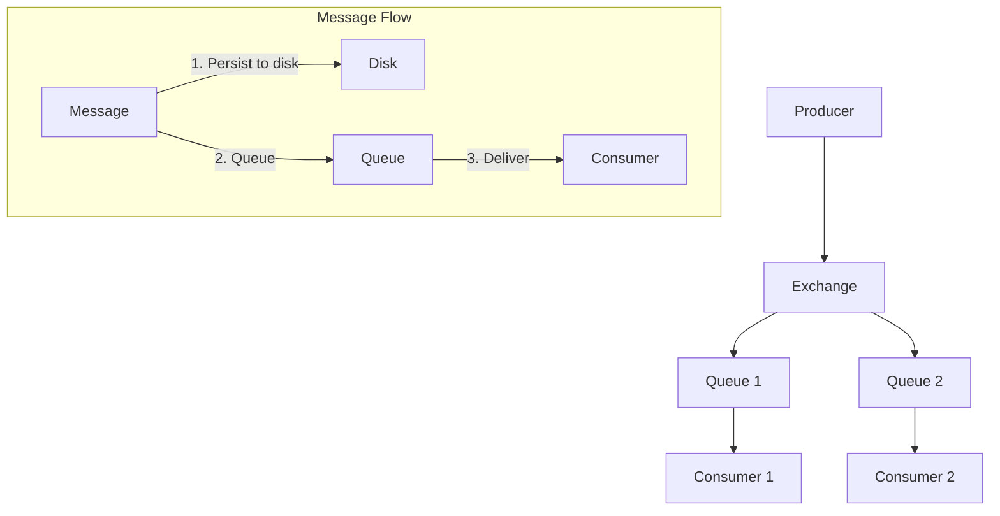

# 메시징과 이벤트 기반 구조

- [메시징과 이벤트 기반 구조](#메시징과-이벤트-기반-구조)
    - [Broker 비교와 선택](#broker-비교와-선택)
        - [RabbitMQ와 Kafka](#rabbitmq와-kafka)
            - [원문: RabbitMQ와 Kafka](#원문-rabbitmq와-kafka)
                - [RabbitMQ와 Kafka](#rabbitmq와-kafka-1)
        - [rabbit mq, kafka 등 차이](#rabbit-mq-kafka-등-차이)
            - [원문: rabbit mq, kafka 등 차이](#원문-rabbit-mq-kafka-등-차이)
                - [rabbit mq, kafka 등 차이](#rabbit-mq-kafka-등-차이-1)
    - [Consumer와 클라이언트 구현](#consumer와-클라이언트-구현)
        - [RabbitMQ가 Node.js 앱으로 메시지를 전달하는 과정](#rabbitmq가-nodejs-앱으로-메시지를-전달하는-과정)
            - [원문: RabbitMQ가 Node.js 앱으로 메시지를 전달하는 과정](#원문-rabbitmq가-nodejs-앱으로-메시지를-전달하는-과정)
                - [RabbitMQ가 Node.js 앱으로 메시지를 전달하는 과정](#rabbitmq가-nodejs-앱으로-메시지를-전달하는-과정-1)
    - [메시징 프로토콜](#메시징-프로토콜)
        - [표준 메세징 프로토콜 정리 (AMQP, STOMP, MQTT)](#표준-메세징-프로토콜-정리--amqp-stomp-mqtt-)
            - [원문: 표준 메세징 프로토콜 정리 (AMQP, STOMP, MQTT)](#원문-표준-메세징-프로토콜-정리--amqp-stomp-mqtt-)
                - [표준 메세징 프로토콜 정리 (AMQP, STOMP, MQTT)](#표준-메세징-프로토콜-정리--amqp-stomp-mqtt--1)
        - [`amqplib`의 동작 원리](#amqplib의-동작-원리)
            - [원문: `amqplib`의 동작 원리](#원문-amqplib의-동작-원리)
                - [`amqplib`의 동작 원리](#amqplib의-동작-원리-1)

RabbitMQ, Kafka, AMQP, consumer, client library처럼 서비스 사이의 비동기 메시지 흐름을 다룹니다.

> 원문 배치본입니다. source chunk의 문장은 유지하고, 대분류/중분류/소분류 계층에 맞게 Markdown heading depth만 조정했습니다. 원본 span과 SHA-256은 manifest에서 검증할 수 있습니다.

## Broker 비교와 선택

### RabbitMQ와 Kafka

#### 원문: RabbitMQ와 Kafka

<!-- curriculum-chunk: sha256=7430918db1d5f23b31add1ce0e7cf07be94780d9f8c574fb33ec6fcf3b6d945b major=messaging-event-driven mid=Broker 비교와 선택 sub=RabbitMQ와 Kafka sources=source/interview_questions.md:8569-8817, source/interviews.md:8517-8765 -->

> Source: `source/interview_questions.md:8569-8817`
> Classification reason: broker comparison
> Duplicate source aliases: `source/interview_questions.md:8569-8817, source/interviews.md:8517-8765`

##### RabbitMQ와 Kafka

RabbitMQ는 오픈 소스 메시지 브로커 소프트웨어로, AMQP(Advanced Message Queuing Protocol)를 구현한 대표적인 시스템입니다.
이는 분산 시스템 간의 비동기 메시징을 가능하게 하여 시스템 간 결합도를 낮추고 확장성을 높이는 데 기여합니다.

- RabbitMQ 관련 핵심 개념들은 다음과 같습니다.
    1. Producer: 메시지를 생성하여 큐에 발송하는 애플리케이션
    2. Consumer: 큐에서 메시지를 받아 처리하는 애플리케이션
    3. Queue: 메시지가 저장되는 버퍼
    4. Exchange: 메시지를 받아 특정 규칙에 따라 큐에 라우팅하는 라우터.

       다음과 같은 Exchange 타입들이 존재합니다:
        1. Direct: 라우팅 키가 정확히 일치하는 큐에 메시지 전달
        2. Fanout: 바인딩된 모든 큐에 메시지 브로드캐스트
        3. Topic: 와일드카드 패턴 매칭을 통한 라우팅
        4. Headers: 메시지 헤더의 속성을 기반으로 한 라우팅
    5. Binding: Exchange와 Queue를 연결하는 규칙

- RabbitMQ의 아키텍처는 다음과 같은 구성요소로 이루어져 있습니다:
    1. Broker: 메시지를 관리하는 중앙 서버
    2. Virtual Hosts: 논리적으로 분리된 리소스 그룹
    3. Connections: 클라이언트와 브로커 간의 TCP 연결
    4. Channels: 하나의 연결 내에서 생성되는 가상의 연결

- RabbitMQ의 주요 특징
    1. 신뢰성: 메시지 지속성(메시지를 디스크에 저장하여 손실 방지), 전달 확인(확인 응답 메커니즘을 통해 메시지 전송 성공 여부를 확인), 재시도 메커니즘을 통해 높은 신뢰성을 제공합니다.
    2. 유연성: 다양한 라우팅 전략과 메시지 형식 지원
    3. 클러스터링: 여러 노드를 하나의 논리적 브로커로 구성 가능
    4. 관리 도구: 웹 기반 UI를 통한 모니터링 및 관리 기능 제공
    5. 플러그인 시스템: 기능 확장이 용이

RabbitMQ의 메시지 관리의 기본 아키텍처는 다음과 같습니다.



- 메시지 저장 구조는 다음과 같습니다.
    - 내부 데이터베이스 (Mnesia)
        - Erlang의 분산 데이터베이스
        - 메타데이터 저장 (큐 구조, 바인딩, 사용자 등)

    - 메시지 저장소

        ```sh
        /var/lib/rabbitmq/mnesia/[노드명]/msg_store_persistent/
        ├── 1.rdq          # 메시지 데이터 파일
        ├── 2.rdq
        └── file_summary   # 인덱스 정보
        ```

    - 큐 인덱스
        - 메모리에 저장
        - 메시지 참조 정보 관리

- 메시지 순차성 보장은 다음과 같습니다.

    ```mermaid
    sequenceDiagram
        participant P as Producer
        participant Q as Queue
        participant C as Consumer

        P->>Q: Message 1 (delivery-tag: 1)
        P->>Q: Message 2 (delivery-tag: 2)
        Q->>C: Message 1
        Note over C: Process Message 1
        C->>Q: Ack Message 1
        Q->>C: Message 2
    ```

    - Producer 측:
        - 각 메시지는 채널 내에서 채널별로 순차적으로 증가하는, 순차적인 delivery-tag를 받음
        - 태그는 채널이 살아있는 동안 단조 증가

    - Queue 측:
        - FIFO(First In First Out) 순서로 메시지 저장
        - 메시지는 delivery-tag 순서대로 Consumer에게 전달

    - Consumer 측:
        - 메시지를 순차적으로 수신
        - ACK를 통해 처리 완료 확인
        - multiple flag를 통한 일괄 확인 가능

- 클러스터에서 메시지 유일성

    ```mermaid
    graph TD
        P[Producer] --> LB[Load Balancer]
        LB --> N1[Node 1]
        LB --> N2[Node 2]
        LB --> N3[Node 3]

        subgraph "Queue Mirroring"
            N1 --> |Sync| N2
            N1 --> |Sync| N3
        end
    ```

  메시지 아이디를 생성합니다:

    ```erlang
    % RabbitMQ 내부 메시지 ID 생성 (의사 코드)
    MessageId = {
        TimestampMicros,
        NodeId,
        SequenceNumber
    }
    ```

  큐 미러링:
    - Classic Queues: 마스터-슬레이브 복제
    - Quorum Queues: Raft 합의 알고리즘 사용

- 장점
    1. 다양한 메시징 패턴 지원
    2. 높은 신뢰성과 확장성
    3. 다양한 프로그래밍 언어 지원
    4. 활발한 커뮤니티와 풍부한 문서

- 단점
    1. 설정 및 관리의 복잡성
    2. 메시지 순서 보장의 어려움 (특정 상황에서)
    3. 대용량 메시지 처리 시 성능 저하 가능성

Apache Kafka는 LinkedIn에서 개발하고 나중에 Apache Software Foundation에 기부된 분산 스트리밍 플랫폼입니다.
대용량의 실시간 데이터 피드를 효율적으로 처리하기 위해 설계되었습니다.

- 핵심 개념
    1. Topic: 데이터 스트림의 카테고리 또는 피드 이름
    2. Partition: 토픽의 데이터를 분산 저장하는 단위
    3. Producer: 토픽에 메시지를 발행하는 애플리케이션
    4. Consumer: 토픽의 메시지를 구독하고 처리하는 애플리케이션
    5. Broker: Kafka 서버
    6. Zookeeper: Kafka 클러스터의 메타데이터 관리 및 브로커 헬스 체크

- 아키텍처

  Kafka의 아키텍처는 다음과 같은 구성요소로 이루어져 있습니다:

    1. Kafka Cluster: 여러 Kafka 브로커로 구성
    2. Producer API: 메시지를 토픽에 발행
    3. Consumer API: 토픽의 메시지를 구독
    4. Streams API: 스트림 처리 애플리케이션 개발
    5. Connector API: 외부 시스템과의 연동

- 주요 특징
    1. 높은 처리량: 대량의 실시간 데이터 스트림을 처리할 수 있는 능력
    2. 확장성: 클러스터 구성을 통한 수평적 확장 가능
    3. 영속성: 디스크에 데이터를 저장하여 내구성 제공
    4. 분산 처리: 파티션을 통한 병렬 처리
    5. 낮은 지연시간: 밀리초 단위의 실시간 데이터 처리

- Kafka의 장점
    1. 높은 처리량과 낮은 지연시간
    2. 강력한 내구성과 장애 허용성
    3. 분산 아키텍처를 통한 높은 확장성
    4. 데이터 스트리밍에 최적화된 설계

- Kafka의 단점
    1. 초기 설정과 관리의 복잡성
    2. 작은 규모의 메시징에는 과도할 수 있음
    3. Zookeeper 의존성 (최신 버전에서는 개선됨)

- Kafka와 RabbitMQ의 상세 비교

    1. 처리량과 성능

       Kafka는 초당 수백만 개의 메시지를 처리할 수 있습니다.
       대량의 데이터 처리와 확장성이 필요한 경우에 더 적합합니다.

       RabbitMQ는 일반적으로 초당 수만 개의 메시지를 처리합니다.
       주로 낮은 대기 시간과 높은 처리율을 제공하는 시스템에 더 적합합니다.

        - 데이터 모델:
            - Kafka는 로그 중심 모델을 사용합니다. 메시지가 디스크에 순차적으로 추가되며, 읽기 작업도 순차적으로 이루어집니다.
            - RabbitMQ는 큐 기반 모델을 사용합니다. 메시지는 개별적으로 처리되며, 각 메시지마다 메타데이터 처리가 필요합니다.

        - I/O 최적화:
            - Kafka는 `페이지 캐시`를 활용한 순차적 I/O를 사용하여 디스크 접근을 최소화합니다.
            - RabbitMQ는 기본적으로 메모리에 메시지를 저장하며, 디스크에 저장할 경우 랜덤 I/O가 발생할 수 있습니다.

        - 배치 처리:
            - Kafka는 메시지를 배치로 처리하여 네트워크 및 디스크 I/O를 최적화합니다.
            - RabbitMQ는 기본적으로 개별 메시지 처리에 최적화되어 있습니다.

    2. 데이터 영속성

       Kafka: 기본적으로 모든 데이터를 디스크에 저장합니다.
       RabbitMQ: 기본 설정은 메모리에 저장하며, 필요 시 디스크에 저장할 수 있습니다.

        - 설계 철학:
            - Kafka는 대용량 로그 처리 및 장기 데이터 보존을 목적으로 설계되었습니다.
            - RabbitMQ는 실시간 메시지 라우팅 및 빠른 전달을 목적으로 설계되었습니다.

        - 저장 메커니즘:
            - Kafka는 append-only 로그 구조를 사용하여 효율적인 디스크 쓰기를 수행합니다.
            - RabbitMQ는 메모리 기반 저장소를 사용하며, 디스크 저장은 추가적인 옵션입니다.

1. 확장성

   Kafka: 파티션을 통해 쉽게 수평적 확장이 가능합니다.
   RabbitMQ: 클러스터링을 지원하지만, Kafka만큼 대규모 확장에 최적화되어 있지 않습니다.

    - 분산 모델:
        - Kafka는 파티션 기반 분산 모델을 사용합니다. 각 파티션은 독립적으로 확장 가능합니다.
        - RabbitMQ는 노드 기반 클러스터링을 사용합니다. 큐는 기본적으로 단일 노드에 존재합니다.

    - 상태 관리:
        - Kafka는 ZooKeeper(또는 최근 버전에서는 자체 관리)를 통해 분산 상태를 관리합니다.
        - RabbitMQ는 Erlang의 분산 데이터베이스를 사용하여 클러스터 상태를 관리합니다.

2. 메시지 순서 보장

   Kafka: 파티션 내에서 메시지 순서를 보장합니다.
   RabbitMQ: 특정 상황에서 순서 보장이 어려울 수 있습니다.

    - 메시지 모델:
        - Kafka는 로그 기반 모델을 사용하여 파티션 내에서 메시지의 순서를 자연스럽게 유지합니다.
        - RabbitMQ는 개별 메시지 라우팅을 사용하며, 여러 소비자가 동시에 메시지를 처리할 경우 순서가 바뀔 수 있습니다.

    - 소비 모델:
        - Kafka 소비자는 오프셋을 통해 메시지를 읽기 때문에 순서를 유지할 수 있습니다.
        - RabbitMQ는 메시지를 소비자에게 푸시하는 모델을 사용하여, 병렬 처리 시 순서 보장이 어려울 수 있습니다.

3. 다중 구독자 지원

   Kafka: 동일한 데이터에 대해 여러 컨슈머 그룹이 독립적으로 구독할 수 있습니다.
   RabbitMQ: 메시지는 일반적으로 하나의 소비자에 의해 처리됩니다.

    - 소비 모델:
        - Kafka는 로그 기반 모델을 사용하여 여러 소비자가 독립적으로 같은 데이터를 읽을 수 있습니다.
        - RabbitMQ는 큐 기반 모델을 사용하여 메시지가 소비되면 큐에서 제거됩니다.

    - 메시지 보존:
        - Kafka는 메시지를 일정 기간 보존하여 여러 소비자가 접근할 수 있게 합니다.
        - RabbitMQ는 기본적으로 메시지가 소비되면 삭제됩니다.

<!-- /curriculum-chunk -->

### rabbit mq, kafka 등 차이

#### 원문: rabbit mq, kafka 등 차이

<!-- curriculum-chunk: sha256=19d5c0d87cf3283f1d6f71d36c3bd76b99f496ce2b268046557f5c2fe568a894 major=messaging-event-driven mid=Broker 비교와 선택 sub=rabbit mq, kafka 등 차이 sources=source/interview_questions.md:7756-7757, source/interviews.md:7704-7705 -->

> Source: `source/interview_questions.md:7756-7757`
> Classification reason: broker comparison
> Duplicate source aliases: `source/interview_questions.md:7756-7757, source/interviews.md:7704-7705`

##### rabbit mq, kafka 등 차이

<!-- /curriculum-chunk -->

## Consumer와 클라이언트 구현

### RabbitMQ가 Node.js 앱으로 메시지를 전달하는 과정

#### 원문: RabbitMQ가 Node.js 앱으로 메시지를 전달하는 과정

<!-- curriculum-chunk: sha256=ad6adb300d19ee73e189d52c25ed51e505d82424b6f1682bc267fd5229e86f09 major=messaging-event-driven mid=Consumer와 클라이언트 구현 sub=RabbitMQ가 Node.js 앱으로 메시지를 전달하는 과정 sources=source/interview_questions.md:8818-8868, source/interviews.md:8766-8816 -->

> Source: `source/interview_questions.md:8818-8868`
> Classification reason: consumer/client implementation
> Duplicate source aliases: `source/interview_questions.md:8818-8868, source/interviews.md:8766-8816`

##### RabbitMQ가 Node.js 앱으로 메시지를 전달하는 과정

RabbitMQ는 AMQP 프로토콜을 사용하며, AMQP는 TCP/IP 기반으로 동작합니다.
TCP/IP 네트워크 스택을 사용하는 것은 동일하나, RabbitMQ 자체의 메시지 전달 과정이 다소 다릅니다.

1. AMQP 연결 설정

   RabbitMQ와 Node.js 앱은 TCP 연결을 통해 통신합니다.
   Node.js에서 `amqplib`와 같은 라이브러리를 통해 AMQP 연결을 설정합니다.
   이 과정에서 RabbitMQ 서버로 TCP 연결이 열리고, AMQP 프로토콜 핸드셰이크를 통해 연결이 설정됩니다.

2. RabbitMQ에서 메시지 큐 대기

   Node.js 앱은 RabbitMQ 큐에 대해 consumer 역할을 합니다.
   이때 `channel.consume()` 메서드를 사용하여 특정 큐에 대한 메시지를 지속적으로 구독(listen)합니다.
   구독이 설정되면 RabbitMQ는 큐에 새로운 메시지가 들어올 때 이를 대기 중인 consumer에게 전달할 준비를 합니다.

3. TCP를 통한 메시지 전송

   RabbitMQ는 TCP 연결을 통해 메시지를 전달합니다.
   > RabbitMQ는 메시지를 큐에 저장하며, 큐에 도착한 메시지를 기다리고 있는 consumer에게 push 방식으로 전달합니다.
   > 메시지가 TCP 연결을 통해 AMQP 프레임으로 전송되고, Node.js 애플리케이션은 이를 처리합니다.

   이때, RabbitMQ 서버는 AMQP 프레임을 TCP 패킷에 담아 클라이언트(Node.js 애플리케이션)로 전송합니다.
   이 메시지는 TCP 프로토콜에 따라 IP 패킷으로 캡슐화된 후, 네트워크 스택을 거쳐 전송됩니다.

4. 커널의 네트워크 스택 처리

   RabbitMQ 서버에서 전송한 패킷은 Node.js 애플리케이션이 실행 중인 머신에서 NIC를 통해 수신됩니다.
   TCP/IP 스택은 커널 내에서 처리가 이루어집니다.
   수신된 데이터는 TCP 세그먼트로 해석된 후, AMQP 프레임으로 복원됩니다.
   > AMQP 프레임 구조:
   >
   > AMQP 프로토콜은 각 메시지를 프레임 단위로 나누어 전송합니다.
   > 프레임에는 메시지 본문, 속성, 헤더 등의 정보가 포함되어 있으며, TCP 연결을 통해 consumer로 전달됩니다.

5. Node.js 애플리케이션에 데이터 전달

   Node.js 애플리케이션은 `epoll` 등의 이벤트 기반 I/O 모델을 사용하여 대기 중입니다.
   > Node.js는 기본적으로 libuv 라이브러리를 통해 이벤트 기반 I/O를 처리하는데, 이 과정에서 `epoll`이 사용됩니다.
   > TCP 소켓에서 새로운 데이터가 도착하면 `epoll`이 그 사실을 알리고, 그에 맞춰 Node.js 이벤트 루프는 준비된 작업을 처리합니다.

   RabbitMQ에서 수신된 데이터는 해당 소켓을 통해 전달되며, 이벤트 루프는 이를 감지하여 콜백 함수(`channel.consume()`에서 설정한 콜백)를 실행합니다.
   그 결과, 메시지가 `consume` 메서드로 전달되어 처리됩니다.

RabbitMQ는 메시지의 신뢰성을 보장하기 위해 `acknowledgment`(확인 응답) 메커니즘을 사용합니다.
Node.js 애플리케이션은 메시지를 처리한 후 RabbitMQ에 메시지 수신 및 처리 완료를 확인시켜야 하며, 이는 AMQP 프로토콜의 일부로 처리됩니다.

그리고 RabbitMQ는 QoS 설정을 통해 메시지 처리 속도와 양을 제어할 수 있습니다.
이를 통해 한 번에 몇 개의 메시지를 처리할지 또는 메시지를 미리 가져올지 등을 설정할 수 있습니다.

<!-- /curriculum-chunk -->

## 메시징 프로토콜

### [표준 메세징 프로토콜 정리 (AMQP, STOMP, MQTT)](https://velog.io/@holicme7/%ED%91%9C%EC%A4%80-%EB%A9%94%EC%84%B8%EC%A7%95-%ED%94%84%EB%A1%9C%ED%86%A0%EC%BD%9C-%EC%A0%95%EB%A6%AC-AMQP-STOMP-MQTT)

#### 원문: [표준 메세징 프로토콜 정리 (AMQP, STOMP, MQTT)](https://velog.io/@holicme7/%ED%91%9C%EC%A4%80-%EB%A9%94%EC%84%B8%EC%A7%95-%ED%94%84%EB%A1%9C%ED%86%A0%EC%BD%9C-%EC%A0%95%EB%A6%AC-AMQP-STOMP-MQTT)

<!-- curriculum-chunk: sha256=9199a18398af49a0c3828cb22ec40077a0ffc32f900ef5fe7b32156c0cfc65a4 major=messaging-event-driven mid=메시징 프로토콜 sub=[표준 메세징 프로토콜 정리 (AMQP, STOMP, MQTT)](https://velog.io/@holicme7/%ED%91%9C%EC%A4%80-%EB%A9%94%EC%84%B8%EC%A7%95-%ED%94%84%EB%A1%9C%ED%86%A0%EC%BD%9C-%EC%A0%95%EB%A6%AC-AMQP-STOMP-MQTT) sources=source/interview_questions.md:7758-7759, source/interviews.md:7706-7707 -->

> Source: `source/interview_questions.md:7758-7759`
> Classification reason: messaging protocol
> Duplicate source aliases: `source/interview_questions.md:7758-7759, source/interviews.md:7706-7707`

##### [표준 메세징 프로토콜 정리 (AMQP, STOMP, MQTT)](https://velog.io/@holicme7/%ED%91%9C%EC%A4%80-%EB%A9%94%EC%84%B8%EC%A7%95-%ED%94%84%EB%A1%9C%ED%86%A0%EC%BD%9C-%EC%A0%95%EB%A6%AC-AMQP-STOMP-MQTT)

<!-- /curriculum-chunk -->

### `amqplib`의 동작 원리

#### 원문: `amqplib`의 동작 원리

<!-- curriculum-chunk: sha256=4aa568ef2bf06f679eb120d25d0f1182328f15bd36f40ea29d4e85932a38b64a major=messaging-event-driven mid=메시징 프로토콜 sub=`amqplib`의 동작 원리 sources=source/interview_questions.md:8869-8896, source/interviews.md:8817-8844 -->

> Source: `source/interview_questions.md:8869-8896`
> Classification reason: messaging protocol
> Duplicate source aliases: `source/interview_questions.md:8869-8896, source/interviews.md:8817-8844`

##### `amqplib`의 동작 원리

Node.js는 libuv라는 이벤트 기반 비동기 I/O 라이브러리를 사용하여 I/O 작업을 처리합니다.
libuv는 여러 운영 체제에서 비동기 처리를 제공하기 위해 플랫폼별로 비동기 I/O 메커니즘을 사용합니다.

- 리눅스에서는 `epoll`
- 윈도우에서는 `IOCP`
- 맥OS에서는 `kqueue` 등

`amqplib`은 Node.js의 이러한 비동기 이벤트 루프를 활용하는 라이브러리입니다.
Node.js에서 `amqplib`을 사용할 때, 메시지 수신을 비동기적으로 처리하기 위해 이벤트 기반 모델을 사용합니다.
하지만 amqplib 자체가 직접적으로 `epoll` 시스템 콜을 호출하지는 않으며, 이는 Node.js의 libuv에 의해 추상화된 방식으로 관리됩니다.

1. TCP 연결 설정:

   `amqplib`은 RabbitMQ와 TCP 연결을 설정합니다.
   이 TCP 연결은 비동기적으로 관리되며, Node.js 이벤트 루프는 연결을 통해 수신되는 데이터를 처리하기 위해 대기합니다.

2. 소켓 대기:

   메시지가 RabbitMQ 서버에서 전송되면, 이 데이터는 TCP 소켓을 통해 Node.js로 전송됩니다.
   이때 소켓에서 데이터가 도착하면 Node.js 이벤트 루프는 이를 감지하고 적절한 콜백을 실행합니다.
   이벤트 루프 내부에서 libuv가 운영 체제에 따라 `epoll`이나 다른 비동기 I/O 메커니즘을 사용하여 소켓에서 데이터를 감지합니다.

3. 메시지 처리:

   메시지가 도착하면, `channel.consume()`에서 설정한 콜백 함수가 호출됩니다.
   이 콜백 함수는 RabbitMQ에서 전달된 메시지를 처리하게 됩니다.

<!-- /curriculum-chunk -->
