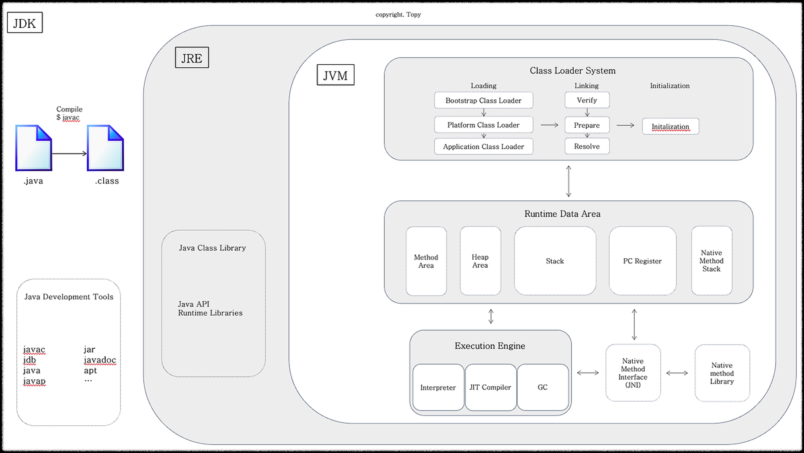

# Java

## 자바

- [Java SE와 Java EE 차이](https://medium.com/@ageofsys/java-se%EC%99%80-java-ee-%EC%B0%A8%EC%9D%B4-23182a16bb67)

### 특징

1. 운영체제에 독립적
    1. 자바가상머신(JVM)을 통해서 가능
    2. 자바 응용프로그램은 운영체제(OS)나 하드웨어가 아닌 JVM하고만 통신
    3. JVM은 자바 응용프로그램으로부터 전달받은 명령을 해당 운영체제가 이해할 수 있도록 변환하여 전달.
    4. '자바 Application'은 운영체제(OS)에 독립적이지만 JVM에 종속적임.
    5. 'JVM'은 운영체제(OS)에 종속적임

2. 객체지향언어(OOP: Object Oriented Programming Language)
    1. 자바는 객체지향개념의 특징인 상속, 캡슐화, 다형성이 잘 적용된 순수 객체지향언어이다.
    2. 재사용성과 유지보수의 용이성(객체지향언어의 특징)

3. 자동 메모리 관리(Garbage Collection)
    1. Garbage Collector가 자동으로 메모리 관리를 해주기 때문에 프로그래머는 따로 메모리를  관리하지 않아도 된다.
    2. 자동 메모리 관리는 다소 비효율적인 면도 있지만, 프로그래머가 보다 프로그래밍에 집중할 수 있도록 도와준다.

4. 네트워크와 분산처리지원

    인터넷과 대규모 분산환경을 염두해 두었기 때문에 다양한 '네트워크 프로그래밍  라이브러리(Java API)'를 통해 비교적 짧은 시간에 네트워크 관련 프로그램을 쉽게 개발할 수 있다.

5. 멀티쓰레드(Multi-thread) 지원
    1. 자바에서의 멀티쓰레드 프로그램은 시스템과 관계없이 구현가능
    2. Java API가 제공되므로 구현이 쉬움.
    3. 여러 쓰레드에 대한 스케쥴링(scheduling)을 자바 인터프리터가 담당.

6. 동적 로딩(Dynamic Loading)을 지원
    1. 일반적으로 자바로 작성된 Application은 여러 개의 클래스로 구성되어 있다. 자바는 다이나믹 로딩을 지원하기 때문에 실행시 모든 클래스가 로딩되지 않고 필요한 시점에 클래스를 로딩하여 사용할 수 있다.
    2. 유연한 어플리케이션 작성: 일부 클래스가 변경되어도 전체 어플리케이션을 다시 컴파일 하지 않아도 된다. 비교적 간단한 작업만으로도 처리가 가능.

### 2. JVM은 자바 가상머신(Java Virtual Machine)



1. 바이너리 코드를 읽는다, 검증한다, 실행한다
2. 실행환경(runtime environment)의 규격을 제공한다.(필요한 라이브러리 및 기타 파일)
3. 바이트 코드로 변환 후 JVM 구동.

Java 21기준 JVM 실행 시 아래와 같이 Heap Area에 메모리가 할당된다.

Initial heap size of 1/64 of physical memory
Maximum heap size of 1/4 of physical memory
예시:
운영체제의 메모리가 16GB인 경우:

초기 힙 크기: 16GB / 64 = 0.25GB (256MB)
최대 힙 크기: 16GB / 4 = 4GB

### 3. JRE는 자바 실행환경(Java Runtime Environment)

JVM 이 자바 프로그램을 동작시킬 때 필요한 라이브러리 파일들과 기타 파일들을 가지고 있다.
JRE는 JVM의 실행환경을 구현했다고 할 수 있다.

### 4. JDK는 자바 개발도구(Java Development Kit)

JRE + 개발을 위해 필요한 도구(javac, java등) 등

### 5. 프로그래밍 언어

1. 고급 언어 = 사람 언어에 가까운 경우.
2. 프로그래밍 언어 -> 컴파일러 -> 바이트코드 -> JVM -> 바이너리

참고:

```link
https://github.com/topyheun/growth/blob/main/growth/2024.05.23%20-%20JVM%20%ED%81%B4%EB%9E%98%EC%8A%A4%20%EB%A1%9C%EB%94%A9%20%EB%B0%8F%20%EC%BD%94%EB%93%9C%20%EC%8B%A4%ED%96%89%20%EA%B3%BC%EC%A0%95.md
```

## 2. 변수

1. 개요
    1. 변수 = 한 가지 타입의 하나의 값을 저장할 수 있는 메모리 공간
    2. 예약어는 변수명으로 지정시 에러 발생
        ![reserved words.jpg][image1]
2. 변수의 사용
    1. 리터럴(Literal)
        1. 개요
        2. 소스코드 내에서 직접 입력된 값. \[“ “\], \[‘ ‘\], 또는 \[숫자\] 등
        3. 사실 리터럴은 상수\*와 같은 의미이지만 프로그램에서는 상수(final)와 구별 위해 리터럴이라는 용어 사용.
            \*상수(constant): 값을 한 번 저장하면 변경할 수 없는 변수. // final
        4. 종류
            1. 정수
                1. 소수점 없는 정수 리터럴 → 10진수로 간주
                    ex) 0, 10, \-10
                2. 0으로 시작되는 리터럴 → 8진수로 간주
                    ex) 02, \-02
                3. 0x 또는 0X로 시작하고 0\~9 또는  A, B, C, D  또는 a, b, c, d로 구성된 리터럴 → 16진수로 간주
                    ex) 0x5, 0XB3
            2. 실수
                1. 소수점 있는 리터럴 → 10진수 실수로 간주
                    ex) 0.25, \-3.14
                2. E 또는 e가 있는 리터럴 → 10진수 지수와 가수로 간주
                    ex) 5E7 = 5\*10^7, 5E-5 = 5\*10^-5
                    1. 정수 타입 변수에 저장 불가. 실수 타입 변수에 저장.
            3. 문자
                1. 작은 따옴표로 묶은 텍스트 → 하나의 문자 리터럴로 간주
                    ex) ‘a’, ‘\\n’

                | 이스케이프 문자 | 용도 | 유니코드 |
                | :---: | :---: | ----- |
                | \\t | 수평탭 | 0x0009 |
                | \\n | 줄바꿈 | 0x000a |
                | \\r | 리턴 | 0x000d |
                | \\” | 큰따옴표 | 0x0022 |
                | \\’ | 작은따옴표 | 0x0027 |
                | \\\\ | \\ | 0x005c |
                | \\u16진수 | 16진수 해당 유니코드 | 0x0000\~0xffff |

            4. 문자열
               1. 큰따옴표로 묶은 텍스트 → 문자열 리터럴로 간주(텍스트가 없어도).
            5. 논리
               1. true/false
3. 변수의 사용 범위
    1. 클래스, 생성자, 메소드의 중괄호 { } 블록 내에서 선언되고 사용
    2. 변수는 선언된 블록 내에서만 사용 가능

## 3.  데이터타입

   1. 기본 타입
      1. 정수
         1. byte(1byte = 8bit) : 0000 0000
            1. 색상 정보, 파일, 이미지 등 이진 데이터 처리할 때 주로 사용
            2. 범위: \-2^7 \~ (2^7 \- 1)(-128\~127)
            3. 색상 정보, 파일, 또는 이미지 등의 이진 데이터 처리할 때 주로 사용
            4. 128의 값을 주면 자동으로 int로 인식. type mismatch 오류
            5. 실행 중, 저장할 수 있는 값의 범위 초과 → 최소값부터 다시 반복 저장
            6. 저장 가능한 범위 초과해서 값 저장 → 쓰레기값
         2. char(2 byte) : 0000 0000 | 0000 0000
            1. 범위: 0 \~ (2^16 \- 1\) (유니코드: \\u0000\~\\uFFFF, 0\~65535)
            2. 모든 문자→ 유니코드
               ![char variable.png][image2]
            3. 0\~127=ASCII, 44043\~55203=한글.
            4. 작은따옴표로 감싼 문자를 대입 → 해당 문자 유니코드 저장.
            5. short와 ‘크기’는 같지만 ‘범위’는 다르다.
         3. short(2 byte) : 0000 0000 | 0000 0000
            1. 범위: \-2^15 \~ (2^15 \- 1\) (-32,768\~32,767)
            2. char와 ‘크기’는 같지만 ‘범위’는 다르다.
         4. int(4 byte) : 0000 0000 | 0000 0000 | 0000 0000 | 0000 0000
            1. 범위: \-2^31 \~ (2^31 \- 1\) (-2,147,483,648 \~ 2,147,483,647)
            2. 범위 초과시(ex. 2,147,483,648) long이 되어야 한다
            3. 총 32자리임에도 31제곱이 되는 이유는 \+와 \-를 표시해주기 위해서
         5. long(8) :
            1. 범위: \-2^63 \~ (2^63 \- 1\)
            2. 초기화할 때 정수값 뒤에 l 또는 L을 붙일 수 있다
               → 컴파일러에게 4byte가 아닌 8byte 데이터임을 알려주기 위한 목적
            3. int 범위 초과하는 정수 → 반드시 l 또는 L을 붙여야 함
      2. 실수(부동 소수점 방식)
         1. '부호비트 \+ 지수 \+ 가수'로 구성된다.
         2. 종류
            1. 32비트: 부호(+/-. 1비트) 가수(mantissa. 0='m'1, 23비트) x 10^n(8비트).
            2. 64비트: 부호(+/-. 1비트) 가수(mantissa. 0='m'1, 52비트) x 10^n(11비트)
         3. 가수는 최상위 비트가 1이므로 한 자리를 더 저장할 수 있다.(24비트, 53비트)
         4. e 또는 E를 포함하는 경우 실수 타입 변수에 저장(~~정수 타입~~)
         5. float(4) (ex. 1.0F)
            1. 범위: ±1.4\*10^-45 \~ ±3.4028235\*10^38
            2. 리터럴 뒤에 f나 F 붙여야 함
         6. double(8) (ex. 2.0)
            1. 범위: ±4.9\*10^-324 \~ ±1.797693138623157\*10^308
            2. Java는 실수 리터럴의 기본 타입을 double로 간주
      3. 논리: boolean → 다른 자료형으로 형변환 불가.
   2. 타입 변환
      1. 자동타입변환(promotion)
         1. 큰 크기 타입 = 작은 크기 타입(좌 ← 우 저장)
            ex) int value1 = byte value2
         2. 정수타입이 실수타입으로 변환하는 것은 무조건 자동타입변환
         3. char타입의 경우 int타입으로 자동변환. 유니코드값이 int타입에 저장
         4. 음수가 저장될 수 있는 byte타입을 char타입으로 자동 변환 불가능.
      2. 강제타입변환(casting)
         1. 원칙적으로 기본형과 참조형 사이 강제 타입 변환 불가능
            1. String → 기본형으로 바꿔주는 method
               1. int i = Integer.parseInt(s);
               2. float f = Float.parseFloat(“12.3”);
            2. 기본형 → String으로 바꿔주는 method
               1. String s1 = String.valueOf(10);
         2. 캐스팅 연산자 “( )”을 사용
            1. byte value1 = (byte) value2; // value2는 int타입.
            2. 자식클래스타입 변수 = (자식클래스타입) 부모클래스타입;
            3. (참조형일 경우)부모타입 클래스 = 자식 타입이 부모 타입으로 변환된 상태
         3. 1바이트 최소-128 최대127.
         4. 연산결과(int) → char의 경우 강제변환. char a = (char) value //value : int
         5. 기본타입의 경우
            1. float의 경우 67F는 물론 67.5F로 해도 C 출력
            2. ‘char ⟶ short’의 경우 같은 2byte메모리임에도  casting을 해야 함. char가 양수에서 short보다 큰 값을 가질 수 있기 때문
            3. ‘음수 ⟶ char’의 경우 “?”가 출력됨
               → ASCII코드상 3만 이상부터 재시작하는 것과 같다.
      3. 연산식에서의 자동타입변환
         1. 서로 다른 피연산자가 있을 경우
         2. double타입 \+ int타입 → int타입이 double타입 자동 변환 → 연산

|  | byte | short | char | int | long | float | double |
| :---: | :---: | :---: | :---: | :---: | :---: | :---: | :---: |
| byte |  | O(범위초과x) | (casting) | O | O | O | O |
| short | (casting) |  | (casting) | O | O | O | O |
| char | (casting) | (casting) |  | O | O | O | O |
| int | (casting) | (casting) | (casting) |  | O | O | O |
| long | (casting) | (casting) | (casting) | (casting) |  | O | O |
| float | (casting) | (casting) | (casting) | (casting) | (casting) |  | O |
| double | (casting) | (casting) | (casting) | (casting) | (casting) | (casting) |  |

## 4. 연산자

   1. 개요
      1. 연산(operation) = 데이터 처리하여 결과를 산출하는 것
      2. 연산자(operator) = 연산에 사용되는 표시나 기호
         1. 단항(피연산자 1개): \++x, y++
         2. 이항(피연산자 2개): x \+ y, x / y
         3. 삼항(피연산자 3개): (sum ' 90\) ? “A” : “B”
      3. 피연산자(operand) = 연산되는 데이터
      4. 연산식(expressions) = 연산자와 피연산자를 이용하여 연산 과정 기술한 것
         1. 반드시 하나의 값만 산출하고, 값을 입력하는 대신 연산식 대입해도 된다.
         2. 다른 연산식의 피연산자에도 위치 가능
            ex) boolean result = (x \+ y) ' 5;
   2. 종류
      1. 증감(++, \--)
         1. x++ 는 x = x \+ 1과 같은 결과를 내지만, 중요한 차이가 있다. x++가 x의 값을 1 증가시키는 것은 맞지만, “x++”라는 식의 값은 x 그대로 남아 있는다.

| 식 | 값 |
| :---: | :---: |
| x = x \+ 1 | x \+ 1 |
| x++  | x |

      2. 부호
      3. 비트(\~)
      4. 논리(\!)
      5. 산술(\*, /, %, \+, \-)
      6. 쉬프트('', '', ''')
      7. 비교(', ', '=, '=, instanceof, ==, \!=)
      8. 논리(&, ^, |, &&, ||)
      9. 조건(?:)
      10. 대입
   3. [연산의 방향과 우선순위](https://hajsoftutorial.com/java-operator-associativity/)
      ![operator priority.png][image3]
      1. 연관성(Associativity)
         1. 같은 우선순위에서의 연관성을 의미
         2. ~~‘무엇을 먼저 계산할 것인지’~~가 아니라
            ‘어떤 식을 어떻게 먼저 묶어서 해석(parse)할지’에 관련된 것이다
      2. 방향
         1. 증감(++, \--), 부호(+, \-), 비트(\~), 논리(\!), 대입은 ← (우에서 좌로)
         2. 산술, 쉬프트, 비교, 논리, 조건(?:)은 → (좌에서 우로)
      3. 예제:
         1. “?: 조건문”(오른쪽에서 왼쪽)
            a ? b : c ? d : e 라고 주어질 경우
            → a ? b : ( c ? d : e ) 라고 해석(parse)됨
         2. 대입(=) 연산
            a = b = c = 10
            → c = 10
            → b = 10
            → a = 10
         3. 더하기(+) 연산
            a = 1 \+ 2 \+ 3 \+ 4;
            → a = 3 \+ 3 \+ 4;
            → a = 6 \+ 4;
            → a = 10;

## 5. 조건문과 반복문

   1. 조건문
      1. if(조건){...}
      2. switch \~ case \~ break;
   2. 반복문(조건 검토 \-' 실행문 \-' 조건문 재검토 …)
      1. for(1.초기화; 2\. 5\. 8.조건식; 4\. 7\. 10.증감식){3. 6\. 9.반복문 구문} : 실행 순서
      2. while(조건. true/false): 반복 횟수 알 못할 때
         1. 실행 흐름
            1. 조건식
            2. 실행문
            3. 조건식 재검토
         2. while문 내에서 계속 누적되는 값을 갖는 변수는 while문 시작 전에 미리 선언
         3. while(true) : 무한루프
         4. 채팅의 경우 while의 조건식 안에서 dis.readUTF()메소드를 검토해야 “읽는 것”을 대기함. while문 밖에 미리 dis.readUTF()를 참조하여 읽어온다면 읽어온 것만으로 무한루프
      3. do-while
      4. 향상된 for문 \-'5.g.x
      5. break : 반복문 나오기
      6. continue : 건너띄기. 다음 구문 수행x & 즉시 반복문 위 조건으로 다시 올라감
      7. flag=true; while(flag){} if(조건){flag=false;} : flag 통해서 while문 조절

## 6. 참조타입(heap 영역 객체)

   1. 타입 : 변수에 저장되는 값의 “종류 & 범위”를 결정짓는 요소.
   2. 데이터 타입 분류
   3. 메모리 사용 영역
      ![memory1.png][image4]
      1. OS가 메인 메모리 관리. JVM은 OS로부터 필요한만큼 할당 받음 → Runtime Data Area
      2. 메소드 영역
         1. 모든 Thread들이 공유하는 메모리 영역
         2. 저장되는 정보
            1. Type 정보: 클래스와 관련된 모든 정보
            2. 상수 풀(constant pool) → Garbage Collecting하지 않는다.
               1. LineNumberTable이나 LocalVariableTable과 헷갈리지 말 것.
               2. 상수 풀에 포함되는 자료형
                  1. numeric literals
                     1. Integer
                     2. Long
                     3. Float
                     4. Double
                  2. string literals → String constant pool
                  3. Utf8:
                     Utf8으로 인코딩된 문자들의 연속을 바이트 흐름으로 나타냄
                  4. Class references
                     상수 풀 안에 JVM 내부에 fully qualified class name을 가지는 상수 풀의 Utf8을 가리키는 것.
                     fully qualified name = 모든 부모 계층의 이름 \+ 그 자신의 이름
                     ex) c:\\users\\kitri\\desktop\\java\\web9\\loginform.html
                  5. NameAndType
                     상수 풀의 다른 entry를 가리키는, 콜론(:)으로 구별되는 한 쌍의 값.
                     ex. System.out.println(“문자열”)
                           \#26:\#27    //out:Ljava/io/PrintStream;
                     1\) 콜론 전의 첫번째 값(변수명)은 메소드나 필드의 이름인 Utf8 String entry를 가리킨다.
                     1\) 두번째 값은 타입명을 가리킨다.
                     ㄴ필드의 경우에는 완전하게 구별되는 클래스명이고,
                     ㄴ메소드의 경우에는 매개변수 하나당 완전하게 구별되는 클래스명의 리스트이다 .
                  6. field references
                     method references
                     InterfaceMethod references
                     도트 연산자(.)로 구별되는 한 쌍의 값.
                     도트 전의 값은 Class entry를,
                     도트 이후의 값은 NameAndType entry를 가리킨다.
               3. Heap의 permanent 영역에 생성되어 프로세스가 끝날 때까지 유지
               4. 리터럴 형태(String a = “abc”;)로 선언
                  1. 예제: Strinng str = “abc”;
                     1. new String(“abc”); \-' String.intern(); \-' 고유의 인스턴스를 공유하도록 interned된다
                     2. 생성한 String을 Constant Pool에 등록하는 작업
                     3. 만약 이전에 같은 char sequence의 문자열이 이미 상수풀에 있다면 문자열을 힙에서 해제하고 그 상수풀의 레퍼런스를 반환
                  2. str \+= “d”;
                     1. 상수 풀에 “abc” 존재 유무 확인. 없다면 상수 풀에 새로 생성. 메모리 주소 반환
                     2. 상수 풀에 “d” 존재 유무 확인. 없다면 상수 풀에 새로 생성. 메모리 주소 반환.
                     3. 연산 결과인 ”abcd”가 상수 풀에 존재 유무 확인. 없다면 상수 풀에 새로 생성. 메모리 주소 반환
                     4. 참조변수 str에 최종적으로 “abcd”의 메모리 주소 담긴다
                     5. “abc”, “d”, “abcd” 각각 상수 풀에 존재하는 문자열.
               5. new 연산자 통해 생성 \-' heap 영역에 저장
                  1. Object foo = new Object();
                     0: new \#2        //Class java/lang/Object
                     1: dup
                     2: invokesepcial \#3    //Method java/ lang/ Object “'init'”( ) V
                  2. new(//opcode(=operation code))는 \#2 피연산자(operand)가 따른다
                     \-'\#2 피연산자는 상수 풀의 인덱스로서 두번째 entry를 참조.
                     \-'두번째 entry는 class reference다.
                     \-'이 class reference는 상수 풀 내에서 // Class java/lang/object값과 함께 UTF8타입으로 해당 클래스의 이름을 포함하는 다른 entry를 참조한다.
                     \-'java.lang.Object와 관련된 클래스를 검색하는 데 사용.
                  3. new라는 opcode는 클래스 인스턴스를 만들고 객체의 변수들을 초기화
                  4. 새로운 클래스 인스턴스에 대한 참조(reference)가 피연산자 스택(the operand stack)에 추가된다
                  5. dup라는 opcode는 피연산자 스택(the operand stack)에 참조(reference)를 복제하여 가장 높은 곳에 생성하고, 이것을 피연산자 스택의 가장 높은 곳에 추가한다.
            3. Field 정보
               1. type
               2. modifier
            4. method 정보
               1. 메소드 이름
               2. type
               3. modifier
            5. Class variables
               1. static으로 선언된 모든 클래스 변수
            6. reference to Class ClassLoader : 특정 Type을 로드한 ClassLoader 정보 관리
            7. reference to Class class Method Table : Class의 Method에 대한 direct reference
      3. 스택 영역
      4. 힙 영역
         1. 모든 Thread들이 공유하는 메모리 영역
         2.
   4. 참조 변수의 ==, \!=연산
   5. null과 nullpointerexception
   6. String타입
   7. 배열 타입 = 배열,  열거(enumeration), 클래스, 인터페이스
      1. 메모리 사용 영역
         1. 메소드 영역
         2. 힙 영역
         3. JVM스택 영역 in 스레드
      2. 배열
         1. 배열명\[인덱스\]
         2. 같은 타입의 데이터만 저장 가능
      3. 배열 선언
         1. 타입\[\] 변수; or 타입 변수\[\];
      4. 값 목록으로 배열 생성
         1. 타입\[\] 변수 = {...}
         2. 배열 변수 미리 선언 후 값 목록들을 나중에 결정하는 경우
         3. 메소드의 매개값이 배열일 경우 : new 반드시 사용
      5. new 연산자로 배열 생성
         1. 값의 목록 없음. 향후 값들을 저장할 배열을 미리 만들 경우.
      6. 배열 길이
         1. 저장할 수 있는 객체의 수가 배열을 생성할 때 결정됨
         2. 불특정 다수의 객체를 저장하는 데 문제 있음
            → 컬렉션 프레임워크(set, list, map)
      7. 커맨드 라인 입력
         1. java클래스로 프로그램 실행시, JVM 길이 0인 args String 배열 생성
         2. main() 메소드를 호출할 때 매개값으로 전달
      8. 다차원 배열
         1. \!\!행렬이라 생각하지 말고 객체와 객체 간의 참조 관계라 생각할 것\!\!
         2. 다차원 배열의 길이(length) = 행의 개수
         3. int\[\]\[\] scores = new int\[2\]\[3\];
            정수 타입의 다차원 배열로 2행 3열의 행렬과 같다.
         4. int\[\]\[\] scores = new int\[2\]\[\];
            정수타입의 다차원 배열로 2행만 정함
            scores\[0\] = new int\[2\];
            scores\[1\] = new int\[3\];
            /\*0번 인덱스에 정수 타입에 크기 2인 배열을,
            \* 1번 인덱스에 정수 타입에 크기 3인 배열을 참조하게 만듦으로써
              계단식 구조를 갖게 만듦\*/
      9. 객체를 참조하는 배열
      10. 배열 복사
      11. 향상된 for문
          1. 배열 또는 자료구조화 된 경우
          2. 0번 index부터 마지막 index까지 반복 수행 \-' 카운터 변수와 증감식 사용x
          3. 배열 및 컬렉션 항목의 개수만큼 반복하고, 자동적으로 for문을 빠져나간다.
          4. for(항목 저장할 변수 선언 : 배열){}
   8. 열거 타입(enumeration) \-' 스프링 프레임워크
      1. enum 타입.
      2. ex. public enum Week { MONDAY, TUESDAY, WEDNESDAY…}
      3. java.util.calendar의 상수를 사용할 경우? AM의 값이 8, APRIL의 값이 8이면 논리적 가동성 떨어짐. 다른 상수를 쓰더라도 같은 결과 도출 가능. 위험한 코드.

## 7. 클래스(C의 구조체에서 시작한 개념.) = 데이터 \+ 행동/기능

   1. 목적
      1. 객체 생성의 틀 (final \-' extends로 상속 불가).
      2. 라이브러리(API)용
      3. 실행용(실행 진입점 main 메소드 있음)
      4. 하위클래스들의 공통점을 모아두는 용도 (abstract \-' new로 객체 생성 불가).
   2. 클래스 실행 순서
      1. 로드타임 다이나믹 로드 : 하나의 클래스 로드 과정에서 동적으로 클래스 로딩하는 것
         1. 클래스로딩 : 스택이 아닌 set 방식으로 로딩. 필요한 클래스 로딩.
            1. 바이트코드파일(\*.class) 생성.
            2. JVM 시작
            3. 부트스트랩 클래스로더 생성
               1. 클래스로더 :
                  1. 클래스 로딩시 클래스를 바이트 코드로 읽고 바이트 코드로 메소드 영역에 적재한다.
                  2. 클래스를 로딩할 때 필요한 정보를 구하고, 그 클래스가 올바른지를 검사할 수 있어야 한다..
               2. 규칙
                  1. 클래스 로더는 계층 구조를 형성
                  2. 클래스는 필요 시점에 로딩된다.
                  3. 클래스 A를 로딩할 때는, 클래스 A를 호출한 클래스 B의 클래스 로더가 인스턴스 로딩을 담당한다.
                  4. 클래스 유일성 식별: 클래스명+패키지명+클래스로더 인스턴스
                  5. 클래스 로더에는 명시적인 Unload가 없다. 대신 GC될 때 Unload 된다.
               3. 부트스트랩 클래스로더:
                  자바 런타임 라이브러리에 있는 클래스를 로딩
            4. 최상위 Object클래스 로드
            5. 명령행에서 지정한 클래스 로드
            6. 지정한 클래스 로드중 필요한 클래스(java.lang.String, java.lang.System 등) 로드
         2. 바이트코드검증
         3. 인터프리트
         4. static변수 초기화
            static{}호출됨
      2. 런타임 다이나믹 로드 : JVM이 클래스에 대한 정보를 갖고 있지 않다는 것
         ex.Class.forName(className)
         1. main()호출 \- 런타임 상태
   3. 객체 지향 프로그래밍 for 클래스 재사용성 높이기 → 오버로딩, 오버라이딩.
      1. 원칙적으로 각각 독립적으로 존재하는 객체들이 서로 상호작용하면서 동작
      2. 메소드 = 객체들 사이의 상호작용 수단
         1. 컴파일시 체크하는 메소드와 실행시 체크하는 메소드 다르다
         2. 컴파일시 클래스를 보고 컴파일. 실행시에는 전달된 메소드를 보고 실행
         3. 실행시에 사용될 자원이 결정됨 = 동적 바인딩 → 여러곳에서 사용 가능.
            cf. c언어는 컴파일시에 실행될 자원이 결정됨. 빠르다.
         4. 부모 클래스의 자식들은 모두 인자로 활용 가능하게 됨.
      3. 객체 간의 관계
         1. 사용
         2. 상속
         3. 집합
      4. 객체지향 언어의 조건
         1. 상속 표기 가능(extends)
            1. 단일 상속만 가능.
            2. 부모의 모든 변수, 메소드는 자식쪽으로 상속.
            3. 생성자 상속x. 하위클래스타입의 객체 생성시 부모의 매개변수 없는 생성자 자동 호출.
            4. 부모의 특정 생성자를 호출하려면 super();를 사용.
         2. 다형성. ex. 때에 따라 a객체의, b객체의, c객체의 m메서드 호출 가능.
         3. 캡슐화: 정보은닉. 접근제한자. getter와 setter 메소드.
         4. 객체지향언어의 목적: 클래스의 재사용성 높이기
            1. 객체지향은 “객체를 생성 & 매개변수로 참조”. 따라서 객체를 찾아갈 수 있는 주소, bit-pattern만 안다면 언제든지 재사용 가능(타입 등 제한은 별개로).
   4. 객체와 클래스
      1. 인스턴스 : 해당 클래스로부터 만들어진 객체
      2. 인스턴스 변수는 클래스 내에 선언된 변수이고, 그 클래스의 모든 객체는 자신의 값을 가진다. 자바에서, pubilc 필드값을 만든느 것은 프로그램에 문제를 야기할 수 있다.
      3. 객체화(instantiation): 클래스에 따라 객체 만드는 작업. 하나의 클래스로 여러 객체 생성 가능.
   5. 클래스 선언
      1. 메인 메소드 갖는 클래스 선언에만 public.
      2. public 갖는 클래스명으로 java 저장.
      3. 소스 파일 = 클래스 선언을 담고 있는 저장 단위
      4. abstract class 클래스명 :for
         1. 하위클래스들의 공통점을 모아두는 용도로만.
         2. 추상 메소드가 없거나 하나 이상일 때 선언 가능
         3. abstract와 final은 동시에 표기 불가능
         4. 일반 변수 가질 수 있다. //인터페이스는 상수 필드만 가능
         5. 추상클래스를 상속하는 클래스는 추상메소드를 모두 구현해주어야 한다
         6. 추상클래스가 추상클래스를 상속한다면 모두 구현할 필요 없다
         7. 생성자 가질 수 있다.
         8. 인스턴스를 만들 수 없지만 추상클래스를 상속하는 하위 클래스 통하면 가능
            ex. ~~추상클래스명 a = new 추상클래스명();~~
            ex. 추상클래스명 a = new 클래스명();
         9. 추상클래스의 접근지정자는 어떤 것이나 가능
         10. 궁극적인 목적은 상속하기 위함.
      5. final class 클래스명 for 객체 생성의 틀 용도로만. extends(x)
   6. 객체생성과 클래스변수
      1. new : 클래스로부터 객체 생성시키는 연산자.
         1. 형식 : 클래스타입 클래스변수명 = new 클래스();
            cf. initialize(초기화)는 객체의 메소드다
         2. new로 해당 클래스의 객체(instance) 생성
            → 그 객체의 initialiaze 메소드 호출
            → arguments에 전달
            \*argument란? 참조변수.? 런타임 중 메소드에 전달된 객체.
      2. “()”는 생성자.
      3. new 연산자로 생성된 객체는 메모리 heap 영역에 생성. new 연산자 사용한 만큼 객체 생성.
      4. new 연산자는 heap 영역에 객체 생성시킨 후 객체의 주소를 리턴.
   7. 클래스의 구성 멤버 = 객체가 가져야 할 구성 멤버
      1. 필드 = 객체에 소속된 데이터
         1. 메소드 밖 변수. 개체 속성 알리는 변수. 객체의 데이터가 저장되는 곳??
         2. 선언 형태는 변수와 비슷하지만 변수 아님.
         3. 생성자와 메소드 전체에서 사용되며 객체가 소멸되지 않는 한 객체와 함께 존재.
            cf. 변수 = 생성자와 메소드 내에서만 사용. 생성자와 메소드 종료되면 자동 소멸.
         4. 필드 선언
         5. 필드 사용
            1. 클래스 내부의 생성자나 메소드에서 사용
            2. 클래스 외부에서 사용
               1. 클래스로부터 먼저 객체 생성한 뒤에 필드 사용
      2. 생성자 = 필드 초기화 or 메소드 호출하여 객체 사용할 준비
         1. 특징
            1. 객체지향에서는 생성자가 항상 따라다님. (cf. destructor는 JVM이).
            2. 클래스로부터 객체 생성할 때 객체 초기화 담당.
               객체 초기화 = 필드 초기화 or 메소드 호출하여 객체 사용할 준비
            3. 사용 편리하고 재사용성 높아짐
            4. 생성자
               → 힙 영역에 객체 생성 & 객체 주소 리턴
               → 객체 주소가 클래스 타입 변수에 저장.
               → 매개변수의 bit-pattern을 복사해서 같은 객체를 참조.
         2. 기본생성자(생성자 없는 경우)
            1. 클래스(매개변수X) {하는 일 없음}
            2. 다른 생성자 만들면 기본 생성자는 자동으로 안만들어짐
         3. 생성자 선언
            1. 반환형 없다
            2. 생성자 이름 = 클래스 이름
            3. 클래스명과 이름이 동일. 클래스가 없다면 새로 만듦
         4. 필드 초기화
            1. 객체 생성시 필드는 자동 초기화
            2. 다른 값으로 초기화
               1. 필드 선언할 때 초기값 설정
               2. 생성자에서 초기값 설정:
                  객체 생성 시점에 외부에서 제공되는 다양한 값들로 초기화 할 경우
         5. 생성자 오버로드 for 다양한 방법으로 객체 생성
            1. 매개 변수를 달리하는 생성자를 여러 개 선언하는 것
            2. 매개변수의 타입, 개수, 순서가 다르게 선언
         6. this() : this생성자 호출. 현재 객체의 다른 생성자 호출.
            1. 필드 초기화 내용은 한 생성자에만 집중적으로 작성.
            2. 반드시 생성자의 첫줄에서만 허용
      3. 메소드 = 객체의 동작에 해당. 함수는 아니다
         1. 각 메소드는 네 개의 영역을 가진다
            1. 시그니처(signature)와 access flags
            2. 바이트코드
            3. LineNumberTable:
               1. debugger에게 ‘어떤 라인’이 ‘어떤 바이트 코드 instruction’과 상응하는지 정보 제공
               2. 해당 라인이 시작하여 끝나는 곳을 알려준다.
                  \*instruction : 프로세서가 이해하는 명령어 하나하나를 인스트럭션이라 한다.
               3. 한 줄에 8개의 코드가 들어가기도 하고, 5개의 코드가 들어가도 한다.
            4. LocalVariableTable
               1. 프레임에 제공된 모든 지역 변수들의 목록.
               2. ex.
                  public 패키지.SimpleClass()라는 클래스 메소드나, public void sayHello() 메소드 등의 프레임 내에 선언된 지역변수들. 없으면 this.
         2. 메소드선언 : 리턴타입 메소드명(\[매개변수선언, …\]){ … }
            1. 매개변수 선언
               1. 매개변수로 받는 방법
                  1. 기본 타입은 그 자체로 value를 가짐.
                     기본 타입 외 String 같은 경우에는 heap영역의 객체를 참조.
                  2. 기본타입의 경우에는 그대로 복사함
                     기본 타입 외 String 같은 경우에는 객체를 참조하는 bit-pattern을 복사해서 같은 객체를 참조.
            2. 매개 변수의 수를 모를 경우
               1. 배열 타입으로 선언
                  int sum1(int\[\] values) { }
               2. 값의 리스트만 넘겨줌
            3. 추상 메소드 : abstract 타입 메소드명. cf. final method(재정의 금지)
               타입 메소드명(); \-' 구체적인 내용 없음. 하위 클래스에서 반드시 재정의.
         3. 리턴문
            1. 리턴값이 있는 메소드
            2. 리턴 타입이 void일 경우 생략 가능
               1. return; 을 통해 메소드 종료 가능
         4. 메소드 호출
            1. 객체 내부에서 호출(클래스 내부의 다른 메소드에서 호출할 경우)
            2. 객체 외부에서 호출(클래스 외부에서 호출할 경우)
               (static메소드가 아닌 이상 생성자 통한 객체 생성 필요)
               1. 참조변수와 함께 도트(.) 연산자를 사용하여 메소드 호출 가능.
                  1. 리턴값 없거나 있어도 리턴값 받지 않을 경우
                     → 참조변수.메소드(매개값,...);
                  2. 리턴값 있고 리턴값을 받고 싶을 경우
                     → 타입 변수 = 참조변수.메소드(매개값, …);
               2. 도트(.) =객체 접근 연산자. 객체의 필드나 메소드에 접근할 때 사용.
         5. 메소드 오버로딩(cf. 오버라이딩)
            1. 클래스 내에 같은 이름의 메소드를 여러 개 선언하는 것
            2. 조건: 매개변수의 타입, 개수, 순서 중 하나가 달라야 함.
            3. 변수에는 오버라이딩, 오버로딩 없다. 메소드의 경우에만.
            4. class A{
                   void plus(){}
                   int plus(int a, int b){}
                   double plus(double a, double b){}
               }
               public class Test{
                   public static void main(String\[\]args){
                       A a = new A();
                       a.plus();
                       byte b1, b2; b1=1; b2=2;
   8. 전역변수x. 글로벌 베리어블x.(자바스크립트, c언어 등)
   9. 패키지
      1. public : 누구나 접근 가능
      2. private : 해당 클래스에서만 접근 가능
      3. 아무것도 적지 않음 : 해당 패키지에서 접근 가능
      4. 패키지 선언
         1. package 상위패키지.하위패키지(모두 소문자)
         2. 숫자로 시작 불가.  \_, $제외한 특수문자 사용x.
      5. import문
         1. 다른 패키지의 클래스를 사용할 때 미리 작성.
         2. 패키지 선언과 클래스 선언 사이
         3. “\*(asterisk)” 사용 가능. 권장x.
         4. java.lang, system 등의 패키지는 자동 import.(컴파일시)
   10. 접근 제한자
       1. public
       2. protected : 같은 패키지 or 부모-자식 간의 관계일 경우 접근 가능.
       3. dafault: 다른 패키지에서 접근 불가
       4. private → setter, getter 메소드 통해 접근
          1. getter와 setter메소드 \-' 캡슐화의 경우 데이터를 가릴 때 접근 통로로 설정
             cf. 접근제한 = 캡슐화x.
          2. 반드시 setter, getter를 사용해야 하는 것은 아니다.
          3. 하지만 클래스들이 확장되어서 component가 될 수 있으므로 미리 get, set으로 만듦.
             1. cf.component :
                클래스가 여러 어플리케이션의 구성요소로서 쓰인다면, 재사용성이 높은 큰 덩어리. 그 경우 component라 함. java component \-' java beans)
             2. 조건
                1. public class
                2. public 아닌 property용 인스턴스 변수 필요(private 등)
                3. (색, 크기 등) property용 public setter, getter 메소드 필요
                4. public 매개변수 없는 생성자 필요.
   11. javadoc : 클래스 사용설명서
       1. 도큐먼트 코멘트. /\*\* \~ \*/.
       2. 보안상 문제가 될 경우에는 사용x
   12. 인스턴스 멤버와 this
       1. 인스턴스 멤버 : 객체(인스턴스) 생성 후 사용할 수 있는 (인스턴스) 필드와 메소드
       2. ex. class A{int i; public void m(){ sysout((this.)i);}} A a1 = new A(); a1.m();
   13. 정적 멤버와 static
       1. 특징
          1. 정적 멤버(클래스 멤버) : 클래스에 고정된 멤버. 객체를 생성하지 않고 사용 가능. 객체와 무관.
             1. 정적 필드(상수) :
                1. 클래스로딩시 메소드 영역에 자료형만큼 메모리 할당.
                2. 클래스 로딩시 할당된 메모리와는 별도로  메인 메소드에서 사용할 경우  스택 영역에 새로운 메모리 할당.
                3. 프로그램이 끝나야 사라진다.
             2. 정적 메소드 :
                1. 클래스로딩시 메소드 영역에 메모리 할당x
                2. “클래스명.메소드명()”으로 사용하기 위해서
                3. main() 메소드 역시 static이므로 class에서 선언한 변수와 메소드를 사용할 수 없기 때문에 heap 영역에 객체를 생성하여 참조하는 방식으로 사용.
          2. 클래스 로더가 클래스(바이트 코드)를 로딩해서 메소드 메모리 영역에 적재할 때 클래스별로 관리됨.
          3. 객체 생성 없이 static 필드, 메소드 사용 가능.
             1. cf.인스턴스 변수 → 객체 생성해야 사용 가능.
          4. ex.
             static double pi = 3.14159        static int si;  A a1 = new A();
             System.out.println(Calculator.pi);     a1.si++ //가능
             “클래스명.static변수”로 사용 가능.
             1. 인스턴스변수: 객체 내부에서는 “this.인스턴스변수”로 사용 가능
          5. 같은 클래스임에도 “클래스명.메소드” \-' static이 아닌 인스턴스 변수
             도트 연산자 없이 메소드 바로 호출 \-' static 메소드.
          6. static 변수는 class area에 할당. 반면 인스턴스변수는 heap영역에 할당.
          7. static변수는 클래스로딩 후 초기화. 인스턴스변수는 객체 생성 후 초기화.
             (cf. 지역변수, 매개변수는 자동초기화x. 개발자가 따로 초기화)
       2. 정적 멤버 선언
          1. 메소드 선언 시 ‘static’ 키워드를 붙이면 됨
          2. 정적 필드와 정적 메소드는 클래스에 고정된 멤버
             → 메소드 메모리 영역에 클래스 로딩될 때 클래스별로 관리됨.
          3. 인스턴스? static?
             1. 필드 : 클래스 로딩시 변수에 따른 메모리 할당
                1. 인스턴스 필드 : 객체마다 가지고 있어야 할 데이터일 경우
                2. static 필드 : 공용적인 데이터일 경우
             2. 메소드 : 클래스 로딩시 변수에 따른 메모리 할당하지 않음
                1. 인스턴스 메소드 : 인스턴스 필드 이용해서 실행해야 할 경우
                2. static 메소드 : 인스턴스 필드 이용하지 않는 경우
                3. 메인메소드에서 사용시 stack 영역에 해당 메소드가 쌓이게 되고, 매개변수로 값에 변화를 주고싶다면 static 메소드가 그 값을 호출한 메소드에 되돌려주도록 return; 명령.
       3. 정적 멤버 사용
          → 클래스명 .(도트연산자)필드 or 메소드
       4. 정적 초기화 블록: static { … }
       5. 정적 메소드와 블록 선언 시 주의할 점
          1. 객체가 없어도 실행되므로 이들 내부에 인스턴스 필드나 인스턴스 메소드 사용 불가
          2. 객체 자신의 참조인 this 키워드도 사용 불가.
          3. 정적 메소드와 블록에서 인스턴스 멤버 사용?
             → 객체 생성 후 참조 변수로 접근
          4. main메소드도 둥일한 규칙 적용
       6. 싱글톤
          1. 전체 프로그램에서 단 하나의 객체만 만들도록 보장해야 하는 경우
          2. 홈페이지에서 여러 사람이 하나의 아이디로 접속하려 할 때, 이미 접속한 아이디의 session 객체를 하나의 자료구조에 저장해둘 필요가 있다. 그때 싱글톤 객체를 사용.
          3. 생성자에 private 선언
             ex.
             //메소드를 최초로 호출할 때 객체를 하나만 생성함
             private static SessionSingleTon sst = new SessionSingleTon();
             private SessionSingleTon(){} // 외부에서 생성자 사용 불가

## 8. 상속

   1. 상속 개념
      1. 부모클래스의 필드, 메소드 상속.
      2. extends 부모클래스명
      3. 부모클래스 영역이 먼저 할당(자동초기화)+ 자식클래스의 고유 영역
         1. 자식이 부모를 선택
   2. 클래스 상속
      1. 클래스 간의 상속은 단일 상속만 가능.
      2. 부모클래스의 부모클래스는 가능. 하나의 부모클래스 \-' 여러 자식 클래스
      3. 자식 클래스의 생성자 내용이 비어있을 경우 부모 클래스의 매개변수 없은 생성자 호출하는데, 없는 경우 컴파일 에러.
   3. 부모 생성자 호출(super)
      1. 생성자는 상속되지 않는다.
      2. 자식 타입 객체 생성될 때 부모의 매개변수 없는 생성자가 먼저 자동 호출. 그 후에 자식 생성자.
      3. 부모의 매개변수 있는 생성자 호출하려면 ‘super(부모 생성자 타입의 매개값);’ 사용.
      4. 매개변수 없는 생성자를 습관적으로 만들어두면 편하다. 일부러 호출하지 않아도 되므로.
   4. 메소드 재정의(override) : 부모자식 관계에만.
      1. 오버라이딩이 가능한 이유는 업캐스팅이 가능하기 때문.
      2. 메소드들 사이에서만 가능. 변수 사이에서는 불가능.
      3. 상속된 메소드의 내용이 자식 클래스에 맞지 않은 경우, 자식 클래스에서 동일한 메소드를 재정의하는 것. 오버라이딩 후에 부모 객체의 메소드는 숨겨지기 때문에, 자식 객체에서 메소드를 호출하면 오버라이딩된 자식 메소드가 호출된다.
      4. 목적 : 다운캐스팅 없이도 메소드 호출이 가능. 강제 형변환 없이 부모 메소드 사용 위해서.
      5. 메소드 재정의
         1. 부모의 메소드와 동일한 시그니처(매개 변수 리스트, 메소드 이름, 리턴 타입)
         2. 접근 제한을 부모 메소드보다 더 강하게 오버라이딩 불가(자식이 더 넓거나 같아야 한다.)
            ex.default \-' public 가능. default \-' private불가능.
         3. 새로운 예외 throws할 수 없다.
      6. 부모 메소드 호출(super) : super.부모메소드();
   5. final 클래스와 final 메소드
      1. final 변수 : 변하지 않음. (cf. static final: 상수)
      2. final 클래스 : 상속 금지
      3. final 메소드 : 재정의(오버라이딩) 금지. cf. 추상 메소드.
   6. protected 접근 제한자
   7. 타입 변환과 다형성
      1. 다형성 : 같은 타입 & 실행 결과 다양한 객체를 이용할 수 있는 성질.
         void m(Parent p){  // 변수 하나로 parent, child1, child2의 메소드 호출 가능
             p.method2();
         }
         m(new Child1()); //parent타입으로 업캐스팅 가능.
         m(new Child2()); //parent타입으로 업캐스팅 가능.
      2. '자식 → 부모 → 자식'인 경우에만 가능하다.
         부모클래스 변수1  =  new 자식클래스();    //자동형변환(promotion)
         자식클래스 변수2  =  (자식클래스) 변수1;    //강제형변환(cast)
      3. 하나의 타입에 여러 객체를 대입함으로써 다양한 기능을 이용할 수 있도록 해줌.
      4. shape s = new shape();
         circle c = new circle();
         s = c; //부모 = 자식. 컴파일 성공. 실행 성공. 업캐스팅.
         circle c1 = s; // 컴파일 오류. 컴파일러는 데이터 타입에 문제 있는지 여부.
         circle c1 = (circle) s; // 강제 형변환으로 컴파일 오류는 안생김. 다운캐스팅.
         자식 = (자식) 부모;
         //ClassCastException에러. 강제형변환됐다 하더라도 부모 내부에 자식의 영역이 없기 때문.
      5. class cast exception
         1. 부모 타입 객체 → 자식 타입 다운캐스팅(실패) → ClassCastException 발생
         2. 자식 타입 객체 → 부모 타입 업캐스팅 → 자식 타입 다운캐스팅(성공) //원상태 복구.
            class interface B (){ void mb();}
            class D implements B{
                void mb();
                void mc();
            }
            B b = new D(); //업캐스팅
      6. hidden data
         1. circle c = new circle();
            shape s = c;
            이때 자식이 가진 값이 20, 부모가 가진 값이 10이라면 출력값이 서로 다르다.
      7. 자동 타입 변환(Promotion) = upcasting : 자식 타입 객체가 부모 타입으로 자동 변환 가능.
      8. 필드의 다형성
      9. 하나의 배열로 객체 관리
      10. 매개변수의 다형성
      11. 강제 타입 변환 = downcasting 자동 형졈환 후 → 강제 가능. 자식 객체 안에서 왔다갔다 함.
      12. 객체 타입 확인(instnaceof)

## 9. 인터페이스

   1. 특징
      1. 사물 간 또는 사물과 인간 간의 의사소통이 가능하도록 일시적 혹은 영속적인 접근을 목적으로 만들어진 물리적, 가상적 매개체. ex. 스마트폰의 ui, 등의 스위치 on/off, 스크린 올림/내림 등의 접속장치.
      2. 사용자들에게 사용법을 알려줌. 메소드가 구현되는 기능 있으면 안됨. 껍데기
         → 모두 추상 메소드.
      3. 내부 클래스가 노출되지 않도록 함 → 결합도를 떨어뜨림.
      4. 다중상속지원.(엄밀하게는 다중상속 아니지만, 다중상속인 것처럼)
   2. 역할 : 구체적인 클래스가 드러나지 않도록 함.
      1.
      2. 사용자 : 사용법을 알려줌
      3. 개발자 : 무엇을 구현해야 할지 알려줌
   3. 인터페이스 선언 : 클래스 예약어x. interface 인터페이스명 {...}
      1. 런타임 시 데이터 저장 가능한 필드 선언 불가능 하지만 상수 필드 선언 가능
      2. 상수 필드 선언 :
         1. (public static final) 생략 가능. 모든 변수는 public 상수.
         2. 변수들은 static이어야만 한다. 일반 변수들 가질 수 없다.
      3. 추상 메소드 선언 : (public abstract) 생략 가능. 모든 메소드가 기본적으로 추상 메소드
      4. 디폴트 메소드 선언
      5. 정적 메소드 선언
   4. 인터페이스 구현
      1. 구현 클래스 : public class 구현클래스명 implements 인터페이스명{}
      2. 인터페이스간의 상속은 extends
      3. 익명 구현 객체
      4. 다중 인터페이스 구현 클래스
         1. 클래스 간에는 단일 상속만 가능.
         2. 여러 인터페이스 구현하는 하위 클래스 가능하지만 다중 상속은 아님.
   5. 인터페이스 사용
      1. 추상
      2. 디폴트
      3. 정적
   6. 타입 변환과 다형성(polymorphism)
      1. 부모타입의 변수에 (부모타입의 객체 또는 자식타입의 객체)가 참조될 수 있다.
      2. ex. void m(Object obj){
             if( obj instnaceof Circle){
                 Circle c = (Circle) obj; //자식 타입으로 강제 형변환
             }
         }
         m( new Object() );
         m( new Circle() );
      3. 자동 형변환, 강제 형변환.
   7. 인터페이스 상속
   8. 디폴트 메소드와 인터페이스 확장

## 10. 중첩 클래스와 중첩 인터페이스 : 안드로이드에서 자주 사용

    1. 사용 목적
       1. 클래스가 많아질수록 관리하기가 힘듦.
       2. gui만들 때 event처리. 메인 클래스의 변수를 다른 클래스가 자기 변수처럼 사용 가능케 하려고. ex. 버튼.setOnClickListener(new View.OnClickListener(){ … });
       3. 만약 다른 클래스일 경우 setter, getter메소드를 사용하거나 생성자를 통해야 하는 불편함.
    2. 중첩 클래스 : 클래스 내의 클래스(이너 클래스)
       중첩 인터페이스 : 클래스 내의 인터페이스
    3. 중첩 클래스
       1. 의미:
          → 어떤 B라는 클래스가 오로지 A라는 클래스와만 관련이 있다면,
              B클래스를 A클래스 내부에 선언하여 관리가 쉽도록 하고자 하는 문법적 장치
       2. 정적 → 외부 클래스의 멤버 참조 불가
       3. 동적
          1. 멤버 : 클래스 내 멤버로 선언되는 중첩 클래스
             1. 인스턴스
                1. 객체 생성 후 사용 가능
                2. ~~static~~변수, ~~static~~메소드 포함 불가.
             2. static : 클래스명으로 바로 사용 가능. 잘 사용x
             3. 외부 메소드 = 멤버 이너 클래스
             4. 내부 동작
                1. 이너 클래스의 케이스 안에 2개의 클래스 파일을 만든다
                2. 이너 클래스의 클래스 파일명은 Outer$Inner이다
                3. 이너클래스를 생성하길 원한다면 외부 클래스의 인스턴스를 만들어야 함
                   → 외부 클래스의 인스턴스 안에 이너 클래스의 인스턴스가 만들어짐
             5. 컴파일러에 의한 내부 코드 발생
                1. 자바 컴파일러는 Outer$Inner라는 이름 지어진 클래스 파일을 만듦
                2. 멤버 이너 클래스는 외부 클래스의 참조를 가짐
                3. private을 포함하여 외부 클래스의 모든 데이터 멤버에 접속 가능
          2. 익명:
             1. 클래스는 수행되는 인터페이스나 확장되는 클래스에 의해 만들어진다
             2. 이름은 자바 컴파일러에 의해 결정된다
          3. 로컬 : 메소드 내 선언되는 중첩 클래스. 클래스가 메소드 내에 만들어짐
             1. 메소드 내에 객체 생성 후 사용
             2. 접근 제한자(~~public, private~~) 사용x
             3. ~~static~~ 사용x
       4. 중첩 클래스의 접근 제한
          1. 바깥 필드와 메소드에서 사용 제한
          2. 멤버 클래스에서 사용 제한

## 11. 예외처리 : 방법 & 예외처리 안하면 발생하는 문제점

    1. 목적
       1. 미리 예외를 방지
       2. 예외를 방지하지 못할 거 같을 때 예외 처리
       3. 반복문 내/외 try-catch
       4. throws와 new throw의 사용
    2. 예외와 예외 클래스
       1. 목적 :
          1. 잘못된 입력 등으로 문제 발생시 사용자에게 올바른 사용법 알림
          2. 프로그램이 바로 죽는 것을 방지
       2. 오류
          1. 컴파일 오류
          2. 실행 오류
             1. 에러 : 하드웨어의 오동작 또는 고장으로 인해 실행 오류.  JVM 실행에 문제 발생
                1. 실행 에러 \-' 실행 불능. ex.메모리 부족.
                2. 치명적 오류
                3. 개발자가 처리 불가능
             2. 예외 : 사용자의 잘못된 조작 or 개발자의 잘못된 코딩으로 발생하는 프로그램 오류
                1. 실행 불능
                2. 경미한 오류
                3. 개발자가 처리 가능 \-' 예외 처리
       3. 일반 예외 checked exception
          1. 컴파일러가 감지 가능
       4. \*\*실행 예외 RuntimeException = unchecked exception \-' 스프링 프레임워크
          1. 컴파일러가 감지 불가능
          2. 실행시 예외 발생하여 프로그램이 바로 죽어버리는 문제.
    3. 실행 예외
       1. NullPointerException
       2. ArrayIndexOutOfBoundException
       3. NumberFormatException
       4. ClassCastException : 하위-상위 클래스 간, 구현-인터페이스 간에 발생.
          1. 자식 객체 변수 \-' 자동 부모 타입(promotion) \-' 자식 타입(casting) (가능)
          2. 자식 객체 변수 \-' 자동 부모 타입(promotion) \-' 다른 자식 타입(casting) (불가능)
    4. 예외 처리 코드
       1. try블록 :  try블록에서 예외 발생하지 않을 경우 수행
       2. catch블록  :  try블록에서 예외 발생할 경우 수행
       3. finally블록 : try블록에서 예외 발생 여부 상관없이 항상 실행
          1. 예외가 발생하지 않은 경우 : catch 구문 \-' finally 구문 \-' return;
          2. 예외가 발생한 경우 : try 구문 \-' finally 구문 \-' return;
    5. 예외 종류에 따른 처리 코드
       1. 다중 catch
          1. catch구문이 여럿이어도 하나만 수행
       2. catch 순서
          자식exception 먼저 catch하고 부모exception은 나중에 catch.
          부모exception을 먼저 catch하면 자식 exception은 컴파일 에러.
       3. 멀티 catch
    6. 자동 리소스 닫기. 잘 안씀.
       1. 그냥 close()메소드 호출 사용이 무난.
    7. 예외 떠넘기기
       1. 메소드 선언부에 “throws” 예약어 사용 \-' 메소드 호출한 곳으로 예외를 떠넘김
       2. 콘솔 내용을 볼 수 없는데 오류 내용을 볼 필요가 있는 경우
       3. 떠넘겨진 에러는 떠넘겨진 곳에서 해결을 해야 함.(catch구문)
       4. “throw” : 강제 예외 발생
          강제 예외 발생시켜서 catch구문으로 이동. catch구문이 없다면 프로그램이 죽음. 그럼에도 finally구문은 실행됨.
          ex.
            메소드 선언부에 throws 선언
            catch구문에 throw 사용
            예외 발생 \-' catch구문 수행 \-'throw통해 예외 강제 발생 \-' throws 통해 메소드 호출한 곳으로
            예외 떠넘기기 \-' 떠넘겨진 곳에서 예외 처리
       5. 상속 관계
          1. 부모 메소드에서 정의한 예외만 자식 메소드에서 throws 가능
          2. 부모 메소드에서 예외 정의하고 자식 메소드에서 throws 안하는 것 가능.
          3. 부모 메소드에서 일반 예외 떠넘기고 자식 메소드에서 실행 예외 떠넘기는 것도 가능.
          4. 부모 메소드에서 좁은 예외 정의하고 자식 메소드에서 넓은 예외 정의하면 컴파일 에러.
    8. 사용자 정의 예외와 예외 발생
       1. 사용자 정의 예외 클래스 선언
       2. 예외 발생시키기
          1. throw new XXXException(“예외메시지”); //생성자 인자로 예외 메시지 전달.
             e.getMessage();로 메시지 읽어옴.
    9. 예외 정보 얻기
       1. 예외객체명.getMessage(); 예외 상세 메시지 출력
       2. 예외객체명.printStackTrace();  예외 위치, 종류, 메시지 모두 출력

## 12. 기본 API 도큐먼트

    1. java.lang과 java.util 패키지
       1. java.lang
       2. java.util : 날짜, 자료구조 등
    2. Object클래스 : 최상위 클래스. 필드 없고 메소드들로 구성.
       1. .equals() : 각 객체의 해시코드 값 비교
          1. 문자열 비교시 같은 문자열이면 true
          2. cf. “==”의 경우에는 서로 같은 객체인지 여부 비교. 같은 문자열이더라도 false일 수 있음.
       2. hashCode() :
          1. 객체를 식별하는 하나의 정수값. 객체의 메모리 번지 이용해서 해시코드 만들어 리턴
          2. 논리적 동등 비교시 오버라이딩 필요.(해시코드값 재정의 가능)
       3. toString
          1. 객체의 문자 정보(객체를 문자열로 표현한 값) 리턴
          2. 클래스명@16진수해시코드
          3. 하위클래스에서 재정의 가능(오버라이딩). ex. System.out.println()
       4. clone() : 객체 복제 for 원본 객체 안전하게 보호.
          1. 객체 생성 방법
             1. new연산자 통한 객체 생성
             2. Singleton 객체 : 미리 객체를 만들어 둠
             3. 객체 복제
          2. 원본이 Cloneable 인터페이스를 구현한 경우에만 사용 가능.
             \-'구현x : CloneNotSupportedException
          3. 접근 제한의 경우 주의.
          4. 얕은 복제 (shallow copy) :
             1. 단순히 필드값 복사해서 객체를 복제.
             2. 참조 타입 필드는 주소만 복제.
             3. 원본 객체의 필드와 복제 객체의 필드는 같은 객체 참조
                \-'복제 객체에서 참조 객체 변경하면 원본 객체도 변경된 객체 갖게 됨
          5. 깊은 복제 (deep copy) :
             1. 참조하고 있는 객체도 복제하여 새로운 객체 생성.
       5. finalize : 객체 소멸자 cf. final, try-catch-finally에 주의.
          1. 객체 소멸되기 전에
             마지막으로 사용했던 자원(데이터 연결, 파일 등)을 닫고 싶거나
             or 중요한 데이터를 저장하고 있다면 재정의할 수 있음
          2. 퍼포먼스 저하될 수 있으므로 가급적 사용x.
    3. Objects클래스 : 정적 메소드들로 구성된 Object의 유틸리티 클래스
       1. compare(T a, T b Comparator'T'c)
          1. 비교자(Comparator)로 비교해서 int값 리턴
             1. a'b이면 음수
             2. a=b이면 0
             3. a'b이면 양수
          2. T = 비교할 객체 타입.
       2. equals()와 deepEquals()
          1. Objects.equals(Object a, Object b)
             1. a(not null) b(not null) \-' a.equals(b)의 리턴값
             2. a(      null) b(not null) \-' false
             3. a(not null) b(      null) \-' false
             4. a(      null) b(      null) \-' true
          2. Objects.deepEquals(Object a, Object b)
             1.
       3. hash()와 hashCode() : 해시코드 생성
       4. isNull(), nonNull(), requireNonNull() : 널 여부 조사.
       5. toString() : 객체 문자 정보
          1. toString(Object o)
             1. not null \-' o.toString()
             2. null \-' “null”
          2. toString(Object o, String nullDefault)
             1. not null \-' o.toString()
             2. null \-' nullDefault
    4. System클래스
       1. System.out.println()
       2. exit() : 프로그램 종료
          1. exit(0) 정상 종료
          2. exit(0외의 값) 비정상 종료
       3. gc() : 쓰레기 수집기 실행. but 즉시 수집x. JVM의 일처리 중 가장 낮은 순위. 호출 불필요.
       4. currentTiemMillis(), namoTime()
       5. getProperty()
    5. Class클래스 : 런타임 다이나믹 로드 가능케 함.
       1. Class 객체 얻기
          1. (Object)getClass() : 객체의 클래스를 반환하는 메소드
             1. 해당 클래스로 객체를 생성했을 때만 사용 가능
             2. Class라는 클래스(for spring framework 내부 아키텍처)
             3. reflection
             4. 요청하는 자원마다 서로 다른 객체 생성 필요한데, 그 과정을 자동으로 처리하기 위해 필요
          2. Class.forName() \-' Class타입 객체 리턴
             1. static 메소드이므로 “Class.forName()”만으로 호출 가능.
             2. Class는 생성자를 감추고 있기 때문에 new 연산자로 만들 수 없다.
             3. 클래스 전체 이름(패키지가 포함된 이름)을 매개값으로 받고 Class 객체를 리턴
             4. 매개값으로 주어진 클래스 없다면 ClassNotFoundException \-' 예외 처리 필요
       2. 리플렉션
          1. Class 객체를 이용하여 클래스의 생성자, 필드, 메소드 정보를 알아낼 수 있는 것.
          2. 메소드
             1. getDeclaredConstructors()
             2. getDeclaredFields() : 클래스에 선언된 멤버만. 상속된 멤버x
             3. getDeclaredMethods() : 클래스에 선언된 멤버만. 상속된 멤버x
             4. getFields() : 클래스에 선언된 멤버 & 상속된 멤버. public만
             5. getMethods() : 클래스에 선언된 멤버 & 상속된 멤버. public만.
          3. 주소 입력(ex. a.jsp 요청)
             \-' 웹 서버에서 검색
             \-' 해당 jsp의 클래스 찾음(a.jsp.class || XML처리 or 파일 처리 || 파일 처리 : a.jsp=a\_jsp, a.do=xx 같은 식으로 클래스명으로 맵핑해둠)
             \-' 웹 서버가 객체 생성(Class.forName(“클래스명”)하면 클래스로딩. 그 후에 클래스명.newInstance();로 객체 생성)
             \-' 소스코드 없어도 ‘클래스명.getMethod’ 통해서 해당 클래스가 가진 메소드 목록 확인 가능
              \-' jspInit 메소드, jspService 메소드 자동 호출(invoke메소드)
       3. 동적 객체 생성((Class)newInstance())
          1. 코드 작성 시에 클래스 이름 결정될 수 없고 런타임 시에 결정되는 경우
          2. 기본적으로 Class가 나타내는 클래스의 객체 생성.
          3. but 기본 생성자 호출하여 객체 생성하므로  반드시 매개변수 없는 생성자가 존재해야 함.
          4. 왜 Object타입으로? 호출하려는 클래스에 매개변수 없는 생성자 존재 여부 모르므로
          5. 원래 클래스 타입으로 변환해야만 메소드 사용 가능한데 클래스 타입을 모르므로 인터페이스 사용 필요.
          6. 예외
             1. InstantiationException
             2. IllegalAccessException
    6. String 클래스
       1. 특징
          1. 안드로이드에서 CharSequence 대신 사용 가능.
          2. String str = "abc";  = char data\[\] = {'a', 'b', 'c'}; = String str2 =”abc”;
             String str = new String(data);
          3. System.out.println("abc" \+ cde); \-' {a, b, c, c, d, e}라는 새로운 객체가 생성됨
             merge되는 게 아니라, 문자열은 변경되지 않고 새로운 객체가 만들어짐
          4. String c = "abc".substring(2,3); //c \-' 2번 인덱스에서부터 ‘3-1’번 인덱스까지.
                              012                            ‘새로운 객체’가 생성되어 반환된다.
          5. String d = cde.substring(1, 2); //d \-'1번 인덱스에서부터 ‘2-1’번 인덱스까지.
          6. 매번 새로운 객체를 만들기 때문에 메모리 낭비가 심하다 \-' String buffer
       2. 메소드
          1. charAt(int index)
          2. equals(Object 비교대상) //오버라이딩
          3. getBytes()
          4. getBytes(Charset charset)
          5. indexOf(String 문자열)
          6. length()
          7. replace
          8. substring(int 시작인덱스)
          9. substring(시작인덱스, 끝인덱스)
          10. toLowerCase()
          11. toUpperCase()
          12. trim()
          13. valueOf()
       3. [String의 캐릭터셋](http://kin.naver.com/knowhow/detail.nhn?docId=527939)
          1. 내 이름 한민호라는 세자를 utf-8로 byte 배열에 저장
             byte \[\] bytes = new String("한민호").getBytes("utf-8");
          2. ~~"한민호"라는 객체는 어떤 캐릭터 셋의 바이트 배열로 저장~~되어 있을까 생각했지만, 그것을 생각하면서 이미 정상적인 사고를 하기가 어려웠다.
          3. 자바에선 String 객체로 생성되었다면 어떠한 종류의 캐릭터 셋의 바이트 배열이든 리턴이 가능.
             \*단, 한글로 생성했는데 한글을 지원하지 않는 캐릭터셋이라면 리턴한 바이트 배열의 값이 깨지게 된다.
          4. getBytes라는 메소드에 대해 전혀 알지 못했을 땐 String을 생성할 때 메모리 상에 저장된 "한민호"라는 객체의 바이트 배열의 캐릭터 셋을 지정해줘야 되는 줄 알았다.
          5. 그러나 이 메소드가 내가 상상했던거 보다 훨씬 대단하다는 것을 알게 되었다.
             이 메소드는 현재 저장된 String값이 어떠한 캐릭터 셋으로 저장되든 상관없이 바이트 배열과 바이트 배열에 맞는 캐릭터 셋으로 생성만 했다면 java에서 한글을 지원(영문만 지원하는 캐릭터 셋은 깨지게 된다)하는 어떠한 캐릭터 셋으로든 변환하여 변환된 바이트 배열로 리턴한다.
          6. 여기서 핵심은 정상적인 String 객체의 생성이라는 것이다. 아래서 정상적인 String 객체의 생성에 대해 알아보겠다.
          7. 위에서 생성한 바이트 배열을 다시 String 객체로 변환.
             String name = new String(bytes, "utf-8");
          8. String의 두 번째 파라메터로 넣는 캐릭터 셋을 바이트 배열의 캐릭터 셋이 아닌 다른 캐릭터셋을 넣어 변환하겠다는 코드는 잘못
             ~~String name = new String(bytes, “euc-kr”)~~
          9. "utf-8"는 바이트 배열에 저장된 바이트들의 캐릭터 셋을 설정하는 곳
             1. 잘못된 변환
                String convert = new String(message.getBytes("euc-kr"), "utf-8");
                1. 소스를 보면 message String에 저장된 문자를 getBytes를 이용하여 euc-kr라는 캐릭터셋 바이트 배열로 얻고있다. 분명 이것을 작성한 사람은 위 코드에서 new String(스트링배열, "euc-kr")라고 String 개체를 생성했을 것이다.
                2. euck-kr라는 캐릭터 셋으로 바이트 배열을 읽어들인 다음 utf-8이라는 새로운 캐릭터셋으로 변환(?)을 시도하겠다는 의지만, 두 번째 파라메터에 대해 잘못된 이해
                3. 때문에 이렇게 변환을 하게 되면 한글이 저장된 경우 같은 계열(변환가능한)의 캐릭터 셋이 아니라면 100프로 깨지게 된다. 이러한 변환은 자바에서 지원을 안하는 사항이다.
                4. 또한 다시 String 객체로 생성을 한다는 것 역시 문제. String생성 시 잘못된 캐릭터 셋을 주었기 때문에 깨진 바이트 배열로 저장이 되게 된다. 때문에 이러한 경우 getBytes() 메소드를 통해 어떠한 캐릭터 셋으로 읽든 읽을 수가 없게 된다.
          10.  그렇다면 이제까지의 사항들에 대해 테스트를 통해 명확히 알아보겠다. 아래는 테스트에 자주 사용될 byte 배열을 16진수로 보여주는 함수다.
              public static String BinToHex(byte \[\] buf) {
                  String res = "";
                  String token = "";
                  for (int ix=0; ix'buf.length; ix++) {
                      token = Integer.toHexString(buf\[ix\]);
                      //CommonUtil.println("\[" \+ ix \+ "\] token value : "
                                   \+ token \+ " len : " \+ token.length());
                      if (token.length() '= 2){
                          token = token.substring(token.length()-2);
                      } else {
                          for(int jx=0; jx'2-token.length();jx++){
                              token = "0" \+ token;
                          }
                      }
                      res \+= " " \+ token;
                  }
                  return res.toUpperCase();
              }
          11. ' 테스트 소스 '
              1. //한민호라는 String객체를 생성
                 String name = new String("한민호");
                 //이 객체를 strs라는 바이트 배열에 getBytes()를 이용해서 받는다.
                 //매개변수 없으면 디폴트 캐릭터셋으로 바이트 배열이 리턴된다.
                 //디폴트 캐릭터셋 → System.getProperty("file.encoding")
                 strs = name.getBytes();
                 1. System.out.println("Length : " \+ strs.length);
                    1. Length : 6
                 2. System.out.println("Hex    : " \+ BinToHex(strs));
                    1. Hex    :  C7 D1 B9 CE C8 A3
                 3. System.out.println("Value  : " \+ new String(strs));
                    1. Value  : 한민호
              2. //utf-8로 저장.
                 //utf-8 매개변수로  utf-8 캐릭터 셋의 바이트 배열을 받아 올 수 있음
                 strs = name.getBytes("utf-8");
                 1. System.out.println("Length : " \+ strs.length);
                    1. Length : 9
                 2. System.out.println("Hex    : " \+ BinToHex(strs));
                    1. Hex    :  ED 95 9C EB AF BC ED 98 B8
                 3. System.out.println("Value  : " \+ new String(strs, "utf-8") );
                    1. Value  : 한민호
              3. //utf-8로 저장된 바이트 배열을 다시 utf-8의 String 객체로 생성
                 //파라메터를 주지 않거나 다른 캐릭터셋을 준다면 깨지게 된다.
                 //매개변수 지정X → 디폴트 파라메터가 지정됨
                 name = new String(strs, "utf-8");
                 strs = name.getBytes();
                 1. System.out.println("Length : " \+ strs.length);
                    1. Length : 6
                 2. System.out.println("Hex    : " \+ BinToHex(strs));
                    1. Hex    :  C7 D1 B9 CE C8 A3
                 3. System.out.println("Value  : " \+ name);
                    1. Value  : 한민호
              4. //바이트 배열이 깨져서 어떠한 바이트 배열로 읽어오든 깨짐
                 //이미 깨져서 생성된 String 객체의 바이트 배열은 복구가 불가능
                 (잘못)String convert = new String(name.getBytes("euc-kr"), "utf-8");
                 1. System.out.println(convert);
                    1. ????
                 2. strs = convert.getBytes();
                    1. System.out.println("Length : " \+ strs.length);
                       1. Length : 4
                    2. System.out.println("euc-kr Hex    : " \+ BinToHex(strs));
                       1. euc-kr Hex    :  3F 3F 3F 3F
                 3. strs = convert.getBytes("utf-8");
                    1. System.out.println("Length : " \+ strs.length);
                       1. Length : 10
                    2. System.out.println("utf-8 Hex    : " \+ BinToHex(strs));
                       1. utf-8 Hex    :  EF BF BD D1 B9 EF BF BD C8 A3
          12. '결론'
              1. String 객체로 생성된 것을 다른 캐릭터 셋의 String 객체로 변환한다는 것은 불가능하다. 이러한 변환은 무지에서 나오는 것이며 String 객체에 이미 깨진 내용은 어떠한 변환이 있더라도 정상적인 출력이 불가능하다.
              2. 캐릭터셋을 포함하여 관리하겠다면 철저하게 바이트 배열을 이용해야 한다.
              3. 그리고 String에 어떤 캐릭터셋으로 저장되어 있는지에 대해 논하는 것은 애초부터 잘못된 것이다.
       4. 주의
          1. 자바 new String() 시 초보들이 하기 쉬운 실수
             String convert = new String(message.getBytes("euc-kr"), "utf-8");
             → 잘못된 API의 이해가 부른 오동작 코드
          2. String.getBytes(“캐릭터셋”)
             1. 자바 내부에 관리되는 유니코드 문자열을 인자로 지정된 캐릭터셋의 바이트 배열로 반환하는 메소드
          3. new String(바이트배열, 캐릭터셋) 생성자는 해당 바이트 배열을 주어진 캐릭터 셋으로 간주 하여 스트링을 만드는 생성자이다.
          4. ex.
             String d = "안녕 親9"; // 자바는 내부 문자열을 모두 유니코드 처리한다
             // 유니코드 문자열을 UTF-8 캐릭터 바이트배열로 변환하여 반환
             byte \[\] utf8 = d.getBytes("UTF-8");
             // 유니코드 문자열을 EUC-KR 캐릭터 바이트배열로 변환하여 반환
             byte \[\] euckr = d.getBytes("EUC-KR");
             // 당연히 다른 바이트 배열이므로 사이즈가 다르다.
             System.out.println("byte length ' " \+ utf8.length); // byte length ' 11
             System.out.println("byte length ' " \+ euckr.length); // byte length ' 8
             // 실수 코드.
             // UTF-8 캐릭터셋으로 배열된 바이트배열을 EUC-KR로 해석할 수 없다.
             System.out.println(new String(utf8, "EUC-KR"));
          5. 캐릭터셋을 변환한다고 ~~new String(바이트배열, 변환하고싶은 희망사항 캐릭터셋)~~ 을 쓰는 오류는 범하지 말자.
          6. 자바 내부에서 처리하는 문자열은 일괄적으로 같은 유니코드 형식으로 처리된다
          7. 이기종 전송 등 필요한 경우에는 getBytes()로 해당 문자열 바이트 배열로 변환 뒤 전송하면 된다
          8. 다만 예전 구형 웹서버등을 사용한 프로젝트의 경우의 문자열을 원래 캐릭터로 복구하는 코드가 위의 new String 을 쓰는 경우가 있는데, 이건 웹 서버에서 캐릭터셋을 잘못 해석하여 주는 것을 바로잡는 코드이거나, 비슷한 캐릭터 코드에서 코드로 해석한 것이며, 캐릭터 셋 변환이 아님을 알아두자.
    7. StringTokenizer 클래스
       1. token? 가장 낮은 단위로 구문을 구분할 수 있는 분류 요소
       2. split() 메소드
          1. “문자열”.split(“정규표현식”). 정규표현식은 “|(파이프 기호)”로 연결.
       3. StringTokenizer 클래스
          1. 한 종류의 구분자로 연결되어 있을 경우
          2. 빈문자열 구분 불가.
       4. StringBuffer, StringBuilder 클래스
          1. 일단 만들어지면 변경이 불가능한 String클래스와 달리 새로운 객체를 만들지 않고도 문자열을 조작할 수 있다.
          2. “new” 연산자로 객체 생성해줘야 함.
          3. equals()는 부모인 Object로부터 상속받아 사용. 메모리 번지수 비교 방식.
          4. StringBuffer \-' 멀티 스레드 환경에서 사용할 수 있도록 동기화 적용되어 있음
          5. StringBuilder \-' 단일 스레드 환경에서만 사용하도록 설계되어 있음.
          6. 객체명.toString()를 통해 문자열로 변경 가능.
    8. 정규 표현식과 Pattern 클래스
       1. 정규 표현식 :
          1. 웹, 파이선 등에서도 많이 사용.
          2. 문자열이 정해져 있는 형식으로 구성되어 있는지 검증해야 할 경우 사용.
          3. 문자 or 숫자 기호와 반복 기호가 결합된 문자열
       2. 정규 표현식 작성 방법
          1. \[\]
             1. \[abc\] : abc 중 하나의 문자
             2. \[^abc\] : abc 이외의 하나의 문자
             3. \[a-zA-Z\] :
          2. \\d : 한 개의 숫자. \\d{n} : n자리 숫자. \\d{n, m} : n자리 또는 m자리 숫자
          3. \\s : 공백
          4. \\w : 한 개의 알파벳 또는 한 개의 숫자 \\w+ : 한 개 이상의 알파벳 또는 숫자
             (\\.\\w+)? : \\.\\w+가 없거나 한 번 더 올 수 있음.
          5. ? : 0 or 1
          6. \* : 0 or many
          7. \+ : 1 or more
          8. {n}
          9. {n,}
          10. {n, m}
          11. () : 그룹핑
          12. | : or
       3. Pattern 클래스
    9. Arrays 클래스
       1. 배열 복사
       2. 배열 항목 비교
          1.
       3. 배열 항목 정렬
          1. sort() 메소드 : 오름차순만 가능.
       4. 배열 항목 검색
    10. Wrapper(포장) 클래스
        1. 기본형을 참조형으로 포장하는 것
        2. 왜?
           1. 매개변수를 Object 등 참조형으로 갖는 메소드의 경우,
              기본 타입을 매개변수에 대입하기 위해서는 Wrapper 클래스 이용해야 함.
              단순히 타입 변환해서는 컴파일 에러.
           2. 기본형은 equals(), toString() 등 메소드 호출이나 해시코드 값 확인 등이 불가능. but Wrapper 클래스 통해 참조형으로 만들면 다양한 메소드 활용 가능.
           3. Integer 클래스의 경우 int타입이 가질 수 있는 최대값을 알려줌. 상수 필드 활용.
           4.
        3. 박싱과 언박싱
           ![boxing and unboxing.png][image5]
           1. 박싱
           2. 언박싱
              1. obj.기본타입Value();

## 13. 컬렉션 프레임워크

    1. 컬렉션 프레임워크(Java Collection Framework)
       1. java.util 패키지 중 자료구조용 클래스 모음.
       2. framework : 사용 방법을 미리 정해 놓은 라이브러리
       3. Collection(interface) : 값만 저장
          1. 메소드
             1. size()
             2. add(Object) : value 저장.
          2. 하위 클래스
             1. (interface)List : index제공o. 순서 유지o. 중복 저장o. 크기 유동적.
                1. 메소드
                   1. get()
                   2. remove()
                      1. 이미 저장되어 있는 star 객체를 list.remove(new star());로 삭제?
                         1. 서로 다른 객체이므로 불가능.
                         2. 가능하게 하려면? remove 사용시 자동 호출되는 equals메소드를 오버라이딩 해야 함.
                            → Object의 equals메소드는 주소로 비교 때문
                   3. size() : 저장되어 있는 전체 객체 수 리턴
                2. 하위 클래스
                   1. ArrayList(권장)
                      1. 스레드에 동기화 처리되어 있지 않음.
                      2. synchronized 동기화 처리 하지 말 것.
                   2. Vector(동기화처리할 경우) :
                      1. 스레드에 동기화 처리되어 있음. 처리속도 낮음.
                      2. 스레드 간의 공유객체 사용할 경우
                   3. LinkedList
             2. (interface)Set :  index제공x. 순서 유지x. 중복 저장x. 하나의 큰 주머니.
                Set'E' set = new HashSet''(); //구현 객체 필요
                1. 메소드
                   1. ~~get()~~
                   2. ~~remove()~~
                   3. iterate : 반복 작업
                2. 하위클래스
                   1. HashSet : 해시코드로 자료를 찾음.
                   2. TreeSet : “Tree”가 붙으면 자동 정렬. 동일 유형 자료만 저장.
       4. (interface)Map : 키와 값을 저장 for 키(key)로 빠르게 값을 검색하기 위해서.
          1. 메소드
             1. put(Object, Object) : key-value가 함께 저장됨.
             2. size() : 저장된 자료수
             3. get(Object) : 인덱스 없음. Object타입의 key 요구. key에 해당하는 값 검색.
             4. remove(Object) : Object타입의 key로 검색하여 value 삭제.
          2. 하위 클래스
             1. HashMap : 스레드에 동기화 처리x.
                1.  key: hashCode()와 equals() 메소드 재정의해서 동등 객체가 될 조건 정해야. 즉, hashCode()리턴값을 equals()로 비교하여 true가 반환되는 조건 설정.
                   \*동등객체: 동일한 키. hashCode()가 같은 경우.
                2. key와 value의 타입은 ~~기본타입~~(불가능). 클래스 및 인터페이스 타입만 가능.
                3. 생성: Map'키 타입, 값 타입' map = new HashMap''();
                4. key가 같으면 중복x.
                   1. 원칙: key가 같으면 누적이 안되고 최종적으로 입력되는 값만 남는다.
                   2. 예외: 같은 key에 value를 누적시키려면 hashCode()메소드와 equals()메소드를 오버라이딩할 필요가 있다. (com.my.vo.Product 클래스)
             2. Hashtable: 스레드에 동기화 처리o(thread safe). key와 value를 다양하게 지정o.
                1. HashMap과 동일한 내부 구조
                2. key: hashCode()와 equals() 메소드 재정의해서 동등 객체가 될 조건 정해야.
                3. 생성: Map'키 타입, 값 타입' map = new Hashtable''();
                4. Properties : 하드웨어적인 속성. 객체의 Property. 지속성 높음.
                   1. HashTable의 하위 클래스
                   2. 목적: 애플리케이션 옵션 정보, DB 연결 정보, 국제화 정보가 저장된 (\~.properties) 파일 읽을 때 주로 사용.
                   3. 해당 key의 value 읽기: 참조변수.getProperty(“key”);
                   4. WAS에 서비스가 환경변수로 등록되어 있음
                      (윈도위의 path, java\_home처럼)
                      → JVM에서 IP/PORT 통해 접근
                      → 환경변수 서비스 찾기(Property 활용)
                          ㄴString className = env.getProperty(클래스명)
                          ㄴclass.forName(className)
                      → 서비스 사용
                   5. cf. Attribute : 소프트웨어적인 속성. ~~객체의 Property~~. 휘발성 높음.
                   6. properties파일
                      1. 사용할 클래스의 목록을 소스 파일에서 분리.
                      2. xml에 저장하는 게 더 낫다.
                   7. key와 value의 타입은 String타입만 가능
                   8. key와 value가 ‘=’기호로 연결되어 있는 텍스트 파일로 ISO 8859-1 문자셋으로 저장된다. 한글은 unicode로 변환되어 저장됨.
                   9. 읽기(파일 가져오기):
                      1. properties객체 생성
                      2. 참조변수.load(파일 경로) 메소드 호출
                         1. 상대경 로 통해 프로퍼티 파일 경로 얻기
                            1)Class.getResource(파일명)
                            2)URL객체 리턴
                            3)URL의 getPath()은 파일의 절대경로 리턴
             3. 검색 기능 강화시킨 컬렉션(“Tree”가 붙으면 자동 오름차순 정렬.)
                1)부모-자식 노드
                2)왼쪽 자식: 부모 노드보다 작은 값 / 오른쪽 자식: 부모 노드보다 큰 값
                1. TreeSet(이진 트리, 계층적 구조)
                   1. 목적: 객체 찾기 or 범위 검색 관련된 메소드 사용.
                   2. 구조: \[왼쪽 참조 변수 | 값 | 오른쪽 참조 변수 \]
                   3. 생성: TreeSet'E' treeSet = new TreeSet''();
                   4. 검색 관련 메소드
                      1. first()
                      2. last()
                      3. lower(E e) : 바로 아래
                      4. higher(E e) : 바로 위
                      5. floor(E e)
                         1. 주어진 객체와 동등 객체o → 동등 객체 리턴
                         2. 주어진 객체와 동등 객체x → 바로 아래 객체 리턴
                      6. ceiling(E e)
                         1. 주어진 객체와 동등객체o → 동등 객체 리턴
                         2. 주어진 객체와 동등 객체x → 바로 위 객체 리턴
                      7. pollFirst() : 제일 낮은 객체 꺼내오고 제거
                      8. pollLast() : 제일 높은 객체 꺼내오고 제거
                   5. 정렬 관련 메소드
                      1. descendingIterator() : 내림차순 정렬된 Iterator 리턴
                      2. descendingSet() : 내림차순 정렬된 NavigableSet 리턴
                         1. NavigableSet: TreeSet과 마찬가지로 first, last, lower, higher, floor, descendingSet()(내림차순),  descendingSet(). descendingSet()(오름차순) 등 메소드 제공
                   6. 범위 검색 관련 메소드
                      1. headSet(E to E toElement, boolean true/false):
                         주어진 객체보다 낮은 객체들을 NavigableSet으로 리턴. 주어진 객체 포함 여부는 두 번째 매개값에 따라 달라짐
                      2. tailSet(E fromElement, boolean true/false):
                         주어진 객체보다 높은 객체들을 NavigableSet으로 리턴. 주어진 객체 포함 여부는 두 번째 매개값에 따라 달라짐
                      3. subSet(E fromElement, boolean true/false, E toElement, boolean true/false):
                         시작과 끝으로 주어진 객체 사이의 객체들을 NavigableSet으로 리턴. 시작과 끝 객체의 포함 여부는 두 번째, 네 번째 매개값에 따라 달라짐.
                2. TreeMap(이진 트리, 계층적 구조)
                   1. 목적: 특정 객체 찾기 or 범위 관련 메소드 사용
                   2. TreeSet과의 차이점: 노드에 key와 value가 저장된 Map.Entry 저장.
                   3. 생성: TreeMap'키 타입, 값 타입' treeMap = new TreeMap''();
                   4. 검색 관련 메소드
                      1. firstEntry()
                      2. lastEntry()
                      3. lowerEntry(K key)
                      4. higherEntry(K key)
                      5. floorEntry(K key)
                      6. ceilingEntry(K key)
                      7. pollFirstEntry()
                      8. pollLastEntry()
                   5. 정렬 관련 메소드
                      1. descendingKeySet() : NavigableSet'K'
                      2. descendingMap() : NavigableMap'K, V'
                   6. 범위 검색 관련 메소드
                      1. headMap(K toKey, boolean true/false)
                         : NavigableMap'K, V'리턴
                      2. tailMap(K fromKey, boolean true/false)
                         : NavigableMap'K, V'리턴
                      3. subMap'K fromKey, boolean tru/false, K toKey, boolean true/false) : NavigableMap'K, V'리턴
             4. Comparable과 Comparator
                1. Comparable인터페이스:
                   TreeSet의 객체와 TreeMap의 키가 Comaparable 구현해야. compareTo()메소드 오버라이딩.
                   1. new AscendingComparator()
                   2. new DescendingComparator()
                2. Comparator인터페이스: compare(o1, o2)메소드 정의되어 있음.
                   1. 0 리턴 : o1과 o2가 동등
                   2. 음수 리턴 : o1 o2 순서
                   3. 양수 리턴 : o2 o1 순서
             5. LIFO와 FIFO 컬렉션
                1. LIFO \-' Stack클래스
                   1. 객체 생성: Stack'E' stack = new Stack''();
                   2. push(E item)
                   3. peek(): 제거x
                   4. pop(): 제거o
                2. FIFO \-' Queue인터페이스 \-' LinkedList 구현 클래스
                   1. LinkedList 객체 \-' Queue인터페이스 타입:
                      Queue'E' queue = new LinkedList''();
                   2. offer(E e)
                   3. peek(): 제거x
                   4. poll(): 제거o
          3. 동기화된 컬렉션
             1. synchronizedXXX()메소드. XXX=List, Map, Set
          4. 병렬 처리를 위한 컬렉션

## 14. 16, 17장

## 15. IO기반 입출력

    1. java.io 패키지
    2. 입/출력 스트림
       1. 프로그램 기준으로 들어오는 것이 입력, 나가는 것이 출력.
          1. 입력 스트림 : 데이터가 들어옴(키보드, 파일, 네트워크상의 프로그램 등) read.
          2. 출력 스트림 : 데이터가 나감(모니터, 파일, 네트워크상의 프로그램 등) write
       2. 스트림 :
          1. 기본 단방향.
          2. 양방향? 두 개의 스트림을 구성
       3. File클래스 : 파일 크기, 속성, 이름 등의 정보. 파일 생성 및 삭제 기능. ~~읽고 쓰기~~ 불가.
          1. javaSE \- 메타 정보용 API
             1. java.io.File : 파일에 대한 정보. 파일의 크기, 읽고 쓰기 가능 여부 등
                1. 파일 또는 디렉토리가 없는 경우
                2. 파일 또는 디렉토리가 있는 경우
                   1. canRead()
                   2. canWrite()
                   3. isDirectory()
                   4. isHidden()
                   5. lastModified()
                   6. length() : 파일 크기
                   7. list() : String 배열로
                   8. listFiles() : File배열로
             2. java.lang.Class : 로드된 클래스 정보를 알려줌
                1. getName()
                2. getMethods()
                3. getFields()
             3. java.lang.Object : 객체 정보를 알려준다.
                1. hashCode()
                2. toString()
                   1. getClass().getName() \+ '@' \+ Integer.toHexString(hashCode())
                   2. hashCode?
                      → 객체에 대한 메모리 번지수보다는 객체를 구분해주는 객체의 고유 숫자값. 객체마다 해시코드값이 다름.
          2. javaEE \- 메타 정보용 API
             1. ServletContext = ApplicationContext라는 명칭이 더 어울린다.
                1. 서블릿 엔진 정보를 알려줌. 메이저/마이너 버전, 실행 경로 등.
                   1. getMajor()
                2. 현재 사용중인 웹어플리케이션의 정보 알려줌.
                   1. getRealPath()
             2. PageContext
                1. 지금 사용중인 JSP에 대한 정보를 알려줌.
                   1. getSession()
                   2. getRequest()
       4. 콘솔 입출력 :
          1. System.in
          2. System.out
          3. Console 클래스
          4. Scanner 클래스
             1. System.in보다 퍼포먼스는 떨어지지만 다양한 메소드 사용 가능.
             2. 콘솔로부터 문자열 읽을 수 있음. 기본 타입 값은 바로 못읽음.
             3. 메소드
                1. next() : String타입 리턴. 토큰 단위로. 잘못 사용하면 문제 발생.
                2. nextLine() : String값을 읽는다. 지나간 줄의 input을 읽어서 반환하고 다음줄의 시작지점으로 이동.
                3. nextInt()
                4. nextShort()
                5. nextLong()
                6. nextFloat()
                7. nextDouble()
       5. 바이트 기반 스트림
          1. InputStream : 바이트. 입력 스트림 최상위 클래스. 추상 클래스. 토큰x.
             1. 메소드
                1. read() : 1바이트를 읽고 4바이트 int 타입으로 리턴. 자원과 만나는 시간에 오버헤드가 많다.
                2. read(byte\[\] b) : read()보다 퍼포먼스 좋음. 한 바이트씩 읽는 것보다 배열처리해서 한 번에 배열크기만큼 읽는 게 낫다. 바이트마다 만나서 읽지 않아도 되므로.
                3. close()
             2. 하위클래스
          2. OutputStream 바이트. 출력 스트림 최상위 클래스. 추상 클래스.
             1. 메소드
                1. write()
                2. close()
             2. 하위 클래스
       6. 문자 기반 스트림
          1. Reader : 문자. 입력 스트림 최상위 클래스. 추상 클래스.
             1. 메소드
                1. read() : 한 개의 문자(2바이트)를 읽고 4바이트 int타입으로 리턴
                2. read(char\[\] cbuf) : 문자 배열의 길이만큼 문자를 읽고 배열에 저장하고 읽은 문자 수 리턴
                3. close()
             2. 하위 클래스
          2. Writer : 문자. 출력 스트림 최상위 클래스. 추상 클래스.
             1. 메소드
                1. write()
                2. close()
             2. 하위 클래스
       7. 보조 스트림(filter stream)
          1. 문자 변환
             1. InputStreamReader
             2. OutputStreamWriter
                1. FileWriter(문자 단위) :
                   FileOutputStream(노드) \+ OutputStreamWriter(보조)
          2. 성능 향상
          3. 기본 자료형 입출력: DataInputStream / DataOutputStream
             1. 바이트 \- InputStream \- DataInputStream \- 프로그램(기본 자료형) \- DataOutputStream \- OutputStream \- 바이트
             2. "가"의 bytes : 234 176 128  \-' 234를 받아서 char로 강제 캐스팅하면 ê 출력됨
             3. InputStreamReader : InputStream계열을 Read 계열로 바꿔주는 filter
          4. 프린터
             1. PrintStream : 바이트 출력 / PrintWriter : 문자 출력
          5. 객체 입출력
             1. 특징
                1. 객체 : JVM 내 동적 메모리 공간. 프로그램이 끝나면 사라짐.
                2. 파일에 객체를 저장하여 저장된 동적 메모리를 언제든 불러올 수 있음
                3. 현업에서는 파일 저장보다는 네트워크 통해서
                   1. 네트워크.
                      1. Client JVM 소켓 ==연결== 소켓 Server JVM
                      2. 네트워크 통해서는 객체 절대 전송 불가. 0과 1로 전달.
                      3. Client측 writeObject() : 직렬화
                         → Server측 readObject() : 역직렬화
                   2. 직렬화가 가능한 클래스(Serializable)
                      1. \~ implements Serializable{}
                      2. static 필드, transient 예약어 붙은 필드는 제외.
                   3. 상속구조에서 직렬화할 수 없는 상황(직렬화o, 역직렬화x)
                      1. 상위 클래스의 생성자에 매개변수가 있는 생성자만 존재
                      2. 상위 클래스는 Serializable을 구현하지 않은 상태
                      3. 하위 클래스는 상위 클래스를 상속받은 뒤 Serializable을 구현한 상태
                      4. 해결방법 \-' 부모 클래스에 implements Serializable
                   4. serialVersionUID 필드(static)
                      1. Serializable 인터페이스 구현시 자동 추가됨.
                      2. 재컴파일 하면 값이 달라짐.
                      3. 명시적으로 선언하면 동일한 값 유지 가능.
             2. 스트림
                1. ObjectInputStream
                   1. readObject : (네트워크)역직렬화{헤더 정보 통해 클래스 로드(리플렉션) \-' 객체 생성 \-' 직렬화된 필드값으로 초기화}
                2. ObjectOutputStream
                   1. writeObject() : (네트워크)직렬화(객체의 내용만 일렬로. 메소드x. but 모든 객체 직렬화x. Serializable 인터페이스 구현한 클래스만)
                      cf. transient private String password \-' 직렬화에서 제외
                      cf. static변수? 객체가 아니므로 직렬화 대상 아님.
       8. 파일 입출력
    3. 읽기 과정. 자원과 최초로 만나는 Stream들 = Node Stream
       1. 자원(Resource)
          1. 키보드
             1. InputStream(추상 클래스. new 사용 불가. 하위 메소드로 객체 생성 후 업캐스팅):
                InputStream is = System.in (new연산자 사용x)
          2. 파일(a.txt : 가나다라)
             1. FileInputStream(바이트 단위) : ex.동영상의 경우
                FileInputStream fis = new FileInputStream(“a.txt”)
             2. FileReader(문자 단위) :
                FileInputStream(노드) \+ InputStreamReader(보조)
                FileReader fr = new FileReader(“a.txt”)
          3. 프로세스 : 어플리케이션이 실행된 상태.
             1. InputStream : 프로세스로의 결과를 가져옴
                InputStream is = p.getInputStream()
          4. 소켓 : 물리적으로 연결된 다른 컴퓨터로부터 가져옴
             1. InputStream is = s.getInputStream()
       2. read 메소드 통해 읽기
          1. read():
             1. 한 개의 문자(char. 2바이트)를 읽고 4바이트 int 타입으로 반환.
             2. 리턴된 4바이트 중 끝에 있는 2바이트에 문자 데이터가 들어있음.
          2. is.read()
          3. fis.read() :
             한 바이트 읽기 (“가”는 UTF-8의 경우 3바이트. 그 중 1바이트만 가져오면 깨짐). return타입은 무조건 int(byte \-' int 형변환)
          4. fr.read() :
             한 문자 읽기 (“가”). 처리속도가 떨어짐. return타입은 무조건 int(char → int 형변환)
          5. read(char\[\] cbuf) 메소드 : 배열의 길이만큼 문자를 읽고 배열에 저장하여 읽은 문자 수 리턴.

## 16. 멀티 스레드

    1. 개념
       1. 프로세스와 스레드
          1. 프로세스 : 운영체제에서 실행중인 하나의 애플리케이션. 프로그램.
          2. 멀티 프로세스 : (애플리케이션 단위) 같은 프로그램이 여러 개 실행되는 경우.
          3. 스레드 : 하나의 코드 실행 흐름
          4. 멀티 스레드 : (애플리케이션 내부) 하나의 프로스세에 여러 스레드.
          5. 멀티 태스킹 : 두 가지 이상의 작업을 동시에 처리하는 것
          6. JVM 스택 영역은 각 스레드마다 하나씩 존재
          7. JVM은 스레드별로 하나의 코드를 실행 흐름마다 필요한 메소드를 스택으로 쌓음.
          8. 멀티 태스킹이 언제나 멀티 프로세스인 것은 아님. 하나의 프로세스가 멀티 태스킹 가능.
             ex. 미디어 플레이어 \-' 동영상 스레드, 사운드 스레드, 자막 스레드 등
          9. 스레드 : 한 가지 작업을 실행하기 위해 순차적으로 실행할 코드를 실처럼 이어 놓은 것에서 유래
       2. 메인 스레드(기본 스레드)
          1. 메인 스레드와 작업 스레드가 동시에 수행되는 것x. 한 스레드가 cpu를 점유하는 동안 다른 스레드는 대기 상태. os마다 특정 방식에 따라 스레드를 교체.
             main thread---main()호출-----------------------end //thread2가 끝날 때까지 main은 남음
                 thread1--------------------------end //dead
                     thread2----------------------------------------end //이때 main(dead)
                         (세 스레드가 동시 작업x)
          2. Object             'ㅡThread클래스
             Runnable(인터페이스)'---    ㄴ\+run() : void, \+currentThread() : Thread, \+getName()
             ㄴ run() : void.
    2. 작업 스레드 생성과 실행 : thread가 할 일을 run()메소드에 오버라이딩.
       1. Thread 클래스로부터 직접 생성(람다 표기법 가능)
          1. Runnable타입의 객체 필요
             1. Runnable: 작업 스레드가 실행할 수 있는 코드를 가지고 있는 객체를 의미
             2. Runnable은 인터페이스 타입으로 구현 객체 만들어 대입 필요
             3. 작업 내용을 가지고 있는 객체 O
                실제 스레드 X
          2. Runnable인터페이스의 run메소드 자동 호출
          3. 방법
             1. Runnable 구현 객체(implements Runnable)를 생성한 후 매개값으로 해서 Thread생성자 호출. “객체명.start()”는 불가능하고,
                new Thread(객체명).start(); 방식으로 실행.
             2. 익명 구현 객체
                Thread thread = new Thread(new Runnable() {
                    public void run() {
                        스레드가 실행할 코드;
                    }
                }
                //new Runnable() 이하가 익명 구현 객체
             3. 람다식
                Thread thread = new Thread(() \-' {     //public void run() 축약
                    public void run() {
                        스레드가 실행할 코드;
                    }
                }
                //new Runnable() 이하가 익명 구현 객체
       2. Thread 하위 클래스로부터 생성
          1. Thread 클래스를 상속한 후 run()를 재정의해서 스레드 실행할 코드 작성
          2. Thread thread = new WorkerThread(); //업캐스팅
             또는 익명 클래스로 익명 자식 객체 생성
       3. 스레드의 이름
          1. setName() 메소드 변경으로 다른 이름 설정 가능
          2. getName() 메소드로 스레드 이름 알 수 있음
       4. 실행
          1. 스레드명.start();으로 실행 필요.
          2. start()
             → 실행 대기 상태(스케줄링이 되지 않은 상태) //실행 전에는 실행 대기(RUNNABLE)
             → 스레드 스케줄링으로 선택된 스레드가 CPU 점유
             → run() 메소드 실행     //실행(Running) 상태
                 → run() 모두 실행 전에 스레드 스케줄링으로 실행 대기 상태 가능
                 → 또는 일시 정지 상태(스레드 실행할 수 없는 상태)
                     → 일시정지의 경우 실행 대기 상태로 가야 실행 가능
          3. ‘실행 대기 상태 ↔ 실행 상태’로 상호 전환 가능.
    3. 스레드 우선순위
       1. 동시성과 병렬성
          1. 동시성 : 멀티 작업 위해 하나의 코어에서 멀티 스레드가 번갈아가며 실행
          2. 병렬성 : 멀티 작업 위해 멀티 코어에서 개별 스레드를 동시에 실행
       2. thread.setPriority(우선순위);
          1. thread.MAX\_PRIORITY : 10
          2. thread.NORM\_PRIORITY : 5
          3. thread.MIN\_PRIORITY : 1
    4. 동기화 메소드와 동기화 블록
       1. 공유 객체 사용할 때 주의할 점
          1. A스레드에서 공유 객체에 저장한 값이 다음 B스레드에서 저장하는 값으로 대체되는 문제.
          2. 동기화 처리
             1. 공유 객체 사용하는 동안 다른 스레드에 cpu를 넘기지 않도록 잠금 장치
             2. 공유 객체를 사용하는 스레드에서만 동기화.
       2. 동기화 메소드 및 동기화 블록
          1. 임계 영역(critical section) : 멀티 스레드 프로그램에서 단 하나의 스레드만 실행할 수 있는 코드 영역. 다른 스레드에 cpu를 뺏기지 않으려는 영역. 임의 설정 가능.
          2. 동기화 메소드 & 동기화 블록 \-' 임계 영역 지정
          3. synchronized(공유객체명){ 스레드 }
    5. 스레드 상태: getState() //Thread.State 열거 상수를 리턴
       1. 객체 생성 NEW : start()메소드가 호출되지 않은 상태
       2. 실행 대기 RUNNABLE
       3. 일시 정지
          1. WAITING : wait()메소드 \-' notify()로 깨어나게 해줘야.
          2. TIMED\_WAITING : Thread.sleep() 메소드
          3. BLOCKED : join()메소드.
       4. 종료 TERMINATED
    6. 스레드 상태 제어
       1. (Thread)sleep(long millis) : 주어진 시간동안 일시 정지o.
       2. (Thread)yield() : 다른 스레드에게 실행 양보 yield()
          1. 현재 스레드는 즉시 Runnable 대기 상태로 이동.(일시 정지x)
          2. 동일한 우선순위 or 높은 우선순위를 갖는 다른 스레드가 실행
       3. (Thread)join() : 다른 스레드의 종료를 기다림
          1. 일시 정지o.
          2. a1.join()의 경우 Waits for this thread to die에서 this는 a1
          3. 목적? 한 스레드의 결과값을 다른 스레드에서 사용하려고 할 때.
       4. (Object)동기화와 관련된 협업 메소드
          1. wait() 해당 동기화(synchronized) 블록 내에서
             1. 스레드를 일시 정지 상태.
             2. 시간을 정해두거나 nofity()로 깨우지 않으면 계속 일시 정지 상태로 유지.
             3. InterruptedException 예외 발생 가능
          2. notify() 해당 동기화(synchronized) 블록 내에서
             1. 해당 synchronized블록이 끝나기 전까지 cpu를 뺏기지 않음
          3. notifyAll()
          4. 동기화된 스레드 실행 과정
             1. 1)push.start(), 2)pop.start() 메소드 호출.
             2. Runnable 대기 상태(큐 방식으로 저장. 먼저 들어가서 먼저 실행?).
             3. Run 1)push스레드 실행(시분할 방식).
             4. cpu가 실행중인 thread 내보냄
             5. push스레드는 Runnable 대기상태로, 2)pop스레드는 비어있는 cpu 점유.
             6. if(value == 0){ wait() …}의 경우 pop스레드는 waiting pool에 큐 방식으로 block
             7. 비어있는 push스레드가 다시 cpu 점유.
             8. push스레드의 notify()는 synchronized블록 내부에서 사용되므로, 해당 synchronized 블록이 완료된 후에야 block된 스레드를 Runnable 대기 상태로
                cf.notifyAll()은 block된 스레드가 많을 경우.
             9.  pop스레드가 cpu 점유
       5. stop 플래그, intrerrupt() 스레드의 안전한 종료
          1. stop() 메소드가 deprecated
             1. stop() 메소드로 갑자기 종료하게 되면 스레드가 사용 중이던 자원들(파일, 네트워크 연결 등)이 불안전한 상태로 남겨지기 때문.
             2. 스레드는 run() 메소드가 끝나면 자동적으로 종료되므로, stop보다는 run()메소드가 정상적으로 종료되도록 유도하는 것이 최선의 방법.
          2. stop 플래그 사용
             1. class WordGenerator extends Thread{
                    private boolean stop;

                    public void setStop(boolean stop) {
                        this.stop = stop;
                    }
                }
             2. 위의 WordGenerator의 스레드를 종료하고 싶을 경우, 메인 스레드에서 WordGenerator인스턴스의참조변수.setStop(true);
    7. 데몬 스레드
       1. 주 스레드 작업을 돕는 보조적 역할 수행.
          ex. 워드의 자동 저장, 미디어 플레이어 동영상 및 음악 재생 등.
    8. 스레드 그룹:
       1. 스레드 그룹 이름 얻기
          1. Thread.currentThread().getThreadGroup(); 현재 스레드의 스레드 그룹 정보
          2. getAllStackTraces(); 프로세스 내 실행중인 모든 스레드에 대한 정보
    9. 스레드풀

## 17. 제네릭

    1. 특징
       1. 컴파일 시 강한 타입 체크
       2. 타입 변환(casting)을 제거
    2. 제네릭 타입
       1. 엘리먼트 제네릭 → 컬렉션 프레임워크.

## 18. (ver.8)람다식

    1. 특징
       1. 함수적 프로그래밍 : 병렬 처리와 이벤트 지향 프로그래밍에 적합
       2. 익명 함수를 생성하기 위한 식으로 함수 지향 언어에 가깝다.
       3. 일종의 오버라이딩.
       4. 런타임 시에 인터페이스의 익명 구현 객체로 생성됨. 익명 구현 클래스를 생성하고 객체화.
       5. 재사용성이 높지 않을 경우에도 객체 지향 프로그래밍에서는 클래스를 구현해서 재정의해야 하므로 코딩량이 늘어남
    2. 기본 문법
       1. 한 개의 추상 메소드로 구성된 인터페이스 = 함수적 인터페이스
       2. (타입 매개변수, …) \-' {실행문; … }
          ex.타입 변수 = (int a) \-' {System.out.println(a);}
          ex.bt.addActionListener(new ActionListener() {
          @Override
           public void actionPerformed(ActionEvent e) {

          ta.append(tf.getText() \+ "\\n");

            }
                })
              ㄴ' bt.addActionListener((e)-'{
                  ta.append(tf.getText() \+ “\\n”);
                     });
    3. 타겟 타입과 함수적 인터페이스
       1. 함수적 인터페이스(@FunctionalInterface)
          1. 람다식은 인터페이스 변수에 대입된다 = 람다식은 인터페이스의 익명 구현 객체 생성
          2. @FunctionalInterface 어노테이션 \-' 함수적 인터페이스인지 여부 검토. 람다식으로만 구현하려는 인터페이스의 경우에는 미리 적어두는 게 좋다.
       2. 매개 변수와 리턴값이 없는 람다식

## 19. (ver.8)스트림과 병렬처리

    1. 스트림:
       자바8부터 추가됨. 컬렉션(배열 포함)의 저장 요소를 하나씩 참조해서 람다식으로 처리할 수 있도록 해주는 반복자 . iterator 반복자 대신 stream 사용.
       1. 반복자 스트림
       2. 스트림의 특징

## 20. JavaFX : flash와 유사함. 웹이나 안드로이드가 아닌 자바 일반 프로그램에 대한 UI 작성에 필요

## 21. 네트워크 기초

    1. OSI 7(1\~4: 하드웨어, 5\~7: 소프트웨어)
       1. 단계
          1. Physical : 1과 0의 신호
          2. Datalink(MAC주소)
             1. 오류 제어 위한 꼬리(tail) 부분이 붙음
             2. 브리지 for 세그먼트 내 충돌 방지
                1. 물리 계층 & 데이터링크 계층에서 작동
                2. 수신한 신호 재생성
                3. 패킷에 포함된 물리주소(발신자, 목적지)
             3. 스위치
                1. 데이터를 필요한 컴퓨터에만 전송
                2. 전이중(Full Duplex) 방식
                   cf. 이중통신(half):
                   cf. 단방향통신(simplex):
          3. Network(라우터) (IP주소)
             1. 물리 & 데이터링크 & 네트워크 계층에서 작동
             2. 신호 재생성 & 패킷 검사 & IP주소 검사
             3. 인터넷 = 라우터에 의해 연결된 네트워크
             4. 네트워크 라우팅, 네트워크 세그먼트 간의 통신 기술
             5. 라우팅 테이블(포워딩 테이블)
                1. 라우팅 알고리즘 통해 만들어짐
                2. 라우팅 알고리즘 = 많은 경로중 (가장 빠른) 한 경로 선택
                3. 그 선택된 경로를 저장해둔 것이 라우팅 테이블
             6. 라우팅 = 라우팅 알고리즘으로 가장 최적의 라우팅 테이블을 만드는 것
             7. 포워딩 = 라우팅 테이블의 주소에 대응하는 포트로 패킷을 보내는 작업
          4. Transport(게이트웨이) (TCP포트) (패킷의 헤드 참조하여 로드밸런싱)
             1. 응답, 순서, 흐름제어. 프로세스 대 프로세스 역할.
             2. L4 스위치
                1. load balance 알고리즘을 통한 부하분산이 가능
                   1. 부하분산 알고리즘
                      1. “사용자 세션을 어떻게 유지할 것인가?”
                      2. Least Connection:
                         1. 현재 세션이 가장 적은 쪽으로 세션 보냄.
                         2. 현재 세션수 고려해야 하므로 약간의 메모리 자원 소비.
                         3. 동적인 분산 알고리즘으로 각 서버에 대한 현재 연결수 동적으로 파악 가능
                      3. Round Robin
                         1. Real Server의 마지막 번호를 가진 서버로부터 출발하여 순차적으로 세션을 맺도록 해주는 기법
                            ex. 5-4-3-2-1-1-2-3-4-5-4-...
                         2. 모든 클라이언트는 동일하게 취급. 실서버 혹은 경로는 같은 처리량을 보유해야 함
                      4. Weighted Round Robin
                         1. 서로 다른 처리 능력을 가진 서버가 있을 경우
                         2. weighted값이 높을수록  더 많은 트래픽 할당
                      5. Hash
             3. 게이트웨이(출입구. 라우터 개념 포괄)
                1. 현재 사용자가 위치한 네트워크(segment)에서 다른 네트워크(인터넷) 등으로 이동하기 위해서 반드시 거쳐야 하는 거점
                2. 세그먼트(segmen)t :
                   1. 컴퓨터에서 다른 컴퓨터로 자료를 전송하기 위해 신호를 내보내면 그 신호가 일정 범위의 모든 컴퓨터에 전달되는데, 그 범위.
                   2. 한 세그먼트 내에서 두 개 이상의 전기적 신호가 발생하면 충돌
                   3. 이 충돌을 막고자 2계층의 브리지 등장
                3. 두 컴퓨터가 네트워크상에 연결되려면 동일한 프로토콜을 사용해야 하는데, 게이트웨이가 서로 다른 프로토콜을 적절히 변환해주는 역할.
                4. ex.공유기 = 게이트웨이 & 라우터 & 방화벽 역할
                5. 게이트웨이도 IP부여. 유일해야 함.
             4. TCP/UDP(포트: 0\~ 65535\)
                1. TCP(Transmission Control Protocol )
                   1. 연결지향적 = 클라이언트와 서버가 연결된 상태. 전송 순서대로 전달, 에러x, 손실x, 전송되는 데이터의 경계가 없음.
                   2. 클라이언트에서 먼저 요청, 서버측에서 소켓이 만들어짐.
                   3. 4 개의 계층적 구조
                      1. Application
                      2. Transport
                      3. Internet
                      4. Network Interface
                   4. 서버와 클라이언트가 연결되어 있지 않으면 데이터를 보낼 수 없음. UDP에 비해 퍼포먼스가 떨어지지만 안정성 높다
                   5. 목적지로의 에플리케이션 계층 메시지 전달 보장과 흐름 제어
                   6. SMTP, FTP 모두 TCP 기반
                2. UDP
                   1. 비연결지향적 = 전송 순서 무관하게 가장 빠른 전송 지향, 손실 및 에러 가능, 전송되는 데이터의 경계 존재, 한번에 전송되는 데이터 크기 제한, ~~신뢰성&흐름제어&혼잡제어 기능~~
                   2. 서버와 클라이언트가 연결되어 있지 않다고 해도 데이터를 보낼 수 있음. 연결되어있든 안되어있든 일단 보내므로 처리 속도가 빠르다. but 연결되어 있지 않으면 데이터 유실됨
          5. Session (패킷내용)
             1. 통신 세션을 구성하는 계층으로 Port가 있다
             2. 포트별로 여러 종류의 애플리케이션 연결
             3. 통신 장치 간에 상호작용하며 동기화 유지
             4. 사용자 간의 포트연결(세션)이 유효한지 확인하고 설정한다
          6. Presentation (패킷내용)
             1. JPEG, MPEG, SMB, AFP 포맷 변환, 압축, 암호화
             2. 운영체제의 한 부분으로 입력 또는 출력되는 데이터를 볼 수 있게 변환
          7. Application (패킷내용)
             1. DHCP, DNS, HTTP, FTP 서비스 제공
             2. 사용자가 네트워크에 접속할 수 있도록 해주는 계층
       2. 캡슐화와 디캡슐화
    2. 서버와 클라이언트
       1. 서버 : 서비스를 제공하는 프로그램
          1. 서버 소켓 열고 클라이언트의 접속 기다리기
          2. 클라이언트 접속하면 클라이언트측 소켓 생성 및 I/O스트림 생성
             1. main 접속 기다리기 & 접속
             2. thread-n 스트림 생성 & 데이터 수신
             3. 클라이언트 셋이면 총 4개의 스레드 필요.
          3. 데이터 송수신
       2. 클라이언트 : 서비스를 받는 프로그램
          1. 특정 메시지(1번, 2번, 3번 선택지 등)을 소켓 통해서 서버측에 전송
          2. 서버와 연결된 DB 통해서 처리한 클라이언트의 요청 결과를 수신
    3. IP주소와 포트
       1. IP(Internet Protocol): 컴퓨터 고유 주소. ex.코오롱 사이언스 밸리 1차
          1. IPv4 : 4바이트의 32비트 체계
          2. IPv6 : 128비트 체계
       2. 포트(0\~65535): 일종의 65536개의 방. ex.KITRI 405호
          1. 범위
             1. 0\~1024 : 예약된 포트. 사용x. ex.80포트?
             2. 1024\~49151:
             3. 49152\~65535:
          2. 서버 측: 포트번호 결정하고 열어둠.
          3. 클라이언트 측: 서버측 IP와 포트번호를 알고 접속.
       3. 프로토콜
          1. 논리적
          2. 물리적
          3. 종류
             1. 암호화 프로토콜
                1. 전송계층의 프로토콜인 TCP 바로 위에서 보안 구현
                2. Secure Socket Layer(SSL), Transport Layer Security(TLS)
                3. SSL, TLS 위에는 HTTP, SMTP, POP3 등 다양한 프로토콜 올릴 수 있음
    4. InetAdress로 IP 얻기
       1. getLocalHost()

## 22. NIO(new input/output) 기반 입출력 및 네트워킹

    1. 스트림x. 채널 방식o.
    2. 블로킹(IO. 데이터가 들어올 때까지 기다림) / 넌블로킹 방식 모두 가능.

## 23. URL

    1. 웹 사이트
       1. 요청
          1)요청방식 URL HttpVer
            ㄴGET방식(기본):MessageBody사용x. 요청전달 데이터가 QueryString으로 url뒤에 추가.(검색)
            ㄴPOST방식: MessageBody 사용o. 요청전달 데이터가 MessageBody에 추가됨.(id, password)
          2)요청헤더
          3)MessageBody/BodyContent 요청시 전달할 정보.
          1. 웹 브라우저
             1. 렌더링 엔진: 응답형식 태그('li', 'span', 'table 속성들') 통해 보여줄 방식 결정.
             2. JavaScript 해석기
          2. 자바
          3. 기타
       2. 응답
          1. 응답순서:
             1. HTTP 버전
             2. 응답 상태 : ex. 403,  200\_OK
             3. 응답 헤더들
                1. 응답 형식(to 렌더링 엔진): 서버가 header 정보 통해서 어떤 식으로 응답할 것인지 알려줌. html, word, ppt, xls 등 for 클라이언트 측에서 응답 형식에 맞게 읽도록.
                   1. 표준화된 방식 필요. MIME. 클라이언트가 이해할 수 있도록.
                   2. MIME
                      1. test/html
                      2. text/plain
                      3. text/xml
                2. 쿠키
             4. 응답 내용.

## 24. JDBC

    1. 절차
       1. JDBC 드라이버 로드: DB와의 관계에서 JVM 내부에 소켓 생성 및 스트림 처리.
          1. 실행이유
             1. OracleDriver에  DB와의 연결 작업 위한 많은 상수들(static 변수)이 있음. main()메소드 호출 전, 클래스 로딩 때 JDBC가 해야 하는 초기화.
          2. 실행방법
             1. cmd창에서의 실행
                java \-cp bin;C:\\oraclexe\\app\\oracle\\product\\10.2.0\\server\\jdbc\\lib\\ojdbc14.jar JDBCTest //14=1.4=jdk버전
             2. 이클립스에서의 실행
       2. DB와 연결: java.sql.Connection
          1. Connection은 인터페이스이므로 new로 객체 생성 불가
          2. DriverManager.으로 getConnection()메소드 호출.
       3. sql 실행하고 결과 반환하기 위한 객체 통한 송신(SQL구문 송신)
          1. java.sql.Statement(부모) //인터페이스
             1)Statement stmt = con.createStatement(); //statement객체 생성
             2)stmt.executeQuery, stmt.executeUpdate 등의 방식으로 사용.
             1. java.sql.PreparedStatement(자식) //인터페이스
                1. PreparedStatement pstmt = pstmt.executeQuery(sql구문)
                2. ”?(바인드변수)” 사용 가능. pstmt.set\~(인덱스, 값) 방식으로 사용.
                3. 바인드 변수는 sql구문에서 문법적인 위치에는 사용x.  값 대입만
                4. batch
                   1. addBatch()
                      1. 쿼리 실행을 하지 않고 쿼리 구문을 메모리에 올려두었다가, 실행 명령이 있으면 한번에 DB쪽으로 쿼리를 날린다
                      2. 쿼리를 실행할때마다 왔다갔다해야 하는 통신 리소스 절약하고 쿼리가 실행된 후 실행결과를 자바 프로그램이 받는 단계 축약
                      3. 주의\! 너무 많은 addBatch를 하면 메모리 부담으로 오류 발생
                   2. clearParameters()
                      1. 세팅된 바인드 변수들을 지운다
                   3. executeBatch()
                      1. 모아두었던 sql구문(쿼리)을 한번에 DB로 보낸다
                      2. //처리 결과를 배열로 받기
                         int\[\] rowCnts = pstmt.executeBatch();
       4. 송신된 결과 수신:  java.sql.ResultSet
       5. 닫기: .close() //메모리 누수, 퍼포먼스 저하 등 문제  발생할 수 있으므로 반드시 닫기.
    2. 커넥션 풀(DBCP)
       1. 절차
          1. 풀에서 커넥션 가져옴
          2. 커넥션 사용
          3. 커넥션을 풀에 반환
       2. 사용
          1. 직접 만듦
          2. 서버의 라이브러리 사용
             1. DBCP(DataBase Connection Pool)
             2. 절차
                1. DBCP, JDBC jar파일 설치
                2. 커넥션 풀 초기화
                3. 커넥션 풀로부터 커넥션 사용
       3. 방식
          1. dbcp.jsp 요청
             → WebServer Layer
             → Engine Layer에 처리 요청
                 → .java
                 → .class
                 → 객체
                 → \_jspService()
                 \*Context(~~ServletContext, PageContext~~)
                 → context.xml에 DB와의 연결을 미리 만들어두도록 설정해 놓음
                     → xx클래스 타입의 객체 생성 (tomcat에서 제공하는 라이브러리.)
                 \*xx클래스 타입의 객체는 이 라이브러리 제공하는 WAS에 따라 다를 수 있다.
                         → xx클래스 타입의 객체가 구현하는 상위 인터페이스 있음
                         (==javax.sql.DataSource//어떤 WAS든지 이건 명시해야 함.)
                         → 객체가 Service영역으로 들어가려면 initial service 필요
                             → lookup( java:/comp/env);
                                  (java영역용 서비스에 들어옴)
                             → (DataSource)envContext.lookup("jdbc/myoracle");
                             \*Service Layer에 jdbc의 myoracle
                             \*\* JNDI(Java Naming and Directory Interface)
                             → Connection conn = ds.getConnection();
                                 → 미리 연결된 객체들 중 하나를 반환
                                 → 연결이 다 되어 있으면 그때 새로 만듦
          2. WAS에 naming and directory 서비스 있음
    3. TCP네트워크.
    4. 톰캣 서버를 사용하는 경우 드라이버 로드 별도 필요 없음.
    5. 자바에서 JDBC 사용하는 것과 웹에서 사용하는 것 주의\!\!\!

```java
// image2
char var1 = 'A'; // 유니코드 0x0041 -> 0000 0000 0100 0001
char var2 = '가'; // 유니코드 0xAC00 -> 1010 1100 0000 0000
```

```java
// image3
// operator and associativity
```

```java
// Class Area = Method Area = Static Area
// Stack Area
// Haep Area
// Native Method Stack Area
// PC Register
```
