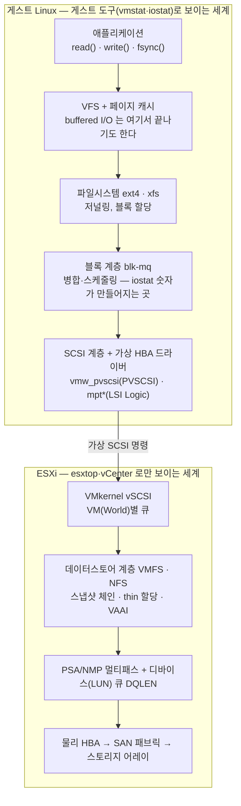

# VMware 게스트(Linux)의 스토리지 I/O — 원리와 점검

VMware vSphere(ESXi) 위에서 도는 Linux VM 의 디스크가 느릴 때, 게스트 안에서 무엇을 보고, 그 숫자가 커널의 어디서 어떻게 만들어지며, 어느 시점부터는 호스트(ESXi) 쪽을 봐야 하는지를 정리한다.
도구 사용법만 나열하지 않고 각 지표의 생성 원리를 함께 다룬다. 원리를 알아야 출력을 읽을 수 있고, "게스트에서 보이는 것"과 "게스트에서는 절대 보이지 않는 것"의 경계를 그을 수 있기 때문이다.

이 문서를 끝까지 읽으면 `vmstat`·`iostat` 의 각 숫자가 어느 커널 카운터에서 오는지 설명할 수 있고, 게스트 지표와 esxtop 지표를 대조해 병목이 게스트 안인지, ESXi 큐인지, 스토리지 어레이인지 가려낼 수 있다.

- [VMware 게스트(Linux)의 스토리지 I/O — 원리와 점검](#vmware-게스트linux의-스토리지-io--원리와-점검)
    - [0. 결론부터](#0-결론부터)
    - [1. I/O 한 번의 전체 여행 — 계층 지도](#1-io-한-번의-전체-여행--계층-지도)
    - [2. 게스트 지표의 출처 — 숫자가 만들어지는 곳](#2-게스트-지표의-출처--숫자가-만들어지는-곳)
        - [2.1 /proc/diskstats — iostat 의 원천](#21-procdiskstats--iostat-의-원천)
        - [2.2 iowait 의 진실](#22-iowait-의-진실)
        - [2.3 vmstat 컬럼의 출처와 의미](#23-vmstat-컬럼의-출처와-의미)
        - [2.4 페이지 캐시 — 읽기는 숨고 쓰기는 몰아친다](#24-페이지-캐시--읽기는-숨고-쓰기는-몰아친다)
        - [2.5 D state 와 hung task](#25-d-state-와-hung-task)
    - [3. VMware 계층의 원리 — 게스트가 못 보는 절반](#3-vmware-계층의-원리--게스트가-못-보는-절반)
        - [3.1 가상 디스크와 가상 컨트롤러](#31-가상-디스크와-가상-컨트롤러)
        - [3.2 ESXi 의 큐와 지연 분해](#32-esxi-의-큐와-지연-분해)
        - [3.3 VMDK 형식과 첫 쓰기 비용](#33-vmdk-형식과-첫-쓰기-비용)
        - [3.4 스냅샷 — 갑자기 느려질 때의 1순위 용의자](#34-스냅샷--갑자기-느려질-때의-1순위-용의자)
        - [3.5 메모리 압박이 디스크 I/O 가 되는 두 경로](#35-메모리-압박이-디스크-io-가-되는-두-경로)
        - [3.6 그 밖의 호스트 측 변수](#36-그-밖의-호스트-측-변수)
    - [4. 게스트 도구 — 사용법과 읽는 법](#4-게스트-도구--사용법과-읽는-법)
        - [4.1 vmstat — 30초 개요](#41-vmstat--30초-개요)
        - [4.2 iostat — 판단의 중심](#42-iostat--판단의-중심)
        - [4.3 pidstat 과 iotop — 누가 내는 I/O 인가](#43-pidstat-과-iotop--누가-내는-io-인가)
        - [4.4 dmesg 와 D state — 에러와 고착](#44-dmesg-와-d-state--에러와-고착)
        - [4.5 sar — 과거로 거슬러 가기](#45-sar--과거로-거슬러-가기)
        - [4.6 ioping 과 fio — 직접 재기](#46-ioping-과-fio--직접-재기)
        - [4.7 심화 — biolatency 히스토그램](#47-심화--biolatency-히스토그램)
        - [4.8 게스트에서 만질 수 있는 튜닝](#48-게스트에서-만질-수-있는-튜닝)
    - [5. ESXi 측 — esxtop 과 vCenter](#5-esxi-측--esxtop-과-vcenter)
        - [5.1 esxtop 디스크 화면 읽기](#51-esxtop-디스크-화면-읽기)
        - [5.2 권한이 없을 때 — 요청 목록](#52-권한이-없을-때--요청-목록)
    - [6. 실무 — 판정과 시나리오](#6-실무--판정과-시나리오)
        - [6.1 판정 매트릭스](#61-판정-매트릭스)
        - [6.2 전형적 시나리오 다섯](#62-전형적-시나리오-다섯)
        - [6.3 에스컬레이션 증거 패키지](#63-에스컬레이션-증거-패키지)
    - [7. 점검 스크립트](#7-점검-스크립트)
    - [참고 자료](#참고-자료)

---

## 0. 결론부터

세 문장으로 줄이면 이렇다.

1. **게스트 안에서 판단의 중심은 `iostat -x` 의 `await`(요청당 평균 지연, ms)와 `aqu-sz`(평균 큐 길이)다.** `vmstat` 의 `wa`·`b` 는 "디스크 쪽을 보라"는 신호등이지 판정 기준이 아니다.
2. **게스트의 await 는 가상 디스크 아래 전체 — ESXi 커널, 데이터스토어, 어레이 — 의 왕복 시간이 한 숫자로 합산된 값이다.** 그래서 게스트 지표만으로는 "느리다"까지만 알 수 있고, "어디가 느린가"는 가를 수 없다.
3. **"어디"는 esxtop 의 지연 분해 `GAVG = KAVG + DAVG` 로 가른다.** KAVG(VMkernel 체류)가 크면 가상화 계층, DAVG(디바이스 왕복)가 크면 스토리지 쪽이다.

판단 흐름은 다음과 같다.

```text
게스트: iostat 의 await 가 높은가?
 ├─ 아니오 → 디스크 문제가 아니다 (CPU·메모리·애플리케이션·네트워크 쪽으로)
 └─ 예 → pidstat 로 부하 주체 확인
      ├─ 게스트 프로세스가 디스크를 포화 (%util≈100 + aqu-sz 증가 + 처리량도 큼)
      │     → 게스트 워크로드·튜닝 문제
      └─ 처리량은 낮은데 지연만 큼
            → 호스트 의심 → esxtop 으로 GAVG/KAVG/DAVG 분해
              ├─ KAVG↑ → ESXi 안 (큐 포화, 스냅샷 체인 처리)
              ├─ DAVG↑ → 데이터스토어 경합·어레이·패브릭
              └─ GAVG 정상인데 게스트 await 만 큼 → 게스트 내부 (블록 계층 큐·드라이버)
```

---

## 1. I/O 한 번의 전체 여행 — 계층 지도

애플리케이션의 `write()` 한 번이 물리 디스크에 닿기까지 거치는 계층이다. **각 계층마다 큐가 있고, 지연은 큐에서 쌓인다.** 진단이란 결국 "어느 계층의 큐에서 시간이 쌓이는가"를 찾는 일이다.



계층별로 들여다보는 도구를 짝지으면 이렇다.

| 계층 | 들여다보는 도구 |
| --- | --- |
| 페이지 캐시·메모리 | `vmstat`(si/so), `free`, `/proc/meminfo` |
| 블록 계층(게스트) | `iostat -x`, `/proc/diskstats`, `biolatency` |
| 프로세스 단위 | `pidstat -d`, `iotop` |
| 가상 SCSI 경계의 이상 | `dmesg`(timeout·abort), D state |
| VMkernel·데이터스토어·어레이 | **esxtop, vCenter 차트** (게스트에서는 불가) |

게스트의 `sda` 는 실제로는 데이터스토어 위의 **VMDK 파일**이다. 게스트가 "디스크"라고 믿는 것의 반대편에 파일시스템(VMFS)·스냅샷·thin 할당·멀티패스가 있다는 사실이, 이 문서 후반(3장)의 모든 내용을 끌고 간다.

---

## 2. 게스트 지표의 출처 — 숫자가 만들어지는 곳

### 2.1 /proc/diskstats — iostat 의 원천

커널 블록 계층은 요청마다 시작·완료 시각을 기록해 디바이스별 **누적 카운터**로 `/proc/diskstats` 에 노출한다. `iostat` 은 새로운 측정을 하는 게 아니라, 두 시점의 카운터 차이(Δ)를 간격으로 나눠 보여줄 뿐이다. 주요 필드는 다음과 같다.

| 필드 | 의미 |
| --- | --- |
| 4 / 8 | 완료된 읽기 / 쓰기 요청 수 |
| 6 / 10 | 읽은 / 쓴 섹터 수 |
| 7 / 11 | 읽기 / 쓰기에 쓰인 누적 시간(ms) — 요청별 (완료 − 시작) 의 합 |
| 12 | 현재 진행 중(in-flight)인 요청 수 |
| 13 | I/O 가 1개라도 떠 있던 누적 시간(ms) — `io_ticks` |
| 14 | in-flight 수를 시간으로 적분한 값(ms·개) — weighted time |

여기서 iostat 의 핵심 지표가 이렇게 계산된다.

| iostat 지표 | 계산 | 뜻 |
| --- | --- | --- |
| `r_await` / `w_await` | Δ필드7 / Δ필드4 (쓰기는 11/8) | 요청 1건의 평균 완료 시간. **큐 대기 + 처리 시간 전부 포함** |
| `%util` | Δ필드13 / 측정 간격 | 요청이 1개라도 떠 있던 시간의 비율 |
| `aqu-sz` | Δ필드14 / 측정 간격 | 평균 동시 진행(in-flight) 요청 수 |

세 지표는 **리틀의 법칙**으로 묶인다: `aqu-sz ≈ IOPS × await(초)`. 예컨대 400 IOPS 에 await 40ms 면 aqu-sz 는 약 16 이어야 정상이다. 이 등식이 크게 어긋나면 측정 구간이 잘못됐거나 부하가 측정 중에 급변한 것이다.

두 가지 함정을 알아야 출력을 바르게 읽는다.

- **%util 은 용량 사용률이 아니다.** "1개라도 떠 있던 시간"이므로, 요청을 수십 개씩 병렬 처리하는 디바이스(NVMe, SAN LUN, 그리고 가상 디스크)는 100% 여도 여유가 남아 있을 수 있다. 포화 판정은 %util 단독이 아니라 await·aqu-sz 의 동반 상승으로 한다. (최신 커널은 io_ticks 자체도 근사 계산이라 정밀값이 아니다.)
- **게스트의 await 는 "가상 디스크에 명령을 던진 뒤 완료 인터럽트가 올 때까지"다.** 즉 ESXi 커널 + 데이터스토어 + 어레이의 왕복이 전부 한 숫자에 합산된다. 게스트 입장에서 그 아래는 블랙박스이고, 이것이 4장과 5장을 나누는 이유다.

### 2.2 iowait 의 진실

`vmstat`·`top` 의 `wa` 는 `/proc/stat` 의 iowait 시간에서 온다. 정의는 "**CPU 가 idle 인데, 그 CPU 에서 발급된 I/O 가 아직 완료되지 않은 시간**"이다. 이 정의 자체에 함정이 두 개 들어 있다.

- **CPU 가 바쁘면 I/O 병목이어도 wa 가 낮게 나온다.** idle 이 없으면 iowait 로 분류될 시간 자체가 없기 때문이다. CPU 만 보면 디스크 병목을 놓친다.
- **CPU 가 한가하면 적은 I/O 로도 wa 가 커 보인다.** 거꾸로 한가한 시스템에서는 wa 30% 가 별것 아닐 수 있다.

`man proc(5)` 도 iowait 값을 신뢰할 수 없다고 명시한다(태스크가 다른 CPU 로 옮겨 가면 집계가 흐트러지는 등). 그래서 **wa 는 "디스크를 보라"는 힌트로만 쓰고, 판정은 await 로 한다.**

### 2.3 vmstat 컬럼의 출처와 의미

```bash
vmstat 1 5    # 1초 간격 5회. 첫 줄은 부팅 이후 평균이라 버린다
```

| 컬럼 | 출처 | 보는 법 |
| --- | --- | --- |
| `r` | 런큐의 실행 대기 태스크 수 | vCPU 수보다 지속적으로 크면 CPU 부족 |
| `b` | **uninterruptible sleep(D state) 태스크 수** | 지속적으로 > 0 이면 I/O 대기 누적 (2.5절) |
| `si` / `so` | 스왑 in / out | 0 이 아니면 메모리 부족이 디스크 I/O 로 전이 중 |
| `bi` / `bo` | 블록 디바이스 읽기/쓰기량 (커널 pgpgin/pgpgout, KiB/s) | bo 가 주기적으로 폭발하는 건 writeback 의 정상 동작 (2.4절) |
| `wa` | iowait (2.2절) | 힌트로만 |
| `st` | steal — 하이퍼바이저가 vCPU 를 안 준 시간 | **VMware 에서는 게스트 커널·ESXi 조합에 따라 항상 0 으로 보고될 수 있다.** 0 이라고 CPU 경합이 없다는 증거가 아니다. 확실한 값은 esxtop 의 %RDY 뿐 |

### 2.4 페이지 캐시 — 읽기는 숨고 쓰기는 몰아친다

buffered I/O(기본값)는 페이지 캐시를 거치므로, 디스크 지표는 애플리케이션의 체감과 자주 어긋난다. 이 메커니즘을 모르면 iostat 출력이 거짓말처럼 보인다.

- **읽기**: 캐시에 있으면 디스크 I/O 가 아예 발생하지 않는다. "애플리케이션은 느리다는데 iostat 은 조용한" 상황이라면 디스크가 아니라 CPU·메모리·잠금 쪽이다. 반대로 호스트 메모리 압박으로 캐시가 줄면(3.5절) 그동안 숨어 있던 읽기가 전부 디스크로 떨어져 갑자기 느려진다.
- **쓰기**: `write()` 는 페이지를 더럽히고(dirty) 즉시 반환된다. 실제 디스크 쓰기는 writeback 스레드가 나중에 몰아서 한다. dirty 페이지가 `vm.dirty_background_ratio`(커널 기본 10%)를 넘으면 백그라운드로 내려쓰기 시작하고, `vm.dirty_ratio`(커널 기본 20%)를 넘으면 **쓰는 프로세스 자체를 멈춰 세운다**(throttling). "평소엔 빠르던 쓰기가 어느 순간 일제히 막히는" 현상과 bo 의 주기적 폭발은 이 구조의 직접적 결과다.
- **fsync()**: 데이터와 저널을 디바이스까지 동기로 밀어내고 기다린다. fsync 1번 = 1장 그림의 전체 스택 왕복. DB(redo/WAL)가 스토리지 지연에 유독 민감한 이유이고, 게스트 await 가 20ms 면 단일 스레드 커밋은 초당 50번을 넘을 수 없다는 산수가 나온다.
- **O_DIRECT**: 페이지 캐시를 우회해 디바이스로 직행한다. fio 로 측정할 때 `direct=1` 을 쓰는 이유 — 캐시 성능이 아니라 디바이스 성능을 재기 위해서다.

### 2.5 D state 와 hung task

D state(`TASK_UNINTERRUPTIBLE`)는 커널이 I/O 완료를 기다리는 동안 시그널조차 받지 않는 상태다. `kill -9` 가 안 듣는 프로세스의 정체가 보통 이것이다. 짧은 D 는 모든 I/O 에서 정상이고, **지속되는 D 가 비정상**이다.

```bash
ps -eo state,pid,wchan:24,cmd | awk 'NR==1 || $1 ~ /^D/'
# wchan = 커널 안 어느 함수에서 잠들어 있는지. io_schedule, folio_wait_bit 류면 디스크 대기
```

커널의 khungtaskd 는 D state 가 `kernel.hung_task_timeout_secs`(기본 120초) 이상 지속되면 로그를 남긴다.

```text
INFO: task jbd2/sda1-8:312 blocked for more than 120 seconds.
```

이 메시지는 "스토리지가 2분 동안 응답하지 않았다"는 강한 증거다. 이 수준이면 게스트 안에서 더 볼 것이 없고, 호스트·스토리지 경로 장애를 의심해야 한다.

---

## 3. VMware 계층의 원리 — 게스트가 못 보는 절반

### 3.1 가상 디스크와 가상 컨트롤러

게스트의 디스크는 데이터스토어(VMFS·NFS·vSAN) 위의 VMDK 파일이고, 게스트와 그 파일 사이에 **가상 스토리지 컨트롤러**가 있다. 어떤 컨트롤러냐에 따라 게스트 쪽 큐 깊이와 CPU 비용이 달라진다.

| 컨트롤러 | 방식 | 특성 |
| --- | --- | --- |
| LSI Logic SAS | 실물 HBA 에뮬레이션 | 기본값·호환성 우선. 명령마다 가상화 개입(VM exit)이 많고 큐가 작다 |
| **PVSCSI (Paravirtual)** | 반가상화 — 게스트 드라이버(`vmw_pvscsi`)가 공유 링으로 하이퍼바이저와 직접 통신 | I/O 당 CPU 비용 낮고 큐가 크다(통상 디바이스 64 / 어댑터 254, 모듈 파라미터로 확장 가능 — KB 2053145). I/O 집약 VM 의 관례적 선택 |
| vNVMe | NVMe 에뮬레이션 (vSphere 6.5+) | 다중 큐. 매우 높은 IOPS 워크로드용 |

게스트에서 현재 상태 확인:

```bash
lsmod | grep -E "vmw_pvscsi|mptspi|mpt3sas"      # 어떤 드라이버를 쓰는가
cat /sys/block/sda/device/queue_depth             # SCSI 디바이스 큐 깊이
cat /sys/block/sda/queue/nr_requests              # 블록 계층 큐 크기
cat /sys/block/sda/queue/scheduler                # I/O 스케줄러
```

### 3.2 ESXi 의 큐와 지연 분해

게스트가 던진 명령은 ESXi 안에서 다시 여러 큐를 지난다: **VM(World)별 큐 → 어댑터 큐(AQLEN) → 디바이스/LUN 큐(DQLEN, 보통 32~64)**. 여러 VM 이 한 LUN 을 공유하면 VM 당 발급량을 `Disk.SchedNumReqOutstanding`(기본 32)으로 다시 제한한다. 어느 큐든 차면 명령은 그 앞에서 대기한다.

esxtop 은 이 구간의 지연을 셋으로 분해해 준다. 이것이 호스트 측 진단의 전부라 해도 과언이 아니다.

```text
GAVG  =  KAVG  +  DAVG
 │        │        └─ Device latency: ESXi 드라이버가 명령을 내보내고
 │        │           어레이에서 돌아올 때까지 (HBA·패브릭·어레이)
 │        └─ Kernel latency: VMkernel 안에서 보낸 시간.
 │           대부분 큐 대기(QAVG)이며, 스냅샷·VMFS 처리도 여기 포함
 └─ Guest latency: 게스트가 체감하는 총 지연
```

통상적인 판정 기준(KB 1008205 계열의 관례)은 다음과 같다.

| 지표 | 정상 | 비정상 신호 | 가리키는 곳 |
| --- | --- | --- | --- |
| GAVG | 워크로드별 상이 | 20~30ms 이상 지속 | 아래 둘 중 어디인지 분해 |
| KAVG | ≈ 0~1ms | 2ms 이상 | ESXi 큐 포화(큐 깊이·DSNRO), 스냅샷 처리 |
| DAVG | 어레이 성격에 따름 | 20~25ms 이상 | 어레이·패브릭·데이터스토어 경합 |
| QAVG | ≈ 0 | > 0 지속 | 큐 대기 발생 중 |

그리고 게스트 지표와의 관계: **게스트의 await ≈ GAVG + 게스트 내부 블록 계층 대기.** 이 비교가 진단의 분수령이다.

- await 와 GAVG 가 **둘 다 높고 비슷** → 병목은 호스트 아래. KAVG/DAVG 로 더 내려간다.
- await 는 높은데 GAVG 는 **정상** → 시간이 게스트 안에서 쌓이고 있다(게스트 큐 깊이, 드라이버, 스케줄러).

### 3.3 VMDK 형식과 첫 쓰기 비용

VMDK 는 공간 할당과 zeroing(보안상 이전 데이터 노출을 막기 위해 블록을 0 으로 채우는 일) 시점에 따라 세 형식이 있고, 이 차이가 "**새로 만든 디스크가 처음에만 느린**" 미스터리의 정체다.

| 형식 | 공간 할당 | zeroing | 첫 쓰기 비용 |
| --- | --- | --- | --- |
| thin | 쓸 때마다 증분 | 첫 쓰기 시 | 할당 + zeroing — 가장 큼 |
| thick lazy zeroed | 생성 시 전부 | 첫 쓰기 시 | 블록마다 처음 닿을 때 zeroing |
| **thick eager zeroed** | 생성 시 전부 | 생성 시 전부 | 없음 — 쓰기 지연 민감(DB 로그) 디스크의 관례 |

어레이가 VAAI(Block Zeroing·ATS)를 지원하면 zeroing 과 잠금이 어레이로 오프로드되어 페널티가 크게 준다. 벤치마크를 새 디스크에서 돌리면 첫 패스만 느리게 나오는 것도 같은 이유다 — 측정 전에 한 번 채우고 재는 것이 옳다.

### 3.4 스냅샷 — 갑자기 느려질 때의 1순위 용의자

스냅샷의 실체는 백업본이 아니라 **redo log** 다. 스냅샷을 만들면 원본 VMDK 는 그 시점에 동결되고, 이후의 모든 쓰기는 delta 파일(vmfsSparse/SEsparse)로 들어간다. 읽기는 최신 delta 부터 체인을 거슬러 내려가며 해당 블록의 최신본을 찾는다.

여기서 따라 나오는 결과들:

- 체인이 길수록, delta 가 클수록 읽기·쓰기 모두 나빠진다. delta 는 grain 단위 메타데이터를 끼고 동작하므로 쓰기 증폭도 있다.
- 스냅샷 **삭제(consolidation)** 는 delta 를 원본에 합치는 대량 I/O 작업이라, 지우는 동안이 오히려 더 느릴 수 있다.
- 스냅샷 비용은 VMkernel 안에서 발생하므로 esxtop 에서는 주로 KAVG 쪽이 부풀고, 증폭된 I/O 때문에 DAVG 도 함께 오를 수 있다.

실무에서 가장 흔한 패턴은 **백업 솔루션(VADP 계열)이 백업 동안 만드는 스냅샷**이다. 백업 창 동안 지연이 튀고, 간혹 백업 후 스냅샷이 지워지지 않은 채 남아 만성 저하가 된다. "**야간·특정 시간대만 느리다**"면 1순위로 이것을 의심한다. 스냅샷의 존재는 게스트 안에서는 전혀 보이지 않으므로 반드시 관리자 확인이 필요하다.

### 3.5 메모리 압박이 디스크 I/O 가 되는 두 경로

호스트(ESXi) 메모리가 부족하면 그 압박이 게스트의 디스크 I/O 로 전이된다. 경로가 둘 있다.

- **Ballooning**: 게스트 안의 vmmemctl 드라이버(풍선)가 메모리를 점유해 호스트에 반납한다. 게스트 커널은 남은 메모리로 살아야 하므로 스스로 캐시를 줄이고 스왑을 시작한다. 게스트가 "무엇을 버릴지" 직접 고르므로 둘 중에는 차악이다.
- **Hypervisor swap**: 호스트가 게스트 모르게 VM 메모리를 `.vswp` 파일로 스왑한다. 게스트의 워킹셋을 모른 채 내리므로 최악이고, 게스트 입장에선 "메모리 접근이 디스크 속도가 되는" 영문 모를 느려짐으로 나타난다.

둘 다 결과는 **스왑 I/O 증가 + 페이지 캐시 축소(읽기 히트율 하락)** 의 이중 타격이다. 게스트에서 다음으로 확인할 수 있다.

```bash
vmware-toolbox-cmd stat balloon   # 0 이 아니면 호스트가 메모리를 회수 중
vmware-toolbox-cmd stat swap      # 하이퍼바이저 스왑 — 0 이 아니면 심각
```

게스트의 `vmstat` 에서 si/so 가 움직이는 것과 balloon > 0 이 겹치면, 원인은 게스트가 아니라 호스트 메모리 부족이다.

### 3.6 그 밖의 호스트 측 변수

- **Noisy neighbor**: 같은 데이터스토어/LUN 을 쓰는 다른 VM 의 부하. 내 VM 은 한가한데 DAVG 가 높은 전형적 원인. SIOC(Storage I/O Control)가 있으면 완화된다.
- **호스트 작업 시간대**: Storage vMotion, 백업, 복제 작업이 도는 동안의 일시적 경합.
- **CPU 경합**: vCPU 가 스케줄되지 못하면(%RDY 높음) I/O 의 발급과 완료 인터럽트 처리도 늦어진다. "디스크가 느려 보이는데 사실은 CPU 경합"인 패턴이 있고, 게스트의 st 가 0 이어도 배제할 수 없다(2.3절).
- **경로 장애**: 멀티패스 페일오버 중의 지연. 게스트 dmesg 의 timeout/abort 와 짝지어 나타난다.

---

## 4. 게스트 도구 — 사용법과 읽는 법

`iostat`·`pidstat`·`sar` 는 sysstat 패키지에 들어 있다 (`dnf/apt install sysstat`).

### 4.1 vmstat — 30초 개요

```bash
vmstat 1 5
```

```text
procs -----------memory---------- ---swap-- -----io---- -system-- -------cpu-------
 r  b   swpd   free   buff  cache   si   so    bi    bo   in   cs us sy id wa st
 1  3      0 812340  20480 3145728    0    0   120  8400 1200 2100 12  5 58 25  0
```

읽는 순서: `b`(D state 누적?) → `si/so`(스왑?) → `wa`(I/O 대기 힌트?) → `st`(steal — 단 VMware 에선 0 이어도 무의미할 수 있음). 위 예시는 b=3, wa=25 로 "디스크를 보라"는 신호다. 판정은 다음 단계인 iostat 으로 넘긴다.

### 4.2 iostat — 판단의 중심

```bash
iostat -xz 1 5    # -x 확장 통계, -z 유휴 디바이스 생략. 역시 첫 출력은 부팅 이후 평균
```

```text
Device   r/s   w/s   rkB/s    wkB/s  r_await  w_await  aqu-sz  %util
sdb     20.0 380.0   320.0  24320.0     8.10    42.30    16.2   98.4
```

| 컬럼 | 뜻 | 읽는 법 |
| --- | --- | --- |
| `r/s` `w/s` | 초당 완료 요청 수(IOPS) | 부하의 절대량 |
| `rkB/s` `wkB/s` | 처리량 | 처리량 대비 지연을 본다 |
| `r_await` `w_await` | 요청당 평균 지연(ms), 큐 대기 포함 | **핵심.** 통상 로컬 SSD/NVMe 1~5ms, SAN 5~20ms 면 정상권, 수십 ms 지속이면 병목 |
| `aqu-sz` | 평균 in-flight 수 (구버전 `avgqu-sz`) | 지속 증가 = 디바이스가 못 따라감 |
| `%util` | 바쁜 시간 비율 | 포화의 필요조건일 뿐 (2.1절 함정). 구버전의 `svctm` 은 무의미해서 제거된 값이니 무시 |

위 예시를 해석하면: 쓰기 380 IOPS 에 w_await 42ms — SAN 기준으로도 높다. 정합성 검증: 400 IOPS × 0.041s ≈ 16.2 = aqu-sz, 리틀의 법칙과 일치하므로 측정은 믿을 만하다. 처리량 24MB/s 는 대단치 않은데 지연이 크므로, "게스트가 디스크를 갈아 넣는" 그림이 아니라 **아래 계층이 느린** 그림에 가깝다 → esxtop 대조가 필요한 상황.

### 4.3 pidstat 과 iotop — 누가 내는 I/O 인가

```bash
pidstat -d 1 5     # 프로세스별 kB_rd/s, kB_wr/s, iodelay
iotop -obP         # 실제 I/O 중인 프로세스만 갱신 표시 (root)
```

`iodelay` 는 그 프로세스가 I/O 완료를 기다리며 막혀 있던 시간(클럭 틱)이다. **kB/s 는 작은데 iodelay 가 큰 프로세스**가 "지연의 피해자"이고(fsync 하는 DB 가 전형), kB/s 가 큰 프로세스가 "부하의 가해자"다. 둘이 다른 프로세스라면 가해자를 옮기거나 묶는 게 처방이 된다.

### 4.4 dmesg 와 D state — 에러와 고착

```bash
dmesg -T | grep -iE "i/o error|timeout|task abort|reset|blocked for more than"
```

| 메시지 | 의미 |
| --- | --- |
| `sd 0:0:1:0: timing out command` / `task abort` | 가상 SCSI 명령이 제한 시간 내 완료되지 않아 게스트가 중단 요청 — 아래 계층 무응답. esxtop 의 ABRTS/s 와 짝 |
| `I/O error, dev sdb` | 명령이 실패로 반환됨 — 경로·디바이스 장애 |
| `blocked for more than 120 seconds` | 2.5절의 hung task. 스토리지가 분 단위로 멈췄다는 뜻 |

이 류의 메시지가 있으면 성능 튜닝의 영역이 아니라 **장애 추적**의 영역이고, 곧장 호스트·스토리지 팀과 봐야 한다.

### 4.5 sar — 과거로 거슬러 가기

sysstat 의 수집 타이머(통상 10분 간격)가 켜져 있으면 `/var/log/sa/saNN`(NN=일자)에 이력이 쌓인다. "언제부터 느려졌는가"를 특정해 호스트 이벤트(백업 창, 다른 VM 배치)와 대조하는 데 쓴다.

```bash
sar -d -p              # 오늘의 디바이스별 await·util 이력
sar -d -p -f /var/log/sa/sa28    # 특정 일자
sar -u -f /var/log/sa/sa28       # 그날의 iowait 추이
```

### 4.6 ioping 과 fio — 직접 재기

관측이 아니라 **부하를 직접 넣어** 재는 도구이므로, 운영 장비에서는 시점과 강도를 가려서 쓴다.

```bash
ioping -D -c 10 /var/lib/mysql    # -D 는 O_DIRECT — 캐시가 아니라 디바이스를 잰다
```

fio 는 같은 도구로 **지연**과 **처리량**이라는 다른 질문을 잰다. 차이는 `iodepth` 다.

```bash
# 질문 1: "요청 하나가 얼마나 걸리나" — 순수 지연. 큐 대기가 없도록 iodepth=1
fio --name=lat --filename=/data/fio.test --size=1G --direct=1 \
    --rw=randread --bs=4k --iodepth=1 --runtime=30 --time_based --group_reporting

# 질문 2: "최대 얼마나 받아 주나" — 용량. 큐를 채워서 잰다
fio --name=iops --filename=/data/fio.test --size=1G --direct=1 \
    --rw=randread --bs=4k --iodepth=32 --numjobs=4 --runtime=30 --time_based --group_reporting

rm /data/fio.test    # 테스트 파일 정리
```

iodepth=1 의 평균 지연이 곧 그 경로의 바닥 지연이고, iodepth 를 올리면 IOPS 는 늘되 지연도 같이 는다(리틀의 법칙 그대로). 쓰기 테스트(`--rw=randwrite`)는 반드시 데이터 파일 경로에만, 운영 시간 피해서.

### 4.7 심화 — biolatency 히스토그램

평균(await)은 분포를 숨긴다. 평균 5ms 뒤에 p99 200ms 가 숨어 있거나, "빠른 다수 + 느린 소수"의 이중 봉우리가 있을 수 있다. bcc-tools 의 biolatency 는 블록 I/O 지연을 히스토그램으로 보여 준다.

```bash
dnf/apt install bcc-tools
/usr/share/bcc/tools/biolatency 10 1    # 10초 수집한 분포
/usr/share/bcc/tools/biosnoop           # 개별 I/O 단위 추적 (프로세스·지연·섹터)
```

스냅샷 체인이나 thin 첫 쓰기처럼 "일부 요청만 비싼" 문제는 평균보다 분포에서 먼저 드러난다.

### 4.8 게스트에서 만질 수 있는 튜닝

순서가 중요하다. **병목 위치를 먼저 확인하고, 그 계층을 튜닝한다.** 호스트가 병목일 때 게스트 튜닝은 무력하다.

- **I/O 스케줄러**: 가상 디스크에는 `none`(또는 `mq-deadline`)이 관례다. ESXi 가 어차피 자기 계층에서 다시 스케줄링하므로 게스트의 재정렬·대기는 이득이 적다. 배포판이 가상 디스크를 감지해 이미 그렇게 두는 경우도 많으니 확인부터: `cat /sys/block/sdX/queue/scheduler`
- **컨트롤러를 PVSCSI 로**: I/O 집약 VM 의 기본기. 필요하면 큐 확장(`vmw_pvscsi.cmd_per_lun`, `ring_pages` — KB 2053145)
- **디스크 분리**: OS / 데이터 / 로그를 별도 VMDK 로, 많이 쓰면 가상 컨트롤러도 나눠서(컨트롤러별 큐가 따로 논다)
- **read_ahead_kb**: 대량 순차 읽기 워크로드면 상향 검토
- 게스트 큐 깊이(`queue_depth`, `nr_requests`)는 aqu-sz 가 큐 깊이에 붙어 다닐 때만 의미 있는 손잡이다

---

## 5. ESXi 측 — esxtop 과 vCenter

### 5.1 esxtop 디스크 화면 읽기

ESXi 쉘(SSH)에서 `esxtop` 실행 후:

| 키 | 화면 | 용도 |
| --- | --- | --- |
| `d` | 어댑터(HBA)별 | 어댑터 큐(AQLEN)·경로 수준 |
| `u` | 디바이스(LUN/데이터스토어)별 | **DQLEN, DAVG/KAVG 분해의 본진** |
| `v` | VM(가상 디스크)별 | 어느 VM 이 부하·지연을 보는지 |

```text
DEVICE                DQLEN  ACTV  QUED  CMDS/s  DAVG/cmd  KAVG/cmd  GAVG/cmd  QAVG/cmd
naa.600601...            64    64    12    1850     28.11      4.52     32.63      4.21
```

읽는 법: ACTV 가 DQLEN 에 붙어 있고 QUED > 0 — 디바이스 큐가 가득 차 대기가 생기는 중(KAVG 4.5ms 로 확인). 동시에 DAVG 28ms — 어레이 왕복 자체도 느리다. 즉 이 예시는 "어레이가 느려서 큐까지 밀리는" 그림이다. `ABRTS/s`·`RESETS/s` 가 0 이 아니면 게스트 dmesg 의 timeout/abort 와 같은 사건을 호스트에서 보고 있는 것이다. (NFS 데이터스토어는 LUN 큐 개념이 없어 이 분해가 그대로 적용되지 않는다.)

### 5.2 권한이 없을 때 — 요청 목록

ESXi 접근 권한이 없으면 vSphere 관리자에게 다음을 시간대와 함께 요청한다. vCenter 차트 경로는 VM → Monitor → Performance → Advanced.

1. 해당 시간대 이 VM 의 **Virtual disk Highest latency / Datastore latency** 차트
2. 같은 데이터스토어를 쓰는 **다른 VM 들의 부하** (noisy neighbor 여부)
3. 이 VM 의 **스냅샷 존재 여부와 생성 시각** (백업 잔존 스냅샷 포함)
4. 호스트 메모리 상태 — **balloon / swap 발생 여부**
5. 그 시간대의 **백업·Storage vMotion 등 작업 이력**

6.3 절의 증거 패키지를 함께 넘기면 대화가 한 번에 끝난다.

---

## 6. 실무 — 판정과 시나리오

### 6.1 판정 매트릭스

| 관측 조합 | 가리키는 방향 |
| --- | --- |
| await↑ + %util≈100 + aqu-sz↑ + pidstat 에 고처리량 프로세스 | 게스트 워크로드가 디스크 포화 — 워크로드 분산·튜닝 |
| await 수십 ms 인데 IOPS·처리량은 낮음 | 호스트 아래가 느림 — esxtop 분해로 |
| 게스트 await ≈ GAVG 높음, **DAVG 가 대부분** | 어레이·패브릭·데이터스토어 경합 — 스토리지 팀 |
| 게스트 await ≈ GAVG 높음, **KAVG 가 큼** | ESXi 큐 포화 또는 스냅샷 체인 |
| await 높은데 **GAVG 는 정상** | 게스트 내부 — 큐 깊이·스케줄러·드라이버 |
| si/so > 0 또는 balloon/swap > 0 | 메모리 압박의 I/O 전이 — 메모리 쪽이 진짜 원인 |
| b 지속 > 0 + "blocked for more than 120s" | 스토리지 응답 정지 — 장애 추적으로 전환 |
| wa 높은데 await 정상 | I/O 양이 많을 뿐. CPU 가 한가하면 wa 는 과장된다 |
| 앱은 느린데 iostat 조용 | 디스크 아님 — CPU·메모리·잠금·네트워크 |

### 6.2 전형적 시나리오 다섯

1. **야간·특정 시간대만 느림** → 백업 스냅샷(3.4절)과 백업 트래픽부터. sar 이력으로 시간대를 특정해 백업 스케줄과 대조.
2. **새로 추가한 디스크가 처음에만 느림** → thin/lazy zeroed 의 첫 쓰기 zeroing(3.3절). 한 번 채워지면 정상화된다. 벤치마크도 같은 함정.
3. **전반적으로 느려졌고 si/so·balloon 이 움직임** → 호스트 메모리 압박(3.5절). 디스크 튜닝이 아니라 호스트 메모리·VM 배치의 문제.
4. **내 VM 은 한가한데 await·DAVG 가 높음** → 데이터스토어 noisy neighbor 또는 어레이 쪽. 게스트에서 할 일 없음 — 증거 패키지로 에스컬레이션.
5. **GAVG 는 정상인데 게스트 await 만 높음** → 게스트 내부. 큐 깊이가 작은 LSI 컨트롤러에 부하가 몰렸거나, 단일 큐에 fsync 직렬화. PVSCSI 전환·디스크 분리 검토(4.8절).

### 6.3 에스컬레이션 증거 패키지

"디스크가 느려요"는 기각되지만 "이 시간대에 await 가 평소 5ms 에서 80ms 로 뛰었다"는 움직인다. 인프라 팀에 넘길 묶음:

- **시간 창**: 언제부터 언제까지 (sar 이력으로 특정)
- `vmstat 1 30`, `iostat -xz 1 30` 캡처 (문제 시점)
- `dmesg` 의 timeout/abort/hung task 발췌
- `pidstat -d` 로 본 부하 주체 (게스트 내부 원인 배제 근거)
- `ioping -D` 재현 수치 (평상시 대비)
- 요청 사항: 5.2절의 5개 항목

---

## 7. 점검 스크립트

같은 디렉터리에 점검 도구 두 개를 둔다.

- [vm_io_health.sh](./vm_io_health.sh) — 위 1차 점검을 한 번에 도는 **일회성** 스크립트 (아래 본문 수록)
- [vm_os_watch.sh](./vm_os_watch.sh) — `watch -n 1` 처럼 1초 주기로 화면을 갱신하는 **상주** 모니터. 임계값 초과 시 노랑(주의)/빨강(위험)으로 칠하고 `/tmp/vm_os_watch_alerts.log` 에 시각과 함께 이력을 남긴다(화면을 안 보던 사이의 스파이크 대비). 각 수치의 의미와 임계값은 스크립트 상단 주석에 정리돼 있고, 해석 원리는 이 문서의 2~3장이 근거다.

vm_io_health.sh 본문:

```bash
#!/bin/bash
# vm_io_health.sh — VMware 게스트(Linux) 스토리지 I/O 1차 점검
# 사용법: sudo bash vm_io_health.sh [점검할 마운트포인트(기본 /)]
# 출력: 화면 + /tmp/io-health-<일시>.log

TARGET="${1:-/}"
exec > >(tee "/tmp/io-health-$(date +%F-%H%M%S).log") 2>&1

sec() { printf '\n========== %s ==========\n' "$1"; }

sec "0. 기본 정보 (커널·디스크·큐 설정)"
uname -r
lsblk -o NAME,SIZE,TYPE,MOUNTPOINTS 2>/dev/null || lsblk
for d in /sys/block/sd* /sys/block/nvme*; do
    [ -e "$d" ] || continue
    printf '%s: scheduler=%s queue_depth=%s nr_requests=%s\n' \
        "${d##*/}" \
        "$(cat "$d/queue/scheduler" 2>/dev/null)" \
        "$(cat "$d/device/queue_depth" 2>/dev/null)" \
        "$(cat "$d/queue/nr_requests" 2>/dev/null)"
done

sec "1. 개요 — vmstat (b·si/so·wa·st)"
vmstat 1 5

sec "2. 디바이스별 지연·큐·사용률 — iostat"
iostat -xz 1 3 2>/dev/null || { echo "sysstat 미설치 (dnf/apt install sysstat). 원시값:"; cat /proc/diskstats; }

sec "3. 프로세스별 I/O — pidstat"
pidstat -d 1 3 2>/dev/null || echo "sysstat 미설치"

sec "4. D state 프로세스"
ps -eo state,pid,wchan:24,cmd | awk 'NR==1 || $1 ~ /^D/'

sec "5. 커널 로그의 디스크 에러"
dmesg -T 2>/dev/null | grep -iE "i/o error|timeout|task abort|reset|blocked for more than" | tail -20

sec "6. 용량·inode"
df -h; echo; df -i

sec "7. VMware 메모리 압박 — balloon·swap"
if command -v vmware-toolbox-cmd >/dev/null 2>&1; then
    echo "balloon: $(vmware-toolbox-cmd stat balloon)"
    echo "swap   : $(vmware-toolbox-cmd stat swap)"
else
    echo "open-vm-tools 미설치"
fi

sec "8. 실측 지연 — ioping ($TARGET)"
if command -v ioping >/dev/null 2>&1; then
    ioping -D -c 5 "$TARGET" || ioping -c 5 "$TARGET"
else
    echo "ioping 미설치 (dnf/apt install ioping)"
fi
```

---

## 참고 자료

- Linux 커널 문서 — [I/O statistics fields](https://www.kernel.org/doc/html/latest/admin-guide/iostats.html) (`/proc/diskstats` 필드 정의)
- `man proc(5)` — `/proc/stat` iowait 의 신뢰성 경고
- `man iostat(1)`, `vmstat(8)`, `pidstat(1)`, `sar(1)`, `fio(1)`, `ioping(1)`
- VMware KB [1008205](https://knowledge.broadcom.com/external/article?legacyId=1008205) — Using esxtop to identify storage performance issues (GAVG/KAVG/DAVG)
- VMware KB [2053145](https://knowledge.broadcom.com/external/article?legacyId=2053145) — PVSCSI 큐 깊이 확장
- Brendan Gregg, *Systems Performance* (2nd ed.) — USE Method, 디스크 분석 장
