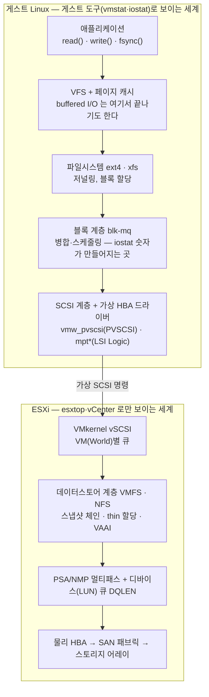

# VMware 게스트(Linux)의 스토리지 I/O — 입문·원리·도구·실무 단일 정리본

VMware vSphere(ESXi) 위에서 도는 Linux VM(주 환경: Oracle Linux 8, HPE ProLiant DL380 Gen10 호스트, Dell EMC 어레이)의 디스크가 느릴 때 — 무엇을 보고, 그 숫자가 어디서 어떻게 만들어지며, 어느 시점부터 호스트(ESXi)·스토리지 쪽을 봐야 하는지를 한 권으로 정리한다.
사전 지식이 없는 사람의 입문(1장)부터, 지표의 생성 원리(2~4장), 인프라팀과의 용어 통역(5장), 명령·도구 사전(6~8장), 실무 판정(9~10장), 학습법(11장)까지 순서대로 쌓이도록 구성했다.

같은 디렉터리의 실행물 세 개가 이 문서와 짝이다.

- [vm_io_health.sh](./vm_io_health.sh) — 일회성 1차 점검 (부록 A)
- [vm_os_watch.sh](./vm_os_watch.sh) — 1초 주기 상주 모니터 (8장)
- [vm_os_lab.sh](./vm_os_lab.sh) — 원리를 직접 목격하는 부하 실험 (11장)

- [VMware 게스트(Linux)의 스토리지 I/O — 입문·원리·도구·실무 단일 정리본](#vmware-게스트linux의-스토리지-io--입문원리도구실무-단일-정리본)
    - [0. 이 문서를 읽는 법, 그리고 결론부터](#0-이-문서를-읽는-법-그리고-결론부터)
    - [1. 입문 — 푸드코트로 이해하는 서버와 I/O](#1-입문--푸드코트로-이해하는-서버와-io)
    - [2. I/O 한 번의 전체 여행 — 계층 지도](#2-io-한-번의-전체-여행--계층-지도)
    - [3. 게스트 지표의 출처 — 숫자가 만들어지는 곳](#3-게스트-지표의-출처--숫자가-만들어지는-곳)
    - [4. VMware 계층의 원리 — 게스트가 못 보는 절반](#4-vmware-계층의-원리--게스트가-못-보는-절반)
    - [5. "VIO" 통역 — 인프라팀의 말과 실제 장비](#5-vio-통역--인프라팀의-말과-실제-장비)
    - [6. 게스트 명령 사전](#6-게스트-명령-사전)
    - [7. esxtop — 호스트 측](#7-esxtop--호스트-측)
    - [8. 상주 모니터 — vm\_os\_watch.sh](#8-상주-모니터--vm_os_watchsh)
    - [9. 실무 — 5분 점검, 판정, 에스컬레이션](#9-실무--5분-점검-판정-에스컬레이션)
    - [10. 사례 해체 — "스왑 I/O 발생" 경보](#10-사례-해체--스왑-io-발생-경보)
    - [11. 제대로 이해하려면 — 실험과 학습 경로](#11-제대로-이해하려면--실험과-학습-경로)
    - [부록 A. 일회성 점검 — vm\_io\_health.sh](#부록-a-일회성-점검--vm_io_healthsh)
    - [부록 B. 참고 자료](#부록-b-참고-자료)

---

## 0. 이 문서를 읽는 법, 그리고 결론부터

상황별 진입점:

| 지금 상황 | 여기로 |
| --- | --- |
| 사전 지식이 없다 — 처음부터 차근차근 | 1장 (비유 하나로 끝까지) |
| 서버가 느리다는 신고를 받았다 — 당장 | 9.1 (5분 점검) → 9.2 (판정 매트릭스) |
| 인프라팀이 "VIO" 라고 말했다 | 5장 (통역 사전) |
| vmstat/iostat 출력을 읽어야 한다 | 6.1 / 6.2 |
| 모니터를 띄워 두고 싶다 | 8장 |
| 원리를 제대로 이해하고 싶다 | 2→3→4장, 그리고 11장의 실험 |

전체 결론을 세 문장으로 줄이면:

1. **게스트 안에서 판단의 중심은 `iostat -x` 의 `await`(요청당 평균 지연, ms)와 `aqu-sz`(평균 큐 길이)다.** `vmstat` 의 `wa`·`b` 는 "디스크 쪽을 보라"는 신호등이지 판정 기준이 아니다.
2. **게스트의 await 는 가상 디스크 아래 전체 — ESXi 커널, 데이터스토어, 어레이 — 의 왕복 시간이 한 숫자로 합산된 값이다.** 게스트 지표만으로는 "느리다"까지만 알 수 있고, "어디가 느린가"는 가를 수 없다.
3. **"어디"는 esxtop 의 지연 분해 `GAVG = KAVG + DAVG` 로 가른다.** KAVG(VMkernel 체류)가 크면 가상화 계층, DAVG(디바이스 왕복)가 크면 스토리지 쪽이다.

판단 흐름:

```text
게스트: iostat 의 await 가 높은가?
 ├─ 아니오 → 디스크 문제가 아니다 (CPU·메모리·애플리케이션·네트워크 쪽으로)
 └─ 예 → pidstat 로 부하 주체 확인
      ├─ 게스트 프로세스가 디스크를 포화 (%util≈100 + aqu-sz 증가 + 처리량도 큼)
      │     → 게스트 워크로드·튜닝 문제
      └─ 처리량은 낮은데 지연만 큼
            → 호스트 의심 → esxtop 으로 GAVG/KAVG/DAVG 분해
              ├─ KAVG↑ → ESXi 안 (큐 포화, 스냅샷 체인 처리)
              ├─ DAVG↑ → 데이터스토어 경합·어레이·패브릭
              └─ GAVG 정상인데 게스트 await 만 큼 → 게스트 내부 (블록 계층 큐·드라이버)
```

---

## 1. 입문 — 푸드코트로 이해하는 서버와 I/O

사전 지식 없이 읽는 장이다. 비유 하나(푸드코트)를 끝까지 끌고 가서, 마지막에 실제 모니터 화면을 같이 읽는다. 이미 익숙하다면 2장으로 건너뛰어도 된다.

### 1.1 컴퓨터 한 대는 식당이다

식당에는 세 가지가 있다.

- **요리사** — 실제로 일을 하는 사람. 컴퓨터에서는 **CPU**.
- **조리대** — 지금 쓰는 재료와 도구를 올려놓는 곳. 좁지만 손만 뻗으면 닿는다. 컴퓨터에서는 **메모리(RAM)**.
- **창고** — 모든 재료가 보관된 곳. 넓지만 걸어갔다 와야 한다. 컴퓨터에서는 **디스크(저장장치)**.

속도 차이가 어마어마하다는 게 핵심이다. 조리대(메모리)는 손 뻗는 시간이면 되고, 창고(디스크)는 다녀오는 데 수천 배에서 수십만 배 오래 걸린다.
**그래서 컴퓨터 성능 문제의 단골은 거의 항상 "창고 가는 길"이다.** 이 문서 전체가 그 길 이야기다.

창고에 다녀오는 일을 **I/O** 라고 부른다 (Input/Output, 넣고 꺼내기). 창고에서 **가져오기** = 읽기(read), 창고에 **갖다 놓기** = 쓰기(write).

> 생각해 보기 — 요리사가 아무리 빨라도 식당이 느릴 수 있다. 어떤 경우일까?
> (답: 재료가 창고에서 안 와서 요리사가 기다릴 때. CPU 가 놀아도 디스크가 느리면 전체가 느리다.)

### 1.2 빠름에는 두 종류가 있다 — 지연과 처리량

택배로 비유하면 바로 구분된다.

- **지연 (latency)** — 주문하고 **도착까지 걸리는 시간**. "하루 만에 와요."
- **처리량 (throughput)** — 한 번에 **나르는 양**. "트럭이 커서 한 번에 천 상자 가요."

둘은 다른 개념이다. 트럭이 아무리 커도(처리량 높음) 도착이 일주일 걸리면(지연 큼) 급한 사람에겐 느린 것이다.

컴퓨터 화면에서 이 둘은 이렇게 나타난다.

- 지연 = **await** — 심부름(I/O) 한 번 갔다 오는 평균 시간. 단위는 ms(천분의 1초). **이 문서 전체에서 가장 중요한 숫자.**
- 처리량 = **MB/s** — 초당 나르는 데이터 양.

그리고 심부름꾼이 바빠서 못 받으면 주문서가 쌓인다. 그 줄의 길이가 **큐(queue)** 다. 화면에서는 **aqu** 로 표시된다.
줄이 계속 길어진다 = 심부름꾼(디스크)이 주문 속도를 못 따라간다는 신호다.

### 1.3 요리사의 하루 — CPU 수치

요리사(CPU)의 시간은 네 가지로 나뉜다. 모니터의 CPU 항목이 정확히 이 구분이다.

| 화면 표기 | 푸드코트 번역 |
| --- | --- |
| 사용자 코드 실행 (us) | 진짜 요리를 한 시간 |
| 커널 코드 실행 (sy) | 주방 행정 — 주문서 정리, 창고에 심부름 보내는 절차 같은 관리 업무 |
| I/O 완료 대기 (wa) | **재료를 기다리느라 멍하니 논 시간** |
| 유휴 (id) | 그냥 논 시간 |

여기 함정이 하나 있다. wa(재료 기다림)는 "**놀면서** 기다린 시간"만 센다.
요리사가 다른 요리로 바쁘면, 재료를 기다리고 있어도 wa 에 안 잡힌다. 반대로 한가한 식당에서는 작은 기다림도 커 보인다.
**그래서 wa 는 "창고 쪽을 봐라"라는 힌트일 뿐이고, 진짜 판정은 심부름 시간(await)으로 한다.** 이 문서에서 계속 반복되는 규칙의 정체가 이것이다.

**load(부하)** 는 "지금 일거리 줄의 길이"다. 일하려는 사람 + 재료가 안 와서 서 있는 사람을 합쳐 센다.
요리사가 4명(vCPU 4)인데 줄이 4.0 이면 만석, 8.0 이면 두 배로 밀린 것이다. 그래서 load 는 항상 요리사 수로 나눠서 본다.

**D state** 는 "재료가 안 와서 그 자리에 굳어 버린 직원"이다. 사장이 "그만하고 나가!"(kill 명령) 해도 못 움직인다 — 창고 응답을 받아야만 풀린다.
한두 명이 잠깐 그러는 건 정상이지만, 여럿이 계속 굳어 있으면 창고(스토리지)에 문제가 있다는 강한 증거다.

### 1.4 조리대의 비밀 — 메모리, 선반, 스왑

조리대(메모리) 주변에는 똑똑한 장치가 세 개 있다.

**① 선반 (페이지 캐시 = 화면의 cached)**
창고에서 가져온 재료는 쓰고 버리지 않고 **선반에 둔다.** 같은 재료가 또 필요하면 창고에 안 가고 선반에서 꺼낸다.
→ 같은 파일을 두 번 읽으면 두 번째는 디스크 수치에 **안 잡힌다.** "프로그램은 느리다는데 디스크는 조용하다"는 미스터리의 흔한 정답이 이것이다.
→ 반대로, 선반을 빼앗기면(메모리 부족) 그동안 숨어 있던 창고 심부름이 우르르 살아나 갑자기 느려진다.

**② 설거지통 (dirty)**
쓰기는 바로 창고에 안 간다. 일단 통에 모아 뒀다가 **나중에 한꺼번에** 설거지한다(writeback).
→ "쓰기가 빨리 끝났다"는 가게의 체감과 "창고가 바쁘다"는 수치가 시간차를 갖는 이유. 통이 꽉 차면 그때는 쓰는 사람이 직접 멈춰 선다.

**③ 임시 보관 (스왑)**
조리대가 비좁으면 당장 안 쓰는 도구를 창고에 치워 둔다.

- **치우는 중 (so, swap-out)** = **지금** 조리대가 비좁다는 뜻 — 진행 중인 문제.
- **다시 가지러 감 (si, swap-in)** = 옛날에 치워 뒀던 걸 이제 찾는 것**일 수도** 있다 — 지금은 넉넉한데 과거의 흔적만 남은 경우. (실제 사례: 10장)

화면의 **avail(실제 가용 메모리)** 은 "지금 당장 쓸 수 있는 조리대 넓이"다. 선반(캐시)은 치우면 되니까 포함해서 센다.
그래서 메모리가 부족한지는 "빈 곳(free)"이 아니라 **avail** 로 판단한다.

> 생각해 보기 — 선반(cached)이 큰데도 위험할 수 있을까?
> (답: 있다. 선반 중에 "치울 수 없는 물건"(tmpfs)이 섞여 있으면, cached 는 커 보여도 avail 은 작다. 그래서 기준은 항상 avail.)

### 1.5 푸드코트 — 가상화의 등장

지금까지는 식당 한 곳이었다. 이제 진짜 모습: **건물 하나에 가게 여러 개가 입주한 푸드코트**다.

| 푸드코트 | 실제 |
| --- | --- |
| 건물 | 물리 서버 (예: HPE ProLiant DL380 Gen10) |
| 건물 관리소 | 하이퍼바이저 (VMware ESXi) |
| 입주 가게 | 가상 머신 (VM) — 우리가 쓰는 서버가 이것 |
| 가게 매니저 | 게스트 OS (예: Oracle Linux 8) |

관리소(ESXi)는 요리사 시간(vCPU)·조리대(메모리)·창고 접근권을 가게들에 **나눠 준다.**
중요한 건 이것이다: **가게는 자기가 건물을 통째로 쓰는 줄 안다.** 그래서 가게 안(게스트)에서 보는 수치에는 태생적인 한계가 있다.

- **st (빼앗긴 시간)** — 관리소가 우리 요리사를 잠깐 옆 가게 일에 보낸 시간. 그런데 이 건물(VMware)은 그 사실을 가게에 **안 알려줄 수 있다**(항상 0 으로 표시). 0 이라고 안 뺏겼다는 보장이 없다.
- **balloon (풍선 회수)** — 관리소가 "조리대 일부만 반납해 주세요" 하고 가져가는 것. 0 보다 크면 건물 전체가 비좁다는 뜻.
- **hvswap** — 관리소가 가게 몰래 가게의 조리대 물건을 창고에 치워 버린 것. 가게 입장에선 영문 모르게 모든 게 느려진다. 가장 나쁜 신호.

### 1.6 중앙 창고 — 공유 스토리지

마지막 조각. 가게마다 "전용 창고"가 있는 것처럼 보이지만, 사실은 **푸드코트 전체(여러 건물까지)가 같이 쓰는 중앙 창고**의 한 구역일 뿐이다.

| 푸드코트 | 실제 |
| --- | --- |
| 중앙 창고 건물 | 스토리지 어레이 (예: Dell EMC) |
| 창고까지의 길 | SAN (전용 스토리지 네트워크) |
| 창고 안의 우리 구역 | 데이터스토어 위의 가상 디스크(VMDK) 파일 |

그래서 심부름(I/O) 한 번의 실제 경로는 이렇다.

```text
가게 주방(게스트) → 건물 복도(ESXi) → 길 건너기(SAN) → 중앙 창고(어레이) → 되돌아오기
```

가게에서 잰 심부름 시간(await)은 **이 전체의 합**이다. 어느 구간이 느린지는 가게 안에서 알 수 없다.
그걸 가르는 도구가 건물 관리소의 장부(esxtop)이고, 시간을 이렇게 쪼갠다.

- **GAVG** = 가게가 체감한 총 심부름 시간
- **KAVG** = 건물 복도에서 줄 선 시간 (관리소 구간)
- **DAVG** = 길 건너 창고 왕복 시간 (창고·도로 구간)
- 관계: **GAVG = KAVG + DAVG**

이 분해가 중요한 이유: **복도가 막혔으면 관리소(VMware 팀)에, 창고가 느리면 창고(스토리지 팀)에 말해야** 하기 때문이다.

가게 안에서는 안 보이는 창고 사정 두 가지가 단골 범인이다.

- **옆 가게의 독점 (noisy neighbor)** — 같은 창고를 쓰는 다른 가게가 통로를 점령하면 내 심부름도 느려진다. 내 가게는 한가한데도!
- **포스트잇 장부 (스냅샷)** — 백업할 때 관리소는 장부 원본을 봉인하고 변경사항을 포스트잇에 따로 적는다. 포스트잇이 쌓일수록 뭘 찾을 때마다 다 뒤져야 해서 느려진다. "밤에만(백업 시간에만) 느려요"의 단골 정답.

### 1.7 이제 진짜 화면을 읽어 보자

상주 모니터(8장)가 실제로 보여 주는 화면의 일부를 푸드코트 말로 번역한다.

```text
[ CPU ]
        3.6%   사용자 코드 실행 (us)        ← 요리한 시간 3.6% — 한가하다
        0.0%   I/O 완료 대기 (wa)           ← 재료 기다리며 논 시간 없음
       95.1%   유휴 (id)                    ← 거의 놀고 있다

[ 부하 · 프로세스 ]
        0.15   평균 부하 1분 — vCPU 4 의 4%  ← 요리사 4명에 줄 0.15명. 텅 비었다
           0   D-state                       ← 굳어 있는 직원 없음

[ 메모리 · 스왑 ]
       18.8G   실제 가용 (avail) — 60%       ← 조리대 넉넉
       4651M   스왑 사용량                   ← 옛날에 창고로 치워 둔 짐이 4.6G 있다 (누적 흔적)
       16K/s   스왑 읽어들임 (si)            ← 그 짐을 지금 조금씩 다시 가져오는 중
        0K/s   스왑 내려씀 (so)              ← 지금 새로 치우는 건 없다 = 지금은 안 비좁다

[ 디스크 ]
  sda    r/s 1   await 1.0ms   util 0%       ← 심부름 거의 없고, 한 번에 1ms — 빠르고 한가
```

종합하면: "요리사 한가, 조리대 넉넉, 창고 빠름. 다만 옛날에 치워 둔 짐을 가끔 찾으러 갈 뿐" — 즉 **정상**이다.
경보 문구(스왑 I/O 발생)만 보면 큰일 같지만, 화면 전체를 읽으면 결론이 달라진다. 이 "전체로 읽기"가 이 문서가 가르치려는 기술의 전부다. (이 화면의 전체 해체는 10장)

> 생각해 보기 — 만약 await 가 40ms 이고 D-state 가 3 이라면 어디부터 의심해야 할까?
> (답: 심부름이 한 번에 40ms 나 걸리고 직원들이 굳어 있다 → 창고 가는 길 어딘가. 가게 안 원인(내 주문 폭주)인지 먼저 보고, 아니면 관리소 장부(esxtop)로 복도(KAVG)냐 창고(DAVG)냐를 가른다.)

### 1.8 용어 번역표

| 푸드코트 | 실제 용어 | 화면 표기 |
| --- | --- | --- |
| 요리사 | CPU (vCPU) | us·sy·id |
| 재료 기다리며 놂 | iowait | wa |
| 일거리 줄 길이 | load average | 평균 부하 |
| 굳어 버린 직원 | uninterruptible sleep | D-state |
| 조리대 | 메모리 | avail (가용) |
| 선반 | 페이지 캐시 | cached |
| 설거지통 | dirty pages / writeback | dirty |
| 짐 치우기 / 찾아오기 | swap-out / swap-in | so / si |
| 창고 심부름 | 디스크 I/O | r/s · w/s |
| 심부름 한 번 시간 | 지연 (latency) | await |
| 밀린 주문서 줄 | 큐 | aqu |
| 심부름꾼 바쁨 비율 | 사용률 | util |
| 건물 | 물리 서버 | (화면엔 안 보임) |
| 건물 관리소 | 하이퍼바이저 (ESXi) | — |
| 입주 가게 | 가상 머신 (VM) | — |
| 요리사 뺏긴 시간 | steal | st |
| 조리대 반납 요구 | ballooning | balloon |
| 관리소가 몰래 짐 치움 | hypervisor swap | hvswap |
| 중앙 창고 | 스토리지 어레이 | — |
| 창고까지의 길 | SAN | — |
| 총/복도/창고 심부름 시간 | GAVG / KAVG / DAVG | (esxtop) |
| 옆 가게의 창고 독점 | noisy neighbor | — |
| 포스트잇 장부 | 스냅샷 | — |

---

## 2. I/O 한 번의 전체 여행 — 계층 지도

애플리케이션의 `write()` 한 번이 물리 디스크에 닿기까지 거치는 계층이다. **각 계층마다 큐가 있고, 지연은 큐에서 쌓인다.** 진단이란 결국 "어느 계층의 큐에서 시간이 쌓이는가"를 찾는 일이다.



계층별로 들여다보는 도구를 짝지으면 이렇다.

| 계층 | 들여다보는 도구 |
| --- | --- |
| 페이지 캐시·메모리 | `vmstat`(si/so), `free`, `/proc/meminfo` |
| 블록 계층(게스트) | `iostat -x`, `/proc/diskstats`, `biolatency` |
| 프로세스 단위 | `pidstat -d`, `iotop` |
| 가상 SCSI 경계의 이상 | `dmesg`(timeout·abort), D state |
| VMkernel·데이터스토어·어레이 | **esxtop, vCenter 차트** (게스트에서는 불가) |

게스트의 `sda` 는 실제로는 데이터스토어 위의 **VMDK 파일**이다. 게스트가 "디스크"라고 믿는 것의 반대편에 파일시스템(VMFS)·스냅샷·thin 할당·멀티패스가 있다는 사실이, 4장의 모든 내용을 끌고 간다.

---

## 3. 게스트 지표의 출처 — 숫자가 만들어지는 곳

### 3.1 /proc/diskstats — iostat 의 원천

커널 블록 계층은 요청마다 시작·완료 시각을 기록해 디바이스별 **누적 카운터**로 `/proc/diskstats` 에 노출한다. `iostat` 은 새로운 측정을 하는 게 아니라, 두 시점의 카운터 차이(Δ)를 간격으로 나눠 보여줄 뿐이다. 주요 필드는 다음과 같다.

| 필드 | 의미 |
| --- | --- |
| 4 / 8 | 완료된 읽기 / 쓰기 요청 수 |
| 6 / 10 | 읽은 / 쓴 섹터 수 |
| 7 / 11 | 읽기 / 쓰기에 쓰인 누적 시간(ms) — 요청별 (완료 − 시작) 의 합 |
| 12 | 현재 진행 중(in-flight)인 요청 수 |
| 13 | I/O 가 1개라도 떠 있던 누적 시간(ms) — `io_ticks` |
| 14 | in-flight 수를 시간으로 적분한 값(ms·개) — weighted time |

여기서 iostat 의 핵심 지표가 이렇게 계산된다.

| iostat 지표 | 계산 | 뜻 |
| --- | --- | --- |
| `r_await` / `w_await` | Δ필드7 / Δ필드4 (쓰기는 11/8) | 요청 1건의 평균 완료 시간. **큐 대기 + 처리 시간 전부 포함** |
| `%util` | Δ필드13 / 측정 간격 | 요청이 1개라도 떠 있던 시간의 비율 |
| `aqu-sz` | Δ필드14 / 측정 간격 | 평균 동시 진행(in-flight) 요청 수 |

세 지표는 **리틀의 법칙**으로 묶인다: `aqu-sz ≈ IOPS × await(초)`. 예컨대 400 IOPS 에 await 40ms 면 aqu-sz 는 약 16 이어야 정상이다. 이 등식이 크게 어긋나면 측정 구간이 잘못됐거나 부하가 측정 중에 급변한 것이다.

두 가지 함정을 알아야 출력을 바르게 읽는다.

- **%util 은 용량 사용률이 아니다.** "1개라도 떠 있던 시간"이므로, 요청을 수십 개씩 병렬 처리하는 디바이스(NVMe, SAN LUN, 그리고 가상 디스크)는 100% 여도 여유가 남아 있을 수 있다. 포화 판정은 %util 단독이 아니라 await·aqu-sz 의 동반 상승으로 한다. (최신 커널은 io_ticks 자체도 근사 계산이라 정밀값이 아니다.)
- **게스트의 await 는 "가상 디스크에 명령을 던진 뒤 완료 인터럽트가 올 때까지"다.** 즉 ESXi 커널 + 데이터스토어 + 어레이의 왕복이 전부 한 숫자에 합산된다. 게스트 입장에서 그 아래는 블랙박스이고, 이것이 6장(게스트 도구)과 7장(esxtop)을 나누는 이유다.

### 3.2 iowait 의 진실

`vmstat`·`top` 의 `wa` 는 `/proc/stat` 의 iowait 시간에서 온다. 정의는 "**CPU 가 idle 인데, 그 CPU 에서 발급된 I/O 가 아직 완료되지 않은 시간**"이다. 이 정의 자체에 함정이 두 개 들어 있다.

- **CPU 가 바쁘면 I/O 병목이어도 wa 가 낮게 나온다.** idle 이 없으면 iowait 로 분류될 시간 자체가 없기 때문이다. CPU 만 보면 디스크 병목을 놓친다.
- **CPU 가 한가하면 적은 I/O 로도 wa 가 커 보인다.** 거꾸로 한가한 시스템에서는 wa 30% 가 별것 아닐 수 있다.

`man proc(5)` 도 iowait 값을 신뢰할 수 없다고 명시한다(태스크가 다른 CPU 로 옮겨 가면 집계가 흐트러지는 등). 그래서 **wa 는 "디스크를 보라"는 힌트로만 쓰고, 판정은 await 로 한다.** (11장의 실험 2가 이것을 직접 보여 준다.)

### 3.3 vmstat 컬럼의 출처

`vmstat` 의 각 컬럼이 어느 커널 카운터에서 오는지는 6.1 의 컬럼 사전에 표로 정리했다. 원리 측면에서 기억할 것은 셋이다.

- `b` 컬럼 = `/proc/stat` 의 procs_blocked = **D state(uninterruptible sleep) 태스크 수.** 지속적으로 0 보다 크면 I/O 대기가 쌓이는 중이다 (3.5절).
- `si`/`so` = `/proc/vmstat` 의 pswpin/pswpout 차분. **신호가 비대칭이다** — so>0 은 지금 메모리 압박이 진행 중이라는 뜻이지만, si 단독(so=0)은 과거 스왑 잔재 회수일 수 있다 (10장 사례).
- `st`(steal) = 하이퍼바이저가 vCPU 를 안 준 시간. KVM/Xen 에선 바로 보이지만 **VMware 는 게스트 커널·ESXi 조합에 따라 항상 0** 으로 보고될 수 있다 — 0 이 무경합의 증거가 아니다. 확실한 값은 esxtop 의 %RDY 뿐이다.

### 3.4 페이지 캐시 — 읽기는 숨고 쓰기는 몰아친다

buffered I/O(기본값)는 페이지 캐시를 거치므로, 디스크 지표는 애플리케이션의 체감과 자주 어긋난다. 이 메커니즘을 모르면 iostat 출력이 거짓말처럼 보인다.

- **읽기**: 캐시에 있으면 디스크 I/O 가 아예 발생하지 않는다. "애플리케이션은 느리다는데 iostat 은 조용한" 상황이라면 디스크가 아니라 CPU·메모리·잠금 쪽이다. 반대로 호스트 메모리 압박으로 캐시가 줄면(4.5절) 그동안 숨어 있던 읽기가 전부 디스크로 떨어져 갑자기 느려진다.
- **쓰기**: `write()` 는 페이지를 더럽히고(dirty) 즉시 반환된다. 실제 디스크 쓰기는 writeback 스레드가 나중에 몰아서 한다. dirty 페이지가 `vm.dirty_background_ratio`(커널 기본 10%)를 넘으면 백그라운드로 내려쓰기 시작하고, `vm.dirty_ratio`(커널 기본 20%)를 넘으면 **쓰는 프로세스 자체를 멈춰 세운다**(throttling). "평소엔 빠르던 쓰기가 어느 순간 일제히 막히는" 현상과 bo 의 주기적 폭발은 이 구조의 직접적 결과다.
- **fsync()**: 데이터와 저널을 디바이스까지 동기로 밀어내고 기다린다. fsync 1번 = 2장 그림의 전체 스택 왕복. DB(redo/WAL)가 스토리지 지연에 유독 민감한 이유이고, 게스트 await 가 20ms 면 단일 스레드 커밋은 초당 50번을 넘을 수 없다는 산수가 나온다.
- **O_DIRECT**: 페이지 캐시를 우회해 디바이스로 직행한다. fio 로 측정할 때 `direct=1` 을 쓰는 이유 — 캐시 성능이 아니라 디바이스 성능을 재기 위해서다.

### 3.5 D state 와 hung task

D state(`TASK_UNINTERRUPTIBLE`)는 커널이 I/O 완료를 기다리는 동안 시그널조차 받지 않는 상태다. `kill -9` 가 안 듣는 프로세스의 정체가 보통 이것이다. 짧은 D 는 모든 I/O 에서 정상이고, **지속되는 D 가 비정상**이다.

```bash
ps -eo state,pid,wchan:24,cmd | awk 'NR==1 || $1 ~ /^D/'
# wchan = 커널 안 어느 함수에서 잠들어 있는지. io_schedule, folio_wait_bit 류면 디스크 대기
```

커널의 khungtaskd 는 D state 가 `kernel.hung_task_timeout_secs`(기본 120초) 이상 지속되면 로그를 남긴다.

```text
INFO: task jbd2/sda1-8:312 blocked for more than 120 seconds.
```

이 메시지는 "스토리지가 2분 동안 응답하지 않았다"는 강한 증거다. 이 수준이면 게스트 안에서 더 볼 것이 없고, 호스트·스토리지 경로 장애를 의심해야 한다.

---

## 4. VMware 계층의 원리 — 게스트가 못 보는 절반

### 4.1 가상 디스크와 가상 컨트롤러

게스트의 디스크는 데이터스토어(VMFS·NFS·vSAN) 위의 VMDK 파일이고, 게스트와 그 파일 사이에 **가상 스토리지 컨트롤러**가 있다. 어떤 컨트롤러냐에 따라 게스트 쪽 큐 깊이와 CPU 비용이 달라진다.

| 컨트롤러 | 방식 | 특성 |
| --- | --- | --- |
| LSI Logic SAS | 실물 HBA 에뮬레이션 | 기본값·호환성 우선. 명령마다 가상화 개입(VM exit)이 많고 큐가 작다 |
| **PVSCSI (Paravirtual)** | 반가상화 — 게스트 드라이버(`vmw_pvscsi`)가 공유 링으로 하이퍼바이저와 직접 통신 | I/O 당 CPU 비용 낮고 큐가 크다(통상 디바이스 64 / 어댑터 254, 모듈 파라미터로 확장 가능 — KB 2053145). I/O 집약 VM 의 관례적 선택 |
| vNVMe | NVMe 에뮬레이션 (vSphere 6.5+) | 다중 큐. 매우 높은 IOPS 워크로드용 |

게스트에서 현재 상태 확인:

```bash
lsmod | grep -E "vmw_pvscsi|mptspi|mpt3sas"      # 어떤 드라이버를 쓰는가
cat /sys/block/sda/device/queue_depth             # SCSI 디바이스 큐 깊이
cat /sys/block/sda/queue/nr_requests              # 블록 계층 큐 크기
cat /sys/block/sda/queue/scheduler                # I/O 스케줄러
```

### 4.2 ESXi 의 큐와 지연 분해

게스트가 던진 명령은 ESXi 안에서 다시 여러 큐를 지난다: **VM(World)별 큐 → 어댑터 큐(AQLEN) → 디바이스/LUN 큐(DQLEN, 보통 32~64)**. 여러 VM 이 한 LUN 을 공유하면 VM 당 발급량을 `Disk.SchedNumReqOutstanding`(기본 32)으로 다시 제한한다. 어느 큐든 차면 명령은 그 앞에서 대기한다.

esxtop 은 이 구간의 지연을 셋으로 분해해 준다. 이것이 호스트 측 진단의 전부라 해도 과언이 아니다.

```text
GAVG  =  KAVG  +  DAVG
 │        │        └─ Device latency: ESXi 드라이버가 명령을 내보내고
 │        │           어레이에서 돌아올 때까지 (HBA·패브릭·어레이)
 │        └─ Kernel latency: VMkernel 안에서 보낸 시간.
 │           대부분 큐 대기(QAVG)이며, 스냅샷·VMFS 처리도 여기 포함
 └─ Guest latency: 게스트가 체감하는 총 지연
```

통상적인 판정 기준(KB 1008205 계열의 관례)은 다음과 같다.

| 지표 | 정상 | 비정상 신호 | 가리키는 곳 |
| --- | --- | --- | --- |
| GAVG | 워크로드별 상이 | 20~30ms 이상 지속 | 아래 둘 중 어디인지 분해 |
| KAVG | ≈ 0~1ms | 2ms 이상 | ESXi 큐 포화(큐 깊이·DSNRO), 스냅샷 처리 |
| DAVG | 어레이 성격에 따름 | 20~25ms 이상 | 어레이·패브릭·데이터스토어 경합 |
| QAVG | ≈ 0 | > 0 지속 | 큐 대기 발생 중 |

그리고 게스트 지표와의 관계: **게스트의 await ≈ GAVG + 게스트 내부 블록 계층 대기.** 이 비교가 진단의 분수령이다.

- await 와 GAVG 가 **둘 다 높고 비슷** → 병목은 호스트 아래. KAVG/DAVG 로 더 내려간다.
- await 는 높은데 GAVG 는 **정상** → 시간이 게스트 안에서 쌓이고 있다(게스트 큐 깊이, 드라이버, 스케줄러).

### 4.3 VMDK 형식과 첫 쓰기 비용

VMDK 는 공간 할당과 zeroing(보안상 이전 데이터 노출을 막기 위해 블록을 0 으로 채우는 일) 시점에 따라 세 형식이 있고, 이 차이가 "**새로 만든 디스크가 처음에만 느린**" 미스터리의 정체다.

| 형식 | 공간 할당 | zeroing | 첫 쓰기 비용 |
| --- | --- | --- | --- |
| thin | 쓸 때마다 증분 | 첫 쓰기 시 | 할당 + zeroing — 가장 큼 |
| thick lazy zeroed | 생성 시 전부 | 첫 쓰기 시 | 블록마다 처음 닿을 때 zeroing |
| **thick eager zeroed** | 생성 시 전부 | 생성 시 전부 | 없음 — 쓰기 지연 민감(DB 로그) 디스크의 관례 |

어레이가 VAAI(Block Zeroing·ATS)를 지원하면 zeroing 과 잠금이 어레이로 오프로드되어 페널티가 크게 준다. 벤치마크를 새 디스크에서 돌리면 첫 패스만 느리게 나오는 것도 같은 이유다 — 측정 전에 한 번 채우고 재는 것이 옳다.

### 4.4 스냅샷 — 갑자기 느려질 때의 1순위 용의자

스냅샷의 실체는 백업본이 아니라 **redo log** 다. 스냅샷을 만들면 원본 VMDK 는 그 시점에 동결되고, 이후의 모든 쓰기는 delta 파일(vmfsSparse/SEsparse)로 들어간다. 읽기는 최신 delta 부터 체인을 거슬러 내려가며 해당 블록의 최신본을 찾는다.

여기서 따라 나오는 결과들:

- 체인이 길수록, delta 가 클수록 읽기·쓰기 모두 나빠진다. delta 는 grain 단위 메타데이터를 끼고 동작하므로 쓰기 증폭도 있다.
- 스냅샷 **삭제(consolidation)** 는 delta 를 원본에 합치는 대량 I/O 작업이라, 지우는 동안이 오히려 더 느릴 수 있다.
- 스냅샷 비용은 VMkernel 안에서 발생하므로 esxtop 에서는 주로 KAVG 쪽이 부풀고, 증폭된 I/O 때문에 DAVG 도 함께 오를 수 있다.

실무에서 가장 흔한 패턴은 **백업 솔루션(VADP 계열)이 백업 동안 만드는 스냅샷**이다. 백업 창 동안 지연이 튀고, 간혹 백업 후 스냅샷이 지워지지 않은 채 남아 만성 저하가 된다. "**야간·특정 시간대만 느리다**"면 1순위로 이것을 의심한다. 스냅샷의 존재는 게스트 안에서는 전혀 보이지 않으므로 반드시 관리자 확인이 필요하다.

### 4.5 메모리 압박이 디스크 I/O 가 되는 두 경로

호스트(ESXi) 메모리가 부족하면 그 압박이 게스트의 디스크 I/O 로 전이된다. 경로가 둘 있다.

- **Ballooning**: 게스트 안의 vmmemctl 드라이버(풍선)가 메모리를 점유해 호스트에 반납한다. 게스트 커널은 남은 메모리로 살아야 하므로 스스로 캐시를 줄이고 스왑을 시작한다. 게스트가 "무엇을 버릴지" 직접 고르므로 둘 중에는 차악이다.
- **Hypervisor swap**: 호스트가 게스트 모르게 VM 메모리를 `.vswp` 파일로 스왑한다. 게스트의 워킹셋을 모른 채 내리므로 최악이고, 게스트 입장에선 "메모리 접근이 디스크 속도가 되는" 영문 모를 느려짐으로 나타난다.

둘 다 결과는 **스왑 I/O 증가 + 페이지 캐시 축소(읽기 히트율 하락)** 의 이중 타격이다. 게스트에서 다음으로 확인할 수 있다.

```bash
vmware-toolbox-cmd stat balloon   # 0 이 아니면 호스트가 메모리를 회수 중
vmware-toolbox-cmd stat swap      # 하이퍼바이저 스왑 — 0 이 아니면 심각
```

게스트의 `vmstat` 에서 si/so 가 움직이는 것과 balloon > 0 이 겹치면, 원인은 게스트가 아니라 호스트 메모리 부족이다.

### 4.6 그 밖의 호스트 측 변수

- **Noisy neighbor**: 같은 데이터스토어/LUN 을 쓰는 다른 VM 의 부하. 내 VM 은 한가한데 DAVG 가 높은 전형적 원인. SIOC(Storage I/O Control)가 있으면 완화된다.
- **호스트 작업 시간대**: Storage vMotion, 백업, 복제 작업이 도는 동안의 일시적 경합.
- **CPU 경합**: vCPU 가 스케줄되지 못하면(%RDY 높음) I/O 의 발급과 완료 인터럽트 처리도 늦어진다. "디스크가 느려 보이는데 사실은 CPU 경합"인 패턴이 있고, 게스트의 st 가 0 이어도 배제할 수 없다(3.3절).
- **경로 장애**: 멀티패스 페일오버 중의 지연. 게스트 dmesg 의 timeout/abort 와 짝지어 나타난다.

---

## 5. "VIO" 통역 — 인프라팀의 말과 실제 장비

인프라·운영 쪽에서 "VIO 봐야 한다", "VIO 지연인 것 같다"는 말을 들었을 때를 위한 장이다.
VMware 맥락의 VIO(virtual I/O)는 공식 제품명이 아니라 **게스트의 가상 디스크/NIC 가 물리 장치까지 도달하는, 가상화된 I/O 경로 전체**를 뭉뚱그려 부르는 현장 관용어다. 2장 그림의 어느 칸이든 VIO 라고 불릴 수 있다 — 그래서 통역이 필요하다.

통역의 핵심 한 줄: **"VIO 가 느리다" = 대개 esxtop 의 GAVG 가 높다는 말.** 어느 칸이 느린지는 4.2 의 분해(KAVG/DAVG)로 가른다.

### 5.1 용어 통역 사전

| 용어 | 실체 | 계층 | 게스트에서 보이나 | 닿는 지표·도구 |
| --- | --- | --- | --- | --- |
| vHBA / 가상 컨트롤러 | LSI Logic SAS(에뮬레이션) · PVSCSI(반가상화) · vNVMe | 게스트 끝단 | O — `lsmod`, `queue_depth` | 게스트 await·aqu |
| vSCSI | VMkernel 의 VM 별 I/O 입구·큐 | ESXi | X | esxtop `v` 화면 |
| VMDK | 가상 디스크의 실체인 파일 (thin / lazy / eager zeroed) | 데이터스토어 | X (형식을 모름) | 첫 쓰기 지연 — 4.3절 |
| RDM | LUN 을 파일 거치지 않고 VM 에 직결 매핑 | 데이터스토어 우회 | 게스트엔 그냥 디스크 | 클러스터·DB 구성에서 등장 |
| 데이터스토어 | 여러 VM 이 공유하는 스토리지 풀 (VMFS·NFS·vSAN) | ESXi | X | noisy neighbor 의 무대 — esxtop `u` |
| VAAI | zeroing·잠금을 어레이로 오프로드 | 어레이 | X | thin/eager 페널티 크기를 좌우 |
| SIOC | 데이터스토어 지연 기준 VM 별 I/O QoS | ESXi | X | noisy neighbor 완화 장치 |
| DSNRO · DQLEN · AQLEN | ESXi 큐 깊이 패밀리 | ESXi | X | KAVG 가 크면 이 동네 |
| PSA / NMP | 멀티패스 프레임워크 — 경로 선택·페일오버 | ESXi | 간접 (dmesg timeout) | 경로 장애 시 지연 스파이크 |
| 스냅샷 (delta) | redo log 체인 — 백업 시간대 지연의 단골 | 데이터스토어 | **전혀 안 보임** | 4.4절 — 관리자 확인 필수 |
| GAVG = KAVG + DAVG | esxtop 의 지연 분해 | ESXi | X | 4.2절 |
| %RDY · %CSTP | vCPU 스케줄링 경합 (ready · co-stop) | ESXi | X (st 는 0 일 수 있음) | CPU 경합이 I/O 지연처럼 보이는 경우 |
| vmxnet3 / E1000 | 반가상 / 에뮬레이션 가상 NIC | 네트워크 VIO | O (드라이버) | 네트워크 쪽 대응물 |

### 5.2 실제 장비에 대입 — ProLiant DL380 Gen10 + Dell EMC

알려진 것: ESXi 호스트는 HPE ProLiant DL380 Gen10(추정), 어레이는 Dell EMC. **모델 계열·연결 방식(FC/iSCSI)·멀티패스 구성은 미확인**이며 5.3 으로 알아낸다.

```text
[게스트 OL8]    앱 → ext4/xfs → 블록 계층 → vHBA (LSI Logic SAS · PVSCSI)
[ESXi @DL380]   vSCSI → VMFS 데이터스토어 → 멀티패스 (NMP, 사이트에 따라 PowerPath/VE)
                → FC HBA (Emulex·QLogic 계열, DL380 PCIe 슬롯)        ← KAVG 는 여기까지(소프트웨어)
[SAN 패브릭]    FC 스위치 이중화 (Brocade·Cisco MDS 가 흔함)
[Dell EMC]      프론트엔드 포트 → 듀얼 SP/디렉터 → 쓰기 캐시 → 백엔드 풀 (SSD/HDD 티어)
                                                                      ← DAVG = HBA→어레이 왕복
```

- DL380 의 내장 Smart Array 컨트롤러는 보통 ESXi 부팅·로컬 용도다 — SAN 데이터 경로가 아니다.
- DL380 하드웨어 자체(HBA 펌웨어·PCIe·메모리)는 esxtop 에도 간접적으로만 보인다 — iLO 5 의 IML/AHS 로그 영역.
- 게스트(OL8)에서 보는 법은 아무것도 달라지지 않는다. 달라지는 것은 **DAVG 가 높을 때 다음 질문의 수신자와 어휘**다.

지연 분해의 물리적 위치:

| esxtop 지표 | 이 장비에서의 구간 | 통상 정상권 | 높을 때 의심 |
| --- | --- | --- | --- |
| KAVG | ESXi 소프트웨어 (DL380 안) — vSCSI~HBA 큐 | ≈ 0~1ms | HBA 큐·DSNRO 포화, 스냅샷 체인 처리 |
| DAVG | DL380 HBA → 패브릭 → EMC 왕복 | all-flash 1~5ms · 하이브리드 5~20ms. **쓰기는 어레이 캐시 덕에 보통 1~3ms** | EMC SP 과부하 · 쓰기 캐시 포화 · ALUA 비최적 경로 · 패브릭 에러 · HDD 티어 강등 |

EMC 계열에서 자주 보는 패턴 두 가지:

- **쓰기 캐시 포화(destage 지연)** — 평소 쓰기 1ms 안팎이다가 어레이 쓰기 캐시가 차면 수십 ms 로 급등. 게스트에선 w_await 만 치솟는다. 스토리지팀에 "SP 캐시/디스테이지 상태"로 물으면 통한다.
- **ALUA 비최적 경로** (Unity/VNX 계열) — LUN 마다 소유 SP 가 있고 반대 SP 경로로 가면 지연이 는다. "trespass 발생했나"가 통하는 질문. (PowerMax 계열은 대칭 active-active 라 해당 없음)

### 5.3 미확인 정보 알아내기 (ESXi 권한 보유자 기준 — 없으면 그대로 요청)

| 질문 | 명령 / 위치 | 읽는 법 |
| --- | --- | --- |
| 어레이 모델 계열 | `esxcli storage core device list` 의 Vendor/Model | `DGC` → Unity/VNX 계열 · `EMC` `SYMMETRIX` → VMAX/PowerMax · `XtremIO` · `DellEMC` `PowerStore` |
| FC 인가 iSCSI 인가 | `esxcli storage core adapter list` | `fc.…` / `iscsi_vmk` — HBA 모델·드라이버도 여기서 |
| 멀티패스 구성 | `esxcli storage nmp device list` | SATP=`VMW_SATP_ALUA` 면 ALUA 어레이, PSP=`VMW_PSP_RR` 확인. PowerPath/VE 사용 사이트면 NMP 목록에 안 잡힌다 |
| VAAI 동작 여부 | `esxcli storage core device vaai status get` | ATS/Zero/Clone supported — eager zero·복제 속도를 좌우 |
| 게스트에서의 단서 | 게스트에서 `cat /proc/scsi/scsi` | `VMware Virtual disk` 가 정상. **DGC/EMC 가 보이면 그 디스크는 RDM**(어레이 LUN 직결) |

### 5.4 누구에게 무엇을 — 대화 매핑

| 상황 | 수신자 | 이 어휘로 |
| --- | --- | --- |
| KAVG ↑ | VMware 운영 | HBA 큐 깊이 · DSNRO · 스냅샷 유무·나이 |
| DAVG ↑ | 스토리지(EMC) 운영 | Unisphere/CloudIQ 에서 해당 LUN 응답시간 · SP 사용률 · 쓰기 캐시 · 풀 부하 · ALUA/trespass |
| dmesg timeout/abort + esxtop ABRTS/s | VMware + 패브릭 | FC 스위치 포트 에러(CRC) · SFP/케이블 · 경로 페일오버 이력 |
| 하드웨어 의심 | 서버(HPE) 운영 | iLO 5 IML/AHS 로그 · HBA 펌웨어-드라이버 조합(SPP 기준) |

### 5.5 흔한 "VIO 튜닝" 권고의 실제 의미

| 흔한 권고 | 실체 | 효과를 보는 조건 |
| --- | --- | --- |
| "PVSCSI 로 바꿔라" | 반가상 컨트롤러 — VM exit 적고 큐 큼 | IOPS 가 높고 스토리지가 빠를 때. 어레이가 느리면 효과 없음 |
| "디스크를 나눠라" | VMDK·가상 컨트롤러 분리로 큐 분산 | 한 디스크/컨트롤러 큐가 포화일 때 (aqu 로 확인) |
| "eager zeroed 로 만들어라" | 생성 시 전체 zeroing — 첫 쓰기 페널티 제거 | 쓰기 지연 민감 디스크 (DB 로그) |
| "게스트 스케줄러 none" | 이중 스케줄링 제거 | 미미하지만 무해 — 기본값인 경우 많음 |
| "큐 깊이 올려라" | 게스트 queue_depth·ESXi DSNRO | **aqu 가 큐 한도에 붙어 있을 때만** 의미 |
| "SIOC 켜라" | 데이터스토어 QoS | noisy neighbor 가 원인일 때 |

순서가 전부다: **병목 위치 확정(9.1) → 그 계층의 손잡이.** 위치를 모른 채 적용하는 튜닝은 대부분 무효다.

### 5.6 헷갈리는 다른 "VIO"들

| 들은 맥락 | 가리키는 것 |
| --- | --- |
| VMware·x86 가상화 대화 | 이 장 — 가상 I/O 경로 일반 |
| AIX·IBM Power 장비 | **PowerVM VIOS** (Virtual I/O Server) — 전혀 다른 기술 스택 (vSCSI·NPIV·SEA, `viostat`) |
| Linux KVM·OpenStack | **virtio** — KVM 의 반가상 I/O 표준. 게스트 디스크가 `vd*` 로 보임 (8장 모니터가 vd* 도 잡는 이유) |
| VMware 제품명으로서 | VMware Integrated OpenStack 의 약칭도 VIO — 또 다른 것 |

---

## 6. 게스트 명령 사전

`iostat`·`pidstat`·`sar` 는 sysstat 패키지에 들어 있다 (`dnf/apt install sysstat`). `vmstat` 은 procps-ng 로 기본 설치다.

### 6.1 vmstat — 시스템 전체 신호등

시스템 **전체**를 6개 그룹으로 요약한다. 디바이스별 구분이 없으므로 "디스크가 느린가"의 판정 도구가 아니라, "어느 쪽(CPU/메모리/디스크)을 봐야 하는가"를 정하는 **신호등**이다. (macOS 의 `vm_stat` 은 이름만 비슷한 다른 도구 — [vm_stat.md](./vm_stat.md))

```bash
vmstat 1            # 1초 간격, Ctrl-C 까지
vmstat 1 5          # 1초 간격 5회
vmstat -w 1         # 넓은 포맷 — 큰 숫자에서 컬럼이 안 깨짐
vmstat -t 1         # 각 행에 타임스탬프
vmstat -S m 1       # 메모리 단위를 MB 로
vmstat -a 1         # buff/cache 대신 active/inactive
vmstat -d           # 디스크별 누적 카운터 (/proc/diskstats 원시값)
vmstat -s           # 부팅 이후 누적 요약표
```

**첫 줄은 부팅 이후 평균**이므로 버린다 (단 r·b·swpd·free 같은 스냅샷 값은 첫 줄도 현재값).

```text
procs -----------memory---------- ---swap-- -----io---- -system-- ------cpu-----
 r  b   swpd   free   buff  cache   si   so    bi    bo   in   cs us sy id wa st
```

| 그룹 | 컬럼 | 출처 | 의미 | 해석 |
| --- | --- | --- | --- | --- |
| procs | `r` | 스케줄러 런큐 | 실행 중 + 실행 대기 태스크 수 | vCPU 수보다 지속적으로 크면 CPU 부족 |
| procs | `b` | `/proc/stat` procs_blocked | **D state 태스크 수** | 지속 > 0 이면 디스크/NFS 응답 대기 누적 |
| memory | `swpd` | `/proc/meminfo` | 사용 중인 스왑 (KiB) | 누적값. 활동은 si/so 로 본다 |
| memory | `free` | 〃 | 완전히 빈 메모리 | **적다고 부족이 아니다** — 캐시가 메모리를 채우는 게 정상. 부족 판정은 MemAvailable |
| memory | `buff`/`cache` | 〃 | 버퍼 / 페이지 캐시(+회수 가능 slab) | 캐시가 줄면 읽기가 디스크로 떨어진다 |
| swap | `si` / `so` | `/proc/vmstat` pswpin/pswpout | 스왑 in/out (KiB/s) | 비대칭 신호 — **so>0 은 지금 압박 진행**, si 단독(so=0)은 과거 잔재 회수일 수 있음 (아래 오독 참고) |
| io | `bi` / `bo` | `/proc/vmstat` pgpgin/pgpgout | 블록 디바이스 읽기/쓰기 (1024B 블록/s ≒ KiB/s) | bo 의 주기적 폭발은 writeback 의 정상 동작 |
| system | `in` / `cs` | `/proc/stat` | 초당 인터럽트(클럭 포함) / 컨텍스트 스위치 | 평소 대비 급변만 본다 |
| cpu | `us`/`sy`/`id`/`wa`/`st` | `/proc/stat` | 3.2~3.3절 | wa 는 힌트 전용, st 는 VMware 에서 0 고정 가능 |

읽기 예시:

```text
$ vmstat 1 3
 r  b   swpd   free   buff  cache   si   so    bi    bo   in   cs us sy id wa st
 2  0      0 812340  20480 8388608    0    0    45   210  220  480 10  3 86  1  0
 1  3      0 810112  20480 8389120    0    0   120  8400 1450 2300 12  5 58 25  0
 0  4      0 809988  20480 8389376    0    0    96  9100 1520 2410 11  4 55 30  0
```

`b` 가 0 → 3 → 4 로 늘고, `wa` 25~30%, `bo` 8~9MB/s 로 급증 — 쓰기 폭주가 디스크를 누르고 프로세스들이 I/O 대기에 쌓이는 그림이다. 다음 단계는 `iostat -xz 1` 로 어느 디바이스가 얼마나 느린지(await) 확인.

흔한 오독 5가지:

- **wa 가 낮다 ≠ 디스크 정상.** CPU 가 바쁘면 iowait 로 분류될 idle 자체가 없다 (3.2절).
- **wa 가 높다 ≠ 디스크 병목.** CPU 가 한가하면 적은 I/O 로도 비율이 커 보인다 — 판정은 항상 iostat 의 await 로.
- **si/so 가 움직인다 ≠ 지금 메모리 부족.** `so` > 0 은 지금 압박 진행이지만, `si` 만 있고 `so`=0 이며 MemAvailable 이 충분하면 과거에 스왑아웃된 페이지를 늦게 되읽는 잔재 회수다(리눅스는 메모리가 남아도 스왑 페이지를 선제 복귀시키지 않는다). swpd 가 크고 si 가 K/s 단위로 똑똑 떨어지는 패턴이 전형 — 10장 사례.
- **free 가 적다 ≠ 메모리 부족.** 부족 판정은 `MemAvailable`(또는 `free -m` 의 available).
- **첫 줄을 현재 상태로 읽음.** 부팅 이후 평균이다.

### 6.2 iostat — 디바이스별 판정의 중심

`/proc/diskstats`(3.1절)의 차분 계산기다. (macOS 의 iostat 은 [io.md](./io.md))

```bash
iostat -xz 1          # 확장 통계 + 유휴 디바이스 생략 — 기본기
iostat -xzt 1         # + 각 보고에 타임스탬프
iostat -xz 1 5        # 1초 간격 5회
iostat -xzy 1         # 첫 보고(부팅 이후 평균)를 아예 생략
iostat -xzN 1         # dm-* 을 VG-LV 이름으로 표시 (LVM 환경 필수)
iostat -xz -p sda 1   # 파티션까지 분해
iostat -d -m 1        # 디바이스 처리량만, MB 단위
```

**첫 보고는 부팅 이후 평균**이다. 현재 상태는 둘째 보고부터 (또는 `-y`).

```text
Device   r/s   w/s  rkB/s    wkB/s rrqm/s wrqm/s %rrqm %wrqm r_await w_await aqu-sz rareq-sz wareq-sz svctm %util
sda     20.0 380.0  320.0  24320.0    0.0   45.0   0.0  10.6    8.10   42.30  16.20    16.00    64.00  2.46 98.40
```

| 컬럼 | 뜻 | 읽는 법 |
| --- | --- | --- |
| `r/s` `w/s` | 초당 완료 요청 수 (IOPS) | 부하의 절대량 |
| `rkB/s` `wkB/s` | 처리량 | 처리량 대비 지연을 본다 |
| `rrqm/s` `wrqm/s` | 초당 병합된 요청 수 | 블록 계층이 인접 요청을 합친 수 — 순차 워크로드에서 크다 |
| `r_await` `w_await` | **요청당 평균 지연(ms), 큐 대기 포함** | **판단의 중심.** 통상 로컬 SSD/NVMe 1~5ms, SAN 5~20ms 면 정상권, 수십 ms 지속이면 병목 |
| `aqu-sz` | 평균 in-flight 수 (구버전 `avgqu-sz`) | 지속 증가 = 디바이스가 못 따라감 |
| `rareq-sz` `wareq-sz` | 평균 요청 크기 (KB) | 작으면 랜덤, 크면 순차 성향 |
| `svctm` | (폐기) | man 자체가 "신뢰하지 말라, 제거 예정" — 무시 |
| `%util` | 바쁜 시간 비율 | 포화의 필요조건일 뿐 (3.1절 함정) |

구버전 sysstat 에서는 `await`(통합)·`avgqu-sz`·`avgrq-sz` 로 보인다 — 각각 `r_await`/`w_await`·`aqu-sz`·`rareq-sz`/`wareq-sz` 로 세분·개명된 것.

위 예시를 해석하면: 쓰기 380 IOPS 에 w_await 42ms — SAN 기준으로도 높다. 정합성 검증: 400 IOPS × 0.041s ≈ 16.2 = aqu-sz (리틀의 법칙과 일치 → 측정 신뢰 가능). 처리량 24MB/s 는 대단치 않은데 지연이 크므로, "게스트가 디스크를 갈아 넣는" 그림이 아니라 **아래 계층이 느린** 그림 → esxtop 대조(7장)가 필요한 상황.

### 6.3 pidstat 과 iotop — 누가 내는 I/O 인가

```bash
pidstat -d 1 5     # 프로세스별 kB_rd/s, kB_wr/s, iodelay
iotop -obP         # 실제 I/O 중인 프로세스만 갱신 표시 (root)
```

`iodelay` 는 그 프로세스가 I/O 완료를 기다리며 막혀 있던 시간(클럭 틱)이다. **kB/s 는 작은데 iodelay 가 큰 프로세스**가 "지연의 피해자"이고(fsync 하는 DB 가 전형), kB/s 가 큰 프로세스가 "부하의 가해자"다. 둘이 다른 프로세스라면 가해자를 옮기거나 묶는 게 처방이 된다.

### 6.4 dmesg 와 D state — 에러와 고착

```bash
dmesg -T | grep -iE "i/o error|timeout|task abort|reset|blocked for more than"
```

| 메시지 | 의미 |
| --- | --- |
| `sd 0:0:1:0: timing out command` / `task abort` | 가상 SCSI 명령이 제한 시간 내 완료되지 않아 게스트가 중단 요청 — 아래 계층 무응답. esxtop 의 ABRTS/s 와 짝 |
| `I/O error, dev sdb` | 명령이 실패로 반환됨 — 경로·디바이스 장애 |
| `blocked for more than 120 seconds` | 3.5절의 hung task. 스토리지가 분 단위로 멈췄다는 뜻 |

이 류의 메시지가 있으면 성능 튜닝의 영역이 아니라 **장애 추적**의 영역이고, 곧장 호스트·스토리지 팀과 봐야 한다. D state 확인 명령은 3.5절.

### 6.5 sar — 과거로 거슬러 가기

sysstat 의 수집 타이머(통상 10분 간격)가 켜져 있으면 `/var/log/sa/saNN`(NN=일자)에 이력이 쌓인다. "언제부터 느려졌는가"를 특정해 호스트 이벤트(백업 창, 다른 VM 배치)와 대조하는 데 쓴다.

```bash
sar -d -p              # 오늘의 디바이스별 await·util 이력
sar -d -p -f /var/log/sa/sa28    # 특정 일자
sar -u -f /var/log/sa/sa28       # 그날의 iowait 추이
sar -W -f /var/log/sa/sa28       # 그날의 스왑 in/out (pswpin/s·pswpout/s)
```

### 6.6 ioping 과 fio — 직접 재기

관측이 아니라 **부하를 직접 넣어** 재는 도구이므로, 운영 장비에서는 시점과 강도를 가려서 쓴다.

```bash
ioping -D -c 10 /var/lib/mysql    # -D 는 O_DIRECT — 캐시가 아니라 디바이스를 잰다
```

fio 는 같은 도구로 **지연**과 **처리량**이라는 다른 질문을 잰다. 차이는 `iodepth` 다.

```bash
# 질문 1: "요청 하나가 얼마나 걸리나" — 순수 지연. 큐 대기가 없도록 iodepth=1
fio --name=lat --filename=/data/fio.test --size=1G --direct=1 \
    --rw=randread --bs=4k --iodepth=1 --runtime=30 --time_based --group_reporting

# 질문 2: "최대 얼마나 받아 주나" — 용량. 큐를 채워서 잰다
fio --name=iops --filename=/data/fio.test --size=1G --direct=1 \
    --rw=randread --bs=4k --iodepth=32 --numjobs=4 --runtime=30 --time_based --group_reporting

rm /data/fio.test    # 테스트 파일 정리
```

iodepth=1 의 평균 지연이 곧 그 경로의 바닥 지연이고, iodepth 를 올리면 IOPS 는 늘되 지연도 같이 는다(리틀의 법칙 그대로). 쓰기 테스트(`--rw=randwrite`)는 반드시 데이터 파일 경로에만, 운영 시간 피해서.

### 6.7 심화 — biolatency 히스토그램

평균(await)은 분포를 숨긴다. 평균 5ms 뒤에 p99 200ms 가 숨어 있거나, "빠른 다수 + 느린 소수"의 이중 봉우리가 있을 수 있다. bcc-tools 의 biolatency 는 블록 I/O 지연을 히스토그램으로 보여 준다.

```bash
dnf/apt install bcc-tools
/usr/share/bcc/tools/biolatency 10 1    # 10초 수집한 분포
/usr/share/bcc/tools/biosnoop           # 개별 I/O 단위 추적 (프로세스·지연·섹터)
```

스냅샷 체인이나 thin 첫 쓰기처럼 "일부 요청만 비싼" 문제는 평균보다 분포에서 먼저 드러난다.

### 6.8 게스트에서 만질 수 있는 튜닝

순서가 중요하다. **병목 위치를 먼저 확인하고, 그 계층을 튜닝한다.** 호스트가 병목일 때 게스트 튜닝은 무력하다.

- **I/O 스케줄러**: 가상 디스크에는 `none`(또는 `mq-deadline`)이 관례다. ESXi 가 어차피 자기 계층에서 다시 스케줄링하므로 게스트의 재정렬·대기는 이득이 적다. 배포판이 이미 그렇게 두는 경우도 많으니 확인부터: `cat /sys/block/sdX/queue/scheduler`
- **컨트롤러를 PVSCSI 로**: I/O 집약 VM 의 기본기. 필요하면 큐 확장(`vmw_pvscsi.cmd_per_lun`, `ring_pages` — KB 2053145)
- **디스크 분리**: OS / 데이터 / 로그를 별도 VMDK 로, 많이 쓰면 가상 컨트롤러도 나눠서(컨트롤러별 큐가 따로 논다)
- **read_ahead_kb**: 대량 순차 읽기 워크로드면 상향 검토
- 게스트 큐 깊이(`queue_depth`, `nr_requests`)는 aqu 가 큐 깊이에 붙어 다닐 때만 의미 있는 손잡이다

---

## 7. esxtop — 호스트 측

ESXi 쉘(SSH)에서 `esxtop` 실행 후:

| 키 | 화면 | 용도 |
| --- | --- | --- |
| `d` | 어댑터(HBA)별 | 어댑터 큐(AQLEN)·경로 수준 |
| `u` | 디바이스(LUN/데이터스토어)별 | **DQLEN, DAVG/KAVG 분해의 본진** |
| `v` | VM(가상 디스크)별 | 어느 VM 이 부하·지연을 보는지 |

```text
DEVICE                DQLEN  ACTV  QUED  CMDS/s  DAVG/cmd  KAVG/cmd  GAVG/cmd  QAVG/cmd
naa.600601...            64    64    12    1850     28.11      4.52     32.63      4.21
```

읽는 법: ACTV 가 DQLEN 에 붙어 있고 QUED > 0 — 디바이스 큐가 가득 차 대기가 생기는 중(KAVG 4.5ms 로 확인). 동시에 DAVG 28ms — 어레이 왕복 자체도 느리다. 즉 이 예시는 "어레이가 느려서 큐까지 밀리는" 그림이다. `ABRTS/s`·`RESETS/s` 가 0 이 아니면 게스트 dmesg 의 timeout/abort 와 같은 사건을 호스트에서 보고 있는 것이다. (NFS 데이터스토어는 LUN 큐 개념이 없어 이 분해가 그대로 적용되지 않는다.)

ESXi 접근 권한이 없으면 9.4 의 요청 목록을 인프라팀에 그대로 전달한다. vCenter 차트 경로는 VM → Monitor → Performance → Advanced.

---

## 8. 상주 모니터 — vm_os_watch.sh

`watch -n 1` 스타일로 화면을 갱신하며, 임계값을 넘은 수치를 색으로 강조하고 이력 파일에 남기는 상주 모니터다. 의존성은 bash + gawk + coreutils 뿐 — `/proc` 을 직접 차분 계산하므로 sysstat 미설치 서버에서도 돈다. 스크립트: [vm_os_watch.sh](./vm_os_watch.sh)

### 8.1 왜 따로 만들었나

| 도구 | 빈 곳 |
| --- | --- |
| `vmstat 1` | 디바이스별 구분이 없고, 어떤 값이 위험한지 표시가 없다 |
| `iostat -xz 1` | 디스크만 보이고, 축약 컬럼명을 외우고 있어야 읽힌다 |
| `top`/`htop` | 디스크 지연(await)이 아예 없다 |
| `watch -n 1 "vmstat; iostat"` | 차분 도구를 1초마다 새로 띄우면 첫 보고(부팅 평균) 문제와 표시 누적이 생긴다 |

이 스크립트는 CPU·부하·메모리·스왑·디스크·네트워크 중 **판정에 필요한 것만** 모아, 모든 지표에 `한글 설명 (축약어, 원어)` 라벨을 붙이고, 임계 초과를 색 + 경보 이력으로 알린다. 화면을 안 보고 있던 사이에 튄 값도 이력 파일에 남는 것이 핵심이다.

표시 레이아웃은 **값을 왼쪽 10칸 고정폭, 라벨을 오른쪽 자유폭**에 둔다. 한글이 터미널에서 2칸 폭이라 라벨을 왼쪽에 두면 `printf` 패딩으로 열이 어긋나는데, 값을 앞에 두면 정렬 문제가 원천적으로 사라지고 숫자 훑기도 빨라진다.

### 8.2 실행

```bash
bash vm_os_watch.sh              # 1초 주기. Ctrl-C 로 종료
bash vm_os_watch.sh 2            # 2초 주기
bash vm_os_watch.sh --once       # 한 프레임만 일반 텍스트로 출력하고 종료
                                 #   — 제어코드 0건이라 티켓 첨부·증거 캡처·cron 용 (9.4)
bash vm_os_watch.sh --log /tmp/vm_os_watch_alerts.log   # 이력 파일 위치 지정
bash vm_os_watch.sh -h           # 도움말 (스크립트 상단 주석 출력)

DISKS="sda dm-2" bash vm_os_watch.sh        # 감시 디스크 지정 — LVM 논리볼륨은 dm-N 으로
W_AWAIT=10 C_AWAIT=30 bash vm_os_watch.sh   # 임계값 조정 (전체 목록은 8.6, 0 이면 해당 경보 끔)
```

- 기본 감시 디스크: `sd*` / `vd*` / `xvd*` / `nvme*` 자동 감지 (파티션 제외, 디스크 전체 단위)
- 터미널 100×45 이상 권장 (경보 포함 한 프레임이 약 45행)
- 장시간 띄워 둘 때는 tmux 안에서: `tmux new -s watch 'bash vm_os_watch.sh'`

### 8.3 화면 구성

```text
── VM OS WATCH ── host01 [vmware guest, vCPU 4] ── 2026-06-02 16:29:28 ── 가동 12d 4h ── 갱신 1s ──

[ CPU ]  /proc/stat 1초 차분
       12.0%   사용자 코드 실행 (us, user)
       25.0%   I/O 완료 대기 (wa, iowait) — 힌트일 뿐, 판정은 디스크 평균응답으로
       ...
[ 부하 · 프로세스 ]  /proc/loadavg · /proc/stat
[ 메모리 · 스왑 ]    /proc/meminfo · /proc/vmstat
[ 디스크 ]           /proc/diskstats 1초 차분 (표 형식)
[ 네트워크 ]         /proc/net/dev 1초 차분
[ 최근 경보 ]        임계 초과 이력의 마지막 5건
[ 읽는 법 ]          핵심 지표 해설과 임계값 (상시 표시)
```

색은 두 단계다: **노랑 = 주의(W\_\*)**, **빨강 = 위험(C\_\*)**. 어느 단계든 넘는 순간 경보 이력에도 기록된다.
프레임 머리의 **상태 줄**이 그 프레임의 위험·주의 건수를 요약한다 — 한눈 판정용이고, `--once` 캡처에서는 첫 줄이 곧 결론이 된다.

```text
상태  위험 1건 · 주의 3건 — 아래 색칠된 항목        (정상이면: 상태  정상 — 임계 초과 없음)
```

### 8.4 지표 사전 — 전체

화면에 나오는 모든 수치의 의미·출처·기본 임계값. "출처"는 스크립트가 실제로 읽는 커널 인터페이스다.

**CPU** — `/proc/stat` 의 cpu 행을 1초 차분해 비율로 환산

| 화면 표기 | 축약어 (원어) | 의미 | 임계 주의/위험 |
| --- | --- | --- | --- |
| 사용자 코드 실행 | us (user) | 애플리케이션 코드를 실행한 비율 (nice 포함) | — |
| 커널 코드 실행 | sy (system+irq+softirq) | 시스템 콜·인터럽트 처리 비율 | — |
| I/O 완료 대기 | wa (iowait) | CPU 가 놀면서 그 CPU 발급 I/O 를 기다린 비율. **힌트 전용** (3.2절) | 20% / 40% |
| 하이퍼바이저에 빼앗긴 시간 | st (steal) | 호스트가 vCPU 를 스케줄하지 않은 시간. **VMware 는 항상 0 일 수 있다** (3.3절) | 5% / 15% |
| 유휴 | id (idle) | 순수 유휴 | — |

**부하 · 프로세스** — `/proc/loadavg`, `/proc/stat`

| 화면 표기 | 축약어 (원어) | 의미 | 임계 주의/위험 |
| --- | --- | --- | --- |
| 평균 부하 1분 | load average 1m | 실행 대기 + D state 태스크 수의 지수 평균. **D 가 포함되므로 디스크 멈춤도 부하를 끌어올린다** | vCPU 의 100% / 200% |
| 평균 부하 5분/15분 | load average 5m/15m | 추세 비교용 — 1분값이 5·15분값보다 크면 악화 중 | — |
| 실행 대기 프로세스 | r (procs\_running) | 지금 런큐에 있는 태스크 수 | — |
| 디스크 응답 대기 고착 프로세스 | D (procs\_blocked, uninterruptible sleep) | I/O 완료를 기다리며 시그널도 못 받는 프로세스 수 (3.5절) | 1 / 5 |

**메모리 · 스왑** — `/proc/meminfo`, `/proc/vmstat`

| 화면 표기 | 축약어 (원어) | 의미 | 임계 주의/위험 |
| --- | --- | --- | --- |
| 실제 가용 메모리 | avail (MemAvailable) | 캐시 회수분까지 포함해 실제로 쓸 수 있는 양. free 가 아니라 이것으로 부족을 판정 | 전체의 15% / 7% 이하 |
| 페이지 캐시 | cached+buffers | 읽기를 흡수하는 영역. 줄어들면 숨어 있던 읽기가 디스크로 떨어진다 | — |
| 디스크 미기록 쓰기 | dirty | 아직 디스크로 내려가지 않은 쓰기 (3.4절) | — |
| 스왑 사용량 | swap used (SwapTotal−SwapFree) | 누적 사용량. 활동 여부는 si/so 로 | — |
| 스왑 읽어들임 | si (swap-in, pswpin×4KiB) | 디스크 → 메모리 (KiB/s). **so=0 이고 avail 충분하면 과거 잔재 회수일 수 있음 — 10장 사례** | >0 주의 (정보성) |
| 스왑 내려씀 | so (swap-out, pswpout×4KiB) | 메모리 → 디스크. **0 이 아니면 지금 메모리 압박이 진행 중** | >0 주의 / ≥2048 위험 |
| VMware 풍선 회수 | balloon (vmmemctl) | 호스트가 풍선 드라이버로 회수한 메모리(MB) (4.5절) | >0 주의 |
| VMware 하이퍼바이저 스왑 | hvswap (host-level swap) | 호스트가 게스트 몰래 스왑한 양(MB) — 최악의 신호 | >0 위험 |

vmware-toolbox-cmd 가 없으면 두 줄 대신 미설치 안내 한 줄이 나온다 (5초마다 갱신).

**디스크** — `/proc/diskstats` 1초 차분, iostat -x 와 같은 원천·같은 공식 (3.1절)

| 컬럼 | 축약어 (원어) | 의미 | 임계 주의/위험 |
| --- | --- | --- | --- |
| 초당 요청 | r/s · w/s (reads/writes per second) | 초당 완료 요청 수 (IOPS) | — |
| 처리량 | rMB/s · wMB/s | 초당 읽기/쓰기 양 | — |
| 평균 응답 | await (average wait) | **요청 1건의 평균 완료 시간 ms, 큐 대기 포함 — 판단의 중심.** 게스트에선 ESXi·어레이 왕복까지 합산 | 20ms / 50ms |
| 큐 길이 | aqu (average queue size) | 평균 동시 진행 요청 수. aqu ≈ IOPS × await(초) — 리틀의 법칙 | 8 / 32 |
| 사용률 | util (utilization) | 바빴던 시간 비율. 가상 디스크는 100% 여도 여유 가능 — **보조 지표** | 90% / 99% |

**네트워크** — `/proc/net/dev` 1초 차분 (lo 제외)

| 화면 표기 | 축약어 (원어) | 의미 | 임계 |
| --- | --- | --- | --- |
| 수신 / 송신 | rx / tx (receive/transmit) | 초당 비트 수 (Mb/s) | — |
| 오류·유실 | err+drop (errors+drops) | 수신·송신 오류와 드롭의 합 | 증가분 > 0 이면 주의 |

### 8.5 경보 이력

임계를 넘으면 화면 색과 별개로 이력 파일에 기록된다.

**위치** — 결정 순서는 ① `--log` 인자 ② 환경변수 `LOGF` ③ 자동 선택(`/var/log` 쓰기 가능 → `/var/log/vm_os_watch_alerts.log`, 아니면 `~/.local/state/vm_os_watch/alerts.log`).
과거 기본값이던 `/tmp` 는 재부팅·정리 정책(systemd-tmpfiles)으로 파일이 사라질 수 있어 — 실제 소실 사례가 10장의 배경이다 — 기본에서 제외했다. `/tmp` 에 남기고 싶으면 `--log /tmp/...` 로 명시하면 되고, 과거 위치에 남은 이력은 새 파일을 처음 만들 때 1회 이어붙인다(원본 보존). 휘발 위치를 쓰는 동안에는 상태 줄에 경고가 표시된다.

**포맷** — `YYYY-MM-DD HH:MM:SS [레벨] 메시지` (레벨 = INFO·WARN·CRIT). 시작·회전·이관 같은 사건도 [INFO] 로 같은 파일에 남아, **이력만 읽어도 "언제 모니터가 떠 있었는지"까지 재구성**할 수 있다.

```text
2026-06-02 17:00:00 [INFO] ─── 모니터 시작 (호스트 host01, vCPU 4, 간격 1s) ───
2026-06-02 17:14:55 [WARN] 디스크 sda 평균응답(await) 40.6ms (주의 20 / 위험 50)
2026-06-02 17:15:12 [CRIT] VMware 하이퍼바이저 스왑(hvswap) 312MB — 호스트 메모리 심각
2026-06-02 17:15:30 [WARN] 디스크 응답 대기(D state) 프로세스 4개
                      └ D    1842 io_schedule          jbd2/sda1-8
                      └ D    9120 folio_wait_bit       mysqld
2026-06-03 02:11:09 [INFO] 로그 회전 — 이전 분량: /var/log/vm_os_watch_alerts.log.1
```

- 같은 경보(key)는 **30초에 1번만** 기록한다(쿨다운) — 지속 장애 때 로그가 초당 1줄씩 쌓이는 것을 막으면서, 화면 색은 계속 유지된다.
- D state 경보는 **어떤 프로세스가 어느 커널 함수(wchan)에서 굳었는지**를 함께 남긴다. `io_schedule`·`folio_wait_bit` 류면 디스크 대기다.
- **회전**: `ROTATE_MB`(기본 5)MB 를 넘으면 `.1` 로 한 개 보관하고 같은 경로에 새로 시작한다. 0 이면 회전 없음.
- 화면 하단 [ 최근 경보 ] 에 마지막 5건이 상시 보인다. 사후 분석은 파일 전체를 시간순으로.

### 8.6 설정 — 환경 변수 전체

| 변수 | 기본값 | 의미 |
| --- | --- | --- |
| (첫 인자) / `INTERVAL` | 1 | 갱신 주기(초) |
| `--once` / `-1` (인자) | — | 한 프레임 캡처 후 종료 (제어코드 없음) |
| `--log 경로` / `LOGF` | (자동 선택 — 8.5) | 경보 이력 파일. 인자가 env 보다 우선 |
| `ROTATE_MB` | 5 | 로그 회전 기준 MB (0 = 회전 없음) |
| `LEGACY_LOG` | /tmp/vm\_os\_watch\_alerts.log | 1회 이어붙일 과거 이력 위치 |
| `DISKS` | (자동) | 감시 디스크 공백 구분 목록. 예: `"sda sdb dm-0"` |
| `COOLDOWN` | 30 | 같은 경보의 재기록 간격(초) |
| `W_CPU_WA` / `C_CPU_WA` | 20 / 40 | wa % |
| `W_CPU_ST` / `C_CPU_ST` | 5 / 15 | st % |
| `W_LOAD` / `C_LOAD` | 100 / 200 | 1분 부하 ÷ vCPU % |
| `W_MEMA` / `C_MEMA` | 15 / 7 | MemAvailable % (이하일 때) |
| `C_SWAP` | 2048 | so KiB/s — 이상이면 위험 (so>0 주의 / si 단독 >0 은 정보성 주의) |
| `W_AWAIT` / `C_AWAIT` | 20 / 50 | 디스크 평균응답 ms |
| `W_UTIL` / `C_UTIL` | 90 / 99 | 디스크 사용률 % |
| `W_AQU` / `C_AQU` | 8 / 32 | 디스크 큐 길이 |
| `W_D` / `C_D` | 1 / 5 | D state 프로세스 수 |

기본값은 통상 관례 기준이고, **임계값을 0 으로 주면 해당 경보가 꺼진다.** 어레이가 **all-flash**(Unity XT AF·PowerMax·PowerStore·XtremIO 등)면 정상 await 가 1~5ms 라 `W_AWAIT=10 C_AWAIT=30` 으로 낮춰 민감하게, **하이브리드**(HDD 티어 포함)면 기본값(20/50) 유지 — 자동 티어링에서 콜드 데이터는 수십 ms 가 "정상"일 수 있다. 배치 서버처럼 wa 가 늘 높은 곳은 `W_CPU_WA` 를 올려 둔다.

### 8.7 동작 원리

1. 매 주기 `/proc/stat`·`diskstats`·`net/dev`·`vmstat`·`meminfo`·`loadavg` 를 구분자와 함께 한 파일로 스냅샷
2. 이전/현재 스냅샷 두 개를 gawk 하나로 읽어 **차분 → 비율/속도 환산 → 임계 비교 → 색 입히기 → 경보 행 발행**까지 처리 (주기당 외부 프로세스 호출 약 6회 — 부하 무시 가능 수준)
3. bash 가 경보 행을 골라 쿨다운 적용 후 이력 파일에 기록하고, 화면은 커서 홈 이동 + 줄 단위 지우기로 깜빡임 없이 갱신

iostat 과 동일한 공식을 쓴다(await = Δ소요시간/Δ완료수, util = Δio\_ticks/간격, aqu = Δ가중시간/간격 — 3.1절).

### 8.8 한계 — 이 도구가 못 보는 것

- **게스트 관점의 한계 그대로.** await 가 높아도 그 원인이 ESXi 큐인지 어레이인지는 못 가른다 — esxtop 의 GAVG/KAVG/DAVG 분해가 필요 (4.2·7장).
- **st = 0 이 무경합의 증거가 아니다.** VMware 는 steal 을 게스트에 안 줄 수 있다.
- **util 은 가상 디스크에서 과대평가**될 수 있어 보조 지표로만 쓴다.
- **물리 호스트(예: ProLiant DL380 Gen10)의 하드웨어 상태는 게스트에서 안 보인다** — iLO / ESXi 영역.
- 프로세스별 I/O(가해자 식별)는 범위 밖 — `pidstat -d 1` 또는 `iotop -obP` 로 (6.3절).

### 8.9 수정할 때 — 검증 방법

회귀 테스트가 [tests/](./tests/run_tests.sh) 에 상주한다 — 수정 후 한 줄이면 된다.

```bash
bash tests/run_tests.sh
# 수치 정확성 · 경보 발행 · 상태 집계 · 레이아웃 불변식 · --once 제어코드 0건 ·
# 로그(연도 포맷·회전·과거 이력 이어붙임·옵션 우선순위) · 상주 기동 — 50여 개 항목
```

원리: 계산부(AWKPROG)는 스냅샷 파일 2개만 있으면 단독 실행이 가능해서, **정답을 손으로 계산해 둔 가짜 스냅샷**(tests/\*.snap — 정답표는 run_tests.sh 머리 주석)으로 수치·경보를 비교한다. 디스크 표 정렬은 한글이 2칸 폭이라 `len()` 이 아니라 동아시아 표시폭(`unicodedata.east_asian_width`) 기준으로 검사한다.

지키는 불변식: ① 값 열 = "들여쓰기 2 + 값 10 + 공백 3 + 라벨" ② 디스크 표 헤더-데이터 7컬럼의 오른쪽 끝 일치 ③ 리틀의 법칙(aqu ≈ IOPS×await) 정합 ④ AWKPROG 의 여는 줄(`AWKPROG='`)과 닫는 줄(`}'`)은 테스트가 추출에 쓰는 계약이므로 형태 유지. 마지막은 실 서버(또는 WSL)에서 `timeout 4 bash vm_os_watch.sh` 라이브 확인.

---

## 9. 실무 — 5분 점검, 판정, 에스컬레이션

### 9.1 "느리다"는 말을 들었을 때 — 5분 점검

게스트에서 할 수 있는 것부터, 인프라팀에 넘길 것까지의 순서다.

1. **지연 실측** — `iostat -xz 1 5` 또는 [vm_io_health.sh](./vm_io_health.sh): await 가 실제로 높은가? (낮으면 디스크 문제가 아니라 앱·CPU·메모리 쪽)
2. **내부 원인 배제** — `pidstat -d 1 5`: 게스트 프로세스가 디스크를 갈아 넣고 있으면 그게 원인. %util≈100 + 높은 처리량 + await 상승 = 내 부하
3. **에러 확인** — `dmesg -T | grep -iE "timeout|abort|reset"`: 있으면 성능이 아니라 경로 장애 영역
4. **가상화 신호** — `vmware-toolbox-cmd stat balloon` / `stat swap`: 호스트 메모리 압박의 전이인지
5. **판정과 이관** — 처리량은 낮은데 await 만 높다면 게스트 밖 → esxtop 분해(7장) 또는 9.4 의 요청 목록으로 이관

### 9.2 판정 매트릭스

| 관측 조합 | 가리키는 방향 |
| --- | --- |
| await↑ + %util≈100 + aqu-sz↑ + pidstat 에 고처리량 프로세스 | 게스트 워크로드가 디스크 포화 — 워크로드 분산·튜닝 |
| await 수십 ms 인데 IOPS·처리량은 낮음 | 호스트 아래가 느림 — esxtop 분해로 |
| 게스트 await ≈ GAVG 높음, **DAVG 가 대부분** | 어레이·패브릭·데이터스토어 경합 — 스토리지 팀 |
| 게스트 await ≈ GAVG 높음, **KAVG 가 큼** | ESXi 큐 포화 또는 스냅샷 체인 |
| await 높은데 **GAVG 는 정상** | 게스트 내부 — 큐 깊이·스케줄러·드라이버 |
| so > 0 또는 balloon/hvswap > 0 | 메모리 압박의 I/O 전이 — 메모리 쪽이 진짜 원인 (si 단독·so=0 은 과거 잔재 회수 가능 — 10장) |
| b 지속 > 0 + "blocked for more than 120s" | 스토리지 응답 정지 — 장애 추적으로 전환 |
| wa 높은데 await 정상 | I/O 양이 많을 뿐. CPU 가 한가하면 wa 는 과장된다 |
| 앱은 느린데 iostat 조용 | 디스크 아님 — CPU·메모리·잠금·네트워크 |

### 9.3 전형적 시나리오 다섯

1. **야간·특정 시간대만 느림** → 백업 스냅샷(4.4절)과 백업 트래픽부터. sar 이력으로 시간대를 특정해 백업 스케줄과 대조.
2. **새로 추가한 디스크가 처음에만 느림** → thin/lazy zeroed 의 첫 쓰기 zeroing(4.3절). 한 번 채워지면 정상화된다. 벤치마크도 같은 함정.
3. **전반적으로 느려졌고 so·balloon 이 움직임** → 호스트 메모리 압박(4.5절). 디스크 튜닝이 아니라 호스트 메모리·VM 배치의 문제.
4. **내 VM 은 한가한데 await·DAVG 가 높음** → 데이터스토어 noisy neighbor 또는 어레이 쪽. 게스트에서 할 일 없음 — 증거 패키지로 에스컬레이션.
5. **GAVG 는 정상인데 게스트 await 만 높음** → 게스트 내부. 큐 깊이가 작은 LSI 컨트롤러에 부하가 몰렸거나, 단일 큐에 fsync 직렬화. PVSCSI 전환·디스크 분리 검토(6.8절).

### 9.4 에스컬레이션 — 증거 패키지와 요청 목록

"디스크가 느려요"는 기각되지만 "이 시간대에 await 가 평소 5ms 에서 80ms 로 뛰었다"는 움직인다.

**가져갈 증거:**

- **시간 창**: 언제부터 언제까지 (sar 이력으로 특정)
- `bash vm_os_watch.sh --once > 캡처.txt` — 상태 줄 포함 전 지표 한 장 (제어코드 없는 일반 텍스트)
- `vmstat 1 30`, `iostat -xz 1 30` 캡처 (문제 시점)
- `dmesg` 의 timeout/abort/hung task 발췌
- `pidstat -d` 로 본 부하 주체 (게스트 내부 원인 배제 근거)
- `ioping -D` 재현 수치 (평상시 대비)

**vSphere 관리자에게 요청할 5종** (vCenter: VM → Monitor → Performance → Advanced):

1. 해당 시간대 이 VM 의 **Virtual disk Highest latency / Datastore latency** 차트
2. 같은 데이터스토어를 쓰는 **다른 VM 들의 부하** (noisy neighbor 여부)
3. 이 VM 의 **스냅샷 존재 여부와 생성 시각** (백업 잔존 스냅샷 포함)
4. 호스트 메모리 상태 — **balloon / swap 발생 여부**
5. 그 시간대의 **백업·Storage vMotion 등 작업 이력**

DAVG 쪽으로 갈렸다면 스토리지(EMC) 팀에는 5.4 의 어휘로: Unisphere/CloudIQ 의 해당 LUN 응답시간·SP 사용률·쓰기 캐시·풀 부하·ALUA/trespass.

---

## 10. 사례 해체 — "스왑 I/O 발생" 경보

실제 운영 VM(가동 916일)에서 잡힌 프레임 원본이다 (원본 캡처 파일: [vm_os_watch.log](./vm_os_watch.log) — 그대로 보존). 경보 문구만 읽으면 "메모리 부족"으로 보이지만, 프레임 전체를 대조하면 결론이 달라진다 — 이 장은 그 해체 과정을 기록한다.

```text
── VM OS WATCH ── HOSTNAME [vmware guest, vCPU 4] ── 2026-06-02 16:53:19 ── 가동 916d 23h 20m ── 갱신 1s ──

[ CPU ]  /proc/stat 1초 차분
        3.6%   사용자 코드 실행 (us, user)
        1.2%   커널 코드 실행 (sy, system+irq+softirq)
        0.0%   I/O 완료 대기 (wa, iowait) — 힌트일 뿐, 판정은 디스크 평균응답으로
        0.0%   하이퍼바이저에 빼앗긴 시간 (st, steal) — VMware 는 0 고정일 수 있음
       95.1%   유휴 (id, idle)

[ 부하 · 프로세스 ]  /proc/loadavg · /proc/stat
        0.15   평균 부하 1분 (load average 1m) — vCPU 4 개의 4%
   0.16/0.10   평균 부하 5분/15분 (load average 5m/15m)
           1   실행 대기 프로세스 (r, procs_running)
           0   디스크 응답 대기 고착 프로세스 (D, uninterruptible sleep) — 지속 시 스토리지 의심

[ 메모리 · 스왑 ]  /proc/meminfo · /proc/vmstat
       18.8G   실제 가용 메모리 (avail, MemAvailable) — 전체 31.3G 의 60%
       18.6G   페이지 캐시 (cached+buffers) — 줄어들면 읽기가 디스크로 떨어짐
          0M   디스크 미기록 쓰기 (dirty) — writeback 대기 중인 양
       4651M   스왑 사용량 (swap used)
       16K/s   스왑 읽어들임 (si, swap-in) — 디스크에서 메모리로
        0K/s   스왑 내려씀 (so, swap-out) — 0 이 아니면 메모리 부족이 디스크 I/O 로 전이
          0M   VMware 풍선 회수 (balloon, vmmemctl) — >0 이면 호스트가 메모리 회수 중
          0M   VMware 하이퍼바이저 스왑 (hvswap, host-level swap) — >0 이면 심각

[ 디스크 ]  /proc/diskstats 1초 차분
  초당요청(r/s·w/s, requests/sec) · 처리량(rMB/s·wMB/s) · 평균응답(await, average wait) · 큐길이(aqu, avg queue size) · 사용률(util, utilization)
  장치        r/s     w/s    rMB/s    wMB/s      await     aqu    util
  sda           1       0      0.0      0.0      1.0ms     0.0      0%
  sdb           0       0      0.0      0.0      0.0ms     0.0      0%
  sdc           0       0      0.0      0.0      0.0ms     0.0      0%

[ 네트워크 ]  /proc/net/dev 1초 차분
  ens192      수신 (rx)     0.85 Mb/s   송신 (tx)     0.51 Mb/s   오류·유실 (err+drop) 0

[ 최근 경보 ]  임계 초과 시각 기록 — 전체 이력: /tmp/vm_os_watch_alerts.log
06-02 16:49:57 [WARN] 스왑 I/O 발생 si 8K/s · so 0K/s — 메모리 부족이 디스크로 전이
06-02 16:52:15 [WARN] 스왑 I/O 발생 si 12K/s · so 0K/s — 메모리 부족이 디스크로 전이
06-02 16:52:54 [WARN] 스왑 I/O 발생 si 16K/s · so 0K/s — 메모리 부족이 디스크로 전이

[ 읽는 법 ]
  · 색: 노랑 = 주의, 빨강 = 위험 / 같은 경보는 30초에 1번만 이력에 기록
  · 평균응답 (await, average wait) — 요청 1건 완료까지의 ms. 디스크 판정의 중심. 게스트 값엔 ESXi·어레이 왕복까지 합산
  · 큐길이 (aqu, average queue size) — 동시 진행 요청 수 ≈ IOPS x 응답(초). 계속 늘면 디스크가 못 따라가는 중
  · 사용률 (util, utilization) — 바빴던 시간 비율. 가상 디스크는 100% 여도 여유가 있을 수 있는 보조 지표
  · I/O 대기 (wa, iowait) 와 부하 (load) 는 힌트 — 디스크 문제 판정은 평균응답(await) 으로
  · 임계 주의/위험: wa 20/40% · await 20/50ms · 가용 15/7% · D 1/5 — W_*·C_* 환경변수로 조정
```

### 한 줄 결론

**지금 메모리가 부족한 것이 아니다.** 과거에 스왑아웃됐던 페이지 약 4.6G 가 스왑에 남아 있고, 오래 안 쓰던 페이지를 프로세스가 다시 만질 때마다 소량씩(8~16K/s) 되읽는 중이다. 무해에 가깝고, 정리는 선택사항이다.

### 근거 — 프레임 안의 상호 검증

경보 한 줄이 아니라 같은 프레임의 다른 지표들이 서로를 검증한다.

| 관측 | 값 | 가리키는 것 |
| --- | --- | --- |
| 스왑 사용량 (swap used) | 4651M | 과거 어느 시점에 스왑아웃이 있었다는 **누적** 증거 — "지금"의 증거가 아님 |
| 스왑 내려씀 (so) | 0K/s | **지금은 아무것도 내보내지 않는다** — 현재 진행형 압박 없음 |
| 스왑 읽어들임 (si) | 8~16K/s | 스왑에 있던 페이지를 아주 소량씩 회수 |
| 실제 가용 (avail) | 18.8G (60%) | 메모리는 충분하다 |
| balloon / hvswap | 0M / 0M | 호스트(ESXi) 측 메모리 압박도 없음 |
| wa / await / D state | 0.0% / 1.0ms / 0 | 이 si 가 디스크 성능에 주는 영향도 사실상 없음 |

핵심은 **신호의 비대칭**이다: `so`(내려씀)는 "지금" 압박이 진행 중이라는 신호지만, `si`(읽어들임)는 "과거" 압박의 잔재일 수 있다. 리눅스는 메모리가 남아돌아도 스왑아웃된 페이지를 선제적으로 되돌리지 않는다 — 해당 페이지에 접근(page fault)이 일어날 때만 읽어온다. 그래서 916일 무재부팅 서버에는 옛 압박의 흔적이 수 GB 남을 수 있고, 시스템이 한가해도 cron·모니터링 에이전트가 잠들어 있던 데몬의 메모리를 건드릴 때마다 si 가 똑똑 떨어진다.

### swap used 4.6G 는 애초에 왜 생겼나 — 후보 3개

1. **과거의 일시적 전역 메모리 압박** — 재부팅이 없으니 흔적이 계속 남는다
2. **cgroup 메모리 제한** — systemd `MemoryMax`/`MemoryHigh` 등이 걸린 특정 서비스는 전역 avail 이 충분해도 자기 한도에 눌려 스왑될 수 있다
3. **swappiness 성향** — 커널이 캐시 확보를 위해 오래 안 쓴 익명 페이지를 내보냈을 수 있다 (커널 기본 60, VMware 게스트에 흔한 tuned virtual-guest 프로파일은 30)

어느 쪽인지는 프로세스별 스왑 점유로 가린다.

```bash
# 스왑을 많이 문 프로세스 TOP 10 (단위 kB)
for p in /proc/[0-9]*; do
    awk '/^Name/{n=$2} /^VmSwap/{if($2>0) print $2, n}' "$p/status" 2>/dev/null
done | sort -rn | head

sar -W -f /var/log/sa/saNN   # 과거 어느 날 pswpout/s 가 튀었는지 — 압박 시점 특정
sar -r -f /var/log/sa/saNN   # 그날의 메모리 사용 추이와 대조
```

### 조치 — 세 가지 선택지

| 선택 | 방법 | 비고 |
| --- | --- | --- |
| 그대로 둔다 | — | 무해. 잠든 페이지를 처음 만질 때 ms 단위 지연이 간헐적으로 있을 뿐 |
| 잔재를 정리한다 | `sudo swapoff -a && sudo swapon -a` | 스왑 4.6G 를 강제로 메모리로 되읽는다. avail 18.8G > 4.6G 라 안전하지만, 되읽는 동안 디스크 읽기 부하가 걸리니 업무 시간은 피한다 |
| 재발을 줄인다 | `vm.swappiness` 하향 (예: 10) | 앞으로의 성향만 바꾼다 — 기존 잔재는 안 사라진다. cgroup 제한이 원인이면 해당 서비스의 한도를 조정 |

### 일반화 — si·so·avail 조합 판정표

| 조합 | 판정 |
| --- | --- |
| so > 0 (si 무관) | **지금 메모리 압박 진행** — 원인 프로세스 추적 (ps·smem·sar) |
| si > 0, so = 0, avail 충분 | 과거 잔재 회수 — 무해, 정리는 선택 (**이 사례**) |
| si > 0, so = 0, avail 부족 | 경계 — 곧 so 로 번질 수 있는 전조 |
| si·so 둘 다 큼 | 스래싱 — 심각, 즉시 대응 |

이 사례를 반영해 모니터의 경보를 분리했다: `so > 0` 는 "지금 메모리 압박 진행 중"(주의/위험), `si` 만 > 0 은 "과거 스왑 잔재 회수 가능성"(정보성 주의)으로 나간다. 위 로그의 문구("메모리 부족이 디스크로 전이")는 분리 이전 버전의 것이고, 이력 위치(/tmp 휘발)와 타임스탬프(연도 없음)도 이 사례를 계기로 개선됐다(8.5절).

---

## 11. 제대로 이해하려면 — 실험과 학습 경로

모니터를 띄워 두기만 하면 "이런 수치들이 있구나"에서 멈춘다. 수치의 의미는 설명을 더 읽는다고 생기지 않고, **자기 예측이 깨지는 순간**에 생긴다. 그래서 학습의 단위는 "읽기"가 아니라 다음 루프다.

> 부하를 내가 만든다 → 어떤 수치가 어느 방향으로 움직일지 **먼저 예측한다** → 모니터로 관찰한다 → 해설과 대조한다. **틀린 지점이 공부할 지점이다.**

### 11.1 실험 도구 — vm_os_lab.sh

터미널 두 개를 쓴다: 하나는 모니터(8장), 하나는 [vm_os_lab.sh](./vm_os_lab.sh).

```bash
# 터미널 1
bash vm_os_watch.sh
# 터미널 2
bash vm_os_lab.sh        # 실험 목록
bash vm_os_lab.sh 2      # 2번 실험
```

| 실험 | 직접 목격하는 원리 |
| --- | --- |
| 1 CPU 점유 | us 와 load 의 관계, load 가 지수평균이라 늦게 반응하는 것 |
| 2 iowait 의 착시 ★ | 같은 디스크 부하에서 CPU 가 바빠지면 wa 만 사라진다 — "wa 는 힌트, 판정은 await"(3.2절) 의 실체 |
| 3 buffered 쓰기 | dirty 적체 → dd 종료 후에도 이어지는 writeback(3.4절) — 쓰기는 미뤄진다 |
| 4 direct 쓰기 | 소요시간 ≈ 건수 × await 검산 — DB 커밋이 디스크 지연에 민감한 산수 |
| 5 페이지 캐시 | 같은 읽기가 1회차엔 보이고 2회차엔 숨는다 — "앱은 느린데 디스크는 조용"의 원리 |
| 6 tmpfs 점유 | cached 가 늘면서 avail 이 주는 역설 — 판정 기준이 avail 인 이유 |

서버 영향: root 불필요, 시스템 설정 무변경, 일반 파일만 사용, 모든 부하에 시간·크기 상한, 중단(Ctrl-C) 시 부하 즉시 중지 + 임시 파일 자동 정리. 단 "실제 부하"를 거는 것이 목적이므로 운영 장비라면 한가한 시간에 축소 실행: `LAB_SEC=10 LAB_MB=64 bash vm_os_lab.sh 2`. 상세는 스크립트 헤더의 "서버 영향 요약".

### 11.2 실험 다음 단계 — 원천을 직접 본다

- 모니터의 숫자가 나오는 곳을 직접 차분해 본다: `cat /proc/diskstats` 를 1초 간격으로 두 번 떠서 필드 7(읽기 ms)·13(io_ticks)의 차이로 await·util 을 손으로 계산(3.1절의 공식 그대로) — 도구가 마법이 아님을 확인하는 가장 빠른 길
- 애플리케이션에서 커널로 내려가는 입구를 본다: `strace -e trace=read,write,fsync -p <PID>` — write() 가 즉시 반환되는 것(실험 3의 시스템 콜 버전)
- 블록 계층의 분포를 본다: `biolatency`(6.7절) — 평균(await)이 숨기는 꼬리 지연

### 11.3 이론 채우기 — 읽는 순서

1. 이 문서 2~4장 (계층 지도 → 지표의 출처 → VMware 계층)
2. OS 일반론: *Operating Systems: Three Easy Pieces* (OSTEP, 무료 공개) — 가상화·동시성·영속성 3부 구성이 CPU/메모리/디스크 축과 정확히 대응
3. 성능 분석 방법론: Brendan Gregg, *Systems Performance* — USE Method 와 도구 지도
4. 사전류: `man proc(5)`, 커널 문서 admin-guide/iostats — 필드 정의의 원전

### 11.4 습관 — 사례 복기

실제 경보가 잡힐 때마다 10장 형식으로 한 편씩 기록한다: 경보 → 같은 프레임의 다른 지표와 상호 검증 → 가설 → 확인 명령 → 판정. 이 반복이 지표 읽기를 "암기"에서 "추론"으로 바꾼다.

---

## 부록 A. 일회성 점검 — vm_io_health.sh

9.1 의 1차 점검을 한 번에 도는 스크립트. [vm_io_health.sh](./vm_io_health.sh) 로 저장돼 있다.

```bash
#!/bin/bash
# vm_io_health.sh — VMware 게스트(Linux) 스토리지 I/O 1차 점검
# 사용법: sudo bash vm_io_health.sh [점검할 마운트포인트(기본 /)]
# 출력: 화면 + /tmp/io-health-<일시>.log

TARGET="${1:-/}"
exec > >(tee "/tmp/io-health-$(date +%F-%H%M%S).log") 2>&1

sec() { printf '\n========== %s ==========\n' "$1"; }

sec "0. 기본 정보 (커널·디스크·큐 설정)"
uname -r
lsblk -o NAME,SIZE,TYPE,MOUNTPOINTS 2>/dev/null || lsblk
for d in /sys/block/sd* /sys/block/nvme*; do
    [ -e "$d" ] || continue
    printf '%s: scheduler=%s queue_depth=%s nr_requests=%s\n' \
        "${d##*/}" \
        "$(cat "$d/queue/scheduler" 2>/dev/null)" \
        "$(cat "$d/device/queue_depth" 2>/dev/null)" \
        "$(cat "$d/queue/nr_requests" 2>/dev/null)"
done

sec "1. 개요 — vmstat (b·si/so·wa·st)"
vmstat 1 5

sec "2. 디바이스별 지연·큐·사용률 — iostat"
iostat -xz 1 3 2>/dev/null || { echo "sysstat 미설치 (dnf/apt install sysstat). 원시값:"; cat /proc/diskstats; }

sec "3. 프로세스별 I/O — pidstat"
pidstat -d 1 3 2>/dev/null || echo "sysstat 미설치"

sec "4. D state 프로세스"
ps -eo state,pid,wchan:24,cmd | awk 'NR==1 || $1 ~ /^D/'

sec "5. 커널 로그의 디스크 에러"
dmesg -T 2>/dev/null | grep -iE "i/o error|timeout|task abort|reset|blocked for more than" | tail -20

sec "6. 용량·inode"
df -h; echo; df -i

sec "7. VMware 메모리 압박 — balloon·swap"
if command -v vmware-toolbox-cmd >/dev/null 2>&1; then
    echo "balloon: $(vmware-toolbox-cmd stat balloon)"
    echo "swap   : $(vmware-toolbox-cmd stat swap)"
else
    echo "open-vm-tools 미설치"
fi

sec "8. 실측 지연 — ioping ($TARGET)"
if command -v ioping >/dev/null 2>&1; then
    ioping -D -c 5 "$TARGET" || ioping -c 5 "$TARGET"
else
    echo "ioping 미설치 (dnf/apt install ioping)"
fi
```

---

## 부록 B. 참고 자료

- Linux 커널 문서 — [I/O statistics fields](https://www.kernel.org/doc/html/latest/admin-guide/iostats.html) (`/proc/diskstats` 필드 정의)
- `man proc(5)` — `/proc/stat` iowait 의 신뢰성 경고
- `man iostat(1)`, `vmstat(8)`, `pidstat(1)`, `sar(1)`, `fio(1)`, `ioping(1)`
- VMware KB [1008205](https://knowledge.broadcom.com/external/article?legacyId=1008205) — Using esxtop to identify storage performance issues (GAVG/KAVG/DAVG)
- VMware KB [2053145](https://knowledge.broadcom.com/external/article?legacyId=2053145) — PVSCSI 큐 깊이 확장
- Brendan Gregg, *Systems Performance* (2nd ed.) — USE Method, 디스크 분석 장
- *Operating Systems: Three Easy Pieces* (OSTEP) — OS 기초 이론 (무료 공개)
