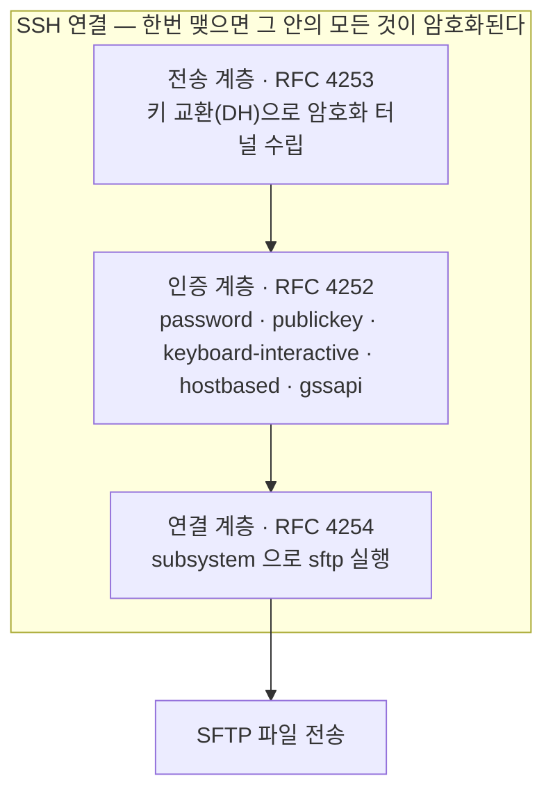
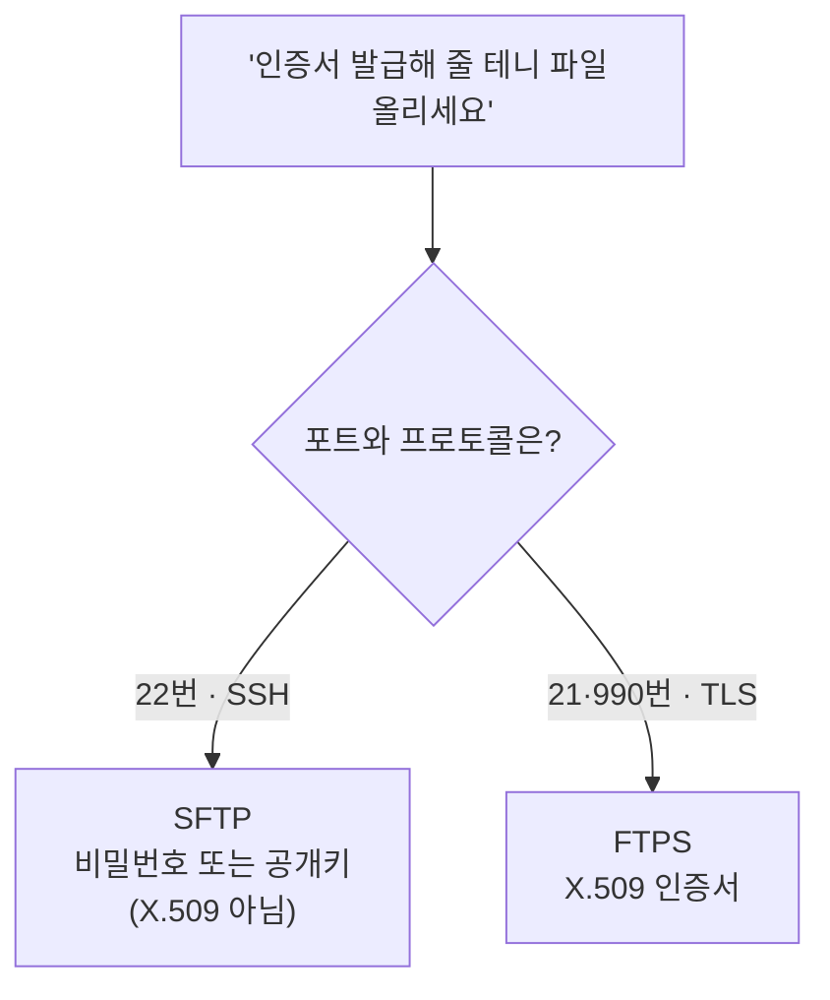
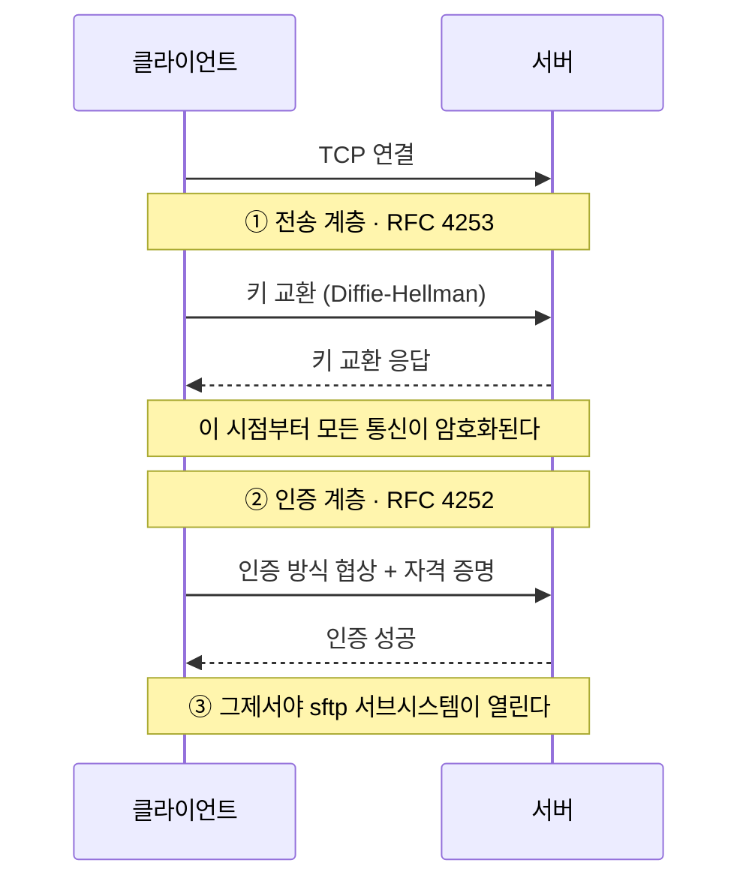
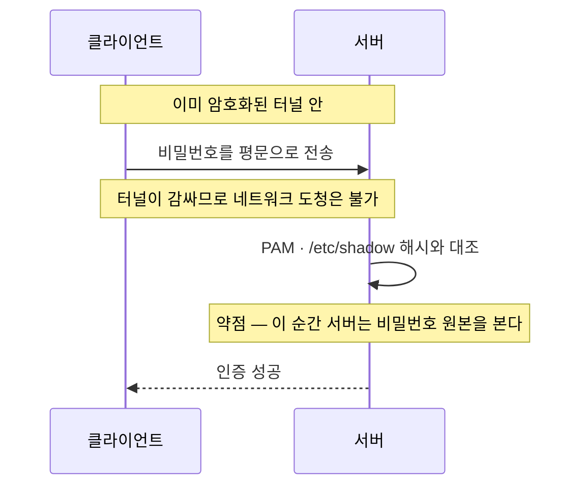
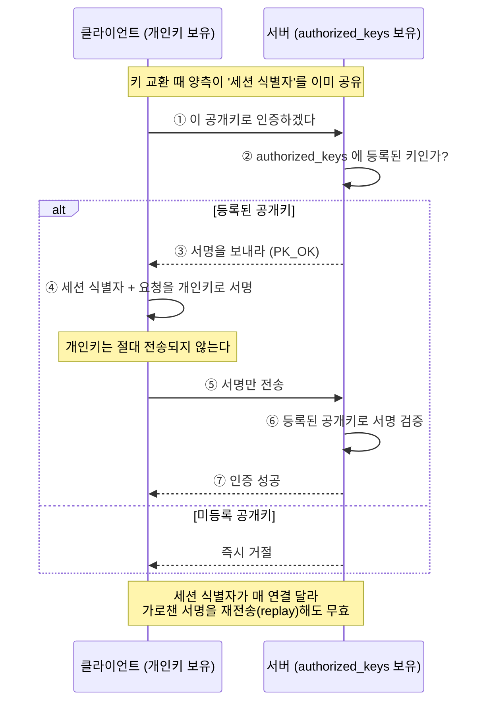
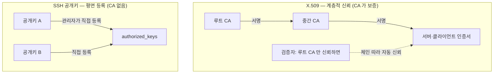
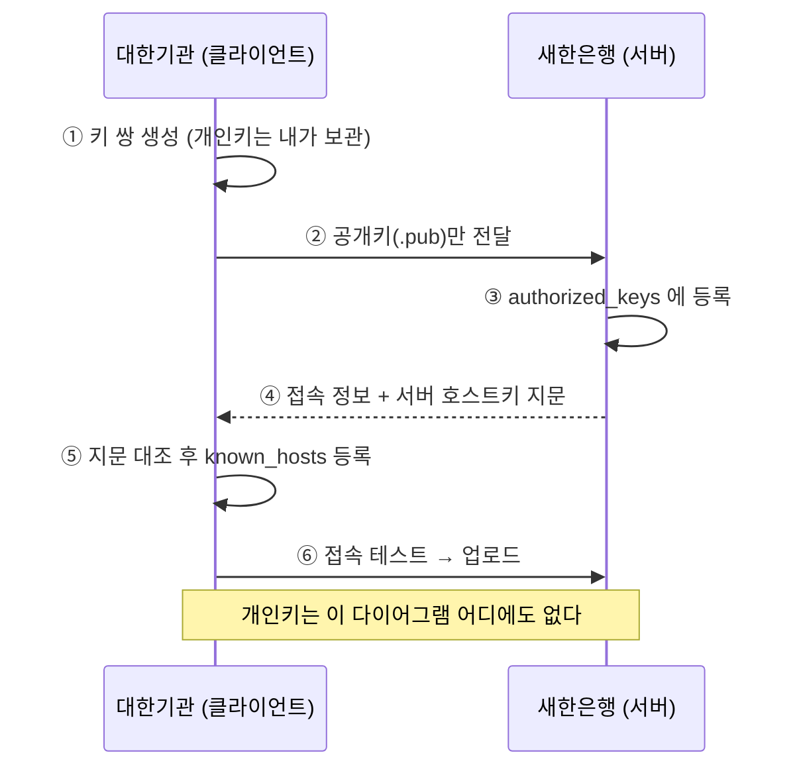
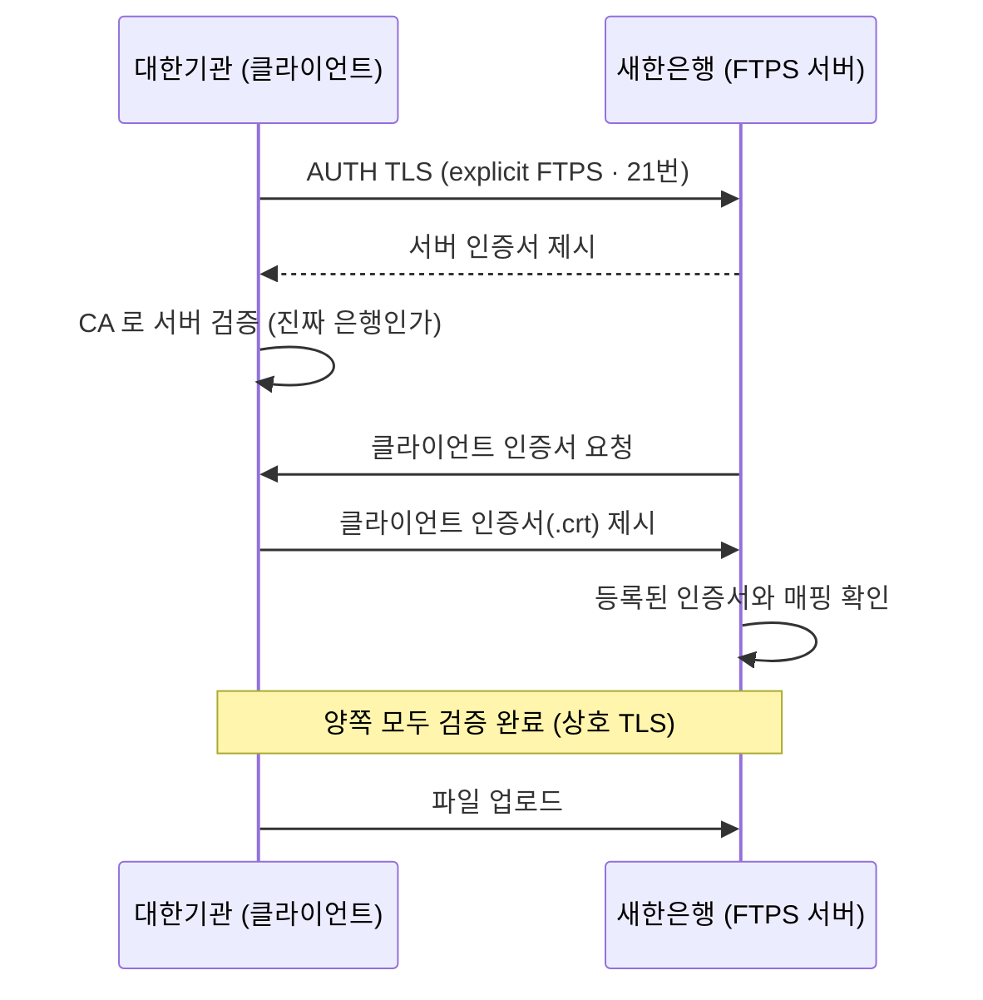

# sftp

원격 서버에 파일을 올리려면 그 서버에 로그인할 수 있는 계정이 있어야 한다.
이 문서는 그 계정이 발급된 뒤 **어떤 방식으로 로그인하는가** 를 비밀번호·공개키·X.509 인증서 세 갈래로 나누어 정리한다.
각 방식의 개념, 실제 사용법, 그리고 내부적으로 무슨 일이 벌어지는지를 함께 다룬다.

이 문서를 끝까지 읽으면 세 인증 방식이 각각 어떻게 동작하는지 그림으로 그려 남에게 설명할 수 있고, 기관이 은행으로 파일을 올리는 실제 배치 스크립트를 직접 작성할 수 있게 된다.

- [sftp](#sftp)
    - [0. 결론부터](#0-결론부터)
    - [1. SFTP 는 무엇 위에서 도는가](#1-sftp-는-무엇-위에서-도는가)
        - [SFTP ≠ FTP ≠ FTPS](#sftp--ftp--ftps)
        - [SFTP 는 사실 정식 RFC 가 아니다](#sftp-는-사실-정식-rfc-가-아니다)
    - [2. SSH 가 제공하는 인증 방식의 전체 지도](#2-ssh-가-제공하는-인증-방식의-전체-지도)
    - [3. 비밀번호 인증 (password)](#3-비밀번호-인증-password)
    - [4. 공개키 인증 (publickey)](#4-공개키-인증-publickey)
    - [5. 그 밖의 방식 — 2FA, hostbased, 그리고 OpenSSH 인증서](#5-그-밖의-방식--2fa-hostbased-그리고-openssh-인증서)
    - [6. X.509 인증서 — 이게 무엇이고 SFTP 와 무슨 상관인가](#6-x509-인증서--이게-무엇이고-sftp-와-무슨-상관인가)
    - [7. 그래서 무엇을 쓸 것인가](#7-그래서-무엇을-쓸-것인가)
    - [8. 시나리오: 어느 기관이 은행으로 파일을 보낸다](#8-시나리오-어느-기관이-은행으로-파일을-보낸다)
    - [부록 A. sftp 실제 사용법](#부록-a-sftp-실제-사용법)
    - [부록 B. 서버 측에서 SFTP 전용 계정 만들기](#부록-b-서버-측에서-sftp-전용-계정-만들기)
    - [참고 자료](#참고-자료)

---

## 0. 결론부터

SFTP 로그인은 곧 **SSH 로그인** 이다. SFTP 는 자기만의 인증 체계를 갖지 않고, 아래에 깔린 SSH 의 인증을 그대로 물려받는다.
그래서 "어떤 방식으로 로그인하는가" 라는 질문의 답은 SSH 가 지원하는 인증 방식의 목록과 같다.

- **비밀번호** — 가장 익숙하지만 가장 약하다. 계정 발급 직후 임시로 쓰거나 보조 수단으로 둔다.
- **공개키** — 실무의 표준 권장. 키 쌍을 만들어 공개키를 서버에 등록하고, 개인키로 로그인한다.
- **X.509 인증서** — **표준 SFTP/SSH 의 로그인 방식이 아니다.** 이것은 원래 TLS(HTTPS·FTPS)에서 쓰는 PKI 인증서이며, SSH 에 얹으려면 특수한 서버 구현이 따로 있어야 한다. 이름이 비슷한 FTPS 와 혼동했을 가능성도 크다. 자세한 사정은 6장에서 따로 푼다.

세 갈래를 한눈에 비교하면 다음과 같다.

| 방식 | 표준 SSH 의 정식 인증인가 | 무엇을 서버에 등록하나 | 신원 보증의 근거 | 권장도 |
| --- | --- | --- | --- | --- |
| 비밀번호 | 예 (`password`) | (계정 비밀번호) | 비밀번호를 아는 사람 | 낮음 |
| 공개키 | 예 (`publickey`) | 공개키 1줄 | 개인키를 가진 사람 | **높음** |
| X.509 인증서 | **아니오** | (구현에 따라 다름) | 신뢰하는 CA 의 서명 | 특수 상황 한정 |

세 방식이 SSH 의 어느 자리에 앉는지, 그리고 X.509 가 왜 옆길인지를 한 장으로 보면 이렇다.

**(가) 계층 구조 — 인증은 이미 암호화된 SSH 안에서 일어난다**



**(나) 분기 판별 — '인증서 줄 테니 올리라'는데, SFTP 인가 FTPS 인가**



---

## 1. SFTP 는 무엇 위에서 도는가

SFTP 의 정식 이름은 **SSH File Transfer Protocol** 이다. 이름 그대로 SSH 연결 위에서 동작하는 파일 전송 프로토콜이며,
SSH 명세의 표현을 빌리면 SSH 연결 프로토콜이 정의한 **subsystem**(이름은 `sftp`) 으로 실행된다.
즉 클라이언트가 평소처럼 SSH 로 서버에 접속해 인증을 끝낸 다음, 그 암호화된 통로 안에서 셸 대신 `sftp` 서브시스템을 띄우는 구조다.

이 점은 같은 저장소의 [`scp`](../scp.md) 문서에도 이미 적혀 있다. `scp` 의 man 설명은 이렇게 말한다.

> uses the `SFTP` protocol over a `ssh`(1) connection for data transfer,
> and uses the **same authentication** and provides the **same security** as a login session.

핵심은 굵게 강조한 "same authentication" 이다. SFTP 로 파일을 올릴 때 거치는 로그인은 SSH 셸에 로그인할 때와 **완전히 동일한 절차** 다.
그러므로 "SFTP 계정으로 어떻게 로그인하나" 를 이해하려면 SSH 인증을 이해하면 된다.

### SFTP ≠ FTP ≠ FTPS

이름이 닮아서 자주 뒤섞이지만 셋은 뿌리가 다르다. 특히 X.509 인증서 이야기가 나오는 이유의 절반이 여기서 비롯되므로 미리 갈라 둔다.

| 프로토콜 | 전체 이름 | 무엇 위에서 도나 | 기본 포트 | 인증서 |
| --- | --- | --- | --- | --- |
| **FTP** | File Transfer Protocol | 평문(암호화 없음) | 21 | 없음 |
| **FTPS** | FTP **over TLS/SSL** | TLS | 21 / 990 | **X.509 사용** |
| **SFTP** | **SSH** File Transfer Protocol | SSH | 22 | (표준에는) X.509 없음 |

`FTPS` 는 낡은 FTP 에 TLS 를 씌운 것이라 TLS 의 세계관, 즉 **X.509 인증서** 를 그대로 쓴다.
반면 `SFTP` 는 FTP 와 코드 한 줄 공유하지 않는 전혀 다른 프로토콜이고, SSH 의 인증을 쓴다.
"SFTP 에서 X.509 인증서로 로그인한다" 는 말이 어딘가 어색하게 들렸다면, 그 직관이 옳다. 십중팔구 FTPS 와 헷갈린 것이다.

### SFTP 는 사실 정식 RFC 가 아니다

흥미로운 사실 하나. SSH 자체는 RFC 4251~4254 로 표준화돼 있지만, **SFTP 프로토콜은 끝내 정식 RFC 가 되지 못했다.**
IETF 의 `secsh` 워킹그룹이 `draft-ietf-secsh-filexfer` 라는 인터넷 드래프트로 버전 00 부터 13 까지 작업했으나,
SFTP 를 파일 시스템 프로토콜로 볼 것이냐를 두고 의견이 갈리며 표준화가 멈췄고 드래프트는 만료됐다.
그래서 오늘날 거의 모든 구현이 따르는 것은 `draft-ietf-secsh-filexfer-02` 가 정의한 **버전 3** 이다. 사실상의 표준이 드래프트인 셈이다.

이 사실이 우리 주제에 주는 함의는 분명하다. SFTP 표준 문서를 아무리 뒤져도 "로그인 방식" 규정은 없다.
인증은 전부 아래의 SSH 계층(RFC 4252)이 책임지기 때문이다. 다음 장으로 넘어간다.

---

## 2. SSH 가 제공하는 인증 방식의 전체 지도

SSH 의 인증은 **SSH Authentication Protocol**, 즉 RFC 4252 가 규정한다.
주의할 점은, 인증이 시작되기 **전에** 이미 통신이 암호화돼 있다는 것이다.
SSH 는 연결 직후 전송 계층(RFC 4253)에서 키 교환(Diffie-Hellman 등)을 수행해 암호화된 터널을 먼저 세운다.
아래의 모든 인증 방식은 그 터널 **안에서** 오간다. 그래서 비밀번호조차 네트워크에서는 도청되지 않는다.
순서로 보면 "암호화가 먼저, 인증이 나중" 이다.



RFC 4252 와 그 동반 문서들이 정의하는 인증 방식은 다음과 같다.

| 메서드 이름 | 한국어 | 정의 | 핵심 |
| --- | --- | --- | --- |
| `publickey` | 공개키 | RFC 4252 §7 | 개인키로 서명, 공개키로 검증. **권장** |
| `password` | 비밀번호 | RFC 4252 §8 | 비밀번호를 터널 안에서 전송 |
| `keyboard-interactive` | 대화형 | RFC 4256 | 서버가 묻고 사용자가 답함. OTP·2FA 에 사용 |
| `hostbased` | 호스트 기반 | RFC 4252 §9 | 사용자가 아니라 **클라이언트 호스트** 를 신뢰 |
| `gssapi-with-mic` | GSSAPI | RFC 4462 | Kerberos 등 외부 인증 체계 연동 |

이 표 어디에도 **X.509 는 없다.** 표준 SSH 가 인증에 쓰는 "인증서" 라는 개념 자체가 원래 없었고,
나중에 OpenSSH 가 독자적으로 인증서를 도입했지만 그것도 X.509 가 아니다(5장).
X.509 를 SSH 인증에 정식으로 끌어들인 것은 한참 뒤의 별도 확장 표준(RFC 6187)이며, 일상에서 만나는 OpenSSH 는 이를 구현하지 않는다(6장).

실무에서 압도적으로 많이 쓰는 둘 — 비밀번호와 공개키 — 부터 깊이 본다.

---

## 3. 비밀번호 인증 (password)

**개념.** 서버 계정에 걸린 비밀번호를 그대로 입력해 로그인한다. 별도 준비물이 없어 계정을 막 발급받은 직후 가장 먼저 쓰게 되는 방식이다.

**사용법.** 그냥 접속하면 서버가 비밀번호를 묻는다.

```bash
# 계정명 user, 호스트 example.com 으로 SFTP 접속
sftp user@example.com
# user@example.com's password: ← 여기에 입력
```

포트가 22 가 아니면 `-P`(대문자) 로 지정한다. `ssh` 가 소문자 `-p` 를 쓰는 것과 달리 `sftp` 와 `scp` 는 대문자 `-P` 라는 점이 함정이다.

```bash
sftp -P 2222 user@example.com
```

**내부 동작.** 비밀번호 인증이 "평문 전송이라 위험하다" 고 막연히 알려져 있는데, 정확히는 이렇다.

1. 앞서 말한 대로 SSH 는 인증 전에 이미 암호화 터널을 세워 둔다.
2. 클라이언트는 `SSH_MSG_USERAUTH_REQUEST` 메시지에 비밀번호를 **평문으로 담아** 보낸다. 단, 이 메시지는 암호화 터널 안을 지나므로 **네트워크 도청자는 볼 수 없다.**
3. 서버는 받은 평문 비밀번호를 운영체제의 인증 모듈(리눅스라면 PAM, 내부적으로 `/etc/shadow` 의 해시)에 넘겨 대조한다. 일치하면 통과.

여기서 "평문" 이 문제 되는 지점은 네트워크가 아니라 **서버 그 자체** 다. 인증 순간 서버 프로세스는 비밀번호 원본을 메모리에서 본다.
서버가 손상됐거나 악의적이면 비밀번호가 그대로 노출된다. 공개키 방식이 이 약점을 어떻게 없애는지는 다음 장에서 대비된다.



**서버 설정.** 비밀번호 인증의 허용 여부는 `/etc/ssh/sshd_config` 의 다음 항목이 정한다.

```sshdconfig
PasswordAuthentication yes   # no 로 두면 비밀번호 로그인 자체를 막는다
```

**한계.** 사람이 외울 수 있는 비밀번호는 엔트로피가 낮아 무차별 대입(brute-force)과 사전 공격에 약하고,
여러 서버에 같은 비밀번호를 재사용하기 쉬우며, 피싱으로 통째로 새어 나갈 수 있다.
인터넷에 열린 서버라면 비밀번호 로그인은 끄고 공개키만 받는 것이 정석이다.

---

## 4. 공개키 인증 (publickey)

**개념.** 수학적으로 짝을 이루는 두 개의 키 — **개인키(private key)** 와 **공개키(public key)** — 를 쓴다.
개인키는 내 컴퓨터에만 두고 절대 내보내지 않으며, 공개키만 서버에 미리 등록한다.
로그인할 때 클라이언트는 개인키로 **서명** 을 만들어 보내고, 서버는 등록된 공개키로 그 서명을 **검증** 한다.
"개인키를 가진 사람" 임을 증명하되 개인키 자체는 결코 건네지 않는 것이 핵심이다.

**1단계 — 키 쌍 만들기.** [`ssh-keygen`](../ssh/ssh-keygen.md) 으로 생성한다. 요즘은 Ed25519 가 짧고 빠르고 안전해 기본 선택이다.

```bash
# -t: 키 타입, -C: 식별용 코멘트
ssh-keygen -t ed25519 -C "rody@laptop"
# 결과:
#   ~/.ssh/id_ed25519       ← 개인키 (절대 외부로 내보내지 않는다)
#   ~/.ssh/id_ed25519.pub   ← 공개키 (서버에 등록할 한 줄)
```

생성 중 묻는 **passphrase** 는 개인키 파일 자체를 암호화하는 추가 자물쇠다(아래에서 다시 설명).
RSA 를 써야 한다면 짧은 키는 피하고 `ssh-keygen -t rsa -b 4096` 처럼 넉넉한 길이를 준다.

**2단계 — 공개키를 서버에 등록.** 서버의 `~/.ssh/authorized_keys` 파일에 공개키 한 줄을 추가하면 된다. `ssh-copy-id` 가 이 작업을 대신 해 준다.

```bash
# 이 명령 한 번이 .pub 내용을 원격의 ~/.ssh/authorized_keys 에 안전하게 덧붙인다
ssh-copy-id -i ~/.ssh/id_ed25519.pub user@example.com
```

권한이 틀어지면 OpenSSH 가 보안상 키를 거부하므로, 수동 등록 시 권한을 맞춰야 한다.

```bash
chmod 700 ~/.ssh
chmod 600 ~/.ssh/authorized_keys
```

**3단계 — 키로 로그인.** 키가 기본 경로(`~/.ssh/id_*`)에 있으면 옵션 없이도 자동으로 쓰인다. 경로를 명시하려면 `-i` 를 준다.

```bash
sftp -i ~/.ssh/id_ed25519 user@example.com
```

반복 접속이라면 `~/.ssh/config` 에 별칭으로 정리해 두는 편이 낫다. sftp·scp·ssh 가 모두 이 설정을 읽는다.

```sshconfig
# ~/.ssh/config
Host myserver
    HostName example.com
    User user
    Port 2222
    IdentityFile ~/.ssh/id_ed25519
```

```bash
# 위 설정 덕에 이렇게 짧아진다
sftp myserver
```

**내부 동작 (RFC 4252 §7).** 공개키 인증의 안전성은 "비밀이 네트워크로 나가지 않는다" 는 데서 온다.

1. 클라이언트가 "이 공개키로 인증하겠다" 고 서버에 알린다.
2. 서버는 그 공개키가 `authorized_keys` 에 등록돼 있는지 확인한다. 없으면 즉시 거절.
3. 등록돼 있으면, 클라이언트는 **서명** 을 만든다. 서명 대상 데이터에는 이번 연결에서만 유효한 **세션 식별자(session identifier)** 와 인증 요청 필드가 함께 들어간다. 이 데이터에 **개인키로** 서명한다.
4. 클라이언트는 서명만 보낸다. 개인키는 전송되지 않는다.
5. 서버는 등록된 **공개키로** 서명을 검증한다. 통과하면 로그인 성공.



세션 식별자가 서명에 포함되는 것이 중요하다. 매 연결마다 값이 달라지므로, 누군가 서명을 가로채 재전송(replay)해도 다른 세션에서는 쓸모가 없다.
비밀번호 방식과 결정적으로 다른 점이 여기다. 서버가 손상돼도 서버는 애초에 **공개키만** 갖고 있어 그것으로 로그인할 수 없다. 비밀은 처음부터 내 손을 떠난 적이 없다.

**passphrase 와 ssh-agent.** 개인키 파일을 빼앗기면 끝 아니냐는 우려는 passphrase 가 막는다.
passphrase 를 걸면 개인키 파일이 그 암호로 암호화되어, 파일을 훔쳐도 passphrase 없이는 못 쓴다.
다만 접속할 때마다 passphrase 를 입력하는 건 번거로우므로, **ssh-agent** 가 메모리에 풀린 키를 들고 있다가 대신 서명해 준다.

```bash
eval "$(ssh-agent -s)"          # 에이전트 시작
ssh-add ~/.ssh/id_ed25519       # passphrase 한 번 입력 → 이후 자동
```

**서버 설정.** 공개키 인증 허용 여부는 다음이 정한다(대개 기본 on).

```sshdconfig
PubkeyAuthentication yes
```

---

## 5. 그 밖의 방식 — 2FA, hostbased, 그리고 OpenSSH 인증서

비밀번호와 공개키만큼 자주 쓰이진 않지만, 실무에서 마주칠 수 있는 방식들이다. 특히 마지막의 "OpenSSH 인증서" 는 X.509 와 헷갈리기 쉬워 분명히 갈라 둘 필요가 있다.

**keyboard-interactive (대화형, RFC 4256).** 서버가 클라이언트에게 질문을 던지고 사용자가 답하는 일반화된 방식이다.
질문이 "Password:" 한 줄이면 비밀번호 인증과 겉보기엔 같지만, 진짜 가치는 **여러 질문을 던질 수 있다** 는 데 있다.
그래서 OTP·TOTP·푸시 승인 같은 **2단계 인증(2FA)** 이 이 방식 위에 얹힌다.

**hostbased (RFC 4252 §9).** 개별 사용자가 아니라 **접속해 오는 클라이언트 호스트 전체** 를 신뢰하는 방식이다.
신뢰 관계로 묶인 내부 서버 군집 사이에서 쓰이며, 일반적인 원격 업로드 상황에서는 거의 안 쓴다.

**다단계 인증 강제.** 위 방식들을 조합해 "공개키 **그리고** OTP 를 둘 다 통과해야 함" 같은 정책을 강제할 수 있다.

```sshdconfig
# 공개키와 대화형(OTP)을 둘 다 요구
AuthenticationMethods publickey,keyboard-interactive
```

**OpenSSH 인증서 (SSH certificate) — X.509 가 아니다.** OpenSSH 는 5.4 버전(2010)부터 자체 **인증서** 기능을 지원한다.
공개키 인증의 골칫거리, 즉 서버마다 `authorized_keys` 에 공개키를 일일이 등록하고 회수해야 하는 번거로움을 풀기 위한 것이다.
**SSH CA(인증 기관)** 역할을 할 키 하나를 정해 두고, 그 CA 키로 사용자 공개키에 서명해 "인증서" 를 발급한다.
서버는 개별 공개키 대신 **CA 의 공개키 하나만** 신뢰하면 되고, 그 CA 가 서명한 모든 사용자를 자동으로 받아들인다. 유효기간·접속 가능 계정 같은 제약도 인증서에 새길 수 있다.

```bash
# CA 키 생성
ssh-keygen -t ed25519 -f ssh_user_ca
# 사용자 공개키(id_ed25519.pub)에 CA 로 서명 → 인증서 발급
#   -I: 인증서 식별자, -n: 허용 계정, -V: 유효기간
ssh-keygen -s ssh_user_ca -I "rody-key" -n user -V +1w id_ed25519.pub
# 결과: id_ed25519-cert.pub
```

여기서 반드시 못 박을 점. **이 OpenSSH 인증서는 X.509 가 아니다.** 포맷도, 신뢰 구조도 X.509 와 무관한, OpenSSH 가 독자적으로 설계한 경량 인증서다.
X.509 의 무거운 PKI(인증서 체인, CRL, OCSP, ASN.1 파싱)를 의도적으로 피하고 단순하게 만든 것이다. X.509 CA 로는 OpenSSH 인증서를 발급할 수 없다.
그러니 SSH 맥락에서 그냥 "인증서" 라고 하면 이 OpenSSH 인증서를 가리키며, X.509 인증서와는 다른 물건이라는 점을 기억해 두면 다음 장이 명확해진다.

---

## 6. X.509 인증서 — 이게 무엇이고 SFTP 와 무슨 상관인가

질문의 마지막 갈래다. "X.509 인증서로 SFTP 에 로그인" 이 가능한지, 그 인증서가 대체 무엇인지 푼다.

### 6.1 X.509 인증서란 무엇인가

X.509 는 ITU-T 가 정의하고 IETF 의 **PKIX(RFC 5280)** 가 인터넷용으로 다듬은 **공개키 인증서** 표준이다.
인증서 한 장에는 대략 이런 것들이 담긴다.

- **주체(Subject)** — 이 인증서가 누구의 것인지 (예: `CN=svc.example.com`)
- **공개키** — 주체의 공개키
- **발급자(Issuer)** — 이 인증서를 발급·서명한 CA
- **유효기간** — 시작·만료 시각
- **CA 의 디지털 서명** — 위 내용을 CA 가 보증한다는 서명

공개키 인증과 결정적으로 다른 점은 **신뢰의 출처** 다. SSH 공개키 인증에서는 공개키 그 자체가 신원이고, 관리자가 `authorized_keys` 에 손으로 등록해야 비로소 신뢰된다.
반면 X.509 에서는 **신뢰하는 CA 가 서명했다는 사실** 이 신뢰의 근거다.
검증자는 루트 CA 하나만 신뢰하면, 그 CA 가 보증한(또는 중간 CA 를 거쳐 보증한) 수많은 인증서를 **체인(chain)** 을 따라 자동으로 신뢰한다.
폐기는 CRL(폐기 목록)이나 OCSP(실시간 조회)로 처리한다. 이 계층적 신뢰 구조가 기업·정부의 신원 관리에 X.509 가 널리 쓰이는 이유다.

같은 "공개키를 신원에 묶는" 일을 두 방식이 어떻게 다르게 하는지 나란히 보면 차이가 분명하다. X.509 는 CA 가 보증하는 계층 구조이고, SSH 공개키는 관리자가 직접 등록하는 평면 구조다.



X.509 인증서를 실제로 만들고 들여다보고 검증하는 구체적 명령은 같은 저장소의 [`openssl`](../openssl.md) 문서에 정리돼 있다. 거기에 루트·중간·서버 인증서를 단계별로 만드는 예제가 있다.

```bash
# (openssl.md 발췌) 인증서 내용 들여다보기
openssl x509 -in server.crt -text -noout
# 인증서 체인 검증
openssl verify -verbose -CAfile root.crt server.crt
```

### 6.2 X.509 가 원래 활약하는 무대

X.509 가 일상적으로 쓰이는 곳은 **TLS** 다. HTTPS 로 웹사이트에 접속할 때 브라우저가 검사하는 그 인증서가 X.509 다.
그리고 앞서 1장에서 갈라 둔 **FTPS(FTP over TLS)** 도 TLS 위에서 돌기 때문에 X.509 인증서를 쓴다.
"파일 전송 + 인증서" 라는 조합을 어디선가 들었다면, 그건 SFTP 가 아니라 FTPS 였을 가능성이 높다.

### 6.3 표준 SSH/SFTP 에는 X.509 가 없다

다시 강조하면, 2장의 RFC 4252 인증 방식 목록에 X.509 는 들어 있지 않다.
그리고 우리가 매일 쓰는 **OpenSSH 는 X.509 인증서를 이용한 인증을 구현하지 않는다.**
5장의 OpenSSH 인증서는 X.509 와 무관한 별개 포맷이라고 이미 짚었다.
따라서 보통의 리눅스 서버에 OpenSSH 로 SFTP 접속하는 상황에서 **X.509 인증서로 로그인할 방법은 없다.** 비밀번호나 공개키(또는 OpenSSH 인증서)를 쓰게 된다.

### 6.4 그런데 왜 SFTP 맥락에서 X.509 를 듣게 되는가

그럼에도 X.509 가 SFTP·SSH 와 엮여 언급되는 데는 두 가지 경로가 있다.

**경로 ① 이름 혼동 — FTPS.** 가장 흔하다. SFTP 와 FTPS 는 이름이 비슷하고 둘 다 "보안 파일 전송" 이라 자주 뒤섞인다.
거래처나 금융기관이 "인증서를 발급해 드릴 테니 파일을 올리세요" 라고 할 때, 실제 프로토콜이 FTPS 인 경우가 적지 않다. 접속 전에 SFTP(SSH, 22번) 인지 FTPS(TLS, 21/990번) 인지부터 확인하는 게 좋다.

**경로 ② 진짜로 X.509 를 쓰는 SSH 구현.** 표준은 아니지만, SSH 에 X.509 를 정식으로 끌어들인 **확장 표준이 존재한다** — **RFC 6187 "X.509v3 Certificates for Secure Shell Authentication"**(2011).
이 문서는 `x509v3-ssh-rsa`, `x509v3-ecdsa-sha2-*` 같은 공개키 알고리즘을 정의해, SSH 의 공개키 인증 자리에 X.509 인증서를 끼워 넣을 수 있게 한다(OCSP 응답을 함께 실어 보내는 것도 허용한다).
다만 이를 **구현한 제품이 따로 있어야** 쓸 수 있다.

- **PKIX-SSH** — Roumen Petrov 가 OpenSSH 에 X.509 v3 인증서 지원을 더한 별도 배포판.
- **Tectia SSH** — SSH 프로토콜의 원저자 회사(SSH Communications Security)의 상용 제품. 기업 환경에서 X.509 기반 SSH 를 지원한다.

정리하면, 기업·정부가 이미 굴리는 X.509 PKI(사번·직원 인증서 등)를 SSH 로그인에도 재사용하고 싶을 때 이 경로를 택한다.
하지만 이는 특수한 선택이며, 일반적인 OpenSSH 환경의 기본값이 아니다.

### 6.5 한눈 비교 — SSH 공개키 vs OpenSSH 인증서 vs X.509

| | SSH 공개키 | OpenSSH 인증서 | X.509 인증서 |
| --- | --- | --- | --- |
| 신뢰의 근거 | 공개키를 `authorized_keys` 에 수동 등록 | SSH CA 의 서명 | 계층적 CA(루트→중간)의 서명 |
| 포맷 | SSH 자체 공개키 포맷 | OpenSSH 자체 인증서 포맷 | X.509(ASN.1, RFC 5280) |
| CA 필요 | 불필요 | SSH 전용 CA | X.509 CA |
| 폐기 수단 | 키 삭제 / 폐기 목록 | 폐기 목록(KRL) | CRL · OCSP |
| 표준 OpenSSH 지원 | 예 | 예(5.4+) | **아니오**(PKIX-SSH·Tectia 등 별도 구현 필요) |
| 주 무대 | SSH/SFTP | SSH/SFTP | TLS·HTTPS·FTPS·S/MIME |

---

## 7. 그래서 무엇을 쓸 것인가

원격에 파일을 올리는 흔한 상황이라면 권고는 단순하다.

- **공개키 인증을 기본** 으로 삼는다. 개인키에는 passphrase 를 걸고 ssh-agent 로 편의를 보완한다. 인터넷에 열린 서버라면 서버 쪽에서 `PasswordAuthentication no` 로 비밀번호 로그인을 아예 막는다.
- **비밀번호** 는 계정 발급 직후 첫 접속이나 공개키 등록 전의 임시 수단 정도로만 쓴다. 굳이 상시로 열어 둘 이유가 없다.
- 관리할 서버나 사용자가 많아 키 등록·회수가 버거워지면 **OpenSSH 인증서(SSH CA)** 로 확장한다. 이건 X.509 가 아니라 OpenSSH 자체 기능이다.
- **X.509 인증서** 는 (a) 상대가 실은 FTPS 를 요구하는 경우이거나, (b) 회사가 이미 X.509 PKI 를 갖추고 있어 PKIX-SSH·Tectia 같은 구현으로 SSH 에까지 통합하려는 경우에 한해 고려한다. 평범한 OpenSSH 환경에서는 선택지에 없다.

---

## 8. 시나리오: 어느 기관이 은행으로 파일을 보낸다

추상적인 인증 방식이 실제로 어떻게 굴러가는지, 가장 흔한 실무 상황으로 풀어 본다.
**대한기관**(송신측)이 매일 거래내역 파일을 **새한은행**(수신측)으로 올려야 하는 상황을 가정한다.

시작 전에 역할부터 못 박는다. 대부분의 금융권 파일 연계가 그렇듯, **은행이 SFTP 서버를 운영하고 기관이 클라이언트로 접속해 업로드한다.**
계정을 발급하는 쪽은 은행이고, 그 계정으로 로그인하는 쪽은 기관이다. 이 방향을 헷갈리면 "누가 무슨 키를 만드나" 가 통째로 꼬인다.

| 역할 | 주체 | 하는 일 |
| --- | --- | --- |
| 서버 / 수신측 | 새한은행 | SFTP 서버 운영, 계정·디렉토리 발급, 접속 정보 통지 |
| 클라이언트 / 송신측 | 대한기관 | 발급받은 계정으로 접속해 파일 업로드, 배치 스크립트 운영 |

이후 예시는 다음 값을 가정한다. 서버 `sftp.bank.example.com`, 포트 `22`, 계정 `daehan_co`, 업로드 경로 `/upload/inbound`, 보낼 파일 `transactions_YYYYMMDD.csv`.

### 8.1 시나리오 ① — 공개키 인증 (실무 표준)

가장 널리 쓰는 방식이다. 핵심은 단 하나, **키를 누가 만들고 어느 쪽을 상대에게 넘기느냐** 다.
원칙은 이렇다. **개인키를 쓰는 쪽(= 접속하는 쪽 = 기관)이 키 쌍을 만든다. 그리고 공개키만 은행에 넘긴다. 개인키는 기관 밖으로 절대 나가지 않는다.**

**사전 준비 — 누가 무엇을 누구에게.** 양방향 교환이라는 점이 중요하다. 기관은 공개키를 올려보내고, 은행은 접속 정보와 함께 **서버 호스트키 지문** 을 내려보낸다. 호스트키 지문은 가짜 서버에 속아 파일을 엉뚱한 곳에 올리는 중간자 공격(MITM)을 막는 장치다.

| 순서 | 누가 | 무엇을 | 누구에게 |
| --- | --- | --- | --- |
| 1 | 대한기관 | 키 쌍 생성 (개인키는 보관) | — |
| 2 | 대한기관 | **공개키(`.pub`) 한 줄** 전달 | → 새한은행 |
| 3 | 새한은행 | 받은 공개키를 `daehan_co` 계정의 `authorized_keys` 에 등록 | — |
| 4 | 새한은행 | 접속 정보(host·port·계정·경로) + **서버 호스트키 지문** 통지 | → 대한기관 |
| 5 | 대한기관 | 서버 호스트키를 `known_hosts` 에 등록하고 접속 테스트 | — |

이 주고받음을 그림으로 보면 이렇다. **개인키가 어느 화살표에도 등장하지 않는 것** 이 핵심이다.



**(1) 기관 — 키 생성.** 배치 전용 키를 하나 만든다. 기존 개인 키와 섞지 않도록 파일명을 따로 준다.

```bash
ssh-keygen -t ed25519 -C "daehan-co-batch" -f ~/.ssh/daehan_to_bank
# → ~/.ssh/daehan_to_bank       (개인키, 절대 외부 반출 금지)
# → ~/.ssh/daehan_to_bank.pub   (공개키, 은행에 전달할 것)
```

무인 배치라 passphrase 를 비우는 경우가 많은데, 그러면 개인키 파일 자체가 곧 비밀이 된다. 파일 권한(`chmod 600`)과 서버 접근 통제로 지켜야 한다. 더 엄격히 하려면 passphrase 를 걸고 배치 사용자 세션에 ssh-agent 를 띄운다.

**(2) 기관 → 은행 — 공개키 전달.** 출력되는 한 줄을 은행이 지정한 경로(포털·티켓·메일)로 보낸다.

```bash
cat ~/.ssh/daehan_to_bank.pub
# ssh-ed25519 AAAAC3NzaC1lZDI1NTE5AAAA... daehan-co-batch
```

여기서 가장 흔한 사고가 **개인키를 보내는 것** 이다. 보내는 건 반드시 `.pub` 로 끝나는 공개키 파일의 내용이다.

**(3) 은행(서버) — 공개키 등록.** 은행 담당자가 서버에서 해당 계정에 공개키를 심는다.

```bash
sudo -u daehan_co mkdir -p /home/daehan_co/.ssh
echo "ssh-ed25519 AAAAC3NzaC1lZDI1NTE5AAAA... daehan-co-batch" \
  | sudo -u daehan_co tee -a /home/daehan_co/.ssh/authorized_keys
sudo -u daehan_co chmod 700 /home/daehan_co/.ssh
sudo -u daehan_co chmod 600 /home/daehan_co/.ssh/authorized_keys
```

**(4) 은행 → 기관 — 접속 정보와 호스트키 지문 통지.** 은행은 서버 호스트키의 지문을 뽑아 접속 정보와 함께 알려준다.

```bash
# 은행 서버에서 호스트키 지문 출력
ssh-keygen -lf /etc/ssh/ssh_host_ed25519_key.pub
# 256 SHA256:abcd1234EXAMPLEfingerprint... root@bank (ED25519)
```

**(5) 기관 — 호스트키 등록과 접속 테스트.** 기관은 서버 호스트키를 수집한 뒤, 그 지문이 은행이 알려준 값과 **일치하는지 눈으로 대조** 하고 나서 `known_hosts` 에 넣는다. 이 대조를 건너뛰면 호스트키 지문을 교환한 의미가 없다.

```bash
# 서버 호스트키 수집 → 지문 확인
ssh-keyscan -t ed25519 -p 22 sftp.bank.example.com 2>/dev/null \
  | ssh-keygen -lf -
# 은행이 준 지문과 같으면 known_hosts 에 등록
ssh-keyscan -t ed25519 -p 22 sftp.bank.example.com >> ~/.ssh/known_hosts

# 접속 테스트
sftp -i ~/.ssh/daehan_to_bank -P 22 daehan_co@sftp.bank.example.com
```

**운영 스크립트.** 이제 매일 도는 배치를 짠다. 금융권 파일 연계의 두 가지 관행을 반영한다.

- **원자적 도착(atomic rename).** 업로드가 끝나기 전에 수신측이 절반만 읽어 가면 안 된다. 임시 이름(`.tmp`)으로 올린 뒤, 다 올라가면 정식 이름으로 `rename` 한다. 같은 디렉토리 안의 rename 은 원자적이라, 수신측에는 완성된 파일이 한순간에 나타난다.
- **완료 신호 파일(sentinel).** 데이터 파일을 다 올린 뒤 빈 `.done` 파일을 하나 더 올려 "이 파일 다 됐다" 를 알린다. 수신측 배치는 `.done` 이 보일 때만 데이터를 가져가도록 만든다.

```bash
#!/usr/bin/env bash
set -euo pipefail

# --- 설정 ---
SFTP_HOST="sftp.bank.example.com"
SFTP_PORT="22"
SFTP_USER="daehan_co"
SSH_KEY="$HOME/.ssh/daehan_to_bank"
REMOTE_DIR="/upload/inbound"
DATE="$(date +%Y%m%d)"
LOCAL_FILE="/data/out/transactions_${DATE}.csv"
REMOTE_NAME="transactions_${DATE}.csv"

# BatchMode=yes        : 비밀번호/passphrase 프롬프트가 뜨면 묻지 않고 즉시 실패 (무인 배치 필수)
# StrictHostKeyChecking=yes : known_hosts 에 없거나 바뀐 서버면 접속 거부 (MITM 차단)
SSH_OPTS=(-i "$SSH_KEY" -P "$SFTP_PORT"
  -o BatchMode=yes
  -o StrictHostKeyChecking=yes
  -o ConnectTimeout=15)

[ -f "$LOCAL_FILE" ] || { echo "보낼 파일 없음: $LOCAL_FILE" >&2; exit 1; }

# 빈 완료 신호 파일 준비
SENTINEL="$(mktemp)"

# 배치 명령: .tmp 로 올린 뒤 정식명으로 rename → 그 다음 .done 신호
BATCH="$(mktemp)"
cat > "$BATCH" <<EOF
cd ${REMOTE_DIR}
put ${LOCAL_FILE} ${REMOTE_NAME}.tmp
rename ${REMOTE_NAME}.tmp ${REMOTE_NAME}
put ${SENTINEL} ${REMOTE_NAME}.done
bye
EOF

cleanup() { rm -f "$BATCH" "$SENTINEL"; }
trap cleanup EXIT

# 최대 3회 재시도 (지수적 백오프)
for attempt in 1 2 3; do
  if sftp "${SSH_OPTS[@]}" -b "$BATCH" "${SFTP_USER}@${SFTP_HOST}"; then
    echo "[$(date '+%F %T')] 전송 성공 (시도 ${attempt}): ${REMOTE_NAME}"
    exit 0
  fi
  echo "[$(date '+%F %T')] 전송 실패 (시도 ${attempt}), 재시도..." >&2
  sleep $(( attempt * 10 ))
done

echo "[$(date '+%F %T')] 전송 최종 실패: ${REMOTE_NAME}" >&2
exit 1
```

cron 에 물려 매일 새벽에 돌린다.

```bash
# crontab -e  →  매일 02:30
30 2 * * * /opt/batch/upload_to_bank.sh >> /var/log/bank_upload.log 2>&1
```

이게 공개키 시나리오의 매력이다. 비밀번호가 스크립트 어디에도 등장하지 않는다.

### 8.2 시나리오 ② — 비밀번호 인증

은행이 계정과 초기 비밀번호를 발급하는 경우다. 키 교환이 없는 대신, **비밀번호를 어떻게 안전하게 전달받고 보관하느냐** 가 관건이 된다.

**사전 준비 — 누가 무엇을 누구에게.**

| 순서 | 누가 | 무엇을 | 누구에게 |
| --- | --- | --- | --- |
| 1 | 새한은행 | 계정 + 초기 비밀번호 발급 | — |
| 2 | 새한은행 | 계정·비밀번호를 **안전한 별도 채널** 로 전달 + 접속 정보 + 호스트키 지문 | → 대한기관 |
| 3 | 대한기관 | 첫 접속, (정책상 요구되면) 비밀번호 변경, 호스트키 등록 | — |

비밀번호와 계정을 같은 평문 메일에 적어 보내는 것은 금물이다. 채널을 나누거나(계정은 메일, 비밀번호는 별도 경로), 일회용 비밀번호 전달 도구를 쓴다.

**자동화의 난점.** 앞 절에서 쓴 `BatchMode=yes` 는 비밀번호·passphrase·호스트키 확인 같은 **모든 대화형 입력을 막는** 옵션이라(키 인증과 짝지어 쓰도록 설계됐다), 비밀번호를 물어야 하는 이 방식에서는 프롬프트가 뜨는 대신 그냥 실패한다.
그래서 비밀번호 인증을 무인 배치로 돌리려면 스크립트가 비밀번호를 쥐고 있어야 하고, 이게 본질적인 약점이다. 두 도구가 흔히 쓰인다.

**(a) `lftp` — 스크립트 친화적이고 SFTP·FTPS 를 모두 다룬다.**

```bash
#!/usr/bin/env bash
set -euo pipefail
SFTP_HOST="sftp.bank.example.com"
SFTP_USER="daehan_co"
# 비밀번호는 스크립트에 직접 쓰지 말고 권한 600 파일에서 읽는다 (소유자만 읽기)
SFTP_PASS="$(< /etc/batch/bank.pass)"
DATE="$(date +%Y%m%d)"
LOCAL_FILE="/data/out/transactions_${DATE}.csv"

lftp -u "${SFTP_USER},${SFTP_PASS}" "sftp://${SFTP_HOST}" <<EOF
set net:max-retries 3
set net:timeout 15
cd /upload/inbound
put ${LOCAL_FILE} -o transactions_${DATE}.csv.tmp
mv transactions_${DATE}.csv.tmp transactions_${DATE}.csv
bye
EOF
```

**(b) `sshpass` — `sftp` 명령에 비밀번호를 주입한다.** (`$BATCH` 는 8.1 에서 만든 배치 명령 파일을 그대로 재사용한다.)

```bash
# -f: 파일에서 비밀번호를 읽는다.
#     -p '비번' 처럼 인자로 주면 ps 프로세스 목록에 노출되므로 절대 쓰지 않는다.
sshpass -f /etc/batch/bank.pass \
  sftp -o StrictHostKeyChecking=yes -b "$BATCH" "${SFTP_USER}@${SFTP_HOST}"
```

**보안 주의.** 어느 방법을 쓰든 비밀번호가 파일·환경변수·메모리 어딘가에 평문으로 존재하게 된다. 비밀번호 파일은 권한 600·전용 배치 계정으로 두고, 가능하면 비밀 관리 도구(Vault 등)에서 읽는다.
그러나 근본 해법은 따로 있다. **은행에 공개키 인증을 요청해 시나리오 ①로 갈아타는 것** 이다. 실제로 많은 금융기관이 무인 연계에는 비밀번호 로그인을 막고 공개키만 받는다.

### 8.3 시나리오 ③ — X.509 인증서 (대개는 FTPS다)

6장에서 보았듯, X.509 가 등장한다는 것은 프로토콜이 **SFTP 가 아니라 FTPS** 라는 신호일 때가 많다. 은행이 "클라이언트 인증서를 발급·등록하라" 고 한다면 십중팔구 FTPS(또는 HTTPS) 연계다. 평범한 SSH 기반 SFTP 에서는 X.509 를 쓰지 않는다.

FTPS 는 TLS 위에서 돌기 때문에 인증서가 두 층위에서 나온다.

- **서버 인증서** — 은행 서버가 제시한다. 기관은 이것이 진짜 은행 서버인지 CA 로 검증한다.
- **클라이언트 인증서(mTLS)** — 기관이 제시해 자기 신원을 증명한다. 상호 TLS 를 요구할 때 필요하다.

핸드셰이크에서 서버와 클라이언트가 서로의 인증서를 검증하는 흐름은 이렇다. 공개키 인증(8.1)에서 서버를 호스트키 지문으로 확인했다면, FTPS 에서는 서버·클라이언트가 각각 **CA 가 서명한 인증서로 서로를 검증** 한다.



**사전 준비 — 누가 무엇을 누구에게 (상호 TLS 기준).**

| 순서 | 누가 | 무엇을 | 누구에게 |
| --- | --- | --- | --- |
| 1 | 새한은행 | 서버 인증서 운영 + (사설 CA 라면) **CA 인증서** 배포 | → 대한기관 |
| 2 | 대한기관 | 키 쌍 + CSR 생성 → CA 에서 **클라이언트 인증서** 발급 | — |
| 3 | 대한기관 | 클라이언트 인증서(공개 부분 `.crt`)를 등록 요청 | → 새한은행 |
| 4 | 새한은행 | 그 클라이언트 인증서를 계정에 매핑·허용 | — |
| 5 | 대한기관 | 개인키·클라이언트 인증서 보관, 은행 CA 를 신뢰 목록에 추가, 접속 테스트 | — |

키와 인증서를 만드는 구체적 절차는 [`openssl`](../openssl.md) 문서의 예제를 그대로 쓴다.

```bash
# 기관: 클라이언트 키 쌍과 CSR 생성
openssl genrsa -out client.key 4096
openssl req -new -key client.key \
  -subj "/C=KR/O=Daehan/CN=daehan-batch" -out client.csr
# → client.csr 를 (은행이 지정한) CA 에 제출하면 client.crt 를 발급받는다
```

**`curl` 로 FTPS 업로드.** explicit FTPS(21번 포트에서 `AUTH TLS` 로 TLS 를 켜는 방식)는 스킴을 `ftp://` 로 두고 `--ssl-reqd` 로 TLS 를 강제한다. 이 구분이 헷갈리기 쉬운 지점이다.

```bash
#!/usr/bin/env bash
set -euo pipefail
DATE="$(date +%Y%m%d)"
LOCAL_FILE="/data/out/transactions_${DATE}.csv"

# 옵션:
#   --ssl-reqd    TLS 를 필수로 (explicit FTPS — 21번에서 AUTH TLS 로 TLS 시작)
#   --cacert      은행 서버 인증서를 검증할 CA
#   --cert/--key  내 클라이언트 인증서와 개인키 (상호 TLS, mTLS)
curl --fail --show-error --silent \
  --ssl-reqd \
  --cacert /etc/batch/bank_ca.crt \
  --cert   /etc/batch/client.crt \
  --key    /etc/batch/client.key \
  --user   "daehan_co:$(< /etc/batch/bank.pass)" \
  --upload-file "$LOCAL_FILE" \
  "ftp://sftp.bank.example.com/upload/inbound/transactions_${DATE}.csv"

# implicit FTPS(990번 포트)라면 스킴을 ftps:// 로 바꾼다:
#   "ftps://sftp.bank.example.com:990/upload/inbound/transactions_${DATE}.csv"
```

`lftp` 로도 같은 일을 한다.

```bash
lftp -u "daehan_co,$(< /etc/batch/bank.pass)" "ftps://sftp.bank.example.com" <<EOF
set ssl:ca-file   /etc/batch/bank_ca.crt
set ssl:cert-file /etc/batch/client.crt
set ssl:key-file  /etc/batch/client.key
set ftp:ssl-force true
cd /upload/inbound
put ${LOCAL_FILE}
bye
EOF
```

**정말로 SSH + X.509 인 경우.** 은행이 Tectia SSH 나 PKIX-SSH 를 운영해 SSH 인증에 X.509 를 쓴다면, 흐름은 시나리오 ①의 공개키와 같되 등록물이 공개키 대신 **X.509 클라이언트 인증서** 로 바뀐다. 이때는 기관도 X.509 를 지원하는 SSH 클라이언트(PKIX-SSH 등)를 써야 한다. 드문 경우이므로, 어떤 클라이언트와 어떤 인증서 형식을 쓸지는 은행의 안내를 그대로 따른다.

### 8.4 사전 준비물 비교 — 누가 무엇을 주고받나

| | 공개키 ① | 비밀번호 ② | X.509 / FTPS ③ |
| --- | --- | --- | --- |
| 기관이 만드는 것 | SSH 키 쌍 | (없음) | TLS 키 쌍 + CSR |
| 기관 → 은행 전달 | 공개키 `.pub` | (없음) | 클라이언트 인증서 `.crt` |
| 은행 → 기관 전달 | 접속 정보 + 호스트키 지문 | 접속 정보 + 초기 비밀번호 + 호스트키 지문 | 접속 정보 + 서버/CA 인증서 |
| 은행이 등록하는 것 | `authorized_keys` 의 공개키 | 계정 비밀번호 | 클라이언트 인증서 매핑 |
| 스크립트의 비밀 노출 | 없음 (개인키 파일만) | 비밀번호 평문 보관 | 개인키 파일 (+ 비밀번호) |
| 무인 배치 적합도 | 높음 | 낮음 | 중간 |

한 줄로 추리면, 무인 배치로 은행에 파일을 보낼 거라면 **① 공개키를 먼저 협의** 하는 것이 정석이다. 상대 시스템이 강제로 FTPS 면 ③, 그것도 아니고 비밀번호밖에 안 되면 ②를 쓰되 비밀 관리에 각별히 주의한다.

---

## 부록 A. sftp 실제 사용법

접속에 성공하면 `sftp>` 프롬프트가 뜨고, 원격(remote)과 로컬(local) 양쪽을 오가며 파일을 다룬다.
관례적으로 로컬 측 명령에는 `l` 접두사가 붙는다(`lcd`, `lls`, `lpwd`).

```bash
sftp user@example.com
```

```text
sftp> pwd                 # 원격 현재 경로
sftp> ls                  # 원격 파일 목록
sftp> cd /var/www/upload  # 원격 디렉토리 이동
sftp> lcd ~/dist          # 로컬 디렉토리 이동
sftp> put app.tar.gz      # 업로드 (로컬 → 원격)
sftp> put -r ./build      # 디렉토리 통째로 업로드 (-r: 재귀)
sftp> get report.csv      # 다운로드 (원격 → 로컬)
sftp> mkdir release       # 원격에 디렉토리 생성
sftp> rm old.tar.gz       # 원격 파일 삭제
sftp> bye                 # 종료 (quit / exit 도 동일)
```

스크립트로 자동화할 때는 대화형 대신 **배치 모드(`-b`)** 를 쓴다. 비대화형 자동화에서는 공개키 인증이 사실상 필수다(비밀번호를 물으면 멈추므로).

```bash
# 명령들을 파일에 미리 적어 두고 한 번에 실행
cat > upload.sftp <<'EOF'
cd /var/www/upload
put -r ./build
bye
EOF

sftp -b upload.sftp myserver
```

단순히 파일 하나만 올리고 내릴 거라면, 같은 SSH 인증을 쓰는 [`scp`](../scp.md) 가 더 간결할 때도 많다.

## 부록 B. 서버 측에서 SFTP 전용 계정 만들기

파일만 주고받게 하되 셸 접속이나 다른 디렉토리 접근은 막고 싶을 때가 많다. OpenSSH 의 `internal-sftp` 와 `ChrootDirectory` 로 사용자를 특정 디렉토리에 가둘(chroot) 수 있다.
`/etc/ssh/sshd_config` 끝에 다음과 같이 그룹 단위 규칙을 둔다.

```sshdconfig
# sftp 라는 서브시스템을 OpenSSH 내장 구현으로 처리
Subsystem sftp internal-sftp

# sftponly 그룹 사용자에게만 적용되는 규칙
Match Group sftponly
    ChrootDirectory %h          # 자기 홈 디렉토리에 가둔다
    ForceCommand internal-sftp  # 셸 대신 sftp 만 강제
    AllowTcpForwarding no
    X11Forwarding no
    PasswordAuthentication no   # 이 그룹은 공개키만 허용
```

chroot 가 동작하려면 `ChrootDirectory` 로 지정한 경로의 소유자가 `root` 이고 그룹·기타 사용자에게 쓰기 권한이 없어야 한다(OpenSSH 의 보안 요건). 사용자가 실제로 쓸 하위 디렉토리는 그 안에 따로 두고 소유권을 사용자에게 준다.
계정 생성 자체(`useradd`)와 그룹 지정은 [`useradd`](../useradd.md) 쪽을 참고한다.

---

## 참고 자료

- [RFC 4251 — The Secure Shell (SSH) Protocol Architecture](https://www.rfc-editor.org/rfc/rfc4251.html)
- [RFC 4252 — The Secure Shell (SSH) Authentication Protocol](https://www.rfc-editor.org/rfc/rfc4252.html)
- [RFC 4253 — The Secure Shell (SSH) Transport Layer Protocol](https://www.rfc-editor.org/rfc/rfc4253.html)
- [RFC 4256 — Generic Message Exchange Authentication for SSH (keyboard-interactive)](https://www.rfc-editor.org/rfc/rfc4256.html)
- [RFC 6187 — X.509v3 Certificates for Secure Shell Authentication](https://www.rfc-editor.org/rfc/rfc6187.html)
- [RFC 5280 — Internet X.509 PKI Certificate and CRL Profile](https://www.rfc-editor.org/rfc/rfc5280.html)
- [draft-ietf-secsh-filexfer-02 — SSH File Transfer Protocol (사실상의 SFTP v3)](https://datatracker.ietf.org/doc/html/draft-ietf-secsh-filexfer-02)
- [SSH File Transfer Protocol — Wikipedia](https://en.wikipedia.org/wiki/SSH_File_Transfer_Protocol)
- [PKIX-SSH — secure shell with X.509 v3 certificate support](https://roumenpetrov.info/secsh/)
- [SSH vs. X.509 Certificates — smallstep](https://smallstep.com/blog/ssh-vs-x509-certificates/)
- 같은 저장소: [`ssh`](../ssh/ssh.md) · [`ssh-keygen`](../ssh/ssh-keygen.md) · [`scp`](../scp.md) · [`openssl`](../openssl.md) · [`useradd`](../useradd.md)
