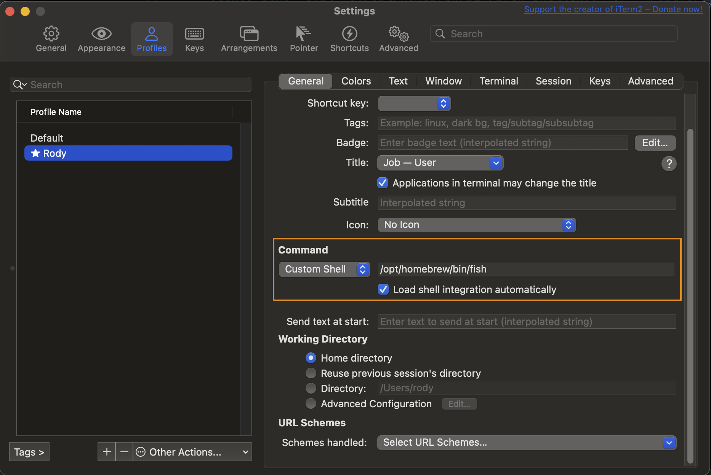
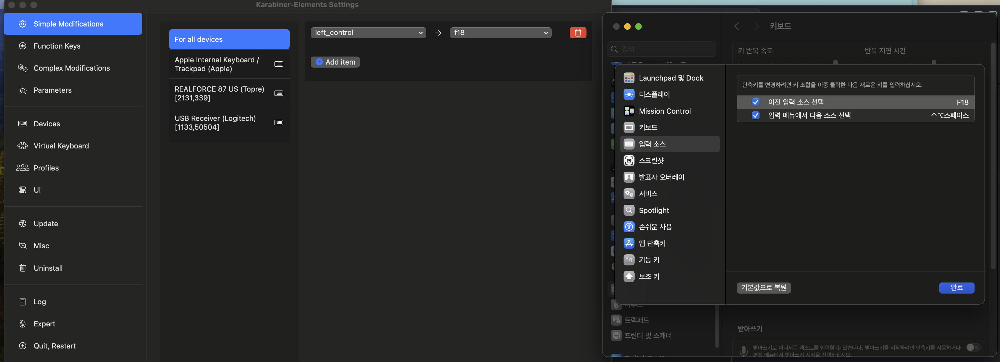
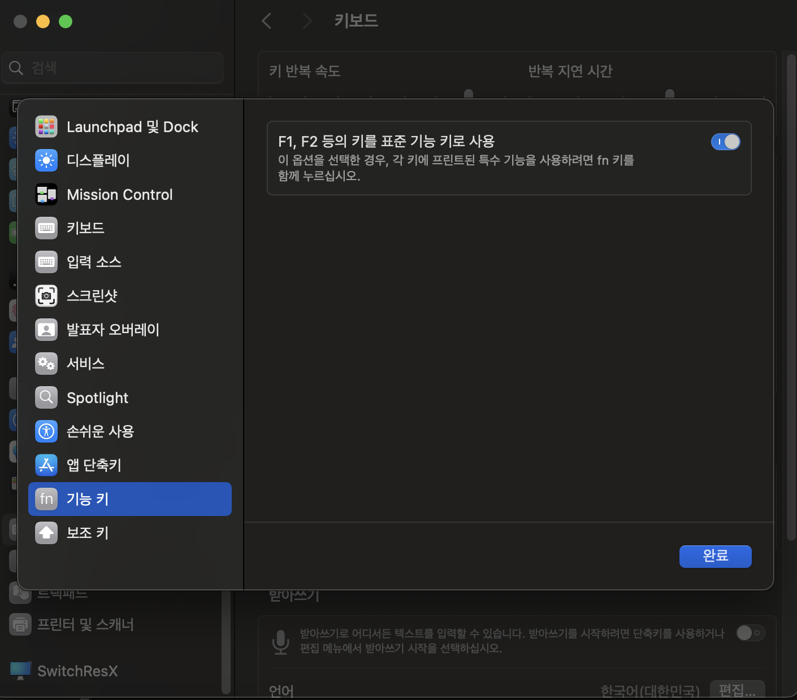
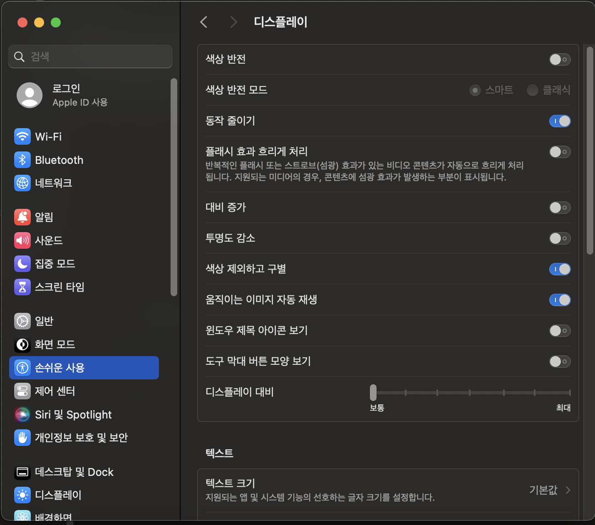

# Settings

- [Settings](#settings)
    - [homebrew](#homebrew)
    - [install shell framework and setting brew](#install-shell-framework-and-setting-brew)
        - [oh-my-zsh](#oh-my-zsh)
        - [fish 경우](#fish-경우)
            - [tide 프롬프트 설정](#tide-프롬프트-설정)
            - [그 외 플러그인](#그-외-플러그인)
    - [hidpi \&\& retina](#hidpi--retina)
        - [SwitchResX](#switchresx)
        - [one-key-hidpi](#one-key-hidpi)
    - [install karabiner](#install-karabiner)
    - [install fonts](#install-fonts)
    - [shift + space 키로 한/영 전환하기](#shift--space-키로-한영-전환하기)
        - [karabiner \& left shift + space](#karabiner--left-shift--space)
        - [`com.apple.symbolichotkeys`](#comapplesymbolichotkeys)
            - [`com.apple.symbolichotkeys.plist` 초기화](#comapplesymbolichotkeysplist-초기화)
        - [만약 리얼포스 for mac의 'mac special function switch' 키가 정상 동작하지 않을 경우](#만약-리얼포스-for-mac의-mac-special-function-switch-키가-정상-동작하지-않을-경우)
    - [mac에서 space 전환시 모션 줄이기](#mac에서-space-전환시-모션-줄이기)
    - [vscode 설치](#vscode-설치)
        - [vscode의 cli 인터페이스](#vscode의-cli-인터페이스)
    - [amazon q developer](#amazon-q-developer)
        - [cli](#cli)
    - [`.gitconfig` 설정](#gitconfig-설정)
    - [참고](#참고)

## [homebrew](https://brew.sh/)

```sh
/bin/bash -c "$(curl -fsSL https://raw.githubusercontent.com/Homebrew/install/HEAD/install.sh)"
```

```sh
==> This script will install:
/opt/homebrew/bin/brew
/opt/homebrew/share/doc/homebrew
/opt/homebrew/share/man/man1/brew.1
/opt/homebrew/share/zsh/site-functions/_brew
/opt/homebrew/etc/bash_completion.d/brew
/opt/homebrew
==> The following new directories will be created:
/opt/homebrew/bin
/opt/homebrew/include
/opt/homebrew/sbin
/opt/homebrew/opt
/opt/homebrew/var/homebrew/linked
/opt/homebrew/Cellar
/opt/homebrew/Caskroom
/opt/homebrew/Frameworks
```

```sh
Warning: /opt/homebrew/bin is not in your PATH.
  Instructions on how to configure your shell for Homebrew
  can be found in the 'Next steps' section below.

... 생략 ...

# 애널리틱스 정보 보내기 opt out
# /opt/homebrew/bin/brew analytics off
==> Homebrew has enabled anonymous aggregate formulae and cask analytics.
Read the analytics documentation (and how to opt-out) here:
  https://docs.brew.sh/Analytics
No analytics data has been sent yet (nor will any be during this install run).

# shell env를 로그인시 한번 적용하도록 .zprofile에 추가
==> Next steps:
- Run these two commands in your terminal to add Homebrew to your PATH:
    (echo; echo 'eval "$(/opt/homebrew/bin/brew shellenv)"') >> /Users/rody/.zprofile
    eval "$(/opt/homebrew/bin/brew shellenv)"
```

## install shell framework and setting brew

- [oh-my-zsh](https://ohmyz.sh/#install)

    ```shell
    sh -c "$(curl -fsSL https://raw.githubusercontent.com/ohmyzsh/ohmyzsh/master/tools/install.sh)"
    ```

- fish

    ```sh
    /opt/homebrew/bin/brew install fish
    ```

### oh-my-zsh

설치 후 [`~/.zprofile`](../../linux/commands/shell/zsh/zsh.md#zprofile)에 적용합니다.

```sh
(echo; echo 'eval "$(/opt/homebrew/bin/brew shellenv)"') >> /Users/rody/.zprofile
```

- [powerlevel10k](https://github.com/romkatv/powerlevel10k) 설정

### fish 경우

> NOTE:
>
> 사용시 다음 사항들을 고려합니다.
>
> - [POSIX 호환 아니고, 호환하는 걸 시도해본 적도 없는](https://stackoverflow.com/a/48735565), 별개의 shell이라는 점
> - `echo $?`, `echo {a..z}` 등의 명령어가 지원되지 않는다는 점
> - zshrc 등이 아닌 `~/.config/fish/config.fish` 등을 통해 구성이 이뤄진다는 점

iterm2 설정에서 프로필에서 사용할 Command에 설치한 fish shell을 설정합니다.



그리고 `~/.config/fish/config.fish` 파일에서 brew 경로를 알 수 있도록 다음과 같이 추가합니다.

```fish
if status is-interactive
    # Commands to run in interactive sessions can go here
    eval (/opt/homebrew/bin/brew shellenv)
end
```

그리고 `fish`의 [플러그인 관리자 `fisher`](https://github.com/jorgebucaran/fisher) 설치합니다.

```sh
curl -sL https://raw.githubusercontent.com/jorgebucaran/fisher/main/functions/fisher.fish | source && fisher install jorgebucaran/fisher
```

#### [tide](https://github.com/IlanCosman/tide?tab=readme-ov-file) 프롬프트 설정

다른 shell에서 사용하는 power10k와 같은 프롬프트를 설정합니다.

```sh
tide configure --auto --style=Lean --prompt_colors='True color' --show_time='24-hour format' --lean_prompt_height='Two lines' --prompt_connection=Solid --prompt_connection_andor_frame_color=Dark --prompt_spacing=Sparse --icons='Many icons' --transient=Yes
```

#### [그 외 플러그인](https://github.com/jorgebucaran/awsm.fish?tab=readme-ov-file)

- fzf

    ```sh
    fisher install PatrickF1/fzf.fish
    ```

## hidpi && retina

### [SwitchResX](https://www.madrau.com/)

- [맥북 확장 모니터에서 고해상도 HiDPI 설정하기](https://m.blog.naver.com/kairoskyk/223373234240)

### [one-key-hidpi](https://github.com/xzhih/one-key-hidpi)

## install karabiner

shift+space 사용해서 입력 소스 변경하거나 1 옆의 백틱(`)을 백틱으로 사용하기 위해 karabiner 설치

```sh
brew install --cask karabiner-elements
```

## install fonts

```sh
# https://gist.github.com/davidteren/898f2dcccd42d9f8680ec69a3a5d350e?permalink_comment_id=5156068#gistcomment-5156068
brew install --cask font-ubuntu-nerd-font
brew install --cask font-hack-nerd-font
brew install --cask font-symbols-only-nerd-font
```

## [shift + space 키로 한/영 전환하기](https://gist.github.com/dongminkim/5856427)

### karabiner & left shift + space

우측 쉬프트의 경우에는 무시하고, 좌측 쉬프트 + 스페이스 경우 입력 소스를 변경하려면 우선
"이전 입력 소스 선택"을 F18 기능 키로 바꿉니다.



그리고 karabiner.json 설정 파일에서 적용하고자 하는 프로필 하위에 다음 복합 수정 규칙을 추가합니다.

```json
{
    "complex_modifications": {
        "rules": [
            {
                "description": "Left Shift + Space to switch input source and disable Control + Space",
                "manipulators": [
                    {
                        "conditions": [
                            {
                                "input_sources": [
                                    {
                                        "input_source_id": "^com\\.apple\\.inputmethod\\.Korean\\.2SetKorean$"
                                    }
                                ],
                                "type": "input_source_unless"
                            }
                        ],
                        "from": {
                            "key_code": "spacebar",
                            "modifiers": {
                                "mandatory": ["left_shift"],
                                "optional": ["caps_lock"]
                            }
                        },
                        "to": [{ "key_code": "f18" }],
                        "type": "basic"
                    },
                    {
                        "conditions": [
                            {
                                "input_sources": [
                                    {
                                        "input_source_id": "^com\\.apple\\.inputmethod\\.Korean\\.2SetKorean$"
                                    }
                                ],
                                "type": "input_source_if"
                            }
                        ],
                        "from": {
                            "key_code": "spacebar",
                            "modifiers": {
                                "mandatory": ["left_shift"],
                                "optional": ["caps_lock"]
                            }
                        },
                        "to": [{ "key_code": "f18" }],
                        "type": "basic"
                    }
                ]
            }
        ]
    }
}
```

### `com.apple.symbolichotkeys`

또는 딜레이 없이 빠르게 한/영 전환을 하도록 OS X의 설정을 수정합니다.

단, 이 방법의 경우 shift + space 키로 빠르게 전환이 가능하지만,
**좌 shift, 우 shift 구별이 불가능**합니다.

- [원래 출처 블로그](https://macnews.tistory.com/297)
- [`com.apple.symbolichotkeys.plist`](../resources/com.apple.symbolichotkeys.plist) 참고


설정 > 키보드 > 키보드 단축키 > 입력 소스

```bash
#cp ~/Library/Preferences/com.apple.symbolichotkeys.plist /tmp/old.plist
defaults export com.apple.symbolichotkeys /tmp/old.plist
plutil -convert json /tmp/old.plist

# - Select the previous input source: .AppleSymbolicHotKeys."60"
# - Select next source in Input menu: .AppleSymbolicHotKeys."61"
# - 131072: Shift+Space
# - 655360: Shift+Option+Space
cat /tmp/old.plist | jq '.AppleSymbolicHotKeys."61".value.parameters=[32,49,131072] | .AppleSymbolicHotKeys."60".value.parameters=[32,49,655360]' > /tmp/new.plist

plutil -convert xml1 /tmp/new.plist
#cp /tmp/new.plist ~/Library/Preferences/com.apple.symbolichotkeys.plist
defaults import com.apple.symbolichotkeys /tmp/new.plist
```

> **parameters 배열의 의미**:
>
> 1. `parameters[1]`: 키 코드 - 예를 들어, 스페이스 바의 키 코드는 49입니다.
> 2. `parameters[2]`: 수정자 플래그 - 이 값은 보통 1048576이며, 수정자 키가 사용됨을 나타냅니다.
> 3. `parameters[3]`: 수정자 값 - 이 값이 실제로 어떤 수정자 키(Shift, Control, Option, Command 등)가 사용되는지를 결정합니다.

```bash
# 이후 컴퓨터 재로그인
defaults export com.apple.symbolichotkeys - \
    | plutil -convert json -o - - \
    | jq '.AppleSymbolicHotKeys["61"].value.parameters[2] = 131072 | .AppleSymbolicHotKeys["60"].value.parameters[2] = 655360' \
    | plutil -convert xml1 -o - - \
    | defaults import com.apple.symbolichotkeys -

# 백업한 내용으로 다시 복원
cat old.plist \
    | plutil -convert xml1 -o - - \
    | defaults import com.apple.symbolichotkeys -
```

이 명령어는 다음과 같은 작업을 수행합니다:

1. `com.apple.symbolichotkeys` 설정을 내보냅니다.
2. 내보낸 설정을 JSON 형식으로 변환합니다.
3. jq를 사용하여 JSON을 수정합니다:
   - "61" 키(입력 소스 전환)의 수정자를 131072(Shift)로 설정합니다.
   - "60" 키(이전 입력 소스 선택)의 수정자를 655360(Shift + Command)로 설정합니다.
4. 수정된 JSON을 다시 plist 형식으로 변환합니다.
5. 변환된 설정을 다시 가져옵니다.

#### `com.apple.symbolichotkeys.plist` 초기화

1. 먼저, 현재 설정의 백업을 만듭니다

    ```bash
    cp ~/Library/Preferences/com.apple.symbolichotkeys.plist ~/Desktop/com.apple.symbolichotkeys.backup.plist
    ```

2. 현재 설정 파일을 삭제합니다:

    ```bash
    rm ~/Library/Preferences/com.apple.symbolichotkeys.plist
    ```

3. 시스템 기본 설정 캐시를 정리하고 컴퓨터를 재부팅합니다.

    ```bash
    killall cfprefsd
    ```

    재부팅 후, 시스템은 자동으로 새로운 기본 `com.apple.symbolichotkeys.plist` 파일을 생성합니다.

단, 이 과정은 모든 사용자 정의 단축키 설정을 초기화합니다.
따라서 재부팅 후 키보드 단축키 관련 설정을 다시 확인하고 필요한 경우 재설정해야 합니다.
만약 문제가 해결되지 않거나 원래 설정으로 돌아가고 싶다면, 백업해둔 파일을 다음과 같이 복원합니다:

  ```bash
  cp ~/Desktop/com.apple.symbolichotkeys.backup.plist ~/Library/Preferences/com.apple.symbolichotkeys.plist
  killall cfprefsd
  ```

  그리고 다시 재부팅합니다.

### 만약 리얼포스 for mac의 'mac special function switch' 키가 정상 동작하지 않을 경우

'mac special function switch' 물리적인 키를 눌러서 활성화 하면 f1~12가 화면 밝기 조절, 음량 조절 등이 아닌 F1~F12 원래처럼 작동합니다.
근데 karabiner 설치 후 이 물리적 키 활성화 여부와 무관하게 f1~12가 기능 키가 아닌 밝기 조절, 음량 조절 들로 작동한다면 아래 사항들을 확인합니다.

1. Mac 시스템 설정 확인:
    
    - 시스템 설정 > 키보드로 이동하세요.
    - "F1, F2 등의 키를 표준 기능 키로 사용" 옵션을 확인하세요. 이 옵션은 키보드의 "mac special function switch"와 연동될 수 있습니다.

2. Karabiner-Elements 설정 확인:

    - Karabiner-Elements의 설정에서 "Function keys" 탭을 확인하세요.
    - "Use all F1, F2, etc. keys as standard function keys" 옵션이 켜져 있다면 끄세요.

3. Karabiner-Elements 설정 파일 수정:

    ```json
    {
        "complex_modifications": {
            "rules": [
                {
                    "description": "F1-F12 키 기능 유지",
                    "manipulators": [
                        {
                            "type": "basic",
                            "from": {"key_code": "f1"},
                            "to": [{"key_code": "f1"}],
                            "conditions": [{"type": "variable_if", "name": "fn", "value": 1}]
                        },
                        // F2부터 F12까지 같은 방식으로 추가
                    ]
                }
            ]
        }
    }
    ```

    설정 변경 후 Karabiner-Elements를 완전히 종료하고 다시 실행합니다.

4. 시스템 PLIST 파일 확인:
   - 백업해둔 `com.apple.symbolichotkeys.plist` 파일을 다시 한 번 확인하고, 필요하다면 원래대로 복원해보세요.

5. 시스템 캐시 정리:

    터미널에서 다음 명령어를 실행하고 이후 시스템을 재부팅합니다.

    ```sh
    sudo killall cfprefsd
    ```

## [mac에서 space 전환시 모션 줄이기](https://support.apple.com/ko-kr/guide/mac-help/mchlc03f57a1/mac)



## vscode 설치

[다운로드](https://code.visualstudio.com/Download) 후 설치합니다.

### [vscode의 cli 인터페이스](https://code.visualstudio.com/docs/editor/command-line)

[명령 팔렛트](https://code.visualstudio.com/docs/setup/mac#_launching-from-the-command-line) 통해서 `code` 커맨드를 PATH에 추가합니다.

이를 설치하면 `/usr/local/bin/code`라는 symlink가 생성됩니다.
[과거 스택오버플로우 코멘트를 보면 아래와 같이 동작](https://stackoverflow.com/questions/29971053/how-to-open-visual-studio-code-from-the-command-line-on-osx#comment88612022_29971430)한다는데,
과거에는 임시로 생성됐던 것 같고, 현재는 아래와 같이 symlink가 자동으로 생성됩니다.

```sh
rody@rodyui-MacBookPro ~> ll /usr/local/bin/code
lrwxr-xr-x  1 root  wheel    68B  8 22 12:16 /usr/local/bin/code@ -> /Applications/Visual Studio Code.app/Contents/Resources/app/bin/code
```

```sh
sudo ln -s  /Applications/Visual\ Studio\ Code.app/Contents/Resources/app/bin/code /usr/local/bin/code
```

## amazon q developer

### [cli](https://docs.aws.amazon.com/amazonq/latest/qdeveloper-ug/command-line.html)

```sh
brew install --cask amazon-q
```

## `.gitconfig` 설정

[`.gitconfig`](../resources/.gitconfig) 파일을 `~/.gitconfig` 파일에 적용합니다.

## 참고

- [MacOS X + oh my zsh + powerline fonts + visual studio code terminal settings](https://gist.github.com/480/3b41f449686a089f34edb45d00672f28)
