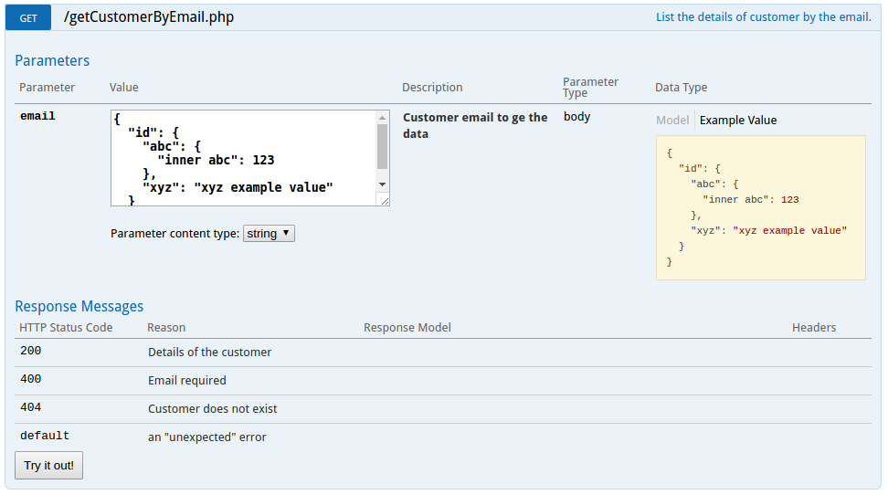

# swagger object

## nested object

[스택오버플로우 답변](https://stackoverflow.com/a/38989271)

```php
/**
 * @SWG\Post(
 *   path="/getCustomerByEmail.php",
 *   summary="List the details of customer by the email.",
 *   consumes={"string"},
 *   produces={"application/json"},
 *   @SWG\Parameter(
 *     name="email",
 *     in="body",
 *     description="Customer email to ge the data",
 *     required=true,
 *     @SWG\Schema(
 *       @SWG\Property(
 *         property="id",
 *         type="object",
 *         @SWG\Property(
 *           property="abc",
 *           type="object",
 *           @SWG\Property(
 *             property="inner abc",
 *             type="number",
 *             default=1,
 *             example=123
 *           )
 *         ),
 *         @SWG\Property(
 *           property="xyz",
 *           type="string",
 *           default="xyz default value",
 *           example="xyz example value",
 *         )
 *       )
 *     )
 *   ),
 *   @SWG\Response(
 *     response=200,
 *     description="Details of the customer"
 *   ),
 *   @SWG\Response(
 *     response=400,
 *     description="Email required"
 *   ),
 *   @SWG\Response(
 *     response=404,
 *     description="Customer does not exist"
 *   ),
 *   @SWG\Response(
 *     response="default",
 *     description="an ""unexpected"" error"
 *   )
 * )
 */
/**
```


