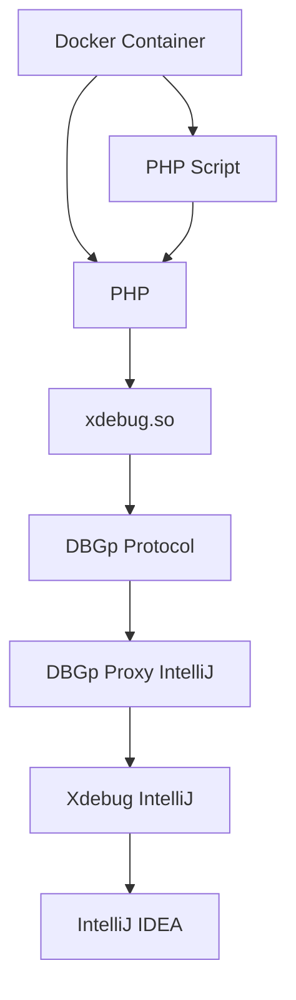
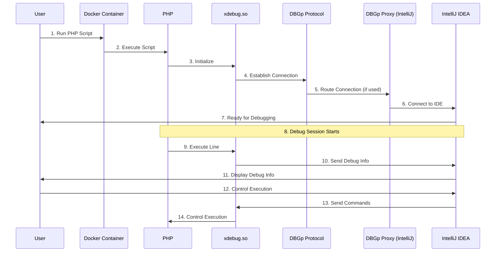
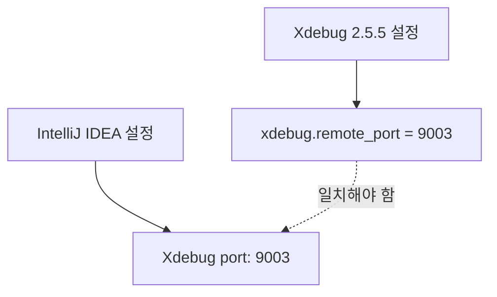

# xdebug

- [xdebug](#xdebug)
    - [xdebug?](#xdebug-1)
        - [설치](#설치)
    - [디버깅 오버뷰](#디버깅-오버뷰)
    - [Xdebug의 동작 원리](#xdebug의-동작-원리)
    - [DBGp](#dbgp)
        - [DBGp 작동 방식](#dbgp-작동-방식)
        - [DBGp 명령어 예시](#dbgp-명령어-예시)
    - [DBGp Proxy](#dbgp-proxy)
        - [DBGp Proxy 주요 기능](#dbgp-proxy-주요-기능)
    - [설정 정리](#설정-정리)
        - [`xdebug.ini`](#xdebugini)
        - [IntelliJ 설정](#intellij-설정)
            - [DBGp Proxy 포트와 Xdebug 포트](#dbgp-proxy-포트와-xdebug-포트)
    - [CLI 통해 실행시 디버깅](#cli-통해-실행시-디버깅)
        - [`PHP_IDE_CONFIG`](#php_ide_config)
        - [**도커 컨테이너 내에서 설정 시 로컬 IDE와의 통신**](#도커-컨테이너-내에서-설정-시-로컬-ide와의-통신)
    - [참고 문서](#참고-문서)

## xdebug?

Xdebug는 PHP용 디버거 및 프로파일러 확장입니다.

다음과 같은 기능을 제공합니다:
- 스택 트레이스 및 함수 호출 로그 생성
- 변수 및 메모리 사용량 디버깅
- PHP 코드의 성능을 프로파일링하여 성능 문제를 파악
- 코드 커버리지 분석
- IDE와 연동하여 코드 디버깅을 원활히 수행

### 설치

- 2.5.5 버전

    ```Dockerfile
    # XDebug install
    MAKEFLAGS="-j $(nproc)" pecl install xdebug-2.5.5 \

    # xdebug config
    COPY ./xdebug.ini /etc/php/5.6/fpm/conf.d/xdebug.ini
    COPY ./xdebug.ini /etc/php/5.6/cli/conf.d/xdebug.ini
    ```

## 디버깅 오버뷰



- Docker Container: PHP와 필요한 모든 구성 요소를 포함하는 격리된 환경입니다.
- PHP: 스크립트를 실행하는 엔진입니다.
- xdebug.so: PHP의 확장 모듈로, 디버깅 기능을 제공합니다.
- DBGp (Debug Protocol): Xdebug와 IDE 간의 통신 프로토콜입니다.
- DBGp Proxy (IntelliJ): 여러 디버그 세션을 관리하는 중개자 역할을 합니다 (선택적).
- Xdebug (IntelliJ): IDE 내의 Xdebug 클라이언트입니다.
- IntelliJ IDEA: 개발 및 디버깅을 위한 통합 개발 환경입니다.

PHP 스크립트 실행 시 다음과 같이 디버깅이 이뤄집니다.



1. 사용자가 Docker 컨테이너 내에서 PHP 스크립트 실행을 요청합니다.
2. Docker 컨테이너는 PHP 엔진에 스크립트 실행을 지시합니다.
3. PHP 엔진이 초기화되면서 xdebug.so 확장 모듈을 로드합니다.
4. Xdebug가 초기화되고, 디버그 모드가 활성화되어 있다면 DBGp 프로토콜을 사용하여 연결을 시도합니다.
5. DBGp 연결이 DBGp Proxy (사용 중인 경우)로 라우팅됩니다.
    - Proxy를 사용하지 않는 경우, 이 단계는 생략되고 직접 IDE와 연결됩니다.
6. DBGp Proxy 또는 Xdebug가 IntelliJ IDEA의 Xdebug 클라이언트와 연결을 설정합니다.
7. IntelliJ IDEA가 디버깅 준비가 되었음을 사용자에게 알립니다.
8. 디버그 세션이 시작되고, PHP 스크립트의 실행이 시작됩니다.
9. PHP가 각 라인을 실행할 때마다 Xdebug가 이를 감지하고 디버그 정보를 수집합니다.
10. Xdebug는 수집된 정보를 DBGp 프로토콜을 통해 IntelliJ IDEA로 전송합니다.
11. IntelliJ IDEA는 받은 디버그 정보를 사용자에게 표시합니다 (변수 값, 콜 스택 등).
12. 사용자는 IntelliJ IDEA를 통해 실행을 제어할 수 있습니다 (예: 중단점 설정, 단계별 실행).
13. 사용자의 명령은 IntelliJ IDEA에서 Xdebug로 전달되고, Xdebug는 이에 따라 PHP 실행을 제어합니다.
14. 이 과정은 스크립트 실행이 완료되거나 사용자가 디버그 세션을 종료할 때까지 반복됩니다.

## Xdebug의 동작 원리

Xdebug는 PHP 스크립트의 실행을 모니터링하고 중단점을 설정하거나 코드 실행을 단계별로 확인할 수 있게 합니다.
Xdebug는 DBGp(Debugger and Profiler) 프로토콜을 사용하여 디버깅 정보를 IDE로 전송합니다.

1. PHP 엔진에 후크(hook)

    Xdebug는 PHP 엔진의 여러 지점에 후크를 설치하여 코드 실행을 모니터링합니다.

2. 정보 수집

    PHP 코드가 실행되면, Xdebug는 설정된 중단점(Breakpoint)에서 코드 실행을 멈추고 정보를 수집합니다.
    코드가 실행될 때 Xdebug는 실행 경로, 변수 값, 메모리 사용량 등의 정보를 수집합니다.

3. 디버그 클라이언트와 통신

    IDE와 같은 디버그 클라이언트와 통신하여 수집된 정보를 전송하고 명령을 받습니다.
    이 통신은 DBGp(Debug General Protocol)라는 프로토콜을 사용하여 이루어집니다.
    IDE는 이 정보를 받아서 사용자에게 현재 코드의 상태를 시각적으로 보여줍니다.

4. 실행 제어

    디버그 모드에서는 브레이크포인트 설정, 단계별 실행 등의 제어가 가능합니다.
    IDE에서 코드의 상태를 확인하고, 변수 값을 변경하거나, 다음 코드 라인으로 진행할 수 있습니다.

## DBGp

DBGp는 Xdebug와 같은 디버거와 IDE 간의 상호작용을 원활하게 하여 개발자가 디버깅 작업을 효율적으로 수행할 수 있게 합니다.
- DBGp는 디버거 엔진과 클라이언트 간의 통신을 표준화하여 원활한 디버깅을 지원합니다. 이는 다양한 개발 환경과 도구가 서로 호환되도록 도와줍니다.
- DBGp는 디버거 엔진이 제공하는 정보를 클라이언트로 전달하고, 클라이언트의 명령을 디버거 엔진으로 전달합니다.

DBGp의 기능은 다음과 같습니다.

- **브레이크포인트 관리**: 클라이언트에서 설정한 브레이크포인트를 디버거 엔진이 인식하고 해당 위치에서 실행을 멈추는 기능.
- **스택 트레이스**: 디버거 엔진이 현재 스택 프레임의 정보를 클라이언트로 전달하여, 함수 호출 흐름을 파악할 수 있게 합니다.
- **변수 검사/수정 및 스택 프레임 정보 전송**: 현재 스코프에서 변수의 값을 검사하고, 필요시 값을 수정할 수 있는 기능.
- **단계별 실행**: 스크립트를 한 줄씩 실행하거나 함수 단위로 실행을 제어하는 기능.
- **디버그 세션 시작 및 종료**: 디버그 세션을 시작하고 종료하는 기능.

### DBGp 작동 방식

PHP 스크립트 실행 시 Xdebug와 같은 디버거 엔진이 활성화되어 DBGp 프로토콜을 통해 디버깅 데이터를 생성합니다.
그리고 PhpStorm과 같은 IDE가 DBGp 프로토콜을 통해 디버깅 세션을 관리합니다.

1. **디버그 세션 시작**:
   - 디버깅이 필요한 PHP 스크립트를 실행하면, PHP 엔진이 Xdebug 확장 모듈을 로드합니다.
   - Xdebug는 초기화되면서 DBGp 프로토콜을 통해 디버거 클라이언트인 IDE(예: IntelliJ IDEA)와 연결을 시도합니다.
   - 클라이언트인 IDE는 디버깅 요청을 수신하고, DBGp 프로토콜을 사용하여 디버그 세션을 시작합니다.

2. **브레이크포인트 설정**:
   - IDE에서 브레이크포인트를 설정하면, DBGp 명령어를 통해 해당 브레이크포인트 정보가 Xdebug로 전송됩니다.
   - Xdebug는 브레이크포인트를 설정하고, 해당 위치에 도달하면 코드 실행을 멈춥니다.

3. **코드 실행 및 중단**:
   - PHP 스크립트가 실행되면서 설정된 브레이크포인트에 도달하면, Xdebug는 코드 실행을 중단하고 현재 상태를 IDE에 전달합니다.
   - 이 과정에서 DBGp 프로토콜을 통해 현재 실행 위치, 스택 트레이스, 변수 값 등의 디버깅 정보를 전송합니다.

4. **스택 트레이스 및 변수 검사/수정**:
   - IDE는 DBGp 명령어를 통해 스택 트레이스 정보를 요청하고, Xdebug는 현재 스택 프레임 정보를 IDE에 전달합니다.
   - 사용자는 IDE를 통해 변수 값을 검사하고, 필요시 변수 값을 수정할 수 있습니다. 이 때, DBGp 명령어를 통해 변수 값이 수정됩니다.

5. **단계별 실행**:
   - 사용자는 IDE를 통해 코드의 단계별 실행을 제어할 수 있습니다. 예를 들어, 다음 줄로 이동, 함수 내로 진입, 함수 밖으로 나가기 등을 수행할 수 있습니다.
   - 이러한 명령어들은 DBGp 프로토콜을 통해 Xdebug로 전달되고, Xdebug는 해당 명령에 따라 코드를 실행합니다.

6. **디버그 세션 종료**:
   - 디버깅이 완료되면, IDE에서 디버그 세션을 종료합니다.
   - DBGp 명령어를 통해 디버그 세션 종료 명령이 Xdebug로 전달되고, Xdebug는 디버깅 세션을 종료합니다.

### DBGp 명령어 예시

DBGp 프로토콜은 여러 명령어를 통해 디버깅 세션을 제어합니다. 주요 명령어의 예시는 다음과 같습니다.

- **breakpoint_set**: 브레이크포인트를 설정하는 명령어

  ```xml
  <breakpoint_set file="file:///path/to/file.php" line="10" />
  ```

- **breakpoint_remove**: 브레이크포인트를 제거하는 명령어

  ```xml
  <breakpoint_remove breakpoint_id="1" />
  ```

- **stack_get**: 현재 스택 프레임 정보를 요청하는 명령어

  ```xml
  <stack_get />
  ```

- **context_get**: 현재 컨텍스트(변수 정보)를 요청하는 명령어

  ```xml
  <context_get />
  ```

- **step_into**: 함수 내로 진입하는 명령어

  ```xml
  <step_into />
  ```

- **step_over**: 다음 줄로 이동하는 명령어

  ```xml
  <step_over />
  ```

- **step_out**: 함수 밖으로 나가는 명령어

  ```xml
  <step_out />
  ```

- **stop**: 디버그 세션을 종료하는 명령어

  ```xml
  <stop />
  ```

## DBGp Proxy

DBGp Proxy는
1. 여러 개의 IDE 인스턴스 또는 여러 디버그 클라이언트가
2. 동시에
3. 동일한 서버에서
4. 실행되는 PHP 애플리케이션을 디버깅할 때 사용됩니다.

이는 여러 디버깅 세션을 관리하고 *올바른 세션을 올바른 IDE로 라우팅하는 역할*을 합니다.
IntelliJ IDEA에서는 이를 통해 복잡한 디버깅 환경에서도 원활하게 디버깅 작업을 수행할 수 있습니다.

[PhpStorm 설정](https://www.jetbrains.com/help/phpstorm/multiuser-debugging-via-xdebug-proxies.html#configure-multiuser-debugging-via-an-xdebug-proxy-dbgp-server) 문서에 따르면, 별도의 DBGp Proxy를 실행해야 합니다.
즉, IntelliJ에서 DBGp Proxy 설정을 했더라도, 실제로 DBGp Proxy 서버를 별도로 설치 및 실행하지 않았다면 그 설정은 효과가 없습니다.

> When a proxy is used, the PHP Xdebug extension no longer connects to PhpStorm directly,
> but instead connects to the DBGp proxy server.
> All developers in the team, in turn, then connect to that proxy.
> Each developer has a separate debugging session running over this proxy,
> which makes it possible to do multi-user debugging of the same code on the same server.

IntelliJ의 설정은 단지 IDE가 외부의 DBGp Proxy 서버와 어떻게 통신할지를 정의하는 것입니다.
이 설정 자체가 Proxy 서버를 생성하거나 실행시키지는 않습니다.
DBGp Proxy 기능을 사용하려면 다음 단계를 따라야 합니다:
- [DBGp Proxy 서버 소프트웨어를 별도로 설치](https://xdebug.org/download#dbgpProxy)
- [Proxy 서버를 실행](https://xdebug.org/docs/dbgpProxy)
- IntelliJ에서 실행 중인 Proxy 서버의 주소와 포트로 설정

따라 DBGp Proxy 설정만 있고 실제 실행중인 DBGp 프록시가 없다면, 그 설정은 현재 아무 효과가 없습니다.

### DBGp Proxy 주요 기능

1. **멀티 세션 관리**:
    - 들어오는 여러 디버그 세션을 동시에 관리할 수 있습니다. 이는 특히 여러 클라이언트가 동일한 서버에서 디버깅을 시도하는 경우 유용합니다.
    - 세션을 구분하고 관리하여 각 클라이언트가 독립적으로 디버깅 작업을 수행할 수 있도록 합니다.
    - 이는 동일한 서버에서 여러 개발자가 동시에 디버깅할 때 특히 유용합니다.

2. **IDE 식별**:
    - DBGp Proxy는 각 IDE를 `idekey`를 통해 식별합니다.
    - 개발자는 각자의 IDE에서 고유한 `idekey`를 설정하고, Proxy는 이 `idekey`를 기반으로 디버깅 세션을 올바른 IDE로 전달합니다.
    - `idekey`가 올바르지 않다면 아래와 같이 xdebug.log 가 출력되며 연결이 되지 않습니다.

        ```bash
        Log opened at 2024-07-02 06:03:23
        I: Connecting to configured address/port: host.docker.internal:9001.
        W: Creating socket for 'host.docker.internal:9001', poll success, but error: Operation now in progress (29).
        E: Could not connect to client. :-(
        Log closed at 2024-07-02 06:03:23
        ```

3. **세션 라우팅**:
    - 디버그 요청을 적절한 IDE 인스턴스로 라우팅합니다. 이를 통해 특정 디버그 요청이 올바른 개발 환경에 전달됩니다.
    - 라우팅 규칙을 설정하여 특정 조건에 따라 요청을 분배할 수 있습니다.
    - DBGp Proxy는 서버와 클라이언트 간의 네트워크 트래픽을 라우팅합니다. 이는 방화벽이나 네트워크 제약이 있는 환경에서 특히 유용합니다.

4. **로드 밸런싱**:
    - 여러 디버그 요청이 있을 때, 로드 밸런싱을 통해 각 세션의 부하를 균등하게 분산시킵니다.
    - 이를 통해 디버깅 성능을 최적화하고 시스템 과부하를 방지할 수 있습니다.

5. **세션 재사용**:
    - 이미 존재하는 디버그 세션을 재사용할 수 있도록 지원합니다. 이는 동일한 코드에 대해 반복적인 디버깅을 수행할 때 유용합니다.
    - 세션 재사용을 통해 초기화 시간을 줄이고 효율성을 높일 수 있습니다.

6. **디버그 로그 관리**:
    - 디버그 세션의 로그를 관리하고 저장합니다. 이를 통해 디버깅 과정에서 발생한 문제를 추적하고 분석할 수 있습니다.
    - 로그 데이터를 기반으로 디버깅 성능 및 효율성을 평가할 수 있습니다.

7. **보안 및 인증**:
    - 디버그 세션에 대한 인증 및 권한 부여 기능을 제공합니다. 이를 통해 권한 없는 사용자가 디버깅 세션에 접근하지 못하도록 합니다.
    - SSL/TLS를 통한 암호화 통신을 지원하여 디버깅 데이터의 보안을 강화합니다.

## 설정 정리



### `xdebug.ini`

```ini
; NOTE: The actual debug.so extention is NOT SET HERE but rather (/usr/local/etc/php/conf.d/docker-php-ext-xdebug.ini)
zend_extension = /usr/lib/php/20131226/xdebug.so
xdebug.remote_host=host.docker.internal
xdebug.remote_connect_back=0
xdebug.remote_port=9001
xdebug.idekey=some_idekey

xdebug.remote_autostart=1
xdebug.remote_enable=1
xdebug.cli_color=0
xdebug.profiler_enable=0
xdebug.profiler_output_dir="~/xdebug/phpstorm/tmp/profiling"

xdebug.remote_handler=dbgp
xdebug.remote_mode=req

xdebug.var_display_max_children=-1
xdebug.var_display_max_data=-1
xdebug.var_display_max_depth=-1
```

- `xdebug.remote_host`

    Xdebug가 디버그 정보를 전송할 호스트를 지정합니다.
    Docker 호스트 머신의 IP 주소를 직접 설정할 수도 있습니다.
    `host.docker.internal`는 Docker에서 호스트 머신을 가리키는 특별한 DNS 이름입니다.

- `idekey`:

    `idekey`는 Xdebug와 IDE 간의 세션을 식별하는 키입니다.
    이는 *여러 개의 디버깅 세션을 관리*하거나 *동일한 호스트에서 여러 개의 IDE가 디버깅*을 수행할 때 유용합니다.
    Xdebug는 디버그 세션 시작 시 `idekey`를 함께 전송하여 해당 세션을 특정 IDE와 연관짓습니다.

    IntelliJ는 다음과 같이 `idekey`를 인지합니다:
    - IntelliJ의 설정에서 디버그 구성(Configuration)을 통해 `idekey`를 설정합니다.
    - Xdebug가 디버그 세션을 시작할 때, 설정된 `idekey`를 전송합니다.
    - IntelliJ는 수신된 `idekey`와 자신의 설정된 `idekey`를 비교하여 세션을 식별하고 연동합니다.

    브라우저에서 디버그 세션을 시작할 때 이 `idekey`를 쿠키나 GET/POST 파라미터로 전달합니다.
    Xdebug는 이 key를 확인하고 해당 IDE와 연결합니다.

- `xdebug.remote_handler=dbgp`

    `dbgp`는 PHP와 같은 스크립트 언어에서 디버깅을 하기 위해 개발된 프로토콜입니다.
    이 프로토콜은 *디버거 엔진(예: Xdebug)과 디버거 클라이언트(예: IDE) 간의 통신을 담당*합니다.
    Xdebug는 DBGp 프로토콜을 사용하여 디버깅 정보를 전송합니다.

### IntelliJ 설정

- `Languages & Frameworks > PHP > Debug` 메뉴

    Xdebug port를 `xdebug.ini` 설정의 `xdebug.remote_port` 포트와 동일한 값으로 설정합니다.
    - PHP 서버의 Xdebug 확장이 디버그 정보를 보내는 포트이며,
    - 동시에 Xdebug가 디버그 연결을 수신하는 데 사용하는 포트입니다.

- `PHP > Servers`에서 서버들 추가

    ```plaintext
    api.localhost
    - Name: api.localhost
    - Host: api.localhost
    - Port: 8001
    - Use path mapping(docker container 사용하고 있어서 경로 지정)

        Local 호스트에서의 경로                     도커 컨테이너 내에서의 경로    
        /Users/rody/IdeaProjects/some-B-serivce    /var/www/api
    ```

- (별도 DBGp Proxy 프로그램 실행했다면) `PHP > Debug > DBGp Proxy`

    ```bash
    IDE key: ${xdebug.idekey}
    Host: localhost
    Port: 9001
    ```

    이 포트는 IDE(PhpStorm)가 DBGp Proxy 서버에 연결하는 데 사용됩니다.
    *IDE와 DBGp Proxy 서버 간의 통신을 위한 포트*입니다.

#### DBGp Proxy 포트와 Xdebug 포트

- **Xdebug 포트**

    Xdebug는 디버거 엔진으로서, PHP 스크립트의 디버깅 정보를 IDE(예: PhpStorm)로 전달합니다.
    이때 Xdebug는 특정 포트를 통해 디버그 정보를 보냅니다.

    Xdebug는 PHP 스크립트가 실행될 때 디버깅 정보를 전송하는 데 사용되는 포트를 설정합니다.
    이 포트는 `xdebug.remote_port` 설정으로 지정됩니다.

    PHP 스크립트가 실행되고, Xdebug는 디버깅 정보를 설정된 포트(`xdebug.remote_port`)를 통해 전송합니다.

- **DBGp Proxy 포트**

    DBGp Proxy는 여러 *디버깅 클라이언트(IDE)와 디버거 엔진(Xdebug) 간의 통신을 중계*합니다.
    즉, 여러 클라이언트가 동일한 디버거 엔진을 사용할 때 발생하는 충돌을 방지하고, 올바른 클라이언트로 디버그 정보를 전달하는 역할을 합니다.

    DBGp Proxy는 클라이언트와 디버거 엔진 간의 통신을 중계하기 위해 자체 포트를 설정합니다.
    이는 클라이언트가 DBGp Proxy에 연결하여 디버깅 세션을 관리하도록 합니다.

    DBGp Proxy는 이 디버깅 정보를 수신하고, 이를 올바른 클라이언트(IDE)로 중계합니다.
    이때 DBGp Proxy는 자신의 포트를 통해 클라이언트와 통신합니다.
    클라이언트(IDE)는 DBGp Proxy와 통신하며 디버깅 정보를 수신하고, 필요 시 DBGp Proxy를 통해 디버거 엔진(Xdebug)으로 명령을 보냅니다.

## CLI 통해 실행시 디버깅

IntelliJ에서 Language & Frameworks > PHP > Servers 메뉴에 *여러 도메인에 대해 여러 경로가 맵핑*되어 있는 경우,
cli로 PHP 스크립트 실행시 디버깅을 하려면 PHP_IDE_CONFIG 옵션을 지정해야 디버깅이 정상적으로 동작합니다.

```bash
PHP_IDE_CONFIG="serverName=api.localhost" php some_script.php
```

### `PHP_IDE_CONFIG`

`PHP_IDE_CONFIG` 환경 변수는 Xdebug와 같은 PHP 디버깅 도구 또는 Xdebug와 통합된 IDE(예: IntelliJ, PhpStorm)에서 사용됩니다.
이 환경 변수는 PHP 스크립트가 실행될 때 디버그 세션이 어떤 서버 설정을 참조해야 하는지 알려줍니다.

즉, 디버그 세션을 시작할 때 IDE가 올바른 서버 설정을 사용할 수 있도록 돕습니다:
- IDE와 Xdebug 간의 매핑을 제공합니다.
- IDE에 어떤 프로젝트 설정을 사용해야 하는지 알려줍니다.

    가령 Docker 컨테이너 내부의 파일 경로와 로컬 개발 환경의 경로가 다릅니다.
    *`serverName`을 통해 IDE는 올바른 경로 매핑을 적용*할 수 있습니다.

    여러 프로젝트를 동시에 디버깅할 때, `serverName`으로 각 프로젝트를 구분합니다.

따라서 IDE의 PHP > Servers 설정에서 정의한 서버 이름과 `PHP_IDE_CONFIG="serverName=my_server"`의 이름이 일치해야 합니다.

이를 통해 로컬 호스트의 IDE는:
- 어떤 디버그 설정을 사용할지 결정할 수 있고
- 디버그 세션을 인지하고 올바르게 연결할 수 있습니다.

### **도커 컨테이너 내에서 설정 시 로컬 IDE와의 통신**

Docker 컨테이너 내에서 `PHP_IDE_CONFIG` 환경 변수를 설정하는 것은 Xdebug가 로컬 IDE와의 통신을 설정하는 데 도움이 됩니다.
이 환경 변수는 Xdebug가 디버깅 요청을 보낼 때 사용할 서버 설정을 정의합니다.
이를 통해 Xdebug가 올바른 호스트와 포트로 디버깅 데이터를 전송할 수 있습니다.

`serverName=my_server` 형식으로 설정됩니다.
- `serverName`: 디버깅 요청을 보낼 서버의 이름입니다.
- `my_server`: 디버깅 세션을 식별하기 위해 사용하는 키입니다. 디버깅 요청이 올 때 어떤 서버 설정을 사용할지 결정하는 데 사용됩니다.

이 설정을 통해 Docker 컨테이너 내에서 실행되는 PHP 코드와 로컬 IDE 간의 디버깅 통신이 원활하게 이루어질 수 있습니다.

```yaml
version: '3'
services:
  php:
    image: php:7.4-apache
    volumes:
      - .:/var/www/html
    environment:
      PHP_IDE_CONFIG: "serverName=my_server"
      XDEBUG_CONFIG: "remote_host=host.docker.internal remote_port=9000"
```

```ini
xdebug.remote_enable = 1
xdebug.remote_autostart = 1
xdebug.remote_host = host.docker.internal
xdebug.remote_port = 9000
```

`xdebug.remote_host`와 IntelliJ의 'Language & Frameworks > PHP > Servers'에서 설정하는 서버와의 이름 불일치는 디버깅 통신에 영향을 주지 않습니다.
- `xdebug.remote_host`는 Xdebug가 디버깅 요청을 보내는 호스트 주소를 지정
- IntelliJ의 'Language & Frameworks > PHP > Servers'에서 설정하는 서버는 디버깅 세션을 식별 위한 용도

`xdebug.remote_host`와 `PHP_IDE_CONFIG`의 역할과 작동 방식은 다음과 같습니다.

1. **디버깅 요청 전송**:
    - PHP 스크립트가 실행될 때, Xdebug는
        - `xdebug.remote_host`에 설정된 주소(`host.docker.internal`)로 디버깅 요청을 보냅니다.
        - 또한 `PHP_IDE_CONFIG` 환경 변수를 확인하고, 해당 서버 이름(`"serverName=my_server"`)을 참조하여 디버깅 요청을 보냅니다.
    - 이 요청은 Docker 컨테이너 내부에서 로컬 호스트(127.0.0.1)를 가리키며, 호스트 머신의 IntelliJ IDEA가 수신합니다.

2. **디버깅 세션 식별**:
    - 로컬 호스트의 IDE(예: PhpStorm)는
        - DBGp 프로토콜을 통해 디버깅 요청을 수신하고, `PHP_IDE_CONFIG`에 설정된 `serverName`을 참조하여 올바른 디버깅 세션을 시작합니다.
        - 수신한 디버깅 요청을 `PHP > Servers` 설정에서 정의된 서버 이름(`my_server`)을 사용하여 식별하고 관리합니다.
    - 이 설정은 주로 디버깅 세션을 구분하고, 특정 프로젝트 또는 서버에 대한 설정을 지정하는 데 사용됩니다.
    - 이 서버 이름은 Xdebug가 보낸 디버깅 요청의 수신과 직접적인 연관이 없습니다.

여러 서버에 여러 패스 맵핑이 되어 있다면, 해당 서버를 인식하게 해야 정상적으로 디버깅이 가능합니다.
그 어떤 서버의 경로로 맵핑할지 제대로 인식하게 하려면 [`PHP_IDE_CONFIG` 환경변수](https://www.jetbrains.com/help/phpstorm/debugging-a-php-cli-script.html#starting-script-with-zend-debugger)를 사용해야 합니다.

```bash
PHP_IDE_CONFIG="serverName=api.localhost" php some_script.php
```

- 만약 그럼에도 실행이 안 된다면,
    - /path/to/cli/conf.d/xdebug.ini 에서 `xdebug.remote_port=IDE의 Xdebug Port` 를 확인합니다. 다르다면 일치시키고 listen debugging connection을 다시 시작합니다.
    - 그럼에도 안 된다면, Postman 등을 통해서 api.localhost:8001 로 접근하여 IDE가 해당 서버 설정과 맵핑이 되는지 확인합니다.

## 참고 문서

- [Xdebug 공식 문서](https://xdebug.org/docs/all_settings#remote_port)
- [PhpStorm DBGp Proxy 설정 문서](https://www.jetbrains.com/help/phpstorm/debugging-a-php-cli-script.html)
- [Xdebug 프로토콜 설명](https://xdebug.org/docs/dbgp)
- [Just in time debugging and debugger proxies](https://xdebug.org/docs/dbgp#just-in-time-debugging-and-debugger-proxies)
- [Multiuser debugging via Xdebug proxies](https://www.jetbrains.com/help/phpstorm/multiuser-debugging-via-xdebug-proxies.html)
