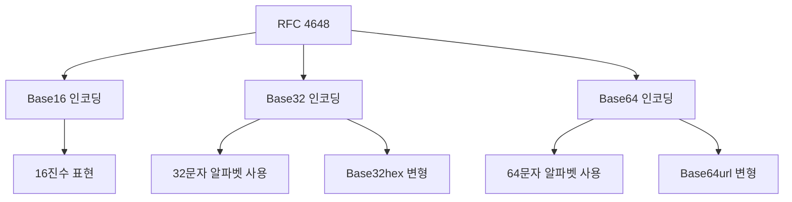

# [RFC 4648](https://www.rfc-editor.org/rfc/rfc4648.html)

- [RFC 4648](#rfc-4648)
    - [RFC 4648: The Base16, Base32, and Base64 Data Encodings](#rfc-4648-the-base16-base32-and-base64-data-encodings)
    - [Base64 인코딩 상세 분석](#base64-인코딩-상세-분석)
    - [전체 시스템에서의 역할 및 상호작용](#전체-시스템에서의-역할-및-상호작용)
    - [비교 분석](#비교-분석)
    - [최첨단 연구 동향](#최첨단-연구-동향)
    - [심화 학습 내용 및 관련 개념](#심화-학습-내용-및-관련-개념)

## RFC 4648: The Base16, Base32, and Base64 Data Encodings

RFC 4648는 [Internet Engineering Task Force (IETF)](https://www.ietf.org/)에서 2006년 10월에 발행한 표준 문서로, 바이너리 데이터를 텍스트로 안전하게 인코딩하는 표준 방법을 정의한 문서입니다.
이 표준의 주요 목적은 *다양한 시스템과 프로토콜에서 바이너리 데이터를 일관되고 안전하게 처리할 수 있도록 하는 것*입니다.
Base16, Base32, 그리고 Base64 데이터 인코딩 방식을 정의합니다.

이 문서는 이전의 [RFC 3548](https://datatracker.ietf.org/doc/html/rfc3548)을 대체하며, 데이터 인코딩 방식에 대한 더 명확하고 상세한 설명을 제공합니다.

[RFC 4648의 역사적 맥락과 중요성](https://www.rfc-editor.org/info/rfc4648)은 인터넷 상에서 데이터를 안전하게 전송하고 저장하는 데 있어 중요한 역할을 합니다.
이 표준은 이메일 첨부 파일, URL 인코딩, 암호화 키 교환 등 다양한 응용 분야에서 널리 사용됩니다.



> - 인코딩(Encoding)이란? 데이터를 다른 형식으로 변환하는 과정
> - 디코딩(Decoding)이란? 인코딩된 데이터를 원래 형식으로 복원하는 과정

1. Base64 인코딩: 64개의 문자를 사용하여 데이터를 인코딩하는 방식을 정의합니다.
    - 표준 Base64 알파벳: `A-Z`(26), `a-z`(26), `0-9`(10), `+`(1), `/`(1)
    - 패딩 문자: `=`

2. Base64url 인코딩: URL 및 파일명에 안전한 Base64 변형을 정의합니다.
    - 알파벳: `A-Z`(26), `a-z`(26), `0-9`(10), `-`(1), `_`(1)

3. Base32 인코딩: 32개의 문자를 사용하여 데이터를 인코딩하는 방식을 정의합니다.
    - 알파벳: `A-Z`(26), `2-7`(6)
    - 패딩 문자: `=`

4. Base32hex 인코딩: Base32의 변형으로, 16진수 표현에 더 적합한 알파벳을 사용합니다.
    - 알파벳: `0-9`(10), `A-V`(22)

5. Base16 인코딩: 16진수를 사용하여 데이터를 인코딩하는 방식을 정의합니다.
    - 알파벳: `0-9`(10), `A-F`(6)

## Base64 인코딩 상세 분석

Base64 인코딩은 [바이너리 데이터를 ASCII 문자열로 변환하는 인코딩 방식](https://en.wikipedia.org/wiki/Base64)입니다.
1. 8비트 이진 데이터를 6비트 단위로 나누고
2. 이를 64개의 문자로 표현

Base64의 이론적 기반은 [정보 이론](https://en.wikipedia.org/wiki/Information_theory)과 [디지털 통신](https://en.wikipedia.org/wiki/Digital_communication)에 근거합니다.

Base64 인코딩은 6비트로 표현할 수 있는 2^6 = 64가지 상태를 문자로 매핑하여 데이터를 표현합니다.
이는 정보 이론에서 말하는 정보의 엔트로피와 관련이 있습니다.
6비트는 $\log_{2}{64} = 6$비트의 정보를 담을 수 있으므로, Base64는 정보의 손실 없이 인코딩이 가능합니다

Base64 인코딩은 다음 항목들로 구성됩니다:
- 인코딩 알파벳: `A-Z`, `a-z`, `0-9`, `+`, `/` (총 64문자)
- 패딩 문자: `=` (입력 데이터의 길이가 3의 배수가 아닐 때 사용)

작동 원리:

```sh
"Man" -> 77 97 110 (ASCII)
-> 010011 010101 100001 101110 (6비트 그룹)
-> TWFu (Base64 인코딩 결과)
```

1. 입력 데이터를 8비트 바이트 단위로 그룹화합니다.
2. 8비트 그룹을 6비트 단위로 재구성합니다.
3. 6비트 값을 Base64 알파벳의 해당 문자로 변환합니다.
4. 출력 길이가 4의 배수가 되도록 필요시 '=' 문자로 패딩합니다.

> **`<<< 'Man'`와 `echo 'Man'` 경우와 `echo -n 'Man'`가 다른 이유**:
>
> ```sh
> ❯ base64 <<< 'Man'
> TWFuCg==
>
> ❯ echo 'Man' | base64
> TWFuCg==
> 
> ❯ echo -n 'Man' | base64
> TWFu
> ```
>
> 이는 셸의 `here-string` (`<<<`) 사용 시 자동으로 줄바꿈(`\n`)이 추가되기 때문입니다.
> 따라서 `<<<` 또는 `echo` 사용시 실제로는 `\n`이 붙게 되고,
> "Man\n" 문자열은 77 97 110 10(ASCII)가 됩니다.
>
> ```sh
> 입력: "Man" (셸에서 here-string 사용 시 실제로는 "Man\n")
> ASCII: 77 97 110 10
> 6비트 그룹: 010011(19) 010110(22) 100001 101110 001010 00
> Base64:       T           W     F     u     C     g
> 결과: TWFuCg==
> ```
>

최적화 및 성능 고려사항:
- 룩업 테이블 사용: 인코딩/디코딩 속도 향상
- 병렬 처리: 대용량 데이터 처리 시 성능 개선

실제 구현 예시:

```python
import base64

# Base64 인코딩
def base64_encode(data):
    # data를 바이트로 변환
    if isinstance(data, str):
        data = data.encode('utf-8')
    
    # Base64 인코딩 수행
    encoded = base64.b64encode(data)
    
    # 결과를 문자열로 변환하여 반환
    return encoded.decode('utf-8')

# Base64 디코딩
def base64_decode(encoded_data):
    # Base64 디코딩 수행
    decoded = base64.b64decode(encoded_data)
    
    # 결과를 문자열로 변환하여 반환
    return decoded.decode('utf-8')

# 사용 예시
original_data = "Hello, World!"
encoded = base64_encode(original_data)
decoded = base64_decode(encoded)

print(f"Original: {original_data}")
print(f"Encoded: {encoded}")
print(f"Decoded: {decoded}")

# 결과:
# Original: Hello, World!
# Encoded: SGVsbG8sIFdvcmxkIQ==
# Decoded: Hello, World!

# 패딩 예시
print(base64_encode("a"))     # YQ==
print(base64_encode("ab"))    # YWI=
print(base64_encode("abc"))   # YWJj
```

이 Python 코드는 `base64` 모듈을 사용하여 Base64 인코딩과 디코딩을 구현합니다. `base64_encode` 함수는 입력 데이터를 Base64로 인코딩하고, `base64_decode` 함수는 Base64로 인코딩된 데이터를 원래 형식으로 디코딩합니다.

Base64 인코딩의 이론적 한계 및 실제 적용시 주의점:
1. 데이터 크기 증가: 인코딩 후 데이터 크기가 약 33% 증가합니다.
2. 패딩 처리: 디코딩 시 패딩 문자 처리에 주의가 필요합니다.
3. URL 안전성: 표준 Base64는 URL에 안전하지 않으므로, URL에서는 Base64url을 사용해야 합니다.

최신 연구 동향 및 개선 방향:
- [압축 Base64 인코딩](https://www.sciencedirect.com/science/article/pii/S1877050920316999): 데이터 크기 증가 문제를 해결하기 위한 연구
- [양자 내성 암호와의 통합](https://www.etsi.org/technologies/quantum-safe-cryptography): 양자 컴퓨팅 시대를 대비한 안전한 인코딩 방식 연구

## 전체 시스템에서의 역할 및 상호작용

RFC 4648에서 정의된 인코딩 방식들은 [다양한 네트워크 프로토콜과 애플리케이션](https://en.wikipedia.org/wiki/Base64#Variants_summary_table)에서 중요한 역할을 합니다:

1. 이메일 시스템: MIME(Multipurpose Internet Mail Extensions)에서 Base64를 사용하여 바이너리 첨부 파일을 텍스트로 인코딩합니다.
2. 웹 애플리케이션: URL 인코딩, 쿠키 저장, API 토큰 전송 등에 사용됩니다.
3. 암호화 시스템: 암호화 키, 디지털 서명 등을 ASCII 형식으로 표현할 때 사용됩니다.

이러한 인코딩 방식들은 다른 시스템 구성 요소들과 다음과 같이 상호작용합니다:
- 데이터 저장 시스템: 바이너리 데이터를 텍스트 형식으로 저장할 때 사용됩니다.
- 네트워크 전송 프로토콜: 바이너리 데이터를 안전하게 전송하기 위해 사용됩니다.
- 보안 시스템: 암호화 키와 인증 토큰을 안전하게 표현하고 전송하는 데 사용됩니다.

이러한 인코딩 방식들은 시스템의 전반적인 성능, 확장성, 보안에 다음과 같은 영향을 미칩니다:
- 성능: 인코딩/디코딩 과정이 추가되어 약간의 오버헤드가 발생할 수 있습니다.
- 확장성: 텍스트 기반 시스템과의 호환성을 제공하여 시스템 확장성을 향상시킵니다.
- 보안: 데이터를 직접적으로 암호화하지는 않지만, 암호화 시스템과 함께 사용되어 보안성을 높입니다.

## 비교 분석

RFC 4648에서 정의된 인코딩 방식들을 다른 데이터 표현 방식과 비교해보겠습니다:

1. [Hexadecimal (Base16)](https://en.wikipedia.org/wiki/Hexadecimal) vs Base64
   - Base16: 더 간단하고 직관적이지만, 데이터 크기가 2배로 증가합니다.
   - Base64: 더 효율적인 인코딩이지만, 복잡성이 증가합니다.

2. [URL Encoding](https://en.wikipedia.org/wiki/Percent-encoding) vs Base64url
   - URL Encoding: 모든 ASCII 문자를 안전하게 인코딩할 수 있지만, 효율성이 낮습니다.
   - Base64url: 더 효율적이지만, 모든 문자를 안전하게 인코딩하지는 않습니다.

3. [Binary](https://en.wikipedia.org/wiki/Binary_code) vs Base64
   - Binary: 원본 데이터를 그대로 표현하여 효율적이지만, 텍스트 기반 시스템과 호환되지 않습니다.
   - Base64: 텍스트 기반 시스템과 호환되지만, 데이터 크기가 증가합니다.

장단점 분석 및 적합한 사용 시나리오:
- Base64: 이메일 첨부 파일, 일반적인 바이너리 데이터 인코딩에 적합
- Base32: 대소문자 구분이 없는 환경, 음성으로 읽어야 하는 상황에 적합
- Base16: 간단한 바이너리 표현, 디버깅 목적에 적합
- Base64url: URL, 파일명 등 특수문자 사용이 제한된 환경에 적합

## 최첨단 연구 동향

RFC 4648에서 정의된 인코딩 방식들과 관련된 최신 연구 동향 및 산업계 적용 사례입니다:

1. [양자 내성 암호화와의 통합](https://www.etsi.org/technologies/quantum-safe-cryptography):
   - 양자 컴퓨터의 위협에 대비한 새로운 암호화 알고리즘과 Base64 인코딩의 결합 연구
   - 영향: 미래의 양자 컴퓨팅 시대에도 안전한 데이터 전송 및 저장 가능

2. [압축 Base64 인코딩](https://www.sciencedirect.com/science/article/pii/S1877050920316999):
   - Base64 인코딩으로 인한 데이터 크기 증가 문제를 해결하기 위한 압축 기술 연구
   - 영향: 네트워크 대역폭 절약 및 스토리지 효율성 향상

3. [블록체인에서의 활용](https://ieeexplore.ieee.org/document/8751460):
   - 블록체인 트랜잭션 데이터 인코딩에 Base64 사용
   - 영향: 분산 시스템에서의 데이터 일관성 및 효율성 향상

4. [IoT(사물인터넷) 데이터 전송 최적화](https://www.mdpi.com/1424-8220/20/9/2611):
   - 제한된 리소스를 가진 IoT 기기에서 효율적인 데이터 전송을 위한 인코딩 최적화 연구
   - 영향: IoT 기기의 배터리 수명 연장 및 네트워크 효율성 향상

5. [머신러닝 모델 직렬화](https://arxiv.org/abs/2006.12459):
   - 학습된 머신러닝 모델을 Base64로 인코딩하여 저장 및 전송하는 기법 연구
   - 영향: 클라우드와 엣지 디바이스 간 모델 공유 및 배포 효율성 증가

이러한 연구 동향은 RFC 4648에서 정의된 인코딩 방식들이 현대 기술 발전에 따라 계속해서 진화하고 있음을 보여줍니다.

## 심화 학습 내용 및 관련 개념

1. [데이터 압축 알고리즘](https://en.wikipedia.org/wiki/Data_compression): Base64 인코딩은 데이터 크기를 증가시키므로, 효율적인 데이터 전송을 위해 압축 알고리즘과 함께 사용되는 경우가 많습니다. 압축 알고리즘은 RFC 4648의 인코딩 방식과 상호 보완적으로 사용될 수 있습니다.

2. [암호화 알고리즘](https://en.wikipedia.org/wiki/Encryption): Base64 등의 인코딩은 암호화가 아니지만, 암호화된 데이터를 안전하게 전송하기 위해 함께 사용됩니다. 현대 암호화 기술과 RFC 4648 인코딩의 조합에 대한 이해가 중요합니다.

3. [정보 이론](https://en.wikipedia.org/wiki/Information_theory): Claude Shannon의 정보 이론은 데이터 인코딩의 이론적 기반을 제공합니다. RFC 4648의 인코딩 방식들을 정보 이론의 관점에서 분석하면 그 효율성과 한계를 더 깊이 이해할 수 있습니다.

4. [유니코드와 문자 인코딩](https://www.w3.org/International/articles/definitions-characters/): Base64 등의 인코딩은 바이너리 데이터를 다루지만, 실제 응용에서는 다양한 문자 인코딩과 함께 사용됩니다. 유니코드와 UTF-8 같은 문자 인코딩 시스템에 대한 이해가 필요합니다.

5. [네트워크 프로토콜 스택](https://en.wikipedia.org/wiki/Protocol_stack): RFC 4648의 인코딩 방식들은 주로 응용 계층에서 사용되지만, 전체 네트워크 프로토콜 스택에 대한 이해가 이들의 역할을 더 명확히 파악하는 데 도움이 됩니다.

6. [공개 키 기반구조(PKI)](https://en.wikipedia.org/wiki/Public_key_infrastructure): Base64는 PKI에서 인증서, 키, 서명 등을 텍스트로 표현할 때 널리 사용됩니다. PKI의 작동 원리와 Base64의 역할을 이해하는 것이 중요합니다.

7. [콘텐츠 전송 네트워크(CDN)](https://en.wikipedia.org/wiki/Content_delivery_network): CDN에서 Base64 인코딩은 이미지나 기타 바이너리 데이터를 인라인으로 포함시킬 때 사용됩니다. CDN의 작동 원리와 Base64 사용의 장단점을 이해해야 합니다.

8. [양자 암호학](https://en.wikipedia.org/wiki/Quantum_cryptography): 앞으로의 양자 컴퓨팅 시대에 대비한 새로운 암호화 및 인코딩 방식에 대한 연구가 진행 중입니다. RFC 4648의 인코딩 방식들이 양자 시대에 어떻게 진화할 것인지에 대한 이해가 필요합니다.

이러한 관련 개념들은 RFC 4648에서 정의된 인코딩 방식들의 이론적 기반을 넓히고, 실제 응용 분야에서의 역할을 더 깊이 이해하는 데 도움이 됩니다. 또한, 이들 개념은 현대 컴퓨터 과학과 네트워크 기술의 다양한 측면을 포괄하고 있어, 소프트웨어 엔지니어의 종합적인 기술 이해에 기여합니다.
