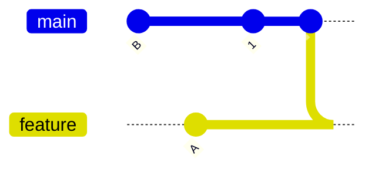
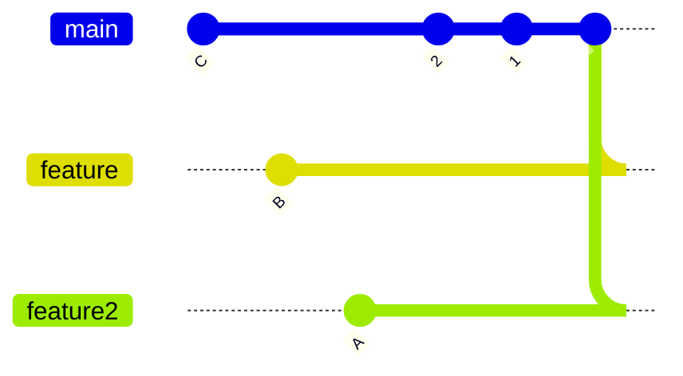
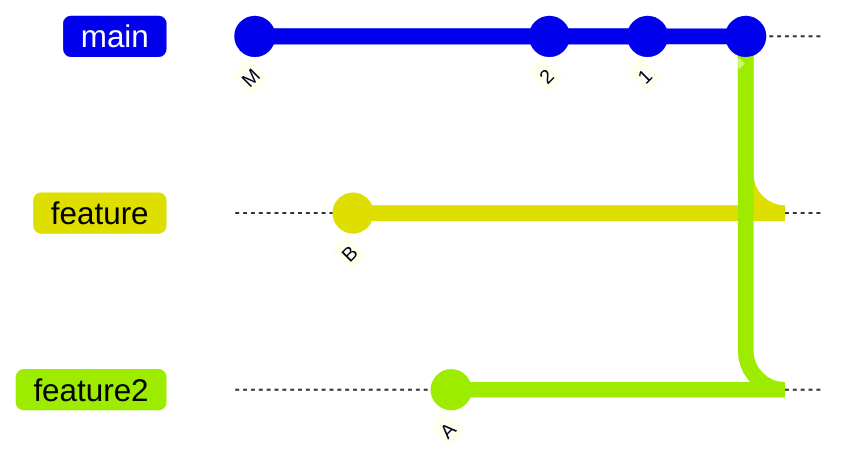

# topology

- [topology](#topology)
    - [네트워크에서 topology](#네트워크에서-topology)
    - [git에서 topology](#git에서-topology)

## 네트워크에서 topology

## git에서 topology

여기서 말하는 "토폴로지(topology)"는 네트워크 토폴로지와 유사한 개념으로, Git 저장소 내에서 커밋들이 어떻게 연결되어 있는지를 나타내는 구조를 의미합니다.

- 네트워크 토폴로지에서는 *`노드`와 `링크`가 네트워크의 물리적 또는 논리적 구조를 정의*
- Git 토폴로지에서는 *`커밋`과 `그 부모 관계`가 저장소의 구조를 정의*

Git 토폴로지는 커밋들이 어떻게 연결되어 있는지를 시각적으로 표현하며, 이를 통해 특정 커밋이 다른 커밋의 조상인지, 또는 두 커밋이 공통 조상을 가지는지를 쉽게 파악할 수 있습니다.

예를 들어, 다음과 같은 Git 토폴로지를 생각해 봅시다:

// TODO 수정 필요

이 토폴로지에서 `A`와 `B` 사이의 merge base는 `1`입니다. 이는 `1`이 `A`와 `B` 모두에서 도달할 수 있는 공통 조상이기 때문입니다.

또 다른 예로, 세 커밋 `A`, `B`, `C`가 주어졌을 때의 토폴로지를 살펴봅시다:

이 토폴로지에서 `git merge-base A B C`의 결과는 `1`입니다. 이는 `B`와 `C` 사이의 가상의 머지 커밋 `M`이 있는 등가 토폴로지에서 `A`와 `M` 사이의 merge base가 `1`이기 때문입니다:

이와 같이, Git 토폴로지는 커밋 간의 관계를 시각적으로 표현하여, 특정 커밋이 다른 커밋의 조상인지, 또는 두 커밋이 공통 조상을 가지는지를 쉽게 파악할 수 있게 해줍니다.
